# 回溯

**第一遍学习时不要考虑剪枝！！！**


## 基础

回溯法也可以叫做回溯搜索法，它是⼀种搜索的⽅式。（属于DFS）

在二叉树系列中，我们已经不止⼀次，提到了回溯，**回溯是递归的副产品，只要有递归就会有回溯**。

**所以以下讲解中，回溯函数也就是递归函数，指的都是⼀个函数。**


---

### 效率

回溯法的性能如何呢，这里要和大家说清楚了，**虽然回溯法很难，很不好理解，但是回溯法并不是什么高效的算法**。

**因为回溯的本质是穷举，穷举所有可能，然后选出我们想要的答案**，如果想让回溯法⾼效⼀些，可以加⼀些**剪枝**的操作，但也改不了回溯法就是穷举的本质。

那么既然回溯法并不高效为什么还要用它呢？

因为没得选，⼀些问题能暴力搜出来就不错了，撑死了再剪枝⼀下，还没有更高效的解法。


回溯法，一般可以解决如下几种问题：

- 组合问题：N个数里面按一定规则找出k个数的集合
- 切割问题：一个字符串按一定规则有几种切割方式
- 子集问题：一个N个数的集合里有多少符合条件的子集
- 排列问题：N个数按一定规则全排列，有几种排列方式
- 棋盘问题：N皇后，解数独等等


**组合是不强调元素顺序的**，**排列是强调元素顺序**。**组合无序**，**排列有序**，


----

### 理解

回溯法解决的问题都可以**抽象为树形结构**，是的，我指的是**所有**回溯法的问题都可以抽象为树形结构！

因为回溯法解决的都是在**集合**中**递归查找子集**，**集合的大小**就构成了树的宽度，**递归的深度**构成了树的深度。

递归就要有终止条件，所以必然是⼀颗**高度有限**的树（N叉树）。


---

### 模板

在讲二叉树的递归中我们说了**递归三部曲**，这⾥我再给⼤家列出**回溯三部曲**。

递归三要素

1. **确定递归函数的参数和返回值**：确定哪些参数是递归过程中需要处理的，就在函数中加此参数。并且还要明确每次递归的返回值，确定递归函数返回类型。
2. **确定终止条件**：防止栈溢出。
3. **确定单层递归的逻辑**：确定每层递归要处理的信息。


回溯三部曲

1. **回溯函数模板返回值以及参数**

回溯算法中函数返回值⼀般为 void。再来看⼀下参数，因为回溯算法需要的参数可不像⼆叉树递归的时候那么容易⼀次性确定下来，所以⼀般是先写逻辑，然后需要什么参数，就填什么参数。

```c++
void backtracking(参数)
```


2. **回溯函数终止条件**

既然是**树形结构**，那么我们在讲解⼆叉树的递归的时候，就知道遍历树形结构⼀定要有终止条件。所以回溯也有要终止条件。

什么时候达到了终止条件，树中就可以看出，⼀般来说**搜到叶子节点**了，也就找到了满⾜条件的⼀条答案，把这个答案存放起来，并结束本层递归。

```c++
if (终止条件) {
    存放结果;
    return;
}
```


3. **回溯搜索的遍历过程**

在上⾯我们提到了，回溯法⼀般是在**集合中递归搜索**，集合的大小构成了树的宽度，递归的深度构成的树的深度。

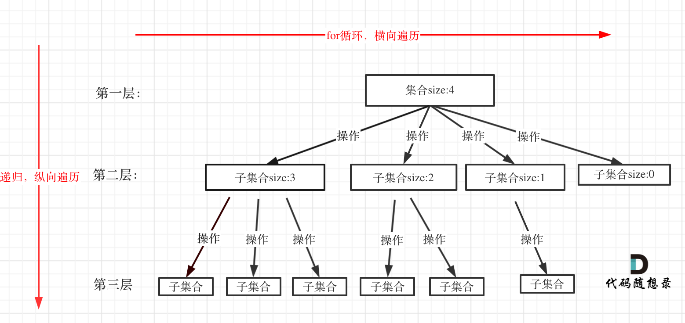

注意图中，特意举例集合大小和孩子的数量是相等的！回溯函数遍历过程伪代码如下：

```c++
for (选择: 本层集合中元素（树中节点孩子的数量就是集合的大小）) {
    处理节点;
    backtracking(路径, 选择列表); //递归
    回溯，撤销处理结果;
}
```

`for` 循环就是遍历集合区间，可以理解⼀个节点有多少个孩子，这个 `for` 循环就执⾏多少次。`backtracking` 这⾥自己调用自己，实现递归。

从图中看出 `for` 循环可以理解是横向遍历，`backtracking`（递归）就是纵向遍历，这样就把这棵树全遍历完了，⼀般来说，搜索叶子节点就是找的其中⼀个结果了。

分析完过程，回溯算法模板框架如下：

```c++
void backtracking(参数) {
	if (终止条件) {
        存放结果;
        return;
    }
    
    for (选择: 本层集合中元素（树中节点孩子的数量就是集合的大小）) {
        处理节点;
        backtracking(路径, 选择列表); //递归
        回溯，撤销处理结果;
    }
}
```


---

## 494. 目标和

```c++
int cnt = 0;
void bt(int target, vector<int> &nums, int i, int sumn) {
    if (i == nums.size()) {
        if (target == sumn) {
            cnt++;
        }
        return;
    }

    bt(target, nums, i+1, sumn+nums[i]);
    bt(target, nums, i+1, sumn-nums[i]);

    return;
}

int findTargetSumWays(vector<int>& nums, int target) {
    bt(target, nums, 0, 0);
    return cnt;
}
```


注意 bt 主体是

```c++
bt(target, nums, i+1, sumn+nums[i]);
bt(target, nums, i+1, sumn-nums[i]);
```

这是因为它只有两个选择，相当于

```c++
for (auto ops : {'-', '+'})	{
    bt(target, nums, i+1, sumn op nums[i]);
}
```

相当于展开写了


---

## 2. 组合

### 77. 组合

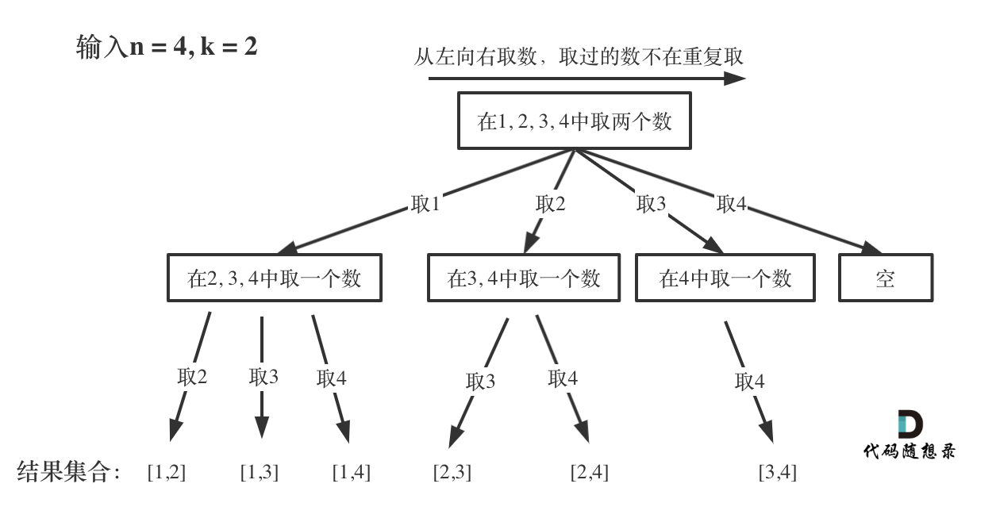

**取过的数，不在重复取**

**图中每次搜索到了叶⼦节点，我们就找到了⼀个结果。**

**图中可以发现n相当于树的宽度，k相当于树的深度。**


1. **回溯函数模板返回值以及参数**

```c++
void backtracking(int n, int k, int start);
// n上限数字 k上限个数 start当前取到的数字
```


2. **回溯函数终止条件**

**搜到叶子节点**了，也就找到了满⾜条件的⼀条答案，把这个答案存放起来，并结束本层递归。

```c++
if (resT.size() == k) {
    存放结果;
    return;
}
```


3. **回溯搜索的遍历过程**

回溯法⼀般是在**集合中递归搜索**，集合的大小构成了树的宽度，递归的深度构成的树的深度。

```c++
for (int i = start; i < n; ++i) {
    resT.push_back(i);
    backtracking(n, k, i + 1); //递归
    resT.pop_back();
}
```


注意下边的优化，要**全局变量/引用**，不要传值(堆栈会爆内存)

```C++
// 	24 ms	9.7 MB
vector<vector<int>> res;
vector<int> resT;

void dfs(int start, int cnt, int n, int k) {
    if (cnt == k) {
        res.push_back(resT);
    }

    for (int i = start + 1; i <= n; ++i) {
        resT.push_back(i);
        dfs(i, cnt + 1, n, k);
        resT.pop_back();
    }

    return;
}

vector<vector<int>> combine(int n, int k) {
    vector<int> resT;
    dfs(0, 0, n, k);    

    return res;
}


```


```C++
// 	24 ms	9.7 MB
vector<vector<int>> res;
    
void dfs(int start, int cnt, int n, int k, vector<int> &resT) {
    if (cnt == k) {
        res.push_back(resT);
    }

    for (int i = start + 1; i <= n; ++i) {
        resT.push_back(i);
        dfs(i, cnt + 1, n, k, resT);
        resT.pop_back();
    }

    return;
}

vector<vector<int>> combine(int n, int k) {
    vector<int> resT;
    dfs(0, 0, n ,k, resT);    

    return res;
}
```


```C++
//548 ms	164.4 MB
vector<vector<int>> res;
    
void dfs(int start, int cnt, int n, int k, vector<int> resT) {
    if (cnt == k) {
        res.push_back(resT);
    }

    for (int i = start + 1; i <= n; ++i) {
        resT.push_back(i);
        dfs(i, cnt + 1, n, k, resT);
        resT.pop_back();
    }

    return;
}

vector<vector<int>> combine(int n, int k) {
    vector<int> resT;
    dfs(0, 0, n ,k, resT);    

    return res;
}
```


**剪枝**


---

### 216. 组合总和III


1. **回溯函数模板返回值以及参数**

```c++
void backtracking(int n, int k, int start, int sum);
// n上限数字 k上限个数 start当前取到的数字
```


2. **回溯函数终止条件**

**搜到叶子节点**了，也就找到了满⾜条件的⼀条答案，把这个答案存放起来，并结束本层递归。

```c++
if (resT.size() == k && sum == n) {
    存放结果;
    return;
}
```


3. **回溯搜索的遍历过程**

回溯法⼀般是在**集合中递归搜索**，集合的大小构成了树的宽度，递归的深度构成的树的深度。

```c++
for (int i = start; i <= 9; ++i) {
    if (sum + i <= n) {
        resT.push_back(i);
        sum += i;
        backtracking(n, k, i + 1); //递归
        sum -= i;
        resT.pop_back();
    }
}
```


```c++
vector<vector<int>> res;
vector<int> resT;

void dfs(int k, int n, int start, int sum) {
    if (resT.size() == k && sum == n) {
        res.push_back(resT);
        return;
    }

    for (int i = start; i <= 9; ++i) {
        if (sum + i <= n) {		//这里不剪枝 也不会降低效率
            resT.push_back(i);
            sum += i;
            dfs(k, n, i+1, sum);
            sum -= i;
            resT.pop_back();
        }
    }


    return;
}

vector<vector<int>> combinationSum3(int k, int n) {
    dfs(k, n, 1, 0);

    return res;
}
```


---

### 17. 电话号码的字母组合

```c++
vector<string> res;
string resT;

char a[10][4] = {{}, {}, {'a', 'b', 'c'}, {'d', 'e', 'f'}, {'g', 'h', 'i'}, 
                 {'j', 'k', 'l'}, {'m', 'n', 'o'}, {'p', 'q', 'r', 's'}, {'t', 'u', 'v'}, {'w', 'x', 'y', 'z'} };

void dfs(string &digits, int start){
    if (resT.size() == digits.size()) {
        res.push_back(resT);
        return;
    }

    for (int i = start; i < digits.size(); ++i) {
        int number = digits[i] - '0';
        for (int j = 0; j <= 3; ++j) {
            char c = a[number][j];
            if (c != '\000') {	
                resT.push_back(c);
                dfs(digits, i+1);
                resT.pop_back();
            }
        }
    }   


    return;     
}

vector<string> letterCombinations(string digits) {
    if (digits.size() == 0) return res;     

    dfs(digits, 0);

    return res;
}
```


**优化**

```c++
const string letterMap[10] = {
    "", // 0
    "", // 1
    "abc",  // 2
    "def",  // 3
    "ghi",  // 4
    "jkl",  // 5
    "mno",  // 6
    "pqrs", // 7
    "tuv",  // 8
    "wxyz", // 9
};
```

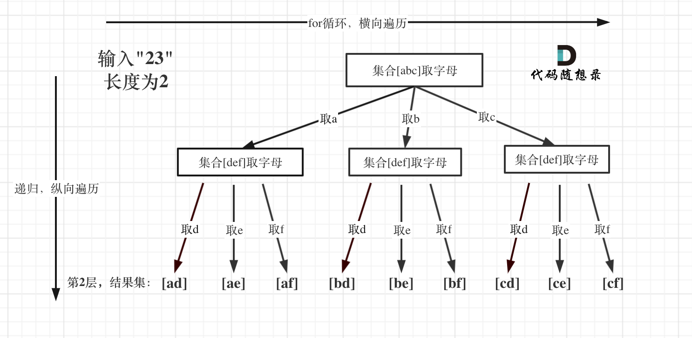


---

### 39. 组合总和

```c++
vector<vector<int>> res;
vector<int> resT;

void dfs(int sum, int target, vector<int>& candidates, int start){
    if (sum == target) {
        res.push_back(resT);
        return;
    }

    for (int i = start; i < candidates.size(); ++i) {
        if (sum + candidates[i] <= target) {
            resT.push_back(candidates[i]);
            sum += candidates[i];
            dfs(sum, target, candidates, i);
            sum -= candidates[i];
            resT.pop_back();
        }
    }

    return;
}

vector<vector<int>> combinationSum(vector<int>& candidates, int target) {


    dfs(0, target, candidates, 0);
    return res;
}
```

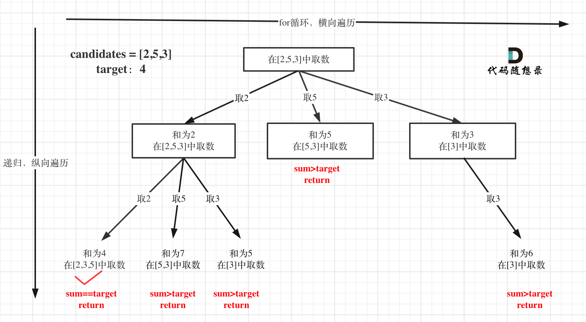


对总集合排序之后，如果下⼀层的sum（就是本层的 sum + candidates[i]）已经⼤于target，就可以结束本轮for循环的遍历。

```c++
for (int i = startIndex; i < candidates.size() && sum + candidates[i] <=
target; i++)
    
sort(candidates.begin(), candidates.end()); // 需要排序
```


---

### 40. 组合总和II

本题的难点在于区别2中：集合（数组candidates）有重复元素，但还不能有重复的组合。

```c++
vector<vector<int>> res;
vector<int> resT;

void dfs(vector<int>& candidates, int target, int sum, int start) {
    if (sum == target) {
        res.push_back(resT);
        return;
    }

    for (int i = start; i < candidates.size(); ++i) {
        if (i > 0 && candidates[i] == candidates[i-1]  && i > start) {
            continue;
        }
        if (sum + candidates[i] <= target) {
            sum += candidates[i];
            resT.push_back(candidates[i]);
            dfs(candidates, target, sum, i+1);
            resT.pop_back();
            sum -= candidates[i];
        }
    }

    return;
}


vector<vector<int>> combinationSum2(vector<int>& candidates, int target) {
    sort(candidates.begin(), candidates.end());
    dfs(candidates, target, 0, 0);

    return res;
}
```


如果 candidates[i] == candidates[i - 1] 并且 used[i - 1] == false ，就说明：前⼀个树枝，使⽤了candidates[i - 1]，也就是说**同⼀树层**使用过candidates[i - 1]。

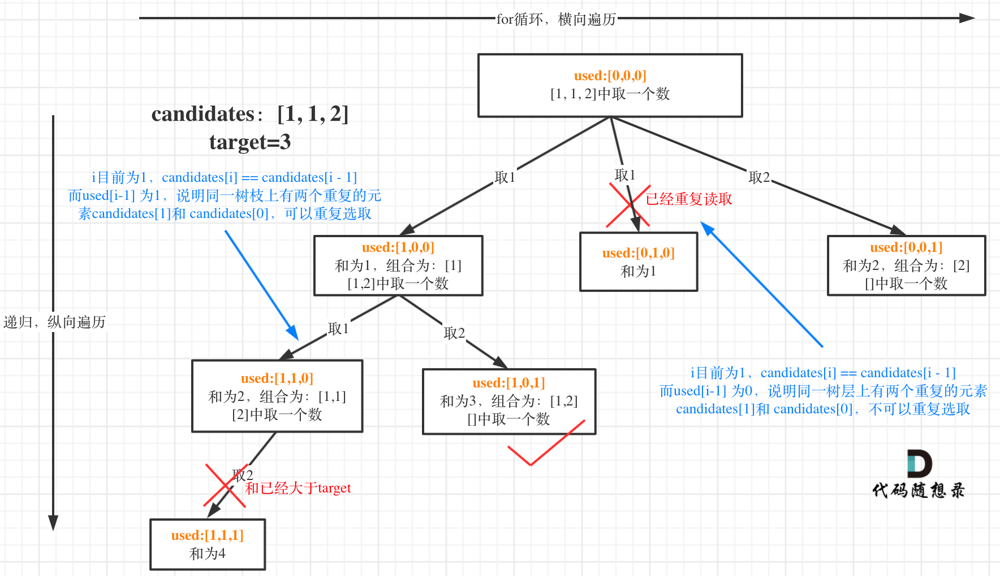


在图中将 used 的变化用橘黄色标注上，可以看出在 candidates[i] == candidates[i - 1] 相同的情况下：
used[i - 1] == true，说明同⼀**树支** candidates[i - 1] 使用过 （还没回溯）
used[i - 1] == false，说明同⼀**树层** candidates[i - 1] 使用过（回溯过了）


```c++
vector<vector<int>> result;
vector<int> path;
void backtracking(vector<int>& candidates, int target, int sum, int
    startIndex, vector<bool>& used) {
    if (sum == target) {
        result.push_back(path);
        return;
    }
    
    for (int i = startIndex; i < candidates.size() && sum + candidates[i]
    <= target; i++) {
        // used[i - 1] == true，说明同⼀树⽀candidates[i - 1]使⽤过
        // used[i - 1] == false，说明同⼀树层candidates[i - 1]使⽤过
        // 要对同⼀树层使⽤过的元素进⾏跳过
        if (i > 0 && candidates[i] == candidates[i - 1] && used[i - 1] ==
        false) continue;
        
        sum += candidates[i];
        path.push_back(candidates[i]);
        used[i] = true;
        
        backtracking(candidates, target, sum, i + 1, used); // 和39.组合总和的区别1，这⾥是i+1，每个数字在每个组合中只能使⽤⼀次
            
        used[i] = false;
        sum -= candidates[i];
        path.pop_back();
    }
}

vector<vector<int>> combinationSum2(vector<int>& candidates, int target) {
	vector<bool> used(candidates.size(), false);
    path.clear();
    result.clear();
    // ⾸先把给candidates排序，让其相同的元素都挨在⼀起。
    sort(candidates.begin(), candidates.end());
    backtracking(candidates, target, 0, 0, used);
    return result;
}
```


**set去重**

```c++
vector<vector<int>> result;
vector<int> path;

void backtracking(vector<int>& candidates, int target, int sum, int
startIndex) {
    if (sum == target) {
        result.push_back(path);
        return;
    }
    
    unordered_set<int> uset; // 控制某⼀节点下的同⼀层元素不能重复
    for (int i = startIndex; i < candidates.size() && sum + candidates[i]
    <= target; i++) {
        if (uset.find(candidates[i]) != uset.end()) continue;
        
        uset.insert(candidates[i]); // 记录元素
        sum += candidates[i];
        path.push_back(candidates[i]);
        
        backtracking(candidates, target, sum, i + 1);
        
        sum -= candidates[i];
        path.pop_back();
    }
}

    
vector<vector<int>> combinationSum2(vector<int>& candidates, int target) {
    path.clear();
    result.clear();
    sort(candidates.begin(), candidates.end());
        backtracking(candidates, target, 0, 0);
    return result;
}
```


---

## 3. 分割

### 131. 分割回文串

其实切割问题类似组合问题。

例如对于字符串abcdef：
组合问题：选取⼀个a之后，在bcdef中再去选取第⼆个，选取b之后在cdef中在选组第三个.....。
切割问题：切割⼀个a之后，在bcdef中再去切割第⼆段，切割b之后在cdef中在切割第三段.....。

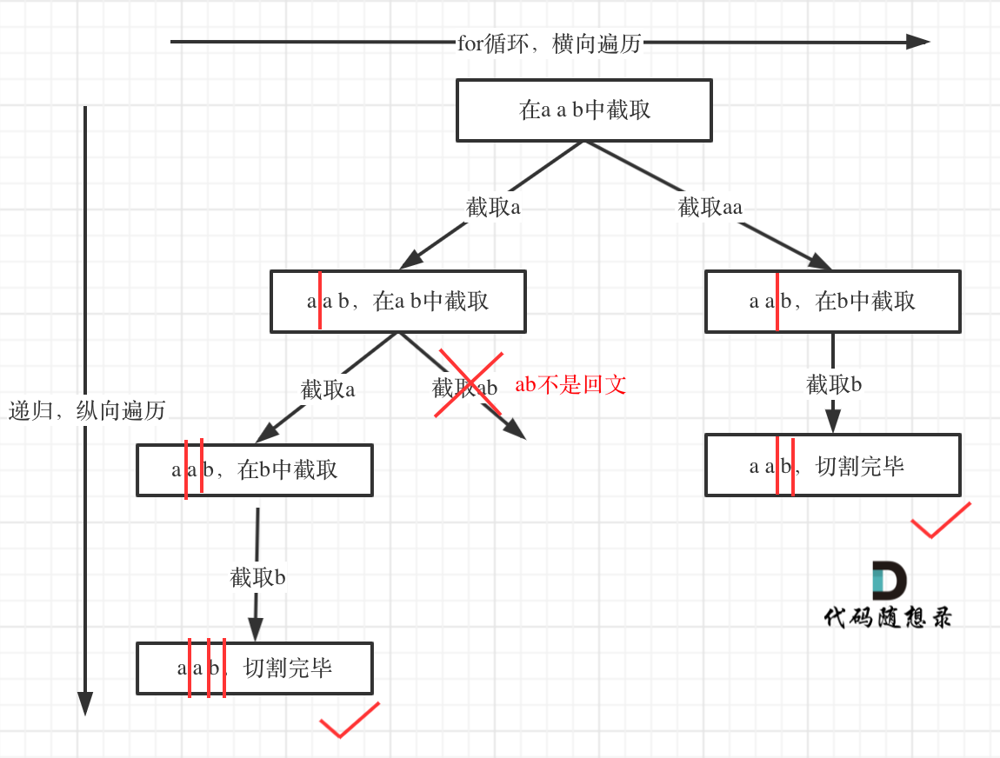


```c++
vector<vector<string>> res;
vector<string> resT;

bool check(string &s, int start, int end) {
    for (int i = start, j = end; i < j; ++i, --j) {
        if (s[i] != s[j])
            return false;
    }
    return true;
}

void dfs(string &s, int start) {
    if (start == s.size()) {
        res.push_back(resT);
        return;
    }

    for (int end = start; end < s.size(); ++end) {	//start 
        if (check(s, start, end)) {
            resT.push_back(s.substr(start, end-start+1));
            dfs(s, end+1);
            resT.pop_back();
        }
    }                  
}

vector<vector<string>> partition(string s) {
    dfs(s, 0);
    return res;
}   
```


---

### 93. 复原IP地址

```c++
vector<string> res;

bool isValid(string s) {	// 判断数字是否合法
    if (s.size() == 1) return true;
    if (s[0] - '0' == 0 || s.size() > 3) return false;

    long long num = 0;
    for (int i = 0; i < s.size(); ++i) {
        num = num*10L + s[i] - '0';
    }

    return num > 255 ? false : true;
}


void dfs(string &s, int start, string sT, int cnt) {
    if (cnt > 4) {
        return;
    }

    if (start == s.size() && cnt == 4) {
        sT = sT.substr(0, sT.size()-1);
        res.push_back(sT);
    }

    for (int end = start; end <= start+3 && end < s.size(); ++end) {
        if (isValid(s.substr(start, end-start+1))) {
            string tmp = s.substr(start, end-start+1);
            dfs(s, end+1, sT + tmp + '.', cnt+1); //注意这里第二个参数传入end+1
        }
    }

    return;

}


vector<string> restoreIpAddresses(string s) {
    string sT;
    dfs(s, 0, sT, 0);

    return res;
}
```

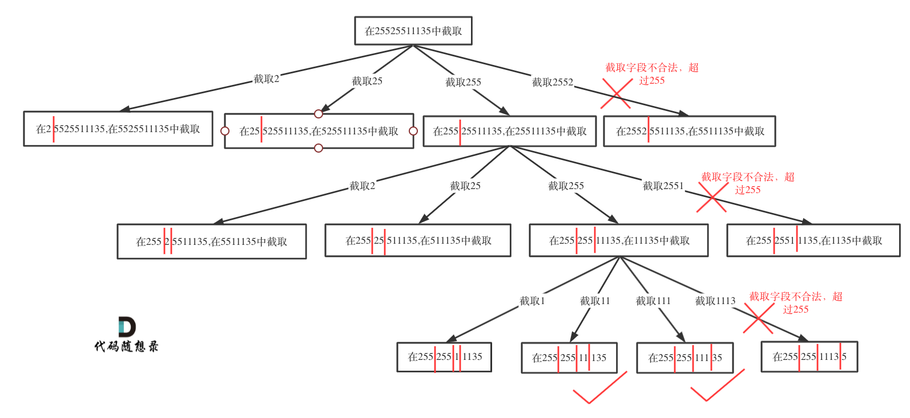


## 4. 子集

### 78. 子集

集合中元素是不同的

```c++
vector<vector<int>> res;
vector<int> resT;
void dfs(vector<int>& nums, int start){
    if (start >= nums.size()) {
        return;
    }
    res.push_back(resT);


    for (int i = start; i < nums.size(); ++i) {
        resT.push_back(nums[i]);
        dfs(nums, i + 1);
        resT.pop_back();
    }

    return;
}

vector<vector<int>> subsets(vector<int>& nums) {
    sort(nums.begin(), nums.end());
    dfs(nums, 0);
    return res;
}
```

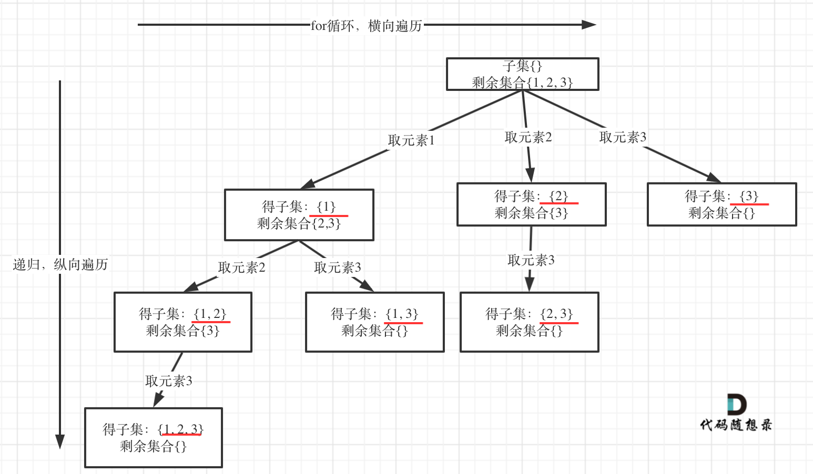


### 491. 递增子序列

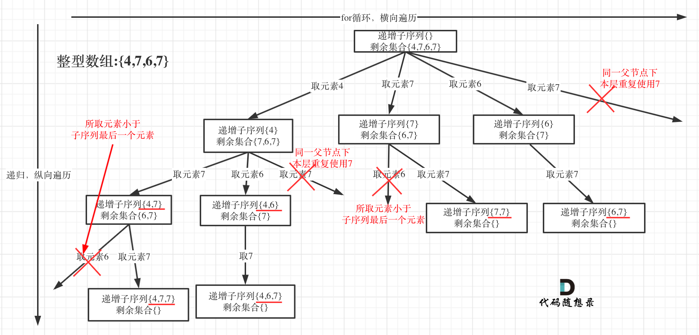


在图中可以看出，同⼀父节点下的同层上使用过的元素就不能在使用了

```c++
vector<vector<int>> res;
vector<int> resT;
void dfs(vector<int>& nums, int start) {
    if (resT.size() >= 2) {
        res.push_back(resT);
    }

    unordered_set<int> uset;

    for (int i = start; i < nums.size(); ++i) {
        if (uset.find(nums[i]) != uset.end()) {
            continue;
        }

        if (resT.size() == 0 || nums[i] >= resT.back()) {
            uset.insert(nums[i]);
            resT.push_back(nums[i]);
            dfs(nums, i+1);
            resT.pop_back();
        }
    }

    return;
}

vector<vector<int>> findSubsequences(vector<int>& nums) {

    dfs(nums, 0);
    return res;
}
```


---

### 90. 子集II

集合中元素可以相同

```c++

    vector<vector<int>> res;
    vector<int> resT;

    void dfs(vector<int>& nums, int start) {
        res.push_back(resT);

        unordered_set<int> uset;
        for (int i = start; i < nums.size(); ++i) {
            if (uset.find(nums[i]) != uset.end()) {
                continue;
            }
            uset.insert(nums[i]);
            resT.push_back(nums[i]);
            dfs(nums, i+1);
            resT.pop_back();
        }

        return;
    }


    vector<vector<int>> subsetsWithDup(vector<int>& nums) {
        sort(nums.begin(), nums.end()); // ！！！！！！！！！！！！
        dfs(nums, 0);
        return res;
    }

```


---

## 5. 排列

### 46. 全排列

```c++
vector<vector<int>> res;
vector<int> resT;  
unordered_set<int> uset;

void dfs(vector<int>& nums) {
    if (resT.size() == nums.size()) {
        res.push_back(resT);
        return;
    }


    for (int i = 0; i < nums.size(); ++i) {
        if (uset.find(nums[i]) == uset.end()) {
            uset.insert(nums[i]);
            resT.push_back(nums[i]);
            dfs(nums);
            resT.pop_back();
            uset.erase(nums[i]);
        }
    }


    return;
}

vector<vector<int>> permute(vector<int>& nums) {
    //sort(nums.begin(), nums.end());
    dfs(nums);

    return res;
}   
```


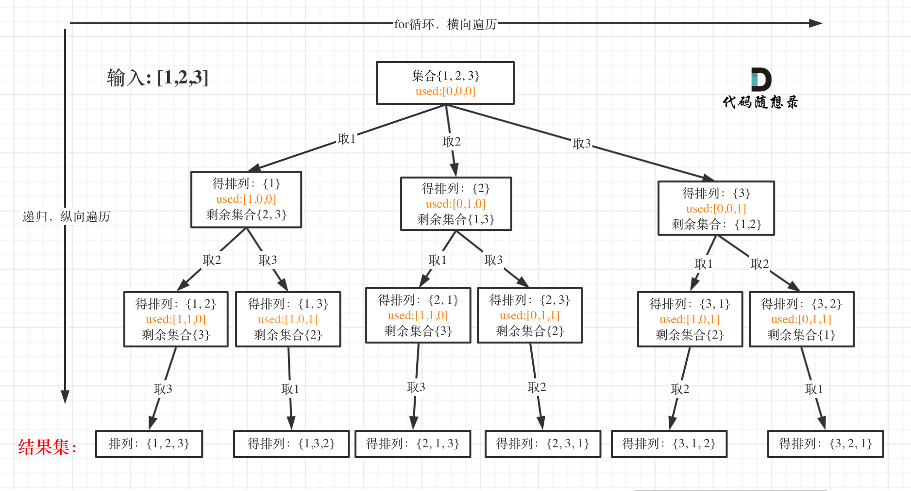


---

### 47. 全排列 II


```c++
vector<vector<int>> res;
vector<int> resT;
unordered_set<int> uset;  // 存下标

void dfs(vector<int>& nums) {
    if (resT.size() == nums.size()) {
        res.push_back(resT);
        return;
    }

    unordered_set<int> uuset; // 存数字

    for (int i = 0; i < nums.size(); ++i) {
        if (uuset.find(nums[i]) != uuset.end())
            continue;

        if (uset.find(i) == uset.end()) {
            uuset.insert(nums[i]);
            uset.insert(i);
            resT.push_back(nums[i]);
            dfs(nums);
            resT.pop_back();
            uset.erase(i);
        }

    }

    return;
}


vector<vector<int>> permuteUnique(vector<int>& nums) {
    dfs(nums);
    return res;
}
```

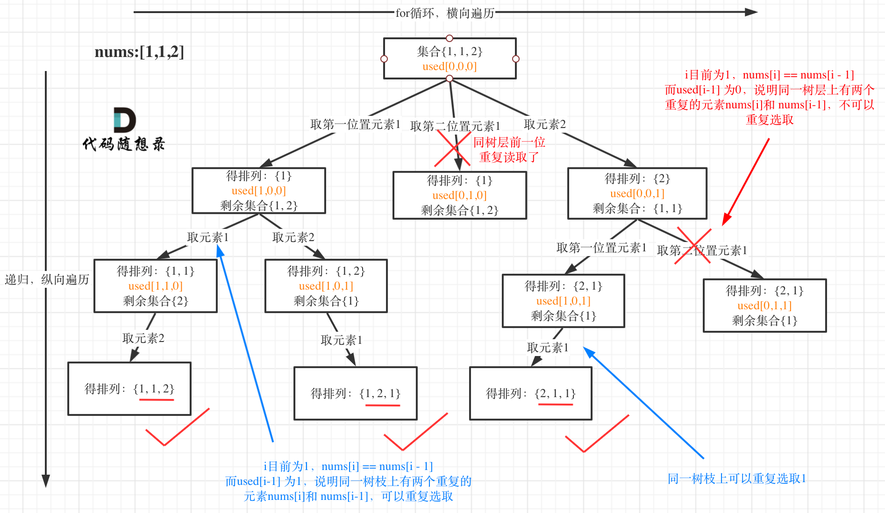


---

## 6. 棋盘问题

### 51. N皇后

同一行/列/斜线 不能有两个Queen

1. **回溯函数模板返回值以及参数**

```c++
vector<vector<string>> result;
void bt(int cnt, int n, vector<string> &queen, vector<vector<int>> &attack, vector<vector<string>> &solve)
```

参数n是棋牌的大小，然后用 cnt 来记录当前遍历到棋盘的第几行了。


2. **回溯函数终止条件**

```c++
if (cnt == n) {     //放皇后的数目, 也表示行数
    solve.push_back(queen);
    return;
}
```


3. **回溯搜索的遍历过程**

递归深度就是 cnt 控制棋盘的行，每⼀层里 for 循环的 col 控制棋盘的**列**，一行一列，确定了放置皇后的位置。每次都是要从新的一行的起始位置开始搜，所以都是从 0 开始。

```c++
for (int i = 0; i < n; ++i) {
    if(attack[cnt][i] == 0) {
        queen[cnt][i] = 'Q';
        vector<vector<int>> tmp = attack;
        putQueen(cnt, i, attack);
        bt(cnt+1, n, queen, attack, solve);
        attack = tmp;
        queen[cnt][i] = '.';
    }
}
```


**放 Queen，更新 Attack数组**

```c++
void putQueen(int x, int y, vector<vector<int>> &attack) {
    int dx[8] = {-1, 0, 1, -1, 1, -1, 0, 1};
    int dy[8] = {-1, -1, -1, 0, 0, 1, 1, 1};
    attack[x][y] = 1;

    for (int i = 1; i < attack.size(); ++i) {
        for (int j = 0; j < 8; ++j) {
            int ax = x + i * dx[j];
            int ay = y + i * dy[j];

            if (ax >= 0 && ax < attack.size() && ay >=0 && ay < attack.size()) {
                attack[ax][ay] = 1;
            }
        }
    }

}
```


**递归 + 回溯**

```c++
void bt(int cnt, int n, vector<string> &queen, vector<vector<int>> &attack, vector<vector<string>> &solve) {

    if (cnt == n) {     //放皇后的数目, 也表示行数
        solve.push_back(queen);
        return;
    }

    for (int i = 0; i < n; ++i) {
        if(attack[cnt][i] == 0) {
            queen[cnt][i] = 'Q';
            vector<vector<int>> tmp = attack;
            putQueen(cnt, i, attack);
            bt(cnt+1, n, queen, attack, solve);
            attack = tmp;
            queen[cnt][i] = '.';
        }
    }
}
```


**主函数**

```c++
vector<vector<string>> solveNQueens(int n) {
    vector<vector<string>> solve;
    vector<vector<int>> attack;
    vector<string> queen;

    for (int i = 0; i < n; ++i) {	
        attack.push_back(vector<int>());
        for (int j = 0; j < n; ++j) {
            attack[i].push_back(0);
        }
        queen.push_back("");
        queen[i].append(n, '.');
    }


    bt(0, n, queen, attack, solve);


    return solve;
}
```


---

### 37. 解数独

本题中棋盘的每⼀个位置都要放⼀个数字，并检查数字是否合法，解数独的树形结构要比N皇后更宽更深。


1. **回溯函数模板返回值以及参数**

```c++
bool backtracking(vector<vector<char>>& board)
```


2. **回溯函数终止条件**

本题递归不用终止条件，解数独是要遍历整个树形结构寻找可能的叶子节点就立刻返回。

递归的下⼀层的棋盘⼀定比上⼀层的棋盘多⼀个数，等数填满了棋盘自然就终止（填满当然好了，说明找到结果了），所以不需要终止条件


3. **回溯搜索的遍历过程**

⼀个for循环遍历棋盘的行，⼀个for循环遍历棋盘的列，⼀行⼀列确定下来之后，递归遍历这个位置放9个数字的可能性！

```c++
bool backtracking(vector<vector<char>>& board) {
    
    for (int i = 0; i < board.size(); i++) { // 遍历⾏
        for (int j = 0; j < board[0].size(); j++) { // 遍历列
            
            if (board[i][j] != '.') continue;
            
            for (char k = '1'; k <= '9'; k++) { // (i, j) 这个位置放k是否合适
                if (isValid(i, j, k, board)) {
                    board[i][j] = k; // 放置k
                	if (backtracking(board)) return true; // 如果找到合适⼀组⽴刻返回
                    board[i][j] = '.'; // 回溯，撤销k
                }
            }
            return false; // 9个数都试完了，都不行，那么就返回false
        }
    }
    return true; // 遍历完没有返回false，说明找到了合适棋盘位置了
}
```

注意这里 return false的地方：因为如果⼀行一列确定下来了，这⾥尝试了9个数都不行，说明这个棋盘找不到解决数独问题的解！

那么会直接返回， 这也就是为什么没有终止条件也不会永远填不满棋盘而无限递归下去！


**判断棋盘是否合法有如下三个维度**：

同行是否重复
同列是否重复
9宫格里是否重复

```c++
bool isValid(int row, int col, char val, vector<vector<char>>& board) {
    for (int i = 0; i < 9; i++) { // 判断行里是否重复
        if (board[row][i] == val) {
        	return false;
        }
    }
    
    for (int j = 0; j < 9; j++) { // 判断列里是否重复
        if (board[j][col] == val) {
            return false;
        }
    }
    
    int startRow = (row / 3) * 3;
    int startCol = (col / 3) * 3;
    
    for (int i = startRow; i < startRow + 3; i++) { // 判断9方格里是否重复
        for (int j = startCol; j < startCol + 3; j++) {
            if (board[i][j] == val ) {
                return false;
            }
        }
    }
    return true;
}
```


---

## 7. 其他

### 去重

```c++
sort(nums.begin(), nums.end()); // 排序
vector<bool> used(nums.size(), false);
```


大家发现，去重最为关键的代码为：

```c++
if (i > 0 && nums[i] == nums[i - 1] && used[i - 1] == false) { 
    continue;
}
```

**「如果改成 `used[i - 1] == true`， 也是正确的!」**，去重代码如下：

```c++
if (i > 0 && nums[i] == nums[i - 1] && used[i - 1] == true) { 
    continue;
}
```

这是为什么呢，就是上面我刚说的，如果要对树层中前一位去重，就用`used[i - 1] == false`，如果要对树枝前一位去重用`used[i - 1] == true`。

**「对于排列问题，树层上去重和树枝上去重，都是可以的，但是树层上去重效率更高！」**


树层上去重(used[i - 1] == false)，的树形结构如下：

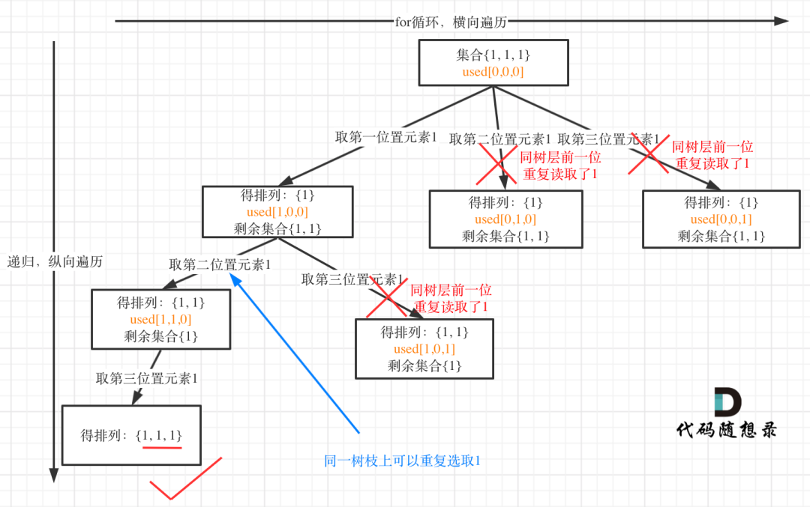


树枝上去重（used[i - 1] == true）的树型结构如下：

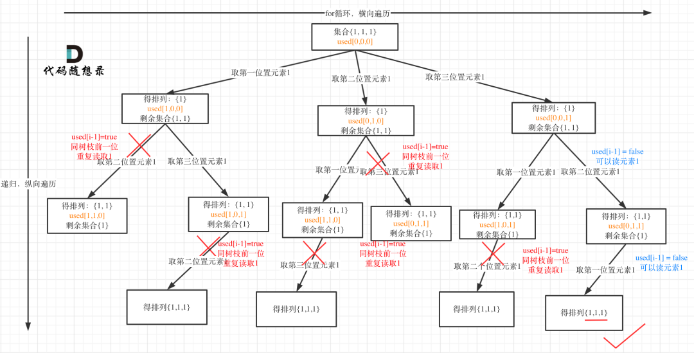

**大家应该很清晰的看到，树层上对前一位去重非常彻底，效率很高，树枝上对前一位去重虽然最后可以得到答案，但是做了很多无用搜索。**


需要注意的是：使用set去重的版本相对于used数组的版本效率都要低很多。

原因在回溯算法：递增子序列中也分析过，主要是因为程序运行的时候对unordered_set 频繁的 insert，unordered_set 需要做哈希映射（也就是把key通过hash function映射为唯⼀的哈希值）相对费时间，而且insert的时候其底层的符号表也要做相应的扩充，也是费时的。而使用used数组在时间复杂度上几乎没有额外负担！

使用set去重，不仅时间复杂度高了，空间复杂度也高了，组合，子集，排列问题的空间复杂度都是O(n)，但如果使用set去重，空间复杂度就变成了O(n^2)，因为每⼀层递归都有⼀个set集合，系统栈空间是n，每⼀个空间都有set集合。

而used数组可是全局变量，每层与每层之间公用⼀个used数组，所以空间复杂度是O(n + n)，最终空间复杂度还是O(n)。


----

### 332. 重新安排行程

```c++
class Solution {
public:
    vector<string> resT;
    vector<vector<string>> res;
    int ticketNum = 0;

    void dfs(unordered_map<string, map<string, int>> &umap, string start, int cnt) {
        if (cnt == ticketNum) {
            res.push_back(resT);
            return ;
        }


        for (int i = 0; i < umap[start].size(); ++i) {
            string tmp = umap[start][i];
            resT.push_back(tmp);
            umap[start].erase(umap[start].begin() + i);
            dfs(umap, tmp, cnt+1);
            umap[start].insert(umap[start].begin() + i, tmp);
            resT.pop_back();
        }

        return;
    }


    vector<string> findItinerary(vector<vector<string>>& tickets) {
        unordered_map<string, map<string, int>> umap; // ["JFK": "SFO:1", "ATL:1"]

        for (int i = 0; i < tickets.size(); ++i) {
            umap[tickets[i][0]][tickets[i][1]]++;
        }

        // sort umap

        ticketNum = tickets.size();

        resT.push_back("JFK");
        dfs(umap, "JFK", 0);
        //sort(res.begin(), res.end());
        return res[0];
    }
};
```


----

### 491. 递增子序列


在图中可以看出，同⼀父节点下的同层上使用过的元素就不能在使用了

```c++
vector<vector<int>> res;
vector<int> resT;
void dfs(vector<int>& nums, int start) {
    if (resT.size() >= 2) {
        res.push_back(resT);
    }

    unordered_set<int> uset;

    for (int i = start; i < nums.size(); ++i) {
        if (uset.find(nums[i]) != uset.end()) {
            continue;
        }

        if (resT.size() == 0 || nums[i] >= resT.back()) {
            uset.insert(nums[i]);
            resT.push_back(nums[i]);
            dfs(nums, i+1);
            resT.pop_back();
        }
    }

    return;
}

vector<vector<int>> findSubsequences(vector<int>& nums) {

    dfs(nums, 0);
    return res;
}
```


