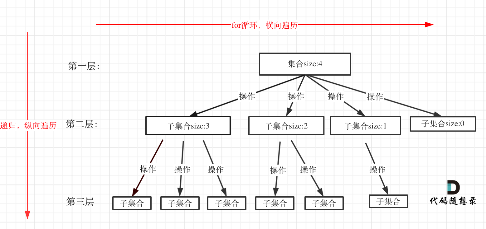
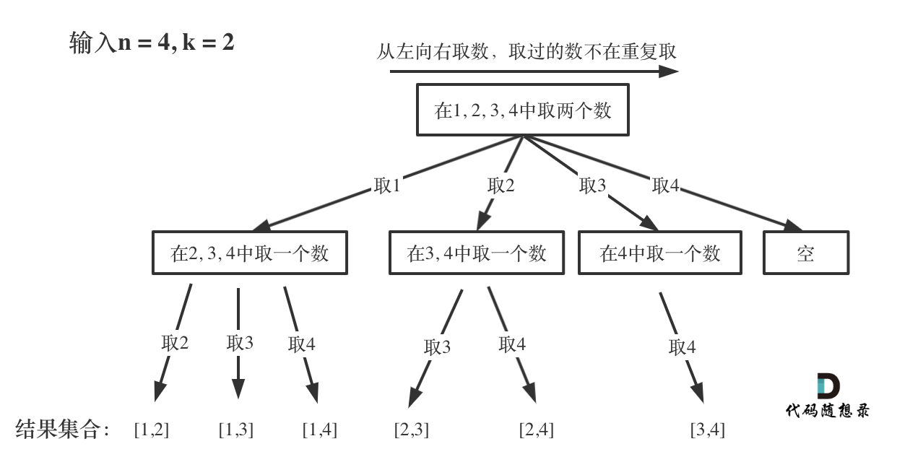

# 回溯

## 基础

回溯法也可以叫做回溯搜索法，它是⼀种搜索的⽅式。

在二叉树系列中，我们已经不止⼀次，提到了回溯，**回溯是递归的副产品，只要有递归就会有回溯**。

**所以以下讲解中，回溯函数也就是递归函数，指的都是⼀个函数。**


---

### 效率

回溯法的性能如何呢，这里要和大家说清楚了，**虽然回溯法很难，很不好理解，但是回溯法并不是什么高效的算法**。

**因为回溯的本质是穷举，穷举所有可能，然后选出我们想要的答案**，如果想让回溯法⾼效⼀些，可以加⼀些**剪枝**的操作，但也改不了回溯法就是穷举的本质。

那么既然回溯法并不高效为什么还要用它呢？

因为没得选，⼀些问题能暴力搜出来就不错了，撑死了再剪枝⼀下，还没有更高效的解法。


回溯法，一般可以解决如下几种问题：

- 组合问题：N个数里面按一定规则找出k个数的集合
- 切割问题：一个字符串按一定规则有几种切割方式
- 子集问题：一个N个数的集合里有多少符合条件的子集
- 排列问题：N个数按一定规则全排列，有几种排列方式
- 棋盘问题：N皇后，解数独等等


**组合是不强调元素顺序的**，**排列是强调元素顺序**。**组合无序**，**排列有序**，


----

### 理解

回溯法解决的问题都可以**抽象为树形结构**，是的，我指的是**所有**回溯法的问题都可以抽象为树形结构！

因为回溯法解决的都是在**集合**中**递归查找子集**，**集合的大小**就构成了树的宽度，**递归的深度**构成了树的深度。

递归就要有终止条件，所以必然是⼀颗**高度有限**的树（N叉树）。


---

### 模板

在讲二叉树的递归中我们说了**递归三部曲**，这⾥我再给⼤家列出**回溯三部曲**。

递归三要素

1. **确定递归函数的参数和返回值**：确定哪些参数是递归过程中需要处理的，就在函数中加此参数。并且还要明确每次递归的返回值，确定递归函数返回类型。
2. **确定终止条件**：防止栈溢出。
3. **确定单层递归的逻辑**：确定每层递归要处理的信息。


回溯三部曲

1. **回溯函数模板返回值以及参数**

回溯算法中函数返回值⼀般为 void。再来看⼀下参数，因为回溯算法需要的参数可不像⼆叉树递归的时候那么容易⼀次性确定下来，所以⼀般是先写逻辑，然后需要什么参数，就填什么参数。

```c++
void backtracking(参数)
```


2. **回溯函数终止条件**

既然是**树形结构**，那么我们在讲解⼆叉树的递归的时候，就知道遍历树形结构⼀定要有终止条件。所以回溯也有要终止条件。

什么时候达到了终止条件，树中就可以看出，⼀般来说**搜到叶子节点**了，也就找到了满⾜条件的⼀条答案，把这个答案存放起来，并结束本层递归。

```c++
if (终止条件) {
    存放结果;
    return;
}
```


3. **回溯搜索的遍历过程**

在上⾯我们提到了，回溯法⼀般是在**集合中递归搜索**，集合的大小构成了树的宽度，递归的深度构成的树的深度。



注意图中，特意举例集合大小和孩子的数量是相等的！回溯函数遍历过程伪代码如下：

```c++
for (选择: 本层集合中元素（树中节点孩子的数量就是集合的大小）) {
    处理节点;
    backtracking(路径, 选择列表); //递归
    回溯，撤销处理结果;
}
```

`for` 循环就是遍历集合区间，可以理解⼀个节点有多少个孩子，这个 `for` 循环就执⾏多少次。`backtracking` 这⾥自己调用自己，实现递归。

从图中看出 `for` 循环可以理解是横向遍历，`backtracking`（递归）就是纵向遍历，这样就把这棵树全遍历完了，⼀般来说，搜索叶子节点就是找的其中⼀个结果了。

分析完过程，回溯算法模板框架如下：

```c++
void backtracking(参数) {
	if (终止条件) {
        存放结果;
        return;
    }
    
    for (选择: 本层集合中元素（树中节点孩子的数量就是集合的大小）) {
        处理节点;
        backtracking(路径, 选择列表); //递归
        回溯，撤销处理结果;
    }
}
```


---

## 2. 组合

### 77. 组合




## 3. 分割


## 4. 子集


## 5. 排列


## 6. 棋盘问题

### 51. N皇后


---

### 37. 解数独


---

## 7. 其他