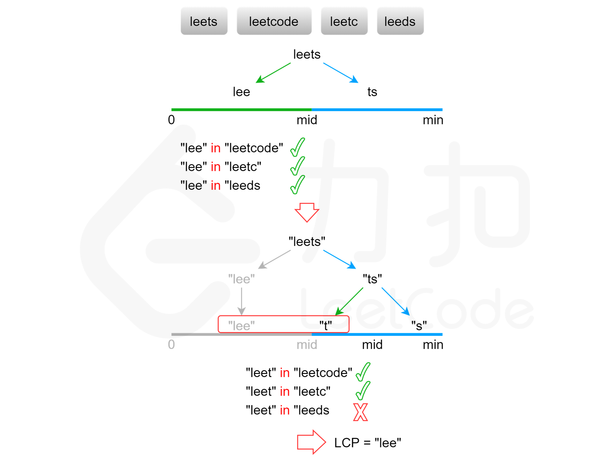

# 二分查找

## 704. 二分查找

定义 target 是在一个在左闭右闭的区间里，**也就是[left, right] （这个很重要非常重要）**。

区间的定义这就决定了二分法的代码应该如何写，**因为定义target在[left, right]区间，所以有如下两点：**

- while (left <= right) 要使用 <= ，因为left == right是有意义的，所以使用 <=
- if (nums[middle] > target) right 要赋值为 middle - 1，因为当前这个nums[middle]一定不是target，那么接下来要查找的左区间结束下标位置就是 middle - 1

```c++
int binartSearch(vector<int> &nums, int left, int right, int target) {
    int mid;
    while (left <= right) {
        mid = left + ((right - left) / 2); // 防止溢出 等同于(left + right)/2
        if (nums[mid] == target) {
            return mid;
        } else if (nums[mid] > target) {
            right = mid - 1;
        } else {
            left = mid + 1;
        }
    }
    
    return -1;
}
```


---

## 35.搜索插入位置

这道题目，要在数组中插入目标值，无非是这四种情况。


- 目标值在数组所有元素之前
- 目标值等于数组中某一个元素
- 目标值插入数组中的位置
- 目标值在数组所有元素之后

```c++
int searchInsert(vector<int>& nums, int target) {
    int n = nums.size();
    int left = 0;
    int right = n - 1; // 定义target在左闭右闭的区间里，[left, right]
    
    while (left <= right) { // 当left==right，区间[left, right]依然有效
        int middle = left + ((right - left) / 2);// 防止溢出 等同于(left + right)/2
        if (nums[middle] > target) {
            right = middle - 1; // target 在左区间，所以[left, middle - 1]
        } else if (nums[middle] < target) {
            left = middle + 1; // target 在右区间，所以[middle + 1, right]
        } else { // nums[middle] == target
            return middle;
        }
    }
    
    // 分别处理如下四种情况
    // 目标值在数组所有元素之前  [0, -1] return  right + 1 (right=-1)
    // 目标值等于数组中某一个元素  return middle;
    // 目标值插入数组中的位置 [left, right]，return  right + 1
    // 目标值在数组所有元素之后的情况 [left, right]， return right + 1
    return right + 1;
}
```


---

## 34.在排序数组中查找元素的第一个和最后一个位置(

寻找target在数组里的左右边界，有如下三种情况：

- 情况一：target 在数组范围的右边或者左边，例如数组{3, 4, 5}，target为2或者数组{3, 4, 5},target为6，此时应该返回{-1, -1}
- 情况二：target 在数组范围中，且数组中不存在target，例如数组{3,6,7},target为5，此时应该返回{-1, -1}
- 情况三：target 在数组范围中，且数组中存在target，例如数组{3,6,7},target为6，此时应该返回{1, 1}


### 寻找右边界

先来寻找右边界，确定好：计算出来的右边界是不包含target的右边界，左边界同理。可以写出如下代码

```c++
// 二分查找，寻找target的右边界（不包括target）
// 如果rightBorder为没有被赋值（即target在数组范围的左边，例如数组[3,3]，target为2），为了处理情况一
int getRightBorder(vector<int>& nums, int target) {
    int left = 0;
    int right = nums.size() - 1; // 定义target在左闭右闭的区间里，[left, right]
    int rightBorder = -2; // 记录一下rightBorder没有被赋值的情况
    
    while (left <= right) { // 当left==right，区间[left, right]依然有效
        int middle = left + ((right - left) / 2);
        
        if (nums[middle] > target) {
            right = middle - 1; // target 在左区间，所以[left, middle - 1]
        } else { // 当nums[middle] == target的时候，更新left，这样才能得到target的右边界
            left = middle + 1;
            rightBorder = left;
        }
    }
    
    return rightBorder;
}
```


### 寻找左边界

```cpp
// 二分查找，寻找target的左边界leftBorder（不包括target）
// 如果leftBorder没有被赋值（即target在数组范围的右边，例如数组[3,3],target为4），为了处理情况一
int getLeftBorder(vector<int>& nums, int target) {
    int left = 0;
    int right = nums.size() - 1; // 定义target在左闭右闭的区间里，[left, right]
    int leftBorder = -2; // 记录一下leftBorder没有被赋值的情况
    while (left <= right) {
        int middle = left + ((right - left) / 2);
        if (nums[middle] >= target) { // 寻找左边界，就要在nums[middle] == target的时候更新right
            right = middle - 1;
            leftBorder = right;
        } else {
            left = middle + 1;
        }
    }
    return leftBorder;
}
```


### 处理三种情况

左右边界计算完之后，看一下主体代码，这里把上面讨论的三种情况，都覆盖了

```cpp
class Solution {
public:
    vector<int> searchRange(vector<int>& nums, int target) {
        int leftBorder = getLeftBorder(nums, target);
        int rightBorder = getRightBorder(nums, target);
        // 情况一
        if (leftBorder == -2 || rightBorder == -2) return {-1, -1};
        // 情况三
        if (rightBorder - leftBorder > 1) return {leftBorder + 1, rightBorder - 1};
        // 情况二
        return {-1, -1};
    }
private:
     int getRightBorder(vector<int>& nums, int target) {
        int left = 0;
        int right = nums.size() - 1;
        int rightBorder = -2; // 记录一下rightBorder没有被赋值的情况
        while (left <= right) {
            int middle = left + ((right - left) / 2);
            if (nums[middle] > target) {
                right = middle - 1;
            } else { // 寻找右边界，nums[middle] == target的时候更新left
                left = middle + 1;
                rightBorder = left;
            }
        }
        return rightBorder;
    }
    int getLeftBorder(vector<int>& nums, int target) {
        int left = 0;
        int right = nums.size() - 1;
        int leftBorder = -2; // 记录一下leftBorder没有被赋值的情况
        while (left <= right) {
            int middle = left + ((right - left) / 2);
            if (nums[middle] >= target) { // 寻找左边界，nums[middle] == target的时候更新right
                right = middle - 1;
                leftBorder = right;
            } else {
                left = middle + 1;
            }
        }
        return leftBorder;
    }
};
```


初学者建议大家一块一块的去分拆这道题目，正如本题解描述，想清楚三种情况之后，先专注于寻找右区间，然后专注于寻找左区间，左右根据左右区间做最后判断。


---

## 69.x 的平方根

二分查找第一个 res^2 大于x的元素，然后再减一

```c++
int mySqrt(int x) {
    int left = 1;  
    int right = x;
    int mid;

    while (left <= right) {
        mid = left + (right - left) / 2;

        if (pow(mid, 2) > x) {
            right = mid - 1;
        } else {
            left  = mid + 1; 
        } 
    }

    return left - 1;
}
```


---

## 367.有效的完全平方数

```c++
bool isPerfectSquare(int num) {
    if (num == 1) return true;
    if (num == 2 | num == 3) return false;

    int left = 0;
    int right = num / 2;
    int mid;
    while (left <= right) {
        mid = left + (right - left) / 2;
        if (pow(mid, 2) > num) {
            right = mid - 1;
        } else if (pow(mid, 2) < num) {
            left = mid + 1;
        } else {
            return true;
        }
    }

    return false;
}
```


---

## 14. 最长公共前缀



最长公共前缀的长度**不会超过**字符串数组中的最短字符串的长度。用 $\textit{minLength}$ 表示字符串数组中的最短字符串的长度，则可以在 $[0,\textit{minLength}]$ 的范围内通过二分查找得到最长公共前缀的长度。每次取查找范围的中间值 $\textit{mid}$，判断每个字符串的长度为 $\textit{mid}$ 的前缀是否相同，如果相同则最长公共前缀的长度一定大于或等于 $\textit{mid}$，如果不相同则最长公共前缀的长度一定小于 $\textit{mid}$，通过上述方式将查找范围缩小一半，直到得到最长公共前缀的长度。

```c++

```

