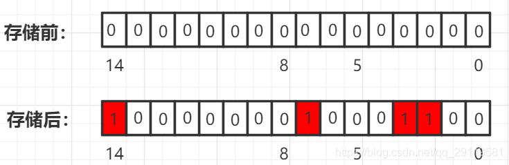

# 位图


## 原理

bitmap，使用每个位表示某种状态，适合处理整型的海量数据。本质上是哈希表的一种应用实现


原理：给定一个 int 整形数据，将该 int 整数映射道对应的位上，并将该位由 0 改为 1




有两组数据分别是40亿个QQ号码和60亿个QQ号码，需要查找它们之间重合的数据。如果使用暴力查找一一匹配的话，时间和空间是都吃不消，时间和空间的复杂度很高，很不适用；如果使用分治法分批处理的话，内存可以降低，但是时间复杂度依然很高，也不太适用。如果使用位图的话，就可以很好的解决这个问题，时间空间上都吃的消。

在 C++ 中，整型占 32 位 4 个字节。如果使用暴力查找和分治法的话，每个数据都需要占这么多内存，但是如果使用位图，每 32 个数据只需要占一个整型的内存，在整型的**每个位上存储某个数据是否存在的状态**，存在为 1， 不存在则为 0，用第一个整型保存 id 是 0-31 的qq号的状态，第二个整型保存 id是 32-63 的qq号的状态，直接节省 32 倍的内存空间，而查找单个元素的时间复杂度只有 $O(1)$

存储数据的大小应该为 `size/32 + 1`, 

`num/32` 是数据访问下标

`num%32` 是数据所在的比特位

插入数据把对应位比特值置 1

删除数据把对应位比特值置 0

查找就是判断对应位比特值是否是 1


```c++
class BitMap {
public:
    BitMap(const size_t &range) {
        if (bits != nullptr) {
            delete[] bits;
        }
        
        count = range;
        size = range / 32 + 1;
        bits = new unsigned int[size];
    }
    
    ~BitMap() {
        delete[] bits;
    }
    
    void init() {
        for (int i = 0; i < size; ++i) bits[i] = 0;
    }
    
    void add(const size_t &num) {
        if (num > count)
            return;
       	int idx = num / 32;
        int bitIdx = num % 32;
        bist[idx] |= 1 << bitIdx;
    }
    
private:
    unsigned int* bits = nullptr;
    int size;
    int count;
}
```


----

## 模板

```c++
class BitMap {
    char bytes[];
    int nBits;
    
    BitMap(int _nBits) {
        this.nBits = _nBits;
		this.bytes = new char(_nBits / 16  + 1);	// 一个字符占2字节
    } 
}
```


## 应用场景

查询统计、定位查询、排序、去重

取两个集合的交集、并集


## 287. 寻找重复数

```c++
int findDuplicate(vector<int>& nums) {
    bitset<100001> a;
    for(auto& i:nums){
        if(a[i])  return i;
        else      a[i]=1;
    }
    return 0;
}
```


```c++
class Solution {
public:
    bool isBitZero(vector<int> &flag,int bit){
        int t = 1<<(bit%32);
        int res = flag[bit/32]&t;
        return res == 0;
    }
    void setBit(vector<int> &flag,int bit){
        int t = 1<<(bit%32);
        flag[bit/32] |= t;
    }
    int findDuplicate(vector<int>& nums) {
        int x = nums.size();
        vector<int>flag(x+1,0);
        int res = 0;
        for(int i=0;i<nums.size();i++){
            if(isBitZero(flag, nums[i])){
                setBit(flag,nums[i]);
            }
            else{
                res = nums[i];
                break;
            }
        }
        return res;
    }
};
```


## 💗691. 贴纸拼词

```c++
class charmap {
public:
    int nums[26] = {0};
    int& operator[](char c) {
        return nums[c - 'a'];
    }
    int& data(int i) {
        return nums[i];
    }
};


int minStickers(vector<string>& stickers, string target) {
    int m = target.size(), n = stickers.size(), s0 = (1 << m) - 1, ans = 0;

    //cout << s0;

    queue<int> q;
    unordered_set<int> uset;
    q.push(0);//000000
    uset.insert(0);

    while (q.size()) {
        int qn = q.size();
        ans++;

        for (int k = 0; k < qn; ++k) {  // 遍历此层
            int s1 = q.front(); q.pop();
            for (string s : stickers) { // 遍历每个可选字符串
                int s2 = s1;
                charmap cnt;
                for (char c : s) {
                    cnt[c]++;
                }

                for (int i = 0; i < m; ++i) {   // 遍历可选字符串
                    char cN = target[i];
                    if ((s2 >> i & 1) == 0 && cnt[cN] > 0) {    // 如果这个位置状态为0, 并且可选字符串里可以提供这一处的单词
                        cnt[cN]--;          // 字母表此位置记录数量减
                        s2 |= 1 << i;       // s2 的这个为0的位置变1
                    }
                }

                if (s2 == s0) return ans;   // 如果它变成全1了 直接返回ans答案
                if (s2 > s1 && uset.count(s2) == 0) {   // s2 > s1 表示选了这个字符串是有进展的，即更新了位数，uset防止此状态重复入队
                    q.push(s2);
                    uset.insert(s2);
                }
            }
        }
    }

    return -1;
}
```


----

## 6065. 按位与结果大于零的最长组合

```c++
int largestCombination(vector<int>& candidates) {
    int ans = 0;
    for (int i = 0; i < 32; ++i) {
        int cnt = 0;
        for (int j = 0; j < candidates.size(); ++j) {
            int num = candidates[j];
            if (num & (1 << i)) cnt++;
        }
        ans = max(ans, cnt);
    }

    return ans;
}
```


---

## 461. 汉明距离

```c++

```
