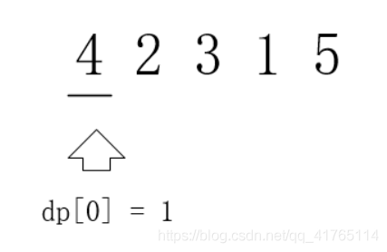

# DP

- [ ] 376.摆动序列


推荐做atcoder的dp contest 包含常见种类的dp入门题 https://atcoder.jp/contests/dp/tasks


**误区**: 以为把状态转移公式背下来,照葫芦画瓢改改,就开始写代码,甚至不清楚dp[i]表示的是什么。


五步动态规划
1. 确定**dp数组**(dp table)以及**下标的含义**
2. 确定**递推公式**
3. dp数组如何**初始化**
4. 确定**遍历顺序**
5. 举例推导dp数组


## 动态规划理论基础

如果某一问题有很多重叠子问题，使用动态规划是最有效的。


动态规划中每一个状态一定是由上一个状态推导出来的，

贪心没有状态推导，而是从**局部**直接选最优的。


---

### 解题步骤

1. 确定**dp数组**(dp table)以及**下标的含义**
2. 确定**递推公式**
3. dp数组如何**初始化**
4. 确定**遍历顺序**
5. 举例推导dp数组


先确定递推公式,然后在考虑初始化，因为一些情况是**递推公式决定了dp数组要如何初始化**!

**推导dp[i]的时候,一定要时刻想着dp[i]的定义,否则容易跑偏。**

**这体现出确定dp数组以及下标的含义的重要性!**


---

### Debug

```c++
if (error occur) {
    print(dp数组);
    
    if (与自己预先思路模拟推导结果一致) {
        get(递归公式、初始化或者遍历顺序有问题);
    } else {
        get(代码实现细节有问题);
    }
}
```


**debug 三问**

- 这道题目我举例推导状态转移公式了么?
- 我打印dp数组的日志了么?
- 打印出来了dp数组和我想的一样么?


---

## 509. 斐波那契数

给定 n，计算 `F(n)`
$$
F(0)=0,F(1) = 1 \\
F(n) = F(n-1) + F(n-2) \quad n>1
$$


1. 确定**dp数组**(dp table)以及**下标的含义**

```C++
dp[i]: 第i个数的斐波那契值为 dp[i]
i    : 代表数字的序列
```


2. 确定**递推公式**

```c++
dp[i] = dp[i-1] + dp[i-2];
```


3. dp数组如何**初始化**

```c++
dp[0] = 0;
dp[1] = 1;
```


4. 确定**遍历顺序**

从递推公式可以看出，第i项依赖前两项，因此遍历的顺序是从前到后遍历的。


5. 举例推导dp数组

```c++
N = 10;
dp[0] = 0; dp[1] = 1;
dp[2] = 1 + 0 = 1;
dp[3] = 1 + 1 = 2;
dp[4] = 2 + 1 = 3;
dp[5] = 3 + 2 = 5;
dp[6] = 5 + 3 = 8;
dp[7] = 8 + 5 = 13;
dp[8] = 13 + 8 = 21;
dp[9] = 21 + 13 = 34;
dp[10] = 34 + 21 = 55;
```


```c++
int fib(int n) {
    if (n <= 1) return n;
    vector<int> dp(n+1);
    dp[0] = 0;
    dp[1] = 1;

    for (int i = 2; i <= n; ++i) {
        dp[i] = dp[i-1] + dp[i-2];
    }

    return dp[n];
}
```

时间复杂度:O(n)
空间复杂度:O(n)


---

### 优化

我们只需要维护两个数值就可以了,不需要记录整个序列。

```c++
int fib(int n) {
    if (n <= 1) return n;
    int dp[3];
    dp[0] = 0;
    dp[1] = 1;

    for (int i = 2; i <= n; ++i) {
        dp[2] = dp[0] + dp[1];
        dp[0] = dp[1];
        dp[1] = dp[2];            
    }

    return dp[2];
}
```

时间复杂度:O(n)
空间复杂度:O(1)


---

## 70. 爬楼梯

需要 n 阶你才能到达楼顶，每次你可以爬 1 或 2 个台阶。你有多少种不同的方法可以爬到楼顶呢?


1. 确定**dp数组**(dp table)以及**下标的含义**

```C++
dp[i]: 爬到第i层的方法数
i    : 当前的层数
```


2. 确定**递推公式**

爬到第一层楼梯有一种方法,爬到二层楼梯有两种方法。那么第一层楼梯再跨两步就到第三层 ,第二层楼梯再跨一步就到第三层。所以到**第三层楼梯的状态**可以由**第二层楼梯和到第一层楼梯状态推导**出来

```c++
dp[i] = dp[i-1] + dp[i-2];
```


3. dp数组如何**初始化**

```c++
dp[0] = 0;//不用考虑第0层的初始化，小于2层直接输出答案
dp[1] = 1;
dp[2] = 2;
```


4. 确定**遍历顺序**

从递推公式可以看出，第i项依赖前两项，因此遍历的顺序是从前到后遍历的。


5. 举例推导dp数组

```c++
N = 10;
dp[1] = 1;
dp[2] = 2;
dp[3] = 2 + 1 = 3;
dp[4] = 3 + 2 = 5;
dp[5] = 5 + 3 = 8;
dp[6] = 8 + 5 = 13;
dp[7] = 13 + 8 = 21;
dp[8] = 21 + 13 = 34;
dp[9] = 34 + 21 = 55;
```


```c++
int climbStairs(int n) {
    if(n <= 2) return n;
    int dp[3];
    dp[0] = 1;
    dp[1] = 2;

    for (int i = 3; i <= n; ++i) { //直接第三层开始 i代表层数
        dp[2] = dp[0] + dp[1];
        dp[0] = dp[1];
        dp[1] = dp[2];
    }

    return dp[2];
}
```


时间复杂度:O(n)
空间复杂度:O(1)


---

### 拓展

一步一个台阶,两个台阶,三个台阶,直到 m个台阶,有多少种方法爬到n阶楼顶。 完全背包题

当m等于3时

```c++
dp[i] = dp[i-1] + dp[i-2] + dp[i-3];
```


```c++
int climbStairs(int n, int m) {
    vector<int> dp(n+1, 0)
    dp[0] = 1;

    for (int i = 1; i <= n; ++i) { //直接第1层开始 i代表层数
        for (int j = 1; j <= m; ++j) {
            if (i - j >= 0) 
                dp[i] += dp[i-j];
        }
    }

    return dp[n];
}
```


---

## 746. 使用最小花费爬楼梯

cost[i] 是第i步的上楼梯的花费，花费一次可以爬一步或两步


1. 确定**dp数组**(dp table)以及**下标的含义**

```C++
dp[i]: 爬到第i步的花费
i    : 当前的步数
```


2. 确定**递推公式**

```c++
dp[i] += cost[i] + min(dp[i-1], dp[i-2]);
```

最后一步可以理解为不用花费,所以取倒数第一步,第二步的最小值


3. dp数组如何**初始化**

```c++
dp[0] = cost[0];
dp[1] = cost[1];
```


4. 确定**遍历顺序**

从递推公式可以看出，第i项依赖前两项，因此遍历的顺序是从前到后遍历的。


5. 举例推导dp数组

```c++
N = 10;
dp[0] = 1;
dp[1] = 100;
dp[2] = 1 + 1 = 2;
dp[3] = 2 + 1 = 3;
dp[4] = 3 + 2 = 5;
dp[5] = 5 + 3 = 8;
dp[6] = 8 + 5 = 13;
dp[7] = 13 + 8 = 21;
dp[8] = 21 + 13 = 34;
dp[9] = 34 + 21 = 55;
```


```c++
int minCostClimbingStairs(vector<int>& cost) {
    int N = cost.size();
    if (N < 2) return min(cost[0], cost[1]);

    vector<int> dp(N, 0);
    dp[0] = cost[0];
    dp[1] = cost[1];

    for (int i = 2; i < N; ++i) { //从第二层开始
        dp[i] = cost[i] + min(dp[i-1], dp[i-2]);
    }
    // 注意最后一步可以理解为不用花费,所以取倒数第一步,第二步的最少值
    return min(dp[N-1], dp[N-2]);
}
```

时间复杂度:O(n)
空间复杂度:O(n)


### 优化

```c++
int minCostClimbingStairs(vector<int>& cost) {
    int N = cost.size();
    if (N < 2) return min(cost[0], cost[1]);

    int dp[2];
    dp[0] = cost[0];
    dp[1] = cost[1];

    for (int i = 2; i < N; ++i) { //从第二层开始
        dp[2] = cost[i] + min(dp[1], dp[2]);
        dp[0] = dp[1];
        dp[1] = dp[2];
    }
    // 注意最后一步可以理解为不用花费,所以取倒数第一步,第二步的最少值
    return min(dp[2], dp[1]);
}
```

时间复杂度:O(n)
空间复杂度:O(1)


---

## 62.不同路径


1. 确定**dp数组**(dp table)以及**下标的含义**

```C++
dp[i][j]: 到达i,j的路径数
i,j     : matrix索引
```


2. 确定**递推公式**

```c++
dp[i][j] = dp[i-1][j] + 1 + dp[i][j-1];  // i-1 >= 0        j-1 >= 0 
// 只能从左边或者右边到达 因此把这两种情况加一下就好


```


3. dp数组如何**初始化**

```c++
// 边界条件
dp[i][0] = 1;
dp[0][j] = 1;  
```


4. 确定**遍历顺序**

从递推公式可以看出，第i项依赖前两项，因此遍历的顺序是**从上到下**、**从左到右**遍历的。


5. 举例推导dp数组


```c++
int uniquePaths(int m, int n) {
    int dp[m][n];
    for (int i = 0; i < m; ++i)
        dp[i][0] = 1;

    for (int j = 0; j < n; ++j)
        dp[0][j] = 1;


    for (int i = 1; i < m ;++i) {
        for (int j = 1; j < n; ++j) {

            dp[i][j] = dp[i][j-1] + dp[i-1][j];
        }
    }

    return dp[m-1][n-1];
}
```


时间复杂度:O(mn)
空间复杂度:O(mn)


---

### 优化

其实用一个一维数组(也可以理解是**滚动数组**)就可以了,可以优化点空间:

```c++
int uniquePaths(int m, int n) {
    int dp[n];
    
    for (int j = 0; j < n; ++j)
        dp[j] = 1;


    for (int i = 1; i < m ;++i) {
        for (int j = 1; j < n; ++j) {
            dp[j] += dp[j-1][j-1]; //其实就是本身跟他前一项相加
        }
    }

    return dp[n-1];
}
```


时间复杂度:O(mn)
空间复杂度:O(n)

> 只跟他 i-1 和 j-1 有关的，都可以用滚动数组，直接计算完替换原来的值。
>
> 优化空间复杂度，其实就是找到需要几个值，就可以。不是所有值都需要保留


---

## 63. 不同路径 II

有障碍物了


1. 确定**dp数组**(dp table)以及**下标的含义**

```C++
dp[i][j]: 到达i,j的可用路径数
i,j     : matrix索引
```


2. 确定**递推公式**

```c++
dp[i][j] = dp[i-1][j] + 1 + dp[i][j-1];  // i-1 >= 0        j-1 >= 0 
// 只能从左边或者右边到达 因此把这两种情况加一下就好
如果这里边有一个是1，就不能加
```


3. dp数组如何**初始化**

```c++
// 边界条件
dp[i][0] = 1; 没有障碍物的的话 否则为INF
dp[0][j] = 1;  
```


4. 确定**遍历顺序**

从递推公式可以看出，第i项依赖前两项，因此遍历的顺序是**从上到下**、**从左到右**遍历的。


5. 举例推导dp数组


```c++
int uniquePathsWithObstacles(vector<vector<int>>& obstacleGrid) {
    int M = obstacleGrid.size();    //row
    int N = obstacleGrid[0].size(); //col

    int dp[M][N];

    if (obstacleGrid[0][0] == 1)
        return 0;

    
    //可用用一行替换 for (int i = 0; i < m && obstacleGrid[i][0] == 0; i++) dp[i][0] = 1;
    int flag = 0;
    for (int i = 0; i < M; ++i) {
        if (flag) {
            dp[i][0] = INT_MAX;
            continue;
        }
        if (obstacleGrid[i][0] == 0) {
            dp[i][0] = 1;
        } else {
            dp[i][0] = INT_MAX;
            flag = 1;
        }      
    }


    flag = 0;
    for (int j = 0; j < N; ++j) {
        if (flag) {
            dp[0][j] = INT_MAX;
            continue;
        }
        if (obstacleGrid[0][j] == 0) {
            dp[0][j] = 1;
        } else {
            dp[0][j] = INT_MAX;
            flag = 1;
        }
    }

    for (int i = 1; i < M; ++i) {
        for (int j = 1; j < N; ++j) {
            if (obstacleGrid[i][j] == 1) {
                dp[i][j] = INT_MAX;
            } else if (dp[i-1][j] == INT_MAX && dp[i][j-1] == INT_MAX) {
                dp[i][j] = INT_MAX;//continue?
            } else if (dp[i-1][j] == INT_MAX) {
                dp[i][j] = dp[i][j-1];
            } else if (dp[i][j-1] == INT_MAX) {
                dp[i][j] = dp[i-1][j];
            } else {
                dp[i][j] = dp[i-1][j] + dp[i][j-1];
            }
        }   
    }

    return dp[M-1][N-1]==INT_MAX? 0 : dp[M-1][N-1];
}
```


时间复杂度:O(mn)
空间复杂度:O(mn)


```c++
int uniquePathsWithObstacles(vector<vector<int>>& obstacleGrid) {
    int M = obstacleGrid.size();    //row
    int N = obstacleGrid[0].size(); //col

    vector<vector<int>> dp(M, vector<int>(N, 0));

    if (obstacleGrid[0][0] == 1)
        return 0;


    for (int i = 0; i < M && obstacleGrid[i][0] == 0; i++) dp[i][0] = 1;
    for (int j = 0; j < N && obstacleGrid[0][j] == 0; j++) dp[0][j] = 1;

    for (int i = 1; i < M; ++i) {
        for (int j = 1; j < N; ++j) {
            if (obstacleGrid[i][j] == 1) {
                dp[i][j] = 0;
            } else {
                dp[i][j] = dp[i-1][j] + dp[i][j-1];
            }
        }   
    }

    return dp[M-1][N-1];
}
```


---

## 343. 整数拆分


1. 确定**dp数组**(dp table)以及**下标的含义**

```C++
dp[i]: 拆分i时的最大值
i    : 被拆分的数
```


2. 确定**递推公式**

`dp[i]` 最大乘积，从1遍历j，然后有两种渠道得到 `dp[i]`

- 一个是 `j * (i-j)` 直接相乘
- 一个是 `j * dp[i-j]`，相当于是拆分 (i-j)，

```c++
dp[i] = max(dp[i], max( (i-j)*j, dp[i-j]*j ));  

// 为什么还要跟dp[i] 做比较 ？
// 因为每次循环j都会计算出不同的 dp[i]，比如前边的 2 2 的4 dp[i] 比 3 1的 3 dp[i]要大

// 为什么 max( (i-j)*j, dp[i-j]*j )？
// 因为 i-j表示的是第一个乘数    dp[i-j]也可以表示第一个乘数    二者本质意义一样
```


3. dp数组如何**初始化**

`dp[0] dp[1]` 不应该初始化,也就是没有意义的数值。这里只初始化 `dp[2] = 1`,从dp[i]的定义来说,拆分数字2,得到的最大乘积是1

```c++
// 边界条件
dp[2] = 1; 
```


4. 确定**遍历顺序**

从递推公式可以看出，dp[i] 依赖 dp[i-j]，因此遍历的顺序是**从前到后**遍历的。


5. 举例推导dp数组


```c++
int integerBreak(int n) {
    int dp[59] = {0};
    //memset(dp, 0, sizeof(dp));

    dp[2] = 1;

    for (int i = 3; i <= n; ++i) {

        for (int j = 2; j < i; ++j) {
            dp[i] = max(dp[i], max(j*(i-j), j*dp[i-j]));
        }
    }

    return dp[n];
}
```


时间复杂度:O(n2)
空间复杂度:O(n)


---

## 96. 不同的二叉搜索树


1. 确定**dp数组**(dp table)以及**下标的含义**

```C++
dp[i]: n个节点时能构成的二叉搜索树
i    : 节点数
```


2. 确定**递推公式**

`dp[i]` 乘积，从1遍历j，确定父亲节点，计算左右子树的组合情况，然后相乘得到 `dp[i]`

 `dp[mid-1] * dp[i - mid]`


```c++
dp[i] += dp[mid-1] * dp[i-mid];  

```


3. dp数组如何**初始化**

```c++
// 边界条件
dp[0] = 1; 
dp[1] = 1;
```


4. 确定**遍历顺序**

从递推公式可以看出，dp[i] 依赖 dp[i-j]，因此遍历的顺序是**从前到后**遍历的。


5. 举例推导dp数组


```c++
int numTrees(int n) {
    int dp[n+1];

    if (n == 1) return 1;

    dp[0] = 1;
    dp[1] = 1;


    for (int i = 2; i <= n; ++i) {
        dp[i] = 0;

        for (int mid = 1; mid <= i; ++mid) {
            dp[i] += dp[mid-1]*dp[i-mid];
        }
    }

    return dp[n];
}
```


时间复杂度:O(n2)
空间复杂度:O(n)


---

## 376. 摆动序列

Wait！！！！！！！！！！！！！！！

1. 确定**dp数组**(dp table)以及**下标的含义**

```C++
dp[i]: 前n个连续数组最大和
i    : 数组位置
```


2. 确定**递推公式**

加之前：`dp[i] = dp[i-1] + nums[i]`

不加之前：`dp[i] = nums[i]`


```c++
dp[i] = max(nums[i], dp[i-1] + nums[i])
```


3. dp数组如何**初始化**

```c++
// 边界条件
dp[0] = nums[0]; 
```


4. 确定**遍历顺序**

从递推公式可以看出，dp[i] 依赖 dp[i-j]，因此遍历的顺序是**从前到后**遍历的。


5. 举例推导dp数组


---

## 53. 最大子序和

1. 确定**dp数组**(dp table)以及**下标的含义**

```C++
dp[i]: 前n个连续数组最大和
i    : 数组位置
```


2. 确定**递推公式**

加之前：`dp[i] = dp[i-1] + nums[i]`

不加之前：`dp[i] = nums[i]`


```c++
dp[i] = max(nums[i], dp[i-1] + nums[i])
```


3. dp数组如何**初始化**

```c++
// 边界条件
dp[0] = nums[0]; 
```


4. 确定**遍历顺序**

从递推公式可以看出，dp[i] 依赖 dp[i-j]，因此遍历的顺序是**从前到后**遍历的。


5. 举例推导dp数组


---

# DP-Bag

背包

对于⾯试的话，其实掌握**01背包**，和**完全背包**，就够⽤了，最多可以再来⼀个**多重背包**。


完全背包⼜是也是01背包稍作变化而来，即：**完全背包的物品数量是无限的**。


**背包问题具备的特征**：

是否可以根据一个 target（直接给出或间接求出），target 可以是数字也可以是字符串，再给定一个数组 arrs，问：能否使用 arrs 中的元素做各种排列组合得到 target。


**背包问题解法：**
01 背包
如果是 01 背包，即数组中的元素不可重复使用，外循环遍历 arrs，内循环遍历 target，且内循环倒序

完全背包
（1）如果是完全背包，即数组中的元素可重复使用并且不考虑元素之间顺序，arrs 放在外循环（保证 arrs 按顺序），target在内循环。且内循环正序。
（2）如果组合问题需考虑元素之间的顺序，需将 target 放在外循环，将 arrs 放在内循环，且内循环正序。


https://leetcode-cn.com/problems/partition-equal-subset-sum/solution/yi-tao-kuang-jia-jie-jue-bei-bao-wen-ti-p9saf/


---

## 分析

一般问题：我们有 $n$ 件物品和一个容量为 C 的背包，记第 i 件物品的重量 (weight) 为 $w_i$，价值 (value) 为 $v_i$，求将哪些物品装入背包可使价值总和最大。

> **0-1 背包**：如果限定每件物品最多只能选取 1 次，（即 0 或 1 次），则问题称为 `0-1 背包问题`

> **完全背包**：如果每件物品最多可以选取无限次，则问题称为 `完全背包问题`


假设放入背包中的物品 i 的数目为 $k_i$，则上述背包问题可以表达为：
$$
\max \ \sum_{i=0}^{n-1}\ k_{i} \cdot v_{i}
$$
限于 s.t.

$$
\sum_{i=0}^{n-1} k_{i} \cdot w_{i} \leqslant C, \quad \left\{\begin{array}{lll} k_{i} \in\{0,1\} & \textcolor{red}{\longleftarrow} & \text { 「0-1背包问题」 } \\ k_{i} \in\{0,1,2, \ldots,+\infty\} & \textcolor{red}{\longleftarrow} & \text { 「完全背包问题」 } \end{array}\right.
$$
0-1背包 和 完全背包 是两种最为常见的背包问题，其他类型的背包问题，如多重背包、分组背包等可参考网上的一些资料， 如：《背包问题九讲》[（网页版）](https://leetcode-cn.com/link/?target=http%3A%2F%2Fcuitianyi.com%2FPack%2F) [（PDF版）](https://leetcode-cn.com/link/?target=https%3A%2F%2Fcomzyh.com%2Fupload%2FPDF%2FPack-PDF-Comzyh.pdf)


**动态规划**是解决 [0-1 背包问题] 和 [完全背包问题] 的**标准做法**。

**1. [0-1 背包问题]**

一般地，我们定义：`dp[i][j]` 表示**前 i** 件物品放入一个**容量为 j** 的背包可以获得的最大价值（每件物品最多放一次），则状态转移过程可表示为：

- 不选择第 i 件物品，则问题转化为了前 i-1 件物品放入容量为 j 的背包中所获得的价值 `dp[i][j] = dp[i-1][j]`

- 选择第 i 件物品，则问题转化为了前 i-1 件物品放入容量为 $j-w_i$ 的背包中所获得的价值**再加上**本物品的**价值**  $dp[i][j] = dp[i-1][j-w_i] + v_i$。

> 注意，第 i 件物品能放入 1 个的前提是  $j-w_i \ge 0$ ，即 $w_i \le j$，背包还有容量放入 1 个第 i 件物品


两种情况取较大者，状态转移方程为
$$
dp[i][j] = max(dp[i-1][j],dp[i-1][j-w_i] + v_i)
$$


**2. [完全背包问题]**

类似于 01 背包，但不同的是每件物品有无限个供应：从每件物品的数量来考虑，有取 0 件、取 1 件、取 2 件......取 k 件等很多种。

一般地，我们定义：`dp[i][j]` 表示**前 i** 件物品放入一个**容量为 j** 的背包可以获得的最大价值（每件物品有无限个），因此 `dp[i][j]` 为以下可能方案中的最大值：

- 第 i 件物品选 0 个的最大价值 $dp[i-1][j]$

- 第 i 件物品选 1 个的最大价值 $dp[i-1][j-w_i] + v_i$

- 第 i 件物品选 2 个的最大价值 $dp[i-1][j-2 \cdot w_i] + 2 \cdot v_i$

  ......

- 第 i 件物品选 3 个的最大价值 $dp[i-1][j-k\cdot w_i] + k\cdot v_i$

> 注意，第 i 件物品能放入 k 个的前提是  $j-k\cdot w_i \ge 0$ ，即 $k\cdot w_i \le j$，背包还有容量放入 k 个第 i 件物品


k+1 种情况取较大者，状态转移方程为
$$
dp[i][j] = max(dp[i-1][j],dp[i-1][j-k\cdot w_i] + k\cdot v_i),\ \ 0\le k\cdot w_i \le j
$$


由状态方程可知，我们可以借鉴「0−1 背包」问题的求解方式来解决「完全背包问题」，但对于每件物品而言每次都需要枚举所有可行的物品数目 k，这无疑会大大增加系统的开销。

事实上，我们可以对上述状态转移方程进行优化，得到更为简洁的表达（见下）。

将上述状态转移方程展开可得：
$$
dp[i][j] = \max \{ \ dp[i-1][j],\quad \textcolor{red}{dp[i-1][j-w_i] + v_i}, \textcolor{teal}{\ dp[i-1][j-2\cdot w_i] + 2\cdot v_i}, \ \ \ \\ \ ..., \ \textcolor{blue}{dp[i-1][j-k\cdot w_i] + k\cdot v_i} \ \} ,\quad \quad \quad 0<=k\cdot w_i<=j  \tag{1}
$$
而恰巧的是对于 $dp[i][j-w_i]$ 我们有：
$$
dp[i][j-w_i] = \max \{ \ \textcolor{red}{dp[i-1][j-w_i]}, \ \textcolor{teal}{dp[i-1][j-2\cdot w_i] + v_i}, \quad \quad \quad \quad \quad \quad \quad \quad \\ \ ..., \ \textcolor{blue}{dp[i-1][j-k\cdot w_i] + (k-1)\cdot v_i} \ \} , w_i<=k\cdot w_i<=j
\tag{2}
$$
观察发现式 2 与式 1 中的后 k 项刚好相差了一个 $v_i$ ，将式 2 代入式 1 可得简化后的「完全背包问题」的「状态转移方程」为：
$$
dp[i][j] = \max \{ \ dp[i-1][j],\quad \textcolor{red}{dp[i]}[j-w_i] + v_i\ \} ,\quad 0<=w_i<=j \ \ \quad \quad \quad \quad \quad \quad
\tag{3}
$$


> ⚠️ 注意，式 3 与「0-1 背包问题」的状态转移方程及其相似，差别（以红色标注）在于第二项中的状态转移是来自上一行还是本行。这也决定了具体编程实现时状态更新方式的异同。


**对比总结**

两种背包问题的状态转移方程对比总结如下：

$$
0-1背包：dp[i][j] = \max\left\{ \ dp[i-1][j],\quad \textcolor{red}{dp[i-1]}[j-w_i] + v_i \ \right\},\quad 0<=w_i<=j \quad \quad\\
完全背包：\ dp[i][j] = \max \{ \ dp[i-1][j],\quad \textcolor{red}{dp[i]}[j-w_i] + v_i\ \} ,\quad \quad \quad 0<=w_i<=j \quad \quad
$$

> ⚠️ 求最优解的背包问题中，有的题目要求 **恰好装满背包** 时的最优解，有的题目则要求 **不超过背包容量** 时的最优解。一种区别这两种问法的实现方法是在**状态初始化的时候有所不同**。
>
> 初始化的 dp 数组事实上就是在背包中没有放入任何物品时的合法状态：
>
> 1. 如果要求**恰好装满背包**，那么在初始化时 `dp[i][0]=0`，其它 `dp[i][1,2,...,*]` 均设为 $-\infty$。这是因为此时只有容量为 0 的背包可能被价值为 0 的 nothing “恰好装满”，而其它容量的背包均没有合法的解，属于未定义的状态。
> 2. 如果只是要求**不超过背包容量**而使得背包中的物品价值尽量大，初始化时应将 `dp[*][*]` 全部设为 0。这是因为对应于任何一个背包，都有一个合法解为 “什么都不装”，价值为 0。


拓展：

- 「0-1 背包」是「完全背包」的基础，可参考以下题目掌握「0-1 背包问题」：

| **题号**                    | 题解                            | **难度** |
| --------------------------- | ------------------------------- | -------- |
| 416. 分割等和子集           | 记忆化搜索、动态规划 + 空间优化 | 中等     |
| 417. 一和零                 | 记忆化搜索、动态规划 + 空间优化 | 中等     |
| 494. 目标和                 | 记忆化搜索、动态规划 + 空间优化 | 中等     |
| 1049. 最后一块石头的重量 II | 记忆化搜索、动态规划 + 空间优化 | 中等     |


- 对「0-1 背包」模板稍加拓展，可用于解决一众「完全背包问题」：

| **题号**         | 题解                               | **难度** |
| ---------------- | ---------------------------------- | -------- |
| 322. 零钱兑换    | 从0-1背包到完全背包，逐层深入+推导 | 中等     |
| 518. 零钱兑换 II | 从0-1背包到完全背包，逐层深入+推导 | 中等     |
| 279. 完全平方数  | 记忆化搜索、动态规划 + 空间优化    | 中等     |


---

## 0-1背包

### 416. 分割等和子集

`nums[i]` 对应于常规背包问题中的第 i 件物品的重量。我们的目标是从 nums 中选取若干个数字使其恰好等于数组总和的一半，记为 $target = \frac{sum(nums)}{2}$

对于本体，定义 `dp[i][j]` 表示从前 i 个数字中选出若干个，刚好可以使得被选出的数字和为 j。
$$
dp[i][j] = dp[i-1][j]  \ \ \ or \ \ \ dp[i-1][j - nums[i]]
$$
初始化时，`dp[i][0] = true`，表示从前 i 个数字中可以选出若干个使得其和为 0.即不选任何数字即可得到 0.


#### 二维DP

```c++
bool canPartition(vector<int>& nums) {
    int n = nums.size();

    int sum = accumulate(nums.begin(), nums.end(), 0);

    if (sum & 1) return false;
    int target = sum / 2;

    vector<vector<bool>> dp(n + 1, vector<bool>(target + 1, false));

    for (int i = 0; i <= n; ++i) // 示从前 i 个数字中可以选出若干个使得其和为 0.   即不选任何数字即可得到 0.
        dp[i][0] = true;


    for (int i = 1; i <= n; ++i) {
        for (int j = 0; j <= target; ++j) {
            if (j - nums[i-1] < 0) {    // 容量不够，无法选择第i个数字 nums[i-1]
            	dp[i][j] = dp[i-1][j];  // 不选, 跟上一个物品的状态一样
            } else {                    // 容量足够 选或者不选
               	dp[i][j] = dp[i-1][j] || dp[i-1][j-nums[i-1]]; 
            }
        }
    }

    return dp[n][target];
}


class Solution {
public:
    bool canPartition(vector<int>& nums) {
        vector<vector<int>> dp(n, vector<int>(target + 1, 0));
        for (int i = 0; i < n; i++) {
            dp[i][0] = true;
        }
        dp[0][nums[0]] = true;
        for (int i = 1; i < n; i++) {
            int num = nums[i];
            for (int j = 1; j <= target; j++) {
                if (j >= num) {
                    dp[i][j] = dp[i - 1][j] | dp[i - 1][j - num];
                } else {
                    dp[i][j] = dp[i - 1][j];
                }
            }
        }
        return dp[n - 1][target];
    }
};
```

我们定义了一个 $(n+1) \times (target+1)$ 的二维数组 dp，其中第一维为 n+1 也意味着：第 i 个数字为 nums[i-1]，第 1 个数字为 nums[0]，第 0 个数字为空。

也可有其他定义方法，比如定义 dp 的第一维为 n，相对应的第 i 个数字为 nums[i]，第 0 个数字即为 nums[0] 而非空。

复杂度分析

时间复杂度：$O(n×target)$，其中 n 是数组的长度，target 是数组元素和的一半。

空间复杂度：$O(n×target)$。


[1,5,11,5]


#### 一维DP

动态规划的滚动数组优化如下：

在上面的状态转移方程中，每一行的 `dp[i][*]` 状态值都只与上一行的 `dp[i-1][*]` 状态值有关，因此可基于**滚动数组**的思想进行对状态空间 dp 进行优化而省去第一维度：
$$
\textcolor{red}{dp[j]}=dp[j] ∣ dp[j−nums[i-1]]\ .
$$

且需要注意的是第二层的循环我们需要从大到小计算，因为如果我们从小到大更新 dp 值，那么在计算 dp[j] 值的时候，dp[j−nums[i]] 已经是被更新过的状态，不再是上一行的 dp 值。


```c++
bool canPartition(vector<int>& nums) {
    int n = nums.size();

    int sum = accumulate(nums.begin(), nums.end(), 0);
    int maxNum = *max_element(nums.begin(), nums.end());

    if (sum & 1) return false;
    int target = sum / 2;
    if (maxNum > target) return false;

    vector<bool> dp(target + 1, false); 

    dp[0] = true;

    for (int i = 1; i < n; ++i) {
        int num = nums[i];        // 当前重量
        for (int j = target; j >= 0; --j) {	// 必须逆序，因为要保证 dp[j-num] 是前一时刻的
            if (j - num < 0) {    // 容量不够，无法选择第i个数字 nums[i-1]
                dp[j] = dp[j];    // 不选, 跟上一个物品的状态一样   
                // 后边这个dp[j]是前一时刻的值 即dp[i-1][j]
            } else {                    // 容量足够 选或者不选
                dp[j] = dp[j] || dp[j-num]; 
                // 后边这个dp[j] || dp[j-num] 是前一时刻的值 即dp[i-1][j] || dp[i-1][j-num]
            }
        }
    }

    return dp[target];
}
```

时间复杂度：$O(n \times \textit{target})$，其中 n 是数组的长度，target 是整个数组的元素和的一半。需要计算出所有的状态，每个状态在进行转移时的时间复杂度为 $O(1)$。

空间复杂度：$O(\textit{target})$，其中 target 是整个数组的元素和的一半。空间复杂度取决于 dp 数组，在不进行空间优化的情况下，空间复杂度是 $O(n \times \textit{target})$，在进行空间优化的情况下，空间复杂度可以降到 $O(\textit{target})$。


---

### 474. 一和零

状态转移方程如下：

$$
\textit{dp}[i][j][k]=\begin{cases} \textit{dp}[i - 1][j][k], & j<\textit{zeros} ~~ | ~~ k<\textit{ones} \\ \max(\textit{dp}[i - 1][j][k], \textit{dp}[i - 1][j - \textit{zeros}][k - \textit{ones}] + 1), & j \ge \textit{zeros} ~ \& ~ k \ge \textit{ones} \end{cases}
$$
最终得到 $\textit{dp}[l][m][n]$ 的值即为答案


三维DP

```c++
int findMaxForm(vector<string>& strs, int m, int n) {
    int len = strs.size();
    vector<vector<int>> nums(len, vector<int>(2, 0));
	/*预处理01个数*/
    for (int i = 0; i < strs.size(); ++i) {
        int zeroN = 0, oneN = 0;
        for (auto &c : strs[i]) {
            if (c == '0') zeroN++;
            else oneN++;
        }
        nums[i][0] = zeroN;
        nums[i][1] = oneN;
    } 


    vector<vector<vector<int>>> dp(len + 1, vector<vector<int>>(m + 1, vector<int>(n + 1, 0)));

    for (int i = 1; i <= strs.size(); ++i) {
        int zeroN = nums[i-1][0], oneN = nums[i-1][1];

        for (int j = m; j >= 0; --j) {      // m 要求 0
            for (int k = n; k >= 0; --k) {  // n 要求 1
                if (j - zeroN < 0 || k - oneN < 0) {
                    dp[i][j][k] = dp[i-1][j][k];
                } else {
                    dp[i][j][k] = max(dp[i-1][j][k], dp[i-1][j-zeroN][k-oneN]+1);
                }
            }
        }
    }

    return dp[len][m][n];
}
```


滚动数组优化至二维

```c++
int findMaxForm(vector<string>& strs, int m, int n) {
    int len = strs.size();
    vector<vector<int>> nums(len, vector<int>(2, 0));
	/*预处理01个数*/
    for (int i = 0; i < strs.size(); ++i) {
        int zeroN = 0, oneN = 0;
        for (auto &c : strs[i]) {
            if (c == '0') zeroN++;
            else oneN++;
        }
        nums[i][0] = zeroN;
        nums[i][1] = oneN;
    } 


    vector<vector<int>> dp(m + 1, vector<int>(n + 1, 0));

    for (int i = 0; i < strs.size(); ++i) {
        int zeroN = nums[i][0], oneN = nums[i][1];

        for (int j = m; j >= 0; --j) {      // m 要求 0
            for (int k = n; k >= 0; --k) {  // n 要求 1
                if (j - zeroN < 0 || k - oneN < 0) {
                    dp[j][k] = dp[j][k];
                } else {
                    dp[j][k] = max(dp[j][k], dp[j-zeroN][k-oneN]+1);
                }
            }
        }
    }

    return dp[m][n];
}
```

时间复杂度：$O(lmn + L)$，其中 l 是数组 strs 的长度，m 和 n 分别是 0 和 1 的容量，L 是数组 strs 中的所有字符串的长度之和。

动态规划需要计算的状态总数是 O(lmn)，每个状态的值需要 O(1) 的时间计算。
对于数组 strs 中的每个字符串，都要遍历字符串得到其中的 0 和 1 的数量，因此需要 O(L) 的时间遍历所有的字符串。
总时间复杂度是 O(lmn + L)。

空间复杂度：O(mn)，其中 m 和 n 分别是 0 和 1 的容量。使用空间优化的实现，需要创建 m+1 行 n+1 列的二维数组 dp。


---

### 494. 目标和

选或不选，选了 +nums[i]，不选 -nums[i]


---

### 1049. 最后一块石头的重量 II


---

## 完全背包

### 322. 零钱兑换


---

### 518. 零钱兑换 II


---

### 279. 完全平方数


----

# 打家劫舍

## 198.打家劫舍


1. 确定**dp数组**(dp table)以及**下标的含义**

```C++
dp[i]: 	打劫i以内的房屋能拿到的最多钱
i：		第i个房屋    
```


2. 确定**递推公式**

决定 dp[i] 的因素就是第i个房间偷还是不偷

- 偷：`dp[i] = d[i-2] + nums[i]`  第i-1房间不考虑
- 不偷：`dp[i] = dp[i-1]`（但也不是非要偷 i-1，因为dp[i-1] 也有偷或不偷两种情况）

```c++
dp[i] = max(dp[i-1], dp[i-2] + nums[i]);
```


3. dp数组如何**初始化**

```c++
// 边界条件
dp[0] = nums[0]; //就是一定偷0，值最大 
dp[1] = max(nums[0], nums[1]); //挑一个偷
```


4. 确定**遍历顺序**

从递推公式可以看出，dp[i] 依赖 dp[0:i-1]，因此遍历的顺序是**从前到后**遍历的。


5. 举例推导dp数组


```c++
int rob(vector<int>& nums) {
    int n = nums.size();
    if (n == 0) return 0;
    if (n == 1) return nums[0];

    int dp[n];
    dp[0] = nums[0];
    dp[1] = max(nums[0], nums[1]);


    for (int i = 2; i < n; ++i) {
        dp[i] = max(dp[i-2] + nums[i], dp[i-1]);
    }
    return dp[n-1];
}
```


## 213.打家劫舍II

唯⼀区别就是成环了。


1. 确定**dp数组**(dp table)以及**下标的含义**

```C++
dp[i]: 	打劫i以内的房屋能拿到的最多钱
i：		第i个房屋    
```


2. 确定**递推公式**

成环的三种情况

- 不考虑首尾元素，
- 考虑首元素，不考虑尾元素，
- 考尾元素，不考虑首元素，

相当于把环拉直 按198.打家劫舍求解‘

但其实二三情况就包含了第一种情况

```c++
dp[i] = max(dp[i-1], dp[i-2] + nums[i]);
```


3. dp数组如何**初始化**

```c++
// 边界条件
dp[0] = nums[0]; //就是一定偷0，值最大 
dp[1] = max(nums[0], nums[1]); //挑一个偷
```


4. 确定**遍历顺序**

从递推公式可以看出，dp[i] 依赖 dp[0:i-1]，因此遍历的顺序是**从前到后**遍历的。


5. 举例推导dp数组


```c++
int robRange(vector<int>& nums, int start, int end) {
    if (end - start == 0) return nums[start];
    if (end - start == 1) return max(nums[start], nums[start + 1]);

    int dp[nums.size()+1];
    dp[start] = nums[start];
    dp[start + 1] = max(nums[start], nums[start + 1]);
    for (int i = start + 2; i <= end; ++i) {
        dp[i] = max(dp[i-1], dp[i-2] + nums[i]);
    }
    return dp[end];
}


int rob(vector<int>& nums) {
    int n = nums.size();
    if (n == 0) return 0;
    if (n == 1) return nums[0];

    int noStart = robRange(nums, 1, n-1);
    int noEnd = robRange(nums, 0, n-2);
    return max(noStart, noEnd);
}
```


----

## 337.打家劫舍 III

变成树了


### 记忆化递推

**本题⼀定是要后序遍历，因为通过递归函数的返回值来做下⼀步计算。**如果抢了当前节点，两个孩⼦就不是动，如果没抢当前节点，就可以**考虑**抢左右孩⼦（注意这里说的是“考虑”）

> 为什么是考虑？
>
> 当前左右孩子值很小，所有我要**左右孩子节点**的**孩子节点**


```c++
unordered_map<TreeNode* , int> umap; // 记录计算过的结果    
int rob(TreeNode* root) {
    //进来了就说明 该节点 root 是可以被选择的
    if (root == nullptr) return 0;
    if (root->left == nullptr && root->right == nullptr) return root->val; 
    if (umap[root]) return umap[root];

    int val1 = root->val;
    if (root->left) val1 += rob(root->left->left) + rob(root->left->right);
    if (root->right) val1 += rob(root->right->left) + rob(root->right->right);  

    int val2 = rob(root->left) + rob(root->right);
    umap[root] = max(val1, val2);
    return umap[root];
}
```


---

### 动态规划

树形dp，树上进行状态转移

递归三部曲为框架，融合动规五部曲的内容


1. **确定递归函数的参数和返回值**

要求⼀个节点 偷与不偷的两个状态所得到的⾦钱，那么返回值就是⼀个长度为2的数组。

```c++
vector<int> robTree(TreeNode* cur);
```

返回数组就是dp数组。


2. **确定终止条件** 

```c++
if (cur == NULL) return vector<int>{0, 0};
```

空节点的话，很明显，无论偷还是不偷都是 0


3. **确定单层递归的逻辑**

```c++
vector<int> left = robTree(cur->left); // 左
vector<int> right = robTree(cur->right); // 右

// 偷cur
int val1 = cur->val + left[0] + right[0];
// 不偷cur
int val2 = max(left[0], left[1]) + max(right[0], right[1]);

return {val2, val1};
```

- 偷当前节点，那么左右孩子就不能偷，`val1 = cur->val + left[0] + right[0]; `

- 不偷当前节点，考虑是否偷左右孩子 `val2 =
  max(left[0], left[1]) + max(right[0], right[1]);`

最后当前节点的状态就是{val2, val1}; 即：{不偷当前节点得到的最大金钱，偷当前节点得到的最大金钱}


1. 确定**dp数组**(dp table)以及**下标的含义**

```C++
dp[i]: 	下标为0记录不偷该节点所得到的的最大金钱，下标为1记录偷该节点所得到的的最大金钱。
i：	    0/1
```

长度为2的数组怎么标记树中每个节点的状态呢？
在递归的过程中，**系统栈会保存**每⼀层递归的参数。


2. 确定**递推公式**

```c++
与确定单层递归的逻辑相同
```


3. dp数组如何**初始化**

```c++
if (cur == NULL) return vector<int>{0, 0};
```

递归的最后一层就是 dp 的初始化


4. 确定**遍历顺序**

后序遍历， 先计算左右子树的状态，再计算是否考虑加根节点。

```c++
// 下标0：不偷，下标1：偷
vector<int> left = robTree(cur->left); // 左
vector<int> right = robTree(cur->right); // 右
// 中
```


5. 举例推导dp数组


```c++
vector<int> robTree(TreeNode* cur) {
    if (cur == nullptr) return vector<int> {0, 0};

    vector<int> left = robTree(cur->left);
    vector<int> right = robTree(cur->right);

    int val1Choice = cur->val + left[0] + right[0];
    int val0Choice = max(left[0], left[1]) + max(right[0], right[1]);

    return vector<int> {val0Choice, val1Choice};
}

int rob(TreeNode* root) {
    vector<int> res = robTree(root);
    return max(res[0], res[1]);
}
```


---

# 股票问题

## 121. 买卖股票的最佳时机


1. 确定**dp数组**(dp table)以及**下标的含义**

```C++
dp[i][0]:  第i天持有股票所得最多现金。
dp[i][1]:  第i天不持有股票所得最多现金
i：	      第i天
```


2. 确定**递推公式**

两种情况

- 持有，第i天买入，变成持有状态    `dp[i][1] = - prices[i] `
- 持有，第i-1天就持有                        `dp[i][0] = dp[i-1][0] `


- 未持有，第i天卖出，变成未持有状态     `dp[i][0] = dp[i-1][0] + prices[i]` 
- 未持有，第i-1天就未持有                         `dp[i][1] = dp[i-1][1]` 


3. dp数组如何**初始化**

```c++
dp[0][0] = -prices[0]; 
dp[0][1] = 0; 
```


4. 确定**遍历顺序**

从递推公式可以看出，因此遍历的顺序是**从前到后**遍历的。


5. 举例推导dp数组


左边一列就是更新最小的 price

右边是找哪一天卖出去最合适

```c++
int maxProfit(vector<int>& prices) {
    vector<vector<int>> dp(prices.size(), vector<int>(2, 0));

    dp[0][0] = -prices[0]; // 持有
    dp[0][1] = 0; // 未持有

    for (int i = 1; i < prices.size(); ++i) {
        dp[i][0] = max(dp[i-1][0], -prices[i]);
        dp[i][1] = max(dp[i-1][1], dp[i-1][0] + prices[i]); // 找哪一天卖出去钱最多
    }

    return dp[prices.size()-1][1];	// 不持有股票状态所得⾦钱⼀定⽐持有股票状态得到的多


}
```


---

## 122. 买卖股票的最佳时机II

本题股票可以买卖多次了（注意只有⼀只股票，所以再次购买前要出售掉之前的股票）


1. 确定**dp数组**(dp table)以及**下标的含义**

```C++
dp[i][0]:  第i天持有股票所得最多现金。
dp[i][1]:  第i天不持有股票所得最多现金
i：	      第i天
```

**注意这里说的是“持有”，“持有”不代表就是当天“买入”！也有可能是昨天就买入了，今天保持持有的状态**


2. 确定**递推公式**

两种情况

- 持有，第i天买入，变成持有状态    `dp[i][1] = dp[i-1][1] - prices[i] ` 昨天不持有股票的现金减去今天股票的价格
- 持有，第i-1天就持有                        `dp[i][0] = dp[i-1][0] `


- 未持有，第i天卖出，变成未持有状态     `dp[i][0] = dp[i-1][0] + prices[i]` 
- 未持有，第i-1天就未持有                         `dp[i][1] = dp[i-1][1]` 


3. dp数组如何**初始化**

```c++
dp[0][0] = 0 - prices[0]; 
dp[0][1] = 0; 
```


4. 确定**遍历顺序**

从递推公式可以看出，因此遍历的顺序是**从前到后**遍历的。


5. 举例推导dp数组

```c++
int maxProfit(vector<int>& prices) {
    vector<vector<int>> dp(prices.size(), vector<int>(2, 0));

    dp[0][0] = 0 - prices[0];    // 持有
    dp[0][1] = 0;    // 不持有

    for (int i = 1; i < prices.size(); ++i) {
        dp[i][0] = max(dp[i-1][0], dp[i-1][1] - prices[i]);
        dp[i][1] = max(dp[i-1][1], dp[i-1][0] + prices[i]);
    }

    return dp[prices.size()-1][1];
}
```


---

## 123. 买卖股票的最佳时机III

⾄多买卖两次，这意味着可以买卖⼀次，可以买卖两次，也可以不买卖。


1. 确定**dp数组**(dp table)以及**下标的含义**

```C++
dp[i][j]:  第i天状态j所剩最大现金

⼀天⼀共就有五个状态，
0. 没有操作
1. 第⼀次买⼊
2. 第⼀次卖出
3. 第⼆次买⼊
4. 第⼆次卖出
```


2. 确定**递推公式**

`dp[i][1]`，表示的是第 i 天，买入股票的状态，**并不是说⼀定要第 i 天买入股票**。


达到 `dp[i][1]` 状态，有两个具体操作：

- 操作一：第 i 天买入股票，那么 `dp[i][1] = dp[i-1][0] - prices[i]`
- 操作二：第 i 天没有操作，而是沿用前一天买入的状态，`dp[i][1] = dp[i-1][1]`


`dp[i][2]` 也有两个操作

- 操作一：第 i 天卖出股票了，那么 `dp[i][2] = dp[i-1][1] + prices[i]`
- 操作二：第 i 天没有操作，沿用前一天卖出股票的状态，即：`dp[i][2] = dp[i-1][2]`


达到 `dp[i][3]` 状态，有两个具体操作：

- 操作一：第 i 天买入股票，那么 `dp[i][3] = dp[i-1][2] - prices[i]`
- 操作二：第 i 天没有操作，而是沿用前一天买入的状态，`dp[i][3] = dp[i-1][3]`


`dp[i][4]` 也有两个操作

- 操作一：第 i 天卖出股票了，那么 `dp[i][4] = dp[i-1][3] + prices[i]`
- 操作二：第 i 天没有操作，沿用前一天卖出股票的状态，即：`dp[i][4] = dp[i-1][4]`


3. dp数组如何**初始化**


```c++
//第0天没有操作
dp[0][0] = 0; 

// 第0天做第⼀次买入的操作
dp[0][1] = 0 - prices[0]; 

// 第0天做第一次卖出的操作 当天买当天卖为0
dp[0][2] = 0;

// 第0天做第二次买入的操作
dp[0][3] = 0 - prices[0];

// 第0天做第二次卖出的操作 当天买当天卖为0
dp[0][4] = 0;
```


4. 确定**遍历顺序**

从递推公式可以看出，因此遍历的顺序是**从前到后**遍历的。


5. 举例推导dp数组


最大的时候⼀定是卖出的状态，而两次卖出的状态现金最大⼀定是最后一次卖出。所以最终最大利润是 `dp[4][4]`


```c++
int maxProfit(vector<int>& prices) {
    vector<vector<int>> dp(prices.size(), vector<int>(5, 0));

    dp[0][0] = 0;
    dp[0][1] = -prices[0];  // 第i天 第一次买入
    dp[0][2] = 0;           // 第i天 第一次卖出
    dp[0][3] = -prices[0];  // 第i天 第二次买入
    dp[0][4] = 0;           // 第i天 第二次卖出

    for (int i = 1; i < prices.size(); ++i) {
        dp[i][1] = max(dp[i-1][1], dp[i-1][0] - prices[i]);
        dp[i][2] = max(dp[i-1][2], dp[i-1][1] + prices[i]);
        dp[i][3] = max(dp[i-1][3], dp[i-1][2] - prices[i]);
        dp[i][4] = max(dp[i-1][4], dp[i-1][3] + prices[i]);
    }

    return dp[prices.size() - 1][4];
}
```


---

## 188. 买卖股票的最佳时机 IV

⾄多买卖 k 次，与123完全一致


1. 确定**dp数组**(dp table)以及**下标的含义**

```C++
dp[i][j]:  第i天状态j所剩最大现金

⼀天⼀共就有五个状态，
0. 没有操作
1. 第⼀次买⼊
2. 第⼀次卖出
3. 第⼆次买⼊
4. 第⼆次卖出
5. 第三次买⼊
6. 第三次卖出    
...
...    
```


2. 确定**递推公式**

`dp[i][1]`，表示的是第 i 天，买入股票的状态，**并不是说⼀定要第 i 天买入股票**。


```c++
for (int i = 1; i < prices.size(); ++i) {
    for (int j = 1; j < 2*k + 1; ++j) {
        if (j & 1) dp[i][j] = max(dp[i-1][j], dp[i-1][j-1] - prices[i]); //奇数
        else dp[i][j] = max(dp[i-1][j], dp[i-1][j-1] + prices[i]);
    }
}
```


3. dp数组如何**初始化**


```c++
vector<vector<int>> dp(prices.size(), vector<int>(2*k + 1, 0));

dp[0][0] = 0;
for (int i = 1; i < 2 * k + 1; i++) {
    if (i & 1) dp[0][i] = -prices[0];   // 奇数
}
```


4. 确定**遍历顺序**

从递推公式可以看出，因此遍历的顺序是**从前到后**遍历的。


5. 举例推导dp数组

最大的时候⼀定是卖出的状态，而两次卖出的状态现金最大⼀定是最后一次卖出。=

```c++
int maxProfit(int k, vector<int>& prices) {
    if (prices.size() == 0) return 0;

    vector<vector<int>> dp(prices.size(), vector<int>(2*k + 1, 0));

    dp[0][0] = 0;
    for (int i = 1; i < 2 * k + 1; i++) {
        if (i & 1) dp[0][i] = -prices[0];   // 奇数
        else dp[0][i] = 0; 
        // cout << dp[0][i] << " ";
    }

    for (int i = 1; i < prices.size(); ++i) {
        for (int j = 1; j < 2*k + 1; ++j) {
            if (j & 1) dp[i][j] = max(dp[i-1][j], dp[i-1][j-1] - prices[i]); //奇数
            else dp[i][j] = max(dp[i-1][j], dp[i-1][j-1] + prices[i]);
        }
    }


    return dp[prices.size()-1][2*k];
}
```


## 309. 最佳买卖股票时机含冷冻期

你不能同时参与多笔交易（你必须在再次购买前出售掉之前的股票）。
卖出股票后，你无法在第⼆天买入股票 (即冷冻期为 1 天)。


1. 确定**dp数组**(dp table)以及**下标的含义**

```C++
dp[i][0]:  第i天持有股票所得最多现金
dp[i][1]:  两天前就卖出了股票，度过了冷冻期
dp[i][2]:  今天卖出股票
dp[i][3]:  今天为冷冻期状态，冷冻期状态不可持续
i：	      第i天
```

**注意这里说的是“持有”，“持有”不代表就是当天“买入”！也有可能是昨天就买入了，今天保持持有的状态**


2. 确定**递推公式**

- 达到买入股票状态（状态⼀）即：`dp[i][0]`，有两个具体操作：
  - 第 `i-1` 天就持有，延续前一天状态 `dp[i-1][0]`
  - 第 `i-1` 天不持有，第 i 天买入
    - 前一天是冷冻期  `dp[i-1][3] - prices[i]`
    - 前一天不是冷冻期 `dp[i-1][1] - prices[i]`


- 达到保持卖出状态（状态二）即：`dp[i][1]`，有两个具体操作：
  - 第 `i-1` 天不是冷冻期，保持卖出状态 `dp[i-1][1]`
  - 第 `i-1` 天是冷冻期，保持卖出状态 `dp[i-1][3]`


- 今天卖出股票（状态三）即：`dp[i][2]`，有一个操作：

  - 第 `i-1` 天持有，今天卖出 `dp[i-1][0] + prices[i]`

    

- 今天为冷冻期状态（状态四）即：`dp[i][3]`，：
  
  - 第 `i-1` 天卖出股票 `dp[i-1][2]`


```c++
dp[i][0] = max(dp[i-1][0], max(dp[i-1][3], dp[i-1][1]) - prices[i]);
dp[i][1] = max(dp[i-1][1], dp[i-1][3]);
dp[i][2] = dp[i-1][0] + prices[i];
dp[i][3] = dp[i-1][2];    
```

​	


3. dp数组如何**初始化**

```c++
dp[0][0] = -prices[0]; 
dp[0][1] = 0;
dp[0][2] = 0; 
dp[0][3] = 0;
```


4. 确定**遍历顺序**

从递推公式可以看出，因此遍历的顺序是**从前到后**遍历的。


5. 举例推导dp数组

```c++
int maxProfit(vector<int>& prices) {
    vector<vector<int>> dp(prices.size(), vector<int>(2, 0));

    dp[0][0] = 0 - prices[0];    // 持有
    dp[0][1] = 0;    // 不持有

    for (int i = 1; i < prices.size(); ++i) {
        dp[i][0] = max(dp[i-1][0], dp[i-1][1] - prices[i]);
        dp[i][1] = max(dp[i-1][1], dp[i-1][0] + prices[i]);
    }

    return dp[prices.size()-1][1];
}
```


---

## 714. 买卖股票的最佳时机含手续费

本题有了手续费


1. 确定**dp数组**(dp table)以及**下标的含义**

```C++
dp[i][0]:  第i天持有股票所得最多现金。
dp[i][1]:  第i天不持有股票所得最多现金
i：	      第i天
```

**注意这里说的是“持有”，“持有”不代表就是当天“买入”！也有可能是昨天就买入了，今天保持持有的状态**


2. 确定**递推公式**

两种情况

- 持有，第i天买入，变成持有状态    `dp[i][1] = dp[i-1][1] - prices[i] - fee ` 昨天不持有股票的现金减去今天股票的价格
- 持有，第i-1天就持有                        `dp[i][0] = dp[i-1][0] `


- 未持有，第i天卖出，变成未持有状态     `dp[i][0] = dp[i-1][0] + prices[i]` 
- 未持有，第i-1天就未持有                         `dp[i][1] = dp[i-1][1]` 


3. dp数组如何**初始化**

```c++
dp[0][0] = 0 - prices[0] - fee; 
dp[0][1] = 0; 
```


4. 确定**遍历顺序**

从递推公式可以看出，因此遍历的顺序是**从前到后**遍历的。


5. 举例推导dp数组

```c++
int maxProfit(vector<int>& prices) {
    vector<vector<int>> dp(prices.size(), vector<int>(2, 0));

    dp[0][0] = 0 - prices[0] - fee;    // 持有
    dp[0][1] = 0;    // 不持有

    for (int i = 1; i < prices.size(); ++i) {
        dp[i][0] = max(dp[i-1][0], dp[i-1][1] - prices[i] - fee);
        dp[i][1] = max(dp[i-1][1], dp[i-1][0] + prices[i]);
    }

    return dp[prices.size()-1][1];
}
```


---

# 接雨水

## 42. 接雨水

对于下标 i，下雨后水能到达的最大高度等于下标 i 两边的最大高度的最小值，下标 i 处能接的雨水量等于下标 i 处的水能到达的最大高度减去 $\textit{height}[i]$。

朴素的做法是对于数组 $\textit{height}$ 中的每个元素，分别向左和向右扫描并记录左边和右边的最大高度，然后计算每个下标位置能接的雨水量。假设数组 $\textit{height}$ 的长度为 $n$，该做法需要对每个下标位置使用 $O(n)$ 的时间向两边扫描并得到最大高度，因此总时间复杂度是 $O(n^2)$。


上述做法的时间复杂度较高是因为需要对每个下标位置都向两边扫描。如果已经知道每个位置两边的最大高度，则可以在 O(n) 的时间内得到能接的雨水总量。使用动态规划的方法，可以在 O(n) 的时间内预处理得到每个位置两边的最大高度。

创建两个长度为 n 的数组 $\textit{leftMax}$ 和 $\textit{rightMax}$。对于 $0 \le i<n$，$\textit{leftMax}[i]$ 表示下标 i 及其左边的位置中，$\textit{height}$ 的最大高度，$\textit{rightMax}[i]$ 表示下标 i 及其右边的位置中，$\textit{height}$ 的最大高度。

显然，$\textit{leftMax}[0]=\textit{height}[0]$，$\textit{rightMax}[n-1]=\textit{height}[n-1]$。两个数组的其余元素的计算如下：

当 $1 \le i \le n-1$ 时，$\textit{leftMax}[i]=\max(\textit{leftMax}[i-1], \textit{height}[i])$；

当 $0 \le i \le n-2$ 时，$\textit{rightMax}[i]=\max(\textit{rightMax}[i+1], \textit{height}[i])$。

因此可以正向遍历数组 $\textit{height}$ 得到数组 $\textit{leftMax}$ 的每个元素值，反向遍历数组 $\textit{height}$ 得到数组 $\textit{rightMax}$ 的每个元素值。

在得到数组 $\textit{leftMax}$ 和 $\textit{rightMax}$ 的每个元素值之后，对于 $0 \le i<n$，下标 i 处能接的雨水量等于 $\min(\textit{leftMax}[i],\textit{rightMax}[i])-\textit{height}[i]$。遍历每个下标位置即可得到能接的雨水总量。

动态规划做法可以由下图体现。


```c++
int trap(vector<int>& height) {
    int n = height.size();
    if (n == 0) {
        return 0;
    }
    vector<int> leftMax(n);
    leftMax[0] = height[0];
    for (int i = 1; i < n; ++i) {
        leftMax[i] = max(leftMax[i - 1], height[i]);
    }

    vector<int> rightMax(n);
    rightMax[n - 1] = height[n - 1];
    for (int i = n - 2; i >= 0; --i) {
        rightMax[i] = max(rightMax[i + 1], height[i]);
    }

    int ans = 0;
    for (int i = 0; i < n; ++i) {
        ans += min(leftMax[i], rightMax[i]) - height[i];
    }
    return ans;
}
```


# 子序列

## 不连续

### 300. 最长递增子序列 LIS

https://blog.csdn.net/qq_41765114/article/details/88415541


1. 确定**dp数组**(dp table)以及**下标的含义**

```C++
dp[i]: 以 i 结尾的最长递增子序列长度
i    : 以 i 结尾
```


2. 确定**递推公式**

在 dp 表 $j\in [0, \dots,i-1]$ 中比对时，若 nums[i] > nums[j]，

那么 dp[j] + 1 **可能**为 dp[i] 的最终值。

需要在所有的可能值中取最大值。

```c++
if (nums[i] > nums[j])  dp[i] = max(dp[i], dp[j] + 1);
```


3. dp数组如何**初始化**

```c++
dp[0] = 1;
```


4. 确定**遍历顺序**

两层循环，遍历的顺序是从前到后遍历的。第二层 $j\in [0, \dots,i-1]$ ，每次外层循环完一次，更新一次值。


5. 举例推导dp数组





```c++
int lengthOfLIS(vector<int>& nums) {
    if (nums.size() == 1) return 1;

    vector<int> dp(nums.size(), 1);
    int res = 0;
    for (int i = 1; i < nums.size(); ++i) {
        for (int j = 0; j < i; ++j) {
            if (nums[i] > nums[j])  dp[i] = max(dp[i], dp[j] + 1);
        }
        res = dp[i] > res ? dp[i] : res;
    }

    return res;
}
```


---

### 1143. 最长公共子序列 LCS


1. 确定**dp数组**(dp table)以及**下标的含义**

```C++
dp[i][j]: 长度为[0, i - 1]的字符串text1与长度为[0, j - 1]的字符串text2的最长公共子序列为dp[i][j]
    
i    : 以 i 结尾
```


2. 确定**递推公式**

主要就是两⼤情况： text1[i - 1] 与 text2[j - 1]相同，text1[i - 1] 与 text2[j - 1]不相同

- 如果text1[i - 1] 与 text2[j - 1]相同，那么找到了⼀个公共元素，所以`dp[i][j] = dp[i - 1][j - 1] + 1;`
- 如果text1[i - 1] 与 text2[j - 1]不相同，那就看看 `text1[0, i - 2]与text2[0, j - 1]` 的最长公共子序列 和 `text1[0, i - 1]与text2[0, j - 2]` 的最长公共子序列，取最⼤的。即 `dp[i][j] = max(dp[i - 1][j], dp[i][j - 1]);`

```c++
if (text1[i - 1] == text2[j - 1]) {
	dp[i][j] = dp[i - 1][j - 1] + 1;
} else {
	dp[i][j] = max(dp[i - 1][j], dp[i][j - 1]);
}
```


3. dp数组如何**初始化**

```c++
test1[0, i-1]和空串的最长公共⼦序列自然是0，所以dp[i][0] = 0
同理dp[0][j]也是0。
其他下标都是随着递推公式逐步覆盖，初始为多少都可以，那么就统⼀初始为0。
vector<vector<int>> vec(text.size()+1, vector<int>(text2.size()+1, 0)); 
```


4. 确定**遍历顺序**

从前向后，从上到下来遍历这个矩阵。


5. 举例推导dp数组


---

### 1035. 不相交的线

1. 确定**dp数组**(dp table)以及**下标的含义**

```C++
dp[i][j]: 以 i-1 结尾的字符串和 以j-1 结尾的子序列的最大连线数
i       : 以 i 结尾
```


2. 确定**递推公式**

- 如果 `nums[i-1] == nums[j-1]`，`dp[i][j] = dp[i-1][j-1] + 1;`
- 否则 `dp[i][j] = max(dp[i][j-1], dp[j-1][i]);`


```c++
if (nums[i-1] == nums[j-1]) {
    dp[i][j] = dp[i-1][j-1] + 1;
} else {
    dp[i][j] = max(dp[i-1][j], dp[i][j-1]);
}
```


3. dp数组如何**初始化**

```c++
test1[0, i-1]和空串的最长公共⼦序列自然是0，所以dp[i][0] = 0
同理dp[0][j]也是0。
其他下标都是随着递推公式逐步覆盖，初始为多少都可以，那么就统⼀初始为0。
vector<vector<int>> vec(text.size()+1, vector<int>(text2.size()+1, 0)); 
```


4. 确定**遍历顺序**

从前向后，从上到下来遍历这个矩阵。


5. 举例推导dp数组


----

## 连续

### 674. 最长连续递增序列


1. 确定**dp数组**(dp table)以及**下标的含义**

```C++
dp[i]: 以 i 结尾的最长递增子序列长度
i    : 以 i 结尾
```


2. 确定**递推公式**

- 若 nums[i] > nums[i-1]，那么 dp[i] = dp[i-1] + 1 。
- 若 nums[i] <= nums[i-1]，那么 dp[i] = 1。

```c++
if (nums[i] > nums[j])  dp[i] = dp[i-1] + 1;
else dp[i] = 1;
```


3. dp数组如何**初始化**

所有连续递增序列默认都为 1，即自身

```c++
vector<int> dp(nums.size(), 1); 
```


4. 确定**遍历顺序**

一层循环，遍历的顺序是从前到后遍历的。


5. 举例推导dp数组


```c++
int findLengthOfLCIS(vector<int>& nums) {
    vector<int> dp(nums.size(), 1);

    int res = 1;
    for (int i = 1; i < nums.size(); ++i) {
        if (nums[i] > nums[i-1]) {
            dp[i] = dp[i-1] + 1;
        }

        res = dp[i] > res ? dp[i] : res;
    }

    return res;
}
```


---

### 718. 最长重复子数组

简易版1143. LCS


1. 确定**dp数组**(dp table)以及**下标的含义**

```C++
dp[i][j]: 长度为 [0, i - 1] 的 nums1 与长度为 [0, j - 1] 的 nums 的连续子序列长度
    
i    : 以 i 结尾
```


2. 确定**递推公式**

nums[i-1] 与 nums2[i-1]相同

那么找到了⼀个公共元素，所以 `dp[i][j] = dp[i - 1][j - 1] + 1;`


```c++
if (nums1[i - 1] == nums2[j - 1]) {
	dp[i][j] = dp[i - 1][j - 1] + 1;
}
```


3. dp数组如何**初始化**

```c++
nums1[0, i-1]和空串的最长公共⼦序列自然是0，所以dp[i][0] = 0
同理dp[0][j]也是0。
其他下标都是随着递推公式逐步覆盖，初始为多少都可以，那么就统⼀初始为0。
vector<vector<int>> vec(text.size()+1, vector<int>(text2.size()+1, 0)); 
```


4. 确定**遍历顺序**

从前向后，从上到下来遍历这个矩阵。


5. 举例推导dp数组


---

### 53. 最大子序和


1. 确定**dp数组**(dp table)以及**下标的含义**

```C++
dp[i]: 下标为 i 大和连续子数组
    
i    : 以 i 结尾
```


2. 确定**递推公式**

- 如果 `dp[i-1] + nums[i] >= 0` ， 则 `dp[i] = dp[i-1] + nums[i]`
- 如果 `dp[i-1] + nums[i] < 0`   ， 则 `dp[i] = nums[i]`


```c++
dp[i] = max(dp[i - 1] + nums[i], nums[i]);
```


3. dp数组如何**初始化**

```c++
vector<int> dp(nums.size(), 0); 
dp[0] = nums[0];
```


4. 确定**遍历顺序**

从前向后来遍历。


5. 举例推导dp数组

```c++

```


---

## 回文

### 647. 回文子串


### 516. 最长回文子串


## 编辑距离

### 392. 判断子序列


### 115. 不同的子序列


### 583. 两个字符串的删除操作


### 72. 编辑距离