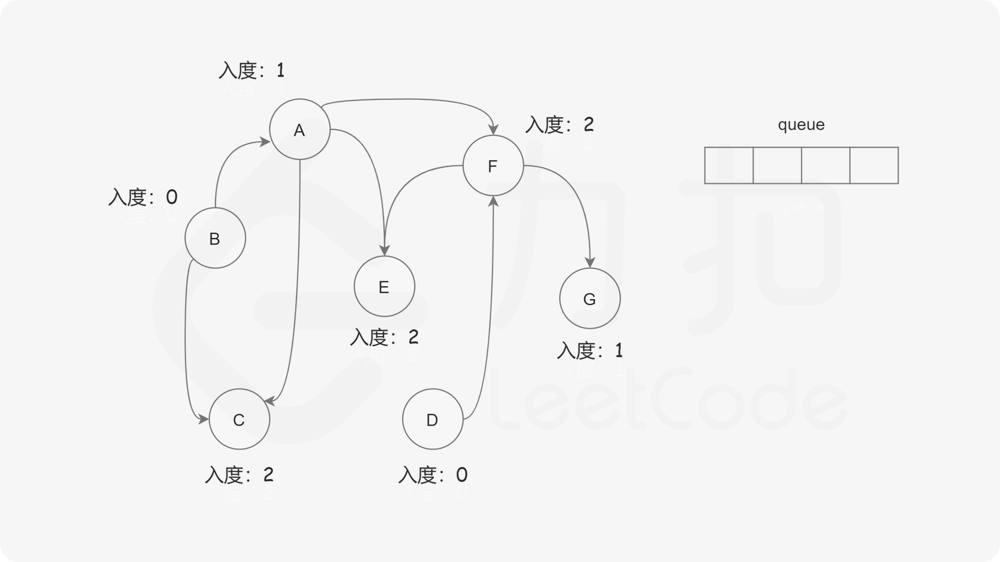
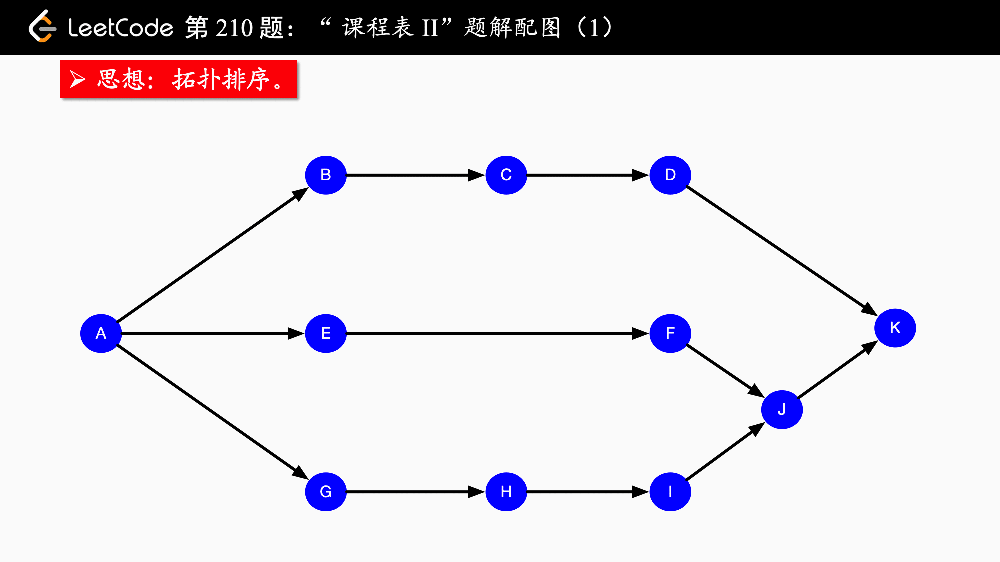

# DFS/BFS

[树](DS_Tree/README.md) 中 **Sec 4.2 + Sec 4.3** 迭代遍历为 DFS，**Sec 4.4** 层序遍历为 BFS

[图](DS_Graph/README.md) 中 **图的遍历** 有 DFS/ BFS 详细概述


## 547. 省份数量

```c++
bool vis[205];

void dfs(vector<vector<int>>& isConnected, int u) {
    vis[u] = true;
    for (int i = 0; i < isConnected.size(); ++i) {
        if (isConnected[u][i] != 0 && vis[i] == false)
            dfs(isConnected, i);
    }
}

int findCircleNum(vector<vector<int>>& isConnected) {
    int res = 0;

    for (int i = 0; i < isConnected.size(); ++i) {
        vis[i] = false;
    }

    for (int i = 0; i < isConnected.size(); ++i) {
        if (vis[i] == false) {
            dfs(isConnected, i);
            res++;
        }
    }


    return res;
}
```


---

## 207. 课程表

经典的「拓扑排序」问题。


----

## 210. 课程表 II

本题是一道经典的「拓扑排序」问题。

给出一个包含 n 个节点的有向图 G，给出它的节点编号的一种排序，如果满足：

对于图 G 中的任意一条有向边 $(u, v)$，$u$ 在排列中都出现在 $v$ 的前面。

那么称该排列是图 G 的「拓扑排序」。


根据上述的定义，我们可以得出两个结论：

- 如果图 G 中存在环（即图 G 不是「有向无环图」），那么图 G 不存在拓扑排序。这是因为假设图中存在环 $x_1, x_2, \cdots, x_n$,，那么 $x_1$  在排列中必须出现在 $x_n$ 的前面，但 $x_n$ 同时也必须出现在 $x_1$ 的前面，因此不存在一个满足要求的排列，也就不存在拓扑排序；

- 如果图 G 是有向无环图，那么它的拓扑排序**可能不止一种**。举一个最极端的例子，如果图 G 值包含 n 个节点却没有任何边，那么任意一种编号的排列都可以作为拓扑排序。


有了上述的简单分析，我们就可以将本题建模成一个求拓扑排序的问题了：

- 我们将每一门课看成一个节点；

- **如果想要学习课程 A 之前必须完成课程 B**，那么**我们从 B 到 A 连接一条有向边**。这样一来，在拓扑排序中，B 一定出现在 A 的前面。


求出该图的拓扑排序，就可以得到一种符合要求的课程学习顺序。


BFS为什么不用特地判断是否有环：在任何时候（包括初始情况）环上的节点的入度都不会为0，所以这些节点永远不会被加入队列


### BFS

我们考虑拓扑排序中最前面的节点，该节点一定不会有任何入边，（也就是它没有任何的先修课程要求）。


当我们将一个节点加入答案中后，我们就可以移除它的所有出边，代表着它的相邻节点**少了一门先修课程的要求**。如果某个相邻节点变成了「**没有任何入边的节点**」，那么就代表着这门课可以开始学习了

按照这样的流程，我们不断地将没有入边的节点加入答案，直到答案中包含所有的节点（得到了一种拓扑排序）或者不存在没有入边的节点（图中包含环）。


开始时，所有入度为 0 的节点（意味着零基础可以直接修的课）都被放入队列中，它们就是可以作为拓扑排序最前面的节点，并且它们之间的相对顺序是无关紧要的。


在广度优先搜索的每一步中，我们取出队首的节点 u：

- 我们将 u 放入答案中；
- 我们移除 u 的所有出边，也就是将 u 的所有相邻节点的入度减少 1。如果某个相邻节点 v 的入度变为 0，那么我们就将 v 放入队列中。







在广度优先搜索的过程结束后。如果答案中包含了这 n 个节点，那么我们就找到了一种拓扑排序，否则说明图中存在环，也就不存在拓扑排序了。

```c++
class Solution {
private:
    // 存储有向图
    vector<vector<int>> edges;
    // 存储每个节点的入度
    vector<int> indeg;
    // 存储答案
    vector<int> result;

public:
    vector<int> findOrder(int numCourses, vector<vector<int>>& prerequisites) {
        edges.resize(numCourses);
        indeg.resize(numCourses);
        
        for (const auto& info: prerequisites) {
            edges[info[1]].push_back(info[0]);	// 注意这里
            ++indeg[info[0]];
        }

        queue<int> q;
        // 将所有入度为 0 的节点放入队列中
        for (int i = 0; i < numCourses; ++i) {
            if (indeg[i] == 0) q.push(i);
        }

        while (!q.empty()) {
            // 从队首取出一个节点
            int u = q.front(); q.pop();
            // 放入答案中
            result.push_back(u);
            for (int v: edges[u]) {
                --indeg[v];
                // 如果相邻节点 v 的入度为 0，就可以选 v 对应的课程了
                if (indeg[v] == 0) q.push(v);
            }
        }

        if (result.size() != numCourses) return {};

        return result;
    }
};
```


---

## 630. 课程表 III


---

## 1462. 课程表 IV


## 

1. 构建一个图表示从i到j是否可达，默认为false
2. 构建方式
   - prerequisites来直接构建
   - 基于中间k点即Flyod方式来判断是否可达


floyed 算法
判断从 i 到 j 是否有路径。
判断从 i 途径 mid 到 j 是否有路径。

```c++
class Solution {
public:
    vector<bool> checkIfPrerequisite(int numCourses, vector<vector<int>>& prerequisites, vector<vector<int>>& queries) {
        // 先修课程，grpah[i][j] = 1 表示 i 是 j 的先修课程
        bool graph[numCourses][numCourses];
        memset(graph, 0, sizeof(bool)*numCourses*numCourses);
		
         // 构建图
        for (const auto &data : prerequisites) {
            graph[data[0]][data[1]] = true;
        }
	
        
        // Floyd算法的本质是DP，而k是DP的阶段，因此要写最外面
        for (int k = 0; k < numCourses; ++k) {
            for (int i = 0; i < numCourses; ++i) {
                for (int j = 0; j < numCourses; ++j) {
                    // i 是 k 的先导课程，k 是 j 的先导课程
                    if (graph[i][k] && graph[k][j]) {
                        graph[i][j] = true;
                    }
                }
            }
        }
       
        // 遍历quries直接从graph得到结果
        vector<bool> res;
        for (const auto &q : queries) {
            if (graph[q[0]][q[1]]) res.push_back(true);
            else res.push_back(false);
        }

        return res;
    }

     
};

```


```c++
class Solution {
public:
    vector<bool> checkIfPrerequisite(int numCourses, vector<vector<int>>& prerequisites, vector<vector<int>>& queries) {
        int n = numCourses;
        vector<vector<int>> graph(n);

        for (auto &pre : prerequisites) {
            graph[pre[0]].push_back(pre[1]);
        }

        vector<vector<bool>> isReached(n, vector<bool>(n));
        for (int i = 0; i < n; i++) {
            queue<int> q;
            q.push(i);
            while (!q.empty()) {
                int u = q.front();
                q.pop();
                for (auto &v : graph[u]) {
                    if (!isReached[i][v]) { /* 从课程i到达的其他课程进行标记 */
                        isReached[i][v] = true;
                        q.push(v);
                    }
                }
            }
        }

        vector<bool> ans;
        for (auto &query : queries) {
            ans.push_back(isReached[query[0]][query[1]]);
        }
        return ans;
    }
};
```


```c++
class Solution {
public:
    vector<bool> checkIfPrerequisite(int numCourses, vector<vector<int>>& prerequisites, vector<vector<int>>& queries) {
		edges.resize(numCourses);
        indeg.resize(numCourses);
        pre.resize(numCourses);
        
        for(auto &v:prerequisites){
            int v1=v[0],v2=v[1];
            edges[v1].push_back(v2);
            indeg[v2]++;
        }

        queue<int> q;
        for(int i=0;i<numCourses;i++){
            if(degree[i]==0)
                q.push(i);
        }
        while(!q.empty()){
            int course=q.front();
            q.pop();
            for(auto next:edge[course]){
                degree[next]--;
                pre[next].insert(pre[course].begin(),pre[course].end());
                pre[next].insert(course);
                if(degree[next]==0)
                    q.push(next);
            }
        }
        vector<bool>res;
       
        for(auto q:queries){
            if(pre[q[1]].find(q[0])!=pre[q[1]].end())
                res.push_back(true);
            else
                res.push_back(false);
        }
        return res;
    }
    
private:
    vector<vector<int>> edge;
    vector<int> degree;
    vector<set<int>> pre;
};
```


