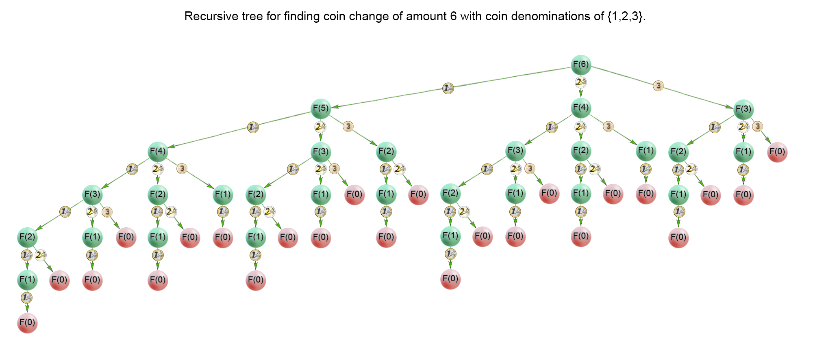

# DFS/BFS

[树](DS_Tree/README.md) 中 **Sec 4.2 + Sec 4.3** 迭代遍历为 DFS，**Sec 4.4** 层序遍历为 BFS

[图](DS_Graph/README.md) 中 **图的遍历** 有 DFS/ BFS 详细概述


## 547. 省份数量

```c++
bool vis[205];

void dfs(vector<vector<int>>& isConnected, int u) {
    vis[u] = true;
    for (int i = 0; i < isConnected.size(); ++i) {
        if (isConnected[u][i] != 0 && vis[i] == false)
            dfs(isConnected, i);
    }
}

int findCircleNum(vector<vector<int>>& isConnected) {
    int res = 0;

    for (int i = 0; i < isConnected.size(); ++i) {
        vis[i] = false;
    }

    for (int i = 0; i < isConnected.size(); ++i) {
        if (vis[i] == false) {
            dfs(isConnected, i);
            res++;
        }
    }


    return res;
}
```


----

## 210. 课程表 II

本题是一道经典的「拓扑排序」问题。

给出一个包含 n 个节点的有向图 G，给出它的节点编号的一种排序，如果满足：

对于图 G 中的任意一条有向边 $(u, v)$，$u$ 在排列中都出现在 $v$ 的前面。

那么称该排列是图 G 的「拓扑排序」。


根据上述的定义，我们可以得出两个结论：

- 如果图 G 中存在环（即图 G 不是「有向无环图」），那么图 G 不存在拓扑排序。这是因为假设图中存在环 $x_1, x_2, \cdots, x_n$,，那么 $x_1$  在排列中必须出现在 $x_n$ 的前面，但 $x_n$ 同时也必须出现在 $x_1$ 的前面，因此不存在一个满足要求的排列，也就不存在拓扑排序；

- 如果图 G 是有向无环图，那么它的拓扑排序**可能不止一种**。举一个最极端的例子，如果图 G 值包含 n 个节点却没有任何边，那么任意一种编号的排列都可以作为拓扑排序。


有了上述的简单分析，我们就可以将本题建模成一个求拓扑排序的问题了：

- 我们将每一门课看成一个节点；

- **如果想要学习课程 A 之前必须完成课程 B**，那么**我们从 B 到 A 连接一条有向边**。这样一来，在拓扑排序中，B 一定出现在 A 的前面。


求出该图的拓扑排序，就可以得到一种符合要求的课程学习顺序。


BFS为什么不用特地判断是否有环：在任何时候（包括初始情况）环上的节点的入度都不会为0，所以这些节点永远不会被加入队列


### BFS

我们考虑拓扑排序中最前面的节点，该节点一定不会有任何入边，（也就是它没有任何的先修课程要求）。


当我们将一个节点加入答案中后，我们就可以移除它的所有出边，代表着它的相邻节点**少了一门先修课程的要求**。如果某个相邻节点变成了「**没有任何入边的节点**」，那么就代表着这门课可以开始学习了

按照这样的流程，我们不断地将没有入边的节点加入答案，直到答案中包含所有的节点（得到了一种拓扑排序）或者不存在没有入边的节点（图中包含环）。


开始时，所有入度为 0 的节点（意味着零基础可以直接修的课）都被放入队列中，它们就是可以作为拓扑排序最前面的节点，并且它们之间的相对顺序是无关紧要的。


在广度优先搜索的每一步中，我们取出队首的节点 u：

- 我们将 u 放入答案中；
- 我们移除 u 的所有出边，也就是将 u 的所有相邻节点的入度减少 1。如果某个相邻节点 v 的入度变为 0，那么我们就将 v 放入队列中。


在广度优先搜索的过程结束后。如果答案中包含了这 n 个节点，那么我们就找到了一种拓扑排序，否则说明图中存在环，也就不存在拓扑排序了。

```c++
class Solution {
private:
    // 存储有向图
    vector<vector<int>> edges;
    // 存储每个节点的入度
    vector<int> indeg;
    // 存储答案
    vector<int> result;

public:
    vector<int> findOrder(int numCourses, vector<vector<int>>& prerequisites) {
        edges.resize(numCourses);
        indeg.resize(numCourses);
        
        for (const auto& info: prerequisites) {
            edges[info[1]].push_back(info[0]);	// 注意这里
            ++indeg[info[0]];
        }

        queue<int> q;
        // 将所有入度为 0 的节点放入队列中
        for (int i = 0; i < numCourses; ++i) {
            if (indeg[i] == 0) q.push(i);
        }

        while (!q.empty()) {
            // 从队首取出一个节点
            int u = q.front(); q.pop();
            // 放入答案中
            result.push_back(u);
            for (int v: edges[u]) {
                --indeg[v];
                // 如果相邻节点 v 的入度为 0，就可以选 v 对应的课程了
                if (indeg[v] == 0) q.push(v);
            }
        }

        if (result.size() != numCourses) return {};

        return result;
    }
};
```


---

## 207. 课程表

经典的「拓扑排序」问题。

看课程表 II


---

## 630. 课程表 III


---

## 1462. 课程表 IV


## 

1. 构建一个图表示从i到j是否可达，默认为false
2. 构建方式
   - prerequisites来直接构建
   - 基于中间k点即Flyod方式来判断是否可达


floyed 算法
判断从 i 到 j 是否有路径。
判断从 i 途径 mid 到 j 是否有路径。

```c++
class Solution {
public:
    vector<bool> checkIfPrerequisite(int numCourses, vector<vector<int>>& prerequisites, vector<vector<int>>& queries) {
        // 先修课程，grpah[i][j] = 1 表示 i 是 j 的先修课程
        bool graph[numCourses][numCourses];
        memset(graph, 0, sizeof(bool)*numCourses*numCourses);
		
         // 构建图
        for (const auto &data : prerequisites) {
            graph[data[0]][data[1]] = true;
        }
	
        
        // Floyd算法的本质是DP，而k是DP的阶段，因此要写最外面
        for (int k = 0; k < numCourses; ++k) {
            for (int i = 0; i < numCourses; ++i) {
                for (int j = 0; j < numCourses; ++j) {
                    // i 是 k 的先导课程，k 是 j 的先导课程
                    if (graph[i][k] && graph[k][j]) {
                        graph[i][j] = true;
                    }
                }
            }
        }
       
        // 遍历quries直接从graph得到结果
        vector<bool> res;
        for (const auto &q : queries) {
            if (graph[q[0]][q[1]]) res.push_back(true);
            else res.push_back(false);
        }

        return res;
    }

     
};

```


```c++
class Solution {
public:
    vector<bool> checkIfPrerequisite(int numCourses, vector<vector<int>>& prerequisites, vector<vector<int>>& queries) {
        int n = numCourses;
        vector<vector<int>> graph(n);

        for (auto &pre : prerequisites) {
            graph[pre[0]].push_back(pre[1]);
        }

        vector<vector<bool>> isReached(n, vector<bool>(n));
        for (int i = 0; i < n; i++) {
            queue<int> q;
            q.push(i);
            while (!q.empty()) {
                int u = q.front();
                q.pop();
                for (auto &v : graph[u]) {
                    if (!isReached[i][v]) { /* 从课程i到达的其他课程进行标记 */
                        isReached[i][v] = true;
                        q.push(v);
                    }
                }
            }
        }

        vector<bool> ans;
        for (auto &query : queries) {
            ans.push_back(isReached[query[0]][query[1]]);
        }
        return ans;
    }
};
```


```c++
class Solution {
public:
    vector<bool> checkIfPrerequisite(int numCourses, vector<vector<int>>& prerequisites, vector<vector<int>>& queries) {
		edges.resize(numCourses);
        indeg.resize(numCourses);
        pre.resize(numCourses);
        
        for(auto &v:prerequisites){
            int v1=v[0],v2=v[1];
            edges[v1].push_back(v2);
            indeg[v2]++;
        }

        queue<int> q;
        for(int i=0;i<numCourses;i++){
            if(degree[i]==0)
                q.push(i);
        }
        while(!q.empty()){
            int course=q.front();
            q.pop();
            for(auto next:edge[course]){
                degree[next]--;
                pre[next].insert(pre[course].begin(),pre[course].end());
                pre[next].insert(course);
                if(degree[next]==0)
                    q.push(next);
            }
        }
        vector<bool>res;
       
        for(auto q:queries){
            if(pre[q[1]].find(q[0])!=pre[q[1]].end())
                res.push_back(true);
            else
                res.push_back(false);
        }
        return res;
    }
    
private:
    vector<vector<int>> edge;
    vector<int> degree;
    vector<set<int>> pre;
};
```


---

## LCP 52. 二叉搜索树染色

其实和二叉搜索树一点关系都没有。

每个点的颜色只取决于最后一次包含该点的操作。用 set 维护所有颜色待确定的点，倒序处理询问，每次利用 lower_bound 方法从 set 中取出所有在询问范围内的点染色后删掉。因为每个点只会被删掉一次，所以总体复杂度 $\mathcal{O}((n + q)\log n)$，其中 n 是节点数量，q 是询问数量。


**ERROR**

```c++
int getNumber(TreeNode* root, vector<vector<int>>& ops) {
    dfs(root);

    int cnt = 0;

    for (int i = ops.size() - 1; i >= 0; --i)  {   //1e5 倒着来
        if (!st.size()) break;

        for (int j = ops[i][1]; j <= ops[i][2]; ++j) {
            if (!st.count(j)) continue;
            st.erase(j);
            if (ops[i][0]) cnt++;
        }

    }

    return cnt;
}
```


```c++
set<int> st;

/*把所有节点放入set中，BST中序得到有序数组，不过无所谓，set就是有序的*/
void dfs(TreeNode* node) {  
    if (node == nullptr) return;
    dfs(node->left);
    st.insert(node->val);
    dfs(node->right);
}

int getNumber(TreeNode* root, vector<vector<int>>& ops) {
    dfs(root);

    int cnt = 0;

    for (int i = ops.size() - 1; i >= 0; --i)  {   //1e5 倒着来
        if (!st.size()) break;	// 剪枝:set为空说明全染好了，直接break即可
		
        // lower_bound 寻找在数组或容器范围内第一个值大于等于val元素的位置
        while (true) {
            // ops[i][1] = start
            // ops[i][2] = end
            // 值必须在 ops[i][1]~ops[i][2] 左闭右闭之间才能染色并从 set 中删除
            auto it = st.lower_bound(ops[i][1]);	// 找第一个值大于等于start元素的位置
            if (it == st.end()) break;				// 剪枝：如果没有大于等于start的值,即所有值都小于start,不在染色区间, *(it++)>=(*it) 没必要在while中退出
            if (*it > ops[i][2]) break;				// 剪枝：如果该值比end还大,不在染色区间，*(it++)>=(*it) 没必要在while中退出
            st.erase(*it);	// 删除这个元素 这个元素值必在  之间 
            if (ops[i][0]) cnt++;
        }

    }

    return cnt;
}
```


```c++
class Solution {
    set<int> st;

    void dfs(TreeNode *node) {
        if (node == nullptr) return;
        st.insert(node->val);
        dfs(node->left);
        dfs(node->right);
    }

public:
    int getNumber(TreeNode* root, vector<vector<int>>& ops) {
        dfs(root);
        int ans = 0;
        for (int i = (int) ops.size() - 1; i >= 0; i--) {
            while (true) {
                auto it = st.lower_bound(ops[i][1]);
                if (it == st.end() || (*it) > ops[i][2]) break;
                st.erase(it);
                if (ops[i][0]) ans++;
            }
        }
        return ans;
    }
};
```


---


# BFS

## 1306. 跳跃游戏 III

刚开始的错误写法，属于想多了，从尾往前，但其实正向bfs好一点

```c++
bool bfs(vector<int>& arr, int start, int zeroIdx) {
    int n = arr.size();
    queue<int> q;         // 存下标
    q.push(zeroIdx);

    bool vis[n+1]; memset(vis, false, sizeof vis);

    while (!q.empty()) {
        int p = q.front(); q.pop();

        if (vis[p]) continue;
        vis[p] = true;

        if (p == start) {
            return true;
        }

        for (int i = 0; i < n; ++i) {
            if (i + arr[i] == p || i - arr[i] == p)
                q.push(i);
        }
    }

    return false;
}

bool canReach(vector<int>& arr, int start) {
    int n = arr.size();
    int zeroIdx = find(arr.begin(), arr.end(), 0) - arr.begin();

    unordered_set<int> st;

    for (int i = 0; i < n; ++i) {
        if (arr[i] == 0)
            st.insert(i);
    }

    for (auto &idx : st)
        if (bfs(arr, start, idx))
            return true;

    return false;
}
```


```c++
bool canReach(vector<int>& arr, int start) {
    int n = arr.size();

    queue<int> q;
    q.push(start);

    bool vis[n+1]; memset(vis, false, sizeof vis);

    while (!q.empty()) {
        int idx = q.front(); q.pop();

        if (arr[idx] == 0) 
            return true;

        if (vis[idx]) continue;
        vis[idx] = true;

        if (idx + arr[idx] < n) q.push(idx + arr[idx]);
        if (idx - arr[idx] >= 0) q.push(idx - arr[idx]);           
    }

    return false;
}
```


---

## 1345. 跳跃游戏 IV

抽象成**无向图**，然后起点为0，终点为n，找到起点到终点的最短路径

然后每个点跟其相同值的点互通，每个点跟它前后点互通 **无向无权图**

暴力 bfs 遍历所有点所有边，$O(N^2)$ 


优化对于等值顶点构成的子图，其实在**遍历其中一个顶点时**，**就将整个子图访问一次**，**之后清空整个子图**，从而**避免重复访问该子图**


解题步骤：

- 使用map 保存图的顶点和边，即 key 为元素的值，value 记录的是索引
- 首个顶点入队，开始 BFS 搜索，当搜索到某个顶点时，将其连接的其它顶点入队
- 搜索中，分为三种情况
  - 向前跳
  - 向后跳
  - 等值跳

- 为了避免重复访问顶点，标记每个顶点是否访问过，访问过就不入队，
- 避免重复访问子图，需要将第一次添加等值子图入队之后，将该元素从map中删除，后续搜索不会在将该子图加入队列。
- 队列中放 pair，分别表示当前索引和步数


广度优先的解法

- 对于目前状态，会有3种下一步的情况
  - +1
  - -1
  - 和相同数字的其他坐标：通过数组来预先构建
- 记录一个isVisited来避免循环遍历
- 遍历的层数就是对应的操作次数


```c++
// 方法1 ： 单向BFS
public int minJumps(int[] arr) {
    if (arr == null || arr.length == 0) return -1;
    int n = arr.length;
    if (n == 1) return 0;
    Map<Integer, List<Integer>> indexMap = new HashMap<>();
    // 哈希表存 value 和 index
    for (int i = 0; i < n; i++) {
        List<Integer> list = indexMap.getOrDefault(arr[i], new ArrayList<>());
        list.add(i);
        indexMap.put(arr[i], list);
    }
    
    boolean[] visited = new boolean[n];
    Deque<int[]> deque = new LinkedList<>(); // int[] {index, step}
    deque.add(new int[]{0, 0});
    
    while (!deque.isEmpty()) {
        int[] cur = deque.poll();
        int index = cur[0];
        int step = cur[1];
        // 搜到了末尾
        if (index == n - 1) return step;
        // 前后跳
        if (index + 1 < n && !visited[index + 1]) {
            deque.add(new int[]{index + 1, step + 1});
            visited[index + 1] = true;
        }
        if (index - 1 >= 0 && !visited[index - 1]) {
            deque.add(new int[]{index - 1, step + 1});
            visited[index - 1] = true;
        }
        // 等值跳
        if (indexMap.containsKey(arr[index])) {
            List<Integer> indexList = indexMap.get(arr[index]);
            for (int idx : indexList) {
                if(!visited[idx]) {
                    deque.add(new int[]{idx, step + 1});
                    visited[idx] = true;
                }
            }
        }
        // 注意从哈希表中删除访问过的元素
        indexMap.remove(arr[index]);
    }
    
    return -1;
}
```


----

# 记忆化搜索

- 记忆化搜索的框架。 总共可以归纳为以下四步：
    1）合法性剪枝
    2）偏序关系剪枝
    3）记忆化剪枝
    4）递归计算结果并返回


**1）合法性剪枝**

因为在递归计算的时候，我们必须保证传入参数的合法性，所以这一步是必要的，比如坐标为负数之类的判断；

**2）偏序关系剪枝**

偏序关系其实就是代表了状态转移的方向，例如只允许值大的往值小的方向走，这就是一种偏序关系；如果不满足偏序关系的就不能继续往下搜索了；

**3）记忆化剪枝**

记忆化剪枝就是去对应的哈希数组判断这个状态是否曾经已经计算过，如果计算过则直接返回，时间复杂度  ；

**4）递归计算结果并返回**

这一步就是深度优先搜索的递归过程，也是递归子问题取最优解的过程，需要具体问题具体分析；


- 记忆化搜索的优点

**1、忽略边界判断**

状态转移的时候完全不需要进行边界判断，只需要在递归调用的出口进行统一判断即可，这样使得代码更加简洁清晰；

**2、编码方便**

相比动态规划而言，不用去关心子问题的枚举顺序问题，也不用管数组下标越界问题，只要按照深度优先搜索的思路，把代码框架写好，再加入记忆化部分的代码即可，实现方便，手到擒来；


## 模板

```c++
int dfs(mem)
{
    // 终止条件
    if (xxx) return -1;
    if (xxx) return 0;
    if (mem[xxx] != -1) return mem[xxx];

    // 求解体
    int minval = INT_MAX;
    for () {
        int val = dfs(mem);
        if (val) {
            minval = min(minval, val);
        }
    }

    // 当次记忆化结果更新，回溯
    return mem[xxx] = minval;
}
```


## 01背包

### 416. 分割等和子集

递归搜索：常规的递归搜索 dfs(i, *args) 在到达一个位置 i 时无非有两种情况（选或不选）：

- 跳过 i 位置：直接考虑下一步；
- 选择 i 位置：根据实际情况判断该选择是否可行，以及选择 i 之后的下一步操作如何进行。

恰好对应于选或不选第 ii 件物品。只不过目标为从 nums 中选出若干个数字使其和恰好等于数组总和的一半，记为 $target = \frac{sum}{2}$


针对每一个元素，都有“减去”和“不减”两种选项。

输入 [1, 1, 1, 4, 5]，总和 sum 为12，取半half 为6；
针对第一个元素，减去得 5，不减得 6，依次产生完全二叉树；
**出现负数直接返回否，等于0直接返回是**。

```c++
class Solution {
public:
    bool dfs(int i, int target, vector<int>& nums) {
        if (target == 0) return true;
        // target为负数 或 nums数组遍历完 返回false
        if (target < 0 || i == nums.size()) return false;

        // 选这个数字   减这个数字
        bool b1 = dfs(i+1, target - nums[i], nums);

        // 不选这个数字 不减这个数字
        bool b2 = dfs(i+1, target, nums);

        return b1 || b2;
    }

    bool canPartition(vector<int>& nums) {
        int sumn = accumulate(nums.begin(), nums.end(), 0);

        if (sumn & 1) return false;

        int target = sumn / 2;

        return dfs(0, target, nums);
    }
};
```

上述算法的时间复杂度接近 $O(2^n),\ n=len(nums)$ ，因此不适合 nums 中元素较多的情况。

很多**自上而下的递归搜索过程**都可以修改为复杂度更低的**自下而上的动态规划过程**。


里面有大量重复元素。思考发现，在二叉树的**同一层**出发，如果剩下的数字`remain`一样大，它后续的分支是完全相同的。


> “只选第一个1”和“只选第二个1”的结果是一样的；
> 同一层的两个`remain`如果相同，它们的子树就完全相同。

针对这种情况我们引入记忆化搜索。

每次递归，我们检查这个`remain`是否在这一层出现过。如果是，就跳过这个结点。

```c++
bool dfs(int i, int remain, vector<int>& nums, vector<vector<int>> &memo) {
    if (remain == 0) return true;
    if (remain < 0 || i == nums.size()) return false;

    // 记忆化
    if (memo[i][remain] != -1) return memo[i][remain];
    memo[i][remain] = dfs(i+1, remain - nums[i], nums, memo) || dfs(i+1, remain, nums, memo);    //注意这里是 || 有一条路可以满足就行   

    /*
        // 选这个数字   减这个数字
        bool b1 = dfs(i+1, remain - nums[i], nums)
        // 不选这个数字 不减这个数字
        bool b2 = dfs(i+1, remain, nums);
        */

    return memo[i][remain];
}

bool canPartition(vector<int>& nums) {
    int sumn = accumulate(nums.begin(), nums.end(), 0);

    if (sumn & 1) return false;

    int target = sumn / 2;

    vector<vector<int>> memo(nums.size(), vector<int>(target + 1, -1)); //memo[i][j]里存出现过，就直接返回它的值

    return dfs(0, target, nums, memo);
}    
```


可以看到，现在每一层同一个`remain`数字只出现一次。


---

### 474. 一和零

最重要的一点，如果传入的参数中有 cnt，那么 memo 里的索引要有 cnt，i，m，n

暴力遍历 22/71

```c++
int dfs(const vector<vector<int>> &nums, int m, int n, int nowM, int nowN, int cnt, int i) {
    if (nowM > m || nowN > n) return 0; // 超过了 不满足
    // 以下情况为 nowM <= m 和 nowN <= n的情况
    if (i == nums.size()) return cnt;   // 题目要求最多 有 m 个 0 和 n 个 1 。 因此不==也可以

    // 要
    int i1 = dfs(nums, m, n, nowM + nums[i][0], nowN + nums[i][1], cnt + 1, i + 1);
    // 不要
    int i2 = dfs(nums, m, n, nowM, nowN, cnt, i+1);

    return max(i1, i2);
}

int findMaxForm(vector<string>& strs, int m, int n) {
    int len = strs.size();
	vector<vector<int>> nums(len, vector<int>(2, 0));

    for (int i = 0; i < len; ++i) {
        nums[i][0] = count(strs[i].begin(), strs[i].end(), '0');
        nums[i][1] = strs[i].size() - nums[i][0];
    } 

    int b = dfs(nums, m, n, 0, 0, 0, 0);
    return b;
}
```


用 `vector<unordered_set<int>>` ，WA 66/71

```c++
int dfs(const vector<vector<int>> &nums, int m, int n, int nowM, int nowN, int cnt, int i) {
    if (nowM > m || nowN > n) return 0; // 超过了 不满足
    // 以下情况为 nowM <= m 和 nowN <= n的情况
    if (i == nums.size()) return cnt;   // 题目要求最多 有 m 个 0 和 n 个 1 。 因此不==也可以

    int idx = nowM * 610 + nowN;
    if (dp[i].find(idx) != dp[i].end()) return 0;
    dp[i].insert(idx);

    // max(要, 不要)    
    return max(dfs(nums, m, n, nowM + nums[i][0], nowN + nums[i][1], cnt + 1, i + 1), dfs(nums, m, n, nowM, nowN, cnt, i+1));
}

int findMaxForm(vector<string>& strs, int m, int n) {
    int len = strs.size();
    dp.resize(len);
    vector<vector<int>> nums(len, vector<int>(2, 0));

    for (int i = 0; i < len; ++i) {
        nums[i][0] = count(strs[i].begin(), strs[i].end(), '0');
        nums[i][1] = strs[i].size() - nums[i][0];
    } 

    return dfs(nums, m, n, 0, 0, 0, 0);
}

vector<unordered_set<int>> dp; 
```


转成用三维数组存，WA 66/71

```c++
int dfs(const vector<vector<int>> &nums, int m, int n, int nowM, int nowN, int cnt, int i, vector<vector<vector<int>>> &memo) {
    if (i > nums.size() || nowM > m || nowN > n) return 0; // 超过了 不满足
    // 以下情况为 nowM <= m 和 nowN <= n的情况
    if (i == nums.size()) return cnt;   // 题目要求最多 有 m 个 0 和 n 个 1 。 因此不==也可以

    if (memo[i][nowM][nowN] != -1) return memo[i][nowM][nowN];
    memo[i][nowM][nowN] = max(dfs(nums, m, n, nowM + nums[i][0], nowN + nums[i][1], cnt + 1, i + 1, memo), 
                              dfs(nums, m, n, nowM, nowN, cnt, i+1, memo));

    // max(要, 不要)    
    return memo[i][nowM][nowN];
}

int findMaxForm(vector<string>& strs, int m, int n) {
    int len = strs.size();
    vector<vector<int>> nums(len, vector<int>(2, 0));

    for (int i = 0; i < len; ++i) {
        nums[i][0] = count(strs[i].begin(), strs[i].end(), '0');
        nums[i][1] = strs[i].size() - nums[i][0];
    } 

    vector<vector<vector<int>>> memo(len, vector<vector<int>>(m+1, vector<int>(n+1, -1)));
    return dfs(nums, m, n, 0, 0, 0, 0, memo);
}
```


应该自顶向下，而之前的写法是自底向上！！！！！！！！！


自顶向下还是 WA 66/71？？？？？？？？

```c++
int dfs(const vector<vector<int>> &nums, int m, int n, int cnt, int i, vector<vector<vector<int>>> &memo) {
    if (m < 0 || n < 0) return 0; // 减成负数了 不满足
    // 以下情况为 m>=0 和 n>=0 的情况
    if (i == nums.size()) { return cnt;}   // 题目要求最多 有 m 个 0 和 n 个 1 。 因此不==也可以,这里也相当于剪枝，要求i不越界


    if (memo[i][m][n] != -1) return memo[i][m][n];

    int i1 = dfs(nums, m, n, cnt, i+1, memo);
    int i2 = dfs(nums, m - nums[i][0], n - nums[i][1], cnt + 1, i + 1, memo);

    // max(要, 不要)    
    memo[i][m][n] = max(i1, i2);        
    return memo[i][m][n];
}

int findMaxForm(vector<string>& strs, int m, int n) {
    int len = strs.size();
    vector<vector<int>> nums(len, vector<int>(2, 0));

    for (int i = 0; i < len; ++i) {
        nums[i][0] = count(strs[i].begin(), strs[i].end(), '0');
        nums[i][1] = strs[i].size() - nums[i][0];
    } 

    vector<vector<vector<int>>> memo(len, vector<vector<int>>(m+1, vector<int>(n+1, -1)));
    return dfs(nums, m, n, 0, 0, memo);
}
```


==不能传cnt进来，如果传进来，就需要单独再开一个维度保存cnt的索引==


记忆化

```c++
int dfs(vector<string>& strs, int m, int n, int index, vector<vector<vector<int>>>& meo) {
    if (index == strs.size()) {
        return 0;
    }
    if (meo[index][m][n] != -1) {
        return meo[index][m][n];
    }
    int zero = count(strs[index].begin(), strs[index].end(), '0');
    int one = strs[index].size() - zero;
    int a = dfs(strs, m, n, index + 1, meo);
    int b = 0;
    if (m - zero >= 0 && n - one >= 0) {
        b = 1 + dfs(strs, m - zero, n - one, index + 1, meo);
    }
    return meo[index][m][n] = max(a, b);
}

int findMaxForm(vector<string>& strs, int m, int n) {
    vector<vector<vector<int>>> meo(strs.size(), vector<vector<int>>(m + 1, vector<int>(n + 1, -1)));
    return dfs(strs, m, n, 0, meo);
}
```


#### 答案对但超时

45
60

```
["011","1","11","0","010","1","10","1","1","0","0","0","01111","011","11","00","11","10","1","0","0","0","0","101","001110","1","0","1","0","0","10","00100","0","10","1","1","1","011","11","11","10","10","0000","01","1","10","0"]
44
39
```

```
["1","0","1","0","1","0","1","0","1","0","1","0","1","0","1","0","1","0","1","0","1","0","1","0","1","0","1","0","1","0","1","0","1","0","1","0","1","0","1","0","1","0","1","0","1","0","1","0","1","0","1","0","1","0","1","0","1","0","1","0","1","0","1","0","1","0","1","0","1","0","1","0","1","0","1","0","1","0","1","0","1","0","1","0","1","0","1","0","1","0","1","0","1","0","1","0","1","0","1","0","1","0","1","0","1","0","1","0","1","0","1","0","1","0","1","0","1","0","1","0","1","0","1","0","1","0","1","0","1","0","1","0","1","0","1","0","1","0","1","0","1","0","1","0","1","0","1","0","1","0","1","0","1","0","1","0","1","0","1","0","1","0","1","0","1","0","1","0","1","0","1","0","1","0","1","0","1","0","1","0","1","0","1","0","1","0","1","0","1","0","1","0","1","0","1","0","1","0","1","0","1","0","1","0","1","0","1","0","1","0","1","0","1","0","1","0","1","0","1","0","1","0","1","0","1","0","1","0","1","0","1","0","1","0","1","0","1","0","1","0","1","0","1","0","1","0","1","0","1","0","1","0","1","0","1","0","1","0","1","0","1","0","1","0","1","0","1","0","1","0","1","0","1","0","1","0","1","0","1","0","1","0","1","0","1","0","1","0","1","0","1","0","1","0","1","0","1","0","1","0","1","0","1","0","1","0","1","0","1","0","1","0","1","0","1","0","1","0","1","0","1","0","1","0","1","0","1","0","1","0","1","0","1","0","1","0","1","0","1","0","1","0","1","0","1","0","1","0","1","0","1","0","1","0","1","0","1","0","1","0","1","0","1","0","1","0","1","0","1","0","1","0","1","0","1","0","1","0","1","0","1","0","1","0","1","0","1","0","1","0","1","0","1","0","1","0","1","0","1","0","1","0","1","0","1","0","1","0","1","0","1","0","1","0","1","0","1","0","1","0","1","0","1","0","1","0","1","0","1","0","1","0","1","0","1","0","1","0","1","0","1","0","1","0","1","0","1","0","1","0","1","0","1","0","1","0","1","0","1","0","1","0","1","0","1","0","1","0","1","0","1","0","1","0","1","0","1","0","1","0","1","0","1","0","1","0","1","0","1","0","1","0","1","0","1","0","1","0","1","0","1","0","1","0","1","0","1","0","1","0","1","0","1","0","1","0","1","0","1","0","1","0","1","0","1","0"]
30
30
```


```c++
int dfs(const vector<vector<int>> &nums, int m, int n, int cnt, int i, unordered_map<string, int> &memo) {
    if (m < 0 || n < 0) return 0;
    if (i == nums.size()) return cnt;

    string key = to_string(i) + "_" + to_string(m) + "_" + to_string(n) + "_" + to_string(cnt);
    if (memo.find(key) != memo.end()) return memo[key];

    // max(不要, 要) 
    return memo[key] = max(dfs(nums, m, n, cnt, i+1, memo), 
                           dfs(nums, m - nums[i][0], n - nums[i][1], cnt + 1, i + 1, memo));
}

int findMaxForm(vector<string>& strs, int m, int n) {
    int len = strs.size();
    vector<vector<int>> nums(len, vector<int>(2, 0));

    for (int i = 0; i < len; ++i) {
        nums[i][0] = count(strs[i].begin(), strs[i].end(), '0');
        nums[i][1] = strs[i].size() - nums[i][0];
    } 

    unordered_map<string, int> memo;

    return dfs(nums, m, n, 0, 0, memo);
}
```


#### unordered_map 优化

**key 从 string 优化为 int**

优化后，不要用 string 作为 key，用 int，把索引拉平

```c++
int dfs(const vector<vector<int>> &nums, int m, int n, int cnt, int i, unordered_map<long long, int> &memo) {
    if (m < 0 || n < 0) return 0;
    if (i == nums.size()) return cnt;

    long long key = cnt * (601*101*101) + i * (101*101) + m * (101)  +  n;
    if (memo.find(key) != memo.end()) return memo[key];

    // max(不要, 要) 
    return memo[key] = max(dfs(nums, m, n, cnt, i+1, memo), 
                           dfs(nums, m - nums[i][0], n - nums[i][1], cnt + 1, i + 1, memo));
}

int findMaxForm(vector<string>& strs, int m, int n) {
    int len = strs.size();
    vector<vector<int>> nums(len, vector<int>(2, 0));

    for (int i = 0; i < len; ++i) {
        nums[i][0] = count(strs[i].begin(), strs[i].end(), '0');
        nums[i][1] = strs[i].size() - nums[i][0];
    } 

    unordered_map<long long, int> memo;

    return dfs(nums, m, n, 0, 0, memo);
}
```


#### `vector<unordered_set<int>>` 优化

注意算idx的时候包括cnt，不用算 i 的原因是 `memo[i]`中包括了

```c++
int dfs(const vector<vector<int>> &nums, int m, int n, int nowM, int nowN, int cnt, int i, vector<unordered_set<int>> &memo) {
    if (nowM > m || nowN > n) return 0; // 超过了 不满足
    // 以下情况为 nowM <= m 和 nowN <= n的情况
    if (i == nums.size()) return cnt;   // 题目要求最多 有 m 个 0 和 n 个 1 。 因此不==也可以

    int idx = cnt * (101*101) + nowM * 110 + nowN;
    if (memo[i].find(idx) != memo[i].end()) return -9;
    memo[i].insert(idx);

    // max(要, 不要)    
    return max(dfs(nums, m, n, nowM + nums[i][0], nowN + nums[i][1], cnt + 1, i + 1, memo), dfs(nums, m, n, nowM, nowN, cnt, i+1, memo));
}

int findMaxForm(vector<string>& strs, int m, int n) {
    int len = strs.size();
    vector<vector<int>> nums(len, vector<int>(2, 0));

    for (int i = 0; i < len; ++i) {
        nums[i][0] = count(strs[i].begin(), strs[i].end(), '0');
        nums[i][1] = strs[i].size() - nums[i][0];
    } 

    vector<unordered_set<int>> memo(len); 

    return dfs(nums, m, n, 0, 0, 0, 0, memo);
}
```

这里 `if (memo[i].find(idx) != memo[i].end()) return cnt;` **无论返回多少都可以，没有关系？？？？？？？？？？？？？？？？？？**


#### 三维数组

```c++
int dfs(const vector<vector<int>> &nums, int m, int n, int i, vector<vector<vector<int>>> &memo) {
    if (i == nums.size()) { return 0;}   // 题目要求最多 有 m 个 0 和 n 个 1 。 因此不==也可以,这里也相当于剪枝，要求i不越界

    if (memo[i][m][n] != -1) return memo[i][m][n];

    int i1 = dfs(nums, m, n, i+1, memo);
    int i2 = 0;
    if (m - nums[i][0] >= 0 && n - nums[i][1] >= 0) {
        i2 = 1 + dfs(nums, m - nums[i][0], n - nums[i][1], i + 1, memo);
    }
    // max(要, 不要)    
    return memo[i][m][n] = max(i1, i2);
}

int findMaxForm(vector<string>& strs, int m, int n) {
    int len = strs.size();
    vector<vector<int>> nums(len, vector<int>(2, 0));

    for (int i = 0; i < len; ++i) {
        nums[i][0] = count(strs[i].begin(), strs[i].end(), '0');
        nums[i][1] = strs[i].size() - nums[i][0];
    } 

    vector<vector<vector<int>>> memo(len, vector<vector<int>>(m + 1, vector<int>(n + 1, -1)));
    return dfs(nums, m, n, 0, memo);
}
```


---

### 1755.最接近目标值的子序列和


### 2035.将数组分成两个数组并最小化数组和的差


### 805.数组的均值分割


---

## 完全背包

### 322. 零钱兑换

该问题可建模为以下优化问题：

$$
\min_{x} \sum_{i=0}^{n - 1} x_i \ \text{subject to} \sum_{i=0}^{n - 1} x_i \times c_i = S
$$
其中，S 是总金额，$c_i$  是第 i 枚硬币的面值，$x_i$ 是面值为 $c_i$ 的硬币数量，由于 $x_i \times c_i$ 不能超过总金额 S，可以得出 $x_i$ 最多不会超过 $\frac{S}{c_i}$ ，所以 $x_i$ 的取值范围为 $[{0, \frac{S}{c_i}}]$. 一个简单的解决方案是通过回溯的方法枚举每个硬币数量子集 $[x_0\dots\ x_{n - 1}]$ ，针对给定的子集计算它们组成的金额数，如果金额数为 S，则记录返回合法硬币总数的最小值，反之返回 -1。

该做法的时间复杂度为 $O(S^n)$，会超出时间限制，因此必须加以优化。


利用动态规划，可以在多项式的时间范围内求解。首先，定义：

- $F(S)$：组成金额 S 所需的最少硬币数量
- $[c_0\dots c_{n-1}]$：可选的 n 枚硬币面额值

这个问题有一个最优子结构的性质。

假设我们知道 $F(S)$，即组成金额 S 最少的硬币数，最后一枚硬币的面值是 C。转移方程为
$$
F(S) = F(S-C) +1
$$
由于不确定最后一枚硬币面值是什么，所以需要枚举每个硬币面额值 $c_0, c_1, c_2 \ldots c_{n -1}$ 并选择其中的最小值。
$$
F(S)=\min _{i=0 . . n-1} F\left(S-c_{i}\right)+1  \ \ \ \text{subject to} \ \ \ S-c_{i} \geq 0 \\

\begin{array}{c}
F(S)=0, \text { when } S=0 \\
F(S)=-1, \text { when } n=0
\end{array}
$$




在上面的递归树中，我们可以看到许多子问题被多次计算。例如，$F(1)$ 被计算了13次。为了避免重复计算，我们要将子问题的答案存在一个数组中进行记忆化。保证每个子问题最多只被计算一次。

```c++
int dfs(vector<int>& coins, int rem, vector<int> &memo) {
    if (rem < 0) return -1;
    if (rem == 0) return 0;

    // 有记忆, 直接返回所需的最少硬币个数
    if (memo[rem] != -2) return memo[rem];    


    int minCnt = INT_MAX;
    for (int i = 0; i < coins.size(); ++i) {
        int cnt = dfs(coins, rem - coins[i], memo);
        if (cnt != -1 ) minCnt = min(cnt, minCnt);
    }

    memo[rem] = (minCnt == INT_MAX ? -1 : minCnt + 1);  //记忆化部分，通过数组记住金额为amount时，所需的最少硬币个数

    return memo[rem];
}

int coinChange(vector<int>& coins, int amount) {
    vector<int> memo(amount + 1, -2);    // memo[i]当前剩余金额为i时的最小选择硬币数
    int ans = dfs(coins, amount, memo);
    return ans == -2 ? -1 : ans;
}
```


复杂度分析

**时间复杂度**：$O(Sn)$，其中 S 是金额，n 是面额数。我们一共需要计算 S 个状态的答案，且每个状态 F(S) 由于上面的记忆化的措施只计算了一次，而计算一个状态的答案需要枚举 n 个面额值，所以一共需要 O(Sn) 的时间复杂度。

**空间复杂度**：$O(S)$，我们需要额外开一个长为 S 的数组来存储计算出来的答案 F(S) 。


---

### 518. 零钱兑换 II


### 279. 完全平方数


### 377. 组合总和 Ⅳ


### 139. 单词拆分


