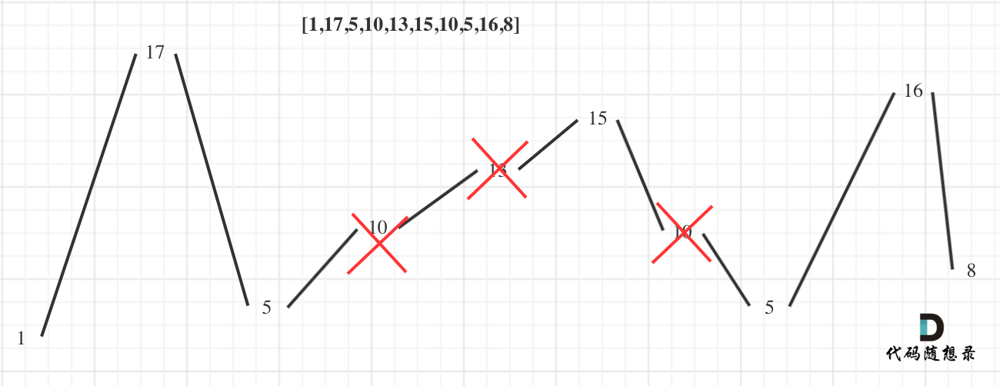
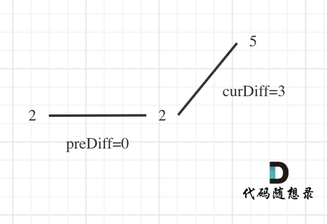

# 贪心算法

https://zhuanlan.zhihu.com/p/451804851


一种是**很明显可以看出来可以用贪心策略解决的问题** 比如IPO（Leetcode 502），这种就算不知道它是贪心算法也可以解决；**笔试中除了可以明显看出用贪心策略的问题以及经验上明显可用贪心策略的问题，除非没有其他思路不要轻易使用贪心算法。**


**1、你想得到的贪心法，都是错的。**

**贪心法可以说，是一种“目光短浅”的算法。**一般在算法问题中，可以使用贪心算法的问题，其贪心策略往往都比较复杂，一般人是想不到的。而你容易想到的那些贪心策略，往往都是错的。


**2、面试基本不会考**

**贪心法的问题，面试基本不会考，因为等同于考智力题或者是背诵题。**一个面试官想要自己凭空创造出一个面试题是使用贪心算法的，是非常困难的。

如果面试中被问到了贪心算法，那么一定是一道**经典的贪心问题**，这类问题，我们可以称之为**背诵题**。


**3、没有通用性**


五分钟搞定贪心算法，从此不惧大厂面试

https://mp.weixin.qq.com/s/zsbSJCGB7oc3O38VGvXReg


---

贪心也没有什么框架和套路，所以对刷题顺序要求没有那么高。

1. 贪心很简单，就是常识？
贪心思路往往很**巧妙**，**但并不简单**。
2. 贪心有没有固定的套路？
贪心**无套路**，也没有框架之类的，需要多看**多练培养感觉**才能想到贪心的思路。
3. 究竟什么题目是贪心呢？
如果找出**局部最优并可以推出全局最优**，就是贪心，如果局部最优都没找出来，就不是贪心，可能是单纯的模拟。
4. 如何知道局部最优推出全局最优，有数学证明么？没有数学证明感觉不靠谱？
    手动模拟⼀下，如果找不出反例，就试试贪心。⾯试中，代码写出来跑过测试用例即可，或者自己能自圆其说理由就⾏了。


贪心的时候，既有简单**适当的证明**（反证法），也把常识性的知识**理论化，系统化**（局部最优、全局最优的分析）


---

## 关于贪心算法，你该了解这些！

拿到题先自己手动模拟，如果可行，试试贪心；如果不可行，动态规划。

如何验证可不可以用贪心算法呢？
最好用的策略就是举反例，如果想不到反例，那么就试一试贪心吧。


### 贪心⼀般解题步骤

贪心算法⼀般分为如下四步：

​	将问题分解为若干个**子问题**
​	找出适合的贪心**策略**
​	求解每⼀个子问题的**局部最优解**
​	将局部最优解**堆叠**成**全局最优解**


贪心的一些题型，主要是**区间重叠问题**，分配问题也是典型的贪心。而像**子序列、跳跃问题等都是 dp 的优化，比较特殊**。


- **分配问题**是最直接的贪心问题，如果涉及多个方便的比较，不要一次处理，分开处理。

- **区间重叠问题**比较常见。通常**需要排序**，可能按左右端点排序，排序后又**左右遍历**，都有可能。最常见的，是左端点升序排序，然后用 end 维护上一个区间的右端点，再比较 end 和当前区间的左端点大小，就知道有没有重叠。
- 涉及两个维度的题，通常先解决掉一维，再处理另一维


----

# 分配问题

## 455.分发饼干x

为了了满足更多的小孩，就**不要造成饼干尺寸的浪费**。

大尺寸的饼干既可以满足胃口大的孩子也可以满足胃口小的孩子，那么就应该优先满足胃口大的。

**这里的局部最优就是大饼干喂给胃口大的，充分利用饼干尺寸喂饱一个，全局最优就是喂饱尽可能多的小孩**。

可以尝试使用贪心策略，先将饼干数组和小孩数组排序。

然后从后向前遍历小孩数组，用大饼干优先满足胃口大的，并统计满足小孩数量。

```c++
int findContentChildren(vector<int>& g, vector<int>& s) {
    sort(g.begin(), g.end());
    sort(s.begin(), s.end());

    int index = s.size() - 1;

    for (int i = g.size() - 1; i >= 0; --i) {
        if (index >= 0 &&  s[index] >= g[i]) {
            index--;
        }
    }

    return s.size() - 1 - index ;
}
```


----

## 135. 分发糖果x


---

## 860. 柠檬水找零x

- 情况一：账单是5，直接收下。
- 情况二：账单是10，消耗一个5，增加一个10
- 情况三：账单是20，优先消耗一个10和一个5，如果不够，再消耗三个5


账单是20的情况，为什么要优先消耗一个10和一个5呢？

**因为美元10只能给账单20找零，而美元5可以给账单10和账单20找零，美元5更万能！**

​	


---


---

# 股票问题

## 121. 买卖股票的最佳时机

保留前i个序列中的最小值，不断判断计算最大差价


## 122. 买卖股票的最佳时机II

从图中可以发现，其实我们需要收集每天的正利润就可以，**收集正利润的区间，就是股票买卖的区间，而我们只需要关注最终利润，不需要记录区间**。

那么只收集正利润就是贪心所贪的地方！

**局部最优：收集每天的正利润，全局最优：求得最大利润**。


```c++
int maxProfit(vector<int>& prices) {
    if (prices.size() == 0) return 0;

    int res = 0;

    for (int i = 1; i < prices.size(); ++i) {
        if (prices[i] - prices[i-1] > 0) {
            res += prices[i] - prices[i-1];
        }
    }

    return res;
}
```


---

## 714. 买卖股票的最佳时机含手续费

本题有了手续费，就要关系什么时候买卖了


如果使用贪心策略，就是最低值买，最高值（如果算上手续费还盈利）就卖。

此时无非就是要找到两个点，买入日期，和卖出日期。

- 买入日期：其实很好想，遇到更低点就记录一下。
- 卖出日期：这个就不好算了，但也没有必要算出准确的卖出日期，只要当前价格大于（最低价格+手续费），就可以收获利润，至于准确的卖出日期，就是连续收获利润区间里的最后一天（并不需要计算是具体哪一天）。


所以我们在做收获利润操作的时候其实有三种情况：

- 情况一：收获利润的这一天并不是收获利润区间里的最后一天（不是真正的卖出，相当于持有股票），所以后面要继续收获利润。
- 情况二：前一天是收获利润区间里的最后一天（相当于真正的卖出了），今天要重新记录最小价格了。
- 情况三：不作操作，保持原有状态（买入，卖出，不买不卖）

```c++
int maxProfit(vector<int>& prices, int fee) {
    int result = 0;
    int minPrice = prices[0]; // 记录最低价格
    for (int i = 1; i < prices.size(); i++) {
        // 情况二：相当于买入
        if (prices[i] < minPrice) minPrice = prices[i];

        // 情况三：保持原有状态（因为此时买则不便宜，卖则亏本）
        if (prices[i] >= minPrice && prices[i] <= minPrice + fee) {
            continue;
        }

        // 计算利润，可能有多次计算利润，最后一次计算利润才是真正意义的卖出
        if (prices[i] > minPrice + fee) {
            result += prices[i] - minPrice - fee;
            minPrice = prices[i] - fee; // 情况一，这一步很关键
        }
    }
    return result;
}
```

- 时间复杂度：$O(n)$
- 空间复杂度：$O(1)$

从代码中可以看出对情况一的操作，因为如果还在收获利润的区间里，表示并不是真正的卖出，而计算利润每次都要减去手续费，**所以要让minPrice = prices[i] - fee;，这样在明天收获利润的时候，才不会多减一次手续费！**

大家也可以发现，情况三，那块代码是可以删掉的，我是为了让代码表达清晰，所以没有精简。


---

# 序列问题

## 376. 摆动序列

摆动序列




**局部最优**：删除单调坡度上的节点（不包括单调坡度两端的节点），那么这个坡度就可以有两个局部峰值。
**整体最优**：整个序列有最多的局部峰值，从而达到最⻓摆动序列。


实际操作上，其实连删除的操作都不用做，因为题⽬要求的是最长摆动子序列的长度，所以只需要统计数组的峰值数量就可以了（相当于是删除单⼀坡度上的节点，然后统计长度）


本题代码实现中，还有⼀些技巧，例如统计峰值的时候，数组最左和最右是最不好统计的。

例如序列[2,5]，它的峰值数量是2，如果靠统计差值来计算峰值个数就需要考虑数组最左和最右的特殊情况。所以可以针对序列[2,5]，可以假设为[2,2,5]，这样它就有坡度了即 `preDiff = 0`，如图：




针对以上情形，result 初始为1（默认最右有⼀个峰值），此时 `curDiff > 0 && preDiff <= 0`，那么 result++（计算了左面的峰值），最后得到的 result 就是2（峰值个数为2即摆动序列长度为2）


```c++
int wiggleMaxLength(vector<int>& nums) {
    int n = nums.size();
    int preDiff = 0;
    int curDiff = 0;
    int result = 1;

    for (int i = 1; i < n; ++i) {
        curDiff = nums[i] - nums[i-1];
        if ((curDiff > 0 && preDiff <= 0) || (curDiff < 0 && preDiff >= 0)) {
            result++;
            preDiff = curDiff;
        }
    }

    return result;
}
```


---

# 跳跃问题

## 55. 跳跃游戏

维护能够到达的最远位置

```c++
bool canJump(vector<int>& nums) {
    int n = nums.size();
    int maxI = 0;

    for (int i = 0; i < n; ++i) {
        if (i <= maxI) {
            maxI = max(maxI, i + nums[i]);
        } else {			// 中途走不动了，说明到达不了
            return false;
        }            
    }

    return true;
}
```


## 45. 跳跃游戏II

倒着跳，每次都选能到达 i 的最前位置

```c++
int jump(vector<int>& nums) {
    int n = nums.size();

    int cnt = 0;
    int flag = n-1;	// 当前倒推到的位置
	
    while (flag > 0) {	// = 0时倒退结束

        for (int i = 0; i <= flag; ++i) {
            if (i + nums[i] >= flag) {
                flag = i;  
                break;
            }
        }

        cnt++;
    }

    return cnt;        
}
```


----

## 1306. 跳跃游戏 III

广度优先 queue 维护能倒退回的位置

每次从结束位置，倒退，返回 0 能退回的位置，标为true，直到 start 入队

```c++
int jump(vector<int>& nums) {
    int n = nums.size();

    int cnt = 0;
    int flag = n-1;	// 当前倒推到的位置
	
    while (flag > 0) {	// = 0时倒退结束

        for (int i = 0; i <= flag; ++i) {
            if (i + nums[i] >= flag) {
                flag = i;  
                break;
            }
        }

        cnt++;
    }

    return cnt;        
}
```


---

## 1696. 跳跃游戏 VI


## 1871. 跳跃游戏 VII

```c++

```


---

# 数字问题

---

## 738. 单调递增的数字

## 179. 最大数

## 321. 拼接最大数

## 397. 整数替换

## 402. 移掉 K 位数字


---

## 53. 最大子序和

给你一个整数数组 `nums` ，请你找出一个具有最大和的连续子数组（子数组最少包含一个元素），返回其最大和。

**子数组** 是数组中的一个连续部分。

**示例 1：**

```
输入：nums = [-2,1,-3,4,-1,2,1,-5,4]
输出：6
解释：连续子数组 [4,-1,2,1] 的和最大，为 6 。
```


for 循环暴力输出

```c++
int maxSubArray(vector<int>& nums) {
    int result = INT_MIN;
    int tmp = 0;

    for (int i = 0; i < nums.size(); ++i) {
        tmp = nums[i];
        result = max(result, tmp);
        for (int j = i + 1; j < nums.size(); ++j) {
            tmp += nums[j];
            result = max(result, tmp);
        }
    }

    return result;
}
```


## 1005. K次取反后最大化的数组和

那么本题的解题步骤为：

- 第一步：将数组按照绝对值大小从大到小排序，**注意要按照绝对值的大小**
- 第二步：从前向后遍历，遇到负数将其变为正数，同时K--
- 第三步：如果K还大于0，那么反复转变数值最小的元素，将K用完
- 第四步：求和

```c++
static bool cmp(int a, int b) {
    return abs(a) > abs(b);
}

int largestSumAfterKNegations(vector<int>& nums, int k) {
    sort(nums.begin(), nums.end(), cmp);


    for (int i = 0; i < nums.size(); ++i) {
        if (k > 0 && nums[i] < 0) {
            nums[i] = -nums[i];
            k--;
        }
    }

    if (k % 2 == 1) nums[nums.size()-1] *= -1;

    int res = 0;
    for (int i : nums) res += i;

    return res;
}
```


**贪心**

算开头，只要开头是负数，就可以直接不往后算了

局部最优：当前“连续和”为负数的时候立刻放弃，从下⼀个元素重新计算“连续和”，因为负数加上下⼀个元素 “连续和”只会越来越小。

全局最优：选取最大“连续和”


从代码角度上来讲：遍历nums，从头开始⽤count累积，如果count⼀旦加上nums[i]变为负数，那么就应该从nums[i+1]开始从0累积count了，因为已经变为负数的count，只会拖累总和。区间的终止位置，其实就是如果count取到最大值了，及时记录下来了。


```c++
int maxSubArray(vector<int>& nums) {
    int count = 0;
    int res = INT_MIN;

    for (int i = 0; i < nums.size(); ++i) {
        count += nums[i];
        res = max(res, count);
        if (count < 0) count = 0;
    }

    return res;
}
```


----

# 维度权衡问题

## 135. 


## 406. 根据身高重建队列x


---

## 1775. 通过最少操作次数使数组的和相等

数组 a, b，其中 a 的和较小，b 的和较大
双指针分别从 数组 a 左侧（较小侧） 和 数组 b 右侧（较大侧）开始移动；

为了让两数组和相等，每次操作可以使较大数变小（最小变为 1），或较小数变大（最大变为 6），贪心的选择**变化差值最大的一边修改**；

重复操作直到 **指针遍历完数组** 或 `sum(a)≥sum(b)` 

为什么是 `sum(a)≥sum(b)`  因为当大于的时候，说明最后一次加的差值过大了，完全可以加一个小一点的数，使 `sum(a) == sum(b)`

```c++
int minOperations(vector<int>& nums1, vector<int>& nums2) {
    int sumn1 = accumulate(nums1.begin(), nums1.end(), 0);
    int sumn2 = accumulate(nums2.begin(), nums2.end(), 0);

    if (sumn1 > sumn2) {
        return minOperations(nums2, nums1);
    }

    sort(nums1.begin(), nums1.end());
    sort(nums2.begin(), nums2.end());

    int i = 0, j = nums2.size() - 1;
    int cnt = 0;
    while (i < nums1.size() && j >= 0 && sumn1 < sumn2) {
        if (6 - nums1[i] > nums2[j] - 1) {  // nums1 小变大 缩进距离比 nums2 大变小 缩进的好
            sumn1 += (6 - nums1[i++]);
        } else {
            sumn2 -= (nums2[j--] - 1);
        }          
        cnt++;
    }   

    while (i < nums1.size() && sumn1 < sumn2) {
        sumn1 += (6 - nums1[i++]);
        cnt++;
    }

    while (j >= 0 && sumn1 < sumn2) {
        sumn2 -= (nums2[j--] - 1);
        cnt++;
    }

    return sumn1 >= sumn2 ? cnt : -1;
}
```


---

# 区间问题

## 452. 用最少数量的箭引爆气球

```c++
int findMinArrowShots(vector<vector<int>>& points) {
    if (points.empty()) return 0;


    sort(points.begin(), points.end(), [] (vector<int> &a1, vector<int> &a2) {
        return a1[1] < a2[1];
    });

    int pos = points[0][1]; // 第一个的右边界
    int res = 1;
    for (auto &vec : points) {
        if (vec[0] > pos) { // 如果这个球的左边界大于已知的右边界 只能来一根新的箭
            pos = vec[1];   // 设置新的右边界，这跟新箭 能移动端范围
            res++;  
        }
    }

    return res;
}

/*
1 6
2 8
7 12
10 16
*/
```


## 435. 


## 763.


## 56.


## 57. 


## 1024. 


## 1288. 


## 986. 


---

## 二维贪心问题

## 122.买卖股票的最佳时机II

## 1005. K 次取反后最大化的数组和


## 134. 加油站

## 406. 根据身高重建队列


## 714. 买卖股票的最佳时机含手续费


---

# Other

---

## 871. 最低加油次数

优先队列保存经过的加油站，每次没油的时候，贪婪的加最多油。因为这样一定是最小次数

```c++
int minRefuelStops(int target, int startFuel, vector<vector<int>>& stations) {
    priority_queue<int> pq;
    int fuel = startFuel;
    int dis = 0;
    int cnt = 0;

    for (int i = 0; ; ) {
        dis += fuel;    // 先走
        fuel = 0;

        if (dis >= target) {
            return cnt;
        }            

        while (i < stations.size() && dis >= stations[i][0]) { // 加油站全部加入队列中
            pq.emplace(stations[i][1]); 
            i++;
        }

        if (fuel == 0) {    // 没油了
            if (pq.size()) {
                auto cur = pq.top(); pq.pop();
                fuel += cur;
                cnt++;      // 加了一次油
            } else {
                return -1;
            }
        } 
    }


    return -1;
}
```


## 134.


## 868.


