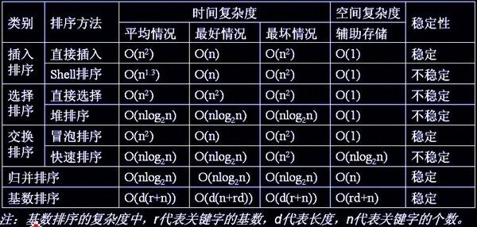

# Sort

https://zhuanlan.zhihu.com/p/39516615

https://zhuanlan.zhihu.com/p/39519014


时间复杂度：

> 反映当数据量变化时，操作次数的多少;时间复杂度在评估时，要只保留最高项，并且不要最高项的系数。(下面用logN表示 log以2为底，N的对数)

空间复杂度：

> 是指算法在计算机内执行时，所需额外开辟的空间。

指标：

> 最高项的系数。

常数项：

> 与N的大小无关的操作。

稳定性：

> (1)稳定：如果a原本在b前面，而a=b，排序之后a仍然在b的前面。
> (2)不稳定：如果a原本在b的前面，而a=b，排序之后 a 可能会出现在 b 的后面。


**通用函数及其他**

(1)求数组长度（需要传数组，不要传数组指针）

```c++
/*  一定要注意传入的数组，而不是数组指针
	如果传入的是数组指针，sizeof 后出来的值为 8
*/
template <class T>
int len(T& arr) {
    int length = (int)sizeof(arr) / sizeof(arr[0]);  //
    return length
}
```


(2)交换数组两个数

```c++
/* ^符号 即”异或“运算符
  特点是与0异或，保持原值；
  与本身异或，结果为0。
*/
void exchange(int arr[], int a, int b) {
	if (a == b) return;
    arr[a] = arr[a] ^ arr[b];
    arr[b] = arr[a] ^ arr[b];
    arr[a] = arr[a] ^ arr[b];
}
```


(3)算法中的表达

```c++
* A代表平均时间复杂度
* B代表最坏时间复杂度
* E代表最好时间复杂度
* 省略了O()
    
/* 大数据样本下四钟最快算法的比较. 数据是随机整数，时间单位是秒

    数据规模|快速排序 归并排序 希尔排序 堆排序
    1000万 |  0.75  1.22    1.77    3.57
    5000万 |  3.78  6.29    9.48    26.54
	1亿    |  7.65  13.06   18.79   61.31
*/
```


(4)时间复杂度的大小比较

```c++
/*
  N! > x^N >... > 3^N > 2^N > N^x > 
								   ... > N^3 > N^2 > NlogN > N > logN > 1
*/
```


(5)数组和数组大小的结构体

```C++
struct arrWithSize{
    int *array;
    int size;
}
```


(6)初始化数组

```c++
	//一维 每个元素都没有初始化
    int *p = new int[10];
    //一维 每个元素初始化为 0
    int *p = new int[10](0);

    //二维 每个元素都没有初始化
    int (*bucket)[10] = new int[10][10];
    //二维 每个一维中含N个数，N为确定的数值。
    vector<vector<int>> bucket(N);

    //通过动态创建的数组，要进行内存释放，否则内存将泄漏
    //(本文中，未进行内存释放)
    delete []p;
```


(7)综合排序总结

- 思考一个排序时候，考虑时间复杂度中的指标和常数项，空间复杂度，稳定性.
- 代码规模，一定程度上说明了常数项的大小。（最终常数项的大小是看发生常数操作的次数）
- 系统的sort 方法，发现传进来的值为**数值型**，会使用**快排**，如果发现传的**还有比较器**，会使用**归并**
- 归并和快排哪种更快？
  快排比归并的常数项要低，所以要快。
- 为什么会有归并和快排两种呢？
  在比较的时候，使用**比较器**的时候，要追求一个**稳定性**，使用 **归并**排序 可以达**稳定**性的效果；使用快排不能够实现稳定性的效果。
- 面对大规模的时候，当排序量是小于等于60的时候，sort方法会在内部使用插入排序的方法（不一定是60，是一定的规模）当数据量很低的时候，插入排序的常数项低。
- 在c语言中有一版，把归并排序，改成非递归，是基于工程其他考虑。


(8)对比两个数组是否相同

```c++
bool isEqual(int firstArr[], int secondArr[]) {
    if ((fisrtArr == nullptr && secondArr != nullptr) || (fisrtArr != nullptr && secondArr != nullptr))
        return false;
    
    if (firstArr == nullptr && secondArr == nullptr) 
        return true;
    
    if (len(firstArr) != len(secondArr)) 
        return false;
    
    for (int i = 0; i < len(firstArr); ++i) {
        if (firstArr[i] != secondArr[i]) {
            cout << i << firstArr[i] << secondArr[i] << endl;
            return false;
        }
    }
    
    return true;
}
```


(9)复制数组

```c++
int* arrayCopy(int oldArray[], int length) {
    if (oldArray == nullptr) {
        return nullptr;
    }
    
    int* newArray = new int[length];
    for (int i = 0; i < length; ++i) {
        newArray[i] = oldArray[i];
    }
    
    return newArray;
}
```


(10)产生随机数组

```c++
struct arrWithSize{
    int *array;
    int size;
}

arrWithSize genRandomArr(int maxSize, int maxValue) {
    arrWithSize rArr;
    int size = (int)( (maxSize+1) * (rand()%10 / (double) 10) );
    cout << "{" << size << "}" << end;
    
    int* array = new int[size];
    for (int i = 0; i < size; ++i) {
        // 随机生成[0, N]
        array[i] = (int)((maxValue+1) * (rand()%10 / (double)10));
    }
    rArr.size = size;
    rArr.array = array;
    
    return rArr;
}
```


(11)递归master公式（找最大值）

```c++
/*
     递归master公式
     T(N)的公式从大规模来看，不细分。
     T(N) = a * T(N/b)+O(n^d)
     N/b 是子过程数据量 ；a是子过程调用多少次；O(n^d)是出去过程之外剩下的数据量的多少
     if log(b)a > d => O(N^log(b)a)
     if log(b)a = d => O(N^d *logN)
     if log(b)a < d => O(N^d)
     注意 多个递归的规模必须一样，否则master公式失效。
 
  例如一个规模是1/3;一个是2/3;
     以下算法的时间复杂度：a = 2;b = 2;d = 0;所以时间复杂度为O(N)
*/
int process(int arr[], int L, int R) {
    if (L == R) {
        return arr[L];
    }
    
    int mid = (L + R) / 2;
    int leftMax = process(arr, L, mid);
    int rightMax = process(arr, mid+1, R);
	return (leftMax / rightMax) ? leftMax : rightMax;
}

int getMaxInArray(int arr[], int len) {
    return process(arr, 0, len - 1);
}
```


(12)比较器

``` c++
/*
	c++ 中的比较器要注意返回值要为 bool 类型
	比较器第一次比较完成后，下一次在比较的时候还是会含有第一次的排号的顺序
	是利用了 c++ 中 sort 函数的排序稳定性
*/
struct student{
    char name[10];
    int age;
    int classId;
}

// 年龄升序
bool cmpAge(student s1, student s2) {
    // 返回false的时候，相当于进行了一个交换操作
    return s2.age > s1.age;
}

// 班级升序
bool cmpClassId(student s1, student s2) {
    return s2.classId < s1.classId;
}

void testCmp() {
    student s1 =  {"opooc",21,100};
    student s2 =  {"cat",30,105};
    student s3 =  {"dog",1,107};
    student s4 =  {"daolao",2,107};
    student s5 =  {"dst",20,103};
    student allStu[] ={s1,s2,s3,s4,s5};
    
    sort(allStu, allStu + 5, cmpAge);
    sort(allStu, allStu + 5, cmpClassId);
}    
```


(13)vector容器

```c++
//声明一个一维容器
vector<int> vec;
//声明一个二维数组，里面每个一维数组大小为10(必填)
vector<vector<int>> vec(10);
//添加元素
vec.push_back(1);
//删除最后添加的元素
vec.pop_back();
//删除向量中迭代器指向元素
vec.erase(vec.begin() + 2); //vec[2]
//删除向量中[first,last)中元素 如下删除1234位置	前开后闭
vec.erase(vec.begin() + 1, vec.begin() + 5)
//在第零个元素前面插1
vec.insert(vec.begin(), 1);
//在第二个元素前插2
vec.insert(vec.begin() + 2, 2);
//在最后一个元素后面插的10
vec.insert(v.end(), 10);
//元素的个数
vec.size();
//清除所有元素
vec.clear();
//遍历整个数组
vector<int>:: iterator it;
for (it = vec.begin(); it != vec.end(); it++) {
    cout << *it;
}
```


---

# 非线性时间

## 归并排序 - 归并

归并排序就是先把左半边数组排好序，再把右半边数组排好序，然后把两半数组合并。和**二叉树**的**后序遍历**很像

```c++
void sort(vector<int>& nums, int lo, int hi) {
    if (lo == hi) 
        return;
    
    int mid = (lo + hi) / 2;
    
    sort(nums, lo, mid);
    sort(nums, mid + 1, hi);
    
    /*后序位置*/
    merge(nums, lo, mid, mid+1, hi);
}
```


**归并排序的过程可以在逻辑上抽象成一棵二叉树，树上的每个节点的值可以认为是`nums[lo..hi]`，叶子节点的值就是数组中的单个元素**：


然后，在每个节点的后序位置（左右子节点已经被排好序）的时候执行`merge`函数，合并两个子节点上的子数组：


这个 `merge` 操作会在二叉树的每个节点上都执行一遍，执行顺序是二叉树后序遍历的顺序。结合上述基本分析，我们把 `nums[lo..hi]` 理解成二叉树的节点，`sort` 函数理解成二叉树的遍历函数，整个归并排序的执行过程就是以下描述：


```c++
const int maxn = 5e4 + 10;

void merge(vector<int>& nums, int l1, int r1, int l2, int r2) {
    int i = l1, j = l2, index = 0;
    int tmp[maxn];
    
    while (i <= r1 && j <= r2) {
        if (nums[i] < nums[j]) tmp[index++] = nums[i++];
        else tmp[index++] = nums[j++];
    }
    
    while (i <= r1) tmp[index++] = nums[i++];
    while (j <= r2) tmp[index++] = nums[j++];
    
    for (int i = 0; i < index; ++i) nums[l1+i] = tmp[i];
}
```


`sort` 函数对 `nums[lo..mid]` 和 `nums[mid+1..hi]` 递归排序完成之后，我们没有办法原地把它俩合并，所以需要 copy 到temp数组里面，然后通过**双指针**技巧将 `nums[lo..hi]` 合并成一个有序数组：


对于归并排序来说，时间复杂度显然集中在 `merge` 函数遍历 `nums[lo..hi]` 的过程，但每次 `merge` 输入的 `lo` 和 `hi` 都不同，所以不容易直观地看出时间复杂度。


`merge` 函数到底执行了多少次？每次执行的时间复杂度是多少？总的时间复杂度是多少？


**执行的次数**是**二叉树节点的个数**，每次**执行的复杂度**就是每个节点代表的**子数组的长度**，所以**总的时间复杂度**就是**整棵树中「数组元素」的个数**。

所以从整体上看，这个二叉树的高度是 `logN`，其中每一层的元素个数就是原数组的长度 `N`，所以总的时间复杂度就是 `O(NlogN)`。


> 序列合并问题。假设有两个递增序列 A 与 B，要求将它们合并为一个递增序列 C。可以设置两个下标 i 和 j，初值均为 0，表示分别指向序列 A 和 B 的第一个元素，然后根据 A[i] 与 B[j] 的大小来决定哪一个放入序列 C。
>
> ① 若 A[i] < B[j]，把小的 A[i] 放入序列 C 中，并且 i++
>
> ② 若 A[i] > B[j]，把小的 B[j] 放入序列 C 中，并且 j++
>
> ③ 若 A[i] == B[j]，随便选一个放，放A就i++/放B就j++
>
> 直到 i、j 中的一个到达序列末端为止，然后将另一个序列的所有元素依次加入序列 C 中
>
> ```c++
> void merge(int A[], int B[], int C[], int n, int m) {	// n m 为 A B 的长度
>     int i = 0, j = 0, index = 0;	// i指向A[0], j指向B[0]
>     while (i < n && j < m) {
>         if (A[i] <= B[j]) {
>             C[index++] = A[i++];
>         } else {
>             C[index++] = B[j++];
>         }
>     }
>     
>     while (i < n) C[index++] = A[i++];	// 将序列A的剩余元素加入序列C
>     while (j < m) C[index++] = B[j++];	// 将序列B的剩余元素加入序列C
>     // 上边两个while只会执行一个
>     
>     return;
> }
> ```
>


### 315. 计算右侧小于当前元素的个数

在 `merge` 函数，我们在合并两个有序数组的时候，其实是可以知道一个数字 `x` 后边有多少个数字比 `x`小的。


这时候我们应该把 `temp[i]` 放到 `nums[p]` 上，因为 `temp[i] < temp[j]`。

但就在这个场景下，我们还可以知道一个信息：5 后面比 5 小的元素个数就是 `j` 和 `mid + 1` 之间的元素个数，即 2 个。

即 **在对`nuns[lo..hi]`合并的过程中，每当执行`nums[p] = temp[i]`时，就可以确定`temp[i]`这个元素后面比它小的元素个数为`j - mid - 1`**。


因为在排序过程中，每个元素的索引位置会不断改变，所以我们用一个`Pair`类封装每个元素及其在原始数组`nums`中的索引，以便`count`数组记录每个元素之后小于它的元素个数。


---

## 快速排序 - 比较

https://mp.weixin.qq.com/s/8ZTMhvHJK_He48PpSt_AmQ


**快速排序是先将一个元素排好序，然后再将剩下的元素排好序**。

**快速排序的过程是一个构造二叉搜索树的过程**。


快速排序的基本思想：通过一趟排序将待排记录**分隔成独立的两部分**，其中一部分记录的关键字均比另一部分的关键字小，则可分别对这两部分记录继续进行排序，以达到整个序列有序。


实现逻辑:

> 快速排序使用分治法来把一个串（list）分为两个子串（sub-lists）。具体算法流程如下：
>
> 从数列中挑出一个元素，称为 “基准”（pivot）；
>
> 重新排序数列，所有元素比基准值小的摆放在基准前面，所有元素比基准值大的摆在基准的后面（相同的数可以到任一边）。在这个分区退出之后，该基准就处于数列的中间位置。这个称为分区（partition）操作；
>
> 递归地（recursive）把小于基准值元素的子数列和大于基准值元素的子数列排序。


### 随机快速排序

> （交换排序; 时间A:NlogN,B:NlogN,E:NlogN;空间logN;不稳定）


```c++
void sort(int[] nums, int lo, int hi) {
    if (lo >= hi) {
        return;
    }
    // 对 nums[lo..hi] 进行切分
    // 使得 nums[lo..p-1] <= nums[p] < nums[p+1..hi]
    int p = partition(nums, lo, hi);
    // 去左右子数组进行切分
    sort(nums, lo, p - 1);
    sort(nums, p + 1, hi);
}
```


快速排序的核心无疑是 `partition` 函数， `partition` 函数的作用是在 `nums[lo..hi]` 中寻找一个分界点 `p`，通过交换元素使得 `nums[lo..p-1]` 都小于等于 `nums[p]`，且 `nums[p+1..hi]` 都大于 `nums[p]`：


 `partition` 函数干的事情，其实就是把 `nums[p]` 这个元素排好序了。

剩下的元素有哪些？左边区域，右边区域，对子数组进行递归，用 `partition` 函数把剩下的元素也排好序。


 `partition` 函数每次都将数组切分成左小右大两部分，恰好和二叉搜索树左小右大的特性吻合。

```c++
int partition(int nums[], int lo, int hi) {
    int pivot = nums[lo];
    // 关于区间的边界控制需格外小心，稍有不慎就会出错
    // 我这里把 i, j 定义为开区间，同时定义：
    // [lo, i) <= pivot；(j, hi] > pivot
    // 之后都要正确维护这个边界区间的定义
    int i = lo + 1, j = hi;
    // 当 i > j 时结束循环，以保证区间 [lo, hi] 都被覆盖
    while (i <= j) {
        while (i < hi && nums[i] <= pivot) {
            i++;
            // 此 while 结束时恰好 nums[i] > pivot
        }
        while (j > lo && nums[j] > pivot) {
            j--;
            // 此 while 结束时恰好 nums[j] <= pivot
        }
        // 此时 [lo, i) <= pivot && (j, hi] > pivot

        if (i >= j) {
            break;
        }
        swap(nums, i, j);
    }
    // 将 pivot 放到合适的位置，即 pivot 左边元素较小，右边元素较大
    swap(nums, lo, j);
    return j;
}
```

其中swap

```c++
// 原地交换数组中的两个元素
void swap(int[] nums, int i, int j) {
    int tmp = nums[i];
    nums[i] = nums[j];
    nums[j] = tmp;
}

void swap(int[] nums, int i, int j) {
    nums[i] = nums[i] ^ nums[j];
    nums[j] = nums[i] ^ nums[j];
    nums[i] = nums[i] ^ nums[j];
}
```


**你甚至可以这样理解：快速排序的过程是一个构造二叉搜索树的过程**。


如果你每次运气都特别背，有一边的元素特别少的话，这样会导致二叉树生长不平衡：

这样的话，时间复杂度会大幅上升，后面分析时间复杂度的时候再细说。

**我们为了避免出现这种极端情况，需要引入随机性**。

常见的方式是在进行排序之前对整个数组执行 **洗牌算法** 进行打乱，或者在 `partition`函数中**随机选择数组元素**作为分界点，本文会使用前者。


```c++
// 洗牌算法，将输入的数组随机打乱
void shuffle(int[] nums) {
    Random rand = new Random();
    int n = nums.length;
    for (int i = 0 ; i < n; i++) {
        
        int r = i + rand.nextInt(n - i);
        swap(nums, i, r);
    }
}

void shuffle(vector<int>& nums) {
    int n = nums.size();
    for (int i = 0; i < n; ++i) {
        int r = i + rand() % (n - i); // 生成 [i, n - 1] 的随机数
        swap(nums, i, r);
    }
}
```


快速排序就是一个**二叉树的前序遍历**

```c++
/* 二叉树遍历框架 */
void traverse(TreeNode root) {
    if (root == null) {
        return;
    }
    /****** 前序位置 ******/
    print(root.val);
    /*********************/
    traverse(root.left);
    traverse(root.right);
}
```


### 912. 排序数组（中等）

```c++

```


---

## 冒泡排序 - 比较

https://zhuanlan.zhihu.com/p/39516615

\1. 初级写法：一边比较一边向后两两交换，将最大值 或 最小值冒泡到最后一位；

\2. 经过优化的写法：使用一个变量记录当前轮次的比较是否发生过交换，如果没有发生交换表示已经有序，不再继续排序；

\3.进一步优化的写法：除了使用变量记录当前轮次是否发生交换外，再使用一个变量记录上次发生交换的位置，下一轮排序时到达上次交换的位置就停止比较。


最外层的 for 循环每经过一轮，剩余数字中的最大值就会被移动到当前轮次的最后一位，中途也会有一些相邻的数字经过交换变得有序。总共比较次数是(n-1)+(n-2)+(n-3)+…+1。


---

## 插入排序 - 插入

当数字少于两个时，不存在排序问题，也不需要插入，所以直接从第二个数组开始往前插入。将当前的数字不断与前面的数字比较， 寻找插入位置。

在比较的过程中，将大于当前数组的元素不断向后移动。这个过程就像是已经有一些数字坐成了一排，这时一个新的数字要加入


---

## 希尔排序 - 插入


## 选择排序 - 选择

选择排序的思想是：双重循环遍历数组，每经过一轮比较，找到最小元素的下标，将其交换至首位。

\1. 不稳定，破坏顺序结构 $O(N^2) + O(1)$

```c++
void swap(int arr[], int x, int y) {
	int tmp = arr[x];
    arr[x] = arr[y];
    arr[y] = tmp;
}

void selectSort(int arr[]) {
    int minIndex;  //保存最小值的索引下标
    int n = sizeof(arr) / sizeof(int); 
    // sizeof(arr) / sizeof(arr[0])
    // sizeof(arr) / sizeof(*arr);
    
    for (int i = 0; i < n; ++i) {
        minIndex = i;
        
        for (int j = i+1; j < n; ++j) {	//循环找[i+1, n]最小值的位置
            if (arr[minIndex] > arr[j]) {
                minIndex = j;
            }
        }
        
        swap(arr, minIndex, i); //交换当前位置和最小值的位置
    }
    
    return;
}
```


\2. 冒泡排序二元选择排序 $O(N^2) + O(1)$

使用二元选择排序，每轮选择时记录最小值和最大值，可以把数组需要遍历的范围缩小一倍。

```c++
void selectSort(int arr[]) {
    int minIndex, maxIndex;  //保存最小值的索引下标
    int n = sizeof(arr) / sizeof(int); 
    // sizeof(arr) / sizeof(arr[0])
    // sizeof(arr) / sizeof(*arr);
    for (int i = 0; i < n / 2; ++i) {	//范围减一半
        minIndex = maxIndex = i;
        
        for (int j = i+1; j < n; ++j) {	//循环找[i+1, n]最小值的位置
            if (arr[minIndex] > arr[j]) {
                minIndex = j;
            }
            if (arr[maxIndex] < arr[j]) {
                maxIndex = j;
            }
        }
        
        if (minIndex == maxIndex) break;	//说明剩下所有元素都相等
        
        // 交换最小值与当前位置i
        swap(arr, minIndex, i);
        
        ////i已经和minIndex交换过位置，如果maxIndex和i相同，就进行和MinIndex
        if (maxIndex == i) maxIndex = minIndex;
        
        swap(arr, maxIndex, n-i-1); //交换当前位置和最小值的位置
    }
    
    return;
}
```


\3. 


---

# 线性时间

## 堆排序 - 选择


---

## 基数排序


## 计数排序


---

# 总结

当n较大，则应采用时间复杂度为O(nlog2n)的排序方法：快速排序、堆排序或归并排序。


会问面试者知道哪些排序算法，选一个自己熟悉排序算法。讲下它的主要特点，比如**时间复杂度 / 稳定性** 这些

如果继续，一般会把重点放在 **快速排序** 和 **堆排**，进一步可能会要求手写实现。然后会讨论下在**输入是特定序列的情况下，当前的算法有什么缺点或优点**。


**基数排序**这类算法，会问下一些偏**理论**的问题，比如比较排序算法的**下界**是多少，为什么基数排序可以突破这个下界。


**『算法导论』的第二部分 『排序和顺序统计学』**，是很好的排序算法基础。几十页，认真看。

**『[编程珠玑](https://www.zhihu.com/search?q=编程珠玑&search_source=Entity&hybrid_search_source=Entity&hybrid_search_extra={"sourceType"%3A"answer"%2C"sourceId"%3A286065483})』第十一章 『排序』**，对快速排序做了细节性的讨论。





> **n指数据规模；**
>
> **k指“桶”的个数；**
>
> **In-place指占用常数内存，不占用额外内存；**
>
> **Out-place指占用额外内存**


---

## 内部非内部


内排序：所有排序操作都在**内存中**完成；

外排序：由于数据太大，因此把数据放在磁盘中，而排序**通过磁盘和内存**的数据传输才能进行；


---

## 比较非比较

- **比较类排序**：通过比较来决定元素间的相对次序，由于其时间复杂度不能突破O(nlogn)，因此也称为非线性时间比较类排序。
- **非比较类排序**：不通过比较来决定元素间的相对次序，它可以突破基于比较排序的时间下界，以线性时间运行，因此也称为线性时间非比较类排序。 


常见的**快速排序、归并排序、堆排序、冒泡排序**等属于**比较排序**。在排序的最终结果里，元素之间的次序依赖于它们之间的比较。每个数都必须和其他数进行比较，才能确定自己的位置。

- 在**冒泡排序**之类的排序中，问题规模为n，又因为需要比较n次，所以平均时间复杂度为O(n²)。
- 在**归并排序、快速排序**之类的排序中，问题规模通过分治法消减为logN次，所以时间复杂度平均O(nlogn)。

比较排序的优势是，适用于各种规模的数据，也不在乎数据的分布，都能进行排序。可以说，比较排序适用于一切需要排序的情况。


**计数排序、基数排序、桶排序**则属于**非比较排序**。非比较排序是通过确定每个元素之前，应该有多少个元素来排序。针对数组arr，计算arr[i]之前有多少个元素，则唯一确定了arr[i]在排序后数组中的位置。

非比较排序只要确定每个元素之前的已有的元素个数即可，所有一次遍历即可解决。算法时间复杂度O(n)。非比较排序时间复杂度底，但由于非比较排序需要占用空间来确定唯一位置。所以对数据规模和数据分布有一定的要求。


---

## 稳定非稳定


假定在待排序的记录序列中，存在多个具有**相同的关键字**的记录，若**经过排序**，这些记录的**相对次序保持不变**，即在原序列中，A1=A2，且A1在A2之前，而在排序后的序列中，A1仍在A2之前，则称这种排序算法是稳定的；否则称为不稳定的。

排序算法是否为稳定的是由具体算法决定的，**不稳定的算法在某种条件下可以变为稳定的算法**，而**稳定的算法在某种条件下也可以变为不稳定的算法**。


常见算法的稳定性（要记住）

**不稳定排序算法**

堆排序、快速排序、希尔排序、直接选择排序

**稳定排序算法**

基数排序、冒泡排序、直接插入排序、折半插入排序、归并排序


---

# **快速选择算法**

快速排序算法本身很有意思，而且它还有一些有趣的变体，最有名的就是快速选择算法（Quick Select）。


**快速选择算法是快速排序的变体，效率更高**


首先，题目问「第 `k` 个最大的元素」，相当于数组升序排序后「排名第 `n - k` 的元素」，为了方便表述，后文另 `k' = n - k`。

如何知道「排名第 `k'` 的元素」呢？其实在快速排序算法 `partition` 函数执行的过程中就可以略见一二。

我们刚说了，`partition` 函数会将 `nums[p]` 排到正确的位置，使得 `nums[lo..p-1] < nums[p] < nums[p+1..hi]`：

这时候，虽然还没有把整个数组排好序，但我们已经让 `nums[p]` 左边的元素都比 `nums[p]` 小了，也就知道 `nums[p]` 的排名了。

**那么我们可以把 `p` 和 `k'` 进行比较，如果 `p < k'` 说明第 `k'` 大的元素在 `nums[p+1..hi]` 中，如果 `p > k'` 说明第 `k'` 大的元素在 `nums[lo..p-1]` 中**。

进一步，去 `nums[p+1..hi]` 或者 `nums[lo..p-1]` 这两个子数组中执行 `partition` 函数，就可以进一步缩小排在第 `k'` 的元素的范围，最终找到目标元素。


### 215. 数组中的第 K 个最大元素

这种问题有两种解法，一种是二叉堆（优先队列）的解法，另一种就是快速选择算法，我们分别来看。

```c++
int findKthLargest(vector<int>& nums, int k) {
    /*I. */
    shuffle(nums);
    int n = nums.size();
    int lo = 0, hi = n - 1;
    
    while (lo <= hi) {
        p = partition(nums, lo, hi);
        if (p > n-k) {
            hi = p - 1;
        } else if (p < n+k) {
            lo = p + 1;
        } else {
            return nums[p];
        }
    }

    return -1;
}


// 对 nums[lo..hi] 进行切分
int partition(int[] nums, int lo, int hi) {
    // 见前文
}

// 洗牌算法，将输入的数组随机打乱
void shuffle(int[] nums) {
    // 见前文
}

// 原地交换数组中的两个元素
void swap(int[] nums, int i, int j) {
    // 见前文
}
```


这个代码框架其实非常像我们前文 **二分搜索框架** 的代码，这也是这个算法高效的原因，但是时间复杂度为什么是 `O(N)` 呢？

显然，这个算法的时间复杂度也主要集中在 `partition` 函数上，我们需要估算 `partition` 函数执行了多少次，每次执行的时间复杂度是多少。

最好情况下，每次 `partition` 函数切分出的 `p` 都恰好是正中间索引 `(lo + hi) / 2`（二分），且每次切分之后会到左边或者右边的子数组继续进行切分，那么 `partition` 函数执行的次数是 logN，每次输入的数组大小缩短一半。

所以总的时间复杂度为：

```
# 等差数列
N + N/2 + N/4 + N/8 + ... + 1 = 2N = O(N)
```

当然，类似快速排序，快速选择算法中的 `partition` 函数也可能出现极端情况，最坏情况下 `p` 一直都是 `lo + 1` 或者一直都是 `hi - 1`，这样的话时间复杂度就退化为 `O(N^2)` 了：

```
N + (N - 1) + (N - 2) + ... + 1 = O(N^2)
```

这也是我们在代码中使用 `shuffle` 函数的原因，通过**引入随机性来避免极端情况的出现**，让算法的效率保持在比较高的水平。随机化之后的**快速选择算法的复杂度可以认为是 O(N)**。

从二叉树的视角来理解快速排序算法和快速选择算法的思路应该是不难的。


---

# 桶排序

我们思考这样一个问题
某天老师让全班同学各自说出自己的出生日期，然后统计一下出生日期相差小于等于30天的同学。我们很容易想到，出生在同一个月的同学，一定满足上面的条件。出生在相邻月的同学，也有可能满足那个条件，这就需要计算一下来确定了。但如果月份之间相差了两个月，那就不可能满足这个条件了。
例如某同学出生于6月10日，其他6月出生的同学，都与其相差小于30天。另一些5月20日和7月10日的同学也满足条件。但是4月份的和8月份的同学就不可能满足条件了。


**先来讲讲分桶是什么意思，实际上我们的一个桶内同一时刻只会有一个元素**

要满足，**同一个桶**中的任两个元素之差的绝对值**小于等于**t，**相邻桶**中的某两个元素之差的绝对值**可能小于等于**t（通过计算判断是否真的小于等于t），**不同相邻的桶**中的元素之差的绝对值**不可能满足小于等于**t


那么我们如何划分桶呢？我们给每一个桶标上ID，进行一种映射。首先我们容易直接想到的是，题目中的t值就类似于引言中提到的“月份”，是一种模，我们可以采用 “ID = 元素值 ÷ t” 的方法，也就是商作为ID，商相同的元素属于同一个桶，这样会产生下面的桶。


但是存在两个问题，也是这道题巧妙的地方。
（1）题目中 t 的取值是 0<= t <= 2^31 - 1，t可以等于0，所以“ID = 元素值 ÷ t ” 的方法行不通。
（2）对应于上面的图，其实我们还可以把｛0，1，2，3｝划分在一桶，因为也满足桶内任两个元素绝对值之差小于等于t（这里t = 3），那么我们是不是可以以t+1为桶的模？

对此我们进行改造“ID = 元素值 ÷（t + 1）”，产生如下的桶的划分


这样就保证每个桶内任两个元素之差的绝对值小于t，相邻的桶内的某两个元素之差的绝对值可能小于t，而不相邻的桶则不可能。

上面我们仅仅考虑的 `nums[i]>=0` 的情况，进行分桶。对于**负数**我们要做一些小小的调整。如果 `nums = {-4,-3,-2,-1,0,1,2,3}`，那么，元素 -4 被分到了ID为-1的桶中，其余元素都被放在了ID为0的桶里（如图）


但是3-（-3）= 6大于了我们的 t = 3。对于这样的**负数**我们可以在求出商之后，把**商-1**，也就是ID向左偏一个，变成下面的样子


-4还是没进来，原因是-4÷（t+1）-1 = -2 与-3，-2，-1不相同。不过如果我们把**负数数值整体增大一**，变成-3，-2，-1，-0， 这样就分到同一个桶中了。对应下面的图


核心思路
我们从头开始遍历数组，对于当前下标i，有效的桶是下标为 `[i-k,i+k]` 的元素构造的桶，对于每一个 `i` 我们只需要看前面是否有无效的桶即可，后面的元素我们没遍历到，自然也不会产生桶，所以 `[i-k，i]` 的桶是有效的，如果 `nums[i-(k+1)]` 产生的桶存在，我们要把其删除掉。因为 `abs(i-(i-(k+1))) = abs(k+1) = k+1 > k`。这是不在我们下标范围内的元素产生的桶，我们不需要判断是否满足条件，直接把这个桶删除了。


对于遍历到的元素 `nums[i]` 进行分桶，获取当前桶 ID，如果当前桶中已经有元素了，那么说明能找到符合条件的元素，直接返回 true（因此，我们每个桶中最多只可能有一个元素，多了我们会直接返回结果）。如果当前桶没有元素，那么看看前相邻的桶有没有元素，如果有元素，那么进行做差比较，判断是否满足条件，满足则返回 true。如果没有找到，那么把这个元素装入桶中，供别的元素判断。如果到最后都没有找到满足条件的元素，我们就返回 false;

```c++
long getID(long x, long t){
    //如果x元素大于等于零,直接分桶
    if(x>=0){
        return x / ( t + 1 );
    }else{
        //如果x元素小于零,偏移后再分桶
        return ( x + 1 )/( t + 1 ) - 1 ;
    }
    return 0;
}

bool containsNearbyAlmostDuplicate(vector<int>& nums, int k, int t) {
    int n = nums.size();
    //我们用unordered_map来实现桶,其底层实现是一个哈希表.
    unordered_map<int, int> m;
    for(int i = 0 ; i < n; i++ ){
        //当前元素
        long  x = nums[i];
        //给当前元素生成id,这里我们同一个id的桶内元素满足abs(nums[i] - nums[j]) <= t
        int id = getID(x,t);
        //前面的i-(k+1)是超出了范围的桶,我们把它提前删除,以免影响判断
        if( i-(k+1) >= 0 ){
            //把下标不满足我们判断范围的桶删除了
            m.erase(getID(nums[i-(k+1)],t));
        }
        //看看当前元素属于的桶中有没有元素
        if(m.find(id)!=m.end()){
            return true;
        }
        //看看前面相邻桶有没有符合条件的
        if(m.find(id - 1) != m.end() && abs(m[id-1]-x) <= t){
            return true;
        }
        //看看后面相邻桶有没有符合条件的
        if(m.find(id + 1) != m.end() && abs(m[id+1]-x) <= t){
            return true;
        }
        //分桶,把这个元素放入其属于的桶
        m[id] = x;
    }
    return false;
}
```


