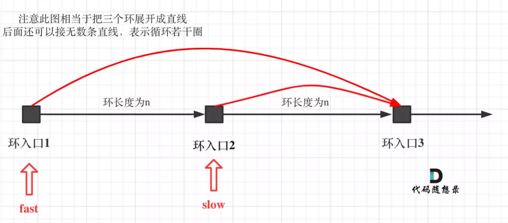
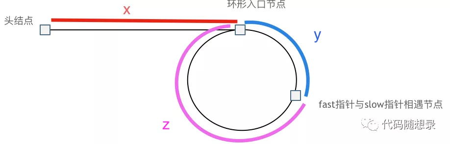
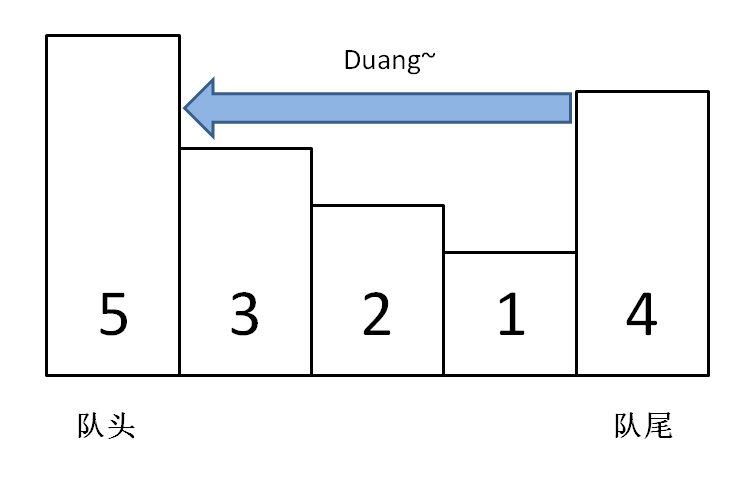
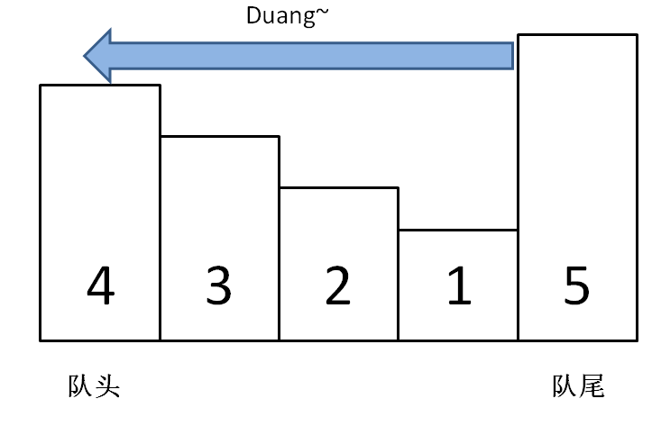

# 双指针

**双指针法（快慢指针法）在数组和链表的操作中是非常常见的，很多考察数组和链表操作的面试题，都使用双指针法。**


https://programmercarl.com/%E6%95%B0%E7%BB%84%E7%90%86%E8%AE%BA%E5%9F%BA%E7%A1%80.html

---

## 26. 删除有序数组中的重复项

不改变顺序，不相同的时候快指针一直跑，

相同的时候慢指针指的值修改++


## 27. 移除元素

**通过一个快指针和慢指针在一个for循环下完成两个for循环的工作。**


同向

```c++
int removeElement(vector<int>& nums, int val) {
    int slowIndex = 0; 
    for (int fastIndex = 0; fastIndex < nums.size(); fastIndex++) {  
        if (val != nums[fastIndex]) { 
            nums[slowIndex++] = nums[fastIndex]; 
        }
    }
    return slowIndex;
}
```


对向

```c++
int removeElement(vector<int>& nums, int val) {
    int i = 0;
    int size = nums.size() - 1;

    while (i <= size) {
        if (nums[i] == val) {
            nums[i] = nums[size];
            size--;
        } else {
            i++;
        }
    }
    return i;
}
```


## 344. 反转字符串

**如果题目关键的部分直接用库函数就可以解决，建议不要使用库函数。**

**如果库函数仅仅是 解题过程中的一小部分，并且你已经很清楚这个库函数的内部实现原理的话，可以考虑使用库函数。**

```c++
void reverseString(vector<char>& s) {
    for (int i = 0, j = s.size() - 1; i < s.size()/2; i++, j--) {
        swap(s[i],s[j]);
    }
}
```


## 剑指Offer 05. 替换空格

**「其实很多数组填充类的问题，都可以先预先给数组扩容带填充后的大小，然后在从后向前进行操作。」**


尽量不要用额外的辅助空间！

需要从后往前填充，从前向后填充就是 $O(n^2)$ 的算法了，因为每次添加元素都要将添加元素之后的所有元素向后移动。

```c++
string replaceSpace(string s) {
    int count = 0;
    int oldSize = s.size();
    for (int i = 0; i < oldSize; i++) {
        if (s[i] == ' ') {
            count++;
        }
    }
    s.resize(s.size() + count * 2); 
    int newSize = s.size();

    for (int i = newSize - 1, j = oldSize - 1; j < i; i--, j--) {
        if (s[j] != ' ') {
            s[i] = s[j];
        } else {
            s[i] = '0';
            s[--i] = '2';
            s[--i] = '%';
        }
    }

    return s;
}
```


---

## 151.翻转字符串里的单词

erase本来就是O(n)的操作，erase操作上面还套了一个for循环，那么以上代码移除冗余空格的代码时间复杂度为 $O(n^2)$ 。

**不要使用辅助空间**

- 移除多余空格
- 将整个字符串反转
- 将每个单词反转


使用双指针法来去移除空格，最后resize（重新设置）一下字符串的大小，就可以做到O(n)的时间复杂度。

```c++
// 逆转字符串
void reverseS(string &s, int start, int end) {
    for (int i = start, j = end; i < j; i++, j--) {
        swap(s[i], s[j]);
    }
}

// 去除多余的空格
void removeExtraSpaces(string& s) {
    int slow = 0;
    int fast = 0;
	
    // 去除最前方的空格
    while (s[fast] == ' ') {
        fast++;
    }
    
    
	// 去除字符串中间的空格
    for (; fast < s.size(); fast++) {
        if (s[fast] == ' ' && s[fast - 1] == ' ') { //保证字符串尾部本不可能有大于1个的空格
            continue;
        } else {
            s[slow] = s[fast];
            slow++;
        }
    }
	
    // 去除字符串最后的空格 最后可能是1个空格或者1个字母
    if (s[slow - 1] == ' ') {
        s.resize(slow - 1);
    } else {
        s.resize(slow);
    }
}

// 解
string reverseWords(string s) {
    removeExtraSpaces(s);
    reverseS(s, 0, s.size() - 1);
    int start = 0;
    for (int i = 0; i < s.size(); i++) {
        if (s[i] == ' ') {
            reverseS(s, start, i - 1);
            start = i + 1;
        }
    }
    reverseS(s, start, s.size() - 1);
    return s;
}
```


## 206. 反转链表

如果再定义一个新的链表，实现链表元素的反转，其实这是对内存空间的浪费。其实只需要**改变**链表的next指针的**指向**，直接将链表反转 ，而不用重新定义一个新的链表


首先定义一个cur指针，指向头结点，再定义一个pre指针，初始化为null。

然后就要开始反转了，首先要把 cur->next 节点用tmp指针保存一下，也就是保存一下这个节点。

为什么要保存一下这个节点呢，因为接下来要改变 cur->next 的指向了，将cur->next 指向pre ，此时已经反转了第一个节点了。

接下来，就是循环走如下代码逻辑了，继续移动pre和cur指针。

最后，cur 指针已经指向了null，循环结束，链表也反转完毕了。此时我们return pre指针就可以了，pre指针就指向了新的头结点。

```c++
ListNode* reverseList(ListNode* head) {
    ListNode* cur = head;
    ListNode* tmp = nullptr;
    ListNode* res = nullptr;

    while (cur != nullptr) {
        tmp = cur;
        cur = cur->next;   // 注意它的位置，
        tmp->next = res;
        res = tmp;
    }
    return res;
}
```


## 142. 环形链表II

```c++
ListNode *detectCycle(ListNode *head) {
    if (head == NULL || head->next == NULL) {
        return NULL;
    }
    ListNode* cur = head;
    ListNode* slow = head->next;
    ListNode* fast = head->next->next;

    while (slow != fast && fast != NULL && fast->next != NULL) {
        slow = slow->next;
        fast = fast->next->next;
    }

    if(fast == NULL || fast->next == NULL) {
        return NULL;
    }

    while (cur != slow) {
        cur = cur->next;
        slow = slow->next;
    }
    return slow;
}
```


- **解释为什么一定是慢指针跑完一圈之前被快指针追上：**

我们考虑，当慢指针第一次到入口的时候快指针的位置 


1.快指针在后：那快指针只要几步就能追上 

2.快慢指针重合，那就直接返回了，慢指针没有走的机会 

3.快指针在前，考虑极端情况，快指针就在慢指针的next


情况3其实跟赛跑一个道理，如果一个人速度是你的两倍，你们两个同是出发，相遇时候一定是在起点相遇，但是此时，比你跑的快的不讲武德，起跑点还比你靠前，所以肯定是在你跑完一圈之前他就追上你了

如果遇到一个人速度是你的两倍，你想在被抓到之前尽可能的跑长一些，那只能让跑的比你快的人起跑的时候在你的脸上（我们认为重合是还没跑就被抓了）




- 解释为什么是 2 倍速度/解释为什么 fast 不能跳过去呢

**fast相对于slow是一次移动一个节点，所以不可能跳过去**


- **从头结点出发一个指针，从相遇节点也出发一个指针，这两个指针每次只走一个节点， 那么当这两个指针相遇的时候就是 环形入口的节点**

把环铺开，因为速度为 2 倍关系，计算公式为



slow 指针走过的节点数为: `x + y`， fast 指针走过的节点数：`x + y + n (y + z)`，n为fast指针在环内走了n圈才遇到slow指针， （y+z）为 一圈内节点的个数A。其中 n 必为1。

因为 fast 指针是一步走两个节点，slow 指针一步走一个节点， 所以 fast 指针走过的节点数 = slow 指针走过的节点数 * 2：

```
(x + y) * 2 = x + y + n (y + z)
```

有 n = 1，则公式就化解为 `x = z`


## 15. 三数之和


时间复杂度：$O(n^2)$ 

```c++
vector<vector<int>> threeSum(vector<int>& nums) {
    vector<vector<int>> res;
    sort(nums.begin(), nums.end());

    int left,right;

    for (int i = 0; i < nums.size(); i++) {
        if (i > 0 && nums[i] == nums[i-1]) {
            continue;
        }

        left = i + 1;
        right = nums.size() - 1;

        while (left < right) {
            if (nums[i] + nums[left] + nums[right] > 0) {
                right--;
            } else if (nums[i] + nums[left] + nums[right] < 0) {
                left++;
            } else {
                // 找到答案时，双指针同时收缩
                res.push_back(vector<int>{nums[i], nums[left], nums[right]});
                right--;
                left++;

                // 去重复值
                while (right > left && nums[right] == nums[right + 1]) {
                    right--;
                }
                while (right > left && nums[left] == nums[left - 1]) {
                    left++;
                }


            }
        }
    }
    return res;
}
```


---

## 18. 四数之和

多套一层循环，其实相当于四指针

```c++
vector<vector<int>> fourSum(vector<int>& nums, int target) {
    vector<vector<int>> res;
    std::sort(nums.begin(), nums.end());
    int i, j, left, right;

    for (i = 0; i < nums.size(); i++) {
        if (i > 0 && nums[i] == nums[i - 1]) {
            continue;
        }
        for (j = i + 1; j < nums.size(); j++) {
            if (j > i + 1 && nums[j] == nums[j - 1]) {
                continue;
            }
            left = j + 1;
            right = nums.size() - 1;

            while (left < right) {
                if (nums[i] + nums[j] + nums[left] + nums[right] < target) {
                    left++;
                } else if (nums[i] + nums[j] + nums[left] + nums[right] > target) {
                    right--;
                } else if (nums[i] + nums[j] + nums[left] + nums[right] == target) {
                    res.push_back(vector<int>{nums[i], nums[j], nums[left], nums[right]});

                    left++;
                    right--;

                    while (left < right && nums[left] == nums[left - 1]) {
                        left++;
                    }

                    while (left < right && nums[right] == nums[right + 1]) {
                        right--;
                    }
                }
            }
        }
    }

    return res;
}
```


---

## 209.长度最小的子数组

[力扣题目链接(opens new window)](https://leetcode-cn.com/problems/minimum-size-subarray-sum/)

给定一个含有 n 个正整数的数组和一个正整数 s ，找出该数组中满足其和 ≥ s 的长度最小的 连续 子数组，并返回其长度。如果不存在符合条件的子数组，返回 0。

示例：

输入：s = 7, nums = [2,3,1,2,4,3] 输出：2 解释：子数组 [4,3] 是该条件下的长度最小的子数组。


所谓滑动窗口，**就是不断的调节子序列的起始位置和终止位置，从而得出我们要想的结果**。


---

## 3.无重复字符的最长子串 / 904. 水果成篮

```C++
int lengthOfLongestSubstring(string s) {
    int n = s.size();

    int lo = 0, hi = lo;
    unordered_map<char, int> ump;

    int res = 0;
    for (; hi < n; ++hi) {
        ump[s[hi]]++;
        if (ump[s[hi]] == 1) {
            res = max(res, hi - lo + 1);
        } else {
            while (ump[s[hi]] != 1) {
                ump[s[lo]]--;
                lo++;
            }                
            res = max(res, hi - lo + 1);
        }
    }

    return res;
}


int lengthOfLongestSubstring(string s) {
    if (s.size() == 0) return 0;
    unordered_map<char, int> umap;
    int left = 0;
    int len = 0;
    int res = 0;

    for (int right = 0; right < s.size(); right++) {
        umap[s[right]]++;
        len++;

        while (umap[s[right]] > 1) {	// 一旦重复 就移动left 减到2
            umap[s[left]]--;
            if (umap[s[left]] == 0) umap.erase(s[left]);
            left++;
            len--;
        } 

        res = max(res, len);//保存结果在外边
    }

    return res;
}
```


**水果成篮一模一样原理的题**

问题等价于，找到最长的子序列

比如说，`tree = [1, 1, 1, 1, 2, 2, 3, 3, 3]` 可以看成是 `blocks = [(1, weight = 4), (2, weight = 2), (3, weight = 3)]`。


希望找到最长的包含两种不同“类型”的子序列，我们称这样的子序列为*合法的*。

假设我们考虑所有以下标 j 为结尾的合法子序列，那么一定有一个最小的开始下标 i：称之为 opt(j) = i。

我们会发现这个 opt(j) 是一个单调递增的函数，这是因为**所有合法子序列的子序列一定也是合法的**

```c++
int totalFruit(vector<int>& fruits) {
    int left = 0, right = 0;
    int len = 0, res = 0;
    unordered_map<int, int> umap;

    for(; right < fruits.size(); right++) {
        umap[fruits[right]]++;
        len++;
        while (umap.size() > 2) {	// size=3时候 直接减到2
            umap[fruits[left]]--;
            if (umap[fruits[left]] == 0) umap.erase(fruits[left]);
            left++;
            len--;
        }	//小于2的时候直接跳过 记录最优值

        res = max(res, len);//保存结果在外边
    }

    return res;
}
```


---

## 面试题 17.11. 单词距离

```c++
int findClosest(vector<string>& words, string word1, string word2) {
    int idx1 = -1, idx2 = -1;
    int res = 0x3f3f3f3f;
    for (int i = 0; i < words.size(); ++i) {
        if (words[i] == word1) idx1 = i;
        if (words[i] == word2) idx2 = i;

        if (idx1 != -1 && idx2 != -1) res = min(res, abs(idx1 - idx2));
    }

    return res;
}
```


---

## 1089. 复写零

```c++
class Solution {
public:
    void duplicateZeros(vector<int>& arr) {
        int n = arr.size();
        int top = 0, i = -1;

        /*找到有效数字的结束位置i*/
        while (top < n) {
            i++;
            if (arr[i] != 0) {
                top++;
            } else {
                top += 2;
            }
        }

        /*倒着来移动值*/
        int j = n - 1;

        /*若 top == n + 1 说明修改后的数组的末尾的值正好是 0
        这个 0 复写后的 0 应该位于 arr[n] 的位置
        但这超出了范围 因此此种情况需要特判*/
        if (top == n + 1) {
            arr[j] = 0;
            j--;
            i--;
        }

        while (j >= 0) {
            arr[j] = arr[i];
            j--;
            if (arr[i] == 0) {
                arr[j] = arr[i];
                j--;
            }
            i--;
        } 

        return;
    }
};
```


```c++
class Solution {
public:
    void duplicateZeros(vector<int>& arr) {
        for (unsigned i{}, j{}, tmp{}; tmp = arr[i], j < arr.size(); i++, j++)
        {
            if (tmp <<16>> 16) arr[j] |= tmp << 16;
            else j++;
        }
        for (auto& i : arr) i >>= 16;
    }
};
```


```c++
class Solution {
public:
    void duplicateZeros(vector<int>& arr) {
        int n = arr.size();
        int fast = 0, slow = 0;

        /*找到有效数字的结束位置i*/
        while (fast < n) {
            fast += arr[slow] == 0 ? 2 : 1;
            ++slow;            
        }

        /*倒着来移动值*/
        int i = n - 1, j = slow - 1;

        /*若 top == n + 1 说明修改后的数组的末尾的值正好是 0
        这个 0 复写后的 0 应该位于 arr[n] 的位置
        但这超出了范围 因此此种情况需要特判*/
        if (fast == n + 1) {
            arr[i] = 0;            
            i--;
            j--;
        }

        while (i >= 0) {
            arr[i] = arr[j];
            i--;
            if (arr[j] == 0) {  //是0的话再把前一位也赋值了
                arr[i] = arr[j];
                i--;
            }
            j--;
        } 

        return;
    }
};
```


## 556. 下一个更大元素 III

```c++
class Solution {
public:
    int nextGreaterElement(int n) {
        string str = to_string(n);
        int size = str.size() - 1;

        // 找到交换点right，即从低位第一个比结尾数字小的数
        int right = size - 1;
        while (right >= 0 && str[right] >= str[right + 1]) {
            right--;
        }
        if (right == -1) return -1;

        /*把后边排序掉*/
        int offset = size - right;
        sort(str.end() - offset, str.end());
		
        // 找出第一个比它大的数字并交换
        for (int i = right + 1; i <= size; ++i) {
            if (str[i] > str[right]) {
                swap(str[i], str[right]);
                break;
            }
        }

        return stol(str) > INT_MAX ? -1 : stol(str);
    }
};
```


---

# 滑动窗口（Sliding Window）

滑动窗口主要用来处理连续问题。比如题目求解“连续子串 xxxx”，“连续子数组 xxxx”，就应该可以想到滑动窗口。能不能解决另说，但是这种敏感性还是要有的。

从类型上说主要有：

- 固定窗口大小
- 窗口大小不固定，求解最大的满足条件的窗口
- 窗口大小不固定，求解最小的满足条件的窗口（上面的 209 题就属于这种）

后面两种我们统称为`可变窗口`。当然不管是哪种类型基本的思路都是一样的，不一样的仅仅是代码细节。


## 固定窗口大小

对于固定窗口，我们只需要固定初始化左右指针 l 和 r，分别表示的窗口的左右顶点，并且保证：

1. l 初始化为 0
2. 初始化 r，使得 r - l + 1 等于窗口大小
3. 同时移动 l 和 r
4. 判断窗口内的连续元素是否满足题目限定的条件
   - 4.1 如果满足，再判断是否需要更新最优解，如果需要则更新最优解
   - 4.2 如果不满足，则继续。


---

## 可变窗口大小

对于可变窗口，我们同样固定初始化左右指针 l 和 r，分别表示的窗口的左右顶点。后面有所不同，我们需要保证：

1. l 和 r 都初始化为 0
2. r 指针移动一步
3. 判断窗口内的连续元素是否满足题目限定的条件
   - 3.1 如果满足，再判断是否需要更新最优解，如果需要则更新最优解。并尝试通过移动 l 指针缩小窗口大小。循环执行 3.1
   - 3.2 如果不满足，则继续。

形象地来看的话，就是 r 指针不停向右移动，l 指针仅仅在窗口满足条件之后才会移动，起到窗口收缩的效果。


---

## 伪代码

```c++
初始化慢指针 = 0
初始化 ans

for 快指针 in 可迭代集合
   更新窗口内信息
   while 窗口内不符合题意
      扩展或者收缩窗口
      慢指针移动
   更新答案
返回 ans
```


## 76. 最小覆盖子串

```c++
unordered_map<char, int> umaps, umapt;

bool check() {
    for (auto c : umapt) {
        if (umaps[c.first] < c.second) {
            return false;
        }
    }
    return true;
}

string minWindow(string s, string t) {
 	for (auto c : t)
        umapt[c]++;
    
    int left = 0, right = 0;
    int len = INT_MAX, resL = -1;
    
    for (; right < t.size(); ++right) {
        char c = s[right];
        
        if (umapt.find(c) != umapt.end())
            umaps[c]++;
                
        while (check() && left <= right) {	//一旦满足 就移动 left 缩小
            if (right - left + 1 < len) {	//保存结果在里边
                len = right - left + 1;
                resL = left;
            }
            
            if (umapt.find(s[left]) != umapt.end()) {
                umaps[s[left]]--;
            }
            
            left++;
        }
        
    }
    
    return resL == -1 ? string() : s.substr(left, len);
}
```


---

## 930. 和相同的二元子数组

```c++
```


---

## 239. 滑动窗口最大值

在一堆数字中，已知最值，如果给这堆数**添加**一个数，那么**比较一下**就可以很快算出最值；但如果**减少**一个数，就不一定能很快得到最值了，而要遍历所有数重新找最值。

回到这道题的场景，每个窗口前进的时候，要添加一个数同时减少一个数，所以想在 O(1) 的时间得出新的最值，就需要「单调队列」这种特殊的数据结构来辅助了。

一个普通的队列一定有这两个操作：

```c++
class Queue {
    void push(int n);
    // 或 enqueue，在队尾加入元素 n
    void pop();
    // 或 dequeue，删除队头元素
}
```

一个「单调队列」的操作也差不多：

```c++
class MonotonicQueue {
    // 在队尾添加元素 n
    void push(int n);
    // 返回当前队列中的最大值
    int max();
    // 队头元素如果是 n，删除它
    void pop(int n);
}
```

当然，这几个 API 的实现方法肯定跟一般的 Queue 不一样，不过我们暂且不管，而且认为这几个操作的时间复杂度都是 O(1)，先把这道「滑动窗口」问题的解答框架搭出来：

```c++
vector<int> maxSlidingWindow(vector<int>& nums, int k) {
    MonotonicQueue window;
    vector<int> res;
    for (int i = 0; i < nums.size(); i++) {
        if (i < k - 1) { //先把窗口的前 k - 1 填满
            window.push(nums[i]);
        } else { // 窗口开始向前滑动
            window.push(nums[i]);
            res.push_back(window.max());
            window.pop(nums[i - k + 1]);
            // nums[i - k + 1] 就是窗口最后的元素
        }
    }
    return res;
}
```


这个思路很简单，能理解吧？下面我们开始重头戏，单调队列的实现。

### 单调队列

首先我们要认识另一种数据结构：deque，即**双端队列**。很简单：

```c++
class deque {
    // 在队头插入元素 n
    void push_front(int n);
    // 在队尾插入元素 n
    void push_back(int n);
    // 在队头删除元素
    void pop_front();
    // 在队尾删除元素
    void pop_back();
    // 返回队头元素
    int front();
    // 返回队尾元素
    int back();
}
```

而且，这些操作的复杂度都是 O(1)。用链表作为底层结构的话，很容易实现这些功能。

「**单调队列**」的核心思路和「单调栈」类似。单调队列的 push 方法依然在**队尾添加**元素，但是**要把前面比新元素小的元素都删掉**：

```c++
class MonotonicQueue {
private:
    deque<int> data;
public:
    void push(int n) {
        while (!data.empty() && data.back() < n) 
            data.pop_back();
        data.push_back(n);
    }
};
```




> 你可以想象，加入数字的大小代表人的体重，把前面体重不足的都压扁了，直到遇到更大的量级才停住。	


如果每个元素被加入时都这样操作，最终单调队列中的元素大小就会保持一个单调递减的顺序，因此我们的 `max()` API 可以可以这样写：

```C++
int max() {
    return data.front();
}
```

`pop()` API 在队头删除元素 n，也很好写：

```C++
void pop(int n) {
    if (!data.empty() && data.front() == n)
        data.pop_front();
}
```

之所以要判断 `data.front() == n`，是因为我们想删除的队头元素 n 可能已经被「压扁」了，这时候就不用删除了：



```c++
class MonotonicQueue {
private:
    deque<int> data;
public:
    void push(int n) {
        while (!data.empty() && data.back() < n) 
            data.pop_back();
        data.push_back(n);
    }
    
    int max() { return data.front(); }
    
    void pop(int n) {
        if (!data.empty() && data.front() == n)
            data.pop_front();
    }
};

vector<int> maxSlidingWindow(vector<int>& nums, int k) {
    MonotonicQueue window;
    vector<int> res;
    for (int i = 0; i < nums.size(); i++) {
        if (i < k - 1) { //先填满窗口的前 k - 1
            window.push(nums[i]);
        } else { // 窗口向前滑动
            window.push(nums[i]);
            res.push_back(window.max());
            window.pop(nums[i - k + 1]);
        }
    }
    return res;
}
```


> 单调队列在添加元素的时候靠删除元素保持队列的单调性，相当于抽取出某个函数中单调递增（或递减）的部分；而优先级队列（二叉堆）相当于自动排序，差别大了去了。


### 优先队列

初始时，我们将数组 nums 的前 k 个元素放入优先队列中。每当我们向右移动窗口时，我们就可以把一个新的元素放入优先队列中，此时堆顶的元素就是堆中所有元素的最大值。然而这个**最大值可能并不在滑动窗口中**，在这种情况下，这个值在数组 nums 中的位置出现在滑动窗口左边界的左侧。因此，当我们后续继续向右移动窗口时，这个值就永远不可能出现在滑动窗口中了，我们可以将其永久地从优先队列中移除。

我们不断地移除堆顶的元素，直到其确实出现在滑动窗口中。此时，堆顶元素就是滑动窗口中的最大值。为了方便判断堆顶元素与滑动窗口的位置关系，我们可以在优先队列中存储二元组 (num,index)，表示元素 num 在数组中的下标为 index。

```c++
class Solution {
public:
    vector<int> maxSlidingWindow(vector<int>& nums, int k) {
        int n = nums.size();
        priority_queue<pair<int, int>> q;
        for (int i = 0; i < k; ++i) {
            q.emplace(nums[i], i);
        }
        vector<int> ans = {q.top().first};
        for (int i = k; i < n; ++i) {
            q.emplace(nums[i], i);
            while (q.top().second <= i - k) {
                q.pop();
            }
            ans.push_back(q.top().first);
        }
        return ans;
    }
};
```


