# 双指针

**双指针法（快慢指针法）在数组和链表的操作中是非常常见的，很多考察数组和链表操作的面试题，都使用双指针法。**


https://programmercarl.com/%E6%95%B0%E7%BB%84%E7%90%86%E8%AE%BA%E5%9F%BA%E7%A1%80.html

---

## 26. 删除有序数组中的重复项

不改变顺序，不相同的时候快指针一直跑，

相同的时候慢指针指的值修改++


## 27. 移除元素

**通过一个快指针和慢指针在一个for循环下完成两个for循环的工作。**


同向

```c++
int removeElement(vector<int>& nums, int val) {
    int slowIndex = 0; 
    for (int fastIndex = 0; fastIndex < nums.size(); fastIndex++) {  
        if (val != nums[fastIndex]) { 
            nums[slowIndex++] = nums[fastIndex]; 
        }
    }
    return slowIndex;
}
```


对向

```c++
int removeElement(vector<int>& nums, int val) {
    int i = 0;
    int size = nums.size() - 1;

    while (i <= size) {
        if (nums[i] == val) {
            nums[i] = nums[size];
            size--;
        } else {
            i++;
        }
    }
    return i;
}
```


## 344. 反转字符串

**如果题目关键的部分直接用库函数就可以解决，建议不要使用库函数。**

**如果库函数仅仅是 解题过程中的一小部分，并且你已经很清楚这个库函数的内部实现原理的话，可以考虑使用库函数。**

```c++
void reverseString(vector<char>& s) {
    for (int i = 0, j = s.size() - 1; i < s.size()/2; i++, j--) {
        swap(s[i],s[j]);
    }
}
```


## 剑指Offer 05. 替换空格

**「其实很多数组填充类的问题，都可以先预先给数组扩容带填充后的大小，然后在从后向前进行操作。」**


尽量不要用额外的辅助空间！

需要从后往前填充，从前向后填充就是 $O(n^2)$ 的算法了，因为每次添加元素都要将添加元素之后的所有元素向后移动。

```c++
string replaceSpace(string s) {
    int count = 0;
    int oldSize = s.size();
    for (int i = 0; i < oldSize; i++) {
        if (s[i] == ' ') {
            count++;
        }
    }
    s.resize(s.size() + count * 2); 
    int newSize = s.size();

    for (int i = newSize - 1, j = oldSize - 1; j < i; i--, j--) {
        if (s[j] != ' ') {
            s[i] = s[j];
        } else {
            s[i] = '0';
            s[--i] = '2';
            s[--i] = '%';
        }
    }

    return s;
}
```


---

## 151.翻转字符串里的单词

erase本来就是O(n)的操作，erase操作上面还套了一个for循环，那么以上代码移除冗余空格的代码时间复杂度为 $O(n^2)$ 。

**不要使用辅助空间**

- 移除多余空格
- 将整个字符串反转
- 将每个单词反转


使用双指针法来去移除空格，最后resize（重新设置）一下字符串的大小，就可以做到O(n)的时间复杂度。

```c++
// 逆转字符串
void reverseS(string &s, int start, int end) {
    for (int i = start, j = end; i < j; i++, j--) {
        swap(s[i], s[j]);
    }
}

// 去除多余的空格
void removeExtraSpaces(string& s) {
    int slow = 0;
    int fast = 0;
	
    // 去除最前方的空格
    while (s[fast] == ' ') {
        fast++;
    }
    
    
	// 去除字符串中间的空格
    for (; fast < s.size(); fast++) {
        if (s[fast] == ' ' && s[fast - 1] == ' ') { //保证字符串尾部本不可能有大于1个的空格
            continue;
        } else {
            s[slow] = s[fast];
            slow++;
        }
    }
	
    // 去除字符串最后的空格 最后可能是1个空格或者1个字母
    if (s[slow - 1] == ' ') {
        s.resize(slow - 1);
    } else {
        s.resize(slow);
    }
}

// 解
string reverseWords(string s) {
    removeExtraSpaces(s);
    reverseS(s, 0, s.size() - 1);
    int start = 0;
    for (int i = 0; i < s.size(); i++) {
        if (s[i] == ' ') {
            reverseS(s, start, i - 1);
            start = i + 1;
        }
    }
    reverseS(s, start, s.size() - 1);
    return s;
}
```


## 206. 反转链表

如果再定义一个新的链表，实现链表元素的反转，其实这是对内存空间的浪费。其实只需要**改变**链表的next指针的**指向**，直接将链表反转 ，而不用重新定义一个新的链表


首先定义一个cur指针，指向头结点，再定义一个pre指针，初始化为null。

然后就要开始反转了，首先要把 cur->next 节点用tmp指针保存一下，也就是保存一下这个节点。

为什么要保存一下这个节点呢，因为接下来要改变 cur->next 的指向了，将cur->next 指向pre ，此时已经反转了第一个节点了。

接下来，就是循环走如下代码逻辑了，继续移动pre和cur指针。

最后，cur 指针已经指向了null，循环结束，链表也反转完毕了。此时我们return pre指针就可以了，pre指针就指向了新的头结点。

```c++
ListNode* reverseList(ListNode* head) {
    ListNode* cur = head;
    ListNode* tmp = nullptr;
    ListNode* res = nullptr;

    while (cur != nullptr) {
        tmp = cur;
        cur = cur->next;   // 注意它的位置，
        tmp->next = res;
        res = tmp;
    }
    return res;
}
```


## 142. 环形链表II

```c++
ListNode *detectCycle(ListNode *head) {
    if (head == NULL || head->next == NULL) {
        return NULL;
    }
    ListNode* cur = head;
    ListNode* slow = head->next;
    ListNode* fast = head->next->next;

    while (slow != fast && fast != NULL && fast->next != NULL) {
        slow = slow->next;
        fast = fast->next->next;
    }

    if(fast == NULL || fast->next == NULL) {
        return NULL;
    }

    while (cur != slow) {
        cur = cur->next;
        slow = slow->next;
    }
    return slow;
}
```


- **解释为什么一定是慢指针跑完一圈之前被快指针追上：**

我们考虑，当慢指针第一次到入口的时候快指针的位置 


1.快指针在后：那快指针只要几步就能追上 

2.快慢指针重合，那就直接返回了，慢指针没有走的机会 

3.快指针在前，考虑极端情况，快指针就在慢指针的next


情况3其实跟赛跑一个道理，如果一个人速度是你的两倍，你们两个同是出发，相遇时候一定是在起点相遇，但是此时，比你跑的快的不讲武德，起跑点还比你靠前，所以肯定是在你跑完一圈之前他就追上你了

如果遇到一个人速度是你的两倍，你想在被抓到之前尽可能的跑长一些，那只能让跑的比你快的人起跑的时候在你的脸上（我们认为重合是还没跑就被抓了）


- 解释为什么是 2 倍速度/解释为什么 fast 不能跳过去呢

**fast相对于slow是一次移动一个节点，所以不可能跳过去**


- **从头结点出发一个指针，从相遇节点也出发一个指针，这两个指针每次只走一个节点， 那么当这两个指针相遇的时候就是 环形入口的节点**

把环铺开，因为速度为 2 倍关系，计算公式为


slow 指针走过的节点数为: `x + y`， fast 指针走过的节点数：`x + y + n (y + z)`，n为fast指针在环内走了n圈才遇到slow指针， （y+z）为 一圈内节点的个数A。其中 n 必为1。

因为 fast 指针是一步走两个节点，slow 指针一步走一个节点， 所以 fast 指针走过的节点数 = slow 指针走过的节点数 * 2：

```
(x + y) * 2 = x + y + n (y + z)
```

有 n = 1，则公式就化解为 `x = z`


## 15. 三数之和


时间复杂度：$O(n^2)$ 

```c++
vector<vector<int>> threeSum(vector<int>& nums) {
    vector<vector<int>> res;
    sort(nums.begin(), nums.end());

    int left,right;

    for (int i = 0; i < nums.size(); i++) {
        if (i > 0 && nums[i] == nums[i-1]) {
            continue;
        }

        left = i + 1;
        right = nums.size() - 1;

        while (left < right) {
            if (nums[i] + nums[left] + nums[right] > 0) {
                right--;
            } else if (nums[i] + nums[left] + nums[right] < 0) {
                left++;
            } else {
                // 找到答案时，双指针同时收缩
                res.push_back(vector<int>{nums[i], nums[left], nums[right]});
                right--;
                left++;

                // 去重复值
                while (right > left && nums[right] == nums[right + 1]) {
                    right--;
                }
                while (right > left && nums[left] == nums[left - 1]) {
                    left++;
                }


            }
        }
    }
    return res;
}
```


---

## 18. 四数之和

多套一层循环，其实相当于四指针

```c++
vector<vector<int>> fourSum(vector<int>& nums, int target) {
    vector<vector<int>> res;
    std::sort(nums.begin(), nums.end());
    int i, j, left, right;

    for (i = 0; i < nums.size(); i++) {
        if (i > 0 && nums[i] == nums[i - 1]) {
            continue;
        }
        for (j = i + 1; j < nums.size(); j++) {
            if (j > i + 1 && nums[j] == nums[j - 1]) {
                continue;
            }
            left = j + 1;
            right = nums.size() - 1;

            while (left < right) {
                if (nums[i] + nums[j] + nums[left] + nums[right] < target) {
                    left++;
                } else if (nums[i] + nums[j] + nums[left] + nums[right] > target) {
                    right--;
                } else if (nums[i] + nums[j] + nums[left] + nums[right] == target) {
                    res.push_back(vector<int>{nums[i], nums[j], nums[left], nums[right]});

                    left++;
                    right--;

                    while (left < right && nums[left] == nums[left - 1]) {
                        left++;
                    }

                    while (left < right && nums[right] == nums[right + 1]) {
                        right--;
                    }
                }
            }
        }
    }

    return res;
}
```


---

## 209.长度最小的子数组

[力扣题目链接(opens new window)](https://leetcode-cn.com/problems/minimum-size-subarray-sum/)

给定一个含有 n 个正整数的数组和一个正整数 s ，找出该数组中满足其和 ≥ s 的长度最小的 连续 子数组，并返回其长度。如果不存在符合条件的子数组，返回 0。

示例：

输入：s = 7, nums = [2,3,1,2,4,3] 输出：2 解释：子数组 [4,3] 是该条件下的长度最小的子数组。


所谓滑动窗口，**就是不断的调节子序列的起始位置和终止位置，从而得出我们要想的结果**。


---

## 3.无重复字符的最长子串 / 904. 水果成篮

```C++
int lengthOfLongestSubstring(string s) {
    int n = s.size();

    int lo = 0, hi = lo;
    unordered_map<char, int> ump;

    int res = 0;
    for (; hi < n; ++hi) {
        ump[s[hi]]++;
        if (ump[s[hi]] == 1) {
            res = max(res, hi - lo + 1);
        } else {
            while (ump[s[hi]] != 1) {
                ump[s[lo]]--;
                lo++;
            }                
            res = max(res, hi - lo + 1);
        }
    }

    return res;
}


int lengthOfLongestSubstring(string s) {
    if (s.size() == 0) return 0;
    unordered_map<char, int> umap;
    int left = 0;
    int len = 0;
    int res = 0;

    for (int right = 0; right < s.size(); right++) {
        umap[s[right]]++;
        len++;

        while (umap[s[right]] > 1) {	// 一旦重复 就移动left 减到2
            umap[s[left]]--;
            if (umap[s[left]] == 0) umap.erase(s[left]);
            left++;
            len--;
        } 

        res = max(res, len);//保存结果在外边
    }

    return res;
}
```


**水果成篮一模一样原理的题**

问题等价于，找到最长的子序列

比如说，`tree = [1, 1, 1, 1, 2, 2, 3, 3, 3]` 可以看成是 `blocks = [(1, weight = 4), (2, weight = 2), (3, weight = 3)]`。


希望找到最长的包含两种不同“类型”的子序列，我们称这样的子序列为*合法的*。

假设我们考虑所有以下标 j 为结尾的合法子序列，那么一定有一个最小的开始下标 i：称之为 opt(j) = i。

我们会发现这个 opt(j) 是一个单调递增的函数，这是因为**所有合法子序列的子序列一定也是合法的**

```c++
int totalFruit(vector<int>& fruits) {
    int left = 0, right = 0;
    int len = 0, res = 0;
    unordered_map<int, int> umap;

    for(; right < fruits.size(); right++) {
        umap[fruits[right]]++;
        len++;
        while (umap.size() > 2) {	// size=3时候 直接减到2
            umap[fruits[left]]--;
            if (umap[fruits[left]] == 0) umap.erase(fruits[left]);
            left++;
            len--;
        }	//小于2的时候直接跳过 记录最优值

        res = max(res, len);//保存结果在外边
    }

    return res;
}
```


---

# 滑动窗口（Sliding Window）

滑动窗口主要用来处理连续问题。比如题目求解“连续子串 xxxx”，“连续子数组 xxxx”，就应该可以想到滑动窗口。能不能解决另说，但是这种敏感性还是要有的。

从类型上说主要有：

- 固定窗口大小
- 窗口大小不固定，求解最大的满足条件的窗口
- 窗口大小不固定，求解最小的满足条件的窗口（上面的 209 题就属于这种）

后面两种我们统称为`可变窗口`。当然不管是哪种类型基本的思路都是一样的，不一样的仅仅是代码细节。


## 固定窗口大小

对于固定窗口，我们只需要固定初始化左右指针 l 和 r，分别表示的窗口的左右顶点，并且保证：

1. l 初始化为 0
2. 初始化 r，使得 r - l + 1 等于窗口大小
3. 同时移动 l 和 r
4. 判断窗口内的连续元素是否满足题目限定的条件
   - 4.1 如果满足，再判断是否需要更新最优解，如果需要则更新最优解
   - 4.2 如果不满足，则继续。


---

## 可变窗口大小

对于可变窗口，我们同样固定初始化左右指针 l 和 r，分别表示的窗口的左右顶点。后面有所不同，我们需要保证：

1. l 和 r 都初始化为 0
2. r 指针移动一步
3. 判断窗口内的连续元素是否满足题目限定的条件
   - 3.1 如果满足，再判断是否需要更新最优解，如果需要则更新最优解。并尝试通过移动 l 指针缩小窗口大小。循环执行 3.1
   - 3.2 如果不满足，则继续。

形象地来看的话，就是 r 指针不停向右移动，l 指针仅仅在窗口满足条件之后才会移动，起到窗口收缩的效果。


---

## 伪代码

```c++
初始化慢指针 = 0
初始化 ans

for 快指针 in 可迭代集合
   更新窗口内信息
   while 窗口内不符合题意
      扩展或者收缩窗口
      慢指针移动
   更新答案
返回 ans
```


## 76. 最小覆盖子串

```c++
unordered_map<char, int> umaps, umapt;

bool check() {
    for (auto c : umapt) {
        if (umaps[c.first] < c.second) {
            return false;
        }
    }
    return true;
}

string minWindow(string s, string t) {
 	for (auto c : t)
        umapt[c]++;
    
    int left = 0, right = 0;
    int len = INT_MAX, resL = -1;
    
    for (; right < t.size(); ++right) {
        char c = s[right];
        
        if (umapt.find(c) != umapt.end())
            umaps[c]++;
                
        while (check() && left <= right) {	//一旦满足 就移动 left 缩小
            if (right - left + 1 < len) {	//保存结果在里边
                len = right - left + 1;
                resL = left;
            }
            
            if (umapt.find(s[left]) != umapt.end()) {
                umaps[s[left]]--;
            }
            
            left++;
        }
        
    }
    
    return resL == -1 ? string() : s.substr(left, len);
}
```


---


## 930. 和相同的二元子数组


---

# 前缀和

https://blog.csdn.net/weixin_45629285/article/details/111146240

前缀和是一种重要的预处理，能大大降低查询的时间复杂度。可以简单理解为“数列的前 n 项的和”。


## 一维前缀和

通过前缀和数组可以轻松得到**每个区间的和**。我们的前缀和数组里保存的就是前 n 项的和。

前缀和其实我们很早之前就了解过的，我们求数列的和时，`Sn = a1+a2+a3+...an`; 此时 Sn 就是数列的前 n 项和。例 `S5 = a1 + a2 + a3 + a4 + a5`; `S2 = a1 + a2`。所以我们完全可以通过 `S5-S2` 得到 `a3+a4+a5` 的值，这个过程就和我们做题用到的前缀和思想类似。我们的前缀和数组里保存的就是前 n 项的和。见下图

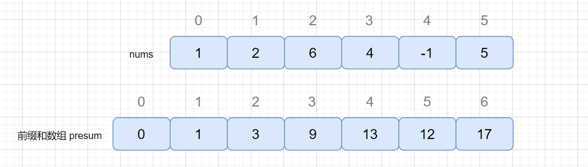

我们通过前缀和数组保存前 n 位的和，presum[1]保存的就是 nums 数组中前 1 位的和，也就是 `presum[1] = nums[0]`, `presum[2] = nums[0] + nums[1] = presum[1] + nums[1]`. 依次类推，所以我们通过前缀和数组可以轻松得到每个区间的和。

例如我们需要获取 nums[2] 到 nums[4] 这个区间的和，我们则完全根据 presum 数组得到，是不是有点和我们之前说的字符串匹配算法中 BM,KMP 中的 next 数组和 suffix 数组作用类似。那么我们怎么根据 presum 数组获取 nums[2] 到 nums[4] 区间的和呢？见下图

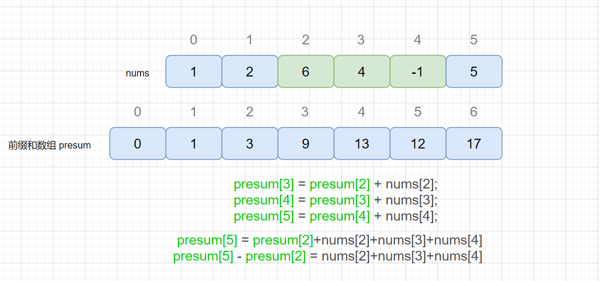


好啦，我们已经了解了前缀和的解题思想了，我们可以通过下面这段代码得到我们的前缀和数组，非常简单

```c++
vector<int> preSum(nums.size() + 1, 0);
presum[0] = 0;
for (int i = 0; i < nums.size(); i++) {
	presum[i+1] = nums[i] + presum[i];
}

for (int i = 1; i <= nums.size(); i++) {
	presum[i] = nums[i-1] + presum[i-1];
}
```


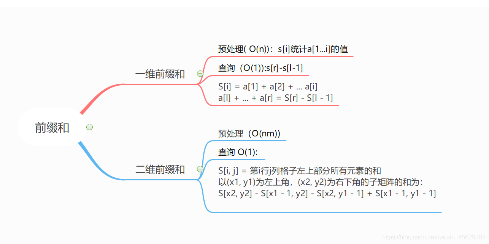

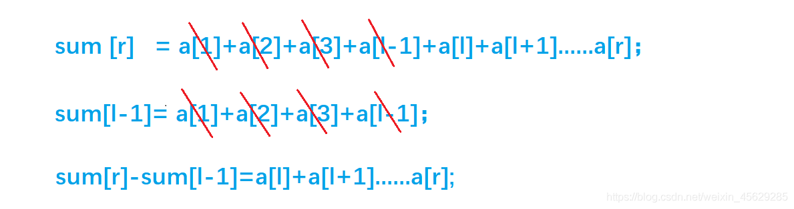

- Q：输入一对 l, r。输出原序列中从第 l 个数到第 r 个数的和。

这样，对于每个询问，只需要执行 `sum[r]-sum[l-1]`。输出原序列中从第`l`个数到第r个数的和的时间复杂度变成了`O(1)`。

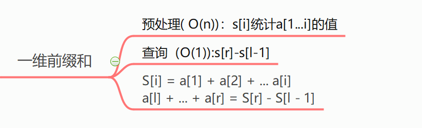


---

## 二维前缀和

输入一个n行m列的整数矩阵，再输入q个询问，每个询问包含四个整数 x1, y1, x2, y2，表示一个子矩阵的左上角坐标和右下角坐标。对于每个询问输出子矩阵中所有数的和。

同一维前缀和一样，我们先来定义一个二维数组 `s[][]`, `s[i][j]`表示二维数组中，左上角(1,1)到右下角( i,j )所包围的矩阵元素的和。接下来推导二维前缀和的公式。

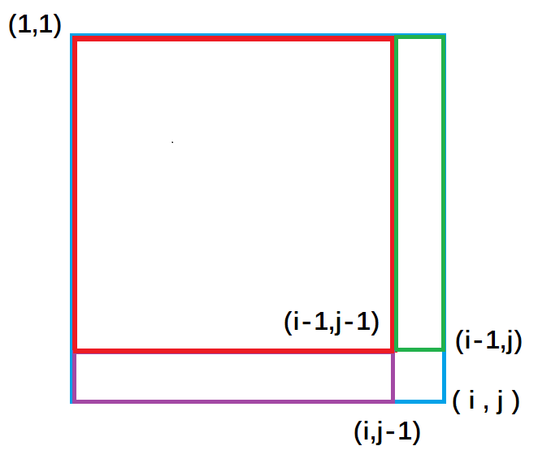

**紫色面积**是指`(1,1)`左上角到`(i,j-1)`右下角的矩形面积, **绿色面积**是指`(1,1)`左上角到`(i-1, j )`右下角的矩形面积。**每一个颜色的矩形面积都代表了它所包围元素的和。**


**从图中我们很容易看出**，整个外围蓝色矩形面积`s[i][j]` = 绿色面积`s[i-1][j]` + 紫色面积`s[i][j-1]` - 重复加的红色的面积`s[i-1][j-1]`+小方块的面积`a[i][j]`;

**因此得出二维前缀和预处理公式**

```C++
s[i][j] = s[i-1][j] + s[i][j-1] + a[i][j] - s[i-1][j-1];
// a[i][j] = 1
```

**接下来回归问题**去求以`(x1, y1)`为左上角和以`(x2, y2)`为右下角的矩阵的元素的和。**如图：**


**紫色面积**是指 `(1, 1)`左上角到`(x1-1, y2)`右下角的矩形面积 ，**黄色面积**是指`(1, 1)`左上角到`(x2, y1-1)`右下角的矩形面积；


绿色矩形的面积 = 整个外围面积`s[x2, y2]` - 黄色面积`s[x2, y1 - 1]` - 紫色面积`s[x1 - 1, y2]` + 重复减去的红色面积 `s[x1 - 1, y1 - 1]`

**因此二维前缀和的结论为：**

以`(x1, y1)`为左上角，`(x2, y2)`为右下角的子矩阵的和为：
`s[x2, y2] - s[x1 - 1, y2] - s[x2, y1 - 1] + s[x1 - 1, y1 - 1]`

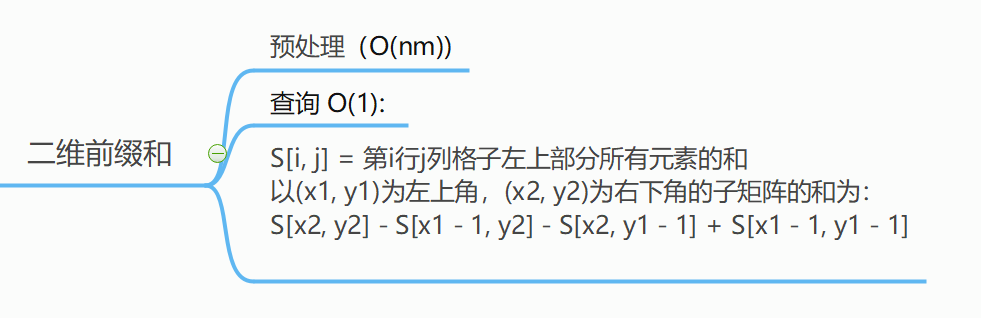


---

## 724. 寻找数组的中心下标


```c++
int pivotIndex(vector<int>& nums) {
    int presum[nums.size() + 1];
    presum[0] = 0;

    for (int i = 0; i < nums.size(); ++i) {
        presum[i + 1] = nums[i] + presum[i];
    }

    int left = 0, right = 0;
    for (int i = 0; i < nums.size(); ++i) {
        left = presum[i] - presum[0];
        right = presum[nums.size()] - presum[i];

        if (left == right) {
            return i;
        }

    }
    return -1;
}
```


## 523. 连续的子数组和

**前缀和 + HashMap**

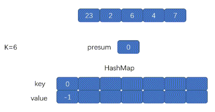


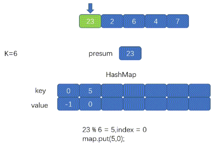


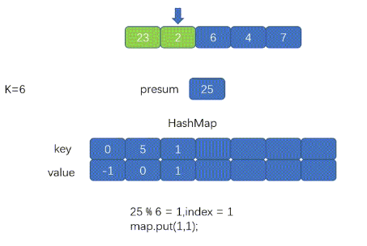


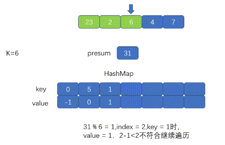


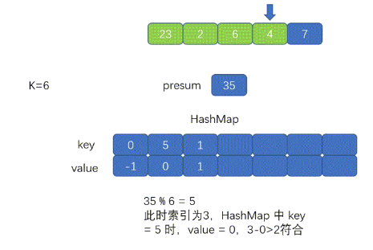


---

## 6072. 转角路径的乘积中最多能有几个尾随零

因子分解：
尾数 0 的个数由乘积因子中 10 的个数所决定，而 10 又由 $2 \times 5$ 组成。

两个 2 和 两个 5 可组成两个 10：$2 \times 5 \times 2 \times 5 = 100$
三个 2 和 两个 5 可组成两个 10：$2 \times 5 \times 2 \times 5 \times 2 = 200$

可发现，对于一个整数 $num$ 而言，其质因子中 2 和 5 的数目的较小值即为尾数 0 的数目。

因此，一条路径的乘积中尾数 0 的个数，即为该条路径中各个乘数所包含的因子 2 的个数和 与 因子 5 的个数和的较小者。

**本质上就是计算 `Min{2, 5}`**


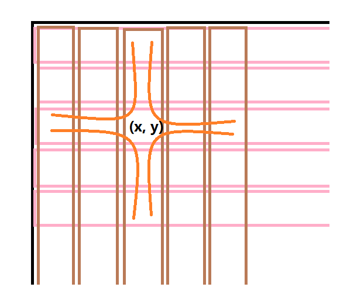

思路：遍历每个点，计算以当前点为转弯点，4种情况上, 2和5的情况！


因为只能最多拐弯一次 , 而能拐弯一定是拐弯是最优的 , 而且每次开始和结束点都是在边界上。所以枚举 拐弯点 即可 , 此时只有 四 种可能 (如下图所示 , **选择一条 橙色 和 黑色 作为两个方向**)。分别判断即可 (用 前缀和 优化)


乘积尾随零的数量是所有乘数中因子 2 数量之和与因子 5 数量之和中的较小值。

做乘法的过程中，尾随零的数量只会增加，不会减少，因此我们应该让尽量多的数参与乘积运算。也就是说最优路径一定是从某个边界出发，拐个弯，再走到另一个边界，不会中途不走了或者不拐弯（这样参与运算的数不是最多的）。

因此可以先用前缀和维护每一行和每一列的因子 2 与 因子 5 的数量，再**枚举拐点**计算答案即可。


```c++
int maxTrailingZeros(vector<vector<int>>& grid) {
        int m = grid.size();        //行
        int n = grid[0].size();     //列
        vector<vector<int>> f2(m + 1), g2(m + 1), f5(m + 1),g5(m + 1);

        for (int i = 0; i <= m; ++i) {
            f2[i] = g2[i] = f5[i] = g5[i] = vector<int>(n + 1);
        }
   
        for (int i = 1; i <= m; ++i) {
            for (int j = 1; j <= n; ++j) {
                int x = grid[i-1][j-1];
                int two = 0, five = 0;
                while (x % 2 == 0) two++, x /= 2;
                while (x % 5 == 0) five++, x /= 5;
                f2[i][j] = f2[i][j-1] + two;        // 从左边界 i,0 到现在 i,j 累乘了多少个 2 水平 i不变
                g2[i][j] = g2[i-1][j] + two;        // 从上边界 0,j 到现在 i,j 累乘了多少个 2 垂直 j不变
                f5[i][j] = f5[i][j-1] + five;       // 从左边界 i,0 到现在 i,j 累乘了多少个 5 水平 i不变
                g5[i][j] = g5[i-1][j] + five;       // 从上边界 0,j 到现在 i,j 累乘了多少个 5 垂直 j不变
            }
        }
        
        int ans = 0;

        /*枚举所有点作为拐点时的尾随零，从水平方向拿一个方向，从垂直方向拿一个方向*/
        for (int i = 1; i <= m; ++i) {
            for (int j = 1; j <= n; ++j) {
                ans = max(ans, min(f2[i][j] + g2[i-1][j], f5[i][j] + g5[i-1][j]));                          // 左边出发 上边结束 
                // f2[i][j]   包括 [i][j]
                // g2[i-1][j] 不包括 [i][j]

                ans = max(ans, min(f2[i][j] + g2[m][j] - g2[i][j], f5[i][j] + g5[m][j] - g5[i][j]));        // 左边出发 下边结束
                // f2[i][j]   包括[i][j]
                // g2[m][j] - g2[i][j] 不包括 [i][j]  
 
                ans = max(ans, min(f2[i][n] - f2[i][j] + g2[i][j], f5[i][n] - f5[i][j] + g5[i][j]));        // 右边出发 上边结束
                // f2[i][n] - f2[i][j] 不包括 [i][j]
                // g2[i][j] 包括[i][j]
                
                ans = max(ans, min(f2[i][n] - f2[i][j] + g2[m][j] - g2[i-1][j], 
                                    f5[i][n] - f5[i][j] + g5[m][j] - g5[i-1][j]));                          // 右边出发 下边结束
                // f2[i][n] - f2[i][j]    不包括 [i][j]  
                // g2[m][j] - g2[i-1][j]   包括  [i][j]      
            }
        }

        return ans;
   
    }
```


---

## 644. 子数组最大平均数 II

**连续数组**

min 表示数组 nums 的最小值，max 表示数组 nums 的最大值。最大平均字段和 一定在最大值与最小值之间，即区间 (min, max) 之间。

因为值全是max的时候，平均数是max；全是min的时候，平均数是min


二分思想是：通过不断猜测最大平均值，再通过验证更新猜测值，使每次猜测更加接近正确值。

- 如果猜测值太大，下一次猜一个更小的值
- 如果猜测值太小，下一次猜一个更大的值


以 max 和 min 作为猜测边界，每次猜测值为 mid = min + (max - min) /2。接下来寻找是否存在长度 >= k 的**连续子数组**的平均值大于 mid。

假设在数组 num 中存在一个长度为 j 的子数组，它的元素为 $a_1, a_2, a_3...,a_j$，它们的平均值 >= mid，即

- $(a_1+a_2+ a_3...+a_j)/j \geq mid$  或
- $(a_1+a_2+ a_3...+a_j) \geq j*mid$ 或
- $(a_1-mid) +(a_2-mid)+ (a_3-mid) ...+(a_j-mid) \geq 0$

数组中每个元素都减去 mid 后，如果存在长度 >= k 的子数组之和 >= 0，则表明数组 nums 中存在子数组的平均和 >= mid，此时令猜测区间的下边界为 mid；否则令猜测区间的上边界为 mid，然后继续该过程


在遍历数组 nums 时，将 nums[i] - mid 加到 sum[i] 上。如果 sum[k] >= 0，则直接令猜测区间的下界变为 mid。否则，按照下面思路不断求 nums 的前 i 项之和。


数组的前 j 项之和分别为 $sum_j$ 与 $sum_i$。因此第 j 到 i 项之和为 $sum_j - sum_i$。我们希望找到一对 i 和 j，使得 $j-i \ge k$ 时，有 $sum_j - sum_i \ge 0$。为了实现这一点，只需要计算第 $j-k$ 到 $j$ 项之和。这是因为如果最小的 $sum_i$ 都不能满足条件，则更大的值也无法满足条件。


使用 `prev` 变量存储从第 k 个位置开始的累加和。然后记录 `prev` 中出现过的最小值，即最小和。


每次寻找到一个新的 mid 后，都将它作为猜测区间的上边界或下边界，以不断缩小猜测范围。为了保证精度，使用 `error` 保证区间宽度小于 `10-5` 时，结束猜测。


```c++
bool check(vector<int>& nums, double mid, int k) {
    int n = nums.size();

    vector<double> preSum(n + 1, 0);

    for (int i = 1; i <= n; ++i) {
        preSum[i] = preSum[i - 1] + nums[i - 1] - mid;
    }

    double preMin = preSum[0];
    for (int i = k; i <= n; ++i) {
        preMin = min(preMin, preSum[i - k]);    //   每次更新 preMin 最小值
        if (preSum[i] - preMin >= 0) return true;
    }

    return false;
}

double findMaxAverage(vector<int>& nums, int k) {
    int n = nums.size();
    double maxV = *max_element(nums.begin(), nums.end());
    double minV = *min_element(nums.begin(), nums.end());

    while ((maxV - minV) >  1e-5) {
        double mid = minV + (maxV - minV) / 2;

        if (check(nums, mid, k)) {
            minV = mid;
        } else {
            maxV = mid;
        }

    }

    return maxV;
}
```


实现 Check函数，就是前缀和的计算，即通过 目前和 - 前缀和 获取当前范围和。

特别要注意的是：条件是说 大于等于 k， 所以我们前缀和的计算数组的大小是 0 到 n-k


前缀和add，维护ij，addj-minAddi来求平均数，不需要固定i，只需要维护历史上最小的addi，也就是只需要固定j


---

## 643. 子数组最大平均数 I

```c++
bool check(vector<int>& nums, double mid, int k) {
    int n = nums.size();
    vector<double> preSum(n + 1, 0);

    for (int i = 1; i <= n; ++i) {
        preSum[i] = preSum[i-1] + nums[i-1] - mid;
    }


    for (int i = k; i <= n; ++i) {
        if (preSum[i] - preSum[i-k] >= 0) return true;
    }

    return false;
}

double findMaxAverage(vector<int>& nums, int k) {
    int n = nums.size();
    double maxV = *max_element(nums.begin(), nums.end());
    double minV = *min_element(nums.begin(), nums.end());

    while (maxV - minV > 1e-5) {
        double mid = minV + (maxV - minV) / 2;
        if (check(nums, mid, k)) {
            minV = mid;
        } else {    // 不满足说明值太大，所以maxV变小为mid
            maxV = mid;
        }
    }

    return minV;
}
```


## 560. 和为k的子数组

定义 $\textit{pre}[i]$ 为 $[0..i]$ 里所有数的和，则 $\textit{pre}[i]$ 可以由 $\textit{pre}[i-1]$ 递推而来，即：

$$
\textit{pre}[i]=\textit{pre}[i-1]+\textit{nums}[i]
$$
那么「$[j..i]$ 这个子数组和为 k 」这个条件我们可以转化为

$$
\textit{pre}[i]-\textit{pre}[j-1]==k
$$
简单移项可得符合条件的下标 j 需要满足

$$
\textit{pre}[j-1] == \textit{pre}[i] - k
$$
所以我们考虑以 i 结尾的和为 k 的连续子数组个数时只要统计有多少个前缀和为 $\textit{pre}[i]-k$ 的 $\textit{pre}[j]$ 即可。我们建立哈希表 $\textit{mp}$，以和为键，出现次数为对应的值，记录 $\textit{pre}[i]$ 出现的次数，从左往右边更新 $\textit{mp}$ 边计算答案，那么以 i 结尾的答案 $\textit{mp}[\textit{pre}[i]-k]$ 即可在 O(1) 时间内得到。最后的答案即为所有下标结尾的和为 k 的子数组个数之和。


题意：有几种 i、j 的组合，使得从第 i 到 j 项的子数组和等于 k。
↓ ↓ ↓ 转化为 ↓ ↓ ↓
有几种 i、j 的组合，满足 `prefixSum[j] - prefixSum[i - 1] == k`。


```c++
int subarraySum(vector<int>& nums, int k) {
    int n = nums.size();

    vector<int> preSum(n + 1, 0);
    unordered_map<int, int> ump;// 存前缀和的值 后边的和减去前边的和 = k 说明也满足条件

    ump[0] = 1; // 这一行的作用就是为了应对 nums[0] +nums[1] + ... + nums[i] == k 的情况的, 也就是从下标 0 累加到下标 i
    
    // 如果不加这个就是算 nums[1] + ... + nums[i] == k
    int cnt = 0;
    for (int i = 1; i <= n; ++i) {
        preSum[i] = preSum[i-1] + nums[i-1];

        cnt += ump[preSum[i] - k];
        ump[preSum[i]]++;	    
    }

    return cnt;
} 
```


---

## 974. 和可被 K 整除的子数组

令 `P[i]=nums[0]+nums[1]+…+nums[i]`。那么每个连续子数组的和 `sum(i, j)` 就可以写成 `P[j] - P[i-1]` 其中 0 < i < j 的形式。此时，判断子数组的和能否被 k 整除就等价于判断 `(P[j] - P[i-1]) mod k == 0`，根据同余定理，只要 `P[j] mod k == P[i-1] mod k`，就可以保证上面的等式成立。

遍历到第 i 个元素时，统计以 i 解为的符合条件的子数组个数，维护一个以前缀和模 k 的值为键，出现次数为值的哈希表 record，在遍历的同时进行更新。这样在计算以 i 结尾的符合条件的子数组个数时，根据上面的分析，答案即为 $[0..i-1]$ 中前缀和模 k 也为 $P[i] \bmod k$ 的位置个数，即 $\textit{record}[P[i] \bmod k]$。

最后的答案即为以每一个位置为数尾的符合条件的子数组个数之和。需要注意的一个边界条件是，我们需要对哈希表初始化，记录 $\textit{record}[0] = 1$，这样就考虑了前缀和本身被 k 整除的情况。


```c++
class Solution {
public:
    int subarraysDivByK(vector<int>& nums, int k) {
        unordered_map<int, int> record = {{0, 1}};
        int sum = 0, ans = 0;
        for (int elem: nums) {
            sum += elem;
            // 注意 C++ 取模的特殊性，当被除数为负数时取模结果为负数，需要纠正
            int modulus = (sum % k + k) % k;
            if (record.count(modulus)) {
                ans += record[modulus];
            }
            ++record[modulus];
        }
        return ans;
    }
};
```

时间复杂度：O(n)，其中 n 是数组 nums 的长度。我们只需要从前往后遍历一次数组，在遍历数组的过程中，维护哈希表的各个操作均为 O(1)，因此总时间复杂度为 O(n)。

空间复杂度：O(min(n,k))，即哈希表需要的空间。当 n≤k 时，最多有 n 个前缀和，因此哈希表中最多有 n+1 个键值对；当 n > k 时，最多有 k 个不同的余数，因此哈希表中最多有 k 个键值对。也就是说，哈希表需要的空间取决于 n 和 k 中的较小值。


---

## 209. 长度最小的子数组

```c++
int minSubArrayLen(int target, vector<int>& nums) {
    int n = nums.size();

    vector<int> preSum(n + 1, 0);

    for (int i = 0; i < n; ++i) {
        preSum[i+1] = preSum[i] + nums[i];
    }

    int res = INT_MAX;
    for (int i = 1; i <= n; ++i) {
        int lo = 0, hi = i;

        while (lo <= hi) {
            int mid = lo + (hi - lo) / 2;
            if (preSum[i] - preSum[mid] >= target) {
                res = min(res, i - mid);
                lo = mid + 1;          
            } else {
                hi = mid - 1; 
            }
        }
    }        

    return res == INT_MAX ? 0 : res;
}
```


## 523. 连续的子数组和


---

# 差分数组

## 一维差分

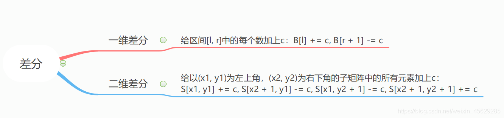

类似于数学中的求导和积分，**差分可以看成前缀和的逆运算。**

差分数组：

首先给定一个原数组a：`a[1], a[2], a[3],,,,,, a[n];`

然后我们构造一个数组b ： `b[1] ,b[2] , b[3],,,,,, b[i];`

使得 `a[i] = b[1] + b[2 ]+ b[3] +,,,,,, + b[i]`

也就是说，a 数组是 b 数组的前缀和数组，**反过来**我们把 b 数组叫做 a 数组的差分数组。换句话说，每一个 `a[i]` 都是 b 数组中从头开始的一段区间和。

考虑如何构造差分b数组？最为直接的方法**如下：**

```C++
a[0 ]= 0;

b[1] = a[1] - a[0];

b[2] = a[2] - a[1];

b[3] =a [3] - a[2];

........

b[n] = a[n] - a[n-1];
```

我们只要有`b`数组，通过前缀和运算，就可以在`O(n)` 的时间内得到`a`数组 。


- Q：给定区间`[l ,r ]`，让我们把`a`数组中的`[ l, r]`区间中的每一个数都加上`c`,即 `a[l] + c , a[l+1] + c , a[l+2] + c ,,,,,, a[r] + c`;

a 数组是 b 数组的前缀和数组，比如**对 b 数组的 b[i] 的修改**，会影响到 a 数组中**从 a[i] 及往后**的**每一个数**。

首先让差分b数组中的 `b[l] + c` ,通过前缀和运算，a数组变成 `a[l] + c ,a[l+1] + c,,,,,, a[n] + c`;

然后我们打个补丁，`b[r+1] - c`, 通过前缀和运算，a数组变成 `a[r+1] - c,a[r+2] - c,,,,,,,a[n] - c`;


`b[l] + c`，效果使得 `a` 数组中 `a[l]` 及以后的数都加上了 `c`(红色部分)，但我们只要求 l 到 r 区间加上 c, 因此还需要执行 `b[r+1] - c`,让 `a` 数组中 `a[r+1]` 及往后的区间再减去c(绿色部分)，这样对于 `a[r]` 以后区间的数相当于没有发生改变。

因此我们得出一维差分结论：给a数组中的[ l, r]区间中的每一个数都加上c,只需对差分数组b做 b[l] + = c, b[r+1] - = c。时间复杂度为O(1), 大大提高了效率。


---

## 二维差分

如果扩展到二维，我们需要让二维数组被选中的子矩阵中的每个元素的值加上`c`, 是否也可以达到 `O(1)` 的时间复杂度。答案是可以的，**考虑二维差分**。

`a[][]` 数组是 `b[][]` 数组的前缀和数组，那么 `b[][]` 是 `a[][]` 的差分数组

原数组： `a[i][j]`

我们去构造差分数组： `b[i][j]`

使得 `a` 数组中 `a[i][j]` 是 `b` 数组左上角 `(1,1)` 到右下角 `(i,j)` 所包围矩形元素的和。


我们使用差分操作在对原数组进行修改的过程中，实际上就可以构造出差分数组。

同一维差分，我们构造二维差分数组目的是为了 让原二维数组 `a` 中所选中子矩阵中的每一个元素加上 `c` 的操作，可以由 `O(n*n)` 的时间复杂度优化成 `O(1)`

已知原数组 `a` 中被选中的子矩阵为 以 `(x1,y1)` 为左上角，以 `(x2,y2)` 为右下角所围成的矩形区域;

始终要记得 a 数组是 b 数组的前缀和数组，比如对 b 数组的 **`b[i][j]` 的修改**，会影响到 a数组中**从 `a[i][j]` 及往后的每一个数**。

假定我们已经构造好了 b 数组，类比一维差分，我们执行以下操作来使被选中的子矩阵中的每个元素的值加上 c

`b[x1][y1] += c;`

`b[x1,][y2+1] -= c;`

`b[x2+1][y1] -= c;`

`b[x2+1][y2+1] += c;`

每次对b数组执行以上操作，等价于：

```c++
for(int i = x1; i <= x2; i++)
	for(int j = y1; j <= y2; j++)
		a[i][j] += c;
```


`b[x1][y1] += c;` 对应图1 ,让整个a数组中小蓝色矩形面积的元素都加上了c。
`b[x1][y2+1] -= c;` 对应图2 ,让整个a数组中绿色矩形面积的元素再减去c，使其内元素不发生改变。
`b[x2+1][y1] -= c;` 对应图3 ,让整个a数组中紫色矩形面积的元素再减去c，使其内元素不发生改变。
`b[x2+1][y2+1] += c;` 对应图4,让整个a数组中红色矩形面积的元素再加上c，红色内的相当于被减了两次，再加上一次c，才能使其**恢复**。


```c++
void insert(int x1, int y1, int x2, int y2, int c) {     
    //对b数组执行插入操作，等价于对a数组中的(x1,y1)到(x2,y2)之间的元素都加上了c
    b[x1][y1]			+=c;
    b[x2 + 1][y1]		-=c;
    b[x1][y2 + 1]		-=c;
    b[x2 + 1][y2 + 1]	+=c;
}
```

我们可以先假想a数组为空，那么b数组一开始也为空，但是实际上a数组并不为空，因此我们每次让以(i,j)为左上角到以(i,j)为右下角面积内元素(其实就是一个小方格的面积)去插入 `c=a[i][j]`，等价于原数组a中(i,j) 到(i,j)范围内加上了 `a[i][j]` ,因此执行 n*m 次插入操作，就成功构建了差分b数组.


```c++
for(int i = 1;i <= n; i++)
    for(int j = 1; j <= m; j++)
        insert(i, j, i, j, a[i][j]);    //构建差分数组
```

当然关于二维差分操作也有直接的构造方法，**公式如下：**

```c++
b[i][j] = a[i][j] − a[i−1][j] − a[i][j−1] + a[i−1][j−1];
```

二维差分数组的构造同一维差分思维相同，因次在这里就不再展开叙述了。

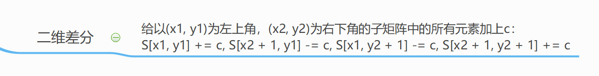
