# Apex Kdmapper

[KDMapper ](https://github.com/z175/kdmapper)is a [kernel](https://guidedhacking.com/threads/kernel-mode-drivers-info-for-anticheat-bypass.11325/) driver manual mapper using a vulnerable Intel Driver

- Utilizes an embedded vulnerable Intel driver
- Manually Maps your driver
- Provides a simple command line interface
- You just pass it 1 argument and you're driver is loaded


If you use KDMapper you must **bypass these kernel detections**

- `PiDDBCacheTable`
- `MmUnloadedDrivers`
- System thread detection
- System pool detection


This driver (`iqvw64e.sys`) comes as part of **Intel LAN drivers** and it allows to copy, read and write user/kernel memory, map physical memory and perform virtual to physical address translation.

Your driver must be compiled with /GS- option, and have custom **driver entry point defined**. (Basically the same kind of driver that you would use with drvmap or any other driver manual mapper)

https://github.com/TheCruZ/kdmapper

https://github.com/z175/kdmapper


---

## 编译

```c++
open .sln
release x64
close Spectre-mitigated
build solution
you will get the kdmapper.exe in floder x64/Release
```

Just disable "Spectre Mitigation" in project config as TheBestRaul said or just download them from Visual Studio Installer -> Individual components -> search spectre

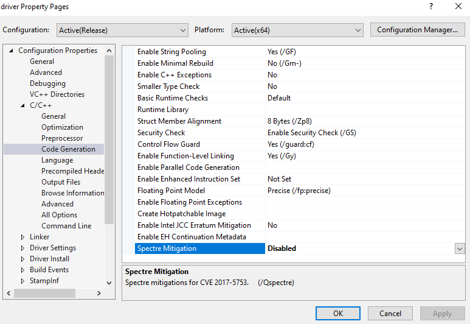


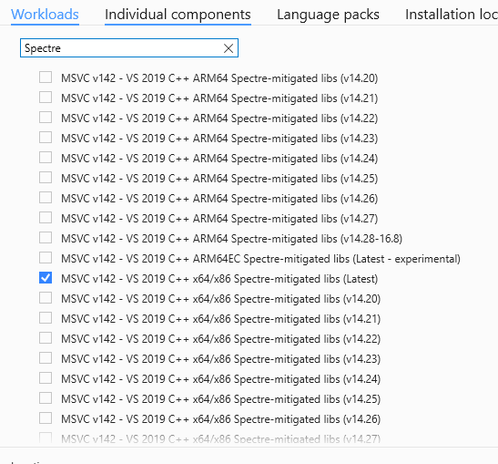


## 加载

每次重启电脑使用都需要加载  `driver.sys`

```shell
@echo off
cd %~dp0
echo [+] Checking current directory
echo [#] Executing
kdmapper.exe driver.sys
pause
```

**加载时确定 origin 和 apex 是关闭的，使用管理员运行。**

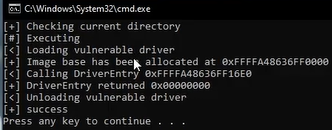


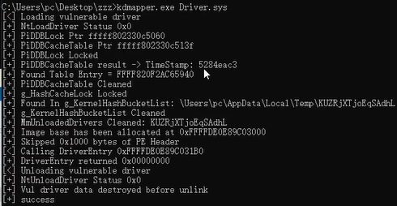


---

# Apex UCThread - Glow

## **Project Branthium**

https://www.unknowncheats.me/forum/apex-legends/451329-project-branthium-15.html

https://github.com/TheCruZ/kdmapper

I recommend you build this with **Visual Studio 2017** or **2019**.
The menu key is **INSERT**.
Build in **Release x64**.
You will need **WDK** to build the driver.
Use **kdmapper** to load the driver.
For the **overlay to work properly** you must be in **windowed/borderless windowed**.
There seems to be an issue where some users can't use the cheat (can't get base address or **insta crash**), either this is **CPU related** or you're on an older **version of Windows 10**. 


```
1- Install all "Windows 10 SDK (10.x.xxx.xxx)" and Visual Studio
2- ] Install WDK 
3- ] Download Branthium Project from github
4- ] Open Solution file "Project Branthium.sln"
5-A ] On top where you see "Local Windows Debugger" you can see 2 select box before it
 - Set them on "Release" "x64" (it's solving compile errors)
5-B ] Disable "Spectre Mitigation" for driver "This is How"
6- ] Press Ctrl+SHIFT+B and wait for the success message
7- ] Compile kdmapper like step 4-6
8- ] Copy kdmapper.exe from" kdmapper-master\x64\Release" to "Project-Branthium-main\build"
9- ] Run cmd as admin and cd to build dir
10- ] Enter "kdmapper.exe driver.sys"
11- ] Run usermode.exe
12- ] Open Apex and Done!

Tips
- Run Visual Studio as admin
- Author in 20H2
- I just got banned. And now I using spoofer for clean all log. Thanksfully I didn't get banned hwid.
- Run as admin Usermode.exe at apex lobby , don't use cmd too
- If you dont get ban , change kdmapper entry point , name / pack usermode and driver / delete traces
- need to hold insert a few sec to close, but also need to hold insert fow few sec to open, only use for glow

Error
- I think kestackattachprocess and MmCopyVirtualMemory were detected on EAC and BE. We can use this read process physical memory, no attach [see Section Anti-Cheat Bypass read process physical memory, no attach]
- The driver literally patches a non writable section (PAGE) in dxgkrnl.sys. I can confidently tell you that you can change that 'most likely' to a definitely.
- Obviously this would be detected you are inline hooking
```


```powershell
D:\workspace\Reverse\apex\Project-Branthium-main\Project-Branthium-main\build>kdmapper.exe driver.sys                   
[<] Loading vulnerable driver                                               
[+] NtLoadDriver Status 0x0                  
[+] PiDDBLock Ptr fffff8010e30a591                      
[+] PiDDBCacheTable Ptr fffff8010e30dcfb
[+] PiDDBLock Locked                          
[+] PiDDBCacheTable result -> TimeStamp: 5284eac3   
[+] Found Table Entry = FFFF808F14E17D00       
[+] PiDDBCacheTable Cleaned                     
[+] g_KernelHashBucketList Found 0xFFFFF801124B8080      
[+] g_HashCacheLock Locked                    
[+] Found In g_KernelHashBucketList: \Users\ADMINI~1\AppData\Local\Temp\vVqjtVsJWgGIsrkm  
[+] g_KernelHashBucketList Cleaned             
[+] MmUnloadedDrivers Cleaned: vVqjtVsJWgGIsrkm    
[+] Image base has been allocated at 0xFFFFD201CB0EF000  
[+] Skipped 0x1000 bytes of PE Header       
[<] Calling DriverEntry 0xFFFFD201CB0EF1B0   
[+] DriverEntry returned 0x00000000          
[<] Unloading vulnerable driver      
[+] NtUnloadDriver Status 0x0               
[+] Vul driver data destroyed before unlink   
[+] success
```


```powershell
[<] Loading vulnerable driver
[+] NtLoadDriver Status 0x0
[+] PiDDBLock Ptr fffff8043eb6b8bc
[+] PiDDBCacheTable Ptr fffff8043eb6b99b
[+] PiDDBLock Locked
[+] PiDDBCacheTable result -> TimeStamp: 5284eac3
[+] Found Table Entry = FFFFE70DC02C5630
[+] PiDDBCacheTable Cleaned
[+] g_KernelHashBucketList Found 0xFFFFF8043F3D0080
[+] g_HashCacheLock Locked
[+] Found In g_KernelHashBucketList: \Users\root\AppData\Local\Temp\ElhTDubTiNyDGkmAitoyT
[+] g_KernelHashBucketList Cleaned
[+] MmUnloadedDrivers Cleaned: ElhTDubTiNyDGkmAitoyT
[+] Image base has been allocated at 0xFFFF920DCB8F6000
[+] Skipped 0x1000 bytes of PE Header
[<] Calling DriverEntry 0xFFFF920DCB8F61B0
[+] DriverEntry returned 0x00000000
[<] Unloading vulnerable driver
[+] NtUnloadDriver Status 0x0
[+] Vul driver data destroyed before unlink
[+] success
```


```c++
the detection is here

BYTE shell_code[] = { 0x48, 0xB8 }; // mov rax, xxx
BYTE shell_code_end[] = { 0xFF, 0xE0 }; //jmp rax
```


---

## **Streamproof Box ESP**

https://www.unknowncheats.me/forum/apex-legends/445419-streamproof-box-esp.html

https://github.com/BaconToaster/UC-Apex

```
0) (only for nvidia graphics cards) install NVIDIA GeForce Experience
1) download the file and extract it
2) run cmd as admin and copy the path to the folder you extracted to
3) you can do it in 2 ways:
drag Driver.sys on kdmapper
or:
open cmd as admin
type cd YOUR\PATH\TO\THE\FOLDER
and type kdmapper.exe Driver.sys
5) (only for non-nvidia graphics cards) run Overlay.exe
6) run Usermode.exe
7) start Apex

Tips
Usermode crashing after saying success:
- most likely the driver failed to map
- release x64
- Close Spectre Mitigation

Failed to hijack NVIDIA overlay:
- open Overlay.exe and try opening Usermode.exe again

Fixes for driver mapping fail:
- disable vanguard/faceit/esea
- disable your antivirus

VCRUNTIME error:
- install the C++ redistributables https://aka.ms/vs/16/release/vc_redist.x64.exe and https://aka.ms/vs/16/release/vc_redist.x86.exe (they can be found on https://support.microsoft.com/en-us/topic/the-latest-supported-visual-c-downloads-2647da03-1eea-4433-9aff-95f26a218cc0

Everything worked but esp doesn't show in game:
- switch from fullscreen to borderless
- (only for NVIDIA graphics cards) open the NVIDIA overlay with alt + z
- make sure the driver mapped correctly

BSOD
- make sure any browsers are closed
- map driver, run apex as admin and load usermode in game
- reason for bsod is apex is in fullscreen
```


**Very nice way of being banned.**

```C++
	PVOID* function = reinterpret_cast<PVOID*>(get_system_module_export("\\SystemRoot\\System32\\drivers\\dxgkrnl.sys",                             "NtQueryCompositionSurfaceStatistics"));
 
	if (!function)
		return false;
 
	BYTE orig[] = { 0x00, 0x00, 0x00, 0x00, 0x00, 0x00, 0x00, 0x00, 0x00, 0x00, 0x00, 0x00 };
 
	BYTE shell_code[] = { 0x48, 0xB8 }; // mov rax, xxx
	BYTE shell_code_end[] = { 0xFF, 0xE0 }; //jmp rax
```

`NtQueryCompositionSurfaceStatistics` is just a function being hooked for driver to application communication. 


There are hundred other functions you can hook to communicate

[https://github.com/hfiref0x/NtCall64...all64/tables.h](https://github.com/hfiref0x/NtCall64/blob/master/Source/NtCall64/tables.h)

but be careful, some of them have security checks which easy bsod. look at hook in WinDbg too see if there not getting checked. 

其中一些有安全检查，会导致蓝屏，也看看 WinDbg 中的钩子，看看是否没有被检查。


if you build driver and use `Win32dbg` you can see what it does. you can also hook other functions to fix bsod but make sure they have no security cookie.

如果您构建驱动程序并使用 Win32dbg，您可以看到它的作用。您还可以 hook 其他函数来修复 bsod，但请确保它们没有安全 cookie


右键 usermode.exe 属性

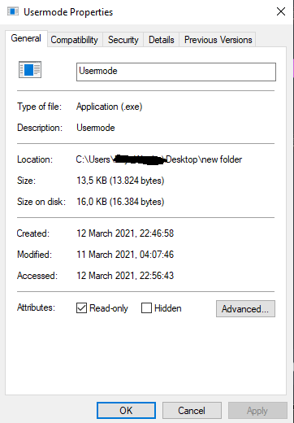

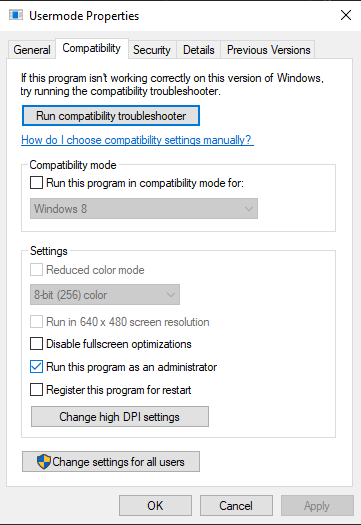


I fixed the cmd with this

just add a simple output stream after this line:

```c++
std::cout << base_address << std::endl;
```

should look like this:

```c++
std::cout << base_address << std::endl;
std::cout << "Bruh moment";
```


```c++
DWORD64 GetEntityById(int Ent, DWORD64 Base)
{
	DWORD64 EntityList = Base + 0x18DA338;
	DWORD64 BaseEntity = Read<DWORD64>(EntityList);
	if (!BaseEntity)
		return NULL;
 
	return  Read<DWORD64>(EntityList + (Ent << 5));
}
 
void EnableHighlight(DWORD64 Entity, float r, float g, float b)
{
	write<bool>(Entity + 0x3C8, true);
	write<int>(Entity + 0x350, 1);
	write<float>(Entity + 0x1D0, r);
	write<float>(Entity + 0x1D4, g);
	write<float>(Entity + 0x1D8, b);
	for (int offset = 0x388; offset <= 0x3B4; offset += 0x4)
		write<float>(Entity + offset, FLT_MAX);
	write<float>(Entity + 0x2FC, 500.f); // distance max
}
```

if i change the `(Entity + 0x2FC, 500.f)` to `(Entity + 0x2FC, 100.f)` , the ESP distance will change in game.


---

## External Apex Glow ESP

https://www.unknowncheats.me/forum/apex-legends/443493-external-apex-glow-esp-21.html

https://github.com/SurgeGotTappedAgain/External-Apex-Cheat

```
Edit : Install WDK
1) Build in Release x64
2) Map driver using KDMapper
3) Launch Game
4) Run User-mode when in main menu
5) Have Fun
```


since it **hooks Win32**, for some reason **browsers cause it too Blue screen** but just do not have browser open when playing. 


driver pasted from: [https://github.com/Rubery/RuberyKernel](https://github.com/Rubery/RuberyKernel) and user mode is pasted from that source and https://github.com/Sndix/Apex-Legends-Simple-Glow


- release x64

- load the driver with kdmapper.exe (use different kdmapper version to try https://github.com/TheCruZ/kdmapper)

- run apex legends as admin (*windows borderless*)
- connect to the game (get into the main menu where you can see your character - else there is no entity list)
- run the usermode.exe as admin  (make sure you open usermode in match , and the console showing numbers, run normally usermode.exe **in match** /  make usermode **executable read only**)


> Read the source and you will see that you need to open the usermode while already in game and not in the menu.


> there are hundred other functions you can hook to communicate, i suggest you look at this.
>
> [https://github.com/hfiref0x/NtCall64...all64/tables.h](https://github.com/hfiref0x/NtCall64/blob/master/Source/NtCall64/tables.h)
>
> but be careful, some of them have security checks which easy **BSOD**. look at hook in `WinDbg` too see if there not getting checked.
>
> this project use `NtQueryCompositionSurfaceStatistics`, use Win32dbg you can see what it does. you can also hook other functions to fix **BSOD** but make sure they have no security cookie.


```
NtQueryCompositionSurfaceStatistics
NtSetCompositionSurfaceIndependentFlipInfo
NtOpenCompositionSurfaceSectionInfo
NtSetCompositionSurfaceIndependentFlipInfo
```


> guys u have to play in borderless or windowed. Fullscreen dont work


> If you wanna do something detected but not patch guarded just hook the function by swapping the pointer in the `NtGddiInterface`


> if you wish to make it undetected you will need to change driver communication or hooks in source + shellcode in `hook.cpp`
>
> ```c++
> BYTE shell_code[] = { 0x48, 0xB8 }; // mov rax, xxx
> BYTE shell_code_end[] = { 0xFF, 0xE0 }; //jmp rax
> ```


> i'm sure the driver is signed


```c++
this is all you need to make it work after the update:

#define OFFSET_ENTITYLIST 0x18da3d8
#define OFFSET_VISIBLE_TIME 0x1A4C
#define OFFSET_NAME 0x589
#define GLOW_CONTEXT 0x3C8 //Script_Highlight_SetCurrentContext
#define GLOW_TYPE 0x2C4 //Script_Highlight_GetState + 4
#define GLOW_COLOR 0x1D0 //Script_CopyHighlightState 15th mov
#define GLOW_VISIBLE_TYPE 0x3D0 //Script_Highlight_SetVisibilityType 5th mov
#define OFFSET_TEAM 0x450
#define OFFSET_LOCAL_ENT 0x1C89A38 //LocalPlayer
```


```C++
// Glow with a visibility check
float entNewVisTime = 0;
float entOldVisTime[100];
int visCooldownTime[100];
 
int main()
{
	if (hWnd == 0)
	{
		hWnd = FindWindow(NULL, "Apex Legends");
		cout << "[+] Found Apex!!" << endl;
	}
	else
	{
		cout << "[+] WTFFF MEN!!" << endl;
	}
 
	process_id = get_process_id("r5apex.exe");
	base_address = get_module_base_address("r5apex.exe");
	cout << process_id << endl;
	cout << base_address << endl;
 
	while (true)  // loop function
	{
		for (int i = 0; i < 100; i++)
		{
			DWORD64 Entity = GetEntityById(i, base_address);
			if (Entity == 0)
				continue;
			DWORD64 EntityHandle = Read<DWORD64>(Entity + 0x589);
			std::string Identifier = Read<std::string>(EntityHandle);
			LPCSTR IdentifierC = Identifier.c_str();
			if (strcmp(IdentifierC, "player"))
			{
				write<int>(Entity + 0x3C8, 1);
				write<int>(Entity + 0x3D0, 2);//GLOW_VISIBLE_TYPE
				write<GlowMode>(Entity + 0x2C4, { 101,101,46,90 });//GLOW_TYPE
                
 
				entNewVisTime = Read<float>(Entity + 0x1A4C); // OFFSET_VISIBLE_TIME
				if (entNewVisTime != entOldVisTime[i])
				{
					visCooldownTime[i] = 16; // increase if you observe the color changes on visible players
 
					write<float>(Entity + 0x1D0, 61.f); // r visible players
					write<float>(Entity + 0x1D4, 2.f);  // g visible players
					write<float>(Entity + 0x1D8, 2.f); // b visible players
 
                    write<float>(Entity + 0x2FC, 200.f);//ESP distance
                    
					entOldVisTime[i] = entNewVisTime;
				}
				else
				{
					if (visCooldownTime[i] <= 0)
					{
						write<float>(Entity + 0x1D0, 2.f); // r
						write<float>(Entity + 0x1D4, 2.f);  // g
						write<float>(Entity + 0x1D8, 61.f); // b
					}
				}
				if (visCooldownTime[i] >= 0) visCooldownTime[i] -= 1;
			}
		}
	}
}
```


```C++
// Glow with a visibility check &  set your own glow color for your team.

float entNewVisTime = 0;
float entOldVisTime[100];
int visCooldownTime[100];
 
int main()
{
	if (hWnd == 0)
	{
		hWnd = FindWindow(NULL, "Apex Legends");
		cout << "[+] Found Apex!!" << endl;
	}
	else
	{
		cout << "[+] WTFFF MEN!!" << endl;
	}
 
	process_id = get_process_id("r5apex.exe");
	base_address = get_module_base_address("r5apex.exe");
	cout << process_id << endl;
	cout << base_address << endl;
 
	while (true)  // loop function
	{
		// local player set up
		uintptr_t locPlayer = Read<uintptr_t>(base_address + 0x1C898F8); //OFFSET_LOCAL_ENT 0x1c898f8 LocalPlayer
 
		for (int i = 0; i < 100; i++)
		{
			DWORD64 Entity = GetEntityById(i, base_address);
			if (Entity == 0)
				continue;
			DWORD64 EntityHandle = Read<DWORD64>(Entity + 0x589);
			std::string Identifier = Read<std::string>(EntityHandle);
			LPCSTR IdentifierC = Identifier.c_str();
			if (strcmp(IdentifierC, "player"))
			{
				// get player team ID
				int playerTeamID = Read<int>(locPlayer + 0x0450); // OFFSET_TEAM 0x0450 m_iTeamNum	
 
				// get entity team ID
				int entTeamID = Read<int>(Entity + 0x0450); // OFFSET_TEAM 0x0450 m_iTeamNum	
 
				write<int>(Entity + 0x3C8, 1); // GLOW_CONTEXT
				write<int>(Entity + 0x3D0, 2); // GLOW_VISIBLE_TYPE
				write<GlowMode>(Entity + 0x2C4, { 101,101,46,90 }); // GLOW_TYPE: GeneralGlowMode, BorderGlowMode, BorderSize, TransparentLevel;
 
				entNewVisTime = Read<float>(Entity + 0x1A4C); // OFFSET_VISIBLE_TIME
 
				if (entTeamID != playerTeamID)
				{
					if (entNewVisTime != entOldVisTime[i])
					{
						visCooldownTime[i] = 16; // low values mean less latency, increase if you observe the color changes on visible enemies
 
						write<float>(Entity + 0x1D0, 61.f); // r color of visible enemies
						write<float>(Entity + 0x1D4, 2.f);  // g 
						write<float>(Entity + 0x1D8, 2.f); // b 
 
						entOldVisTime[i] = entNewVisTime;
					}
					else
					{
						if (visCooldownTime[i] <= 0)
						{
							write<float>(Entity + 0x1D0, 2.f); // r color of not visible enemies
							write<float>(Entity + 0x1D4, 2.f);  // g
							write<float>(Entity + 0x1D8, 61.f); // b
						}
					}
				}
				else
				{
					write<float>(Entity + 0x1D0, 4.f); // r your team color
					write<float>(Entity + 0x1D4, 4.f); // g 
					write<float>(Entity + 0x1D8, 4.f); // b 
				}
 
				if (visCooldownTime[i] >= 0) visCooldownTime[i] -= 1;
			}
		}
	}
}
```


```c++
		//this goes under the main loop
		if (GetAsyncKeyState(VK_CAPITAL) & 1) { 
			glow_enabled = !glow_enabled;
			cout << "glow " << ((glow_enabled) ? "on" : "off") << endl;
		}

write<int>(Entity + GLOW_CONTEXT, (glow_enabled) ? 1 : 2); // glow enable: 1 = enabled, 2 = disabled
```


---

## Need help for the recent glow with mhyprot[TODO] 

https://www.unknowncheats.me/forum/apex-legends/452924-help-recent-glow-mhyprot-2.html

using `mhyprot2` driver for `enum process modules`,  `r/w process memory` 


---

## TheCruz - Stop sharing shit about Glow hacks!

https://www.unknowncheats.me/forum/apex-legends/397711-stop-sharing-shit-glow-hacks.html

**1.- The context, what fucking is the context?(0x310):**

Basically the game have some predefined **styles** and **colors**, for the team, for the items and other shits... depending the context, the offset to read the glow color/other params will change!

All the people set the **context** as 1 thinking that is like 1/0 boolean value but no, for example **bloodhunt** context is **7**!  


**2.- The color offset(0x1D0):**

Some people put random values in the color and try with the idea that will have luck they think that is a value from 0 to 255 like other structures but again NO it's not a 0-255 value
The color is an structure like

```c++
struct Color {
	float r, g, b;
};
```

and as you see they are **float**!! and is really easy to manage, the color is based in percents, for exame 0% r , 0% g and 0% b = black in any other structure here is the same 0.f, 0.f, 0.f is black(or maybe better to say no color)but what happens with the insensity? and here is the trick that values are not between **0.f and 255.f** or FLT_MAX that values controls the amount of that color and if you put too much in one of these you will see this:

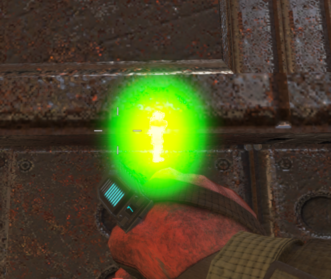

i personally recommend to work only with values between **0 and 15.f** like this:

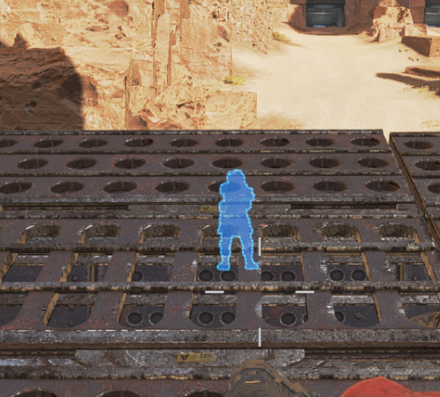


**3.- The Glow Style Offset(0x27C):**

- Main body style:

Now why bloodhunt have some lines in horizontal in the color and some strange effects?

easy the offset 0x27C controls how the glow is showed and you really can do a lot of shit they are basically 4 bytes or maybe in general a bit mask(didn't check) the first one controls the main glow style (not the borders)

Styles that i see in this byte(you will need to found it by yourself):


No color:

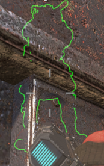

Bloodhunt mode:

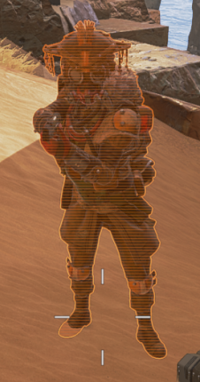

Scanner mode:

https://gyazo.com/e754173b30aa0b82fcc0bd934931e1b3

Something near of wireframed:


- Border style:

The second byte is exactly the same but only for the border for example you can put a border like bloodhunt with the little scanning style

https://gyazo.com/0c98360dd650c7bb15eeaca5a5efd111

- Border Size

the 3th byte is the border size

- Unknown

and the 4th i don't know exactly but some of them makes the character transparent and other visible, i set it as 75(decimal) because is see the game setting it somewhere  


**4.- The render importance/order offset(0x320)**

Now your enemy is visible until he go behind a wall and he disappear

yeah because the game have something like the **"object importance"/"drawing order"** or idk what it's but that value hides the character

the offset is 0x320 and the game normally put it as 5 and we want it as 1(or 0, no difference i think) to show **through walls and smoke**

通过墙和烟雾


**5.-The glow duration:**

I didn't found anything exactly that looks line a duration but a lot of people put the duration in `FLT_MAX` and by some reason it don't work as spected why???

I have check what the game does in some address and don't looks like a duration address there, looks more like the game removes the glow by himself

but in any case use `FLT_MAX` isn't the correct method, after some reversing i see the game sets the global game time to `0x2EC` and for at least 4 values more in the user object this time less `1f`

something like:

```c++
0x2EC = global_time
0x2D8 = global_time - 1.f
0x2DC = global_time - 1.f
0x2E0 = global_time - 1.f
0x2E4 = global_time - 1.f
```

why the game do this? i don't know but with this data at least for me the glow don't disapear

i found the global time in `0xEE4` maybe there are another method to get it.

Some people sets `0x2d0` and `0x2d4` with `FLT_MAX` too but this offsets are like a byte mask to some styles/some shit that makes the glow visible/enable and use the duration, and other values, if this mask is wrong the game will remove the glow **immediately**

im setting both offsets as `0x34000000(872415232)` because the game set it somewhere and works perfectly


> glow magic number is not in 0x27C but in [0x278 + context * 4]
> if your context is 1, then it is indeed in 0x27C
>
> ``` c++
> // About highlight magic:
> // highlight magic = [31 ... 0] bits
> // [07-00] = Inside function
> // [15-08] = Outline function
> // [23-16] = outline radius on the given context
> // [29-24] = Get custom state on the given context
> // [   30] = Tells if this entity will be drawn
> // [   31] = Tells if this highlight will be drawn after all post-processes
> ```
>


---

## TheCruz - direct efi aimbot glow hack[TODO] 

https://www.unknowncheats.me/forum/apex-legends/405983-direct-efi-aimbot-glow-hack.html


---

## Script Highlight

https://casualhacks.net/apexstuff/highlight-functions.html


https://www.unknowncheats.me/forum/apex-legends/446349-script-highlight.html

```c++
enum class HIGHLIGHT_VIS : uint32_t
{
    HIGHLIGHT_VIS_NONE = 0,
    HIGHLIGHT_VIS_FORCE_ON = 1,
    HIGHLIGHT_VIS_ALWAYS = 2,
    HIGHLIGHT_VIS_OCCLUDED = 3,
    HIGHLIGHT_VIS_FULL_VIEW = 4,
    HIGHLIGHT_VIS_LOS = 5,
    HIGHLIGHT_VIS_LOS_ENTSONLYCONTENTSBLOCK = 6
};
 
enum class HIGHLIGHT_FLAG : uint32_t
{
    HIGHLIGHT_FLAG_NONE = 0,
    HIGHLIGHT_FLAG_ADS_FADE = 1,
    HIGHLIGHT_FLAG_REQUIRE_NOT_FULL_HEALTH = 2,
    HIGHLIGHT_FLAG_REQUIRE_CAN_PICK_UP_CLIP = 4,
    HIGHLIGHT_FLAG_REQUIRE_CAN_PICK_UP_OFFHAND = 8,
    HIGHLIGHT_FLAG_REQUIRE_WEAKPOINT_VISIBLE = 16,
    HIGHLIGHT_FLAG_REQUIRE_PILOT = 32,
    HIGHLIGHT_FLAG_REQUIRE_TITAN = 64,
    HIGHLIGHT_FLAG_REQUIRE_SAME_TEAM = 128,
    HIGHLIGHT_FLAG_REQUIRE_DIFFERENT_TEAM = 256,
    HIGHLIGHT_FLAG_REQUIRE_FRIENDLY_TEAM = 512,
    HIGHLIGHT_FLAG_REQUIRE_ENEMY_TEAM = 1024,
    HIGHLIGHT_FLAG_REQUIRE_LOCAL_PLAYER_IS_OWNER = 2048,
    HIGHLIGHT_FLAG_REQUIRE_LOW_MOVEMENT = 4096,
    HIGHLIGHT_FLAG_REQUIRE_HIGH_MOVEMENT = 8192,
    HIGHLIGHT_FLAG_CHECK_OFTEN = 16384,
    // HIGHLIGHT_FLAG_DISABLE_DEATH_FADE = _ImageBase, 32768
    // HIGHLIGHT_FLAG_TEAM_AGNOSTIC = &loc_20000       65536
};
 
struct Vector3 {
    float x, y, z;
}; // sizeof 12
 
struct Color {
    float r, g, b;
}; // sizeof 12
 
struct HighlightParams {
    Color Color;
 
    // Seems to record the m_vecAbsVelocity of the illuminated entity
    Vector3 AbsVelocity;
}; // sizeof 24
 
struct HighlightBits {
    uint8_t InsideFunction;  // 0 - 255
    uint8_t OutlineFunction; // 0 - 255
    uint8_t OutlineRadius;   // 1.f - 8.f
    uint8_t InsideOpacity;
}; // sizeof 4
 
struct HighlightFadeSlot
{
    float Inside;
    float Outline;
}; // sizeof 8
 
class Highlight
{
public:
    HighlightParams m_highlightParams[11];              // 440
    HighlightBits m_highlightFunctionBits[2 * 11];      // 704
    HighlightBits m_highlightTeamBits[2 * 11];          // 792
 
    HighlightFadeSlot m_highlightServerFadeBases;       // 880 - 884
    HighlightFadeSlot m_highlightServerFadeStartTimes;  // 888 - 892
    HighlightFadeSlot m_highlightServerFadeEndTimes;    // 896 - 900
 
    HighlightFadeSlot FadeBases;                        // 904 - 908
    HighlightFadeSlot FadeStartTimes;                   // 912 - 916
    HighlightFadeSlot FadeEndTimes;                     // 920 - 924
 
    // The Lifetime I'm not sure about its index, the second does display an hour
    float LifeTime1;                                    // 928
    float LifeTime2;                                    // 932
 
    float FadeInTime;                                   // 936
    float FadeOutTime;                                  // 940
 
    float NearFadeDist;                                 // 944
    float FarFadeDist;                                  // 948
 
    // Seems to save the values of m_highlightServerFadeEndTimes
    float pad_0001[2];                                  // 952 - 956
 
    uint32_t m_highlightServerContextID;                // 960 // default -1
    uint32_t m_ContextID;                               // 964 // default -1
    uint32_t m_CurrentContextID;                        // 968 // default 0
 
    HIGHLIGHT_FLAG m_Flag;                              // 972
 
    HIGHLIGHT_VIS VisibilityType;                       // 976
 
    // Seems to be for the type of visibility too
    int pad_0003;                                       // 980 // default -1
    int pad_0004;                                       // 984
 
    // I couldn't find anything for this one
    byte pad_0005[4];                                   // 988
 
    // Seems to have a value of 1 enabled, 0 disabled
    int Enabled;                                        // 992
 
    int PingedCount;                                    // 996
 
    // Seems to have a value of 1 enabled, 0 disabled
    int pad_0007;                                       // 1000
 
    // Get the current highlight context.
    uint32_t GetCurrentContext()
    {
        return m_CurrentContextID;
    }
 
    // Set the current highlight context. 0 by default. Server has priority over client. Use context -1 to disable highlighting.
    void SetCurrentContext(const uint32_t ContextId)
    {
        if (ContextId > 11)
        {
            // sub_7C2270("Highlight: context ID should be >= -1 and < %d. Actual value is %d.\n", 11, ContextId);
        }
        else if (GetCurrentContext() != ContextId)
        {
            m_CurrentContextID = ContextId;
 
            ResetFlags();
        }
    }
 
    // Get the inside function slot on the given context. 0 for a disabled a function.
    uint8_t GetInsideFunction(const uint32_t ContextId)
    {
        if (ContextId <= 10)
        {
            return m_highlightFunctionBits[ContextId].InsideFunction;
        }
 
        // sub_7C2270("Highlight: context ID should be >= 0 and < %d. Actual value is %d.\n", 11, ContextId);
 
        return 0;
    }
 
    // Get the outline function slot on the given context. 0 for a disabled a function.
    uint8_t GetOutlineFunction(const uint32_t ContextId)
    {
        if (ContextId <= 10)
        {
            return m_highlightFunctionBits[ContextId].OutlineFunction;
        }
 
        // sub_7C2270("Highlight: context ID should be >= 0 and < %d. Actual value is %d.\n", 11, ContextId);
 
        return 0;
    }
 
    // Get the outline radius on the given context.
    float GetOutlineRadius(const uint32_t ContextId)
    {
        if (ContextId <= 10)
        {
            return (m_highlightFunctionBits[ContextId].OutlineRadius * 8.f) / 255.f;
        }
 
        // sub_7C2270("Highlight: context ID should be >= 0 and < %d. Actual value is %d.\n", 11, ContextId);
 
        return 0.f;
    }
 
    // Get custom parameters on the given context. Parameters are shared between inside and outline functions.
    HighlightParams GetParam(const uint32_t ContextId)
    {
        HighlightParams Params;
 
        if (ContextId > 10)
        {
            Params = {
                0.f, 0.f, 0.f,
                0.f, 0.f, 0.f
            };
        }
        else
        {
            Params = m_highlightParams[ContextId];
        }
 
        return Params;
    }
 
    // Set custom parameters on the given context. Parameters are shared between inside and outline functions.
    void SetParam(const uint32_t ContextId, const uint32_t FParamId, const Color Color, const Vector3 AbsVelocity)
    {
        if (ContextId > 10)
        {
            // sub_7C2270("Highlight: context ID should be >= 0 and < %d. Actual value is %d.\n", 11, ContextId);
        }
        else if (FParamId > 1)
        {
            // sub_7C2270("Highlight: function parameter id should be >= 0 and < %d. Actual value is %d.\n", 2, FParamId);
        }
        else
        {
            m_highlightParams[ContextId].Color = Color;
            // m_highlightParams[ContextId].AbsVelocity = AbsVelocity;
        }
    }
 
    // Given( contextID, insideSlot, entityVisible, outlineSlot, outlineRadius, state, afterPostProcess )
    // Set function slots on the given context. Use slot 0 to disable a function
    void SetFunctions(
        const uint32_t ContextId,
        const uint8_t InsideSlot,
        const bool EntityVisible,
        const uint8_t OutlineSlot,
        const float OutlineRadius,
        const uint8_t State,
        const bool AfterPostProcess)
    {
        if (ContextId > 10)
        {
            // sub_7C2270("Highlight: context ID should be >= 0 and < %d. Actual value is %d.\n", 11, ContextId);
        }
        else if (InsideSlot > 255)
        {
            // sub_7C2270("Highlight: inside function slot should be >= 0 and < 256. Actual value is %d.\n", InsideSlot);
        }
        else if (OutlineSlot > 255)
        {
            // sub_7C2270("Highlight: outline function slot should be >= 0 and < 256. Actual value is %d.\n", OutlineSlot);
        }
        else if (OutlineRadius < 1.f || OutlineRadius > 8.f)
        {
            // sub_7C2270("Highlight: outline radius should be >= 1 and <= %g. Actual value is %g.\n", 0x4020000000000000, OutlineRadius);
        }
        else if (State > 63)
        {
            // sub_7C2270("Highlight: state should be >= 0 and <= %d. Actual value is %d.\n", 63, State);
        }
        else
        {
            m_highlightFunctionBits[ContextId].InsideFunction = InsideSlot;
            m_highlightFunctionBits[ContextId].OutlineFunction = OutlineSlot;
            m_highlightFunctionBits[ContextId].OutlineRadius = (uint8_t)(((OutlineRadius * 255.f) * 0.125f) + 0.5f);
            m_highlightFunctionBits[ContextId].InsideOpacity = (EntityVisible << 6) | State & 0x3F | (AfterPostProcess << 7);
        }
    }
 
    // Tells if this highlight will be drawn after all post-processes.
    bool IsAfterPostProcess(const uint32_t ContextId)
    {
        if (ContextId <= 10)
        {
            HighlightBits Bits = m_highlightFunctionBits[ContextId];
 
            return *(int*)&Bits >> 31;
        }
 
        // sub_7C2270("Highlight: context ID should be >= 0 and < %d. Actual value is %d.\n", 11, ContextId);
 
        return false;
    }
 
    // Tells if this entity will be drawn.
    bool IsEntityVisible(const uint32_t ContextId)
    {
        if (ContextId <= 10)
        {
            HighlightBits Bits = m_highlightFunctionBits[ContextId];
 
            return (*(int*)&Bits & 0x40000000) != 0;
        }
 
        // sub_7C2270("Highlight: context ID should be >= 0 and < %d. Actual value is %d.\n", 11, ContextId);
 
        return false;
    }
 
    // Get custom state on the given context. Parameters are shared between inside and outline functions.
    uint8_t GetState(const uint32_t ContextId)
    {
        if (ContextId <= 10)
        {
            return m_highlightFunctionBits[ContextId].InsideOpacity & 0x3F;
        }
 
        // sub_7C2270("Highlight: context ID should be >= 0 and < %d. Actual value is %d.\n", 11, ContextId);
 
        return 0;
    }
 
    // Sets a flag to active or not on a highlight
    void SetFlag(const uint32_t Flag, bool Active)
    {
        if (Flag > 0x40000)
        {
            // sub_7C2270("Invalid flag with value %i passed in", Flag);
            return;
        }
 
        const uint32_t CurrentFlag = (uint32_t)m_Flag;
 
        if (Active)
        {
            m_Flag = (HIGHLIGHT_FLAG)(Flag | CurrentFlag);
        }
        else
        {
            m_Flag = (HIGHLIGHT_FLAG)(CurrentFlag & ~Flag);
        }
    }
 
    // Sets the highlight flags back to 0
    void ResetFlags()
    {
        m_Flag = HIGHLIGHT_FLAG::HIGHLIGHT_FLAG_NONE;
    }
 
    // Gets whether or not a flag is active on a highlight
    bool GetFlag(const uint32_t Flag)
    {
        if (Flag > 0x40000)
        {
            // sub_7C2270("Invalid flag with value %i passed in", a2);
            return false;
        }
 
        return (Flag & (uint32_t)m_Flag) != 0;
    }
};
```


```c++
Highlight highlight = gDriver.Read<Highlight>(GameProcessId, Pointer + OFFSET_HIGHLIGHT_PARAMS);
 
const uint32_t CurrentContextID = highlight.GetCurrentContext();
 
const HighlightParams Params = highlight.GetParam(CurrentContextID, 0);
 
printf("GetCurrentContext       : %d             \n", CurrentContextID);
printf("GetState                : %d             \n", highlight.GetState(CurrentContextID));
 
printf("IsEntityVisible         : %d             \n", highlight.IsEntityVisible(CurrentContextID));
printf("IsAfterPostProcess      : %d             \n", highlight.IsAfterPostProcess(CurrentContextID));
 
printf("GetInsideFunction       : %d             \n", highlight.GetInsideFunction(CurrentContextID));
printf("GetOutlineFunction      : %d             \n", highlight.GetOutlineFunction(CurrentContextID));
printf("GetOutlineRadius        : %f             \n", highlight.GetOutlineRadius(CurrentContextID));
 
printf("Params.Color.r          : %f             \n", Params.Color.r);
printf("Params.Color.g          : %f             \n", Params.Color.g);
printf("Params.Color.b          : %f             \n", Params.Color.b);
 
printf("GetParam.AbsVelocity.x  : %f             \n", Params.AbsVelocity.x);
printf("GetParam.AbsVelocity.y  : %f             \n", Params.AbsVelocity.y);
printf("GetParam.AbsVelocity.z  : %f             \n", Params.AbsVelocity.z);
 
printf("\n");
```


once you have the default settings for a given context you can do like this
Example with the Bloodhound scan

```c++
Highlight Bloodhound(const HANDLE GameProcessId, const DWORD64 Pointer)
{
    Highlight highlight = gDriver.Read<Highlight>(GameProcessId, Pointer + OFFSET_HIGHLIGHT_PARAMS);
 
    highlight.SetCurrentContext(7); // 0 = before scan, 7 = scan active, 2 = after scan
 
    highlight.SetParam(highlight.m_CurrentContextID, 0, { 1.f, 0.25f, 0.f }, { 0.f, 0.f, 0.f });
 
    highlight.SetFunctions(
        highlight.m_CurrentContextID,
        12,     // Inside Slot
        true,   // EntityVisible
        169,    // Outline Slot
        1.f,    // Outline Radius
        0,      // State = ??
        false); // AfterPostProcess
 
    highlight.VisibilityType = HIGHLIGHT_VIS::HIGHLIGHT_VIS_ALWAYS; // default 0, scan active = 2
 
    float LifeTime = highlight.LifeTime2;
    highlight.FadeStartTimes = { LifeTime , LifeTime };
    highlight.FadeEndTimes = { LifeTime , LifeTime };
 
    highlight.Enabled = true;
 
    gDriver.Write<Highlight>(GameProcessId, Pointer + OFFSET_HIGHLIGHT_PARAMS, highlight);
 
    return highlight;
}
```

其中，`inside functions` 在这里有延时 https://casualhacks.net/apexstuff/highlight-functions.html

by writing the whole highlight struct, there is a chance you get a nasty freeze while being in-game due to overwriting some updated pointer when you're not fast enough.

preferably just write the data you've changed just to be sure.

also here are the context id's as a enum since i've had my highlight esp like that since a few months:

通过编写整个 highlight struct ，当您速度不够快时，由于覆盖了一些更新的指针，您可能会在游戏中遇到令人讨厌的冻结。

最好只写你已经改变的数据，以确保。

这里还有上下文 id 作为枚举，因为我几个月来就有这样的 **highlight esp**：

```c++
enum HighlightContextId
{
	HIGHLIGHT_CONTEXT_NONE = -1,
	HIGHLIGHT_CONTEXT_NEUTRAL = 0,
	HIGHLIGHT_CONTEXT_FRIENDLY = 1,
	HIGHLIGHT_CONTEXT_ENEMY = 2,
	HIGHLIGHT_CONTEXT_OWNED = 3,
	HIGHLIGHT_CONTEXT_PRIVATE_MATCH_OBSERVER = 4,
	HIGHLIGHT_CHARACTER_SPECIAL_HIGHLIGHT = 5,
	HIGHLIGHT_CONTEXT_DEATH_RECAP = 6,
	HIGHLIGHT_CONTEXT_SONAR = 7,//bloodhunt
	HIGHLIGHT_CHARACTER_SPECIAL_HIGHLIGHT_2 = 8,
	HIGHLIGHT_CONTEXT_FRIENDLY_REVEALED = 9,
	HIGHLIGHT_CONTEXT_MOVEMENT_REVEALED = 10,
	HIGHLIGHT_MAX_CONTEXTS = 11
};
```


```c++
struct Highlight_s
{
	// base offset = entity + m_highlightParams
	float m_Params[22][3];
	int m_ServerFunctions[11];
	int m_ClientFunctions[11];
	int m_nServerTeamBits[11];
	int m_nClientTeamBits[11];
	float m_flServerFadeBases[2];
	float m_flServerFadeStartTimes[2];
	float m_flServerFadeEndTimes[2];
	float m_flClientFadeBases[2];
	float m_flClientFadeStartTimes[2];
	float m_flClientFadeEndTimes[2];
	float m_flLifetime;
	float m_flLastUpdateTime;
	float m_flFadeInTime;
	float m_flFadeOutTime;
	float m_flNearFadeDist;
	float m_flFarFadeDist;
	float m_flOldFadeEnd[2];
	int m_iServerContextId;
	int m_iClientContextId;
	int m_iCurrentContextId;
	...
}
 
...
const auto functionParameterId = 0;
const auto contextId = HIGHLIGHT_CONTEXT_FRIENDLY;
 
highlight.m_Params[contextId * 2 + functionParameterId][0] = (_Red / 100.f) * (_Alpha / 255.f * 100.f);
highlight.m_Params[contextId * 2 + functionParameterId][1] = (_Green / 100.f) * (_Alpha / 255.f * 100.f);
highlight.m_Params[contextId * 2 + functionParameterId][2] = (_Blue / 100.f) * (_Alpha / 255.f * 100.f);
```


## Usefull Functions

### GlowMode

```c++
struct GlowMode
{
int8_t GeneralGlowMode, BorderGlowMode, BorderSize, TransparentLevel;
};
writeval<GlowMode>(ent + GLOW_TYPE, { 101,101,46,90 });
```


```c++
float currentEntityTime = 5000.f; //ADDED currentEntityTime
static float r = 0, g = 0, b = 0;
if (!isnan(currentEntityTime) && currentEntityTime > 0.f) {

    int playerTeamID = driver::read<int>(process_id, locPlayer + OFFSET_TEAM);					// player team id
    int entityTeamID = driver::read<int>(process_id, Entity + OFFSET_TEAM);					// entity team id

    entityNewVisTime = driver::read<float>(process_id, Entity + OFFSET_VISIBLE_TIME);

    driver::write<GlowMode>(process_id, Entity + GLOW_TYPE, { 101, 102, 50, 75 }); // GeneralGlowMode, BorderGlowMode, BorderSize, TransparentLevel;


    if (playerTeamID != entityTeamID ) // enemies
    {
        if (entityNewVisTime != entityOldVisTime[i]) //visible enemies
        {
            visCooldownTime[i] = 32; // low values = less latency
            r = 62.f;
            g = 2.f;
            b = 2.f;

            entityOldVisTime[i] = entityNewVisTime;

        }
        else 
        {
            if (visCooldownTime[i] <= 0) // NON-VISIBLE enemies
            {
                r = 2.f;
                g = 62.f;
                b = 2.f;
            }
        }
    }
    else // allies
    {
        r = 2.f;
        g = 2.f;
        b = 62.f;
    }
}

driver::write<float>(process_id, Entity + 0x1D0, r);
driver::write<float>(process_id, Entity + 0x1D4, g);
driver::write<float>(process_id, Entity + 0x1D8, b);
driver::write<float>(process_id, Entity + GLOW_DISTANCE, 40000.f);
driver::write<float>(process_id, Entity + GLOW_LIFE_TIME, currentEntityTime);
currentEntityTime -= 1.f;
driver::write<int>(process_id, Entity + GLOW_CONTEXT, 1);
driver::write<int>(process_id, Entity + GLOW_VISIBLE_TYPE, 1);

if (visCooldownTime[i] >= 0) visCooldownTime[i] -= 1;
```


由于 Apex Legends 更新 1.69，可见性检查不再起作用。

### Glows in diff colors

```c++
// glows in diff colors
int main()
{
    if (hWnd == 0)
    {
        hWnd = FindWindow(NULL, "Apex Legends");
        cout << "[+] Found Apex!!" << endl;
    }
    else
    {
    	cout << "[+] WTFFF MEN!!" << endl;
	}

    process_id = get_process_id("r5apex.exe");
    base_address = get_module_base_address("r5apex.exe");
    cout << process_id << endl;
    cout << base_address << endl;

    while (true) // loop function
    {
        for (int i = 0; i < 100; i++)
        {
            DWORD64 Entity = GetEntityById(i, base_address);
            if (Entity == 0)
            	continue;
            DWORD64 EntityHandle = Read<DWORD64>(Entity + 0x589);
            std::string Identifier = Read<std::string>(EntityHandle);
            LPCSTR IdentifierC = Identifier.c_str();
            if (strcmp(IdentifierC, "player"))
            {
                static float x = 0, y = 0;
                static float r = 0, g = 0, b = 0;

                if (y >= 0.0f && y < 255.0f) {
                    r = 255.0f;
                    g = 0.0f;
                    b = x;
                }
                else if (y >= 255.0f && y < 510.0f) {
                    r = 255.0f - x;
                    g = 0.0f;
                    b = 255.0f;
                }
                else if (y >= 510.0f && y < 765.0f) {
                    r = 0.0f;
                    g = x;
                    b = 255.0f;
                }
                else if (y >= 765.0f && y < 1020.0f) {
                    r = 0.0f;
                    g = 255.0f;
                    b = 255.0f - x;
                }
                else if (y >= 1020.0f && y < 1275.0f) {
                    r = x;
                    g = 255.0f;
                    b = 0.0f;
                }
                else if (y >= 1275.0f && y < 1530.0f) {
                    r = 255.0f;
                    g = 255.0f - x;
                    b = 0.0f;
                }

                x += 0.25f; //increase this value to switch colors faster
                if (x >= 255.0f)
                	x = 0.0f;

                y += 0.25f; //increase this value to switch colors faster
                if (y > 1530.0f)
                	y = 0.0f;
                
                write<int>(Entity + 0x3C8, 1);
                write<int>(Entity + 0x3D0, 2);
                write<GlowMode>(Entity + 0x2C4, { 101,101,46,90 });
                write<float>(Entity + 0x1D0, r); // r
                write<float>(Entity + 0x1D4, g); // g
                write<float>(Entity + 0x1D8, b); // b
            }
        }
    }
}
```


---

## Apex External Glow/ItemGlow/Basic Aimbot

https://www.unknowncheats.me/forum/apex-legends/452939-apex-external-glow-itemglow-basic-aimbot.html

No source


----

# Apex novak80

https://key08.com/index.php/game_anticheat.html

https://bbs.pediy.com/thread-126933.htm


a private um cheat

kernel driver with undetectable communication

Will pretty much do the job. If you can read and write physical memory too even better


spoofing my hwid


`mmCopyVirtualMemory`

I hide vuln driver (clear `MmUnloadedDrivers`, `PiDDBCache`, `ci.dll caches`) and use `UD kernel hook` for communication.


`mmcopyvirtualmemory` is not detected, i have been using it since apex release in my driver and ive never been banned. they cant outright ban you for this, but they will probably flag you/use it in some kind of points system to ban for (ie using an overlay as well, etc)


## novak80

```c++
// glow 只需要这两个基址
uint64_t EntityList = 0x18DA2A8;
uint64_t LocalPlayer = 0x1C89868;
// 最多再添下边一个
uint64_t LocalEntityHandle = 0x1057a84;
```


### Glow crashing apex

been cheating since like 3 days after apex released. been lvl 500 for a long time. I **only use glow** as I have very good natural aim. Have been predator every season. I am in the same boat as casual though, I am still using **`mmcopyvirtualmemory`** but still am not banned. I do not believe they will ban you for using this alone, but that it could be a contributing factor in some kind of points system they use for bans. using a personal **driver** created **from scratch** with a **non public communication** method. i dont even bother to xor strings or anything either lol


so for some reason my **external** glow is causing apex to crash at random times. sometimes i can play 3 games with no issues and other times it crashes on the first game in 20 seconds. anyone have any experience with this? I am not quite sure what is causing it to crash, there is no error the game just closes. I do not get the issue when playing without the cheat

```c++
write<bool>(Entity + GLOW_ENABLE, true);
write<int>(Entity + GLOW_CONTEXT, 1);
write<float>(Entity + 0x1D0, r);
write<float>(Entity + 0x1D4, g);
write<float>(Entity + 0x1D8, b);
for (int offset = 0x2F8; offset <= 0x328; offset += 0x4)
    write<float>(Entity + offset, FLT_MAX);
write<float>(Entity + 0x33C, FLT_MAX);

impl::memory->write<bool>(Entity + 0x3E0, true);
impl::memory->write<int>(Entity + 0x350, 1);
impl::memory->write<float>(Entity + 0x1B0, r);
impl::memory->write<float>(Entity + 0x1B4, g);
impl::memory->write<float>(Entity + 0x1B8, b);
for (int offset = 0x2F8; offset <= 0x328; offset += 0x4)
    impl::memory->write<float>(Entity + offset, FLT_MAX);
impl::memory->write<float>(Entity + 0x33C, FLT_MAX);
```


O - Others \ A - Author

O： **Don't glow people when you're in the airship**. Ghetto fix is **don't glow anyone when your Z > 11000.0**.

A：tried this and I am still crashing :/


O： how many entities should i be looping through in the list if I am only highlighting players? I had it set to 10000 but I think the first 100 contain all the players?

D： set to 150


O：Are you checking if the entity is valid?

A：how do you mean valid? I am checking the identifiers of the entity are p and 1 right before writing, and making sure the entity is not = 0

O：Yeah that's what i mean. Are you playing apex on origin or steam?

A：steam


A： i think i fixed it - have played about 7 games with no crash. I added a check to not glow teammates and it seems to have solved it. going to play some more to make sure. just crashed on game 8 and then again on the first game. i have no idea what is causing this

A： i believe the glow fade offset starts at `0x2F0` not `0x2F8` and ends at `0x320`. **Since updating this i havent had a crash yet**

O：same exact issue however starting from `0x2f0` will **makes my glow flicker**

A：are you on steam or origin? I get **no flicker and am on steam**

O：originn.. what is the difference?

A：offsets are slightly different. the ones I posted above won't work for you since I am on the steam version

O：well first of all, origin and steam are same.. i tested both, probably the issue is with the `FLT_MAX` value ..im running now another range and seems to be working


O：This is the glow I have, it doesn't crash for me

```C++
		GLOW_DURATION = 0x310,				// Offsets in: Highlight_StartOn, Highlight_SetLifeTime
			for (int l_I = 0; l_I < 60; l_I++)
			{
				DWORD64 l_BaseAddress = Driver::Read<DWORD64>(Globals->processID, Globals->moduleBase + Offsets::ENTITY_LIST + (l_I * 32));
				C_BaseEntity l_Entity = C_BaseEntity(l_BaseAddress);
 
				if (l_BaseAddress)
				{
					if ((l_Entity.GetHealth() > 0) && (l_Entity.GetHealth() < 120))
					{
						l_Entity.SetGlow(true);
						l_Entity.SetHighlightContext(1);
						l_Entity.SetColours(menuControl->glowColors[0] * 150, menuControl->glowColors[1] * 150, menuControl->glowColors[2] * 150);
						l_Entity.SetGlowDuration(FLT_MAX);
						l_Entity.SetGlowRange(FLT_MAX);
					}
				}
			}
 
void C_BaseEntity::SetGlowDuration(float p_Duration)
{
	for (int l_Offset = Offsets::GLOW_DURATION; l_Offset <= Offsets::GLOW_DURATION + 44; l_Offset += 0x4)
	{
		Driver::Write<float>(Globals->processID, m_Base + l_Offset, &p_Duration);
	}
}
```


### **BE IOCTL?**

A：I have successfully made a driver and bypassed EAC(Apex) using `IOCTL` for an **external cheat**. It seems BE is a bit more beefy these days (especially on EFT). Does anyone know if IOCTL is inherently detected by BE or if using it as long as I clear **mmunloadeddrivers** and **pidbcachetable** and dont share it should be fine? really dont wanna get HWID banned on BE lol

O1：That's all depends on how you're using IOCTL. Using IOCTL itself won't get you banned. There is basically 2 ways of using IOCTL. 这完全取决于你如何使用IOCTL。使用IOCTL本身不会让你被禁止。IOCTL基本上有2种使用方式。

\1. Most popular and most obvious - **creating device object**. This one will get you banned if your driver is **manually mapped** (which I suppose is your case), but if it's **signed** - it's ok.
\2. **Hijacking device of another legit driver**. That's depends on how you're hijacking it (there are many examples on UC and some of them are still undetected). That's what I'm using and I'm fine on both EAC & BE for more than half a year now.

A：Why would it make a difference if it is manually mapped or signed? I'm assuming they would still have some detection vector on signed drivers as well since its the same exact object为什么手动映射或签名会有所不同？我假设他们在有签名的驱动上仍然有一些检测向量，因为它是同一个对象

O1：It makes difference cause mapped drivers have no valid backed image.They will just look what's the driver is owner of this device. If it's valid and digitally signed it's ok, and if there is no image behind this, it's clearly a trace of a device from mapped driver. 这很重要，因为映射的驱动程序没有有效的备份映像。他们只会看这个设备的驱动程序是什么。如果它是有效的和数字签名的，它是没问题的，如果这后面没有图像，它显然是来自映射驱动程序的设备的痕迹。

A：hmm ok, is there a reason EAC isnt detecting this? been using this for over 6 months now on Apex without a ban (manual mapped with device) EAC没有检测到这一点是有原因的吗？已经在Apex上使用了6个多月了，没有被禁止(用设备手动映射)

O1：Cause Apex got a shitty version of EAC. If you try this, for example, on Rust or Fortnite, you'll get banned in the same day. EAC power is very dependable on money that game developers pay them. 因为Apex的EAC版本很烂。如果你尝试在Rust或《堡垒之夜》这样做，你将在当天被禁止。EAC 的权力非常依赖于游戏开发者付给他们的钱。

O2：I've been using a signed driver with IOCTL to read/write memory for about 4 or 5 years now - when ever BE went with their own kernel mode driver c2015. 我已经使用一个带有IOCTL的签名驱动程序来读/写内存大约4到5年了——当BE使用他们自己的内核模式驱动程序c2015时

O3：Just use a driver with MmCopyVirtualMemory in that case, simple enough. 在这种情况下，只需使用带有MmCopyVirtualMemory的驱动程序，就足够简单了。


>I know that EAC/BE use `MmUnloadedDrivers` to find `kdmapper`, etc. to detect but why they even do that when it's so simple to change the name of the driver? It's one line change in kdmapper. Just change the name when loading.
>
>
>
>mapped driver and IOCTL would be detected on EAC **for sure**.


O4：Is OV signing enough? Or is EV needed for keeping a private driver under the EAC and BE radar. And as long as it's signed, it's no problem using its handle for ioctl messaging? Since so many other drivers do it as well, they have to allow that? OV 证书足够么？或者 EV 是保持私人驱动下 EAC 和 BE 雷达需要。只要它被签名了，使用它的句柄来发送 `ioctl` 消息就没问题了？既然这么多其他驱动也这样做，他们必须允许吗？

O1：OV is enough, you just have to disable Secure Boot. You can create device and use IOCTL just fine if your driver is signed. OV就够了，你只需要禁用安全启动。如果您的驱动程序已签名，您可以创建设备并使用IOCTL。


> SSL证书分为DV、OV、EV三种级别证书，OV是企业型证书，需要验证企业营业执照等身份，一般只要是企业大部分申请的都是OV证书。
>
> 而EV证书是目前最高信任级别的 SSL证书。按照国际规范审查网站企业身份和域名所有权，确保网站身份的真实可靠，是最值得信赖的SSL证书。


### cheat to work in VM

I ve been trying to get the cheat to work in VM but I'm not able to access the usb from the boot menu. Can you help me ?

\1. you would need to have a solution to bypass the EAC VM checks which does not come with this
\2. the driver is detected


looks like this anticheat has `kernel level access` and probably using `obregistercallbacks`. you will need to use something with kernel access to read/write memory


---

## Noob Friendly Guide For Getting Offsets with CasualX Apexbot Dumper

https://www.unknowncheats.me/forum/apex-legends/452956-noob-friendly-guide-getting-offsets-casualx-apexbot-dumper.html

Tools Used:
As linking external websites is not allowed on Unknowncheats, you will have to google the tools yourself.

- Scylla Dumper
- Apexbot Offset Dumper by CasualX (https://github.com/CasualX/apexbot)
- Rust Programming Language

### Step 1: Dissabling EAC

Navigate to your installation folder for Apex Legends.
We need to change 2 things here:

- Rename EasyAntiCheat_launcher.exe to EasyAntiCheat_launcher2.exe
- Rename r5apex.exe to EasyAntiCheat_launcher.exe


### Step 2: Dumping the game with Scylla

- Launch `EasyAntiCheat_launcher.exe` (r5apex.exe renamed).
- Launch `Scylla_x64.exe` as administrator.
- Select `EasyAntiCheat_launcher.exe` in the active process list.
- Click `IAT Autosearch` and select `Yes`.
- Click `Get Imports`


Scylla should now look like this:

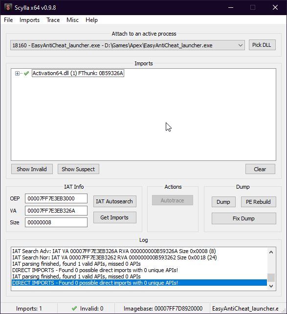


Select `Dump` and save it somewhere you can easily acces it.


### Step3: Using Apexbot Offset Dumper

- Download Apexbot by CasualX from github.
- Extract it and navigate to apexbot-master -> offsets
- Hold Shift and left click in the folder and select open powershell window.


In the powershell window you will now enter the following command:

**Change "C:\Users\Louis\Desktop\tutorial\EasyAntiCheat_launcher_dump.exe" to the location u saved your Scylla dump.**

```powershell
cargo run --release --  "C:\Users\Louis\Desktop\tutorial\EasyAntiCheat_launcher_dump.exe"  > stdout.md
```


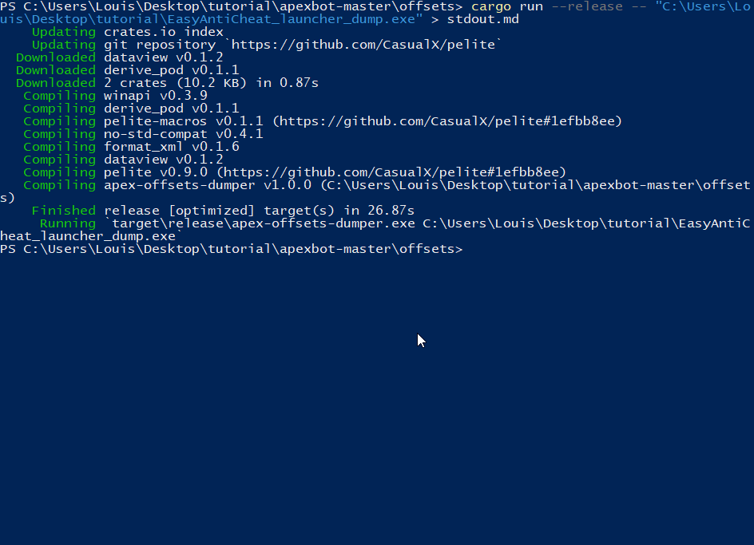


Congratulations you now have successfully dumped offsets from the game. The file with the offsets will be in `apexbot-master -> offsets -> stdout.md`

**Now just change the names back in Apex Legends folder (Step 1) to the old names and you can play the game again.**


---

# Anti-Cheat Bypass


`ObRegisterCallbacks` is a function which allows you to set 2 callbacks, `PreCallback` and `PostCallback`. These 2 functions are called when you are creating or duplicating a handle, what most anti cheats do is they ignore `PostCallback` and do their shit in `PreCallback`. In that function they strip the handle's access mask so if you call `NtReadVirtualMemory` for example, it will return access denied as the handle does not have the specific access mask as it was stripped in the callback. There are multiple options for you to do to bypass this:

A) The obvious, going kernel and using functions which require no handles for example `MmCopyVirtualMemory`.
B) Removing the callbacks temporarily and injecting then adding them back so nor the anti cheat will be suspicious (if you are faster than their checks) or patchguard will be mad.
C) Byte patching `ObpReferenceObjectByHandleWithTag`'s handle mask check, this will also trigger patchguard if you do not succeed the integrity checks, secondly anti cheats will be able to enumerate handles to the protected game and then flag you depending on the circumstances, however you can completely flaw their handle enumeration checks with some thinking.
D) Think of more ideas to somehow flaw this.


---

## prevent patchguard hooking protected functions

https://www.unknowncheats.me/forum/anti-cheat-bypass/455919-prevent-patchguard-hooking-protected-functions.html


For the sake of interest, a check was made with disabling PG via Shark, and I can say for sure that in Apex Legends this is undetected.


Signed the merged certificate on this forum, then cleared the traces of the driver (Shark.sys). I wrote a test cheat on apex, tested for about a month and a half, there was no ban, the main driver was hidden through `MiProcessLoaderEntry`.


---

## Using mhyprot driver to read/write[TODO] 

https://www.unknowncheats.me/forum/anti-cheat-bypass/452945-using-mhyprot-driver-read-write.html


https://github.com/PoopProgrammer/MhyprotDriver-1

https://github.com/kkent030315/libmhyprot


---

## **IOCTL communication in Manually Mapped driver**

This driver works fine when loaded normally (through sc), but when manually mapped it loads, but the usermode client cant find the IOCTL file.

After some debugging, I found that the problem is that when the driver is manually mapped, **it doesn't create the symbolic link to the device that I create**.

Here's the code in DriverInitialize (called by creating a driver in `DriverEntry` (`IoCreateDriver`):

```C++
    UNICODE_STRING DeviceName = {};
    UNICODE_STRING SymbolicLinkName = {};
 
    RtlInitUnicodeString(&DeviceName, L"\\Device\\TestDriver");
 
    if (!pDriverObject)
    {
        ERR_PRINT("IS NULL\n");
        ntstatus = STATUS_FAILED_DRIVER_ENTRY;
        goto exit;
    }
 
    ntstatus = IoCreateDevice(
            pDriverObject,
            0,
            &DeviceName,
            FILE_DEVICE_UNKNOWN,
            FILE_DEVICE_SECURE_OPEN,
            TRUE,
            &pDeviceObject);

     if (!NT_SUCCESS(ntstatus))
      {
            ERR_PRINT("IoCreateDevice failed: 0x%X", ntstatus);
            goto exit;
      }
 
      RtlInitUnicodeString(&SymbolicLinkName, L"\\DosDevices\\TestDriver"); 
 
      ntstatus = IoCreateSymbolicLink(&SymbolicLinkName, &DeviceName); //this doesnt failed, but symbolic link not created (in \DosDevices\ folder)
      ERR_PRINT("CREATED SYM LINK: %wZ", usSymbolicLinkName);
      if (!NT_SUCCESS(ntstatus))
      {
            ERR_PRINT("IoCreateSymbolicLink failed: 0x%X", ntstatus);
            goto exit;
      }
```


You are gonna get clapped by BE/EAC for using IOCTLs on an manually mapped driver as they can check the device

```C++
RtlInitUnicodeString(&dev, L"\\Device\\PecesStealthDriver");
RtlInitUnicodeString(&dos, L"\\DosDevices\\PecesStealthDriver");
IoCreateDevice(
    pDriverObject, 
    0, 
    &dev, 
    FILE_DEVICE_UNKNOWN, 
    FILE_DEVICE_SECURE_OPEN, 
    FALSE, 
    &pDeviceObject);
IoCreateSymbolicLink(&dos, &dev);
```


---

## read process physical memory, no attach

https://www.unknowncheats.me/forum/anti-cheat-bypass/444289-read-process-physical-memory-attach.html

```c++
NTKERNELAPI
PVOID
PsGetProcessSectionBaseAddress(
	__in PEPROCESS Process
);
 
PVOID GetProcessBaseAddress(int pid) 
{
	PEPROCESS pProcess = NULL;
	if (pid == 0) return STATUS_UNSUCCESSFUL;
 
	NTSTATUS NtRet = PsLookupProcessByProcessId(pid, &pProcess);
	if (NtRet != STATUS_SUCCESS) return NtRet;
 
	PVOID Base = PsGetProcessSectionBaseAddress(pProcess);
	ObDereferenceObject(pProcess);
	return Base;
}
 
//https://ntdiff.github.io/
#define WINDOWS_1803 17134
#define WINDOWS_1809 17763
#define WINDOWS_1903 18362
#define WINDOWS_1909 18363
#define WINDOWS_2004 19041
#define WINDOWS_20H2 19569
#define WINDOWS_21H1 20180
 
DWORD GetUserDirectoryTableBaseOffset()
{
	RTL_OSVERSIONINFOW ver = { 0 };
	RtlGetVersion(&ver);
 
	switch (ver.dwBuildNumber)
	{
	case WINDOWS_1803:
		return 0x0278;
		break;
	case WINDOWS_1809:
		return 0x0278;
		break;
	case WINDOWS_1903:
		return 0x0280;
		break;
	case WINDOWS_1909:
		return 0x0280;
		break;
	case WINDOWS_2004:
		return 0x0388;
		break;
	case WINDOWS_20H2:
		return 0x0388;
		break;
	case WINDOWS_21H1:
		return 0x0388;
		break;
	default:
		return 0x0388;
	}
}
 
//check normal dirbase if 0 then get from UserDirectoryTableBas
ULONG_PTR GetProcessCr3(PEPROCESS pProcess)
{
	PUCHAR process = (PUCHAR)pProcess;
	ULONG_PTR process_dirbase = *(PULONG_PTR)(process + 0x28); //dirbase x64, 32bit is 0x18
	if (process_dirbase==0)
	{
		DWORD UserDirOffset = GetUserDirectoryTableBaseOffset();
		ULONG_PTR process_userdirbase = *(PULONG_PTR)(process + UserDirOffset);
		return process_userdirbase;
	}
	return process_dirbase;
}
ULONG_PTR GetKernelDirBase()
{
	PUCHAR process = (PUCHAR)PsGetCurrentProcess();
	ULONG_PTR cr3 = *(PULONG_PTR)(process + 0x28); //dirbase x64, 32bit is 0x18
	return cr3;
}
 
NTSTATUS ReadVirtual(uint64_t dirbase, uint64_t address, uint8_t* buffer, SIZE_T size, SIZE_T *read)
{
	uint64_t paddress = TranslateLinearAddress(dirbase, address);
	return ReadPhysicalAddress(paddress, buffer, size, read);
}
 
NTSTATUS WriteVirtual(uint64_t dirbase, uint64_t address, uint8_t* buffer, SIZE_T size, SIZE_T *written)
{
	uint64_t paddress = TranslateLinearAddress(dirbase, address);
	return WritePhysicalAddress(paddress, buffer, size, written);
}
 
NTSTATUS ReadPhysicalAddress(PVOID TargetAddress, PVOID lpBuffer, SIZE_T Size, SIZE_T *BytesRead)
{
	MM_COPY_ADDRESS AddrToRead = { 0 };
	AddrToRead.PhysicalAddress.QuadPart = TargetAddress;
	return MmCopyMemory(lpBuffer, AddrToRead, Size, MM_COPY_MEMORY_PHYSICAL, BytesRead);
}
 
//MmMapIoSpaceEx limit is page 4096 byte
NTSTATUS WritePhysicalAddress(PVOID TargetAddress, PVOID lpBuffer, SIZE_T Size, SIZE_T* BytesWritten)
{
	if (!TargetAddress)
		return STATUS_UNSUCCESSFUL;
 
	PHYSICAL_ADDRESS AddrToWrite = { 0 };
	AddrToWrite.QuadPart = TargetAddress;
 
	PVOID pmapped_mem = MmMapIoSpaceEx(AddrToWrite, Size, PAGE_READWRITE);
 
	if (!pmapped_mem)
		return STATUS_UNSUCCESSFUL;
 
	memcpy(pmapped_mem, lpBuffer, Size);
 
        *BytesWritten = Size;
	MmUnmapIoSpace(pmapped_mem, Size);
	return STATUS_SUCCESS;
}
 
#define PAGE_OFFSET_SIZE 12
static const uint64_t PMASK = (~0xfull << 8) & 0xfffffffffull;
 
uint64_t TranslateLinearAddress(uint64_t directoryTableBase, uint64_t virtualAddress) {
	directoryTableBase &= ~0xf;
 
	uint64_t pageOffset = virtualAddress & ~(~0ul << PAGE_OFFSET_SIZE);
	uint64_t pte = ((virtualAddress >> 12) & (0x1ffll));
	uint64_t pt = ((virtualAddress >> 21) & (0x1ffll));
	uint64_t pd = ((virtualAddress >> 30) & (0x1ffll));
	uint64_t pdp = ((virtualAddress >> 39) & (0x1ffll));
 
	SIZE_T readsize = 0;
	uint64_t pdpe = 0;
	ReadPhysicalAddress(directoryTableBase + 8 * pdp, &pdpe, sizeof(pdpe), &readsize);
	if (~pdpe & 1)
		return 0;
 
	uint64_t pde = 0;
	ReadPhysicalAddress((pdpe & PMASK) + 8 * pd, &pde, sizeof(pde), &readsize);
	if (~pde & 1)
		return 0;
 
	/* 1GB large page, use pde's 12-34 bits */
	if (pde & 0x80)
		return (pde & (~0ull << 42 >> 12)) + (virtualAddress & ~(~0ull << 30));
 
	uint64_t pteAddr = 0;
	ReadPhysicalAddress((pde & PMASK) + 8 * pt, &pteAddr, sizeof(pteAddr), &readsize);
	if (~pteAddr & 1)
		return 0;
 
	/* 2MB large page */
	if (pteAddr & 0x80)
		return (pteAddr & PMASK) + (virtualAddress & ~(~0ull << 21));
 
	virtualAddress = 0;
	ReadPhysicalAddress((pteAddr & PMASK) + 8 * pte, &virtualAddress, sizeof(virtualAddress), &readsize);
	virtualAddress &= PMASK;
 
	if (!virtualAddress)
		return 0;
 
	return virtualAddress + pageOffset;
}
 
 
//
NTSTATUS ReadProcessMemory(int pid, PVOID Address, PVOID AllocatedBuffer, SIZE_T size, SIZE_T* read)
{
	PEPROCESS pProcess = NULL;
	if (pid == 0) return STATUS_UNSUCCESSFUL;
 
	NTSTATUS NtRet = PsLookupProcessByProcessId(pid, &pProcess);
	if (NtRet != STATUS_SUCCESS) return NtRet;
 
	ULONG_PTR process_dirbase = GetProcessCr3(pProcess);
	ObDereferenceObject(pProcess);
 
	SIZE_T CurOffset = 0;
	SIZE_T TotalSize = size;
	while (TotalSize)
	{
 
		uint64_t CurPhysAddr = TranslateLinearAddress(process_dirbase, (ULONG64)Address + CurOffset);
		if (!CurPhysAddr) return STATUS_UNSUCCESSFUL;
 
		ULONG64 ReadSize = min(PAGE_SIZE - (CurPhysAddr & 0xFFF), TotalSize);
                SIZE_T BytesRead = 0;
		NtRet = ReadPhysicalAddress(CurPhysAddr, (PVOID)((ULONG64)AllocatedBuffer + CurOffset), ReadSize, &BytesRead);
		TotalSize -= BytesRead;
		CurOffset += BytesRead;
		if (NtRet != STATUS_SUCCESS) break;
                if(BytesRead==0) break;
	}
 
	*read = CurOffset;
	return NtRet;
}
 
NTSTATUS WriteProcessMemory(int pid, PVOID Address, PVOID AllocatedBuffer, SIZE_T size, SIZE_T* written)
{
	PEPROCESS pProcess = NULL;
	if (pid == 0) return STATUS_UNSUCCESSFUL;
 
	NTSTATUS NtRet = PsLookupProcessByProcessId(pid, &pProcess);
	if (NtRet != STATUS_SUCCESS) return NtRet;
 
	ULONG_PTR process_dirbase = GetProcessCr3(pProcess);
	ObDereferenceObject(pProcess);
 
	SIZE_T CurOffset = 0;
	SIZE_T TotalSize = size;
	while (TotalSize)
	{
		uint64_t CurPhysAddr = TranslateLinearAddress(process_dirbase, (ULONG64)Address + CurOffset);
		if (!CurPhysAddr) return STATUS_UNSUCCESSFUL;
 
		ULONG64 WriteSize = min(PAGE_SIZE - (CurPhysAddr & 0xFFF), TotalSize);
                SIZE_T BytesWritten = 0;
		NtRet = WritePhysicalAddress(CurPhysAddr, (PVOID)((ULONG64)AllocatedBuffer + CurOffset), WriteSize, &BytesWritten);
		TotalSize -= BytesWritten;
		CurOffset += BytesWritten;
		if (NtRet != STATUS_SUCCESS) break;
                if(BytesWritten==0) break;
	}
 
	*written = CurOffset;
	return NtRet;
}
```

example

```c++
char buf[64] ={0};
SIZE_T read;
ULONG_PTR Base = GetProcessBaseAddress(4321);
ReadProcessMemory(4321, Base , &buf, 64, &read);

process_cr3 base 0000000175391000 kernel cr3:00000000001AD000 read:2
read MZ
```

I write this to avoid `kestackattachprocess` detect [Eac maybe detect KeStackAttachProcess](https://www.unknowncheats.me/forum/anti-cheat-bypass/442246-eac-maybe-detect-kestackattachprocess.html)


## EAC maybe detect KeStackAttachProcess

https://www.unknowncheats.me/forum/anti-cheat-bypass/442246-eac-maybe-detect-kestackattachprocess.html

EAC detect `KeStackAttachProcess` in Apex. 

He also say `stackcount` is no issue because it is restore on detach. https://doxygen.reactos.org/d0/dc9/p...ce.html#l00649](https://doxygen.reactos.org/d0/dc9/procobj_8c_source.html#l00649)
he refer to this https://www.unknowncheats.me/forum/3070465-post91.html

```
KEPROCESS::StackCount
```

许多内存操作 API 使用 `KeStackAttachProcess` 来增加 `StackCount`，如果给定值频繁增加，这很可能引起怀疑。


```
Quote:
without doing anything im banned even for just being attached 
[9:48 AM] 
game start -> im attach -> close game -> detach 
[9:49 AM] 
after some memes on kthread struct im safe this way
[9:49 AM] 
but when i enable hack routine 
[9:49 AM] 
while loop with attach/detach 
[9:49 AM] 
im banned again because i need rw to game
```


EAC can detect `kestackattach` with working set memory, I make post about this for EAC in past [EAC ProcessWorkingSetWatch](https://www.unknowncheats.me/forum/anti-cheat-bypass/418637-eac-processworkingsetwatch.html)


there is also this thread [How can KeStackAttachProcess/KiAttachProcess be detected?](https://www.unknowncheats.me/forum/anti-cheat-bypass/429730-kestackattachprocess-kiattachprocess-detected.html)

EAC maybe detect this way with `kealertthread` or other apc functions, they do import them.

main smart man also say this is used by other functions

```
NtRead/Write->MiReadWrite->MMCopyVirtualMemory->KeStackAttach
```


---

# Apex HWID Spoofer/Clean

i always use spoofer

dont forget the `traces`

`Baseboard` , `Bios`, `CPU`, `Diskdrive` , `Mac Address` , `ip address` and probably more.

Disk Devices
Network Adapters
SMBIOS table entries
EFI environment tables
System file with unique identifies


apex spoofer session 9

https://www.unknowncheats.me/forum/apex-legends/452145-apex-spoofer-session-9-a.html


Full Apex/EAC/Origin Trace Files Cleaner

https://www.unknowncheats.me/forum/apex-legends/450793-apex-eac-origin-trace-files-cleaner.html


---

# Apex Linux Hack

https://www.unknowncheats.me/forum/apex-legends/406426-kvm-vmread-apex-esp-aimbot.html

need a QEMU KVM with GPU passthrough 需要一个带有 GPU 直通的 QEMU KVM 才能使用它

需要 Linux 作为主机

使用 QEMU 而不是 KVM

2 GPU / 1 GPU + 1 CPU IG

Having two monitors is the "fastest" way. However with only one monitor you can use a HDMI switch or use Looking Glass.

Im using one monitor with 2 input. Hdmi and DP.


https://wiki.gentoo.org/wiki/GPU_passthrough_with_libvirt_qemu_kvm

https://wiki.archlinux.org/title/PCI_passthrough_via_OVMF

https://wiki.archlinux.org/title/Installation_guide


One tutorial here
https://www.youtube.com/watch?v=C2jnUK4MSyE&t=34s
Then try this https://github.com/Y33Tcoder/EzApexDMAAimbot
install meson and ninja on your linux host
run "meson builddir" inside vmread folder
run "ninja" command in builddir to build example.cpp
run "./example"


\1. Install linux
\2. Create Windows VM
\3. Set up GPU passthrough to VM
\4. Play Apex on VM


您所要做的就是从您的 win10 虚拟机或您家中的另一台电脑 ssh 并执行 apex_dma。所以不用担心丢失主机屏幕。


```C++
//Client/main.cpp #L21
[...]
bool use_nvidia = false;
[...]


//Client/overlay.cpp #L57
[...]
if (wcscmp(XorStrW(L"overlay"), className) == 0) //Custom overlay
[...]
    
    
//Overlay/main.cpp #L7
[...]
const wchar_t g_szClassName[] = L"overlay";
[...]
```


**CPU**

Your CPU must support hardware virtualization (for kvm) and IOMMU (for the passthrough itself)您的CPU 必须支持硬件虚拟化（for kvm ）和IOMMU （for 直通本身） 
        兼容的Intel CPU列表（Intel VT - x和Intel VT - d ）   
        All AMD CPUs from the Bulldozer generation and up (including Zen) should be compatible.  
            CPUs from the K10 generation (2007) do not have an IOMMU, so you need to have a motherboard with a 890FX or 990FX chipset to make it work, as those have their own IOMMU. CPU从K10代（2007年）就不会有一个 `IOMMU` ，所以你需要有一个主板带有一个`890FX` 或 `990FX` 芯片组，使其工作，因为那些有自己的 `IOMMU `。

**motherboard**

Your motherboard must also support IOMMU 您的主板还必须支持 `IOMMU`
        Both the **chipset** and the **BIOS** must support it. 芯片组和BIOS必须支持它 It is not always easy to tell at a glance whether or not this is the case, but there is a fairly comprehensive list on the matter on the **Xen wiki** as well as **Wikipedia:List of IOMMU-supporting hardware.** Xen的维基作为以及为维基百科：名单IOMMU的-支持硬件。
    

**GPU**

Your guest GPU ROM must support UEFI. 您的访客 GPU ROM 必须支持 `UEFI` 。
        If you can find any ROM in this list that applies to your specific GPU and is said to support UEFI, you are generally in the clear. All GPUs from 2012 and later should support this, as Microsoft made UEFI a requirement for devices to be marketed as compatible with Windows 8.  如果你能找到任何ROM在此列表适用于特定的GPU和被据说支持UEFI ，你一般都是在明确的。**所有的GPU2012以后来应该支持这个**，因为微软做UEFI的要求的设备在市场上销售的兼容与的Windows 8。       


**Monitor**  

You will probably want to have a spare monitor or one with multiple input ports connected to different GPUs (the passthrough GPU will not display anything if there is no screen plugged in and using a VNC or Spice connection will not help your performance), as well as a mouse and a keyboard you can pass to your VM. If anything goes wrong, you will at least have a way to control your host machine this way  可能会想有一个**备用显示器**或一个具有连接到不同的多个输入端口的GPU （passthrough GPU将不会显示任何东西，如果有是没有屏幕插在和使用一个VNC或香料的连接将不会帮助你的表现），因为好作为鼠标和键盘，您可以传递给您的 VM 。如果出现任何问题， 你至少有办法以这种方式控制你的主机。


