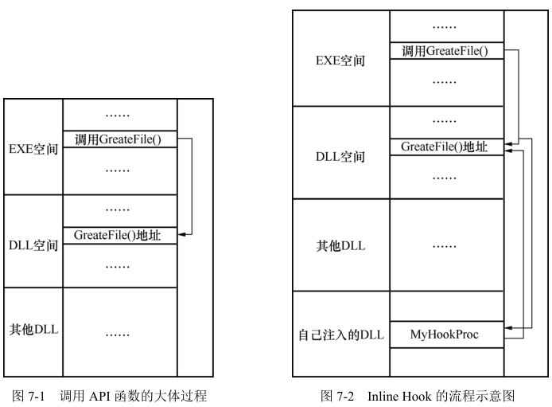
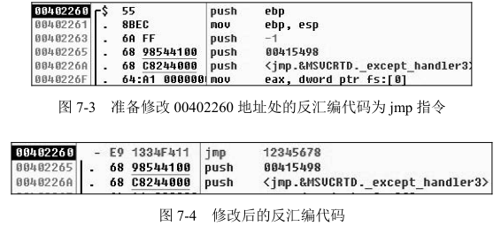
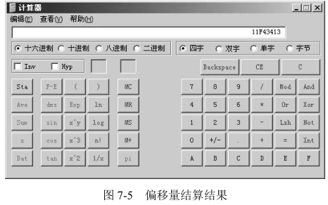

# C++黑客编程揭秘与防范

本书以 Win32 应用层下的安全开发为中心，介绍 Windows 系统下的安全开发。


## Ch1 黑客编程入门

对于一个程序员来说，除了要掌握基本的开发语言以外，还要掌握具体的开发环境和系统平台的相关知识；在掌握编程语言和开发环境等知识后，还要掌握调试技术以及各种调试分析工具。同样，Windows 操作系统提供了良好的调试接口，并且有非常多的调试工具。

### 1.1. 初识 Windows 消息

大部分 Windows 应用程序都是基于消息机制的（命令行下的程序并不基于消息机制），熟悉 Windows 操作系统的消息机制是掌握 Windows 操作系统下编程的基础。

### 1.1.1. 对消息的演示测试

首先写一个简单的程序，通过编写的程序发送消息来关闭记事本的进程、获取窗口的标题和设置窗口的标题。

```c++

```


---

## Ch7 黑客高手的 HOOK 技术

钩子到底是做什么用的呢？钩子的应用范围非常广泛，比如输入监控、**API 拦截**、消息捕获、**改变程序执行流程**等方面。

杀毒软件会用 HOOK 技术钩住一些 API 函数，比如钩住注册表读写函数，从而防止病毒对注册表进行写入；病毒使用 HOOK 技术有针对性地捕获键盘的输入，从而记录用户的密码；文件加密系统通过 HOOK 技术在不改变用户操作的情况下对用户的文件进行透明加密。


---

### 7.1. HOOK 技术概述

在 DOS 时代进行编程时，操作系统提供的**编程接口**不称为 **API 函数**，而是称为**中断服务向量**。也就是说，当时的操作系统提供的编程接口只有中断，要进行写文件就要调用系统中断，要进行读文件也要调用系统中断（当然，也可以不调用 DOS 操作系统的中断，而直接调用更底层的中断）……中断服务向量类似于 Windows 系统下的 API 函数，在操作系统的某个地址保存着。它**以数组的形式保存着**，也称为**中断向量表**。DOS 时代的 HOOK 技术也就是修改中断向量表中的中断地址。比如，要捕获写操作，那么就修改中断向量表中关于写文件的地址，将写文件的中断地址保存好，然后替换为自己函数的地址，这样当程序调用写文件中断时，函数就被执行了，当程序执行完以后，可以继续调用原来的中断地址，从而完成写文件的操作。

在 Windows 系统下，HOOK 技术的方法比较多，使用比较灵活，常见的 HOOK 方法有 **Inline Hook**、**IAT Hook**、**EAT Hook**、**Windows 钩子**……HOOK 技术涉及 **DLL** 相关的知识。HOOK 技术也涉及注入的知识，想要把完成 HOOK 功能的 DLL 文件加载到目标进程空间中，就要使用**注入**的知识。

下面来介绍常用的 Windows 系统下的 HOOK 技术。


---

### 7.2. 内联钩子——Inline Hook

#### 7.2.1. Inline Hook 的原理

**API 函数**都保存在操作系统提供的 **DLL 文件**中。当在程序中调用某个 API 函数并运行程序后，程序会隐式地将 API 函数所在的 DLL 文件加载入进程中。这样，程序就会像调用自己的函数一样调用 API，大体过程如图 7-1 所示。

从图7-1 中可以看出，在进程中，当 EXE 模块调用 `CreateFile()` 函数的时候，会调用 `kernel32.dll` 模块中的 `CreateFile()` 函数，因为真正的 `CreateFile()` 函数的实现在 `kernel32.dll` 模块中。

`CreateFile()` 是 API 函数，API 函数也是由人编写的代码再编译而成的，也有其对应的二进制代码。既然是代码，就可以被修改。通过一种“野蛮”的方法直接修改 API 函数在内存中的映像，从而对 API 函数进行 HOOK。使用的方法是，直接使用汇编指令的 **`jmp` 指令将其代码执行流程改变，进而执行自己的代码**，这样就使原来的函数的流程改变了。执行完自己的流程以后，可以选择性地执行原来的函数，也可以不继续执行原来的函数。

假设要对某进程的 `kernel32.dll` 的 `CreateFile()` 函数进行 HOOK，首先需要在指定进程中的内存中找到 `CreateFile()` 函数的地址，然后修改 `CreateFile()` 函数的首地址的代码为 `jmpMyProc` 的指令。这样，当指定的进程调用 `CreateFile()` 函数时，就会首先跳转到自己的函数中去执行流程，这样就完成了 HOOK 的工作。它的流程图如图 7-2 所示。



由于这种方法是在程序流程中直接进行**嵌入 `jmp` 指令**来改变流程的，所以就把它叫作 `Inline Hook`。


---

#### 7.2.2. Inline Hook 的实现

了解大体的 Inline Hook 流程后，现在来学习它的具体实现。

C 语言程序被编译连接后为一个二进制文件。在二进制文件中，代码部分都是 CPU 可以用来执行的机器码，机器码和汇编指令又是一一对应的。前面讲过，`Inline Hook` 是在程序中嵌入 `jmp` 汇编指令后跳转到流程处继续执行的，`jmp` 指令的用法是 `jmp` 目的地址。

`jmp` 在汇编语言中是一个**无条件的跳转指令**。在汇编指令中，`jmp` 后面**跟随的参数是要跳转的“目的地址”**。用 OD 随便打开一个程序，并且修改它的某条指令为 `jmp` 指令。跳转的目的为一个任意地址，如图 7-3 和图 7-4 所示。



从图 7-3 和图 7-4 的对比可以看出，`jmp` 指令占用了 **5 字节**。原来从 `00402260` 到 `00402265` 处的机器码为 `55 8B EC 6A FF`，当修改图 7-3 中前 3 句反汇编代码为 `jmp 12345678` 后，现在的机器码为 `E9 13 34 F4 11`。其实，`jmp` **对应的机器码是** `E9`（针对长转移来说），后面的 `13 34 F4 11` **不是一个具体的地址，而是一个偏移量**。这个偏移量是多少呢？这个偏移量是`11F43413`，请回忆一下前面提到过的**字节顺序的问题**。

思考：为什么在转移后会使用偏移量而不是使用具体的地址呢？

写汇编代码时，`jmp` 后面往往是一个要跳转目的的“标号”，而并非一个确切的地址。即使源代码在编译连接后也无法得到跳转的目的地址。想想 DLL 文件的加载方式，**DLL 每次装载的位置并不固定**，因此 `jmp` 后面无法给出具体跳转的地址。而 `jmp` 使用一个偏移量的话，无论 DLL 每次加载到哪个位置，`jmp` 都会因为代码中的**相对位置固定**而**不会跳转出错**。由于 DLL 每次装载的地址不同，DLL 中部分数据需要进行重定位以修正其地址。而为什么 `jmp` 不能这么做呢？笔者觉得其实是可以的，只是重定位也需要时间开销。一个程序中有大量的 `jmp` 指令（想想前面章节介绍的反汇编内容，无论是 if、for 还是 while，都会变成 `jcc` 的指令），那么由于重定位，每个 `jmp` 后的地址要浪费多长时间？**使用偏移量的话就不一样了，即使装载的地址不同，也无须对 `jmp` 后的地址进行重定位**。（`jmp` 指令出现在 DLL 文件之前，这里使用 DLL 文件来这样介绍，完全是考虑到方便理解。）

`jmp` 指令后的偏移量计算公式如下：

`jmp` 后的偏移量 = 目标地址 − 原地址 − 5

这是一个非常重要的公式，当然对于其使用只要记住就可以了。这里的 5 是 `jmp` 的指令长度，也就是说，`jmp ××××××××` 指令的机器码长度为 5 字节。验证一下这个公式，目标地址是`12345678`，原地址为 `00402260`，`12345678 − 00402260 − 5 = 11F43413`。用计算器进行计算，如图 7-5 所示。



> 注： 该偏移计算公式并不准确，因为对于其他**转移指令**而言，其**指令长度未必就是 5 字节**。在计算短转移或近转移时，如果按照 5 字节进行计算就会出错，因此准确的描述应该是 `jmp 后的偏移量 = 目标地址 – 原地址 – jcc 的指令长度` 。最后减去的指令长度应该根据具体的情况而定。在 Inline Hook 中，由于确定 `jmp` 指令的长度为 5 字节，因此在这里是可行的。


上面地址都是用**十六进制**进行计算的，读者计算时要注意这一点，以免计算错误。通过上面的例子可以看出，修改时只需要修改 5 字节就可以了。下面来梳理 Inline Hook 的流程，具体如下。

① 构造跳转指令。
② 在内存中找到欲 HOOK 函数地址，并保存欲 HOOK 位置处的前 5 字节。
③ 将构造的跳转指令写入需 HOOK 的位置处。
④ 当被 HOOK 位置被执行时会转到自己的流程执行。
⑤ 如果要执行原来的流程，那么取消 HOOK，也就是还原被修改的字节。
⑥ 执行原来的流程。
⑦ 继续 HOOK 住原来的位置。

这就是 Inline Hook 的大概流程。

由于 Inline Hook 的实现代码比较简单，关键就是一个 **HOOK** 和一个**取消 HOOK** 的过程，因此可用 C++封装一个 Inline Hook 的类。在今后 Inline Hook 编程中，可以始终使用这个封装好的类。

一般情况下，封装类都有两个文件，一个是类的头文件，另一个是类的实现文件。在 Windows 下使用 MFC 进行开发类名（Class Name）都习惯以“C”开头，这里封装的是 Inline Hook 类，因此**类名**是 `CILHook`。为了保持一致性，类的**头文件**和**实现文件**分别是 `ILHook.h` 文件和  `LHook.cpp` 文件。先来看一下 `ILHook.h` 文件中的类定义部分。

```c++
#ifndef __ILHOOK_H__F47BF581_8D85_49ef_923D_895DCC9E4471_
#define __ILHOOK_H__F47BF581_8D85_49ef_923D_895DCC9E4471_

#include <Windows.h>

class CILHook
{
    public:
        CILHook(); 			// 构造
        ~CILHook(); 		// 析构
    
        // Hook 函数
        BOOL Hook(LPSTR pszModuleName, 	// Hook 的模块名称
        		LPSTR pszFuncName, 		// Hook 的 API 函数名称
        		PROC pfnHookFunc); 		// 要替换的函数地址
    
        // 取消 HOOK 函数
        VOID UnHook();
    
        // 重新进行 Hook 函数
        BOOL ReHook();
    
    private:
        PROC m_pfnOrig; 				// 函数地址
        BYTE m_bOldBytes[5]; 			// 函数入口代码
        BYTE m_bNewBytes[5]; 			// Inline 代码
};
#endif
```


在 C++中，类的定义使用关键字 `class`。在类中定义有**成员函数**和**成员变量**，通常情况下，把**成员函数放在上面，把成员变量放在下面**。因为对于拿到头文件的使用人员来说，他首先关注的是类实现了哪些功能，因此应该让他第一眼就能看到实现了的成员函数。当然，这不是必需的，只是一种习惯。

回到类定义，在类中除了构造函数和析构函数以外，还定义了 3 个成员函数，分别是 `Hook()`、`UnHook()` 和 `ReHook()`。它们的功能分别是用来进行 **HOOK 操作**、**取消 HOOK 操作**和**重新进行 HOOK 操作**。对于 3 个成员函数来说，这里只是一个定义，实现部分在 `ILHook.cpp` 中。

除了上面的 3 个成员函数外，还定义了 3 个成员变量，分别是 `m_pfnOrig`、`m_bOldBytes[5]` 和 `m_bNewBytes[5]`。这 3 个函数的作用已经在定义中给出了注释。接着看 `ILHook.cpp` 文件中的实现代码，具体如下：

```c++
CILHook::CILHook()
{
    // 对成员变量的初始化
    m_pfnOrig = NULL;
    ZeroMemory(m_bOldBytes, 5);
    ZeroMemory(m_bNewBytes, 5);
}

CILHook::~CILHook()
{
    // 取消 HOOK
    UnHook();
    m_pfnOrig = NULL;
    ZeroMemory(m_bOldBytes, 5);
    ZeroMemory(m_bNewBytes, 5);
}
```

在**构造函数**中主要是完成对**成员变量的初始化工作**，在**析构函数**中主要是**取消 HOOK**。构造函数在 C++ **对象被创建时自动执行**，同样析构函数是在 C++ 对象**被销毁时自动执行**。

```c++
/*
函数名称：Hook
函数功能：对指定模块中的函数进行挂钩
参数说明：
pszModuleName:模块名称
pszFuncName: 函数名称
pfnHookFunc: 钩子函数
*/
BOOL CILHook::Hook(LPSTR pszModuleName,
				LPSTR pszFuncName,
				PROC pfnHookFunc)
{
    BOOL bRet = FALSE;
    // 获取指定模块中函数的地址
    m_pfnOrig = (PROC)GetProcAddress(
    					GetModuleHandle(pszModuleName),
    					pszFuncName);
    if ( m_pfnOrig != NULL )
    {
        // 保存该地址处 5 字节的内容
        DWORD dwNum = 0;
        ReadProcessMemory(GetCurrentProcess(),
        				m_pfnOrig,
        				m_bOldBytes,
        				5,
        				&dwNum);
        // 构造 JMP 指令
        m_bNewBytes[0] = '\xe9'; // jmp Opcode
        // pfnHookFunc 是 HOOK 后的目标地址
        // m_pfnOrig 是原来的地址
        // 5 是指令长度
        *(DWORD *)(m_bNewBytes + 1) = (DWORD)pfnHookFunc - (DWORD)m_pfnOrig - 5;
        
        // 将构造好的地址写入该地址处
        WriteProcessMemory(GetCurrentProcess(),
                        m_pfnOrig,
                        m_bNewBytes,
                        5,
                        &dwNum);
        bRet = TRUE;
    }
    return bRet;
}
```

该函数是 `InlineHook` 类的重要函数。在 `Hook()` 成员函数中完成了 3 项工作，首先是**获得了被 HOOK 函数的函数地址**，接下来是**保存**了**被 HOOK 函数的前 5 字节**，最后是用构造好的跳转指令来**修改被 HOOK 函数的前 5 字节的内容**。除了上面的函数外，还有两个函数，分别是取消挂钩和重新挂钩。这两个函数非常简单，就是完成复制字节的工作。代码如下：

```c++
/*
函数名称：UnHook
函数功能：取消函数的挂钩
*/
VOID CILHook::UnHook()
{
    if ( m_pfnOrig != 0 )
    {
        DWORD dwNum = 0;
        //把m_bOldBytes再写回去
        WriteProcessMemory(GetCurrentProcess(),
                        m_pfnOrig,
                        m_bOldBytes,
                        5,
                        &dwNum);
    }
}


/*
函数名称：ReHook
函数功能：重新对函数进行挂钩
*/
BOOL CILHook::ReHook()
{
    BOOL bRet = FALSE;
    if ( m_pfnOrig != 0 )
    {
        DWORD dwNum = 0;
        //已经有 m_bNewBytes 了，不用计算地址了，直接写即可
        WriteProcessMemory(GetCurrentProcess(),
                        m_pfnOrig,
                        m_bNewBytes,
                        5,
                        &dwNum);
        bRet = TRUE;
    }
    return bRet;
}
```

上面两个成员函数就不进行介绍了，只要读者能看懂 `Hook()` 函数的实现，就肯定能理解这两个函数的功能。

整个 Inline Hook 的封装已经完成了，在后面的代码中，可以很容易地实现对函数的 HOOK 功能。


---

#### 7.2.3. Inline Hook 实例

在介绍完 Inline Hook 的原理和实现以后，接下来介绍两个 Inline Hook 的实例，分别是对本进程进行 HOOK 和对其他进程进行 HOOK 的实例。

**1．Hook MessageBoxA 函数**

本小节将完成一个 HOOK 本进程 `MessageBoxA()` 的程序，这个程序的目的是**测试Hook类是否封装成功**，以便完成今后的程序。在 VC6 下创建一个控制台程序，添加好封装过的库，然后键入下面的代码：

```c++
#include <Windows.h>
#include "ILHook.h"
// 创建一个全局的变量
CILHook MsgHook;

int
WINAPI
MyMessageBoxA(
            HWND hWnd,
            LPCSTR lpText,
            LPCSTR lpCaption,
            UINT uType)
{
    // 恢复 HOOK
    MsgHook.UnHook();
    MessageBox(hWnd, "Hook 流程", lpCaption, uType);
    MessageBox(hWnd, lpText, lpCaption, uType);
    // 重新 HOOK
    MsgHook.ReHook();
    
    return 0;
}

int main()
{
    // 不进行 HOOK 的 MessageBox
    MessageBox(NULL, "正常流程 1", "test", MB_OK);
    
    // HOOK 后的 MessageBox
    MsgHook.Hook("User32.dll", "MessageBoxA", (PROC)MyMessageBoxA);
    MessageBox(NULL, "被 HOOK 了 1", "test", MB_OK);
    MessageBox(NULL, "被 HOOK 了 2", "test", MB_OK);
    MsgHook.UnHook();
    MessageBox(NULL, "正常流程 2", "test", MB_OK);
    return 0;
}
```

在**主函数**中调用了 4 次 `MessageBox()` 函数，每次弹出的内容分别是 <u>“正常流程 1”</u>, <u>“被HOOK 了 1”</u>, <u>“被 HOOK 了 2”</u> 和 <u>“正常流程 2”</u>。在 `MyMessageBoxA()` 函数中，分别调用两次 `MessageBox()` 函数，并且分别输出 **“Hook 流程”** 和 `MyMessageBoxA()` **函数的参数**。

从主函数的流程结构来看，并没有调用自己实现的 `MyMessageBoxA()` 函数。编译连接并运行自己的程序，从程序的执行结果来看，一共出现了 6 次由 `MessageBox()` 函数产生的对话框。这说明 Inline Hook 完成了。

> 在自己实现的 Hook 函数中要调用原来的 API 函数，需要恢复 Inline Hook，否则将是一个死循环。比如自己实现的 `MyMessageBoxA()` 是用来 HOOK `MessageBoxA()` 函数的，在 `MyMessageBoxA()` 中调用`MessageBoxA()` 函数时，需要恢复 `MessageBoxA()` 不被 Hook，否则对 `MessageBoxA()` 函数的调用一直会进入 `MyMessageBoxA()` 函数而无法弹出对话框。

这里介绍了关于本进程的 Inline Hook 的例子，接下来要介绍的是其他进程 Inline Hook 的例子。由于每个进程的地址空间是隔离的，那么其他进程的 Inline Hook 是需要用到 DLL 文件的。下面介绍如何使用 DLL 文件来完成对其他进程的 Inline Hook 的工作。


