# CUDA C编程权威指南

https://face2ai.com/


写并行和串行的最大区别就是，写串行程序可能不需要学习不同的硬件平台，但是**写并行程序就需要对硬件有一定的了解**。


Compute Unified Device Architecture 统一计算设备架构是NVIDIA英伟达提出的并行计算架构，结合了 CPU 和 GPU 的优点，处理密集型及并行计算。

CPU 和 GPU 两个单独的处理器，通过单个计算节点中的 **PCI-Express总线相连**，GPU 用来提高计算密集型应用程序中**并行程序段**的**执行速度**，CPU 负责管理**设备端的资源**。


实验环境：安装有CUDA工具包的 Linux 系统，C/C++ 编译程序和 NVIDIA Kepler GPU。

https://developer.nvidia.com/cuda-toolkit

​	该CUDA工具包包括了 **NVIDIA GPU编译器**、**CUDA数学库**以及用于**调试**和**优化**应用程序性能的工具，此外还有编程指南、用户手册、API参考指南和其他文档，它们都将帮助你快速掌握GPU应用程序的开发。


------

## 第一章 基于CUDA的异构并行计算

高性能计算（HPC）一般来说，它涉及**多个处理器**或**计算机**的使用，以**高吞吐量**和**高效率**来完成一个复杂的任务。

HPC 不仅可以认为是一个计算架构，还可以认为是包括硬件系统、软件工具、编程平台及并行编程范例的一组元素列表。

在过去的十几年中，高性能计算取得了极大的发展，尤其是 **GPU-CPU 异构架构**的出现，直接导致了在并行程序设计中一个基本的范例转变。将从本章开始学习异构并行程序设计。

### 1.1. 并行计算

计算原则是一个**大**的问题往往可以被**划分**为很多可以同时解决的**小**问题。并行计算通常涉及两个不同的计算技术领域。

- 计算机**架构**（硬件方面）
- 并行**程序设计**（软件方面）

计算机架构关注的是在**结构级别上支持并行性**，而并行编程设计关注的是充分**使用计算机架构**的计算能力来并发地解决问题。**为了在软件中实现并行执行，硬件必须提供一个支持并行执行多进程或多线程的平台。**

硬件主要目标就是为软件提供更快的计算速度，更低的性能功耗比，硬件结构上支持更快的并行。
软件主要目标是使用当前的硬件压榨出最高的性能，给应用提供更稳定快速的计算结果。

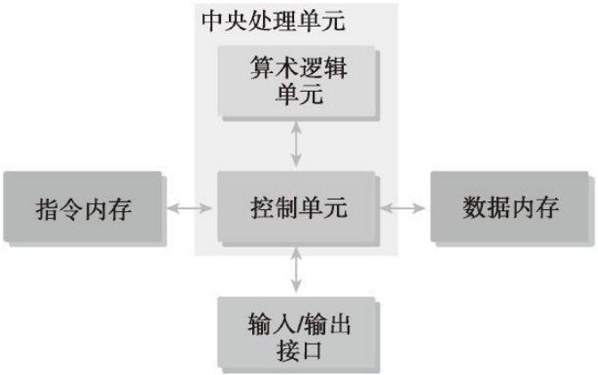

大多数现代处理器都应用了**哈佛体系结构**（Harvard architecture），如图1-1所示，它主要由3个部分组成。

- **内存**（指令内存和数据内存）
- 中央处理单元（控制单元和算术逻辑单元ALU）
- 输入/输出接口

> 指令和数据都是以0、1代码形式存在存储器中，但CPU可以判断出在**取指**阶段访存取出的0、1代码是指令；在**执行**阶段访存取出的0、1代码是数据。（通过不同的时间段区分/通过地址来源区分）

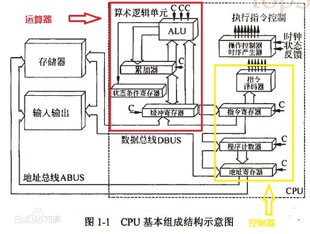

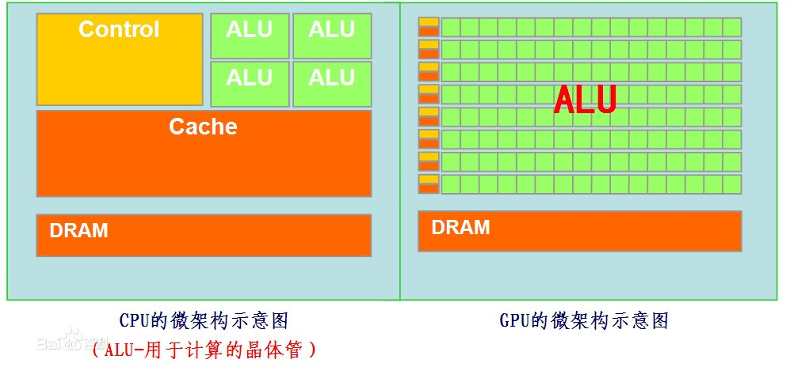

高性能计算的关键部分是中央处理单元（CPU），通常被称为计算机的核心。在早期的计算机中，**一个芯片**上只有**一个CPU**，这种结构被称为单核处理器。

现在，芯片设计的趋势是将**多个核心**集成到一个**单一**的处理器上，以在体系结构级别支持并行性，这种形式通常被称为**多核**处理器。

因此，并行程序设计可以看作是将一个问题的计算分配给可用的核心以实现并行的过程。

当在多核计算机上执行算法时，对于程序员来说，**了解基本的计算机架构的特点**就显得非常重要了。


------

#### 1.1.1. 串行编程和并行编程

当用计算机程序解决一个问题时，我们会很自然地把这个问题划分成许多的运算块，每一个运算块执行一个指定的任务，如图1-2所示。这样的程序叫作**串行程序**。

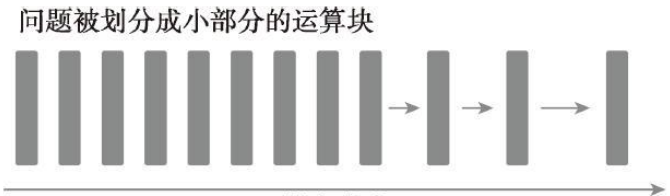

有两种方法可以区分两个计算单元之间的关系：有些是有**执行次序**的，所以**必须串行**执行；其他的**没有执行次序**的约束，则可以**并发执行**。所有**包含并发执行任务**的程序都是**并行程序**。如图1-3所示，一个并行程序中可能会有一些串行部分。

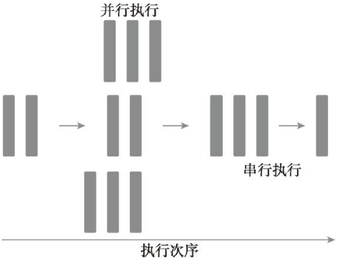

从程序员的角度来看，一个程序应包含两个基本的组成部分：**指令和数据**。

当一个计算问题被划分成许多小的计算单元后，每个计算单元都是一个任务。在一个任务中，单独的指令负责处理输入和调用一个函数并产生输出。当一个指令处理前一个指令产生的数据时，就有了数据相关性的概念。因此，你可以区分任何两个任务之间的依赖关系，**如果一个任务处理的是另一个任务的输出，那么它们就是相关的，否则就是独立的**。

在并行算法的实现中，**分析数据的相关性是最基本的内容**，因为相关性是限制并行性的一个主要因素，而且在现代编程环境下，为了提高应用程序的运行速度，理解这些是很有必要的。在大多数情况下，具有依赖关系的任务之间的独立的关系链为并行化提供了很好的机会。


------

#### 1.1.2. 并行性

并行性的应用非常广泛，在编程领域，并行编程设计正在成为主流。**多层次的并行性设计是架构设计的驱动力**。在应用程序中有两种基本的并行类型。

- 任务（指令）并行
- 数据并行

当许多**任务或函数**可以独立地、大规模地并行执行时，这就是任务并行。任务并行的重点在于利用多核系统对任务进行分配。

当可以**同时处理许多数据**时，这就是数据并行。数据并行的重点在于利用多核系统对数据进行分配。

CUDA编程非常适合解决**数据并行计算**的问题。本书的重点便是如何使用CUDA编程解决数据并行问题。数据并行处理可以将**数据映射给并行线程**。


数据并行程序设计的**第一步**是把**数据依据线程进行划分，以使每个线程处理一部分数据**。

通常来说，有两种方法可以对数据进行划分：**块划分**（block partitioning）和**周期划分**（cyclic partitioning）。

在块划分中，**一组连续的数据被分到一个块内**。每个数据块以任意次序被安排给一个线程，**线程通常在同一时间只处理一个数据块**。

在周期划分中，更少的数据被分到一个块内。相邻的线程处理相邻的数据块，**每个线程可以处理多个数据块**。为一个待处理的线程选择一个新的块，就意味着要跳过和现有线程一样多的数据块。

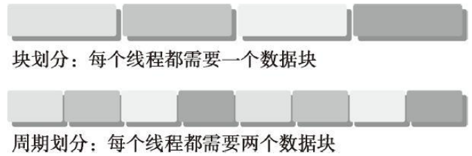

图1-4所示为对一维数据进行划分的两个例子。在块划分中，每个线程仅需处理数据的一部分，而在周期划分中，每个线程要处理数据的多个部分。

<span id="pic15"></span>

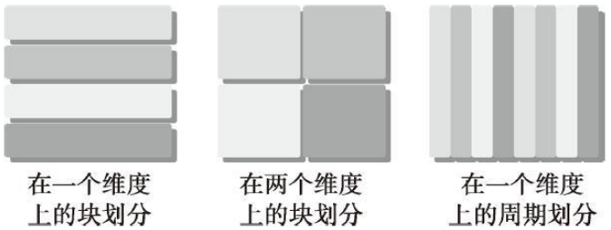


图1-5所示为对二维数据进行划分的3个例子：沿 y 轴的块划分，沿 x 轴和 y 轴的块划分，以及沿 x 轴的周期划分。其余的划分方式为沿 x 轴的块划分，沿 x 轴和 y 轴的周期划分，以及沿 y 轴的周期划分留作练习。


通常，数据是在一维空间中存储的。即便是多维逻辑数据，仍然要被**映射到一维物理地址空间中**。如何在线程中分配数据不仅与**数据的物理储存方式密切相关**，并且与每个**线程的执行次序**也有很大关系。组织线程的方式对程序的性能有很大的影响。


##### 数据划分

对数据划分有两种基本的方法：

- **块划分**：每个线程作用于一部分数据，通常这些数据具有相同大小。
- **周期划分**：每个线程作用于数据的多部分。

程序性能通常对块的大小比较敏感。块划分与周期划分中划分方式的选择与计算机架构有
密切关系。具体实例详见本书其他章节。


------

#### 1.1.3. 计算机架构

##### 1.1.3.1. 指令数据分类

有多种不同的方法可以对计算机架构进行分类。一个广泛使用的分类方法是**弗林分类法**（Flynn’s Taxonomy），它根据**指令和数据进入CPU的方式**，将计算机架构分为4种不同的类型（如图1-6所示）。

- 单指令单数据（SISD）（传统串行计算机，386）
- 单指令多数据（SIMD）（向量机）
- 多指令单数据（MISD）
- 多指令多数据（MIMD）

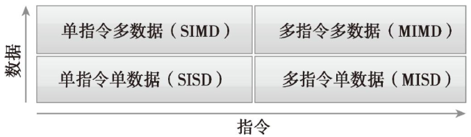

SISD指的是传统计算机：一种串行架构。在这种计算机上只有**一个核心**。在任何时间点上只有**一个指令流在处理一个数据流**。

SIMD是一种并行架构类型。在这种计算机上有**多个核心**。在任何时间点上所有的核心只有**一个指令流处理不同的数据流**。向量机是一种典型的SIMD类型的计算机，现在大多数计算机都采用了SIMD架构。SIMD最大的优势或许就是，在CPU上编写代码时，程序员可以**继续按串行逻辑思考但对并行数据操作实现并行加速**，而其他细节则由**编译器来负责**。

MISD类架构比较少见，在这种架构中，每个核心通过使用**多个指令流处理同一个数据流**。

MIMD是一种并行架构，在这种架构中，**多个核心**使用**多个指令流**来**异步**处理**多个数据流**，从而实现**空间上的并行性**。许多MIMD架构还包括SIMD执行的子组件。


为了实现以下目的，在架构层次上已经取得了许多进展。

- 降低**延迟**
- 提高**带宽**
- 提高**吞吐量**

**延迟**是一个操作从**开始到完成所需要的时间**，常用微秒来表示。

**带宽**是单位时间内可处理的**数据量**，通常表示为MB/s或GB/s。

**吞吐量**是单位时间内**成功处理的运算数量**，通常表示为gflops（即每秒十亿次的浮点运算数量），特别是在重点使用浮点计算的科学计算领域经常用到。

延迟用来衡量**完成一次操作的时间**，而吞吐量用来衡量在给定的**单位时间内处理的操作量**。

吞吐量和延迟有一定关系，都是反应计算速度的。


##### 1.1.3.2. 内存组织方式分类

计算机架构也能根据内存组织方式进行进一步划分，一般可以分成下面两种类型。

- **分布式**内存的多节点系统
- **共享内存**的多处理器系统

在多节点系统中，大型计算引擎是由许多**网络连接**的处理器构成的。**每个处理器有自己的本地内存**，而且处理器之间可以通过网络进行通信。图 1-7 所示为一个典型的分布式内存的多节点系统，这种系统常被称作**集群**。

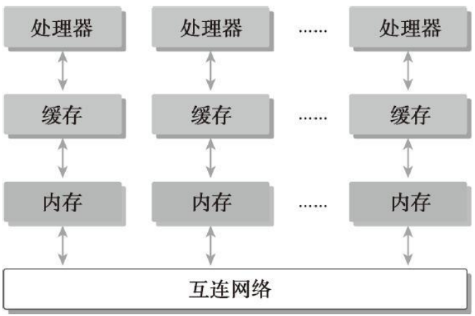


多处理器架构的大小通常是从双处理器到几十个或几百个处理器之间。这些处理器要么是与**同一个物理内存**相关联（如图1-8所示），要么**共用**一个**低延迟的链路**（如 PCI-Express 或 PCIe）。尽管共享内存意味着共享地址空间，但并不意味着它就是一个独立的物理内存。这样的多处理器不仅包括由多个核心组成的单片机系统，即所谓的多核系统，而且还包括由多个芯片组成的计算机系统，其中每一个芯片都可能是多核的。目前，多核架构已经永久地取代了单核架构。

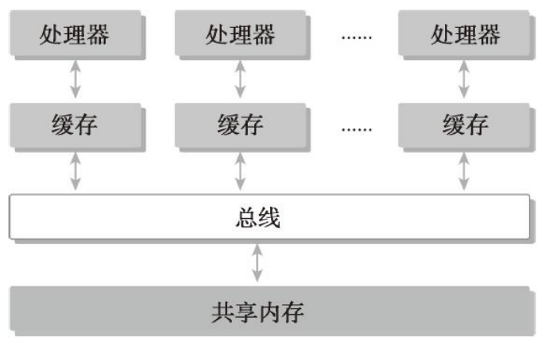

“**众核**”（many-core）通常是指有很多核心（几十或几百个）的多核架构。近年来，计算机架构正在从多核转向众核。

**GPU**代表了一种**众核架构**，几乎包括了前文描述的所有并行结构：**多线程**、MIMD（**多指令多数据**）、SIMD（**单指令多数据**），以及**指令级并行**。NVIDIA公司称这种架构为SIMT（**单指令多线程**）。

GPU 和 CPU 的来源并不相同。历史上，GPU是图形加速器。直到最近，GPU才演化成一个强大的、多用途的、完全可编程的，以及任务和数据并行的处理器，它非常适合解决大规模的并行计算问题。


##### GPU核心和CPU核心

尽管可以使用多核和众核来区分CPU和GPU的架构，但这两种核心是完全不同的。

CPU核心比较重，用来处理非常**复杂的控制逻辑**，以优化串行程序执行。

GPU核心较轻，用于优化具有简单控制逻辑的数据并行任务，**注重并行程序的吞吐量**。


------

### 1.2. 异构计算

CPU和GPU是两个独立的处理器，它们通过单个计算节点中的 **PCI-Express** 总线相连。在这种典型的架构中，GPU指的是**离散的设备从同构系统到异构系统的转变**是高性能计算史上的一个里程碑。

同构计算使用的是**同一架构下**的一个或**多个处理器**来执行一个应用。而异构计算则使用**一个处理器架构来执行一个应用**，为任务选择适合它的架构，使其最终对性能有所改进。

> 同构：每个结点具有相同的数据模型，控制算法。

> 异构：每个结点具有不同类型的控制算法。上节讲到了，计算机架构可以按照指令集划分或者按照内存结构划分，不同的计算机架构就是异构。两片CPU型号不一样可能也应该叫异构。

尽管异构系统比传统的高性能计算系统有更大的优势，但目前对这种系统的有效利用受限于增加**应用程序设计的复杂性**。而且最近得到广泛关注的并行计算也因包含异构资源而增加了复杂性。


------

#### 1.2.1. 异构架构

一个典型的异构计算节点包括两个多核CPU插槽和两个或更多个的众核GPU。GPU不是一个独立运行的平台而是CPU的**协处理器**。因此，GPU必须通过**PCIe总线**与基于CPU的主机相连来进行操作，如图1-9所示。这就是为什么CPU所在的位置被称作**主机端**而GPU所在的位置被称作**设备端**。

ALU就是完成逻辑计算的核心，也就是平时说的四核八核。DRAM是内存，一般不在片上，CPU通过总线访问。

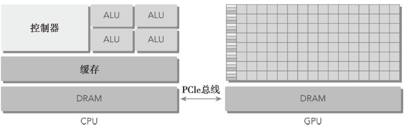

一个异构应用包括两个部分。

- **主机代码**
- **设备代码**

主机代码在CPU上运行，设备代码在GPU上运行。异构平台上执行的应用通常由**CPU初始化**。在设备端加载计算密集型任务之前，CPU代码负责**管理设备端**的环境、代码和数据。

在计算密集型应用中，往往有很多并行数据的程序段。GPU就是用来提高这些并行数据的执行速度的。当使用CPU上的一个与其**物理上分离**开的硬件组件来提高应用中的计算密集部分的执行速度时，这个组件就成为了一个硬件加速器。GPU可以说是最为常见的硬件加速器。


以下产品应用了NVIDIA公司的GPU计算平台。Tegra系列产品是专为移动和嵌入式设备而设计的，如平板电脑和手机，GeForce面向图形用户，Quadro用于专业绘图设计，Tesla用于大规模的并行计算。

以下是描述GPU容量的两个重要特征。

- **CUDA核心数量**
- **内存大小**

相应的，有两种不同的指标来指标来评估GPU的性能。

- **峰值计算性能**
- **内存带宽**

峰值计算性能是用来评估**计算容量的一个指标**，通常定义为每秒能处理的单精度或双精度浮点运算的数量。峰值性能通常用GFlops（每秒十亿次浮点运算）或TFlops（每秒万亿次浮点运算）来表示。

内存带宽是**从内存中读取或写入数据的比率**。内存带宽通常用GB/s表示。

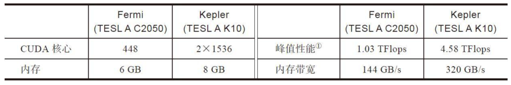


##### 计算能力

NVIDIA使用一个术语“计算能力”（compute capability）来描述整个Tesla系列的GPU加速器的硬件版本。


------

#### 1.2.2. 异构计算范例

GPU计算并不是要取代CPU计算。对于特定的程序来说，每种计算方法都有它自己的优点。CPU计算适合处理**控制密集型任务**，GPU计算适合处理包含**数据并行的计算密集型任务**。

GPU与CPU结合后，能有效提高大规模计算问题的处理速度与性能。CPU针对动态工作负载进行了优化，这些动态工作负载是由短序列的计算操作和不可预测的控制流程标记的；而GPU在其他领域内的目的是：处理由**计算任务主导的且带有简单控制流的工作负载**。

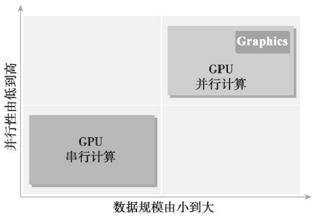

如图1-10所示，可以从两个方面来区分CPU和GPU应用的范围。

- 并行级
- 数据规模

如果一个问题有**较小的数据规模、复杂的控制逻辑**和/或**很少的并行性**，那么最好选择**CPU**处理该问题，因为它有处理复杂逻辑和指令级并行性的能力。

相反，如果该问题包含**较大规模**的待处理数据并表现出大量的数据并行性，那么使用GPU是最好的选择。因为GPU中有大量可编程的核心，可以支持大规模多线程运算，而且相比CPU有较大的峰值带宽。

因为CPU和GPU的**功能互补性**导致了CPU＋GPU的**异构并行计算架构**的发展，这两种处理器的类型能使应用程序获得最佳的运行效果。因此，为获得最佳性能，你可以同时使用CPU和GPU来执行你的应用程序，**在CPU上执行串行部分或任务并行部分，在GPU上执行数据密集型并行部分**，如图1-11所示。

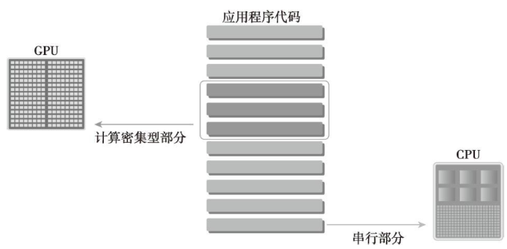

这种代码的编写方式能保证GPU与CPU相辅相成，从而使CPU＋GPU系统的计算能力得以充分利用。为了支持使用CPU＋GPU异构系统架构来执行应用程序，NVIDIA设计了一个被称为**CUDA的编程模型**。


##### CPU线程与GPU线程

CPU上的线程通常是**重量级**的实体。操作系统必须交替线程使用启用或关闭CPU执行通道以提供多线程处理功能。**上下文的切换缓慢且开销大**。

GPU上的线程是**高度轻量级**的。在一个典型的系统中会有成千上万的线程排队等待工作。**如果GPU必须等待一组线程执行结束，那么它只要调用另一组线程执行其他任务即可。**

CPU的核被设计用来尽可能减少一个或两个线程运行时间的延迟，而GPU的核是用来处理大量并发的、轻量级的线程，以最大限度地提高吞吐量。

现在，四核CPU上可以同时运行16个线程，如果CPU支持超线程可支持多至32个线程。

现代的NVIDIA GPU在每个多处理器上最多可以并发支持1536个同时活跃的线程。有16个多处理器的GPU，可以并发支持超过24000个同时活跃的线程。


------

#### 1.2.3. CUDA：一种异构计算平台

CUDA是一种通用的**并行计算平台和编程模型**，它利用NVIDIA GPU中的并行计算引擎能更有效地解决复杂的计算问题。通过使用CUDA，你可以像在CPU上那样，通过GPU来进行计算。

CUDA平台可以通过**CUDA加速库**、**编译器指令**、**应用编程接口**以及行业**标准程序语言的扩展**（包括C、C++、Fortran、Python，如图1-12所示）来使用。本书重点介绍CUDA C的编程。

CUDA C是标准ANSI C语言的一个扩展，它带有的少数语言扩展功能使异构编程成为可能，同时也能通过**API来管理设备、内存和其他任务**。CUDA还是一个可扩展的编程模型，它使程序能对有不同数量核的GPU明显地扩展其并行性。

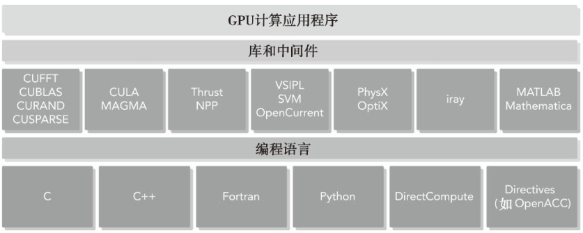

CUDA提供了两层API来管理**GPU设备和组织线程**，如图1-13所示


- CUDA驱动API
- CUDA运行时API

**驱动API**是一种**低级API**，它相对来说较难编程，但是它对于在GPU设备使用上提供了更多的控制。

**运行时API**是一个**高级API**，它在驱动API的上层实现。每个运行时API函数都被分解为更多传给驱动API的基本运算。


##### 运行时API与驱动API

运行时API和驱动API之间没有明显的性能差异。在设备端，内核是如何使用内存以及如何组织线程，对性能有更显著的影响。

这两种API是相互排斥的，你必须使用两者之一，从两者中混合函数调用是不可能的。本书中所有例子都使用**运行时API**。

一个CUDA程序包含了以下两个部分的混合。

- **在CPU上运行的主机代码**
- **在GPU上运行的设备代码**

NVIDIA的CUDA nvcc编译器在编译过程中将**设备代码从主机代码中分离出来**。如图1-14所示，主机代码是标准的C代码，使用C编译器进行编译。设备代码，也就是**核函数**，是用**扩展的带有标记数据并行函数关键字的CUDA C语言编写的**。设备代码通过nvcc进行编译。在链接阶段，在内核程序调用和显示GPU设备操作中添加CUDA运行时库。

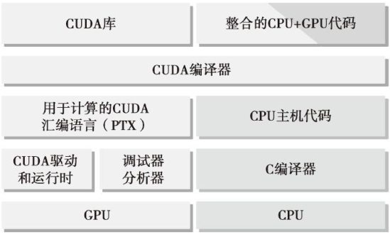

CUDA nvcc编译器是以广泛使用LLVM开源编译系统为基础的。在GPU加速器的支持下，通过使用CUDA编译器SDK，你可以创建或扩展编程语言，如下图1-15所示。

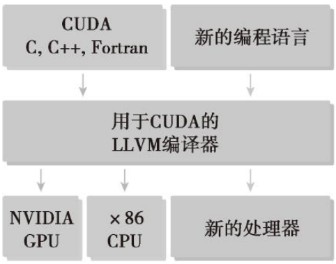

CUDA平台也是支持多样化并行计算生态系统的基础，如图1-16所示。如果你想在GPU上建立你的应用程序，强化GPU性能的最简单方法是使用CUDA工具包（http://developer.nvidia.com/cuda-toolkit），它为C和C++开发人员提供了一个综合的开发环境。CUDA工具包包括编译器、数学库，以及调试和优化应用程序性能的工具。同时提供了代码样例、编程指南、用户手册、API参考文档和其他帮助你入门的文档。


------

### 1.3. 用GPU输出Hello World

如果这是你第一次使用CUDA，在Linux系统中，你可能想使用以下命令来检查CUDA编译器是否正确安装：

```shell
$ which nvcc
/usr/local/cuda/bin/nvcc
```

你还需要检查你的机器上是否安装了GPU加速卡。对此你可以在Linux系统上使用以下命令：

```shell
$ ls -l /dev/nv*

/dev/nvidia0
/dev/nvidia-uvm      
/dev/nvidia-uvm-tools
/dev/nvidiactl
```

现在准备好写你的第一个CUDA C程序。写一个CUDA C程序，你需要以下几个**步骤**：

1. 用专用扩展名.cu来创建一个源文件。
2. 使用CUDA nvcc编译器来编译程序。
3. 从命令行运行可执行文件，这个文件有可在GPU上运行的内核代码。

首先，我们编写一个C语言程序来输出“Hello World”，如下所示：

```c++
#include<cstdio>

int main () {
    printf("Hello World from CPU!\n");
    return 0;
}
```

把代码保存到hello.cu中，然后使用nvcc编译器来编译。CUDA nvcc编译器和gcc编译器及其他编译器有**相似的语义**。

```shell
$ nvcc hello.cu -o hello
$ ./hello
Hello World from CPU!
```

接下来，编写一个内核函数，命名为helloFromGPU，用它来输出字符串“Hello World from GPU！”。

```c++
__global__ void helloFromGPU () {
    printf("Hello World from GPU!\n");
}
```

修饰符`__global__`告诉编译器这个函数将会从**CPU中调用**，然后在**GPU上执行**。用下面的代码启动内核函数。

```C++
helloFromGPU <<<1,10>>> ();
```

**三重尖括号意味着从主线程到设备端代码的调用**。**一个内核函数通过一组线程来执行**，**所有线程执行相同的代码**。三重尖括号里面的参数是**执行配置**，用来说明**使用多少线程**来**执行内核函数**。在这个例子中，有10个GPU线程被调用。

```c++
#include<cstdio>

__global__ void helloFromGPU () {
    printf("Hello World from GPU!\n");
}

int main () {
    printf("Hello World from CPU!\n");
    helloFromGPU <<<1,10>>> ();
    cudaDeviceReset();
    return 0;
}
```

函数`cudaDeviceRest()`用来**显式**地**释放和清空**当前**进程**中与当前**设备**有关的所有**资源**。这句话如果没有，则不能正常的运行，因为这句话包含了**隐式同步**，GPU和CPU执行程序是**异步**的，**核函数调用后成立刻会到主机线程继续return 0**，而不管GPU端核函数是否执行完毕，所以上面的程序就是GPU刚开始执行，CPU已经退出程序了，所以我们要等GPU执行完了，再退出主机线程

如下所示，在nvcc命令行中使用`-arch sm_20`进行编译：

```shell
$ nvcc -arch sm_20 hello.cu -o hello
$ ./hello
```

语句`-arch sm_20`使编译器为 Fermi 架构生成设备代码。运行这个可执行文件，它将输出10条字符串“Hello World from GPU”，每个线程输出1条。

##### CUDA编程结构

一个典型的CUDA编程结构包括5个主要步骤。

1. 分配GPU内存。
2. 从CPU内存中拷贝数据到GPU内存。
3. 调用CUDA内核函数来完成程序指定的运算。
4. 将数据从GPU拷回CPU内存。
5. 释放GPU内存空间。

在hello.cu中，你只看到了第三步：调用内核。本书其他部分的示例代码是完全按照CUDA编程结构来编写的


------

### 1.4. 使用CUDA C编程难度

CPU编程和GPU编程的主要区别是程序员对**GPU架构的熟悉程度**。用**并行思维**进行思考并对GPU架构有了基本的了解，会使你编写规模达到成百上千个核的并行程序，如同写串行程序一样简单。

如果你想编写一个像并行程序一样高效的代码，那么你需要对CPU架构有基本的了解。例如，**数据局部性**在并行编程中是一个非常重要的概念。数据局部性指的是**数据重用**，以**降低内存访问的延迟**。数据局部性有两种基本类型。**时间局部性**是指在相对**较短**的时间段内数据和/或资源的**重用**。**空间局部性**是指在相对**较接近**的存储空间内数据元素的**重用**。现代的CPU架构使用**大容量缓存**来优化具有良好空间局部性和时间局部性的应用程序。设计高效利用CPU缓存的算法是程序员的工作。程序员必须处理低层的缓存优化，但由于线程在底层架构中的安排是透明的，所以这一点程序员是没有办法优化的。

CUDA中有**内存层次**和**线程层次**的概念，使用如下结构，有助于你对线程执行进行更高层次的控制和调度：

- 内存层次结构
- 线程层次结构

例如，在CUDA编程模型中使用的**共享内存**（一个特殊的内存）。共享内存可以视为一个被软件管理的**高速缓存**，通过**为主内存节省带宽**来大幅度提高运行速度。有了共享内存，你可以直接控制代码的数据局部性。


当用ANSI C语言编写一个并行程序时，你需要使用 `pthreads` 或者 `OpenMP` 来显式地组织线程，这两项技术使得在大多数处理器架构以及操作系统中支持并行编程。

当用CUDA C编写程序时，实际上你**只编写了被单个线程调用的一小段串行代码**。GPU处理这个内核函数，然后通过启动成千上万个线程来实现并行化，所有的线程都执行相同的计算。CUDA编程模型提供了一个层次化地组织线程的方法，它直接影响到线程在GPU上的执行顺序。因为CUDA C是C语言的扩展，**通常可以直接将C程序移植到CUDA C程序中**。概念上，剥离代码中的循环后产生CUDA C实现的内核代码。


CUDA抽象了硬件细节，且不需要将应用程序映射到传统图形API上。CUDA核中有3个关键抽象：**线程**组的层次结构，**内存**的层次结构以及**障碍同步**。这3个抽象是最小的一组语言扩展。随着CUDA版本的更新，NVIDIA正在对并行编程进行不断简化。尽管一些人仍然认为CUDA的概念比较低级，但如果稍稍提高抽象级，对你控制应用程序和平台之间的互动关系来说会增加很大难度。如果那样的话，不管你掌握了多少底层架构的知识，你的应用程序的性能都将超出控制。

因此，你的目标应是**学习GPU架构的基础**及**掌握CUDA开发工具和环境**。

------

##### CUDA开发环境

NVIDIA为C和C++开发人员提供了综合的开发环境以创建GPU加速应用程序，包括以下几种。

- NVIDIA Nsight集成开发环境
- CUDA-GDB命令行调试器
- 用于性能分析的可视化和命令行分析器
- CUDA-MEMCHECK内存分析器
- GPU设备管理工具

当你熟悉这些工具的使用之后，你会发现使用CUDA C语言进行编程是非常简单高效的。


------

### 1.5. 总结

随着计算机架构和并行编程模型的发展，逐渐有了现在所用的异构系统。CUDA平台帮助提高了异构架构的性能和程序员的工作效率。

CPU＋GPU的异构系统在高性能计算领域已经成为主流。这种变化使并行设计范例有了根本性转变：在GPU上执行数据并行工作，而在CPU上执行串行和任务并行工作。

作为完整的GPU计算架构，Fermi和Kepler GPU加速器让许多领域的高性能计算水平有了提高。在阅读和理解本书中这些概念后，你会发现，在异构系统中编写一个具有成百上千个核的CUDA程序就像编写一个串行程序那样简单。


------

### 1.6. 习题

1.参考[图1-5](#pic15)，分析以下几种数据划分形式：
（1）对于二维数据，沿x轴进行块划分
（2）对于二维数据，沿y轴进行周期划分
（3）对于三维数据，沿z轴进行周期划分


2.从`hello.cu`中移除`cudaDeviceReset`函数，然后编译运行，看看会发生什么。

> 答：只输出1句。10个线程的hello没有输出

3.用`cudaDeviceSynchronize`函数来替换`hello.cu`中的`cudaDeviceReset`函数，然后编译运行，看看会发生什么。

> 答：输出了11句。

4.参考1.3节，从编译器命令行中移除设备架构标志，然后按照下面的方式进行编译，看看会发生什么。

```shell
$ nvcc hello.cu -o hello
```

> 答：在GTX 960M，没有差别

5.参阅CUDA在线文档（http://docs.nvidia.com/cuda/index.html）。基于“CUDA编译器驱动 NVCC”一节，谈谈nvcc对带有哪些后缀的文件支持编译？

6.为执行核函数的每个线程提供了一个唯一的线程ID，通过内置变量threadIdx.x可以在内核中对线程进行访问。在hello.cu中修改核函数的线程索引，使输出如下：

```shell
$ ./hello
Hello World from CPU!
Hello World from GPU thread 5!
```

> 答：
>
> ```c++
> __global__ void helloFromGPU() {
> int i = threadIdx.x;
> if (i == 5) {
>   printf("Hello World from GPU thread %d!\n", i);
> }     
> }
> ```


------

## 第 2 章 CUDA编程模型 

CUDA是一种通用的并行计算平台和编程模型，是在**C语言基础上扩展**的。借助于CUDA，你可以像编写C语言程序一样实现并行算法。

你可以在NVIDIA的GPU平台上用CUDA为多种系统编写应用程序，范围从嵌入式设备、平板电脑、笔记本电脑、台式机、工作站到HPC集群（高性能计算集群）。


------

### 2.1　CUDA编程模型概述

CUDA 编程模型提供了一个**计算机架构抽象**作为**应用程序和**其可用**硬件**之间的桥梁。图 2-1 说明了**程序**和**编程模型**实现之间的抽象结构的重要。通信抽象是程序与编程模型实现之间的分界线，它通过专业的硬件原语和操作系统的编译器或库来实现。

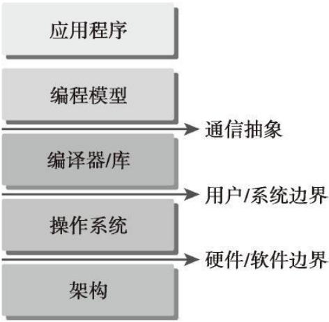

利用编程模型所编写的程序指定了程序的各组成部分是如何共享信息及相互协作的。编程模型从逻辑上提供了一个特定的算机架构，通常它体现在编程语言或编程环境中。

除了与其他并行编程模型共有的抽象外，CUDA 编程模型还利用 GPU 架构的计算能力提供了以下几个特有功能。

- 一种通过层次结构在**GPU中组织线程**的方法
- 一种通过层次结构在**GPU中访问内存**的方法

以程序员的角度可以从以下几个不同的层面来看待并行计算。

- 领域层
- 逻辑层
- 硬件层

在编程与算法设计的过程中，你最关心的应是在**领域层如何解析数据和函数**，以便在并行运行环境中能正确、高效地解决问题。当进入编程阶段，你的关注点应转向如何**组织并发线程**。在这个阶段，你需要从逻辑层面来思考，以确保你的线程和计算能正确地解决问题。在 C 语言并行编程中，需要使用 pthreads 或 OpenMP 技术来显式地管理线程。CUDA 提出了一个线程层次结构抽象的概念，以允许控制线程行为。


------

#### 2.1.1. CUDA编程结构

CUDA编程模型使用由C语言扩展生成的注释代码在异构计算系统中执行应用程序。在一个异构环境中包含多个CPU和GPU，**每个GPU和CPU的内存都由一条PCI-Express总线分隔开**。因此，需要注意区分以下内容。

- 主机：CPU及其内存（主机内存）
- 设备：GPU及其内存（设备内存）

为了清楚地指明不同的内存空间，在本书的示例代码中，主机内存中的变量名以`h_`为前缀，设备内存中的变量名以`d_`为前缀。

从 CUDA 6.0 开始，NVIDIA提出了名为“**统一寻址**”（**Unified Memory**）的编程模型的改进，它**连接了主机内存和设备内存空间**，**可使用单个指针访问CPU和GPU内存**，无须彼此之间手动拷贝数据。现在，重要的是应学会如何为主机和设备**分配内存空间**以及如何在CPU和GPU之间**拷贝共享数据**。这种程序员管理模式控制下的内存和数据可以优化应用程序并实现硬件系统利用率的最大化。

**内核**（kernel）是CUDA编程模型的一个重要组成部分，其代码在GPU上运行。作为一个开发人员，你可以串行执行核函数。在此背景下，CUDA的调度管理程序员在GPU线程上编写核函数。在主机上，基于应用程序数据以及GPU的性能定义如何让设备实现算法功能。这样做的目的是使你专注于算法的逻辑（通过编写串行代码），且在创建和管理大量的GPU线程时不必拘泥于细节。

多数情况下，主机可以独立地对设备进行操作。内核一旦被启动，管理权立刻返回给主机，释放CPU来执行由设备上运行的并行代码实现的额外的任务。CUDA编程模型主要是**异步**的，因此在GPU上进行的运算可以与主机-设备通信重叠。一个典型的CUDA程序包括由并行代码互补的串行代码。如图2-2所示，串行代码（及任务并行代码）在主机CPU上执行，而并行代码在GPU上执行。主机代码按照ANSI C标准进行编写，而设备代码使用CUDA C进行编写。你可以将所有的代码统一放在一个源文件中，也可以使用多个源文件来构建应用程序和库。

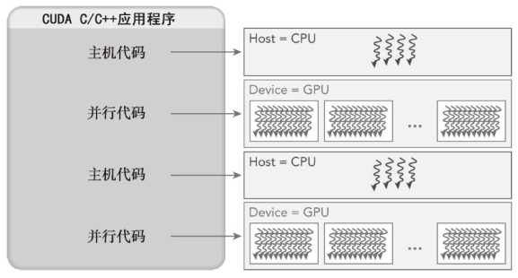

NVIDIA的C编译器（nvcc）为主机和设备生成可执行代码。一个典型的CUDA程序实现流程遵循以下模式。

1. 把数据从**CPU内存拷贝到GPU内存**。
2. 调用**核函数**对存储在**GPU内存**中的数据进行**操作**。
3. 将**数据**从**GPU内存传送回到CPU内存**。

首先，你要学习的是**内存管理及主机和设备之间的数据传输**。


------

#### 2.1.2. 内存管理

CUDA编程模型**假设系统是由一个主机和一个设备组成的**，而且**各自拥有独立的内存**。**核函数**是在**设备**上运行的。为使你拥有充分的控制权并使系统达到最佳性能，CUDA运行时负责**分配与释放设备内存**，**并且在主机内存和设备内存之间传输数据**。表2-1列出了标准的C函数以及相应地针对内存操作的CUDA C函数。

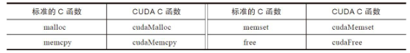

`cudaMalloc`函数用于**执行GPU内存分配**的是 ，其函数原型为：

```c++
cudaError_t cudaMalloc(void** devPtr, size_t size)
```

该函数负责向设备分配一定字节的**线性内存**，并以 `devPtr` 的形式**返回指向所分配内存的指针**。`cudaMalloc` 与标准C语言中的 `malloc` 函数几乎一样，只是此函数在GPU的内存里分配内存。通过充分保持与标准C语言运行库中的接口一致性，可以实现CUDA应用程序的轻松接入。


`cudaMemcpy`函数负责**主机和设备之间的数据传输**，其函数原型为：

```c++
cudaError_t cudaMemcpy(void** dst, void* src, size_t count, cudaMemcpyKind kind)
```

此函数**从** `src` 指向的**源存储区**复制一定数量的字节**到** `dst` 指向的**目标存储区**。复制**方向**由 kind 指定，其中的kind有以下几种。

- `cudaMemcpyHostToHost`
- `cudaMemcpyHostToDevice`
- `cudaMemcpyDecviceToHost`
- `cudaMemcpyDecviceToDecvice`

这个函数以**同步**方式执行，因为在`cudaMemcpy`函数返回以及传输操作完成**之前**主机应用程序是**阻塞**的。除了内核启动之外的CUDA调用都会返回一个错误的枚举类型`cuda Error_t`。如果GPU内存分配成功，函数返回：`cudaSuccess`。否则返回：`cudaErrorMemoryAllocation`。可以使用以下CUDA运行时函数将错误代码转化为可读的错误消息：

```c++
char* cudaGetErrorString(cudaError_t error)
```

`cudaGetErrorString` 函数和C语言中的 `strerror` 函数类似。

CUDA编程模型从GPU架构中抽象出一个内存层次结构。下图2-3所示的是一个简化的GPU内存结构，它主要包含两部分：**全局内存**和**共享内存**。

------

##### 内存层次结构

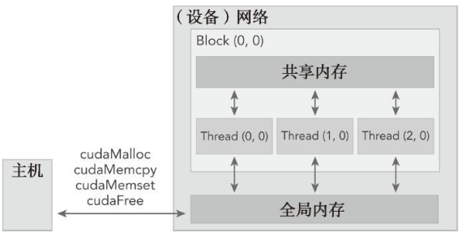

CUDA 编程模型最显著的一个特点就是**揭示了内存层次结构**。每一个 GPU 设备都有用于不同用途的存储类型。在GPU 内存层次结构中，最主要的两种内存是**全局内存**和**共享内存**。**全局**类似于 CPU 的**系统内存**，而**共享**内存类似于 CPU 的**缓存**。然而 GPU 的共享内存可以由 CUDA C 的内核直接控制。

下面，我们将通过一个简单的两个数组相加的例子来学习如何在**主机和设备之间进行数据传输**，以及如何使用CUDA C 编程。如图2-4所示，数组 a 的第一个元素与数组 b 的第一个元素相加，得到的结果作为数组 c 的第一个元素，重复这个过程直到数组中的所有元素都进行了一次运算。

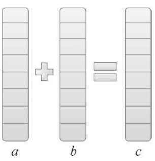

首先，执行主机端代码使两个数组相加（如代码清单2-1所示）。

```c++
//代码清单2-1　sumArraysOnHost.c
#include<stdlib.h>
#include<string.h>
#include<time.h>

void sumArraysOnHost(float *A, float *B, float *C, const int N) {
    for (int idx = 0; idx < N; idx++) {
        C[idx] = A[idx] + B[idx];
    }
}

void initialData(float *ip, int size) {
    //generate different seed for random number
    time_t t;
    srand( (unsigned int) time(&t) );
    
    for (int i = 0; i< size; ++i) {
        ip[i] = (float)(rand() & 0xFF) / 10.0f;
    }
}

int main(int argc, char **argv){
    int nElem = 1024;
    size_t nBytes = nElem * sizeof(float);
    
    float *h_A, *h_B, *h_C;
    h_A = (float *)malloc(nBytes);
    h_B = (float *)malloc(nBytes);
    h_C = (float *)malloc(nBytes);
    
    initialData(h_A, nElem);
    initialData(h_B, nElem);
    
    sumArraysOnHost(h_A, h_B, h_C, nElem);
    
    free(h_A);
    free(h_B);
    free(h_C);
    
    return 0;
}
```


这是一个纯C语言编写的程序，你可以用C语言编译器进行编译，也可以像下面这样用nvcc进行编译。

```shell
$ nvcc -Xcompiler -std=c99 sumArraysOnHost.c -o sum
$ ./sum
```

`nvcc` 封装了几种内部编译工具，CUDA 编译器允许通过命令行选项在不同阶段启动不同的工具完成编译工作。`-Xcompiler`用于指定命令行选项是指向C编译器还是预处理器。在前面的例子中，将 `-std=c99` 传递给编译器，因为这里的C程序是按照 **C99** 标准编写的。你可以在CUDA编译器文件中找到[编译器选项 ](https://docs.nvidia.com/cuda/cuda-compiler-driver-nvcc/index.html#nvcc-command-options)。

现在，你可以在GPU上修改代码来进行数组加法运算，用`cudaMalloc`在GPU上**申请内存**。

```C++
float *d_A, *d_B, *d_C;
cudaMalloc((float**) &d_A, nBytes);
cudaMalloc((float**) &d_B, nBytes);
cudaMalloc((float**) &d_C, nBytes);
```

使用`cudaMemcpy`函数把**数据**从**主机**内存**拷贝**到**GPU**的全局内存中，参数 `cudaMemcpyHostToDevice` 指定数据拷贝方向。

```c++
cudaMemcpy(d_A, h_A, nBytes, cudaMemcpyHostToDevice);
cudaMemcpy(d_B, h_B, nBytes, cudaMemcpyHostToDevice);
```

当**数据**被转移到GPU的**全局内存**后，主机端调用**核函数**在GPU上进行数组求和。**一旦内核被调用，控制权立刻被传回主机**，这样的话，**当核函数在GPU上运行时，主机可以执行其他函数**。因此，内核与主机是**异步**的。

当内核在GPU上完成了对所有数组元素的处理后，其结果将以数组 d_C 的形式存储在GPU的**全局内存**中，然后用`cudaMemcpy` 函数把结果从GPU复制回到主机的数组 `gpuRef` 中。

```c++
cudaMemcpy(gpuRef, d_C, nBytes, cudaMemcpyDeviceToHost);
```

`cudaMemcpy` 的调用会导致主机运行阻塞。`cudaMemcpyDeviceToHost` 的作用就是将存储在GPU上的数组 `d_c` 中的结果复制到`gpuRef`中。最后，调用`cudaFree`释放GPU的内存。

```c++
cudaFree(d_A);
cudaFree(d_B);
cudaFree(d_C);
```


------

##### 不同的存储空间

使用CUDA C进行编程的人**最常犯的错误**就是对**不同内存空间**的**不恰当引用**。对于在GPU上被分配的内存来说，**设备指针在主机代码中可能并没有被引用**。如果你执行了错误的内存分配，如：

```c++
gpuRef = d_C
```

而不是用：

```c++
cudaMemcpy(gpuRef, d_C, nBytes, cudaMemcpyDeviceToHost);
```

应用程序在运行时将会崩溃。为了避免这类错误，CUDA 6.0提出了**统一寻址**，使用一个指针来访问CPU和GPU的内存。见第四章。


------

#### 2.1.3. 线程管理

当**核函数在主机端启动**时，它的**执行**会**移动到设备**上，此时**设备**中会产生**大量的线程**并且**每个线程都执行**由核函数指定的语句。了解如何**组织线程**是CUDA编程的一个关键部分。CUDA明确了线程层次抽象的概念以便于你组织线程。这是一个两层的线程层次结构，由**线程块**和**线程块网格**构成，如下图2-5所示。

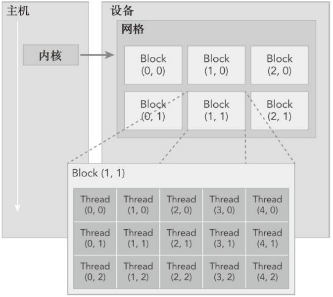

由一个内核启动所产生的所有线程统称**为一个网格**。**同一网格**中的所有线程**共享**相同的**全局内存空间**。一个网格由**多个线程块**构成，**一个线程块包含一组线程**，同一线程块内的线程协作可以通过以下方式来实现。

- 同步
- 共享内存

不同块内的线程不能协作。线程依靠以下两个坐标变量来区分

- `blockIdx`（线程块在线程格内的索引）
- `threadIdx`（块内的线程索引）

这些变量是**核函数**中**需要预初始化**的**内置变量**。当执行一个核函数时，CUDA 运行时为每个线程分配坐标变量`blockIdx` 和 `threadIdx`。基于这些坐标，你可以将部分数据分配给不同的线程。


该坐标变量是基于 `uint3` 定义的CUDA内置的向量类型，是一个包含**3个无符号整数**的结构，可以通过`x、y、z`三个字段来指定。

```c++
blockIdx.x
blockIdx.y
blockIdx.z
threadIdx.x
threadIdx.y
threadIdx.z
```

CUDA可以组织三维的网格和块。上图2-5展示了一个线程层次结构的示例，其结构是一个包含二维块的二维网格。网格和块的维度由下列两个内置变量指定。

- `blockDim`（线程块的维度，用每个线程块中的线程数来表示）
- `gridDim`（线程格的维度，用每个线程格中的线程数来表示）

它们是 `dim3` 类型的变量，是基于 `uint3` 定义的整数型向量，用来表示维度。当定义一个 `dim3` 类型的变量时，所有未指定的元素都被初始化为 `1`。`dim3` 类型变量中的每个组件可以通过它的 `x、y、z` 字段获得。如下所示。

```c++
blockDim.x
blockDim.y
blockDim.z
```


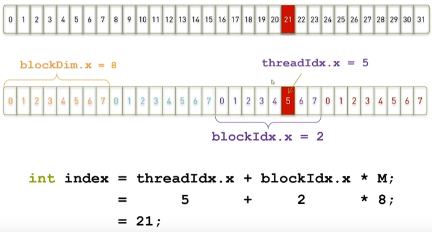


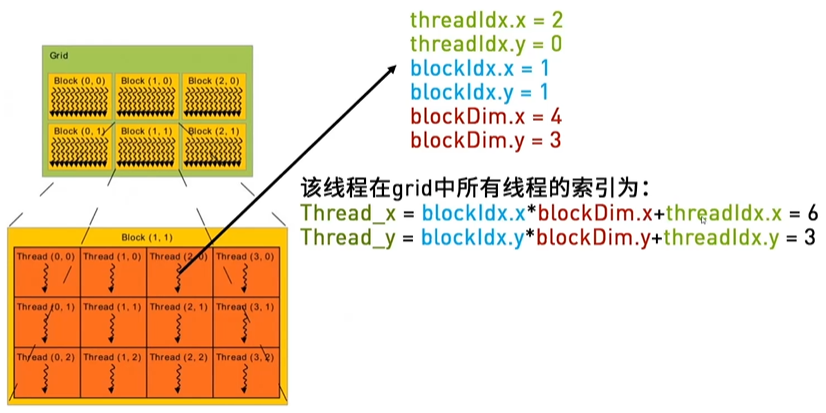


------

##### 网格和线程块的维度

通常，一个**线程格**会被组织成**线程块**的**二维数组**形式，一个**线程块**会被组织成**线程的三维数组**形式。

线程格和线程块均使用 3 个 `dim3` 类型的无符号整型字段，而未使用的字段将被初始化为1且忽略不计。

在CUDA程序中有两组不同的网格和块变量：**手动定义**的dim3数据类型和**预定义**的 `uint3` 数据类型。在主机端，作为内核调用的一部分，你可以使用 `dim3` 数据类型定义一个网格和块的维度。当执行核函数时，CUDA运行时会生成相应的内置预初始化的网格、块和线程变量，它们在核函数内均可被访问到且为 `unit3`类型。**手动定义**的`dim3` 类型的网格和块变量**仅在主机端可见**，而 `unit3` 类型的**内置预初始化**的网格和块变量**仅在设备端可见**。

你可以通过代码清单2-2来验证这些变量如何使用。首先，定义程序所用的数据大小，为了对此进行说明，我们定义一个较小的数据。

```c++
int nElem = 6;
```

接下来，定义**块的尺寸**并基于块和数据的大小**计算网格尺寸**。在下面的例子中，定义了一个包含 **3 个线程的一维线程块**，以及一个基于块和数据大小定义的一定数量线程块的一维线程网格。

```c++
dim3 block(3);
dim3 grid((nElem + block.x - 1) / block.x);
```

你会发现网格大小是块大小的倍数。在下一章中你会了解必须这样计算网格大小的原因。以下主机端上的程序段用来检查网格和块维度。

```c++
printf("grid.x: %d grid.y: %d grid.z: %d\n", grid.x, grid.y, grid.z);
printf("block.x: %d block.y: %d block.z: %d\n", block.x, block.y, block.z);
```

在核函数中，每个线程都输出自己的线程索引、块索引、块维度和网格维度。

```c++
printf("threadIdx: (%d, %d, %d) blockIdx: (%d, %d, %d) blockDim: (%d, %d, %d) gridDim: (%d, %d, %d)\n", threadIdx.x, threadIdx.y, threadIdx.z, blockIdx.x, blockIdx.y, blockIdx.z, blockDim.x, blockDim.y, blockDim.z, gridDim.x, gridDim.y, gridDim.z);
```

把代码合并保存成名为 `checkDimension.cu` 的文件，如代码清单2-2所示。

```c++
//代码清单2-2　检查网格和块的索引和维度（checkDimension.cu）
#include <cuda_runtime.h>
#include <stdio.h>

__global__ void checkIndex(void) {
    printf("threadIdx: (%d, %d, %d) blockIdx: (%d, %d, %d) blockDim: (%d, %d, %d) gridDim: (%d, %d, %d)\n", threadIdx.x, threadIdx.y, threadIdx.z, blockIdx.x, blockIdx.y, blockIdx.z, blockDim.x, blockDim.y, blockDim.z, gridDim.x, gridDim.y, gridDim.z);
}

int main(int argc, char **argv) {
    //define total data element
    int nElem = 6;
    
    //define grid and block structure
    dim3 block(3);
    dim3 grid ((nElem + block.x - 1) / block.x);
    
    //check grid and block dimension from host side
    printf("grid.x: %d grid.y: %d grid.z: %d\n", grid.x, grid.y, grid.z);
	printf("block.x: %d block.y: %d block.z: %d\n", block.x, block.y, block.z);
    
    //check grid and block dimension from device side
    checkIndex <<<grid, block>>> ();
    
    //reset device before you leave
    cudaDeviceRest();
    
    return 0;
}
```

现在开始编译和运行这段程序：

```shell
$ nvcc -arch=sm_20 checkDimension.cu -o check
$ ./check
```

因为 `printf` 函数只支持 `Fermi` 及以上版本的 `GPU` 架构，所以必须添加 `-arch=sm_20` 编译器选项。默认情况下，`nvcc` 会产生支持最低版本GPU架构的代码。这个应用程序的运行结果如下。可以看到，每个线程都有自己的坐标，所有的线程都有相同的块维度和网格维度。

```c++
grid.x: 2 grid.y: 1 grid.z: 1
block.x: 3 block.y: 1 block.z: 1
threadIdx: (0, 0, 0) blockIdx: (1, 0, 0) blockDim: (3, 1, 1) gridDim: (2, 1, 1)
threadIdx: (1, 0, 0) blockIdx: (1, 0, 0) blockDim: (3, 1, 1) gridDim: (2, 1, 1)
threadIdx: (2, 0, 0) blockIdx: (1, 0, 0) blockDim: (3, 1, 1) gridDim: (2, 1, 1)
threadIdx: (0, 0, 0) blockIdx: (0, 0, 0) blockDim: (3, 1, 1) gridDim: (2, 1, 1)
threadIdx: (1, 0, 0) blockIdx: (0, 0, 0) blockDim: (3, 1, 1) gridDim: (2, 1, 1)
threadIdx: (2, 0, 0) blockIdx: (0, 0, 0) blockDim: (3, 1, 1) gridDim: (2, 1, 1)
```


------

##### 从主机端和设备端访问网格/块变量

**区分主机端和设备端**的网格和块变量的访问是很重要的。例如，声明一个**主机端**的**块变量**，你按如下定义它的坐标并对其进行访问：

```c++
block.x , block.y , block.z 
```

在**设备端**，你已经预定义了**内置块变量的大小**：

```c++
blockDim.x , blockDim.y , blockDim.z 
```

总之，在启动内核之前就定义了主机端的网格和块变量，并从主机端通过由 `x、y、z` 三个字段决定的矢量结构来访问它们。当内核启动时，可以使用内核中预初始化的内置变量。

对于一个给定的数据大小，确定网格和块尺寸的一般步骤为：

- 确定块的大小
- 在已知数据大小和块大小的基础上计算网格维度

要确定块尺寸，通常需要考虑：

- 内核的性能特性
- GPU资源的限制

代码清单2-3使用了一个一维网格和一个一维块来说明当块的大小改变时，网格的尺寸也会随之改变。

```c++
//Define grid and block dimensions on the host (defineGridBlock.cu)
#include <cuda_runtime.h>
#include <stdio.h>

int main(int argc, char **argv) {
    //define total data elements
    int nElem = 1024;
    
    //define grid and block structure
    dim3 block (1024);
    dim3 grid  ((nElem + block.x - 1) / block.x);
    printf("gird.x %d, block.x %d \n", grid.x, block.x);

    //reset block structure
    block.x = 512;
    grid.x = ((nElem + block.x - 1) / block.x);
    printf("gird.x %d, block.x %d \n", grid.x, block.x);
    
    //reset block structure
    block.x = 256;
    grid.x = ((nElem + block.x - 1) / block.x);
    printf("gird.x %d, block.x %d \n", grid.x, block.x);
    
    //reset block structure
    block.x = 128;
    grid.x = ((nElem + block.x - 1) / block.x);
    printf("gird.x %d, block.x %d \n", grid.x, block.x);
    
    //reset device
    cudaDeviceReset();
    
    return 0;
}
```

用下列命令编译和运行这段程序：

```shell
$ nvcc defineGridBlock.cu -o block
$ ./block
```

下面是一个输出示例。由于应用程序中的数据大小是固定的，因此当块的大小发生改变时，相应的网格尺寸也会发生改变。

```c++
gird.x 1, block.x 1024 
gird.x 2, block.x 512 
gird.x 4, block.x 256 
gird.x 8, block.x 128 
```


------

##### 线程层次结构

CUDA的特点之一就是通过编程模型揭示了一个**两层的线程层次结构**。由于一个内核启动的网格和块的维数会影响性能，这一结构为程序员优化程序提供了一个额外的途径。

**网格和块的维度**存在几个限制因素，对于块大小的一个主要限制因素就是**可利用的计算资源**，如**寄存器，共享内存**等。某些限制可以通过查询GPU设备撤回。

网格和块从逻辑上代表了一个核函数的线程层次结构。在第3章中，你会发现这种线程组织方式能使你在不同的设备上有效地执行相同的程序代码，而且每一个线程组织具有不同数量的计算和内存资源。


------

#### 2.1.4. 启动一个CUDA核函数

你应该对下列C语言函数调用语句很熟悉：

```c++
function_name(argument list);
```

CUDA**内核调用**是对C语言函数调用语句的延伸，`<<<>>>`运算符内是**核函数**的**执行配置**。

```c++
kernel_name <<<grid, block>>>(argument list);
```

正如上一节所述，CUDA编程模型揭示了线程层次结构。利用执行配置可以指定线程在GPU上调度运行的方式。执行配置的第一个值是**网格维度**，也就是**启动块的数目**。第二个值是**块维度**，也就是**每个块中线程的数目**。通过指定网格和块的维度，你可以进行以下配置：

- 内核中使用的线程布局
- 内核中线程的数目

**同一个块中的线程之间可以相互协作**，不同块内的线程不能协作。对于一个给定的问题，可以使用不同的网格和块布局来组织你的线程。例如，假设你有 32 个数据元素用于计算，每 8 个元素一个块，需要启动 4 个块：

```c++
kernel_name <<<4,8>>>(argument list);
```

下图2-6表明了上述配置下的线程布局。

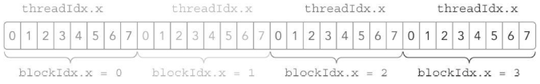

由于数据在全局内存中是**线性存储**的，因此可以用变量 `blockIdx.x` 和 `threadId.x` 来进行以下操作。

- 在网格中标识一个唯一的线程
- 建立线程和数据元素之间的映射关系

如果把所有32个元素放到一个块里，那么只会得到一个块：

```c++
kernel_name <<<1,32>>>(argument list);
```

如果每个块只含有一个元素，那么会有32个块：

```c++
kernel_name <<<32,1>>>(argument list);
```

核函数的调用与主机线程是异步的。核函数调用结束后，控制权立刻返回给主机端。你可以调用以下函数来**强制主机端程序等待所有的核函数执行结束**：(**显式同步**)

```c++ 
cudaError_t cudaDeviceSynchronize(void)
```

一些CUDA运行时`API`在主机和设备之间是隐式同步的。当使用 `cudaMemcpy` 函数在主机和设备之间拷贝数据时，主机端**隐式同步**，即主机端程序必须等待数据拷贝完成后才能继续执行程序。

```C++
cudaError_t cudaMemcpy(void* dst, const void* src, size_t count, cudaMemcpyKind kind);
```

之前所有的核函数调用完成后开始拷贝数据。当拷贝完成后，控制权立刻返回给主机端。


##### 异步行为

不同于C语言的函数调用，所有的CUDA**核函数的启动都是异步的**。**CUDA内核调用完成后，控制权立刻返回给CPU**。


------

#### 2.1.5. 编写核函数

核函数是在**设备端执行的代码**。在核函数中，需要为**一个线程规定要进行的计算以及要进行的数据访问**。当核函数被调用时，许多不同的CUDA线程并行执行同一个计算任务。以下是用`__global__`声明定义核函数：

```c++
__global__ void kernel_name(argument list);
```

核函数**必须有一个void返回类型**。

下表2-2总结了CUDA C程序中的函数类型限定符。函数类型限定符指定一个函数在主机上执行还是在设备上执行，以及可被主机调用还是被设备调用。

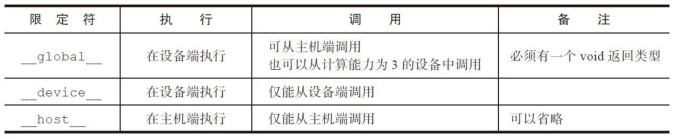

`__device__`和`__host__`限定符可以一齐使用，这样函数可以同时在主机和设备端进行编译。

##### CUDA核函数的限制

以下限制适用于所有核函数：

- 只能访问设备内存
- 必须具有void返回类型
- 不支持可变数量的参数
- 不支持**静态**变量
- **显式异步**行为

考虑一个简单的例子：将两个大小为N的向量A和B相加，主机端的向量加法的C代码如下：

```c++
void sumArraysOnHost(float *A, float *B, float *C, const int N) {
    for(int i = 0; i < N; i++) {
        C[i] = A[i] + B[i];
    }
}
```

这是一个迭代 N 次的串行程序，循环结束后将产生以下核函数：

```c++
__global__ void sumArraysOnGPU(float *A, float *B, float *C) {
    int i = threadIdx.x;
    C[i] = A[i] + B[i];
}
```

C函数和核函数之间有什么不同？你可能已经注意到**循环体消失了**，**内置的线程坐标变量替换了数组索引**，由于 N是被隐式定义用来启动 N 个线程的，所以 N 没有什么参考价值。

假设有一个长度为32个元素的向量，你可以按以下方法用32个线程来调用核函数：

```c++
sumArraysOnGPU<<<1,32>>>(float *A, float *B, float *C);
```


------

#### 2.1.6. 验证核函数

既然你已经编写了核函数，你如何能知道它是否正确运行？你需要一个主机函数来验证核函数的结果。

```c++
void checkResult(float *hostRef, float *gpuRef, const int N) {
    double epsilon = 1.0e-8;
    int match = 1;
    for (int i = 0; i < M; i++) {
        if (abs(hostRef[i] - gpuRef[i] > epsilon) {
            match = 0;
            printf("Arrays do not match! \n");
            printf("host %5.2f ,gpu %5.2f at current %d\n", hostRef[i], gpuRef[i], i);
        	break;
        }
    }
    if (match) printf("Arrays match.\n");
}
```


##### 验证核函数代码

除了许多可用的调试工具外，还有两个非常简单实用的方法可以验证核函数。

首先，你可以在Fermi及更高版本的设备端的核函数中使用`printf`函数。

其次，可以将执行参数设置为`<<<1,1>>>`，因此强制用一个块和一个线程执行核函数，这模拟了串行执行程序。这对于调试和验证结果是否正确是非常有用的，而且，如果你遇到了运算次序的问题，这有助于你对比验证数值结果是否是按位精确的。


------

#### 2.1.7. 处理错误

由于许多CUDA调用是异步的，所以有时可能很难确定某个错误是由哪一步程序引起的。定义一个**错误处理宏**封装所有的CUDA API调用，这简化了错误检查过程：

```C++
#define CHECK(call)
{
    const cudaError_t error = call;
    if (error != cudaSuccess) {
        printf("Error: %s:%d", __FILE__, __LINE__);
        printf("code:%d, reason:%s\n", error, cudaGetErrorString(error));
        exit(1);
    }
}
```

例如，你可以在以下代码中使用宏：

```c++
CHECK(cudaMemcpy(d_C, gpuRef, nBytes, cudaMemcpyHostToDevice));
```

如果内存拷贝或之前的异步操作产生了错误，这个宏会报告错误代码，并**输出一个可读信息**，然后**停止程序**。也可以用下述方法，在核函数调用后检查核函数错误：

```c++
kernel_function<<<gird,block>>>(argument list);
CHECK(cudaDeviceSynchronize());
```

`CHECK(cudaDeviceSynchronize())`会**阻塞主机端线程的运行直到设备端所有的请求任务都结束**，并确保最后的核函数启动部分不会出错。以上仅是以调试为目的的，因为在核函数启动后添加这个检查点会阻塞主机端线程，使该检查点成为全局屏障。


------

#### 2.1.8. 编译和执行

现在把所有的代码放在一个文件名为`sumArraysOnGPU-small-case.cu`的文件中，如代码清单2-4所示。

```C++
//代码清单2-4　基于GPU的向量加法（sumArraysOnGPU-small-case.cu）
#include <cuda_runtime.h>
#include <stdio.h>

#define CHECK(call)                                                         \
{                                                                           \
    const cudaError_t error = call;                                         \
    if (error != cudaSuccess)                                               \
    {                                                                       \
        printf("Error: %s:%d, ", __FILE__, __LINE__);                       \
        printf("code:%d, reason: %s\n", error, cudaGetErrorString(error));  \
        exit(1);                                                            \
    }                                                                       \
}                                                                           \


void checkResult(float *hostRef, float *gpuRef, const int N) {
    double epsilon = 1.0e-8;
    int match = 1;
    for (int i = 0; i < N; i++) {
        if (abs(hostRef[i] - gpuRef[i] > epsilon)) {
            match = 0;
            printf("Arrays do not match! \n");
            printf("host %5.2f ,gpu %5.2f at current %d\n", hostRef[i], gpuRef[i], i);
        	break;
        }
    }
    if (match) printf("Arrays match.\n");
}
            
void initialData(float *ip,int size) {   // generate different seed for random number   
    time_t t;   
    srand((unsigned) time(&t));
    for (int i=0; i<size; i++) {      
        ip[i] = (float)( rand() & 0xFF )/10.0f;   
    } 
}
            
void sumArraysOnHost(float *A, float *B, float *C, const int N) {   
    for (int idx=0; idx<N; idx++)     
        C[idx] = A[idx] + B[idx]; 
}

__global__ void sumArraysOnGPU(float *A, float *B, float *C) {   
    int i = threadIdx.x;   
    C[i] = A[i] + B[i]; 
}
            
int main(int argc, char **argv) {
	printf("%s Starting...\n", argv[0]);
    
	// set up device   
    int dev = 0;   
    cudaSetDevice(dev);
    
    // set up data size of vectors   
    int nElem = 32;   
    printf("Vector size %d\n", nElem);
    
    // malloc host memory   
    size_t nBytes = nElem * sizeof(float);
    float *h_A, *h_B, *hostRef, *gpuRef;   
    h_A     = (float *)malloc(nBytes);   
    h_B     = (float *)malloc(nBytes);   
    hostRef = (float *)malloc(nBytes);   
    gpuRef  = (float *)malloc(nBytes);
    
    // initialize data at host side   
    initialData(h_A, nElem);   
    initialData(h_B, nElem);
    memset(hostRef, 0, nBytes);   
    memset(gpuRef,  0, nBytes);
    
    // malloc device global memory   
    float *d_A, *d_B, *d_C;   
    cudaMalloc((float**)&d_A, nBytes);   
    cudaMalloc((float**)&d_B, nBytes);   
    cudaMalloc((float**)&d_C, nBytes);
    
    // transfer data from host to device   
    cudaMemcpy(d_A, h_A, nBytes, cudaMemcpyHostToDevice);   
    cudaMemcpy(d_B, h_B, nBytes, cudaMemcpyHostToDevice);
    
    // invoke kernel at host side   
    dim3 block (nElem);   
    dim3 grid  (nElem/block.x);
    sumArraysOnGPU<<<grid, block>>>(d_A, d_B, d_C);   
    printf("Execution configuration <<<%d, %d>>>\n",grid.x,block.x);
    
    // copy kernel result back to host side   
    cudaMemcpy(gpuRef, d_C, nBytes, cudaMemcpyDeviceToHost);
    
    // add vector at host side for result checks   
    sumArraysOnHost(h_A, h_B, hostRef, nElem);
    
    // check device results   
    checkResult(hostRef, gpuRef, nElem);
    
    // free device global memory   
    cudaFree(d_A);   
    cudaFree(d_B);   
    cudaFree(d_C);
    
    // free host memory   
    free(h_A);   
    free(h_B);   
    free(hostRef);   
    free(gpuRef);
    
    return 0;
}
```

在这段代码中，向量大小被设置为32，如下所示：

```c++
int nElem = 32
```

执行配置被放入一个块内，其中包含32个元素：

```c++
dim3 block (nElem);   
dim3 grid  (nElem/block.x);
```

使用以下命令编译和执行该代码：

```shell
$ nvcc sumArraysOnGPU-small-case.cu -o addvector
$ ./addvector
```

系统报告结果如下：

```c++
./addvector Starting...
Vector size 32
Execution configuration <<<1, 32>>>
Arrays match.
```

如果你将执行配置重新定义为32个块，每个块只有一个元素，如下所示：

```c++
dim3 block (1);   
dim3 grid  (nElem);
```

那么就需要在代码清单2-4中对核函数`sumArraysOnGPU`进行修改：用`int i = threadIdx.x`；替换`int i = blockIdx.x`；一般情况下，可以基于给定的一维网格和块的信息来计算全局数据访问的唯一索引：

```c++
__global__ void sumArraysOnGPU(float *A, float *B, float *C) {   
    int i = blockIdx.x * blockDim.x + threadIdx.x;   
    C[i] = A[i] + B[i]; 
}
```

你需要确保一般情况下进行更改所产生结果的正确性。


------

### 2.2 给核函数计时

在内核的性能转换过程中，了解核函数的执行需要多长时间是很有帮助并且十分关键的。衡量核函数性能的方法有很多。最简单的方法是在**主机端**使用一个CPU或GPU**计时器**来计算内核的执行时间。在本节，你需要**设置一个CPU计时器**，并学习**使用NVIDIA分析工具**来计算执行时间。


------

#### 2.2.1 用CPU计时器计时

可以使用 `gettimeofday` 系统调用来创建一个CPU计时器，以获取系统的时钟时间，它将返回自1970年1月1日零点以来，到现在的秒数。程序中需要添加 `sys/time.h` 头文件，包括结构体 `timeval` 如代码清单2-5所示。

```c++
/*  
	struct timeval {
        long    tv_sec;     代表多少秒   
        long    tv_usec;    代表多少微秒 1000000 微秒 = 1秒 
	};
*/

double cpuSecond() {
    struct timeval tp; // 
    gettimeofday(&tp, NULL);
    
    return ((double)tp.tv_sec + (double)tp.tv_usec * 1.e-6); 
    
}
```

可以用 `cpuSecond` 函数来测试你的核函数：

```C++
double iStart = cpuSecond();
kernel_name<<<grid, block>>>(argument list);
cudaDeviceSynchronize();
double iElaps = cpuSecond() - iStart;
```

由于核函数调用与主机端程序是**异步**的，你需要用 `cudaDeviceSynchronize` 函数来等待所有的GPU线程运行结束。变量 `iElaps` 表示程序运行的时间，就像你用手表记录的核函数的执行时间（用秒计算）。

现在，通过设置数据集大小来对一个有16M个元素的**大向量**进行测试：

```c++
int nElem = 1<<24;
```

由于GPU的可扩展性，你需要借助**块和线程的索引**来计算一个**按行优先**的数组索引 `i`，并对核函数进行修改，添加限定条件 `i＜N` 来检验索引值是否越界，如下所示：

```c++
__global__ void sumArraysOnGPU(float *A, float *B, float *C, const int N) {
    int i = blockIdx.x * blockDim.x + threadIdx.x;
    if (i < N) C[i] = A[i] + B[i];
}
```

有了这些更改，可以使用不同的执行配置来衡量核函数。为了解决**创建的线程总数大于向量元素总数**的情况，你需要**限制内核不能非法访问全局内存**，如下图2-7所示

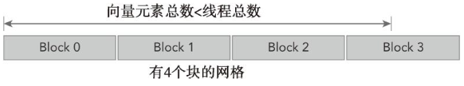

代码清单 2-5 展示了如何在主函数中用CPU计时器测试向量加法的核函数。

```c++
//代码清单2-5　测试向量加法的核函数 sumArraysOnGPU-timer.cu
#include <cuda_runtime.h>
#include <stdio.h>
#include <sys/time.h>

int main(int argc, char **argv) {
    printf("%s Staring...\n", argv[0]);
    
    //set up device 设置设备
    int dev = 0;
    cudaDeviceProp deviceProp; // cudaDeviceProp数据类型针对函式cudaGetDeviceProperties定义的，cudaGetDeviceProperties函数的功能是取得支持GPU计算装置的相关属性，比如支持CUDA版本号装置的名称、内存的大小、最大的thread数目、执行单元的频率等。
    CHECK(cudaGetDeviceProperties(&deviceProp, dev));  // 获取 CUDA 设备的属性
    printf("Using Devices %d: %s\n", dev, deviceProp.name);
    CHECK(cudaSetDevice(dev));                         //设置 CUDA 设备以供GPU执行使用
    
    // set up date size of vectors
    int nElem = 1<<24; //左移24位
    printf("Vector size %d\n", nElem);
    
    // malloc host memory
    size_t nBytes = nElem * sizeof(float);
    float *h_A, *h_B, *hostRef, *gpuRef;
    h_A     = (float *)malloc(nBytes);
    h_B     = (float *)malloc(nBytes);
    hostRef = (float *)malloc(nBytes);
    gpuRef  = (float *)malloc(nBytes);
    
    double iStart,iElaps;
    // initialize data at host side   
    iStart = cpuSecond();
    initialData (h_A, nElem);
    initialData (h_B, nElem);
    iElaps = cpuSecond() - iStart;
    
    memset(hostRef, 0, nBytes);
    memset(gpuRef,  0, nBytes);
    
    // add vector at host side for result checks
    iStart = cpuSecond();
    sumArraysOnHost (h_A, h_B, hostRef, nElem);
    iElaps = cpuSecond() - iStart;
    
    // malloc device global memory   
    float *d_A, *d_B, *d_C;
    cudaMalloc((float**)&d_A, nBytes);
    cudaMalloc((float**)&d_B, nBytes);
    cudaMalloc((float**)&d_C, nBytes);

    // transfer data from host to device
    cudaMemcpy(d_A, h_A, nBytes, cudaMemcpyHostToDevice);
    cudaMemcpy(d_B, h_B, nBytes, cudaMemcpyHostToDevice);
    
    // invoke kernel at host side
    int iLen = 1024;
    dim3 block (iLen);
    dim3 grid  ((nElem + block.x - 1) / block.x);
    iStart = cpuSecond();
    sumArraysOnGPU <<<grid, block>>>(d_A, d_B, d_C,nElem);
    cudaDeviceSynchronize();
    iElaps = cpuSecond() - iStart;
    printf("sumArraysOnGPU <<<%d,%d>>> Time elapsed %f" \    "sec\n", grid.x, block.x, iElaps);
    
    // copy kernel result back to host side
    cudaMemcpy(gpuRef, d_C, nBytes, cudaMemcpyDeviceToHost);
    
    // check device results
    checkResult(hostRef, gpuRef, nElem);
    
    // free device global memory   
    cudaFree(d_A);
    cudaFree(d_B);
    cudaFree(d_C);
    
    // free host memory   
    free(h_A);
    free(h_B);
    free(hostRef);
    free(gpuRef);
    
    return 0;
}
```


默认的执行配置被设置为一个包含 16384 个块的一维网格，每个块包含 1024 个线程。用以下命令编译并运行程序：

```shell
$ nvcc sumArraysOnGPU-timer.cu -o sumArraysOnGPU-timer
$ ./sumArraysOnGPU-timer
```

在基于英特尔Sandy Bridge架构的系统上进行测试，从代码清单2-5的示例中可以看出，在GPU上进行的向量加法的运算速度是在CPU上运行向量加法的 3.86 倍。

```shell
$ ./sumArraysOnGPU-timer

```


把块的维度减少到512可以创建32768个块。在这个新的配置下，内核的性能提升了 1.19 倍。

```C++
sumArraysOnGPU <<<35768, 512>>>
```

如果进一步将块的维度降低到256，系统将提示以下错误信息，信息表示块的总数超过了一维网格的限制。

```shell
$ ./sumArraysOnGPU-timer
```


------

##### 了解自身局限性

在调整执行配置时需要了解的一个关键点是**对网格和块维度的限制**。线程层次结构中每个层级的**最大尺寸取决于设备**。
CUDA提供了通过查询GPU来了解这些限制的能力。在本章的 2.4 节有详细的介绍。对于Fermi设备，每个块的最大线程数是 1024，且网格的 `x、y、z` 三个方向上的维度最大值是 65535。


------

#### 2.2.2 用nvprof工具计时

自CUDA 5.0以来，NVIDIA提供了一个名为 `nvprof` 的命令行分析工具，可以帮助从应用程序的CPU和GPU活动情况中获取时间线信息，其包括**内核执行**、**内存传输**以及**CUDA API的调用**。其用法如下。

```shell
$ nvprof [nvprof_args] <application> [application_args]
```

可以使用以下命令获取更多关于nvprof的帮助信息：

```shell
$ nvprof --help
```

你可以用如下命令去测试内核：

```shell
$ nvpro ./sumArraysOnGPU-timer
```


`nvprof` 的输出结果会因你使用的GPU类型不同而有所差异。以下结果是从Tesla GPU中得到的：


以上结果的前半部分来自于程序的输出，后半部分来自于 `nvprof` 的输出。可以注意到，CPU计时器显示消耗的内核时间为3.26ms，而 `nvprof` 显示消耗的内核时间为2.90ms。在这个例子中，`nvprof` 的结果更为精确，因为CPU计时器测量的时间中包含了来自 `nvprof` 附加的时间。


`nvprof` 是一个能帮助你**理解在执行应用程序时所花费的时间主要用在何处的强大工具**。可以注意到，在这个例子中，主机和设备之间的**数据传输**需要的时间比**内核执行**的时间要**多**。图2-8所描绘的时间线（未按比例绘制），显示了在CPU上消耗的时间、数据传输所用的时间以及在GPU上计算所用的时间。

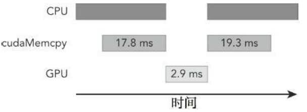

对于HPC工作负载，理解程序中**通信比**的计算是非常重要的。如果你的应用程序用于**计算的时间大于数据传输所用的时间**，那么或许可以**压缩这些操作**，并完全隐藏与传输数据有关的延迟。如果你的应用程序用于计算的时间少于数据传输所用的时间，那么需要**尽量减少主机和设备之间的传输**。在第6章中，你将会学习如何使用**CUDA流和事件**来压缩计算量和通信量。


------

##### 比较应用程序的性能将理论界限最大化

在进行程序优化时，如何将应用程序和理论界限进行比较是很重要的。由 `nvprof` 得到的计数器可以帮助你获取**应用程序的指令**和**内存吞吐量**。如果将应用程序的测量值与理论峰值进行比较，可以判定你的应用程序的性能是受限于**算法**还是受限于**内存带宽**的。以Tesla K10为例，可以得到理论上的比率：

- Tesla K10单精度峰值浮点运算次数

745 MHz核心频率 `*` 2 GPU/芯片 `*` （8个多处理器 `*` 192个浮点单元 `*` 32核心/多处理器） `*` 2 OPS/周期＝4.58 TFLOPS（FLOPS表示每秒浮点运算次数）

- Tesla K10内存带宽峰值

2 GPU/芯片 `*` 256位 `*` 2500 MHz内存时钟 `*` 2 DDR/8位/字节＝320 GB/s

- 指令比∶字节

4.58 TFLOPS/320 GB/s，也就是13.6个指令：1个字节

对于Tesla K10而言，如果你的应用程序**每访问一个字节所产生的指令数多于13.6**，那么你的应用程序受**算法**性能限制。大多数HPC工作负载受**内存带宽的限制**。


------

### 2.3. 组织并行线程

如果使用了**合适的网格和块大小**来正确地组织线程，那么可以对内核性能产生很大的影响。在向量加法的例子中，为了实现**最佳性能**我们调整了块的大小，并基于块大小和向量数据大小计算出了网格大小。

现在通过一个矩阵加法的例子来进一步说明这一点。对于矩阵运算，传统的方法是在内核中使用一个包含二维网格与二维块的布局来组织线程。但是，这种传统的方法无法获得最佳性能。

------

#### 2.3.1　使用块和线程建立矩阵索引

通常情况下，一个矩阵用**行优先**的方法在全局内存中进行**线性存储**。图2-9所示的是一个 8×6 矩阵的小例子。

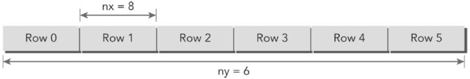

在一个**矩阵加法**核函数中，一个线程通常被分配一个数据元素来处理。首先要完成的任务是使用块和线程索引从全局内存中访问指定的数据。通常情况下，对一个二维示例来说，需要管理3种索引：

- 线程和块**索引**
- 矩阵中给定点的**坐标**
- 全局线性内存中的**偏移量**

对于一个给定的线程，首先可以通过把线程和块索引映射到矩阵坐标上来获取线程块和线程索引的全局内存偏移量，然后将这些矩阵坐标映射到全局内存的存储单元中。

第一步，可以用以下公式把线程和块索引**映射**到矩阵坐标上：

```c++
ix = threadIdx.x + blockIdx.x * blockDim.x
iy = threadIdx.y + blockIdx.y * blockDim.y
```

第二步，可以用以下公式把矩阵坐标**映射**到全局内存中的索引/存储单元上：

```c++
idx = iy * nx + ix //矩阵索引按行优先
```

下图 2-10 说明了块和线程索引、矩阵坐标以及线性全局内存索引之间的对应关系。

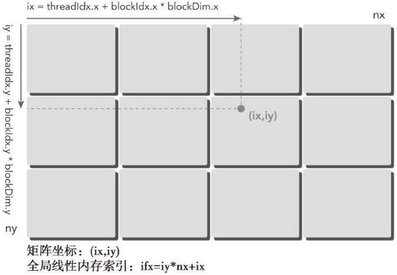

`printThreadInfo` 函数被用于输出关于每个线程的以下信息：

- 线程索引
- 块索引
- 矩阵坐标
- 线性全局内存偏移量
- 相应元素的值

用以下命令编译并运行该程序：

```shell
$ nvcc -arch=sm_20 checkThreadIndex.cu -o checkIndex
$ ./checkIndex
```

对于每个线程，你可以获取以下信息：

```c++
thread_id(2,1) block_id(1,0) coordinate(6,1) global index 14 ival 14
```

下图 2-11 说明了这三项索引之间的关系。

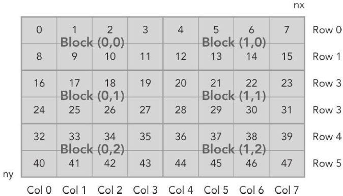


```c++
//代码清单 2-6　检查块和线程索引（checkThreadIndex.cu）
#include <cuda_runtime.h>
#include <stdio.h>

#define CHECK(call) 														\
{ 																			\
	const cudaError_t error = call; 										\
    if (error != cudaSuccess) 												\
    { 																		\
    	printf("Error: %s:%d, ", __FILE__, __LINE__); 						\
     	printf("code:%d, reason: %s\n", error, cudaGetErrorString(error)); 	\
     	exit(-10*error); 													\
    } 																		\
}																			

void initialInt(int *ip, int size) {
    for (int i=0; i<size; i++) {
        ip[i] = i;
    }
}

void printMatrix(int *C, const int nx, const int ny) {
    int *ic = C;
    printf("\nMatrix: (%d.%d)\n",nx,ny);
    for (int iy=0; iy<ny; iy++) {
        for (int ix=0; ix<nx; ix++) {
            printf("%3d",ic[ix]);
        }
        ic += nx;
        printf("\n");
    }
    printf("\n");
}

__global__ void printThreadIndex(int *A, const int nx, const int ny) {
    int ix = threadIdx.x + blockIdx.x * blockDim.x;
    int iy = threadIdx.y + blockIdx.y * blockDim.y;
    unsigned int idx = iy*nx + ix;
    printf("thread_id (%d,%d) block_id (%d,%d) coordinate (%d,%d) "
           "global index %2d ival %2d\n", threadIdx.x, threadIdx.y, blockIdx.x,
           blockIdx.y, ix, iy, idx, A[idx]);
}

int main(int argc, char **argv) {
    printf("%s Starting...\n", argv[0]);
    
    // get device information
    int dev = 0;
    cudaDeviceProp deviceProp;
    CHECK(cudaGetDeviceProperties(&deviceProp, dev));
    printf("Using Device %d: %s\n", dev, deviceProp.name);
    CHECK(cudaSetDevice(dev));
    
    // set matrix dimension
    int nx = 8;
    int ny = 6;
    int nxy = nx*ny;
    int nBytes = nxy * sizeof(float);
    
    // malloc host memory
    int *h_A;
    h_A = (int *)malloc(nBytes);
    
    // iniitialize host matrix with integer
    initialInt(h_A, nxy);
    printMatrix(h_A, nx, ny);
    
    // malloc device memory 分配所需的内存空间,并返回一个指向它的指针
    int *d_MatA;
    cudaMalloc((void **)&d_MatA, nBytes);
    
    // transfer data from host to device
    cudaMemcpy(d_MatA, h_A, nBytes, cudaMemcpyHostToDevice);
    
    // set up execution configuration
    dim3 block(4, 2);
    dim3 grid((nx + block.x - 1) / block.x, (ny + block.y - 1) / block.y);
    
    // invoke the kernel
    printThreadIndex <<< grid, block >>>(d_MatA, nx, ny);
    cudaDeviceSynchronize();
    
    // free host and devide memory
    cudaFree(d_MatA);
    free(h_A);
    
    // reset device
    cudaDeviceReset();
    
    return (0);
}
```


------

#### 2.3.2　使用二维网格和二维块对矩阵求和

在本节中，我们将使用一个二维网格和二维块来编写一个矩阵加法核函数。首先，应编写一个校验主函数以验证矩阵加法核函数是否能得出正确的结果：

```c++
void sumMatrixOnHost(float *A, float *B, float *C, const int nx, const int ny) {
    float *ia = A;
    float *ib = B;
    float *ic = C;
    
    for (int iy = 0; iy < ny; iy++) {
        for (int ix = 0; ix < nx; ix++) {
            ic[ix] = ia[ix] + ib[ix];
        }
        ia += nx; ib += nx; ic+=nx;
    }
}
```

然后，创建一个新的核函数，目的是采用一个二维线程块来进行矩阵求和：

```c++
__global__ void sumMatrixOnGPU2D(float *MatA, float *MatB, float *MatC, int nx, int ny) {
    unsigned int ix = threadIdx.x + blockIdx.x * blockDim.x;
    unsigned int iy = threadIdx.y + blockIdx.y * blockDim.y;
    unsigned int idx = iy * nx + ix;
    
    if (ix < nx && iy < ny) {
        MatC[idx] = MatA[idx] + MatB[idx];
    }
}
```

这个核函数的关键步骤是将每个线程从它的线程索引映射到全局线性内存索引中，如图 2-12 所示。

接下来，每个维度下的矩阵大小可以按如下方法设置为16384个元素：

```c++
int nx = 1<<14;
int ny = 1<<14;
```

然后，使用一个二维网格和二维块按如下方法设置核函数的执行配置：

```c++
int dimx = 32;
int dimy = 32;
dim3 block(dimx, dimy);
dim3 grid((nx + block.x - 1) / block.x, (ny + block.y - 1) / block.y);
```

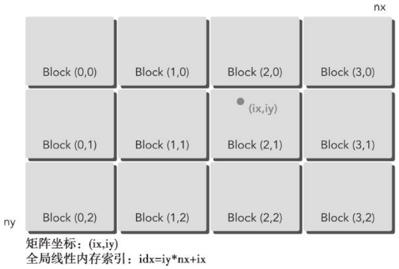

把所有的代码整合到名为 `sumMatrixOnGPU-2D-grid-2D-block.cu` 的文件中。主函数代码如代码清单2-7所示。

```c++
//代码清单2-7　使用一个二维网格和二维块的矩阵加法（sumMatrixOnGPU-2D-grid-2D-block.cu）
int main(int argc, char **argv) {
    printf("%s Starting...\n", argv[0]);
    
    // set up device
    int dev = 0;
    cudaDeviceProp deviceProp;
    CHECK(cudaGetDeviceProperties(&deviceProp, dev));
    printf("Using Device %d: %s\n", dev, deviceProp.name);
    CHECK(cudaSetDevice(dev));
    
    // set up date size of matrix
    int nx = 1<<14;
    int ny = 1<<14;
    int nxy = nx*ny;
    int nBytes = nxy * sizeof(float);
    printf("Matrix size: nx %d ny %d\n",nx, ny);
    
    // malloc host memory
    float *h_A, *h_B, *hostRef, *gpuRef;
    h_A = (float *)malloc(nBytes);
    h_B = (float *)malloc(nBytes);
    hostRef = (float *)malloc(nBytes);
    gpuRef = (float *)malloc(nBytes);
    
    // initialize data at host side
    double iStart = cpuSecond();
    initialData (h_A, nxy);
    initialData (h_B, nxy);
    double iElaps = cpuSecond() - iStart;
    memset(hostRef, 0, nBytes);
    memset(gpuRef, 0, nBytes);
    
    // add matrix at host side for result checks
    iStart = cpuSecond();
    sumMatrixOnHost (h_A, h_B, hostRef, nx,ny);
    iElaps = cpuSecond() - iStart;
    
    // malloc device global memory
    float *d_MatA, *d_MatB, *d_MatC;
    cudaMalloc((void **)&d_MatA, nBytes);
    cudaMalloc((void **)&d_MatB, nBytes);
    cudaMalloc((void **)&d_MatC, nBytes);
    
    // transfer data from host to device
    cudaMemcpy(d_MatA, h_A, nBytes, cudaMemcpyHostToDevice);
    cudaMemcpy(d_MatB, h_B, nBytes, cudaMemcpyHostToDevice);

    // invoke kernel at host side
    int dimx = 32;
    int dimy = 32;
    dim3 block(dimx, dimy);
    dim3 grid((nx+block.x-1)/block.x, (ny+block.y-1)/block.y);
    iStart = cpuSecond();
    sumMatrixOnGPU2D <<< grid, block >>>(d_MatA, d_MatB, d_MatC, nx, ny);
    cudaDeviceSynchronize();
    iElaps = cpuSecond() - iStart;
    printf("sumMatrixOnGPU2D <<<(%d,%d), (%d,%d)>>> elapsed %f sec\n", grid.x,
           grid.y, block.x, block.y, iElaps);
    
    // copy kernel result back to host side
    cudaMemcpy(gpuRef, d_MatC, nBytes, cudaMemcpyDeviceToHost);
    
    // check device results
    checkResult(hostRef, gpuRef, nxy);
    
    // free device global memory
    cudaFree(d_MatA);
    cudaFree(d_MatB);
    cudaFree(d_MatC);
    
    // free host memory
    free(h_A);
    free(h_B);
    free(hostRef);
    free(gpuRef);
    
    // reset device
    cudaDeviceReset();
    
    return (0);
}
```

用以下命令编译并运行该代码：

```shell
$ nvcc sumMatrixOnGPU-2D-grid-2D-block.cu -o martix2D
$ ./matrix2D
```

运行结果：

```c++

```

接下来，调整块的尺寸为32×16并重新编译和运行该代码。核函数的执行速度几乎快了两倍：

```c++
sumMatrixOnGPU2D <<< (512,1024) , (32,16) >>> epapsed 0.038041 sec
```

为什么只是改变了执行配置，内核性能就几乎翻了一倍。可能会觉得这是因为第二次配置的线程块数是第一次配置块数的两倍，所以并行性也是两倍。你的直觉是正确的，但是，如果进一步减小块的大小变为16×16，相比第一次配置你已经将块的数量翻了四倍。如下所示，这种配置的结果比第一个好但是不如第二个。

```c++
sumMatrixOnGPU2D <<< (1024,1024) , (16,16) >>> epapsed 0.045535 sec
```

下表2-3总结了不同执行配置的性能。结果显示，增加块的数量不一定能提升内核性能。在第3章中，你将会学习到为什么不同的执行配置会影响核函数的性能。

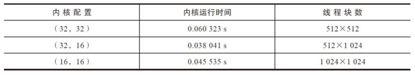


------

#### 2.3.3　使用一维网格和一维块对矩阵求和

为了使用一维网格和一维块，你需要写一个新的核函数，其中每个线程处理 `ny` 个数据元素，如图2-13所示。

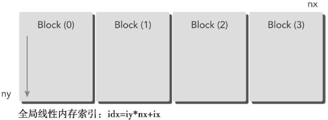

由于在新的核函数中每个线程都要处理 `ny` 个元素，与使用二维网格和二维块的矩阵求和的核函数相比，从线程和块索引到全局线性内存索引的映射都将会有很大不同。由于在这个核函数启动中使用了一个一维块布局，因此只有`threadIdx.x` 是有用的，并且使用内核中的一个循环来处理每个线程中的 `ny` 个元素。

```c++
__global__ void sumMatrixOnGPU2D(float *MatA, float *MatB, float *MatC, int nx, int ny) {
    unsigned int ix = threadIdx.x + blockIdx.x * blockDim.x;
    
    if (ix < nx) {
        for (int iy = 0; iy < ny; iy++) {
            int idx = iy * nx +ix;
        	MatC[idx] = MatA[idx] + MatB[idx];
        }
    }
}
```

一维网格和块的配置如下：

```c++
dim3 block(32, 1);
dim3 grid((nx + block.x - 1) / block.x, 1);
```

使用以下配置调用核函数：

```c++
sumMatrixOnGPU1D <<< grid, block >>> (d_MatA, d_MatB, d_MatC, nx, ny);
```

使用一维网格和一维块的更改替换代码清单2-7中的部分，并保存到文件 `sumMatrixOnGPU-1D-grid-1D-block.cu` 中，使用以下命令编译并运行该程序：

```shell
$ nvcc sumMatrixOnGPU-1D-block.cu -o matrix1D
$ ./matrix1D
```

结果显示，与使用一个二维网格和块（32×32）的配置结果相比，两者的性能基本相同。


接下来，按如下所示的方法增加块的大小：

```c++
dim3 block(128, 1);
dim3 grid((nx + block.x - 1) / block.x, 1);
```

重新编译并运行，可以看出核函数运行得更快了。

```c++
sumMatrixOnGPU1D <<< (128,1), (128,1) >>> elapsed 0.044701 sec
```


------

#### 2.3.4　使用二维网格和一维块对矩阵求和

当使用一个包含一维块的二维网格时，每个线程都只关注一个数据元素并且网格的第二个维数等于 `ny`，如图2-14所示。

这可以看作是含有一个二维块的二维网格的特殊情况，其中块的第二个维数是1。因此，从块和线程索引到矩阵坐标的映射就变成：

```shell
ix = threadIdx.x + blockIdx.x * blockDim.x;
iy = blockIdx.y;
```

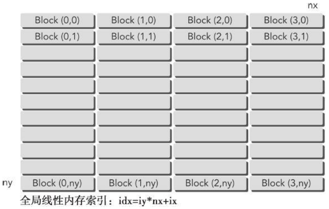

从矩阵坐标到全局线性内存偏移量的映射保持不变。新的核函数如下：

```c++
__global__ void sumMatrixOnGPU2D(float *MatA, float *MatB, float *MatC, int nx, int ny) {
    unsigned int ix = threadIdx.x + blockIdx.x * blockDim.x;
    unsigned int iy = blockIdx.y;
    unsigned int idx = iy * nx + ix;
    
    if (ix < nx && iy < ny) {
        MatC[idx] = MatA[idx] + MatB[idx];
    }
}
```

注意，二维核函数 `sumMatrixOnGPU2D` 也为这个执行配置工作。编写新内核的唯一优点是每个线程省去了一次整数乘法和一次整数加法的运算。

将块尺寸设置为32，并在此基础上计算网格大小：

```C++
dim3 block(32);
dim3 grid((nx + block.x - 1) / block.x, ny);
```

如下所示调用内核：

```C++
sumMatrixOnGPU1D <<< grid, block >>> (d_MatA, d_MatB, d_MatC, nx, ny);
```

对代码清单2-7进行更改替换，并将替换后的程序保存到名为`sumMatrixOnGPU-2D-grid-1D-block.cu`的文件中，然后使用以下命令编译并运行。

```c++
$ nvcc sumMatrixOnGPU-2D-block.cu -o mat2D1D
$ ./mat2D1D
```

运行结果为：

```

```

如下所示，将线程块的大小增加到256：

```c++
dim3 block(256);
```

然后重新编译运行，系统会表现出目前为止最佳的性能（见表2-4）：

```
sumMatrixOnGPU1D <<< (128,1), (128,1) >>> elapsed 0.044701 sec
```


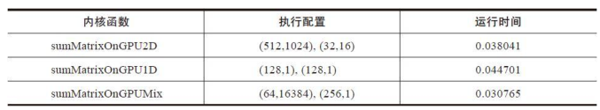

从矩阵加法的例子中可以看出：

- 改变执行配置对内核性能有影响
- 传统的核函数实现一般不能获得最佳性能
- 对于一个给定的核函数，尝试使用**不同的网格和线程块大小**可以获得更好的性能

在第3章，将会从硬件的角度学习产生这些问题的原因。


------

### 2.4　设备管理

#### 2.4.1　使用运行时API查询GPU信息


#### 2.4.2　确定最优GPU


#### 2.4.3　使用nvidia-smi查询GPU信息


#### 2.4.4　在运行时设置设备


------

### 2.5　总结


------

### 2.6　习题


------

## 第 3 章 CUDA执行模型

3.1　CUDA执行模型概述
3.1.1　GPU架构概述
3.1.2　Fermi架构
3.1.3　Kepler架构
3.1.4　配置文件驱动优化
3.2　理解线程束执行的本质
3.2.1　线程束和线程块
3.2.2　线程束分化
3.2.3　资源分配
3.2.4　延迟隐藏
3.2.5　占用率
3.2.6　同步
3.2.7　可扩展性
3.3　并行性的表现
3.3.1　用nvprof检测活跃的线程束
3.3.2　用nvprof检测内存操作
3.3.3　增大并行性
3.4　避免分支分化
3.4.1　并行归约问题
3.4.2　并行归约中的分化
3.4.3　改善并行归约的分化
3.4.4　交错配对的归约
3.5　展开循环
3.5.1　展开的归约
3.5.2　展开线程的归约
3.5.3　完全展开的归约
3.5.4　模板函数的归约
3.6　动态并行
3.6.1　嵌套执行
3.6.2　在GPU上嵌套Hello　World
3.6.3　嵌套归约
3.7　总结
3.8　习题

------

## 第 4 章 全局内存

4.1　CUDA内存模型概述
4.1.1　内存层次结构的优点
4.1.2　CUDA内存模型
4.2　内存管理
4.2.1　内存分配和释放
4.2.2　内存传输
4.2.3　固定内存
4.2.4　零拷贝内存
4.2.5　统一虚拟寻址
4.2.6　统一内存寻址
4.3　内存访问模式
4.3.1　对齐与合并访问
4.3.2　全局内存读取
4.3.3　全局内存写入
4.3.4　结构体数组与数组结构体
4.3.5　性能调整
4.4　核函数可达到的带宽
4.4.1　内存带宽
4.4.2　矩阵转置问题
4.5　使用统一内存的矩阵加法
4.6　总结
4.7　习题


------

## 第 5 章 共享内存和常量内存

5.1　CUDA共享内存概述
5.1.1　共享内存
5.1.2　共享内存分配
5.1.3　共享内存存储体和访问模式
5.1.4　配置共享内存量
5.1.5　同步
5.2　共享内存的数据布局
5.2.1　方形共享内存
5.2.2　矩形共享内存
5.3　减少全局内存访问
5.3.1　使用共享内存的并行归约
5.3.2　使用展开的并行归约
5.3.3　使用动态共享内存的并行归约
5.3.4　有效带宽
5.4　合并的全局内存访问
5.4.1　基准转置内核
5.4.2　使用共享内存的矩阵转置
5.4.3　使用填充共享内存的矩阵转置
5.4.4　使用展开的矩阵转置
5.4.5　增大并行性
5.5　常量内存
5.5.1　使用常量内存实现一维模板
5.5.2　与只读缓存的比较
5.6　线程束洗牌指令
5.6.1　线程束洗牌指令的不同形式
5.6.2　线程束内的共享数据
5.6.3　使用线程束洗牌指令的并行归约
5.7　总结
5.8　习题

------

## 第 6 章 流和并发

6.1　流和事件概述
6.1.1　CUDA流
6.1.2　流调度
6.1.3　流的优先级
6.1.4　CUDA事件
6.1.5　流同步
6.2　并发内核执行
6.2.1　非空流中的并发内核
6.2.2　Fermi　GPU上的虚假依赖关系
6.2.3　使用OpenMP的调度操作
6.2.4　用环境变量调整流行为
6.2.5　GPU资源的并发限制
6.2.6　默认流的阻塞行为
6.2.7　创建流间依赖关系
6.3　重叠内核执行和数据传输
6.3.1　使用深度优先调度重叠
6.3.2　使用广度优先调度重叠
6.4　重叠GPU和CPU执行
6.5　流回调
6.6　总结
6.7　习题

------

## 第 7 章 调整指令级原语

7.1　CUDA指令概述
7.1.1　浮点指令
7.1.2　内部函数和标准函数
7.1.3　原子操作指令
7.2　程序优化指令
7.2.1　单精度与双精度的比较
7.2.2　标准函数与内部函数的比较
7.2.3　了解原子指令
7.2.4　综合范例
7.3　总结
7.4　习题

------

## 第 8 章 GPU加速库和OpenACC

8.1　CUDA库概述
8.1.1　CUDA库支持的作用域
8.1.2　通用的CUDA库工作流
8.2　cuSPARSE库
8.2.1　cuSPARSE数据存储格式
8.2.2　用cuSPARSE进行格式转换
8.2.3　cuSPARSE功能示例
8.2.4　cuSPARSE发展中的重要主题
8.2.5　cuSPARSE小结
8.3　cuBLAS库
8.3.1　管理cuBLAS数据
8.3.2　cuBLAS功能示例
8.3.3　cuBLAS发展中的重要主题
8.3.4　cuBLAS小结
8.4　cuFFT库
8.4.1　使用cuFFT　API
8.4.2　cuFFT功能示例
8.4.3　cuFFT小结
8.5　cuRAND库
8.5.1　拟随机数或伪随机数的选择
8.5.2　cuRAND库概述
8.5.3　cuRAND介绍
8.5.4　cuRAND发展中的重要主题
8.6　CUDA　6.0中函数库的介绍
8.6.1　Drop-In库
8.6.2　多GPU库
8.7　CUDA函数库的性能研究
8.7.1　cuSPARSE与MKL的比较
8.7.2　cuBLAS与MKL　BLAS的比较
8.7.3　cuFFT与FFTW及MKL的比较
8.7.4　CUDA库性能小结
8.8　OpenACC的使用
8.8.1　OpenACC计算指令的使用
8.8.2　OpenACC数据指令的使用
8.8.3　OpenACC运行时API
8.8.4　OpenACC和CUDA库的结合
8.8.5　OpenACC小结
8.9　总结
8.10　习题

------

## 第 9 章 多GPU编程

9.1　从一个GPU到多GPU
9.1.1　在多GPU上执行
9.1.2　点对点通信
9.1.3　多GPU间的同步
9.2　多GPU间细分计算
9.2.1　在多设备上分配内存
9.2.2　单主机线程分配工作
9.2.3　编译和执行
9.3　多GPU上的点对点通信
9.3.1　实现点对点访问
9.3.2　点对点的内存复制
9.3.3　统一虚拟寻址的点对点内存访问
9.4　多GPU上的有限差分
9.4.1　二维波动方程的模板计算
9.4.2　多GPU程序的典型模式
9.4.3　多GPU上的二维模板计算
9.4.4　重叠计算与通信
9.4.5　编译和执行
9.5　跨GPU集群扩展应用程序
9.5.1　CPU到CPU的数据传输
9.5.2　使用传统MPI在GPU和GPU间传输数据
9.5.3　使用CUDA-aware　MPI进行GPU到GPU的数据传输
9.5.4　使用CUDA-aware　MPI进行节点内GPU到GPU的数据传输
9.5.5　调整消息块大小
9.5.6　使用GPUDirect　RDMA技术进行GPU到GPU的数据传输
9.6　总结
9.7　习题

------

## 第 10 章 程序实现的注意事项

10.1　CUDA　C的开发过程
10.1.1　APOD开发周期
10.1.2　优化因素
10.1.3　CUDA代码编译
10.1.4　CUDA错误处理
10.2　配置文件驱动优化
10.2.1　使用nvprof寻找优化因素
10.2.2　使用nvvp指导优化
10.2.3　NVIDIA工具扩展
10.3　CUDA调试
10.3.1　内核调试
10.3.2　内存调试
10.3.3　调试小结
10.4　将C程序移植到CUDA　C的案例研究
10.4.1　评估crypt
10.4.2　并行crypt
10.4.3　优化crypt
10.4.4　部署crypt
10.4.5　移植crypt小结
10.5　总结
10.6　习题


## 附录 推荐阅读


