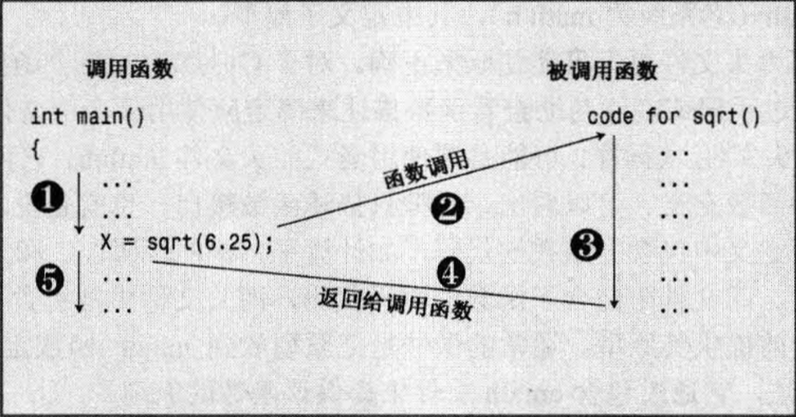
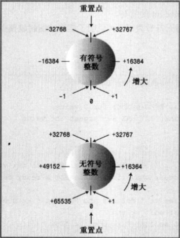

# C++ Primer Plus

c++ primer plus

## 第1章 预备知识

面向对象编程(OOP)  强调数据

类是一种规范。类规定了可使用哪些**数据**来表示对象以及可以对这些数据执行哪些**操作**。

泛型编程（generic programming）模板


**linux**

```
可以生成可执行文件 a.out
g++ spiffy.cpp

个别版本需要链接C++库
g++ spiffy.cpp -lg++

要编译多个源文件
g++ my.cpp precious.cpp
将生成一个名为a.out的可执行文件和两个目标代码文件my.o和precious.o。

如果修改了其中的某个源代码文件，如mu.cxx，则可以使用my.cxx和precious.o来重新编译：
g++ my.cpp precious.o
```


**windows**

compile 对当前打开的文件中的代码进行编译

build和make 编译项目中所有源代码文件的代码。如果项目包含3个文件，而只有其中一个文件修改，则只重新编译该文件。

build all 重新编译所有的源代码文件

link 将编译后的源代码与所需的库代码组合起来

run或execute 运行程序。如果没执行前面的步骤，将在运行程序前完成这些步骤

debug 以步进方式执行程序。


## 第2章 开始学习C++

### 2.1 进入C++

**2.1.3 预处理器和iostream**

```c++
#include<iostream>   		//预处理器   编译指令#include 该编译指令导致预处理器将iostream文件的内容添加到程序中。这是一种典型的预处理器操作：在源代码被编译之前，替换或添加文本

int main(){					//函数头
    using namespace std;	//编译指令
    cout << "Come up and c++ me some time,";
    cout << endl;
    cout << "You wont regret it!"<<endl;
    return 0;				//结束函数
}
```

​	**编译指令#include** 该编译指令导致预处理器将iostream文件的内容添加到程序中。这是一种典型的预处理器操作：在源代码被编译之前，替换或添加文本。

​	**编译指令#include**  导致iostream文件的内容随源代码文件的内容一起被发送给了编译器。实际上iostream文件的内容将取代程序中的代码行`#include<iostream>`。原始文件没有被修改，而是将源代码文件和iostream组合成一个复合文件，编译的下一阶段将使用该文件。


**2.1.4 头文件名**

​	像iostream这样的文件叫做包含文件（include file）也叫头文件（head file）。C++去掉 `.h` 而是在前边加上了 `c`。如`math.h` 变为 `cmath`。没有 `h` 的头文件也可以包含名称空间。


**2.1.5 名称空间**

​	如果使用iostream，则应使用下面的名称空间编译指令来使iostream中的定义对程序可用：

```
using namespace std;
```

​	这叫做 **using 编译指令**。名称空间避免不同厂商封装的相同命名产品函数

```c++
Microflop::wanda("go dancing?");
Piscine::wanda("a fish named Desire")
```

​	类、函数和变量使C++编译器的标准组件，它们现在都被放置在**名称空间std**中。所以用于输出的 `cout` 变量实际上是`std::count`，而 `endl` 实际上是 `std::endl`。因此

```c++
    cout << "Come up and c++ me some time,";
    cout << endl;
如果省略using编译指令，可以用下述方式进行编码
	std::cout << "Come up and c++ me some time,";
    std::cout << std::endl;
```

​	然而 using 编译指令使得std名称空间中**所有名称都可用**。这是一种偷懒的做法，在大型项目中存在潜在的问题。更好的方法是，只使所需的名称可用，可用通过 using 声明来实现：

```c++
using std::cout;
using std::endl;
using std::cin;
```

​	用这些编译指令替换下述代码后，便可以使用 `cin` 和`cout`，而不必加上`std::`前缀


**2.1.6 cout输出**

```c++
cout << "Come up and c++ me some time,";
```

​	<< 表示该语句将把这个字符串发送给 `cout`；该符号指出了**信息流动的路径**。`cout`对象有一个简单的接口，如果string是一个字符串，则下面的代码将显示该字符串

```c++
cout<<string
```

​	从概念上来看，输出是一个流，即从程序流出的一系列字符。cout对象表示这种流，其属性是在iostream文件中定义的。 cout 的对象属性包括一个**插入运算符 <<**，它可用将其右侧的信息插入到流中。


​	<<是按位左移运算符，这是一个运算符重载的例子，通过**重载**，同一个运算符将有不同的含义。编译器会通过**上下文来确定运算符的含义**。


​	**endl**是一个特殊的C++符号，表示**重起一行**。诸如 endl 等对于cout来说有特殊含义的特殊符号被称为**控制符（manipulator）**。endl 也是在 iostream 中定义的，且位于名称空间 std 中。


---

### 2.2 C++语句

```c++
#include<iostream>
using namespace std;

int main(){
    int carrots;
    carrots = 25;
    cout << "I have ";
    cout << carrots;
    cout << " carrots.";
    cout << endl;
    carrots -= 1;
    cout << "Crunch ,crunch. Now I have " << carrots << " carrots." << endl;
    return 0;
}
```


**2.2.1 声明语句和变量**

```c++
//定义声明语句 定义
int carrots;
```

​	提供了两项信息：需要的内存以及该内存单元的名称。

​	在首次使用变量前声明它。


2.2.2 赋值语句

​	赋值语句将值赋给储存单元。

```c++
carrots = 25;
```

​	将整数25赋给变量carrots表示的内存单元

​	`=` 叫做赋值运算符。C++ 可以连续使用赋值运算符。

```c++
int a;
int b;
int c;
a = b = c = 1;
```

​	复制从右向左进行。首先，88被赋给c；然后c的值被赋给b；然后b的值被赋给a。


### 2.3 其他C++语句

**2.3.1. 使用cin**

**2.3.2. cout进行拼接**

**2.3.3 类简介**

​	类是用户定义的一种数据类型。要定义类，需要描述它能够表示什么信息和可对数据执行哪些操作。

​	cout就是一个对象， <<是一个类方法（利用重新定义运算符）


---

### 2.4 函数

```c++
x = sqrt(6.25);
```

​	表达式 `sqrt(6.25)` 被称为 `函数调用`，被调用的函数叫做 `被调用函数` ， 包含 `函数调用` 的函数叫做 `调用函数`




​	圆括号中的值（即6.25）是发送给函数的信息，被称为 `传递给函数`，以这种方式发送给函数的值叫做 `参数`。函数sqrt()得到的结果为2.5，并将这个值发送给调用函数； 发送回去的值叫做`函数的返回值`。 

​	函数执行完毕后，语句中的`函数调用`部分就会被替换为返回的值。


​	函数原型用来指出涉及的类型。

```c++
#include<iostream>
#include<cmath>
using namespace std;


int main(){
    double area;
    cin >> area;
    double side;
    side = sqrt(area);
    cout << side<< endl;
    
    return 0;
}
```


​	编译器编译程序时，必须在库文件搜索您使用的函数。如果在linux下报错_sqrt是一个没有定义的外部函数，则需要结尾添加使用`-lm`

```
g++ sqrt.c -lm
```

​	C++允许创建变量时对它进行赋值，

```c++
double side = sqrt(area)
```


**2.4.2 函数变体**

```c++
double pow(double, double);	
int rand(void); //不接受任何参数，返回一个随机整数
//不需要返回的函数 调用时单独执行即可 如打印函数
showAns(123.456);
```


**2.4.3 用户定义的函数**

关键字不能用作他用 附录B


**2.4.4 用户定义的有返回值的函数**

​	return后边可以直接跟一个表达式，避免创建新变量。


**2.4.5 在多函数程序中使用using编译指令**

```c++
using namespace std;
//放在函数的外面，且位于两个函数的前面，就不用重复定义名称空间std
```


**命名约定**


---

## 第3章 处理数据

​	面向数据编程的本质是**设计并扩展自己的数据类型**。设计自己的数据类型就是让类型与数据匹配。

​	内置的C++类型分两组：基本类型和复合类型。基本类型：整数和浮点数。复合类型：数组、字符串、指针和结构。

### 3.1 简单变量

​	&运算符检索变量的内存地址。

**3.1.1 变量名**

第一个字符不能是数字；以两个下划线和一个下划线开头的铭恒被保留给实现。

`n` 前缀表示整数值，`str`表示以空字符结束的字符串、`b`表示布尔值、`p`表示指针、`c` 表示单个字符


**3.1.2 整形**

​	char、short、int、long、long long 每个类型又分有符号和无符号版本


**3.1.3 整形short、int、long和long long**

​	计算机内存由位的单元组成。不同类型通过不同数目的位来存储值。

​	short 至少16位

​	int至少与short一样长

​	long至少32位，且至少与int一样长

​	long long至少64位，且至少与long一样长


**位与字节**

​	计算机内存的基本单元是位bit。可以将位看作电子开关，可以开，也可以关。关表示值0，开表示值1。8位的内存可以设置256中不同的组合，即2^8。因此8位单元可以表示0-255或者-128到127。每增加一位，组合数便加倍。这意味着可以把16位单元设置位65536个不同的值。

​	字节byte通常指的是8位的内存单元。字节指的就是描述计算机内存量的度量单位，1KB = 1024b，1M=1024K。C++对字节的定义不同。C++字节由至少能够容纳实现的基本字符集的相邻位组成，也就是说，可能取值的数目必须等于或超过字符数目。ASCII和EBCDIC字符集可以用8位来容纳，在这两种系统中，C++字节通常包含8位。国际编程可能需要更大的字符集，如Unicode，因此有些实现可能使用16位甚至32位的字节。


1. 运算符sizeof和头文件limtis

   sizeof运算符指出，在使用8位字节的系统中，int的长度为4个字节。

```c++
int n_int = INT_MAX;
cout << sizeof(n_int) << endl;	//4
```


3. C++初始化方式

```c++
int emus{7}; //set emus to 5
int rocs{};	 //set rocs to 0
```


4. C++上溢下溢

```c++
#include<iostream>
#define ZERO 0
#include<climits>
using namespace std;

int main(){
    short sam = SHRT_MAX;
    unsigned short sue = sam;

    cout << "Sam has " << sam << " dollars and sue has " << sue;
    cout << " dollars deposited." << endl
         << "Add $1 to each account." << endl
         << "Now";
    sam += 1;
    sue += 1;
    cout << "Sam has " << sam << " dollars and sue has " << sue;
    cout << " dollars deposited." << endl;

    sam = ZERO;
    sue = ZERO;
    cout << "Sam has " << sam << " dollars and sue has " << sue;
    cout << " dollars deposited." << endl
         << "Take $1 from each account." << endl;
    sam -= 1;
    sue -= 1;
    cout << "Sam has " << sam << " dollars and sue has " << sue;
    cout << " dollars deposited." << endl;

    return 0;
}

/*Sam has 32767 dollars and sue has 32767 dollars deposited.
Add $1 to each account.
NowSam has -32768 dollars and sue has 32768 dollars deposited.
Sam has 0 dollars and sue has 0 dollars deposited.
Take $1 from each account.
Sam has -1 dollars and sue has 65535 dollars deposited.
```




**3.1.5 选择整数类型**

​	通常，int被设置为对目标计算机而言最为“自然”的长度。

​	如果short比int小，则使用short可以节省内存。通常，仅当有大型整形数组时，才有必要使用short。如果节省内存很重要，则应使用short而不是使用int。假设将程序从int为16位系统移到int为32位的系统，则用于存储int数组的内存量将翻倍，但short数组不受影响。


**3.1.6 整型字面值**

​	C++使用前一（两）位来标识数字常量的基数。如果第一位为1~9，则基数位10（十进制）。如果第一位是0，第二位为1~7，则基数为8（八进制）；因此042的基数是8，它相当于十进制数34。如果前两位为 0x 或 0X ，则基数为16（十六进制）；因此0x42为十六进制数，相当于十进制数66。对于十六进制数，字符a~f和A~F表示了十六进制位，对应于10~15。0xF为15，0xA5为165.

```c++
#include<iostream>
using namespace std;

int main(){
    int chest = 42;     //4*10+2
    int waist = 0x42;   //4*16+2
    int inseam = 042;	//4* 8+2

    cout << chest << endl
        << waist << endl 
        << inseam << endl;
    return 0;
}
```

​	不管值被书写为10、012还是0xA，都将以相同的方式存储在计算机中——被存储为二进制数。

```c++
//cout提供了控制符 dec、hex和oct 十进制 十六进制 八进制格式显示整数
#include<iostream>
using namespace std;

int main(){
    int chest = 42;
    int waist = 42;  
    int inseam = 42;

    cout << chest << endl;  //42
    cout << hex;			//一条消息，告诉cout采用何种行为
    cout << waist << endl;  //2a
    cout << oct;
    cout << inseam << endl; //52
    return 0;
}
```


**3.1.7 C++如何确定常量的类型**

​	程序的声明将特定的整型变量的类型告诉了C++编译器。

```c++
cout <<	"Year = " << 1492 << "\n";
```

​	程序将把1492存储在int、long还是其他整型呢？答案是，除非有理由存储为其他类型（如有特定后缀/值太大，不能存储为int），否则C++将整型常量存储为int类型。

​	首先判断后缀

```c++
l/L     long                  22022存为int占16位  22022L存为long占32位
u/U     unsigned int		  22022LU=22022UL
ul/lu   unsigned long 不分大小写
ll		long long
ull     unsigned long long
```

​	然后判断长度。


**3.1.7 char类型：字符和小整数**

​	char类型是专为存储字符而设计的。

​	ASCII字符集

```c++
char ch;
cin >> ch; // input M  把M变为77
cout << ch;//output M  rather than 77 把77变为M

char ch = 'M';
int i = ch;
cout << "the ascii code for " << ch << "is" << i << endl;//the ascii code for M is 77
cout.put(ch); //77
```


```
转义字符
\n 换行符   \" 双引号   \' 单引号   \t 水平制表   \v 垂直制表   \b 退格   \r 回车   \? 问号
```


**3.1.9 bool 类型**

​	将非零值解释为true，将零解释为false


---

### 3.2 const限定符

​	const关键字来修改变量声明和初始化。

```c++
const int Months = 12; 	//首字母大写 意味着是常量  应在声明中直接初始化
```

​	常量被初始化后，其值就被固定了，编译器将不允许再修改该常量的值。


### 3.3 浮点数

​	C++ 第二组基本类型。

**3.3.1 手写浮点数**

​	C++有两种手写浮点数的方式。第一种常用的标准小数点表示法

```c++
12.34 /    939001.32/    0.00023/    8.0 //即使小数部分为零
```

​	第二种使用E表示法：3.45E6，这指的是3.45与1000000相乘的结果；E6指的是10的6次方，即1后面是6个0.

3.45E6表示3450000，6为指数，3.45为尾数。

```
2.52e+8
8.33E-4
7E5
-18.32e13
9.11e-31
```

​	E表示法最适合于非常大和非常小的数。

> d.dddE+n 将小数点向右浮动n位，d.dddE-n将小数点向左浮动n位


**3.3.2 浮点类型**

​	float、double和long double。按它们可以表示的有效数位和允许的指数最小范围来描述的。有效位是数字中有意义的位。

​	14179 5个有效位

​    14000 2个有效位 3个占位符

​    14.162 5个有效位

​	有效位数不依赖于小数点的位置


**3.3.3 浮点常量**

​	默认为double，若后缀 f 或 F 为float，l 或 L 为long double类型

1.234f

2.45E20F

2.345324E28

2.2L


**3.3.2 浮点类型**

​	范围大；但运算速度满，精度将降低


---

### 3.4 C++算术运算符

```c++
+ 加
- 减
* 乘
/ 除 如果两个操作数是整型 结果为商的整数部分
% 模 两个操作数必须都是整型
```


**3.4.1 运算符优先级和结核性**

​	算术运算符遵循通常的**代数优先级**，先乘除，后加减。可以用括号执行自己定义的优先级。

​	优先级相同 从左到右


**3.4.2 除法分支**

​	如果两个操作数是整型 结果为商的整数部分

​	但凡有一个操作数是浮点值，则小数部分将保留，结果为浮点数

```c++
cout<< 4/5; //0
```


> 运算符重载：除法包括int除法、float除法、double除法。C++根据上下文来确定运算符的含义。使用相同的符号进行多种操作叫做运算符重载。


**3.4.3 求模运算符**


**3.4.4 类型转换**

- 将一种算术类型的值赋给另一种算术类型的变量时，C++将对值进行转换；

- 表达式中包含不同的类型时，C++将对值进行转换；
- 将参数传递给函数时，C++将对值进行转换


1. 初始化和赋值进行的转换

```c++
so_long = thirty; //thirty类型为short 前者为long
```

​	进行赋值时，将thirty的值由short扩展为long类型


2. 以{}方式初始化时进行的转换
3. 表达式中的转换
4. 传递参数时的转换
5. 强制类型转换


**3.4.5 auto声明**

​	如果使用关键字auto，而不指定变量的类型，编译器将把变量的类型设置成与初始值相同：

```c++
auto n = 100; //int
auto x= 1.5;  //double
auto y= 1.3e12L;//long double
```


## 第4章 复合类型

### 4.1 数组

​	数组是一种数据格式，能够存储多个同类型的值。

数组声明应包含以下三点：

- 存储在每个元素中的值的类型
- 数组名
- 数组中的元素数

```c++
short months[12];
//short类型 名为months 中括号内12为元素数目
//元素数必须为整形常数
```

数组被称为复合类型，是因为它是使用其他类型来创建的（派生类型）。

数组赋值可以提供一个用逗号分隔的值列表，并将它们用花括号括起即可。列表中的空格是可选的。


**4.1.2 数组的初始化规则**

​	**只有在定义数组时才能使用初始化**，以后就不能使用了，也不能将一个数组赋给另一个数组：

```c++
int cards[4] = {3,6,8,10};
int hand[4];
hand[4] = {5,6,7,9} //error
hand = cards; //error
```

​	然而，可以使用下标分别给数组中的元素赋值。

​	**初始化时，提供的值可以少于数组的数目**。

​	如果只对数组的一部分进行初始化，则编译器将把其他元素设置为0.

​	如果初始化中括号内元素数不填，编译器将计算元素个数。


**4.1.3 C++11 数组初始化方法**

​	首先，初始化时，可以省略等号

```c++
double earnings[4] {1.2e4, 1.6e4, 1.1e4, 1.7e4}
```

​	其次，可不在大括号内包含任何东西，将把所有元素设置为0：

```c++
unsigned int counts[10] = {};
float balance[100] {};
```

​	第三，列表初始化禁止缩窄转换

```c++
long plifs[] = {25,92,3.0};				//not allowed 浮点数转换为整型是缩窄操作
char slifs[4]  {'h','i',1122011,'\0'};	//not allowed 1122011超出char变量的取值范围
char tlifs[4]  {'h','i',112,'\0'};		//allowed
```


### 4.2 字符串


