# Apex

```powershell
D:\workspace\Reverse\apex\Project-Branthium-main\Project-Branthium-main\build>kdmapper.exe driver.sys                   [<] Loading vulnerable driver                                                                                           [+] NtLoadDriver Status 0x0                                                                                             [+] PiDDBLock Ptr fffff8010e30a591                                                                                      [+] PiDDBCacheTable Ptr fffff8010e30dcfb                                                                                [+] PiDDBLock Locked                                                                                                    [+] PiDDBCacheTable result -> TimeStamp: 5284eac3                                                                       [+] Found Table Entry = FFFF808F14E17D00                                                                                [+] PiDDBCacheTable Cleaned                                                                                             [+] g_KernelHashBucketList Found 0xFFFFF801124B8080                                                                     [+] g_HashCacheLock Locked                                                                                              [+] Found In g_KernelHashBucketList: \Users\ADMINI~1\AppData\Local\Temp\vVqjtVsJWgGIsrkm                                [+] g_KernelHashBucketList Cleaned                                                                                      [+] MmUnloadedDrivers Cleaned: vVqjtVsJWgGIsrkm                                                                         [+] Image base has been allocated at 0xFFFFD201CB0EF000                                                                 [+] Skipped 0x1000 bytes of PE Header                                                                                   [<] Calling DriverEntry 0xFFFFD201CB0EF1B0                                                                              [+] DriverEntry returned 0x00000000                                                                                     [<] Unloading vulnerable driver                                                                                         [+] NtUnloadDriver Status 0x0                                                                                           [+] Vul driver data destroyed before unlink                                                                             [+] success
```


```text
Run as admin Usermode.exe at apex lobby , don't use cmd too

change kdmapper entry point , name / pack usermode and driver / delete traces
```


---

# 网站

时刻更新 LOL https://www.2fzb.com/

半周更新一次 LOL https://www.520xyz.com/

一周更新一次 LOL https://www.52fzwg.com/

要钱https://www.52ghai.com/

偏学习 https://bbs.pediy.com/


**课**

https://www.xuepojie.com/

Shark恒零基础破解教程之图文版（共28课）https://www.xuepojie.com/thread-16898-1-1.html

Shark恒零基础百集VIP破解教程 https://www.bilibili.com/video/BV15J411S7mJ


吾爱技术吧vip课程基础篇 https://www.bilibili.com/video/BV1ht411R7XR

OD零基础入门教程 https://www.bilibili.com/video/BV14p4y1i7bN


Windows逆向之X86汇编  https://ke.yijincc.com/play?kid=3641

破解的那个程序能检测到OD，OD一打开那个程序就打不了

换工具，伪装

利用汇编深入学习C++和外挂实战 https://www.bilibili.com/video/BV1HJ411z7ou

逆向工程 从入门到改行（看雪cvcvxk大神） https://www.bilibili.com/video/BV14x411R7X4

【逆向反外挂】网游自动化脚本-零基础C++学习：https://space.bilibili.com/110698672

直接进实战https://www.bilibili.com/video/BV1qf4y147H6

【易道云学院】C/C++黑客 游戏逆向/反外挂基础 精讲课https://www.bilibili.com/video/BV1Af4y1k7wj

【C/C++】经典外挂-DLL注入-实现无线弹药-开过挂的你，知道其中的原理吗 https://www.bilibili.com/video/BV1ah411X7y9

游戏逆向c++封包汇编基础易语言lua内存外挂与反外挂零基础ce od完整教程 https://www.bilibili.com/video/BV1Gy4y1J7P5


[逆向破解基础](https://www.bilibili.com/video/BV1654y1878Z


## lol

解决CE无法对LOL进行调试和查找访问 https://www.520xyz.com/forum.php?mod=viewthread&tid=3075


sight distance.exe https://www.520xyz.com/thread-3036-1-1.html

换皮肤 https://www.520xyz.com/thread-3793-1-1.html

随幻https://www.520xyz.com/thread-3381-1-1.html

LOL换肤助手V3.99 https://www.2fzb.com/thread-67955-1-1.html


LOL换肤助手永久免费 http://www.lolhfzs.cn/

单内存走砍 不模拟按键 自带防封处理call地址！

独家防封驱动级保护，三层驱动级保护[文件、内存、数据]，非传统内存注入方式

软件会自动判断是否符合并且支持当前游戏版本使用，非常智能，为避免游戏更新机制导致账户不安全的因素 


---

# 数据类型

|    type     |                             mean                             |
| :---------: | :----------------------------------------------------------: |
| `uintptr_t` |                 无符号整数，取消地址的 `0x`                  |
|  `LPCVOID`  | 一个`void* const` 指针<br>（LP 代表 Long Pointer，C 代表 Constant，VOID 代表 void） |
|  `LPVOID`   | 一个`void*` 指针<br/>（LP 代表 Long Pointer，VOID 代表 void） |
|  `HANDLE`   | 句柄，是 Windows 用来表示对象的（不是C++的对象）<br>在 windows 程序中，有各种各样的资源（窗口、图标、光标等），系统在创建这些资源时会为他们分配内存，并返回标示这些资源的标示号，即句柄 |
|  `SIZE_T`   | 标准 C 库中定义的，在64位系统中为 `long long unsigned int`，非64位系统中为 `long unsigned int`。 |
|   `DWORD`   | `Double Word`，`unsigned long`，MFC的数据类型。每个 WORD 为 2 个字节的长度，DWORD 双字即为4个字节，每个字节是8位，共32位。DWORD 在 Windows 下经常用来保存地址(或者存放指针)。 |
|             |                                                              |
|             |                                                              |
|             |                                                              |


---

# 1. From coding to hacking: An introduction guide to practical (external) game hacking

-**编写一个用于实验的小型目标程序**（它将模拟我们尝试破解的游戏或程序，同时保持简洁明了以保持清晰）
-**首次获得Windows API的使用经验**（许多讲授编程语言的教程根本没有涵盖这方面，例如C ++教程通常只使用标准库）
-**读写另一个程序的内存**（这是外部作弊 **external cheats** 的本质，核心）
-**逆向工程一个真实的游戏：Assault Cube**（两个工具 Cheat Engine 和 ReClass）
-**编写trainer hack**将修改游戏的内存给我们盗号功能，如无敌，无限Ammos的，远距传物，等等
-**编写的雷达和GPS**，这将教你如何理解你从游戏内存中收集的数据，这些数据是你用自己编写的函数逆向得来的。你还将制作你的第一个窗口，并在上面画出你的雷达图
-**编写完整的ESP（Extended Stack Pointer）**检测敌人并精确显示他们在屏幕上的位置。
-**我们将分析反作弊anti-cheats方式的基础知识，并为基本 bypasses 进行编码**（这些**bypasses**在基本 anti-cheats 上仍然可以使用，但最有可能被主要的反欺诈所检测到）


**第一部分本质上是RPM / WPM教程，对于没有经验的读者，非常冗长，节奏非常慢。
第二部分是作弊开发的应用示例，包括逆向部分。
最后一部分专门介绍反作弊旁路。**


## 外部作弊原理：概念/**External Cheats: Principle & Notions**

外部作弊 external cheat 通常读取目标游戏/过程的内存，以提取有价值的信息以获得优势。
例如，检索角色的3D位置和其他玩家的位置，以将其显示在雷达上或像ESP作弊一样直接显示在屏幕上（超感官感知）
以下屏幕截图显示了两个雷达的作弊（左上角）和屏幕上的ESP。


这种作弊方式是可行的，因为它能够像我们在第二个练习中一样完全读取游戏的内存，并且显然还结合了其他代码来绘制形状和文字（我将在另一指南中介绍）。

我们还可以覆盖目标内存以更改值，例如保持玩家的健康值最大化，提供无限弹药等。

当您了解访问**游戏内存**是我们想要进行的任何黑客入侵的门户时，这就是为什么大多数防作弊旁路技术旨在为您提供这种访问权限的原因，以及本指南着重于此任务的原因。

我们称“外部作弊”external cheat 是指与它所破解的游戏/程序不同的，在**单独的进程中运行的作弊行为**。相反，“内部作弊” Internal Cheats 是从**被入侵的游戏/程序中**执行的，因此，在这两个范例之间，用于向被黑客入侵的目标读写数据的方法有所不同，还有许多其他差异。

Microsoft Windows操作系统提供了一组函数，这些函数使我们可以读写名为 [ReadProcessMemory](https://msdn.microsoft.com/zh-cn/library/windows/desktop/ms680553(v=vs.85).aspx) 和 [WriteProcessMemory](https://msdn.microsoft.com/zh-cn/library/windows/desktop/ms681674(v=vs.85).aspx) 的另一个程序的内存（缩写为RPM和WPM）。
使用RPM函数可以被想象成问你的操作系统（OS）：“我想读X在这一进程的内存地址0x12345678的字节的数据，并在我的进程内存放的结果为地址0×87654321”  同样的事情WPM，但是您要求在其他过程中的某个地址处写入过程中特定地址处的内容。

这是一个不清楚的情况下的额外图表：

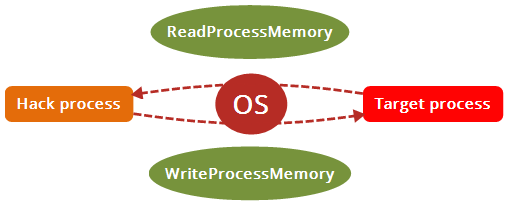


*请注意，这不是唯一的方法，外部作弊可以读取另一个过程存储器 process memory*。
不使用这些函数就可以读取和写入另一个过程存储器，例如通过使用驱动程序（[内核模式，操作系统的更高特权模式。阅读Wikipedia的“ Protection ring”文章以获取更多信息](https://en.wikipedia.org/wiki/Protection_ring)），
但是，由于hack程序仍然作为另一个进程运行，因此从定义上来说，它仍然是一个外部作弊程序。*


### **练习1 “虚拟 Dummy 程序”：编写虚拟目标程序**

本练习有两个目标：
首先，向我们提供一个我们将尝试破解的虚拟极简程序，它将模拟我们的目标游戏/程序。
其次，它是针对读者的过滤器：**如果您在第一次练习中挣扎，则应考虑自己没有该教程的水平，而是应该阅读更多的编程语言课程或首先获得更多的使用经验。**
如果您在缺乏经验的情况下仍然坚持并尝试强迫自己前进，那么您很可能会感到沮丧并过早地放弃黑客冒险。

#### **方向**

您将编写一个简单的控制台程序代码，所有内容都将进入 `main()`中，该程序将执行以下操作：

- 声明一个名为 `varInt` 的变量，其 `int` 类型等于123456
- 声明一个名为 `varString` 的变量，其类型为 `string`，文本为 `"DefaultString"`（仅C ++，如果使用C编写，则忽略）
- 声明一个名为 `arrChar` 的 `char` 数组，其大小为 `128` ，文本为`"Long char array->"`（您可以将其放入声明的常量中）
- 声明一个指向的指针指向 `varInt` 的名为 `ptr2int` 的整数
- 声明一个指向指向 `ptr2int` 的名为 `ptr2ptr` 的 `int` 的指针的指针
- 声明一个指向指向指向 `ptr2ptr` 的名为 `ptr2ptr2` 的 `int` 的指针的指针。


完成此操作后，您将创建一个无限循环，在该循环中，您将：

- 打印到控制台 `"Process ID："`，然后使用 Windows 打印该程序的进程ID。 API函数[GetCurrentProcessId()](https://msdn.microsoft.com/zh-cn/library/windows/desktop/ms683180(v=vs.85).aspx)（因此，请不要忘记 `#include <Windows.h> `）
- 打印到控制台  `"varInt（0x [地址或变量]）= [变量的值]"`（记住您可以通过在变量前面加上“＆”来获取变量的地址）
- 相同操作对 `varString` 和 `varChar` 
- 相同操作对3个指针，例如打印 `"ptr2int"`（`0x [PODDRESS OF POINTER]] = 0x [ADDRESS POINTED] `）
- 打印到控制台“按ENTER重新打印。”
- 暂停一下，您可以使用 `getchar()`或 `system("pause>nul")`
- 打印以控制一行破折号` ("-") `，然后使其循环回到开头。

这是预期的输出本练习的结尾（在按Enter键之后）：

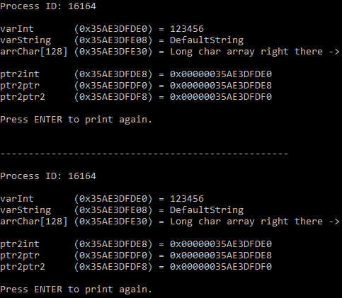

在打印控制台进程ID或内存地址时，您可能会遇到问题，因为进程ID应该以十进制打印，而内存地址以十六进制打印。除此之外，由于我有点强迫症，所以我希望内存地址使用大写字母。在C ++中，您可以执行以下操作以十进制输出：

```c++
cout << "In decimal: " << dec << 255 << endl;    
// output "In decimal: 255"
```

并以十六进制的**大写形式显示**（我添加了前缀“ 0x”，以使读者知道后面是十六进制的）：

```c++
cout << "In hexadecimal: 0x" << hex << uppercase << 255 << endl; 
// output "In hexadecimal: 0xFF"
```

不要忘记在 `#includes` 和 `#declaration`之后添加 `"using namespace std;"`。也可以

```c++
std::cout << "In hexadecimal: 0x" << std::hex << std::uppercase << 255 << std::endl;
```


#### **答案**

```c++
#include <Windows.h>
#include <iostream>
#include <string>
 
#define CHAR_ARRAY_SIZE 128
 
using namespace std;
 
int main() {
	int varInt(123456);
	string varString("DefaultString");
	char arrChar[CHAR_ARRAY_SIZE] = "Long char array right there ->";
	int* ptr2int(&varInt);
	int** ptr2ptr(&ptr2int);
	int*** ptr2ptr2(&ptr2ptr);
 
	do {
		cout << "Process ID: " << dec << GetCurrentProcessId() << endl;
		cout << endl;
		cout << "varInt       (0x" << hex << uppercase << (uintptr_t)&varInt << ") = " << dec << varInt << endl;
		cout << "varString    (0x" << hex << uppercase << (uintptr_t)&varString << ") = " << varString << endl;
		cout << "arrChar[" << dec << CHAR_ARRAY_SIZE << "] (0x" << hex << uppercase << (uintptr_t)&arrChar << ") = " << arrChar << endl;
		cout << endl;
		cout << "ptr2int      (0x" << hex << uppercase << (uintptr_t)&ptr2int << ") = 0x" << ptr2int << endl;
		cout << "ptr2ptr      (0x" << hex << uppercase << (uintptr_t)&ptr2ptr << ") = 0x" << ptr2ptr << endl;
		cout << "ptr2ptr2     (0x" << hex << uppercase << (uintptr_t)&ptr2ptr2 << ") = 0x" << ptr2ptr2 << endl;
		cout << endl;
		cout << "Press ENTER to print again." << endl;
		getchar();
		cout << endl << "---------------------------------------------------" << endl << endl;
	} while (true);
	
	return EXIT_SUCCESS;
}
```

`uintptr_t` 无符号整数，能够存储指针。`"(uintptr_t)"`，可选，只允许输出它们的地址，取消 `0x`。


```
Process ID:5800

varInt    (0x62FD38) = [1E240]
varString (0x62FD10) = [DefaultString]
varchar   (0x62FC90) = [Long char array right there ->]

ptr2int   (0x62FC88) = 0x[0x62fd38]
ptr2ptr   (0x62FC80) = 0x[0x62fc88]
ptr2ptr2  (0x62FC78) = 0x[0x62fc80]


Process ID: 14512

varInt       (0x62FD38) = 123456
varString    (0x62FD10) = DefaultString
arrChar[128] (0x62FC90) = Long char array right there ->

ptr2int      (0x62FC88) = 0x0x62fd38
ptr2ptr      (0x62FC80) = 0x0x62fc88
ptr2ptr2     (0x62FC78) = 0x0x62fc80

Press ENTER to print again.
```


---

### **练习2 “读取”：读取另一个进程的内存**

#### **ReadProcessMemory**

将使用 [ReadProcessMemory](https://msdn.microsoft.com/zh-cn/library/windows/desktop/ms680553(v=vs.85).aspx) 函数从 dummy 程序的内存中读取一些变量。

```c++
BOOL ReadProcessMemory(
  HANDLE  hProcess,             
  LPCVOID lpBaseAddress,
  LPVOID  lpBuffer,
  SIZE_T  nSize,
  SIZE_T  *lpNumberOfBytesRead
);

return true/false
```

> `hProcess` :  正在读取内存的进程的句柄。句柄必须对进程具有对 `PROCESS_VM_READ` 访问权限。
>
> `lpBaseAddress` : **指向**指定进程specified process中要读取的**基址**base address的指针。在进行任何数据传输之前，系统会验证指定大小的基址和内存中的所有数据**是否可用于读取访问**，如果不可访问，该功能将失败。
>
> `lpBuffer` : **指向缓冲区**的指针，该缓冲区从指定进程的地址空间接收内容。
>
> `nSize` : 要从指定进程中读取的字节数。
>
> `*lpNumberOfBytesRead` : **指向变量**的指针，该变量接收传输到指定缓冲区的字节数。如果`lpNumberOfBytesRead` 为空，则忽略该参数。

Windows 管理各种资源，访问和权限。在我们的例子中，我们需要**请求**对目标程序的访问，并具有足够的**权限**来读取和写入其程序存储器。这就是 `"HANDLE"` 类型的**第一个参数 **`_In_ DWORD dwProcessId`，它实际上是操作系统给出的**授权**。**为了避免混淆，只需将HANDLE作为操作系统给出的授权号即可。**通过阅读下一小节 **OpenProcess** 了解访问权限，

我们现在有了可以与 `ReadProcessMemory()` 一起使用的宝贵句柄，让我们继续阅读 `ReadProcessMemory()` 的**第二个参数** `"_In_ LPCVOID lpBaseAddress"`。`LPCVOID`只是一个`void* const`（LP代表Long Pointer，C代表Constant，VOID代表 void）。文档解释非常清楚：指向要从中读取的指定进程中的基址的指针。因此，我们在此处提供要在目标进程中读取的地址。我们在 dummy 程序中将其打印到控制台：

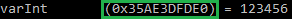


此行表示**值** 123456 存储在**内存地址** `0x35AE3DFDE0` 中。这就是我们赋给函数的第二个参数。编译器不希望直接将地址作为参数，因为它似乎只是一个数字，并且该函数需要一个`LPCVOID`，因此，将其像这样作为 `LPCVOID` 进行类型转换：

```c++
(LPCVOID)0x35AE3DFDE0
```

**第三个参数** `"_Out_ LPVOID lpBuffer"`， 文档明确：指向缓冲区的指针，该缓冲区从指定进程的地址空间接收内容。“缓冲区”仅表示**内存中的位置**。

作为练习的第一个任务，我们将只读取整数类型的第一个变量，即数字123456。因此，我们将声明一个也初始化为0的整数类型的变量，名为 `"intRead"`（` int intRead = 0;`）在我们的黑客程序中，该程序将读取 dummy 程序的内存，并提供该变量的地址（`&intRead`）作为缓冲区。结果，如果 `ReadProcessMemory()` 成功，则变量 `intRead ` 将等于我们试图在目标进程中读取的变量的任何值。

**第四个参数** `"_In_ SIZE_T nSize"`。这是要读取的大小。在第一个练习中，我们正在读取一个整数。整数通常为 4 个字节，因此我们可以给函数 `"4"`，但我们宁愿给它一个 `sizeof(int)` 值，它会自动给它一个 `int` 的大小。如果我们想读取一些文本，例如一个char数组，则可以给它指定数组的大小，或者要读取的文本的大小。

**第五个参数** ` "_Out_ SIZE_T *lpNumberOfBytesRead"` 允许我们在类型为 `SIZE_T` 的变量中检索读取的字节数。因此，我们可以声明一个初始化为0（`SIZE_T bytesRead = 0;`）的名为 `bytesRead` 的变量 `SIZE_T` ，并将其地址（`&bytesRead` ）赋予 `ReadProcessMemory()` 的第五个参数 。例如，这对于错误检查很有用，但是，为了简单，我们将其设置为NULL。

**最后**，`ReadProcessMemory()` 返回一个`BOOL` ，让我们知道一切是否顺利，我们可以使用它来检查操作是否成功。


---

#### OpenProcess

为了获得此必需的HANDLE，我们将使用Windows API函数 [OpenProcess](https://msdn.microsoft.com/zh-cn/library/windows/desktop/ms684320(v=vs.85).aspx) 。

```c++
HANDLE OpenProcess(
  DWORD dwDesiredAccess,
  BOOL  bInheritHandle,
  DWORD dwProcessId
);

return HANDLE
```

> `dwDesiredAccess` ：对 process 对象的访问。根据进程的**安全描述符 security descriptor **检查该访问权限。此参数可以是一个或多个**进程访问权限 [Access Rights](https://docs.microsoft.com/zh-cn/windows/win32/procthread/process-security-and-access-rights)**。如果调用者启用了 SeDebugPrivilege 特权，则无论安全描述符的内容如何，都将授予所请求的访问权限。
>
> `bInheritHandle` ：如果该值为真，由该进程创建的进程将**继承句柄**。否则，进程不会继承此句柄。 
>
> `dwProcessId` ：要打开的本地进程的标识符。 
>
> 如果指定的进程是系统空闲进程(0x00000000)，则该函数失败，最后一个错误代码是 `ERROR _ INVALID _ PARAMETER`。如果指定的进程是系统进程或客户端服务器运行时子系统(CSRSS，Client Server Run-Time Subsystem)进程之一，此函数将失败，最后一个错误代码是 `ERROR_ACCESS_DENIED`，因为它们的访问限制阻止用户级代码打开它们。 如果您使用 `GetCurrentProcessId` 作为此函数的参数，请考虑使用 `GetCurrentProcess` 而不是 `OpenProcess`，以提高性能。

您可以在**进程访问权限 [Access Rights](https://docs.microsoft.com/zh-cn/windows/win32/procthread/process-security-and-access-rights)**文档中看到很多可用的权限，从 `PROCESS_ALL_ACCESS`（对process 对象的所有可能的访问权限）到 `PROCESS_QUERY_LIMITED_INFORMATION` （需要检索有关process 的某些信息）以及许多其他权限。为了简单起见，我们将使用 `PROCESS_ALL_ACCESS` 请求对目标进程的所有可能的权限。一个好的做法是将所请求的权限限制为最小有用，但是稍后我们会进行处理。

第二个参数 `"_In_ BOOL bInheritHandle"`。此定义是子进程可继承的句柄（请求的授权）。如果我们将其设置为TRUE，则**我们程序的所有子进程也将具有此授权**。由于我们不需要它，因此将其设置为FALSE。

第三个参数 `"_In_ DWORD dwProcessId"`。这是我们要访问的流程的唯一流程标识号，通常缩写为 “Process ID” 或 "PID"。我们在虚拟程序中使用 `GetCurrentProcessId()` 将其打印到控制台。

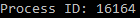

否则，即使没有它，我们也可以使用这个不错的旧任务管理器或任何管理软件（例如Process Hacker或Process Explorer）找到它：

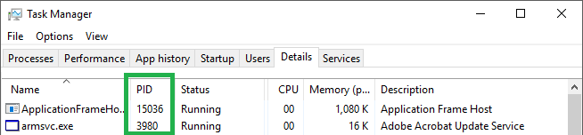

然后，将其提供给我们的 Dummy 程序PID。如果您充分阅读了 `OpenProcess` 文档，那么您将了解：

> 如果函数失败，返回值为NULL。要获取扩展的错误信息，请调用`GetLastError`。

然后，我们可以在代码中添加一个简单的检查，以确保一切顺利：

```c++
HANDLE hProcess = OpenProcess(PROCESS_ALL_ACCESS, FALSE, [OUR DUMMY PROGRAM PID]);
if (hProcess == NULL) { // Failed to get a handle
	cout << "OpenProcess failed. GetLastError = " << dec << GetLastError() << endl;
	system("pause");
	return EXIT_FAILURE;
}
```

这样，如果发生错误，您还将获得 `GetLastError()`返回的错误代码，这将帮助您解决问题。在这种情况下，只需转到[MSDN错误代码页面](https://msdn.microsoft.com/zh-cn/library/windows/desktop/ms681381(v=vs.85).aspx)并查找您的错误代码。


---

#### **练习指导**


在开始本练习之前，请启动我们的虚拟程序并运行它。

您将要编写一个控制台程序，该控制台程序将：

- 声明一个名为 `"intRead"` 的`int` 类型的变量，初始化为 0
- 获取正在运行的虚拟程序的句柄（使用 `OpenProcess` 并使用检查代码来检查它是否成功，如果发生错误，请使用错误代码来调查原因）
- 读取变量在虚拟程序中 `"varInt"` ，并将结果存储在变量 `"intRead"` 中（使用`ReadProcessMemory()` 和上一步得到的句柄，内存地址显示在我们的虚拟程序的控制台中，不要忘记添加前缀 `LPCVOID` 来类型转换它，使通过简单地用 `&intRead`给出它的内存地址，将结果存储在我们的变量 `"intRead"` 中作为缓冲区，使用 `sizeof(int)` 作为大小，并让最后一个可选参数为空）

- 将变量 `"intRead"` 的新值打印到控制台（`cout << "intRead = " << dec << intRead << endl; `）
- 打印 `"Press ENTER to quit."`。并使用 `getchar()`或 `system("pause > nul");` 暂停执行；

预期的输出应该只是：

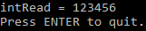

轮到您玩了！继续编写代码！


#### **故障排除**

**OpenProcess 失败**
如果dummy 程序是以管理员身份运行的，则确保您的2个**进程以相同的特权运行**，否则其他程序可能会失败。如果直接从Visual Studio运行 dummy 程序，请尝试双击磁盘上的二进制文件以正常运行它。

**intRead仍等于0：**
首先确保 `OpenProcess` 成功。其次，测试 `ReadProcessMemory`的返回值，它应该返回TRUE，否则，如果返回FALSE，则可以使用 `GetLastError()`获取错误代码以获取有关该错误的更多信息。这是您可以使用的一些检查代码：

```c++
BOOL rpmReturn = ReadProcessMemory(hProcess, (LPCVOID)0x35AE3DFDE0, &intRead, sizeof(int), NULL);
if (rpmReturn == FALSE) {
	cout << "ReadProcessMemory failed. GetLastError = " << dec << GetLastError() << endl;
	system("pause");
	return EXIT_FAILURE;
}
```

**如果intRead不等于0但不等于期望值，则：**检查PID和内存地址。还要确保在两个程序中都声明了一个`int`。尝试针对**相同的体系结构**（即使x86或x64都可以跨体系结构使用）编译并运行它们。

**如果您遇到错误并且有错误代码，请转到MSDN上的[错误代码列表](https://msdn.microsoft.com/en-us/library/windows/desktop/ms681381(v=vs.85).aspx)，并使用有关该错误的其他信息来尝试解决此问题。**


#### **解决方案（C++）**

*在此解决方案中，我提示用户读取PID和内存地址，而不是对值进行硬编码，这是改善程序的一种方法*

```C++
int main() {
	DWORD pid = 0; // The process ID of our target process
	cout << "PID: ";
	cin >> dec >> pid; // Prompting user for PID
 
	HANDLE hProcess = OpenProcess(PROCESS_ALL_ACCESS, FALSE, pid);
	if (hProcess == NULL) { // Failed to get a handle
		cout << "OpenProcess failed. GetLastError = " << dec << GetLastError() << endl;
		system("pause");
		return EXIT_FAILURE;
	}
 
	// Prompting user for memory address to read
	uintptr_t memoryAddress = 0x0;
	cout << "Memory address of the integer to read (in hexadecimal): 0x";
	cin >> hex >> memoryAddress;
	cout << "Reading 0x" << hex << uppercase << memoryAddress << " ..." << endl;
 
	// Reading the integer from other process
	int intRead = 0;
	BOOL rpmReturn = ReadProcessMemory(hProcess, (LPCVOID)memoryAddress, &intRead, sizeof(int), NULL);
	if (rpmReturn == FALSE) {
		cout << "ReadProcessMemory failed. GetLastError = " << dec << GetLastError() << endl;
		system("pause");
		return EXIT_FAILURE;
	}
 
	cout << "intRead = " << dec << intRead << endl;
	
	cout << "Press ENTER to quit." << endl;
	system("pause > nul");
 
	return EXIT_SUCCESS;
}
```


---

#### 扩展

**Reading pointers, following pointer chains, reading text**

给几个子任务，可以执行这些子任务来改善您的小型 hack/memory 读取器。


##### **读指针**

这绝对是您在作弊中需要的，因此，我强烈建议这样做。您将在我们的 dummy 程序中读取指针`"ptr2int"` 的值，然后读取此指针所指向的地址处的值 123456。

**处理指针时要记住的重要事项：** x86指针的长度为4个字节（32位），而x64指针的长度为8个字节（64位），因此请根据目标程序的体系结构调整参数 `"nSize"` 或 `ReadProcessMemory`。

```c++
cout << "The value that the pointer `ptr2int` point to is " << dec << *ptr2int << endl;
```


##### **遵循指针链**

您应该先完成上一个练习，现在可以遵循指针链 chain 了。在黑客社区的大多数逆向主题中，您会发现游戏中有价值的信息的偏移，例如，指向血量的指针链。这将以以下格式编写：

`BASE_ADDRESS ] + OFFSET1 ] + OFFSET2`

在这种语法中，`"]"` 表示取消引用（读取值）。这意味着您应该取消引用（读取值）位于`BASE_ADDRESS` 的指针，然后将 `OFFSET1` 的值添加到该地址，取消引用（读取值）那里的任何值，然后添加到该地址 `OFFSET2` 并将该地址读取到获得健康的价值。


在我们的虚拟程序中，没有偏移量，指针 `ptr2ptr2` 直接指向 `ptr2ptr` 所在的位置，`ptr2ptr` 直接指向 `ptr2int`，而 `ptr2int` 指向 `varInt` 我们的链因此是：

`[ADDRESS OF ptr2ptr2] ] + 0 ] + 0 ] + 0`

您可以创建一个函数，输入一个链表( vector )，该链表包含要跟随的基址和偏移量（使用vector ` <uintptr_t>`）

```c++
vector<uintptr_t> vec;
vec.push_back(&ptr2ptr2);
vec.push_back(0);
vec.push_back(0);
vec.push_back(0);

// &ptr2ptr2, 0, 0, 0
```


##### **一个 [OpenProcess](https://msdn.microsoft.com/zh-cn/library/windows/desktop/ms684320(v=vs.85).aspx) 弊端**

我们以 `PROCESS_ALL_ACCESS` 作为第一个参数请求了对句柄的所有权限，但并不需要那么多权限。我们仅使用 `ReadProcessMemory` ，因此请阅读该函数的文档，并在我们的 `OpenProcess` 调用中请求最低权限。

```c++
//HANDLE hProcess = OpenProcess(PROCESS_ALL_ACCESS, FALSE, 12076);//所有权限
HANDLE hProcess = OpenProcess(PROCESS_VM_READ, FALSE, PID);//只读权限
```


##### **另一个 [OpenProcess](https://msdn.microsoft.com/zh-cn/library/windows/desktop/ms684320(v=vs.85).aspx) 弊端**

使用 `OpenProcess`，我们要求系统提供一个`HANDLE`，但是，如果您阅读了文档，您会发现我们在不再需要它时应该适当地销毁它，以避免我们所谓的"资源泄漏"/"Resource leak"。再次阅读文档，找到完成的方法并将其包含在您的代码中。[CloseHandle](https://docs.microsoft.com/en-us/windows/win32/api/handleapi/nf-handleapi-closehandle) 函数

```c++
BOOL CloseHandle(
  HANDLE hObject
);
return true/false
```

> `hObject`: A valid handle to an open object.

```c++
bool closehandle = CloseHandle(hProcess);
if (closehandle) {
    cout << "Handle has been closed!" << endl;
} else {
    cout << "Handle Close failed. GetLastError = " << dec << GetLastError() << endl;
}
```


##### **从 `varString` 和 `arrChar` 读取文本**

您应该能够从 `varString` 和 `arrChar` 读取文本。为此，您应该调整作为 `ReadProcessMemory` 参数提供的大小，并且还具有足够大的缓冲区来容纳读取的文本。直接的解决方案是使用足够大小的数组，否则C++对象字符串允许您使用一种方法来保留内存，您可以尝试实现该方法。

```c++
// test1D.cpp
change &varString   →  &varString[0]
```


```c++
// test2D.cpp
// read varString 
char stringRead[20];
readprocessR = ReadProcessMemory(hProcess, (LPCVOID)memoryAddress, &stringRead, 20, NULL);

// read arrChar
char charRead[128];
readprocessR = ReadProcessMemory(hProcess, (LPCVOID)memoryAddress, &charRead, 128, NULL);
```


##### **犯一些错误！**

尝试读取目标中的随机地址或地址0，并查看 `ReadProcessMemory` 返回的内容和错误代码，然后在[MSDN错误代码页面](https://msdn.microsoft.com/zh-cn/library/windows/desktop/ms681381(v=vs.85).aspx)中查找该代码，并查看您是否能够理解为什么这样做无效。

与 `OpenProcess` 相同，如果尝试打开不存在的进程ID会怎样？您从 `GetLastError()` 得到什么错误代码？你能理解吗？

如果您获得权限不足的句柄怎么办？假设您仅使用 `PROCESS_QUERY_LIMITED_INFORMATION` 调用 `OpenProcess` ，然后尝试将此句柄与 `ReadProcessMemory` 一起使用，会发生什么情况？错误代码说什么？

```c++
GetLastError = 5;

_拒绝访问 _ 错误
5 (0x5)
访问被拒绝。
```


##### **Pimp it up!**

您也可以根据需要修改程序输出，提示用户输入`PID` 和 `内存地址` 。您还可以询问用户我们要阅读什么：数字或文本，还可以询问用户要阅读文本的长度。

```c++
int PID;
cout << "Please input the PID: ";//15440
cin >> dec >> PID;

uintptr_t memoryAddress;
cout << "Please input the memoryAddress: ";//0x62FD38
cin >> hex >> memoryAddress;

string s;
cout << "which type do you want to read?  int(default)/string/char: ";
cin >> s;

switch s:
```


---

### **练习3 “写”：写另一个进程的内存**

我们现在要用 `WriteProcessMemory` 写入目标进程的内存。好消息：`WriteProcessMemory` 非常类似于 `ReadProcessMemory`。唯一的主要区别是它在另一个过程中将缓冲区中的内容写入地址。

#### **方向**

#### WriteProcessMemory

运行 dummy 程序，以便我们可以对其进行写入。首先阅读MSDN上 [WriteProcessMemory](https://msdn.microsoft.com/zh-cn/library/windows/desktop/ms681674(v=vs.85).aspx) 的整个文档页面（习惯于对我们需要使用的所有新函数进行操作）。该函数与 `ReadProcessMemory` 非常相似。

```C++
BOOL WriteProcessMemory(
  HANDLE  hProcess,
  LPVOID  lpBaseAddress,
  LPCVOID lpBuffer,
  SIZE_T  nSize,
  SIZE_T  *lpNumberOfBytesWritten
);

return true/false
```

> `hProcess` :  正在读取内存的进程的句柄。句柄必须对进程具有对 `PROCESS_VM_READ` 访问权限。
>
> `lpBaseAddress` : **指向**指定进程specified process中要读取的**基址**base address的指针。在进行任何数据传输之前，系统会验证指定大小的基址和内存中的所有数据**是否可用于读取访问**，如果不可访问，该功能将失败。
>
> `lpBuffer` : **指向缓冲区**的指针，该缓冲区从指定进程的地址空间接收内容。
>
> `nSize` : 要从指定进程中读取的字节数。
>
> `*lpNumberOfBytesWritten` : **指向变量**的指针，该变量接收传输到指定进程中的字节数。如果`lpNumberOfBytesWritten` 为空，则忽略该参数。

唯一的区别是：

- 您将变量 `intRead` 重命名为 `intToWrite`（我喜欢显式变量名称），并将其初始化为987654（或您选择的编号）
- 您显然将调用 `WriteProcessMemory` 而不是 `ReadProcessMemory`，可以保持相同的错误检查代码（只需将 `rpmStatus` 重命名为 `wpmStatus`，将输出的文本 `ReadProcessMemory failed` 更改为 `WriteProcessMemory failed`，以及其他使源代码更整洁和更明确的细微调整）
- 对于 `WriteProcessMemory`，第二个参数不是 `LPCVOID`，`LPVOID`，因此将类型转换更改为（`LPVOID`）
- 只需打印 `Overwritten successfully` ，而不是打印到控制台 `intRead = ...`，（此消息和最后一条消息 `Press ENTER to quit.` 将是唯一打印到控制台的内容）

完成此操作后，只需运行该程序即可，如果没有错误，并按预期在控制台中看到 `Overwritten successfully`，请切换回正在运行的虚拟程序，然后按 `Enter` 键再次打印变量地址和值，您应该会看到 `varInt` 重写为新值，如以下屏幕截图所示：

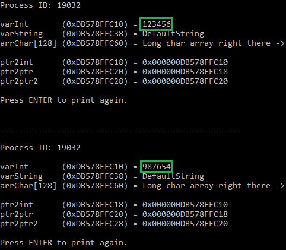

如果遇到问题，请参考练习1的“疑难解答”部分，相同的建议也适用于当前练习。

#### **解决方案（C ++）**

在此代码中，再次提示用户输入PID，内存地址和要覆盖的值。您可以在解决方案之前自己实施它，这是一项额外的任务，以获得更多的经验，它永远不会有害。

```c++
#include<Windows.h>
#include<iostream>
using namespace std;

int main () {
    DWORD PID = 0;
    cout << "Please input the PID: ";//15440
    cin >> dec >> PID;

    HANDLE hProcess = OpenProcess(PROCESS_ALL_ACCESS, FALSE, PID);//所有权限
    if (hProcess == NULL) {
        cout << "OpenProcess failed. GetLastError = " << dec << GetLastError() << endl; // 十进制
    }

    uintptr_t memoryAddress = 0x0;
    cout << "Please input the memoryAddress: ";//0x62FD38
    cin >> hex >> memoryAddress;

    int intToWrite = 987654;
    char charToWrite[10] = {'a','b','c','d',' ','e','f',' ','g','h'};
    char stringToWrite[10] = {'a','b','c','d',' ','e','f',' ','g','h'}
    bool readprocessR;

    string s;
    cout << "which type do you want to write?  int(default)/string/char: ";
    cin >> s;

    if (s == "char") {
        readprocessR = WriteProcessMemory(hProcess, (LPVOID)memoryAddress, (LPCVOID)&charToWrite, 10, NULL);
        if (readprocessR) {
            cout << "Overwritten successfully" << endl;
        } else {
            cout << "Overwritten failed" << endl;
        }
    } else if (s == "string") {
        readprocessR = WriteProcessMemory(hProcess, (LPVOID)memoryAddress, (LPCVOID)&stringToWrite, 10, NULL);   
        if (readprocessR) {
            cout << "Overwritten successfully" << endl;
        } else {
            cout << "Overwritten failed" << endl;
        }
    } else {
        readprocessR = WriteProcessMemory(hProcess, (LPVOID)memoryAddress, (LPCVOID)&intToWrite, sizeof(int), NULL);
        if (readprocessR) {
            cout << "Overwritten successfully" << endl;
        } else {
            cout << "Overwritten failed" << endl;
        }
    }

    bool closehandle = CloseHandle(hProcess);
    if (closehandle) {
        cout << "Handle has been closed!" << endl;
    } else {
        cout << "Handle Close failed. GetLastError = " << dec << GetLastError() << endl;
    }

    cout << "Press ENTER to quit." << endl;
    system("pause > nul");
    return 0;
}

//SELECT * FROM `car_order_del` WHERE order_status = 'TRADE_SUCCESS' AND receipt_amount != '0' AND order_time > '2021-04-18 13:00:00' 
```


#### 扩展

##### **一个 [OpenProcess](https://msdn.microsoft.com/zh-cn/library/windows/desktop/ms684320(v=vs.85).aspx) 弊端**

我们以 `PROCESS_ALL_ACCESS` 作为第一个参数请求了对句柄的所有权限，但并不需要那么多权限。我们仅使用 `WriteProcessMemory` ，因此请阅读该函数的文档，并在我们的 `OpenProcess` 调用中请求最低权限。

```c++
//HANDLE hProcess = OpenProcess(PROCESS_ALL_ACCESS, FALSE, PID);//所有权限
HANDLE hProcess = OpenProcess(PROCESS_VM_WRITE, FALSE, PID);//只写权限

//报错
_拒绝访问 _ 错误
5 (0x5)
访问被拒绝。
```


##### **另一个 [OpenProcess](https://msdn.microsoft.com/zh-cn/library/windows/desktop/ms684320(v=vs.85).aspx) 弊端**

使用 `OpenProcess`，我们要求系统提供一个`HANDLE`，但是，如果您阅读了文档，您会发现我们在不再需要它时应该适当地销毁它，以避免我们所谓的"资源泄漏"/"Resource leak"。再次阅读文档，找到完成的方法并将其包含在您的代码中。[CloseHandle](https://docs.microsoft.com/en-us/windows/win32/api/handleapi/nf-handleapi-closehandle) 函数

```c++
BOOL CloseHandle(
  HANDLE hObject
);
return true/false
```

> `hObject`: A valid handle to an open object.

```c++
bool closehandle = CloseHandle(hProcess);
if (closehandle) {
    cout << "Handle has been closed!" << endl;
} else {
    cout << "Handle Close failed. GetLastError = " << dec << GetLastError() << endl;
}
```


##### **从 `varString` 和 `arrChar` 写入文本**

您可以 overwrite  `arrChar` 和 `varString` 中的文本。由于 `arrChar` 具有固定大小，因此您可以覆盖更长的文本，但是，`varString` 的对象 string 可以使所需的内存使用得很小，因此，如果将其覆盖为更长的文本字符串，则可能会出现问题.

```c++
// test2D.cpp
char charToWrite[10] = {'d','u','a','n',' ','y','a',' ','q','i'};
char stringToWrite[10] = {'d','u','a','n',' ','y','a',' ','q','i'};

readprocessR = WriteProcessMemory(hProcess, (LPVOID)memoryAddress, (LPCVOID)&charToWrite, 10, NULL);

readprocessR = WriteProcessMemory(hProcess, (LPVOID)memoryAddress, (LPCVOID)&stringToWrite, 10, NULL);   
```


##### **犯一些错误！**

尝试读取目标中的随机地址或地址0，并查看 `WriteProcessMemory` 返回的内容和错误代码，然后在[MSDN错误代码页面](https://msdn.microsoft.com/zh-cn/library/windows/desktop/ms681381(v=vs.85).aspx)中查找该代码，并查看您是否能够理解为什么这样做无效。

与 `OpenProcess` 相同，如果尝试打开不存在的进程ID会怎样？您从 `GetLastError()` 得到什么错误代码？你能理解吗？

如果您获得权限不足的句柄怎么办？假设您仅使用 `PROCESS_QUERY_LIMITED_INFORMATION` 调用 `OpenProcess` ，然后尝试将此句柄与 `WriteProcessMemory` 一起使用，会发生什么情况？错误代码说什么？

```c++
GetLastError = 5;

_拒绝访问 _ 错误
5 (0x5)
访问被拒绝。
```


##### **Pimp it up!**

您也可以根据需要修改程序输出，提示用户输入`PID` 和 `内存地址` 。您还可以询问用户我们要阅读什么：数字或文本，还可以询问用户要阅读文本的长度。

```c++
DWORD PID;
cout << "Please input the PID: ";//15440
cin >> dec >> PID;

uintptr_t memoryAddress;
cout << "Please input the memoryAddress: ";//0x62FD38
cin >> hex >> memoryAddress;

string s;
cout << "which type do you want to read?  int(default)/string/char: ";
cin >> s;

switch s:
```


### 练习4 "Basic reversing":使用CE & ReClass on Assault Cube

我们现在要告别我们的虚拟程序，开始黑客攻击一个真正的游戏: `Assault Cube`！！ 它是免费的、开源的、无保护的，非常适合我们学习。 下载游戏 `Assault Cube` 。安装后运行。配置它在 `窗口模式` 。


首先我们来定义一下什么是 reverse engineering。我们称之为“逆向工程”，即我们用各种工具(如 `disassembler` 反汇编器、`debugger` 调试器、`memory scanner` 内存扫描仪和许多其他工具) 分析程序 (通常我们没有源代码) 以了解游戏如何在**内部运行的任务**。

在我们的例子中，我们特别感兴趣的是有价值信息的存储位置，例如我们的血量、子弹、3D位置和其他变量、地图上敌人的数量及其信息等。

我们首先将使用 memory scanner 内存扫描仪 来定位我们的玩家信息在**内存中的存储位置**，在本教程中，我将使用 **Cheat Engine**，但是也可以使用其他内存扫描仪，例如由一个天才编码的**Cry Search**。

内存扫描器基本上允许你在内存中寻找特定的值，并把它们存储在一个列表中，它已经扫描了所有的内存，你可以在第一次找到的结果中搜索另一个值。这可用于确定弹匣中的子弹数量，例如:

假设你的弹匣里有20颗子弹，你扫描游戏的内存，找到等于20的内存地址，它找到等于20的全部地址，然后你射出一颗子弹，你现在弹匣里有19颗子弹，所以你在你找到的地址中扫描，哪一个等于20。

如果您仍然有太多的结果，只需再射一发子弹或装弹来更改该值，并扫描新值，直到您隔离了该值所在的位置。有时你会剩下几个内存地址，而不仅仅是一个，因为有时**值会存储在几个地方**，例如一个是**“真实”值**，另一个只是**用于显示**，然后你可以实验和测试哪一个实际上改变了你在弹匣中的子弹。


开始游戏，或者如果你已经开始了，在没有其他玩家的情况下创建一场比赛(press Escape then go to Single player > Empty map and select a map of your choice)。

花一点时间在游戏中给自己取一个昵称，如果可能的话，长度超过6个字符，你可以通过进入菜单(退出)，然后进入Settings > Gameplay settings。

现在启动作弊引擎，并通过点击左上角“文件”下方的变色按钮将其附加到游戏中，然后选择游戏的进程(“ac_client.exe”)。

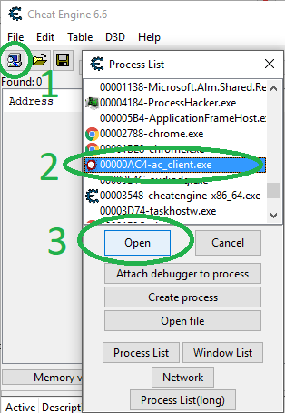

我们在 CE 中 “**附加**” 到游戏时调用的是 `OpenProcess` Windows API函数

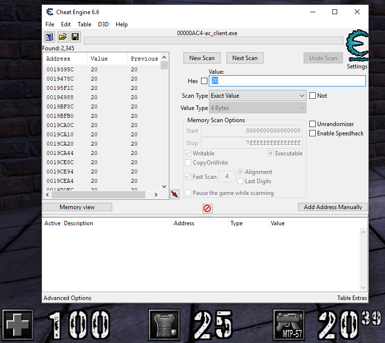

现在进入游戏，射出一颗子弹(或者2颗没关系，只是让当前加载的ammos值有所变化)。

扫描新值(press Enter or click on "Next scan", "New scan" actually delete the current results)

您现在应该有更少的结果。让我们重复操作。您应该只剩下2个值。

您会注意到，每次您射出子弹时，这两个值都会发生变化，这意味着我们很可能找到了我们要找的东西！

双击左侧窗格中的2个地址，将其添加到已保存地址列表中(显示在底部窗格中):

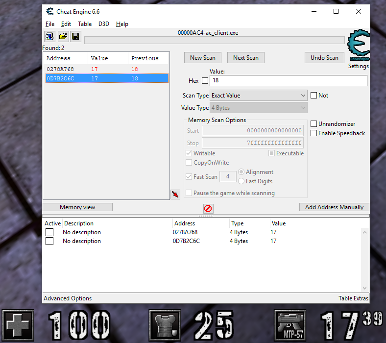


你可以 double click on "No description" ，输入一个更有说服力的名字，比如 “Assault Rifle Loaded Ammos 1” 和 “Assault Rifle Loaded Ammos 2”，养成这个习惯，这样你就知道你后来发现了什么。现在怎么知道哪个是对的？

我们可以试验和使用这些值，例如，检查当您更改一个值而不更改另一个值时会发生什么(just double click on the value in the bottom pane and enter the new value)。

您还会注意到，其中一个值不会改变屏幕上的项目符号数量。好的，让我们试着将存储在这个内存地址的值设置为1，并射出一颗子弹，这会将其设置为0，通常会使我们自动装弹。

继续尝试:武器不装弹，屏幕上的值显示另一个值。

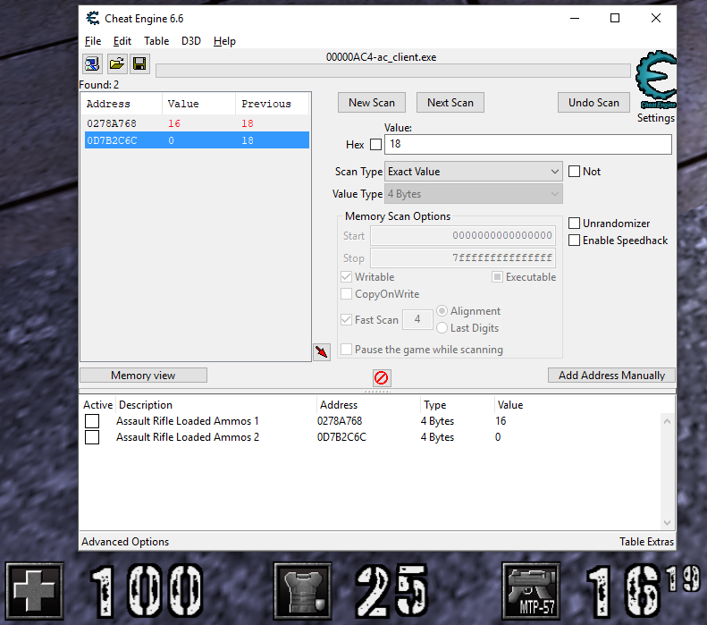


因此，这个内存地址不是我们想要的，而是另一个存储 shooting, reloading 等时使用的“真实”值的地址，你可以删除这个多余的地址，只保留我们感兴趣的地址。

让我们检查一下我们是否有正确的地址：双击该值并设置20，然后点击内存地址左侧的框，“锁定”该值 (overwrite over and over again the value to the one we want) 并在游戏中子弹的数量应该保持在20。实现了无限ammos！！

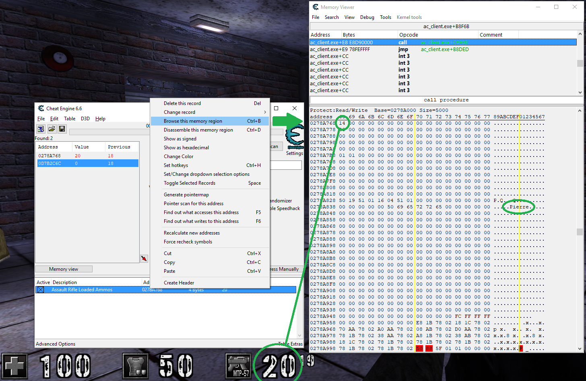

好了，现在让我们看看内存中关于这个值的内容。 右键单击底部窗格中的地址，然后单击 "Browse this memory region"。 这将打开内存资源管理器窗口（memory explorer window），第一个字节是您右键单击的地址的值。在内存视图，尤其是右边的ASCII视图，可以看到一些有趣的东西吗？ 通常你应该在不远处看到你的昵称:

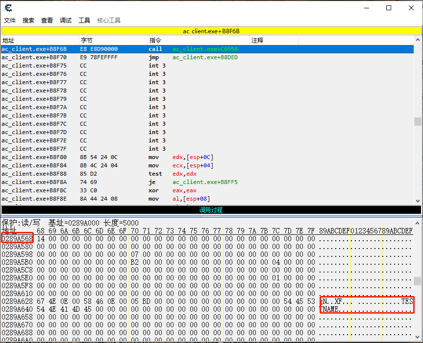

这很有意思，事实上这两条信息如此接近，当然意味着有某种记忆结构保存着我们所有的信息。 好的，让我们将昵称存储的地址保存在已保存地址的列表中，为此，只需**右键**单击昵称的**第一个字符**，然后选择 "Add this address to the list"。

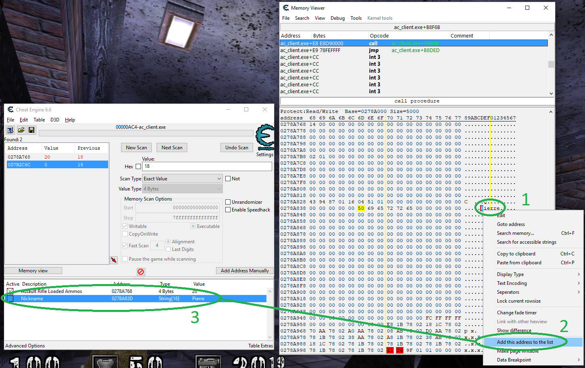

我们还可以观察到突击步枪装载的ammos值和昵称之间的间距为 `0xD5` 字节(在我的屏幕截图中，`0x289A568 - 0x289A63D`)，当对整个结构进行逆向时，我们会确认。 

把游戏放在屏幕的一边，内存视图放在另一边，在内存视图中向上滚动一点，在游戏中做一些事情，四处移动，射出一些子弹，拿起一些子弹，盔甲和其他东西，你会看到一些地址和值**闪烁红色**，这表明发生了变化。这样你就可以定位你的坐标移动，你的血量，你的装甲，你的子弹，等等其他数据


首先，保存你在 CE 中找到的地址 (CTRL + S, or File > Save As, or click on the floppy disk/save icon) 保存在某个地方，以防万一。 

通过保存您的结果，您可以稍后重新打开它们，非常实用。 

现在，完全退出游戏，然后重新开始。 在你仍然打开的 CE 中，点击 “Attach” 按钮，把它重新附加到 Assault Cube ("ac_client.exe")。

CE 会问你是否要保留当前的address list/code list，回答是。 

看看ammos的值和昵称，它不再读取该死的值了！！ 

这是因为每次运行游戏时，**存储数据的最终地址都会发生变化**。游戏的**二进制映像加载到一个基址**，然后在运行前无法预测的地址分配内存。幸运的是，总有一种方法可以找到这个最终地址，方法是**遵循从静态地址开始的指针链**，或者至少相对于我们在程序上可以找到的基址。为此，我们将使用一种称为 **pointer scanning** 指针扫描的技术。


#### Pointer scanning: The theory

好的，清除你的 CE 或者打开它的一个新实例。
通过扫描当前值来找到您武器中加载的当前子弹，然后发射子弹，用新值重新扫描，以此类推，直到您只有几个结果(我个人最终总是在发射时更新2个值) 通过改变其中一个的值来找到“真正的”那个，然后再次设计，看看它是否真的改变了你的ammos(那么它是正确的地址)或者不是(那么它意味着那不是正确的地址)。找到地址后，双击该地址将其添加到底部窗格的列表中。

右击它，点击"Pointer scan for this address"，一个新的窗口将会打开。

通常情况下，您可以暂时保留默认选项，以防您遇到问题。以下是我的配置:

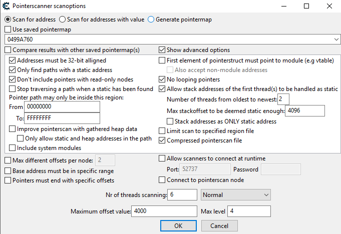

如果你没有勾选 "Show advanced options"，你会有更少的选项，这很可能是好的，只有当你知道你在做什么或有问题时，才去调整选项。您可以将鼠标悬停在复选框上方，以获取有关选项功能的更多帮助和信息。

单击确定，CE 将进行扫描(这可能需要几秒到几分钟，具体取决于配置和您的计算机)，将得到这样的东西:

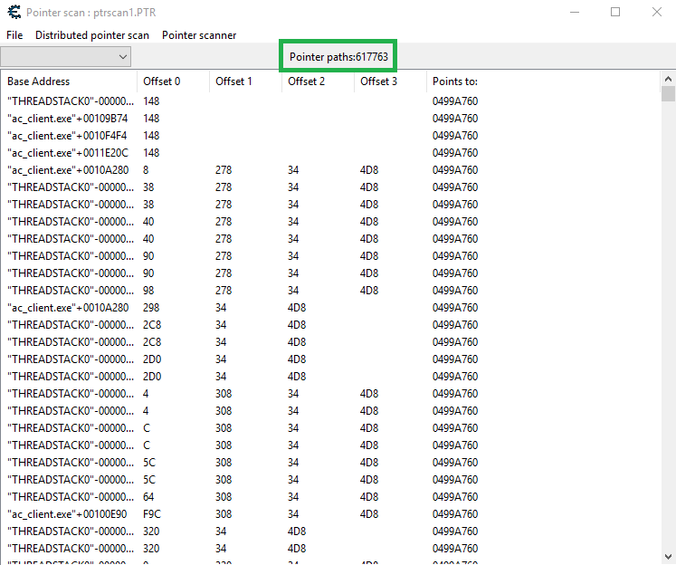

如您所见，在我的案例中，作弊引擎已经找到了 600000 多条路径，这些路径通向存储我们加载的内存值的目标内存地址，这是一个很大的数目，而且其中大多数都是不可靠的，因此我们需要找到一致的指针链，并在每次游戏运行时工作。

保持这个 CE 打开(主 CE 窗口和指针扫描窗口)，退出游戏，然后重新启动它，将 CE 重新连接到游戏(它会问你是否要保留地址列表，说不。我们不需要上次运行ammos的地址，它不会再工作了)。

再一次，用同样的方法找到存储加载的内存地址。一旦你有了我们加载的内存地址，复制内存地址

现在回到指针扫描窗口，点击 Pointer scanner > Rescan memory - Removes pointers not pointing at the right address

一个新的窗口打开并询问我们要找哪个新地址，把新地址贴在我们的地址上。

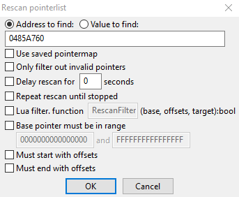

您可以保留默认选项，然后单击确定，CE 将再次扫描。 通常情况下，您应该会看到指针路径的数量减少，重复该操作，**直到指针路径的数量不再显著减少**(关闭游戏，找到子弹的内存地址，指针扫描该地址)。

一旦**指针路径的数量在每次扫描中没有减少**，就按照偏移量对指针进行排序，这样它将首先显示**最短的指针链**，然后按照**最小的偏移量**对它们进行排序。(**点击最后一个offset 3进行排序**)

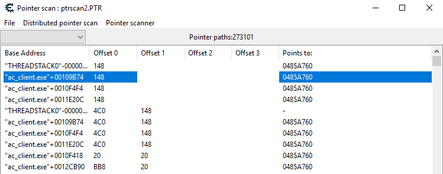

我们将使用从游戏基址开始的第一个指针链(在图像中用蓝色突出显示)。**双击它，这将把它添加到主窗口底部窗格的列表中。**

现在在主窗口上，双击这个新添加的地址，它应该被命名为` “pointerscan result” `。您可以看到它不仅仅是一个直接的内存地址，这是一个指针链，以`“AC_client.exe”+00109B74` 为基础，然后是偏移量 `150` (隐式十六进制，`0x150`)将其重命名为 `“Loaded ammos (pointer chain)”` ，然后单击“确定”。

现在在底部窗格中选择它，并点击复制粘贴它(CTRL + C，CTRL + V，然后单击粘贴)。双击地址新副本的描述，将其重命名为 "My Player - Base" ，然后双击其地址并将指针 148 更改为 0


你可能会想 *"What the hell means ac_client.exe + some address, what's that?"*
这就是我们所说的基址。当窗口创建一个新的进程时，在初始化过程中，**它将程序的二进制映像放在一个特定的地址，我们称之为“基址”来执行**。

默认情况下，窗口使用地址 `0x00400000` 作为基址(这不是强制性的，但在大多数情况下是默认的)。你甚至可以自己做测试来检查你的 Assault Cube 游戏是否有这个基本地址。在 CE 中，只需在主窗口中单击 "Add Address Manually"，然后在地址字段中写入 `“ac_client.exe”`(两边带双引号)，然后单击“确定”，您将在地址列表中看到地址为 `00400000`:

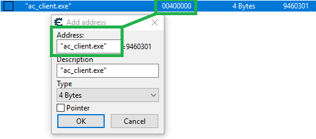


游戏没有理由在不同的地址加载，因此，我们将使用地址 `0x509B74 (0x400000 + 0x109B74)`，而不是使用我们从指针扫描中找到的地址( `"ac_client.exe"+00109B74` )。

双击作弊引擎地址列表中的 `My Player - Base` 地址，用直接地址 `0x509B74` 替换 `"ac_client.exe"+00109B74`。

您可以对 `"Loaded ammos (pointer chain)"` 地址做同样的事情，您会看到，它仍然指向正确的地址，我们仍然可以读取我们枪中加载的子弹数量(如下图所示):

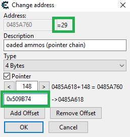


好了，我们现在知道在地址 `0x509B74` 有一个指针，如果我们跟随它(“取消引用” "dereference" it)我们到达一个内存地址，其中加载的ammos数量为 `+0x150`。很有可能这个指针会把我们带到一个有很多其他有价值信息的记忆结构中(例如，我们的血量，装甲，位置，等等...)

让我们看看，右击你的地址 "My Player - Base"，然后点击 "Browse memory region"

> 如果您有问题，您可以简单地通过在主窗口中单击 **手动添加地址**，**勾选指针**，并**输入0x509B74 作为基址**，将 0 作为第一个也是唯一的地址，然后单击确定来获得它。把它命名为 *My Player - Base*

好的，你现在在 Memory Viewer 内存查看器中，这允许我们看到内存中我们想要的内存地址的字节，**地址在左边**，**字节的十六进制表示在中间**，ASCII表示在右边。

如果您查看十六进制或字符串，这可能会有所帮助，但是我们正在寻找**十进制值、浮点值**等...(我们的健康、盔甲、位置等...)。幸运的是，CE 有一个工具，可以让我们更好地**可视化内存结构**。单击顶部菜单上的 **"Tools"**，然后单击 **"Dissect Data/Structures"**，将打开一个新窗口，**其地址通常是我们的指针链所指向的地址**。单击**Structures**，然后**Define new structure**，并将其命名为 "Assault Cube - Player"

CE 会询问您是否希望它使用当前地址填充结构的最基本类型，回答“是”(使用值，它会尝试“猜测”内存地址是否更可能包含**整数、浮点、文本字符串等**...它可能会出错，但我们会手动更正)默认情况下，将该值保留为应该足够的大小(4096)。

当您看到这些值时，您就会明白我们有很多有价值的数据:

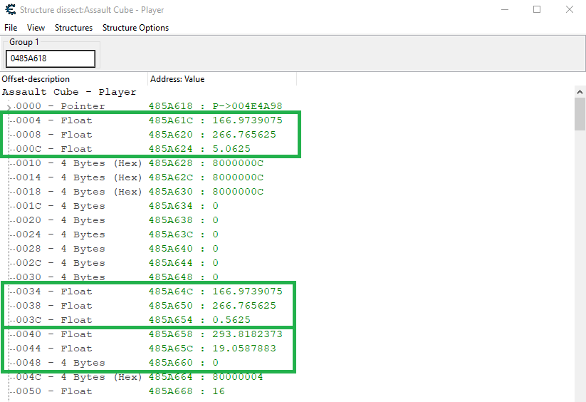


我们可以连续看到一组3个floats，这非常有趣，因为它看起来像3D坐标 (X，Y，Z)，我们称之为**Vector3**(本质上是一个floats[3])。现在把窗户放在一边，在游戏中移动。你看到值改变了吗？我们在那里找到了一些有价值的东西，这无疑是我们玩家的记忆结构。

如何知道什么是Vector3什么？嗯，在游戏中**不要移动，只要移动鼠标**，环顾四周，第一个Vector3 和第二个 Vector3 不会改变，但第三个 Vector3 会。因此，第三个 Vector3 是我们的视角！

您可以双击 CE 中的行并输入描述，分别命名这两行为“View X”和“View X”(第三行也是视图的一部分，但从不改变，对于视角，we also call X, Y and Z "Yaw", "Pitch", and "Roll")

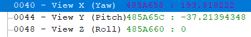

好了，现在前两个 Vector3 是什么？两个 Vector3 的位置都是一样的，除了 Z，第一个 Z 总是比第二个高，但是如果你蹲下，那么差异就减小了，如果你再站起来，距离就增加了。这意味着第一个是头部的位置，第一个是地面的位置！(或脚)。这将有助于我们制作一个总是爆头的aimbot，或者在玩家周围画矩形(我们只需要脚和头的位置就可以做到)。


#### 练习:尽可能逆向一切

现在我想让你识别这个内存结构中的其他东西，例如我们的HPs、装甲、子弹(我们有这个的偏移量！)，储备的子弹，还有你能找到的一切！！

你可以通过点击 "file" 来保存你的进度，然后点击  "Export current structure"，并为该结构输入一个名称(我将其命名为 Assault Cube Player)，这样你就可以暂停你的逆向工程，稍后快速返回，很实用，不是吗？

我鼓励你检查我和其他成员发现了什么，如果你发现了别人没有发现的东西，就炫耀一下(请不要作弊，去检查游戏的源代码！这个练习的目的是学习逆向工程，而不是读一个源码！)


#### Another awesomely useful tool: ReClass

好的，一旦我们找到了所有我们能找到的和所有我们想编码的 欺骗函数，我们就可以把所有这些转换成一个我们将在欺骗中使用的结构。

如果你已经用 ReClass 逆转了游戏，这个软件允许你直接将你的结构导出为C/C++代码，然而，我已经用手做了它，用不言自明的窗口类型使它非常清楚。下面是我为你找到的一个很好的结构:

```C++
struct ACPLAYER {
	BYTE    unknown1[0x4];            // +0x0
	POINT3D headPosition;             // +0x4
	BYTE    unknown2[0x24];           // +0x10
	POINT3D position;                 // +0x34
	POINT3D view;                     // +0x40
	BYTE    unknown3[0x8];            // +0x58
	INT32   jumpFallSpeed;            // +0x54
	FLOAT   noClip;                   // +0x58
	BYTE    unknown4[0x14];           // +0x5C
	INT32   isImmobile;               // +0x70
	BYTE    unknown5[0xE];            // +0x74
	INT8    state;                    // +0x82
	BYTE    unknown6[0x75];           // +0x83
	INT32   hp;                       // +0xF8
	INT32   armor;                    // +0xFC
	BYTE    unknown7[0xC];            // +0x100
	INT8    dualPistolEnabled;        // +0x10C
	BYTE    unknown8[0x7];            // +0x10D
	INT32   pistolReserveAmmos;       // +0x114
	INT32   carabineReserveAmmos;     // +0x118
	INT32   shotgunReserveAmmos;      // +0x11C
	INT32   smgReserveAmmos;          // +0x120
	INT32   sniperRifleReserveAmmos;  // +0x124
	INT32   assaultRifleReserveAmmos; // +0x128
	BYTE    unknown9[0x8];            // +0x12C
	INT32   doublePistolReserveAmmos; // +0x134
	BYTE    unknown10[0x4];           // +0x138
	INT32   pistolLoadedAmmos;        // +0x13C
	INT32   carabineLoadedAmmos;      // +0x140
	INT32   shotgunLoadedAmmos;       // +0x144
	INT32   smgLoadedAmmos;           // +0x148
	INT32   sniperRifleLoadedAmmos;   // +0x14C
	INT32   assaultRifleLoadedAmmos;  // +0x150
	BYTE    unknown11[0x4];           // +0x154
	INT32   grenades;                 // +0x158
	INT32   doublePistolLoadedAmmos;  // +0x15C
	INT32   knifeSlashDelay;          // +0x160
	INT32   pistolShootDelay;         // +0x164
	INT32   carabineShootDelay;       // +0x168
	INT32   shotgunShootDelay;        // +0x16C
	INT32   smgShootDelay;            // +0x170
	INT32   sniperRifleShootDelay;    // +0x174
	INT32   assaultRifleShootDelay;   // +0x178
	BYTE    unknown12[0x8];           // +0x17C
	INT32   doublePistolShootDelay;   // +0x184
	BYTE    unknown13[0x7C];          // +0x188
	INT32   numberOfDeaths;           // +0x204
	BYTE    unknown14[0x1D];          // +0x208
	CHAR    nickname[16];             // +0x225
	BYTE    unknown15[0xF7];          // +0x235
	INT8    team;                     // +0x32C
};
```

有这样一个好的结构是很实际的，因为这样我们就能在一条阅读指令中从游戏内存中为我们的作弊功能 (例如 ESP, GPS and radar) 检索所有信息。先做一个小型的home made trainer吧！


### 练习5 Exercise "Assault cube trainer": Hacking Assault Cube (Unlimited HP, bullets & more)

我将为你提供一个 Cheat Engine .CT table，包含所有已经为您反转的内容，因此我们可以直接用我们的新技能来编码我们的欺骗！ 

> 有趣的事实:大多数流行游戏都有黑客社区提供的逆向信息。 例如，当我为DayZ编写第一个作弊代码时，我根本不必逆向游戏，所有的信息都在 sticky 反转主题中，您可以查看其他游戏的子论坛，如PUBG、Rules of Survival等，每次游戏更新时，地址和偏移量都被共享和刷新。 这并不意味着逆向工程应该被忽略，恰恰相反，这是一个非常有用的黑客技能，但是你可以在没有经验的情况下做一些事情。


现在我们开始黑真正的游戏了，我们要正确而聪明地做事，因为我们要做的大部分事情在任何游戏中都是有用的。

嗯，你可能没有意识到，但是在这个练习中，你实际上已经开始为这个/这些游戏编写作弊代码了！因为我不仅要让你为 Assault Cube 编写作弊代码，我还要让你编写所有智能划分为函数和类的代码，这样你就可以在未来的游戏中直接**重用**它们。

如果你想一想，这是有道理的:任何游戏的雷达总是会接受相同的输入:你的位置和视角，以及其他敌人的位置(+显然是一些额外的信息，比如你的团队中的玩家和其他人)。对于ESP和许多其他类型的作弊功能来说，这显然是一回事。

我还会让你编写所有代码，这样你就可以避免我第一次遇到的错误和陷阱，这些错误和陷阱迫使我重新编写我的一些秘籍。例如，我们不会在代码中到处放 `Read/WriteProcessMemory` 指令，我们将创建一个 `class Bypass`，在其中我们将有方法来附加到游戏中，以及执行我们的读、写和其他操作。

这样，当你开发你的 bypass 的时候，你可以改变这些方法，在几分钟内，甚至几秒钟内，把你的整个作弊从一个 bypass 方法切换到另一个。


#### Exercise "Bypass class": Creating our bypass class

您将编写您的 `bypass class`，目前只使用经典的 `OpenProcess`、`ReadProcessMemory` 和 `WriteProcessMemory` ，就像我们在前面的练习中所做的那样。

以下是方向:

- 现在用一个空的构造函数和析构函数声明一个名为 `Bypass` 的新类。
- 声明一个公共方法 `Attach`，返回 `bool` 值，输入一个以 `DWORD` 类型的参数 `pid` 。这个方法将调用 `OpenProcess`。
- 声明一个公共方法 `Read`，返回一个 `bool` 值，输入一个 `uintptr_t` 类型的  `lpBaseAddress`、一个`void指针` 类型的 `lpBuffer` 的、一个 `SIZE_T` 类型的 `nSize`的以及一个 `SIZE_T指针` 类型的 `lpNumberOfBytesRead` （默认为 NULL）作为参数，这样我们就可以在调用中忽略该参数。
- 声明一个公共方法 `Write`，返回一个 `bool` 值， 参数与 `Read` 完全相同的，只需将最后一个参数重命名为 `lpNumberOfBytesWritten`
- 声明`HANDLE` 类型的 `m_hProcess`的 `private` member variable，默认为 NULL。


我们现在已经完成了类声明，并开始编写它的功能。

- 编写一个空的默认构造函数
- 编写包含 **if语句** 的析构函数，该语句在 `m_hProcess` 不等于 `NULL` 的情况下用 `m_hProcess` 调用 `CloseHandle`，以表示RAII(Resource acquisition is initialization)
- 编写方法 `Attach`，将 `m_hProcess` 设置为调用的 `OpenProcess` 的返回，如果我们得到一个句柄，则返回 `true`，否则返回 `false`
- 编写方法 `Read`，如果我们对 `ReadProcessMemory` 的调用成功，则返回 `true`，否则返回 `false`
- 编写方法 `Write`，同 `Read`。

我们现在已经完成了我们的旁路课程，是时候测试一下了。

- 复制并修改 练习2 中的代码，这样您就不用调用 `OpenProcess` 和 `ReadProcessMemory` ，而是声明一个 `Bypass` 的**实例**，并使用其方法 `Attach` 和 `Read` 从我们的虚拟目标程序中读取整数值。
- 启动我们的虚拟程序，测试它是否有效！
- 复制并修改 练习3 中的代码，用我们的新 class overwrite 我们运行的虚拟程序中的整数


#### Exercise "Radar": Making a radar (Getting enemies' info, creating a window, drawing & more)

快速通过简单的窗口创建，介绍GDI(drawing shapes and text)，使读者绘制雷达基地，然后从游戏中检索所有需要的信息，最后将所有这些结合到雷达(第一版相机独立，然后包括相机有雷达的顶部总是被看的方向)


#### Exercise "ESP": Making a full on-screen ESP (View matrix, World To Screen & more)


#### Exercise "Anti-cheats 101": Observing the effects of an anti-cheat

介绍反作弊的常见防御机制，进程黑客和进程浏览器的介绍。让读者选择并安装一个他们选择的游戏，甚至是他们梦想黑的游戏，或者建议使用专业反作弊的免费游戏(例如，使用BattlEye的Unturned，EAC也是如此，等等...)。在周围做一些探索，例如OpenProcess目标游戏，看看手柄发生了什么，并给出解释。


#### Exercise "Handle HiJacking": Writing our first bypass (handle hijacking)


#### Exercise "Kernel driver bypass": Another bypass (kernel driver)


#### Epilogue: Lessons learned, summary, and... What's next?


# 2. C/C++ Kernel Mode — Read/Write Process' Memory From Driver

https://www.youtube.com/watch?v=1HVJqyTOL2Q


---

# 3. How to make a Box ESP for Apex Legends (C++)

https://www.unknowncheats.me/forum/apex-legends/445786-box-esp-apex-legends.html


Hello everyone, I thought that I would create a guide for making a box esp for apex, since there's a lack of sources, and I thought an explanation would be good.

Here is a screenshot of what you should end up with at the end of this tutorial: https://media.discordapp.net/attachm...58/ApexESP.png

First, lets define a few offsets. (These will most likely change with every update, so these will most likely not be up-to-date by the time you are reading this)

```c++
#define OFFSET_ENTITYLIST 0x18DA338
#define OFFSET_MATRIX 0x1B3BD0
#define OFFSET_RENDER 0x408B768
#define OFFSET_ORIGIN 0x14C
```

Second, there are two structs we need to set up. Vector3, and Matrix.

Vector3 is used to store 3 floats, the x, y, and z coordinates.

```c++
struct Vector3 {	
    float x, y, z;
};
```

Matrix is used to store 16 bytes for our view matrix.

```c++
struct Matrix {	
    float matrix[16];
};
```

Now we will create our WorldToScreen struct. This converts World Space to Screen Space (in-game coordinates: x, y, z to Screen Coordinates: x, y)

```c++
struct Vector3 _WorldToScreen(const struct Vector3 pos, struct Matrix matrix) {
	struct Vector3 out;
	float _x = matrix.matrix[0] * pos.x + matrix.matrix[1] * pos.y + matrix.matrix[2] * pos.z + matrix.matrix[3];
	float _y = matrix.matrix[4] * pos.x + matrix.matrix[5] * pos.y + matrix.matrix[6] * pos.z + matrix.matrix[7];
	out.z = matrix.matrix[12] * pos.x + matrix.matrix[13] * pos.y + matrix.matrix[14] * pos.z + matrix.matrix[15];
 
	_x *= 1.f / out.z;
	_y *= 1.f / out.z;
 
	int width = 1920; //Change this to your resolution.
	int height = 1080;
 
	out.x = width * .5f;
	out.y = height * .5f;
 
	out.x += 0.5f * _x * width + 0.5f;
	out.y -= 0.5f * _y * height + 0.5f;
 
	return out;
}
```


Next we will create our `getEntityById` function, this way we will be able to loop through every entity.

```c++
DWORD64 GetEntityById(int Ent, DWORD64 Base) {
	DWORD64 EntityList = Base + OFFSET_ENTITYLIST;
	DWORD64 BaseEntity = Read<DWORD64>(EntityList);
	if (!BaseEntity) 
        return NULL;
	return  Read<DWORD64>(EntityList + (Ent << 5));
}
```


Now we can move onto our main function. This tutorial assumes that you have your **process id**, **base address**, and **read/write memory functions**, so if you don't have that, write it, then come back.

Inside your main function, you should have an **infinite loop**, where you can call your cheat functions. Inside of this loop, we will read the view render+view matrix, iterate through every entity, retrieve their position, etc.

The first step in our main function is to get our view matrix set up. For this, we will be **read**ing the viewRender, **read**ing the viewMatrix and **add**ing viewRender to it, and then use that Matrix struct we defined earlier to create a variable to store our viewMatrix.

```c++
while (true) {
    uint64_t viewRenderer = Read<uint64_t>(base_address + OFFSET_RENDER);
    uint64_t viewMatrix = Read<uint64_t>(viewRenderer + OFFSET_MATRIX);
    Matrix m = Read<Matrix>(viewMatrix);
}
```

After our view matrix, we will **iterate through every entity**. (This is directly below the previous code block, in the main function and in the infinite loop)

Once we have gone through every entity, we will find their position using the origin offset (which is the player's **feet** position) and then from there we will roughly find the position of their **head** by adding **35** to the z coordinate(you can use bones, but for this tutorial, I wont be doing that). Once we have the head and feet Vector3's, we can create two more Vector3's that use the world to screen function, inputting entFeet or entHead as our pos parameter, and then m (the matrix variable we made earlier that uses the matrix struct) as our matrix.

```c++
for (int i = 0; i < 100; i++) {
	DWORD64 Entity = GetEntityById(i, base_address);
	if (Entity == 0)
		continue;
 
    Vector3 entFeet = Read<Vector3>(Entity + OFFSET_ORIGIN);
	Vector3 entHead = entFeet; entHead.z += 35.f;
	Vector3 w2sEntFeet = _WorldToScreen(entFeet, m); if (w2sEntFeet.z <= 0.f) continue;
	Vector3 w2sEntHead = _WorldToScreen(entHead, m); if (w2sEntHead.z <= 0.f) continue;
}
```

Now for the exciting part, rendering our ESP.  （可以，但是每次都调用RPM来获取实体列表吗？不要那样做。它将使您的作弊速度变慢。尽可能少的rpm调用，如果可能，读取一个数组，然后将其拆分。）

The next part is **crucial**: If you do not have a way to render a box in your game, or an **overlay**, I will be going over this using the NVIDIA Overlay Hijacker:  [https://github.com/iraizo/nvidia-overlay-hijack/tree/master/src/overlay](https://github.com/iraizo/nvidia-overlay-hijack/tree/master/src/overlay)


We will be creating a new function for the esp, **inputting coordinates of our head and feet Vector3** into whatever draw box function you have, to make the X, Y, Width, and Height, parameters.

This Code block is for those who **already have a render box function** `DrawBox()` that takes in a x, y, width, height (maybe thickness) parameters.  

```c++
void DrawBoxESP(Vector3 foot, Vector3 head) {
	float height = head.y - foot.y;
	float width = height / 1.2f;
 
    //2.0f is the box thickness
	DrawBox(foot.x - (width / 2), foot.y, head.x + width, head.y + height, 2.0f); 
}
```


After you have your esp function done, go into your entity loop right after our `w2sEntHead`, and simply call the function:

```c++
DrawBoxESP(w2sEntFeet, w2sEntHead);
```

And that's it!

```c++
for (int i = 0; i < 100; i++) {
	DWORD64 Entity = GetEntityById(i, base_address);
	if (Entity == 0)
		continue;
 
    Vector3 entFeet = Read<Vector3>(Entity + OFFSET_ORIGIN);
	Vector3 entHead = entFeet; entHead.z += 35.f;
	Vector3 w2sEntFeet = _WorldToScreen(entFeet, m); if (w2sEntFeet.z <= 0.f) continue;
	Vector3 w2sEntHead = _WorldToScreen(entHead, m); if (w2sEntHead.z <= 0.f) continue;
	DrawBoxESP(w2sEntFeet, w2sEntHead);
}
```


Now for people who want to use the `nvidia-overlay-hijack`. Put the `FOverlay.cpp` and `FOverlay.h` into your project. Then you need to go into `FOverlay.cpp` and **add this function** (near the `draw_text_white` function around line 130.):

```c++
auto FOverlay::draw_box(int x, int y, int width, int height, float thickness, ...)-> void {
	tar->DrawRectangle(D2D1::RectF(x, y, width, height), red_brush, thickness);
}
```

And now **put the function** in your `FOverlay.h` (line 36):

```c++
auto draw_box(int x, int y, int width, int height, float thickness, ...)-> void;
```


Once you have that done and saved, go back to your main file (make sure you included `FOverlay.h`), and now we will create the `ESP function`:

```C++
void DrawBoxESP(FOverlay* overlay, Vector3 foot, Vector3 head)
{
	float height = head.y - foot.y;
	float width = height / 1.2f;
	overlay->draw_box(foot.x - (width / 2), foot.y, head.x + width, head.y + height, 2.0f); //ESP BOX
}
```


Then we can simply call our ESP function in our entity loop:

```c++
DrawBoxESP(overlay, w2sEntFeet, w2sEntHead);
```

If you have **Nvidia overlay initialized correctly**, you should have a working esp.

What the main function should look like if you are using nvidia overlay (I also included a **kill key**, so that you can take off the overlay:  

```c++
	FOverlay* overlay = { 0 };
	overlay->window_init();
	overlay->init_d2d();
 
	while (true) {
		if (GetAsyncKeyState(VK_END)) {
			overlay->begin_scene();
 
			overlay->clear_scene();
 
			overlay->end_scene();
 
			overlay->d2d_shutdown();
		}
 
		uint64_t viewRenderer = Read<uint64_t>(base_address + OFFSET_RENDER);
		uint64_t viewMatrix = Read<uint64_t>(viewRenderer + OFFSET_MATRIX);
		Matrix m = Read<Matrix>(viewMatrix);
 
		overlay->begin_scene();
 
		overlay->clear_scene();
 
		for (int i = 0; i < 100; i++) {
			DWORD64 Entity = GetEntityById(i, base_address);
			if (Entity == 0)
				continue;
 
			Vector3 entFeet = Read<Vector3>(Entity + OFFSET_ORIGIN);
			Vector3 entHead = entFeet; entHead.z += 35.f;
			Vector3 w2sEntFeet = _WorldToScreen(entFeet, m); if (w2sEntFeet.z <= 0.f) continue;
			Vector3 w2sEntHead = _WorldToScreen(entHead, m); if (w2sEntHead.z <= 0.f) continue;
 
			DrawBoxESP(overlay, w2sEntFeet, w2sEntHead);
		}
 
		overlay->end_scene();
	}
```


**找基址**

1) You need to change your Character set to Multi-Byte (look up how to do it)
2) Make a header file name what ever you want (make sure to include it in your main.cpp)
3) run the following code:

```c++
#pragma once
#include <iostream>
#include <Windows.h>
#include <TlHelp32.h>
 
using namespace std;
 
DWORD pid = 0;
 
DWORD GetProcessID(const char* process)
{
	PROCESSENTRY32 processInfo;
	processInfo.dwSize = sizeof(processInfo);
 
 
	HANDLE processesSnapshot = CreateToolhelp32Snapshot(TH32CS_SNAPPROCESS, NULL);
	if (processesSnapshot == INVALID_HANDLE_VALUE)
		return NULL;
 
	Process32First(processesSnapshot, &processInfo);
	if (!strcmp(processInfo.szExeFile, process))
	{
		CloseHandle(processesSnapshot);
	}
 
	while (Process32Next(processesSnapshot, &processInfo))
	{
		if (!strcmp(processInfo.szExeFile, process))
		{
			CloseHandle(processesSnapshot);
		}
	}
	return processInfo.th32ProcessID;
}
 
uintptr_t baseAddy = 0;
uintptr_t getBaseAddress(const char* process, DWORD pid)
{
	HANDLE hSnap = CreateToolhelp32Snapshot(TH32CS_SNAPMODULE | TH32CS_SNAPMODULE32, pid);
	if (hSnap != INVALID_HANDLE_VALUE)
	{
		MODULEENTRY32 modEntry;
		modEntry.dwSize = sizeof(modEntry);
		if (Module32First(hSnap, &modEntry))
		{
			do
			{
				if (!strcmp(modEntry.szModule, process))
				{
					CloseHandle(hSnap);
					return (uintptr_t)modEntry.modBaseAddr;
				}
			} while (Module32Next(hSnap, &modEntry));
		}
	}
}
 
HANDLE hprocess = 0;
 
template <typename T>
T Read(uintptr_t address)
{
	T buffer;
	ReadProcessMemory(hprocess, (LPVOID)address, &buffer, sizeof(buffer), NULL);
	return buffer;
}
 
template <typename T>
void Write(uintptr_t address, T value)
{
	WriteProcessMemory(hprocess, (LPVOID)address, &value, sizeof(value), NULL);
}
 
void attachToProc()
{
	pid = GetProcessID("r5apex.exe");
	baseAddy = getBaseAddress("r5apex.exe", pid);
	hprocess = OpenProcess(PROCESS_ALL_ACCESS, FALSE, pid);
}
```


# 4. Inject dll in Apex and Internal wallhack

https://www.unknowncheats.me/forum/apex-legends/387569-inject-dll-apex.html


Edit: Injector still work but Internal p200 need an update so Apex will just crash
I sow that peaple don't know how to inject a dll in apex so I made this thread to explain how to do so

I tried many dll injectors but the only one that work for me is modmap: https://github.com/btbd/modmap

-To use it you need to load the `driver.sys` with **kdmapper** to do so open cmd then type，`cd "the folder of your dll, modmap and kdmapper"` 。For example: 

```shell
cd C:\Users\Desktop\apex\Internal
```

then type

```shell
kdmapper driver.sys
```

then type `modmap "process name".exe "legit dll already injected".dll "name of your dll".dll`。For example:

```shell
modmap r5apex.exe dxgi.dll ApexInternal.dll
# or
modmap r5apex.exe Activation64.dll ApexInternal.dll
```

Here is the download: [https://www.unknowncheats.me/forum/d...=file&id=29360](https://www.unknowncheats.me/forum/downloads.php?do=file&id=29360)

I got the list of loaded dlls in apex with process hacker. If the dll is **too small** you will get this error "module does not having enough free trailing memory (C0000141)".  `module dxgi.dll does not having enough free trailing memory (C0000141)`。You can't inject **big** dlls wich are 3mb for example.

```c++
XAudio2_6.dll
wshbth.dll
ws2_32.dll
Windows.UI.dll
Windows.Internal.Graphics.Display.DisplayColorManagement.dll
imagehlp.dll
msvcrt.dll
dbghelp.dll
bcryptprimitives.dll
dbgcore.dll
win32u.dll
version.dll
iertutil.dll
userenv.dll
profapi.dll
ksuser.dll
normaliz.dll
propsys.dll
steam_api64.dll
SHCore.dll
AudioSes.dll
winhttp.dll
dhcpcsvc.dll
sspicli.dll
secur32.dll
rpcrt4.dll
ncrypt.dll
ResourcePolicyClient.dll
rasadhlp.dll
bink2w64.dll
wdmaud.drv
wdmaud.drv.mui
igo64.dll
oleaut32.dll
nvapi64.dll
MessageBus.dll
nvspcap64.dll
nvldumdx.dll
nvwgf2umx.dll
nvcuda.dll
nsi.dll
winnsi.dll
nlaapi.dll
imm32.dll
binkawin64.dll
mileswin64.dll
msvcp_win.dll
ucrtbase.dll
vcruntime140.dll
msvcp140.dll
vcruntime140_1.dll
WindowsCodecs.dll
wintrust.dll
ncryptsslp.dll
ole32.dll
midimap.dll
GdiPlus.dll
rsaenh.dll
dinput8.dll
dinput8.dll
CoreMessaging.dll
CoreUIComponents.dll
xinput1_3.dll
xinput1_3.dll
combase.dll
coloradapterclient.dll
ntasn1.dll
msacm32.drv
winrnr.dll
MpOAV.dll
setupapi.dll
InputHost.dll
sechost.dll
gdi32.dll
gdi32full.dll
NapiNSP.dll
ntmarta.dll
pnrpnsp.dll
schannel.dll
mswsock.dll
mswsock.dll.mui
mskeyprotect.dll
msacm32.dll
avrt.dll
urlmon.dll
wininet.dll
EasyAntiCheat_x64.dll
Activation64.dll
DXCore.dll
dnsapi.dll
msvfw32.dll
msvfw32.dll.mui
powrprof.dll
mscms.dll
kernel32.dll
KernelBase.dll
KernelBase.dll
KernelBase.dll.mui
kernel32.dll.mui
WinTypes.dll
winnlsres.dll.mui
winnlsres.dll
msctf.dll
ntdll.dll
ntdll.dll
shell32.dll
shell32.dll
user32.dll
user32.dll
winmm.dll
Wldap32.dll
dxgi.dll
dxgi.dll
dsound.dll
d3dcompiler_47_64.dll
D3DCompiler_43.dll
d3d11.dll
devobj.dll
dpapi.dll
cryptsp.dll
cryptnet.dll
crypt32.dll
crypt32.dll.mui
XInput9_1_0.dll
cfgmgr32.dll
clbcatq.dll
NvCamera64.dll
shlwapi.dll
hid.dll
avifil32.dll
bcrypt.dll
comctl32.dll
winmmbase.dll
cryptbase.dll
msasn1.dll
kernel.appcore.dll
MMDevAPI.dll
MMDevAPI.dll.mui
FWPUCLNT.DLL
dwmapi.dll
webio.dll
windows.storage.dll
IPHLPAPI.DLL
gpapi.dll
advapi32.dll
advapi32.dll
r5apex.exe
amsi.dll
TextInputFramework.dll
umpdc.dll
```


评论


`load driver => inject => unload driver`，**unloaded drivers would show in mmunloadeddrivers and such so you'd have to clean those out aswell**


`secur32.dll` 非常适合我，非常感谢！


The injector still work but the internal p200 need an update so it crash
