# FYH

`机器人练习赛 -> 休闲模式 -> 炙热沙城II`  

`sv_cheats 1` & `bot_stop 1` &`mp_roundtime_defuse 60` & `mp_maxrounds 15`


windows 内核 函数结构体

https://www.vergiliusproject.com/kernels/x64/Windows%2010%20%7C%202016

https://blog.csdn.net/weixin_44286745/article/details/102235347

https://www.freebuf.com/author/huoji120

https://bbs.pediy.com/thread-126933.htm	

https://key08.com/index.php/game_anticheat.html


冯一华 桂林电子科技大学北海校区

## Apex

https://github.com/DuanYaQi/Game-Cheating-Tutorial/commit/2051666c88820dbab5e37149c0592db6ce8825da


https://github.com/DuanYaQi/Game-Cheating-Tutorial/commit/611c9d42e74ae7e6fa5a3367b0612b0da84146bd


https://github.com/DuanYaQi/Game-Cheating-Tutorial/commit/fb69ccefe1c2f43dd97ef0b172953ecd5cde90d1


https://github.com/DuanYaQi/Game-Cheating-Tutorial/commit/13d8bd66c98232009cc30c93042bd5d4aa4efebc


https://github.com/DuanYaQi/Game-Cheating-Tutorial/commit/f65a0a91899d8a126bfd92dcd4d48ff4f985446e


https://github.com/DuanYaQi/Game-Cheating-Tutorial/commit/83e9f5b635b6b1dbc2fe6d7346b61b96132a0343


---

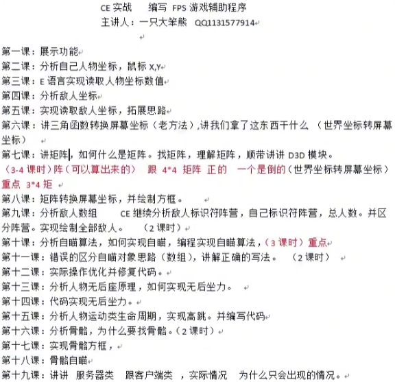

csgo 个人模式可以ce附加，多人游戏会崩


## Class 2 找矩阵

矩阵单浮点

变动的数值 > 旋转鼠标，开镜关镜

未变动的数值 > 不动鼠标移动键盘，不动鼠标不动键盘 


找绿色的数据，（绿色表示基址，重启游戏还是这些数据）

浏览内存区域，显示类型 单浮点。


model view 矩阵的**特征**：

- size为 `4x4`

- 不开镜 `abs(A[0][0])` < 1.

  第一次开镜  `abs(A[0][0])` > 1.

  第二次开镜  `abs(A[0][0])` 更大.

- 后两行的前三个一直是相等的

  `A[2][0] \ A[2][1] \ A[2][2]`

  `A[3][0] \ A[3][0] \ A[3][0]`

- 最后一列数值通常比较大
- 不只有一个，可能有完全相同的多个


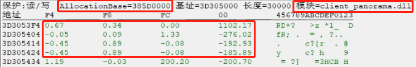

上边的 `AllocationBase = 385D000` 这个就是基址，还有模块信息

然后这个矩阵的地址 - 基址 = 偏移量，即 `3D305504 - 385D0000 = 4D35504`

model view 矩阵 	`client_panorama.dll + 4D35504`


---

## Class 3 找角度

**浮点型**，**往上减少，往下增加**

先找 Y， Y + 4 = X （D3D引擎和OpenGL引擎，都是这样的）


未知的初始值， 变大的数值，变小的数值


model angle 的特征：

- **D3D 游戏**鼠标准心 Y 范围为：-89 - 89
- **D3D 游戏**鼠标准心 X 范围为：0 - 360


---

## Class 4 找自己的位置

x y z

找**单浮点** z 比较简单

然后在附近找 x 和 y

`client_panorama.dll + D2FB84 [3454]`

不要锁定值，锁定游戏可能直接崩掉，要改值


---

## Class 5 找敌人位置

根据我们的值的接近的值 找敌人的值 我们从一定到（控制敌人移动/停止移动）

找出来的地址里存储了很多指针

CSGO 从人物初始地址开始  `+10 Byte`  为另一个人物

添加 bot 或者减少 bot 查看是不是指针变多了

**通常找到敌人的指针，跟敌人有关的数据基本都在指向的这个对象里了。**（比如阵营标识、血量、护甲值、**甚至**骨骼位置）


---

## Class 6 敌人骨骼位置

骨骼特征：

- 浮点数
- 与敌人位置一样是三维坐标，连在一起的
- 看人，骨骼就会变；不看人，骨骼不变。（呼吸）
- 注意！！！！！！！！！！ 不看人的时候，要先搜一次变动的数值，再搜不变的数值！！！


---

## Class 7 inline hook

内联钩子

把游戏里的一些函数换成我们的函数，从而实现我们的操作

用新的汇编指令替换原本的指令，跳转到我们写的代码里。执行完在继续执行原来的内容。


配置类型改成动态链接库 因为需要注入

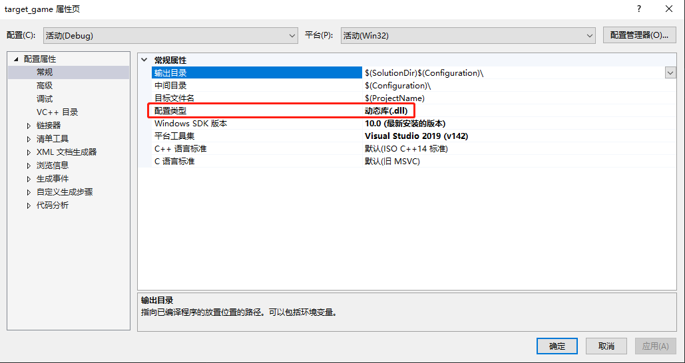


---

## Class 8 Direct3D9

内挂

游戏里hook direct3D9 在游戏里进行绘制画框

外挂

在游戏外面绘制一个透明窗口，覆盖在游戏上。在外面的窗口上进行绘制


---

### 内挂

右键 速览定义

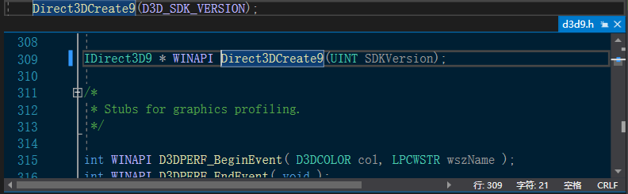


vs2019 工具栏  ->  spy++  ->  窗口搜索  ->  拖动到窗口里看


---

## Class 9 imgui

人物 glow

### 内挂

```c++
WNDPROC g_original_proc = nullptr;//原始窗口过程

// 界面库的窗口过程
extern IMGUI_IMPL_API LRESULT ImGui_ImplWin32_WndProcHandler(HWND hWnd, UINT msg, WPARAM wParam, LPARAM lParam);

// 我们自己的窗口过程
LRESULT CALLBACK self_proc(HWND hWnd, UINT uMsg, WPARAM wParam, LPARAM lParam) 
{
	if (ImGui_ImplWin32_WndProcHandler(hWnd, uMsg, wParam, lParam))//先处理界面库的窗口过程
		return true;

	return CallWindowProcW(g_original_proc, hWnd, uMsg, wParam, lParam);
}
```


```c++


// 初始化imgui窗口
void initialize_imgui(IDirect3DDevice9* direct3ddevice9)
{
	// Setup Dear ImGui context
	IMGUI_CHECKVERSION();
	ImGui::CreateContext();
	ImGuiIO& io = ImGui::GetIO(); (void)io;
	io.IniFilename = nullptr; //不保存初始化文件
	io.LogFilename = nullptr; //不保存log文件

	// Setup Dear ImGui style
	ImGui::StyleColorsLight();//主题亮色

	// Setup Platform/Renderer backends
	ImGui_ImplWin32_Init(FindWindowW(L"Direct3DWindowClass", nullptr)); // 游戏窗口做测试
	ImGui_ImplDX9_Init(direct3ddevice9);//传进来参数这里使用

}
```


```c++
// 重置窗口大小
HRESULT _stdcall self_Reset(IDirect3DDevice9* direct3ddevice9, D3DPRESENT_PARAMETERS* pPresentationParameters)
{
	---
	ImGui_ImplDX9_InvalidateDeviceObjects();//界面库重置
	HRESULT result = direct3ddevice9->Reset(pPresentationParameters);
	ImGui_ImplDX9_CreateDeviceObjects();
	---
}
```


```c++
// EndScene
HRESULT _stdcall self_EndScene(IDirect3DDevice9* direct3ddevice9)
{
	---
	static bool first_call = true;
	if (first_call)
	{
		first_call = false;
		initialize_imgui(direct3ddevice9);
		// SHEZHI CHUANGKOU 
		g_original_proc = (WNDPROC)SetWindowLongA(FindWindowW(L"Direct3DWindowClass", nullptr), GWL_WNDPROC,(LONG)self_proc);
	}

	g_EndScene_hook->restore_address();

	ImGui_ImplDX9_NewFrame();
	ImGui_ImplWin32_NewFrame();
	ImGui::NewFrame();

	ImGui::Begin("new windows");
	ImGui::Text("this is test windows");
	ImGui::End(); //结束

	ImGui::EndFrame(); //结束
	ImGui::Render();
	ImGui_ImplDX9_RenderDrawData(ImGui::GetDrawData());
	---
}
```


---

### 外挂

https://blog.csdn.net/weixin_44286745/article/details/102235347


找不到 `d3dx9.h`


附加包含目录

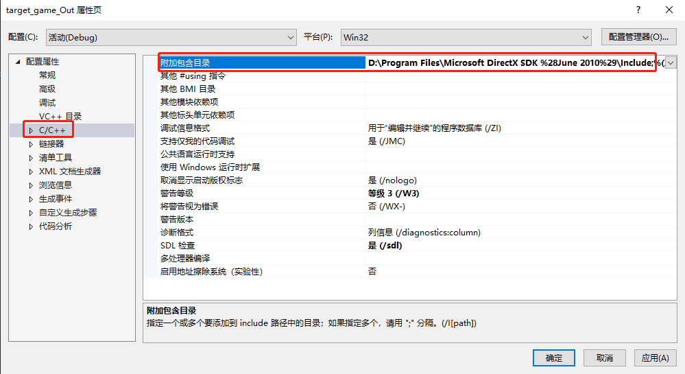


附加库目录

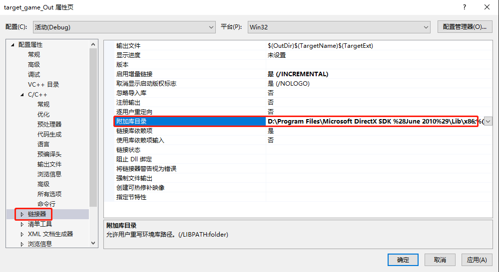


---

## Class 10 透视

https://www.cnblogs.com/LyShark/p/11620244.html

https://www.cnblogs.com/lyShark/p/11670487.html

D3D透视,方框透视,还有一些比较高端的显卡透视


本文为 D3D 透视

Direct3D 透视是一种主流的透视方式，因为现如今大部分游戏都会使用Dx9图形接口


```C++
HWND g_game_hwnd = FindWindowA(nullptr, "Counter-Strike: Global Offensive");//查找游戏的窗口句柄
```


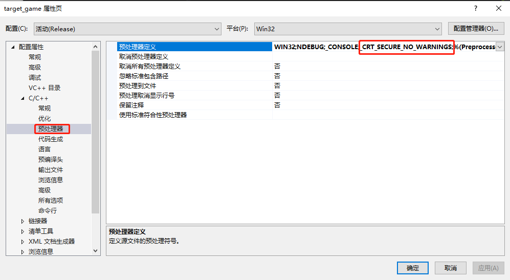


HWND g_game_hwnd = FindWindowA("SDL_app", "AssaultCube");//查找游戏的窗口句柄

人物头模型的 id 是 1677、1761

人物身体在 3678-3778 之间

```c++
SetRenderState(D3DRS_ZENABLE, FALSE);//透视的关键
```


D3D 透视缺点：

- 很慢，占显卡资源，
- 头和身体有不同的 ID，需要全部找出来。不然有的人物不会被透视出来
- 每一个地图的人物模型的 ID 都不一样


---

## Class 11

非 dll 注入

内存模式查找：不用绝对基址

内存特征码查找基址，这样就不用每次游戏更新，辅助也更新。


一般不用 00 00 00 00

提取自己矩阵**前边**字节的特征，**注意是前面**，它具体的**所属模块**，可以从CE中看到

字节 HEX 注意是找他前边不懂的字节值

```hex
00 00 00 00 00 00 00 00 00 00 00 00 00 00 80 3F 
00 00 40 3F 00 00 00 00 00 00 00 00 00 00 00 00 
00 00 00 00 AB AA AA 3F 00 00 00 00 00 00 00 00 
00 00 00 00 00 00 00 00 16 08 80 BF 26 0E E0 C0 
00 00 00 00 00 00 00 00 00 00 80 BF 00 00 00 00

00 00 00 00 00 00 00 00 00 00 00 00 00 00 80 3F 
00 00 40 3F 00 00 00 00 00 00 00 00 00 00 00 00 
00 00 00 00 AB AA AA 3F 00 00 00 00 00 00 00 00 
00 00 00 00 00 00 00 00 16 08 80 BF 26 0E E0 C0 
00 00 00 00 00 00 00 00 00 00 80 BF 00 00 00 00

00 00 00 00 00 00 00 00 00 00 00 00 00 00 80 3F 
00 00 40 3F 00 00 00 00 00 00 00 00 00 00 00 00 
00 00 00 00 AB AA AA 3F 00 00 00 00 00 00 00 00 
00 00 00 00 00 00 00 00 16 08 80 BF 26 0E E0 C0 
00 00 00 00 00 00 00 00 00 00 80 BF 00 00 00 00

选取
                        16 08 80 BF 26 0E E0 C0 
00 00 00 00 00 00 00 00 00 00 80 BF 00 00 00 00
作为特征码
```


? 表示可以不一样，`+ 0x18`  表示从第一个特征码 16 开始到矩阵地址的距离，这里是24个 bit，即距离为 `0x18`


位置 

z = client.dll+D892CC   0x3454


```c++
[client.dll + dwLocalPlayer] + m_vecOrigin
    
client.dll+D892CC   0x3454
    
constexpr ::std::ptrdiff_t dwLocalPlayer = 0xD892CC;
constexpr ::std::ptrdiff_t m_vecOrigin = 0x138;
```


```
23 E0 3F 40 00 00 00 00 00 00 00 00 00 00 00 00
00 00 00 00 D2 49 8E BF A5 B0 D2 42 00 00 00 00

00 EA 10 C0 00 00 00 00 00 00 00 00 00 00 00 00 
00 00 00 00 8A 40 C7 C0 AD BE 28 C3 00 00 00 00

79 CC C6 42 F2 C1 71 C3 00 00 00 00 00 00 00 00
00 00 00 00 13 2C 8D C0 7D F9 1C C3 00 00 00 00

D8 80 9C C2 F9 A0 8B C3 00 00 00 00 00 00 00 00 
00 00 00 00 44 F9 09 41 33 2E 20 43 00 00 00 00

20 67 A9 C1 F2 C1 71 C3 00 00 00 00 00 00 00 00 
00 00 00 00 50 E8 B4 40 88 0B 28 43 00 00 00 00

E5 16 8F 41 00 00 00 00 00 00 00 00 00 00 00 00 
00 00 00 00 F6 58 AA 40 A6 79 2D C3 00 00 00 00

24 82 62 C3 F9 A0 8B C3 00 00 00 00 00 00 00 00 
00 00 00 00 0C EF 2E 41 08 40 D2 42 00 00 00 00
```


---

## Class 13 Glow

可以使用


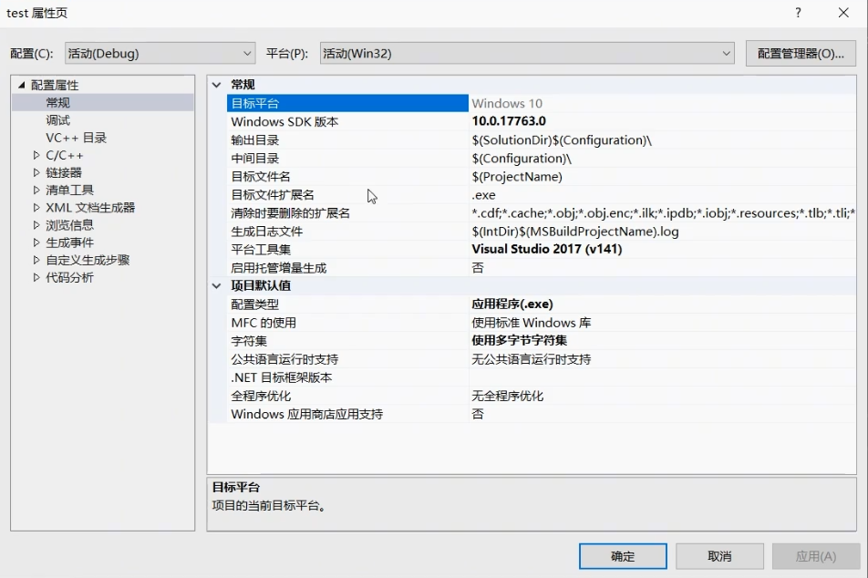


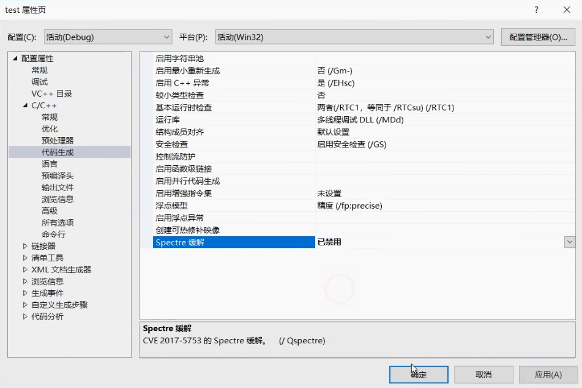


---

## Class 14 换肤演示


---

## Class 15 加载驱动

win10 加载驱动到内核

驱动必须拥有数字签名，才可以加载驱动，必须购买。除非打开win10的测试模式

用驱动绕过 EAC。不打开测试模式也可以把驱动加载到内核里运行。


```
Empty WDN dirver
```


release 速度快一点

x64 根据电脑版本选择


```c++
// 驱动头文件
#include <ntddk.h>
```


驱动一有bug，马上会蓝屏


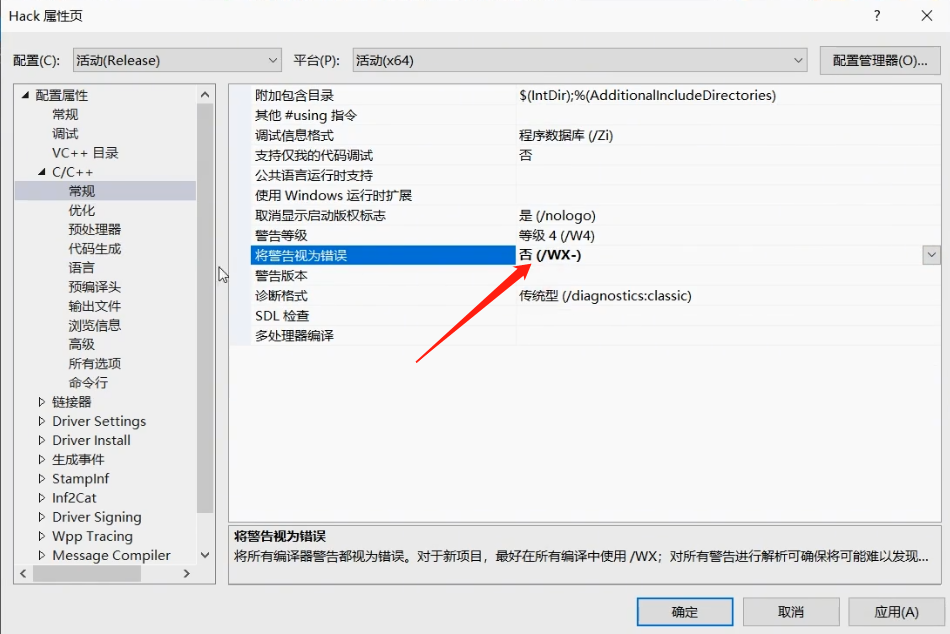


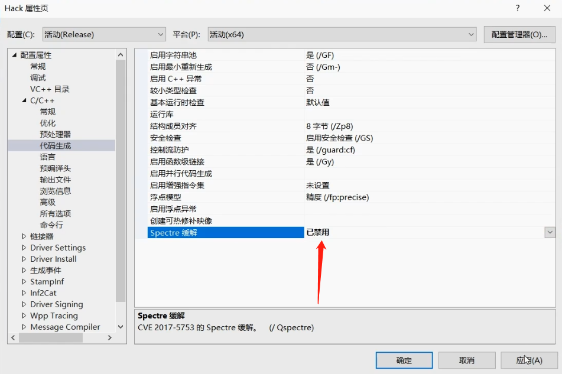


driver monitor


### kdmapper 

​	release x64

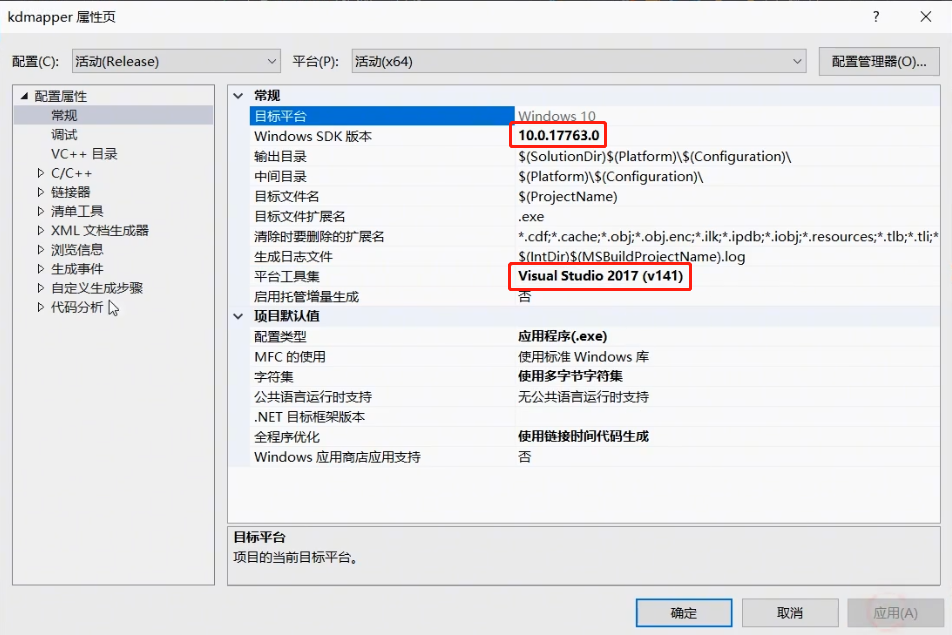

用自己版本的就可以

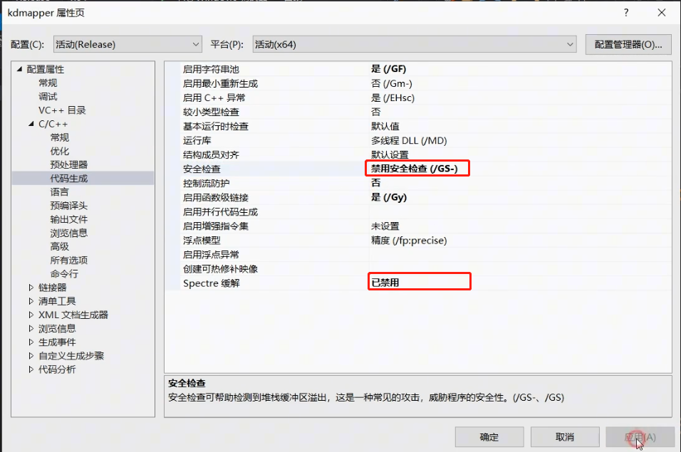


用虚拟机尝试写驱动，进行debug，不要再自己电脑上尝试。


---

## Class 16 CSGO注入小助手

CSGO注入报错 0xC0000138


火绒 - 安全工具 - 火绒剑 - 钩子扫描 - 进程模块钩子 - 选择 csgo.exe - 确定

钩住了一部分功能，导致我们不能加载 dll。需要把内敛钩子还原，去掉。

选中 **ntdll.dll!NtOpenFile** 点击修复钩子


```c++
/*
CSGO注入小工具
原理 : 修复NtOpenFile函数的inline hook
*/

#include <iostream>
#include <sstream>
#include <fstream>
#include <cstdint>
#include <filesystem>

#include <Windows.h>
#include <TlHelp32.h>

/* 获取CSGO进程句柄 */
HANDLE GetProcessHandle()
{
	/* 打开遍历进程句柄 */
	HANDLE Snap = CreateToolhelp32Snapshot(TH32CS_SNAPPROCESS, 0);
	if (Snap == INVALID_HANDLE_VALUE) return Snap;

	/* 初始化进程信息结构 */
	PROCESSENTRY32 ProcessInfo{ 0 };
	ProcessInfo.dwSize = sizeof(ProcessInfo);

	/* 循环查找进程信息 */
	if (Process32First(Snap, &ProcessInfo))
	{
		do
		{
			if (strcmp("csgo.exe", ProcessInfo.szExeFile) == 0)
			{
				CloseHandle(Snap);
				return OpenProcess(PROCESS_ALL_ACCESS, FALSE, ProcessInfo.th32ProcessID);
			}
		} while (Process32Next(Snap, &ProcessInfo));
	}

	CloseHandle(Snap);
	return INVALID_HANDLE_VALUE;
}

int main(int argc, char* argv[])
{
	HANDLE Handle = INVALID_HANDLE_VALUE;
	LPVOID DllMemory = nullptr;
	HANDLE Thread = NULL;

	do
	{
		/* 获取作弊DLL路径 filesystem报错请设置C++17版本*/
		std::cout << "输入DLL全路径 : ";
		std::string dll;
		getline(std::cin, dll);
		if (std::filesystem::exists(dll) == false)
		{
			std::cout << "[-] DLL文件不存在" << std::endl;
			break;
		}

		/* 获取CSGO进程句柄 */
		Handle = GetProcessHandle();
		if (Handle == INVALID_HANDLE_VALUE)
		{
			std::cout << "[-] 获取游戏进程句柄失败" << std::endl;
			break;
		}

		/* 获取NtOpenFile函数地址 */
		LPVOID pNtOpenFile = GetProcAddress(LoadLibraryA("ntdll"), "NtOpenFile");
		if (pNtOpenFile == nullptr)
		{
			std::cout << "[-] 获取NtOpenFile函数地址失败" << std::endl;
			break;
		}

		/* 获取原始字节 */
		char OriginalBytes[5]{ 0 };
		memcpy(OriginalBytes, pNtOpenFile, 5);

		/* 将原始字节写入CSGO进程的NtOpenFile函数地址处,解除inline hook */
		SIZE_T Bytes = 0;
		WriteProcessMemory(Handle, pNtOpenFile, OriginalBytes, 5, &Bytes);
		if (Bytes == 0)
		{
			std::cout << "[-] 无法写入内存解除inline hook" << std::endl;
			break;
		}

		/* 在CSGO游戏中申请一块内存保存我们的DLL路径 */
		DllMemory = VirtualAllocEx(Handle, nullptr, dll.size(), MEM_COMMIT | MEM_RESERVE, PAGE_READWRITE);
		if (DllMemory == nullptr)
		{
			std::cout << "[-] 无法在CSGO游戏内申请内存" << std::endl;
			break;
		}

		/* 把我们的DLL路径写入该块内存中 */
		WriteProcessMemory(Handle, DllMemory, dll.c_str(), dll.size(), &Bytes);
		if (Bytes == 0)
		{
			std::cout << "[-] 无法写入DLL路径" << std::endl;
			break;
		}

		/* 创建远程线程加载我们的DLL */
		Thread = CreateRemoteThread(Handle, 0, 0, (LPTHREAD_START_ROUTINE)LoadLibraryA, DllMemory, 0, 0);
		if (Thread == NULL)
		{
			std::cout << "[-] 无法创建远程线程" << std::endl;
			break;
		}

		/* 等待远程线程的执行完毕 */
		WaitForSingleObject(Thread, INFINITE);

		/* 加载成功 */
		std::cout << "[+] 注入成功" << std::endl;
	} while (false);

	/* 清理相关 */
	if (Handle != INVALID_HANDLE_VALUE) CloseHandle(Handle);
	if (DllMemory) VirtualFree(DllMemory, 0, MEM_RELEASE);
	if (Thread != NULL) CloseHandle(Thread);

	system("pause");
	return 0;
}
```


---

## Class 17 绘制骨骼

工具 -> 错误查找

工具 -> spy++


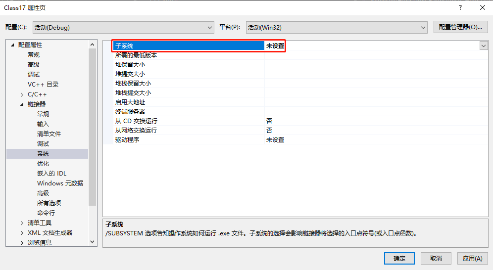


找不到 `d3dx9.h`


附加包含目录


附加库目录


获取进程句柄，没有权限的话，以管理员身份运行 vs2017


---

## A. IOCTL 通信驱动

输入输出控制通信

没有内核防护的反作弊可以用

开启测试模式，不开启，自己写的驱动加载不到内核中去。因为没有数字签名。

```
bcdedit -set loadoptions DISABLE_INTEGRITY_CHECKS
bcdedit -set TESTSIGNING ON
```

还需要开启调试模式或者打上测试签名，两者满足一个就行

```
bcdedit /bootdebug ON
bcdedit /debug ON
```

关闭测试模式

```
bcdedit -set TESTSIGNING off
```


**不直接读取内存，发消息给内核，内核读取游戏的内存，然后发送消息给我们的程序，然后程序进行相关操作。**


控制码，是自己定义的

```c++
#define read_info
#define write_info
#define get_module

```


dbgview4.81.exe 管理员方式运行


第五章 应用与内核通信

5.1 内核方面的编程

5.1.1. 生成控制设备

一个驱动需要和应用程序通信，那么首先要生成一个设备对象（Device Object）。设备对象和分发函数构成了整个内核体系的基本框架。设备对象可以在内核中暴露出来给应用层，应用层可以像操作文件一样操作它。

一般而言，用于和应用程序通信的设备往往用来“控制”这个内核驱动。（即配置、开启或关闭某些功能）所以往往被成为“控制设备对象”（Control Devcie Object, CDO）。

生成设备可以使用函数 `IoCreateDevice` 。


5.1.2. 控制设备的名字和符号链接

设备对象可以没有名字，但控制设备需要有，这样才能暴露出来，供其他程序打开与之通信。应用层无法直接通过设备的名字来打开对象，为此必须建立一个暴露给应用层的**符号链接**。符号链接就是记录一个字符串对应到另一个字符串的一种简单结构。函数为 `IoCreateSymbolilLink()`


5.1.3. 控制设备的删除

在驱动中生成了控制设备和符号链接，卸载驱动时记得需要删除，否则符号链接就会一直存在。 

先卸载 `IoDeleteSymbolicLink`  ，在卸载 `IoDeleteDevice`


5.1.4. 分发函数

一组用来处理发送给设备对象的请求的函数。处理这些请求并返回给 windows。

比如读取游戏内存，读取模块基址，获取进程句柄，都可以用分发函数来解决。可以自己定义那些辨识。主要有三个

- 打开：
- 关闭：
- 设备控制：进行游戏类型的读写操作，既可以用来输入（从应用到内核），又可以用来输出（从内核到应用）的请求。


5.1.5. 请求的处理

获得请求的当前栈空间，`IoGetCurrentIrpStackLocation`。


