# GH1 - Start Here Beginner Guide to Game Hacking

https://guidedhacking.com/threads/ghb1-start-here-beginner-guide-to-game-hacking.5911/


## 3. Video Tutorial - Squally CS420 Game Hacking Course

https://guidedhacking.com/threads/squally-cs420-game-hacking-course.14191

finish in E_HackingBasic.md  Chapter 6.


**1.1. Game Hacking Course Introduction**

**1.2. Memory Editing 1**

**1.3. Base Systems - Hex, Decimal & Binary**

**1.4. How to Hex Edit Games**

**1.5. Memory Editing 2 & Data Types**

**1.6. Virtual Memory**

**1.7. Virtual Memory 2 & Multilevel Pointers Tutorial**

**1.8. How to Edit Assembly Tutorial**


---

## 4. Guide - Game Hacking FAQ - Frequently Asked Questions

https://guidedhacking.com/threads/game-hacking-faq-frequently-asked-questions.9884/


**How to Bypass anticheat?**

[Guide - How to Get Started with AntiCheat Bypass](https://guidedhacking.com/showthread.php?9882-How-to-Bypass-Anticheat-Tutorial-for-Noobs)

Do not post "how to bypass" shit threads please.
[Read the How to Bypass Anticheat Guide for Noobs](https://guidedhacking.com/showthread.php?9882-How-to-Bypass-Anticheat-Tutorial-for-Noobs)


**Game crashes when loading Cheat Engine?**

Change debugger in CE settings to **VEH Debugger**, if that doesn't work, read the first couple paragraphs of [Guide - How to Get Started with AntiCheat Bypass](https://guidedhacking.com/showthread.php?9882-How-to-Bypass-Anticheat-Tutorial-for-Noobs)


**How to use MultiLevel pointers in C++?**

Use the good ol' [FindDmaAddy](https://guidedhacking.com/finddma) function from Fleep that de-references and adds the offsets for you, we fixed it up a bit to be even nicer


**How to use client.dll+0xDEADBEEF in C++?**

Use the [GetModuleBase ](https://guidedhacking.com/getmodulebase) function which uses the ToolHelp32Snapshot function to walk through the loaded modules and grab the base address on your modules.


**How to find multilevel pointers in cheat engine?**

Part of 2 of  video will show you an excellent method of finding pointers manually. [PointerScanner Video Tutorial](https://guidedhacking.com/showthread.php?9739-Cheat-Engine-How-to-Pointer-Scan-with-Pointermaps)


**How to find offsets?**

Use Cheat Engine "Find what Accesses/Writes", in the assembly the game will access variables using the proper offsets, these are the offsets you will use. [This tutorial ](https://guidedhacking.com/showthread.php?7194-Cheat-Engine-How-To-Hack-Any-Game) is very good for beginners.


**Why isn't my hack working?**

[Learn to Debug Your Hack with the Visual Studio Debugger](https://guidedhacking.com/debug)


**How to inject a DLL?**
[Use the GH Injector!](https://guidedhacking.com/resources/guided-hacking-dll-injector.4/)


**How to update offsets/addresses for a new version of the game?**

Anywhere in the project where addresses or offsets are defined you need to update them. 

[Learn to find pointers/offsets here](https://guidedhacking.com/showthread.php?7194-Cheat-Engine-How-To-Hack-Any-Game-1-10-Difficulty-Part-1-2)


[**What's the difference between internal and external?**](https://guidedhacking.com/showthread.php?9884-Game-Hacking-FAQ&p=53836&viewfull=1#post53836)


**What game should I learn game hacking on?**

**Assault Cube first**, then either CSGO or COD4. Do not learn game hacking on new games, it's too complicated for beginners. These 3 games have tons of resources and everyone on the forum can help you hack them because we have experience with them. If you pick some random new game, no one can help you and it will be a waste of time and extremely frustrating.


**Common Visual Studio ProblemsLinker Errors:**

```C++
Error LNK2019    unresolved external symbol
```

This error means the compiler cannot find the "external symbol". The "external symbol" is usually a function. You're calling a function but it wasn't included properly, like you probably forgot to include the header file or link the lib/dll. The compiler will even tell you what line of code the error is on. You need to correctly link the header file and any LIB/DLL that's needed.


For instance this error:

```cpp
Erro LNK2019    unresolved external symbol glBegin referenced in function "int __stdcall hwglSwapBuffers()
```

Was fixed by adding:

```c++
#pragma comment(lib, "lib\\OpenGL32.Lib")
#include <gl\GL.h>
```


**Unicode/MultiByte Character Set**

Seeing error "cannot convert char* to LPWSTR?" or something similar?This happens because projects can be be set to use a certain type of string literal, Unicode or "regular" Multibyte Character Set (MBCS)Fleep made his tutorials using Multibyte Character Set but the industry standard is Unicode, Visual Studio 2017 has the default set to Unicode.

If you want char* string literals to be single byte chars, set the project to Multibyte Character Set, especially if you're doing a Fleep tutorial. `Project Properties -> General -> Character Set`


[error C2664 cannot convert argument 1 from 'const char 11' to 'LPSTR' - Guided Hacking](https://guidedhacking.com/threads/error-c2664-cannot-convert-argument-1-from-const-char-11-to-lpstr.11827/)


**How to install Windows Forms for Fleep Tutorials on Visual Studio 2017?**

[Visual Studio 2017 - Windows Forms](https://social.msdn.microsoft.com/Forums/vstudio/en-US/e6fbde42-d872-4ab3-8000-41ab22a4a584/visual-studio-2017-windows-forms?forum=winformsdesigner)


**Internal vs.External?**

**External**

External Hacks use `WriteProcessMemory`(WPM) and `ReadProcessMemory`(RPM) to interact with the game process's memory. To do this you need to ask the [kernel](https://guidedhacking.com/threads/kernel-mode-drivers-info-for-anticheat-bypass.11325/) to give you a `handle` to the process by using `OpenProcess()` with the [Process Access Rights](https://msdn.microsoft.com/en-us/library/windows/desktop/ms684880(v=vs.85).aspx) you require, typically `PROCESS_ALL_ACCESS`. The handle is a required parameter for RPM/WPM. 

Kernel mode anticheats can easily block external hacks by using `ObjRegisterCallbacks` to block handle creation. [Info from DouggemHacks](https://douggemhax.wordpress.com/2015/05/27/obregistercallbacks-and-countermeasures/). RPM/WPM is slow because you have **the overhead of the API calls into the kernel** 从应用层到内核的交互开销. You should **limit the frequency** 限制频率of these calls and **store as much information locally as possible** 存储一些信息到本地 to increase the performance of your external hack. 

If the game has no method of detecting RPM making an overlay ESP is a good way of making an `undetected external ESP` because you **only need RPM** to be undetected.


**Pros of external:**

- In my opinion none compared to internal unless you just want to super quickly patch some bytes and then close the hack


**Cons of external:**

- Super easy to detect because of the open process handle
- Harder to use especially for beginners (WPM/RPM, getting the PID) though easy to master because it has no potential
- Less potential
- Slow


**Internal**

Internal hacks are created by **injecting DLLs** into the game process, when you do this you have **direct access to the process's memory** which means fast performance and simplicity. Injected DLL's can be made more sneaky by using different injection methods such as Manual Mapping. View the  [GuidedHacking Injector](https://guidedhacking.com/ghinjector)  thread for more info.

Try a [simple DLL hack source code](https://guidedhacking.com/showthread.php?7451-Assault-Cube-internal-DLL-skeleton) for Assault Cube for learning purposes. When you are internal you create pointers to objects, typecast them and point them to objects in memory. Then you can access variables of that object easily through the pointer. [ReClass](https://guidedhacking.com/resources/reclass-net-download.2/) is a great tool for generating classes from memory. This is an example of how to typecast variables in memory and modify them in an internal cheat:

```c++
DWORD* localPlayerAddress = (DWORD*)(0x509B74);
int * health = (int*)(*localPlayerAddress + 0xf8);
*health = 1337;
```

**Pros of internal:**

- Sick performance
- Easy to start off with
- Much potential
- Can be super sneaky and almost impossible to detect if done properly


**Cons of internal:**

- Hard to master
- Easier to detect when you don't know what you're doing


If anyone is starting internal, I recommend reading this first [Walkthrough: Create and use your own Dynamic Link Library (C++)](https://docs.microsoft.com/en-us/cpp/build/walkthrough-creating-and-using-a-dynamic-link-library-cpp)


---

## 5. Video Tutorial - Cheat Engine Tutorial Video Guide

#### 3.1. Cheat Engine Tutorial Guide 1/3 Steps 1-5

大部分为 4 字节，还有浮点数，双浮点数（扫描双浮点数类型建议禁用 "快速扫描"）


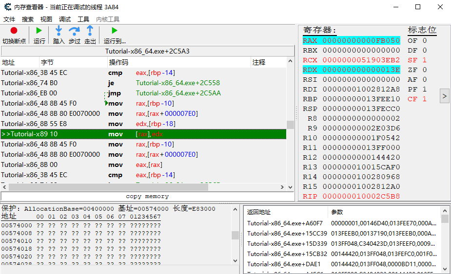

右键/F5 设置断点，F7 步进

```assembly
#  rax存的是地址
mov [rax], edx #edx的值即RDX的值 00 00 01 3E 赋给 [rax]  318
```

或者右键 replace with code that does nothing


#### 3.2. Cheat Engine Tutorial Guide 2/3 Steps 6-9 Pointers & Code Injection

##### Step 6

搜索这个存储血量的地址

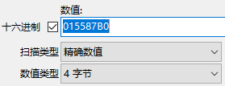

得到基址（即一个指针，这个指针指向血量）

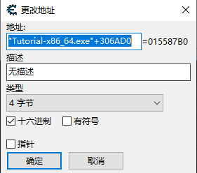

手动添加地址（指针）

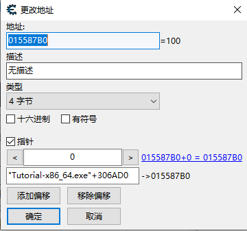


green glow means static meaning that it's going to be either relative to the base address (its gonna be the same address in the process every time)

**relative offset**

```c++
int health = 1337;
int* myhealth = &health; //指针myhealth指向血量变量
cout << *myhealth; //1337

//每次血量变量动态分配，pointer指向新的动态地址
while (1) {
	myhealth = new int(health);  
    sleep(4);
}
```


##### Step 7

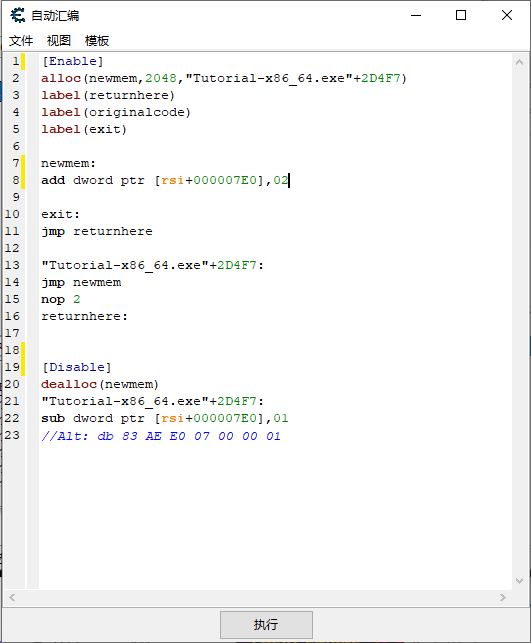


##### **Step 8 **- 525927

备注1: 本步骤也可以使用**自动汇编程序脚本**或者使用**指针扫描器**加以解决。
备注2: 在某些情况下，可以改变 CE 软件"代码查找"的相关设置。
当你遇到类似于 `mov eax,[eax]` 的指令时，**调试程序将显示改变之后的寄存器中的值**，也许利用它更容易找出指针的位置。


```c++
//4级指针模板
-> = "points to"
Address = Value = ?
base ptr -> address + offset4 = address
base ptr -> address + offset3 = address
base ptr -> address + offset2 = address
static base -> address + offset1 = address
```


```c++
//模板
-> = "points to"
014C2E08 = Value = 2856
base ptr -> address + offset4 = 014C2E08
base ptr -> address + offset3 = address
base ptr -> address + offset2 = address
static base -> address + offset1 = address
```


find out what access this address `014C2E08`

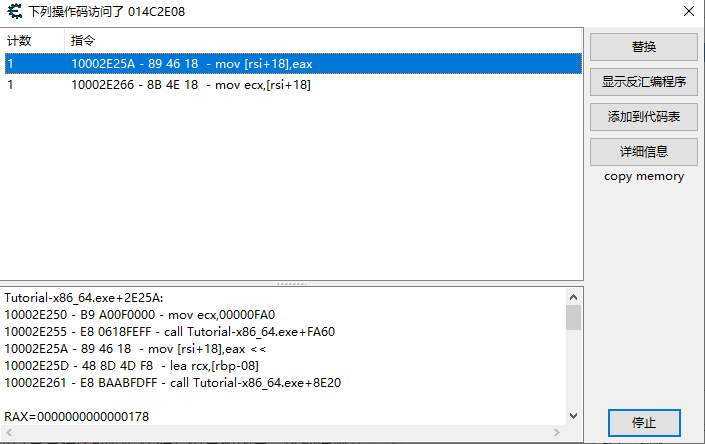

```c++
//模板
-> = "points to"
014C2E08 = Value = 376
base ptr -> 014C2DF0 + 0x18 = 014C2E08 // 014C2E08 - 0x18
base ptr -> address + offset3 = address
base ptr -> address + offset2 = address
static base -> address + offset1 = address
```

搜索16进制地址 `014C2DF0`

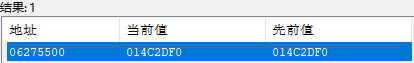

```c++
//模板
-> = "points to"
014C2E08 = Value = 376
06275500 -> 014C2DF0 + 0x18 = 014C2E08 // 014C2E08 - 0x18
base ptr -> address + offset3 = 06275500
base ptr -> address + offset2 = address
static base -> address + offset1 = address
```


find out what access this address `06275500`

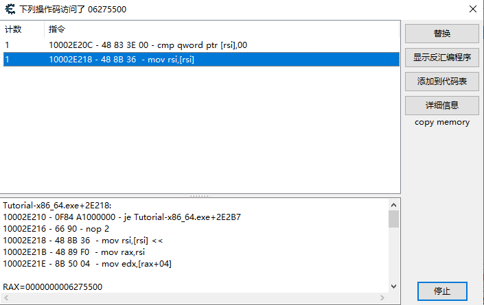

```c++
//模板
-> = "points to"
014C2E08 = Value = 376
06275500 -> 014C2DF0 + 0x18 = 014C2E08 // 014C2E08 - 0x18
base ptr -> address + 0 = 06275500
base ptr -> address + offset2 = address
static base -> address + offset1 = address
```

搜索16进制地址 `06275500`

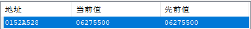

```c++
//模板
-> = "points to"
014C2E08 = Value = 376
06275500 -> 014C2DF0 + 0x18 = 014C2E08 // 014C2E08 - 0x18
0152A528 -> 06275500 + 0 = 06275500
base ptr -> address + offset2 = 0152A528
static base -> address + offset1 = address
```


find out what access this address `0152A528`

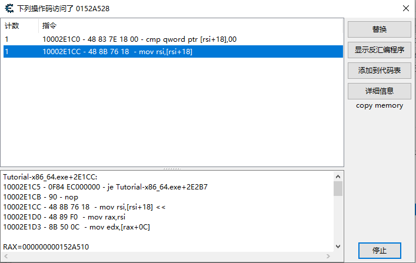

```c++
//模板
-> = "points to"
014C2E08 = Value = 376
06275500 -> 014C2DF0 + 0x18 = 014C2E08 // 014C2E08 - 0x18
0152A528 -> 06275500 + 0 = 06275500
base ptr -> 0152A510 + 0x18 = 0152A528 // 0152A528 - 0x18
static base -> address + offset1 = address
```

搜索16进制地址 `0152A510`

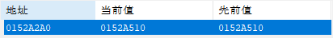

```c++
//模板
-> = "points to"
014C2E08 = Value = 376
06275500 -> 014C2DF0 + 0x18 = 014C2E08 // 014C2E08 - 0x18
0152A528 -> 06275500 + 0 = 06275500
0152A2A0 -> 0152A510 + 0x18 = 0152A528 // 0152A528 - 0x18
static base -> address + offset1 = 0152A2A0
```


find out what access this address `0152A2A0`


```c++
//模板
-> = "points to"
014C2E08 = Value = 376
06275500 -> 014C2DF0 + 0x18 = 014C2E08 // 014C2E08 - 0x18
0152A528 -> 06275500 + 0 = 06275500
0152A2A0 -> 0152A510 + 0x18 = 0152A528 // 0152A528 - 0x18
static base -> 0152A290 + 0x10 = 0152A2A0 //0152A2A0 - 0x10
```

搜索16进制地址 `0152A290`


```c++
//模板
-> = "points to"
014C2E08 = Value = 376
06275500 -> 014C2DF0 + 0x18 = 014C2E08 // 014C2E08 - 0x18
0152A528 -> 06275500 + 0 = 06275500
0152A2A0 -> 0152A510 + 0x18 = 0152A528 // 0152A528 - 0x18
"Tutorial-x86_64.exe"+306B00 -> 0152A290 + 0x10 = 0152A2A0 //0152A2A0 - 0x10
    
base address = "Tutorial-x86_64.exe"+306B00
```

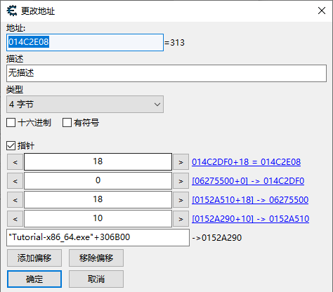


##### **Step 9** - 31337157

游戏中的共用代码, 这种代码是通用在除了自己以外的其他同类型对象上。

如果你把健康相关代码移除的话，其结果是你的角色无敌, 但你的敌人也无敌了。

在这种情况下, 你必须想办法**区分自己与敌人**。有时候很简单, 你只要检查**最前面的4个字节**(**函数指针表**), 它通常指向一个独一无二的地址, 代表着游戏玩家角色，而有的时候它是一个团体号码, 或者也可能是一个指针, 它指向另一个指针, 该址针又指向下一个指针,搞不好还指向下下一个指针, 最后指向一个玩家名字。总之完全取决于游戏的复杂度, 以及你的运气

最简单的方法是以"**找出是什么改写了这个地址**"去找出游戏代码，然后使用"**分析(新/旧)数据/结构**"的功能去**比较两种结构**。

当你找到如何区分你和电脑单位的方法后，你可以注入一段自动汇编脚本来检查状态，然后看是要运行游戏的代码还是要做其他的修改。(例如一击必杀)

另外, 你还可以用这个方法去创建一般所说的**"字节数组"的字串, 它可以用来搜寻并产生一份所有你的单位或是敌人单位的列表**


找到四个血量的地址，find out what write this address，然后减去偏移量为基址

查看内存 > 工具 > 分析数据/遍历

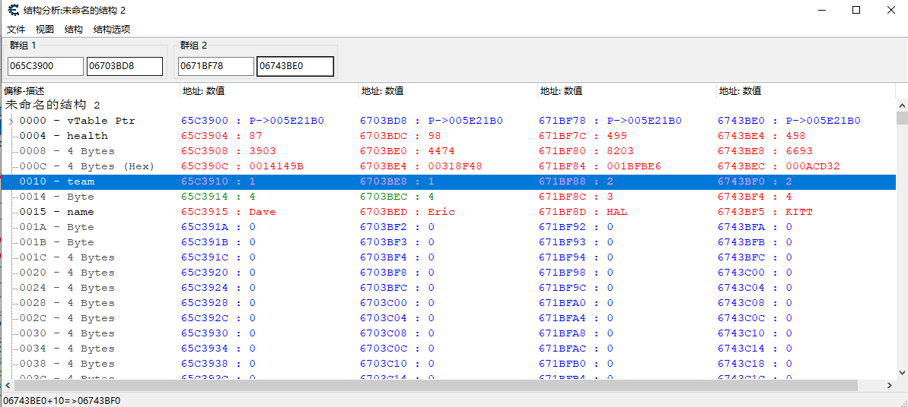

血量 `04` ，[ebx+04]，则队伍 `10`，[ebx+10]，相差 `6` 个字节

这里 string name 的偏移量是 `0015`，health的偏移量是`0010`，

**最前面的4/8个字节**（**函数指针表vTable ptr**）指向的是同一地址

在 Dave 血量的地址 > find out what write this address > 显示反汇编程序 > 自动汇编

**AOB注入**

```assembly
[ENABLE]
//code from here to '[DISABLE]' will be used to enable the cheat

aobscanmodule(INJECT,Tutorial-i386.exe,89 43 04 D9 EE) // should be unique
alloc(newmem,$1000)

label(code)
label(return)

newmem:
  cmp [ebx+10],1 # 如果队伍为1 就不执行正常的减血操作
  jne code
  fldz
  jmp return

code:
  mov [ebx+04],eax
  fldz 
  jmp return

INJECT:
  jmp newmem
return:
registersymbol(INJECT)

[DISABLE]
//code from here till the end of the code will be used to disable the cheat
INJECT:
  db 89 43 04 D9 EE

unregistersymbol(INJECT)
dealloc(newmem)
```


**普通代码注入**

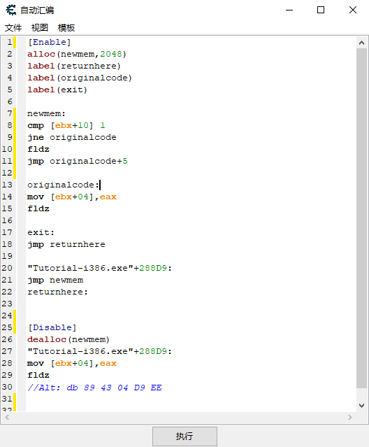

```assembly
newmem:
cmp [ebx+10] 1          #判断是不是1
jne originalcode		#不是1的话 正常执行 originalcode 减血 不运行下边两条程序了
fldz					#是1的话像 执行fldz
jmp originalcode+5      #执行完 fldz 后执行 fld 与 originalcode 间隔5个byte
#相当于跳过了减血的代码
# 一个jmp是5个字节，编写一个jmp时会覆盖5个字节

originalcode:
mov [ebx+04],eax
fldz
```

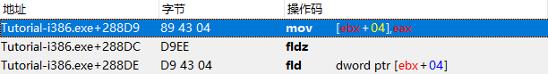

```assembly
#等效
newmem:
cmp [ebx+10] 2
je originalcode
fldz
jmp originalcode+5

originalcode:
mov [ebx+04],eax
fldz
```


Dave 血量动态指针链

搜索时第一级是改写 write，后边都是访问 access

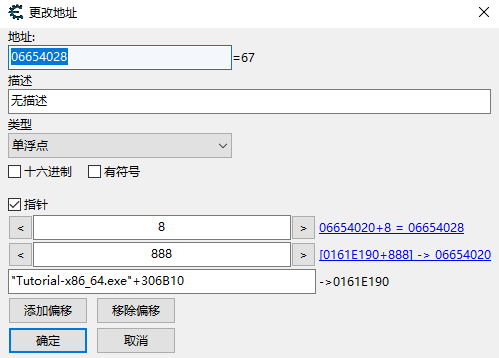

Eric 血量动态指针链

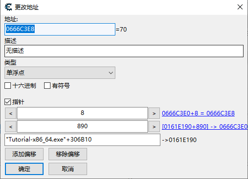

HAL 血量动态指针链

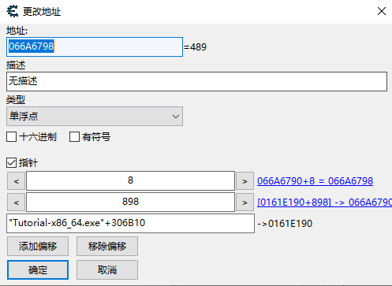

KITT 血量动态指针链

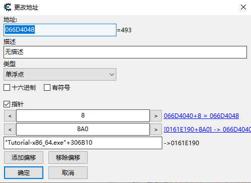


---

#### 3.3. Cheat Engine Tutorial Guide 3/3 Tutorial Games

##### Level 1

有时候搜索不到值的时候，需要搜索 **总数 - 这个数**，比如子弹数目，有时存储的是打出去的子弹数目，而不是剩余的子弹数目

```c++
//敌人血量
-> = "points to"
018B19C0 = Value = ?
01889618 -> 018B1968 + 58 = 018B19C0
018F5BE4 -> 01889600 + 18 = 01889618
"gtutorial-i386.exe"+2D88C0 -> 018F5750 + 494 = 018F5BE4
```

右键可以使用空指针替换， 然后也可以还原

工具 > 自动汇编 > AOB Injection (find an AOB we can use)

> 特征码定位 signature
>
> 是动态地址，游戏每次重新打开就会改变，而CE用AOB注入的话，CE每次都能够找到这个已变化的地址，然后Jmp到申请的内存地址里
>
> "xxx.exe"+123456就是模块句柄+偏移，模块句柄一般是固定的 你遇到类似u3d做的游戏就不会这么说了，很多代码是动态生成，需要 mono 处理或用 aobscan 和 aobscanmodule 来做特征码定位

```assembly
[ENABLE]

aobscanmodule(INJECT,gtutorial-i386.exe,89 50 58 83 78 54 00) // should be unique
alloc(newmem,$1000)
label(return)

newmem:
  push edx              # 寄存器入栈
  xor edx,edx           # edx = 0
  mov [eax+58],edx      # 直接把血量变为0
  cmp dword ptr [eax+54],00 # 按原内容继续执行
  pop edx
  jmp return

INJECT:
  jmp newmem
  nop 2
return:
registersymbol(INJECT)

[DISABLE]

INJECT:
  db 89 50 58 83 78 54 00

unregistersymbol(INJECT)
dealloc(newmem)
```


##### Level 2

4字节玩家的血量，找到 player 血量的地址

未知的初始值，找到 enemy 血量的地址，可以试试地址 `+4 -4` 找到另一个enemy的地址，并验证。也可以先找一个玩家的血量，**如果玩家和敌人是同一个对象**，那么直接找相关减血的汇编代码如 `sub [eax+50],edx`，右键该行 > find out what addresses this instruction accesses.击打敌人，就可以找到敌人血量的地址。

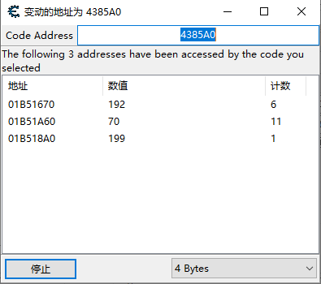


这里可以直接全选，右键 > open dissect data with selected address ，就会出现结构分析，找到两个敌人一样，我们跟他们不一样的地方。


查找指针链，找改写地址，再找访问地址。

```c++
//玩家血量
-> = "points to"
018124A8 = Value = ?
0181200C -> 01812458 + 50 = 018124A8
0180625C -> 01811FF8 + 14 = 0181200C
"gtutorial-i386.exe"+2D88C0 -> 01805DC8 + 494 = 0180625C
```


```c++
//ENEMY2血量
-> = "points to"
018120B8 = Value = ?
01812010 -> 01812068 + 50 = 018120B8
0180625C -> 01811FF8 + 18 = 01812010
"gtutorial-i386.exe"+2D88C0 -> 01805DC8 + 494 = 0180625C
```


```c++
//ENEMY2血量
-> = "points to"
018122E8 = Value = ?
01812014 -> 01812298 + 50 = 018122E8
0180625C -> 01811FF8 + 1C = 01812014
"gtutorial-i386.exe"+2D88C0 -> 01805DC8 + 494 = 0180625C
```


查看内存 > 工具 > 分析数据遍历 > 分群组 > 结构/定义新的结构

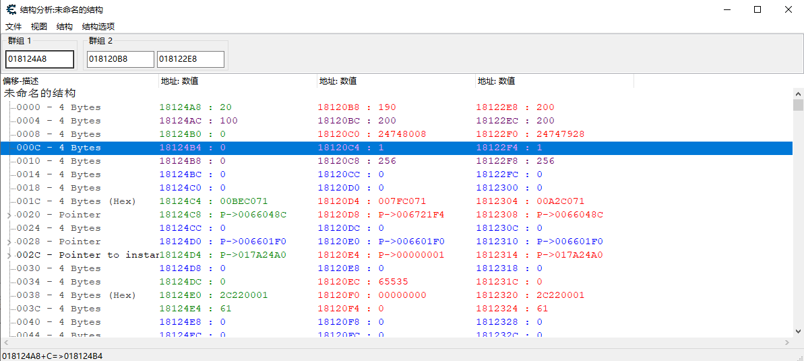

找到team变量距离血量 8 个字节，即`eax+58`，AOB注入

```assembly
[ENABLE]

aobscanmodule(INJECT,gtutorial-i386.exe,29 50 50 C3 00 00) // should be unique
alloc(newmem,$1000)

label(code)
label(return)

newmem:
  cmp [eax+58],0 # 如果是我们自己，就不跳
  jne code
  ret
  add [eax],al
  jmp return

code:
  sub [eax+50],edx #  这行改成mov [eax+50],0 实现秒杀
  ret 
  add [eax],al
  jmp return

INJECT:
  jmp newmem
  nop
return:
registersymbol(INJECT)

[DISABLE]

INJECT:
  db 29 50 50 C3 00 00

unregistersymbol(INJECT)
dealloc(newmem)
```


**普通代码注入**

```assembly
[Enable]
alloc(newmem,2048)
label(returnhere)
label(originalcode)
label(exit)

newmem:
cmp [eax+58],0
jne originalcode  #不执行sub 直接接着sub之后的命令
ret
add [eax],al

originalcode:
sub [eax+50],edx  
ret 
add [eax],al

exit:
jmp returnhere

"gtutorial-i386.exe"+385A0:
jmp newmem
nop
returnhere:


[Disable]
dealloc(newmem)
"gtutorial-i386.exe"+385A0:
sub [eax+50],edx
ret 
add [eax],al
//Alt: db 29 50 50 C3 00 00

```


##### Level 3

- find collision（冲突） detect with enemies
- teleport（心灵传输）
- fly

查找X，Y坐标位置，然后浏览相关内存区域，死的时候看附近哪些值变换了，然后就锁定它们。让他们不变。


```c++
//查找坐标位置
-> = "points to"
0194209C = Value = ?
01889618 -> 01942080 + 1C = 0194209C
018F5BE4 -> 01889600 + 18 = 01889618
"gtutorial-i386.exe"+2D88C0 -> 018F5750 + 494 = 018F5BE4
```


---

## 6. How To Hack Any Game - Cheat Engine

找血量 health，找到后找访问它的地址和写它的地址。那就是实体 entity 的地址

有三个连在一起的 float 可能就是x y z

然后找指向 entity 的指针（即相对module的偏移），通过 scan（Hex，Exact Value，4 bytes）。module 地址通常以绿色显示。

保存绿色的 module 地址，重启游戏，查看是否会改变

The more you start thinking like a CPU the more everything makes sense 

> Entity List = this is any area of data storage where you can locate all the player objects. This could be an array of player objects, an array of player object pointers, a vector or something like that. 实体列表 = 这是您可以定位所有玩家对象的任何数据存储区域。 这可能是一个玩家对象数组、一个玩家对象指针数组、一个向量或类似的东西。
>
> PlayerBase = Address of player object. The x86 instructions don't know what a "playerBase" is, it knows that at a certain address there are a collection of variables. PlayerBase = 玩家对象的地址。 x86 指令不知道“playerBase”是什么，它知道在某个地址有一组变量。
>
> CPlayer = Client Player, this is your local player
> CGame = Client Game?
> CWorld = Client World?


Tools -> Dissect PE headers

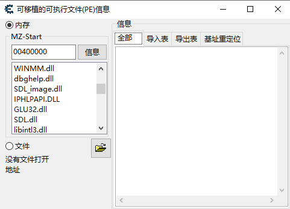


会有一些modules

点击信息，可以查看详情

0x400000 一般就是PE文件的入口


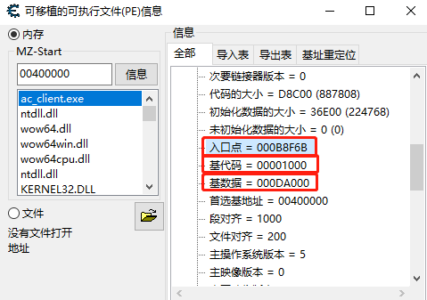


---

## 7. Tutorial - How to Find Position Coordinates with Cheat Engine

https://guidedhacking.com/threads/how-to-find-position-coordinates-with-cheat-engine.14000/

```c++
struct vec3
{
    float x, y, z;
}
```

`floating point` decimal values, but sometimes `double precision floating points` as well

`1.0f` can represent 1 foot, 1 meter or 1 mile. 


### Find Position Coordinates with [ReClass](https://guidedhacking.com/resources/reclass-net-download.2/) the easy way

Your coordinates are usually **in the same class** as your health. So find your health address, find the health offset and find the entity base address. Learn how in [this tutorial](https://guidedhacking.com/threads/how-to-hack-any-game-cheat-engine.7194/).

1. Put your entity base address into Reclass
2. right click and add 4096 bytes.
3. Now stare at ReClass and jump
4. Look in the float value column for values that increase when you jump but don't change when you stand still
5. Keep scrolling down until you find it
6. Sometimes there will be multiple variables, you have to use trial and error to find out which one is correct.
7. Once you find the Z value, you should X and Y write above them
8. Your position coordinates should be writeable, so try changing them once you find them.


Always treat your position and angles as a vec3, so **the position address/offset should start with the address of X**.


### Find Position with Cheat Engine the long way

1. Start by looking for Z
2. Stand somewhere on a hill, stairs or near a ladder
3. Scan for a float value using "unknown initial value"
4. Go Up, scan for increased
5. Go Down, scan for decreased
6. Repeat this again and again until you have less than 50 results

**If this doesn't work, the game is weird. Maybe it uses integers or doubles, try scanning for those types**

If that doesn't work then the values are obfuscated (VERY UNLIKELY)

Try this guide to try and find obfuscated values [Guide - How to Find Encrypted or Obfuscated Variables in Cheat Engine Guide](https://guidedhacking.com/threads/how-to-find-encrypted-or-obfuscated-variables-in-cheat-engine-guide.11445/)

**Once you have reduced your scan to less than 50 results:**

- Keep re-scanning until the number of results does not change
- Now add them all to your cheat table

**Your "correct" position address \*SHOULD\* be writable.**“正确”的位置地址应该是可写的。

Select all the addresses in your Cheat Table. Try changing all variables at once to a value within that is plus or minus 5.0f. 

You now have your writable position address. Your **local writable position** and the coordinates of your character which are **sent to all the other players on the server**, are not necessarily the same address. Sometimes they use different structures for networking and local information.


### Find Position Offset

Write click on the the X position variable and select **"Find what Accesses"** and then **"Find what Writes"**, then move your mouse. In both windows you will see stuff like:

```c++
mov eax, [esi + 0xC]
```

In this case, `0xC` should be your X position **offset** and `esi` should be the player **base address**. 

Once you find the position coordinates, you will want to **find a pointer to them**. If they are offset from your **entity base address**, then that is easy, just **find a pointer to your entity base address**, and then add the last offset for the position and you have your pointer.


---

## 8. Tutorial - How to Find View Angles with Cheat Engine

https://guidedhacking.com/threads/how-to-find-view-angles-with-cheat-engine.13994/

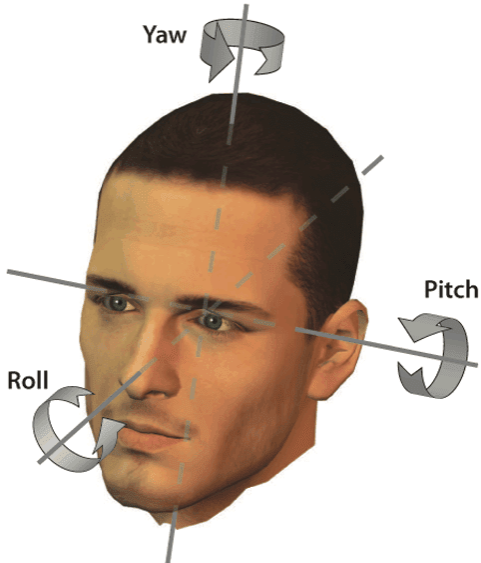

In 3D video games, view angles define the direction a player is facing. They are typically defined as a `vec3`, a structure containing `Pitch, Yaw and Roll` as float values which represent angle of degrees around an axis. 围绕轴的度数

It is typically represented by 3 **floating point decimal** values, Pitch, Yaw and Roll.

In **first person shooters** where you do not move on the roll axis, **only Pitch and Yaw** are important. But view angles are typically represented as a vector or a vec3 with the **z variable set to 0**. 

```c++
struct vec3
{
    float x, y, z;
}
```

X = Pitch, Y = Yaw, Z = Roll. 

These types of view angles are typically represented as **Eular Angles**. But they are sometimes seen as **radians**.

There are many ways to represent rotation, **a vec3 of Eular Angles** is one of the most straightforward, but there are also **rotation matrices**, **quaternions** & more. 


**Pitch = 180 total degrees of rotation, from -90 to +90
Yaw = 360 total degrees of rotation, from -180 to +180**

But sometimes it's 0 to +90 or 0 to +360.


### Find View Angles with [ReClass](https://guidedhacking.com/resources/reclass-net-download.2/) the easy way

Your view angles are usually in the same class as your health. So find your health address, find the health offset and find the entity base address. 

the next step just like the way of finding position coordinates


### Find View Angles with Cheat Engine the long way

1. Start by looking for pitch
2. **Look straight up into the sky** as far as you can
3. Scan for a float value between 88 and 92
4. Look straight down and scan for a value between -92 and -88
5. Repeat this again and again until you have less than 50 results

**If this doesn't work**

1. Start by looking for pitch
2. Look straight up into the sky as far as you can
3. Scan for a float value between **178 and 181**
4. Look straight down and scan for a value between **-182 and -179**
5. Repeat this again and again until you have less than 50 results

**If that doesn't work**

1. Start by looking for pitch
2. Look straight forward then arc upwards **45 degrees** so you're pointing between straight ahead and straight up
3. Scan for a **float value** between -362 and +362
4. Aim down, scan for reduced value
5. Aim up, scan for increased value
6. Repeat this again and again until you have less than 50 results

**If this doesn't work. Maybe it uses integers or bytes to represent angles**

1. Start by looking for pitch
2. Look straight forward then arc upwards 45 degrees so you're pointing between straight ahead and straight up
3. Scan using **"all data types"**
4. Scan for a value between -362 and +362
5. Aim down, scan for reduced value
6. Aim up, scan for increased value
7. Repeat this again and again until you have less than 50 results

**If this doesn't work, maybe your angles do not exist as Eular Angles and they are only represented as Radians** 如果这不起作用，也许您的角度不存为欧拉角，它们仅表示为弧度

**Radians are between -2 and +2 but are typically between -1 and +1**. For the sake of included all values and reducing the amount of scanning you need to do:

1. Start by looking for pitch
2. Look straight forward then arc upwards 45 degrees so you're pointing between straight ahead and straight up
3. Scan for a **float value** between **-2 and +2**
4. Aim down, scan for reduced value
5. Aim up, scan for increased value
6. Repeat this again and again until you have less than 50 results

**Once you have reduced your scan to less than 50 results:**

- Keep re-scanning until the number of results does not change
- Now add them all to your cheat table

**Your "correct" view angles address \*SHOULD\* be writable****.**

Select all the addresses in your Cheat Table. Try changing all variables at once to a value within the correct range (-90 and +90 for instance). 


### Find View Angle Offset

just like find position offset


---

## 9. Video Tutorial - Cheat Engine How to Pointer Scan with Pointermaps

https://guidedhacking.com/threads/cheat-engine-how-to-pointer-scan-with-pointermaps.9739/

Pointer scanning is used to **find static pointers to dynamic values** such as a player's health, a player's ammo, or a player's current weapon.

Once we find the correct enemy health address, we will use cheat engine **pointer scan tool to quickly narrow possible offsets**. Alternatively, we could do a manual pointer scan by searching for hex addresses, however the cheat engine pointer scan tool will quickly narrow result sets.


---

## 10. Video Tutorial - Game Hacking with Reclass Tutorial Video 1

https://guidedhacking.com/threads/game-hacking-with-reclass-tutorial.7823/

```
[<ac_client.exe>+109B74]
```


---

## 11. Learn C++ with Step by Step Guide

https://guidedhacking.com/threads/how-to-learn-c-programming-where-to-learn-c.14514/


---

## 12. Tutorial - Understanding Strings Unicode, TCHAR, MBCS

https://guidedhacking.com/threads/understanding-strings-unicode-tchar-mbcs.10811/


[The Private Lives of Strings — Cunning Planning](http://www.cunningplanning.com/post/the-private-lives-of-strings/)

ASCII defined a 7 bit code for denoting all characters that can be typed. This meant that it was possible to address 2^7 characters or a 128 of them. In the early days of electrical type writers this was sufficient, after all English can be written with 26 upper and 26 lower case letters and some punctuation.

ASCII 定义了一个 7 位代码，用于表示可以键入的所有字符。 这意味着可以处理 2^7 个字符或其中的 128 个字符。 在电子打字机的早期，这已经足够了，毕竟英语可以用 26 个大写字母和 26 个小写字母和一些标点符号来书写。

Extended ASCII now needed 8 bits to stow each character, which is 1 byte on most architectures. Now if each character is 8 bits, or 1 byte long then for the computer programmer a “string” of such characters is n bytes long, with each byte in the string being a character encoded in ASCII.

扩展 ASCII 现在需要 8 位来存放每个字符，在大多数体系结构中为 1 个字节。 现在，如果每个字符是 8 位，或 1 字节长，那么对于计算机程序员来说，这样一个“字符串”的长度是 n 字节，**字符串中的每个字节都是一个以 ASCII 编码的字符**。


A C string is an array of characters encoded in ASCII and it’s terminated by a Null character. 

C 字符串是一个以 ASCII 编码的字符数组，它以 Null 字符结尾。

```c++
//最多可以容纳 15 个字符，因为最后一个字符是空终止符（'\0'）。
char discworld [16] = “Discworld”;
```

C string ends at the first null terminator character C 字符串以第一个空终止符结尾


[Unicode - CunningPlanning](http://www.cunningplanning.com/post/unicode/)

ASCII defined a 7 bit code for encoding characters where each character in ASCII had a number from 0 to 127 and a corresponding glyph

ASCII 定义了用于编码字符的 7 位代码，其中 ASCII 中的每个字符都有一个从 0 到 127 的数字和一个相应的字形


[Unicode & Windows - CunningPlanning](http://www.cunningplanning.com/post/unicode-and-windows/)

There are 2 atomic character types in Unicode Supported Windows.

|             |                                                        |
| :---------- | :----------------------------------------------------- |
| **char**    | The good old character type. Each character is 8 bits. |
| **wchar_t** | The “wide” character type. Each character is 16 bits.  |

```c++
char ansiString[] = "This is an ansi string.";
wchar_t UnicodeString[] = L"This is a Unicode string, Olé!";
```

Notice the L in front of our Unicode string literal? That’s there to tell the compiler that the said literal is a wide char literal. This means that the compiler will keep 2 bytes for each character of that string. 注意到我们的 Unicode 字符串字面量前面的 L 了吗？ 这就是告诉编译器所说的文字是一个宽字符文字。 这意味着编译器将为该字符串的每个字符保留 2 个字节。


每个函数在 Windows API 中都是重复的。 一个包含 ANSI 实现，另一个包含 Unicode 实现。 以函数的 DrawTextA 和 DrawTextW 为例。 两者在功能上是相同的，但一个接受 ANSI 字符串 (A)，一个接受宽字符串 (W)。

```c++
DrawTextA( hdc, ansiString, -1, &rect1, DT_SINGLELINE | DT_NOCLIP ) ;
DrawTextW( hdc, UnicodeString, -1, &rect2, DT_SINGLELINE | DT_NOCLIP ) ;
```

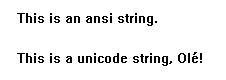


```C++
#ifdef UNICODE
#define TCHAR wchar_t
#else
#define TCHAR char
#

TCHAR anyString[] = TEXT("This can either Unicode or ansi. Olé!");
```

TCHAR will be replaced by either char or wchar_t depending on the definition of the UNICODE symbol. 根据 UNICODE 符号的定义，`TCHAR` 将被 `char` 或 `wchar_t` 替换。 


VS2019 选择“Unicode字符集”选项，TCHAR 将代表为 `wchar_t`。

VS2019 选择“多字节字符集”选项将导致未定义 UNICODE 预处理器符号，并且 TCHAR 将突然被变为 `char`。


windows API 中的每一对函数都被另一个 UNICODE 符号相关定义替换。 例如，使用以下定义将 DrawTextW 和 DrawTextA 函数合并为单个 DrawText 函数。

```c++
#ifdef UNICODE
#define DrawText DrawTextW
#else
#define DrawText DrawTextA
#endif

TCHAR anyString[] = TEXT("This can either Unicode or ansi. But α and ω needs Unicode.");
DrawText( hdc, anyString, -1, &rect3, DT_SINGLELINE | DT_NOCLIP );
```

如果您按照所述使用 Unicode 字符集编译此程序，则在您获得以下所有文本呈现正确的输出之前。


如果您使用多字节字符集 (ANSI) 编译程序，则需要 Unicode 编码的字符无法正确呈现，最终会出现 ? 字符。


the windows headers define a plethora of other string type like LPSTR, LPWSTR, LPTSTR, LPCTSTR etc. These are all sorts of combinations of pointers to char or wchar_t or TCHAR. 

windows 头文件定义了大量其他字符串类型，如 LPSTR、LPWSTR、LPTSTR、LPCTSTR 等。这些是指向 char 或 wchar_t 或 TCHAR 的指针的各种组合。


[The Absolute Minimum Every Software Developer Absolutely, Positively Must Know About Unicode and Character Sets (No Excuses!)](https://www.joelonsoftware.com/2003/10/08/the-absolute-minimum-every-software-developer-absolutely-positively-must-know-about-unicode-and-character-sets-no-excuses/)

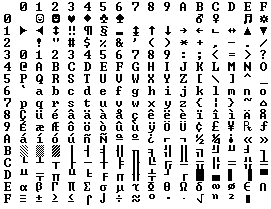


Every platonic letter in every alphabet is assigned a magic number by the Unicode consortium which is written like this: U+0639.  每个字母表中的每个柏拉图式字母都被 Unicode 联盟分配了一个神奇的数字，它是这样写的：U+0639。

This magic number is called a code point. The U+ means “Unicode” and the numbers are hexadecimal. U+0639 is the Arabic letter Ain. The English letter A would be U+0041. 这个幻数称为代码点。U+ 的意思是“Unicode”，数字是十六进制的。 U+0639 是阿拉伯字母 Ain。 英文字母 A 将是 U+0041。


Unicode 可以定义的字母数量没有真正的限制，事实上它们已经超过了 65,536，所以并不是每个 Unicode 字母都可以真正被压缩成两个字节

**Hello** , in Unicode, corresponds to these five code points: 对应于这五个代码点

U+0048 U+0065 U+006C U+006C U+006F.


[The Complete Guide to C++ Strings, Part I - Win32 Character Encodings - CodeProject](https://www.codeproject.com/Articles/2995/The-Complete-Guide-to-C-Strings-Part-I-Win-Chara)

Single-byte strings are stored one character after the next, with a **single** zero byte marking the end of the string. 单字节字符串在下一个字符之后存储，单个零字节标记字符串的结尾。 So for example, `"Bob"` is stored as:

| ` 42 ` | ` 6F ` | ` 62 ` | ` 00 ` |
| ------ | ------ | ------ | ------ |
| `B`    | `o`    | `b`    | `EOS`  |


The Unicode version, `L"Bob"`, is stored as:

| ` 42 00 ` | ` 6F 00 ` | ` 62 00 ` | ` 00 00 ` |
| --------- | --------- | --------- | --------- |
| `B`       | `o`       | `b`       | `EOS`     |

with the character 0x0000 (the Unicode encoding of zero) marking the end.用字符 0x0000（零的 Unicode 编码）标记结束。


DBCS strings look like SBCS strings at first glance, but we will see later that there are subtleties that make a difference when using string manipulating functions and traversing through the string with a pointer. The string ""  is stored as follows (with lead bytes and trail bytes indicated by LB and TB respectively):

DBCS 字符串乍一看很像 SBCS 字符串，但稍后我们将看到，在使用字符串操作函数和使用指针遍历字符串时，会有一些微妙之处。 字符串 ""  存储如下（前导字节和尾随字节分别由 LB 和 TB 表示）：

 "nihongo"

| ` 93 FA `             | ` 96 7B `              | ` 8C EA `             | ` 00 ` |
| --------------------- | ---------------------- | --------------------- | ------ |
| ` LB TB `             | ` LB TB`               | ` LB TB`              | ` EOS` |
|  |  |  | ` EOS` |


Keep in mind that the value of "ni" is not interpreted as the `WORD` value 0xFA93. The two values `93` and `FA`, *in that order*, together encode the character "ni". (So on a big-endian CPU, the bytes would still be in the order shown above.)

“ni”的值不是直接被解释为 `WORD` 值 0xFA93。而是两个值`93` 和`FA`，按顺序一起编码字符“ni”。


C string functions like `strcpy()`, `sprintf()`, `atol()`, etc. These functions must be used *only* with single-byte strings. The standard library also has versions for use with *only* Unicode strings, such as `wcscpy()`, `swprintf()`, `_wtol()`.

我们都见过像 strcpy()、sprintf()、atol() 等 C 字符串函数。这些函数只能用于单字节字符串。 标准库也有仅用于 Unicode 字符串的版本，例如 wcscpy()、swprintf()、_wtol()。


| type      | Meaning in MBCS builds                                      | Meaning in Unicode builds                                   |
| --------- | ----------------------------------------------------------- | ----------------------------------------------------------- |
| `WCHAR`   | `wchar_t`                                                   | `wchar_t`                                                   |
| `LPSTR`   | zero-terminated string of `char` (`char*`)                  | zero-terminated string of `char` (`char*`)                  |
| `LPCSTR`  | constant zero-terminated string of `char` (`const char*`)   | constant zero-terminated string of `char` (`const char*`)   |
| `LPWSTR`  | zero-terminated Unicode string (`wchar_t*`)                 | zero-terminated Unicode string (`wchar_t*`)                 |
| `LPCWSTR` | constant zero-terminated Unicode string (`const wchar_t*`)  | constant zero-terminated Unicode string (`const wchar_t*`)  |
| `TCHAR`   | `char`                                                      | `wchar_t`                                                   |
| `LPTSTR`  | zero-terminated string of `TCHAR` (`TCHAR*`)                | zero-terminated string of `TCHAR` (`TCHAR*`)                |
| `LPCTSTR` | constant zero-terminated string of `TCHAR` (`const TCHAR*`) | constant zero-terminated string of `TCHAR` (`const TCHAR*`) |


[UTF-8 Everywhere](http://utf8everywhere.org/)


---

## 13. Tutorial - Get Module Base Address Tutorial dwGetModuleBaseAddress

https://guidedhacking.com/getmodulebase

This tutorial will teach you how to get the module base address of any module. `dwGetModuleBaseAddress` is the function that most people are familiar with in the past. Our tutorial uses `uintptr_t` which will resolve to a `x86 or x64 address` depending what architecture you build for. This makes it work on both, so you only need one function. The old function uses `DWORD` so it **only works on x86**.


This is relatively simple to do and in C++ you use the **ToolHelp32 Snapshot** library to loop through the modules. 


All .exe and .dll files when loaded into memory are referred to as "modules". 加载到内存中的所有 .exe 和 .dll 文件都称为“模块”。


视图 -> 枚举DLL和符号表

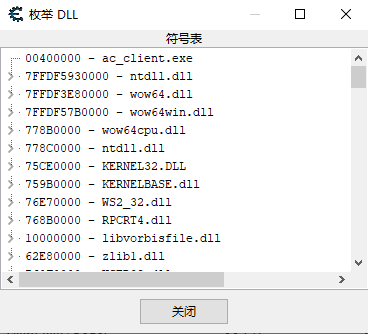

or 工具 -> 分析PE文件头


When an .exe is executed, the windows loader create a process for it and give it it's own virtual memory space. The loader loads the executable into memory and then any .dlls that are called by the process. The PE header for the .dll defines a ImageBase address. The windows loader will try to load the .dll into the virtual memory space of the process that requires it. If that space is already occupied, it will be loaded into a different location. 

当一个 .exe 被执行时，windows 加载器会为它创建一个进程并给它自己的虚拟内存空间。加载器将可执行文件加载到内存中，然后加载进程调用的任何 .dll。 .dll 的 PE 标头定义了 ImageBase 地址。Windows 加载程序将尝试将 .dll 加载到需要它的进程的虚拟内存空间中。 如果该空间已被占用，它将被加载到不同的位置。 


Basically it uses the windows API [CreateToolhelp32Snapshot](https://msdn.microsoft.com/en-us/library/windows/desktop/ms682489(v=vs.85).aspx) to get a snapshot of all loaded modules for the given process, it then iterates through all the loaded modules and finds the module with the module name you give it. It returns a uintptr_t to the module address. You input the ProcessID and the name of the module and it ouputs the address of the module.
You must set your project to UNICODE for this to work, you can easily change this to work with MBCS.

基本上它使用 Windows API `CreateToolhelp32Snapshot` 来获取给定进程的所有加载模块的**快照**，然后它**遍历**所有加载的模块并找到具有您给它的模块名称的模块。 它返回一个 `uintptr_t` 到模块**地址**。 您输入 `ProcessID` 和模块名称，它会输出模块的地址。
您必须将您的项目设置为 `UNICODE` 才能工作，您可以轻松地将其更改为与 MBCS 一起使用。


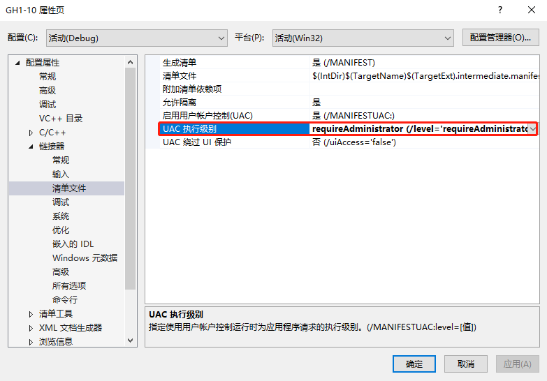


见 GH1-13 项目


---

## 14. Source Code - FindDMAAddy - C++ Multilevel Pointer Function

https://guidedhacking.com/threads/finddmaaddy-c-multilevel-pointer-function.6292/


```c++
class PlayerClass
{
public:
int health;
int armor;
char* name;
}

PlayerClass* localPlayer;
localPlayer = new PlayerClass();
```

**Class:**
Health is offset `0x0`, armor is offset `0x4` and name is offset `0x8`, because **int is a 4 byte** variable in this example(32bit x86)


In this example it is not initialized. Meaning, no memory has been allocated for it.

When the player starts a game, the `localPlayer` object is allocated a spot in memory on the heap and the pointer is assigned the address of the object.

If you wanted to get the value of name variable you would use the "->" (the structure dereference operator) like this: "localPlayer->name".

When the compiler compiles this code into assembly the logic that the code follows is this:

1. Dereference the localPlayer pointer to get the dynamic address of the object
2. Add offset 0x8 to get to the name pointer
3. Dereference the name pointer to get the dynamic address of the name value


```c++
// external
uintptr_t FindDMAAddy(HANDLE hProc, uintptr_t ptr, std::vector<unsigned int> offsets)
{
    uintptr_t addr = ptr;
    for (unsigned int i = 0; i < offsets.size(); ++i)
    {
        ReadProcessMemory(hProc, (BYTE*)addr, &addr, sizeof(addr), 0);
        addr += offsets[i];
    }
    return addr;
}

// internal
uintptr_t FindDMAAddy(uintptr_t ptr, std::vector<unsigned int> offsets)
{
    uintptr_t addr = ptr;
    for (unsigned int i = 0; i < offsets.size() ; ++i)
    {
        addr = *(uintptr_t*)addr;
        addr += offsets[i];
    }
    return addr;
}
```


---

## 15. Video Tutorial - How to Hack Any Game Tutorial C++ Trainer #1 - External

https://guidedhacking.com/threads/how-to-hack-any-game-tutorial-c-trainer-1-external.10897

见 GH1-13 项目

```C++
template <class C>
C read(DWORD_PTR(Address)) {
    C c;
    ReadProcessMemory(hProcess, reinterpret_cast<LPCVOID>(Address), &c, sizeof(c), nullptr);
    return c;
}
```


---

## 16. Video Tutorial - How to Hack Any Game Tutorial C++ Trainer #2 - External v2

https://guidedhacking.com/threads/how-to-hack-any-game-tutorial-c-trainer-2-external-v2.12000

https://www.youtube.com/watch?v=UMt1daXknes


编译器在编译你的程序的时候，所做的第一件事，也就是展开所有的 #include 语句和 #define 语句。处理一些以 "#" 开头的指令

头文件的出现，固然给书写程序带来了很大方便。可是到了 Windows 时代后，慢慢就呈现出一些问题了。几乎所有的 Windows 程序都必须包含 windows.h，而那个文件却硕大无比，将它展开后往所有文件中一粘贴，编译的时候立刻慢得像只蜗牛。

虽然用到的头文件又多又杂，但是在一个工程中，**总有那么一堆头文件，是几乎所有 cpp 都必须包含的**。那么，可以把这些头文件提取出来，只编译一边，然后所有其它 cpp 就都能使用；这就是预编译头的思想都由来！


C/C++的编译单元是源文件（带有.c、.cc、.cpp等扩展名的文件），在编译一个源文件之前，预处理器会把这个源文件中所有通过#include指令包含进来的头文件**递归地展开**，也就是把所有直接或间接包含的头文件原封不动地插入进来。当这个过程结束之后，**才开始编译**。

这种编译方式的缺点是会使头文件被重复编译。**假如有一百个源文件都包含了Windows.h**，那么这个头文件会在一百个源文件中展开，它里面的代码会**被重复编译了一百次**，尽管每次编译的结果都相同。对于具有成千上万个源文件的大型项目来说，重复编译是难以接受的，**会浪费大量的编译时间。**

为了解决这个问题，预编译头应运而生。顾名思义，预编译头就是**预先把头文件编译好，在编译源文件的时候直接取用这些编译结果，避免对头文件重复编译**。这项技术能大幅提高C++的编译速度。


**什么是预编译头?**

所谓预编译头，就是把头文件事先编译成一种二进制的中间格式。


**什么时候使用预编译头?**

当大多.c或.cpp文件都需要相同的头文件时。

当某些代码被大量重复使用时。

当导入某些不同库都有实现的函数，并产生混乱时。


https://defuse.ca/online-x86-assembler.htm#disassembly2


"\x" tells the compiler to use the literal bytes we're defining in the **char array**


---

## 17. Video Tutorial - How to Hack Any Game Tutorial C++ Trainer #3 - First Internal

https://guidedhacking.com/threads/how-to-hack-any-game-tutorial-c-trainer-3-first-internal.12142

https://www.youtube.com/watch?v=hlioPJ_uB7M


Internal hacks are created by injecting a dynamic link library or DLL into the game process, when you do this you have **direct access to the process's memory** which means fast performance and simplicity. Normally a DLL is used to export functions and to be used like a lib, accessing the functions from the lib when necessary. But in our case, we're just going to use them to get our code to run in a target process. Injected DLL's can be made more sneaky by using different injection methods such as **Manual Mapping**.

通过将动态链接库或 DLL 注入游戏进程来创建的

通常，DLL 用于导出函数并像 lib 一样使用，在必要时从 lib 访问函数。


自己写退出dll的函数，不要用dll注入器的exject


---

## 18. Video Tutorial - Simple DLL Injector Source Code

https://guidedhacking.com/threads/simple-dll-injector-source-code.13970/

making a DLL [Injector](https://guidedhacking.com/resources/guided-hacking-dll-injector.4/) using `VirtualAllocEx`, `CreateRemoteThread` & `LoadLibrary`

DLL injection is a technique used for running code within the address space of another process by forcing it to load a dynamic-link library.

动态链接库注入是一种通过强制另一个进程加载动态链接库来在该进程的地址空间中运行代码的技术


见 GH1-18 项目


`__stdcall`

被这个关键字修饰的函数，其参数都是从右向左通过**堆栈**传递的(`__fastcall` 的前面部分由`ecx`,`edx` 传)， 函数调用在返回前要由被调用者清理堆栈。


---

## 19. Video Tutorial - How to Debug Your Hack or Aimbot with Visual Studio

https://guidedhacking.com/threads/how-to-debug-your-hack-or-aimbot-with-visual-studio.7904/

https://www.youtube.com/watch?v=IVRS_P58Q2I&feature=emb_imp_woyt

选 debug 模式

有些变量不用写在代码里显示，只需要在watch里加入，如 `GetLastError()`

调试时，改代码，可以直接下一步（自动重新编译）

NTDLL.dll is the interface between usermode and kernel mode


---

## 20. Video Tutorial - Game Hacking with Reclass Tutorial Video 2

https://guidedhacking.com/threads/game-hacking-with-reclass-tutorial.7823/


## 21. Video Tutorial - C++ External Detour / Hooking Function Tutorial

https://guidedhacking.com/threads/c-external-detour-hooking-function-tutorial.7930/

**What is a detour?**

detour 迂回描述了改变汇编指令跳转到不同位置的行为，本质上是重新引导执行流程。通常情况下，您这样做是为了将代码绕到一个内存区域，在那里您自己的代码存在。因此你在强迫游戏执行你的代码。 

做到这一点的关键是确保不损坏堆栈 do not corrupt the stack，执行覆盖的字节，并在代码执行后跳回正确的位置。

**Mid Function Hooking**

detour 有时被称为 mid function hook，唯一的警告是，如果你 detour 一个函数的第一个字节，这就不是 mid function hook。把你的 detour 放在一个函数的第一个字节很容易被 anti-cheats 检测到，这就是为什么 mid function hook 不太容易被检测到。anti-cheats  可以很容易地检查第一个字节，但并不总是检查函数中的每个字节。


**External Detouring / Hooking**

通常，您会通过使用 `WriteProcessMemory` 将代码写入目标进程来实现这一点，然后以同样的方式使用 `WPM` 来更改现有代码以跳转到您的代码。External hooking / detouring 更加复杂，因为您必须将 shellcode 写入目标进程。Externally，您必须将 assembly 转换成 bytes，并将其作为 shellcode 写入进程。Internally，这就简单多了，而且你不需要太多的组装。


**Stolen Bytes**

你的 detour 在内存覆盖的字节被称为 stolen bytes 被盗字节，重要的是你要知道你覆盖了多少字节，并且你必须在你执行你的 detour 之后执行这些字节，否则 stack/registers 将被破坏。字节数并不总是相同的，假设正在覆盖一个 8 字节的指令，但是 detour 指令只有 5 字节。在这种情况下，需要复制所有 8 个字节的被盗字节。不能执行 75% 的指令。

必须复制 stolen bytes，并在自己的代码执行后执行它们，以确保您不会使程序崩溃。


**Code Caves**

code cave 是目标进程内存中不被进程使用的一部分。通常我们指的是**已分配但不包含进程执行所需的任何内容的内存**。当使用 detour 时，您可以将代码写入该内存，而不必分配内存。如果您使用的是 code cave，则内存页面必须具有执行权限。您可以使用 `VirtualProtect` 或`VirtualProtectEx` 修改这些内存保护常数。


**What is a hook?**

hook 经常与 detour 这个词互换使用。在我看来，hook 具体来说就是 hook 到代码中并将执行流程重定向到您自己的代码。在我看来，detour 不一定要绕到自己的代码，你可以简单地绕到进程内存的不同部分。例如，如果你**只是跳过一些你不想执行的代码**，我会把这描述为一个 detour。

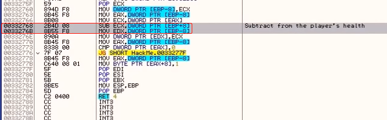

```c++
bool Hook(void * toHook, void * ourFunct, int len) {
    if (len < 5) {			//必须大于5
        return false;
    }

    DWORD curProtection;
    VirtualProtect(toHook, len, PAGE_EXECUTE_READWRITE, &curProtection);

    memset(toHook, 0x90, len);

    DWORD relativeAddress = ((DWORD)ourFunct - (DWORD)toHook) - 5; //5为jmp指令的长度

    *(BYTE*)toHook = 0xE9;
    *(DWORD*)((DWORD)toHook + 1) = relativeAddress;

    DWORD temp;
    VirtualProtect(toHook, len, curProtection, &temp);

    return true;
}

void __declspec(naked) ourFunc(){
    __asm {
        add ecx, ecx		//修改了这里，原指令为sub 这里变成了add
        mov dex, [ebp-8]	//stolen code的后半部分 原封不动执行
        jmp [jmpBackAddr]	//跳回去
    }
}
int main(){
    //必须大于5，但是0x332768只有3bytes，所以还需要把0x33276B也用上，总共是6个字节
    int hookLength = 6;
    DWORD hookAddress = 0x332768;
    jmpBackAddr = hookAddress + hookLength;// hook完回来执行 0x33276E 的指令
    Hook((void)hookAddress, ourFunc, hookLenth);
    ...
    return 0;
} 
```

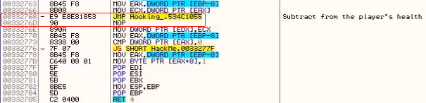


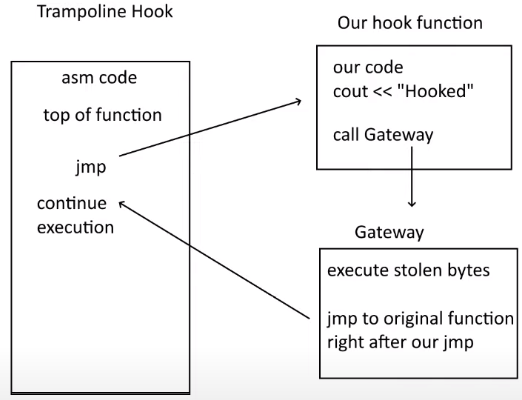


> Cheat Engine Display:
> mov edi, [esp + 014]
> 014 this is actually 0x14 (cheat engine doesn't say 0x so you may not realize it's hex)
>
> In Visual Studio you must do:
> mov edi, [esp + 0x14]
>
> just doing esp + 14 in VS = decimal


---

## 22. WTF are Multi Level Pointers Tutorial - Guided Hacking

https://guidedhacking.com/threads/wtf-are-multi-level-pointers-tutorial.11881/

VS debug 时，CE 无法附加读值


---

## 23. Video Tutorial - How to find Entity List Pointer in AC!

https://guidedhacking.com/threads/how-to-find-entity-list-pointer-in-ac.10235/

https://www.youtube.com/watch?v=TCu0qSivXUc

```c++
ents[i].name		//ents[i]是一个结构体

entPtrs[i]->name 	//entPtrs[i]是一个指针

ents[i] = *entPtrs[i];//指针指向结构体
```

