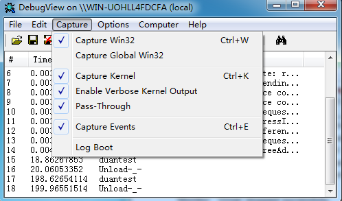
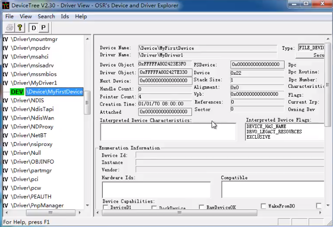
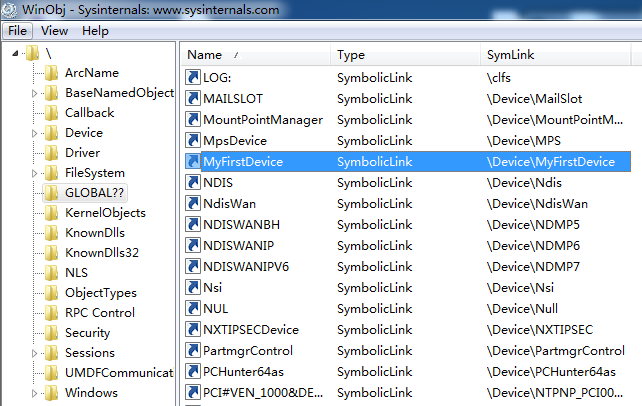

# Kernel

[原创]WIN64驱动编程基础教程（福利：过WIN7/8/8.1签名强制的LIB、过WIN7“补丁守卫”的SRC、吊销的正规数字签名

https://bbs.pediy.com/thread-187348.htm


[原创] [Windows驱动开发] 01_内存读取 

https://bbs.pediy.com/thread-251461.htm


## 签名

https://www.52pojie.cn/thread-877849-1-1.html

https://www.52pojie.cn/thread-1027420-1-1.html

https://pki.jemmylovejenny.tk/

https://github.com/JemmyLoveJenny/HookSigntool


## 环境配置

https://www.52pojie.cn/forum.php?mod=viewthread&tid=885303&highlight=%C7%FD%B6%AF%BF%AA%B7%A2

https://medium.com/@eaugusto/setting-up-a-windows-7-virtualbox-vm-for-kernel-mode-debugging-367911889316


VMware-workstation-full-15.5.0-14665864

cn_windows_7_ultimate_with_sp1_x64_dvd_u_677408.iso

msdn.itellyou.cn


**安装vmtools**

设置 CD 使用ISO映像文件 windows.iso

点一下右下角的光盘按钮


**VMware虚拟机与Device/Credential Guard 不兼容**

一条命令搞定：

```text
bcdedit /set hypervisorlaunchtype off
```


如果想重新开启

```text
bcdedit /set hypervisorlaunchtype auto
```


## 1. HelloWorld

- Debug x64

- 调整`属性 - C/C++ - 常规`，警告等级 **3**，将警告视为错误 **否**；
- `链接器 - 常规`，警告视为错误 否；
- `Driver Settings - General`，`Target OS Version`改成`Windows 7`，`Target Platform`改为`Desktop`；
- 删除 `inf` 文件





以服务的方式 卸载驱动 会去找 `Unload` 方式，为空就不进行卸载，防止驱动正在进行操作。

```c++
PsSetCreateProcessNotifyRoutine(nothing, FALSE);//进程通知回调
//当打开或者关闭某一进程，执行我们自定义的nothing函数

//暴力卸载，会把内存释放，但如果我们没有写自定义卸载函数，就没有移除这个回调，当有进程开启或关闭，指针还指向这片无效内存，会蓝屏
```


```c++
// 需要在自定义函数中，关闭这个回调
VOID DrvUnload(PDRIVER_OBJECT pdriver)
{
	DbgPrint("Unload-_-\n");
    PsSetCreateProcessNotifyRoutine(nothing, TRUE);
}
```


## 2. 创建设备进行交互

Windows 内核中的请求基本上是通过 I/O Request Packet 完成的，消息机制

设备属于驱动

宽字符

```c++
//SymbolicLink 符号连接 内核中C盘路径表示方式
\\??\\C:    默认有\\??
\\HardValxxx\\
```








如果没有`driver->MajorFunction[IRP_MJ_CREATE] = MyCreate;` 这一句，

用户应用程序会提示无法打开driver，即`CreateFile` 失败


可以使用 driver 找驱动的指针


---

## 3. 读写交互


