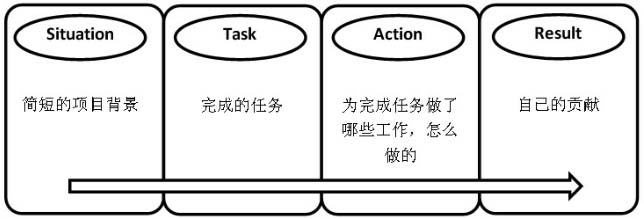
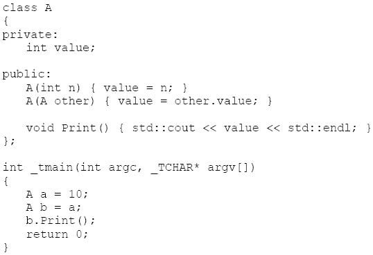

# 剑指 Offer

- [ ] 应聘者在电话面试的时候应尽可能用形象的语言把细节说清楚。如果在英语面试时没有听清或没有听懂面试官的问题，应聘者要敢于说**Pardon**。
- [ ] 如果应聘者**先写单元测试用例**，再写解决问题的函数，我相信面试官定会对你刮目相看
- [ ] 在共享桌面远程面试过程中，面试官最关心的是应聘者的**编程习惯及调试能力**。
- [ ] 简历中我们描述技能的掌握程度大部分应该是**“熟悉**”
- [ ] 面试官不能容忍的错误就是程序**不够鲁棒**
- [ ] 面试官除了希望应聘者的代码能够完成基本的功能之外，还会关注应聘者是否考虑了**边界条件、特殊输入**（比如NULL指针，空字符串等）及错**误处理**。
- [ ] 对于确实很**复杂的问题**，面试官甚至不期待应聘者能在面试不到一个小时的时间里给出完整的答案，**他更看重的可能还是应聘者是否有清晰的思路**。
- [ ] 面试官通常**不喜欢应聘者在没有形成清晰思路之前就草率地开始写代码**，这样写出来的代码容易逻辑混乱、错误百出。
- [ ] 如果在面试的时候遇到难题，我们有3种办法分析、解决复杂的问题：**画图能使抽象问题形象化**，**举例使抽象问题具体化**，**分解使复杂问题简单化**。
- [ ] 熟知各种数据结构的优缺点，并能选择合适的数据结构解决问题 + 掌握常用的算法
- [ ] 表现自己的沟通能力和学习能力
- [ ] **不要问和自己的职位没有关系的问题** + **不要问薪水** + **不要立即打听面试结果**
- [ ] C++中对内存的使用管理+ 面向对象的特性**、**构造函数**、**析构函数**、**动态绑定


为了让大家能顺利地通过C++面试，更重要的是能更好地学习掌握C++这门编程语言，这里推荐几本C++的书，大家可以根据自己的具体情况选择阅读的顺序：

●　《Effective C++》。这本书很适合在面试之前突击C++。这本书列举了使用C++经常出现的问题及解决这些问题的技巧。该书中提到的问题也是面试官很喜欢问的问题。
●　《C++ Primer》。读完这本书，就会对C++的语法有全面的了解。
●　《Inside C++ Object Model》。这本书有助于我们深入了解C++对象的内部。读懂这本书后很多C++难题，比如前面的sizeof的问题、虚函数的调用机制等，都会变得很容易。
●　《The C++ Programming Language》。如果是想全面深入掌握C++，没有哪本书比这本书更适合的了。


---

## 第一章 面试的流程

### 1.1 面试官谈面试

“对于初级程序员，我一般会偏向考查**算法和数据结构**，看应聘者的基本功；对于高级程序员，我会多关注**专业技能和项目经验**。”


“应聘者要事先做好准备，对公司**近况、项目情况**有所了解，对所应聘的工作真的很有**热情**。另外，应聘者还要准备好合适的问题问面试官。”


“应聘者在面试过程首先需要放松，不要过于紧张，这有助于后面解决问题时开拓思路。其次**不要急于编写代码**，应该先了解清楚所要解决的问题。这时候**最好先和面试官多做沟通**，然后开始做一些**整体的设计和规划**，这有助于编写**高质量和高可读性的代码**。写完代码后不要马上提交，最好自己**review并借助一些测试用例来走几遍代码**，找出可能出现的错误。”


---

### 1.2 面试的三种形式

如果应聘者能够通过公司的简历筛选环节，那恭喜他取得了阶段性的成功。但要想拿到心仪的Offer，应聘者还有更长的路要走。大部分公司的面试都是从**电话面试**开始的。通过电话面试之后，有些公司还会有一两轮**远程面试**。面试官让应聘者共享自己的桌面，远程观察应聘者编写及调试代码的过程。如果前面的面试都很顺利，应聘者就会收到现场面试的邀请信，请他去公司接受**面对面的面试**。


#### 1.2.1 电话面试

没有了肢体语言、面部表情，应聘者清楚地表达自己想法的难度就比现场面试时要大很多，特别是在解释复杂算法的时候。应聘者在电话面试的时候应尽可能用**形象化的语言把细节说清楚**。例如，在现场面试的时候，应聘者如果想说一个二叉树的结构，可以用笔在白纸上画出来，就一目了然。但在电话面试的时候，应聘者就需要把**二叉树中有哪些结点，每个结点的左子结点是什么、右子结点是什么都要说得很清楚**，只有这样面试官才能准确地理解应聘者的思路。

很多外企在电话面试时都会加上英语面试的环节，甚至有些公司全部面试都会用英语进行。电话面试时应聘者只能**听到面试官的声音而看不到他的口型**，这对应聘者的听力提出了更高的要求。如果应聘者在面试的时候没有听清楚或者听懂面试官的问题，**千万不要不懂装懂、答非所问，这是面试的大忌**。当不确定面试官的问题的时候，应聘者一定要**大胆地向面试官多提问，直到弄清楚面试官的意图为止**。

面试小提示：
应聘者在电话面试的时候应尽可能用形象的语言把细节说清楚。如果在英语面试时没有听清或没有听懂面试官的问题，应聘者要敢于说**Pardon**。


---

#### 1.2.2 共享桌面远程面试

共享桌面远程面试（Phone-Screen Interview）是指利用一些共享桌面的软件，应聘者把自己电脑的桌面共享给远程的面试官。面试官却能通过共享桌面观看应聘者编程和调试的过程。目前只有为数不多的几家大公司会在邀请应聘者到公司参加现场面试之前，先进行一两轮共享桌面的远程面试。这种形式的面试，面试官最关心的是应聘者的编程习惯及调试能力。通常面试官会认可应聘者下列几种编程习惯：

●　**思考清楚再开始编码**。形成清晰的思路之后再写代码。应聘者应先想清楚解决问题的思路，算法的时间、空间复杂度各是什么，有哪些特殊情况需要处理等，然后再动手编写代码。

●　**良好的代码命名和缩进对齐习惯**。一目了然的变量和函数名，加以合理的缩进和括号对齐，会让面试官觉得应聘者有参与大型项目的开发经验。

●　能够单元测试。通常面试官出的题目都是要求写函数解决某一问题，如果应聘者能够在定义函数之后，立即对该函数进行全面的单元测试，那就相当于向面试官证明了自己有着专业的软件开发经验。如果应聘者是先写单元测试用例，再写解决问题的函数，我相信面试官定会对你刮目相看，因为能做到测试在前、开发在后的程序员实在是太稀缺了，他会毫不犹豫地抛出绿色的橄榄枝。

面试官关注**调试功底**。**熟练地设置断点、单步跟踪、查看内存、分析调用栈，能很快发现问题的根源并最终解决问题**，那么面试官将会觉得他的开发经验很丰富。


> 在共享桌面远程面试过程中，面试官最关心的是应聘者的**编程习惯及调试能力**。


---

#### 1.2.3 现场面试

在通过电话面试和共享桌面远程面试之后，应聘者不久就会收到E-mail，邀请他去公司参加现场面试（Onsite Interview）。去公司参加现场面试之前，应聘者应做好以下几点准备：

●　**规划好路线并估算出行时间**。应聘者要事先估算在路上需要花费多长时间，并预留半小时左右的缓冲时间以应对堵车等意外情况。如果面试迟到，那至少印象分会大打折扣。

●　准备好**得体的衣服**。IT公司通常衣着比较随意，应聘者通常没有必要穿着正装，一般舒服干净的衣服都可以。

●　**注意面试邀请函里的面试流程**。如果面试有好几轮，时间也很长，那么你在面试过程中可能会觉得疲劳并思维变得迟钝。因此应聘者可以带一些提神的饮料或者食品，在两轮面试之间提神醒脑。

●　**准备几个问题**。每一轮面试的最后，面试官都会让应聘者问几个问题，应聘者可以提前准备好问题。


**重头戏**。面试官通过应聘者的语言和行动，考查他的**沟通能力、学习能力、编程能力**等综合实力。


---

### 1.3 面试的三个环节

通常面试官会把每一轮面试分为三个环节（如图1.2所示）：首先是**行为面试**，面试官参照简历了解应聘者的过往经验；然后是**技术面试**，这一环节很有可能会要求应聘者现场写代码；最后一个环节是**应聘者问**几个自己最感兴趣的问题。下面将详细讨论面试的这三个环节。


#### 1.3.1 行为面试环节

在行为面试这个环节里，面试官会注意应聘者的**性格特点**，深入地了解**简历中列举的项目经历**。由于这一环节一般不会问技术难题，因此也是一个暖场的过程，应聘者可以利用这几分钟时间**调整自己的情绪，进入面试的状态**。

不少面试官会让应聘者做一个简短的自我介绍。由于面试官手中拿着应聘者的简历，而那里有应聘者的详细信息，因此此时的自我介绍不用花很多时间，用30秒到1分钟的时间介绍自己的**主要学习、工作经历**就即可。如果面试官对你的某一段经历或者参与的某一个项目很感兴趣，他会有针对性地提几个问题详细了解。


**1．应聘者的项目经验**

应聘者自我介绍之后，面试官接着会对照应聘者的简历去详细了解他感兴趣的项目。应聘者在准备简历的时候，建议用如下图所示的STAR模型描述自己经历过的每一个项目。



●　Situation：简短的项目背景，比如项目的规模，开发的软件的功能、目标用户等。

●　Task：**自己完成的任务**。这个要写详细，要让面试官对自己的工作一目了然。在用词上要注意区分“参与”和“负责”：如果只是加入某一个开发团队写了几行代码就用“负责”，那就很危险。面试官看到简历上应聘者“负责”了某个项目，他可能就会问项目的总体框架设计、核心算法、团队合作等问题。这些问题对于只是简单“参与”的人来说，是很难回答的，会让面试官认为你不诚实，印象分会减去很多。

●　Action：为了完成任务自己做了哪些工作，是怎么做的。这里可以详细介绍。做系统设计的，可以介绍系统架构的特点；做软件开发的，可以写基于什么工具在哪个平台下应用了哪些技术。

●　Result：**自己的贡献**。这方面的信息可以写得具体些，最好能用数字加以说明。如果是参与**功能开发**，可以说按时**完成了多少功能**；如果做**优化**，可以说**性能提高的百分比**是多少；如果是**维护**，可以说**修改了多少个Bug**。


>  在介绍项目经验（包括在简历上介绍和面试时口头介绍）时，应聘者不必详述项目的背景，而要**突出介绍自己完成的工作及取得的成绩**。


**2．应聘者掌握的技能**

简历中我们描述技能的掌握程度大部分应该是“熟悉”。如果我们在实际项目中使用某一项技术已经有较长的时间，通过查阅相关的文档可以独立解决大部分问题，我们就熟悉它了。对应届毕业生而言，他毕业设计所用到的技能，可以用“熟悉”；对已经工作过的，在项目开发过程中所用到的技能，也可以用“熟悉”。


---

#### 1.3.2 技术面试环节

面试的重头戏

**扎实的基础知识**、能写高质量的代码、**分析问题时思路清晰**、能**优化时间效率和空间效率**，以及学习沟通等各方面的能力


应聘者在面试之前需要做足准备，对编程语言、数据结构和算法等基础知识有全面的了解。

面试的时候如果遇到简单的问题，应聘者一定要注重细节，写出完整、鲁棒的代码。

如果遇到复杂的问题，应聘者可以通过**画图**、举具体例子分析和分解复杂问题等方法先理清思路再动手编程。

除此之外，应聘者还应该**不断优化时间效率和空间效率**，力求找到最优的解法。

在面试过程中，应聘者还应该**主动提问，以弄清楚题目的要求**，表现自己的沟通能力。

当**面试官前后问的两个问题有相关性**的时候，尽量**把解决前面问题的思路迁移到后面的问题中去**，展示自己良好的学习能力。


**1. 扎实的基础知识**

扎实的基本功是成为优秀程序员的前提条件，因此面试官首要关注的应聘者素质就是是否具备扎实的基础知识。通常基本功在编程面试环节体现在3个方面：**编程语言**、**数据结构**和**算法**。

首先，每个程序员至少要掌握**一两门编程语言**。面试官从应聘者在面试过程中写的代码及跟进的提问中，能看出其编程语言掌握的熟练程度。以大部分公司面试要求的C++举例。如果写的函数需要传入一个指针，面试官可能会问是否需要为该指针加上const，把const加在指针不同的位置是否有区别；如果写的函数需要传入的参数是一个复杂类型的实例，面试官可能会问传入值参数和传入引用参数有什么区别，什么时候需要为传入的引用参数加上const。

其次，数据结构通常是编程面试过程中考查的重点。在参加面试之前，应聘者需要熟练掌握**链表、树、栈、队列和哈希表**等数据结构，以及它们的操作。如果我们留意各大公司的面试题，就会发现**链表和二叉树**相关的问题是很多面试官喜欢问的问题。如果应聘者事先对**链表的插入和删除**结点了如指掌，对**二叉树的各种遍历方法的循环和递归**写法都烂熟于胸，那么真正到了面试的时候也就游刃有余了。

最后，大部分公司都会注重考查**查找、排序**等算法。应聘者可以在了解各种查找和排序算法的基础上，重点掌握**二分查找、归并排序和快速排序**，因为很多面试题都只是这些算法的变体而已。少数对算法很重视的公司比如谷歌或者百度，还会要求应聘者熟练掌握**动态规划和贪婪算法**。


**2. 高质量的代码**

把一个字符串转换成整数。这个题目很简单，很多人都能在三分钟之内写出如下不到10行的代码：

```c++
int strToInt(char* string) {
    int number = 0;
    
    while (*string != 0) {
		number = number * 10 + *string - '0';
        ++string;
    }
    
    return number;
}
```


如果题目很简单，面试官就会期待应聘者能够很完整地解决问题，除了**完成基本功能之外**，还要考虑到**边界条件、错误处理**等各个方面。

面试官不能容忍的错误就是程序不够鲁棒


**3. 清晰的思路**

应聘者可以用几个简单的方法帮助自己形成清晰的思路。首先是**举几个简单的具体例子**让自己理解问题。当我们一眼看不出问题中隐藏的规律的时候，可以试着用一两个具体的例子模拟操作的过程，这样说不定就能通过具体的例子找到抽象的规律。

其次可以试着**用图形表示抽象的数据结构**。像分析与链表、二叉树相关的题目，我们都可以画出它们的结构来简化题目。

最后可以试着把复杂的问题分解成**若干个简单的子问题**，再一一解决。很多基于**递归**的思路，包括**分治**法和**动态规划**，都是把复杂的问题分解成一个或者多个简单的子问题。


**4. 优化效率的能力**

熟知各种数据结构的优缺点，并能选择合适的数据结构解决问题。希望能够快速地找到最大值并且能快速地替换其中的数字。经过权衡，我们发现二叉树比如最大堆或者红黑树都是实现这个数据容器的不错选择。


要想优化代码的效率，我们也要熟练掌握常用的算法。面试中最常用的算法是**查找和排序**。如果从头到尾顺序扫描一个数组，我们需要 $O(n)$时间才能完成查找操作。但如果数组是排序的，应用二分查找算法就能把时间复杂度降低到 $O(\log n)$


**5. 优秀的综合能力**


---

#### 1.3.3 应聘者提问环节

最后推荐问的问题是与招聘的职位或者项目相关的问题。如果这种类型的问题问得很到位，那么面试官就会觉得你对应聘的职位很有兴趣。不过要问好这种类型的问题也不容易，因为首先对应聘的职位或者项目的背景要有一定的了解。

我们可以从两方面去了解相关的信息：

一是**面试前做足功课**，到网上去收集一些相关的信息，做到**对公司**成立时间、主要业务、职位要求等都了然于胸；

二是面试过程中**留心面试官说过的话**。有不少面试官在面试之前会简单介绍与招聘职位相关的项目，其中会包含其他渠道无法得到的信息，比如**项目进展情况**等。应聘者可以从中找出一两个点，然后向面试官提问。


---

## 第二章 面试需要的基础知识 2.1-2.3

### 2.1 面试官谈基础知识

“C++的基础知识，如**面向对象的特性**、**构造函数**、**析构函数**、**动态绑定**等，能够反映出应聘者是否善于把握问题本质，有没有耐心深入一个问题。


“对基础知识的考查我特别重视**C++中对内存的使用管理**。我觉得内存管理是C++程序员特别要注意的，因为内存的使用和管理会影响程序的效率和稳定性。”


“基础知识反映了一个人的基本能力和基础素质，是以后工作中最核心的能力要求。我一般考查：（1）**数据结构和算法**；（2）**编程能力**；（3）部分**数学知识**，如概率；（4）**问题的分析和推理能力**。”


“我比较重视四块基础知识：（1）编程基本功（特别喜欢字符串处理这一类的问题）；（2）并发控制；（3）算法、复杂度；（4）语言的基本概念。”


“我会考查编程基础、计算机系统基础知识、算法以及设计能力。这些是一个软件工程师的最基本的东西，这些方面表现出色的人，我们一般认为是有发展潜力的。”


---

### 2.2 编程语言

#### 2.2.1 C++

**第一种类型是面试官直接询问应聘者对C++概念的理解**。这种类型的问题，面试官特别喜欢了解应聘者对C++**关键字**的理解程度。例如：在C++中，有哪4个与类型转换相关的关键字？这些关键字各有什么特点，应该在什么场合下使用？

在这种类型的题目中，sizeof是经常被问到的一个概念。比如下面的面试片段，就反复出现在各公司的技术面试中。


> **面试官：定义一个空的类型，里面没有任何成员变量和成员函数。对该类型求sizeof，得到的结果是多少？**
> 应聘者：答案是1。
>
> **面试官：为什么不是0？**
> 应聘者：空类型的实例中不包含任何信息，本来求sizeof应该是0，但是当我们声明该类型的实例的时候，它必须在内存中占有一定的空间，否则无法使用这些实例。至于占用多少内存，由编译器决定。Visual Studio中每个空类型的实例占用1字节的空间。
>
> **面试官：如果在该类型中添加一个构造函数和析构函数，再对该类型求sizeof，得到的结果又是多少？**
> 应聘者：和前面一样，还是1。调用构造函数和析构函数只需要知道函数的地址即可，而这些函数的地址只与类型相关，而与类型的实例无关，编译器也不会因为这两个函数而在实例内添加任何额外的信息。
>
> **面试官：那如果把析构函数标记为虚函数呢？**
> 应聘者：C++的编译器一旦发现一个类型中有虚拟函数，就会为该类型生成虚函数表，并在该类型的每一个实例中添加一个指向虚函数表的指针。在32位的机器上，一个指针占4字节的空间，因此求sizeof得到4；如果是64位的机器，一个指针占8字节的空间，因此求sizeof则得到8。
>


**第二种题型就是面试官拿出事先准备好的代码，让应聘者分析代码的运行结果**。这种题型选择的代码通常包含比较复杂微妙的语言特性，这要求应聘者对C++考点有着透彻的理解。即使应聘者对考点有一点点模糊，那么最终他得到的结果和实际运行的结果可能就会差距甚远。

比如面试官递给应聘者一张有如下代码的A4打印纸要求他分析编译运行的结果，并提供3个选项：A.编译错误；B.编译成功，运行时程序崩溃；C.编译运行正常，输出10。



在上述代码中，复制构造函数A（A other）传入的参数是A的一个实例。由于是传值参数，我们把形参复制到实参会调用复制构造函数。因此如果允许复制构造函数传值，就会在复制构造函数内调用复制构造函数，就会形成永无休止的递归调用从而导致栈溢出。因此C++的标准不允许复制构造函数传值参数，在Visual Studio和GCC中，都将编译出错。要解决这个问题，我们可以把构造函数修改为A（const A &other），也就是把传值参数改成常量引用。


**第三种题型就是要求应聘者写代码定义一个类型或者实现类型中的成员函数**。让应聘者写代码的难度自然比让应聘者分析代码要高不少，因为能想明白的未必就能写得清楚。很多考查C++语法的代码题围绕在**构造函数、析构函数及运算符重载**。如面试题1:

#### 面试题1：赋值运算符函数

题目：如下为类型CMyString的声明，请为该类型添加**赋值运算符函数**。

```c++
class CMyString {
public:
 	CMyString(char* pData = NULL);
   	CMyString(const CMyString& str);
   	~CMyString(void);
private:
	char* m_pData;    
}
```

当面试官要求应聘者定义一个赋值运算符函数时，他会在检查应聘者写出的代码时关注如下几点：

●　是否把返回值的类型声明为该类型的引用，并在函数结束前返回实例自身的引用（即this）。只有返回一个引用，才可以允许连续赋值。否则如果函数的返回值是void，应用该赋值运算符将不能做连续赋值。假设有3个CMyString的对象：str1、str2和str3，在程序中语句str1=str2=str3将不能通过编译。

●　是否把传入的参数的类型声明为常量引用。如果传入的参数不是引用而是实例，那么从形参到实参会调用一次复制构造函数。把参数声明为引用可以避免这样的无谓消耗，能提高代码的效率。同时，我们在赋值运算符函数内不会改变传入的实例的状态，因此应该为传入的引用参数加上const关键字。

●　是否释放实例自身已有的内存。如果我们忘记在分配新内存之前释放自身已有的空间，程序将出现内存泄露。

●　是否判断传入的参数和当前的实例（ * this）是不是同一个实例。如果是同一个，则不进行赋值操作，直接返回。如果事先不判断就进行赋值，那么在释放实例自身的内存的时候就会导致严重的问题：当 * this和传入的参数是同一个实例时，那么一旦释放了自身的内存，传入的参数的内存也同时被释放了，因此再也找不到需要赋值的内容了。

**经典的解法，适用于初级程序员**

当我们完整地考虑了上述4个方面之后，我们可以写出如下的代码：

```c++
CMyString& CMyString::operator = (const CMyString &str) {
    if (this == &str)
        return *this;
    
    delete []m_pData;
    m_pData = NULL;
    m_pData = new char[strlen(str.m_pData) + 1];
    strcpy(m_pData, str.m_pData);
    
    return *this;
}
```

这是一般C++教材上提供的参考代码。如果接受面试的是应届毕业生或者C++初级程序员，能全面地考虑到前面四点并完整地写出代码，面试官可能会让他通过这轮面试。但如果面试的是C++高级程序员，面试官可能会提出更高的要求。

**考虑异常安全性的解法，高级程序员必备**

在前面的函数中，我们在分配内存之前先用delete释放了实例m_pData的内存。如果此时内存不足导致new char抛出异常，m_pData将是一个空指针，这样非常容易导致程序崩溃。也就是说一旦在赋值运算符函数内部抛出一个异常，CMyString的实例不再保持有效的状态，这就违背了异常安全性（Exception Safety）原则。

要想在赋值运算符函数中实现异常安全性，我们有两种方法。一个简单的办法是我们先用new分配新内容再用delete释放已有的内容。这样只在分配内容成功之后再释放原来的内容，也就是当分配内存失败时我们能确保CMyString的实例不会被修改。我们还有一个更好的办法是先创建一个临时实例，再交换临时实例和原来的实例。下面是这种思路的参考代码：

```c++
CMyString& CMyString::operator = (const CMyString &str) {
    if (this != &str) {
        CMyString strTemp(str);
        
        char* pTemp = strTemp.m_pData;
        strTemp.m_pData = m_pData;
        m_pData = pTemp;
    }
    return *this;
}
```


在这个函数中，我们先创建一个临时实例strTemp，接着把strTemp.m_pData和实例自身的m_pData做交换。由于strTemp是一个局部变量，但程序运行到if的外面时也就出了该变量的作用域，就会自动调用strTemp的析构函数，把strTemp.m_pData所指向的内存释放掉。由于strTemp.m_pData指向的内存就是实例之前m_pData的内存，这就相当于自动调用析构函数释放实例的内存。

在新的代码中，我们在CMyString的构造函数里用new分配内存。如果由于内存不足抛出诸如bad_alloc等异常，我们还没有修改原来实例的状态，因此实例的状态还是有效的，这也就保证了异常安全性。

如果应聘者在面试的时候能够考虑到这个层面，面试官就会觉得他对代码的异常安全性有很深的理解，那么他自然也就能通过这轮面试了。


源代码：
本题完整的源代码详见01_AssignmentOperator项目。

测试用例：
●　把一个CMyString的实例赋值给另外一个实例。
●　把一个CMyString的实例赋值给它自己。
●　连续赋值。

本题考点：
●　考查对C++的基础语法的理解，如运算符函数、常量引用等。
●　考查对内存泄露的理解。
●　对高级C++程序员，面试官还将考查应聘者对代码异常安全性的理解。


----

### 2.3 数据结构

#### 2.3.1 数组


#### 2.3.2 字符串

#### 2.3.3 链表

#### 2.3.4 树

#### 2.3.5 栈和队列


----

### 2.4 算法和数据操作

#### 


