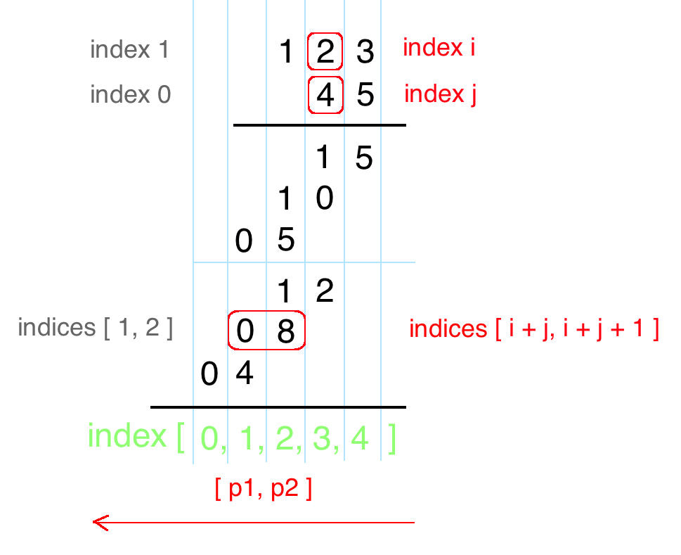
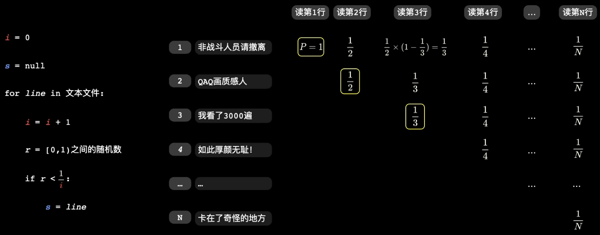
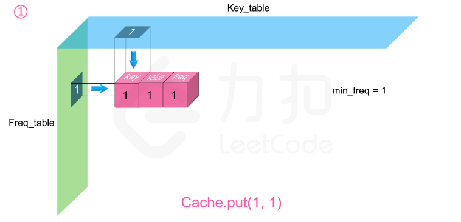
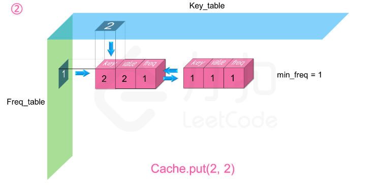
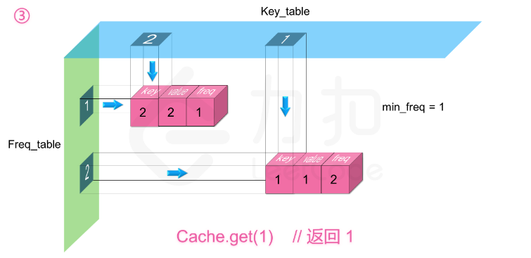
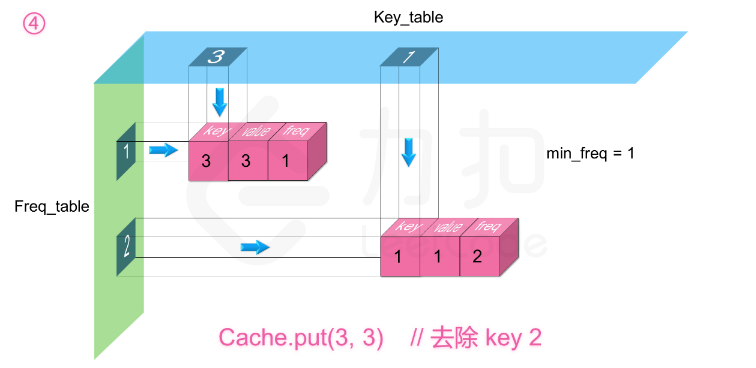
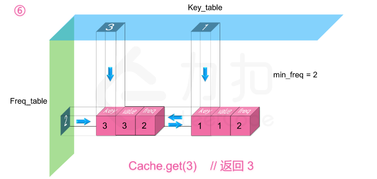
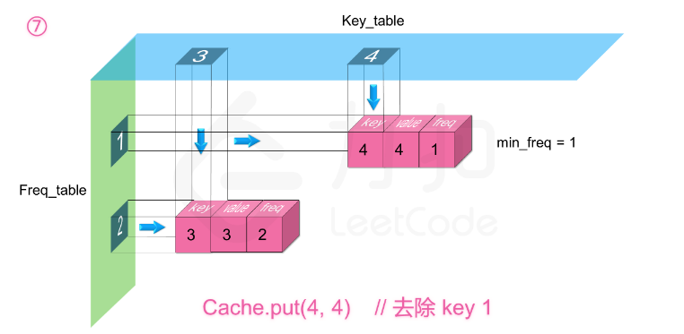
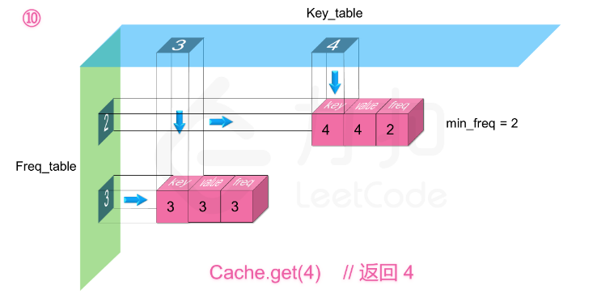

# 数论


https://blog.csdn.net/qq_44013342/article/details/88023526#t9


## 定理

| 定理                                             |                             解释                             |
| ------------------------------------------------ | :----------------------------------------------------------: |
| 同余定理                                         | 给定一个正整数m，如果两个整数a和b满足a-b能够被m整除，即(a-b)/m得到一个整数，那么就称整数a与b对模m同余，记作a≡b(mod m)。对模m同余是整数的一个等价关系。 |
| 尾随零                                           |           2 和 5 的个数的最小值，就是尾随零的个数            |
| 排列问题，顺序无关，元素相同，顺序不同，相同排列 | 求和公式 $C^0_{n}+C^1_{n}+C^2_{n}+...+C^{n-2}_{n}+C^{n-1}_{n} +C^{n}_{n}= 2^{n}$<br>$C_n^0 = 1,C_n^1 = n,C_n^m = \frac{n!}{m! \times (n-m)!}$ |
| 组合问题，顺序相关，元素相同，顺序不同，不同排列 |            $A_n^m = \frac{n!}{(n-m)!}$<br>$0!=1$             |
|                                                  |                                                              |
| 等比数列                                         | 通项公式 $a_n = a_1 \times q^{n-1}$ 或 $a_n = a_m \times q^{n-m}$<br>求和公式 $S_n = \frac{a_1(1-q^n)}{1-q},(q\ne1)$ |
| 等差数列                                         | 通项公式 $a_n = a_1 + (n-1)d$<br/>求和公式 $S_n = a_1n + \frac{nd(n-1)}{2}$ 或 $S_n = \frac{n(a_1+a_n)}{2}$ |
| 拐点                                             |                  碰到拐点就是选取不同的方向                  |
|                                                  |                                                              |


交换两个数字

```c++
// in-place swap
// 异或 任何数与自己异或为0 与0异或为自己
a = a ^ b; 
b = a ^ b; // b = a^b^b = a^0 = a
a = a ^ b; 

// 加和
a = a + b;
b = a - b;
a = a - b;
```


---


## 1523. 在区间范围内统计奇数数目

把尾部奇数+1变成偶数

把头部奇数-1变成偶数

cnt = (end - start) / 2

```c++
int countOdds(int low, int high) {
    if (high & 1) high++;
    if (low & 1) low--;
    return (high - low) / 2;
}
```


---

## 提取数字每位

```c++
// 5967
int num[4];
for (int i = 3; i >= 0; i--) {
    int left = nowNum % 10;
    num[i] = left;			
    nowNum /= 10;
}

int s[4];
s[0] = (nowNum % 10000) / 1000;
s[1] = (nowNum % 1000) / 100; 
s[2] = (nowNum % 100) / 10;
s[3] = (nowNum % 10) / 1;
```


## 最大公约数/最小公倍数

---

### 1979. 最大公约数

欧几里得算法，即辗转相除法
$$
gcd(a,b)=gcd(b,a \operatorname{mod} b).
$$


```c++
int gcd(int a, int b) {
    if (b == 0) return a;
    return gcd(b, a % b);
}

int findGCD(vector<int>& nums) {
    int maxn = *max_element(nums.begin(), nums.end());
    int minn = *min_element(nums.begin(), nums.end());

    return gcd(maxn, minn);
}
```

时间复杂度：$O(n + \log M)$，其中 n 为 nums 的长度，M 为 nums 的最大值。遍历数组寻找最大值与最小值的时间复杂度为 $O(n)$，计算最大公约数的时间复杂度为 $O(\log M)$。

空间复杂度：O(1)。


---

### 最小公倍数

```c++
int lcm(int a, int b) {
    int g = gcd(a, b);
    return a * b / g;
}
```


---

### HDU 2503 通分化简

有a，b，c，d四个整数，求a/b+c/d的最简分数

```c++
int gcd(int a, int b) {
    if (b == 0) return a;
    return gcd(b, a % b);
}

void solve() {
    int a, b, c, d;
    cin >> a >> b >> c >> d;

    int up, down;

    up = a * d + b * c;
    down = b * d;

    int t = gcd(up, down);
    up      /= t;
    down    /= t;

    cout << up << " " << down << endl; 
    return;
}


int main () {
    int n;
    cin >> n;
    while (n--) {
        solve();
    }

    return 0;
}
```


----

### 6076. 表示一个折线图的最少线段数

最简通分形式进行比较

```c++
void simple(int i, int &x, int &y, vector<vector<int>>& stockPrices) {
    x = stockPrices[i][0] - stockPrices[i-1][0];
    y = stockPrices[i][1] - stockPrices[i-1][1];
    int t = __gcd(x, y);
    x /= t;
    y /= t;
}

int minimumLines(vector<vector<int>>& stockPrices) {
    if (stockPrices.size() == 1) return 0;
    sort(stockPrices.begin(), stockPrices.end());


    int x1, y1, x2, y2, ans = 1;
    simple(1, x1, y1, stockPrices);
    for (int i = 2; i < stockPrices.size(); i++) {
        simple(i, x2, y2, stockPrices);
        if (x1 != x2 || y1 != y2) {
            ans++;
        }
        x1 = x2, y1 = y2;
    }

    return ans;
}
```


---

## 快速幂、快速乘、矩阵快速幂

①便于取模操作（避免溢出） ②时间复杂度较低


### 快速幂

顾名思义，就是快速算某个数的多少次幂。

快速幂是用于解决类似 $a^b \mod p$ 值类型问题。使用普通方法是从 1 循环至 b，逐次累乘，逐次取模，b大的时候会超时。所以需要使用快速幂。

有下式
$$
if \quad b\mod 2 = 1,\quad a^b = a^{\frac{b}{2}} \times a^{\frac{b}{2}} \times a\\
if \quad b\mod 2 = 0,\quad a^b = a^{\frac{b}{2}} \times a^{\frac{b}{2}}
$$
通过分治，将一个大问题变成两个小问题，再逐项计算，并取模，边界条件是
$$
a^0 = 1, a^1=a
$$
例如
$$
\begin{equation}
 3^{7}=3^{3} \times 3^{3} \times 3=\left(3^{1} \times 3^{1} \times 3\right) \times\left(3^{1} \times 3^{1} \times 3\right) \times 3 
\end{equation}
$$
时间复杂度为 $O(\log b)$

```c++
double quickPow(double x, long long N) {
    if (N == 0) return 1.0;
    if (N == 1) return x;
    
    double res = quickPow(x, N / 2);
    
    // 核心为下边两个式子
    if (b%2) return res * res * x; //这里的相乘 也可以用 quickMul 快速乘
    return res * res;
}
```


----

### 快速乘

快速乘常与快速幂结合在一起。当模数 p 过大时，乘起来可能会超过 long long 的范围。所以要借助快速幂的思想再中间优化一下乘法。

注意到乘法 $ a \times b $ 可以转化为 $ \underbrace{a+a+\ldots+a}_{b} $ ，所以也能够通过分治方法将其转化。

例如
$$
\begin{equation}
 3 \times 7=3 \times 3+3 \times 3+3=(3 \times 1+3 \times 1+3)+(3 \times 1+3 \times 1+3)+3 
\end{equation}
$$
复杂度依然为 $O(\log b)$

```c++
double quickMul(double x, long long N) {
    if (N == 0) return 1.0;
    if (N == 1) return x;
    
    double res = quickMul(x, N / 2);
    
    // 核心为下边两个式子 基本一模一样，乘号换加号
    if (b%2) return res + res + x;
    return res + res;
}
```


----

### 矩阵快速幂

用于求一个某一个函数值是需要从前若干项函数值线性递推过来的函数（一次多阶递推式）某一项值。

即求函数 $f(n)=a_1f(n−1)+a_2f(n−2)+...+a_mf(n−m)$ 的 $f(n)$ 的值。普通方法时间复杂度 $O(NM)$ 。N 比较大的时候会超时，用矩阵来处理。

简单的 斐波那契数列，可以得到
$$
\begin{equation}
 \left[\begin{array}{c}f(n) \\ f(n-1)\end{array}\right]=\left[\begin{array}{ll}1 & 1 \\ 1 & 0\end{array}\right] \cdot\left[\begin{array}{c}f(n-1) \\ f(n-2)\end{array}\right] 
\end{equation}
$$
一直递推下去，就能得到一个矩阵公式：
$$
\begin{equation}
 \left[\begin{array}{c}f(n+1) \\ f(n)\end{array}\right]=\left[\begin{array}{ll}1 & 1 \\ 1 & 0\end{array}\right]^{n} \cdot\left[\begin{array}{c}f(2) \\ f(1)\end{array}\right] 
\end{equation}
$$
再回到一般情况，我们要从
$$
\begin{equation}
 \left[\begin{array}{c}f(n) \\ f(n-1) \\ \vdots \\ f(n-m)\end{array}\right]  推出  \left[\begin{array}{c}f(n+1) \\ f(n) \\ \vdots \\ f(n-m+1)\end{array}\right] 
\end{equation}
$$
其中，$f(n)，f(n−1)...f(n−m+1)$ 在原矩阵中均有出现，所以，通过构造 0 和 1 我们就可以推出。我们现在只需要算出 $ f(n)=a_1f(n−1)+a_2f(n−2)+...+a_mf(n−m)$ 。即构造矩阵的第一行为 $[a_1,a_2,...,a_m]$。以下所有行分别只含 0 和 1，即第 $i+1$ 行在第 
$i$ 列的值为 1，其他所有值全为 0.

其中，矩阵可以进行快速幂，这样就可以通过快速幂的 $O(\log n)$ 时间复杂度解决一次多阶递推式。


---

二进制的快速幂和快速乘

原理：每一个正整数都可以唯一表示为若干个指数不重复的 2 的次幂的和

```c++
// base * power
ll qMul(ll base, ll multi, ll p) {
    ll res = 0;
    //base %= p; multi %= p;
    while (multi) {
        if (multi & 1) res = (res + base) % p;
        base = (base + base) % p;
        multi >>= 1;
    }
    return res;
}

// base ^ power
ll qPow(ll base, ll power, ll p) {
    ll res = 1;
    while (power) {
        if (power & 1) res = qMul(res, base, p); //可以在qMul里取模，这里不用取
        base = qMul(base, base, p);
        power >>= 1;
    }
    return res;
}
```


```c++
// a ^ b
ll q_power(ll a, ll b) {
	ll res = 1;
	while (b) {
		if (b & 1) ret = ret * a;  //这里的相乘 也可以用 q_mul 快速乘
		a = a * a;
		b >>= 1;
	}
	return res;
} 

// a * b
ll q_mul(ll a, ll b) {
	ll res = 0;
	while (b) {
		if (b & 1) res = res + a;
		a = a + a;
		b >>= 1;
	}
	return res;
}

ll q_mul(ll a, ll b, ll mod) {
	ll res = 0;
    a %= mod; b %= mod;
	while (b) {
		if (b & 1) res = (res + a) % mod;
		a = (a + a) % mod;
		b >>= 1;
	}
	return res;
}
```


> https://www.bilibili.com/read/cv12041792/
>
> https://www.cnblogs.com/fusiwei/p/11599881.html
>
> https://www.cnblogs.com/Miracevin/p/9734292.html


-----

### 50. Pow(x, n)

**快速幂**本质是分治，当 n 为负数时，可以计算正数，再取倒数。


如果我们要计算 $x^{64}$，我们可以按照：
$$
x→x^2
 →x^4
 →x^8
 →x^{16}
 →x^{32}
 →x^{64}
$$
的顺序，从 x 开始，每次直接把上一次的结果进行平方，计算 6 次就可以得到 $x^{64}$ 的值，而不需要对 x 乘 63 次 x。


如果我们要计算 $x^{77}$ ，我们可以按照：

$$
x \to x^2 \to x^4 \to x^9 \to x^{19} \to x^{38} \to x^{77}
$$
的顺序，在 $x \to x^2，x^2 \to x^4，x^{19} \to x^{38}$ 这些步骤中，我们直接把上一次的结果进行平方，而在 $x^4 \to x^9，x^9 \to x^{19}，x^{38} \to x^{77}$，这些步骤中，我们把上一次的结果进行平方后，还要额外乘一个 x。

直接从左到右进行推导看上去很困难，因为在每一步中，我们不知道在将上一次的结果平方之后，还需不需要额外乘 x。但如果我们从右往左看，分治的思想就十分明显了：

- 当我们要计算 $x^n$  时，我们可以先递归地计算出 $y = x^{\lfloor n/2 \rfloor}$，其中 $\lfloor a \rfloor$ 表示对 a 进行下取整；

- 根据递归计算的结果，如果 $n$ 为偶数，那么 $x^n = y^2$ ；如果 n 为奇数，那么 $x^n = y^2 \times x$；

- 递归的边界为 $n = 0$，任意数的 0 次方均为 1。

由于每次递归都会使得指数减少一半，因此递归的层数为 $O(\log n)$，算法可以在很快的时间内得到结果。

```c++
double quickMul(double x, long long N) {
    if (N == 0) {
        return 1.0;
    }
    double y = quickMul(x, N / 2);
    return N % 2 == 0 ? y * y : y * y * x;
}

double myPow(double x, int n) {
    long long N = n;
    return N >= 0 ? quickMul(x, N) : 1.0 / quickMul(x, N);
}
```


时间复杂度：$O(\log n)$，即为递归的层数。

空间复杂度：$O(\log n)$，即为递归的层数。这是由于递归的函数调用会使用栈空间。


由于递归需要使用额外的栈空间，我们试着将递归转写为迭代。在方法一中，我们也提到过，从左到右进行推导是不容易的，因为我们不知道是否需要额外乘 x。但我们不妨找一找规律，看看哪些地方额外乘了 x，并且它们对答案产生了什么影响。


我们还是以 $x^{77}$  作为例子：
$$
x \to x^2 \to x^4 \to^+ x^9 \to^+ x^{19} \to x^{38} \to^+ x^{77}
$$

并且把需要额外乘 x 的步骤打上了 + 标记。可以发现：

$x^{38} \to^+ x^{77}$ 中额外乘的 x 在 $x^{77}$ 中贡献了 $x$；

$x^9 \to^+ x^{19}$  中额外乘的 x 在之后被平方了 2 次，因此在 $x^{77}$ 中贡献了 $x^{2^2} = x^4$ ；

$x^4 \to^+ x^9$ 中额外乘的 x 在之后被平方了 3 次，因此在 $x^{77}$ 中贡献了 $x^{2^3} = x^8$ ；

最初的 x 在之后被平方了 6 次，因此在 $x^{77}$ 中贡献了 $x^{2^6} = x^{64}$ 。


我们把这些贡献相乘，$x \times x^4 \times x^8 \times x^{64}$,  恰好等于 $x^{77}$ 。而这些贡献的指数部分又是什么呢？它们都是 2 的幂次，这是因为每个额外乘的 xx 在之后都会被平方若干次。而这些指数 1，4，8 和 64，恰好就对应了 77 的二进制表示 $(1001101)_2$ 中的每个 11！

因此我们借助整数的二进制拆分，就可以得到迭代计算的方法，一般地，如果整数 nn 的二进制拆分为

$$
n = 2^{i_0} + 2^{i_1} + \cdots + 2^{i_k}
$$

那么

$$
x^n = x^{2^{i_0}} \times x^{2^{i_1}} \times \cdots \times x^{2^{i_k}}
$$
这样以来，我们从 x 开始不断地进行平方，得到 $x^2, x^4, x^8, x^{16}, \cdots$ ，如果 n 的第 k 个（从右往左，从 0 开始计数）二进制位为 1，那么我们就将对应的贡献 $x^{2^k}$ 计入答案。

```c++
double quickMul(double x, long long N) {
    double ans = 1.0;
    // 贡献的初始值为 x
    double x_contribute = x;
    // 在对 N 进行二进制拆分的同时计算答案
    while (N > 0) {
        if (N % 2 == 1) {
            // 如果 N 二进制表示的最低位为 1，那么需要计入贡献
            ans *= x_contribute;
        }
        // 将贡献不断地平方
        x_contribute *= x_contribute;
        // 舍弃 N 二进制表示的最低位，这样我们每次只要判断最低位即可
        N /= 2;
    }
    return ans;
}

double myPow(double x, int n) {
    long long N = n;
    return N >= 0 ? quickMul(x, N) : 1.0 / quickMul(x, -N);
}
```


- 时间复杂度：$O(\log n)$，即为对 n 进行二进制拆分的时间复杂度。
- 空间复杂度：$O(1)$。


---

## 43. 字符串相乘

该算法是通过两数相乘时，乘数某位与被乘数某位相乘，与产生结果的位置的规律来完成。具体规律如下：

- 乘数 num1 位数为 M，被乘数 num2 位数为 N， `num1 x num2` 结果 res 最大总位数为 `M+N`
- `num1[i] x num2[j]` 的结果为 tmp(位数为两位，"0x","xy"的形式)，其第一位位于 `res[i+j]`，第二位位于 `res[i+j+1]`。




```c++
class Solution {
    public String multiply(String num1, String num2) {
        if (num1.equals("0") || num2.equals("0")) {
            return "0";
        }
        int[] res = new int[num1.length() + num2.length()];
        for (int i = num1.length() - 1; i >= 0; i--) {
            int n1 = num1.charAt(i) - '0';
            for (int j = num2.length() - 1; j >= 0; j--) {
                int n2 = num2.charAt(j) - '0';
                int sum = (res[i + j + 1] + n1 * n2);
                res[i + j + 1] = sum % 10;
                res[i + j] += sum / 10;
            }
        }

        StringBuilder result = new StringBuilder();
        for (int i = 0; i < res.length; i++) {
            if (i == 0 && res[i] == 0) continue;
            result.append(res[i]);
        }
        return result.toString();
    }
}
```


```c++
string multiply(string num1, string num2) {
    //每一位相乘结果在res[i+1] res[i+j+1]这两位里 累加即可
    if(num1 == "0" || num2 == "0"){return "0";}
    int size1 = num1.length(), size2 = num2.length();
    vector<int> memo(size1+size2, 0);
    string res = "";
    for(int i = size1-1; i>=0; i--){
        int n1 = num1[i]-'0';
        for(int j = size2-1; j>=0; j--){
            int n2 = num2[j]-'0';
            int tempSum = memo[i+j+1]+n1*n2;
            memo[i+j+1] = tempSum % 10;
            memo[i+j] += tempSum / 10;
        }
    }
    bool flag = true;
    for(int i = 0; i<memo.size(); i++){
        if(memo[i] != 0 || !flag){
            flag = false;
            res.push_back(memo[i]+'0');
        }
    }
    return res;
}
```


---

## 62.不同路径

一共m,n的话,无论怎么走,走到终点都需要 (m - 1) + (n - 1) 步。

其中一定有 m - 1 步是要向下走的，但不用管什么时候向下走。

那么有几种走法呢？ 可以转化为，给你 m + n - 2 个不同的数，随便取 m - 1 个数，有几种取法。

**组合问题**
$$
C_{m+n-2}^{m-1}
$$


求组合的时候,要防止两个int相乘溢出！所以不能把算式的分子都算出来,分母都算出来再做除法。

```c++
int main(int m, int n) {
    int numberator = 1, denominator = 1;
    int count = m - 1;
    int t = m + n - 2;
    
    while (count--)
        numberator *= (t--);
    
    for (int i = 1; i <= m-1; ++i)
        denominator *= i;
    
    return numberator / denominator;
}
```

需要在计算分子的时候,不断除以分母,代码如下:

```c++
int main(int m, int n) {
    int numberator = 1, denominator = 1;
    int count = m - 1;
    int t = m + n - 2;
    
    while (count--) {
        numberator *= (t--);
    
        while (denominator != 0 && numerator % denominator == 0) {
            numberator /= denominator;
            denominator--;
        }
    }       
    
    return numberator;
}
```

时间复杂度:O(m)
空间复杂度:O(1)


---

## 48. 旋转图像

用翻转代替旋转

我们还可以另辟蹊径，用翻转操作代替旋转操作。我们还是以题目中的示例二

$$
\begin{bmatrix} 5 & 1 & 9 & 11 \\ 2 & 4 & 8 & 10 \\ 13 & 3 & 6 & 7 \\ 15 & 14 & 12 & 16 \end{bmatrix}
$$


作为例子，先将其通过水平轴翻转得到：

$$
\begin{bmatrix} 5 & 1 & 9 & 11 \\ 2 & 4 & 8 & 10 \\ 13 & 3 & 6 & 7 \\ 15 & 14 & 12 & 16 \end{bmatrix} \xRightarrow[]{水平翻转} \begin{bmatrix} 15 & 14 & 12 & 16 \\ 13 & 3 & 6 & 7 \\ 2 & 4 & 8 & 10 \\ 5 & 1 & 9 & 11 \end{bmatrix}
$$
再根据主对角线翻转得到：
$$
\begin{bmatrix} 15 & 14 & 12 & 16 \\ 13 & 3 & 6 & 7 \\ 2 & 4 & 8 & 10 \\ 5 & 1 & 9 & 11 \end{bmatrix} \xRightarrow[]{主对角线翻转} \begin{bmatrix} 15 & 13 & 2 & 5 \\ 14 & 3 & 4 & 1 \\ 12 & 6 & 8 & 9 \\ 16 & 7 & 10 & 11 \end{bmatrix}
$$
就得到了答案。这是为什么呢？对于水平轴翻转而言，我们只需要枚举矩阵上半部分的元素，和下半部分的元素进行交换，即

$$
\textit{matrix}[\textit{row}][\textit{col}] \xRightarrow[]{水平轴翻转}\textit{matrix}[n - \textit{row} - 1][\textit{col}]
$$
对于主对角线翻转而言，我们只需要枚举对角线左侧的元素，和右侧的元素进行交换，即

$$
\textit{matrix}[\textit{row}][\textit{col}] \xRightarrow[]{主对角线翻转} \textit{matrix}[\textit{col}][\textit{row}]
$$


将它们联立即可得到：

$$
\begin{aligned} \textit{matrix}[\textit{row}][\textit{col}] & \xRightarrow[]{水平轴翻转} \textit{matrix}[n - \textit{row} - 1][\textit{col}] \\ &\xRightarrow[]{主对角线翻转} \textit{matrix}[\textit{col}][n - \textit{row} - 1] \end{aligned}
$$


```c++
void rotate(vector<vector<int>>& matrix) {
    int row = matrix.size();

    for (int i = 0; i < row / 2; ++i) {
        for (int j = 0; j < row; ++j) {
            swap(matrix[i][j], matrix[row - i - 1][j]);
        }
    }

    for (int i = 0; i < row; ++i) {
        for (int j = i + 1; j < row; ++j) {
            swap(matrix[i][j], matrix[j][i]);
        }
    }
}
```


---

## 223. 矩形面积

两个单独的矩阵面积 - 重复的面积，注意要判断重复部分的高，负值表示不重叠。

```c++
int computeArea(int ax1, int ay1, int ax2, int ay2, int bx1, int by1, int bx2, int by2) {
    int s1 = (ax2 - ax1) * (ay2 - ay1);
    int s2 = (bx2 - bx1) * (by2 - by1);

    int overlapWidth = min(ax2, bx2) - max(ax1, bx1), overlapHeight = min(ay2, by2) - max(ay1, by1);

    int coverArea = max(overlapWidth, 0) * max(overlapHeight, 0);


    return s1 + s2 - coverArea;
}
```


---

## 311. 稀疏矩阵的乘法

暴力

```c++
vector<vector<int>> multiply(vector<vector<int>>& mat1, vector<vector<int>>& mat2) {
    vector<vector<int>> res(mat1.size(), vector<int>(mat2[0].size(), 0));

    for (int i = 0; i < mat1.size(); ++i) {
        for (int j = 0; j < mat2[0].size(); ++j) {
            for (int k = 0; k < mat1[0].size(); ++k) {
                res[i][j] += mat1[i][k] * mat2[k][j];
            }
        }
    }
    return res;
}
```


三元组

```c++
struct ijv {
    int i;
    int j;
    int val;
};


vector<vector<int>> multiply(vector<vector<int>>& mat1, vector<vector<int>>& mat2) {
    vector<vector<int>> res(mat1.size(), vector<int>(mat2[0].size(), 0));

    vector<ijv> m1, m2;

	/*收集非零元素到m1，m2*/
    for (int i = 0; i < mat1.size(); ++i) {
        for (int j = 0; j < mat1[0].size(); ++j) {
            if (mat1[i][j] != 0) {
                m1.push_back({i, j, mat1[i][j]});
            }
        }
    }

    for (int i = 0; i < mat2.size(); ++i) {
        for (int j = 0; j < mat2[0].size(); ++j) {
            if (mat2[i][j] != 0) {
                m2.push_back({i, j, mat2[i][j]});
            }
        }
    }
	
    /*计算*/
    for (auto v1 : m1) {
        for (auto v2 : m2) {
            if (v1.j != v2.i) continue;	// a的列 = b的行

            res[v1.i][v2.j] += v1.val * v2.val;
        }
    }

    return res;
}
```


---

## 子串、非空子串、真子串、非空真子串、求数公式

|          子串           |  （无重复）非空子串   |        真子串         |       非空真子串        |
| :---------------------: | :-------------------: | :-------------------: | :---------------------: |
| $\frac {(1+n)*n}{2}+1 $ | $\frac {(1+n)*n}{2} $ | $\frac {(1+n)*n}{2} $ | $\frac {(1+n)*n}{2}-1 $ |

- 串 S = “database" 的非空子串数目（34）

无重复：8*9/2=36

有重复的，减去重复项：对于第一个a来说，第二个、第三个a是重复的，也就是有两个重复项；36 - 2 = 34


- 串 S = "www.88.com"的非空子串数目为：50。

无重复：10*11/2=55

有重复的，减去重复项：对于第一个 w 来说 55 - 2 = 53

对于第一个 8 来说 53 - 1 = 52

对于第一个. 来说 52 - 1 = 51

对于第一个 ww 来说 51 - 1 = 50


- 串 "ababaaabb" 的真子串个数：9*10/2 = 45


## 互质/分解质因数/容斥原理

- 求100以内和100互素（互质）的正整数个数.

$100= 2^2*5^2$
2k: 有50个
5k:有20个
10k:有10个
所以互质数的数有:
100-(50+20-10)
=100-60
=40(个)

- 求1-2999 内和 3000 互素（互质）的个数 800个

$3000 = 2^3*3^1*5^3$

2: 有 1499 个

3: 有 999 个

5: 有 599 个

6: 有 499 个 6=2*3

10: 有 299 个 10=2*5

15: 有 199 个 15=3*5

30: 有 99 个 30=2\*3\*5

所以互质数的数有:
2999-(1499+999+599-499-299-199+99)
=2999 - 3196 + 997
=800(个)


所以互质数的数有:
2999-2999/2-2999/3+2999/6 -2999/5 + 2999/10 + 2999/15 - 2999/30
=2999 - 1499 - 999 + 499 - 599 + 299 + 199 - 99
=          1500 > 501 > 1000 > 401> 700 > 899 > 80


- 求a~b之间与n互素的个数

求出 1~b 之间与n互素的个数减去 1~a-1之间与n互素的的个数即为所求。


```c++
ll fac[N], m;

//对n分解质因数，质因数个数为m
void div(ll x) {
	m = 0;
	int q = sqrt(x);
	for (int i = 2; i <= q; i++)
		if (x % i == 0) {
			fac[++m] = i;
			while (x % i == 0) x /= i;
		}

	if (x > 1) fac[++m] = x;
}

//应用容斥原理求出1~b之间含有n的质因子的数的个数，也即与n不互素的数的个数
ll co_prime(ll n) {
	ll ans = 0;
	for (ll i = 0; i < 1ll << m; i++)//i == 0的时候，t = 1， ans = n，也即是b可以含有任何质因子
	{
		int k = 0;
		ll t = 1;
		for (int j = 0; j < m; j++)
			if (i & 1ll << j) t *= fac[j + 1], k++;
		if (k & 1) ans -= n / t;
		else ans += n / t;
	}

	return ans;
}
```


---

## 水塘/蓄水池采样

蓄水池抽样是一系列的随机算法，其目的在于从包含 n 个项目的集合 S 中选取 k 个样本，其中 n 为一很大或未知的数量，尤其适用于不能把所有 n 个项目都存放到内存的情况。


> 如何从一个未知行数的文本文件中随机选择一行？
>
> 隐藏含义：
>
> 1.只能顺序读取每一行
>
> 2.不能将整个文件加载到内存





其中 

$r = (0, 1)$ 之间的随机数

if $r < \frac{1}{i}$

转换代码为 `rand(0, 1) < 1/i `，本质也等同于 `rand() % i == 0`


选不选 i 与 i 之前无关，与 i 后面 i+1 到 n 所影响。因为 i+1到 n 都不被选才会选 i。


---

### 382. 链表随机节点

从链表头开始，遍历整个链表，对遍历到的第 i 个节点，随机选择区间 $[0, i)$ 内的一个整数，如果其等于 0，则将答案置为该节点值，否则答案不变。

该算法会保证每个节点的值成为最后被返回的值的概率均为 $\frac{1}{n}$，证明如下：
$$
\begin{equation}


\begin{aligned}
& P( 第  i  个节点的值成为最后被返回的值)
 \\=& P(  第  i  次随机选择的值  =0) \times
 	\\ &  P(  第  i+1  次随机选择的值  \neq 0) \times 	  \\ & \cdots \times P(  第  n  次随机选择的值  \neq 0)
 \\=& \frac{1}{i} \times\left(1-\frac{1}{i+1}\right) \times \cdots \times\left(1-\frac{1}{n}\right) 
 \\=& \frac{1}{i} \times \frac{i}{i+1} \times \cdots \times \frac{n-1}{n}  
 \\=& \frac{1}{n} 
\end{aligned}
\end{equation}
$$

```c++
class Solution {
private:
    ListNode* mHead;

public:
    Solution(ListNode* head) {
        this->mHead = head;
    }
    
    int getRandom() {
        int i = 1, ans = 0;
        for (auto node = this->mHead; node != nullptr; node = node->next) {
            if (rand() % i == 0) {   // 1/i 的概率选中（替换为答案）   等同于 rand(0, 1) < 1/i 
                ans = node->val;
            }
            ++i;
        }
        return ans;
    }   
};
```


- 时间复杂度：初始化为 $O(1)$，随机选择为 $O(n)$，其中 $n$ 是链表的元素个数。

- 空间复杂度：$O(1)$。我们只需要常数的空间保存若干变量。


---

### 398. 随机数索引

如果数组以文件形式存储（读者可佳摄构造函数传入的是个文件路径），且文件大小远超内存大小，我们是无法通过读文件的方式，将所有下标保存在内存中。

我们可以设计：

遍历 nums，当我们第 i 次遇到值为 target 的元素时，随机选择区间 $[0,i)$ 内的一个整数，如果其等于 0，则将返回值置为该元素的下标，否则返回值不变。

设 nums 中有 n 个值为 target 的元素，该算法会保证这 k 个元素的下标成为最终返回值的概率均为 $\frac{1}{n}$，证明如下：
$$
\begin{equation}


\begin{aligned}
& P( 第  i  个节点的值成为最后被返回的值)
 \\=& P(  第  i  次随机选择的值  =0) \times
 	\\ &  P(  第  i+1  次随机选择的值  \neq 0) \times 	  \\ & \cdots \times P(  第  n  次随机选择的值  \neq 0)
 \\=& \frac{1}{i} \times\left(1-\frac{1}{i+1}\right) \times \cdots \times\left(1-\frac{1}{n}\right) 
 \\=& \frac{1}{i} \times \frac{i}{i+1} \times \cdots \times \frac{n-1}{n}  
 \\=& \frac{1}{n} 
\end{aligned}
\end{equation}
$$


```c++
class Solution {
private:
    vector<int> mNums;

public:
    Solution(vector<int>& nums) : mNums(nums) {

    }
    
    int pick(int target) {
        int ans = 0, cnt = 0;
        for (int i = 0; i < mNums.size(); ++i) {
            if (mNums[i] == target) {
                cnt++;          // 第cnt次见到target
                if (rand() % cnt == 0) {
                    ans = i;
                }
            }
        }

        return ans;
    }
};
```


- 时间复杂度：初始化为 $O(1)$，$\text{pick}$ 为 $O(n)$，其中 $n$ 是 $\textit{nums}$ 的长度。

- 空间复杂度：$O(1)$。我们只需要常数的空间保存若干变量。


优化后只保存迭代器指针，不需要重复拷贝数组

```c++
class Solution {
private:
    vector<int>::iterator mBegin;
    vector<int>::iterator mEnd;

public:
    Solution(vector<int>& nums) {
        mBegin = nums.begin();
        mEnd = nums.end();
    }
    
    int pick(int target) {
        int cnt = 0;
        int index = -1;
        for (auto iter = mBegin; iter != mEnd; iter++) {
            if (*iter == target) {
                cnt++;
                if (rand() % cnt == 0) {	// 1/i prob
                    index = iter - mBegin; 
                }
            }
        }

        return index;
    }

};
```


---

### 710. 黑名单中的随机数

考察一个特殊的例子：所有黑名单数全部在区间 [n-m,n) 范围内。此时我们可以直接在 [0,n-m) 范围内取随机整数。

这给我们一个启示，对于在 [0,n-m) 范围内的黑名单数，我们可以将其映射到 [n-m,n) 范围内的非黑名单数（白名单数）上。每次 pick() 时，仍然可以在 [0,n−m) 范围内取随机整数（设其为 x），那么：

如果 x 不在黑名单中，则直接返回 x；
如果 x 在黑名单中，则返回 x 映射到 [n-m,n) 范围内的白名单数。

我们可以在初始化时，构建一个从 [0,n-m) 范围内的黑名单数到 [n-m,n) 的白名单数的映射：

将 [n-m,n) 范围内的黑名单数存入一个哈希集合 black；
初始化白名单数 w=n−m；
对于每个 [0,n-m) 范围内的黑名单数 b，首先不断增加 w 直至其不在黑名单中，然后将 b 映射到 w 上，并将 w 增加一。

```c++
class Solution {
private:
    unordered_map<int, int> mB2W;
    int mBound;

public:
    Solution(int n, vector<int>& blacklist) {
        unordered_set<int> set;
        mBound = n - blacklist.size();
        
        /*把后半部分的黑名单加进去*/
        for (auto &n : blacklist) {
            if (n >= mBound) {
                set.insert(n);
            }   
        }

        /*把前半部分的黑名单加进去，并且记录与后半部分白名单的一一映射*/
        int idx = mBound;
        for (auto &n : blacklist) {
            if (n < mBound) {
                while (set.count(idx)) {
                    idx++;
                }
                mB2W[n] = idx++;
            }
        }


    }
    
    int pick() {
        int r = rand() % mBound;    //取前半部分的数字 
        
        // 如果这个数在mB2W里，说明它在黑名单，找到跟它映射的白名单的数字

        return mB2W.count(r) ? mB2W[r] : r;
    }
};
```


---

# CS

## 1. 字典序

**字典序（dictionary order）**，又称 **字母序（alphabetical order）**

原意是表示英文单词在字典中的先后顺序，在计算机领域中扩展成两个任意**字符串**的**大小**关系。


英文中的 **字母表（Alphabet）** 按照如下的顺序排列：

ABCDEFG HIJKLMN OPQRST UVWXYZ

abcdefg hijklmn opqrst uvwxyz


大小关系取决于两个字符串**从左到右第一个不同字符的 ASCII 值的大小**关系


都提供了比较两个字符串大小的方法，比较的实际上就是两个字符串的字典序。例如在 C++  中：

```c++
cout << ("ah1x" < "ahb") << endl; //true
```


**字典序算法**


---

## 2. int类型在内存中的存储方式

int类型表示带有符号的整型，而unsigned int类型为无符号的整型。

|   类型名称   | 占字节数 |       取值范围        |
| :----------: | :------: | :-------------------: |
|     int      |    4B    | $-2^{31}\sim2^{31}-1$ |
| unsigned int |    4B    |   $0 \sim 2^{32}-1$   |


**1、占用的比特位数量**

在32位操作系统下，两者都是占用4个字节，每个字节有8个比特位，因此有32个0-1的二进制位数。两者的不同在于，int类型有正负号（±）的存在，需要比unsigned int类型多消耗一个位数。


**2、符号的表示方法**

在所有被int类型占用的比特位中，**左起第一个位**（即**最高位**）就是**符号位**。int类型的符号位上，**0表示正数**，**1表示负数**。在32位操作系统下，其余**后面31位是数值位**。


**3、数字0的表示方法**

按照上面提到的符号，我们有了两种0的表示方法，即 “+0” 和 “-0”。

实际上，在32位系统下int类型中，我们计算机已经强行规定了这种情况，数字0采用 “+0” 的表示方法，即0000000000000000 00000000；而 “**-0**” 这个特殊的数字被定义为了$-2^{31}$。

因此我们看到32位系统下int类型的取值范围中，负数部分比正数部分多了一个数字，正数的最大取值是 $2^{31}-1$，而负数的最小取值是 $-2^{31}$。**正数部分之所以要减去 1，是因为被数字 0 占用了 “+0”**，而负数部分不需要用来表示 0，因此原本的 “-0” 就用来表示 $-2^{31}$ 这个数字。


按照上面的理解方式，int类型的数字“-1”，在内存中32个比特位上应该是这样子的：10000000 00000000 00000001，左边第一个1表示负号，后面31位表示数值部分“1”。实际情况并不是这样。这里就需要引入“补码”这个概念了。


---

### 原码（true form）

原码，是计算机中一种对数字的二进制定点表示方法。原码表示法在数值前面前面有一位符号位（即最高位为符号位），正数该位为0，负数该位为1（0有两种表示：+0和-0），其余位表示数值的大小。

int类型数值“-1”的32位二进制就是原码，即10000000 00000000 00000001。与之对应的，正数“+1”就是00000000 00000000 00000001。

那么**为何不用原码在内存中表示数值呢**？举个例子（以8位二进制表示）

|     十进制     |   原码    |
| :------------: | :-------: |
|       1        | 0000 0001 |
|       -1       | 1000 0001 |
|  结果（原码）  | 1000 0010 |
| 结果（十进制） |    -2     |

上述结果换算成十进制为-2，这显然出错了。这是由于计算机在计算时以加法进行计算的算法更简便，**减法先转换为负数**，**再进行加法运算**。因此，**原码的符号位不能直接参与运算**。

总结：原码是有符号数的**最简单的编码方式**，便于输入输出，但作为代码加减运算时较为复杂，故计算机一般不采用这种编码方式存储符号数。


---

### 反码（ones' complement）

首先我们来了解下反码表示法的规定：“**正数的反码与其原码相同**；**负数的反码是对其原码逐位取反**，但**符号位除外**。”

①  对于正数和“+0”而言，其原码本身就是反码，例如 8位二进制“+1”，其原码与反码都是00000001；

②  对于负数和“-0”而言，符号位与原码中一样，保持不变，其余位数逐位取反，1换成0,0换成1，例如 “-1”，其8位二进制原码是10000001，其反码是1111 1110；

那么是否可以正常运算了？举个三个例子：

例一：1+2=3（以8位二进制表示）

|     十进制     |   原码    |   反码    |
| :------------: | :-------: | :-------: |
|       1        | 0000 0001 | 0000 0001 |
|       2        | 0000 0010 | 0000 0010 |
|  结果（反码）  |           | 0000 0011 |
|  结果（原码）  |           | 0000 0011 |
| 结果（十进制） |           |     3     |


例二：1+（-2）=-1

|     十进制     |   原码    |   反码    |
| :------------: | :-------: | :-------: |
|       1        | 0000 0001 | 0000 0001 |
|       -2       | 1000 0010 | 1111 1101 |
|  结果（反码）  |           | 1111 1110 |
|  结果（原码）  |           | 1000 0001 |
| 结果（十进制） |           |    -1     |


例三：1+（-1）=0

|     十进制     |   原码    |   反码    |
| :------------: | :-------: | :-------: |
|       1        | 0000 0001 | 0000 0001 |
|       -1       | 1000 0001 | 1111 1110 |
|  结果（反码）  |           | 1111 1111 |
|  结果（原码）  |           | 1000 0000 |
| 结果（十进制） |           |    -0     |

计算结果为-0 (表示为 $-2^{7}$)，问题来了，由于-0的存在，使得二进制与十进制的互换不再是一一对应的关系。

总结：由于-0这个问题的存在，会使得计算机需要增加额外的物理硬件配合运算，所以在计算机发展的早期就已经抛弃了使用反码储存数据。


---

### 补码

补码正是基于反码的**“-0”**问题诞生的，可以解决这个问题。

补码的计算方法是：**正数和+0**的补码是其**原码**，**负数**则先计算其反码，然后**反码加上1**，得到补码。

补码换算为原码的过程中，如果补码是**正数或者+0**的补码，则其原码就是**补码本身**；如果补码是负数或者-0的补码，则其原码的计算方法是，先将补码**减掉1**，得到反码，再将**反码取反**，得到原码。


**例一：1+（-1）=0**

|     十进制     |   原码    |   反码    |   补码    |
| :------------: | :-------: | :-------: | :-------: |
|       1        | 0000 0001 | 0000 0001 | 0000 0001 |
|       -1       | 1000 0001 | 1111 1110 | 1111 1111 |
|  结果（补码）  |           |           | 0000 0000 |
|  结果（反码）  |           |           |           |
|  结果（原码）  |           |           | 0000 0000 |
| 结果（十进制） |           |           |    +0     |

计算结果正确，+0即是数字0的唯一表示。


**例二：1+2=3**

|     十进制     |   原码    |   反码    |   补码    |
| :------------: | :-------: | :-------: | :-------: |
|       1        | 0000 0001 | 0000 0001 | 0000 0001 |
|       2        | 0000 0010 | 0000 0010 | 0000 0010 |
|  结果（补码）  |           |           | 0000 0011 |
|  结果（反码）  |           |           |           |
|  结果（原码）  |           |           | 0000 0011 |
| 结果（十进制） |           |           |    +3     |


**例三：1+（-2）=-1**

|     十进制     |   原码    |   反码    |   补码    |
| :------------: | :-------: | :-------: | :-------: |
|       1        | 0000 0001 | 0000 0001 | 0000 0001 |
|       -2       | 1000 0010 | 1111 1101 | 1111 1110 |
|  结果（补码）  |           |           | 1111 1111 |
|  结果（反码）  |           |           | 1111 1110 |
|  结果（原码）  |           |           | 1000 0001 |
| 结果（十进制） |           |           |    -1     |


**例四：（-1）+（-127）=-128**

|     十进制     |   原码    |   反码    |   补码    |
| :------------: | :-------: | :-------: | :-------: |
|       -1       | 1000 0001 | 1111 1110 | 1111 1111 |
|      -127      | 1111 1111 | 1000 0000 | 1000 0001 |
|  结果（补码）  |           |           | 1000 0000 |
|  结果（反码）  |           |           |           |
|  结果（原码）  |           |           |           |
| 结果（十进制） |           |           |   -128    |


我们知道8位二进制的符号数的取值范围是(-2^7)～(２^7-1),即-128～127。

由于**补码1000 0000**具有特殊性，计算机在编写底层算法时，将其规定为该取值范围中的最小数-128，其值与（-1）+(-127)的计算结果正好符合。

补充一点，**8位二进制补码1000 0000没有对应的反码和原码，其他位数的二进制补码与此类似**。


即**int类型在内存中，以补码的形式存储**。

而且我们还知道了为何int类型的取值范围中负数的最小值的绝对值比正数的最大值大1的原因，即-2^31的补码是10000000 00000000 00000000 00000000，原本-0的位置被-2^31取代了。


----

## 3. 进制

|          | 前缀      | 后缀 |             |
| -------- | --------- | ---- | ----------- |
| 二进制   | 0b/0B     | b/B  | binary      |
| 八进制   | 0         | o/O  | octal       |
| 十进制   | 无（+/-） | d/D  | decimal     |
| 十六进制 | 0x/oX     | h/H  | hexadecimal |


进制即进位计数制，利用固定的数学符号和统一的规则的带进位的计树方法。

任何一种进位计数制都有一个基数，基数为 $X$ 的进位计数制称为 $X$ 进制，表示每一个数位上的数运算时都是逢 X 进一。


对于 X 进制的数，具体的数值由其中的每个数码和数码所在的数位决定。整数部分从右往左的第 m 个数位表示的权重是 $X^m$，其中 m 最小为0；小数部分从左往右的第 n 个数位表示的权重是 $X^{-n}$，其中 n 最小为 1。


十进制的 123.45 可以写成
$$
123.45=1\times10^2 + 2 \times 10^1 + 3 \times 10^0 + 4 \times 10^{-1} + 5 \times 10 ^{-2}
$$
 八进制的 720.5 可以写成
$$
720.5 = 7 \times 8^2 + 2 \times 8^1 + 0 \times 8^0 + 5 \times 8^{-1}
$$


日常生活中，最常用的进制是十进制。十进制包括十个数码：0,1,2,3,4,5,6,7,8,9

计算机采用的进制是二进制。二进制包括两个数码：0,10,1。

八进制和十六进制也是常见的进制。

八进制包含八个数码：0,1,2,3,4,5,6,7

十六进制包含十六个数码，除了 0 到 9 以外，还有 $\text{A},\text{B},\text{C},\text{D},\text{E},\text{F}$，分别对应十进制下的 10,11,12,13,14,1510,11,12,13,14,1


---

### 进制间的转换

**非十转十**

将每个数位的加权和即可。
$$
720.5 = 7 \times 8^2 + 2 \times 8^1 + 0 \times 8^0 + 5 \times 8^{-1}=464.625
$$


**十转非十**

需要对整数部分和小数部分分别转换。


**整数部分**

除以 $X$ 直到变成0，并记录每次的余数，反向遍历每次的余数即可得到 X 进制表示。

例如十进制 50 转二进制
$$
50 \div 2 = 25 余0\\
25 \div 2 = 12 余1\\
12 \div 2 = 6 余0\\
6 \div 3 = 3 余0\\
3 \div 2 = 1 余1\\
1 \div 2 = 0 余1
$$
反向遍历余数， 1 1 0 0 1 0，因此十进制数的 50 转成 二进制数是 $110010_{(2)}$

**小数部分**

乘以 $X$ 直到变成 0，并记录每次的整数部分，正向遍历每次的余数即可得到 X 进制表示

例如十进制 0.6875 转二进制
$$
0.6875 \times 2 = 1.375 整1\\
0.375 \times 2 = 0.75 整0\\
0.75 \times 2 = 1.5 整1\\
0.5 \times 2 = 1 整1\\
0\times 2 = 0
$$
正向遍历余数， 1 0 1 1，因此十进制数的 0.6875 转成 二进制数是 $0.1011_{(2)}$


需要注意的是，在一种进制下的有限小数，转成另一种进制之后可能变成无限循环小数。例如，十进制数 0.2 转成二进制数是 $0.\dot{0}01\dot{1}_{(2)}$。


---

### 504. 七进制数

```c++

```


---

## 146. LRU（最近最少使用）

缓存淘汰策略

计算机的缓存容量有限，如果缓存满了就要删除一些内容，给新内容腾位置。

LRU，Least Recently Used，认为最近使用过的数据都是有用的，很久都没用过的数据应该是无用的，内存满了就优先删除很久没用过的数据。


首先接受一个 capacity 参数作为缓存的最大容量，实现两个 API，一个是 `put(key, val)` 方法存入键值对，另一个是 `get(key)` 方法获取 `key` 对应的 `val`，如果 `key` 不存在则返回 -1。


```c++
// 缓存容量为 2
LRUCache cache = new LRUCache(2);

// cache 理解成一个队列
// 假设左边是队头， 右边是队尾
// 最近使用的排在队头，久为使用的排在队尾
// 圆括号表示键值对 (key, val)

cache.put(1, 1);
// cache = [(1, 1)]

cache.put(2, 2);
// cache = [(2, 2), (1, 1)]
// 最近使用了键 2，放队头

cache.get(1);	// 返回 1
// cache = [(1, 1), (2, 2)]
// 解释：最近访问了键 1，放队头
// 返回键 1 对应的值 1

cache.put(3, 3);
// cache = [(3, 3), (1, 1)]
// 容量满了，删除内容空出位置
// 优先删除久未使用的数据，即队尾的数据
// 然后把新的数据插入队头

cache.get(2);	// 返回 -1 没找大
 // cache = [(3, 3), (1, 1)]   

cache.put(1, 4);
// cache = [(1, 4), (3, 3)]  

```


要让 `put` 和 `get` 方法的时间复杂度为 O(1)，我们可以总结出 `cache` 这个数据结构必要的条件：

1、显然 `cache` 中的元素必须有时序，以区分最近使用的和久未使用的数据，当容量满了之后要删除最久未使用的那个元素腾位置；

2、我们要在 `cache` 中快速找某个 `key` 是否已存在并得到对应的 `val`；

3、每次访问 `cache` 中的某个 `key`，需要将这个元素变为最近使用的，也就是说 `cache` 要支持在任意位置快速插入和删除元素。


LRU 缓存算法的核心数据结构就是**哈希链表**，**双向链表**和**哈希表**的结合体。这个数据结构长这样：


1、如果我们每次默认从链表尾部添加元素，那么显然越靠尾部的元素就是最近使用的，越靠头部的元素就是最久未使用的。

2、对于某一个 `key`，我们可以通过哈希表快速定位到链表中的节点，从而取得对应 `val`。

3、链表显然是支持在任意位置快速插入和删除的，改改指针就行。只不过传统的链表无法按照索引快速访问某一个位置的元素，而这里借助哈希表，可以通过 `key` 快速映射到任意一个链表节点，然后进行插入和删除。


为什么必须要用双向链表?

因为我们需要删除操作。删除一个节点不光要得到该节点本身的指针，也需要操作其前驱节点的指针，而双向链表才能支持直接查找前驱，保证操作的时间复杂度 O(1)。


```c++
struct DLinkedNode{
    int key, value;
    DLinkedNode* next;
    DLinkedNode* prev;
    DLinkedNode() : key(0), val(0), prev(nullptr), next(nullptr) {}
    DLinkedNode(int k, int v) : key(k), val(v), prev(nullptr), next(nullptr) {}
}
```

首先使用哈希表定位，找出缓存项在双向链表中的位置，随后将其移动到双向链表的头部，即可在 $O(1)$ 的时间内完成 `get` 或者 `put` 操作。具体方法如下：

- 对于 `get` 操作，首先判断 `key` 是否存在：

  - 如果 `key` 不存在，则返回 `-1`；
  - 如果 `key` 存在，则 `key` 对应的节点是最近被使用的节点。通过哈希表定位到该节点在双向链表中的位置，并将其移动到双向链表的头部，最后返回该节点的值

- 对于 `put` 操作，首先判断 `key` 是否存在：

  - 如果 `key` 不存在，使用 `key` 和 `value` 创建一个新的节点，在双向链表头部添加该节点；并将 `key` 和该节点添加到哈希表中。然后判断双向链表的节点数是否超出容量，如果超出容量，则删除双向链表的尾部节点，并删除哈希表中对应的项；
  - 如果 `key` 存在，则与 `get` 操作类似，先通过哈希表定位，再将对应的节点的值更新为 `value`，并将该节点移到双向链表的头部。

  

在双向链表的实现中，使用一个伪头部（dummy head）和伪尾部（dummy tail）标记界限，这样在添加节点和删除节点的时候就不需要检查相邻的节点是否存在。


```c++
class LRUCache {
private:
	unordered_map<int, DLinkedNode*> _cache;
    DLinkedNode* _head;
    DLinkedNode* _tail;
    int _size;
    int _capacity;
    
public:
    LRUCache(int _capacity): capacity(_capacity), size(0) {
        // 使用伪头部和伪尾部节点
        _head = new DLinkedNode();
        _tail = new DLinkedNode();
        _head->next = _tail;
        _tail->prev = _head;
    }
    
    void put(int key, int value) {
        if (!_cache.count(key)) { // 如果 key 不存在，添加一个新的节点
            DLinkedNode* node = new DLinkedNode(key, value);
            _cache[key] = node;
            addToHead(node);
            ++_size;
            
            if (_size > _capacity) {
                // 删除双向链表的尾部节点
                DLinkedNode* removed = removeTail();
                // 删除哈希表中对应的项
                _cache.erase(removed->key);
                // 防止内存泄露
                deletd removed;
                --_size;
            }
        } else {			// key 存在，修改value，并移至头部
            DLinkedNode* node = cache[key];
            node->value = value;
            moveToHead(node);
        }        
    }
    
    int get(int key) {
        if (!_cache.count(key)) {
            return -1;
        }
        // 如果 key 存在，先通过哈希表定位，再移到头部
        DLinkedNode* node = cache[key];
        moveToHead(node);
        return node->value;
    }
    
    void moveToHead(DLinkedNode* node) {
    	removeNode(node);
        addToHead(node);
    }
    
    void addToHead(DLinkedNode* node) {
        node->prev = head;
        node->next = head->next;
        head->next->prev = node;
        head->next = node;
    }
    
	void removeNode(DLinkedNode* node) {
        node->prev->next = node->next;
        node->next->prev = node->prev;
    }
    
    DLinkedNode* removeTail() {
        DLinkedNode node = tail->prev;
        removeNode(node);
        return node;
    }
    
    
}
```


---

## 460. LFU

LFU 算法是淘汰**访问频次最低**的数据，如果访问频次最低的数据有多条，需要**淘汰最旧**的数据。

`get(key)` 方法会去缓存中查询键 `key`，如果 `key` 存在，则返回 `key` 对应的 `val`，否则返回 -1。

`put(key, value)` 方法插入或修改缓存。如果 `key` 已存在，则将它对应的值改为 `val`；如果 `key` 不存在，则插入键值对 `(key, val)`。

当缓存达到容量 `capacity` 时，则应该在插入新的键值对之前，删除使用频次（后文用 `freq` 表示）最低的键值对。如果 `freq` 最低的键值对有多个，则删除其中最旧的那个。

```c++
// 构建一个容量为 2 的 LFU 缓存
LFUCache cache = new LFUCache(2);

// 插入两对 (key, val),对应的 freq 变为1
cache.put(1, 10);
cache.put(2, 20);

// 查询 key 为 1 对应的 val
// 返回 10，同时键 1 对应的 freq 变为 2
cache.get(1);

// 容量已满，淘汰 freq 最小的键 2
// 插入键值对 (3, 30)，对应的 freq 为 1
cache.put(3, 30);

// 键 2 已经被淘汰删除，返回 -1
cache.get(2);
```


- 一个 map 存储 key 到 val 的映射，可以快速计算 `get(key)`。
- 一个 map 存储 key 到 freq 的映射

```c++
unordered_map<int, int> key2Val;
unordered_map<int, int> key2Freq;
```


如果在容量满了的时候进行插入，则需要将 `freq` 最小的 `key` 删除，如果最小的 `freq` 对应多个 `key`，则删除其中最旧的那一个。

1.首先，需要 `freq` 到 `key` 的映射，用来找到 `freq` 最小的 `key`。

2.将 `freq` 最小的 `key` 删除，那你就得快速得到当前所有 `key` 最小的 `freq`是多少。用一个变量 `minFreq` 来记录当前最小的 `freq`。

3.多个 `key` 可能拥有相同的 `freq`，所以 `freq` 对 `key` 是一对多的关系，一个 `freq` 对应一个 `key` 的列表。

4.`freq` 对应的 `key` 的列表是存在时序的，便于快速查找并删除最旧的 `key`。

5.希望能够快速删除 `key` 列表中的任何一个 `key` ，因为如果频次为 `freq` 的某个 `key` 被访问，那么它的频次就会 +1，就应该从 `freq` 对应的 `key` 列表中删除，加到 `freq+1` 对应的 `key` 的列表中。 


```c++
// 缓存的节点信息
struct Node {
    int key, val, freq;
    Node(int _key,int _val,int _freq): key(_key), val(_val), freq(_freq){}
};
class LFUCache {
    int minfreq, capacity;
    unordered_map<int, list<Node>::iterator> key_table;
    unordered_map<int, list<Node>> freq_table;
public:
    LFUCache(int _capacity) {
        minfreq = 0;
        capacity = _capacity;
        key_table.clear();
        freq_table.clear();
    }
    
    int get(int key) {
        if (capacity == 0) return -1;
        auto it = key_table.find(key);
        if (it == key_table.end()) return -1;
        list<Node>::iterator node = it -> second;
        int val = node -> val, freq = node -> freq;
        freq_table[freq].erase(node);
        // 如果当前链表为空，我们需要在哈希表中删除，且更新minFreq
        if (freq_table[freq].size() == 0) {
            freq_table.erase(freq);
            if (minfreq == freq) minfreq += 1;
        }
        // 插入到 freq + 1 中
        freq_table[freq + 1].push_front(Node(key, val, freq + 1));
        key_table[key] = freq_table[freq + 1].begin();
        return val;
    }
    
    void put(int key, int value) {
        if (capacity == 0) return;
        auto it = key_table.find(key);
        if (it == key_table.end()) {
            // 缓存已满，需要进行删除操作
            if (key_table.size() == capacity) {
                // 通过 minFreq 拿到 freq_table[minFreq] 链表的末尾节点
                auto it2 = freq_table[minfreq].back();
                key_table.erase(it2.key);
                freq_table[minfreq].pop_back();
                if (freq_table[minfreq].size() == 0) {
                    freq_table.erase(minfreq);
                }
            } 
            freq_table[1].push_front(Node(key, value, 1));
            key_table[key] = freq_table[1].begin();
            minfreq = 1;
        } else {
            // 与 get 操作基本一致，除了需要更新缓存的值
            list<Node>::iterator node = it -> second;
            int freq = node -> freq;
            freq_table[freq].erase(node);
            if (freq_table[freq].size() == 0) {
                freq_table.erase(freq);
                if (minfreq == freq) minfreq += 1;
            }
            freq_table[freq + 1].push_front(Node(key, value, freq + 1));
            key_table[key] = freq_table[freq + 1].begin();
        }
    }
};
```


充分感受C++面向对象（OOP）和结构化设计的思想

相比于LRU缓存经典问题手撸（完全自行设计）双向链表那一道题目，这个题目我们觉得更应该将关注点转向面向对象中模板抽象和数据封装、类与对象设计的思想，这道题目我们采用的思路是利用C++set容器的特性，并且自定义一个Node结构体来表征缓存的各种信息，而不需为了设计单纯的内置类型（如int）的单一关系容器而苦恼，事实上，我们可以发现，在自定义Node结构体并利用重载、模板、封装的特性，我们的set容器和映射hash容器很好的实现了键值对的映射、对于要删除的缓存节点的自排序、以及对于单一映射实现了一对多的映射关系，这便是结构化设计和封装类与对象设计的优雅之处。我们也可以发现，在之前所做的一些问题中，比如图论中抽象信息建图、最小生成树优先队列的设计、Dijkstra算法优先队列节点的设计，我们都是通过将多种节点信息抽象封装成一个结构体来简化，这是非常优雅，同时也是非常精彩的设计思路。

另外，就本题C++解法中还需要提及的一些注意点。首先，本题还融入了一些精彩的C++设计特性，也就是迭代器设计，我们知道，C++在类与对象的抽象封装中引入了迭代器的概念，也可以理解成为一种广义指针，来模板化对各种容器的引用与访问，因此，本题利用迭代器的设计，巧妙地设计了代码，更加清晰。其次，本题还有一个重要的思路设计：时间戳的概念。我们知道，本题设计的一个难点就在于如果存在**最小频率相等的缓存，应该删除最近最久未使用的键**，而维护一个全局时间戳来记录每个键值对使用更新时对应的时间戳，我们能够极好地表示一个缓存使用的时长，于是在Node结构化我们重载<运算符的时候便方便地在结构体中抽象了本题中最难的设计所在，这是极为巧妙的！

有了基于上述的思路，我们设计代码的同时时刻记得维护你自己的数据结构和全局变量，那么整个代码时极为简洁和清晰的。





















---

## 位图


## 868. 二进制间距


---

## 大数相加


---

## 大数相乘


---

## 浮点数相乘/相除

### 6076. 表示一个折线图的最少线段数

直接用 long double 高精度

```c++
int minimumLines(vector<vector<int>>& stockPrices) {
    if (stockPrices.size() == 1) {
        return 0;
    }

    auto cmp = [](vector<int> &x, vector<int> &y)->bool { 
        return x[0] < y[0];
    };

    sort(stockPrices.begin(), stockPrices.end(), cmp);                
    vector<long double> diff(stockPrices.size(), -1);

    for (int i = 1; i < stockPrices.size(); ++i) {
        long double diffx = (long double)(stockPrices[i][0]) - (long double)(stockPrices[i-1][0]);
        long double diffy = (long double)(stockPrices[i][1]) - (long double)(stockPrices[i-1][1]);

        long double diffT = diffy == 0 ? 0 : (long double)(diffy / diffx);
        diff[i] = diffT;
    }
    
    int ans = 1;
    for (int i = 2; i < diff.size(); ++i) {
        if (diff[i] == diff[i-1]) continue;
        ans++;
    }

    return ans;
}
```


转成用两个分数的 ad 和 cb 乘积比较

```c++

typedef long long ll;
public:
int minimumLines(vector<vector<int>>& stockPrices) {
    if (stockPrices.size() == 1) {
        return 0;
    }

    auto cmp = [](vector<int> &x, vector<int> &y)->bool { 
        return x[0] < y[0];
    };

    sort(stockPrices.begin(), stockPrices.end(), cmp);                

    int ans = 1;
    ll dx1 = (ll)(stockPrices[1][0]) - (ll)(stockPrices[0][0]);
    ll dy1 = (ll)(stockPrices[1][1]) - (ll)(stockPrices[0][1]);
    for (int i = 2; i < stockPrices.size(); ++i) {
        ll dx2 = (ll)(stockPrices[i][0]) - (ll)(stockPrices[i-1][0]);
        ll dy2 = (ll)(stockPrices[i][1]) - (ll)(stockPrices[i-1][1]);
        if (dx1 * dy2 != dx2 * dy1) ans++;
        dx1 = dx2, dy1 = dy2;
    }

    return ans;
}
```


## 筛质数

合数就是非质数\非素数


----

### 普通筛法 O(nlogn)

用每一个**合数的所有因子**筛去当前合数，比如24被2，3，4，6，8，12筛去6次

```c++
int get_primes(int n) {
    for (int i = 2; i <= n; ++i) {
        if (!st[i]) { // 如果是质数
            primes[cnt++] = i;
        }
        for (int j = i * 2; j <= n; j+=i)	//不管当前i是合数还是质数，都用来筛掉后面它的倍数
            st[j] = true;
    }
}
```


### 埃氏筛法 O(nloglogn)

埃氏筛法做法是只用每一个合数的**质因子**筛去当前合数，比如24会被2，3筛去两次

```c++
int get_primes(int n) {
    for (int i = 2; i <= n; ++i) {
        if (!st[i]) {	//如果是质数
            primes[cnt++] = i;
            for (int j = i * 2; j <= n; j += i)	//只用质数i筛掉它的倍数（合数），也可以筛掉所有合数
                st[j] = true;
        }
    }
}
```


### 线性筛法 O(n)

用每一个合数的**最小质因子**筛去当前合数，比如 24 只会被 2 筛去一次

```c++
bool isPrime[100000010];
// isPrime[i] == 1表示：i是素数 
int Primes[6000010], cnt = 0;	// 素数表
// Primes[i] 表示第i个质数

int get_primes(int n) {			// 筛到 n
    memset(isPrime, 1, sizeof(isPrime));	// 以“每个数都是素数”为初始状态，逐个删去
    isPrime[1] = false;	// 1不是素数
    
    for (int i = 2; i <= n; ++i) {
        if (isPrime[i]) Primes[cnt++] = i;	// 没筛掉 i成为下一个素数
        
        for (int j = 0; Primes[j] <= n / i; j++) {	//用Primes[j]筛掉合数Primes[j] * i
			isPrime[Primes[j] * i] = false;
            
            if(i % Primes[j] == 0) break;   // i 中也含有Prime[j]这个因子
        }
    }
    
    return cnt;
}


int main () {
    int n = 10000;
    int count = get_primes(n);
    cout << count << endl;
    for (int i = 0; i < count; ++i) {
        cout << Primes[i] << endl;
    }
}	
```


## 1175. 质数排列

```c++
const int maxn = 101;
const int mmm = 1e9 + 7;
class Solution {
public:
    void set_primes(int n, vector<bool> &isPrime, vector<int> &Primes) {			// 筛到 n
        isPrime[0] = false;	// 1不是素数
        isPrime[1] = false;	// 1不是素数
        
        for (int i = 2; i < n; ++i) {
            if (isPrime[i]) 
                Primes.push_back(i);	// 没筛掉,i成为下一个素数
            
            for (int j = i * 2; j < n; j += i) {	//用Primes[j]筛掉合数Primes[j] * i
                isPrime[j] = false;
            }
        }
        
        return;
    }

    int numPrimeArrangements(int n) {
        vector<bool> isPrime(maxn, true);   // isPrime[i] == 1表示：i是素数 
        vector<int> Primes;	// 素数表        // Primes[i] 表示第i个质数
        long long res = 1;

        set_primes(maxn, isPrime, Primes);
        
        auto iter = lower_bound(Primes.begin(), Primes.end(), n);
        int cnt;

        if (*iter == n) cnt = iter - Primes.begin() + 1;
        else cnt = iter - Primes.begin(); 
        
        int leftCnt = n - cnt;
        
        for (; cnt > 0; cnt -= 1) {
            res = res * cnt % mmm;
        }

        for (; leftCnt > 0; leftCnt -= 1) {
            res = res * leftCnt % mmm;
        }

        return res;
    }
};
```


---

## 表达式计算

对于「任何表达式」而言，我们都使用两个栈 `nums` 和 `ops`：

- `nums` ： 存放所有的数字
- `ops` ：存放所有的数字以外的操作


然后从前往后做，对遍历到的字符做分情况讨论：

- 空格 : 跳过
- `(` : 直接加入 ops 中，等待与之匹配的 )
- `)` : 使用现有的 nums 和 ops 进行计算，直到遇到左边最近的一个左括号为止，计算结果放到 nums
- 数字 : 从当前位置开始继续往后取，将整一个连续数字整体取出，加入 nums

+ `+ - / ^ %` : 需要将操作放入 ops 中。**在放入之前先把栈内可以算的都算掉**（只有「栈内运算符」比「当前运算符」优先级高/同等，才进行运算），使用现有的 nums 和 ops 进行计算，直到没有操作或者遇到左括号，计算结果放到 nums


因为我们是从前往后做的，假设我们当前已经扫描到 2 + 1 了（此时栈内的操作为 + ）。

- 如果后面出现的 + 2 或者 - 1 的话，满足**「栈内运算符」比「当前运算符」优先级高/同等**，可以将 2 + 1 算掉，把结果放到 nums 中；
- 如果后面出现的是 * 2 或者 / 1 的话，不满足「栈内运算符」比「当前运算符」优先级高/同等，这时候不能计算 2 + 1。


一些细节：

- 由于第一个数可能是负数，为了减少边界判断。一个小技巧是先往 nums 添加一个 0
- 为防止 () 内出现的首个字符为运算符，将所有的空格去掉，并将 `(-` 替换为 `(0-`，`(+` 替换为 `(0+`（当然也可以不进行这样的预处理，将这个处理逻辑放到循环里去做）
- 从理论上分析，nums 最好存放的是 long，而不是 int。因为可能存在 大数 + 大数 + 大数 + … - 大数 - 大数 的表达式导致中间结果溢出，最终答案不溢出的情况


```c++
unordered_map<char, int> ump = {
    {'-', 1},
    {'+', 1},
    {'*', 2},
    {'/', 2},
    {'%', 2},
    {'^', 3},
};

stack<long long> nums;
stack<char> ops;

void eval() {
    long long b = nums.top(); nums.pop();
    long long a = nums.top(); nums.pop();
    char op = ops.top(); ops.pop();

    long long res = 0;
    switch (op) {
        case '+':   res = a + b; break;
        case '-':   res = a - b; break;
        case '*':   res = a * b; break;
        case '/':   res = a / b; break;
        case '%':   res = a % b; break;
        case '^':   res = pow(a, b); break;
    }

    nums.push(res);
}

int calculate(string s) {       
    nums.push(0);
    for (int i = 0; i < s.size(); ++i) {
        if (s[i] == ' ') continue;
        if (isdigit(s[i])) {    // 数字
            int res = 0;
            while (i < s.size() && isdigit(s[i])) {
                res = res * 10 + (s[i++] - '0');
            }
            nums.push(res);
            i--;
        } else {    // 运算符
            if (s[i] == '(') {
                ops.push(s[i]);
            } else if (s[i] == ')') {   // 计算该括号内内容
                while (ops.top() != '(') { // 找到前一个 ( 并算其中的值
                    eval();
                }
                ops.pop();
            } else {
                // 有一个新操作要入栈时，先把栈内可以算的都算了 
                // 但注意的是 只有满足「栈内运算符」比「当前运算符」优先级高/同等，才进行运算
                while (!ops.empty() && ops.top() != '(' && ump[ops.top()] >= ump[s[i]]) {
                    eval();
                }
                ops.push(s[i]);
            }
        }
    }

    while(!ops.empty() && ops.top() != '(') {
        eval();
    }

    return nums.top();
}
```


### 16.26. 计算器

**考点是栈**

用栈来保存结果， 最后把所有结果累加即可
“+ -” 都是存在栈里
”* /“ 是取栈顶数字取出来 *或/ 新的数字
第一次符号记录为+， 最后每次有符号或者最后一个字符就需要进行计算，计算取决于上一个计算的符号

1、由于运算符有优先级，所以设计一个哈希表来存储 `'+'，'-'，'*'，'/'` 优先级，我们将`'+'` 和 `'-'` 设为1级优先级，将 `'*'` 和 `'/'` 设为2级优先级。
2、考虑到表达式s的第一个数字可能为负数，因此我们给s开头添加一个字符0。


```c++

```


### 224. 基本计算器

```c++
unordered_map<char, int> ump = {
    {'+', 1},
    {'-', 1},
    {'*', 2},
    {'/', 2}
};

stack<int> nums;
stack<char> ops;

void eval() {
    int b = nums.top(); nums.pop();
    int a = nums.top(); nums.pop();
    char op = ops.top(); ops.pop();

    int res;
    switch (op) {
        case '+' : res = a + b; break;
        case '-' : res = a - b; break;
        case '*' : res = a * b; break;
        case '/' : res = a / b; break;
    }

    nums.push(res);
}

int calculate(string s) {
    nums.push(0);
    for (int i = 0; i < s.size(); ++i) {
        if (s[i] == ' ') continue;

        if (isdigit(s[i])) { //num
            int res = 0;
            while (i < s.size() && isdigit(s[i])) {
                res = res * 10 + (s[i++] - '0');
            }
            nums.push(res);
            i--;
        } else {    //ops
            if (s[i] == '(') {
                ops.push(s[i]);
                if (i+1 < s.size() && s[i+1] == '-') nums.push(0); 
            } else if (s[i] == ')') {
                while (ops.top() != '(') {
                    eval();
                }
                ops.pop();  // 弹出 (
            } else {
                while (!ops.empty() && ops.top() != '(' && ump[s[i]] <= ump[ops.top()]) {
                    eval();
                }
                ops.push(s[i]);
            }
        }
    }

    while (!ops.empty() && ops.top() != '(') {
        eval();
    }

    return nums.top();
}
```


# Design

## 6062. 设计一个 ATM 机器

```c++
using ll = long long;
class ATM {
public:
    int money[5] = {20, 50, 100, 200, 500};
    
    ATM() : vec(5) {
        
    }
    
    void deposit(vector<int> banknotesCount) {
        for (int i = 0; i < 5; ++i) 
            vec[i] += banknotesCount[i];
    }
    
    vector<int> withdraw(int amount) {
        vector<int> res(5); 
        
        for (int i = 4; i >= 0; --i) {
            ll nCnt = amount / money[i];
            ll realCnt = min(nCnt, vec[i]);
            
            res[i] = realCnt;
            amount = amount - realCnt * money[i];
            
        }
        
        if (amount != 0)  return {-1};

        for (int i = 0; i < 5; ++i)
            vec[i] -= res[i]; 
     
        
        return res;
    }
    
private:
    vector<ll> vec;
};
```


----

## 155. 最小栈

一个栈维护值，另一个栈维护最小元素。

```c++
typedef long long ll;
class MinStack {
    stack<ll> st_val;
    stack<ll> st_min;

public:
    MinStack() {

    }
    
    void push(int val) {
        if (!st_min.size()) {
            st_val.push(val);
            st_min.push(val);
            return;
        } 

        st_val.push(val);
        int minn = st_min.top(); 
        if (minn > val) {
            st_min.push(val);
        } else {
            st_min.push(minn);
        }
        return;
    }
    
    void pop() {
        st_val.pop();
        st_min.pop();
    }
    
    int top() {
        return st_val.top();
    }
    
    int getMin() {  
        return st_min.top();
    }
};

/**
 * Your MinStack object will be instantiated and called as such:
 * MinStack* obj = new MinStack();
 * obj->push(val);
 * obj->pop();
 * int param_3 = obj->top();
 * int param_4 = obj->getMin();
 */
```


或者直接用 pair 实现

```c++
typedef pair<int, int> pii;
class MinStack {
    stack<pii> st;

public:
    MinStack() {

    }
    
    void push(int val) {
        if (!st.size()) {
            st.push(pii{val, val});
            return;
        } 

        auto [tmp, minn] = st.top(); 
        if (minn > val) {
            st.push(pii{val, val});
        } else {
            st.push(pii{val, minn});
        }
        return;
    }
    
    void pop() {
        st.pop();
    }
    
    int top() {
        return st.top().first;
    }
    
    int getMin() {  
        return st.top().second;
    }
};
```


不用 pair，只用栈和指针

````c++
typedef long long ll;

class MinStack {
    stack<ll> st;   // 存差值
    ll min_s;       // 存最小的数

public:
    MinStack() : min_s(0) { }
    
    void push(int val) {
        if (st.empty()) {
            min_s = val;
            st.push(0);
        } else {
            ll diff = val - min_s;
            st.push(diff);
            min_s = diff > 0 ? min_s : val;
        }
    }
    
    void pop() {
        ll diff = st.top(); st.pop();
        min_s = diff > 0 ? min_s : min_s - diff;
    }
    
    int top() {
        ll diff = st.top();
        return diff > 0 ? diff + min_s : min_s;
    }
    
    int getMin() {
        return min_s;
    }
};
````


# 编译原理

## 736. Lisp 语法解析

### 递归解析

对于一个表达式 expression，如果它的首字符不等于左括号 '('，那么它只能是一个整数或者变量；否则它是 let, add 和 mult 三种表达式之一。

定义函数 parseVar 用来解析变量以及函数 parseInt 用来解析整数。使用 scope 来记录作用域，每个变量都依次记录下它从外到内的所有值，查找时只需要查找最后一个数值。我们递归的解析表达式 expression。

- expression 的下一个字符不等于左括号 '('
  - expression 的下一个字符是小写字母，那么表达式是一个变量，使用函数 parseVar 解析变量，然后在 scope 中查找变量的最后一个数值即最内层作用域的值并返回结果。
  - expression 的下一个字符不是小写字母，那么表达式是一个整数，使用函数 parseInt 解析整数，并返回结果


- 去掉左括号后，expression 的下一个字符 'l'，那么表达式是 let 表达式，需要判断是否已经解析到最后一个 expr 表达式。

- 去掉左括号后，expression 的下一个字符 'a'，那么表达式是 add 表达式。计算 add 表达式对应的两个表达式 e1 和 e2 的值，返回两者之和。
- 去掉左括号后，expression 的下一个字符 'm'，那么表达式是 mult 表达式。计算 mult 表达式对应的两个表达式 e1 和 e2 的值，返回两者之积。


```c++
class Solution {
public:
    int parseInt(const string &expression, int &start) {
        int res = 0, sign = 1;
        if (expression[start] == '-') { //负号
            sign = -1;
            start++;
        }

        //不超范围并且是数字
        while (start < expression.size() && isdigit(expression[start])) { 
            res = res * 10 + (expression[start] - '0');
            start++;
        }

        return sign * res;
    }

    string parseVar(const string &expression, int &start) {
        string res;
        
        // 不超范围并且不是空格也不是右括号
        while (start < expression.size() && expression[start] != ' ' && expression[start] != ')') {
            res.push_back(expression[start]);
            start++;
        }

        return res;
    }

    // 解析结算 start 开始的解析式
    int innerEvaluate(const string &expression, int &start) {
        if (expression[start] != '(') {         // 非表达式可能为: 整数或变量
            if (islower(expression[start])) {   // 变量
                string var = parseVar(expression, start); 
                return scope[var].back();
            } else {                            // 整数
                return parseInt(expression, start);
            }
        }

        int res;
        start++;    //跳过左括号
        if (expression[start] == 'l') {     // "let" 表达式
            start += 4;                     // 移除 "let "
            vector<string> vars;
            while (true) {
                if (!islower(expression[start])) {          // 如果不是数字，也不是空格，也不是'('
                    res = innerEvaluate(expression, start); // let 表达式之后的 expr 的表达式的值
                    break;                                  // 计算后直接 break
                }
                string var = parseVar(expression, start);
                if (expression[start] == ')') {
                    res = scope[var].back();                // let 表达式的最后一个 expr 表达式的值
                    break;
                }
                vars.push_back(var);
                start++;    // 移除空格
                int e = innerEvaluate(expression, start);
                scope[var].push_back(e);
                start++;    // 移除空格
            }

            for (auto var : vars)
                scope[var].pop_back();  // 清除当前作用域的变量
        } else if (expression[start] == 'a') {              // "add" 表达式
            start += 4;     // 移除 "add "
            int e1 = innerEvaluate(expression, start);
            start++;        // 移除空格
            int e2 = innerEvaluate(expression, start);
            res = e1 + e2;
        } else {                                            // "mult" 表达式
            start += 5;     // 移除 "mult "
            int e1 = innerEvaluate(expression, start);
            start++;        // 移除空格
            int e2 = innerEvaluate(expression, start);
            res = e1 * e2;
        }   
        start++;            // 移除右括号
        return res;
    }

    int evaluate(string expression) {
        int start = 0;
        return innerEvaluate(expression, start);
    }  

private:
    unordered_map<string, vector<int>> scope;
};
```


---

### 状态机

定义状态 ExprStatus，状态机的初始状态 cur 为 VALUE。

当我们解析到一个左括号时，我们需要将当前状态 `cur` 压入栈中，然后将当前状态 `cur` 设为状态 `NONE`，表示对一个未知表达式的解析。当我们解析到一个右括号时，我们需要根据括号对应的表达式的类型来计算最终值，并且将它转换成一个 token 传回上层状态，将上层状态出栈并设当前状态 `cur`，对于 `let` 表达式，我们还需要清除它的作用域。


### DFS

设计函数 `int dfs(int l, int r, unordered_map<string, int> ump)`，代表计算 `s[l...r]` 的结果，答案为 `dfs(0,n-1,map)`，其中 n 为字符串的长度。

根据传入的 `[l, r]` 是否为表达式分情况讨论：

- 若 `s[l] = (`，说明是表达式，此时从 l 开始往后取，取到空格为止（假设位置为 idx），从而得到操作 op（其中 op 为 let、add 或 mult 三者之一），此时 op 对应参数为 `[idx+1,r−1]`，也就是需要跳过位置 r（即跳过 op 对应的 `)` 符号）；

  再根据 op 为何种操作进一步处理，我们设计一个「传入左端点找右端点」的函数 `int getRight(int left, int end)`，含义为从 `left` 出发，一直往右找（不超过 `end`），直到取得合法的「子表达式」或「对应的值」。


```c++
// 对于 getRight 函数作用，给大家举个 🌰 理解吧，其实就是从 left 出发，找到合法的「子表达式」或「值」为止

// (let x 2 (mult x (let x 3 y 4 (add x y))))
//          a                               b
// 传入 a 返回 b，代表 [a, b) 表达式为 (mult x (let x 3 y 4 (add x y)))

// (let x 2 (mult x (let x 3 y 4 (add x y))))
//      ab
// 传入 a 返回 b，代表 [a, b) 表达式为 x
```


+ 否则 `s[l...r]` 不是表达式，通过判断 `s[l...r]` 是否有被哈希表记录来得知结果：若在哈希表中有记录，结果为哈希表中的映射值，否则结果为本身所代表的数值。

```
class Solution {
    char[] cs;
    String s;
    public int evaluate(String _s) {
        s = _s;
        cs = s.toCharArray();
        return dfs(0, cs.length - 1, new HashMap<>());
    }
    int dfs(int l, int r, Map<String, Integer> map) {
        if (cs[l] == '(') {
            int idx = l;
            while (cs[idx] != ' ') idx++;
            String op = s.substring(l + 1, idx);
            r--;
            if (op.equals("let")) {
                for (int i = idx + 1; i <= r; ) {
                    int j = getRight(i, r);
                    String key = s.substring(i, j);
                    if (j >= r) return dfs(i, j - 1, new HashMap<>(map));
                    j++; i = j;
                    j = getRight(i, r);
                    int value = dfs(i, j - 1, new HashMap<>(map));
                    map.put(key, value);
                    i = j + 1;
                }
                return -1; // never
            } else {
                int j = getRight(idx + 1, r);
                int a = dfs(idx + 1, j - 1, new HashMap<>(map)), b = dfs(j + 1, r, new HashMap<>(map));
                return op.equals("add") ? a + b : a * b;
            }
        } else {
            String cur = s.substring(l, r + 1);
            if (map.containsKey(cur)) return map.get(cur);
            return Integer.parseInt(cur);
        }
    }
    int getRight(int left, int end) {
        int right = left, score = 0;
        while (right <= end) {
            if (cs[right] == '(') {
                score++; right++;
            } else if (cs[right] == ')') {
                score--; right++;
            } else if (cs[right] == ' ') {
                if (score == 0) break;
                right++;
            } else {
                right++;
            }
        }
        return right;
    }
}
```


