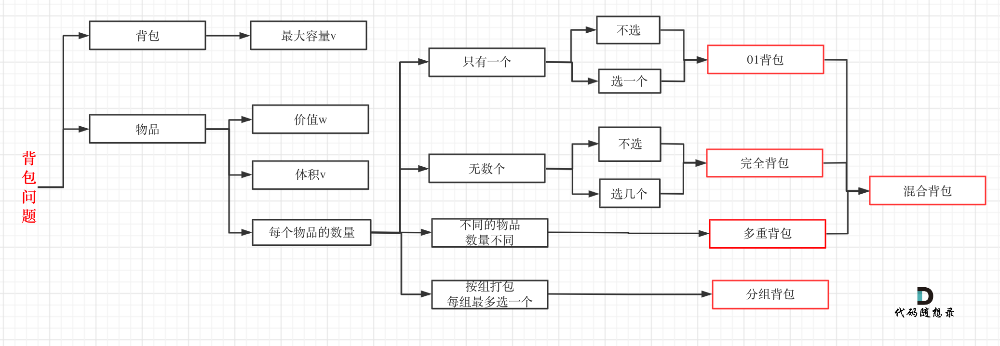

# DP

**误区**: 以为把状态转移公式背下来,照葫芦画瓢改改,就开始写代码,甚至不清楚dp[i]表示的是什么。


五步动态规划
1. 确定**dp数组**(dp table)以及**下标的含义**
2. 确定**递推公式**
3. dp数组如何**初始化**
4. 确定**遍历顺序**
5. 举例推导dp数组


## 动态规划理论基础

如果某一问题有很多重叠子问题，使用动态规划是最有效的。


动态规划中每一个状态一定是由上一个状态推导出来的，

贪心没有状态推导，而是从**局部**直接选最优的。


---

### 解题步骤

1. 确定**dp数组**(dp table)以及**下标的含义**
2. 确定**递推公式**
3. dp数组如何**初始化**
4. 确定**遍历顺序**
5. 举例推导dp数组


先确定递推公式,然后在考虑初始化，因为一些情况是**递推公式决定了dp数组要如何初始化**!

**推导dp[i]的时候,一定要时刻想着dp[i]的定义,否则容易跑偏。**

**这体现出确定dp数组以及下标的含义的重要性!**


---

### Debug

```c++
if (error occur) {
    print(dp数组);
    
    if (与自己预先思路模拟推导结果一致) {
        get(递归公式、初始化或者遍历顺序有问题);
    } else {
        get(代码实现细节有问题);
    }
}
```


**debug 三问**

- 这道题目我举例推导状态转移公式了么?
- 我打印dp数组的日志了么?
- 打印出来了dp数组和我想的一样么?


---

## 509. 斐波那契数

给定 n，计算 `F(n)`
$$
F(0)=0,F(1) = 1 \\
F(n) = F(n-1) + F(n-2) \quad n>1
$$


1. 确定**dp数组**(dp table)以及**下标的含义**

```C++
dp[i]: 第i个数的斐波那契值为 dp[i]
i    : 代表数字的序列
```


2. 确定**递推公式**

```c++
dp[i] = dp[i-1] + dp[i-2];
```


3. dp数组如何**初始化**

```c++
dp[0] = 0;
dp[1] = 1;
```


4. 确定**遍历顺序**

从递推公式可以看出，第i项依赖前两项，因此遍历的顺序是从前到后遍历的。


5. 举例推导dp数组

```c++
N = 10;
dp[0] = 0; dp[1] = 1;
dp[2] = 1 + 0 = 1;
dp[3] = 1 + 1 = 2;
dp[4] = 2 + 1 = 3;
dp[5] = 3 + 2 = 5;
dp[6] = 5 + 3 = 8;
dp[7] = 8 + 5 = 13;
dp[8] = 13 + 8 = 21;
dp[9] = 21 + 13 = 34;
dp[10] = 34 + 21 = 55;
```


```c++
int fib(int n) {
    if (n <= 1) return n;
    vector<int> dp(n+1);
    dp[0] = 0;
    dp[1] = 1;

    for (int i = 2; i <= n; ++i) {
        dp[i] = dp[i-1] + dp[i-2];
    }

    return dp[n];
}
```

时间复杂度:O(n)
空间复杂度:O(n)


---

### 优化

我们只需要维护两个数值就可以了,不需要记录整个序列。

```c++
int fib(int n) {
    if (n <= 1) return n;
    int dp[3];
    dp[0] = 0;
    dp[1] = 1;

    for (int i = 2; i <= n; ++i) {
        dp[2] = dp[0] + dp[1];
        dp[0] = dp[1];
        dp[1] = dp[2];            
    }

    return dp[2];
}
```

时间复杂度:O(n)
空间复杂度:O(1)


---

## 70. 爬楼梯

需要 n 阶你才能到达楼顶，每次你可以爬 1 或 2 个台阶。你有多少种不同的方法可以爬到楼顶呢?


1. 确定**dp数组**(dp table)以及**下标的含义**

```C++
dp[i]: 爬到第i层的方法数
i    : 当前的层数
```


2. 确定**递推公式**

爬到第一层楼梯有一种方法,爬到二层楼梯有两种方法。那么第一层楼梯再跨两步就到第三层 ,第二层楼梯再跨一步就到第三层。所以到**第三层楼梯的状态**可以由**第二层楼梯和到第一层楼梯状态推导**出来

```c++
dp[i] = dp[i-1] + dp[i-2];
```


3. dp数组如何**初始化**

```c++
dp[0] = 0;//不用考虑第0层的初始化，小于2层直接输出答案
dp[1] = 1;
dp[2] = 2;
```


4. 确定**遍历顺序**

从递推公式可以看出，第i项依赖前两项，因此遍历的顺序是从前到后遍历的。


5. 举例推导dp数组

```c++
N = 10;
dp[1] = 1;
dp[2] = 2;
dp[3] = 2 + 1 = 3;
dp[4] = 3 + 2 = 5;
dp[5] = 5 + 3 = 8;
dp[6] = 8 + 5 = 13;
dp[7] = 13 + 8 = 21;
dp[8] = 21 + 13 = 34;
dp[9] = 34 + 21 = 55;
```


```c++
int climbStairs(int n) {
    if(n <= 2) return n;
    int dp[3];
    dp[0] = 1;
    dp[1] = 2;

    for (int i = 3; i <= n; ++i) { //直接第三层开始 i代表层数
        dp[2] = dp[0] + dp[1];
        dp[0] = dp[1];
        dp[1] = dp[2];
    }

    return dp[2];
}
```


时间复杂度:O(n)
空间复杂度:O(1)


---

### 拓展

一步一个台阶,两个台阶,三个台阶,直到 m个台阶,有多少种方法爬到n阶楼顶。 完全背包题

当m等于3时

```c++
dp[i] = dp[i-1] + dp[i-2] + dp[i-3];
```


```c++
int climbStairs(int n, int m) {
    vector<int> dp(n+1, 0)
    dp[0] = 1;

    for (int i = 1; i <= n; ++i) { //直接第1层开始 i代表层数
        for (int j = 1; j <= m; ++j) {
            if (i - j >= 0) 
                dp[i] += dp[i-j];
        }
    }

    return dp[n];
}
```


---

## 746. 使用最小花费爬楼梯

cost[i] 是第i步的上楼梯的花费，花费一次可以爬一步或两步


1. 确定**dp数组**(dp table)以及**下标的含义**

```C++
dp[i]: 爬到第i步的花费
i    : 当前的步数
```


2. 确定**递推公式**

```c++
dp[i] += cost[i] + min(dp[i-1], dp[i-2]);
```

最后一步可以理解为不用花费,所以取倒数第一步,第二步的最小值


3. dp数组如何**初始化**

```c++
dp[0] = cost[0];
dp[1] = cost[1];
```


4. 确定**遍历顺序**

从递推公式可以看出，第i项依赖前两项，因此遍历的顺序是从前到后遍历的。


5. 举例推导dp数组

```c++
N = 10;
dp[0] = 1;
dp[1] = 100;
dp[2] = 1 + 1 = 2;
dp[3] = 2 + 1 = 3;
dp[4] = 3 + 2 = 5;
dp[5] = 5 + 3 = 8;
dp[6] = 8 + 5 = 13;
dp[7] = 13 + 8 = 21;
dp[8] = 21 + 13 = 34;
dp[9] = 34 + 21 = 55;
```


```c++
int minCostClimbingStairs(vector<int>& cost) {
    int N = cost.size();
    if (N < 2) return min(cost[0], cost[1]);

    vector<int> dp(N, 0);
    dp[0] = cost[0];
    dp[1] = cost[1];

    for (int i = 2; i < N; ++i) { //从第二层开始
        dp[i] = cost[i] + min(dp[i-1], dp[i-2]);
    }
    // 注意最后一步可以理解为不用花费,所以取倒数第一步,第二步的最少值
    return min(dp[N-1], dp[N-2]);
}
```

时间复杂度:O(n)
空间复杂度:O(n)


### 优化

```c++
int minCostClimbingStairs(vector<int>& cost) {
    int N = cost.size();
    if (N < 2) return min(cost[0], cost[1]);

    int dp[2];
    dp[0] = cost[0];
    dp[1] = cost[1];

    for (int i = 2; i < N; ++i) { //从第二层开始
        dp[2] = cost[i] + min(dp[1], dp[2]);
        dp[0] = dp[1];
        dp[1] = dp[2];
    }
    // 注意最后一步可以理解为不用花费,所以取倒数第一步,第二步的最少值
    return min(dp[2], dp[1]);
}
```

时间复杂度:O(n)
空间复杂度:O(1)


---

## 62.不同路径


1. 确定**dp数组**(dp table)以及**下标的含义**

```C++
dp[i][j]: 到达i,j的路径数
i,j     : matrix索引
```


2. 确定**递推公式**

```c++
dp[i][j] = dp[i-1][j] + 1 + dp[i][j-1];  // i-1 >= 0        j-1 >= 0 
// 只能从左边或者右边到达 因此把这两种情况加一下就好


```


3. dp数组如何**初始化**

```c++
// 边界条件
dp[i][0] = 1;
dp[0][j] = 1;  
```


4. 确定**遍历顺序**

从递推公式可以看出，第i项依赖前两项，因此遍历的顺序是**从上到下**、**从左到右**遍历的。


5. 举例推导dp数组


```c++
int uniquePaths(int m, int n) {
    int dp[m][n];
    for (int i = 0; i < m; ++i)
        dp[i][0] = 1;

    for (int j = 0; j < n; ++j)
        dp[0][j] = 1;


    for (int i = 1; i < m ;++i) {
        for (int j = 1; j < n; ++j) {

            dp[i][j] = dp[i][j-1] + dp[i-1][j];
        }
    }

    return dp[m-1][n-1];
}
```


时间复杂度:O(mn)
空间复杂度:O(mn)


---

### 优化

其实用一个一维数组(也可以理解是**滚动数组**)就可以了,可以优化点空间:

```c++
int uniquePaths(int m, int n) {
    int dp[n];
    
    for (int j = 0; j < n; ++j)
        dp[j] = 1;


    for (int i = 1; i < m ;++i) {
        for (int j = 1; j < n; ++j) {
            dp[j] += dp[j-1][j-1]; //其实就是本身跟他前一项相加
        }
    }

    return dp[n-1];
}
```


时间复杂度:O(mn)
空间复杂度:O(n)

> 只跟他 i-1 和 j-1 有关的，都可以用滚动数组，直接计算完替换原来的值。
>
> 优化空间复杂度，其实就是找到需要几个值，就可以。不是所有值都需要保留


---

## 63. 不同路径 II

有障碍物了


1. 确定**dp数组**(dp table)以及**下标的含义**

```C++
dp[i][j]: 到达i,j的可用路径数
i,j     : matrix索引
```


2. 确定**递推公式**

```c++
dp[i][j] = dp[i-1][j] + 1 + dp[i][j-1];  // i-1 >= 0        j-1 >= 0 
// 只能从左边或者右边到达 因此把这两种情况加一下就好
如果这里边有一个是1，就不能加
```


3. dp数组如何**初始化**

```c++
// 边界条件
dp[i][0] = 1; 没有障碍物的的话 否则为INF
dp[0][j] = 1;  
```


4. 确定**遍历顺序**

从递推公式可以看出，第i项依赖前两项，因此遍历的顺序是**从上到下**、**从左到右**遍历的。


5. 举例推导dp数组


```c++
int uniquePathsWithObstacles(vector<vector<int>>& obstacleGrid) {
    int M = obstacleGrid.size();    //row
    int N = obstacleGrid[0].size(); //col

    int dp[M][N];

    if (obstacleGrid[0][0] == 1)
        return 0;

    
    //可用用一行替换 for (int i = 0; i < m && obstacleGrid[i][0] == 0; i++) dp[i][0] = 1;
    int flag = 0;
    for (int i = 0; i < M; ++i) {
        if (flag) {
            dp[i][0] = INT_MAX;
            continue;
        }
        if (obstacleGrid[i][0] == 0) {
            dp[i][0] = 1;
        } else {
            dp[i][0] = INT_MAX;
            flag = 1;
        }      
    }


    flag = 0;
    for (int j = 0; j < N; ++j) {
        if (flag) {
            dp[0][j] = INT_MAX;
            continue;
        }
        if (obstacleGrid[0][j] == 0) {
            dp[0][j] = 1;
        } else {
            dp[0][j] = INT_MAX;
            flag = 1;
        }
    }

    for (int i = 1; i < M; ++i) {
        for (int j = 1; j < N; ++j) {
            if (obstacleGrid[i][j] == 1) {
                dp[i][j] = INT_MAX;
            } else if (dp[i-1][j] == INT_MAX && dp[i][j-1] == INT_MAX) {
                dp[i][j] = INT_MAX;//continue?
            } else if (dp[i-1][j] == INT_MAX) {
                dp[i][j] = dp[i][j-1];
            } else if (dp[i][j-1] == INT_MAX) {
                dp[i][j] = dp[i-1][j];
            } else {
                dp[i][j] = dp[i-1][j] + dp[i][j-1];
            }
        }   
    }

    return dp[M-1][N-1]==INT_MAX? 0 : dp[M-1][N-1];
}
```


时间复杂度:O(mn)
空间复杂度:O(mn)


```c++
int uniquePathsWithObstacles(vector<vector<int>>& obstacleGrid) {
    int M = obstacleGrid.size();    //row
    int N = obstacleGrid[0].size(); //col

    vector<vector<int>> dp(M, vector<int>(N, 0));

    if (obstacleGrid[0][0] == 1)
        return 0;


    for (int i = 0; i < M && obstacleGrid[i][0] == 0; i++) dp[i][0] = 1;
    for (int j = 0; j < N && obstacleGrid[0][j] == 0; j++) dp[0][j] = 1;

    for (int i = 1; i < M; ++i) {
        for (int j = 1; j < N; ++j) {
            if (obstacleGrid[i][j] == 1) {
                dp[i][j] = 0;
            } else {
                dp[i][j] = dp[i-1][j] + dp[i][j-1];
            }
        }   
    }

    return dp[M-1][N-1];
}
```


---

## 343. 整数拆分


1. 确定**dp数组**(dp table)以及**下标的含义**

```C++
dp[i]: 拆分i时的最大值
i    : 被拆分的数
```


2. 确定**递推公式**

`dp[i]` 最大乘积，从1遍历j，然后有两种渠道得到 `dp[i]`

- 一个是 `j * (i-j)` 直接相乘
- 一个是 `j * dp[i-j]`，相当于是拆分 (i-j)，

```c++
dp[i] = max(dp[i], max( (i-j)*j, dp[i-j]*j ));  

// 为什么还要跟dp[i] 做比较 ，因为每次循环j都会计算出不同的 dp[i] 
// 比如前边的 2 2 的4 dp[i] 比 3 1的 3 dp[i]要大
```


3. dp数组如何**初始化**

`dp[0] dp[1]` 不应该初始化,也就是没有意义的数值。这里只初始化 `dp[2] = 1`,从dp[i]的定义来说,拆分数字2,得到的最大乘积是1

```c++
// 边界条件
dp[2] = 1; 
```


4. 确定**遍历顺序**

从递推公式可以看出，dp[i] 依赖 dp[i-j]，因此遍历的顺序是**从前到后**遍历的。


5. 举例推导dp数组


```c++
int integerBreak(int n) {
    int dp[59] = {0};
    //memset(dp, 0, sizeof(dp));

    dp[2] = 1;

    for (int i = 3; i <= n; ++i) {

        for (int j = 2; j < i; ++j) {
            dp[i] = max(dp[i], max(j*(i-j), j*dp[i-j]));
        }
    }

    return dp[n];
}
```


时间复杂度:O(n2)
空间复杂度:O(n)


---

## 96. 不同的二叉搜索树


1. 确定**dp数组**(dp table)以及**下标的含义**

```C++
dp[i]: n个节点时能构成的二叉搜索树
i    : 节点数
```


2. 确定**递推公式**

`dp[i]` 乘积，从1遍历j，确定父亲节点，计算左右子树的组合情况，然后相乘得到 `dp[i]`

 `dp[mid-1] * dp[i - mid]`


```c++
dp[i] += dp[mid-1] * dp[i-mid];  

```


3. dp数组如何**初始化**

```c++
// 边界条件
dp[0] = 1; 
dp[1] = 1;
```


4. 确定**遍历顺序**

从递推公式可以看出，dp[i] 依赖 dp[i-j]，因此遍历的顺序是**从前到后**遍历的。


5. 举例推导dp数组


```c++
int numTrees(int n) {
    int dp[n+1];

    if (n == 1) return 1;

    dp[0] = 1;
    dp[1] = 1;


    for (int i = 2; i <= n; ++i) {
        dp[i] = 0;

        for (int mid = 1; mid <= i; ++mid) {
            dp[i] += dp[mid-1]*dp[i-mid];
        }
    }

    return dp[n];
}
```


时间复杂度:O(n2)
空间复杂度:O(n)


---

# DP-Bag

背包

对于⾯试的话，其实掌握**01背包**，和**完全背包**，就够⽤了，最多可以再来⼀个**多重背包**。



⾄于背包九讲其他背包，⾯试⼏乎不会问，都是竞赛级别的了，leetcode上连多重背包的题⽬都没有，所以题库也告诉我们，01背包和完全背包就够⽤了。


完全背包⼜是也是01背包稍作变化⽽来，即：**完全背包的物品数量是⽆限的**。

背包问题的理论基础重中之重是**01背包**


---

## 经典 01 背包

给出 n 个物品及其大小A[n]，背包容量为 m，背包**最多能装多少**


01 就是要么挑，要么不挑

如果一个物品可以被分割，就不是01背包（可能就是贪心法）

如果一个物品可以选多份，就叫多重背包


1. 确定**dp数组**(dp table)以及**下标的含义**

使⽤⼆维数组，下边两种状态表示都可以

```C++
dp[i][j]: 前i个物品里挑出若干物品组成和为 j 的大小是否可行 bool
dp[i][j]: 前i个物品能否凑出的 <=j 的最大和是多少
```


2. 确定**递推公式**


```c++
dp[i][j] = dp[i-1][j]        如果j >= A[i]
```


3. dp数组如何**初始化**

```c++

```


4. 确定**遍历顺序**

从递推公式可以看出，dp[i] 依赖 dp[i-j]，因此遍历的顺序是**从前到后**遍历的。


5. 举例推导dp数组


---

## Value 经典 01 背包

有 $N$ 件物品和⼀个最多能被重量为 $W$ 的背包。第 $i$ 件物品的重量是 weight[i]，得到的价值是value[i] 。每件物品只能⽤⼀次，求解将哪些物品装⼊背包⾥**物品价值总和最⼤**。


**从底向上**去**思考**

每⼀件物品其实只有两个状态，取或者不取，所以可以使⽤回溯法搜索出所有的情况，那么时间复杂度就是O(2^n)，这⾥的n表示物品数量。


暴⼒的解法是指数级别的时间复杂度。进⽽才需要动态规划的解法来进⾏优化！


1. 确定**dp数组**(dp table)以及**下标的含义**

使⽤⼆维数组

```C++
dp[i][j]: 把第i个物品放入容量为 j 的背包,最大的价值总和
i:	第 i 个物品
j:	容量为 j 的背包
```


2. 确定**递推公式**

从下标为 `[0-i]` 的物品⾥任意取，放进容量为j的背包。那么可以有两个⽅向推出来 `dp[i][j]`

- 由 `dp[i-1][j]` 推出，即背包容量为 j， 里面不放物品 i 的最大价值，此时 `dp[i][j]` 就是 `dp[i - 1][j]`

- 由 `dp[i - 1][j - weight[i]]`推出，`dp[i - 1][j - weight[i]]` 为背包容量为 `j - weight[i]` 的时候不放物品 i 的最大价值，那么 `dp[i - 1][j - weight[i]] + value[i]` （物品i的价值），就是背包放物品i得到的最大价值

```c++
dp[i][] += dp[mid-1] * dp[i-mid];
```


3. dp数组如何**初始化**

```c++
// 边界条件
dp[0] = 1; 
dp[1] = 1;
```


4. 确定**遍历顺序**

从递推公式可以看出，dp[i] 依赖 dp[i-j]，因此遍历的顺序是**从前到后**遍历的。


5. 举例推导dp数组