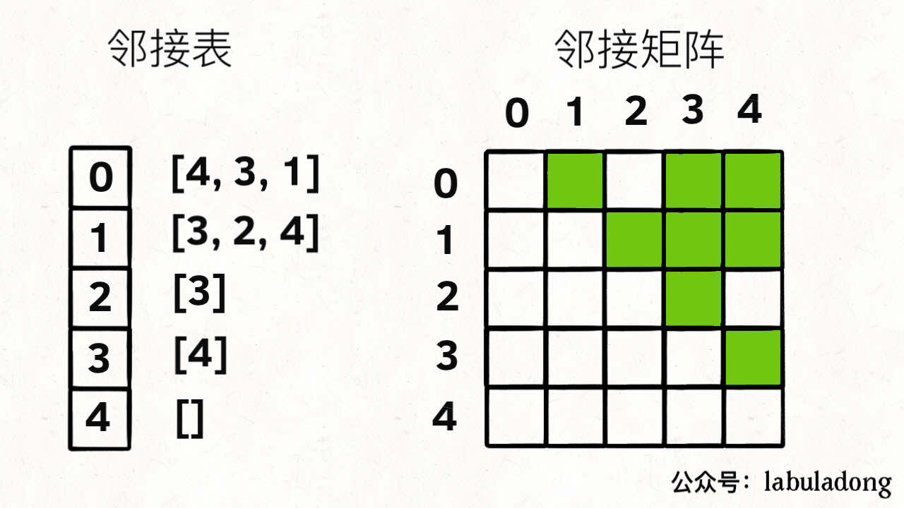
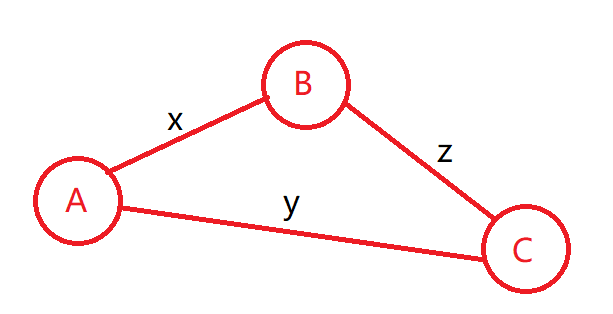
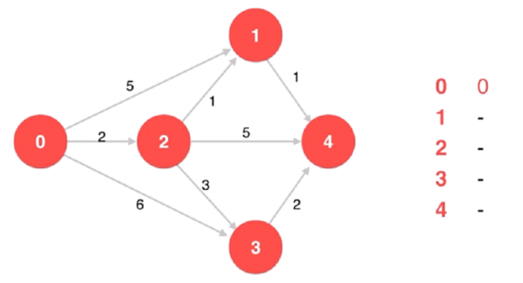
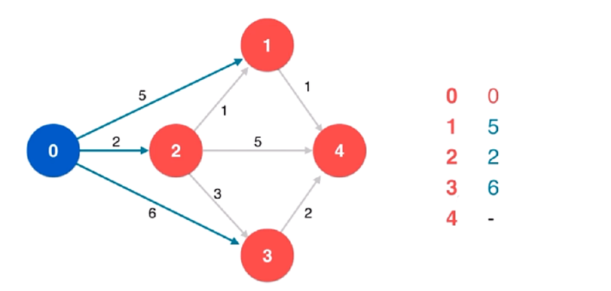
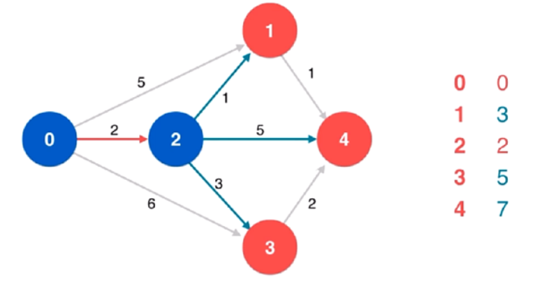
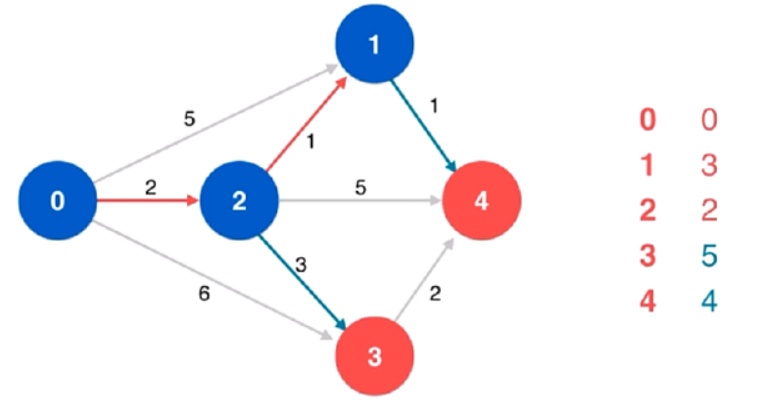
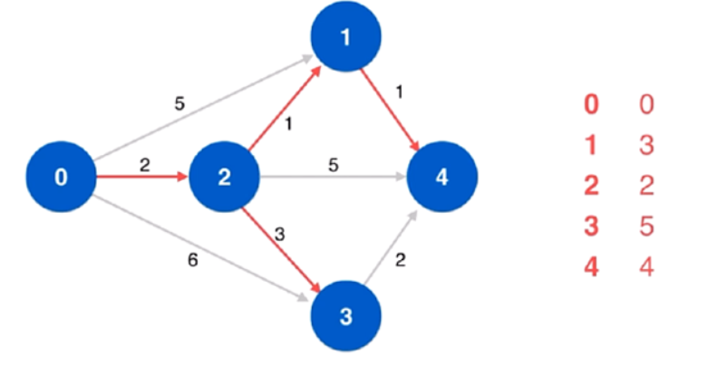
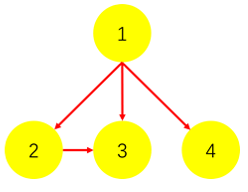

# Graph

https://labuladong.gitee.io/algo/2/20/36/


图可以玩出更多的算法，解决更复杂的问题，但**本质**上图可以认为是**多叉树的延伸**。


⾯试笔试很少出现图相关的问题，就算有，大多也是简单的遍历问题，基本上可以完全照搬**多叉树的遍历**。


像 [二分图判定](https://labuladong.gitee.io/algo/2/20/38/)、拓扑排序这一类，属于比较**基本且有用**的算法，应该比较熟练地掌握。

像 [最小生成树](https://labuladong.gitee.io/algo/2/20/41/) 和 [最短路径问题](https://labuladong.gitee.io/algo/2/20/43/)，虽然从刷题的角度用到的不多，但它们属于经典算法，**学有余力**可以掌握一下；

像**网络流**这种问题，你又不是打竞赛的，没时间的话就**没必要**学了；


-----

# 图的逻辑结构和具体实现

`G(V, E)` 图 G 的顶点集 `V`、边集 `E`。


⼀幅图是由顶点 **Vertex** 和边 **Edge** 构成的，逻辑结构如下：


```c++
class Vertex {
    int id;
    Vertex[] neighbors;
}
```


和多叉树节点完全一样


```c++
class TreeNode {
    int val;
    TreeNode[] children;
}
```


图本质上就是个高级的多叉树。适用于树的 DFS/BFS 遍历算法，全部适用于图。很少用这个 Vertex 类实现图，而是用**邻接表**和**邻接矩阵**来实现。


上图用**邻接表**和**邻接矩阵**的存储方式如下：



**邻接表**：每个节点 x 的邻居都存到一个列表里，然后把 x 和这个列表关联起来。

**邻接矩阵**：二维bool数组，如果 x 和 y 相连，则 `matrix[i][j]` 设为 `true` 


```c++
List<int> graph[5]; //grapg[x] 存储 x 的所有邻居节点

bool matrix[5][5];
```


无向图的实现方式，邻接矩阵把 `matrix[x][y]` 和 `matrix[y][x]` 都变成 true 不就⾏了；邻接表也是类似的操作，在 x 的邻居列表⾥添加 y，同时在 y 的邻居列表⾥添加 x。


在**无向图**中，如果两个顶点之间可以互相到达（可以间接），那么就称这两个顶点**连通**。如果图 `G(V, E)`的**任意两个顶点都连通**，则称图 G 为**连通图**；否则，称图 G 为**非连通图**，且称其中的**极大连通子图为连通分量**。


在**有向图**中，如果两个顶点可以各自通过一条有向路径到达另一个顶点，就称这两个顶点**强连通**。如果图 `G(V, E)` 的**任意两个顶点都强连通**，则称图 G 为**强连通图**；否则，称图为**非强连通图**，且称其中的**极大强连通子图为强连通分量**。


## 二维矩阵抽象成图

二维矩阵抽象成图处理，压缩索引到一维

**LCP 56. 信物传送**

```c++
// 下边三个对应4个方向的索引
short dirs[4][2] = {{0, -1}, {0, 1}, {-1, 0}, {1, 0}};
char s[5] = "<>^v";
vector<string> s[5] = {"left", "right", "up", "down"};

int m = matrix.size(), n = matrix[0].size();

// 邻接矩阵
const int inf = 0x3f3f3f3f;
vector<vector<int>> g(m * n, vector<int>(m * n, inf));

for (int i = 0; i < m; ++i) {
    for (int j = 0; j < n; ++j) {
        int idx = i * n + j;	// 压缩矩阵

        for (int k = 0; k <4; ++k) {
            int x = i + dirs[k][0];
            int y = j + dirs[k][1];

            if (x >= 0 && x < m && y >=0 && y < n) {
                int iidx = x * n + y;
                if (matrix[i][j] == s[k]) g[idx][iidx] = 0;
                else g[idx][iidx] = 1;
            }
        }
    }   
}
```


超时，所以也可以直接把 dist 数组设成二维的

```c++
class Solution {
    typedef pair<int, int> pii;
    typedef pair<int, pii> piii;
    
public:
    // 把每个格子看成一个节点，相邻格子之间连边
    // 若出发格的箭头恰好指着这个方向，边的长度就是 0，否则是 1
    // 在这张图上跑一边最短路即可

    int conveyorBelt(vector<string>& matrix, vector<int>& start, vector<int>& end) {
        int m = matrix.size(), n = matrix[0].size();

        const int inf = 0x3f3f3f3f;

        vector<vector<int>> dist(m, vector<int>(n, inf));
        dist[start[0]][start[1]] = 0;

        priority_queue<piii, vector<piii>, greater<>> pq;
        pq.push(piii(0, pii(start[0], start[1])));

        while (pq.size()) {
            auto [weight, idx] = pq.top(); pq.pop();
            int i = idx.first, j = idx.second;

            for (int k = 0; k < 4; ++k) {
                int x = i + dirs[k][0];
                int y = j + dirs[k][1];

                if (x >= 0 && x < m && y >=0 && y < n) {
                    int w = -1;
                    if (matrix[i][j] == s[k]) w = 0;
                    else w = 1;

                    int d = weight + w;
                    if (dist[x][y] > d) {
                        dist[x][y] = d;
                        pq.push(piii(d, pii(x, y)));
                    }
                }
            }
        }

        return dist[end[0]][end[1]] == inf ? 0 : dist[end[0]][end[1]];
    }

private:
    short dirs[4][2] = {{0, -1}, {0, 1}, {-1, 0}, {1, 0}};
    char s[5] = "<>^v";
};
```


---

# 图的遍历

参考多叉树，多叉树的遍历框架如下

```c++
void traverse(TreeNode* root) {
    if (root == null) return;
    
    for (int i = 0; i < root.children.size(); ++i) {
        traverse(root->children[i]);
    }
    
    return;
}
```


图和多叉树**最⼤的区别是**，图是可能包含**环**的，你从图的某⼀个节点开始遍历，有可能⾛了⼀圈⼜回到这个节点。因此需要一个 **vis 数组**进行**辅助**


---

## DFS

以深度作为第一关键词，每次都是沿着路径到**不能再前进时**才**退回**到**最近的岔道口**。

```c++
DFS(u) {			//访问顶点u
    vis[u] = true;	//设置u已被访问
    
    for (从u出发能到达的所有顶点v) {	 //枚举从u出发可以到达的所有顶点v
    	if (vis[v] == false) {		//如果v未被访问
     		DFS(v);       			//递归访问v
        }
    }    
}

DFSTrave(G) {					//遍历图G
    for (G的所有顶点u) {				//对G的所有顶点u
    	if (vis[u] == false) {		//如果u未被访问
     		DFS(u);       			//访问u所在的连通块
        }
    }
}
```


**邻接表法**

```c++
const MAXV = 1000;	//最大顶点数
const INF = 1e9;	//设INF为很大的数

int n; 					// n为顶点数
vector<vector<int>> Adj[MAXV]; 	// 图G的邻接表
bool vis[MAXV] = {false}; 
```

```c++
void DFS(int u, int depth) {
    vis[u] = true;
    
    for (int i = 0; i < Adj[u].size(); ++i) {
        int v = Adj[u][i];
        if (vis[v] == false) {
            DFS(v, depth + 1);
        }
    }
}

void DFSTrave() {	//遍历图G
    for (int u = 0; u < n; ++u) {
        if (vis[u] == false) {
            DFS(u, 1);		
        }
    }
}
```


**邻接矩阵法**

```c++
const MAXV = 1000;	//最大顶点数
const INF = 1e9;	//设INF为很大的数

int n, G[MAXV][MAXV]; //n为顶点数  G为邻接矩阵
bool vis[MAXV] = {false}; 
```

```c++
void DFS(int u, int depth) {
    vis[u] = true;
    
    for (int v = 0; v < n; ++v) {
        if (vis[v] == false && G[u][v] != INF) {
            DFS(v, depth + 1);
        }
    }
}

void DFSTrave() {	//遍历图G
    for (int u = 0; u < n; ++u) {
        if (vis[u] == false) {
            DFS(u, 1);		
        }
    }
}
```


---

## BFS

以**广度**作为关键词，每次以**扩散**的方式向外访问顶点。需要一个**队列**，通过**反复取出队首顶点**，将该顶点**可到达的未曾加入过队列**的顶点全部入队，直到**队列为空**时遍历结束。

此时的 `vis[]` 数组意义为是否插入过队列 `inq[]` 

```c++
BFS(u) {			//访问顶点u
    queue q;		//定义队列q
    inq[u] = true;	//设置u已被访问
    
    while (q非空) {
        取出q的队首元素u进行访问;
        for (从u出发能到达的所有顶点v) {	 //枚举从u出发可以到达的所有顶点v
         	if (inq[v] == false) {		//如果v没有被查如果队列
                将 v 入队;
                inq[v] = true;			//设置v已被加入过队列
            }
        } 
    }       
}

BFSTrave(G) {					//遍历图G
    for (G的所有顶点u) {				//对G的所有顶点u
    	if (inq[u] == false) {		//如果u未曾加入过队列
     		BFS(u);       			//访问u所在的连通块
        }
    }
}
```


**邻接表法**

```c++
const MAXV = 1000;	//最大顶点数
const INF = 1e9;	//设INF为很大的数

int n; 					// n为顶点数
vector<vector<int>> Adj[MAXV]; 	// 图G的邻接表
bool inq[MAXV] = {false}; 
```

```c++
void BFS(int u) {
    queue<int> que;
    que.push(u);
    inq[u] = true;
    
    while (!que.empty()) {
        int u = que.front(); que.pop();
        
        for (int i = 0; i < Adj[u].size(); ++i) {
            int v = Adj[u][i];
            if (inq[v] == false) {
                q.push(v);
                inq[u] = true;
			}                
        }
    }    
}

void BFSTrave() {	//遍历图G
    for (int u = 0; u < n; ++u) {
        if (inq[u] == false) {
            BFS(u);		
        }
    }
}
```


**邻接矩阵法**

```c++
const MAXV = 1000;	//最大顶点数
const INF = 1e9;	//设INF为很大的数

int n, G[MAXV][MAXV]; //n为顶点数  G为邻接矩阵
bool inq[MAXV] = {false}; 
```

```c++
void BFS(int u) {
    queue<int> que;
    que.push(u);
    inq[u] = true;
    
    while (!que.empty()) {
        int u = que.front(); que.pop();
        
        for (int v = 0; v < n; ++v) {
            if (inq[v] == false && G[u][v] != INF) {
                que.push(v);
                inq[v] = true;
            }
        }
    }
}

void BFSTrave() {	//遍历图G
    for (int u = 0; u < n; ++u) {
        if (inq[u] == false) {
            DFS(u, 1);		
        }
    }
}
```


[797. 所有可能的路径（中等）](https://leetcode-cn.com/problems/all-paths-from-source-to-target/)


## 面试题 04.01. 节点间通路 - DFS

```c++
class Solution {
public:
    void dfs(vector<vector<int>> &g, vector<bool> &isArrived, int start, int target, bool &flag) {
        if (isArrived[start]) {
            return;
        }
        
        isArrived[start] = true;

        if (start == target) {
            flag = true;
            return;
        }

        for (int i = 0; i < g[start].size(); ++i) {
            dfs(g, isArrived, g[start][i], target, flag);
        }
    } 


    bool findWhetherExistsPath(int n, vector<vector<int>>& graph, int start, int target) {
        vector<bool> isArrived(n, false);
        vector<vector<int>> g(n);

        for (auto &edge : graph) {
            g[edge[0]].push_back(edge[1]);
        }

        bool flag = false;
        dfs(g, isArrived, start, target, flag);

        return flag;
    }
};
```


## 565. 数组嵌套 - DFS

注意 `isVis` 不用每次循环都重新初始化，因为这题本质是一个判断图的最大环，一个环计算一次就可以，下次再碰到环里的其它元素直接返回 0 就可以了。

- **递归法**

```c++
class Solution {
public:

    int dfs(vector<int> &nums, int n, vector<bool> &isVis) {
        if (isVis[n]) {
            return 0;
        }

        isVis[n] = true;        

        return 1 + dfs(nums, nums[n], isVis);
    }

    int arrayNesting(vector<int>& nums) {
        vector<bool> isVis(nums.size(), 0);
        for (int i = 0; i < nums.size(); ++i) {
            int cnt = dfs(nums, nums[i], isVis);
            mLongest = max(mLongest, cnt);
        }
        
        return mLongest;
    }

private:
    int mLongest = -1;    
};
```


- **迭代法**

```c++
class Solution {
public:
    int arrayNesting(vector<int>& nums) {
        vector<bool> isVis(nums.size(), 0);
        
        for (int i = 0; i < nums.size(); ++i) {
            int cnt = 1, nowIdx = nums[i];

            if (!isVis[i]) {
                while (nowIdx != i) {	// 在这里迭代
                    cnt++;
                    nowIdx = nums[nowIdx];
                    isVis[nowIdx] = true;
                }
            } 

            mLongest = max(mLongest, cnt);
        }
        
        return mLongest;
    }

private:
    int mLongest = -1;    
};
```


---

# 拓扑排序

https://labuladong.gitee.io/algo/2/20/37/

环检测和拓扑排序（编译器循环引用检测就是类似的算法）

## 207. 课程表I


## 210. 课程表 II


见 D_BFS 里 210. 课程表 II


---

## 有向图的环检测


---

# 二分图

https://labuladong.gitee.io/algo/2/20/38/


[785. 判断二分图（中等）](https://leetcode-cn.com/problems/is-graph-bipartite)

[886. 可能的二分法（中等）](https://leetcode-cn.com/problems/possible-bipartition)


---

# 最短路径

https://labuladong.gitee.io/algo/2/20/48/


**dijkstra+堆优化+vis数组** 一招吃天下，特殊情况看 SPFA


## 743. 网络延迟时间（中等）


### bfs

```c++
int networkDelayTime(vector<vector<int>>& times, int n, int k) {
    const int inf = 0x3f3f3f3f;
    vector<vector<pair<int, int>>> g(n + 1);
	
    /*建图 邻接表*/
    for (auto &p : times) {
        g[p[0]].emplace_back(p[1], p[2]);	
    }

    vector<int> dist(n+1, inf);
    dist[k] = 0;
    //vector<bool> vis(n+1, false);!!!!!!!!!!!!!普通dfs不能使用vis数组，需要全部松弛一边

    queue<int> q;
    q.emplace(k);

    while (q.size()) {
        int x = q.front(); q.pop();

        //if (vis[x]) continue;
        //vis[x] = true;

        for (auto &p : g[x]) {
            int dis = dist[x] + p.second, y = p.first;
            if (dist[y] > dis) {
                dist[y] = dis;
                q.push(y);
            }
        }
    }

    int res = *max_element(++dist.begin(), dist.end());
    return res == inf ? -1 : res;
}
```


| 方法                    | 适用场景                           | 特点                                   | 时间复杂度   | 空间复杂度 |
| ----------------------- | ---------------------------------- | -------------------------------------- | ------------ | ---------- |
| dijkstra                | 1.数据量比较小<br/>2.稠密图        | 不支持负边权                           | $O(N^2+E)$   | $O(N+E)$   |
| dijkstra+堆优化         | 稀疏图                             | 不支持负边权                           | $O(E\log E)$ | $O(N+E)$   |
| dijkstra+堆优化+vis数组 | 1.稀疏图<br/>2.不适合visited的情形 | 不支持负边权                           | $O(E\log N)$ | $O(N+E)$   |
| Floyd                   | 1.多对多<br/>2.数据范围比较小      | 允许负边权。但回路中边的权值不能为负。 | $O(N^3)$     | $O(N^2)$   |
| 朴素Bellman Ford        |                                    | 支持负边权<br/>不用建图                | $O(NE)$      | $O(N)$     |
| SPFA                    | 差分约束                           | 支持负边权<br/>适应性很强              | $O(KE)$      | $O(N+E)$   |

> N 为**点数**，E 为 **边数**，$E > N$ 否则必没有最短路径
>
> 建图默认为邻接表 $O(N+E)$，若邻接矩阵则为 $O(N^2)$，
>
> BF 不涉及建图 $O(N)$ 为 dist  数组 
>
> SPFA 中 $K$ 是节点被平均入队的次数，有关数据表明 $K$一般都是一个趋近于2的常数，故 SPFA 复杂度主要依赖于边数 $E$。


**当 $E = N$ 时**

| 方法                    | 时间复杂度   | 变为         |
| ----------------------- | ------------ | ------------ |
| dijkstra                | $O(N^2+E)$   | $O(N^2)$     |
| dijkstra+堆优化         | $O(E\log E)$ | $O(E\log E)$ |
| dijkstra+堆优化+vis数组 | $O(E\log N)$ | $O(E\log E)$ |
| Floyd                   | $O(N^3)$     | $O(N^3)$     |
| 朴素Bellman Ford        | $O(NE)$      | $O(N^2)$     |
| SPFA                    | $O(KE)$      | $O(KE)$      |

dijkstra+堆优化+vis数组 / SPFA 最优


**当 $E = N^2$ 时，有向完全稠密**

| 方法                    | 时间复杂度   | 变为             |
| ----------------------- | ------------ | ---------------- |
| dijkstra                | $O(N^2+E)$   | $O(N^2)$         |
| dijkstra+堆优化         | $O(E\log E)$ | $O(N^2\log N^2)$ |
| dijkstra+堆优化+vis数组 | $O(E\log N)$ | $O(N^2\log N)$   |
| Floyd                   | $O(N^3)$     | $O(N^3)$         |
| 朴素Bellman Ford        | $O(NE)$      | $O(N^3)$         |
| SPFA                    | $O(KE)$      | $O(KN^2)$        |

dijkstra+堆优化+vis数组 最优


---

## 松弛

松弛操作原理是 三角形 两边之和大于第三边，例子：求源点 A 到其他结点的最短距离，有两个结点 B 和 C 与源点 A 的距离为 x，y，若 B 到 C 之间有一条边 z，那么此时可以考虑通过 B 到达 C，距离为 x+z，若 x + z < y，说明通过 B 到达 C 的距离更短，就可以更新 C 与源点 A 的最短路径




---

## Dijkstra-不支持负边权

主要思想是贪心

将所有节点分成两类：**已确定从起点到当前点的最短路长度的节点**，以及**未确定从起点到当前点的最短路长度的节点**（下面简称「未确定节点」和「已确定节点」）。


每次从「未确定节点」中取一个与起点距离最短的点，将它归类为「已确定节点」，并用它「更新」从起点到其他所有「未确定节点」的距离。直到所有点都被归类为「已确定节点」

> 用节点 A「更新」节点 B 的意思是，用起点到节点 A 的最短路长度加上从节点 A 到节点 B 的边的长度，去比较起点到节点 B 的最短路长度，如果前者小于后者，就用前者更新后者。这种操作也被叫做「**松弛**」。
>


有向带权图，圆圈中为节点序号，箭头上为边权，右侧为所有点距离源点 `0` 的距离。




将顶点 `0` 进行标识，并作为点 x，更新其到其他所有点的距离。一轮循环结束



将顶点 `2` 进行标识，并作为新的点 x，更新。我们看到，原本点 `1` 的最短距离为 `5`，被更新为了 `3`。同理还更新了点 `3` 和点 `4` 的最短距离。




将顶点 1 进行标识，并作为新的点 x，同样更新了点 4 到源点的最短距离。



再分别标识点 `4` 和点 `3`，循环结束。


### **naive**

适用情况：
1.数据量比较小
2.稠密图

```c++
int networkDelayTime(vector<vector<int>>& times, int n, int k) {
    const int inf = INT_MAX / 2;
    vector<vector<int>> g(n + 1, vector<int>(n + 1, inf));

    for (auto &t : times) {
        int x = t[0], y = t[1];
        g[x][y] = t[2];
    }

    vector<int> dist(n + 1, inf);   // 从起点到 i 的最短距离
    dist[k] = 0;    // 自身到自身为0
    vector<int> used(n + 1);

    for (int i = 1; i <= n; ++i) {
        int x = -1;
        for (int y = 1; y <= n; ++y) {  // 循环找出离当前flag节点最近的点x.   i=1 时找出来的是 k 即起点
            if (!used[y] && (x == -1 || dist[y] < dist[x])) {
                x = y;
            }
        }

        used[x] = true;
        for (int y = 1; y <= n; ++y) {  // 更新所有最短距离
            dist[y] = min(dist[y], dist[x] + g[x][y]);  // 从起点到节点flag节点x的最短距离 dist[x]
        }
    }

    int ans = *max_element(++dist.begin(), dist.end());
    return ans == inf ? -1 : ans;
}
```

枚举写法的复杂度如下：

**时间复杂度**：$O(N^2+E)$，其中 M 是数组 times 的长度。$O(N^2)$ 是寻找最短路径， $O(E)$ 是建图

**空间复杂度**：$O(N^2)$/$O(N+E)$。邻接矩阵/邻接表的空间。


N 为**点数**，E 为 **边数**

N 最大100，E 最大6000 ( $N<E<N^2$)，最坏时间复杂度 O(10000 + 6000) = O(16000)


当**边数远大于点数**，是一张**稠密图**，在运行时间上，**枚举写法要略快于堆的写法**。


---

### **堆优化**

适用情况：
1.稀疏图
2.不适合visited的情形

```c++
int networkDelayTime(vector<vector<int>>& times, int n, int k) {
    const int inf = INT_MAX / 2;
    vector<vector<pair<int, int>>> g(n + 1);    // 邻接表

    /*建图*/
    for (auto &t : times) {
        g[t[0]].emplace_back(t[1], t[2]);
    }

    vector<int> dist(n + 1, inf);
    dist[k] = 0;


    // 默认以 pair 的 first 元素来排序 greater<>表示数字小的优先级越大 less<>表示数字大的优先级越大
    // 等价于 priority_queue<pair<int, int>, vector<pair<int, int>>, greater<pair<int, int>>> q;
    priority_queue<pair<int, int>, vector<pair<int, int>>, greater<>> q;
    q.emplace(0, k);

    while (!q.empty()) {
        auto p = q.top(); q.pop();

        int time = p.first, x = p.second;   // 得到当前优先队列中头部元素，具有最短路径的属性
        //if (dist[x] < time) continue; // 没有设置访问数组，所以有重复节点入队列，如果后续对已经在队列中的节点的time进行了更新，那么之前队列中该节点存储的time值就失效了

        for (auto &e : g[x]) {
            int y = e.first, d = dist[x] + e.second;
            if (d < dist[y]) { // 松弛
                dist[y] = d;
                q.emplace(d, y);
            }
        }

    }

    int ans = *max_element(++dist.begin(), dist.end());
    return ans == inf ? -1 : ans;

}
```

堆的写法复杂度如下：

时间复杂度：$O(E\log E)$

**空间复杂度**：$O(N^2)$/$O(N+E)$。邻接矩阵/邻接表的空间。

N 为**点数**，E 为 **边数**

N 最大100，E 最大6000，最坏时间复杂度 O(6000 log 6000) = O(22668)


>对队列进行研究，我们希望每一个点仅入队出队一次，期望的时间复杂度为 $O(N\log N)$，但实际中并不如此，节点可能被入队出队多次，因此实际性能略差，可能的时间复杂度为 $O(E\log E)$，其中 $E$ 是全部节点入队的总次数


---

### 堆优化+vis数组 - 邻接表

适用情况：
1.稀疏图

```c++
int networkDelayTime(vector<vector<int>>& times, int n, int k) {
    const int inf = INT_MAX / 2;
    vector<vector<pair<int, int>>> g(n + 1);

    for (auto &t : times) {
        g[t[0]].emplace_back(t[1], t[2]);
    }

    vector<int> dist(n + 1, inf);
    dist[k] = 0;
    vector<bool> visit(n + 1, false);

    priority_queue<pair<int, int>, vector<pair<int, int>>, greater<>> q;
    q.emplace(0, k);

    while (q.size()) {
        auto p = q.top(); q.pop();
        int time = p.first, flag = p.second;

        if (visit[flag]) continue;
        visit[flag] = true;

        for (auto &e : g[flag]) {
            int y = e.first, d = dist[flag] + e.second;
            if (d < dist[y]) { // 松弛
                dist[y] = d;
                q.emplace(d, y);
            }
        }

    }

    int res = *max_element(++dist.begin(), dist.end());
    return res == inf ? -1 : res;
}
```

堆的写法复杂度如下：

时间复杂度：$O(E\log N)$

**空间复杂度**：$O(N+E)$。

N 为**点数**，E 为 **边数**

N 最大100，E 最大6000，最坏时间复杂度 O(6000 log 10) = O(6000)


> 对队列进行研究，我们希望每一个点仅入队出队一次，期望的时间复杂度为 $O(N\log N)$，但实际中并不如此，节点可能被入队出队多次，因此实际性能略差，可能的时间复杂度为 $O(E\log E)$，其中 $E$ 是全部节点入队的总次数，
>
> **如果加入 visited 数组**，由于一旦节点出队，便再也不可能入队(visit = false)，因此 $E$ 依然小于 $N^2$，即 $E\log E < E\log(N^2) = 2E\log N$，即最终的时间复杂度为$O(E\log N)$，其中 $N <= E < N^2$。


---

### 堆优化+vis数组 - 邻接矩阵

适用情况：
1.稀疏图

```c++
int networkDelayTime(vector<vector<int>>& times, int n, int k) {
    const int inf = INT_MAX / 2;
    vector<vector<int>> g(n + 1, vector<int>(n + 1, inf));	//!!!1
	
    //!!!2
    for (auto &t : times) {
        g[t[0]][t[1]] = t[2];
    }

    vector<int> dist(n + 1, inf);
    dist[k] = 0;
    vector<bool> visit(n + 1, false);

    priority_queue<pair<int, int>, vector<pair<int, int>>, greater<>> q;
    q.emplace(0, k);

    while (q.size()) {
        auto p = q.top(); q.pop();
        int time = p.first, flag = p.second;

        if (visit[flag]) continue;
        visit[flag] = true;

        for (int i = 0; i <= n; ++i) {	//!!!3
            int d = dist[flag] + g[flag][i];	///!!!4
            if (d < dist[i]) { // 松弛
                dist[i] = d;
                q.emplace(d, i);
            }
        }

    }

    int res = *max_element(++dist.begin(), dist.end());
    return res == inf ? -1 : res;
}
```

堆的写法复杂度如下：

时间复杂度：$O(E\log N)$

**空间复杂度**：$O(N^2)$

N 为**点数**，E 为 **边数**

N 最大100，E 最大6000，最坏时间复杂度 O(6000 log 10) = O(6000)


> 对队列进行研究，我们希望每一个点仅入队出队一次，期望的时间复杂度为 $O(N\log N)$，但实际中并不如此，节点可能被入队出队多次，因此实际性能略差，可能的时间复杂度为 $O(E\log E)$，其中 $E$ 是全部节点入队的总次数，
>
> **如果加入 visited 数组**，由于一旦节点出队，便再也不可能入队(visit = false)，因此 $E$ 依然小于 $N^2$，即 $E\log E < E\log(N^2) = 2E\log N$，即最终的时间复杂度为$O(E\log N)$，其中 $N <= E < N^2$。


---

## Floyd

适应情况：
1.多对多
2.数据范围比较小

特点：允许边的权值为负。但回路中边的权值不能为负。

```c++
int networkDelayTime(vector<vector<int>>& times, int n, int k) {
    const int inf = INT_MAX / 2;
    vector<vector<int>> g(n + 1, vector<int>(n + 1, inf));

    for (auto &t : times) {
        g[t[0]][t[1]] = t[2];
    }


    for (int x = 1; x <= n; x ++)
        g[x][x] = 0;


    for (int mid = 1; mid <= n; mid++) {
        for (int x = 1; x <= n; ++x) {
            for (int y = 1; y <= n; ++y) {
                g[x][y] = min(g[x][y], g[x][mid] + g[mid][y]);
            }
        }
    }

    int res = *max_element(++g[k].begin(), g[k].end());
    return res == inf ? -1 : res;
}
```

Floyd 写法的复杂度如下：

**时间复杂度**：$O(N^3)$

**空间复杂度**：$O(N^2)$。邻接矩阵空间。


N 为**点数**，E 为 **边数**

N 最大100，E 最大6000，最坏时间复杂度 O(100 * 100 * 100) = O(1000000)


---

## 朴素Bellman Ford

执行 $N-1$ 次松弛操作即可保证所有边达到最小值

松弛操作原理是 三角形 两边之和大于第三边，例子：求源点 A 到其他结点的最短距离，有两个结点 B 和 C 与源点 A 的距离为 x，y，若 B 到 C 之间有一条边 z，那么此时可以考虑通过 B 到达 C，距离为 x+z，若 x + z < y，说明通过 B 到达 C 的距离更短，就可以更新 C 与源点 A 的最短路径


```c++
int networkDelayTime(vector<vector<int>>& times, int n, int k) {
    const int inf = INT_MAX / 2;

    // 记录最短路径
    vector<int> dist(n + 1, inf);
    dist[k] = 0;

    // n-1次松弛操作 不断更新最短路径
    for (int i = 1; i < n; ++i) {
        bool flag = false;
        for (auto &t : times) {
            if (dist[t[1]] > dist[t[0]] + t[2]) {
                dist[t[1]] = dist[t[0]] + t[2];
                flag = true;
            }
        }
        if (!flag) break;   // 当这次不更新了 之后一定不会更新了 直接退出
    }

    int res = *max_element(++dist.begin(), dist.end());
    return res == inf ? -1 : res;
}
```

BF写法的复杂度如下：

**时间复杂度**：$O(NE)$

**空间复杂度**：$O(N)$，dist 数组，不需要建图。


N 为**点数**，E 为 **边数**

N 最大100，E 最大6000，最坏时间复杂度 O(100*6000) = O(600000)


> 最坏情况当 $E = N^2$，此时复杂度是 $O(N^3)$
>
> 本题 ( $N<E<N^2$)


---

## SPFA-支持负边权

**不建议用邻接矩阵来做，否则将破坏该算法精妙的时间复杂度。**

因为松弛操作只会发生在上一轮松弛过的结点的边上，所以可以**维护一个队列保存松驰过的结点**，该方法即 SPFA 算法，可以遍历所有边执行松弛操作，最坏情况还是会退化成朴素 BF


```c++
int networkDelayTime(vector<vector<int>>& times, int n, int k) {
    const int inf = INT_MAX / 2;
    vector<vector<pair<int, int>>> g(n + 1);

    for (auto &t : times) {
        g[t[0]].emplace_back(t[1], t[2]);
    }

    // 记录最短路径
    vector<int> dist(n + 1, inf);
    dist[k] = 0;

    queue<int> q;
    q.emplace(k);
    unordered_set<int> s;
    s.emplace(k);


    while (q.size()) {
        int cur = q.front(); q.pop();
        s.erase(cur);

        for (auto &e : g[cur]) {
            int x = e.first, d = dist[cur] + e.second;
            if (dist[x] > d) {			// 松弛
                dist[x] = d;

                if (s.count(x) == 0) {  // x不在集合中
                    q.emplace(x);
                    s.emplace(x);
                }
            }
        }
    }


    int res = *max_element(++dist.begin(), dist.end());
    return res == inf ? -1 : res;
}
```

SPFA 的写法复杂度如下：

时间复杂度：$O(KE)$

**空间复杂度**：$O(N+E)$。邻接表的空间。

N 为**点数**，E 为 **边数**，$K$ 是节点被平均入队的次数，有关数据表明 $K$一般都是一个趋近于2的常数，故该**算法的复杂度主要依赖于边的个数**。

N 最大100，E 最大6000，最坏时间复杂度 O(2 * 6000) = O(12000)


> 五种最短路径算法总结 https://leetcode-cn.com/problems/network-delay-time/solution/dirkdtra-by-happysnaker-vjii/
>
> 
>
> 单源最短路径的几种基础解法https://leetcode-cn.com/problems/network-delay-time/solution/wang-luo-yan-chi-shi-jian-dan-yuan-zui-d-m1m3/
>
> 
>
> c++/python3/java （1）朴素dijkstra算法 （2）最小堆+visited+dijkstra算法 （3）最小堆+dijkstra算法 （4）spfa算法--队列实现 （5）floyd算法 https://leetcode-cn.com/problems/network-delay-time/solution/cpython3java-1po-su-dijkstrasuan-fa-2zui-ks36/


---

## 1514. 概率最大的路径

变种的最短路径问题。特殊点在于，我们选取的每一条边对答案的贡献是以**相乘**的形式，**而不是相加的形式**。


```c++
class Solution {
public:
    double maxProbability(int n, vector<vector<int>>& edges, vector<double>& succProb, int start, int end) {
        vector<vector<pair<double, int>>> graph(n);
        for (int i = 0; i < edges.size(); i++) {
            auto& e = edges[i];
            graph[e[0]].emplace_back(succProb[i], e[1]);
            graph[e[1]].emplace_back(succProb[i], e[0]);
        }

        priority_queue<pair<double, int>> que;
        vector<double> prob(n, 0);

        que.emplace(1, start);
        prob[start] = 1;
        while (!que.empty()) {
            auto [pr, node] = que.top();
            que.pop();
            if (pr < prob[node]) {
                continue;
            }
            for (auto& [prNext, nodeNext] : graph[node]) {
                if (prob[nodeNext] < prob[node] * prNext) {
                    prob[nodeNext] = prob[node] * prNext;
                    que.emplace(prob[nodeNext], nodeNext);
                }
            }
        }
        return prob[end];
    }
};
```


## 1631. 最小体力消耗路径

```c++
class Solution {
private:
    static constexpr int dirs[4][2] = {{-1, 0}, {1, 0}, {0, -1}, {0, 1}};
    
public:
    int minimumEffortPath(vector<vector<int>>& heights) {
        int m = heights.size();
        int n = heights[0].size();
        
        auto tupleCmp = [](const auto& e1, const auto& e2) {
            auto&& [x1, y1, d1] = e1;
            auto&& [x2, y2, d2] = e2;
            return d1 > d2;
        };
        priority_queue<tuple<int, int, int>, vector<tuple<int, int, int>>, decltype(tupleCmp)> q(tupleCmp);
        q.emplace(0, 0, 0);

        vector<int> dist(m * n, INT_MAX);
        dist[0] = 0;
        vector<int> seen(m * n);

        while (!q.empty()) {
            auto [x, y, d] = q.top();
            q.pop();
            int id = x * n + y;
            if (seen[id]) {
                continue;
            }
            if (x == m - 1 && y == n - 1) {
                break;
            }
            seen[id] = 1;
            for (int i = 0; i < 4; ++i) {
                int nx = x + dirs[i][0];
                int ny = y + dirs[i][1];
                if (nx >= 0 && nx < m && ny >= 0 && ny < n && max(d, abs(heights[x][y] - heights[nx][ny])) < dist[nx * n + ny]) {
                    dist[nx * n + ny] = max(d, abs(heights[x][y] - heights[nx][ny]));
                    q.emplace(nx, ny, dist[nx * n + ny]);
                }
            }
        }
        
        return dist[m * n - 1];
    }
};

```


---

# 优化

## 优先队列自定义优化

- 优先队列自定义排序函数

```c++
auto tupleCmp = [](const auto& e1, const auto& e2) {
            auto&& [x1, y1, d1] = e1;
            auto&& [x2, y2, d2] = e2;
            return d1 > d2;
        };

priority_queue<tuple<int, int, int>, vector<tuple<int, int, int>>, decltype(tupleCmp)> pq(tupleCmp);
pq.emplace(0, 0, 0);
pq.emplace(nx, ny, dist[nx * n + ny]);
```


- 优先队列自定义输入结构体

```c++
struct HeapNode {
    int d;
    int u;
 
    HeapNode(int dd, int uu) : d(dd), u(uu) {}
 
    bool operator<(const HeapNode &node) const {	// 重写<
        return d > node.d;
    }
};


priority_queue<HeapNode> pq;	
pq.push(HeapNode(0, 0));
HeapNode node = pq.top();
pq.push(HeapNode(d[v], v));
```


## 链式前向星 C(可以先不看)

https://www.luogu.com.cn/blog/2018--haha/lian-shi-qian-xiang-xing


邻接表适合存储稀疏图，它不会像邻接矩阵一样浪费大量空间，而是把所有的边存在一个表里面，在需要的时候，就遍历该表，然后找出自己想要的边。

只需要开一个数组存储每个点引出的第一条边，然后存储每个点作为起点的每条边，这样就可以做到不重不漏。

```c++
struct Edge{
    int next;		// 记录其兄弟
    int to;			// 终点
} edges[maxn];

// 表e的第i个位置存了可以从点u到点v的边
int head[maxn];		//结点i的第一个儿子存在了edge[head[i]]里面
int cnt = 0 // 指针
```



有向图，输入是：

```c++
1 2
1 3
1 4
2 3
```


- 输入1 2，即 1 指向 2 的一条边

```c++
cnt++;	       	 	// 结构体下标，计数用的

head[1] = cnt;		// 结点 1 的第一个儿子存在了 edge[cnt] 里

edge[cnt].to = 2;	// 结点 1 的儿子是 2
```

此时 cnt = 1

| edge | cnt=1  | cnt=2  | cnt=3  | cnt=4  |
| :--: | :----: | :----: | :----: | :----: |
|  to  |   2    |        |        |        |
| next |   0    |        |        |        |
|      |        |        |        |        |
| head | 下标=1 | 下标=2 | 下标=3 | 下标=4 |
|  值  |   1    |        |        |        |


- 输入1 3，即 1 指向 3 的一条边

```c++
cnt++;	       	 	// 结构体下标，计数用的

head[1] = cnt;		// 结点 1 的第一个儿子存在了 edge[cnt] 里

edge[cnt].to = 3;	// 结点 1 的儿子是 3


// 3 成为了结点 1 的儿子，原来的 2 被挤下去了
// 所有通过引入结构体中 next 元素，记录：3 还有个兄弟 next 是2
// 代码更换为
cnt++;
edge[cnt].to = 3;			// 结点 1 连向 3
edge[cnt].next = head[1];	// 3 的兄弟是 2
head[1] = cnt;				// 更新 head，结点 1 的第一个儿子存在了 edge[cnt] 中
```

此时 cnt = 2

| edge | cnt=1  | cnt=2  | cnt=3  | cnt=4  |
| :--: | :----: | :----: | :----: | :----: |
|  to  |   2    |   3    |        |        |
| next |   0    |   1    |        |        |
|      |        |        |        |        |
| head | 下标=1 | 下标=2 | 下标=3 | 下标=4 |
|  值  |   2    |        |        |        |


- 输入1 4，即 1 指向 4 的一条边

```c++
// 4 成为了结点 1 的儿子，原来的 3 被挤下去了
// 所有通过引入结构体中 next 元素，记录：4 还有个兄弟 next 是3
// 代码更换为
cnt++;						// 3
edge[cnt].to = 4;			// 结点 1 连向 3
edge[cnt].next = head[1];	// 3 的兄弟是 2
head[1] = cnt;				// 更新 head，结点 1 的第一个儿子存在了 edge[cnt] 中
```

此时 cnt = 3

| edge | cnt=1  | cnt=2  | cnt=3  | cnt=4  |
| :--: | :----: | :----: | :----: | :----: |
|  to  |   2    |   3    |   4    |        |
| next |   0    |   1    |   2    |        |
|      |        |        |        |        |
| head | 下标=1 | 下标=2 | 下标=3 | 下标=4 |
|  值  |   3    |        |        |        |


- 输入2 3，即 2 指向 3 的一条边

```c++
// 3 成为了结点 2 的儿子

cnt++;						// 4
edge[cnt].to = 3;			// 结点 2 连向 3
edge[cnt].next = head[2];	// 3 的兄弟是 2
head[2] = cnt;				// 更新 head，结点 1 的第一个儿子存在了 edge[cnt] 中
```

此时 cnt = 4

| edge | cnt=1  | cnt=2  | cnt=3  | cnt=4  |
| :--: | :----: | :----: | :----: | :----: |
|  to  |   2    |   3    |   4    |   3    |
| next |   0    |   1    |   2    |   0    |
|      |        |        |        |        |
| head | 下标=1 | 下标=2 | 下标=3 | 下标=4 |
|  值  |   3    |   4    |        |        |


>  `edge[cnt].next`  和 `head[1]` 存贮的都是结构体下标（即 `cnt` 的值）
>
> 访问指向的边的编号，分别用 `edge[edge[cnt].next].to`，`edge[head[1]].to`


若要记录权重，在结构体中加入 w 元素即可

```c++
struct Edge{
    int to;			// 终点
    int w;			// 边权
    int next;		// 记录其兄弟
} edges[maxn];		// maxn为边数

// 表e的第i个位置存了可以从点u到点v的边
int head[N];		//结点i的第一个儿子存在了edge[head[i]]里面 N为节点数
int cnt = 0 // 指针
```


创建一个可以存储两点（一条边）的函数 `addEdge()`

```c++
void addEdge(int u, int v, int w){	// u 是起点  v 是终点 w是边权
	++cnt;
	edge[cnt].to = v;
	edge[cnt].w = w;	// 指向我的上一条边的id号
    edge[cnt].next = haed[u];	// 更新cnt
    head[u] = cnt;
}
```


---

## Dijkstra

- 初始化四，图，距离矩阵，visited数组（从0开始，大小N；从1开始，大小N+1）和堆`vector<vector<pair<int, int>>>`,`vector<int>`,

  `vector<bool>`,`priority_queue<pair<int, int>>`

- 开始 BFS

  - 取数据
  - 判visited
  - 循环取以它为结点的边
    - 松弛并加入队列

- 输出结果

  - 固定终点即输出指定下标 dist[n]
  - 否则为 `*max_element()`或 `*min_element()`


---

### 堆优化+vis数组 - 邻接表

- cmp

```c++
int networkDelayTime(vector<vector<int>>& times, int n, int k) {
    const int inf = INT_MAX / 2;

    vector<vector<pair<int, int>>> g(n + 1);
    for (auto &t : times) {
        g[t[0]].emplace_back(t[1], t[2]);
    }

    vector<int> dist(n + 1, inf);
    dist[k] = 0;

    vector<bool> visited(n + 1, false);

    /*queue*/
    auto myCmp = [](const auto& e1, const auto& e2) {
        auto&& [to1, w1] = e1;
        auto&& [to2, w2] = e2;
        return w1 > w2; // 小顶堆 返回的是下沉规则，true则下沉 即值大的下沉
    };
    priority_queue<pair<int, int>, vector<pair<int, int>>, decltype(myCmp)> pq(myCmp);
    pq.emplace(k, 0);

    while (pq.size()) {
        auto p = pq.top(); pq.pop();
        int x = p.first;

        if (visited[x]) continue;
        visited[x] = true;

        for (auto &e : g[x]) {
            int y = e.first, d = dist[x] + e.second;
            if (dist[y] > d) {
                dist[y] = d;
                pq.emplace(y, d);
            }
        }
    }

    int res = *max_element(++dist.begin(), dist.end());    
    return res == inf ? -1 : res;    
}
```


- heapNode

```c++
struct HeapNode {
    int u;
    int d;

    HeapNode(int uu, int dd) : u(uu), d(dd) { }

    bool operator<(const HeapNode &node) const {
        return d > node.d;  // 小顶堆
    }
};


int networkDelayTime(vector<vector<int>>& times, int n, int k) {
    const int inf = INT_MAX / 2;

    vector<vector<pair<int, int>>> g(n + 1);
    for (auto &t : times) {
        g[t[0]].emplace_back(t[1], t[2]);
    }

    vector<int> dist(n + 1, inf);
    dist[k] = 0;

    vector<bool> visited(n + 1, false);

    /*queue*/
    priority_queue<HeapNode> pq;
    pq.emplace(k, 0);

    while (pq.size()) {
        auto p = pq.top(); pq.pop();
        int x = p.u;

        if (visited[x]) continue;
        visited[x] = true;

        for (auto &e : g[x]) {
            int y = e.first, d = dist[x] + e.second;
            if (dist[y] > d) {
                dist[y] = d;
                pq.emplace(y, d);
            }
        }
    }

    int res = *max_element(++dist.begin(), dist.end());    
    return res == inf ? -1 : res;    
}
```


---

### 堆优化+vis数组 - 邻接矩阵

- CMP

```c++
int networkDelayTime(vector<vector<int>>& times, int n, int k) {
    const int inf = INT_MAX / 2;

    vector<vector<int>> g(n + 1, vector<int>(n + 1, inf));
    for (auto &t : times) {
        g[t[0]][t[1]] = t[2];
    }

    vector<int> dist(n + 1, inf);
    dist[k] = 0;

    vector<bool> visited(n + 1, false);

    /*queue*/
    auto myCmp = [](const auto& e1, const auto& e2) {
        auto&& [to1, w1] = e1;
        auto&& [to2, w2] = e2;
        return w1 > w2; // 小顶堆
    };
    priority_queue<pair<int, int>, vector<pair<int, int>>, decltype(myCmp)> pq(myCmp);
    pq.emplace(k, 0);

    while (pq.size()) {
        auto p = pq.top(); pq.pop();
        int x = p.first;

        if (visited[x]) continue;
        visited[x] = true;

        for (int y = 1; y <= n; ++y) {
            int d = dist[x] + g[x][y];
            if (dist[y] > d) {
                dist[y] = d;
                pq.emplace(y, d);
            }
        }
    }

    int res = *max_element(++dist.begin(), dist.end());    
    return res == inf ? -1 : res;    
}
```


- heapNode

```c++
struct HeapNode {
    int u;
    int d;

    HeapNode(int uu, int dd) : u(uu), d(dd) { }

    bool operator<(const HeapNode &node) const {
        return d > node.d;  // 小顶堆
    }
};


int networkDelayTime(vector<vector<int>>& times, int n, int k) {
    const int inf = INT_MAX / 2;

    vector<vector<int>> g(n + 1, vector<int>(n + 1, inf));
    for (auto &t : times) {
        g[t[0]][t[1]] = t[2];
    }

    vector<int> dist(n + 1, inf);
    dist[k] = 0;

    vector<bool> visited(n + 1, false);

    /*queue*/
    priority_queue<HeapNode> pq;
    pq.push(HeapNode(k, 0));

    while (pq.size()) {
        auto p = pq.top(); pq.pop();
        int x = p.u;

        if (visited[x]) continue;
        visited[x] = true;

        for (int y = 1; y <= n; ++y) {
            int d = dist[x] + g[x][y];
            if (dist[y] > d) {
                dist[y] = d;
                pq.push(HeapNode(y, d));
            }
        }
    }

    int res = *max_element(++dist.begin(), dist.end());    
    return res == inf ? -1 : res;    
}
```


```c++
class Solution {
private:
    static constexpr int dirs[4][2] = {{-1, 0}, {1, 0}, {0, -1}, {0, 1}};
    
public:
    int minimumEffortPath(vector<vector<int>>& heights) {
        int m = heights.size();
        int n = heights[0].size();
        
        auto tupleCmp = [](const auto& e1, const auto& e2) {
            auto&& [x1, y1, d1] = e1;
            auto&& [x2, y2, d2] = e2;
            return d1 > d2;
        };
        priority_queue<tuple<int, int, int>, vector<tuple<int, int, int>>, decltype(tupleCmp)> q(tupleCmp);
        q.emplace(0, 0, 0);

        vector<int> dist(m * n, INT_MAX);
        dist[0] = 0;
        vector<int> seen(m * n);

        while (!q.empty()) {
            auto [x, y, d] = q.top();
            q.pop();
            int id = x * n + y;
            if (seen[id]) {
                continue;
            }
            if (x == m - 1 && y == n - 1) {
                break;
            }
            seen[id] = 1;
            for (int i = 0; i < 4; ++i) {
                int nx = x + dirs[i][0];
                int ny = y + dirs[i][1];
                if (nx >= 0 && nx < m && ny >= 0 && ny < n && max(d, abs(heights[x][y] - heights[nx][ny])) < dist[nx * n + ny]) {
                    dist[nx * n + ny] = max(d, abs(heights[x][y] - heights[nx][ny]));
                    q.emplace(nx, ny, dist[nx * n + ny]);
                }
            }
        }
        
        return dist[m * n - 1];
    }
};
```


---

# 并查集算法详解

https://labuladong.gitee.io/algo/2/20/39/

[323. 无向图中的连通分量数目（中等）](https://leetcode-cn.com/problems/number-of-connected-components-in-an-undirected-graph/)

[130. 被围绕的区域（中等）](https://leetcode-cn.com/problems/surrounded-regions/)

[990. 等式方程的可满足性（中等）](https://leetcode-cn.com/problems/satisfiability-of-equality-equations/)


## 1631. 最小体力消耗路径

我们将这 mn 个节点放入并查集中，实时维护它们的连通性。

由于我们需要找到从左上角到右下角的最短路径，因此我们可以将图中的所有边按照权值从小到大进行排序，并依次加入并查集中。当我们加入一条权值为 x 的边之后，如果左上角和右下角从非连通状态变为连通状态，那么 x 即为答案。

```c++
// 并查集模板
class UnionFind {
public:
    vector<int> parent;
    vector<int> size;
    int n;
    // 当前连通分量数目
    int setCount;
    
public:
    UnionFind(int _n): n(_n), setCount(_n), parent(_n), size(_n, 1) {
        iota(parent.begin(), parent.end(), 0);
    }
    
    int findset(int x) {
        return parent[x] == x ? x : parent[x] = findset(parent[x]);
    }
    
    bool unite(int x, int y) {
        x = findset(x);
        y = findset(y);
        if (x == y) {
            return false;
        }
        if (size[x] < size[y]) {
            swap(x, y);
        }
        parent[y] = x;
        size[x] += size[y];
        --setCount;
        return true;
    }
    
    bool connected(int x, int y) {
        x = findset(x);
        y = findset(y);
        return x == y;
    }
};

class Solution {
public:
    int minimumEffortPath(vector<vector<int>>& heights) {
        int m = heights.size();
        int n = heights[0].size();
        vector<tuple<int, int, int>> edges;
        for (int i = 0; i < m; ++i) {
            for (int j = 0; j < n; ++j) {
                int id = i * n + j;
                if (i > 0) {
                    edges.emplace_back(id - n, id, abs(heights[i][j] - heights[i - 1][j]));
                }
                if (j > 0) {
                    edges.emplace_back(id - 1, id, abs(heights[i][j] - heights[i][j - 1]));
                }
            }
        }
        sort(edges.begin(), edges.end(), [](const auto& e1, const auto& e2) {
            auto&& [x1, y1, v1] = e1;
            auto&& [x2, y2, v2] = e2;
            return v1 < v2;
        });

        UnionFind uf(m * n);
        int ans = 0;
        for (const auto [x, y, v]: edges) {
            uf.unite(x, y);
            if (uf.connected(0, m * n - 1)) {
                ans = v;
                break;
            }
        }
        return ans;
    }
};
```


---

# KRUSKAL 最小生成树算法


[261. 以图判树（中等）](https://leetcode-cn.com/problems/graph-valid-tree/)

[1135. 最低成本联通所有城市（中等）](https://leetcode-cn.com/problems/connecting-cities-with-minimum-cost/)

[1584. 连接所有点的最小费用（中等）](https://leetcode-cn.com/problems/min-cost-to-connect-all-points/)


---

# PRIM 最小生成树算法

[1135. 最低成本联通所有城市（中等）](https://leetcode-cn.com/problems/connecting-cities-with-minimum-cost/)

[1584. 连接所有点的最小费用（中等）](https://leetcode-cn.com/problems/min-cost-to-connect-all-points/)


---

# 名流问题

[277. 搜索名人（中等）](https://leetcode-cn.com/problems/find-the-celebrity/)