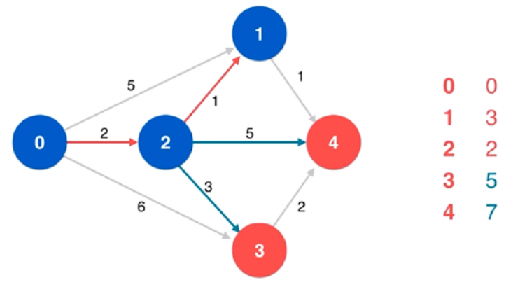

# Graph

https://labuladong.gitee.io/algo/2/20/36/


图可以玩出更多的算法，解决更复杂的问题，但**本质**上图可以认为是**多叉树的延伸**。


⾯试笔试很少出现图相关的问题，就算有，大多也是简单的遍历问题，基本上可以完全照搬**多叉树的遍历**。


像 [二分图判定](https://labuladong.gitee.io/algo/2/20/38/)、拓扑排序这一类，属于比较**基本且有用**的算法，应该比较熟练地掌握。

像 [最小生成树](https://labuladong.gitee.io/algo/2/20/41/) 和 [最短路径问题](https://labuladong.gitee.io/algo/2/20/43/)，虽然从刷题的角度用到的不多，但它们属于经典算法，**学有余力**可以掌握一下；

像**网络流**这种问题，你又不是打竞赛的，没时间的话就**没必要**学了；


-----

## 图的逻辑结构和具体实现

`G(V, E)` 图 G 的顶点集 `V`、边集 `E`。


⼀幅图是由顶点 **Vertex** 和边 **Edge** 构成的，逻辑结构如下：


```c++
class Vertex {
    int id;
    Vertex[] neighbors;
}
```


和多叉树节点完全一样


```c++
class TreeNode {
    int val;
    TreeNode[] children;
}
```


图本质上就是个高级的多叉树。适用于树的 DFS/BFS 遍历算法，全部适用于图。很少用这个 Vertex 类实现图，而是用**邻接表**和**邻接矩阵**来实现。


上图用**邻接表**和**邻接矩阵**的存储方式如下：


**邻接表**：每个节点 x 的邻居都存到一个列表里，然后把 x 和这个列表关联起来。

**邻接矩阵**：二维bool数组，如果 x 和 y 相连，则 `matrix[i][j]` 设为 `true` 


```c++
List<int> graph[5]; //grapg[x] 存储 x 的所有邻居节点

bool matrix[5][5];
```


无向图的实现方式，邻接矩阵把 `matrix[x][y]` 和 `matrix[y][x]` 都变成 true 不就⾏了；邻接表也是类似的操作，在 x 的邻居列表⾥添加 y，同时在 y 的邻居列表⾥添加 x。


在**无向图**中，如果两个顶点之间可以互相到达（可以间接），那么就称这两个顶点**连通**。如果图 `G(V, E)`的**任意两个顶点都连通**，则称图 G 为**连通图**；否则，称图 G 为**非连通图**，且称其中的**极大连通子图为连通分量**。


在**有向图**中，如果两个顶点可以各自通过一条有向路径到达另一个顶点，就称这两个顶点**强连通**。如果图 `G(V, E)` 的**任意两个顶点都强连通**，则称图 G 为**强连通图**；否则，称图为**非强连通图**，且称其中的**极大强连通子图为强连通分量**。


---

## 图的遍历

参考多叉树，多叉树的遍历框架如下

```c++
void traverse(TreeNode* root) {
    if (root == null) return;
    
    for (int i = 0; i < root.children.size(); ++i) {
        traverse(root->children[i]);
    }
    
    return;
}
```


图和多叉树**最⼤的区别是**，图是可能包含**环**的，你从图的某⼀个节点开始遍历，有可能⾛了⼀圈⼜回到这个节点。因此需要一个 **vis 数组**进行**辅助**


---

### DFS

以深度作为第一关键词，每次都是沿着路径到**不能再前进时**才**退回**到**最近的岔道口**。

```c++
DFS(u) {			//访问顶点u
    vis[u] = true;	//设置u已被访问
    
    for (从u出发能到达的所有顶点v) {	 //枚举从u出发可以到达的所有顶点v
    	if (vis[v] == false) {		//如果v未被访问
     		DFS(v);       			//递归访问v
        }
    }    
}

DFSTrave(G) {					//遍历图G
    for (G的所有顶点u) {				//对G的所有顶点u
    	if (vis[u] == false) {		//如果u未被访问
     		DFS(u);       			//访问u所在的连通块
        }
    }
}
```


**邻接表法**

```c++
const MAXV = 1000;	//最大顶点数
const INF = 1e9;	//设INF为很大的数

int n; 					// n为顶点数
vector<vector<int>> Adj[MAXV]; 	// 图G的邻接表
bool vis[MAXV] = {false}; 
```

```c++
void DFS(int u, int depth) {
    vis[u] = true;
    
    for (int i = 0; i < Adj[u].size(); ++i) {
        int v = Adj[u][i];
        if (vis[v] == false) {
            DFS(v, depth + 1);
        }
    }
}

void DFSTrave() {	//遍历图G
    for (int u = 0; u < n; ++u) {
        if (vis[u] == false) {
            DFS(u, 1);		
        }
    }
}
```


**邻接矩阵法**

```c++
const MAXV = 1000;	//最大顶点数
const INF = 1e9;	//设INF为很大的数

int n, G[MAXV][MAXV]; //n为顶点数  G为邻接矩阵
bool vis[MAXV] = {false}; 
```

```c++
void DFS(int u, int depth) {
    vis[u] = true;
    
    for (int v = 0; v < n; ++v) {
        if (vis[v] == false && G[u][v] != INF) {
            DFS(v, depth + 1);
        }
    }
}

void DFSTrave() {	//遍历图G
    for (int u = 0; u < n; ++u) {
        if (vis[u] == false) {
            DFS(u, 1);		
        }
    }
}
```


---

### BFS

以**广度**作为关键词，每次以**扩散**的方式向外访问顶点。需要一个**队列**，通过**反复取出队首顶点**，将该顶点**可到达的未曾加入过队列**的顶点全部入队，直到**队列为空**时遍历结束。

此时的 `vis[]` 数组意义为是否插入过队列 `inq[]` 

```c++
BFS(u) {			//访问顶点u
    queue q;		//定义队列q
    inq[u] = true;	//设置u已被访问
    
    while (q非空) {
        取出q的队首元素u进行访问;
        for (从u出发能到达的所有顶点v) {	 //枚举从u出发可以到达的所有顶点v
         	if (inq[v] == false) {		//如果v没有被查如果队列
                将 v 入队;
                inq[v] = true;			//设置v已被加入过队列
            }
        } 
    }       
}

BFSTrave(G) {					//遍历图G
    for (G的所有顶点u) {				//对G的所有顶点u
    	if (inq[u] == false) {		//如果u未曾加入过队列
     		BFS(u);       			//访问u所在的连通块
        }
    }
}
```


**邻接表法**

```c++
const MAXV = 1000;	//最大顶点数
const INF = 1e9;	//设INF为很大的数

int n; 					// n为顶点数
vector<vector<int>> Adj[MAXV]; 	// 图G的邻接表
bool inq[MAXV] = {false}; 
```

```c++
void BFS(int u) {
    queue<int> que;
    que.push(u);
    inq[u] = true;
    
    while (!que.empty()) {
        int u = que.front(); que.pop();
        
        for (int i = 0; i < Adj[u].size(); ++i) {
            int v = Adj[u][i];
            if (inq[v] == false) {
                q.push(v);
                inq[u] = true;
			}                
        }
    }    
}

void BFSTrave() {	//遍历图G
    for (int u = 0; u < n; ++u) {
        if (inq[u] == false) {
            BFS(u);		
        }
    }
}
```


**邻接矩阵法**

```c++
const MAXV = 1000;	//最大顶点数
const INF = 1e9;	//设INF为很大的数

int n, G[MAXV][MAXV]; //n为顶点数  G为邻接矩阵
bool inq[MAXV] = {false}; 
```

```c++
void BFS(int u) {
    queue<int> que;
    que.push(u);
    inq[u] = true;
    
    while (!que.empty()) {
        int u = que.front(); que.pop();
        
        for (int v = 0; v < n; ++v) {
            if (inq[v] == false && G[u][v] != INF) {
                que.push(v);
                inq[v] = true;
            }
        }
    }
}

void BFSTrave() {	//遍历图G
    for (int u = 0; u < n; ++u) {
        if (inq[u] == false) {
            DFS(u, 1);		
        }
    }
}
```


[797. 所有可能的路径（中等）](https://leetcode-cn.com/problems/all-paths-from-source-to-target/)


---

## 拓扑排序

https://labuladong.gitee.io/algo/2/20/37/

环检测和拓扑排序（编译器循环引用检测就是类似的算法）

### 207. 课程表I


### 210. 课程表 II


见 D_BFS 里 210. 课程表 II


---

### 有向图的环检测


---

## 二分图

https://labuladong.gitee.io/algo/2/20/38/


[785. 判断二分图（中等）](https://leetcode-cn.com/problems/is-graph-bipartite)

[886. 可能的二分法（中等）](https://leetcode-cn.com/problems/possible-bipartition)


---

## DIJKSTRA 算法

https://labuladong.gitee.io/algo/2/20/48/

[743. 网络延迟时间（中等）](https://leetcode-cn.com/problems/network-delay-time)

[1514. 概率最大的路径（中等）](https://leetcode-cn.com/problems/path-with-maximum-probability)

[1631. 最小体力消耗路径（中等）](https://leetcode-cn.com/problems/path-with-minimum-effort)


### 普通版单源最短路径算法Dijkstra

主要思想是贪心

将所有节点分成两类：**已确定从起点到当前点的最短路长度的节点**，以及**未确定从起点到当前点的最短路长度的节点**（下面简称「未确定节点」和「已确定节点」）。


每次从「未确定节点」中取一个与起点距离最短的点，将它归类为「已确定节点」，并用它「更新」从起点到其他所有「未确定节点」的距离。直到所有点都被归类为「已确定节点」

> 用节点 A「更新」节点 B 的意思是，用起点到节点 A 的最短路长度加上从节点 A 到节点 B 的边的长度，去比较起点到节点 B 的最短路长度，如果前者小于后者，就用前者更新后者。这种操作也被叫做「**松弛**」。
>
> 


有向带权图，圆圈中为节点序号，箭头上为边权，右侧为所有点距离源点 `0` 的距离。


将顶点 `0` 进行标识，并作为点 x，更新其到其他所有点的距离。一轮循环结束


将顶点 `2` 进行标识，并作为新的点 x，更新。我们看到，原本点 `1` 的最短距离为 `5`，被更新为了 `3`。同理还更新了点 `3` 和点 `4` 的最短距离。




将顶点 1 进行标识，并作为新的点 x，同样更新了点 4 到源点的最短距离。


再分别标识点 `4` 和点 `3`，循环结束。


**枚举**

```c++
int networkDelayTime(vector<vector<int>>& times, int n, int k) {
    const int inf = INT_MAX / 2;
    vector<vector<int>> g(n + 1, vector<int>(n + 1, inf));

    for (auto &t : times) {
        int x = t[0], y = t[1];
        g[x][y] = t[2];
    }

    vector<int> dist(n + 1, inf);   // 从起点到 i 的最短距离
    dist[k] = 0;    // 自身到自身为0
    vector<int> used(n + 1);

    for (int i = 1; i <= n; ++i) {
        int x = -1;
        for (int y = 1; y <= n; ++y) {  // 循环找出离当前flag节点最近的点x.   i=1 时找出来的是 k 即起点
            if (!used[y] && (x == -1 || dist[y] < dist[x])) {
                x = y;
            }
        }

        used[x] = true;
        for (int y = 1; y <= n; ++y) {  // 更新所有最短距离
            dist[y] = min(dist[y], dist[x] + g[x][y]);  // 从起点到节点flag节点x的最短距离 dist[x]
        }
    }

    int ans = *max_element(++dist.begin(), dist.end());
    return ans == inf ? -1 : ans;
}
```

枚举写法的复杂度如下：

时间复杂度：$O(n^2+m)$，其中 m 是数组 times 的长度。

空间复杂度：$O(n^2)$。邻接矩阵需占用 $O(n^2)$ 的空间。

m 为 **边数**，n 为**点数**

m最大6000，n最大100，最坏时间复杂度 O(10000 + 6000) = O(16000)


**小根堆**

```c++
int networkDelayTime(vector<vector<int>>& times, int n, int k) {
    const int inf = INT_MAX / 2;
    vector<vector<pair<int, int>>> g(n + 1);    // 邻接表

    /*建图*/
    for (auto &t : times) {
        g[t[0]].emplace_back(t[1], t[2]);
    }

    vector<int> dist(n + 1, inf);
    dist[k] = 0;


    // 默认以 pair 的 first 元素来排序 greater<>表示数字小的优先级越大 less<>表示数字大的优先级越大
    // 等价于 priority_queue<pair<int, int>, vector<pair<int, int>>, greater<pair<int, int>>> q;
    priority_queue<pair<int, int>, vector<pair<int, int>>, greater<>> q;
    q.emplace(0, k);

    while (!q.empty()) {
        auto p = q.top(); q.pop();

        int time = p.first, x = p.second;   // 得到当前优先队列中头部元素，具有最短路径的属性
        //if (dist[x] < time) continue; // 没有设置访问数组，所以有重复节点入队列，如果后续对已经在队列中的节点的time进行了更新，那么之前队列中该节点存储的time值就失效了

        for (auto &e : g[x]) {
            int y = e.first, d = dist[x] + e.second;
            if (d < dist[y]) {
                dist[y] = d;
                q.emplace(d, y);
            }
        }

    }

    int ans = *max_element(++dist.begin(), dist.end());
    return ans == inf ? -1 : ans;

}
```

堆的写法复杂度如下：

时间复杂度：$O(m\log m)$，其中 m 是数组 times 的长度。即**边数**

空间复杂度：$O(n+m)$。

m 为 **边数**，n 为**点数**

m最大6000，n最大100，最坏时间复杂度 O(6000 log 6000) = O(22668)


值得注意的是，由于本题**边数远大于点数**，是一张**稠密图**，因此在运行时间上，**枚举写法要略快于堆的写法**。


---

### 五种最短路径算法总结

https://leetcode-cn.com/problems/network-delay-time/solution/dirkdtra-by-happysnaker-vjii/


### 单源最短路径的几种基础解法

https://leetcode-cn.com/problems/network-delay-time/solution/wang-luo-yan-chi-shi-jian-dan-yuan-zui-d-m1m3/


## 单源算法——Dirkdtra算法(使用最广且必须掌握的算法)

每次找到离源点最近的一个点，以该点为中心，更新源点到其他源点的最短路径，贪心的思想。该算法无法判断是否存在负权环路，如果存在，算法将失效。算法的正确性不作证明，可参考力扣官方题解。


```c++
class Solution {
public:
    int networkDelayTime(vector<vector<int>>& times, int n, int k) {
        vector<vector<int>> g(n + 1, vector<int>(n + 1, INT_MAX / 2));//键图
        //dis[i]代表源点到点i的最短路，初始化为INT_MAX / 2防止溢出
        vector<int> dis(n + 1, INT_MAX / 2), visit(n + 1, 0);
        /*初始化邻接矩阵与dis数组*/
        for (auto& it : times) {
            g[it[0]][it[1]] = it[2]; //g[i][j]表示i到j的权重
            //如果起点为源点，更新dis数组
            //邻接源点的点一定是最短的
            //上面的描述是错的，下面的代码也是不需要的，看到这里请思考思考为什么
            if (it[0] == k) {
                dis[it[1]] = it[2];
            }
        }
        /*源点k无需访问,dis[0]是个不需要的值,防止后面查找最大值错误*/
        dis[k] = 0, visit[k] = 1, dis[0] = 0;
        for (int cnt = 1; cnt < n; cnt++) {
            /*找到离源点最短的点，并记录*/
            int mi = INT_MAX / 2, book = 0;
            for (int i = 1; i <= n; i++) {
                if (dis[i] < mi && !visit[i]) {
                    mi = dis[i];
                    book = i;
                }
            }

            /*如果源点无法到达任何一个点,直接返回*/
            if (mi == INT_MAX / 2)    return -1;
            visit[book] = 1;//标记

            /*松弛操作,以book为中心点进行扩展*/
            for (int i = 1; i <= n; i++) {
                /*如果book到i不为无穷，即有一条边的话，进行松弛操作*/
                if (g[book][i] != INT_MAX / 2 && dis[i] > dis[book] + g[book][i]) {
                    dis[i] = dis[book] + g[book][i];
                }               
            }
        }
        /*答案处理*/
        int ret = *max_element(dis.begin(), dis.end());
        return ret == INT_MAX / 2 ? -1 : ret;
    }
};
```

**时间复杂度：O(N^2)**
**空间复杂度：O(N^2)**


---

### c++/python3/java （1）朴素dijkstra算法 （2）最小堆+visited+dijkstra算法 （3）最小堆+dijkstra算法 （4）spfa算法--队列实现 （5）floyd算法

https://leetcode-cn.com/problems/network-delay-time/solution/cpython3java-1po-su-dijkstrasuan-fa-2zui-ks36/


---

## 并查集算法详解

https://labuladong.gitee.io/algo/2/20/39/

[323. 无向图中的连通分量数目（中等）](https://leetcode-cn.com/problems/number-of-connected-components-in-an-undirected-graph/)

[130. 被围绕的区域（中等）](https://leetcode-cn.com/problems/surrounded-regions/)

[990. 等式方程的可满足性（中等）](https://leetcode-cn.com/problems/satisfiability-of-equality-equations/)


---

## KRUSKAL 最小生成树算法


[261. 以图判树（中等）](https://leetcode-cn.com/problems/graph-valid-tree/)

[1135. 最低成本联通所有城市（中等）](https://leetcode-cn.com/problems/connecting-cities-with-minimum-cost/)

[1584. 连接所有点的最小费用（中等）](https://leetcode-cn.com/problems/min-cost-to-connect-all-points/)


---

## PRIM 最小生成树算法

[1135. 最低成本联通所有城市（中等）](https://leetcode-cn.com/problems/connecting-cities-with-minimum-cost/)

[1584. 连接所有点的最小费用（中等）](https://leetcode-cn.com/problems/min-cost-to-connect-all-points/)


--

## 名流问题

[277. 搜索名人（中等）](https://leetcode-cn.com/problems/find-the-celebrity/)