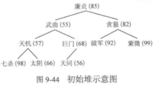
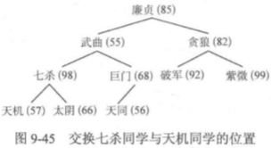
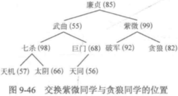
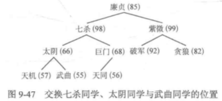
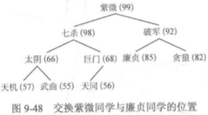
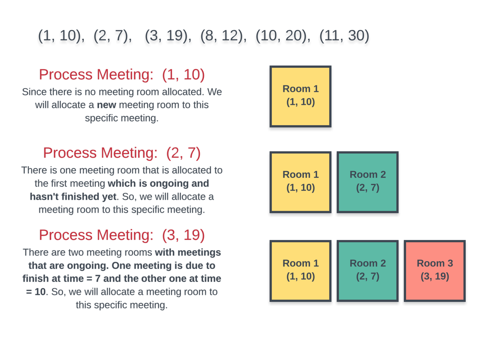
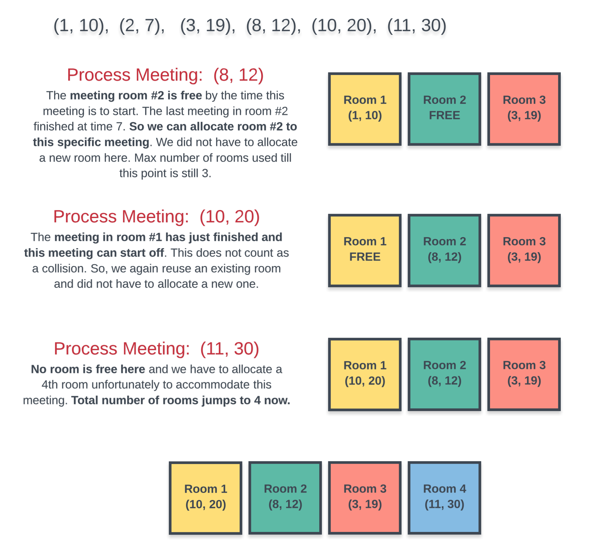

# 优先队列

许多应用程序都需要处理有序的元素，但不一定要求它们全部有序，或是不一定要一次就将它
们排序。很多情况下我们会收集一些元素，处理当前键值最大的元素，然后再收集更多的元素，再
处理当前键值最大的元素，如此这般。例如，你可能有一台能够同时运行多个应用程序的电脑（或
者手机）。这是通过为每个应用程序的事件分配一个优先级，并总是处理下一个优先级最高的事件
来实现的。例如，绝大多数手机分配给来电的优先级都会比游戏程序的高。
在这种情况下，一个合适的数据结构应该支持两种操作：删除最大元素和插入元素。这种数据
类型叫做优先队列。优先队列的使用和队列（删除最老的元素）以及栈（删除最新的元素）类似，
但高效地实现它则更有挑战性。
在本节中，简单地讨论优先队列的基本表现形式（其一或者两种操作都能在线性时间内完成）
之后，我们会学习基于二叉堆数据结构的一种优先队列的经典实现方法，用数组保存元素并按照一
定条件排序，以实现高效地（对数级别的）删除最大元素和插入元素操作。
优先队列的一些重要的应用场景包括模拟系统，其中事件的键即为发生的时间，而系统需要按
照时间顺序处理所有事件；任务调度，其中键值对应的优先级决定了应该首先执行哪些任务；数值
计算，键值代表计算错误，而我们需要按照键值指定的顺序来修正它们。在第 6 章中我们会学习一
个具体的例子，展示优先队列在粒子碰撞模拟中的应用。
通过插入一列元素然后一个个地删掉其中最小的元素，我们可以用优先队列实现排序算法。一
种名为堆排序的重要排序算法也来自于基于堆的优先队列的实现。稍后在本书中我们会学习如何用
优先队列构造其他算法。在第 4 章中我们会看到优先队列如何恰到好处地抽象若干重要的图搜索算
法；在第 5 章中，我们将使用本节所示的方法开发出一种数据压缩算法。这些只是优先队列作为算
法设计工具所起到的举足轻重的作用的一部分例子。


# 堆

## 1. 定义与基本操作

​	堆是一颗**完全二叉树**,树中的每个结点的值都**大于等于**左右孩子结点的值(**大顶堆**),小于等于左右孩子结点的值(**小顶堆**).一般用于**优先队列**的实现。默认为大顶堆

对一个给定的初始序列 {85 55 82 57 68 92 99 98 66 56}，将他们按照树的层序从上往下、从左往右依次摆放，就会形成初始堆



从最后的元素开始，从下往上，从右往左。当前为 X，让 X 与 X 的子节点进行比较， 如果子节点比他大，则将子节点与 X 交换，交换后 X 再与其新的子节点比较，直到 X 比其子节点大。

叶子节点都没有子节点，从下往上，从右往左，第一个有子节点的是巨门。68 > 56 不需要交换。

天机 57 < 七杀 98，交换得到



贪狼 82 < 紫微 99，交换得到



武曲55 < 七杀 98，交换后还 < 太阴 66，再交换得到



廉贞 85 < 紫微 99，交换后还 < 破军 85，再交换得到 



```C++
//数组存储完全二叉树			结点按层序存储于数组中
//第一个结点将存储与数组的1号位		数组i号位表示的结点的左孩子就是2i号位   右孩子2i+1
const int maxn=100;
//heap为堆,n为元素个数
int heap[maxn],n=10;
```


每次调整都是把结点从上往下的调整：总是将当前结点 V 与它的左右孩子比较，加入孩子中存在权值比结点 V 的权值大的，就将其中权值最大的那个孩子结点与结点 V 交换；交换完毕后继续让结点 V 和孩子比较，直到结点 V 的孩子的权值都比结点 V 的权值小，或结点 V 为叶子结点


```c++
// 对heap数组在[low,high]范围进行向下调整   O(logN)
// 其中low为欲调整结点的数组下标,high一般为堆的最后一个元素的数组下标
void downAdjust(int lo, int hi) {
    int i = lo, j = i * 2;  // i 为欲调整结点，j为其左孩子
    while (j <= hi) {   // 存在孩子结点
        //如果右孩子存在,且右孩子的值大于左孩子
        if (j + 1 <= hi && heap[j + 1] > heap[j]) {
            j++;
        }
		
        //如果孩子中最大的权值比欲调整结点i大
        if (heap[j] > heap[i]) {
            swap(heap[j], heap[i]);
            i = j;	//保持i为欲调整结点,j为i的左孩子
            j = i * 2;
        } else {
            break;	//孩子的权值均比欲调整结点i小,调整结束
        }
    }
}
```

**建堆**。假设序列中元素的个数 $n$，由于完全二叉树的叶子结点个数为 $ \lceil \frac{\mathrm{n}}{2}\rceil $，因此数组下标在 $[1,\lfloor\frac{\mathrm{n}}{2}\rfloor]$ 范围内的结点都是非叶子结点。从 $\lfloor\frac{\mathrm{n}}{2}\rfloor$ 号位开始倒着枚举结点,.**保证每个结点都是以其为根结点的子树中的权值最大的结点**


```c++
//建堆  O(N)
void createHeap(){
    for (int i = n / 2; i >= 1; i--){
        downAdjust(i, n);
    }
}
```


删除堆中的最大元素，只需要最后一个元素覆盖堆顶元素，然后对根结点进行调整。

```C++
//删除堆顶元素 O(logN)
void deleteTop(){
    heap[1] = heap[n--];
    downAdjust(1, n);
}
```


把想要添加的元素放在数组最后，然后向上取整操作。如果权值大，就交换其父亲结点，直到达堆顶或是父亲结点的权值较大为止。

```c++
// 对 heap 数组在 [low, high] 范围进行向上调整 O(logN)
// 其中 low 为一般设为 1, high 表示欲调整结点的数组下标
void upAdjust(int lo, int hi) {
    int i = hi, j = i / 2;	//i 为欲调整结点,j 为父亲

    while (j >= lo) {	//父亲在 [low, high] 范围内
        //父亲权值小于欲调整结点i的权值
        if (heap[j] < heap[i]) {	
            swap(heap[j], heap[i]);
            i = j;
            j = i / 2;
        } else {
            break;
        }
    }
}

void insert(int x){
    heap[++n] = x;	//元素个数+1
    upAdjust(1, n);	//向上调整新加入的结点 n
}
```


---

## 2. 堆排序

使用堆结构对一个序列进行排序。

堆顶元素最大。建堆完毕后，取出堆顶元素，然后将堆的最后一个元素替换至堆顶，再进行一次针对堆顶元素的向下取整。直到堆中只有一个元素为止。

为了节省空间，可以**倒着遍历数组**，假设当前访问到 $i$ 号位，那么将堆顶元素与 $i$ 号位的元素交换，接着在 $[1,i-1]$ 范围内对堆顶元素进行一次向下调整即可。

```c++
//堆排序
void heapSort(){
    createHeap();	//建堆
    for (int i = n; i > 1; i--){		//倒着枚举,直到堆中只有一个元素
        swap(heap[i], heap[1]);	//交换heap[i]与堆顶
        downAdjust(1, i - 1);		//调整堆顶
    }
}
```


---

## 253. 会议室 II

我们无法按任意顺序处理给定的会议。处理会议的最基本方式是按其 开始时间 顺序排序，这也是我们采取的顺序。


考虑下面的会议时间 (1, 10), (2, 7), (3, 19), (8, 12), (10, 20), (11, 30) 。前一部分表示会议开始时间，后一部分表示结束时间。按照会议开始时间顺序考虑。图一展示了前三个会议，每个会议都由于冲突而需要新房间。



后面的三个会议开始占用现有的房间。然而，最后的会议需要一个新房间。总而言之，我们需要四个房间来容纳所有会议。



排序过程很容易，但对每个会议，我们如何高效地找出是否有房间可用？任意时刻，我们都有多个可能占用的房间，只要我们能在有新会议需要时就找到一个空闲房间，我们并不需要关心到底有哪些房间是空闲的。

> 朴素的方法是，每当有新会议时，就遍历所有房间，查看是否有空闲房间。

但是,通过使用优先队列（或最小堆）堆数据结构,我们可以做得更好。

我们可以将所有房间保存在最小堆中,**堆中的键值是会议的结束时间**，而不用手动迭代已分配的每个房间并检查房间是否可用。

这样，每当我们想要检查有没有 任何 房间是空的，只需要检查最小堆堆顶的元素，它是最先开完会腾出房间的。

**如果堆顶的元素的房间并不空闲，那么其他所有房间都不空闲。**这样，我们就可以直接开一个新房间。


**算法**

- 按照 开始时间 对会议进行排序。
- 初始化一个新的 最小堆，将第一个会议的结束时间加入到堆中。我们只需要记录会议的结束时间，告诉我们什么时候房间会空。
- 对每个会议，检查堆的最小元素（即堆顶部的房间）是否空闲。
  - 若房间空闲，则从堆顶拿出该元素，将其改为我们处理的会议的结束时间，加回到堆中。
  - 若房间不空闲。开新房间，并加入到堆中。
- 处理完所有会议后，堆的大小即为开的房间数量。这就是容纳这些会议需要的最小房间数。


```c++
	static bool cmp(const vector<int> &v1, const vector<int> &v2) {
    return v1[0] < v2[0];
}

int minMeetingRooms(vector<vector<int>>& intervals) {
    sort(intervals.begin(), intervals.end(), cmp);  // 按照 开始时间 对会议进行排序 肯定是先
    // 不能按照结束时间对会议进行排序  hack [[2,15],[36,45],[9,29],[16,23],[4,9]]
    int cnt = 1;

    priority_queue<int, vector<int>, greater<int>> pq; //小顶堆 greater大了就沉下去
    pq.emplace(intervals[0][1]);

    for (int i = 1; i < intervals.size(); ++i) {
        int start = intervals[i][0], end = intervals[i][1];
        int q = pq.top();

        if (start >= q) pq.pop();
        else cnt++;

        pq.emplace(end);
    }

    return cnt;

}
```


