# 链表


## 基础知识

链表是一种通过**指针串联**在一起的**线性结构**，每一个节点是由两部分组成，一个是**数据域**，一个是**指针域**（存放指向下一个节点的指针），**最后**一个节点的指针域指向**null**（空指针的意思）。


---

### 链表的类型

#### 单链表

链接的入口点称为列表的头结点也就是head。

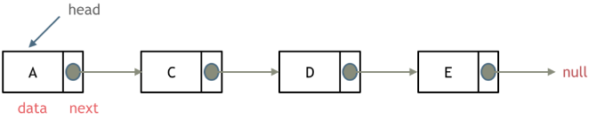


---

#### 双链表

单链表中的节点只能指向节点的下一个节点。

双链表：每一个节点有**两个指针域**，一个指向下一个节点，一个指向上一个节点。

双链表 既可以向前查询也可以向后查询。

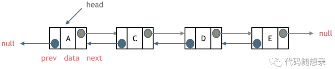


---

#### 循环链表

循环链表，顾名思义，就是链表首尾相连。

循环链表可以用来解决约瑟夫环问题。

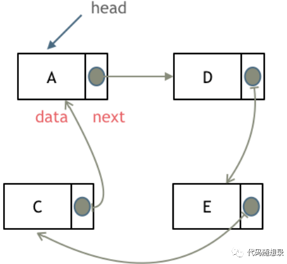


---

### 链表的存储方式

了解完链表的类型，再来说一说链表在内存中的存储方式。

**数组**是在**内存中**是连续分布的，但是**链表**在**内存**中可**不**是**连续**分布的。

链表是通过指针域的指针链接在内存中各个节点。

所以链表中的节点在内存中不是连续分布的 ，而是散乱分布在内存中的某地址上，分配机制取决于操作系统的内存管理。

如图所示：

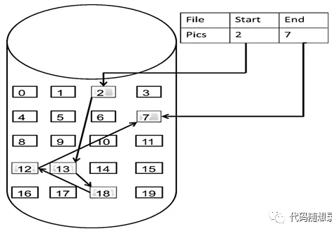

这个链表起始节点为2， 终止节点为7，  各个节点分布在内存个不同地址空间上，通过指针串联在一起。

---

### 链表的定义

单链表

```c++
struct ListNode {
    int val;								//数据域
    ListNode *next;							//指针域
    ListNode(int x):  val(x), next(NULL) {} //构造函数
}
```

如果不定义构造函数使用默认构造函数的话，在初始化的时候就不能直接给变量赋值！

```c++
//未定义前
ListNode* head = new ListNode();
head->val = 5;

//定义后
ListNode* head = new ListNode(5);
```


---

### 链表的操作

#### 删除节点

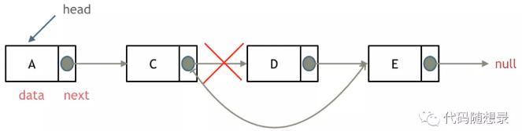

只要将 C 节点的 `next`  指针，指向 `E`节点就可以了。

那有同学说了，D 节点不是依然存留在内存里么？只不过是没有在这个链表里而已。

是这样的，所以在 C++ 里最好是再手动释放这个 D 节点，释放这块内存。

其他语言例如 Java、Python，就有自己的内存回收机制，就不用自己手动释放了。


---

#### 添加节点

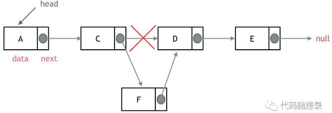

可以看出链表的增添和删除都是 `O(1)` 操作，也不会影响到其他节点。


**注意**，要是删除第五个节点 E ，需要从头节点查找到第四个节点通过 `next` 指针进行删除操作，查找的时间复杂度是 `O(n)` 。


### 性能分析

|      | 插入/删除 | 查询 |             适用场景             |
| :--: | :-------: | :--: | :------------------------------: |
| 数组 |   O(n)    | O(1) |  数据量固定，频繁查询，较少增删  |
| 链表 |   O(1)    | O(n) | 数据量不固定，较少查询，频繁增删 |


数组在定义的时候，长度就是固定的，如果想改动数组的长度，就需要重新定义一个新的数组。

链表的长度可以是不固定的，并且可以**动态增删**， 适合数据量不固定，频繁增删，较少查询的场景。


---

## 虚拟头节点

链表操作中，可以使用原链表来直接进行删除操作，也可以设置一个**虚拟头结点**在进行删除操作


### **203. 移除链表元素**

```c++
ListNode* removeElements(ListNode* head, int val) {
    ListNode* dummyHead = new ListNode(0);
    dummyHead->next = head;
    ListNode* cur = dummyHead;

    while (cur->next != NULL) {
        if (cur->next->val == val) {
            ListNode* tmp = cur->next;
            cur->next = cur->next->next;
            delete tmp;
        } else {
            cur = cur->next;
        }
    }

    return dummyHead->next;
}
```


## 链表设计

### **707. 设计链表**

```c++
class MyLinkedList {
public:
    // 定义链表节点结构体
    struct LinkedNode {
        int val;
        LinkedNode* next;
        LinkedNode(int val):val(val), next(nullptr){}
    };

    // 初始化链表
    MyLinkedList() {
        _dummyHead = new LinkedNode(0); // 这里定义的头结点 是一个虚拟头结点，而不是真正的链表头结点
        _size = 0;
    }

    // 获取到第index个节点数值，如果index是非法数值直接返回-1， 注意index是从0开始的，第0个节点就是头结点
    int get(int index) {
        if (index > (_size - 1) || index < 0) {
            return -1;
        }
        LinkedNode* cur = _dummyHead->next;
        while(index--){ // 如果--index 就会陷入死循环
            cur = cur->next;
        }
        return cur->val;
    }

    // 在链表最前面插入一个节点，插入完成后，新插入的节点为链表的新的头结点
    void addAtHead(int val) {
        LinkedNode* newNode = new LinkedNode(val);
        newNode->next = _dummyHead->next;
        _dummyHead->next = newNode;
        _size++;
    }

    // 在链表最后面添加一个节点
    void addAtTail(int val) {
        LinkedNode* newNode = new LinkedNode(val);
        LinkedNode* cur = _dummyHead;
        while(cur->next != nullptr){
            cur = cur->next;
        }
        cur->next = newNode;
        _size++;
    }

    // 在第index个节点之前插入一个新节点，例如index为0，那么新插入的节点为链表的新头节点。
    // 如果index 等于链表的长度，则说明是新插入的节点为链表的尾结点
    // 如果index大于链表的长度，则返回空
    void addAtIndex(int index, int val) {
        if (index > _size) {
            return;
        }
        LinkedNode* newNode = new LinkedNode(val);
        LinkedNode* cur = _dummyHead;
        while(index--) {
            cur = cur->next;
        }
        newNode->next = cur->next;
        cur->next = newNode;
        _size++;
    }

    // 删除第index个节点，如果index 大于等于链表的长度，直接return，注意index是从0开始的
    void deleteAtIndex(int index) {
        if (index >= _size || index < 0) {
            return;
        }
        LinkedNode* cur = _dummyHead;
        while(index--) {
            cur = cur ->next;
        }
        LinkedNode* tmp = cur->next;
        cur->next = cur->next->next;
        delete tmp;
        _size--;
    }

    // 打印链表
    void printLinkedList() {
        LinkedNode* cur = _dummyHead;
        while (cur->next != nullptr) {
            cout << cur->next->val << " ";
            cur = cur->next;
        }
        cout << endl;
    }
private:
    int _size;
    LinkedNode* _dummyHead;

};
```


## 环形链表-快慢指针

### **142. 环形链表II**

```c++
ListNode *detectCycle(ListNode *head) {
    if (head == NULL || head->next == NULL) {
        return NULL;
    }
    ListNode* cur = head;
    ListNode* slow = head->next;
    ListNode* fast = head->next->next;

    while (slow != fast && fast != NULL && fast->next != NULL) {
        slow = slow->next;
        fast = fast->next->next;
    }

    if(fast == NULL || fast->next == NULL) {
        return NULL;
    }

    while (cur != slow) {
        cur = cur->next;
        slow = slow->next;
    }
    return slow;
}
```


- **解释为什么一定是慢指针跑完一圈之前被快指针追上：**

我们考虑，当慢指针第一次到入口的时候快指针的位置 


1.快指针在后：那快指针只要几步就能追上 

2.快慢指针重合，那就直接返回了，慢指针没有走的机会 

3.快指针在前，考虑极端情况，快指针就在慢指针的next


情况3其实跟赛跑一个道理，如果一个人速度是你的两倍，你们两个同是出发，相遇时候一定是在起点相遇，但是此时，比你跑的快的不讲武德，起跑点还比你靠前，所以肯定是在你跑完一圈之前他就追上你了

如果遇到一个人速度是你的两倍，你想在被抓到之前尽可能的跑长一些，那只能让跑的比你快的人起跑的时候在你的脸上（我们认为重合是还没跑就被抓了）

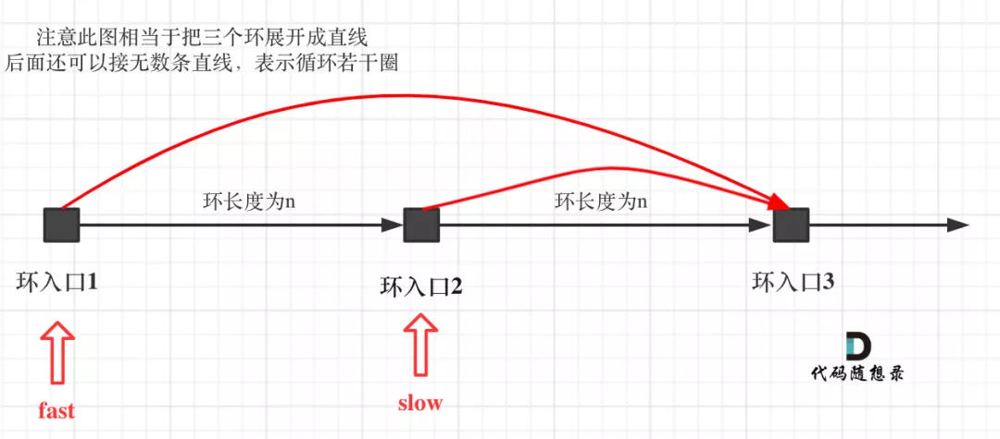


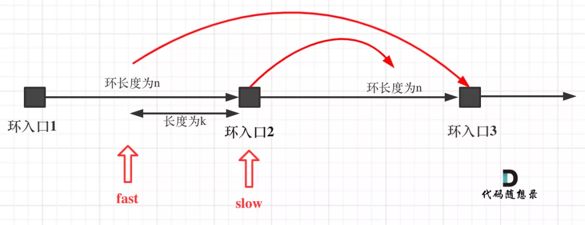


- 解释为什么是 2 倍速度/解释为什么 fast 不能跳过去呢

**fast相对于slow是一次移动一个节点，所以不可能跳过去**


- **从头结点出发一个指针，从相遇节点也出发一个指针，这两个指针每次只走一个节点， 那么当这两个指针相遇的时候就是 环形入口的节点**

把环铺开，因为速度为 2 倍关系，计算公式为


slow 指针走过的节点数为: `x + y`， fast 指针走过的节点数：`x + y + n (y + z)`，n 为 fast 指针在环内走了 n 圈才遇到 slow 指针， （y+z）为 一圈内节点的个数 A。其中 n 必为 1。

因为 fast 指针是一步走两个节点，slow 指针一步走一个节点， 所以 fast 指针走过的节点数 = slow 指针走过的节点数 * 2：

```
(x + y) * 2 = x + y + n (y + z)
```

有 n = 1，则公式就化解为 `x = z`


- 为什么 n 一定是 1?
设环的长度为 L，当慢指针刚进入环时，慢指针需要走 L 步(即 L 秒)才能走完一圈，此时快指针距离慢指针的最大距离为 L-1，我们再次以慢指针为参考系，如上所说，快指针在按照1节点/秒的速度在追赶慢指针，所以肯定能在 L 秒内追赶到慢指针。


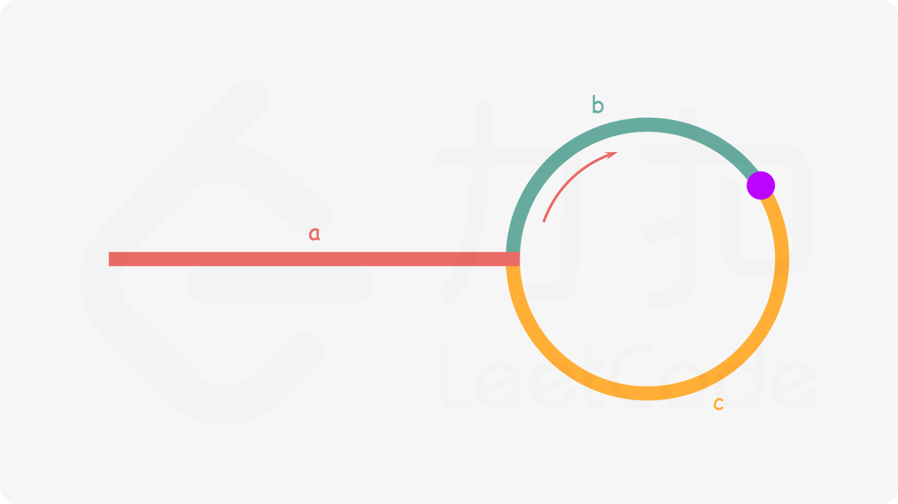

slow 走的路: a + b，
fast 走的路: a + b + n(b + c)，
其中 n 必为 1，
在 b 相遇，因为 fast 速度是 slow 的两倍，则有：a + b + n(b + c) = (a + b) * 2，求解出来 c = a，
那么 slow 再走 c = a 步，就是相交节点，找另一个指针 cur 从 head 走 a 步，cur == slow 时，即为环的起点


---

## 总结

- 链表的种类主要为：单链表，双链表，循环链表
- 链表的存储方式：链表的节点在内存中是分散存储的，通过指针连在一起。
- 链表是如何进行增删改查的。
- 数组和链表在不同场景下的性能分析。


链表的一大问题就是操作当前节点必须要找前一个节点才能操作。这就造成了，头结点的尴尬，因为头结点没有前一个节点了。

**每次对应头结点的情况都要单独处理，所以使用虚拟头结点的技巧，就可以解决这个问题**


---

## 61. 旋转链表

先把他变成环，然后计算出要移动的距离

- 变成环，找到末端节点，连接头尾，捎带计算链表长度
- 因为每个节点向右移动，相当于头节点向左移动，与链表方向相反，所以要计算移动的距离 = size - k


```c++
ListNode* rotateRight(ListNode* head, int k) {
    if (head == nullptr) return nullptr;

    ListNode *root = head, *cur = head;

    int size = 1;
    while (cur->next != nullptr) {
        cur = cur->next;
        size++;
    }
    cur->next = head;  //成环

    int num = size - k % size;//计算正向移动的格子

    while(num--) {
        if (num == 0) {
            ListNode* now = root; 
            root = root->next;
            now->next = nullptr;
            break;
        }

        root = root->next;
    }

    return root;
}
```
> + 时间复杂度: O(N)，N 为链表长度
> + 空间复杂度: O(N)


---

## 109. 有序链表转换二叉搜索树

将给定的有序链表转换为二叉搜索树的第一步是确定根节点。

由于我们需要构造出平衡的二叉树，因此比较直观的想法是让根节点**左子树中的节点个数**与右子树中的节点个数**尽可能接近**。这样一来，左右子树的高度也会非常接近，可以达到高度差绝对值不超过 1 的题目要求。

如何找出这样的一个根节点呢？我们可以找出链表元素的**中位数**作为根节点的值。

> 这里对于中位数的定义为：如果链表中的元素个数为奇数，那么唯一的中间值为中位数；如果元素个数为偶数，那么唯二的中间值都可以作为中位数，而不是常规定义中二者的平均值。


根据中位数的性质，链表中小于中位数的元素个数与大于中位数的元素个数要么相等，要么相差 11。此时，小于中位数的元素组成了左子树，大于中位数的元素组成了右子树，它们分别对应着有序链表中连续的一段。

在这之后，我们使用分治的思想，继续递归地对左右子树进行构造，找出对应的中位数作为根节点，以此类推。


寻找链表的中间点有个小技巧：

快慢指针起初都指向头结点，分别一次走两步和一步，当快指针走到尾节点时，慢指针正好走到链表的中间。断成两个链表，分而治之。

为了断开，我们需要保存慢指针的前一个节点，因为单向链表的结点没有前驱指针。

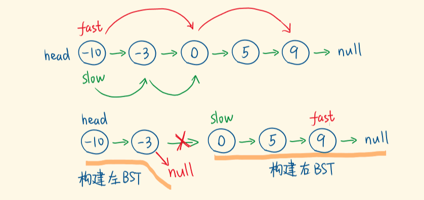


- 保存到数组，获取数组中点：O(1)
- 每次快慢指针获取链表中点：O(N)

```c++
class Solution {
public:
    TreeNode* buildAVL(vector<ListNode*> &vecs, int start, int end) {
        if (start > end) return nullptr;
		
        //start + end >> 1 和 start + end + 1 >> 1 针对偶数链表，一个选择前边作为根节点，另一个选择后边作为根节点，都对
        int mid = start + end >> 1;
        TreeNode* root = new TreeNode(vecs[mid]->val);
        root->left = buildAVL(vecs, start, mid);
        root->right = buildAVL(vecs, mid + 1, end);
        return root;    
    }

    TreeNode* sortedListToBST(ListNode* head) {
        vector<ListNode*> vecs;

        for (ListNode* cur = head; cur != nullptr; cur = cur->next) {
            vecs.push_back(cur);
        }

        TreeNode* root = buildAVL(vecs, 0, vecs.size() - 1);

        return root;
    }
};
```


### 快慢指针

```c++
ListNode* getMid(ListNode* left, ListNode* right) {
    ListNode *slow = left, *fast = left;

    while (fast != right && fast->next != right) {
        slow = slow->next;
        fast = fast->next->next;
    }

    return slow;
}

TreeNode* buildAVL(ListNode* left, ListNode* right) {
    if (left == right) return nullptr;
    ListNode* midNode = getMid(left, right);
    TreeNode* root = new TreeNode(midNode->val);
    root->left = buildAVL(left, midNode);
    root->right = buildAVL(midNode->next, right);
    return root;    
}

TreeNode* sortedListToBST(ListNode* head) {
    TreeNode* root = buildAVL(head, nullptr);

    return root;
}
```


## 160. 相交链表

其实就是一个公式推导

- 链表A，不相交前长度为 a，相交后长度为 c，总长度为 a+c
- 链表B，不相交前长度为 b，相交后长度为 c，总长度为 b+c

那么 A 走完继续走 b 步，B 走完继续走 a 步，则共走了 a + b + c，相交。

> 如果两链表不相交，那么 c 为 0，则共走了 a + b 步，到达 nullptr

```c++
ListNode *getIntersectionNode(ListNode *headA, ListNode *headB) {
    if (headA == nullptr || headB == nullptr) {
        return nullptr;
    }

    ListNode *acur = headA, *bcur = headB;

    while (acur != bcur) {
        acur = acur == nullptr ? headB : acur->next;
        bcur = bcur == nullptr ? headA : bcur->next;
    }

    return acur;
}
```

> - 时间复杂度: O(M+N)
> - 空间复杂度: O(1)


---

## 1206. 设计跳表

跳跃链表，允许以平均时间复杂度 $log(N)$ 级别的快速查询、插入和删除一个**有序连续**元素的数据链表。

且每一层链表中的元素是前一层链表元素的子集。

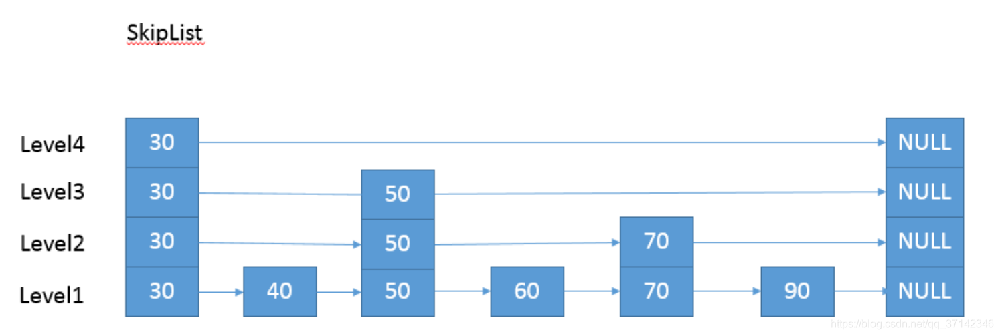


---

### 建造

如果链表的结点数量非常多，我们就可以抽出更多的索引层级，每一层索引的结点数量都是低层索引的一半。

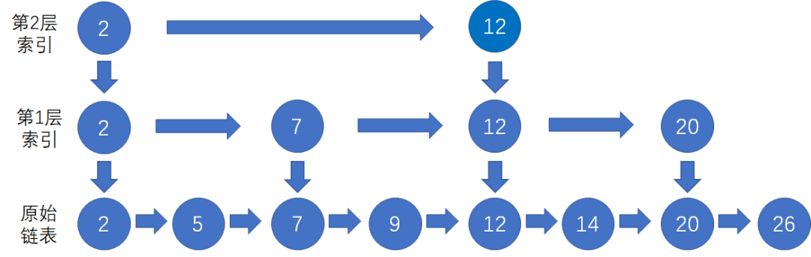


---

### 插入

假设我们要插入的结点是10，首先我们按照跳表查找结点的方法，找到待插入结点的**前置结点**（**仅小于**待插入结点，也就前驱节点），类似于链表的插入一样：

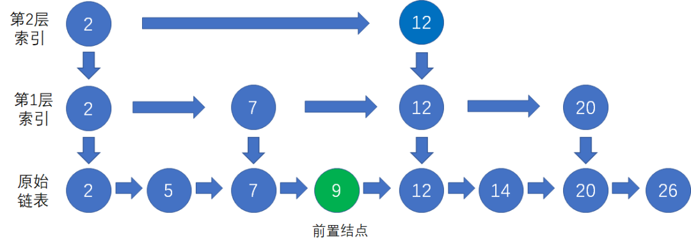

首先我们查找都是在最高层开始查找，找到前驱节点并将新的节点进行插入。

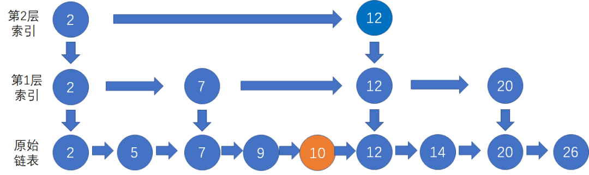

如何调整索引呢？我们让新插入的结点**随机 “晋升”**，也就是成为**高层索引结点**。新结点晋升成功的几率是50%。

假设第一次随机的结果是晋升成功，那么我们把结点10作为索引结点，插入到第1层索引的对应位置，并且向下指向原始链表的结点10：

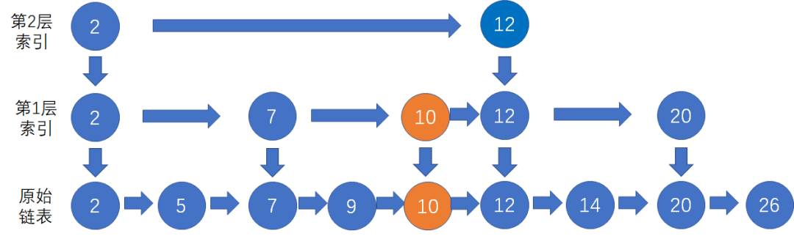

晋升的层数也**有可能超过头节点的层数**，此时我们需要将头节点加一层.

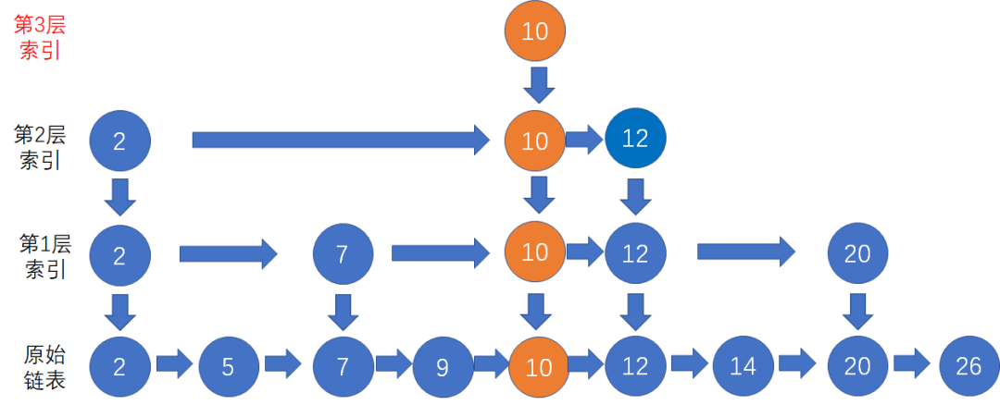


---

### 查找

一开始，算法在**最稀疏**的层次进行搜索，直至需要查找的元素在该层两个**相邻的元素中间**。这是，算法将**跳转到下一个较稠密层次**，重复刚才的搜索，直到找到需要查找的元素位置。


**示例（查找结点20）**

首先，我们从最上层的索引开始查找，找到该层中**仅小于**结点 20的前置索引结点 12：

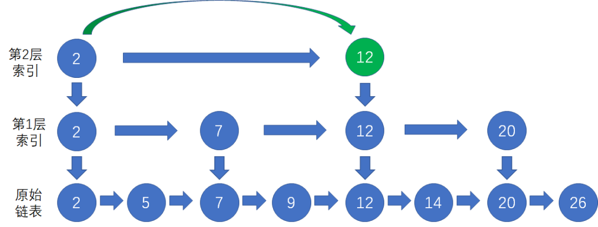

接下来，我们顺着结点 12 访问**下一层**索引，在该层中找到结点 20：

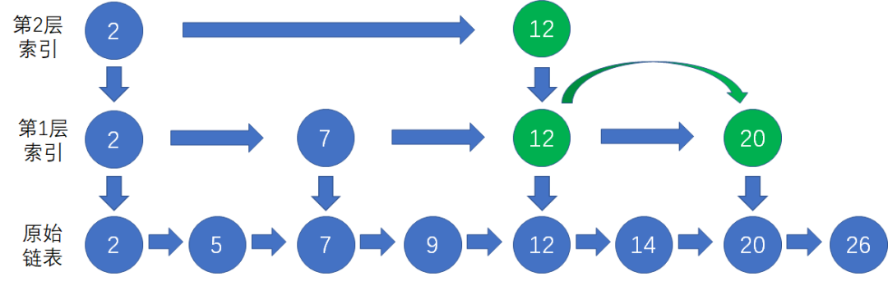

最后，我们顺着第 1 层索引的结点 20 **向下一层**，找到原始链表的结点 20：

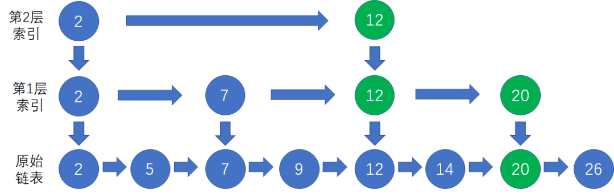


---

### 删除


---

### 题解

- 查找：从跳表的当前的**最大层数 level 层开始查找**，在当前层水平地逐个比较直至当前节点的**下一个节点大于等于目标节点**，然后移动至下一层进行查找，重复这个过程直至到达第 1 层。此时，若第 1 层的下一个节点的值等于 target，则返回 true；反之，则返回 false

- 插入：从跳表的当前的最大层数 level 层开始查找，在当前层水平地逐个比较直至当前节点的**下一个节点大于等于目标节点**，然后移动至下一层进行查找，重复这个过程直至到达第 1 层。设新加入的节点为 newNode，我们需要计算出此次节点插入的层数 lv，如果 level 小于 lv，则同时需要更新 level。我们用数组 update 保存每一层查找的最后一个节点，第 i 层最后的节点为 update[i]。我们将 newNode 的后续节点指向 update[i] 的下一个节点，同时更新 update[i] 的后续节点为 newNode。

- 删除：首先我们需要查找当前元素是否存在跳表中。从跳表的当前的最大层数 level 层开始查找，在当前层水平地逐个比较直至当前节点的下一个节点大于等于目标节点，然后移动至下一层进行查找，重复这个过程直至到达第 1 层。如果第 1 层的下一个节点不等于 num 时，则表示当前元素不存在直接返回。我们用数组 update 保存每一层查找的最后一个节点，第 i 层最后的节点为 update[i]。此时第 i 层的下一个节点的值为 num，则我们需要将其从跳表中将其删除。由于第 i 层的以 p 的概率出现在第 i+1 层，因此我们应当从第 1 层开始往上进行更新，将  num 从 update[i] 的下一跳中删除，同时更新 update[i] 的后续节点，直到当前层的链表中没有出现 num 的节点为止。最后我们还需要更新跳表中当前的最大层数 level。

  

```c++
constexpr int MAX_LEVEL = 32;
constexpr double P_FACTOR = 0.25;

struct SkipListNode {
    int val;
    vector<SkipListNode*> forward;   // 存该节点每一个 level 的后继节点
    // forward.size()  表示这个值有几层, 有几个 level

    SkipListNode(int _val, int _maxLevel = MAX_LEVEL) : val(_val), forward(_maxLevel, nullptr) {};
};

class Skiplist {
public:
    Skiplist() : head(new SkipListNode(-1)), level(0), dis(0, 1) {
        
    }
    
    bool search(int target) {   
        SkipListNode *curr = this->head;
        for (int i = level - 1; i >= 0; i--) {
            /* 找到第i层小于且最接近target的元素 */
            while (curr->forward[i] && curr->forward[i]->val < target) {
                curr = curr->forward[i];
            }
        }
        curr = curr->forward[0];
        /* 检测当前元素的值是否等于 target */
        if (curr && curr->val == target) {
            return true;
        }

        // 最接近target的元素的下一个不是的话，就说明没有
        return false;
    }
    
    void add(int num) {
        vector<SkipListNode *> update(MAX_LEVEL, head);
        SkipListNode *curr = this->head;        
        for (int i = level - 1; i >= 0; i--) {  // 遍历层级
            /* 找到第 i 层小于且最接近 num 的元素 */
            while (curr->forward[i] != nullptr && curr->forward[i]->val < num) {
                curr = curr->forward[i];
            }    
            update[i] = curr;  // 保存小于且最最近 num 的元素, 即前驱节点
        }

        int lv = randomLevel();
        level = max(level, lv); // 更新最大的level
        SkipListNode *newNode = new SkipListNode(num, lv);
        for (int i = 0; i < lv; ++i) {          // 在每一层插入新节点
            newNode->forward[i] = update[i]->forward[i];  
            update[i]->forward[i] = newNode; 
        }
    }   
    
    bool erase(int num) {
        vector<SkipListNode *> update(MAX_LEVEL, nullptr); // 默认都为空
        SkipListNode *curr = this->head;        
        for (int i = level - 1; i >= 0; i--) {  // 遍历层级
            /* 找到第 i 层小于且最接近 num 的元素 */
            while (curr->forward[i] != nullptr && curr->forward[i]->val < num) {
                curr = curr->forward[i];
            }    
            update[i] = curr;  // 保存小于且最最近 num 的元素, 即前驱节点
        }

        curr = curr->forward[0];    // 最底层的 curr 的后继节点没值的话，上层肯定也没有
        /* 没有这个值 */
        if (curr == nullptr || curr->val != num) {
            return false;
        }

        for (int i = 0; i < level; ++i) {   // 从小往上找
            if (update[i]->forward[i] != curr) { // 如果该层没有值，上层也不会有了
                break;
            }
            /* 对第 i 层的状态进行更新，将 forward 指向被删除节点的下一跳 */
            update[i]->forward[i] = curr->forward[i];
        }
        delete curr;
        /* 更新当前的 level */
        while (level > 0 && head->forward[level - 1] == nullptr) { //头节点后继就是nullptr,肯定就为空了
            level--;
        }
        return true;
    }

    int randomLevel() {
        int lv = 1;  //初始节点就一层，再最低层
        /* 随机生成 lv */
        while (dis(gen) < P_FACTOR && lv < MAX_LEVEL) {
            lv++;   //有0.25的概率加1层
        }
        return lv;
    }

private:
    SkipListNode* head; // 头指针
    int level;          // 当前最大的level
    mt19937 gen{random_device{} ()};    // 生成 (-maxint,+maxint) 随机数
    uniform_real_distribution<double> dis;
};

/*
mt是指maxint（整型int最大值的缩写）, 19937是指2^19937-1
mt19937是c++11新特性，它是一种随机数算法，用法与rand()函数类似，但是mt19937具有速度快，周期长的特点（所谓周期长应该是指19937所代表的意思吧）
rand()在windows下生成的数据范围为0-32726
此时的mt19937所生成的数据范围大概为(-maxint,+maxint)（maxint整型int最大值的缩写）
*/

/**
 * Your Skiplist object will be instantiated and called as such:
 * Skiplist* obj = new Skiplist();
 * bool param_1 = obj->search(target);
 * obj->add(num);
 * bool param_3 = obj->erase(num);
 */
```


----

# LC

使用两个指针变量，刚开始都位于链表的第 1 个结点，一个永远一次只走 1 步，一个永远一次只走 2 步，一个在前，一个在后，同时走。这样当快指针走完的时候，慢指针就来到了链表的中间位置。
思想是：快慢指针的前进方向相同，且它们步伐的「差」是恒定的，根据这种确定性去解决链表中的一些问题。使用这种思想还可以解决链表的以下问题：


解决这些问题的共同特点就是使用两个指针变量同步移动。解决链表的问题常见的技巧还有：

1、使用**递归函数**，避免复杂的更改指针变量指向操作，使得求解问题变得简单。
「力扣」第 206 题：反转链表；
「力扣」第 24 题：两两交换链表中的节点；
「力扣」第 25 题：K 个一组翻转链表；
「力扣」第 328 题：奇偶链表；
「力扣」第 203 题：移除链表元素；
「力扣」第 21 题：合并两个有序链表。


2、设置「**虚拟头结点**」，避免对链表第 1 个结点做单独讨论，这个思想在数组里我们见过，叫「哨兵」；
「力扣」第 2 题：两数相加；
「力扣」第 82 题：删除排序链表中的重复元素 II。


3、使用「**快慢指针**」，本题就是。确切地说，叫「同步指针」可能更好一些；

「力扣」第 19 题： 倒数第 k 个结点，快指针先走几步，不是靠猜的，要在纸上画图模拟一下，就清楚了；
「力扣」第 141 题：环形链表，在环中的时候可以想象，A 同学开始有存款 100 元，每天赚 1 元，B 同学开始有存款 50 元，每天赚 2 元，B 同学一定会在某一天和 A 同学的存款一样；
「力扣」第 142 题：环形链表 II；
「力扣」第 161 题：相交链表，起点不同，构造相同长度让它们相遇，同样是利用了同步走这个等量关系。


4、为链表编写测试函数，进行调试（在下面的参考代码中有），主要是：
从数组得到一个链表；
根据当前结点打印当前结点以及后面的结点。
这两个方法可以非常方便地帮助我们调试关于链表的程序。


61

138

148


---

## 剑指 Offer II 029. 排序的循环链表

```c++
/*
// Definition for a Node.
class Node {
public:
    int val;
    Node* next;

    Node() {}

    Node(int _val) {
        val = _val;
        next = NULL;
    }

    Node(int _val, Node* _next) {
        val = _val;
        next = _next;
    }
};
*/

class Solution {
public:
    Node* insert(Node* head, int insertVal) {
        Node* insertNode = new Node(insertVal);

        if (head == nullptr) {          // 针对空列表
            head = insertNode;
            head->next = head;
            return head;
        }
        
        Node* now = head->next;
        Node* pre = head;        
        
        while (now != head) {
            // 升序的位置，即 4 - 6 插入 5
            if (pre->val <= insertVal && insertVal <= now->val) {
                pre->next = insertNode;
                insertNode->next = now;
                //cout << "flag2" << endl;
                return head;
            }
            
            // 降序的位置
            if (now->val < pre->val) {
                //cout << "flag" << endl;
                if (insertVal > pre->val || insertVal < now->val) {
                    pre->next = insertNode;
                    insertNode->next = now;
                    //cout << "flag1" << endl;
                    return head;
                }
            }

            
            pre = now;
            now = now->next;
        }

        // 没有在循环中处理成功，说明需要单独插入尾部
        pre->next = insertNode;
        insertNode->next = now;
        
        return head;
    }
};
```


