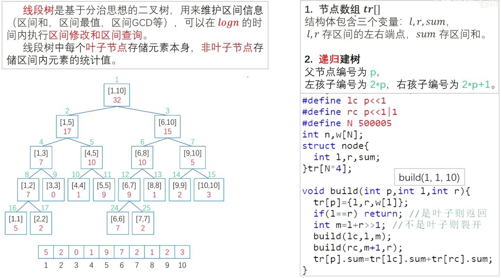
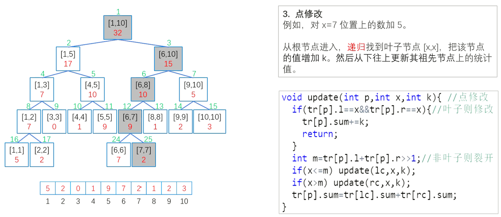
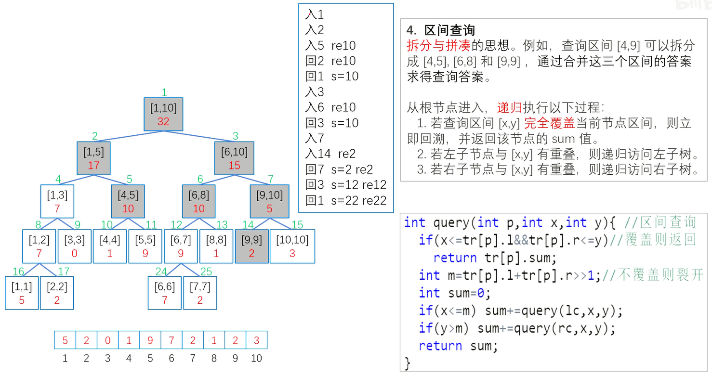
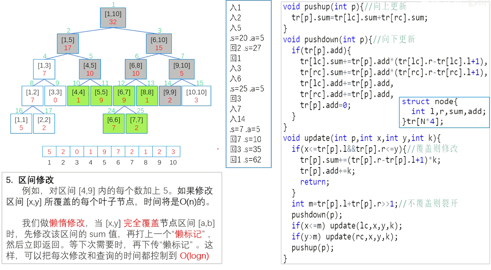
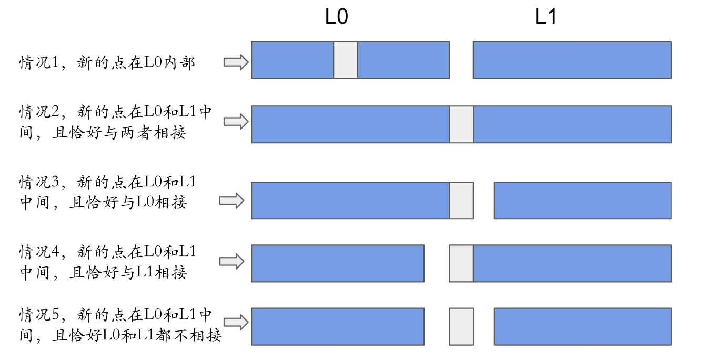

# 线段树

顶级资料 https://lfool.github.io/LFool-Notes/algorithm/%E7%BA%BF%E6%AE%B5%E6%A0%91%E8%AF%A6%E8%A7%A3.html


用来维护区间信息的数据结构


线段树可以在 $O(\log N)$ 的时间复杂度内实现单点修改，区间修改，区间查询（区间求和，求区间最大值，求区间最小值）等操作。


线段树维护的信息在很多时候可以认为是满足（幺）半群的性质和信息。

一个幺半群 $M = (S,\circ,e)$，其中 $\circ$ 为在集合 $S$ 上定义的二元运算符，幺半群具有以下性质：

- 封闭性：$ \forall x \in S $ 和 $ \forall y \in S $ 有 $ x \circ y \in S $
- 结合律：$ \forall x, y, z \in S $ 有 $ (x \circ y) \circ z=x \circ(y \circ z) $
- 存在幺元：$ \exists e \in S $ 满足 $ \forall x \in S $ 有 $ e \circ x=x $，$e$ 为左幺元；或 $x\circ e = x$，$e$ 为右幺元。

线段树上的信息一般满足这样的性质，一些数域上的加法与乘法自然，考虑二元的 $max(x,y)$ 运算，此时幺元为 $ -\infty $ 也满足这样的性质（一般左右幺元相同时简称为幺元）


https://leetcode.cn/problems/car-pooling/solution/yi-ge-mo-ban-miao-sha-ji-dao-xiang-si-de-l4cr/

涉及区间更新，单点查询，区间和查询的问题一般可以考虑树状数组
类似的题有：

1094拼车

1109.航班预定统计

1854.人口最多的年份

面试题 16.10. 生存人数

1156: 新年彩灯Ⅰ

区间更新，单点查询模板：


---

## 基本结构与建树

构造、修改的函数总体流程：

- 是叶子节点，边界条件，处理后 return

- 不是叶子节点，分裂左右子树递归


查询的函数总体流程：

- 完全覆盖查询区间，边界条件，return 值

- 不覆盖，分裂左右子树递归


### 数组模板

```c++
#define lc u<<1     // 2*u      左节点
#define rc u<<1|1   // 2*u + 1  右节点
class SegTree {             // 线段树不一定满二叉树，也不一定是完全二叉树，但一定是平衡二叉树
public:
    // 父节点索引为 u, 左孩子索引为 2*u, 右孩子索引为 2*u + 1
    // 子节点索引为 u, 父亲节点索引为 u / 2
    struct Node {           // 节点
        int l = 0, r = 0;   // 区间的左右端点,即[l,r]  
        int sum = 0;        // 区间和
    };
    
    vector<Node> tr;        // 数组表示的线段树
    vector<int> a;          // 大小为n的数组
    int n;

    SegTree() {}

    SegTree(vector<int> &a) {
        n = a.size();
        this->a = a;
        tr.resize(n * 4 + 1);   // 最好情况2n; 最差4n; +1索引从1开始
        build(1, 1, n);         // 根节点索引1，区间左右边界[1,n]
    }
    
    void push_up(int u) {	// 回溯时更新父结点
        tr[u].sum = tr[lc].sum + tr[rc].sum;    // 递归往回走的时候 一路上去更新, 更新祖先节点
    }

    void build(int u, int l, int r) {   // u为根节点索引 l左边界 r右边界
        tr[u] = {l, r};     		// 赋值左右边界
        if (l == r) {       		// 是叶子节点
            tr[u].sum = a[l - 1];	// 赋值返回，因为下标从1开始，所以是l-1
            return;
        }

        int mid = l + r >> 1;       // 非叶子节点，裂开
        build(lc, l, mid);          // lc = u<<1
        build(rc, mid + 1, r);      // rc = u<<1|1
        push_up(u);				    // 更新祖先节点
    }

    // 单点修改 递归寻找叶子节点 [x,x], 把该节点的值修改, 并且从下往上更新其组先节点的值
    void modify(int u, int x, int v) { 		// u为根节点索引 x为修改的位置 v为修改的值 
        if (tr[u].l == tr[u].r) { 			// 能满足tr[u].l == tr[u].r == x 叶子节点
            tr[u].sum += v; 				// 进来修改, 求区间和是累加，也可能是直接赋值
            return;
        }
        int mid = tr[u].l + tr[u].r >> 1;   // 非叶子节点，裂开
        if (x <= mid) modify(lc, x, v);
        if (x > mid)  modify(rc, x, v);
        push_up(u);				    		// 更新祖先节点
    }
    
    // 区间查询 [l,r] 的和，利用拆分与拼凑的思想，把大区间变为多个小区间的和
    int query(int u, int l, int r) { 			// u为根节点索引 l左边界 r右边界
        if (l <= tr[u].l && tr[u].r <= r)   	// 查询区间 [x,y] 完全覆盖当前节点区
            return tr[u].sum;               	// 间，立即回溯，返回该区间的sum值，让上一层累加
        
        int mid = tr[u].l + tr[u].r >> 1;   	// 非叶子节点，裂开
        int sum = 0;
        if (l <= mid) sum += query(lc, l, r); 	// 查询左边界比mid小，左子节点与区间 [x,y] 有重叠，递归访问左子树
        if (r > mid) sum += query(rc, l, r);  	// 查询右边界比mid小，右子节点与区间 [x,y] 有重叠，递归访问右子树
        return sum;
    }

};

```










比如 [x,y] = [4, 9]        mid = 1 + 10 >> 1 = 5    裂开为 [4, 5] 和 [5, 9]


----

### 数组懒标记模板

```c++
#define lc u<<1     // 2*u      左节点
#define rc u<<1|1   // 2*u + 1  右节点
class SegTree {             // 线段树不一定满二叉树，也不一定是完全二叉树，但一定是平衡二叉树
public:
    // 父节点索引为 u, 左孩子索引为 2*u, 右孩子索引为 2*u + 1
    // 子节点索引为 u, 父亲节点索引为 u / 2
    struct Node {           // 节点
        int l = 0, r = 0;   // 区间的左右端点,即[l,r]  
        int sum = 0;        // 区间和
        int add;			// 懒标记
    };
    
    vector<Node> tr;        // 数组表示的线段树
    vector<int> a;          // 大小为n的数组
    int n;

    SegTree() {}

    SegTree(vector<int> &a) {
        n = a.size();
        this->a = a;
        tr.resize(n * 4 + 1);   // 最好情况2n; 最差4n; +1索引从1开始
        build(1, 1, n);         // 根节点索引1，区间左右边界[1,n]
    }
    
    void push_up(int u) {	// 回溯时更新父结点
        tr[u].sum = tr[lc].sum + tr[rc].sum;    // 递归往回走的时候 一路上去更新, 更新祖先节点
    }
    
    void push_down(int u) {	// 下传懒标记
        if (tr[u].add) { 	// 欠的钱不为 0
            tr[lc].sum += tr[u].add*(tr[lc].r - tr[lc].l + 1);
            tr[rc].sum += tr[u].add*(tr[rc].r - tr[rc].l + 1);
            // 下推懒惰标记时需要累加起来，不能直接覆盖
            tr[lc].add += tr[u].add;
            tr[rc].add += tr[u].add;
            tr[u].add = 0;
        }        
    }

    void build(int u, int l, int r) {   // u为根节点索引 l左边界 r右边界
        tr[u] = {l, r};     		// 赋值左右边界
        if (l == r) {       		// 是叶子节点
            tr[u].sum = a[l - 1];	// 赋值返回，因为下标从1开始，所以是l-1
            return;
        }

        int mid = l + r >> 1;       // 非叶子节点，裂开
        build(lc, l, mid);          // lc = u<<1
        build(rc, mid + 1, r);      // rc = u<<1|1
        push_up(u);				    // 更新祖先节点
    }

    // 单点修改 递归寻找叶子节点 [x,x], 把该节点的值修改, 并且从下往上更新其组先节点的值
    void modify(int u, int x, int v) { 		// u为根节点索引 x为修改的位置 v为修改的值 
        if (tr[u].l == tr[u].r) { 			// 能满足tr[u].l == tr[u].r == x 叶子节点
            tr[u].sum += v; 				// 进来修改, 求区间和是累加，也可能是直接赋值
            return;
        }
        int mid = tr[u].l + tr[u].r >> 1;   // 非叶子节点，裂开
        if (x <= mid) modify(lc, x, v);
        if (x > mid)  modify(rc, x, v);
        push_up(u);				    		// 更新祖先节点
    }
    
    // 区间修改 [x,y] 的和，
    void modify(int u, int x, int y, int v) { 	// u为根节点索引 x左边界 y右边界 v为修改的值 
        if (x <= tr[u].l && tr[u].r <= y) { 	// 修改区间 [x,y] 完全覆盖当前节点区
            tr[u].sum += (tr[u].r - tr[u].l + 1) * v; 	// 进来修改, 把v累加(tr[u].r - tr[u].l + 1)次
            tr[u].add += v;								// 懒标记 v
            return;
        }
        int mid = tr[u].l + tr[u].r >> 1;		// 不覆盖裂开
        push_down(u);							// “下次需要”，下传懒标记
        if (x <= mid) modify(lc, x, y, v);
        if (x > mid)  modify(rc, x, y, v);
        push_up(u);				    			// 向上回溯更新祖先节点
    }

    // 区间查询 [l,r] 的和，利用拆分与拼凑的思想，把大区间变为多个小区间的和
    int query(int u, int l, int r) { 			// u为根节点索引 l左边界 r右边界
        if (l <= tr[u].l && tr[u].r <= r)   	// 查询区间 [x,y] 完全覆盖当前节点区
            return tr[u].sum;               	// 间，立即回溯，返回该区间的sum值，让上一层累加
        
        int mid = tr[u].l + tr[u].r >> 1;   	// 非叶子节点，裂开
        int sum = 0;
        if (l <= mid) sum += query(lc, l, r); 	// 查询左边界比mid小，左子节点与区间 [x,y] 有重叠，递归访问左子树
        if (r > mid) sum += query(rc, l, r);  	// 查询右边界比mid小，右子节点与区间 [x,y] 有重叠，递归访问右子树
        return sum;
    }

};

```




可以笨笨的对区间里每个数做一次单点修改，但这样时间复杂度是 $O(n)$

可以引入懒标记，懒惰修改（有点类似区间查询），完全覆盖时加 "懒标记"，就不再往下走了。可以理解为账本，欠子孙节点的钱。

“下次需要” 比如：第一次区间修改 [4,9]，然后进行了懒标记；第二次区间修改 [6, 7]，走到 [6, 8] 的时候有标记（账本），把账本分给其子孙节点。这样时间复杂度是 $O(logn)$


---

### 动态开点+懒标记模板-求和

[757. 设置交集大小至少为2](https://leetcode.cn/problems/set-intersection-size-at-least-two/)

```c++
const int maxn = 1e9 + 10;

class Node {           	// 线段树节点
public:
    Node *lNode, *rNode;   	// 区间的左右端点,即[l,r]  
    int l, r;   			// 区间的左右端点,即[l,r]  
    int maxv;               // 区间最大值
    int add;				// 懒标记
    int mid;				// 构造的时候就可以捎带计算一下
    
    Node () {}
    Node (int _l, int _r) {
        this->l = _l;
        this->r = _r;
        this->mid = _l + _r >> 1;
        this->maxv = 0;
        this->add = 0;
        this->lNode = nullptr;
        this->rNode = nullptr;
    }
};

class SegTree {             // 线段树不一定满二叉树，也不一定是完全二叉树，但一定是平衡二叉树
public:
    Node* root;

    SegTree() {
    	root = new Node(0, maxn);    
    }    
    
    void push_up(Node* node) {	// 回溯时更新父结点
        node->maxv = node->lNode->maxv + node->rNode->maxv;    // 递归往回走的时候 一路上去更新, 更新祖先节点
    }
    
    void push_down(Node* node) {	// 下传懒标记
        if (!node->lNode) node->lNode = new Node(node->l, node->mid);
        if (!node->rNode) node->rNode = new Node(node->mid + 1, node->r);
        if (node->add) { 	// 欠的钱不为 0
            node->lNode->maxv += (node->mid - node->l + 1) * node->add;  // +=
            node->rNode->maxv += (node->r - node->mid) * node->add;
            node->lNode->add += node->add;
            node->rNode->add += node->add;
            node->add = 0;
        }        
    }
    
    
    // 区间修改 [l,r] 的和，也可以用于单点修改l=y即可
    void modify(Node* node, int l, int r, int v) { 	// u为根节点索引 l左边界 y右边界 v为修改的值 
        if (l <= node->l && node->r <= r) { 	// 修改区间 [l,r] 完全覆盖当前节点区
            node->maxv += (node->r - node->l + 1) * v; 	                // 进来修改, +=
            node->add += v;						// 懒标记 v  +=
            return;
        }
        // 不覆盖裂开
        push_down(node);							// “下次需要”，下传懒标记
        if (l <= node->mid) modify(node->lNode, l, r, v);
        if (r > node->mid)  modify(node->rNode, l, r, v);
        push_up(node);				    			// 向上回溯更新祖先节点
    }

    // 区间查询 [l,r] 的和，利用拆分与拼凑的思想，把大区间变为多个小区间的和
    int query(Node* node, int l, int r) { 			// u为根节点索引 l左边界 r右边界
        if (l <= node->l && node->r <= r)   	// 查询区间 [l,r] 完全覆盖当前节点区
            return node->maxv;               	// 间，立即回溯，返回该区间的sum值，让上一层累加
        
        // 非叶子节点，裂开
        push_down(node);							// “下次需要”，下传懒标记
        int res = 0;
        if (l <= node->mid) res += query(node->lNode, l, r); 	// 查询左边界比mid小，左子节点与区间 [l,r] 有重叠，递归访问左子树
        if (r > node->mid) res += query(node->rNode, l, r);  	// 查询右边界比mid小，右子节点与区间 [l,r] 有重叠，递归访问右子树
        return res;
    }

};
```


---

### 动态开点+懒标记模板-求最大值

[729. 我的日程安排表 I](https://leetcode.cn/problems/my-calendar-i/)

[731. 我的日程安排表 II](https://leetcode.cn/problems/my-calendar-ii/)

[732. 我的日程安排表 III](https://leetcode.cn/problems/my-calendar-iii/)

```c++
const int maxn = 1e9 + 10;

class Node {           	// 线段树节点
public:
    Node *lNode, *rNode;   	// 区间的左右端点,即[l,r]  
    int l, r;   			// 区间的左右端点,即[l,r]  
    int maxv;               // 区间最大值
    int add;				// 懒标记
    int mid;				// 构造的时候就可以捎带计算一下
    
    Node () {}
    Node (int _l, int _r) {
        this->l = _l;
        this->r = _r;
        this->mid = _l + _r >> 1;
        this->maxv = 0;
        this->add = 0;
        this->lNode = nullptr;
        this->rNode = nullptr;
    }
};

class SegTree {             // 线段树不一定满二叉树，也不一定是完全二叉树，但一定是平衡二叉树
public:
    Node* root;

    SegTree() {
    	root = new Node(0, maxn);    
    }    
    
    void push_up(Node* node) {	// 回溯时更新父结点
        node->maxv = max(node->lNode->maxv, node->rNode->maxv);    // 递归往回走的时候 一路上去更新, 更新祖先节点
    }
    
    void push_down(Node* node) {	// 下传懒标记
        if (!node->lNode) node->lNode = new Node(node->l, node->mid);
        if (!node->rNode) node->rNode = new Node(node->mid + 1, node->r);
        if (node->add) { 	// 欠的钱不为 0
            node->lNode->maxv += node->add;  // +=
            node->rNode->maxv += node->add;
            node->lNode->add += node->add;
            node->rNode->add += node->add;
            node->add = 0;
        }        
    }
    
    
    // 区间修改 [l,r] 的和，也可以用于单点修改l=y即可
    void modify(Node* node, int l, int r, int v) { 	// u为根节点索引 l左边界 y右边界 v为修改的值 
        if (l <= node->l && node->r <= r) { 	// 修改区间 [l,r] 完全覆盖当前节点区
            node->maxv += v; 	                // 进来修改, +=
            node->add += v;						// 懒标记 v  +=
            return;
        }
        // 不覆盖裂开
        push_down(node);							// “下次需要”，下传懒标记
        if (l <= node->mid) modify(node->lNode, l, r, v);
        if (r > node->mid)  modify(node->rNode, l, r, v);
        push_up(node);				    			// 向上回溯更新祖先节点
    }

    // 区间查询 [l,r] 的和，利用拆分与拼凑的思想，把大区间变为多个小区间的和
    int query(Node* node, int l, int r) { 			// u为根节点索引 l左边界 r右边界
        if (l <= node->l && node->r <= r)   	// 查询区间 [l,r] 完全覆盖当前节点区
            return node->maxv;               	// 间，立即回溯，返回该区间的sum值，让上一层累加
        
        // 非叶子节点，裂开
        push_down(node);							// “下次需要”，下传懒标记
        int res = 0;
        if (l <= node->mid) res = max(res, query(node->lNode, l, r)); 	// 查询左边界比mid小，左子节点与区间 [l,r] 有重叠，递归访问左子树
        if (r > node->mid) res = max(res, query(node->rNode, l, r));  	// 查询右边界比mid小，右子节点与区间 [l,r] 有重叠，递归访问右子树
        return res;
    }

};
```


https://leetcode.cn/problems/falling-squares/solution/-by-lcbin-5rop/

```c++
class Node {
public:
    Node* left;
    Node* right;
    int l;
    int r;
    int mid;
    int v;
    int add;

    Node(int l, int r) {
        this->l = l;
        this->r = r;
        this->mid = (l + r) >> 1;
        this->left = this->right = nullptr;
        v = add = 0;
    }
};

class SegmentTree {
private:
    Node* root;

public:
    SegmentTree() {
        root = new Node(1, 1e9);
    }

    void modify(int l, int r, int v) {
        modify(l, r, v, root);
    }

    void modify(int l, int r,int v, Node* node) {
        if (l > r) return;
        if (node->l >= l && node->r <= r)
        {
            node->v = v;
            node->add = v;
            return;
        }
        pushdown(node);
        if (l <= node->mid) modify(l, r, v, node->left);
        if (r > node->mid) modify(l, r, v, node->right);
        pushup(node);
    }

    int query(int l, int r) {
        return query(l, r, root);
    }

    int query(int l, int r, Node* node) {
        if (l > r) return 0;
        if (node->l >= l && node-> r <= r) return node->v;
        pushdown(node);
        int v = 0;
        if (l <= node->mid) v = max(v, query(l, r, node->left));
        if (r > node->mid) v = max(v, query(l, r, node->right));
        return v;
    }

    void pushup(Node* node) {
        node->v = max(node->left->v, node->right->v);
    }

    void pushdown(Node* node) {
        if (!node->left) node->left = new Node(node->l, node->mid);
        if (!node->right) node->right = new Node(node->mid + 1, node->r);
        if (node->add)
        {
            Node* left = node->left;
            Node* right = node->right;
            left->v = node->add;
            right->v = node->add;
            left->add = node->add;
            right->add = node->add;
            node->add = 0;
        }
    }
};

class Solution {
public:
    vector<int> fallingSquares(vector<vector<int>>& positions) {
        vector<int> ans;
        SegmentTree* tree = new SegmentTree();
        int mx = 0;
        for (auto& p : positions)
        {
            int l = p[0], w = p[1], r = l + w - 1;
            int h = tree->query(l, r) + w;
            mx = max(mx, h);
            ans.push_back(mx);
            tree->modify(l, r, h);
        }
        return ans;
    }
};
```


---

### 动态开点+懒标记模板-求个数

[2276. 统计区间中的整数数目](https://leetcode.cn/problems/count-integers-in-intervals/)

[715. Range 模块](https://leetcode.cn/problems/range-module/)

```c++
const int maxn = 1e9 + 10;

class Node {           	// 线段树节点
public:
    Node *lNode, *rNode;   	// 区间的左右端点,即[l,r]  
    int l, r;   			// 区间的左右端点,即[l,r]  
    int maxv;               // 区间最大值
    int add;				// 懒标记
    int mid;				// 构造的时候就可以捎带计算一下
    
    Node () {}
    Node (int _l, int _r) {
        this->l = _l;
        this->r = _r;
        this->mid = _l + _r >> 1;
        this->maxv = 0;
        this->add = 0;
        this->lNode = nullptr;
        this->rNode = nullptr;
    }
};

class SegTree {             // 线段树不一定满二叉树，也不一定是完全二叉树，但一定是平衡二叉树
public:
    Node* root;

    SegTree() {
    	root = new Node(0, maxn);    
    }    
    
    void push_up(Node* node) {	// 回溯时更新父结点
        node->maxv = node->lNode->maxv + node->rNode->maxv;    // 递归往回走的时候 一路上去更新, 更新祖先节点
    }
    
    void push_down(Node* node) {	// 下传懒标记
        if (!node->lNode) node->lNode = new Node(node->l, node->mid);
        if (!node->rNode) node->rNode = new Node(node->mid + 1, node->r);
        if (node->add) { 	// 欠的钱不为 0
            node->lNode->maxv = (node->mid - node->l + 1) * node->add;  // +=
            node->rNode->maxv = (node->r - node->mid) * node->add;
            node->lNode->add = node->add;
            node->rNode->add = node->add;
            node->add = 0;
        }        
    }
    
    
    // 区间修改 [l,r] 的和，也可以用于单点修改l=y即可
    void modify(Node* node, int l, int r, int v) { 	// u为根节点索引 l左边界 y右边界 v为修改的值 
        if (l <= node->l && node->r <= r) { 	// 修改区间 [l,r] 完全覆盖当前节点区
            node->maxv = (node->r - node->l + 1) * v; 	                // 进来修改, +=
            node->add = v;						// 懒标记 v  +=
            return;
        }
        // 不覆盖裂开
        push_down(node);							// “下次需要”，下传懒标记
        if (l <= node->mid) modify(node->lNode, l, r, v);
        if (r > node->mid)  modify(node->rNode, l, r, v);
        push_up(node);				    			// 向上回溯更新祖先节点
    }

    // 区间查询 [l,r] 的和，利用拆分与拼凑的思想，把大区间变为多个小区间的和
    int query(Node* node, int l, int r) { 			// u为根节点索引 l左边界 r右边界
        if (l <= node->l && node->r <= r)   	// 查询区间 [l,r] 完全覆盖当前节点区
            return node->maxv;               	// 间，立即回溯，返回该区间的sum值，让上一层累加
        
        // 非叶子节点，裂开
        push_down(node);							// “下次需要”，下传懒标记
        int res = 0;
        if (l <= node->mid) res += query(node->lNode, l, r); 	// 查询左边界比mid小，左子节点与区间 [l,r] 有重叠，递归访问左子树
        if (r > node->mid) res += query(node->rNode, l, r);  	// 查询右边界比mid小，右子节点与区间 [l,r] 有重叠，递归访问右子树
        return res;
    }

};
```


### 离散化+动态开点+懒标记模板-求和

[757. 设置交集大小至少为2](https://leetcode.cn/problems/set-intersection-size-at-least-two/)

[729. 我的日程安排表 I](https://leetcode.cn/problems/my-calendar-i/)

```c++
const int maxn = 1e9 + 10;
const int maxnn = 5e5;

class SegTree {             // 线段树不一定满二叉树，也不一定是完全二叉树，但一定是平衡二叉树
public:
    struct Node {           	// 线段树节点
        int l, r;   			// 区间的左右端点,即[l,r] 
        int lNode, rNode;       // 区间的左右孩子索引 
        int val;               // 是否覆盖
        int add;				// 懒标记
        int mid;				// 构造的时候就可以捎带计算一下
    }tr[maxnn] {};

    int idx = 0;
    SegTree() {  
    	tr[++idx] = {0, maxn, 0, 0, 0, 0, (1 + maxn >> 1)};
    }    
    
    void push_up(Node &node) {	// 回溯时更新父结点
        node.val = tr[node.lNode].val + tr[node.rNode].val;    // 递归往回走的时候 一路上去更新, 更新祖先节点
    }
    
    void push_down(Node &node) {	// 下传懒标记
        if (!node.lNode) {
            node.lNode = ++idx;
            int ll = node.l, rr = (node.l + node.r) >> 1;
            int midd = ll + rr >> 1;
            tr[idx] = {ll, rr, 0, 0, 0, 0, midd};
        }
        if (!node.rNode) {
            node.rNode = ++idx;
            int ll = ((node.l + node.r) >> 1) + 1, rr = node.r;
            int midd = ll + rr >> 1;
            tr[idx] = {ll, rr, 0, 0, 0, 0, midd};
        }

        if (node.add == 0) { return; } 
        else if (node.add == 1) {
            tr[node.lNode].val = node.add == 1 ?  (tr[node.lNode].r - tr[node.lNode].l + 1) : 0; 
            tr[node.rNode].val = node.add == 1 ?  (tr[node.rNode].r - tr[node.rNode].l + 1) : 0;
            tr[node.lNode].add = node.add;
            tr[node.rNode].add = node.add;
            node.add = 0;  
        }  
    }
    
    
    // 区间修改 [l,r] 的和，也可以用于单点修改l=y即可
    void modify(Node &node, int l, int r, bool v) { 	// u为根节点索引 l左边界 y右边界 v为修改的值 
        if (l <= node.l && node.r <= r) { 	// 修改区间 [l,r] 完全覆盖当前节点区
            node.val = v == 1 ? (node.r - node.l + 1) : 0; 	// 进来修改, +=
            node.add = v;						            // 懒标记 v  +=
            return;
        }
        // 不覆盖裂开
        push_down(node);							// “下次需要”，下传懒标记
        if (l <= node.mid) modify(tr[node.lNode], l, r, v);
        if (r > node.mid)  modify(tr[node.rNode], l, r, v);
        push_up(node);				    			// 向上回溯更新祖先节点
    }

    // 区间查询 [l,r] 的和，利用拆分与拼凑的思想，把大区间变为多个小区间的和
    int query(Node &node, int l, int r) { 			// u为根节点索引 l左边界 r右边界
        if (l <= node.l && node.r <= r)   	// 查询区间 [l,r] 完全覆盖当前节点区
            return node.val;               	// 间，立即回溯，返回该区间的sum值，让上一层累加
        
        // 非叶子节点，裂开
        push_down(node);							// “下次需要”，下传懒标记
        int res = 0;
        if (l <= node.mid) res += query(tr[node.lNode], l, r); 	// 查询左边界比mid小，左子节点与区间 [l,r] 有重叠，递归访问左子树
        if (r > node.mid) res += query(tr[node.rNode], l, r);  	// 查询右边界比mid小，右子节点与区间 [l,r] 有重叠，递归访问右子树
        return res;
    }

};
```


### 离散化+动态开点+懒标记模板-求最大

```c++
const int maxn = 1e9 + 10;
const int maxnn = 5e5;

class SegTree {             // 线段树不一定满二叉树，也不一定是完全二叉树，但一定是平衡二叉树
public:
    struct Node {           	// 线段树节点
        int l, r;   			// 区间的左右端点,即[l,r] 
        int lNode, rNode;       // 区间的左右孩子索引 
        int val;               // 是否覆盖
        int add;				// 懒标记
        int mid;				// 构造的时候就可以捎带计算一下
    }tr[maxnn] {};

    int idx = 0;
    SegTree() {  
    	tr[++idx] = {0, maxn, 0, 0, 0, 0, (1 + maxn >> 1)};
    }    
    
    void push_up(Node &node) {	// 回溯时更新父结点
        node.val = tr[node.lNode].val + tr[node.rNode].val;    // 递归往回走的时候 一路上去更新, 更新祖先节点
    }
    
    void push_down(Node &node) {	// 下传懒标记
        if (!node.lNode) {
            node.lNode = ++idx;
            int ll = node.l, rr = (node.l + node.r) >> 1;
            int midd = ll + rr >> 1;
            tr[idx] = {ll, rr, 0, 0, 0, 0, midd};
        }
        if (!node.rNode) {
            node.rNode = ++idx;
            int ll = ((node.l + node.r) >> 1) + 1, rr = node.r;
            int midd = ll + rr >> 1;
            tr[idx] = {ll, rr, 0, 0, 0, 0, midd};
        }

        if (node.add == 0) { return; } 
        else if (node.add == 1) {
            tr[node.lNode].val = node.add == 1 ?  (tr[node.lNode].r - tr[node.lNode].l + 1) : 0; 
            tr[node.rNode].val = node.add == 1 ?  (tr[node.rNode].r - tr[node.rNode].l + 1) : 0;
            tr[node.lNode].add = node.add;
            tr[node.rNode].add = node.add;
            node.add = 0;  
        }  
    }
    
    
    // 区间修改 [l,r] 的和，也可以用于单点修改l=y即可
    void modify(Node &node, int l, int r, bool v) { 	// u为根节点索引 l左边界 y右边界 v为修改的值 
        if (l <= node.l && node.r <= r) { 	// 修改区间 [l,r] 完全覆盖当前节点区
            node.val = v == 1 ? (node.r - node.l + 1) : 0; 	// 进来修改, +=
            node.add = v;						            // 懒标记 v  +=
            return;
        }
        // 不覆盖裂开
        push_down(node);							// “下次需要”，下传懒标记
        if (l <= node.mid) modify(tr[node.lNode], l, r, v);
        if (r > node.mid)  modify(tr[node.rNode], l, r, v);
        push_up(node);				    			// 向上回溯更新祖先节点
    }

    // 区间查询 [l,r] 的和，利用拆分与拼凑的思想，把大区间变为多个小区间的和
    int query(Node &node, int l, int r) { 			// u为根节点索引 l左边界 r右边界
        if (l <= node.l && node.r <= r)   	// 查询区间 [l,r] 完全覆盖当前节点区
            return node.val;               	// 间，立即回溯，返回该区间的sum值，让上一层累加
        
        // 非叶子节点，裂开
        push_down(node);							// “下次需要”，下传懒标记
        int res = 0;
        if (l <= node.mid) res += query(tr[node.lNode], l, r); 	// 查询左边界比mid小，左子节点与区间 [l,r] 有重叠，递归访问左子树
        if (r > node.mid) res += query(tr[node.rNode], l, r);  	// 查询右边界比mid小，右子节点与区间 [l,r] 有重叠，递归访问右子树
        return res;
    }

};
```


### 离散化+动态开点+懒标记模板-求个数

```c++
const int maxn = 1e9 + 10;
const int maxnn = 1e6 + 1e5; // (1e5 + 5) * 20; 4e6+6; 1100000;

class SegTree {             // 线段树不一定满二叉树，也不一定是完全二叉树，但一定是平衡二叉树
public:
    struct Node {           	// 线段树节点
        int l, r;   			// 区间的左右端点,即[l,r] 
        int lNode, rNode;       // 区间的左右孩子索引 
        int val;               // 是否覆盖
        int add;				// 懒标记
        int mid;				// 构造的时候就可以捎带计算一下
    }tr[maxnn] {};

    int idx = 0;
    SegTree() {   
    	tr[++idx] = {0, maxn, 0, 0, 0, 0, (1 + maxn >> 1)};
    }    
    
    void push_up(Node &node) {	// 回溯时更新父结点
        node.val = tr[node.lNode].val + tr[node.rNode].val;    // 递归往回走的时候 一路上去更新, 更新祖先节点
    }
    
    void push_down(Node &node) {	// 下传懒标记
        if (!node.lNode) {
            node.lNode = ++idx;
            int ll = node.l, rr = (node.l + node.r) >> 1;
            int midd = ll + rr >> 1;
            tr[idx] = {ll, rr, 0, 0, 0, 0, midd};
        }
        if (!node.rNode) {
            node.rNode = ++idx;
            int ll = ((node.l + node.r) >> 1) + 1, rr = node.r;
            int midd = ll + rr >> 1;
            tr[idx] = {ll, rr, 0, 0, 0, 0, midd};
        }

        if (node.add != 0) {
            tr[node.lNode].val = (node.mid - node.l + 1) * node.add; 
            tr[node.rNode].val = (node.r - node.mid) * node.add;
            tr[node.lNode].add = node.add;
            tr[node.rNode].add = node.add;
            node.add = 0; 
        }  
    }
    
    
    // 区间修改 [l,r] 的和，也可以用于单点修改l=y即可
    void modify(Node &node, int l, int r, int v) { 	// u为根节点索引 l左边界 y右边界 v为修改的值 
        if (l <= node.l && node.r <= r) { 	// 修改区间 [l,r] 完全覆盖当前节点区
            node.val = (node.r - node.l + 1) * v; 	// 进来修改, +=
            node.add = v;						            // 懒标记 v  +=
            return;
        }
        // 不覆盖裂开
        push_down(node);							// “下次需要”，下传懒标记
        if (l <= node.mid) modify(tr[node.lNode], l, r, v);
        if (r > node.mid)  modify(tr[node.rNode], l, r, v);
        push_up(node);				    			// 向上回溯更新祖先节点
    }

    // 区间查询 [l,r] 的和，利用拆分与拼凑的思想，把大区间变为多个小区间的和
    int query(Node &node, int l, int r) { 			// u为根节点索引 l左边界 r右边界
        if (l <= node.l && node.r <= r)   	// 查询区间 [l,r] 完全覆盖当前节点区
            return node.val;               	// 间，立即回溯，返回该区间的sum值，让上一层累加
        
        // 非叶子节点，裂开
        push_down(node);							// “下次需要”，下传懒标记
        int res = 0;
        if (l <= node.mid) res += query(tr[node.lNode], l, r); 	// 查询左边界比mid小，左子节点与区间 [l,r] 有重叠，递归访问左子树
        if (r > node.mid) res += query(tr[node.rNode], l, r);  	// 查询右边界比mid小，右子节点与区间 [l,r] 有重叠，递归访问右子树
        return res;
    }

};
```


---

## 区间合并




---

### 2276. 统计区间中的整数数目

用一个 set 有序地维护所有不相交的区间，当加入区间 [left, right] 时，通过 lower_bound 快速找到第一个右端点大等于 left - 1 的区间，然后不断用接下来的区间和 [left, right] 合并，直到当前区间的左端点大于 right + 1。由于每个区间只会加入以及离开 set 一次，复杂度 $\mathcal{O}(n \log n)$。

```c++
class CountIntervals {
    typedef pair<int, int> pii; //先存right 再存left

    int ans = 0;
    set<pii> st;    // 存（右端点，左端点）    因为主要是为了找右端点进行比较

public:
    CountIntervals() {

    }
    
    void add(int left, int right) {
        // 只有满足下面条件才能插入并计算
        // 存在两个相邻集合A(ALeft, ARight)和B(BLeft, BRight) 
        // 条件一: left > ARight
        // 条件二: right < BLeft

        auto it = st.lower_bound(pii(left, -1e-9)); // 找到第一个 A 满足 ARight 比 left 大  满足条件一 (10, 7)
        while (it != st.end()) {             // 如果找到了
            if (right < it->second) break;   // 判断 right 是否小于 BLeft，及要求满足条件二跳出 

            /*合并区间*/
            left = min(left, it->second);    // min(5, 7) = 5
            right = max(right, it->first);   // max(8, 10) = 10
            ans -= (it->first - it->second + 1);
            st.erase(it++);
        }        

        st.insert(pii(right, left));
        ans += right - left + 1;

        return;
    }        
    
    int count() {
        return ans;
    }
};
```


Q：为什么用 left - 1 和 right + 1 比较，直接 left 和 right 不行吗？
A：为了把虽然不相交但是连续的区间也合并，比如 [1,3], [4, 6] 可以合并成 [1, 6]。当然对于本题而言这样的合并不需要。直接用 left 和 right 判断也可以，但作为模板的角度合并可能更合适一点。

```C++
class CountIntervals {
    typedef pair<int, int> pii;

    int ans = 0;
    set<pii> st;

public:
    CountIntervals() {
    }
    
    void add(int left, int right) {
        int L = left, R = right;
        // 这里 (R1, L1) >= (R2, L2)，若 R1 > R2 或 R1 = R2 且 L1 >= L2
        auto it = st.lower_bound(pii(left - 1, -2e9));
        while (it != st.end()) {
            if (it->second > right + 1) break;
            L = min(L, it->second);
            R = max(R, it->first);
            ans -= it->first - it->second + 1;
            st.erase(it++);
        }
        ans += R - L + 1;
        st.insert(pii(R, L));
    }
    
    int count() {
        return ans;
    }
};
```


----

### 352. 将数据流变为多个不相交区间

注意这道题目跟 2276 基本上是一模一样，唯一不同的就是这道题比较的时候**必须是** left - 1 和 right + 1 进行比较，而不能用 left 和 right 进行比较原因：

为了把虽然不相交但是连续的区间也合并，比如 [1,3], [4, 6] 可以合并成 [1, 6]。

```c++
class SummaryRanges {
    typedef pair<int, int> pii;
    set<pii> st;
    
public:
    SummaryRanges() {

    }
    
    void addNum(int val) {
        int left = val, right = val;
        auto it = st.lower_bound(pii(left-1, -1e9));

        while (it != st.end()) {
            if (it->second > right+1) break;
            left = min(left, it->second);
            right = max(right, it->first);
            st.erase(it++);
        }

        st.insert(pii(right, left));
    }
    
    vector<vector<int>> getIntervals() {
        vector<vector<int>> ans;
        for (auto p : st) {
            ans.push_back({p.second, p.first});
        }
        return ans;
    }
};
```

lower_bound(i) 找到第一个大于等于 i 的数的位置，我们把 val 扩展成 [le=val, ri=val] 的区间

针对情况 1，it 找到 L0 的位置，因为 L0->right 大于 le-1；进入循环，L0->left 小于 ri+1 调整区间范围，找到最左和最右的位置，调整之后 it++ 再次进入循环，此时 L1->left 大于 ri + 1，无需调整出循环；

针对情况 2，it 找到 L0 的位置，因为 L0->right 大于 le-1；进入循环，L0->left 小于 ri+1 调整区间范围，找到最左和最右的位置，调整之后 it++ 再次进入循环；此时 L1->left 仍小于 right + 1，再次调整区间范围，找到最左和最右的位置，调整之后 it++ 再次进入循环，此时到达末尾，结束循环；

针对情况 3，it 找到 L0 的位置，因为 L0->right 大于 le-1；进入循环，L0->left 小于 ri+1 调整区间范围，找到最左和最右的位置，调整之后 it++ 再次进入循环；此时 L1->left 大于 ri + 1，无需调整出循环；(实际上跟情况1相同)

针对情况 4，it 找到 L1 的位置，因为 L1->right 大于 le-1；进入循环，L1->left 小于 ri+1 调整区间范围，找到最左和最右的位置，调整之后 it++ 再次进入循环；此时到达末尾，结束循环；

针对情况 5，it 找到 L1 的位置，因为 L1->right 大于 le-1；进入循环，L1->left 大于 ri+1 调整区间范围结束循环；单独插入


针对情况 5 时，L1 可以不存在，即 `it == st.end()`


----

### 715. Range 模块

官方没有考虑的 case 

```c++
["RangeModule","addRange","addRange","addRange","removeRange","queryRange","queryRange"]
[[],[10,20],[20,25],[26,30],[14,16],[20,21],[25,26]]
```


此题不能用模板直接优化离散但连续的区间，因为它是前开后闭，因此必须 left，right 而不是 left-1 和 right+1

```c++
class RangeModule {
    typedef pair<int, int> pii;
    set<pii> st;
    
public:
    RangeModule() {
        /*因为插入、跟踪、删除全是半开区间，那就跟全开区间没区别*/
    }
    
    void addRange(int left, int right) {
        auto it = st.lower_bound(pii(left, -1e-9)); // 找第一个可以合并的区间

        while (it != st.end()) {        // 逐个合并
            auto [R, L] = *it;
            if (L > right)  break;      // 后面的不能合并了，提前退出循环
            left = min(left, L);
            right = max(right, R);
            st.erase(it++);
        }

        st.insert(pii(right, left));    // 把合并后的区间插入set，注意是{R, L}
    }
    
    bool queryRange(int left, int right) {
        auto it = st.lower_bound(pii(left, -1e-9)); // 找第一个可能包含[left, right)的区间

        if (it == st.end()) return false;           // 没有找到，直接返回false
        
        auto [R, L] = *it;
        if (L <= left && right <= R) return true;   // 判断这个区间是否包含所要查询的区间
        else return false;
    }
    
    void removeRange(int left, int right) { 
        auto it = st.lower_bound(pii(left, -1e-9)); // 找第一个可能包含[left, right)的区间
        int l1, r1, l2, r2; 
        bool flagL = false, flagR = false;
        while (it != st.end()) {
            auto [R, L] = *it;
            if (L > right) break;   // 后面的区间不用删了，提前退出循环
            
            if (left > L) {         // 部分区间在left的左边，此时需要添加多删除的部分区间
                flagL = true;
                l1 = L;
                r1 = left;
            }

            if (right < R) {        // 部分区间在right的右边，此时需要添加多删除的部分区间
                flagR = true;
                l2 = right;
                r2 = R;
            }
            st.erase(it++);         // 移除该区间
        }

        if (flagL) st.insert({r1, l1}); // 部分区间在left的左边，此时需要添加多删除的部分区间
        if (flagR) st.insert({r2, l2}); // 部分区间在right的右边，此时需要添加多删除的部分区间
        return;
    }
};
```


#### ST 版

##### 1 struct Node

```c++
struct SegNode{
    int l;
    int r;
    SegNode * left;
    SegNode * right;
    int sum_;
    int lazy_add;

    SegNode() {}
    SegNode(int l_, int r_)
    {
        l = l_;
        r = r_;
        left = NULL;
        right = NULL;
        sum_ = 0;
        lazy_add = 0;
    }
};

class RangeModule 
{
public:
    SegNode * ST;

    //--------------- SegmentTree start -------------//
    SegNode * get_left(SegNode * rt)
    {
        if (rt->left == NULL)
        {
            int mid = (rt->l + rt->r) / 2;
            rt->left = new SegNode(rt->l, mid);
        }
        return rt->left;
    }

    SegNode * get_right(SegNode * rt)
    {
        if (rt->right == NULL)
        {
            int mid = (rt->l + rt->r) / 2;
            rt->right = new SegNode(mid + 1, rt->r);
        }
        return rt->right;
    }

    void push_up(SegNode * rt)
    {
        SegNode * ll = get_left(rt);
        SegNode * rr = get_right(rt);
        rt->sum_ = ll->sum_ + rr->sum_;
    }
    void push_down(SegNode * rt)
    {
        if (rt->lazy_add != 0)
        {
            int v = rt->lazy_add;
            SegNode * ll = get_left(rt);
            SegNode * rr = get_right(rt);
            ll->lazy_add = v;
            rr->lazy_add = v;
            if (v == 1)
            {
                ll->sum_ = (ll->r - ll->l + 1);
                rr->sum_ = (rr->r - rr->l + 1);
            }
            else if (v == -1)
            {
                ll->sum_ = 0;
                rr->sum_ = 0;
            }
            rt->lazy_add = 0;
        }
    }

    void update(SegNode * rt, int ul, int ur, int val)
    {
        if (ul <= rt->l && rt->r <= ur)
        {
            rt->lazy_add = val;
            if (val == 1)
            {
                rt->sum_ = (rt->r - rt->l + 1);
            }
            else if (val == -1)
            {
                rt->sum_ = 0;
            }
            return ;
        }
        int mid = (rt->l + rt->r) / 2;
        SegNode * ll = get_left(rt);
        SegNode * rr = get_right(rt);
        push_down(rt);
        if (ur <= mid)
        {
            update(ll, ul, ur, val);
        }
        else if (mid + 1 <= ul)
        {
            update(rr, ul, ur, val);
        }
        else
        {   
            update(ll, ul, ur, val);
            update(rr, ul, ur, val);
        }
        push_up(rt);
    }

    int query(SegNode * rt, int ql, int qr)
    {
        if (ql <= rt->l && rt->r <= qr)
        {
            return rt->sum_;
        }
        int mid = (rt->l + rt->r) / 2;
        SegNode * ll = get_left(rt);
        SegNode * rr = get_right(rt);
        push_down(rt);
        if (qr <= mid)
        {
            return query(ll, ql, qr);
        }
        else if (mid + 1 <= ql)
        {
            return query(rr, ql, qr);
        }
        return query(ll, ql, qr) + query(rr, ql, qr);
    }

    //--------------- SegmentTree end -------------//

    RangeModule() 
    {
        ST = new SegNode(0, (int)1e9);
    }
    
    void addRange(int left, int right) 
    {
        update(ST, left, right - 1, 1);
    }
    
    bool queryRange(int left, int right) 
    {
        return query(ST, left, right - 1) == (right - left);
    }
    
    void removeRange(int left, int right) 
    {
        update(ST, left, right - 1, -1);
    }
};

/**
 * Your RangeModule object will be instantiated and called as such:
 * RangeModule* obj = new RangeModule();
 * obj->addRange(left,right);
 * bool param_2 = obj->queryRange(left,right);
 * obj->removeRange(left,right);
 */

作者：XingHe_XingHe
链接：https://leetcode.cn/problems/range-module/solution/cpython3java-90-by-xinghe_xinghe-9m4a/
来源：力扣（LeetCode）
著作权归作者所有。商业转载请联系作者获得授权，非商业转载请注明出处。
```


##### 5 struct Node[]

```c++
const int INF = 1e9, N = 100010;
struct Node{
    int lc, rc, sum, lazy;
} tr[N*5];
int tot, root;

class RangeModule {
public:
    RangeModule() {
        tot = 0;
        root = addNode();
    }

    int addNode() {
        ++tot;
        init_node(tot);
        return tot;
    }

    void init_node(int u) {
        tr[u] = {0, 0, 0, 0};
    }

    void modify(int& u, int l, int r, int L, int R, int d) {
        if(!u) u = addNode();
        if(L<=l && R >= r) {
            if(d) {
                tr[u].sum = r-l+1;
            } else {
                tr[u].sum = 0;
            }
            tr[u].lazy = 1;
            return;
        }
        pushdown(u);
        int mid = (l + r) >> 1;
        if(L <= mid) modify(tr[u].lc, l, mid, L, R, d);
        if(R > mid)  modify(tr[u].rc, mid+1, r, L, R, d);
        pushup(u);
    }

    void pushup(int u) {
        int l = 0, r = 0;
        if(tr[u].lc) l =  tr[tr[u].lc].sum;
        if(tr[u].rc) r = tr[tr[u].rc].sum;
        tr[u].sum = l + r;
    }

    void pushdown(int u) {
        if(tr[u].lazy) {
            if(!tr[u].lc) tr[u].lc = addNode();
            if(!tr[u].rc) tr[u].rc = addNode();
            if(tr[u].sum)  {
                tr[tr[u].lc].sum = tr[u].sum + 1 >> 1;
                tr[tr[u].rc].sum = tr[u].sum >> 1;
            } else {
                tr[tr[u].lc].sum = 0,  tr[tr[u].rc].sum = 0;
            }
            tr[u].lazy = 0;
            tr[tr[u].lc].lazy = 1,  tr[tr[u].rc].lazy = 1;
        }
    }

    int query(int u, int l, int r, int L, int R) {
        if(R < l || L > r || !u) return 0;
        if(L <= l && R >= r) return tr[u].sum;
        pushdown(u);
        int mid = l + r >> 1;
        return query(tr[u].lc, l, mid, L, R) + query(tr[u].rc, mid+1, r, L, R);
    }
    
    void addRange(int left, int right) {
        modify(root, 1, INF, left, right-1, 1);
    }
    
    bool queryRange(int left, int right) {
        int num = query(root, 1, INF, left, right-1);
        // cout << num << endl;
        return  num == (right-left);
    }
    
    void removeRange(int left, int right) {
        modify(root, 1, INF, left, right-1, 0);
    }
};

/**
 * Your RangeModule object will be instantiated and called as such:
 * RangeModule* obj = new RangeModule();
 * obj->addRange(left,right);
 * bool param_2 = obj->queryRange(left,right);
 * obj->removeRange(left,right);
 */

作者：acw_khalil
链接：https://leetcode.cn/problems/range-module/solution/xian-duan-shu-by-khalilliu-r510/
来源：力扣（LeetCode）
著作权归作者所有。商业转载请联系作者获得授权，非商业转载请注明出处。
```


##### 6 class Node

```c++
class RangeModule {
public:
    class Node{
    public:
        Node *left,*right;
        // 覆盖状态
        int cover;
        // 懒标记
        int add;
        // 构造函数
        Node(){
            left = nullptr;
            right = nullptr;
            cover = 0;
            add = 0;
        }
    };

    // 根节点
    Node* root;
    // 默认的上界限
    int N = 1e9+1;

    // add：0表示不触发懒标记，1表示触发增加懒标记，-1表示触发删除懒标记
    // cover: 0表示未覆盖，1表示覆盖
    void pushdown(Node* node)
    {
            // 如果左子区间未创建-创建节点
        if(node->left == nullptr) node->left = new Node();
            // 如果右子区间未创建-创建节点
        if(node->right == nullptr) node->right = new Node();
            // 如果父节点的懒标记为0,说明父节点此时为叶节点,无需进行任何操作
        if(node->add == 0)  return;
            
            // 如果父节点的懒标记不为0,说明父节点为明确状态的枝节点,因此需要使用父节点对子节点进行更新
        // 使用父节点的状态更新子节点的状态
            node->left->cover = node->cover;
        node->right->cover = node->cover;
            // 为子节点赋予父节点的懒标记，用于之后的向下更新
        node->left->add = node->add;
        node->right->add = node->add;
            // 将父节点的懒标记置为0，表示当前节点的状态已向下传递，之后无需在此进行
        node->add = 0;
    }
    void pushup(Node* node)
    {
        // 使用两个子节点的覆盖状态更新父节点的覆盖状态
        node->cover = node->left->cover&&node->right->cover;
    }
    void update(Node* node,int left, int right,int start, int end, int state)
    {
        // 判断当前区间的左右界限left和right是否满足start≤left<right≤end
        if(left>=start&&right<=end)
        {
            // 更新覆盖状态和懒标记
            node->cover = state;
            node->add = 1;
            return;
        }
        // 向下更新
        pushdown(node);

        int mid = left+(right-left)/2;
        // 向右寻找目标区间
        if(start>mid) {
            update(node->right,mid+1,right,start,end,state);
        }
        // 向左寻找目标区间
        else if(end<=mid) {
            update(node->left,left,mid,start,end,state);
        }
        // 向左右同时寻找目标区间
        else {
            update(node->left,left,mid,start,end,state);
            update(node->right,mid+1,right,start,end,state);
        }
        // 向上更新
        pushup(node);
    }

    int query(Node* node,int left, int right, int start, int end) {
        // 判断当前区间的左右界限left和right是否满足start≤left<right≤end
        if(left>=start&&right<=end)
        {
            // 返回覆盖状态
            return node->cover;
        }

        // 向下更新
        pushdown(node);

        int mid = left+(right-left)/2;
        // 向右寻找目标区间
        if(start>mid) {
            return query(node->right,mid+1,right,start,end);
        }
        // 向左寻找目标区间
        else if(end<=mid) {
            return query(node->left,left,mid,start,end);
        }
        // 向左右同时寻找目标区间
        else {
            return query(node->left,left,mid,start,end)&&
                    query(node->right,mid+1,right,start,end);
        }
    }

    RangeModule() {
        root = new Node();
    }
    
    void addRange(int left, int right) {
        update(root,1,N,left,right-1,1);
    }
    
    bool queryRange(int left, int right) {
        return query(root,1,N,left,right-1);
    }
    
    void removeRange(int left, int right) {
        update(root,1,N,left,right-1,0);
    }
};

/**
 * Your RangeModule object will be instantiated and called as such:
 * RangeModule* obj = new RangeModule();
 * obj->addRange(left,right);
 * bool param_2 = obj->queryRange(left,right);
 * obj->removeRange(left,right);
 */

作者：zhumengfei
链接：https://leetcode.cn/problems/range-module/solution/by-zhumengfei-svro/
来源：力扣（LeetCode）
著作权归作者所有。商业转载请联系作者获得授权，非商业转载请注明出处。
```


##### 7 class Node

```c++
class RangeModule {
private:
    int N=1e9;//可能出现的区间大小
    //---------线段树实现
    class Node{
        public:
        Node* left;
        Node* right;
        bool isCover=false;//true代表区间完全被覆盖，false反之
        int lazy_sign=0;//0表示无懒惰标记,1代表全部包含懒惰标记，-1代表全部抛弃懒惰标记
    };

    Node* root=new Node();

    void push_up(Node* node){
    //向上更新，也就是用孩子节点的值更新自己
    node->isCover=node->left->isCover&&node->right->isCover;
    }

    void push_down(Node* node){
    //动态节点
    if(node->left==nullptr)node->left=new Node();
    if(node->right==nullptr)node->right=new Node();
    //看看有没有必要push_down
    if(node->lazy_sign==0)return;
    //要push_down
    //node全选，孩子节点自然全选
    node->left->lazy_sign=node->lazy_sign;
    node->right->lazy_sign=node->lazy_sign;
    //更新isCover
    node->left->isCover=node->isCover;
    node->right->isCover=node->isCover;
    //注意归零，防止懒惰标记重复下发
    node->lazy_sign = 0;
    }

    //start与end是node表示的区间，可以通过每次递归初始值平分得到
    //l,r是目标区间范围
    bool query(Node* node,int start,int end,int l,int r){//start,end都是包括的
    //本node的区间可以直接给出一部分答案
    if(l<=start&&end<=r)return node->isCover;
    //可能左右两半区间有交集，先push_down确保数据正确,再往下查询
    push_down(node);
    int mid=(start+end)>>1;
    bool ans=true;
    //左半部分有交集
    if(l<=mid)ans=ans&&query(node->left,start,mid,l,r);
    //如果结果已经是false了，就不用再算了
    if(!ans)return ans;
    //右半部分有交集
    if(mid<r)ans=ans&&query(node->right,mid+1,end,l,r);
    return ans;
    }
    
    //isCover为真为全部覆盖，反之同理
    //start与end是node表示的区间，可以通过每次递归初始值平分得到
    //l,r是目标区间范围
    void update(Node* node,int start,int end,bool isCover,int l,int r){//包括start与end
    //如果刚好本node区间是目标区间的子集，可以直接更新，留下懒惰标记
    if(l<=start&&end<=r){
        node->lazy_sign=isCover?1:-1;
        node->isCover=isCover;
        return;
    }
    //如果只是有交集，考虑左右半区间
    //先push_down确保数据正确
    push_down(node);
    int mid=(start+end)>>1;
    if(l<=mid)update(node->left,start,mid,isCover,l,r);
    if(mid<r)update(node->right,mid+1,end,isCover,l,r);
    push_up(node);
    }
public:
    RangeModule() {
    
    }
    
    void addRange(int left, int right) {
    update(root,1,N,true,left,right-1);
    }
    
    bool queryRange(int left, int right) {
    return query(root,1,N,left,right-1);
    }
    
    void removeRange(int left, int right) {
    update(root,1,N,false,left,right-1);
    }

};

作者：liu-jia-hao-s
链接：https://leetcode.cn/problems/range-module/solution/cban-xian-duan-shu-by-liu-jia-hao-s-thqg/
来源：力扣（LeetCode）
著作权归作者所有。商业转载请联系作者获得授权，非商业转载请注明出处。
```


##### 8 struct Node[]

```c++
class RangeModule {
public:
    static const int N = 100010;
    struct Node{
        int l, r;
        int lc, rc;
        int tag;
        bool st;
    }tr[N * 6]{};
    int idx{};
    RangeModule() {
        tr[++idx] = {1, (int)1e9, 0, 0, 0, false};
    }

    void addRange(int left, int right) {
        update(tr[1], left, right - 1, true);
    }

    bool queryRange(int left, int right) {
        return query(tr[1], left, right - 1);
    }

    void removeRange(int left, int right) {
        update(tr[1], left, right - 1, false);
    }

    void pushdown(Node &root)
    {
        if(root.lc == 0)
            root.lc = ++idx, tr[idx] = {root.l, (root.l + root.r) / 2, 0, 0, 0, false};
        if(root.rc == 0)
            root.rc = ++idx, tr[idx] = {(root.l + root.r) / 2 + 1, root.r, 0, 0, 0, false};
        Node &left = tr[root.lc], &right = tr[root.rc];

        if(root.tag)
        {
            left.tag = right.tag = root.tag;
            left.st = right.st = (root.tag == 1 ? true : false);
            root.tag = 0;
        }
    }

    void pushup(Node &root)
    {
        root.st = tr[root.lc].st && tr[root.rc].st;
    }

    void update(Node &root, int l, int r, bool st)
    {
        if(root.l >= l && root.r <= r)
        {
            root.st = st;
            root.tag = (st ? 1 : 2);
        }
        else
        {
            pushdown(root);
            int mid = (root.l + root.r) / 2;
            if(l <= mid)
            {
                update(tr[root.lc], l, r, st);
            }
            if(r > mid)
            {
                update(tr[root.rc], l, r, st);
            }
            pushup(root);
        }
    }

    bool query(Node &root, int l, int r)
    {
        if(root.l >= l && root.r <= r)
        {
            return root.st;
        }
        else
        {
            pushdown(root);
            int mid = (root.l + root.r) / 2;
            bool res = true;
            if(l <= mid) res &= query(tr[root.lc], l, r);
            if(r > mid) res &= query(tr[root.rc], l, r);
            return res;
        }
    }
};

作者：xiao-chen-jin-tian-bu-kai-xin
链接：https://leetcode.cn/problems/range-module/solution/by-xiao-chen-jin-tian-bu-kai-xin-y6kp/
来源：力扣（LeetCode）
著作权归作者所有。商业转载请联系作者获得授权，非商业转载请注明出处。
```


##### 10 struct Node[]

```c++
const int N = 1e9 + 10 , M = 500000;

struct node
{
    int l, r, lc, rc;
    int sum , add;
}tr[M];

int n = 0;

class RangeModule {

public:
    int new_node(int l, int r)
    {
        tr[++ n] = {l, r};
        return n;
    }

    void pushup(int u)
    {
        tr[u].sum = tr[tr[u].lc].sum + tr[tr[u].rc].sum;
    }

    void pushdown(int u)
    {
        node & t = tr[u];
        if(!t.lc) t.lc = new_node(t.l, (t.l + t.r) / 2);
        if(!t.rc) t.rc = new_node((t.l + t.r) / 2 + 1, t.r);

        if(!t.add) return;

        node & lc = tr[t.lc], & rc = tr[t.rc];
        if(t.add == 1)  // addRange
        {
            lc.sum = lc.r - lc.l + 1;
            rc.sum = rc.r - rc.l + 1;
        }
        else
            lc.sum = rc.sum = 0;

        lc.add = rc.add = t.add;
        t.add = 0;
    }

    int query(int u, int l, int r)
    {
        node & t = tr[u];
        if(t.l >= l && t.r <= r) return t.sum;

        pushdown(u);
        int mid = (t.l + t.r) >> 1, sum = 0;
        if(l <= mid) sum = query(t.lc, l, r);
        if(r > mid) sum += query(t.rc, l, r);

        return sum;
    }

    void modify(int u, int l, int r, int d)
    {
        node & t = tr[u];
        if(t.l >= l && t.r <= r)
        {
            if(d == 1) t.sum = t.r - t.l + 1;
            else t.sum = 0;
            t.add = d;
            return;
        }

        pushdown(u);
        int mid = (t.l + t.r) >> 1;
        if(l <= mid) modify(t.lc, l, r, d);
        if(r > mid) modify(t.rc, l, r, d);
        pushup(u);
    }

    RangeModule() {
        memset(tr, 0, sizeof(node) * M);
        n = 0;
        new_node(1, N - 1);
    }

    bool queryRange(int left, int right) {
        return query(1, left, right - 1) == right - left;
    }

    void addRange(int left, int right) {
        modify(1, left, right - 1, 1);
    }

    void removeRange(int left, int right) {
        modify(1, left, right - 1, -1);
    }
};

作者：xf665437
链接：https://leetcode.cn/problems/range-module/solution/xia-by-xf665437-2qq6/
来源：力扣（LeetCode）
著作权归作者所有。商业转载请联系作者获得授权，非商业转载请注明出处。
```


##### 11 struct Node[]

```C++
class RangeModule {
public:
    static const int N = 1000010;
    int idx;
    struct node{
        int l, r;
        int ls, rs;
        int sum,lazy = -1;
    }tr[N];
    void pushup(int u){
        tr[u].sum = tr[tr[u].ls].sum + tr[tr[u].rs].sum;
    }
    void pushdown(int u){
        int mid = tr[u].l+tr[u].r >> 1;
        //动态开点
        if(!tr[u].ls) tr[u].ls = idx, tr[idx++] = {tr[u].l,mid};
        if(!tr[u].rs) tr[u].rs = idx, tr[idx++] = {mid+1,tr[u].r};
        if(tr[u].lazy==-1) return ;
        int l = tr[u].ls, r = tr[u].rs, d = tr[u].lazy;
        tr[l].sum = (tr[l].r-tr[l].l+1)*d;
        tr[r].sum = (tr[r].r-tr[r].l+1)*d;
        tr[l].lazy = tr[r].lazy = d;
        tr[u].lazy = -1;
    }
    void modify(int u, int l, int r, int d){//将l~r变为d
        if(l<=tr[u].l&&tr[u].r<=r){
            tr[u].sum = (tr[u].r-tr[u].l+1)*d;
            tr[u].lazy = d;
        }
        else {
            pushdown(u);
            int mid = tr[u].r + tr[u].l >> 1;
            if(l<=mid) modify(tr[u].ls,l,r,d);
            if(r>=mid+1) modify(tr[u].rs,l,r,d);
            pushup(u);
        }
    }
    int query(int u, int l, int r){
        if(l<=tr[u].l&&tr[u].r<=r) return tr[u].sum;
        pushdown(u);
        int ans = 0;
        int mid = tr[u].r + tr[u].l >> 1;
        if(l<=mid) ans += query(tr[u].ls,l,r);
        if(r>=mid+1) ans += query(tr[u].rs,l,r);
        return ans;
    }
    RangeModule() {
        tr[1] = {1,1000000000};
        idx = 2;
    }
    
    void addRange(int left, int right) {
        modify(1,left,right-1,1);
    }
    
    bool queryRange(int left, int right) {
        return query(1,left,right-1)==right-left;
    }
    
    void removeRange(int left, int right) {
        modify(1,left,right-1,0);
    }
};

作者：zeroac
链接：https://leetcode.cn/problems/range-module/solution/c-by-zeroac-dhrz/
来源：力扣（LeetCode）
著作权归作者所有。商业转载请联系作者获得授权，非商业转载请注明出处。
```


##### 2

```c++
class RangeModule {
public:
    static const int MAX=1e6;
    int cnt=0;
    int root=0;
    struct node{
        int lnode=0;
        int rnode=0;
        bool watch=false;
        int lazy=0;
    };
    vector<node> N;

    void check(int root){
        if(N[root].lazy){
            if(!N[root].lnode){
                N[root].lnode=++cnt;
            }
            if(!N[root].rnode){
                N[root].rnode=++cnt;
            }
            if(N[root].lazy==1){
                N[N[root].lnode].lazy=1;
                N[N[root].rnode].lazy=1;
                N[N[root].lnode].watch=true;
                N[N[root].rnode].watch=true;
                N[root].lazy=0;
            }else if(N[root].lazy==2){
                N[N[root].lnode].lazy=2;
                N[N[root].rnode].lazy=2;
                N[N[root].lnode].watch=false;
                N[N[root].rnode].watch=false;
                N[root].lazy=0;
            }
        }
    }

    void pushup(int root){
        if(!N[root].lnode||!N[root].rnode)
            N[root].watch=false;
        else N[root].watch=N[N[root].lnode].watch & N[N[root].rnode].watch;
    }

    void update(int &root, int l, int r, int L, int R){
        if(!root){
            root=++cnt;
        }
        if(l>=L&&r<=R){
            N[root].watch=true;
            N[root].lazy=1;
            return;
        }
        check(root);
        int mid=l+r>>1;
        if(mid>=L){
            update(N[root].lnode, l, mid, L, R);
        }
        if(mid<R){
            update(N[root].rnode, mid+1, r, L, R);
        }
        pushup(root);
    }

    void removeUpdate(int &root, int l, int r, int L, int R){
        if(!root){
            root=++cnt;
        }
        if(l>=L&&r<=R){
            N[root].watch=false;
            N[root].lazy=2;
            return;
        }
        check(root);
        int mid=l+r>>1;
        if(mid>=L){
            removeUpdate(N[root].lnode, l, mid, L, R);
        }
        if(mid<R){
            removeUpdate(N[root].rnode, mid+1, r, L, R);
        }
        pushup(root);
    }

    bool query(int root, int l, int r, int L, int R){
        if(!root) return false;
        if(l>=L&&r<=R){
            return N[root].watch;
        }
        check(root);
        int mid=l+r>>1;
        bool result=true;
        if(mid>=L){
            result&=query(N[root].lnode, l, mid, L, R);
        }
        if(mid<R){
            result&=query(N[root].rnode, mid+1, r, L, R);
        }
        return result;
    }

    RangeModule() {
        N=vector<node>(MAX);
    }
    
    void addRange(int left, int right) {
        update(root, 1, 1e9, left, right-1);
    }
    
    bool queryRange(int left, int right) {
        return query(root, 1, 1e9, left,right-1);
    }
    
    void removeRange(int left, int right) {
        removeUpdate(root, 1, 1e9, left, right-1);
    }
};
// 10 200
// 250 500

/**
 * Your RangeModule object will be instantiated and called as such:
 * RangeModule* obj = new RangeModule();
 * obj->addRange(left,right);
 * bool param_2 = obj->queryRange(left,right);
 * obj->removeRange(left,right);
 */

作者：constant-r
链接：https://leetcode.cn/problems/range-module/solution/dong-tai-kai-dian-by-constant-r-j7ds/
来源：力扣（LeetCode）
著作权归作者所有。商业转载请联系作者获得授权，非商业转载请注明出处。
```


##### 3

```c++
class RangeModule {
    int tr[3500000], lson[3500000], rson[3500000], cnt = 2, lazy0[3500000], lazy1[3500000];
public:
    RangeModule() {

    }

    void push_down(int p) {
        if (lson[p] == 0) lson[p] = cnt++;
        if (rson[p] == 0) rson[p] = cnt++;
        if (lazy0[p]) {
            lazy0[lson[p]] = 1;
            lazy0[rson[p]] = 1;
            lazy1[lson[p]] = 0;
            lazy1[rson[p]] = 0;
            tr[lson[p]] = 0;
            tr[rson[p]] = 0;
            lazy0[p] = 0;
        }
        if (lazy1[p]) {
            lazy0[lson[p]] = 0;
            lazy0[rson[p]] = 0;
            lazy1[lson[p]] = 1;
            lazy1[rson[p]] = 1;
            tr[lson[p]] = 1;
            tr[rson[p]] = 1;
            lazy1[p] = 0;
        }
    }

    void change(int p, int l, int r, int s, int t, int v) {
        if (r < s || l > t) {
            return;
        } else if (s <= l && r <= t) {
            if (v == 0) {
                lazy0[p] = 1;
                lazy1[p] = 0;
                tr[p] = 0;
            } else {
                lazy0[p] = 0;
                lazy1[p] = 1;
                tr[p] = 1;
            }
        } else {
            int m = l + r >> 1;
            push_down(p);
            change(lson[p], l, m, s, t, v);
            change(rson[p], m + 1, r, s, t, v);
            tr[p] = tr[lson[p]] & tr[rson[p]];
        }
    }

    int query(int p, int l, int r, int s, int t) {
        if (r < s || l > t) {
            return 1;
        } else if (s <= l && r <= t) {
            return tr[p];
        } else {
            int m = l + r >> 1;
            push_down(p);
            return query(lson[p], l, m, s, t) & query(rson[p], m + 1, r, s, t);
        }
    }

    void addRange(int left, int right) {
        change(1, 0, 1e9, left, right - 1, 1);
    }
    
    bool queryRange(int left, int right) {
        return query(1, 0, 1e9, left, right - 1);
    }
    
    void removeRange(int left, int right) {
        change(1, 0, 1e9, left, right - 1, 0);
    }
};

作者：Nreyog
链接：https://leetcode.cn/problems/range-module/solution/cdong-tai-kai-dian-xian-duan-shu-wei-hu-d23kg/
来源：力扣（LeetCode）
著作权归作者所有。商业转载请联系作者获得授权，非商业转载请注明出处。
```


##### 4

```c++
typedef struct {} RangeModule;  void rangeModuleFree(RangeModule* obj) {}
int tr[10000000], lson[10000000], rson[10000000], cnt = 2, lazy0[10000000], lazy1[10000000];
RangeModule* rangeModuleCreate() { memset(lazy0,0,sizeof(lazy0)); memset(lazy1,0,sizeof(lazy1)); 
memset(tr,0,sizeof(tr)); memset(lson,0,sizeof(lson)); return NULL;}
 void push_down(int p) {
        if (lson[p] == 0) lson[p] = cnt++;
        if (rson[p] == 0) rson[p] = cnt++;
        if (lazy0[p]) {
            lazy0[lson[p]] = 1;
            lazy0[rson[p]] = 1;
            lazy1[lson[p]] = 0;
            lazy1[rson[p]] = 0;
            tr[lson[p]] = 0;
            tr[rson[p]] = 0;
            lazy0[p] = 0;
        }
        if (lazy1[p]) {
            lazy0[lson[p]] = 0;
            lazy0[rson[p]] = 0;
            lazy1[lson[p]] = 1;
            lazy1[rson[p]] = 1;
            tr[lson[p]] = 1;
            tr[rson[p]] = 1;
            lazy1[p] = 0;
        }
    }

    void change(int p, int l, int r, int s, int t, int v) {
        if (r < s || l > t) {
            return;
        } else if (s <= l && r <= t) {
            if (v == 0) {
                lazy0[p] = 1;
                lazy1[p] = 0;
                tr[p] = 0;
            } else {
                lazy0[p] = 0;
                lazy1[p] = 1;
                tr[p] = 1;
            }
        } else {
            int m = l + r >> 1;
            push_down(p);
            change(lson[p], l, m, s, t, v);
            change(rson[p], m + 1, r, s, t, v);
            tr[p] = tr[lson[p]] & tr[rson[p]];
        }
    }

    int query(int p, int l, int r, int s, int t) {
        if (r < s || l > t) {
            return 1;
        } else if (s <= l && r <= t) {
            return tr[p];
        } else {
            int m = l + r >> 1;
            push_down(p);
            return query(lson[p], l, m, s, t) & query(rson[p], m + 1, r, s, t);
        }
    }
void rangeModuleAddRange(RangeModule* obj, int left, int right) {
      change(1, 0, 1e9, left, right - 1, 1);
}   

bool rangeModuleQueryRange(RangeModule* obj, int left, int right) {
    return query(1, 0, 1e9, left, right - 1);
}

void rangeModuleRemoveRange(RangeModule* obj, int left, int right) {
    change(1, 0, 1e9, left, right - 1, 0);
}

作者：HoshinoChiyvki
链接：https://leetcode.cn/problems/range-module/solution/cong-ling-kai-shi-de-chun-cshua-ti-sheng-uii8/
来源：力扣（LeetCode）
著作权归作者所有。商业转载请联系作者获得授权，非商业转载请注明出处。
```


##### 12

```C++
const int M = 1e9;
const int MX = 1e6+5;
class RangeModule {
public:
    int ls[MX],rs[MX],sum[MX];
    bool lazy[MX];
    int cnt,root;
    RangeModule() {
        cnt = 0;
        root = addNode();
    }
    void init_node(int p){
        ls[p] = rs[p] = sum[p] = 0;
        lazy[p] = false;
    }
    void spread(int p){
        if(lazy[p]){
            if(!ls[p]) ls[p] = addNode();
            if(!rs[p]) rs[p] = addNode();
            int l = ls[p],r = rs[p];
            if(sum[p]){
                sum[l] = sum[p]/2+(sum[p]&1);
                sum[r] = sum[p]-sum[l];
            }else{
                sum[l] = sum[r] = 0;
            }
            lazy[p] = false;
            lazy[l] = lazy[r] = true;
        }
    }
    int addNode(){
        ++cnt;
        init_node(cnt);
        return cnt;
    }
    void change(int l,int r,int L,int R,int& p,bool add){
        if(p==0){
            p = addNode();
        }
        if(L<=l&&r<=R){
            if(add){
                sum[p] = r-l+1;
            }else{
                sum[p] = 0;
            }
            lazy[p] = true;
            return ;
        }
        spread(p);
        int mid = (l+r)/2;
        if(L<=mid)change(l,mid,L,R,ls[p],add);
        if(R>mid) change(mid+1,r,L,R,rs[p],add);
        updateUp(p);
    }
    void updateUp(int p){
        int l = ls[p],r = rs[p];
        sum[p] = sum[l]+sum[r];
    }

    int query(int l,int r,int L,int R,int p){
        if(r<L||R<l||p==0){
            return 0;
        }
        if(L<=l&&r<=R){
            return sum[p];
        }
        spread(p);
        int mid = (l+r)/2;
        return query(l,mid,L,R,ls[p])+query(mid+1,r,L,R,rs[p]);
    }
    
    void addRange(int left, int right) {
        change(0,M,left,right-1,root,true);
    }
    
    bool queryRange(int left, int right) {
        int num = query(0, M, left, right-1, root);
        return num==(right-left);
    }
    
    void removeRange(int left, int right) {
        change(0,M,left,right-1,root,false);
    }
};

/**
 * Your RangeModule object will be instantiated and called as such:
 * RangeModule* obj = new RangeModule();
 * obj->addRange(left,right);
 * bool param_2 = obj->queryRange(left,right);
 * obj->removeRange(left,right);
 */

作者：HUST_DHC
链接：https://leetcode.cn/problems/range-module/solution/xian-duan-shu-dong-tai-kai-dian-yan-chi-biao-ji-by/
来源：力扣（LeetCode）
著作权归作者所有。商业转载请联系作者获得授权，非商业转载请注明出处。
```


---

### 308. 二维区域和检索 - 可变

https://leetcode.cn/problems/range-sum-query-2d-mutable/

```c++
class NumMatrix {
public:
    NumMatrix(vector<vector<int>>& matrix) {
        n = matrix.size(), m = matrix[0].size();
        vector<int> a;
        for (auto &row : matrix) {
            for (auto &num : row) {
                a.emplace_back(num);
            }
        }
        ST = SegTree(a);
    }
    
    int getId(int x, int y) {
        return x * m + y + 1; // +1 因为ST数组索引从1开始
    }

    void update(int row, int col, int val) {
        ST.modify(1, getId(row, col), val);
    }
    
    int sumRegion(int row1, int col1, int row2, int col2) {
        int ans = 0;

        // 因为 getId(i, col1) 到 getId(i, col2) 不是连续的，所以要单独计算每行连续的
        // 如果是连续的，可以直接 ans = ST.ask(1, getId(row1, col1), getId(row2, col2), true);
        for (int i = row1; i <= row2; ++i) {
            // ans += ST.ask(1, getId(i, col1), getId(i, col2)).sum;
            ans += ST.ask(1, getId(i, col1), getId(i, col2), true);
        }
        return ans;
    }   

private:
    int n, m;
    SegTree ST;
};
```


---

### 729. 我的日程安排表 I

#### 模拟

```c++
typedef pair<int, int> pii;
class MyCalendar {
public:
    MyCalendar() {
        
    }
    
    bool book(int start, int end) {
        // 二分优化
        auto it = st.lower_bound(pii(end, -1e-9)); // 找到第一个 A 满足 ARight 比 start 大

        if (it == st.begin() || (--it)->second <= start) {
            st.insert({start, end});
            return true;
        }
        
        return false;
    }

private:
    set<pii> st;    
};
```


线段树

```c++
const int maxn = 1e9 + 10;

class Node {           	// 线段树节点
public:
    Node *lNode, *rNode;   	// 区间的左右端点,即[l,r]  
    int l, r;   			// 区间的左右端点,即[l,r]  
    int maxv;               // 区间最大值
    int add;				// 懒标记
    int mid;				// 构造的时候就可以捎带计算一下
    
    Node () {}
    Node (int _l, int _r) {
        this->l = _l;
        this->r = _r;
        this->mid = _l + _r >> 1;
        this->maxv = 0;
        this->add = 0;
        this->lNode = nullptr;
        this->rNode = nullptr;
    }
};

class SegTree {             // 线段树不一定满二叉树，也不一定是完全二叉树，但一定是平衡二叉树
public:
    Node* root;

    SegTree() {
    	root = new Node(0, maxn);    
    }    
    
    void push_up(Node* node) {	// 回溯时更新父结点
        node->maxv = max(node->lNode->maxv, node->rNode->maxv);    // 递归往回走的时候 一路上去更新, 更新祖先节点
    }
    
    void push_down(Node* node) {	// 下传懒标记
        if (!node->lNode) node->lNode = new Node(node->l, node->mid);
        if (!node->rNode) node->rNode = new Node(node->mid + 1, node->r);
        if (node->add) { 	// 欠的钱不为 0
            node->lNode->maxv += node->add;  // +=
            node->rNode->maxv += node->add;
            node->lNode->add += node->add;
            node->rNode->add += node->add;
            node->add = 0;
        }        
    }
    
    
    // 区间修改 [l,r] 的和，也可以用于单点修改l=y即可
    void modify(Node* node, int l, int r, int v) { 	// u为根节点索引 l左边界 y右边界 v为修改的值 
        if (l <= node->l && node->r <= r) { 	// 修改区间 [l,r] 完全覆盖当前节点区
            node->maxv += v; 	                // 进来修改, +=
            node->add += v;						// 懒标记 v  +=
            return;
        }
        // 不覆盖裂开
        push_down(node);							// “下次需要”，下传懒标记
        if (l <= node->mid) modify(node->lNode, l, r, v);
        if (r > node->mid)  modify(node->rNode, l, r, v);
        push_up(node);				    			// 向上回溯更新祖先节点
    }

    // 区间查询 [l,r] 的和，利用拆分与拼凑的思想，把大区间变为多个小区间的和
    int query(Node* node, int l, int r) { 			// u为根节点索引 l左边界 r右边界
        if (l <= node->l && node->r <= r)   	// 查询区间 [l,r] 完全覆盖当前节点区
            return node->maxv;               	// 间，立即回溯，返回该区间的sum值，让上一层累加
        
        // 非叶子节点，裂开
        push_down(node);							// “下次需要”，下传懒标记
        int res = 0;
        if (l <= node->mid) res = max(res, query(node->lNode, l, r)); 	// 查询左边界比mid小，左子节点与区间 [l,r] 有重叠，递归访问左子树
        if (r > node->mid) res = max(res, query(node->rNode, l, r));  	// 查询右边界比mid小，右子节点与区间 [l,r] 有重叠，递归访问右子树
        return res;
    }

};


class MyCalendar {
public:
    MyCalendar() {
        ST = SegTree();
    }
    
    bool book(int start, int end) {
        int maxnum = ST.query(ST.root, start, end-1);

        if (maxnum == 1) return false;
        ST.modify(ST.root, start, end-1, 1);
        return true; 
    }

private:
    SegTree ST;
};

/**
 * Your MyCalendar object will be instantiated and called as such:
 * MyCalendar* obj = new MyCalendar();
 * bool param_1 = obj->book(start,end);
 */
```


----

### 731. 我的日程安排表 II？

利用线段树，假设我们开辟了数组 arr[0,⋯,1e9]，初始时每个元素的值都为 0，对于每次行程预定的区间 [start,end) ，则我们将区间中的元素  arr[start,⋯,end−1] 中的每个元素加 1，如果数组 arr 的最大元素大于 2时，此时则出现某个区间被安排了 2 次上，此时返回 false，同时将数组区间 arr[start,⋯,end−1] 进行减 1 即可恢复。实际我们不必实际开辟数组 arr，可采用动态线段树，懒标记 lazy 标记区间 `[l,r]` 进行累加的次数，tree 记录区间 `[l,r]` 的最大值，每次动态更新线段树即可。


```c++
class MyCalendarTwo {
public:
    MyCalendarTwo() {

    }

    void update(int start, int end, int val, int l, int r, int idx) {
        if (r < start || end < l) {
            return;
        } 
        if (start <= l && r <= end) {
            tree[idx].first += val;
            tree[idx].second += val;
        } else {
            int mid = (l + r) >> 1;
            update(start, end, val, l, mid, 2 * idx);
            update(start, end, val, mid + 1, r, 2 * idx + 1);
            tree[idx].first = tree[idx].second + max(tree[2 * idx].first, tree[2 * idx + 1].first);
        }
    }

    bool book(int start, int end) {            
        update(start, end - 1, 1, 0, 1e9, 1);
        if (tree[1].first > 2) {
            update(start, end - 1, -1, 0, 1e9, 1);
            return false;
        }
        return true;
    }
private:
    unordered_map<int, pair<int, int>> tree;
};
```


```c++
class MyCalendarTwo {
static constexpr int M = 120005;
static constexpr int N = 1e9 + 10;
struct Node{
    int l,r,val,mark;
    Node():l(0),r(0),val(0),mark(0){}
};
// 4*q*log(1e9)  6000 * 30
Node ST[M];
int cnt = 1;

void update(int u,int lc,int rc,int l,int r,int v){
    int len = rc - lc + 1;
    if(l <= lc && rc <= r){
        ST[u].val += v;
        ST[u].mark += v;
        return;  
    }
    pushdown(u,len);
    int m = (lc + rc) >> 1;
    if(m >= l){
        update(ST[u].l,lc,m,l,r,v);
    }
    if(m < r){
        update(ST[u].r,m+1,rc,l,r,v);
    }
    pushup(u);
}


void pushdown(int u,int len){
    // 动态开点
    if(ST[u].l == 0){
        ST[u].l = ++ cnt;
    }
    if(ST[u].r == 0){
        ST[u].r = ++ cnt;
    }
    if(ST[u].mark == 0) return;

    ST[ST[u].l].val += ST[u].mark;
    ST[ST[u].r].val += ST[u].mark;
    ST[ST[u].l].mark += ST[u].mark;
    ST[ST[u].r].mark += ST[u].mark;

    ST[u].mark = 0;
}

void pushup(int u){
    ST[u].val = max(ST[ST[u].l].val,ST[ST[u].r].val);
}

int query(int u,int lc,int rc,int l,int r){
    if(l <= lc && rc <= r){
        return ST[u].val;  
    }
    pushdown(u,rc-lc+1);

    int m = (lc + rc) >> 1;
    int ans = 0;
    if(m >= l){
        ans = max(ans,query(ST[u].l,lc,m,l,r));
    }
    if(m < r){
        ans = max(ans,query(ST[u].r,m+1,rc,l,r));
    }

    return ans;
}
public:
    // 强制在线 值域过大 --> 考虑动态开点
    MyCalendarTwo() {}
    
    bool book(int start, int end) {
        if(query(1,1,N,start+1,end) < 2){
            update(1,1,N,start+1,end,1);
            return true;
        }else{
            return false;
        }
    }
};

作者：xiao-bai-yi-ze
链接：https://leetcode.cn/problems/my-calendar-ii/solution/c-dong-tai-kai-dian-xian-duan-shu-by-xia-qhfq/
来源：力扣（LeetCode）
著作权归作者所有。商业转载请联系作者获得授权，非商业转载请注明出处。
```


### 757. 设置交集大小至少为2

```C++
const int maxn = 1e8 + 10;

class Node {           	// 线段树节点
public:
    Node *lNode, *rNode;   	// 区间的左右端点,即[l,r]  
    int l, r;   			// 区间的左右端点,即[l,r]  
    int maxv;               // 区间最大值
    int add;				// 懒标记
    int mid;				// 构造的时候就可以捎带计算一下
    
    Node () {}
    Node (int _l, int _r) {
        this->l = _l;
        this->r = _r;
        this->mid = _l + _r >> 1;
        this->maxv = 0;
        this->add = 0;
        this->lNode = nullptr;
        this->rNode = nullptr;
    }
};

class SegTree {             // 线段树不一定满二叉树，也不一定是完全二叉树，但一定是平衡二叉树
public:
    Node* root;

    SegTree() {
    	root = new Node(0, maxn);    
    }    
    
    void push_up(Node* node) {	// 回溯时更新父结点
        node->maxv = node->lNode->maxv + node->rNode->maxv;    // 递归往回走的时候 一路上去更新, 更新祖先节点
    }
    
    void push_down(Node* node) {	// 下传懒标记
        if (!node->lNode) node->lNode = new Node(node->l, node->mid);
        if (!node->rNode) node->rNode = new Node(node->mid + 1, node->r);
        if (node->add) { 	// 欠的钱不为 0
            node->lNode->maxv += (node->mid - node->l + 1) * node->add;  // +=
            node->rNode->maxv += (node->r - node->mid) * node->add;
            node->lNode->add += node->add;
            node->rNode->add += node->add;
            node->add = 0;
        }        
    }
    
    
    // 区间修改 [l,r] 的和，也可以用于单点修改l=y即可
    void modify(Node* node, int l, int r, int v) { 	// u为根节点索引 l左边界 y右边界 v为修改的值 
        if (l <= node->l && node->r <= r) { 	// 修改区间 [l,r] 完全覆盖当前节点区
            node->maxv += (node->r - node->l + 1) * v; 	                // 进来修改, +=
            node->add += v;						// 懒标记 v  +=
            return;
        }
        // 不覆盖裂开
        push_down(node);							// “下次需要”，下传懒标记
        if (l <= node->mid) modify(node->lNode, l, r, v);
        if (r > node->mid)  modify(node->rNode, l, r, v);
        push_up(node);				    			// 向上回溯更新祖先节点
    }

    // 区间查询 [l,r] 的和，利用拆分与拼凑的思想，把大区间变为多个小区间的和
    int query(Node* node, int l, int r) { 			// u为根节点索引 l左边界 r右边界
        if (l <= node->l && node->r <= r)   	// 查询区间 [l,r] 完全覆盖当前节点区
            return node->maxv;               	// 间，立即回溯，返回该区间的sum值，让上一层累加
        
        // 非叶子节点，裂开
        push_down(node);							// “下次需要”，下传懒标记
        int res = 0;
        if (l <= node->mid) res += query(node->lNode, l, r); 	// 查询左边界比mid小，左子节点与区间 [l,r] 有重叠，递归访问左子树
        if (r > node->mid) res += query(node->rNode, l, r);  	// 查询右边界比mid小，右子节点与区间 [l,r] 有重叠，递归访问右子树
        return res;
    }

};


class Solution {
public:
    int intersectionSizeTwo(vector<vector<int>>& intervals) {
        ST = SegTree();
        sort(intervals.begin(), intervals.end(), [] (vector<int> &v1, vector<int> &v2) {
            if(v1[1] != v2[1]) return v1[1] < v2[1];
            return v1[0] < v2[0];
        });
        for(auto it : intervals) {
            int l = it[0], r = it[1];
            int cnt = ST.query(ST.root, l, r);
            if(cnt == 1) {
                for(int i = r; i >= l; i--) {
                    if(ST.query(ST.root, i, i) == 0) {
                        ST.modify(ST.root, i, i, 1);
                        break;
                    }
                }
            } else if(cnt == 0) {
                ST.modify(ST.root, r, r, 1);
                ST.modify(ST.root, r - 1, r - 1, 1);
            }
        }
        return ST.query(ST.root, 0, maxn);
    }
private:
    SegTree ST;
};
```


---

# 树状数组


## 原理


用一个大节点表示一些小节点的信息，进行查询的时候只需要查询一些大节点而不是所有的小节点。


最上面八个方块就代表数组 $a$

下面的一些剩下的方块就代表数组 $a$ 的上级 -- c数组

可以看出：

$c_2$ 管理的是 $a_1$ 和 $a_2$

$c_4$ 管理的是 $a_1$, $a_2$, $a_3$, $a_4$

$c_6$ 管理的是 $a_5$ 和 $a_6$

$c_8$ 管理的所有 8 个数


如果要计算数组 $a$ 的区间和，比如说算 $a_{51}\sim a_{91}$ 的区间和，可以采用类似倍增的思想：

- 从 91 开始往前跳，发现 $c_n$ 只管 $a_{91}$ 这个点
- 那么就会找 $a_{90}$, 发现 $c_{n-1}$ 管的是 $a_{90}$ 和 $a_{89}$;
- 那么就会直接跳到 $a_{88}$, 发现 $c_{n-2}$ 管的是 $a_{81}\sim a_{88}$ 这些数
- 下次查询从 $a_{80}$ 往前找，以此类推


---

## 用法及操作

怎么知道 $c_i$ 管理的是数组 $a$ 中哪个区间呢？

### lowbit

```c++
// x 的二进制表示中，最低位的 1 的位置
// lowbit(0b1011 0000) == 0b0010000
//          ~~~^ ~~~~
// lowbit(0b1011 0100) == 0b0000100
//          ~~~~ ~^~~

int lowbit(int x) {    
    return x & -x;
}
```

对于 $x=88$, 有 $ 88_{(10)}=0101 1000_{(2)} $

发现第一个 1 以及他后边的 0 组成的二进制是 $1000$

1000 对应的十进制是 8，所以 $c_{88}$ 一共管理 8 个 $a$  数组中的元素。

有符号数采用补码表示。在补码表示下，数 $x$ 的相反数 $-x = ~x + 1$，即反码 + 1


#### 单点修改

使用 lowbit 函数，我们可以实现很多操作，例如单点修改，将 $a_x$ 加上 k，只需要更新 $a_x$ 的所有上级：

```c++
void add(int x, int y) {
    while (x <= n) {	//不能越界，n为总长
        c[x] = c[x] + k;
        x = x + lowbit(x);
    }
}
```


#### 前缀求和

```c++
int getSum(int x) {
    int ans = 0;
    while (x >= 1) {
        ans = ans + c[x];
        x = x - lowbit(x); 
    }
    return ans;
}
```


#### 区间求和

若维护序列 $a$ 的差分数组 $b$, 此时我们对 $a$ 的一个前缀 $r$ 求和，即 $ \sum_{i=1}^{r} a_{i} $ ，由差分数组定义得 $ a_{i}=\sum_{j=1}^{i} b_{j} $

进行推导
$$
\begin{equation}
 \begin{aligned} & \sum_{i=1}^{r} a_{i} \\=& \sum_{i=1}^{r} \sum_{j=1}^{i} b_{j} \\=& \sum_{i=1}^{r} b_{i} \times(r-i+1) \\=& \sum_{i=1}^{r} b_{i} \times(r+1)-\sum_{i=1}^{r} b_{i} \times i \end{aligned} 
\end{equation}
$$


https://leetcode.cn/problems/car-pooling/solution/yi-ge-mo-ban-miao-sha-ji-dao-xiang-si-de-l4cr/

涉及区间更新，单点查询，区间和查询的问题一般可以考虑树状数组
类似的题有：

1094拼车

1109.航班预定统计

1854.人口最多的年份

面试题 16.10. 生存人数

1156: 新年彩灯Ⅰ

区间更新，单点查询模板：


