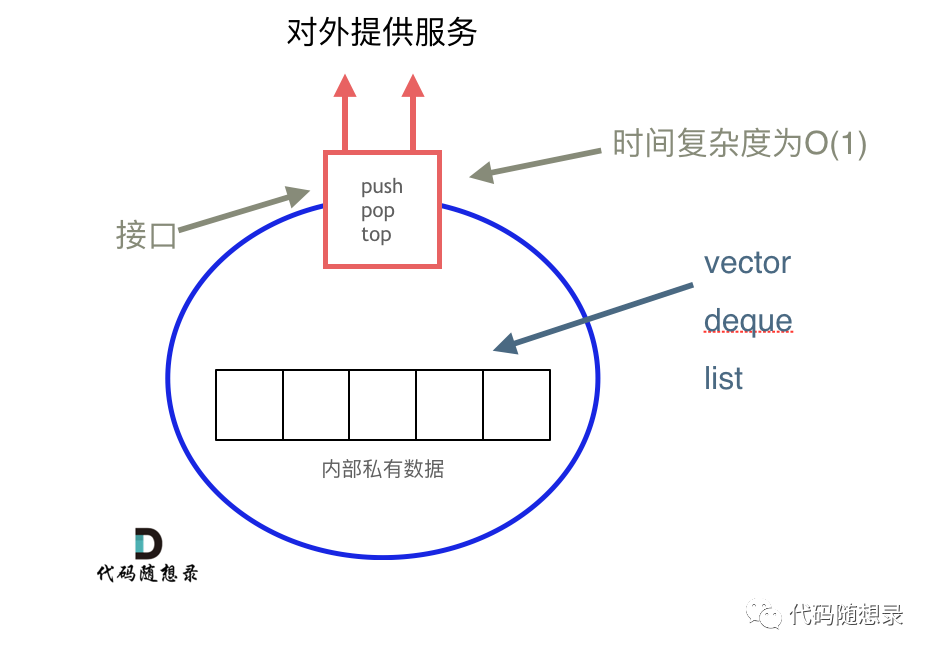
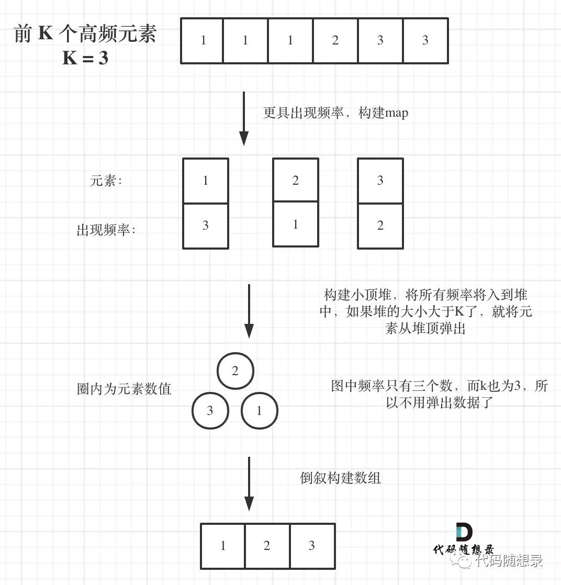

# 栈与队列

游戏开发可能使用栈结构，**编程语言的一些功能实现也会使用栈结构，实现函数递归调用就需要栈。**


**递归的实现就是：每一次递归调用都会把函数的局部变量、参数值和返回地址等压入调用栈中**，然后递归返回的时候，从栈顶弹出上一次递归的各项参数，所以这就是递归为什么可以返回上一层位置的原因。


栈溢出，系统输出的异常是`Segmentation fault`（当然不是所有的`Segmentation fault` 都是栈溢出导致的） ，如果你使用了递归，就要想一想是不是无限递归了，那么系统调用栈就会溢出。


**在企业项目开发中，尽量不要使用递归！**在项目比较大的时候，由于参数多，全局变量等等，使用递归很容易判断不充分return的条件，非常容易无限递归（或者递归层级过深），**造成栈溢出错误（这种问题还不好排查！）**


---

## 基础

队列是先进先出，栈是先进后出。

**C++ 中 stack 是容器么？**

栈和队列是 STL（C++ 标准库）里面的两个**数据结构**。C++ 标准库是有多个版本的，那么来介绍一下，三个最为普遍的 STL 版本：

- HP STL

其他版本的C++ STL，一般是以HP STL为蓝本实现出来的，HP STL是C++ STL的**第一个实现版本**，而且开放源代码。

- P.J.Plauger STL

由 P.J.Plauger 参照HP STL实现出来的，被 Visual C++ 编译器所采用，不是开源的。

- SGI STL

由 Silicon Graphics Computer Systems 公司参照 HP STL 实现，被 Linux 的 C++ 编译器GCC 所采用，SGI STL 是开源软件，源码可读性甚高。


**我们使用的 stack 是属于那个版本的STL？**

接下来介绍的栈和队列也是SGI STL里面的数据结构，**我们一般使用的STL也是SGI STL**，知道了使用版本，才知道对应的底层实现。


**我们使用的STL中stack是如何实现的？**/ **stack 提供迭代器来遍历stack空间么？**

栈提供 push 和 pop 等等接口，所有元素必须符合先进后出规则，所以栈不提供走访功能，也不提供迭代器(iterator)。不像是 set 或者 map 提供迭代器 iterator 来遍历所有元素。

> **栈是以底层容器完成其所有的工作，对外提供统一的接口，底层容器(deque, list, vector, ...)是可插拔的（也就是说我们可以控制使用哪种容器来实现栈的功能）。**


所以 STL 中栈往往不被归类为容器，而被归类为 container adapter（容器适配器）。

从下图中可以看出，栈的内部结构，栈的底层实现可以是vector，deque，list 都是可以的， 主要就是数组和链表的底层实现。



**「我们常用的SGI STL，如果没有指定底层实现的话，默认是以deque为缺省情况下栈的低层结构。」**

deque是一个双向队列，只要封住一段，只开通另一端就可以实现栈的逻辑了。

**「SGI STL中 队列底层实现缺省情况下一样使用 deque 实现的。」**

我们也可以指定vector为栈的底层实现，初始化语句如下：

```c++
std::stack<int, std::vector<int> > third;  // 使用vector为底层容器的栈
```

刚刚讲过栈的特性，对应的队列的情况是一样的。


队列 先进先出的数据结构，同样不允许有遍历行为，不提供迭代器， **SGI STL中队列一样是以 deque 为缺省情况下的底部结构。**

也可以指定 list 为起底层实现，初始化queue的语句如下：

```c++
std::queue<int, std::list<int>> third; // 定义以list为底层容器的队列
```

所以 STL 中**队列也不被归类为容器**，而被归类为container adapter（ 容器适配器）。

我这里讲的都是（clck）C++ 语言中情况， 使用其他语言的同学也要思考栈与队列的底层实现问题， 不要对数据结构的使用浅尝辄止，而要深挖起内部原理，才能夯实基础！


**栈里面的元素在内存中是连续分布的么？**

这个问题有两个陷阱：

陷阱1：栈是容器适配器，底层容器使用不同的容器，导致栈内数据在内存中是不是连续分布。
陷阱2：缺省情况下，默认底层容器是deque，那么deque的在内存中的数据分布是什么样的呢？答案是：不连续的，下文也会提到deque。


---

## 232. 用栈实现队列

使用栈来模式队列的行为，如果仅仅用一个栈，是一定不行的，所以需要两个栈**「一个输入栈，一个输出栈」**，这里要注意输入栈和输出栈的关系。


peek()的实现，直接复用了pop()。

再多说一些代码开发上的习惯问题，在工业级别代码开发中，最忌讳的就是 实现一个类似的函数，直接把代码粘过来改一改就完事了。

这样的项目代码会越来越乱，**「一定要懂得复用，功能相近的函数要抽象出来，不要大量的复制粘贴，很容易出问题！（踩过坑的人自然懂）」**


```c++
class MyQueue {
public:
    MyQueue() {

    }
    
    void push(int x) {
        mStT = stack<int>();
        while (mStO.size()) {                   // 把 mStO 里的内容翻转到 mStT 中
            int num = mStO.top(); mStO.pop();
            mStT.push(num);
        }
        
        mStO.push(x);                           // x 入栈底

        while (mStT.size()) {                   // 再翻转回来
            int num = mStT.top(); mStT.pop();
            mStO.push(num);
        }
    }
    
    int pop() {
        int num = mStO.top(); mStO.pop();
        return num;
    }
    
    int peek() {
        return mStO.top();
    }
    
    bool empty() {
        return mStO.empty();
    }

private:    
    stack<int> mStO;
    stack<int> mStT;     
};
```


## 225. 用队列实现栈

**「用两个队列que1和que2实现栈的功能，que2其实完全就是一个备份的作用」**

重点在push，备份push前所有的元素，然后加入队首，再把备份入队

```c++
class MyStack {
public:
    MyStack() {

    }
    
    void push(int x) {
        mqT = mqO;
        mqO = queue<int>();     // 置空
        mqO.push(x);            // 把x加入队首
        while (mqT.size()) {    // 把原来的结点，再加进去
            int num = mqT.front(); mqT.pop();
            mqO.push(num);
        }
    }
    /*只用一个队列*/
    void push2(int x) { 
        int size = mqO.size();

        mqO.push(x);
        for (int i = 0; i < size; ++i) {
            mqO.push(mqO.front()); mqO.pop();
        }
        return;
    }
    
    int pop() {
        int num = mqO.front(); mqO.pop();
        return num;
    }
    
    int top() {
        return mqO.front();
    }
    
    bool empty() {
        return mqO.empty();
    }

private:
    queue<int> mqT;
    queue<int> mqO;    
};
```


---

## 71. 简化路径

```c++
string simplifyPath(string path) {
    vector<string> vec; //保存分解的path
    string tmp = "/";

    // 分解path 以/为分界线  1个/////分开保存为5个/
    for (int i = 1; i < path.size(); ++i) {
        if (path[i] == '/') {
            vec.push_back(tmp);
            tmp = "/";
        } else {
            tmp += path[i];
        }
    }
    // 结尾不为/时，需要把最后的tmp加进去
    if (tmp != "/") {
        vec.push_back(tmp);
    }

    stack<string> st;   //用来解析path
    // 处理已经分解的path
    for (int i = 0; i < vec.size(); ++i) {
        if (vec[i] == "/." || vec[i] == "/") {  // 如果为/.或者/ 直接不处理
            continue;
        } else if (vec[i] == "/.." && !st.empty()) {  // 如果为/.. 且栈不为空，则返回上一路径，即栈pop
            st.pop();
            continue;   
        } else if (vec[i] == "/.." && st.empty()) {   // 如果为/.. 且栈不为空 
            continue;   //从根目录向上一级是不可行的，因为根目录是你可以到达的最高级，什么也不执行
        }
        st.push(vec[i]);//正常情况添加路径
    }

    if (st.empty()) return "/"; //如果栈为空，则返回根目录

    string res;
    while (!st.empty()) {      //合并目录，栈内元素在前。
        res = st.top() + res;
        st.pop();
    }

    return res;
}
```


## 20. 有效的括号

```c++
class Solution {
public:
    bool isValid(string s) {
        stack<int> st;

        for (int i = 0; i < s.size(); i++) {
            // 三个左
            if (s[i] == '(') st.push(')');
            else if (s[i] == '{') st.push('}');
            else if (s[i] == '[') st.push(']');
            // 三个右
            else if (st.empty() || s[i] != st.top()) return false; // 为右括号且不为空 返回false； 为右括号且与栈顶元素不同，即不对应
            else if (s[i] == st.top()) st.pop(); //为右且前一个为对应的左，pop出
            else st.push(s[i]);
        }

        return st.empty();
    }
};
```


## 1047. 删除字符串中的所有相邻重复项

```c++
string removeDuplicates(string S) {
    stack<int> st;
    for (char s : S) {
        if (!st.empty() && st.top() == s) {
            st.pop();
        } else {
            st.push(s);
        }
    }

    string res;
    while (!st.empty()) {
        res += st.top();
        st.pop();
    }
    reverse(res.begin(), res.end());
    return res;
}
```


---

## 150. 逆波兰表达式求值

逆波兰表达式：是一种后缀表达式，所谓后缀就是指算符写在后面。

平常使用的算式则是一种中缀表达式，如 ( 1 + 2 ) * ( 3 + 4 ) 。

该算式的逆波兰表达式写法为 ( ( 1 2 + ) ( 3 4 + ) * ) 。

**所以RPN（后缀表达式）对计算机来说是非常友好的**

**其实逆波兰表达式相当于是二叉树中的后序遍历**

```c++
int evalRPN(vector<string>& tokens) {
    stack<int> st;
    int a, b, c;
    for (int i = 0; i < tokens.size(); i++) {
        if (tokens[i] == "+" || tokens[i] == "-" || tokens[i] == "*" || tokens[i] == "/") {
            a = st.top();
            st.pop();
            b = st.top();
            st.pop();
            if (tokens[i] == "+") {
                st.push(a + b);
            } else if (tokens[i] == "-") {
                st.push(b - a);
            } else if (tokens[i] == "*") {
                st.push(a * b);
            } else if (tokens[i] == "/") {
                st.push(b / a);
            }
        } else {
            st.push(stoi(tokens[i]));
        }
    }
    return st.top();
}
```


---

## 239. 滑动窗口最大值

每次窗口移动的时候，调用 `que.pop` (滑动窗口中移除元素的数值)，`que.push` (滑动窗口添加元素的数值)，然后 `que.front()` 就返回我们要的最大值。

「其实队列没有必要维护窗口里的所有元素，只需要**维护**有**可能成为窗口里最大值**的元素就可以了，同时保证队列里的元素数值是由大到小的。」


设计单调队列的时候，pop 和 push 操作要保持如下规则：

1. `pop(value)`：如果窗口移除的元素 value 等于单调队列的出口元素，那么队列弹出元素，否则不用任何操作
2. `push(value)`：如果 push 的元素 value 大于入口元素的数值，那么就将队列入口的元素弹出，直到 push 元素的数值小于等于队列入口元素的数值为止


```c++
class MyQueue {//单调队列（从大到小）
    public:
    deque<int> que;// 使用deque来实现单调队列

    // 如果窗口移除的元素value等于单调队列的出口元素，那么队列弹出元素，否则不用任何操作   // 同时pop之前判断队列当前是否为空。
    void pop(int value) {
        if (!que.empty() && value == que.front()) {
            que.pop_front();
        }
    }

    //如果push的元素value大于入口元素的数值，那么就将队列入口的元素弹出，直到push元素的数值小于等于队列入口元素的数值为止。这样就保持了队列里的数值是单调从大到小的了。
    void push(int value) {
        while (!que.empty() && value > que.back()) {
            que.pop_back();
        }
        que.push_back(value);
    }

    // 查询当前队列里的最大值 直接返回队列前端也就是front就可以了。
    int front() {
        return que.front();
    }
};
```


```c++
vector<int> maxSlidingWindow(vector<int>& nums, int k) {
    MyQueue que;
    vector<int> res;
    for (int i = 0; i < k; i++) { // 先将前k的元素放进队列
        que.push(nums[i]);
    }

    res.push_back(que.front()); // result 记录前k的元素的最大值
    for (int i = k; i < nums.size(); i++) {
        que.pop(nums[i - k]); // 滑动窗口移除最前面元素
        que.push(nums[i]); // 滑动窗口前加入最后面的元素
        res.push_back(que.front()); // 记录对应的最大值
    }
    return res;
}
```


在来看一下时间复杂度，使用单调队列的时间复杂度是 O(n)。


---

## 347. 前 K 个高频元素

这道题目主要涉及到如下三块内容：

1. 要统计元素出现频率
2. 对频率排序
3. 找出前K个高频元素

优先级队列，其实**「就是一个披着队列外衣的堆」**

**「堆是一颗完全二叉树，树中每个结点的值都不小于（或不大于）其左右孩子的值。」** 如果父亲结点是大于等于左右孩子就是大顶堆，小于等于左右孩子就是小顶堆。

所以大家经常说的大顶堆（堆头是最大元素），小顶堆（堆头是最小元素），直接用priority_queue（优先级队列）就可以，底层实现都是一样的，从小到大排就是小顶堆，从大到小排就是大顶堆。


**「所以我们要用小顶堆，因为要统计最大前k个元素，只有小顶堆每次将最小的元素弹出，最后小顶堆里积累的才是前k个最大元素。」**



```c++
class Solution {
public:
    //小顶堆比较方式
    class mycomparsion {
    public:
        bool operator () (const pair<int, int>& lhs, const pair<int, int>& rhs) {
            return lhs.second > rhs.second;
        }
    };

    vector<int> topKFrequent(vector<int>& nums, int k) {
        unordered_map<int, int> mp;
        for (int i = 0; i < nums.size(); i++) {
            mp[nums[i]]++;
        }

        priority_queue<pair<int, int>, vector<pair<int, int>>, mycomparsion> pri_que;
        for (unordered_map<int, int>::iterator it = mp.begin(); it != mp.end(); it++) {
            pri_que.push(*it);
            if (pri_que.size() > k) {
                pri_que.pop();
            }
        } 
        vector<int> res(k);
        for (int i = k - 1; i >= 0; i--) {
            res[i] = pri_que.top().first;
            pri_que.pop();
        }
        return res;
    }
};
```


---

# 栈

## 735. 行星碰撞

```c++
class Solution {
public:
    vector<int> asteroidCollision(vector<int>& asteroids) {
        stack<int> st;
        vector<int> res;
        
        int idx = 0, n = asteroids.size();
        while (idx < n) {
            int num = asteroids[idx];
            if (st.empty()) {
                st.push(num);
                idx++;
                continue;
            }

            // a > 0, b > 0 
            // a < 0, b < 0
            // a < 0, b > 0
            if ((st.top() > 0 && num > 0) || (st.top() < 0 && num < 0) || (st.top() < 0 && num > 0)) {
                st.push(num);
                idx++;
                continue;
            } else {
                // a > 0, b < 0
                if (abs(st.top()) == abs(num)) {
                    st.pop();
                    idx++;
                } else if (abs(st.top()) > abs(num)) {
                    idx++;
                } else {
                    st.pop();
                }
            }      
        }

        while (!st.empty()) {
            res.push_back(st.top());
            st.pop();
        }

        reverse(res.begin(), res.end());

        return res;
    }
};
```


## 1381. 设计一个支持增量操作的栈
### 思路

直接用 stack 模拟

- increment 的时候，需要用一个辅助栈，计算出需要 +val 的边界 `int remain = max(0, (int)(mSt.size() - k));`

```c++
class CustomStack {
public:
    CustomStack(int maxSize) : mMaxSize(maxSize) {

    }
    
    void push(int x) {
        if (mSt.size() < mMaxSize) {
            mSt.push(x);
        }
    }
    
    int pop() {
        if (mSt.size() == 0) return -1;
        int num = mSt.top(); mSt.pop();
        return num;
    }
    
    void increment(int k, int val) {
        stack<int> mStTmp;
        int remain = max(0, (int)(mSt.size() - k));    // 不加的个数

        while (remain) {                        // 把不加 val 的数字给跳过去
            mStTmp.push(mSt.top()); mSt.pop();
            remain--;
        }

        while (mSt.size()) {                    // 把剩下的 mSt 里的元素 + val
            mStTmp.push(mSt.top() + val); mSt.pop();
        }

        while (mStTmp.size()) {                 // 
            mSt.push(mStTmp.top()); mStTmp.pop();
        }
    }

private:
    int mMaxSize;
    stack<int> mSt;
};
```
> + 时间复杂度: O(n)
> + 空间复杂度: O(n)

----

### 优化

直接用数组模拟栈就好了，对栈底元素好处理

```c++
class CustomStack {
public:
    CustomStack(int maxSize) : mMaxSize(maxSize) {

    }
    
    void push(int x) {
        if (mVec.size() < mMaxSize) {
            mVec.push_back(x);
        }
    }
    
    int pop() {
        if (mVec.size() == 0) return -1;
        int num = mVec.back(); mVec.erase((--mVec.end()));
        return num;
    }
    
    void increment(int k, int val) {
        for (int i = 0; i < min(k, (int)mVec.size()); ++i) 
            mVec[i] += val;
    }

private:
    int mMaxSize;
    vector<int> mVec;
};
```


> + 时间复杂度: O(n)
> + 空间复杂度: O(n)

----

### 负优化

去除繁琐的 erase，直接用 `top` 表示栈顶位置

```c++
class CustomStack {
public:
    CustomStack(int maxSize) : mMaxSize(maxSize) {
        mVec.resize(maxSize);
        top = -1;
    }
    
    void push(int x) {
        if (top < mMaxSize - 1) {
            ++top;
            mVec[top] = x;
        }
    }
    
    int pop() {
        if (top == -1) return -1;
        int num = mVec[top]; 
        --top;
        return num;
    }
    
    void increment(int k, int val) {
        for (int i = 0; i < min(k, top+1); ++i) 
            mVec[i] += val;
    }

private:
    int mMaxSize;
    int top;        // 表示栈顶
    vector<int> mVec;
};
```
> + 时间复杂度: O(n)
> + 空间复杂度: O(n)

---
### 究极优化

- 只有在 pop 操作时，我们才需要知道栈顶元素的具体值，在其余的情况下，我们只要存储每个元素的增量就行了。
- 因此在遇到 pop 操作时，我们返回栈顶元素的初始值加上增量 add[top]。
- `add[i]` 表示前 i - 1 个元素的增量

```c++
class CustomStack {
public:
    CustomStack(int maxSize) : mMaxSize(maxSize) {
        mVec.resize(maxSize);
        mInc.resize(maxSize);
        top = -1;
    }
    
    void push(int x) {
        if (top < mMaxSize - 1) {
            ++top;
            mVec[top] = x;
        }
    }
    
    int pop() {
        if (top == -1) return -1;
        int num = mVec[top] + mInc[top]; 
        if (top > 0) {
            mInc[top - 1] += mInc[top];
        }
        mInc[top] = 0;
        --top;
        return num;
    }
    
    void increment(int k, int val) {
        int idx = min(k - 1, top); 
        
        if (idx >= 0)   // top 可能是 -1
            mInc[idx] += val;
    }

private:
    int mMaxSize;
    int top;        // 表示栈顶
    vector<int> mVec, mInc; //mInc[i] 表示下标<=i的元素的增量
};
```
> + 时间复杂度: O(1)
> + 空间复杂度: O(1)


---

## 768. 最多能完成排序的块 II

根据题意，将原数组进行分块后，对各分块分别进行排序后的结果等于原数组排序后的结果。可以得到的一个结论是，每个分块中的数字相对于前一个分块都是递增的(因为有重复数字，所以也可能是相同)，**下一个分块中的所有数字都会大于等于上一个分块中的所有数字**。

- 在遍历数组的过程中，如果一个数字比之前所有分块的最大值都要大，我们就把它作为一个新的分块。
- 如果数字小于之前某些分块的最大值，那这些分块都要被合成一个分块(保持栈的单调递增)。

```c++
int maxChunksToSorted(vector<int>& arr) {
        stack<int> st;
        st.push(arr[0]);

        for (int i = 1; i < arr.size(); ++i) {
            if (arr[i] >= st.top()) {
                st.push(arr[i]);
            } else {
                int head = st.top(); st.pop();  // 先把头部取出来
                while (st.size() != 0 && arr[i] < st.top()) { // 合并比他大的数
                    st.pop();
                }
                st.push(head);
            }
        }

        return st.size();
    }
```


---

## 636. 函数的独占时间

我们可以用栈来模拟函数调用的过程，**栈顶**的元素为当前**正在执行函数**：

- 当函数调用开始时，**如果当前有函数正在运行**，则当前正在运行函数应当停止，此时计算其的执行时间，然后将调用函数入栈。

- 当函数调用结束时，将栈顶元素弹出，并计算相应的执行时间，**如果此时栈顶有被暂停的函数**，则开始运行该函数。

由于每一个函数都有一个对应的 start 和 end 日志，且当遇到一个 end 日志时，栈顶元素一定为其对应的 start 日志。那么我们对于每一个函数记录它的函数标识符和上次开始运行的时间戳，此时我们只需要在每次函数暂停运行的时候来计算执行时间和开始运行的时候更新时间戳即可。

```C++
class Solution {
public:
    vector<int> exclusiveTime(int n, vector<string>& logs) {
        stack<pair<int, int>> st; //存当前的函数调用的 起始时间，因为一定是配对的，所以不用存 function_id

        vector<int> res(n, 0);
        for (auto &s : logs) {
            int n = s.size();
            int pos1 = s.find(":");            
            int pos2 = s.find(":", pos1 + 1);
            int func_id = stoi(s.substr(0, pos1));
            int time = stoi(s.substr(pos2 + 1, n - pos2 - 1));
            // printf("%d %d %d\n", pos1, pos2, time);

            if (pos2 - pos1 == 6) { // start
                if (!st.empty()) {  // 如果栈不为空, 说明是函数1里又调用了函数2, 需要计算时间函数1的前半部分的时间
                    res[st.top().first] += time - st.top().second;
                }
                st.emplace(func_id, time);      // start time
            } else {        // end
                auto [curFuncId, startTime] = st.top(); st.pop();
                res[curFuncId] += time - startTime + 1; 
                if (!st.empty()) {  // 如果栈不为空, 说明是函数1里调用的函数2完毕, 需要计算时间函数1的后半部分的时间，因此需要将时间更新为后半部分的起始时间
                    st.top().second = time + 1;
                }
            }
        }
    
        return res;
    }
};
```


时间复杂度：O(n)，其中 n 为全部日志 logs 的数量，n 条日志信息对应总共 n 次入栈和出栈操作。
空间复杂度：O(n)，其中 n 为全部日志 logs 的数量，n 条日志信息对应 $\frac{n}{2}$ 次入栈操作，最坏的情况下全部 $\frac{n}{2}$ 条日志入栈后才会依次弹栈。


其中字符串解析，如果不要求速度，可以用以下简单的方式

```c++
int func_id, time;
char str[6];
sscanf(s.c_str(), "%d:%[^:]:%d", &func_id, str, &time);

if (str[0] == 's') { // start
}
```


---

# 队列
