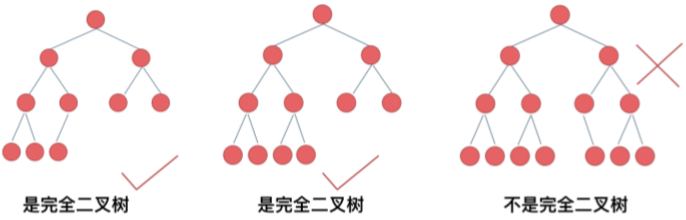
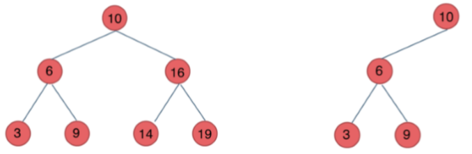
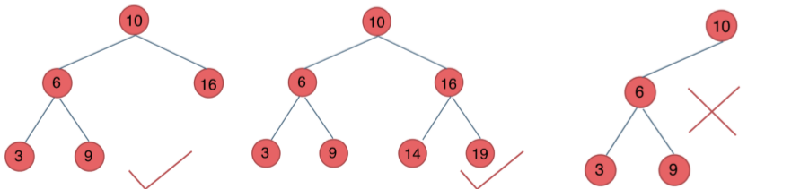
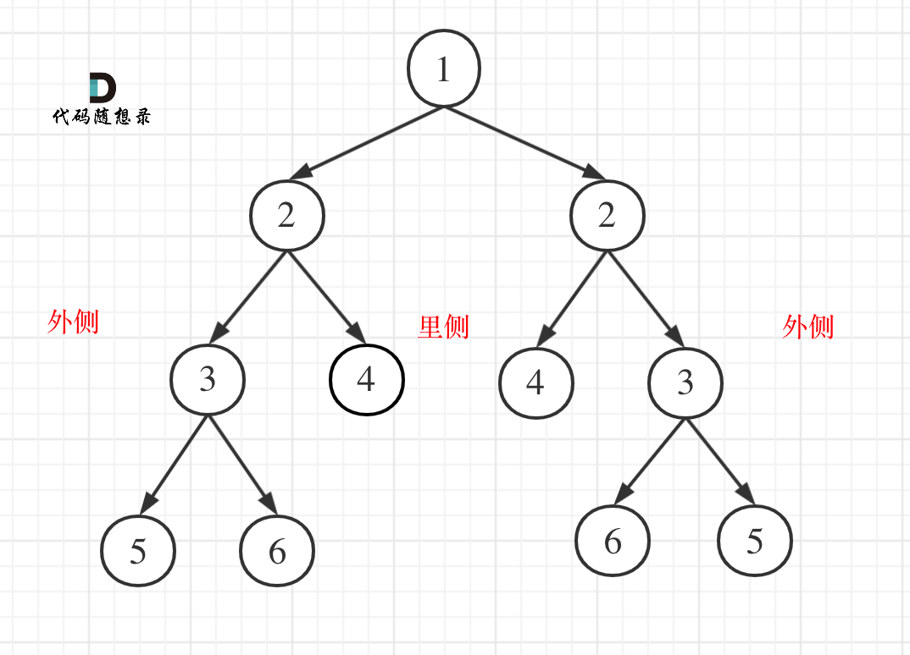
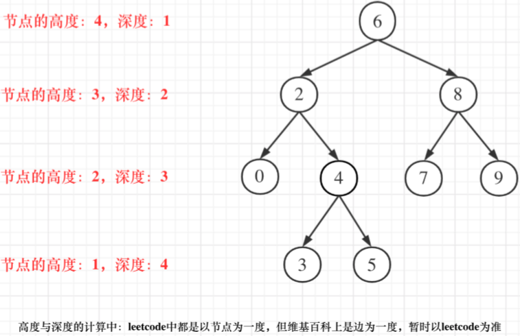
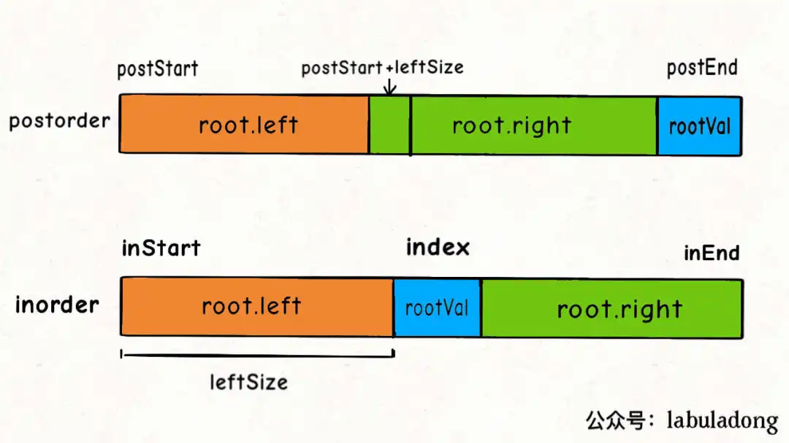
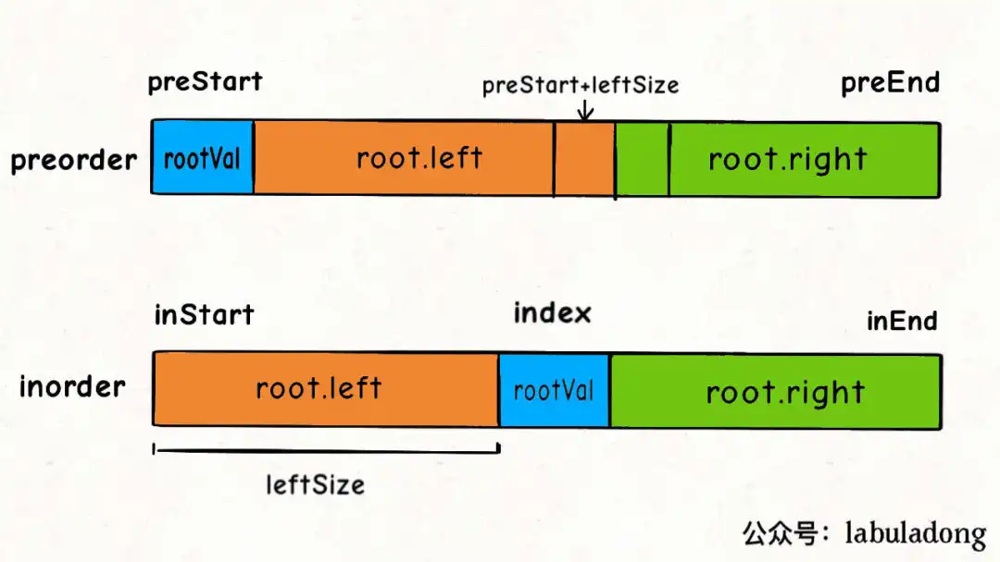
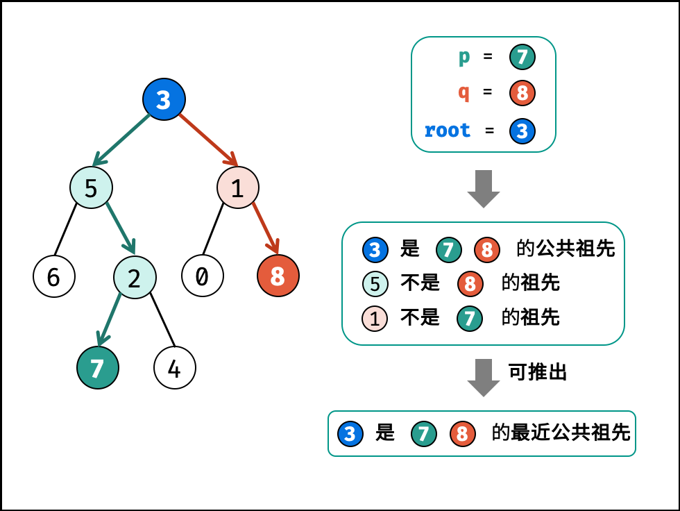
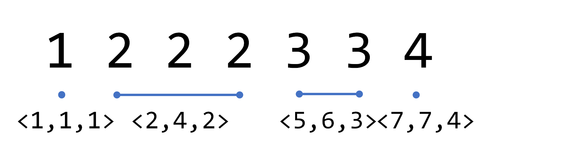

# 树/二叉树

## 1. 种类

### 1.1. 满二叉树

国内定义：除最后一层无任何子节点外，每一层上的所有结点都有两个子结点的二叉树。满二叉树外观上是一个**三角形**。

国外定义：如果一棵树只有**度**为 **0** 的 **2** 的结点，并且度为 0 的结点在同一层上，则这棵二叉树为满二叉树。


### 1.2. 完全二叉树

除了最底层节点可能没被填满外，其余每层节点数都达到最大值，并且最下面一层的节点都集中在该层最**左**边的若干位置。若最底层为第h层，则该层节点数范围为  $1$ ~ $2^h-1$ 个。



优先级队列起始是一个堆，堆就是一颗完全二叉树，同时保证父子节点的**顺序**关系。


### 1.3. 二叉搜索树

BST  Binary Search Tree

二叉搜索树是有**数值**的，且是一个**有序**树。

- 若其左子树不空，则左子树所有结点的值均小于它的根节点的值；
- 若其右子树不空，则右子树所有结点的值均大于它的根节点的值；
- 其左右子树也分别为二叉排序树。



上两棵都是二叉搜索树


一个二叉搜索树，那么**中序遍历的结果就会是一个递增序列**，因此只需要判断每次节点上的值是否大于前一个值，如果大于就继续向后遍历，直到最后一个空节点，如果出现后一个节点的值小于前一个节点，就直接返回false。


### 1.4. 平衡二叉搜索树

AVL（Adelson-Velsky and Landis）树，它是一棵空树或它的左右两个子树的高度差的绝对值不超过1，并且左右两个子树都是一颗平衡二叉树。



​	最后一棵高度差超过1.


C++中**map、set、multimap，multiset**的底层实现都是**平衡二叉搜索树**。所有map、set的增删操作时间复杂度都是 `log(n)`，特别的**unordered_map、unordered_set**底层实现为**哈希表**。


### 1.5. Complete/Perfect/Full

国外定义的**满**二叉树 Full Binary Tree 是指一棵二叉树的所有节点要么**没有孩子节点**，要么有**两个孩子节点**；

**完全**二叉树对应 Complete Binary Tree；有**顺序**限制。

**国内**定义的**满**二叉树 Perfect Binary Tree是指除最后一层无任何子节点外，每一层上的所有结点都有两个子结点的二叉树。


---

## 2. 存储方式

链式存储，指针，不连续

顺序存储，数组，连续	父节点数组下标为 `i`， 左孩子为`i*2+1` ，右孩子为 `i*2 + 2`

```c++
for (int i = 0; i < N; ++i) {
    cin >> tree1[i];
}

for (int i = 0; i < N; ++i) {
    cin >> tree2[i];
}

TreeNode* root = new TreeNode();
root = traverse(tree1, 0, N - 1, tree2, 0, N - 1);


TreeNode* traverse(vector<int> &inorder, int inStart, int inEnd, 
            vector<int> &postorder, int postStart, int postEnd) {
    
    if (inStart > inEnd || postStart > postEnd) {
        return nullptr;
    }

    int midIdx = -1;
    int midV = postorder[postEnd];
    for (int i = inStart; i <= inEnd; ++i) {
        if (inorder[i] == midV) {
            midIdx = i;
            break;
        }
    }

    TreeNode* root = new TreeNode(midV);

    root->left = traverse(inorder, inStart, midIdx-1,
            postorder, postStart, postStart + midIdx - inStart - 1);
    root->right = traverse(inorder, midIdx + 1, inEnd,
            postorder, postStart + midIdx - inStart, postEnd - 1);
    return root;
}
```


----

## 3. 定义

```c++
struct TreeNode{
    int val;
    TreeNode *left;
    TreeNode *right;
    TreeNode(int x): val(x), left(NULL), right(NULL) {}
};
```


---

## 4. 遍历方式

深度优先遍历：先往深走，遇到叶子节点再往回走

- 前序遍历 递归、迭代   中左右
- 中序遍历 递归、迭代   左中右
- 后序遍历 递归、迭代   左右中（需要知道子树信息的一定是后序遍历）

广度优先遍历：一层一层的遍历.

- 层次遍历 迭代


---

### 4.1. 递归遍历

递归三要素

1. **确定递归函数的参数和返回值**：确定哪些参数是递归过程中需要处理的，就在函数中加此参数。并且还要明确每次递归的返回值，确定递归函数返回类型。
2. **确定终止条件**：防止栈溢出。
3. **确定单层递归的逻辑**：确定每层递归要处理的信息。


确定递归函数的参数和返回值：

[94. Binary Tree Inorder Traversal](94+inorderTraversal.cpp)

[144. Binary Tree Preorder Traversal](144+preorderTraversal.cpp)

[145. Binary Tree Postorder Traversal](145+postorderTraversal.cpp)

```c++
void traversal(TreeNode* cur, vector<int>& vec) {
    if (cur == NULL) return;
    
    
    traversal(cur->left, vec); // 左
    vec.push_back(cur->val); // 中
    traversal(cur->right, vec); // 右
}

void traversal(TreeNode* cur, vector<int>& vec) {
    if (cur == NULL) return;
    
    vec.push_back(cur->val); // 中
    traversal(cur->left, vec); // 左
    traversal(cur->right, vec); // 右
}


void traversal(TreeNode* cur, vector<int>& vec) {
    if (cur == NULL) return;
    
    traversal(cur->left, vec); // 左
    traversal(cur->right, vec); // 右
    vec.push_back(cur->val); // 中
}

```


---

### 4.2. 迭代遍历

递归的实现：每一次递归第调用都会把函数的局部变量、参数值和返回地址等**压入调用栈**中，递归返回时，从栈顶弹出上一次递归的各项参数。

**注意空节点不入栈**

#### 前序

```c++
vector<int> preorderTraversal (TreeNode* root) {
  	stack<TreeNode*> st;
    vector<int> res;
    if (!root) return res;
    st.push(root);
    while (!st.empty()) {
        TreeNode* node = st.top();
        st.pop();
        res.push_back(node->value);
        if (node->right) st.push(node->right); //空节点不如栈 
        if (node->left)  st.push(node->left);  //栈先进后出 所有最后压左子树
    }
    return res;
}
```

#### 中序 

借助指针的遍历来帮助访问节点，栈用来处理节点上的元素。

```c++
vector<int> inorderTraversal (TreeNode* root) {
  	stack<TreeNode*> st;
    vector<int> res;
	TreeNode* cur = root;
    while ( !cur || !st.empty()) {
		if (!cur) {
        	st.push(cur);
            cur = cur->left;
        } else {
            cur = st.top();
            st.pop();
            res.push_back(cur->val);
            cur = cur->right;
        }
    }
    return res;
}
```

#### 后序

```c++
vector<int> PostorderTraversal (TreeNode* root) {
    stack<TreeNode*> st;
    vector<int> res;
    if (!root) return res;
    st.push(root);
    while (!st.empty()) {
        TreeNode* node = st.top();
        st.pop();
        res.push_back(node->value);
        if (node->left)  st.push(node->left);  //栈先进后出 所有最后压左子树
        if (node->right) st.push(node->right); //空节点不如栈 
    }
    reverse(res.begin(), res.end());//反转 左右中
    return res;
}
```

这样的风格不统一。


---

### 4.3. 统一迭代遍历

将访问的节点放入栈中，把要处理的节点也放入栈中，但是做标记。

即要处理的节点放入栈之后，**紧接着放入一个空指针作为标记**。**标记法**

#### 中序

```c++
// 左中右 压栈为 右中左
vector<int> inorderTraversal(TreeNode* root) {
    vecotr<int> res;
    stack<TreeNode*> st;
    if (root != NULL) st.push(root);
    while (!st.empty()) {
        TreeNode* node = st.top();
        if (node != NULL) {
            st.pop(); //弹出，避免重复操作，再将右中左节点添加到栈中
            if (node->right) st.push(node->right);	// 添加右节点
            st.push(node);							// 添加中节点
            st.push(NULL);							// 访问过中节点，但是还没有处理，加入空做标记
            	
            if (node->left) st.push(node->left);	// 添加左节点
        } else {			// 遇到空节点时，将下一个节点放进结果集
            st.pop();		
            node = st.top();
            st.pop();
            res.push_back(node->val);
        }
    }
    return res;
}
```


#### 前序

```c++
// 中左右 压栈为 右左中
vector<int> PreTraversal(TreeNode* root) {
    vector<int> res;
    stack<TreeNode*> st;
    if (root != NULL) st.push(root);
    while (!st.empty()) {
    	TreeNode* node = st.top();
        if (node != NULL) {
            st.pop();
            if (node->right) 	st.push(node->right);
            if (node->left) 	st.push(node->left);
            st.push(node); 	//放中节点，
            st.push(NULL);	//访问过加null
        } else {
            st.pop();
            node = st.top();
            st.pop();
            res.push_back(node->val);
        }
    }
    return res;
}
```


#### 后序

```c++
// 左右中 压栈为 中右左
vector<int> PreTraversal(TreeNode* root) {
    vector<int> res;
    stack<TreeNode*> st;
    if (root != NULL) st.push(root);
    while (!st.empty()) {
    	TreeNode* node = st.top();
        if (node != NULL) {
            /* 可省略
            st.pop();
            st.push(node); 	//放中节点，
            */
            st.push(NULL);	//访问过加null
            if (node->right) 	st.push(node->right);
            if (node->left) 	st.push(node->left);
        } else {
            st.pop();
            node = st.top();
            st.pop();
            res.push_back(node->val);
        }
    }
    return res;
}
```


---

### 4.4. 层序遍历

#### 自顶向下

即逐层的，从左到右访问所有节点

需要借助一个辅助数据结构即**队列**来实现，队列先进先出，符合一层一层**宽度优先遍历**的逻辑（用**栈**先进后出是模拟**深度优先遍历**也就是**递归**的逻辑。）

```c++
vector<vector<int>> levelOrder(TreeNode* root) {
    queue<TreeNode*> que;
    if (root != NULL) que.push(root);
    vector<vector<int>> res;
    while (!que.empty()) {
        int size = que.size();
        vector<int> vec;

        for (int i = 0; i < size; i++) {
            TreeNode* node = que.front();	//注意这个在循环里
            que.pop();
            vec.push_back(node->val);
            if (node->left)   que.push(node->left);
            if (node->right)  que.push(node->right);
        }
        res.push_back(vec);
    }
    return res;
} 
```


#### 自底向上

```c++
自顶向下处理后 直接反转 
reverse();
```


#### 习题

**199. binary tree right side view** 二叉树的右视图


```c++
vector<int> rightSideView(TreeNode* root) {
    queue<TreeNode*> que;
    if (root != NULL) que.push(root);
    vector<int> res;

    while (!que.empty()) {
        int size = que.size();

        for (int i = 0; i < size; i++) {
            TreeNode* node = que.front();
            que.pop();
            if (i == size-1 ) res.push_back(node->val);
            if (node->left)   que.push(node->left);
            if (node->right)  que.push(node->right);
        }
    }
    return res;
}
```


**637. Average of Levels in Binary Tree** 二叉树的层平均值

```c++
vector<double> averageOfLevels(TreeNode* root) {
    queue<TreeNode*> que;
    if (root != NULL) que.push(root);
    vector<double> res;

    while (!que.empty()) {
        int size = que.size();
        double asum = 0;	//!!!!!!!!!!!!!注意清零
        for (int i = 0; i < size; i++) {
            TreeNode* node = que.front();
            que.pop();
            asum += node->val;
            if (node->left)   que.push(node->left);
            if (node->right)  que.push(node->right);
        }
        res.push_back(double(asum/size));
    } 
    return res;
}  
```


**429. N-ary Tree Level Order Traversal**  N叉树的层序遍历

```c++
vector<vector<int>> levelOrder(Node* root) {
        vector<vector<int>> res;
        queue<Node*> que;
        if (root != NULL) que.push(root);
        while (!que.empty()) {
            Node* node = que.front();
            vector<int> vec;
            int size = que.size();

            for (int i = 0; i < size; ++i) {
                Node* node = que.front();
                que.pop();
                vec.push_back(node->val);
                if (!node->children.empty()) {
                    int vsize = node->children.size();
                    for (int j = 0; j < vsize; ++j) {
                        que.push(node->children[j]);
                    }
                }    
            }
            res.push_back(vec);
        }
        return res;
    }
```


**515.Find Largest Value in Each Tree Row** 在每个树行中找最大值

```c++
vector<int> largestValues(TreeNode* root) {
    vector<int> res;
    queue<TreeNode*> que;
    if (root != NULL) que.push(root);

    while (!que.empty()) {
        TreeNode* node = que.front();
        int size = que.size();
        int flag = 0x80000000; //INT_MIN

        for (int i = 0; i < size; ++i) {
            TreeNode* node = que.front();
            que.pop();
            flag = node->val > flag ? node->val : flag;
            if (node->left)     que.push(node->left);
            if (node->right)    que.push(node->right);
        }
        res.push_back(flag);
    }
    return res;
}
```


**116. Populating Next Right Pointers in Each Node** 填充每个节点的下一个右侧节点指针

```c++
Node* connect(Node* root) {
    queue<Node*> que;
    if (root != NULL) que.push(root);
    while (!que.empty()) {
        int size = que.size();
        Node* node;
        Node* prenode;

        for (int i = 0; i < size; ++i) {
            if (i == 0) {
                prenode = que.front();
                que.pop();
                node = prenode;
            } else {
                node = que.front();
                que.pop();
                prenode->next = node;
                prenode = prenode->next;
            }
            if (node->left)     que.push(node->left);
            if (node->right)    que.push(node->right);
        }
        prenode->next = NULL; 	// prenode 或者 node 都可以
    }
    return root;
}
```


**117. Populating Next Right Pointers in Each Node II** 填充每个节点的下一个右侧节点指针 II

```c++
与116一模一样
```


---

## 5.  翻转二叉树

**226. Invert Binary Tree**

```c++
TreeNode* invertTree(TreeNode* root) {
    if (root == NULL) return root;
    TreeNode* tmp = root->right;
    root->right = root->left;
    root->left = tmp;
    // swap(root->left, root->right)
    invertTree(root->left);
    invertTree(root->right);
    return root;
}
```

针对二叉树的问题，解题前，想清楚究竟是**前中后层序哪种遍历**。


迭代的写法，保证原来的迭代遍历，只是把节点加入容器之后，再进行swap更换位置。

节点加入容器，是为了后续继续遍历。


---

## #1-5. 小结

**红黑树**就是一种**二叉平衡搜索树**，C++中 `map、multimap、set、multiset` 的底层实现机制就是二叉平衡搜索树，再具体就是红黑树

树的遍历有一种很厉害的方法 **morris遍历**

递归写法。**实际项目开发中，避免递归**。因为项目代码参数、调用关系都比较复杂，不容易控制递归深度，甚至会栈溢出。

栈实现递归写法（即迭代）

**栈实现递归写法（迭代统一）**。一定要掌握前后中序一种迭代的写法，面试官看写出了递归，会进一步考察能不能写出相应的迭代。


---

## 迭代法和递归法的区别

判断条件是相同的，迭代法是手动分配空间

**100.相同的树**

```c++
bool isSameTree(TreeNode* p, TreeNode* q) {
    queue<TreeNode*> que;
    que.push(p);
    que.push(q);

    while (!que.empty()) {
        TreeNode* L = que.front(); que.pop();
        TreeNode* R = que.front(); que.pop();

        if (L == nullptr && R == nullptr) continue;
        if (L == nullptr || R == nullptr || L->val != R->val) return false;

        que.push(L->left);
        que.push(R->left);
        que.push(L->right);
        que.push(R->right);
    }

    return true;

}
```


```c++
bool rec(TreeNode* L, TreeNode* R) {
    if (L == nullptr && R == nullptr) return true;

    if (L == nullptr || R == nullptr || L->val != R->val) {
        return false;
    } 

    return rec(L->left, R->left) & rec(L->right, R->right);
}

bool isSameTree(TreeNode* p, TreeNode* q) {
    return rec(p, q);
}
```


---

# 二叉树的属性

---

## 6. 对称二叉树

比较两个子树的里侧和外侧的元素是否相等。

**后序遍历**，一个树遍历顺序是左右中，另一个是右左中。



因为要遍历两棵树⽽且要**⽐较内侧和外侧节点**，所以准确的来说是**⼀个树的遍历顺序是左右中**，**⼀个树的遍历顺序是右左中**。


**101. Symmetric Tree**

```c++
bool compare(TreeNode* left, TreeNode* right) {
    if (left == NULL && right != NULL) return false;
    else if (left != NULL && right == NULL) return false;
    else if (left == NULL && right == NULL) return true;
    else if (left->val != right->val) return false; 
    else return compare(left->left, right->right) && compare(left->right, right->left);
}

bool isSymmetric(TreeNode* root) {
    if (root == NULL) return true;
    return compare(root->left, root->right);
}
```


迭代法

```c++
bool isSymmetric(TreeNode* root) {
    if (root == nullptr) return true;
    queue<TreeNode*> que;
    que.push(root->left);
    que.push(root->right);

    while (!que.empty()) {
        TreeNode* nodeL = que.front(); que.pop();
        TreeNode* nodeR = que.front(); que.pop();

        if (nodeL == nullptr && nodeR == nullptr) continue;
        if (nodeL == nullptr || nodeR == nullptr || (nodeL->val != nodeR->val)) return false;

        que.push(nodeL->left);
        que.push(nodeR->right);
        que.push(nodeL->right);
        que.push(nodeR->left);
    }
    return true;
}
```

这个迭代法，其实是把**左右两个⼦树要⽐较的元素顺序放进⼀个容器**，然后**成对成对的取出来进⾏⽐较**，那么其实使⽤栈也是可以的。


```c++
bool isSymmetric(TreeNode* root) {
    if (root == nullptr) return true;
    stack<TreeNode*> st;
    st.push(root->left);
    st.push(root->right);

    while (!st.empty()) {
        TreeNode* nodeL = st.top(); st.pop();
        TreeNode* nodeR = st.top(); st.pop();

        if (nodeL == nullptr && nodeR == nullptr) continue;
        if (nodeL == nullptr || nodeR == nullptr || nodeL->val != nodeR->val) return false;

        st.push(nodeL->left);
        st.push(nodeR->right);
        st.push(nodeL->right);
        st.push(nodeR->left);
    }
    return true;
}
```


---

## 104. 二叉树的深度

**104. Maximum Depth of Binary Tree**

最⼤深度是指从根节点到最远叶⼦节点的最⻓路径上的节点总数。

```c++
int maxDepth(TreeNode* root) {
    if (root==NULL) return 0;
    return 1 + max(maxDepth(root->left), maxDepth(root->right));
}
```


**111. Minimum Depth of Binary Tree**

最⼩深度是从**根节点**到最近**叶⼦节点**的最短路径上的节点数量。

说明: 叶⼦节点是指没有⼦节点的节点。

```c++
int minDepth(TreeNode* root) {
    if (root == NULL) return 0;

    int lDepth = minDepth(root->left);
    int rDepth = minDepth(root->right);

    if (root->left == NULL && root->right != NULL) return 1 + rDepth;
    if (root->left != NULL && root->right == NULL) return 1 + lDepth;
    
    return lDepth > rDepth ? 1 + rDepth : 1 + lDepth;
}
```


```c++
int minDepth(TreeNode* root) {
    queue<TreeNode*> que;
    if (root == nullptr) return 0;
    que.push(root);
    int depth = 0;

    while (!que.empty()) {
        int size = que.size();
        depth++;
        for (int i = 0; i < size; ++i) {
            TreeNode* node = que.front();
            que.pop();

            if (node->left != nullptr) que.push(node->left);
            if (node->right != nullptr) que.push(node->right);

            if (node->left == nullptr && node->right == nullptr) return depth;  //提前找到叶子节点 就可以退出了
        }

    }
    return depth;
}
```


---

## 222. 二叉树节点数

**222. Count Complete Tree Nodes**

完全二叉树

判断其左右子树是否为完全二叉树，是的话直接计算深度并且 `2^h-1`

```c++
int countNodes(TreeNode* root) {
    if (root == NULL) return 0;
    TreeNode* l = root->left;
    TreeNode* r = root->right;
    int ldepth = 1;
    int rdepth = 1;

    while (l) {
        ++ldepth;
        l = l->left;
    }

    while (r) {
        ++rdepth;
        r = r->right;
    }

    if (ldepth == rdepth) {
        return pow(2, ldepth) - 1;
    }

    return 1 + countNodes(root->left) + countNodes(root->right);
}
```


## 9. 二叉树的高度/平衡二叉树

左右两个子树的高度差的绝对值不超过1

```c++
int getHeight(TreeNode* node) {
    if (node == NULL) return 0;

    int lheight = getHeight(node->left);
    if (lheight == -1) return -1;
    int rheight = getHeight(node->right);
    if (rheight == -1) return -1;

    if (abs(lheight - rheight) > 1) return -1;

    return 1 + max(lheight, rheight);
}

bool isBalanced(TreeNode* root) {
    return getHeight(root)==-1 ? false : true;
}
```



求深度从上到下查，前序遍历。求高度从下到上查，后序遍历。最大深度也就是根的高度，也用后序遍历。


## 113. 二叉树的所有路径

```c++
void dps (TreeNode* root, vector<string> &res, string ans) {
    TreeNode* l = root->left;
    TreeNode* r = root->right;

    if (!l && !r) {
        res.push_back(ans); 
        return;
    }   

    if (l!=NULL) {
        dps(l, res, ans + "->" + to_string(l->val));
    }

    if (r!=NULL) {
        dps(r, res, ans + "->" + to_string(r->val));
    }   

    return;
}

```

回溯递归是一一对应的，有一个递归，就要有一个回溯


## #6-10. 小结


---

## 11. 左叶子之和

**404. 左叶子之和**

```c++
int sumOfLeftLeaves(TreeNode* root) {
    if ( root == NULL ) return 0;

    int leftnum = sumOfLeftLeaves( root->left );;
    int rightnum = sumOfLeftLeaves( root->right );

    int midnum = 0;
    if ( root->left && !root->left->left && !root->left->right ) {
        midnum = root->left->val;
    }

    return midnum + leftnum + rightnum;
}
```

递归 后序，因为要通过递归函数的返回值累加求取左叶子数值之和。

**需要通过节点的父节点判断本节点的属性。**


---

## 12. 树左下角的值

**513. 找树左下角的值**

```c++
int findBottomLeftValue(TreeNode* root) {
    if (root == NULL) return 0;
    queue<TreeNode*> que;
    que.push(root);
    int res = 0;

    while (!que.empty()) {
        int size = que.size();
        for (int i = 0; i < size; ++i) {
            TreeNode* node = que.front();
            que.pop();
            if (node->left) que.push(node->left);
            if (node->right) que.push(node->right);
            if (i == 0) res = node->val;
        }         
    }

    return res;
}
```

**在最后一行，找到最左边的值。**


如果需要遍历整棵树，递归函数就不能有返回值。如果需要遍历某一条固定路线，递归函数就一定要有返回值！


## 13. 路径总和


**112. 路经总和**

```c++
bool traversal(TreeNode* root, int targetSum, int count) {
    if (!root->left && !root->right && count == targetSum) {    //遇到叶子结点且值相同,即找到路径 直接返回true
        return true;
    }

    if (!root->left && !root->right) {      //遇到叶子结点但值不同,没有找到路径 返回false
        return false;
    }

    if (root->left) {       // 处理左节点
        if (traversal(root->left, targetSum, count + root->left->val)) return true;
    }

    if (root->right) {      // 处理右节点
        if (traversal(root->right, targetSum, count + root->right->val)) return true;
    }

    return false;
}

bool hasPathSum(TreeNode* root, int targetSum) {
    if (root == NULL) return false;
    return traversal(root, targetSum, root->val);
}
```

**遍历的路线，不要求遍历整颗树，所以递归函数需要返回值。**


**113. 路径总和II**

```c++
vector<vector<int>> pathSum(TreeNode* root, int targetSum) {
    if(root == NULL) return res;
    tmp.push_back(root->val);
    traversal(root, targetSum, root->val);
    return res;
}


vector<vector<int>> res;
vector<int> tmp;
void traversal(TreeNode* root, int targetSum, int count) {
    if (!root->left && !root->right && count == targetSum) {
        res.push_back(tmp);
        return;
    }

    if (!root->left && !root->right) {
        return;
    }

    if (root->left) {
        tmp.push_back(root->left->val);
        traversal(root->left, targetSum, count + root->left->val);
        tmp.pop_back();
    }

    if (root->right) {
        tmp.push_back(root->right->val);
        traversal(root->right, targetSum, count + root->right->val);
        tmp.pop_back();
    }

    return;
}
```


**遍历整个树，找到所有路径，所以递归函数不要返回值**


---

# 二叉树的修改与构造

## 106.  构造二叉树

**106. 从中序和后序遍历序列构造二叉树**

```c++
TreeNode* traversal (vector<int>& inorder, int instart, int inend, 
                     vector<int>& postorder, int poststart, int postend) {
    if (inend < instart || postend < poststart) return nullptr;

    int mid = instart;
    int rootval = postorder[postend];
    for (int i = instart; i <= inend; ++i) {
        if (inorder[i] == rootval) {
            mid = i;
            break;
        }
    }

    TreeNode* root = new TreeNode(rootval);
    root->left = traversal(inorder, instart, mid - 1, 
                           postorder, poststart, poststart + mid - instart - 1);
    root->right = traversal(inorder, mid + 1, inend, 
                            postorder, poststart + mid - instart, postend - 1);

    return root;
}

TreeNode* buildTree(vector<int>& inorder, vector<int>& postorder) {
    return traversal(inorder, 0, inorder.size()-1, postorder, 0, postorder.size()-1);
};

```

​    `leftsize = index - instart;`




**105. 从中序和前序遍历序列构造二叉树**

```c++
TreeNode* build(vector<int>& preorder, int prestart, int preend, 
                vector<int>& inorder, int instart, int inend) {
    if (preend < prestart || inend < instart) return nullptr;

    int index;
    for (int i = instart; i < inend; ++i) {
        if (inorder[i] == preorder[prestart]) {
            index = i;
            break;
        }
    } 
	

    TreeNode* root = new TreeNode(preorder[prestart]);
    root->left = build(preorder, prestart + 1, prestart + index - instart,
                       inorder, instart, index - 1);

    root->right = build(preorder, prestart + index - instart + 1, preend,
                        inorder, index + 1, inend);
    return root;
}
TreeNode* buildTree(vector<int>& preorder, vector<int>& inorder) {
    return build(preorder, 0 , preorder.size()-1, inorder, 0 ,inorder.size()-1);
}
```

​    `leftsize = index - instart;`




---

## 654. 构造一颗最大的二叉树

**654. 最大二叉树**

```c++
TreeNode* build(vector<int>& nums, int l, int r) {
    if (l >= r) return nullptr;

    int index = l;
    for (int i = l + 1; i < r; i++) { 
        if (nums[i] > nums[index])  index = i;
    }

    TreeNode* root = new TreeNode(nums[index]);

    root->left = build(nums, l, index);
    root->right = build(nums, index+1, r);
    return root;
}

TreeNode* constructMaximumBinaryTree(vector<int>& nums) {
    return build(nums, 0 ,nums.size());  //左闭右开
}
```


---

## #11-15. 小结

回溯隐藏，函数形参

深度最大一定是叶子节点

下标索引数组，不要新开数组

if控制空节点进不进递归


---

## 16. 合并两个二叉树

**617. 合并二叉树**

```c++
TreeNode* mergeTrees(TreeNode* root1, TreeNode* root2) {
    if (root1 == NULL) return root2;
    if (root2 == NULL) return root1;
    root1->val += root2->val;
    root1->left = mergeTrees(root1->left, root2->left);
    root1->right = mergeTrees(root1->right, root2->right);

    return root1;
}
```


```c++
TreeNode* mergeTrees(TreeNode* root1, TreeNode* root2) {
    if (root1 == NULL) return root2;
    if (root2 == NULL) return root1;

    queue<TreeNode*> que1;
    queue<TreeNode*> que2;

    que1.push(root1);
    que2.push(root2);


    while (!que1.empty() && !que2.empty()) {
        TreeNode* node1 = que1.front();
        que1.pop();
        TreeNode* node2 = que2.front();
        que2.pop();

        node1->val += node2->val;

        if (node1->left && node2->left) {
            que1.push(node1->left);
            que2.push(node2->left);
        } 

        if (node1->right && node2->right) {
            que1.push(node1->right);
            que2.push(node2->right);
        }

        if (!node1->left && node2->left) {
            node1->left = node2->left;
        }

        if (!node1->right && node2->right) {
            node1->right = node2->right;
        } 
    }

    return root1;
}
```


# 二叉搜索树的属性

## 700. 二叉搜索树中的搜索

```c++
TreeNode* searchBST(TreeNode* root, int val) {
    if (root == NULL) return root;

    if (root->val == val) return root;
    if (root->val < val) return searchBST(root->right, val);
    if (root->val > val) return searchBST(root->left, val);

    return nullptr;
}
```


## 98. 验证二叉搜索树

```c++
bool isValidBST(TreeNode* root) {
    if (root == NULL) return true;  
    traversal(root);

    for (int i = 1; i < res.size(); ++i) {
        if (res[i] <= res[i-1]) return false;
    }
    return true;
}

vector<int> res;    
void traversal(TreeNode* root) {
    if (root == NULL) return;
    traversal(root->left);
    res.push_back(root->val);
    traversal(root->right);
} 
```


---

## 530. 二叉搜索树的最小绝对差

```c++
public:
    int getMinimumDifference(TreeNode* root) {
        if (root == NULL) return 0;
        traversal(root);

        int ans = INT_MAX;
        for (int i = 1; i < res.size(); ++i) {
            ans = res[i] - res[i-1] < ans ? res[i] - res[i-1] : ans;
        }
        return ans;
    }

private: 
    vector<int> res;
    void traversal(TreeNode* root) {
        if (root == NULL) return; 
        traversal(root->left);
        res.push_back(root->val);
        traversal(root->right);
        return;
    }
```


---

## 501. 二叉搜索树中的众数

```c++
public:
    vector<int> findMode(TreeNode* root) {
        vector<int> res;
        if (root == NULL) return res;
        traversal(root);
        vector<pair<int, int>> vec(mp.begin(), mp.end());
        sort(vec.begin(), vec.end(), cmp);

        res.push_back(vec[0].first);
        for (int i = 1; i < vec.size(); i++) {
            if (vec[i].second == vec[0].second) res.push_back(vec[i].first);
            else break;
        }
        return res;
    }

    bool static cmp (const pair<int, int> a, const pair<int, int> b) {
        return a.second > b.second ? true : false;
    }

private:
    map<int,int> mp;
    void traversal(TreeNode* root) {
        if (root == NULL) return;
        traversal(root->left);
        mp[root->val]++;
        traversal(root->right);
    }   
```


---

## 508. 出现次数最多的子树元素和

```c++
typedef pair<long, int> pli; 

void getSum(TreeNode* root, int &val) {
    if (root == nullptr) return;

    val += root->val;
    getSum(root->left, val);
    getSum(root->right, val);

    return;
}

static bool cmp(const pair<int, int> &p1, const pair<int, int> &p2) {
    return p1.second > p2.second ? true : false;    //注意这里>=不行 改成 > 就可以
}

vector<int> findFrequentTreeSum(TreeNode* root) {
    map<int, int> mp;

    queue<TreeNode*> q;
    q.push(root);

    while (q.size()) {
        int size = q.size();

        for (int i = 0; i < size; ++i) {
            TreeNode* node = q.front(); q.pop();
            int val = 0;
            getSum(node, val);
            mp[val]++;
            if (node->left != nullptr) q.push(node->left);
            if (node->right != nullptr) q.push(node->right);
        }
    }

    vector<int> res;
    vector<pair<int, int>> tmpv(mp.begin(), mp.end());
    sort(tmpv.begin(), tmpv.end(), cmp);

    int maxn = -1;
    for (auto iter = tmpv.begin(); iter != tmpv.end(); iter++) {
        if (maxn == -1) {
            res.push_back(iter->first);
            maxn = iter->second;
        } else if (iter->second == maxn) {
            res.push_back(iter->first);
        } else {
            break;
        }
        // cout << iter->first << " " << iter->second << endl;
    }


    return res;
}
```


## 814. 二叉树剪枝

```c++
TreeNode* pruneTree(TreeNode* root) {
    if (root == nullptr) {
        return nullptr;
    }

    root->left = pruneTree(root->left);
    root->right = pruneTree(root->right);

    if (root->left == nullptr && root->right == nullptr && root->val == 0) {
        return nullptr;
    }

    return root;
}
```


----

# 二叉树公共祖先问题

## 236. 二叉树的最近公共祖先LCA

**祖先**的定义： 若节点 p 在节点 root 的左（右）子树中，或 p = root ，则称 root 是 p 的祖先。

**最近公共祖先**的定义： 设节点 root 为节点 p, q 的某公共祖先，若其左子节点 root.left 和右子节点 root.right 都不是 p,q 的公共祖先，则称 root 是 “最近的公共祖先” 。


自底向上查找就好了

回溯啊，⼆叉树回溯的过程就是从低到上。

后序遍历就是天然的回溯过程，最先处理的⼀定是叶子节点。


如何判断⼀个节点是节点 q 和节点 p 的公共公共祖先呢？

如果找到⼀个节点，发现左子树出现结点p，右子树出现节点q，或者 左子树出现结点q，右子树出现节点p，那么该节点就是节点p和q的最近**公共祖先**。


**自底向上**从叶子节点开始更新的，所以在所有满足条件的公共祖先中一定是**深度最大的祖先先被访问到**

```c++
TreeNode* ans;
bool dfs(TreeNode* root, TreeNode* p, TreeNode* q) {
    // 当越过叶节点，则直接返回 null
    if (root == nullptr) return false;

    bool lson = dfs(root->left, p, q);
    bool rson = dfs(root->right, p, q);
    // 当 root 等于 p, q 则直接返回 root
    if (lson && rson) {
        ans = root;
    }

    //  x 恰好是 p 节点或 q 节点且它的左子树或右子树有一个包含了另一个节点的情况
    if ((root->val == p->val || root->val == q->val) && (lson || rson)) {    
        ans = root;
    }

    return lson || rson || (root->val == p->val || root->val == q->val);
}

TreeNode* lowestCommonAncestor(TreeNode* root, TreeNode* p, TreeNode* q) {
    dfs(root, p, q);
    return ans;
}
```


根据以上定义，若 root 是 p, q 的 最近公共祖先 ，则只可能为以下情况之一：

- p 和 q 在 root 的子树中，且分列 root 的 异侧（即分别在左、右子树中）；
- p = root ，且 q 在 root 的左或右子树中；
- q = root ，且 p 在 root 的左或右子树中；




- 终止条件：

  - 当越过叶节点，则直接返回 null；

  - 当 root 等于 p 或 q，则直接返回 root ；

- 递推工作：

  - 开启递归左子节点，返回值记为 left；

  - 开启递归右子节点，返回值记为 right ；

- 返回值： 根据 left 和 right，可展开为四种情况；
  1. 当 left 和 right 同时为空 ：说明 root 的左 / 右子树中都不包含 p,q 返回 null；
  2. 当 left 和 right 同时不为空 ：说明 p, q 分列在 root 的 异侧 （分别在 左 / 右子树），因此 root 为最近公共祖先，返回 root；
  3. 当 left 为空 ，right 不为空 ：p,q 都不在 root 的左子树中，直接返回 right。具体可分为两种情况：
     - p,q 其中一个在 root 的 右子树 中，此时 right 指向 p（假设为 p ）；
     - p,q 两节点都在 root 的 右子树 中，此时的 right 指向 最近公共祖先节点 ；
  4. 当 left 不为空 ， right 为空 ：与情况 3. 同理；


```c++
TreeNode* lowestCommonAncestor(TreeNode* root, TreeNode* p, TreeNode* q) {		
    if (root == nullptr) return nullptr;		// 终止条件1
    if (root == p || root == q) return root;	// 终止条件2
    
    TreeNode* left = lowestCommonAncestor(root->left, p, q);
    TreeNode* right = lowestCommonAncestor(root->right, p, q);
    
    if (left == nullptr && right == nullptr) return nullptr; // 1.
    if (left == nullptr) return right; // 3.
    if (right == nullptr) return left; // 4.
    return root; // 2. if (left != null && right != null)
}
```


## #16-21. 小结

一起操作两个数，用队列层序遍历。


---

## 22. 删除二叉搜索树中的节点

**450. 删除二叉搜索树中的节点**

```c++
TreeNode* deleteNode(TreeNode* root, int key) {
    if (root == nullptr) return root;
    if (root->val == key) {
        if (root->left == NULL) return root->right;
        else if (root->right == NULL) return root->left;
        else {
            TreeNode* cur = root->right;
            while (cur->left != nullptr) {
                cur = cur->left;
            }
            cur->left = root->left;
            TreeNode* tmp = root;
            root = root->right;
            delete(tmp);

            return root;
        }
    }

    TreeNode* tmp = new TreeNode(NULL);
    if (root->val > key) root->left = deleteNode(root->left, key);
    else root->right = deleteNode(root->right, key);

    return root;
}
```


---

# 二叉搜索树的修改与构造

---

## 23. 修剪二叉搜索树

**669. 修剪二叉搜索树**

```c++
TreeNode* trimBST(TreeNode* root, int low, int high) {
    if (root == nullptr) return nullptr;
    if (root->val < low) {
        TreeNode* right = trimBST(root->right, low, high);
        return right;
    }

    if (root->val > high) {
        TreeNode* left = trimBST(root->left, low, high);
        return left;
    }

    root->left = trimBST(root->left, low, high);
    root->right = trimBST(root->right, low, high);

    return root;
}
```


---

## 24. 构造一棵二叉搜索树

**108. 将有序数组转换为二叉搜索树**

```c++
TreeNode* getBST(vector<int>& nums, int start, int end) {
    if (start > end) return nullptr;
    int index = start + (end - start) / 2;
    TreeNode* root = new TreeNode(nums[index]);
    root->left = getBST(nums, start, index - 1);
    root->right = getBST(nums, index + 1, end);
    return root;
}
```


---

## 25. 把二叉搜索树转换为累加树

**538. 把二叉搜索树转换为累加树**

```c++
int tmp = 0;
void traversal(TreeNode* root) {
    if (root == nullptr) return;
    traversal(root->right);
    root->val = root->val + tmp;
    tmp = root->val;
    traversal(root->left);
    return;
}

TreeNode* convertBST(TreeNode* root) {
    traversal(root);
    return root;
}
```


涉及到二叉树的构造,无论普通二叉树还是二叉搜索树一定前序,都是先构造中节点。
求普通二叉树的属性,一般是后序,一般要通过递归函数的返回值做计算。
求二叉搜索树的属性,一定是中序了,要不浪费了有序性。


---

# 💗449. 序列化反序列化二叉搜索树

- 序列化树为字符串
- 反序列化将字符串(字符串也可以转为数组)转为树
- 分割字符串

```c++
// 序列化
string serDfs(TreeNode* root) {
    if (root == nullptr) return "";
    string s= "";
    queue<TreeNode*> q;
    q.push(root);

    while (q.size()) {
        TreeNode* node = q.front(); q.pop();

        if (node == nullptr) s += "null,";
        else {
            s += (to_string(node->val) + ",");
            q.push(node->left);
            q.push(node->right);
        }
    }

    return s;
}

// Encodes a tree to a single string.
string serialize(TreeNode* root) {
    string s = serDfs(root);
    cout << s << endl;
    return s;
}

// [2,1,3]
// 2,1,3,null,null,null,null,
```


```c++
//反序列化
void stringSplit(string str, char split, vector<string>& nums)
{
    istringstream iss(str);	// 输入流
    string token;			// 接收缓冲区
    while (getline(iss, token, split))	// 以split为分隔符
    {
        nums.push_back(token.c_str());
        cout << token << endl; // 输出
    }
}


// Decodes your encoded data to tree.
TreeNode* deserialize(string data) {
    if (data == "") return nullptr;

    vector<string> nums;
    stringSplit(data, ',', nums);

    TreeNode* root = new TreeNode(atoi(nums[0].c_str()));

    queue<TreeNode*> q;
    q.push(root);

    int idx = 1;
    while (q.size()) {
        TreeNode* node = q.front(); q.pop();

        if (nums[idx] != "null") {
            node->left = new TreeNode(atoi(nums[idx].c_str()));
            q.push(node->left);
        }
        idx++;

        if (nums[idx] != "null") {
            node->right = new TreeNode(atoi(nums[idx].c_str()));
            q.push(node->right);
        }
        idx++;
    }

    return root;
}
```


# 297. 二叉树的序列化与反序列化

序列化没什么好说的，把叶子节点的左右子树标成特殊的符号，方便反序列化时构建，

```c++
class Codec {
public:
    void dfs(TreeNode* root, string &s) { // 中序
        if (root == nullptr) {
            s += "-1111,";
            return;
        }
        
        s += to_string(root->val) + ",";
        dfs(root->left, s);        
        dfs(root->right, s);
    }

    // Encodes a tree to a single string.
    string serialize(TreeNode* root) {
        string res;
        dfs(root, res);
        //cout << res;
        return res;
    }

    void stringsplit(string &s, char split, vector<int> &nums) {
        istringstream iss(s); 
        string token;
        while (getline(iss, token, split)) {
            nums.push_back(stoi(token));
        }
        return;
    }

    TreeNode* dfsBuild(vector<int> &nums, int &idx) {
        if (nums[idx] == -1111) return nullptr;
        TreeNode* root = new TreeNode(nums[idx]);
        root->left = dfsBuild(nums, ++idx);
        root->right = dfsBuild(nums, ++idx);
        return root;
    }

    // Decodes your encoded data to tree.
    TreeNode* deserialize(string data) {
        vector<int> nums;
        stringsplit(data, ',', nums);
        int idx = 0;
        TreeNode* res = dfsBuild(nums, idx);        
        return res;
    }
};
```


---

# 513. 找树左下角的值

## BFS


```c++
int findBottomLeftValue(TreeNode* root) {
    queue<TreeNode*> q;
    q.push(root);

    int res = root->val;


    while (q.size()) {
        int size = q.size();

        for (int i = 0; i < size; ++i) {
            TreeNode* cur = q.front(); q.pop();
            if (i == 0) res = cur->val;

            if (cur->left != nullptr) q.push(cur->left);
            if (cur->right != nullptr) q.push(cur->right);
        }
    }

    return res;
}
```
> + 时间复杂度: O(N)，即所有节点全遍历一遍
> + 空间复杂度: O(N)，满完全二叉树，其中一满层全存

----

## DFS

先序遍历，左右中

- `左` 在 `右中` 的前边，保证最左节点
- `左右` 在 `中` 的前边，保证最底层

```c++
class Solution {
public:
    void dfs(TreeNode* root, int level) {
        if (root->left != nullptr) dfs(root->left, level + 1);
        if (root->right != nullptr) dfs(root->right, level + 1);
        
        if (maxlevel < level) {
            maxlevel = level;
            res = root->val;
            return;
        }

        return;
    }

    int findBottomLeftValue(TreeNode* root) {
        maxlevel = -1;
        dfs(root, 0);
        return res;
    }

private:
    int res;
    int maxlevel;
};
```


> + 时间复杂度: O(N)，即全部遍历一遍
> + 空间复杂度: O(height)，树的高度，最差为 O(N)


# 1161. 最大层内元素和

```c++
const int inf = 0x3f3f3f3f;
class Solution {
public:
    int maxLevelSum(TreeNode* root) {
        vector<pair<int, int>> vecs;
        int res = -inf;

        queue<TreeNode*> q;
        q.push(root);

        int reslevel = 1, level = 1;
        while (q.size()) {          
            int size = q.size();
            int resT = 0;
            for (int i = 0; i < size; ++i) {
                auto cur = q.front(); q.pop();  
                resT += cur->val;
                if (cur->left) q.push(cur->left);
                if (cur->right) q.push(cur->right);
            }

            if (res < resT) {
                res = resT;
                reslevel = level;
            }
              
            level++;
        }

        return reslevel;
    }
};
```


-----

# 230. 二叉搜索树中第K小的元素

```c++
void dfs(TreeNode* root, vector<int> &res) {
    if (root == nullptr) return;

    dfs(root->left, res);
    res.push_back(root->val);
    dfs(root->right, res);
}

int kthSmallest(TreeNode* root, int k) {
    vector<int> res;
    dfs(root, res);

    return res[k-1];
}
```


----

# 面试题 04.06. 后继者

https://leetcode.cn/problems/successor-lcci/

只需要找到节点 p 的后继节点，因此不需要维护完整的中序遍历序列，只需要在中序遍历的过程中维护上一个访问的节点和当前访问的节点


中序遍历用 prev 记录其先驱节点（因为是栈，所以是先驱）$\mathcal{O}(N)$

```c++
TreeNode* inorderSuccessor(TreeNode* root, TreeNode* p) {
    TreeNode* prev = nullptr;
    stack<TreeNode*> st;
    if (root != nullptr) st.push(root);

    while (st.size()) {
        auto now = st.top(); st.pop();

        if (now != nullptr) {
            if (now->right != nullptr) st.push(now->right);
            st.push(now);
            st.push(nullptr);
            if (now->left != nullptr) st.push(now->left);
        } else {
            now = st.top();
            if (prev == p) return now; 
            st.pop();
            prev = now;
        }
    }

    return nullptr;
}
```


二叉搜索树的一个性质是中序遍历序列单调递增，因此二叉搜索树中的节点 p 的后继节点满足以下条件：

后继节点的节点值大于 p 的节点值；

后继节点是节点值大于 p 的节点值的所有节点中节点值最小的一个节点。


利用二叉搜索树的性质，可以在**不做中序遍历的情况下找到节点 p 的后继节点**。

- 如果节点 p 的右子树**不为空**，则节点 p 的后继节点在其右子树中，在其**右子树中定位到最左边的节点**，即为节点 p 的后继节点。

- 如果节点 p 的右子树**为空**，则需要从根节点开始遍历寻找节点 p 的祖先节点。

将答案初始化为 null。用 node 表示遍历到的节点。每次比较 node 的节点值和 p 的节点值，执行相应操作：

- 如果 node 的**节点值大于 p 的节点值**，则 p 的后继节点可能是 node 或者在 node 的左子树中，因此用 node 更新答案，并将 node 移动到其左子节点继续遍历；

- 如果 node 的**节点值小于或等于 p 的节点值**，则 p 的后继节点可能在 node 的右子树中，因此将 node 移动到其右子节点继续遍历。

由于在遍历过程中，当且仅当 node 的节点值大于 p 的节点值的情况下，才会用 node 更新答案，因此当节点 p 有后继节点时一定可以找到后继节点，当节点 p 没有后继节点时答案一定为 null。


```c++
TreeNode* inorderSuccessor(TreeNode* root, TreeNode* p) {
    if (p->right != nullptr) {
        TreeNode* node = p->right;

        while (node->left != nullptr) {
            node = node->left;
        }
        return node;
    }


    TreeNode* ans = nullptr;
    TreeNode* node = root;
    while (node != nullptr) {
        if (node->val > p->val) {
            ans = node;
            node = node->left;
        } else {
            node = node->right;
        }
    }

    return ans;
}
```


---

# 四叉树

## 558. 四叉树交集

题目给出两棵「四叉树」--  $\textit{quadTree}_1$ 和 $\textit{quadTree}_2$ ，它们分别代表一个 $n \times n$ 的矩阵，且每一个子节点都是父节点对应矩阵区域的 $\dfrac{1}{4}$ 区域：

- $\textit{topLeft}$ 节点为其父节点对应的矩阵区域左上角的 $\dfrac{1}{4}$ 区域。
- $\textit{topRight}$ 节点为其父节点对应的矩阵区域右上角的 $\dfrac{1}{4}$ 区域。
- $\textit{bottomLeft}$ 节点为其父节点对应的矩阵区域左下角的 $\dfrac{1}{4}$ 区域。
- $\textit{bottomRight}$ 节点为其父节点对应的矩阵区域右下角的 $\dfrac{1}{4}$区域。


我们需要把这两个矩阵中的对应位置的值进行「或」操作，然后返回操作后的矩阵即可。对于 $\forall x \in \{0,1\}$，有 $0 ~|~ x = x$ 和 $1 ~|~ x = 1$ 成立。那么我们按照两棵树的对应的节点来进行合并操作，假设当前我们操作的两个节点分别为 $\textit{node}_1$ 和 $\textit{node}_2$，记节点的合并操作为：

- $\textit{node}_1$ 为叶子节点时：
  - 如果 $\textit{node}_1$ 的值为 1，那么 $\textit{node}_1 ~|~ \textit{node}_2 = \textit{node}_1$ 。
  - 否则 $\textit{node}_1 ~|~ \textit{node}_2 = \textit{node}_2$ 。
- $\textit{node}_2$ 为叶子节点时：
  - 如果 $\textit{node}_2$ 的值为 1，那么 $\textit{node}_1 ~|~ \textit{node}_2 = \textit{node}_2$。
  - 否则 $\textit{node}_1 ~|~ \textit{node}_2 = \textit{node}_1$。

- 两者都不是叶子节点时：那么分别对两者的四个子节点来进行对应的分治处理——分别进行合并操作，然后再判断合并后的四个子节点的对应区域是否都为一个全 00 或者全 11 区域，如果是则原节点为叶子节点，否则原节点不是叶子节点，且四个子节点为上面合并操作后的四个对应子节点。

```c++
Node* intersect(Node* quadTree1, Node* quadTree2) {
    if (quadTree1->isLeaf) {
        if (quadTree1->val) {
            return new Node(true, true);
        }
        return new Node(quadTree2->val, quadTree2->isLeaf, quadTree2->topLeft, quadTree2->topRight, quadTree2->bottomLeft, quadTree2->bottomRight);
    }
    if (quadTree2->isLeaf) {
        return intersect(quadTree2, quadTree1);
    }
    Node* o1 = intersect(quadTree1->topLeft, quadTree2->topLeft);
    Node* o2 = intersect(quadTree1->topRight, quadTree2->topRight);
    Node* o3 = intersect(quadTree1->bottomLeft, quadTree2->bottomLeft);
    Node* o4 = intersect(quadTree1->bottomRight, quadTree2->bottomRight);
    if (o1->isLeaf && o2->isLeaf && o3->isLeaf && o4->isLeaf && o1->val == o2->val && o1->val == o3->val && o1->val == o4->val) {
        return new Node(o1->val, true);
    }
    return new Node(false, false, o1, o2, o3, o4);
}
```


---

# 珂朵莉树

要求我们实现一种数据结构，可以较快地实现：

- 区间加
- 区间赋值
- 求区间第k大值
- 求区间n次方和


起源于[CF896C](https://link.zhihu.com/?target=https%3A//codeforces.com/problemset/problem/896/C)


珂朵莉树的思想在于随机数据下的区间赋值操作很可能让**大量元素变为同一个数**。所以我们以三元组 <l,r,v> 的形式保存数据（区间 $[l,r]$ 中的元素的值都是v）：



```c++
using ll = long long;

struct Node {
  	ll l, r;
  	mutable ll v;	// 这里mutable 防止CE
    Node(ll l, ll r, ll v) : l(l), r(r), v(v) {} //构造函数
    bool operator<(const Node &node) const {	// 重载小于运算符
        return l < node.l;
    }
};
// mutable 突破 const 的限制而设置的。被 mutable 修饰的变量（mutable 只能用于修饰类中的非静态数据成员），将永远处于可变的状态，即使在一个 const 函数中。

// 这意味着，我们可以直接修改已经插入 set 的元素的 v 值，而不用将该元素取出后重新加入 set
```


把这些三元组存储到set里

```c++
set<Node> tree;
```

要把结构体放进 `set` 里需要重载小于运算符， `set` 会保证内部元素有序（插入、删除和查询的时间复杂度都是 $O(\log n)$）。


然而，进行区间操作时并不总是那么幸运，可能会把原本连续的区间断开。需要一个函数实现 “断开” 的操作，把 <l, r, v> 断成 <l, pos-1, v> 和 <pos, r, v>

```c++
auto split(ll pos) {	// 若不支持 c++14，auto必须改为 set<node>::iterator
    auto it = tree.lower_bound(Node(pos, 0, 0));	// 寻找左端点>= pos的第一个结点
    // 若不支持C++11，auto须改为set<node>::iterator
    if (it != tree.end() && it->l == pos) //如果存在以pos为左端点的节点，直接返回
        return it;
    
    it--;	//否则往前数一个节点
    ll l = it->l, r = it->r, v = it->v;
    tree.erase(it);
    tree.insert(Node(l, pos - 1, v)); //插入 <l, pos-1, v> 和 <pos, r, v>
	return tree.insert(Node(pos, r, v)).first;	// 返回以pos开头的节点的迭代器
    // insert默认返回值是一个pair，第一个成员是我们要的
}
```


例如刚刚的情况，如果要split(4)会发生什么？


首先 `lower_bound`，找到左端点大于等于4的节点 <5,6,3>。它的左端点不是4，所以回退，得<2,4,2>。我们把节点<2,4,2>删除，然后插入<2,3,2>及<4,4,2>即可。


珂朵莉树的精髓在于**区间赋值**。而区间赋值操作的写法也极其简单：

```c++
void assign(ll l, ll r, ll v)  {
    auto end = split(r + 1), begin = split(l);	// 顺序不能颠倒
    tree.erase(begin, end);	// 清除一系列节点
    tree.insert(Node(l, r, v));	// 插入新的节点
}
```

把范围内的节点全部删除，然后换上新的（范围较大的）节点而已。只是需要注意求end和begin的顺序不能颠倒，因为split(end)可能把begin原来所在的节点断开。


