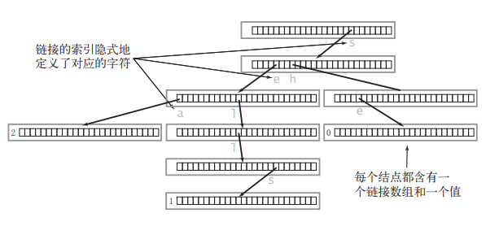
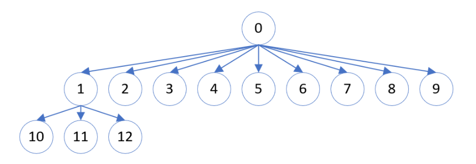
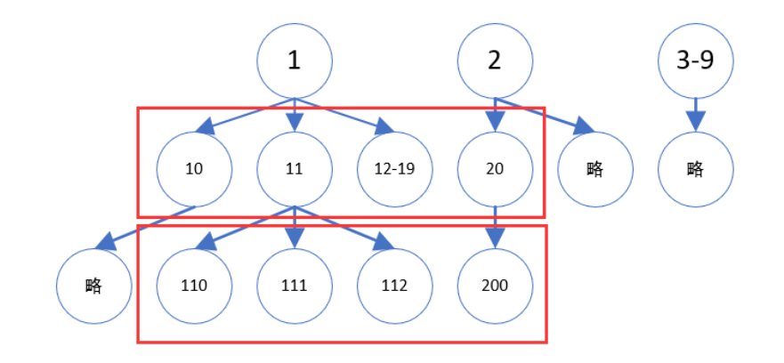

# 字典树

想象以下，包含三个单词 "sea","sells","she" 的 Trie 会长啥样呢？



Trie 中一般都含有大量的**空链接**，因此 Trie 的应用场景是：**一次建树，多次查询**。


查找或插入一个长度为 L 的单词，访问 next 数组的次数最多为 L+1，**和 Trie 中包含多少个单词无关**。


Trie 的每个结点中都保留着一个字母表，这是很耗费空间的。如果 Trie 的高度为 n，字母表的大小为 m，最坏的情况是 Trie 中还不存在前缀相同的单词，那空间复杂度就为 $O(m^n)$ 。


Trie树在实际开发中的应用：

替换其他数据结构，比如二叉搜索树(BST, binary search tree)和哈希表(hash table)
用于词典中自动补全(autocomplete)或搜索提示功能
在拼写检查(spell checking)这类软件中，用来实现相似匹配算法
用于字符串排序，比如burstsort就将Trie作为其基础数据结构


---

## 208. 实现 Trie (前缀树)

Trie，又称前缀树或字典树，是一棵有根树，其每个节点包含以下字段：

- 指向子节点的指针数组 children。对于本题而言，数组长度为 26，即小写英文字母的数量。此时 `children[0]` 对应小写字母 a,  `children[1]` 对应小写字母 b，...，`children[25]` 对应小写字母 z

- 布尔字段 isEnd，表示该节点是否为字符串


**插入字符串**

从字典树根开始，插入字符串。对于当前字符对应的子节点，有两种情况：

- 子节点存在。沿着指针移动到子节点，继续处理下一个字符。
- 子节点不存在。**创建**一个新的子节点，记录在 `children` 数组的对应位置上，然后沿着指针移动到子节点上，继续搜索下一个字符。

重复以上步骤，直到处理字符串的最后一个字符，然后将当前节点标记为字符串的结尾。


**查找前缀**

从字典树的根开始，查找前缀。对于当前字符对应的子节点，有两种情况：

- 子节点存在。沿着指针移动到子节点，继续搜索下一个字符。
- 子节点不存在。说明字典树中不包含该前缀，**返回空指针**。

重复以上步骤，直到返回空指针或搜索完前缀的最后一个字符。

若搜索到了前缀的末尾，就说明字典树中存在该前缀。此外，若前缀末尾对应节点 isEnd 为真，则说明字典树中存在该字符串

```c++
class Trie {
private:
    vector<Trie*> children;	//指针数组，存Trie*
    bool isEnd;         //这个主要是用来区分全字匹配和前缀匹配

    Trie* searchPrefix(string prefix) {
        Trie* node = this;
        
        for (char ch : prefix) {        
            ch -= 'a';
            if (node->children[ch] == nullptr) {
                return nullptr;
            }
            node = node->children[ch];
        }

        return node;
    }
    
public:
    Trie() : children(26), isEnd(false) { }
    
    void insert(string word) {
        Trie* node = this;
        for (char ch : word) {
            ch -= 'a';
            if (node->children[ch] == nullptr) {
                node->children[ch] = new Trie();
            }
            node = node->children[ch];
        }
        node->isEnd = true; //这里标末尾
    }
    
    bool search(string word) {
        Trie* node = this->searchPrefix(word);
        return node != nullptr && node->isEnd;
    }
    
    bool startsWith(string prefix) {
        Trie* node = this->searchPrefix(prefix);
        return node != nullptr;
    }
};
```


### 智能指针版

由于Trie是动态数据结构，在插入新字符串的时候需要不断在堆上开辟新空间，为了避免内存泄漏需要在Trie树类的析构函数中释放这些内存，可以用智能指针进行管理

```c++
class Trie
{
private:
    struct TrieNode
    {
        bool isEnd;
        vector<shared_ptr<TrieNode>> children;
        TrieNode() : isEnd(false), children(26, NULL) {}
    };

    shared_ptr<TrieNode> findPrefix(string &prefix)
    {
        auto node = root;
        for (int i = 0; i < prefix.size() && node != NULL; ++i) // node != NULL表示前缀树中还有剩余节点
        {
            node = node->children[prefix[i] - 'a']; // prefix[i]-'a'表示字符串的第i个字符的ASCII码减去'a'的值
        }
        return node; // 若是前缀就返回最后一个字母所在的node，否则返回NULL
    }

    shared_ptr<TrieNode> root;

public:
    Trie()
    {
        root = make_shared<TrieNode>(); // make_shared创建一个shared_ptr智能指针，指向一个TrieNode对象
    }

    void insert(string word)
    {
        auto node = root; // node指向root
        for (int i = 0; i < word.size(); ++i)
        {
            if (node->children[word[i] - 'a'] == NULL)                   // 若node的children[word[i] - 'a']为空，则创建一个新的TrieNode对象
                node->children[word[i] - 'a'] = make_shared<TrieNode>(); // make_shared创建一个shared_ptr智能指针，指向一个TrieNode对象
            node = node->children[word[i] - 'a'];                        // 进入到对应子树节点中
        }
        node->isEnd = true; // 整个单词遍历结束，将最后一个节点标记为单词结尾
    }

    bool search(string word)
    {
        auto node = findPrefix(word);
        return node != NULL && node->isEnd; // 若node不为空且node的isEnd为true，则返回true，否则返回false
    }

    bool startsWith(string prefix)
    {
        return findPrefix(prefix) != NULL;
    }
};

/**
 * Your Trie object will be instantiated and called as such:
 * Trie* obj = new Trie();
 * obj->insert(word);
 * bool param_2 = obj->search(word);
 * bool param_3 = obj->startsWith(prefix);
 */
```


```c++
class Trie {
    struct TrieNode{
        shared_ptr<TrieNode> children[26];
        bool is_end;
        TrieNode():is_end(false){
            for(int i=0;i<26;i++)children[i]=nullptr;
        }
    };
    public:
        Trie(){
            head=shared_ptr<TrieNode>(new TrieNode());
        }

        void insert(string word){
            shared_ptr<TrieNode> root=head;
            for(char c:word){
                int index=c-'a';
                if(root->children[index]==nullptr){
                    root->children[index]=shared_ptr<TrieNode>(new TrieNode());
                }
                root=root->children[index];
            }
            root->is_end=true;
        }

        bool startsWith(string prefix){
            shared_ptr<TrieNode> root=head;
            for(char c:prefix){
                int index=c-'a';
                if(root->children[index]==nullptr){
                    return false;
                }
                root=root->children[index];
            }
            return true;
        }

        bool search(string word){
            shared_ptr<TrieNode> root=head;
            for(char c:word){
                int index=c-'a';
                if(root->children[index]==nullptr){
                    return false;
                }
                root=root->children[index];
            }
            return root->is_end;
        }

    private:
        shared_ptr<TrieNode> head;
};
```


----

## 440. 字典序的第K小数字

给定整数 `n` 和 `k`，返回 `[1, n]` 中字典序第 `k` 小的数字。

 

```
输入: n = 13, k = 2
输出: 10
解释: 字典序的排列是 [1, 10, 11, 12, 13, 2, 3, 4, 5, 6, 7, 8, 9]，所以第二小的数字是 10。
```


### 思路1

**什么是字典序？**

简而言之，就是**根据数字的前缀进行排序**，

比如 10 < 9，因为 10 的前缀是 1，比 9 小。再比如 112 < 12，因为 112 的前缀 11 小于 12。

这样排序下来，会**跟平常的升序排序会有非常大的不同**。先给你一个直观的感受，一个数乘 10，或者加 1，哪个大？后者会更大。




**每一个节点都拥有 10 个孩子节点**，因为作为一个前缀 ，它后面可以接 0~9 这十个数字。而且你可以非常容易地发现，整个字典序排列也就是对**十叉树进行先序遍历**。1, 10, 100, 101, ... 11, 110 ...

回到题目的意思，我们需要**找到排在第 k 位的数**。找到他的排位，需要搞清楚三件事情:

**怎么确定一个前缀下所有子节点的个数？**
**如果第 k 个数在当前的前缀下，怎么继续往下面的子节点找？**
**如果第 k 个数不在当前的前缀，即当前的前缀比较小，如何扩大前缀，增大寻找的范围？**

接下来 ，一一拆解这些问题。


**1. 确定指定前缀下所有子节点数**

现在的任务就是给定一个前缀，返回下面子节点总数。

我们现在的思路就是用**下一个前缀的起点减去当前前缀的起点**，那么就是当前前缀下的所有子节点数总和啦。

```c++
long getCount(long prefix, long n) {	//prefix 是前缀, n 是上界
    long cur = prefix;
    long next = prefix + 1;
    long count = 0;
    
    while (cur <= n) { //不能大于上界
        count += next - cur;	//下一个前缀的起点 减去 当前前缀的起点
        cur *= 10;
        next *= 10;
        // cur 从 1 变为 10       
        // next 从 2 变为 20
        // 前缀为 1 的子节点增加10个，十叉树增加一层，变成了2层
        // 10 - 19
        
        // cur 从 10 变为 100
        // next 从 20 变为 200
        // 前缀为 10 的子节点增加了100个，十叉树增加一层，变成了3层
    	// 100-109 110-119 120-129 130-139 140-149 
        // 150-159 160-169 170-179 180-189 191-199
    }
    return count;
}
```


当然，**当 next 的值大于上界的时候，**那以这个前缀为根节点的十叉树就**不是满十叉树**，**应该到上界那里**，后面都不再有子节点。因此，`count += next - cur` 还是有些问题的，我们来修正这个问题:

```c++
count += min(n + 1, next) - cur;
```

为什么是 n+1 ,而不是 n 呢？不是 n 为上界吗？

假若现在上界 n为 12，算出以 1 为前缀的子节点数，首先 1 本身是一个节点，接下来要算下面 10，11，12，一共有 4 个子节点。

那么如果用 `min(n, next) - cur`  会怎么样？

这时候算出来会少一个，12 - 10 加上根节点，最后只有 3 个。因此我们务必要写 n+1。


**2. 第k个数在当前前缀下**

现在无非就是往子树里面去看。prefix这样处理就可以了。

```c++
prefix *= 10;
```


**3.第k个数不在当前前缀下**

说白了，当前的前缀小了嘛，我们扩大前缀。

```
prefix++;
```


**整合**

```c++
int findKthNumber(int n, int k) {
	int p = 1, prefix = 1;	//p作为一个指针，指向当前所在位置，当p=k时，就为答案
    while (p < k) {
        long count = getCount(prefix, n);
        if (p + count > k) {			// 第k个数在当前前缀下
            prefix *= 10;	
            p++; //把指针指向了第一个子节点的位置，比如11乘10后变成110，指针从11指向了110
        } else if (p + count <= k) {	// 第k个数不在当前前缀下
            prefix++;
            p += count;// 把指针指向了下一前缀的起点
        }
    }
    return prefix;   
}
```


```c++
long getCount(long prefix, long n) {
    long cur = prefix;
    long next = cur + 1;
    long count = 0;
    while (cur <= n) {
        count += min(n+1, next) - cur;
        cur  *= 10;
        next *= 10;
    }
}
```


```c++
class Solution {
public:
    long getCount(long prefix, long n) {
        long cur = prefix;
        long next = cur + 1;
        long count = 0;
        while(cur <= n) {
            count += min(n+1, next) - cur;
            cur *= 10;
            next *= 10;
        }
        return count;
    }

    int findKthNumber(int n, int k) {
        long p = 1;
        long prefix = 1;
        while(p < k) {
            long count = getCount(prefix, n);
            if (p + count > k) {
                /// 说明第k个数，在这个前缀范围里面
                prefix *= 10;
                p++;
            } else if (p+count <= k) {
                /// 说明第k个数，不在这个前缀范围里面，前缀需要扩大+1
                prefix++;
                p += count;
            }
        }
        return static_cast<int>(prefix);
    }
};
```


### 思路2


当将n=12转换为字典树时候，我们可以发现字典序不过就是这颗字典树的先序遍历

> 那么要找到第5小的数，就采用先序遍历的方法
>
> 先找到1： 第1小
> 再找到10：第2小
> 再找到11：第3小
> 再找到12：第4小
> 再找到2： 第5小


**解题思路**

但是很显然将整棵树构建起来是不现实的，当 $n = 10^9$ 的时候就是上亿个节点了

不过也不用担心，因为这颗字典树是的十叉树，并且具有明显的**先序遍历递增**的特点

那么我们就可以**通过计算得到某个节点下的子树节点的总数而跳过遍历的时间**

例如下图中求1的子树节点数量：



- 1下的第一层：最左端为10，即 `1*10`；最右端为19，即 `(1+1) * 10 - 1`，合计20-10 = 10
  - 换成 **i**：最左端为 `i*10`；最右端为 `(i + 1) * 10 - 1`
- 1下的第一层：最左端为 100，最右端为 112 (即 **n**)，而不是 200 了，合计 `112-100+1 = 13`
  - 这一层到不了 200 那么多，只能到 n

- 合计 `10+13 = 26`


```C++
int getNodes(long cur, int n) { //cur 为当前前缀 n为上界
    long next = cur + 1;
    long count = 0;
    while (cur <= n) {
        // 一次性求出下一层的节点个数和，要是没满就用n来减，要是满了就用next减
        count += 
    }
}
```


**能求出子树节点个数有什么用呢？**

如果求出**以i为根的子树节点有nodes个**

如果nodes比k少，那么这个部分都可以全部跳过，第k小的数肯定不在这些节点里，**i右移**

如果nodes比k多，那么第k小的数一定在这个里面，并是以 i 开头的数，**i下移**

因此我们可以**移动 i 指向的节点，直到跳过的节点数达到 k**


```c++
int findKthNumber (int n, int k) {
    long cur = 1;
}
```


---

## 211. 添加与搜索单词 - 数据结构设计

```c++
class WordDictionary {
private:
    vector<WordDictionary*> children;	//指针数组，存Trie*
    bool isEnd;         //是否是末尾, 用来区分全字匹配和前缀匹配

public:
    WordDictionary() : children(26), isEnd(false) {

    }
    
    void addWord(string word) {
        WordDictionary* node = this;
        for (auto ch : word) {
            ch -= 'a';
            if (node->children[ch] == nullptr) {
                node->children[ch] = new WordDictionary();
            }
            node = node->children[ch];
        }
        node->isEnd = true; //标末尾
    }   
    
    bool search(string word) {
        return dfs(word, 0, this);
    }

    bool dfs(string &word, int idx, WordDictionary* nowNode) {
        if (idx == word.size()) { //尾部处理
            return nowNode->isEnd;
        }
        
        char ch = word[idx];
        if (ch == '.') {
            for (int j = 0; j < 26; ++j) {
                if (nowNode->children[j] != nullptr && dfs(word, idx + 1, nowNode->children[j])) {
                    return true;
                }
            }              
        } else {
            ch -= 'a';
            if (nowNode->children[ch] != nullptr && dfs(word, idx + 1, nowNode->children[ch])) {
                return true;
            }
        }

        return false;
    }
};
```


## 剑指 Offer II 062. 实现前缀树 Medium


1804.实现 Trie （前缀树） II Medium

1805.添加与搜索单词 - 数据结构设计 Medium

1806.连接词 Hard

1807.单词替换 Medium
剑指 Offer II 063. 替换单词 Medium
剑指 Offer II 064. 神奇的字典 Medium
剑指 Offer II 065. 最短的单词编码 Medium
剑指 Offer II 066. 单词之和 Medium
剑指 Offer II 067. 最大的异或 Medium


## 745. 前缀和后缀搜索

调用 f 时，如果前缀和后缀的长度相同，那么可以用字典树来解决。初始化时，只需将单词正序和倒序后得到的单词对依次插入字典树即可。

这样初始化后，对于前缀和后缀相同的检索，也只需要在字典树上检索前缀和后缀倒序得到的单词对。但是调用 $f$ 时，还有可能遇到前缀和后缀长度不同的情况。

应对这种情况，可以将短的字符串用特殊字符补足，使得前缀和后缀长度相同。而在初始化时，也需要考虑到这个情况，特殊字符组成的单词对，也要插入字典树中。

```c++
struct Trie {
    unordered_map<string, Trie *> children;
    int weight;
};

class WordFilter {
private:
    Trie *trie;

public:
    WordFilter(vector<string>& words) {
        trie = new Trie();
        for (int i = 0; i < words.size(); i++) {
            string word = words[i];
            Trie *cur = trie;
            int m = word.size();
            for (int j = 0; j < m; j++) {
                Trie *tmp = cur;
                for (int k = j; k < m; k++) {
                    string key({word[k], '#'});
                    if (!tmp->children.count(key)) {
                        tmp->children[key] = new Trie();
                    }
                    tmp = tmp->children[key];
                    tmp->weight = i;
                }
                tmp = cur;
                for (int k = j; k < m; k++) {
                    string key({'#', word[m - k - 1]});
                    if (!tmp->children.count(key)) {
                        tmp->children[key] = new Trie();
                    }
                    tmp = tmp->children[key];
                    tmp->weight = i;
                }
                string key({word[j], word[m - j - 1]});
                if (!cur->children.count(key)) {
                    cur->children[key] = new Trie();
                }
                cur = cur->children[key];
                cur->weight = i;
            }
        }
    }
    
    int f(string pref, string suff) {
        Trie *cur = trie;
        int m = max(pref.size(), suff.size());
        for (int i = 0; i < m; i++) {
            char c1 = i < pref.size() ? pref[i] : '#';
            char c2 = i < suff.size() ? suff[suff.size() - 1 - i] : '#';
            string key({c1, c2});
            if (!cur->children.count(key)) {
                return -1;
            }
            cur = cur->children[key];
        }
        return cur->weight;
    }
};
```

