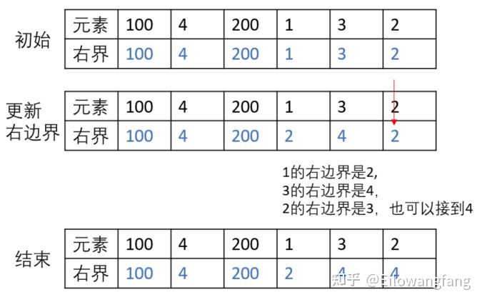

# 并查集

## 应用场景

解决**动态连通性**问题.

 **某个元素是否属于某个集合**

**某个元素和另一个元素是否同属于一个集合**。


- 并查集的**并**指的是`union`方法，该方法可以把**孤立的两个节点连通，使这两个节点组成一个连通分量，成为一个集合**。
- 并查集的**查**指的是`find`方法，该方法可以查询**某个节点属于哪个连通分量**（集合）。


- 用节点表示计算机，连通分量表示连接在一起的计算机集合，即属于同一个网络，我们想在海量的计算机中查询任意两台计算机是否属于同一个网络。
- 用节点表示人，连接的两个节点表示他们为朋友关系，那么一个连通分量就表示一个社交网络。
- LeetCode常见，用节点表示陆地，有的陆地相互毗邻连接成岛屿，有的陆地被海水分割成孤岛，孤岛和岛屿都代表一个连通分量。


可以对节点进行遍历，将相连的两个节点进行Union（两个连通分量 > 一个连通分量）


---

## 1. 并查集的定义

​	维护集合的数据结构。”并“Union、”查“Find、”集“Set

​	支持：合并两个集合、判断两个元素是否在一个集合。

​	使用一个数组：int father[N];	实现

​	father[i]表示元素i的父亲结点，而父亲结点本身就是这个集合的元素，**对同一个集合来说只存在一个根结点，且将其作为所属集合的标示**。

```c++
father[1]=1;	//1的父亲结点是自己，1号为根结点
father[2]=1;
father[3]=2;
father[4]=2;

father[5]=5;	//5的父亲结点是自己，5号为根结点
father[6]=5;
```


纯 int 用 array，否则用 hashmap


## 2. 并查集的基本操作

​	总体来说，并查集的使用需要先初始化father数组，然后根据需要进行查找或合并的操作。

1. **初始化**

```c++
for(int i=1;i<=N;i++){
    father[i]=-1;
}
```


2. **查找**：确定元素x属于哪一个子集。

```c++
//只有一个根结点，查找操作就是对给定的结点寻找根结点。
//递推
int findFather(int x){
    while(x!=father[x]){
        x=father[x];//获得自己的父亲结点
    }
    return x;
}

//递归
int findFather(int x){
    if(x==father[x]) return x;
    else return findFather(father[x]);
}
```


3. **合并**：将a和b所在的两个子集合并成同一个集合。

```c++
//先判断两个元素是否属于同一个集合
//再把其中一个集合的根结点的父亲指向另一个集合的根结点
void Union(int a,int b){
    int faA=findFather(a);		//a的根结点
    int faB=findFather(b);		//b的根结点
    if(faA!=faB){				//不属于同一个集合
        father[faA]=faB;//合并
    }
}
```

​	并查集的一个性质。如果两个元素在相同的集合中，那么就不会对其进行操作.这就保证了在同一个集合中一定不会产生环,即**并查集产生的每一个集合都是一棵树**.


---

## 3. 路径压缩

把当前查询结点的路径上的所有结点的父亲都指向根结点,查找的时候就不用一直回溯去找父亲了.


```c++
int findFather(int x){
    //由于x在下面的while中会变成根节点,因此先把原先的x保存一下
    int a=x;
    while(x!=fahter[x]){
    	x=fahter[x];
    }
    //x存放的是根结点,下面把路径上的所有结点的father都改为根结点
    while(a!=father[a]){
        int z=a;		//因为a要被father[a]覆盖,所有先保存a的值,以修改father[a]
        a=father[a];	//a回溯父亲节点
        father[z]=x;	//将原先的节点a的父亲改为根结点x
    }
    return x;
}
```

```c++
int findFather(int v){
    if(v==father[v]) return v;
    else{
        int F=findFather(father[v]);
        father[v]=F;
        return F;
    }
}
```


## 模板

find的时间复杂度是O(n)，union的时间复杂度是O(1)

我们可以**进一步通过路径压缩来把find的O(n)降为O(1)**

http://pepcy.cf/icpc-templates/002DataStructure/djs.html


主要API：

`find(int m)`：查询m的根节点

`isConnected(int m, int n)`：判断m和n是否属于同一连通区域

`merge(int m, int n)`：将m和n连通到同一区域


```c++
#include <cstdio>

const int MAXN = 1000005;

struct DSU {
    int fa[MAXN];

    void init(int n) { for (int i = 0; i < n; i++) fa[i] = -1; }
    
    // int find(int x) { return x == fa[x] ? x : fa[x] = find(fa[x]); }
    int find(int x){			//O(N)
        if(x == fa[x]) return x;
        else return find(fa[x]);
    }
    
    // void merge(int x, int y) { fa[find(y)] = find(x); }
    void merge(int x, int y) { 	//O(1)
    	int faA = find(a);		 // a的根结点
        int faB = find(b);		 // b的根结点
        if(faA != faB) fa[faA] = faB;// 不属于同一个集合合并			
    }   
    
    bool isConnected(int x, int y) { return find(x) == find(y); }
    
    //初始使用find时，时间复杂度还是O(n), 但是在后续的查询中时间复杂度可以降为O(1)
    int find_compress(int x){	//O(1)  路径压缩
        if(x == fa[x]) return x;
        else{
            int F = find_compress(fa[x]);
            fa[x] = F;
            return F;
        }
    }
} dsu;

int main() {
    int n, q;			//n个节点 q条边
    scanf("%d %d", &n, &q);

    dsu.init(n);

    while (q--) {
        int op, u, v;
        scanf("%d %d %d", &op, &u, &v);
        if (op == 0) dsu.merge(u, v);
        else puts(dsu.isConnected(u, v) ? "Yes" : "No");
    }

    return 0;
}
```


# **连接/合并区域问题**

被围绕的区域的思路: 

- 边界上的'O'都是可保留的。除去边界上的'O'可分为两种情况：1.与边界上的'O'是相连通。2.不与边界上的'O'是相连通。
- **遍历边界上的'O'，**让其都共享一个fatherA(任意定义，比如下面的dummyNode)。
- **遍历不在边界上的'O'**，探测其上下左右的元素，如果遇到了元素是'O'就联通，共享一个father。
- **遍历不在边界上的'O'**，find其father，如果最后能到达fatherA (dummyNode)，那么就说明这个元素是可以与边界上的'O'联通的，保留。


---

## 547. 省份数量

```c++
/*
        计算连通分量数的另一个方法是使用并查集。初始时，每个城市都属于不同的连通分量。
        遍历矩阵 isConnected，如果两个城市之间有相连关系，则它们属于同一个连通分量，对它们进行合并。

        遍历矩阵 isConnected 的全部元素之后，计算连通分量的总数，即为省份的总数。
    */

struct UF {
    int fa[205];

    void init(int n) { for (int i = 0; i < n; ++i) { fa[i] = i; } }

    int find(int x) {
        if (x == fa[x]) return x;
        else return find(fa[x]);
    }

    void merge(int x, int y) { fa[find(y)] = find(x); }


} uf;

int findCircleNum(vector<vector<int>>& isConnected) {
    uf.init(isConnected.size());

    for (int i = 0; i < isConnected.size(); ++i) {
        for (int j = 0; j < isConnected.size(); ++j) {
            if (isConnected[i][j] == true) {
                uf.merge(i, j);
            }
        }
    }

    unordered_set<int> set;

    for (int i = 0; i < isConnected.size(); ++i) {
        set.insert(uf.find(i));
    }

    return set.size();
}

```


---

## 1202. 交换字符串中的元素

彼此可以互相交换的元素在一个连通分量中

```c++
const int MAX_N = 1e5 + 5;
class Solution {
public:
    struct UF {
        int fa[MAX_N];

        void init(int n) { for (int i = 0; i < n; ++i) { fa[i] = i; } }
        int find (int x) { 
            if (x == fa[x]) return x;
            else {
                int F = find(fa[x]);
                fa[x] = F;
                return F;
            }
        }
        void merge(int x, int y) { fa[find(y)] = find(x); }
    } uf;


    string smallestStringWithSwaps(string s, vector<vector<int>>& pairs) {
        if (pairs.size() == 0) return s;
        
        uf.init(s.size());

        for (auto pair : pairs) {
            uf.merge(pair[0], pair[1]);
        }

        vector<vector<int>> vec(pairs.size());
        vector<vector<char>> vecC(pairs.size());

        for (int i = 0; i < s.size(); ++i) {
            int tmp = uf.find(i);
            vec[uf.find(i)].push_back(i);
            vecC[uf.find(i)].push_back(s[i]);
        }

        
        for (auto& vecc : vecC) {
            sort(vecc.begin(), vecc.end());
        }

        for (auto& ve : vec) {
            sort(ve.begin(), ve.end());
        }

        string res(s.size(), 0);

        for (int i = 0; i < vec.size(); ++i) {
            for (int j = 0; j < vec[i].size(); ++j) {
                res[vec[i][j]] = vecC[i][j];
            }
        }

        return res;
    }
};
```


---

## 990. 等式方程的可满足性

```c++
struct UF{
    int fa[30];

    void init() { for(int i = 0; i < 30; ++i) { fa[i] = i; } }

    int find(int x) {
        if (x == fa[x]) return x;
        else {
            int F = find(fa[x]);
            fa[x] = F;
            return F;
        }
    }

    void merge(int x, int y) { fa[find(y)] = find(x); }
} uf;


bool equationsPossible(vector<string>& equations) {
    uf.init();
    for (int i = 0; i < equations.size(); ++i) {
        if (equations[i][1] == '=') {
            uf.merge(equations[i][0] - 'a', equations[i][3] - 'a');
        }
    }

    for (int i = 0; i < equations.size(); ++i) {
        if (equations[i][1] == '!') {
            if (uf.find(equations[i][0] - 'a')  == uf.find(equations[i][3] - 'a') )
                return false;
        }
    }

    return true;
}
```


---

## 116. 填充每个节点的下一个右侧节点指针


----

## 200. 岛屿数量


---

## 130. 被围绕的区域


----

## 721. 账户合并


----

## 785. 判断二分图


----

## 827. 最大人工岛


---

## 886. 可能的二分法


---

## 778. 水位上升的泳池中游泳


---

## 765. 情侣牵手

https://zhuanlan.zhihu.com/p/350894462


----

# 其他

## 128. 最长连续序列


最长连续序列思路：

- 采用并查集的 hashmap中保存每个元素，所能联通的右边界
- find(x)会返回元素的右边界
- unionFunc(a,b)把两个元素的右边界联合起来，这样连续的元素就会共享同样的右边界
- 首先遍历元素num，如果元素num+1存在，那么说明num可以共享num+1的右边界。（比如遍历到元素2时，2+1=3元素也是存在的，那么2和3可以连通，同时3又可以连到4，所以元素2的最大有边界是4）
- 再次遍历一遍num，通过find，找到能够到达的最远右边界。（比如从元素1可以达到2，从2可以达到4，所以最长的就是1到4）





---

## 399. 除法求值


