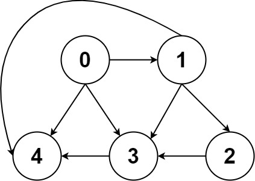
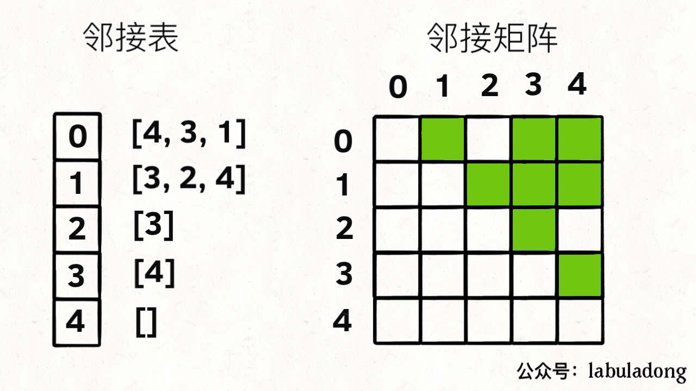

# Graph

https://labuladong.gitee.io/algo/2/20/36/


图可以玩出更多的算法，解决更复杂的问题，但**本质**上图可以认为是**多叉树的延伸**。


⾯试笔试很少出现图相关的问题，就算有，大多也是简单的遍历问题，基本上可以完全照搬**多叉树的遍历**。


像 [二分图判定](https://labuladong.gitee.io/algo/2/20/38/)、拓扑排序这一类，属于比较**基本且有用**的算法，应该比较熟练地掌握。

像 [最小生成树](https://labuladong.gitee.io/algo/2/20/41/) 和 [最短路径问题](https://labuladong.gitee.io/algo/2/20/43/)，虽然从刷题的角度用到的不多，但它们属于经典算法，**学有余力**可以掌握一下；

像**网络流**这种问题，你又不是打竞赛的，没时间的话就**没必要**学了；


-----

## 图的逻辑结构和具体实现

`G(V, E)` 图 G 的顶点集 `V`、边集 `E`。


⼀幅图是由顶点 **Vertex** 和边 **Edge** 构成的，逻辑结构如下：




```c++
class Vertex {
    int id;
    Vertex[] neighbors;
}
```


和多叉树节点完全一样


```c++
class TreeNode {
    int val;
    TreeNode[] children;
}
```


图本质上就是个高级的多叉树。适用于树的 DFS/BFS 遍历算法，全部适用于图。很少用这个 Vertex 类实现图，而是用**邻接表**和**邻接矩阵**来实现。


上图用**邻接表**和**邻接矩阵**的存储方式如下：



**邻接表**：每个节点 x 的邻居都存到一个列表里，然后把 x 和这个列表关联起来。

**邻接矩阵**：二维bool数组，如果 x 和 y 相连，则 `matrix[i][j]` 设为 `true` 


```c++
List<int> graph[5]; //grapg[x] 存储 x 的所有邻居节点

bool matrix[5][5];
```


无向图的实现方式，邻接矩阵把 `matrix[x][y]` 和 `matrix[y][x]` 都变成 true 不就⾏了；邻接表也是类似的操作，在 x 的邻居列表⾥添加 y，同时在 y 的邻居列表⾥添加 x。


在**无向图**中，如果两个顶点之间可以互相到达（可以间接），那么就称这两个顶点**连通**。如果图 `G(V, E)`的**任意两个顶点都连通**，则称图 G 为**连通图**；否则，称图 G 为**非连通图**，且称其中的**极大连通子图为连通分量**。


在**有向图**中，如果两个顶点可以各自通过一条有向路径到达另一个顶点，就称这两个顶点**强连通**。如果图 `G(V, E)` 的**任意两个顶点都强连通**，则称图 G 为**强连通图**；否则，称图为**非强连通图**，且称其中的**极大强连通子图为强连通分量**。


---

## 图的遍历

参考多叉树，多叉树的遍历框架如下

```c++
void traverse(TreeNode* root) {
    if (root == null) return;
    
    for (int i = 0; i < root.children.size(); ++i) {
        traverse(root->children[i]);
    }
    
    return;
}
```


图和多叉树**最⼤的区别是**，图是可能包含**环**的，你从图的某⼀个节点开始遍历，有可能⾛了⼀圈⼜回到这个节点。因此需要一个 **vis 数组**进行**辅助**


---

### DFS

以深度作为第一关键词，每次都是沿着路径到**不能再前进时**才**退回**到**最近的岔道口**。

```c++
DFS(u) {			//访问顶点u
    vis[u] = true;	//设置u已被访问
    
    for (从u出发能到达的所有顶点v) {	 //枚举从u出发可以到达的所有顶点v
    	if (vis[v] == false) {		//如果v未被访问
     		DFS(v);       			//递归访问v
        }
    }    
}

DFSTrave(G) {					//遍历图G
    for (G的所有顶点u) {				//对G的所有顶点u
    	if (vis[u] == false) {		//如果u未被访问
     		DFS(u);       			//访问u所在的连通块
        }
    }
}
```


**邻接表法**

```c++
const MAXV = 1000;	//最大顶点数
const INF = 1e9;	//设INF为很大的数

int n; 					// n为顶点数
vector<vector<int>> Adj[MAXV]; 	// 图G的邻接表
bool vis[MAXV] = {false}; 
```

```c++
void DFS(int u, int depth) {
    vis[u] = true;
    
    for (int i = 0; i < Adj[u].size(); ++i) {
        int v = Adj[u][i];
        if (vis[v] == false) {
            DFS(v, depth + 1);
        }
    }
}

void DFSTrave() {	//遍历图G
    for (int u = 0; u < n; ++u) {
        if (vis[u] == false) {
            DFS(u, 1);		
        }
    }
}
```


**邻接矩阵法**

```c++
const MAXV = 1000;	//最大顶点数
const INF = 1e9;	//设INF为很大的数

int n, G[MAXV][MAXV]; //n为顶点数  G为邻接矩阵
bool vis[MAXV] = {false}; 
```

```c++
void DFS(int u, int depth) {
    vis[u] = true;
    
    for (int v = 0; v < n; ++v) {
        if (vis[v] == false && G[u][v] != INF) {
            DFS(v, depth + 1);
        }
    }
}

void DFSTrave() {	//遍历图G
    for (int u = 0; u < n; ++u) {
        if (vis[u] == false) {
            DFS(u, 1);		
        }
    }
}
```


---

### BFS

以**广度**作为关键词，每次以**扩散**的方式向外访问顶点。需要一个**队列**，通过**反复取出队首顶点**，将该顶点**可到达的未曾加入过队列**的顶点全部入队，直到**队列为空**时遍历结束。

此时的 `vis[]` 数组意义为是否插入过队列 `inq[]` 

```c++
BFS(u) {			//访问顶点u
    queue q;		//定义队列q
    inq[u] = true;	//设置u已被访问
    
    while (q非空) {
        取出q的队首元素u进行访问;
        for (从u出发能到达的所有顶点v) {	 //枚举从u出发可以到达的所有顶点v
         	if (inq[v] == false) {		//如果v没有被查如果队列
                将 v 入队;
                inq[v] = true;			//设置v已被加入过队列
            }
        } 
    }       
}

BFSTrave(G) {					//遍历图G
    for (G的所有顶点u) {				//对G的所有顶点u
    	if (inq[u] == false) {		//如果u未曾加入过队列
     		BFS(u);       			//访问u所在的连通块
        }
    }
}
```


**邻接表法**

```c++
const MAXV = 1000;	//最大顶点数
const INF = 1e9;	//设INF为很大的数

int n; 					// n为顶点数
vector<vector<int>> Adj[MAXV]; 	// 图G的邻接表
bool inq[MAXV] = {false}; 
```

```c++
void BFS(int u) {
    queue<int> que;
    que.push(u);
    inq[u] = true;
    
    while (!que.empty()) {
        int u = que.front(); que.pop();
        
        for (int i = 0; i < Adj[u].size(); ++i) {
            int v = Adj[u][i];
            if (inq[v] == false) {
                q.push(v);
                inq[u] = true;
			}                
        }
    }    
}

void BFSTrave() {	//遍历图G
    for (int u = 0; u < n; ++u) {
        if (inq[u] == false) {
            BFS(u);		
        }
    }
}
```


**邻接矩阵法**

```c++
const MAXV = 1000;	//最大顶点数
const INF = 1e9;	//设INF为很大的数

int n, G[MAXV][MAXV]; //n为顶点数  G为邻接矩阵
bool inq[MAXV] = {false}; 
```

```c++
void BFS(int u) {
    queue<int> que;
    que.push(u);
    inq[u] = true;
    
    while (!que.empty()) {
        int u = que.front(); que.pop();
        
        for (int v = 0; v < n; ++v) {
            if (inq[v] == false && G[u][v] != INF) {
                que.push(v);
                inq[v] = true;
            }
        }
    }
}

void BFSTrave() {	//遍历图G
    for (int u = 0; u < n; ++u) {
        if (inq[u] == false) {
            DFS(u, 1);		
        }
    }
}
```


[797. 所有可能的路径（中等）](https://leetcode-cn.com/problems/all-paths-from-source-to-target/)


---

## 拓扑排序

https://labuladong.gitee.io/algo/2/20/37/

环检测和拓扑排序（编译器循环引用检测就是类似的算法）

[207. 课程表](https://leetcode-cn.com/problems/course-schedule/)

[210. 课程表 II](https://leetcode-cn.com/problems/course-schedule-ii/)


### 有向图的环检测


### 拓扑排序算法


---

## 二分图

https://labuladong.gitee.io/algo/2/20/38/


[785. 判断二分图（中等）](https://leetcode-cn.com/problems/is-graph-bipartite)

[886. 可能的二分法（中等）](https://leetcode-cn.com/problems/possible-bipartition)


---

## DIJKSTRA 算法

[743. 网络延迟时间（中等）](https://leetcode-cn.com/problems/network-delay-time)

[1514. 概率最大的路径（中等）](https://leetcode-cn.com/problems/path-with-maximum-probability)

[1631. 最小体力消耗路径（中等）](https://leetcode-cn.com/problems/path-with-minimum-effort)


---

## 并查集算法详解

https://labuladong.gitee.io/algo/2/20/39/

[323. 无向图中的连通分量数目（中等）](https://leetcode-cn.com/problems/number-of-connected-components-in-an-undirected-graph/)

[130. 被围绕的区域（中等）](https://leetcode-cn.com/problems/surrounded-regions/)

[990. 等式方程的可满足性（中等）](https://leetcode-cn.com/problems/satisfiability-of-equality-equations/)


---

## KRUSKAL 最小生成树算法


[261. 以图判树（中等）](https://leetcode-cn.com/problems/graph-valid-tree/)

[1135. 最低成本联通所有城市（中等）](https://leetcode-cn.com/problems/connecting-cities-with-minimum-cost/)

[1584. 连接所有点的最小费用（中等）](https://leetcode-cn.com/problems/min-cost-to-connect-all-points/)


---

## PRIM 最小生成树算法

[1135. 最低成本联通所有城市（中等）](https://leetcode-cn.com/problems/connecting-cities-with-minimum-cost/)

[1584. 连接所有点的最小费用（中等）](https://leetcode-cn.com/problems/min-cost-to-connect-all-points/)


--

## 名流问题

[277. 搜索名人（中等）](https://leetcode-cn.com/problems/find-the-celebrity/)