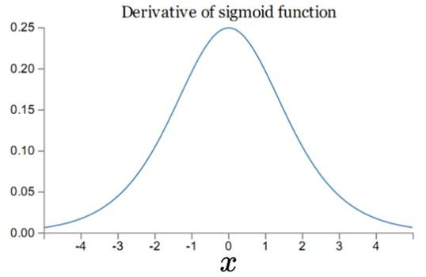
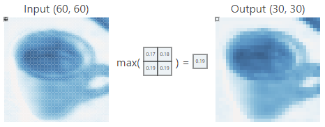

# 京东 

https://www.nowcoder.com/discuss/868347

https://www.nowcoder.com/discuss/868359

https://www.nowcoder.com/discuss/868356

https://www.nowcoder.com/discuss/868365


## 3.19 第一题 分鸡蛋

简化来说就是 $t$ 组询问，每次给出两个数 $x,y(1<=x,y<=1e^{18})$，有两种操作：

- x+1
- 如果 x%3==0，也可以选择将 x=x/3

问将 x 变为 y 的最小操作次数。

**思路**

贪心。

首先明确两种操作的本质，第一种是增大 x，第二种是减少 x

那么如果 x<y 的话，肯定是直接选择第一种操作，答案就是 y-x

如果是 x>y 的话，想减少 x 会选择第二种操作，但是要看 x 是否被 3 整除，如果没有被 3 整除的话就先+1。然后执行第二种操作，直到 x<y。再执行第一种操作，让 x+1直到 x==y。
这样操作次数就是最优的。


```C++
/*  Input
	3
	4 1
	2 2
	1000000000000000000 5
	Output
	5
	0
	76
*/

int main() {
    int T;
    long long x, y;

    cin >> T;

    for (int i = 0; i < T; ++i) {
        int cnt = 0;
        cin >> x >> y;

        while (x > y) {
            if (x % 3LL == 0LL) {
                x /= 3LL;
            } else {
                x++;
            }
            cnt++;
        }

        if (x == y) {
            cout << cnt << endl;
        } else {
            cout << cnt + y - x << endl;
        }
    }
    
    return 0;
}
```


---

## 3.19 第一题 攻城战

小七正在玩一款名为“攻城战”的策略游戏。现在，小七正在率领自己的军队攻打一座城池。

通过一段时间的游玩，小七的军队目前有a辆坦克。而“攻防战”是一个回合制游戏，一个回合如下：

1.小七的军队中的每辆坦克攻击所选择的一座碉堡，这座碉堡损失一点生命值。当一座碉堡失去所有生命值时，它就被摧毁了。小七可以为每辆坦克独立选择碉堡。

2.小七的对手进攻。炸毁k*c辆坦克，其中：k是剩余的碉堡的数量，每个碉堡可以炸毁c辆坦克。

通过侦察兵，小七探明了敌情：战场上有d座敌方碉堡，每一座碉堡都有b点生命值。摧毁所有的碉堡后，小七就攻下了这座城池（即使小七没有坦克了，也算攻下了这座城池）。反之如果小七没有坦克了，敌方还有碉堡，小七就失败了。现在小七想提前知道自己能否获胜，你能帮帮小七吗？

一行四个空格隔开的整数a,b,c,d，其中1<=a<=1000000, 1<=b,c,d<=10000

输出一个数，如果小七可以获胜，输出所需的最小回合数。否则输出-1。

样例输入:
10 6 8 2

样例输出:
2

```java
import java.util.Scanner;

class Main {
    public static void main(String[] args) {
        Scanner in = new Scanner(System.in);
        int a = in.nextInt(); //坦克
        int b = in.nextInt(); //碉堡血量
        int c = in.nextInt(); //一个碉堡炸c
        int d = in.nextInt(); //碉堡数量
        int cur = b;
        int count = 0;
        while (a != 0 && d != 0) {
            count++;
            int tank = a;
            if (tank < cur) {
                cur -= tank;
            } else {
                while (tank >= cur && d != 0) {
                    d--;
                    tank -= cur;
                    cur = b;
                }
                if (d == 0) break;
                cur -= tank;
            }
            if (a - d * c > 0) {
                a = a - d * c;
            } else {
                a = 0;
                break;
            }
        }
        if (a == 0 && d != 0) {
            System.out.println(-1);
        } else {
            System.out.println(count);
        }
    }
}


```

坦克炸碉堡，用碉堡总血量算的，一开始没想过总血量会一次扣成负的，卡了好久。。。

```java
public static void main(String[] args) {
    Scanner in = new Scanner(System.in);
    int a = in.nextInt(), b = in.nextInt(), c = in.nextInt(), d = in.nextInt();
    long time = 0, total = d * b;
    while (d > 0) {
        if (a == 0)
            break;
        total -= a;
        if (total <= 0)
            d = 0;
        else
            d = (int) total / b + (total % b == 0 ? 0 : 1);
        a -= d * c;
        ++time;
    }
    System.out.println(d == 0 ? time : -1);
}
```


根据题意模拟即可。

```c++
#include<bits/stdc++.h>

using namespace std;

const int N = 1e4 + 5;

int a, b, c, d;
int hp[N];

int main() {
    scanf("%d%d%d%d", &a, &b, &c, &d);
    for (int i = 1; i <= d; ++i) hp[i] = b;
    int ans = 0;
    while (a > 0 && d > 0) {
        int cnt = a;
        while (cnt > 0 && d >= 1) {
            if (cnt >= hp[d]) {
                cnt -= hp[d];
                hp[d] = 0;
                --d;
            } else {
                hp[d] -= cnt;
                cnt = 0;
            }
        }
        a -= d * c;
        ++ans;
    }
    if (d > 0) puts("-1");
    else printf("%d\n", ans);
    return 0;
}
```


## 3.19 第二题 最大承重装载机

小明在玩一款建造类的游戏。他需要为一段未开荒的地段设计路段的规划，以便起重机通过。

游戏里每段路径都有能承重的级别，小明现在希望尽可能让能承重更大的起重机通过，这样他就可以比较快地完成建造了。

游戏规定小明只能选一种起重机机型，小明想知道这个起重机最高的承重级别应该是多少，使得在该承重条件下，起重机可以从任何一个点出发去向任何一个点而不会损坏道路（损坏道路指的是路段上行驶了超过承重能力的起重机）。

为了方便，我们将需要规划的建造点抽象成N个点，有M条边将他们相连。

第一行是两个空格隔开的正整数n,m。n代表点数，我们将点从1到n编号，m指边的数量

接下来m行，每行3个空格隔开的正整数u, v, p，代表节点u和节点v之间有一条承重能力为p的路径。

1 <= n <= 1000, 1 <= m <= 10000, 1 <= p <= 10000

一行，一个正整数，表示起重机的最重承重级别。

样例输入:
3 3
1 2 3
1 3 4
2 3 5

样例输出:
4


最大生成树，然后找最小的边

如果用克鲁斯卡尔那种方法的话 排序+并查集 时间复杂度应该只有nlogn  如果是暴力超过 n3就过不了


第二道题Prim 维护一个Visit数组 把边做【- Weight，Start，End】这样输到Graph数组 对Graph排序 然后遍历Graph 如果Start End不在Visit中 把Weigjt加到Road里 把不在的节点加入Visit 如果都在就跳过 最后输出Road里面最大值再取反


```c++
/*	Input
	3 3
	1 2 3
	1 3 4
	2 3 5
    Output
	4
*/
int main() {
    int n, m;
    
    while (cin >> n >> m) {
        vector<vector<int>> inputs(m, vector<int>(3));
        vector<vector<int>> weights(1 + n);

        for (int i = 0; i < m; ++i) {
            for (int j = 0; j < 3; j++) {
                cin >> inputs[i][j];
            }
            int row = inputs[i][0], col = inputs[i][1], weight = inputs[i][2];

            weights[row].push_back(weight);
            weights[col].push_back(weight);
        }
        
        int res = INT_MAX;
        for (int i = 1; i <= n; i++) {
            sort()
        }
    }

    return 0;
}
```


``` java
import java.util.*;

class edge {
    int dst, value;
}

class Main {
    public static void main(String[] args) {
        Scanner in = new Scanner(System.in);
        int n = in.nextInt();
        int m = in.nextInt();
        List<List<edge>> edges = new ArrayList<>();
        for (int i = 0; i <= n; i++) {
            edges.add(new LinkedList<>());
        }
        int u, v, p;
        for (int i = 0; i < m; i++) {
            u = in.nextInt();
            v = in.nextInt();
            p = in.nextInt();
            edge e = new edge();
            e.dst = v;
            e.value = p;
            edges.get(u).add(e);
            edge e1 = new edge();
            e1.dst = u;
            e1.value = p;
            edges.get(v).add(e1);
        }
        Set<Integer> set = new HashSet<>();
        PriorityQueue<edge> pq = new PriorityQueue<>(new Comparator<edge>() { <a href="/profile/992988" data-card-uid="992988" class="js-nc-card" target="_blank" from-niu="default">@Override public int compare(edge o1, edge o2) {
                return o2.value - o1.value;
            }
        });
        set.add(1);
        pq.addAll(edges.get(1));
        int max = Integer.MAX_VALUE;
        while (!pq.isEmpty()) {
            edge e = pq.poll();
            max = Math.min(max, e.value);
            set.add(e.dst);
            for (edge edge : edges.get(e.dst)) {
                if (!set.contains(edge.dst)) {
                    pq.add(edge);
                }
            }
            if (set.size() == n) {
                break;
            }
        }
        System.out.println(max);
    }
}
```


第二题 当无向图做了，暴力居然干过去了。。。

输入的时候记录一个max和min，二分的找第一个满足条件的重量

只要能从一个节点到达所有节点就算满足条件，所以每次都是从第一个节点开始找

```java
	private static boolean[] mem; //记录节点是否已被遍历

    public static void main(String[] args) {
        Scanner in = new Scanner(System.in);
        int n = 4, m = 5;
        int min = 10000, max = 1;
        int[][] opt = new int[][] {
                {1, 2, 4}, {1, 3, 5}, {1, 4, 6}, {2, 3, 5}, {3, 4, 2}
        };
        Map<Integer, List<int[]>> map = new HashMap<>(); //key存储起点编号，int[]存储边
        int k = 0;
        while (k < m) {
                        //输入构建无向图
            int u = opt[k][0], v = opt[k][1], p = opt[k][2];
            min = Math.min(min, p);
            max = Math.max(max, p);
            List<int[]> list1 = map.get(u);
            if (list1 == null) {
                list1 = new ArrayList<>();
                map.put(u, list1);
            }
            list1.add(new int[] {v, p});
            List<int[]> list2 = map.get(v);
            if (list2 == null) {
                list2 = new ArrayList<>();
                map.put(v, list2);
            }
            list2.add(new int[] {u, p});
            ++k;
        }            
        while (min < max) {  //二分查找最大的重量target
            int mid = (min + max + 1) >> 1;
            mem = new boolean[n + 1];
                        mem[1] = true;
            if (check(map, 1, n, mid) == n) //若能到达节点数为n，则mid <= target
                min = mid;
            else
                max = mid - 1;
        }
        System.out.println(min);
    }

    private static int check(Map<Integer, List<int[]>> map,
                                 int idx, int n, int weight) {
        int k = 0; //记录能到达的节点数
        for (int[] edge : map.get(idx)) {
            if (mem[edge[0]] || weight > edge[1]) //节点已被遍历或超重
                continue;
            mem[edge[0]] = true;
            k += check(map, edge[0], n - 1, weight);
        }
        return k + 1; //要算上当前节点
    }                   
```


二分 + 并查集
二分答案 x，然后对于所有边权小于等于 x 的边，将该边的两端点加入合并为一个集合，如果能合并成 1 个集合说明 x 是一个可行解。

```c++
#include<bits/stdc++.h>

using namespace std;

const int N = 1005;
const int M = 10005;

struct Edge {
    int u, v, w;
} edges[M];

int n, m, par[N];

int find(int x) {
    if (x == par[x]) return x;
    return par[x] = find(par[x]);
}

bool check(int x) {
    for (int i = 1; i <= n; ++i) par[i] = i;
    int res = 0;
    for (int i = 0; i < m; ++i) {
        int u = edges[i].u;
        int v = edges[i].v;
        int w = edges[i].w;
        if (x > w) continue;
        int ru = find(u);
        int rv = find(v);
        if (ru != rv) {
            ++res;
            par[ru] = rv;
        }
    }
    return res == n - 1;
}

int main() {
    scanf("%d%d", &n, &m);
    for (int i = 0; i < m; ++i) {
        int u, v, w;
        scanf("%d%d%d", &u, &v, &w);
        edges[i] = {u, v, w};
    }
    int le = 0, ri = M;
    while (le + 1 < ri) {
        int mid = (le + ri) >> 1;
        if (check(mid)) le = mid;
        else ri = mid;
    }
    printf("%d\n", le);
    return 0;
}
```


----

# 面试

工作内容：
1-与各业务、产品、工程团队配合，在京东亿量级的数据与丰富的业务应用场景中不断进行深入的计算机视觉研发，包括但不限于图像/视频的分析、诊断、合成、搜索等方面的研究及系统、产品开发；

2-参与到京东计算机视觉的相关技术应用场景中，包括但不限于图像检测、图像分类、图像分割、视频语义分析、图像/视频搜索、人脸识别与分析、物体检测、工业与医学诊断、车辆与人员的检测识别与跟踪、OCR等内容；

3-与京东的技术团队及科学家们一同参与深度学习、机器学习的前沿研究，开发算法和模型来解决真实计算机视觉问题，助力业务提升效率，实现京东技术愿景和战略。

任职资格：
2-熟悉计算机视觉、机器学习、图像/视频分析与处理等相关领域的技术知识，有一定实践经验更优；
3-至少熟悉Java、C/C++、python中的一门语言，有较强的编程能力，了解常用机器学习/深度学习框架，如：TensorFlow、Pytorch、Caffe等；


**问题1：介绍逻辑回归，逻辑回归是一个分类算法，那么它是在回归什么呢?**

逻辑回归是在数据服从伯努利分布的假设下，通过极大似然的方法，运用梯度下降法来求解参数，从而达到将数据二分类的目的。

逻辑回归就是一种减小预测范围，将预测值限定为[0,1]间的一种广义线性回归模型，解决的是分类问题。


---

## logistic分布

Logistic 回归的本质是：**假设数据服从这个分布**，然后使用**极大似然估计**做参数的估计。

Logistic 分布是一种连续型的概率分布，其**分布函数**和**密度函数**分别为：

$$

 F(x)=P(X \leq x)=\frac{1}{1+e^{-(x-\mu) / \gamma}} \\
 f(x)=F^{\prime}(X \leq x)=\frac{e^{-(x-\mu) / \gamma}}{\gamma\left(1+e^{-(x-\mu) / \gamma}\right)^{2}} 
$$
其中，$\mu$ 表示位置参数， $\gamma > 0$ 为形状参数。我们可以看下其图像特征：


Logistic 分布是由其位置和尺度参数定义的连续分布。Logistic 分布的形状与正态分布的形状相似，但是 Logistic 分布的尾部更长，所以我们可以使用 Logistic 分布来建模比正态分布具有更长尾部和更高波峰的数据分布。在深度学习中常用到的 Sigmoid 函数就是 Logistic 的分布函数在 $\mu = 0, \gamma = 1$ 的特殊形式。


----

## 极大似然估计

思想：**独立样本，假设满足某一分布，参数 $\theta$ 未知。** **利用已知样本结果**，**反推**最有可能（最大概率）导致这样结果的**参数值** $\theta$。


记已知样本集 $ D=\left\{x_{1}, x_{2}, \cdots, x_{n}\right\} $ ，其中的样本独立、同分布。

似然函数（likelihood function）：**样本集出现的概率。即联合概率密度函数**

$$
\begin{equation}
 l(\theta)=p(x \mid \theta)=p\left(x_{1}, x_{2}, \cdots, x_{n} \mid \theta\right)=\prod_{i=1}^{n} p\left(x_{i} \mid \theta\right) 
\end{equation}
$$
我们的目的，就是找到令 $l(\theta)$ 取最大值的参数 ，让样本集出现的概率最大。即

$$
\begin{equation}
 \hat{\theta}=\operatorname{argmax}_{\theta} l(\theta)=\operatorname{argmax}_{\theta} \prod_{i=1}^{n} p\left(x_{i} \mid \theta\right) 
\end{equation}
$$
为了**方便求解**，**对似然函数取 $\log$**，即为Log Likelihood。所以

$$
\begin{equation}
 \hat{\theta}=\operatorname{argmax}_{\theta} \log l(\theta)=\operatorname{argmax}_{\theta} \sum_{i=1}^{n} \log p\left(x_{i} \mid \theta\right) 
\end{equation}
$$
为了**求极大值**，令 $ \frac{\partial l(\theta)}{\partial \theta}=0 $，即
$$
\begin{equation}
 \frac{\partial \log l(\theta)}{\partial \theta}=\sum_{i=1}^{n} \nabla_{\theta} \log p\left(x_{i} \mid \theta\right)=0 
\end{equation}
$$


## KL散度

衡量分布之间的距离

对于分布 $ p(x \mid \theta) $ 和 $ p(x \mid \theta ^{'}) $，如果直接衡量 $\theta$ 和 $\theta ^{'}$ 的欧式距离，不太合适。所以，需要有另外的方式，衡量两个分布之间的距离。


---

## 梯度更新、梯度消失、爆炸原因及其解决方法

https://zhuanlan.zhihu.com/p/33006526

梯度消失：初始化的网络权值通常都小于1，层数越多，求导结果越小，最终导致梯度消失的情况出现。

梯度爆炸：w比较大的情况。则前面的网络层比后面的网络层梯度变化更快，引起了梯度爆炸的问题。

w 的大小影响了梯度的消失和爆炸


**第一部分：为什么要使用梯度更新规则**

深层网络由许多非线性层**堆叠**而来，每一层非线性层都可以视为是一个非线性函数 $f(x)$ (非线性来自于非线性激活函数），因此整个深度网络可以视为是一个**复合的非线性多元函数**

我们最终的目的是希望这个多元函数可以**很好的完成输入到输出之间的映射**，假设不同的输入，输出的最优解是 $g(x)$ ，那么，优化深度网络就是为了**寻找到合适的权值**，满足 **Loss** 取得极小值点


数学寻找最小值问题，采用梯度下降的方法再适合不过了。因此，对于神经网络这种参数式的方法，使用**梯度更新**可以用来寻找**最优的参数**。


**第二部分：梯度消失、爆炸**

梯度消失与梯度爆炸其实是一种情况。两种情况下梯度消失经常出现，一是在**深层网络**中，二是采用了**不合适的损失函数**，比如sigmoid。梯度爆炸一般出现在深层网络和**权值初始化值太大**的情况下，下面分别从这两个角度分析梯度消失和爆炸的原因。

**2.1.深层网络角度**

对激活函数进行求导，如果此部分大于1，那么层数增多的时候，最终的求出的梯度更新将以指数形式增加，即发生梯度爆炸，如果此部分小于1，那么随着层数增多，求出的梯度更新信息将会以指数形式衰减，即发生了梯度消失。

那么对于四个隐层的网络来说，就更明显了，第四隐藏层比第一隐藏层的更新速度慢了两个数量级


**总结**：从深层网络角度来讲，**不同的层学习的速度差异很大**，表现为网络中**靠近输出的层学习的情况很好**，**靠近输入的层学习的很慢**，有时甚至训练了很久，前几层的权值和刚开始随机初始化的值差不多。因此，梯度消失、爆炸，其根本原因在于反向传播训练法则，本质在于方法问题，另外多说一句，对于人来说，在大脑的思考机制里是没有反向传播的，Hinton提出capsule的原因就是为了彻底抛弃目前基于反向传播的深度学习算法。


**2.2.激活函数角度**

其实也注意到了，上文中提到计算权值更新信息的时候需要计算前层偏导信息，因此如果激活函数选择不合适，比如使用sigmoid，梯度消失就会很明显了，下图为其导数的图像，如果使用sigmoid作为损失函数，其梯度是不可能超过0.25的，这样经过链式求导不断指数相乘之后，很容易发生梯度消失



同理，tanh作为损失函数，它的导数图如下，可以看出，tanh比sigmoid要好一些，但是它的导数仍然是小于1的。tanh数学表达为：


> 梯度饱和常常是和激活函数相关的，比如sigmod和tanh就属于典型容易进入梯度饱和区的函数，即自变量进入某个区间后，梯度变化会非常小，表现在图上就是函数曲线进入某些区域后，越来越趋近一条直线，梯度变化很小，梯度饱和会导致训练过程中梯度变化缓慢，从而造成模型训练缓慢


**第三部分：梯度消失、爆炸的解决方案**

1. \- **预训练加微调**
2. **- 梯度剪切、权重正则（针对梯度爆炸）**

**梯度剪切**这个方案主要是针对梯度爆炸提出的，其思想是设置一个梯度剪切阈值，然后更新梯度的时候，如果梯度超过这个阈值，那么就将其强制限制在这个范围之内。

正则项系数，因此，如果发生梯度爆炸，权值的范数就会变的非常大，通过正则化项，可以部分限制梯度爆炸的发生。


1. **- 使用不同的激活函数**

**Relu**:思想也很简单，如果激活函数的导数为1，那么就不存在梯度消失爆炸的问题了，每层的网络都可以得到相同的更新速度


1. **- 使用batchnorm**

加速网络收敛速度，提升训练稳定性的效果，Batchnorm本质上是解决反向传播过程中的梯度问题。批规范化，通过规范化操作将输出信号**x规范化到均值为0，方差为1**保证网络的稳定性。

batchnorm就是通过对每一层的输出做**scale和shift**的方法，通过一定的规范化手段，把每层神经网络任意神经元这个**输入值的分布** **强行拉回**到接近均值为0方差为1的**标准正态分布**，即严重偏离的分布强制拉回比较标准的分布，这样使得**激活输入值**落在非线性函数对输入比较**敏感的区域**，这样**输入的小变化就会导致损失函数较大的变化**，使得让梯度变大，避免梯度消失问题产生，而且**梯度变大意味着学习收敛速度快，能大大加快训练速度**。


1. **- 使用残差结构**

说自己的理解，就是残差可以保证一直正向优化，当这个节点差了，直接走恒等连接，可以保证网络能够不变坏。	

层数越深，就有更多学习好的层，但同时也混进来一些学习不好的层

resnet 让学习好的层保留下来，同时消除学习不好的层对网络的影响 

即权重w变成0，或者说走上边那条shortcut

==对一个特别深的深度网络而言，该网络的浅层形式的解空间应该是这个深度网络解空间的子集==


1. **- 使用LSTM网络**

说不是很了解

LSTM 通过它内部的 “门” 可以接下来更新的时候 “记住” 前几次训练的 ”残留记忆“，因此，经常用于生成文本中。


---

## **C_DL_W1.md**

#### **1.3. 用神经网络进行监督学习**

训练数据分为**结构化数据**和**非结构化数据**

结构化数据 	  每个特征都有清晰的定义。

非结构化数据   例如音频，图像，文本


好的网络能够同时适应结构化和非结构化数据


#### 1.4. 为什么深度学习会兴起？

普通的模型无法应用海量数据带来的益处，有时也无法处理海量数据


传统sigmod函数，让负值梯度趋近于零但不是零，学习会变得非常缓慢，因为当梯度接近0时，使用梯度下降法，参数会变化得很慢，学习也变得很慢。

而relu让负值梯度直接为0，直接不学习。加速梯度下降。


#### 2.1. 二分分类

正向过程/传播	forward pass/propagation

反向过程/传播	backward pass/propagation


#### 2.2. logistic 回归

主要用于两分类问题

给输入 $x$ 希望输出 $\hat{y}$ 判断是不是一副 cat picture。一般  $\hat{y}$ 是一个概率，当输入特征x满足一定的条件时，y就是1。
$$
\hat{y} = P(y=1|x)
$$


输入 $X \in \mathbb{R}^{n_x \times m}$ ，logistic 参数  $w \in \mathbb{R}^{n_x}$  , $b \in \mathbb{R}$ 是一个实数。
$$
\hat{y} = w^Tx+b
$$
可能是一个上述的线性函数，但可能性不大，因为输出概率在0到1之间。

而 logistic 回归给一个 sigmoid 函数
$$
\hat{y} = \sigma (w^Tx+b)
$$
输出为从 0 到 1 的光滑函数 $\sigma (z)$，其中在本例中 $z = w^Tx+b$
$$
\sigma (z) = \frac{1}{1-e^{-z}}
$$
如果 z 特别大，趋近于1；z 特别小，趋近于0。


#### 2.3. logistic 回归损失函数

$$
\hat{y} = \sigma (w^Tx+b)
$$

$$
\sigma (z) = \frac{1}{1-e^{-z}}
$$

我们设定
$$
\begin{equation}
 \hat{y}=P(y=1 \mid x) 
\end{equation}
$$
算法的输出 $\hat{y}$ 是给定训练样本 x 条件下 y 等于 1 的概率。

换句话说，如果 y=1，那么在给定 x 得到 y=1的概率等于 $\hat{y}$ 

反过来说，如果 y=0，那么在给定 x 得到 y=0 的概率等于$1-\hat{y}$


简单说  $\hat{y}$ 表示 y=1的概率。
$$
\begin{equation}
if \quad y=1: \quad p(y \mid x)=\hat{y} \\
if \quad y=0: \quad p(y \mid x)=1-\hat{y} 
\end{equation}
$$
二分类问题，y的取值只能是0或1。

0-1分布/二项分布/伯努利分布，上述两条公式可以合并成
$$
\begin{equation}
 p(y \mid x)=\hat{y}^{y}(1-\hat{y})^{(1-y)} 
\end{equation}
$$
当 y = 1或 y = 0 代入上式可以得到上上式的结论。


两边同时取**对数**，方便**展开**/**求导/优化**。
$$
\begin{equation}
 \log p\left(\left.y\right|x\right)=\log \hat{y}^{y}(1-\hat{y})^{(1-y)}=y \log \hat{y}+(1-y) \log (1-\hat{y}) 
\end{equation}
$$
概率为1时，log函数为0，概率为0时，log函数为负无穷。


假设所有样本**独立同分布**
$$
\begin{equation}
P= \prod_{i=1}^{m} p\left(y^{(i)} \mid x^{(i)}\right) 
\end{equation}
$$
由于各个样本**独立**，因此求得**全局最优**的条件便是求得**各样本最优**，也即各个样本取得**最优的概率的连乘**


两边同时取**对数**，方便**展开**/**求导/优化**。
$$
\begin{equation}
\log P= \sum_{i=1}^{m} \log p\left(y^{(i)} \mid x^{(i)}\right) 
\end{equation}
$$
最大似然估计，即求出一组参数，这里就是w和b，使这个式子取最大值。

也就是说这个式子最大值，$\hat{y}$ 和 $y$ 越接近，网络越好。


一维凸函数的定义，这就是说在这个方向上找到两个点，他们平均的函数值比他们平均值上的函数值要低就行了。


> 凸优化问题是指 $\chi$ 是**闭合的凸集**且 $f$ 是 $\chi$ 上的**凸函数**的最优化问题，这两个条件任一不满足则该问题即为非凸的最优化问题。
>
> 
>
> **为什么要求是凸函数呢？因为如果是下图这样的函数，则无法获得全局最优解。**
>
> 
>
> **为什么要求是凸集呢？因为如果可行域不是凸集，也会导致局部最优**
>
> 


---

#### 2.4. 梯度下降法

找到合适的 w 和 b 让损失函数较小。


用某个随即参数初始化一个点，**朝最陡**的方向走。

重复执行$ \omega=\omega-\alpha \frac{dJ(\omega)}{d \omega} $，**直到算法收敛**。其中 $\alpha$ 为学习率，控制每次迭代中梯度下降的步长，$\frac{dJ(\omega)}{d \omega}$ 是参数的更新量或变化量。

```c++
w = w - a * dw; // dw = deltaJ / deltaw;  dw是此点的导数 此点函数的斜率
b = b - a * db; // db = deltaJ / deltab;  pytorch自动求导
```


---

#### 2.7. 计算图

首先计算出神经网络的输出，紧接着进行一个**反向传输操作**。后者用来计算出对应的梯度或者导数。


按照上图计算，$J$ 对 $v$ 的导数，$\frac{dJ}{dv} = 3$。a 的值改变，v 的值就会改变，J 的值也会改变。a 改变，v 改变量取决于 $\frac{dv}{da}$，

链式法则 $\frac{dJ}{da} = \frac{dJ}{dv}  \frac{dv}{da}$，$\frac{dJ}{db} = \frac{dJ}{dv}  \frac{dv}{du} \frac{du}{db}$，$\frac{dJ}{dc} = \frac{dJ}{dv}  \frac{dv}{du} \frac{du}{dc}$


---

#### 2.9. logistic回归中的梯度下降法

根据下式更新参数。
$$
\begin{split}
w_1 &= w_1 - \alpha \frac{dL}{dw_1}\\
w_2 &= w_2 - \alpha \frac{dL}{dw_2}\\
b &= b - \alpha \frac{dL}{db}
\end{split}
$$


---

#### 3.2. 神经网络表示

下图为双层神经网络，输入层不算在内。 


左边一层称为输入层，第二层称为隐藏层，第三层只有一个节点，称为输出层。


---

#### 3.6. 激活函数

**1.sigmoid函数饱和使梯度消失(Sigmoidsaturate and kill gradients)。**

**2.sigmoid函数输出不是“零为中心”(zero-centered)。**

**3.指数函数的计算是比较消耗计算资源的。**


==均值激活接近于零可以使学习更快，因为它们使梯度更接近自然梯度。==  **zero-centered**

==**负输入的梯度为零**，这意味着对于该区域的激活，权重不会在反向传播期间更新，因此会产生永不激活的死亡神经元。==


> 拿神经网络中的反向传播算法举例，我们计算各个权值w关于损失函数的导数，得到一个梯度向量，然后沿着这个梯度的反方向更新权值一小段距离，如此不断重复来使损失函数收敛到（局部）最小值。
>
> 
>
> 问题就在于我们怎么定义“一小段距离”。在传统梯度下降里，距离意味着参数空间里的欧式距离，但是在参数更新时使用欧式距离并不一定是最好的选择，比如在下面的两组高斯分布中，同样使均值从-1变成1，显然第一组分布变化的程度远远大于第二组分布。
>
> 
>
> 
>
> 
>
> **自然梯度**所做的便是重新定义“一小段距离”。我们**不再使用欧式距离**而是 **KL散度** 来作为距离的度量，因为 **KL散度** 能够**更好地描述更新后的分布和原分布有多大的不同**（在这里把神经网络的权值看成一种概率分布）。
>
> 
>
> 自然梯度: 一种基于信息几何的梯度下降方法改进，适用于参数空间不是欧氏空间而具有非平凡的黎曼度量的情况


tanh 函数比 sigmoid 函数激活非线性效果好一些，因为值介于-1和1之间，激活函数的均值为 0。类似数据中心化的效果。


但是 tanh 一般**不在输出层使用**，因为有时输出为概率，概率在 0 - 1 之间。如果做二分类问题，可以试着用 sigmoid 函数。


tanh 和 sigmoid 在 z 很大或很小时，函数的斜率很接近 0，会拖慢梯度下降。


relu 在 z 为正数时，导数为 1，负数时为 0。


sigmoid 二元分类用，其余不用

tanh 可以替代sigmoid

relu  最常用

leaky relu


Relu 的输入值为负的时候，输出始终为0，其一阶导数也始终为0，这样会导致神经元不能更新参数，也就是神经元不学习了，这种现象叫做“Dead Neuron”。**失活**。为了解决 Relu 函数这个缺点，在 Relu 函数的负半区间引入一个泄露（Leaky）值。


实际选择激活函数可以在交叉验证集上做个小实验。


> 激活函数（Activation Function）是一种添加到人工神经网络中的函数，旨在帮助网络学习数据中的复杂模式。类似于人类大脑中基于神经元的模型，激活函数最终决定了要发射给下一个神经元的内容。


##### **1. Sigmoid 激活函数**


$$
f(x)=\frac{1}{1+e^{-z}}
$$


**在什么情况下适合使用 Sigmoid 激活函数呢？**

- Sigmoid 函数的输出范围是 0 到 1。由于输出值限定在 0 到 1，因此它对每个神经元的输出进行了**归一化**；

- 用于**将预测概率作为输出的模型**。由于概率的取值范围是 0 到 1，因此 Sigmoid 函数非常合适；
- 梯度**平滑**，避免「跳跃/阶跃」的输出值；
- 函数是**可微**的。这意味着可以找到任意两个点的 sigmoid 曲线的斜率；
- 明确的预测，即非常接近 1 或 0。


**Sigmoid 激活函数有哪些缺点？**

- 倾向于**梯度消失**；
- 函数**输出不是以 0 为中心的**，这会**降低权重更新的效率**；
- Sigmoid 函数执行**指数运算**，计算机运行得较慢。


---

##### **2. Tanh / 双曲正切激活函数**


$$
\begin{equation}
 f(x)=\tanh (x)=\frac{2}{1+e^{-2 x}}-1 
\end{equation}
$$
tanh 是一个双曲正切函数。**与 sigmoid 函数的曲线相对相似**。


**优点：**

1.tanh解决了sigmoid的输出非“零为中心”的问题。(类似数据中心化的效果)

**缺点：**

1.依然有sigmoid函数过饱和的问题。（输入较大或较小的时候饱和区域，不利于权重更新）

2.依然指数运算。


注意：在一般的二元分类问题中，**tanh 函数用于隐藏层**，而 **sigmoid 函数用于输出层**，但这并不是固定的，需要根据特定问题进行调整。


---

##### **3. ReLU 激活函数**


ReLU 激活函数图像如上图所示，函数表达式如下：
$$
\begin{equation}
 \sigma(x)=\left\{\begin{array}{cc}\max (0, x) & , x>=0 \\ 0 & , x<0\end{array}\right. 
\end{equation}
$$
ReLU 函数是深度学习中较为流行的一种激活函数，相比于 sigmoid 函数和 tanh 函数，它具有如下优点：

- 当输入为正时，**不存在梯度饱和问题**。
- **计算速度快得多**。ReLU 函数中只存在线性关系，因此它的计算速度比 sigmoid 和 tanh 更快。
- **不会过拟合**(saturate)
- **计算简单有效**
- **比sigmoid/tanh收敛快**


**优点：**

1.ReLU解决了梯度消失的问题，至少x在正区间内，神经元不会饱和。

2.由于ReLU线性、非饱和的形式，在SGD中能够快速收敛。

3.计算速度要快很多。ReLU函数只有线性关系，不需要指数计算，不管在前向传播还是反向传播，计算速度都比sigmoid和tanh快。

**缺点：**

1.ReLU的输出不是“零为中心”(Notzero-centered output)。

2.随着训练的进行，可能会出现神经元死亡，权重无法更新的情况。这种神经元的死亡是不可逆转的死亡。


当然，它也有缺点：

- Dead ReLU 问题。当**输入为负时，ReLU 完全失效**，在正向传播过程中，这不是问题。有些区域很敏感，有些则不敏感。但是在反向传播过程中，如果输入负数，则梯度将完全为零，sigmoid 函数和 tanh 函数也具有相同的问题；
- 我们发现 ReLU 函数的输出为 0 或正数，这意味着 ReLU 函数**不是以 0 为中心的函数**。

- 坏死: ReLU 强制的稀疏处理会减少模型的有效容量（即特征屏蔽太多，导致模型无法学习到有效特征）。由于ReLU在x < 0时梯度为0，这样就导致负的梯度在这个ReLU被置零，而且这个神经元有可能再也不会被任何数据激活，称为神经元“坏死”。
- 无负值: ReLU和sigmoid的一个相同点是结果是正值，没有负值.


---

##### **4. Leaky ReLU**

专门设计用于解决 Dead ReLU 问题的激活函数：


$$
\begin{equation}
 f\left(y_{i}\right)=\left\{\begin{array}{ll}y_{i}, & \text { if } y_{i}>0 \\ a_{i} y_{i}, & \text { if } y_{i} \leq 0\end{array}\right. 
\end{equation}
$$
**优点：**

1.神经元不会出现死亡的情况。

2.对于所有的输入，不管是大于等于0还是小于0，神经元不会饱和。

2.由于Leaky ReLU线性、非饱和的形式，在SGD中能够快速收敛。

3.计算速度要快很多。Leaky ReLU函数只有线性关系，不需要指数计算，不管在前向传播还是反向传播，计算速度都比sigmoid和tanh快。


**缺点：**

1.Leaky ReLU函数中的α，需要通过先验知识人工赋值。


>  从理论上讲，Leaky ReLU **具有 ReLU 的所有优点**，而且 Dead ReLU 不会有任何问题。


PReLU的英文全称为“Parametric ReLU”，“带参数的线性修正单元”。 leaky relu 的参数变成可学习的

RReLU的英文全称是“Randomized Leaky ReLU”“随机修正线性单元”。leaky relu 的参数随机出来，在进行修正


PReLU中的α是根据数据变化的；

Leaky ReLU中的α是固定的；

RReLU中的α是一个在给定范围内随机抽取的值，这个值在测试环节就会固定下来。


---

##### **5. ELU**

exponential linear unit


ELU 的提出也解决了 ReLU 的问题。与 ReLU 相比，ELU 有负值，这会使激活的平均值接近零。**均值激活接近于零可以使学习更快，因为它们使梯度更接近自然梯度。**
$$
\begin{equation}
 \mathrm{g}(x)=\mathrm{ELU}(x)=\left\{\begin{array}{rr}x, & x>0 \\ \alpha\left(\mathrm{e}^{x}-1\right), & x \leqslant 0\end{array}\right. 
\end{equation}
$$


**优点：**

1. ELU包含了ReLU的所有优点。
2. 神经元不会出现死亡的情况。
3. ELU激活函数的输出均值是接近于零的。

**缺点：**

1. 计算的时候是需要计算指数的，计算效率低的问题。


> 一个小问题是它的计算强度更高。与 Leaky ReLU 类似，尽管理论上比 ReLU 要好，但目前在实践中没有充分的证据表明 ELU 总是比 ReLU 好。


**6. PReLU（Parametric ReLU）**


##### **7. Softmax**


Softmax 是用于**多分类问题的激活函数**，在多类分类问题中，超过两个类标签则需要类成员关系。对于长度为 K 的任意实向量，Softmax 可以将其压缩为长度为 K，值在（0，1）范围内，并且向量中元素的总和为 1 的实向量。


优点：

- Softmax 与正常的 max 函数不同：max 函数仅输出最大值，但 Softmax **确保较小的值具有较小的概率，并且不会直接丢弃**。我们可以认为它是 argmax 函数的概率版本或「soft」版本。

- Softmax 函数的分母**结合了原始输出值的所有因子**，这意味着 Softmax 函数获得的**各种概率彼此相关**。


缺点：

- 在**零点不可微**；
- **负输入的梯度为零**，这意味着对于该区域的激活，权重不会在反向传播期间更新，因此会产生永不激活的死亡神经元。


---

##### **8. Swish**


$$
y = x * sigmoid (x)
$$
Swish 的设计受到了 LSTM 和高速网络中 gating 的 sigmoid 函数使用的启发。我们使用相同的 gating 值来简化 gating 机制，这称为 self-gating。

self-gating 的优点在于它只需要简单的标量输入，而普通的 gating 则需要多个标量输入。这使得诸如 Swish 之类的 self-gated 激活函数能够轻松替换以单个标量为输入的激活函数（例如 ReLU），而无需更改隐藏容量或参数数量。


优点：

- 「无界性」有助于防止慢速训练期间，梯度逐渐接近 0 并导致饱和；（同时，有界性也是有优势的，因为有界激活函数可以具有很强的正则化，并且较大的负输入问题也能解决）；
- 导数恒 > 0；
- 平滑度在优化和泛化中起了重要作用。


---

**9. Maxout**


在 Maxout 层，激活函数是输入的最大值，因此只有 2 个 maxout 节点的多层感知机就可以拟合任意的凸函数。

单个 Maxout 节点可以解释为对一个实值函数进行分段线性近似 (PWL) ，其中函数图上任意两点之间的线段位于图（凸函数）的上方。
$$
\begin{equation}
 \operatorname{ReLU}=\max (0, x), \operatorname{abs}(x)=\max (x,-x) 
\end{equation}
$$


----

**10. Softplus**


Softplus 函数：
$$
f(x)= \ln（1 + e^x）
$$


Softplus 的导数为
$$
f ′(x)=e^x / ( 1+e^x )\\

= 1/ (1 +e^x)
$$


，也称为 logistic / sigmoid 函数。

与ReLU函数接近,但比较平滑, 同 ReLU一样是单边抑制,有宽广的接受域 (0,+inf), 但是由于指数运算,对数运算计算量大的原因,而不太被人使用.


> https://www.cnblogs.com/makefile/p/activation-function.html
>
> https://baijiahao.baidu.com/s?id=1711796979657939163&wfr=spider&for=pc
>
> 


---

## **C_DL_W2.md**

### 1.1 训练 / 验证 / 测试集

一组数据 = 训练集+ 验证集\交叉验证集 + 测试集    普通量级 70 + 0 + 30     60 + 20 +20  数据量级越大 后两者占比越小 百万级别 98 + 1 + 1


**训练集** 加入训练

作用：估计模型，用于训练模型以及确定模型权重

学习样本数据集，通过匹配一些参数来建立一个分类器。建立一种分类的方式，主要是用来训练模型的。

**验证集** 加入训练

作用：确定网络结构或者控制模型复杂程度的参数，

对学习出来的模型，调整分类器的参数，如在神经网络中选择隐藏单元数。验证集还用来确定网络结构或者控制模型复杂程度的参数。

**测试集 ** 不加入训练

作用：检验最终选择最优的模型的性能如何，泛化能力

主要是测试训练好的模型的分辨能力（识别率等）


**不要**在训练集和测试集**分布不同**的情况下训练网络，要确保训练集和测试集使用**同一分布**

**测试集**的目的是让最终所选定的神经网络系统做出**无偏估计**。如果不需要做无偏估计，就不需要测试集。（但比较bug的一点是，这时的验证集又可以被看做是测试集）


### 1.2 偏差 / 方差

高偏差 欠拟合 太线性

高方差 过拟合 太非线性 


### 1.4 正则化

一句话：**正则化就是为了减少非线性**

**正则化**：增加噪声，dropout，权值共享，范数惩罚，数据增强


如果网络过拟合，即存在高方差的问题。**正则化**可以处理！ 

**L1范数**

向量参数 w 的 L1 范数如下: 
$$
\begin{equation}
\|w\|_{1} =\sum_{i=1}^{n_{y}}|w|
\end{equation}
$$
如果用L1正则化，**w最终会是稀疏的**。


**L2范数**

向量参数 w 的 L2 范数，用到了欧几里得法线
$$
\begin{equation}\|\omega\|_{2}^{2}=\sum_{j=1}^{n_{x}} \omega_{j}^{2}=\omega^{\top} \omega\end{equation}
$$
如果用L2正则化，**w的值会比较小**，避免过拟合


如果将范数的 $\lambda$ 设置足够大，则 w 足够小，**许多隐藏单元减少产生的影响**，即减少非线性。


---

### 2.2 理解 mini-batch 梯度下降法

如果mini-batch size =  m （样本数 ），称为batch 梯度下降，只有一个子集就是其本身

如果mini-batch size =  1  ，称为随机梯度下降，每个样本都是一个 mini-batch

随机梯度**永远不会收敛**，在最小值附近波动


蓝色的线代表 Batch gradient descent，紫色的线代表 Stachastic gradient descent。Batch gradient descent会比较**平稳**地接近全局最小值，但是因为使用了所有m个样本，每次前进的**速度**有些慢。Stachastic gradient descent每次前进**速度**很快，但是路线曲折，有较大的**振荡**，最终会在最小值附近来回波动，难以真正达到最小值处。而且在数值处理上就**不能**使用**向量化**的方法来提高运算速度。


---

#### 2.6 动量梯度下降法

> momentum：基本的想法是计算梯度的指数加权平均数，并利用该梯度更新你的权重

希望纵向学习率低一点，减少摆动。横向学习率高一点，快速靠近最小值。采用
$$
\begin{equation}
 v_{d W}=\beta v_{d W} +(1-\beta) d W =\beta v_{d W} +W
\end{equation}
$$
即旧的惯性加新的方向。指数加权平均，减少纵轴波动，相当于取平均且平均为 0，正负数相互抵消。而所有的微分都指向横轴方向。**momentum项 $v_{dW}$ 提供速度，微分项 $dW$ 提供加速度。$\beta$ 相当于提供摩擦力，不让无限加速下去。**


---

#### 2.7 RMSprop

 root mean square prop 均方根，因为你将微分进行平方，然后最后使用平方根。


---

#### 2.8 Adam 优化算法

计算**Momentum**指数加权平均数，用**RMSprop**进行更新。


将原始数据值与衰减指数点乘，相当于做了指数衰减，离得越近，影响越大，离得越远，影响越小，衰减越厉害。


Stochastic Optimization 随机优化

adaptive moment estimation 自适应矩估计


---

#### 2.9 学习率衰减

加快深度学习训练速度的一个办法，随时间慢慢减小学习率。


---

#### 3.1 调试处理

T3 学习率 最重要

T2 动量梯度下降因子 隐藏单元 mini-batch size 

T1 网络层数，学习率衰减因子 

T0 Adam算法参数


#### 3.8 Softmax 回归

Softmax回归 = 分C类的广义逻辑回归


---

## **C_DL_W3.md**

#### 2.7 迁移学习

transfer learning

我们有手写数字的大数据集，并通过其训练了识别网络。现在需要识别医学图像，只需要把最后一层更换，重新学习参数即可。因为**网络一部分的目的就是学习低层次特征**，点/边缘/曲线/对象等。


如果有医学图像的小数据集，可以只训练输出层前的最后一/两层的网络参数。前边参数全固定

这个过程中，数字识别的模型称为预训练模型(pre-training)，重新学习网络中的某些参数，为微调（fine-tuning）


#### 2.9 什么是端到端的深度学习

端到端（end-to-end）深度学习就是将所有不同阶段的数据处理系统或学习系统模块组合在一起，用一个**单一**的神经网络模型来实现所有的功能。它将所有**模块混合**在一起，只关心输入和输出。

**关键问题是：是否有足够的数据来学习从 X 映射到 Y 所需的复杂度函数？**


人脸识别系统，先检测人脸，再对比身份更好。

两步法好有两个原因。一是，你解决的两个问题，每个问题实际上要简单得多。第二，两个子任务的训练数据都很多。具体来说，有很多数据可以用于人脸识别训练，对于这里的任务1来说，任务就是观察一张图，找出人脸所在的位置，把人脸图像框出来，所以有很多数据，有很多标签数据，其中是图片，是表示人脸的位置，你可以建立一个神经网络，可以很好地处理任务1。然后任务2，也有很多数据可用，输入一张裁剪得很紧凑的照片，判断照片里人的身份。

**一步到位**的数据就少得多，其中是门禁系统拍摄的图像，是那人的身份，因为你**没有足够多的数据**去解决这个端到端学习问题，但你却**有足够多的数据**来解决子问题 1 和子问题 2。


---

## **C_DL_W4.md**

#### 1.4 Padding

**本小节步长全部为1**

valid convolution : no padding

输入 * 卷积核 → 输出维度   （n, n） * （f, f） →  （n - f + 1, n - f + 1）


same convolution: padding   一搬填充为0

输入 * 卷积核 → 输出维度   （n + 2p, n + 2p） * （f, f） →  （n  + 2p - f + 1, n  + 2p - f + 1）


如果希望输出维度和原始输入维度一样，则计算得
$$
p = \frac{f-1}{2}
$$
这里也诠释了为什么卷积核一般为奇数尺寸。并且**奇数有中心像素点，便于索引滤波器的位置。**

odd number 奇数

even number 偶数


---

#### 1.5 卷积步长

严格意义来讲我们**平时使用的方法不叫卷积而叫互相关**。


---

#### 1.9 池化层

**缩减模型大小，提高计算速度，提高所提取特征的鲁棒性。**

**最大池化**


这就像是应用了一个规模为2的过滤器，因为我们选用的是2×2区域，步幅是2，这些就是最大池化的超参数。




**数字大意味着可能探测到了某些特定的特征**，左上象限具有的特征可能是一个垂直边缘，一只眼睛。显然左上象限中存在这个特征，这个特征可能是一只猫眼探测器。必须承认，使用最大池化的主要原因是此方法在很多实验中效果都很好。计算卷积层输出大小的公式同样适用于最大池化，即 $\frac{n+2p-f}{s}+1$


**平均池化**

选取的不是每个过滤器的最大值，而是平均值。


目前来说，最大池化比平均池化更常用。但也有例外，就是深度很深的神经网络，可以用平均池化来分解规模为7×7×1000的网络的表示层，在整个空间内求平均值，得到1×1×1000。


**参数**

池化的超级参数包括过滤器大小 $f$ 和步幅 $s$ ,常用的参数值为 $f=2, s=2$，效果相当于高度和宽度缩减一半。很少用到超参数 padding。最常用的 padding 值是0，输入为$n_{H} \times n_{W} \times n_{c}$，输出为$ \lfloor\frac{n_{H}-f}{s}+1\rfloor \times\lfloor\frac{n_{\mathrm{w}}-f}{s}+ 1\rfloor \times n_{c}$。

输入与输出**通道数相同**，因为我们对每个通道都做了池化。需要注意的一点是，池化过程中**没有需要学习的参数**。执行反向传播时，反向传播没有参数适用于最大池化。这些设置过的超参数，可能是手动设置的，也可能是通过交叉验证设置的。


