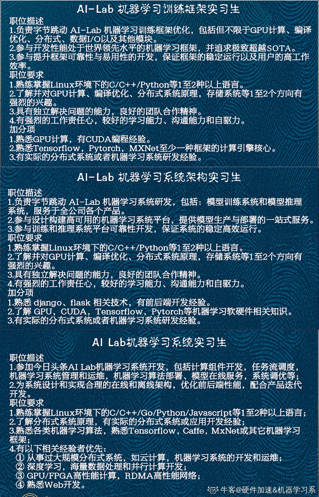
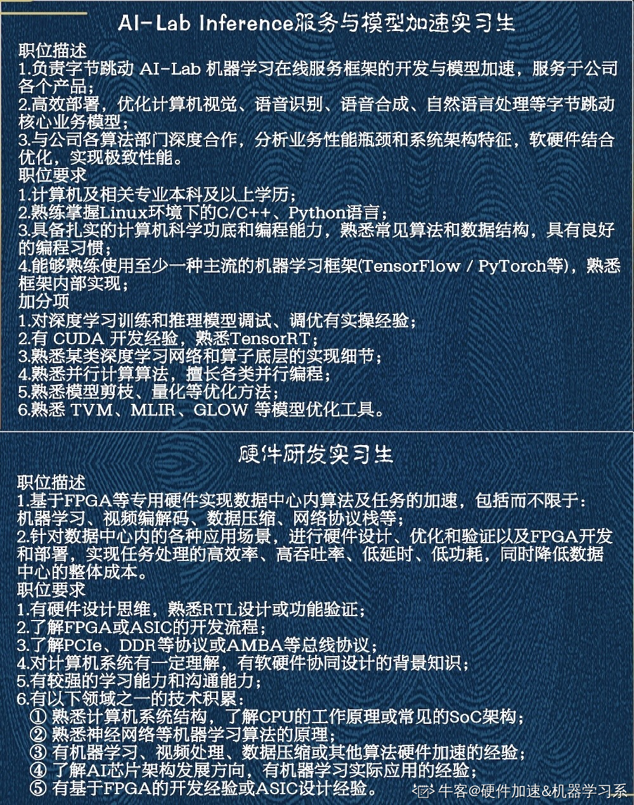

# 字节跳动

AI-Lab 智能语音

算法工程师

CUDA编程

https://www.nowcoder.com/discuss/441142

字节跳动AI Lab 机器学习系统组&硬件组【base 北京、上海】内推码：VZTRU3B

模型压缩、模型量化、GPU CUDA编程、编译优化......都有具体的岗位设置！！！（五个方向任意一个皆合适）【GPU编程，编译器，高性能网络，分布式存储，集群调度】

咨询可加微信yangxinyue0502，或者通过邮件 [yangxinyue.cindy@bytedance.com](mailto:yangxinyue.cindy@bytedance.com) / [lab-hr@bytedance.com](mailto:lab-hr@bytedance.com) 咨询

https://github.com/bytedance/byteps

系统组对应：AI Lab研究员

https://ac.nowcoder.com/discuss/427444

字节跳动lab机器学习系统组&硬件组实习生/全职招募【北京】

简历可投zuoziyu@bytedance.com

也可通过邮箱联系～

Momenta视觉算法岗

地平线视觉算法岗