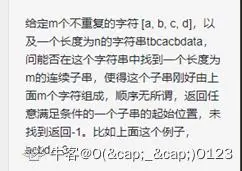

#　地平线

int8模型量化和卷积加速的多种方式(fft，winograd, im2col+sgemm)

堆与栈的区别，指针引用区别，topK问题

 问了内存（shared memory、unified memory）的区别及一般如何使用，bank conflict，CUDA流分类及使用, 专业技术问题就基本全程在问CUDA，除了一些细节没有答上来基本都应该答上来了。


地平线是目前国内唯一一家实现  汽车  智能芯片前装量产的企业。得益于前瞻性的软硬结合理念，地平线自主研发兼具极致效能与高效灵活的边缘人工智能芯片及解决方案，可面向智能驾驶领域提供包括高效能  汽车  智能芯片、软件  算法  、工具链等在内的全面赋能服务。随着全场景整车智能中央计算芯片征程5的推出，地平线成为业界唯一能够提供覆盖从L2到L4全场景整车智能芯片方案的边缘人工智能平台型企业。


量产车载AI芯片公司，芯片原厂


暑期实习二面之后就是hr面了，一般二面后一个星期内出结果


- 2022-04-13 一面
- 2022-04-22 二面


- 8.31 地平线一面
- 9.11 地平线二面
- 9.18 地平线HR面


周三二面 

周五下午hr面


二面问的主要是深度，聚焦于项目的几个点刨根问底，一直问到不会为止，连芯片有几根引脚都问了。而且面试官会现场计算说的参数，如果说错了可能会很尴尬，总之还是有一定难度的。


base model组是做nas的呀。。。


---

## 应用软件开发

  1.STL适配器 

  2.allocator实现原理 

  3.map原理，如何删除一个数 

  4.undered_map原理，hashtable原理 

  5.void const fun(){} 和 void fun(){}能否编译正确，为什么 

  6.空类多大，为什么？ 

  7.引用的实现原理 

  8.shared_ptr如何实现的？ 

  9.static的用法，在函数前面加static什么意思？ 


## nlp

```
a = ['ab','bc','bcd','a']
s = ['aaabcd']
```

 问a里面的元素能不能组成s，使用次数不限，我说回溯，面试官说对，但我想着能不能改改，结果写了出来两个不符合题意的解决方案。。。。


## aiot 深度学习

面试体验同[旷视]()，hr每天催着面试，然后二面完马上给我发邮件说挂了😅 
一面：项目介绍，项目细节提问，svm介绍，空洞卷积介绍，空洞卷积感受野计算，俩智力题，具体忘了，一个也不会😅做题:1.手写3＊3卷积核 2.最长有效括号 

二面：项目介绍，项目细节提问，常见的分类/分割评价指标，手写iou计算😅我用numpy写他还嘲讽我😅


## 预测算法工程师 

一面 nightmare （但面试官有点小帅） 

手推svm, 问了下决策树的分裂准则，剪枝相关，然后扣项目细节， 问评价指标，precision, recall相关。 

深度学习的优化[算法]()（没答上来） 

代码题 是矩阵，最短路径，要记录走过的路径。 


二面 

hr说一二面形式一致，噗嗤，[机器学习]()全忘了的我赶紧抱了抱佛脚，别又让我手推svm，然而啥都没问。 

简单聊了聊项目，然后感觉问得比较偏业务，就是对自动驾驶的理解之类的，然后数学能怎么用上，未来规划，实习预期之类的。 

问了transformer（哭哭，没好好听讲，都忘了，不，是没记得过） 

两道题 

\1. x的n次幂（非小数） 

我递归做的，然后面试官要求O（1）的空间复杂度，我说应该可以把递归改迭代（但本菜鸡不会改） 

\2. 一个数组，然后K个窗口的最大值。（未果，直接暴力肯定是不行的） LC 410

 

  综上，首先我对自动驾驶的理解，面试官应该就不太满意，然后还没手撕出第二道题，所以估计凉了。


---

## 算法岗

简历里只有语义分割


一面: 

 1.写一个体现你水平的[排序]()[算法]() 

 2.NMS 

 3.全0(含有部分1）的矩阵中有一些1构成一个封闭曲线，把曲线内部的0变成1 

 4.讲一下faster rcnn，shufflenet，mobilenet 

 5.项目，论文简单讲一下 

 


 二面： 

 1.讲一讲NAS(网络模型搜索）一般怎么做的？有哪些经典的做法？ 

 2.会不会RL?（不会） 

 3.讲一讲语义分割的ASPP和PSP区别？ 

 4.有没有实践过经典的[机器学习]()[算法]()GBDT等，图像的滤波？ 

 5.神经网络计算量参数量怎么计算的，有没有尝试过硬件上的优化(没有）。 

 6.有没有学过相机模型？ 

 7.期望工作地点？老家哪里的？有没有考虑过实习公司的转正。 

 


 三面(印象不深）: 

 问的比较杂，已经快10天了，这一面感觉自己面的很差，面试官全程很严肃。 

 1.从实习经历开始，说实习干了啥。感觉很关注实习的时间长短，说实习了4个月，觉得有点短。(貌似听同学说，地平线实习6个月才能申请转正) 

 2.文章讲一讲(垃圾文章扯了半天） 

 3.你觉得业务和research区别在哪？各有什么难点，你想做什么。 

 4.讲一下attention的原理。你认为为什么有效或者什么情况下有效。 

 5.懂不懂卡尔曼滤波(这个把自己坑了，问我本科专业，控制的，就出了这个题） 

 6.有没有想问我的？(问了部门干啥的，感觉基本CV领域和自动驾驶相关的都有做） 

 


 希望能对大家有所帮助，HR说一般3个工作日反馈，过了一周了，没收到反馈，估计是凉了


---

## 机器学习算法工程师

1.介绍华为的实习
	实习中，kmeans聚类如何确定k值，模型的输入矩阵是如何得到的
	搜索是如何优化的，语义相似度计算的输入矩阵是如何得到的
	为什么要用词向量，从kmeans到词向量的考虑如何
	无评价指标
2.HMM详细介绍
3.生成式模型和判别式模型区别
4.写贝叶斯公式
5.jieba分词如何应用的HMM
6.维特比算法详解
7.写一个字符串的字串最大增序串（递归），例如：“bcgwaxyz”的最大增序串“bcgwxyz”


----

## 服务端

**一面**

const关键字
多态的实现，虚函数实现机制
STL了解吗？讲一下
vector迭代器的失效问题
map和unorder_map的区别
红黑树介绍一下
C++11特性
移动拷贝、移动赋值讲讲
RPC方式（没打听清，我RPC只了解大体是咋回事，深了真不会）
分布式介绍一下
CLOSE_WAIT状态介绍一下（和TIME_WAIT混了，让讲了讲挥手过程）
单链表交点问题
栈模拟队列
项目介绍


**二面**

自我介绍
实习项目介绍
手撕代码：人脸照片合并（并查集问题，并不会，用了最原始的办法解决了，时间复杂度O(mn2) = =…）
聊在校的那个项目
想去什么样的公司
想做嵌入式方向还是软件开发方向
问我了解地平线吗（我说做机器人的= =，尴尬，人家虽然叫地平线机器人，却并不是做机器人的）


二面聊了聊实习和校内项目，手撕代码第一眼看到不知道怎么优化，没办法用暴力法去实现，时间复杂度有点爆炸


白板写代码。写个ArrayList，用静态数组实现动态数组。


----

## 深度学习平台

介绍简历，科研经历。教训：一定要把自己简历上写的内容搞懂，不能被面试官问住

问一些和所投递岗位相关的问题，因为我投的是深度学习平台，所以问了我ResNet和DenseNet的创新点，以及Inception结构。确实经典的几个神经网络都有点过时了，面试官问了我一个MobileNet还一个什么没听清，又得狂补了

问一些优化算法，SGD, Adam原理以及动量的问题

C++中的STL，map, vector等底层结构，以及红黑树的复杂度O(log n)

智能指针，可以适当自动释放内存，不用手动释放

最后考了一个编程题，反转链表，明明前两天刚写的代码，怎么就又手足无措了呢？


## 视觉算法工程师

**一面：55mins** 

  怼项目，根据简历深挖 

  你的论文和centernetV2的区别是？ 

  **Mask-rcnn介绍一下：** 

  **敲黑板：谈到Mask-rcnn，不如说这是一道考验介绍[算法]()的陈述题。面试官会根据你简历做的[算法]()or你提到的[算法]()（恰好他也熟悉的Hhh）进行提问要你介绍，说明。这里不要求同学们说的多么仔细，我建议可以这样回答** 

  **1.它基于的历史：双阶段检测器faster-rcnn+语义分割分支** 

  **2.它的最大几个idea，让你眼前一亮或是和你的项目论文关联度比较大的创新点** 

   **2.1：** ***解决**特征图与原始图像上的RoI不对齐问题* **：即Roi_align:传统的proposals在生成固定长度的roi的过程由于二次量化时造成的位置精度损失以及双线性插值法回去看paper!!!**  


​    **2.2**  ***掩模预测和分类预测解耦：参考Nms的类内抑制，****对于实例分割的****每个类别独立地预测一个二值掩模，每个二值掩模的类别依靠网络RoI分类分支给出的分类预测结果。***    


   ***与FCN不同，FCN是多分类问题（相当于softmax）这里类似于进行了每个class****的伯努利0-1分布预测（相当于*****sigmoid*** **）***    

   ****\*这一点回答的不太好，主要书对于实例分割不够了解，欢迎大佬补充**


  ***3.后续的改进：例如faster-rcnn→cascade→DetecoRS的发展*** 


  

  **L1,L2正则化的区别：** 

  **敲黑板！！！！L1,L2正则化也是做[机器学习]()or深度必考的！** 

  **1.包括各自的功能** 

  **（why need正则化：防止训练产生过拟合，用复杂的模型去拟合训练集时容易出现过拟合，即泛化能力不足， 用一些惩罚项约束复杂度）**  

  **2.各自怎么约束复杂度** 

  **（L1对模型权值的绝对值之和约束，L2的模型权值的平方和约束！）** 

  **3.区别和特点：** 

   **L1正则化容易得到稀疏解，L2正则化容易得到平滑解。** 

   **原因：（1）从解空间来说（2）从梯度下降来说** 


  代码题： 

  lc原题221，也是热门题，简单的dp，[最大正方形]()面积：在一个由 '0' 和 '1' 组成的二维矩阵内，找到只包含 '1' 的[最大正方形]()，并返回其面积. 

  **简单的dp：三要素描述好就行** 

  **这里面试官给了个新要求，求出面积后还需要描述最大面积的位置，其实也很简单，加两个bottom_x,bottom_y的全局变量，和max-area一样，每次有新的最大值就去更新右下角的坐标和边长，就可以描述了** 


​    **二面：60mins  点赞这个主管！一看就是大佬，因为他要第二天出差，所以晚上22.00面试。。。。
**  

  特别耐心，提的问题比较有深度，然后会耐心和我讨论，像技术分享一样~我写代码得到时候特地静音， **说我不打扰你！有问题随时call我hh** 

  具体如下： 

  你做过transformer说一下你知道的cv任务里 transformer发展的时间线 

   **我：Vit，Detr，swin , Deformable** 

  **敲黑板：有做过transformer的同学，基本的组件要掌握的（muti-head,位置编码，编码器，解码器，FFN等），没有的话一般不会问~因为大概2020才引入到cv的，题外话：感觉做过了transformer，有一些不会cv的面试官也可以交流了hhh感觉cv面试也有挺多是nlp,ml方向的老师面** 

 


  解释一下**位置编码**。  


  我：&*#*……（主要说了sin-cos方式和embeddings）  


  追问：你认为在CV中，encoder之前的位置编码能不能去除？ 

  我：没有这个的话，切分patch的时候，只有图像的抽象特征信息而没有位置信息，感觉不利于回归任务，分类应该问题不大 

  然后告诉我说，目前有针对这个positon-encoding的简化甚至存在的必要性的讨论让我可以去看看，这个属于一个开放问题 


  对CNN和Transformer在CV领域的优劣做了一些讨论，像聊天一样特别轻松愉快~嘿嘿~ 


  **代码题：快排（高频！重要性不必多言。白板都要会撕！自行解决输入输出！！以及为啥时间复杂度是（nlogn）递归的思想~）** 

  追问：在cv用[排序]()的地方 

  答：NMS 

  问：快排的稳定性？稳定性是什么 

  答：若A=B且原数组中A在B前面，[排序]()后能保证A依然在B之前，稳定，否则…… 

  再问：那你认为快排的不稳定，假如nms用了这种不稳定[排序]()，会有什么影响 

  然后就是一番交流啦~不过我觉得不光出了简单的代码提，还在特定岗位的应用上一一刨析，真*大佬，态度也很随和！非常nice的一位leader 


  之后介绍了地平线，对这个企业的好感度又Up了！ 

 

**HR面：30mins** 

 意向地的选择 

  实习的心得和收获 

  组里的业务组否接受 

  （顺便问了下二面的大佬，得知可能是我的大Leader，非常荣幸。） 

  （知道我有了几个意向依然明确说给我oc，并问我对第一份工作的看法 **，这里真的觉得二面和HR面的面试官，真的是非常赞！至**少是我喜欢的风格！嘿嘿！） 

 


  **总结：**  **（** **1）** **代码题** **不难，** **但是会有改编和扩展（求最大面积→描述[最大正方形]()），快排稳定性对nms的讨论。需要有应变能力的培养！**  

   **（2）[算法]()介绍题，常规，要去准备，考察基本功。能完美分析idea并结合background和展望未来最佳！
**  

   **（3）开发性问题，大胆探讨，结合你的知识，做出观点并陈述，主要考逻辑性和知识广度！**


----

## 嵌入式

基础编程题：gcc，大小端，冒泡排序；
项目：扣细节
职业规划，非技术问题：


手写智能指针, share_ptr，原理，以及为什么要有这样的原理，

设计模式，多线程。


## auto 应用实习

\2. [c++]()移动语义？ 

 \3. vector和list的区别？ 

 \4. Vector的push_back和emplace_back的区别？ 

 \5. Vector的resize和reserve的区别？ 

 \6. 写程序实现vector 

 \7. 对地平线有了解么？ 

 \8. 对工作地点和时间有要求么？


**操作系统：**

1、 问了线程和进程的区别

2、 问了对sleep的理解。（进程中的概念）

3、 进程和线程的区别？

4、 进程间通讯有几中方式？

5、 死锁是什么？

6、 进程间通讯方式

7、 进程线程协程的区别

8、进程和线程的区别？


---

## auto应用工程

1. 说一说虚函数表（没答上来） 

2.  为什么基类的虚函数要用虚函数（支支吾吾） 

3.  介绍一下stl中vector、queue、deque 

4.  需要删除元素，上面哪个最好（答的deque，但我感觉哪个都差不多） 

5.  经常用push_back对性能有什么影响 

6.  智能指针 

7.  map的实现原理（[红黑树]()） 

8.  Lamda函数的作用（我只在sort函数里面用过，不知道还有什么其他的作用） 

9.  右值引用和move（只说了一下右值是啥，但是没说清楚具体的应用场景） 

10.  linux有了解过吗（没有GG） 

11.  设计模式（单例、工厂） 

12.  （共享屏幕）写单例模式的懒汉式和饿汉式（饿汉式没写出来） 

13.  懒汉式是线程安全的吗？为什么 

14.  （编程题） 

    ```
    //1.给一个正整数n，其可以被拆解为两个正整数之和，求这两个正整数乘积的最大值
    //答：假设x=n/2,y=n-x,最大值为x*y
    
    //2.给一个有序数组a，一个整数n，查找元素x的下标，若找不到则返回-1
    //答：用二分查找(手撕二分)
    ```

15.  聊一聊做过的项目，还有遇到的困难 

16.  如何设计udp来减少丢包 

17.  项目整体分工 

18.  对地平线公司的了解咋样 

19.  如果老板给你布置超额任务咋办 

20.  反问环节： 

    1.  提高的相关建议（接触一些工程级代码，如果要来地平线则可以接触一些嵌入式的知识） 
    2.  公司业务的介绍：公司15年建立，现在有2000多人，北京上海都有总部，主要做自动驾驶[算法]()，芯片No.1，企业方案，上海的公司在安亭和张江 


 问的还是比较基础，但是奈何我准备的时间不久，好多基础问题都没答上来，手写单例模式也有点忘了（之前就写过一次懒汉式），答得流畅的环节是后面两道编程题以及我自己的项目（还是有一点停顿，不过已经比上次好了）。没有在面试前准备一下公司简介啥的，有点尴尬，不过面试官人很nice，这次体验还是很好的。之后要着重看看C++这些新特性，stl底层的东西，设计模式多写写看看，还有linux。


----

## 嵌入式软件开发

介绍一下实习项目，深挖项目面试官感兴趣的点，介绍如何实现。 

说一下IIC，UART(因为实习项目中有用到)。 

介绍一下这个Linux相关的项目。(这里吐槽一下，虽然这个项目自己没有做过总结，介绍起来可能不是很清楚，面试官似乎也感受到了，疯狂问，各种细节，问的我怀疑人生。但是感觉和面试官沟通起来也很难受)。 

全局变量和静态变量有什么区别。(回答的很乱，没有总结过) 

什么时候会产生野指针。 

const和define有什么区别。 

说一下死锁。


----

## 应用软件工程面经

2020-08-25 10:12:33


1、自我介绍  

   2、问项目，做了些啥，其中哪些工作是核心、核心工作具体说说。  

   3、传统图像的方法了解吗，霍夫圆检测原理、边缘检测原理、HSV空间是什么  

   4、做目标检测用的什么框架（Pytorch、tensorflow这种），用了哪些开源库  

   5、平时python用的多还是[c++]()用的多？python都都用过哪些库？  

   6、更愿意做[算法]()改进还是做工程落地？  

   7、C++里的虚函数原理讲一下？  

   8、什么是运算符重载？  

   9、智能指针介绍一下？  

   10、用户态如何与内核态主动通信?  

   11、写过纯C的代码吗？（基本没有。。）  

   12、熟悉模板编程吗？（稍有了解。。）  

   13、讲一下字节对齐，大小端如何判断？  

   14、进程间通信的方式有哪些？  

   15、套接字(socket)通信相对其他进程通信的优势是什么？  

   16、TCP和UDP的区别，各自有什么优缺点？  

   17、项目里目标检测的工作主要是单张图片的还是序列化视频？  

   18、知道摄像头是如何接入网络的吗？（这。。）  

   19、卷积的计算过程具体讲讲？  

   20、对其他卷积计算有多少了解？说一下反卷积、空洞卷积、深度分离卷积的计算过程。  

   21、说一下这几年目标检测模型的发展


----

## 算法

一：

全程问项目

[算法题]()：n!末尾零的个数

二：

手写一个最小堆

翻转字符串：i love you变成you love i。空间复杂度o1

相关性计算用欧式距离和cos各自的应用场景

隐藏层破坏了凸性，那为什么要隐藏层

对称为什么比非对称好

过拟合，梯度消失

三：

word2vec

推导ada

ocr相关问题

问了几个数学问题


## CV

**地平线一面**  

 1、简历挑一个项目问 

 2、BN原理，有几个参数，训练和测试的区别，多卡时BN如何处理？了解其他的归一化操作吗（例如群组归一化？） 

 3、MobileNet V1,V2原理，优化的方向 

 4、分割了解多少？ 

 5、五道题选三道题 

 5.1 

[二叉树层序遍历]()


 5.2 手写NMS 

 5.3 手写MIOU 

 5.4 用随机产生7以内数字的函数去写随机产生10以内数字的函数 

 5.4 

[股票问题]()

（可以多次购买） 


 **地平线二面** 

 


 二面就是简历细致化面试，为什么这么做？为什么不这么做？你们没有再做优化吗？ 

 举例： 

 1、人脸特征训练好，你们怎么检索的呢？直接暴力吗？SQL有没有优化？ 

 2、为什么用GAN，用GAN真的变好了吗？ 

 3、你们这个模型最后部署有没有考虑速度？有没有深入的优化一下？（Emmm,这部分我没负责） 

 .... 

 最后问了几个简单的 

 1、kmeans聚类如何选择初始点。 

  2、SVM的loss是啥。 

  3、Triplet Loss 怎么生成那三个点


---

## C++三面面经

**一面（一小时）** 

  1、自我介绍 

  2、项目介绍 

  3、fpn 

  4、mobileNet 

  5、卡尔曼滤波 

  6、xgboost和svm 

  7、[二叉树]()，[红黑树]()性质 

  8、C/C++程序编译过程 

  9、C/C++内存分布 

  10、汇编后形成的机器指令里面是什么东西 

  11、C++多态 

  12、进程调度 

  13、进程和线程 

  14、虚拟地址 

  其他忘记了 


 **二面（一小时）** 

  1、项目介绍 

  2、[c++]()多态 

  3、c实现重载 

  4、指针和引用的区别 

  5、友元 

  6、一个.c文件如何访问另外一个.c文件中的static类型变量 

  7、[c++]()中的const 

  8、虚拟内存是如何映射的 

  9、xgboost怎么做车道线检测 

  10、行人测距怎么实现 

  其他忘记了 


 **三面（一小时）** 

  纯项目面


---

## C++ 通用软件开发

  第一面。 

   1、内存泄漏的问题 以及如何解决的 new 和malloc的区别  

   2、[c++]() 几种强制类型转换  

   3、Linux GDB如何调试 基本命令  

   4、stl vector和list的使用 以及区别  

   4、手写list  

   6、关于智能指针的问题  

   7、聊了一段时间项目  


   总体来说，第一面还行，难度不是很大。  

   第二面。。。。。。。。。  

   被狂轰乱炸  

  


   面试官上来说，咱们一起来讨论一下[c++]()一些基础细节  

​    1、关于全局变量的生命周期，以及其他文件如何和引用全局变量，include 头文件和不include区别？   

​    static   

​    const   

​    extern 的区别   

​       2、const 底层实现以及 const修饰函数 函数的特征 const 修饰函数返回值 能保证变量的安全性吗？   

​    3、虚函数，和纯虚函数的区别，为什么有虚函数的还要写纯虚函数？   

​    4、友元函数的定义，以及什么运算符重载只能[用友]()元函数定义？   

​    5、多态分类（静态多态，动态多态）模板函数底层如何实现？模板函数算多态吗？模板实例化是在程序哪个时期？   

​    模板属于编译器的多态，属于静态多态，虚函数的多态属于动态多态，   

​    模板函数和函数重载区别？   

​    函数重载会什么函数名字可以一样，函数入口地址是按照函数名给的。那这样岂不是地址完全一样，如何实现重载的呢？   

​    模板函数底层如何实现。   

​    6、抽象工厂（不会）   

​    7、python 如何调用[c++]()库函数，底层实现逻辑是什么（wtf？？？）   

 8、用过python指针没有？（问这一块估计是我的项目，有一部分时图像[算法]()处理，用python做的预研验证，然后移植到linux 上的g++。） 

   

​    数据结构   

​    map 底层[红黑树]() 为啥不用[链表]()，为啥不用平衡树 非要用[红黑树]()   

​    对10万个数用什么存储 数组还是[链表]()（我回答[链表]()，因为存储地址可以不连续，如何[排序]()）   

[排序算法：内排序： 小文件 在内存中进行排序]() 

[外部排序：大文件 多路归并排序：两两归并排序、]()            相关知识点：                    [排序](javascript: void(0))            相关知识点：                    [排序](javascript: void(0))            相关知识点：                    [排序](javascript: void(0))            相关知识点：                    [排序](javascript: void(0))

​    应该要用外部[排序]()，可惜自己当时不知道。。。。数据结构学的不牢，太菜了   

  

- include 头文件和不include区别，这个题是想问什么，引用头文件可以不加include吗

问的是 全局变量的生命周期 比如说我在头文件定义static int 变量（虽然头文件最好是声明 cpp中定义）然后其他程序调用这个头文件 请问能不能访问这个程序中的静态全局变量

   

​    图像[算法]()   

​    1、知道哪些图像分割[算法]()，介绍一下，你项目用的什么[算法]()，为什么   

​    2、边缘检测[算法]()，高斯金子塔，。。。   

​    3、如何完成人眼追踪，聊了半天，给了change 没回答出来。。   


​       地平线即使选择[c++](),通用软件开发，也会更偏向做open cv的同学，什么服务器 计算机网络 数据库基本不care


## 计算机视觉算法

一面：40min 

 一面内容： 

-  [滴滴]()实习经历，引申到随机森林和gbdt，比较下区别，问了下应用时的特点 
-  问论文，详细介绍论文的思路和方法，优越性 
-  问项目，详细介绍项目的组成和分配，以及负责的主要内容 
-  物体检测：RCNN series的介绍； 图像/视频分割的方法介绍：传统方法加深度学习方法 
-  深度学习平台的使用，有没有进行过caffe的二次开发 
-  基础的[机器学习]()方法：聚类； LR和SVM区别 

 二面：30min 

-  讨论论文细节和项目细节 
-  卷积有什么用？分析一下分类、检测、分割需要的特征有什么区别？用在人脸检测上的卷积和图像识别的卷积有什么区别？ 
-  caffe内部的卷积怎么实现 
-  faster rcnn的代码细节：如何去掉生成的多余的框框？如何将anchor得到的图映射回去？如何训练faster rcnn？ 

 三面：20min 

-  自我介绍加详细解释下最拿手的论文


---

## AI算法

实习面试时做了一套题：

编程题：数组[二分查找](https://www.nowcoder.com/jump/super-jump/word?word=二分查找)；

编程题：求根节点到叶节点的最远距离；

编程题：在n个数的数组中，1到n中只有一个数没有出现，求这个数；

问简历中的项目，推项目中的一些公式；


B树/B+树


----

## 图像系统工程师

一、地平线电话一面


问题：

0、简单自我介绍；

1、传统算法的理解；

2、怎么解决问题：图片上的线条是水平、竖直、倾斜45°？

3、怎么解决：图像噪声问题？

接着延伸：如果是动态图像，怎么解决？

4、OpenCV熟悉吗？怎么用OpenCV实现图像对比度的调整，具体代码？

5、图像的分布不均匀，如何处理？

6、你对自己的职业规划：未来3年或者5年？

7、对cmos的原理的理解？


有什么问题问面试官？

还有几轮面试？ ---一面通过，后面还应该有二面、综合面、 HR面，三面左右。


二、地平线视频二面
面试官问题：
1、SLAM算法的理解；怎么三维构建？---面试官要的是，你要清楚其中的构建三维的具体算法，而不仅仅是知道这是个什么东西和它的优缺点！！！

2、opencv库；

3、如何实现边缘检测和增强？

延伸：那么如何客观评价边缘增强符合要求？

4、cmos传感器的具体组成是否了解？以及起作用的具体过程？

5、公司对图像系统工程师的要求；

6、学习能力；一专多长；

7、你觉得自己需要多长时间能够胜任算法这个职业？

8、介绍一下对多传感器融合算法的理解？举个具体实例？

9、介绍一下简历提到的太赫兹激光器的原理介绍？以及为什么太赫兹可以用于6G网络？

10、你的数字图像处理的基础？40学时的课程结束后，有没有做个综合性的校项目？

二、反问：

图像系统工程师在贵公司具体负责哪些方面的工作？需要具备的能力要求有哪些？


---

## Linux应用开发工程师


1.准备让写一个主线程创建子线程，然后主线程与子线程通过shared_ptr共享在堆中开辟的一个对象，当主线程死亡时，如何防止子线程再引用该对象？ 

  想了一会，没答出来。。。 

  2.Lambda表达式遍历整型数组？（当时Lambda有点忘了，就写了其它三种遍历方式） 

  3.实现+运算符的重载？ 


---

## 机器人 后端开发工程师

2020-08-10 10:10:50


 二、C++基础 

 1、C++的特性 

 2、几种智能指针，shared_ptr--引用计数来实现，shared_ptr下面一个指针指向shared_ptr是否有问题：内存泄漏 

 3、STL中的vector,vector下面的push_back的时间复杂度 

 4、三个类， 

 class a{} 

 class b{int a; char b;int c;char d;virtual sa()} 

 class c{int a; int b;char c;char d;virtual sa()} 

 class d{int a; int b;char c;char d;} 

 b,c的sizeof长度是否相同：不同，因为内存对齐 

 5、内存管理，内存分为几部分：栈、堆、自由存储区、全局/静态存储区、常量存储区。自由存储区是啥？和面试官的知识出现分歧。。。 

 6、程序代码存储在哪一块？如果是你，会把虚函数表（还是程序代码还是啥）放在哪？-----------堆里，易于程序员修改 


 五、linux 

 1、查看全部文件？若是文件特别多，只是想看文件的个数，用什么命令？ 

 2、回到某一个路径下用什么命令？ 

 3、创建一个目录或者文件的命令 

 4、查看端口的命令?-------lsof 

 六、数据结构: 

 1、快排的时间复杂度，最好，最坏情况 

 2、堆排的理解，出一个题，让实现堆排的第一次[排序]() 

 七、智力题 

 狼、羊、菜、人过河问题 

 八、手撕代码 

 动态窗口最大值及优化(优化想考察的是双向队列)（写了十多分钟，完成了最简单的方法O(n*m),提出了一个较优的方法，预判决） 

 九、反问：略 

 面试时长83分钟，面试官人nice，很有耐心，会引导回答，考到我不会的他会自己嘻嘻的笑


## 提前批一面Linux应用开发工程师

2021-09-22 10:08:16


1.手写单例模式（饿汉式）。（不存在线程安全） 

  2.手撕不含有重复字符的最长子字符串。 

  3.了解大端字节序、小端字节序吗？为什么需要分大端字节序和小端字节序？ 

  4.手写大小端字节序？ 

```c++
#include <iostream>
#include <cstring>
using namespace std;

int main() {
    union
    {
        short x;
        char c[sizeof(short)];
    }test;

    test.x = 0x0102;
    // 0x0102
    // c[0] c[1]
    if (test.c[0] == 1 && test.c[1] == 2) {
        cout << "大端字节序" << endl;
    }
    else {
        cout << "小端字节序" << endl;
    }
    return 0;    
}
```

  \5. **能说说右值引用吗？为什么要有右值引用呢？** 

  这块回答的不好，右值引用有点忘记了，只说了引用的右值是可以修改的，在某些临时情况下可以应用。 

  6.手写一个 **String类**（估计右值引用答得不好就让实现一个String类）。 

  7.了解 **模板**吗，可以实现一下 **类模板**吗？ 

  刚准备写，又忘记该怎么写了，写了个template<class T1, class T2 >就没写了，难受，主要还是模板写得太少了。 

  8.C++11 了解哪些新特性呢，能说说看吗？ 

  9.你说的智能指针有哪几种，各自有什么作用？ 

  10.能解释解释shared_ptr的引用计数机制吗？ 

  11.什么是多态？ 

  12.vector和list的区别？ 

  13.list支持自增、自减吗？（ **不支持，内存非连续**） 

  14.什么是内存对齐，为什么要有内存对齐？（刚准备想画个图更加清晰一些，发现画还不如直接说，尴尬...） 

   15.能谈谈编译的过程吗？  

   16.那预编译的又做了哪些事呢？  

   17.GDB调试如何调试一个崩溃的程序？（  **可以用bt查看堆栈信息**）  

  18.线程同步有哪些？ 

  \19. **除了互斥锁、条件锁、读写锁、自旋锁，你还了解哪些同步机制？（我说还有无锁队列，面试官又问还有呢？......）** 

  20.你说的 **自旋锁的应用场景有哪些呢？（锁的粒度足够小，持锁的时间足够短，建议使用互斥锁）** 

  21.opencv了解吗？（不了解） 

  22.在不同平台上的如何链接的，了解吗？（不了解）


## 地平线提前批面经

2019-08-30 19:13:10

作者：硕熊
链接：https://www.nowcoder.com/discuss/239187?type=all&order=recall&pos=&page=1&ncTraceId=&channel=-1&source_id=search_all_nctrack&gio_id=61F18B877C87B680D3C613430ABBE45C-1652686859857
来源：牛客网


1面 

  1.语言模型知道哪些？ 

  2.N_gram的稀疏问题怎么解决？加法平滑，Good-Turing估计。 

  3.词的分布式表示你一般怎么做的？Glove, word2vec，然后讲了一下原理。 

  4.项目细节。 

  5.两道[算法题]()。 

  第一道是求编辑距离： 

```python
def minDistance(self, word1: str, word2: str) -> int:
    len1 = len(word1)
    len2 = len(word2)
    '''
        动态规划 
        step1: 状态  
        使用 二维 DP[i][j]，表示 word1 的 i 个字母 与 word2 的 第 j 个字母 相同 需要的操作步骤数
        step2: 动态方程
        DP[i][j]  A、 word1 的 i 个字母 与 word2 的 第 j 个字母 相同
                     DP[i][j] =  DP[i-1][j-1]  #不操作
                  B、不相同,需要进行 插入 删除 或者 替换操作
                     DP[i][j]  =  min(DP[i-1][j] + 1,DP[i][j-1] + 1,DP[i-1][j-1]+1)
        '''
    DP = [[0 for _ in range(len2+1)] for _ in range(len1+1)]
    # 初始
    for i in range(len1+1):
        DP[i][0] = i
    for j in range(len2+1):
        DP[0][j] = j
    
    for i in range(1,len1+1):
		for j in range(1,len2+1):
        	if word1[i - 1] == word2[j -1]:
            	DP[i][j] =  DP[i-1][j-1]
            else:
                DP[i][j]  =  min(DP[i-1][j] + 1,DP[i][j-1] + 1,DP[i-1][j-1]+1)
    return DP[len1][len2]
```

 第二道是[链表]()相加： 

```python
class Solution:
    def addTwoNumbers(self, l1, l2):
        """
        :type l1: ListNode
        :type l2: ListNode
        :rtype: ListNode
        """
        re = ListNode(0)
        r=re
        carry=0
        while(l1 or l2):
            x= l1.val if l1 else 0
            y= l2.val if l2 else 0
            s=carry+x+y
            carry=s//10
            r.next=ListNode(s%10)
            r=r.next
            if(l1!=None):l1=l1.next
            if(l2!=None):l2=l2.next
        if(carry>0):
            r.next=ListNode(1)
        return re.next
```


---

## Java 后端


\1. 在学校学过什么专业课程？ 

  \2. 树的叶子结点怎么计算？ 

  \3. 什么是[二叉树]()？ 

  \4. 设计模式都有什么？ 

  \5. 代理模式是什么？ 

  \6. 代理模式有什么用？为什么不直接引用？ 

  \7. hashmap底层 扩容 

  \8. arraylist count方法 

​    怎么获取多个数 

  （没录音，这里怎么问的有点忘了，大概这个意思） 

  \9. 问了问我在学校里的项目 

  10.场景题 

  （记不太清了） 

  11.[算法]() 

​    只出现一次的两个数 

  (力扣上的题，我只记得异或，怎么异或的忘了所以没答上)


## 嵌入式

一面： 

  全程问项目，问你个人研究方向和论文 


  二面： 

  先问问你简历上的东西 

  问编程语言基础 

  （本人偏向于硬件，常用RTX，Linux用的比较少，公司需求对Linux很精通） 

  如指针、线程、同步、进程和线程通信等 

  深度学习的基本知识 

  如：数据处理 

  你能不能搭建一个网络，不是仿论文搭（自己搭） 

  然后乱七八糟的问题，面试过程感觉很不好 

  也问了硬件知识 

  最后问了能不能加班和出差 

  然后就这样，50+分钟


---

## 后端一面面经

AOP是什么 
 http和tcp的关系 
 http是多对多吗 tcp多对多吗 还是一对多还是一对一 
 http的长连接是什么 
 长连接的应用场景 
 拓扑[排序]()是什么 
 给你一个有向图，只有一个开始节点和终点节点，输出所有的节点（要求前置节点全部输出才能输出） 
 写一个单例类 
 索引是什么 
 主键索引和非主键索引有什么区别 
 讲一下垃圾回收 
 非递减数组找到里面为n的开始和结束坐标 


---

## 嵌入式软件研发工程师-南京

**一面（电话面试）：**

**（1）class和struct的区别**

**（2）list和vector哪个索引更快**

vector随机访问

**（3）线程同步的方法、线程通信（共享内存、信号量、互斥锁、事件对象）**

**（4）多线程访问同一全局变量会出现的问题，有没有遇到过相关的问题。**

线程不安全

（5）问会不会网络编程

**（6）手撕代码：两道题，一道是数组中最小的两个数，一道是大数相加，我选的第一道**

求最小和第二小

**二面（电话面试）：**

**（1）定义和声明的区别**

**（2）static  extern**

**（3）数组指针、指针数组、函数指针、函数指针数组**

**（4）堆和栈的区别**

**（5）深拷贝和浅拷贝的区别**

**（6）内存泄漏与内存溢出，如何防止内存泄漏**

**（7）进程和线程的区别**

**（8）手撕代码，一面出的两道题，做剩下的那道大数相加**

**三面（电话面试）：**

挺过了一面二面技术，以为三面应该还可以，结果gg。本来约的4点，结果面试官开会开到5点，等到5点多开始面试。上来先问我有没有做题，我说做了，然后就开始聊项目，估计也是心情烦躁吧，面试很没有耐心，全程怼项目、被鄙视，说我做的太low，没意思，草草结束。然后官网状态就显示挂了。

总结：地平线提前批的处理速度还挺快的，三面基本上是连着的，前两面都还好，面试官也不错，就第三面，可能也是我自己项目不行吧，挺受伤的。

 

 

***\*二、招\**银网络（C++开发工程师-杭州）：**

**电话面试（笔试做的不好的话，会有这么一轮，跟我聊了不到10分钟吧，而且真的会刷人的哦）：**

**（1）什么时候用到内联函数**

**（2）内存泄漏怎么办**

**（3）debug和release文件哪个大**

**（4）如何构造一个服务器**

**现场面试：**

**一轮，一个技术小哥哥，问的挺细挺多的，感觉还比较专业：**

（1）设计模式必问

（2）SQL查询语句

（3）**手撕代码：给定一个数组，按奇偶奇偶输出**

**（4）TCP/IP协议，握手挥手机制**

还有一些记不清了，还挺细的

**二轮，比较严肃，感觉是boss：** （1）项目

**（2）别给自己挖坑！！！问你会什么编程语言，我说C++，问我C++优势在哪，然后让我写个类；**

**（3）用C++做过什么项目，我说没有，但是写过一些程序，然后就让我写一个最复杂的，自己比较菜，随便写了两个????**

**三轮HR：**

HR问的问题挺多的，各种经历、家庭都问，这个好像挺看重成绩的，实验室小伙伴成绩不是很好，全程被怼

现在等结果，希望能上岸，好歹在杭州啊~????

 

***\**\*三、CVTE（嵌入式软件开发工程师，一面凉）：\*\**\***

***\*（1）全程问项目，感觉项目准备的不好，回答的有点乱七八糟，时间仓促，一个专业问题没问；\****

***\*（2）手撕代码：输出一个数所有的质因数\****

 

***\**\*四、YY（C++开发工程师）：\*\**\***

***\*一面凉：\****

***\*（1）定义A，B两个类，及虚函数test()，B b， A\* b，那么b.test()和b->test()有什么区别，从内存角度来说。\****

***\*（2）构造函数能是虚函数吗？析构函数呢？虚表怎么调用\****

***\*（3）I/O复用（select，poll，epoll实现），网络复用（）\****

 

***\**\*五、汇顶（嵌入式开发工程师，提前批）：\*\**\***

***\*当时没复习，啥都不会，记不清问了啥????\****

***\*（1）大端和小端的区别，如何判断\****

***\*（2）单片机虚拟地怎么处理\****

***\*还有一些记不清了，是有一个手撕的\****

***\**\*自动转秋招：\*\**\***

***\*总体来说，秋招很简单，和面试官聊了聊项目和成绩，然后HR，然后boss面，问了放大器的内部结构，没有复习过，不会，最后给了一个sensor应用工程师的offer，同时也想问下有没有这个岗位的小伙伴，不知道咋样呢\****

 

***\**\*六、小米一面凉（秋招投的嵌入式开发，结果提前批直接转秋招，面的大数据开发工程师）：\*\*
（1）深拷贝和浅拷贝的区别（高频题）\****

***\*（2）说一说项目中如何应用贝叶斯分类的\****

***\*（3）几种排序算法的时间、空间复杂度，说一说归并排序如何实现的\****

***\*（4）大数据相关的我不会，面试官也就没问了，然后凉凉\****

 

***\*七、度小满二面凉（C++开发工程师）：\****

***\*（1）内存管理\****

***\*（2）TCP和UDP的区别\****

TCP面向连接可靠的基于字节流的协议

***\*（3）产生死锁的原因，写一段代码实现\****

产生死锁的四个必要条件：

（1） 互斥条件：一个资源每次只能被一个进程使用。

（2） 占有且等待：一个进程因请求资源而阻塞时，对已获得的资源保持不放。

（3）不可强行占有:进程已获得的资源，在末使用完之前，不能强行剥夺。

（4） 循环等待条件:若干进程之间形成一种头尾相接的循环等待资源关系。

***\*（4）为什么会有线程不安全，写个示例代码\****

多个线程访问共享变量

***\*（5）数据库事务的特点、事务级别\****

原子性，隔离性，一致性，持久性

读未提交

读提交

可重复读

可串行化

***\*（6）InnoDB和MyISAM的区别\****

***\*（7）SQL的锁机制有多少种，乐观锁、悲观锁\****

***\*（8）前缀表达式，中缀表达式，后缀表达式\****

***\*（9）内存泄漏\****

***\*（10）进程间的通信机制\****

***\*（11）写一个快速排序\****

 

***\**\*八、字节跳动一面凉（C++开发工程师）\*\*：\****

***\*（1）字典的底层实现机制，为什么要用红黑树，红黑树的原理\****

***\*（2）C++虚函数\****

***\*（3）堆栈的区别\****

***\*（4）优先级队列的实现，高优先级先出\****

***\*（5）手撕代码\****

***\*\****

 

***\*九、ZOOM（C++客户端开发工程师）：\****

***\*（1）类在定义的时候默认会生成哪几个函数\****

***\*（2）C++相对于C的优势在哪里\****

***\*（3）虚函数、多态的实现\****

***\*（4）C++内存分配\****

***\*（5）TCP/IP，TCP三次握手，四次挥手\****

***\*（6）指针，引用，实参，形参\****

***\*（7）delete[]和delete问题\****

***\*（8）进程间通信的方式\****

***\*（9）进程，线程，程序的区别\****

***\*（10）指针，引用，实参，形参\****

***\*（11）一个string翻转，不能额外占用任何空间\****

 

***\*十、寒武纪（音视频驱动开发工程师）：\****

***\*（1）CNN原理等深度学习问题\****

***\*（2）linux开发，Python用的比较多，C++的问题没怎么问，凉凉\****

###  

**十一、图森未来（系统开发工程师）：**

**（1）写一个类，实现insert，delete，getClosest等功能，信息不是很明确，花的时间有点久**

**（2）剩下一些基础C++问题**

 

**十二、优必选（C++开发工程师）：**

**技术一面：**

**（1）基础问题，插入，查找算法的复杂度**

**（2）场景问题：实时通信，TCP/UDP选择等**

**（3）linux会不会，有没有开发平台的倾向**

**（4）项目相关**

**HR面：**

**（1）各种灵魂拷问，很可怕，涉及职业规划**

**（2）给自己最想去的公司排序，top3；如果加上优必选，都收到offer，如何选择**

 

**还有海康、电信云、海尔、平安产险等，问项目比较多**

 

1. **函数传值的方式**
2. **引用和拷贝的区别**
3. **引用的优缺点和拷贝的优缺点**

 

8.24 深信服优招 c++研发（物联网方向）

1. **c++内存分区，未初始化的全局变量放在哪，如果编译了在二进制文件里会有他的位置吗？**
2. **野指针是什么，有什么工具可以检测吗？**
3. **进程间通信方式，知道互斥锁和什么锁**

1. **一个结构体，能够用memcpy判断两个结构体存的东西是不一样的吗？**
2. **知道哈希表吗，怎么解决冲突，如果只有32个槽，怎么存放几千个数据。**
3. **路由器和二层交换机的区别**
4. **用过shell脚本吗**
5. **知道二叉树有哪些遍历的方式吗**
6. **后序遍历的实现**
7. **假设4个人过河，每个人的过桥时间为1，2，5，8。只有一个手电筒，一次最多过两个，怎么过桥速度最快**
8. **如果是n个人怎么计算他的过河时间**
9. **arp协议的功能干嘛用的**

ip地址解析为mac地址

1. **快速排序的思想**

 

8.26 老虎正式批 windows开发一面

1. **c和c++的区别**
2. **你对多态的理解**
3. **冒泡函数**
4. **快速排序的思想**
5. **学习了哪些数据结构**
6. 你对mfc的印象
7. 用过哪些ui界面
8. 用过qt吗


8.26 360提前批 软件开发


1. **手撕strcpy**
2. **如何判断大小端，手写代码**
3. **讲一下tcp的拥塞控制**
4. **左值引用和右值引用的区别**
5. **四种cast强制类型转换的区别和使用**
6. **讲一下智能指针**
7. **做了哪些面向对象编程的工作**
8. **了解完美转发吗**
9. **future和thread了解吗**
10. **tcp/ip四层模型和osi七层模型具体是哪些**
11. **进程间消息通讯方式**
12. **进程和线程的区别**

8.26 老虎正式批 windows开发二面

1. 讲windows下消息的机制
2. **系统集和用户集**
3. **c++的内存管理**
4. **stl是线程安全的还是不安全的**
5. **windows出现了内存泄漏怎么办**
6. **怎么删除链表第n个结点**
7. **tcp，udp的区别**
8. **tcp怎么确定可靠传输**
9. **用户点下鼠标到控件响应的过程，怎么实现的**

9.5 bigo正式批 客户端开发一面

1. 项目
2. **单例模式线程安全手撕代码**
3. **观察者模式的应用场景和工作方式**
4. **知道责任链设计模式吗**
5. **流量控制与拥塞控制**
6. **tcp，udp应用的场景**
7. **讲一下红黑树**
8. **哪些排序算法是稳定的**
9. **c++有哪些创建线程的方法**
10. **用过oracle和mysql吗**
11. **join有哪几种方式**
12. **讲一下左连接和右连接**
13. **了解过移动开发的架构实现吗**
14. **除了c++还用过什么，java用过吗**
15. **有什么想问我的**

9.8 高德地图正式批 c++研发一面

1. **你对面向对象的理解**

2. **继承有什么原则**

3. **虚函数的工作方式**

4. **虚函数表和虚表指针是一个对象一个还是**

5. **抽象类可以实例化对象吗**

6. **公有继承，私有继承，保护继承的使用场景，和你的判断使用哪种的原则**

7. **c#中有接口的概念，那么在c++中你觉得哪种行为体现了接口的特性**

8. **重写和重载的区别**

9. **类函数哪些需要设置成虚函数，你怎么判断一个函数需要声明为虚函数**

10. **基类指针操作基类对象，和基类指针操作派生类对象，和派生类指针操作基类对象，和派生类指针操作派生类对象，操作同名函数时的表现**

11. **如果同名函数为虚函数又是怎么样的**

12. **c++的虚拟内存分布**

13. | 123  | `const` `int` `i=``1024``char` `*str =”``"hello"``在全局范围和局部范围声明时在内存的分布情况` |
    | ---- | ------------------------------------------------------------ |
    |      |                                                              |

14. | 123  | `int` `i=``1024``static` `int` `i=``1024``在全局声明使用的区别和局部声明的区别` |
    | ---- | ------------------------------------------------------------ |
    |      |                                                              |

15. **你了解过stl容器中的哪些容器，以及使用的场景和区别**

16. **vector中扩容的原理和具体实现方式**

17. **map和unordered map的底层实现和性能区别，获取元素和删除增加元素。**

18. **了解过哪些排序算法，可以讲一下吗。在什么场景使用什么算法**

19. **归并排序了解吗**

20. **设计数据库表有哪些原则，你如何设计一个表**

数据库设计的三大范式：为了建立冗余较小、结构合理的数据库，设计数据库时必须遵循一定的规则。在关系型数据库中这种规则就称为范式。范式是符合某一种设计要求的总结。要想设计一个结构合理的关系型数据库，必须满足一定的范式。

　　在实际开发中最为常见的设计范式有三个：第一范式是最基本的范式。如果数据库表中的所有字段值都是不可分解的原子值，就说明该数据库表满足了第一范式；第二范式在第一范式的基础之上更进一层。第二范式需要确保数据库表中的每一列都和主键相关，而不能只与主键的某一部分相关（主要针对联合主键而言）。也就是说在一个数据库表中，一个表中只能保存一种数据，不可以把多种数据保存在同一张数据库表中；第三范式需要确保数据表中的每一列数据都和主键直接相关，而不能间接相关。总结一下，就是：第一范式(确保每列保持原子性)；第二范式(确保表中的每列都和主键相关)；第三范式(确保每列都和主键列直接相关,而不是间接相关)。

1. **怎么增加数据库的i/o速度**
2. **在多线程有过实践吗，或者你对多线程有什么了解**
3. **了解过范式吗**
4. 以后想要往什么方向走
5. 了解过大数据和图像处理吗
6. **了解过二叉树的遍历方式吗，二叉树有哪些遍历方式，是什么个遍历顺序，非递归是怎么实现的**
7. 有什么兴趣爱好
8. 读过什么c++的书
9. 英语的水平怎么样
10. 工作地点在北京有什么不方便的吗

反问

1. 你们认为应届生是基础重要还是应用重要
   基础更重要，面试官更看重的是你的潜力，应用的话是第二考量，有实践经验最好，但是每个学校并不是都有实践的机会。所以基础更加重要
2. 对于应届生学习有什么意见
   如果选定了一个专业领域，那么就应该学习对应领域的知识，去做对应领域的实践，知识的落地是非常重要的。

9.9 cvte正式批 c++软件开发一面

1. **c++的三大特性**
2. **什么是多态**
3. **虚函数的工作原理**
4. **如果是多重继承只有一个虚表指针吗**
5. **使用过类模板吗**
6. **函数模板和类模板的区别**
7. **用过stl吗，用过哪些**
8. **vector的一个扩容原理**
9. **如果让你实现vector动态删除然后容量缩小你会如何设计**
10. **了解过类型萃取吗**
11. **了解过c++11特性吗**
12. **c++有哪些创建线程的方式**
13. **了解过智能指针吗**
14. **智能指针怎么解决内存泄露**
15. **weak ptr怎么解决循环引用的问题**
16. **tcp滑动窗口的原理**
17. **tcp和udp的区别**
18. **为什么tcp不能是两次了解**
19. **为什么四次挥手不能是三次**
20. **怎么解决tcp粘包的问题**
21. **手撕算法:怎么判断一个链表是否有环**

9.9 cvte正式批 c++软件开发二面

1. **怎么解决tcp粘包问题(一面答的不好又问了一次)**

设置固定的消息头，保存一个消息长度

1. **tcp怎么保证可靠传输**

**数据编号，确认重传，校验码，****数据合理分片和排序**

1. **tcp的停止等待协议是为了什么**
2. **线程同步的方式**
3. **线程之间怎么传递信号**
4. **c++怎么传递信号**
5. **什么是内存泄露**
6. **如果我new了一个内存，然后在delete之前这个进程被系统杀死了。那这样是内存泄露吗**

不算

1. **linux 755指的是什么权限**
2. **wine是使windows程序能够在linux下使用，你觉得他是怎么解决的**
3. **系统调用和函数调用的区别**
4. **dll是什么文件**
5. **静态库和动态库的区别**
6. **什么情况下会发生dll缺失**
7. **怎么解决内存泄露的问题**
8. **你觉得这些定位开源定位内存泄露的工具是怎么实现的**
9. **c++下的可执行文件和linux下的可执行文件是什么后缀**
10. **windows下c++有哪些文件的后缀，干嘛用的**
11. **如果在调试过程中，出现了需要循环很多次才出现的错误应该怎么调试**
12. **最近在编程上遇到了什么问题**
13. **手撕单例模式线程安全写法**
14. **如果多个线程同时判断到当前对象未创建，应该怎么解决**
15. **c++11中可以用什么特性替换单例模式中的static写法**
16. **git和svn的区别**
17. **git和github的区别**
18. **讲一下stl中map**
19. **map和unordered map的区别**

9.10 拼多多正式批 服务端工程师一面

全程就问了我两道算法题，让我理思路让我写

1. 第一题是笔试题中的一道题，记得不太清楚了
2. \```
   给定一个字符串，其中包含 数字(0-9)、字母(a-z,A-Z)、小数点(.)，要求从中找出子串，该子串需满足
3. 是一个合法的 十进制 数字，如是一个整数、浮点数
4. 是符合1的条件里的所有子串里长度最长的，小数点也算在长度里，但是不影响大小的前导或者末尾0不算在长度里，如123.45的长度是6，00123的长度是3，123.4500的长度是6，123.046的长度是7

如果同时符合1和2的子串有多个，按数值大小从大到小全部输出

输入 123.456abc789.678.23500
输出 789.678 678.23500 123.456

\```

9.11 bigo正式批 客户端开发二面

1. **tcp和udp的区别**
2. **如何基于udp实现tcp**
3. **构建哈弗曼数的思路**
4. **什么情况用栈什么情况用队列**
5. **什么情况发生内存泄露**
6. **空指针和野指针的区别**
7. **什么情况下产生野指针**
8. **什么情况会发生栈异常**
9. **手撕算法:判断一个整数是不是回文数。用不同的方法，考虑时间复杂度和空间复杂度。写出用最少辅助空间的算法**
10. **做过哪些项目**
11. **如何估算一片绿化占当前区域的比例**

9.11 bigo正式批 客户端开发三面--手撕算法

1. **完成二叉树的列遍历，同一列的节点按照根左右的顺序输出**
2. **给定金币，要你求最小的组合硬币数。**
3. **top(k)问题，怎么求第k大的数。小根堆的执行过程。画图**

9.16 网易正式批 客户端开发一面

1. c++三大特性
2. 继承，封装，多态讲一下
3. public,protect,private讲一下
4. 共有继承，保护继承，私有继承的区别。
5. 既然私有继承，派生类不能够访问，为什么又要继承
6. 如何访问其他类的私有成员
7. 既然私有成员就是不想让外界访问，为什么又设计了友元的方式去能够访问私有成员
8. 函数重载和函数模板的区别
9. 函数模板是怎么去调用到对应的重载版本
10. 函数模板在二进制文件中是存放了全部重载版本吗，还是怎么
11. 函数重载max。是直接比较大小吗
12. 函数重载max传递的类对象，想通过直接比较的方式怎么实现
13. 重载运算符<有哪些需要注意的点
14. 虚函数表是谁维护的
15. 虚函数表存放的是什么
16. 基类有一个虚函数fun，派生类有虚函数fun。用基类指针指向派生类对象调用的是哪个函数
17. 派生类虚函数表的具体结构
18. 基类指针怎么动态的知道自己指向的动态对象
19. 讲一下抽象类
20. 抽象类可以有成员变量吗
21. 场景题:0-10000的数。已有500个数，可重复，判断某个数是否存在。如何设计
22. 了解windows下的消息机制吗
23. 数据库多次增删改，如何保证安全
24. 了解事务吗
25. tcp如何实现可靠传输
26. c的struct和c++struct的区别
27. 平时自己有封装的经验吗
28. 你觉得算法题除了对付公司的笔试，在自己的工作中有什么帮助

9.16 高德地图正式批 c++研发二面

1. const 的作用，函数前面和函数后面有什么不一样
2. struct和class的区别，什么时候用struct,什么时候用class
3. struct字节对齐的方式，字节对齐有什么好处
4. c++内存管理
5. 反转二叉树，递归和非递归做法
6. 冒泡排序和快速排序的时间复杂度
7. 求站点a到站点b的所有可达路径的方式，考虑查询
8. 有了解过A*算法吗
9. 类型萃取的实现
10. 没打算考研吗？

9.18 拼多多正式批 服务端工程师二面

1. 疯狂怼项目
2. 了解过A*寻路算法吗
3. 多线程和多进程的区别，什么时候用多线程，什么时候用多进程
4. 一个类对象数据的初始化顺序
5. tcp和udp的区别
6. 什么时候用tcp什么时候用udp
7. tcp三次握手为什么三次
8. 重传为什么重传，什么情况重传
9. 滑动窗口了解吗
10. 计算一个马从左下角到右下角的路径数量(象棋的马)。
11. 如果是是不规定从左下角到右下角。规定从a到b。你怎么确定它要前进的方向呢
12. 红黑树添加一个数据，它是怎么实现平衡的
13. 二叉树的遍历方式。什么时候用前序，后序，中序，和层次
14. 怎么判断一个链表是否有环
15. 快慢指针的方式要走多少步

9.19 老虎正式批 windows开发三面

三面可能就走个过场，基本没问啥问题，就问了个逆波兰式和智能指针和一个算法题

传面经，攒人品，希望大家拿到自己心仪的offer


 

 

**1、手写算法题：多条单链表求交集的函数，链表有序，节点内存储数字。**

**2、Linux命令，我提了一句笔记本也用的linux桌面版，继续追问使用的哪个发行版，arch，为什么用这个，考虑那些方面……**

3、C++了解吗？大一写，现在好久没写了……（从这里听出来面试官是C++了……

**4、翻转链表**

**5、判断有向图中是否有环，如何判断有几个环？**

**6、快速排序**

**7、HashMap的用途，介绍一下你理解的HashMap**

**8、多进程和多线程，一个服务使用多进程和多线程去写有什么区别？**

**9、C++里面的指针指向的地址是虚拟地址还是物理地址？逻辑地址，说了一下操作系统的内存管理**

**10、操作系统中外设与CPU如何交互，以键盘与CPU交互为例讲一下。**

**11、系统调用怎么实现的？**

**12、操作系统中的缓存不够它会怎么做？**

把一部分数据放到硬盘上在放回来

**13、进程内部的两个线程如何通信？如何确保线程之间修改数据的安全性？**

**14、悲观锁和乐观锁是什么样的概念？**

**15、关于锁的概念，除了悲观锁和乐观锁你还知道些什么？说了说读写锁，独占锁、共享锁、可重入锁的概念，主要是针对ReentrantLcok说了一下底层实现   (可重入锁)**

**16、一个200G的文件与一个300G的文件，本机内存有限该如何找出两个文件中重复出现的数据？这里说了允许低错误率可以使用多个哈希映射一个值到bitmap上，或者使用归并排序，这里面试官说让再去了解了解。**

**17、最后问了下项目，他看到的简历和我说的不一致……我有点纳闷，难道看的是我春招的简历？面完之后来牛客网上看到投递的简历是没问题的，有牛友知道的话说一下这是怎么回事？**

 

作者：starrring
链接：https://www.nowcoder.com/discuss/183113
来源：牛客网
 

C++:

1、 虚函数的作用以及实现原理？

2、 熟练STL吗? STL中有什么类?

3、 Vector是怎么实现的？

4、 如果vector最开始是2^4，然后每次不够就翻倍，要经过几次的变换达到10000的内存（楼主慌忙之中算了一下大概是2^14接近于10000，就说了大概在13和14次之间吧，然后他就问你忘了最开始的4次方了吗，楼主连忙说“啊，对，应该是10次，不好意思啊”）

算法：

1、在之前回答完A*算法后又让我简介下最小路径算法（楼主说了Dijkstra和floyd算法）

2、找出一个无序数组n中大小前K个数据（楼主说了O(n)的类似快排的计数算法）

3、这个算法时间复杂度是多少（O(n)）

4、为什么是O(n)（理想情况下每次都在一半里面寻找，1/2+1/4+1/8+…，最后就是O(n)）

5、这个算法时间复杂度的系数是多少（楼主慌忙之中给他算了一下，2）

6、如果k很小怎么办（楼主说了O(nlogk)的最大堆算法）

7、你说的最大堆算法时间复杂度是多少？（O(nlogk)）

8、你觉得比之前的O(n)好吗？（楼主心想好像确实不太对，但是该怎么编呢，就说如果k特别小的话logk是可能小于2的）

9、那k要多小呢？（4）

10、那假如说k=5呢（楼主此时已经冷静下来了，然后就说前面那个算法比较理想的情况系数才等于2，可能分的情况不好的时候就性能很差，而我后面这个算法就很确定是O(nlogk)，后来他就肯定了楼主说其实就是想考察前面这个算法不稳定）

11、如果说内存很小怎么办（楼主就说还是会采用第二个算法，因为只要满足k个大小的内存，后面的数据只要依次调入内存和最大堆堆顶元素进行比较就可以了）

12、如果k比内存还大怎么办（楼主就慌了，想到外部排序和归并，但具体怎么实现的就记不太清了，慌忙中就说了下外部排序和败者树（亚军一定是和冠军比输了的），其实也没怎么答好吧，后来他就没有继续问算法了）

网络：

1、 学过网络吗，都学了些啥（楼主也不可能详细展开啊，就说主要是学7个层嘛）

2、 了解TCP吗（学过，正想他会问TCP3次握手吧，他就又发问了）

3、 有实现过TCP吗，知道是怎么实现的吗（楼主内心一慌，就说以前实验有模拟过一次，但是太久远记不太到了，主要就是模拟客户端和服务端，好像调用了一个system库）

4、 是linux下的库吗（不是，windows下的）

5、 那具体干了什么（好久以前做的，不记得了，楼主就扯了下TCP三次握手）

有什么问题想问他吗？

End

**腾讯ieg：**

1、 虚函数的作用以及实现原理？

2、 一个空类占多少内存

3、 一个空类继承了有虚函数的基类占多少内存，为什么？

4、 如果基类里有多个虚函数这个空类占多少内存？

5、 构造函数可以是虚函数吗

6、 析构函数可以是虚函数吗

7、 Struct{int a;char b;int c;int d;char e;char f}占多少

8、 Void func(char *ptr){ptr=(char*)malloc(char);}

int main(){char *ptr=null;func(ptr);strcpy(ptr,”hello world”);}

可以运行吗？错在哪？怎么改？改完还有一个错是什么？

9、 void func(void *pSrc,void *pdest,int length){}

实现一个底层函数，把pSrc内容拷到pDest里，pSrc和pDest分配好内存，底层函数不需再分配内存，length是需要拷贝的长度（问了他才告知分配的长度可能不够用，最后写完了他说可能有交叉，然后pdest在psrc前怎么复制，pdest在psrc后怎么复制）

有什么问题想问他吗？

**腾讯IOS:**

主要问的项目（楼主的美图软件项目是IOS的）

1、 生命周期时间（viewdidload等6个）

2、 如何把合成后的图片取出来（记不太到了，但是记得是一个函数直接拿出来的，后来看了下自己的代码是getImageFromView）

3、 除了ImageView还用了什么（Slider,fresh，手势）

4、 还记得手势的函数名吗

5、 为什么用到fresh(之前实验做学生管理系统用过，里面有tableview)

6、 讲一下tableview的从创建到释放的过程（我们创建直接用的MainStory，就没深究了）

7、 讲一下滤镜的实现（给他讲了一下我实现的滤镜）

8、 讲一下模糊的实现（直接掉的库，GPUImage）

9、 还记得CPUImage的过程吗（其实不太记得了，但是是很模板化的，讲了一下有首先选一个filter,然后有个process把fiter加进去）

算法：

1、 排序算法有哪些

2、 说一下快排的实现，时间复杂度，最坏时间复杂度

3、 说下堆排的实现，时间复杂度，最坏时间复杂度

操作系统：

1、 死锁

2、 死锁的四个条件

有什么想问他的

总结：其实全程就问了20-30min，说我Ios基础比较差，但是因为楼主可实习时间较长，只要愿意学就行，就给过了一面，让我准备下算法和操作系统等基础知识，以备二面

**我准备的资料（前方高能！！！1w+的字居然能传上去，本来还想用文档上传百度云的，牛客网NB）**

**网易：**

**C++****方面的问题：**

1、虚函数的作用以及实现原理

2、overload以及overwrite的区别

1）覆盖override：派生类函数覆盖基类函数, 基类函数必须有virtual 关键字。

2）重载overload：可以将语义、功能相似的几个函数用同一个名字表示，但参数不同（包括类型、顺序不同），即函数重载。

3）重写overwrite：派生类的函数屏蔽了与其同名的基类函数

3、overload的话，只有函数返回值类型不同，会重载吗

不会

4、一个空的class类里有什么

1）构造函数

2）拷贝构造函数

3）析构函数

4）赋值运算符重载

5）取地址操作符重载

6）被const修饰的取地址操作符重载

5、struct S{char a; int b; static long c; }请问sizeof(S)是多少？为什么，有什么好处？

涉及到内存对齐机制

静态数据成员被编译器放在程序的一个global data members中，它是类的一个数据成员．但是它不影响类的大小，不管这个类实际产生了多少实例，还是派生了多少新的类，静态成员数据在类中永远只有一个实体存在。

而类的非静态数据成员只有被实例化的时候，他们才存在．但是类的静态数据成员一旦被声明，无论类是否被实例化，它都已存在．可以这么说，类的静态数据成员是一种特殊的全局变量．

所以该类的size为：32位系统上，是8个字节，字节对齐，方便寻址操作（当CPU试图读取的数值没有正确的对齐时，CPU可以执行两种操作之一：产生一个异常条件；执行多次对齐的内存访问，以便读取完整的未对齐数据，若多次执行内存访问，应用程序的运行速度就会慢）

6、用过动态指针吗

7、熟练STL吗

8、STL中有什么类（STL中有向量类）

1）vector: 内部实现是数组，一段连续的内存。

2）list， 内部实现是双链表

3）deque 内部实现是内存块的链表。

4）string： 连续的内存

5）set，map： 红黑树(平衡二叉树的一种)

6）hash_map, hash_set 用哈希表(散列表)来实现。

7）stack: 用vector或者是deque来实现

8）queue,用deque实现

9、由于用的是Pure C,把纯虚函数和虚函数弄混了，vtable答了上来，普通的继承多态啥的根本不问，问我有没有用过 C++和C交叉编译(没用过)、STL库(我没用过), 图形学的一些知识(不会)我当时真是尴尬万分…不过我说我用Lambda表达式，Java是1.8 的特性，C++里面是C++11的特性，面试官就问我Lambda的用法和好处，然后问我其他C++11的新特性有没有用过(没…)

10、const的作用，宏定义与const的区别

11、定义一个class，编译器的内存分配

1）类的大小为类的非静态成员数据的类型大小之和，也 就是说静态成员数据不作考虑。

2）普通成员函数与sizeof无关。

3）虚函数由于要维护在虚函数表，所以要占据一个指针大小，也就是4字节。

4）类的总大小也遵守类似class字节对齐的，调整规则。

12、函数重载，模板template，用法和区别

13、多态、虚函数、智能指针

14、指针与引用的区别

15、还有一些C++库函数的实现。

16、inline关键字是做什么用的？inline关键字在什么情况下会展开失败？

inline类似于宏替换，使用函数体替换调用处的函数名，省去了调用函数的开销，增快了代码的执行效率。但是又不是宏替换，inline函数是真正的函数，编译器会考虑语义。

函数体内代码长度过大，包含复杂的结构控制语句（while，switch）,包含内联函数本身，含有递归均会导致展开失败。

17、sizeof一个空类是多大？为什么？编译器为什么这么做？如果添加一个构造函数和析构函数呢？

1个字节，任何一个实例在内存中都占有一定的空间，也就有一个独一无二的地址，为了达到这个目的，编译器往往会给一个空类隐含的加一个字节，这样空类在实例化后在内存得到了独一无二的地址

调用构造函数和析构函数只需要知道函数的地址即可，而这些函数的地址只与类型相关，而与类型的实例无关，编译器也不会因为这两个函数而在实例内添加任何额外信息

18、在这个类中添加一个virtual函数后再sizeof，这时是多大？为什么？

C++编译器一旦发现一个类型有虚函数，就会为该类型生成虚函数表，并在该类型的每一个实例中添加一个指向虚函数表的指针，在32位系统中，一个指针占4个字节，因此sizeof得到4个字节

19、将这个类再virtual继承一个其它的空类，这是多大？为什么？

12个字节，这个类本身大小为4个字节，空类的大小为1个字节，加上虚基类偏移量表指针4个指针，又因为要指针对齐（4个字节），故一起12个字节（虚基类偏移量表不占用类的存储空间，表中记录了虚基类与本类的偏移地址；通过偏移地址，这样就找到了虚基类成员）

20、类有哪几种权限，分别说明？

private，protected，public

21、class A :class B{},A是私有继承还是？ 私有继承是做什么用的？

默认是私有继承，私有继承后，基类所有成员在派生类中为private成员。私有基类的public成员和protected成员在私有派生类中的访问属性相当于派生类中的私有成员，即派生类的成员函数能访问它们，而在派生类外不能访问它们。私有基类的私有成员在派生类中称为不可访问的成员，只有基类的成员函数可以引用它们。

22、子类的虚函数中能不能调用父类的虚函数，为什么？

23、有纯虚函数的类能不能实例化？

不能，有纯虚函数的类是抽象类，只能被继承，不能实例化。包含纯虚函是的类派生出来的类都必须重写这个纯虚函数

24、C++多态有哪几种？

静态多态（函数重载和运算符重载），是在编译的时候，就确定调用函数的类型；动态多态（虚函数实现），在运行的时候，才能确定调用的是哪个函数，动态绑定。运行基类指针指向派生类的对象，并调用派生类的函数。

a.应用形式上：静多态是发散式的，让相同的实现代码应用于不同的场合。动多态是收敛式的，让不同的实现代码应用于相同的场合。

b.思维方式上：静多态是泛型式编程风格，它看重的是算法的普适性；动多态是对象式编程风格，它看重的是接口和实现的分离度。

25、C++是怎么实现动态多态的？

虚函数表和指向虚函数表的vptr指针。这个需要注意vptr指针的分布初始化问题，是在构造函数之后，初始化列表和函数体之前完成的。

26、对象中的VPTR指针什么时候被初始化？

Vptr指针初始化的过程：

a.对象在创建的时,由编译器对VPTR指针进行初始化

b.只有当对象的构造完全结束后VPTR的指向才最终确定

c.父类对象的VPTR指向父类虚函数表

d.子类对象的VPTR指向子类虚函数表

当定义一个子类对象的时候比较麻烦，因为构造子类对象的时候会首先调用父类的构造函数然后再调用子类的构造函数。当调用父类的构造函数的时候，此时会创建Vptr指针（也可以认为Vptr指针是属于父类的成员，所以在子类中重写虚函数的时候virtual关键字可以省略，因为编译器会识别父类有虚函数，然后就会生成Vptr指针变量），该指针会指向父类的虚函数表；然后再调用子类的构造函数，此时Vptr又被赋值指向子类的虚函数表。

（执行父类的构造函数的时候Vptr指针指向的是父类的虚函数表，所以只能执行父类的虚函数）

上面的过程是Vptr指针初始化的过程。

这是因为这个原因，在构造函数中调用虚函数不能实现多态。

27、简要说说C++的静态多态?

函数重载和运算符重载，见上上题。

28、C++编译后的函数符号和C语言编译后的函数符号有哪些区别？为什么

C++语言支持函数重载，C语言不支持函数重载。函数被C++编译后在库中的名字与C语言的不同。假设某个函数的原型为void func(int x,int y)。该函数被C编译器编译后在库中的名字为_foo，而C++编译器则会产生像_foo_int_int之类的名字。 C++中提供了C连接交换指定符号 extern "C" 解决名字匹配问题。

29、C++智能指针有哪些？auto_ptr和share_ptr有什么区别？他们有什么作用？

STL一共给我们提供了四种智能指针：auto_ptr , unique_ptr , shared_ptr和weak_ptr

auto_ptr的初衷是用来实现智能指针的，实现内存的自动回收。那么如何实现智能的呢？智能指针最基本的概念是引用计数，也就是智能指针内部有一个计数器，记录了当前内存资源到底有多少指针在引用（可以引用这个资源），当新增加一个可以访问这个资源的引用时，计数器会加1，反之会减去1，当计数器为0时，智能指针会自动释放它所管理的资源。手动申请，自动释放，就是智能的体现。

30、有序vector和list二分查找的时间复杂度分别是多少？

vector的二分相当于数组的二分，时间复杂度是O(logn)，list没办法二分，只能每次从头到尾找，时间复杂度为O(n)。

31、vector自动扩容是按什么大小进行的？

缺省的情况下vector的扩展机制是按2倍大小进行扩展的。在整个大小扩展的过程中，主要的步骤是：a.为需要的新容量分配足够的内存；b.将元素从原来的内存拷贝到新内存中去；c.销毁原来内存中的元素；d.归还原来的内存。

32、构造函数可以调用虚函数吗？语法上通过吗？语义上可以通过吗？

语法可以通过，但是语义不对。

总结来说：基类部分在派生类部分之前被构造，当基类构造函数执行时派生类中的数据成员还没被初始化。如果基类构造函数中的虚函数调用被解析成调用派生类的虚函数，而派生类的虚函数中又访问到未初始化的派生类数据，将导致程序出现一些未定义行为和bug，因此c++不让你走这条路。
33、析构函数可以抛出异常吗？为什么不能抛出异常？除了资源泄露，还有其他需考虑的因素吗？

1）如果析构函数抛出异常，则异常点之后的程序不会执行，如果析构函数在异常点之后执行了某些必要的动作比如释放某些资源，则这些动作不会执行，会造成诸如资源泄漏的问题。

2）通常异常发生时，c++的机制会调用已经构造对象的析构函数来释放资源，此时若析构函数本身也抛出异常，则前一个异常尚未处理，又有新的异常，会造成程序崩溃的问题。
34、c++中类型转换机制？各适用什么环境？dynamic_cast转换失败时，会出现什么情况？（对指针，返回NULL.对引用，抛出bad_cast异常）

对指针进行dynamic_cast，失败返回null，成功返回正常cast后的对象指针；

对引用进行dynamic_cast，失败抛出一个异常，成功返回正常cast后的对象引用。

35、拷贝构造函数作用及用途？什么时候需要自定义拷贝构造函数？

\1) 一个对象以值传递的方式传入函数体； 2) 一个对象以值传递的方式从函数返回； 3) 一个对象需要通过另外一个对象进行初始化；

36、c++里面的虚函数的原理和实现

37、平时开发当中多态用的多么？

38、 多态的开销有多大？

39、菱形继承的虚函数的开销说一下

40、malloc是如何实现的？

malloc基本的实现原理就是维护一个内存空闲链表，当申请内存空间时，搜索内存空闲链表，找到适配的空闲内存空间，然后将空间分割成两个内存块，一个变成分配块，一个变成新的空闲块。如果没有搜索到，那么就会用sbrk()才推进brk指针来申请内存空间。

41、如果物理内存是2G 如果mallco 4G可以么？会有什么问题？

malloc的实现与物理内存自然是无关的，分配到的内存只是虚拟内存，而且只是虚拟内存的页号，代表这块空间进程可以用，实际上还没有分配到实际的物理页面。

42、能说一下STL几种容器么说一下这些容器的对比

43、vector和list的使用场景区别

1 如果你需要高效的随即存取，而不在乎插入和删除的效率，使用vector

2 如果你需要大量的插入和删除，而不关心随即存取，则应使用list

3 如果你需要随即存取，而且关心两端数据的插入和删除，则应使用deque

44、C++析构和构造的顺序，为什么析构函数最好是虚函数

1）构造函数顺序：先基类、再数据成员中是类对象的构造函数、最后派生类构造函数的函数体

2）析构函数顺序：与构造函数相反

3）析构函数最好是虚函数：若派生类有一个指向动态内存分配的数据成员，而又将基类的指针指向派生类对象，同时基类的析构函数又不是虚函数的话，编译器就实施静态绑定，释放基类指针所指对象的空间时候只执行基类的析构函数，不执行派生类的析构函数，那派生类动态分配的数据成员所申请的空间就不能被释放，这就造成了内存泄漏。

45、虚函数和虚函数表

1）虚函数：声明成员函数为虚函数以后，就可以实现动态绑定，也就是基类指针可以指向派生类对象，实现相同函数名的派生类的特定行为

2）虚函数表：就是用来运行时查询，帮助系统将某一函数名绑定到虚成员函数表中特定入口地址

 

46、智能指针了解么，全部都讲一下怎么用，会出现什么问题

47、知道c++11新特性吗，知道智能指针吗，知道智能指针实现吗，来你给我马上实现一个智能指针【要求写出成员和构造函数析构函数】

48、C 简单问了下static，然后就转战别的基础了。

 

 

**数据结构和算法：**

\1.   向量和队列有什么区别

1）向量：能高效的进行随机存取，时间复杂度为o(1); 在进行插入和删除操作时，会造成内存块的拷贝，时间复杂度为o(n)。

2）队列：能高效的进行随机存取，时间复杂度为o(1);在内部方便的进行头尾部的插入和删除操作，时间复杂度为o(n)。

\2.   向量和队列的实现原理是什么（当时我说可以用链表以及数组，面试官就问我链表如何实现向量的随机访问，然后我就意识到链表不能实现向量了，因为不能实现随机访问，这个问题我答地比较糟糕）

1）向量: vector和数组类似，拥有一段连续的内存空间，并且起始地址不变。因此能高效的进行随机存取，时间复杂度为o(1);但因为内存空间是连续的，所以在进行插入和删除操作时，会造成内存块的拷贝，时间复杂度为o(n)。另外，当数组中内存空间不够时，会重新申请一块内存空间并进行内存拷贝。

2）队列:deque的元素数据采用分块的线性结构进行存储，deque分成若干线性存储块，称为deque块。块的大小一般为512个字节，元素的数据类型所占用的字节数，决定了每个deque块可容纳的元素个数。

所有的deque块使用一个Map块进行管理，每个Map数据项记录各个deque块的首地址。Map是deque的中心部件，将先于deque块，依照deque元素的个数计算出deque块数，作为Map块的数据项数，创建出Map块。以后，每创建一个deque块，都将deque块的首地址存入Map的相应数据项中。

\3. 什么是优先队列（当时我回答说优先队列可以用堆实现，面试官就问了第4个问题）

优先队列队首元素一定是当前队列中优先级最高的一个

优先队列可以用堆实现

\4. 堆是用最大堆还是最小堆实现优先队列，为什么？

默认是用最大堆实现优先队列（priority_queue<int, vector<int>, less<int> >默认衍生自vector,数字大的优先级越高）

\5. 如果返回堆中最大的元素，要怎么做？

取堆顶元素，如果要取完后要删除，则把最后一个元素移至第一个元素，并将size自减1，然后从堆顶元素自上向下进行整堆

\6. 如果堆中某元素的序号是5，那他两个自孩子的序号分别是多少？

10、11

\7. 说一下快排的时间复杂度

平均复杂度O(nlogn),最坏情况下O(n^2),最好情况下O(nlogn)

\8. 什么样的情况是快排的最坏情况，举个例子

元素均有序是快排的最坏情况

\9. 如何解决快排的的最坏情况（我说的随机打乱）

选择划分元的时候随机进行选择

\10. 说说随机打乱的具体实现

\11. 给一系列整形数，其中除了一个数只有一个之外，其他数都有两个，请设计算法找到只有一个的那个数（我开始回答计数排序，后来他又问我有没有别的，我就说全放到set里，可以排除所有那些添加进set里让set元素个数不增加的所有元素，剩下的就是要找到那个数，不知道对不对，感觉应该还有更好的方法）

从头到尾将这n个数异或一遍，得到的数即为要找的那个数。

一个整型数组里除了两个数字之外，其他的数字都出现了两次。请写程序找出这两个只出现一次的数字。

思路:1）如果把数组中的所有数字都依次异或一遍，则可以消掉成对出现的数字，那么还有两个数字是单一的，肯定也不同，那么最终异或的结果肯定不是0。表示在二进制中肯定有一位是1，那么两个不同的数字，一定有一个在该位为1，另一个在该位为0。如果将整个数组按照该位是否为1分为两部分，那么这两部分各自包含一个单一数字。

12、一串数只出现一次，给定一个输入，让返回所有数对，数对中的两个数之和等于输入。我考虑了1min回答两种思路，第一种快排后两边向中间遍历，大了右边-1，小了左边+1, O(nlogn)的复杂度，然后就是说不排序就和冒泡一样遍历，O(n2)的复杂度。

13、问了游戏排行榜的数据结构应该怎么设计

我先说只取前几名的话堆排序，如果不是前几名的话要看查询多还是改动多，然后说目前只能想到BST。然后又聊会说可以先分组，再排序，就和Query 的select一样，最后join就可以了。后来上网上看了下，网上答案是桶排序和红黑树，虽然自己回答的不精确，不过看来思路还是差不多的。

14、要求我写快排，基本上就是说下思路就可以了，没什么难度。

15、数据库B+树（不了解B+树，扯了扯红黑树）

16、给你一个表（数据很大），有用户名和数据，如何快速检索某条数据

对索引排序+二分查找，对索引建表，在新表里可以用hash、分区等操作(B+树)

17、对数据压缩熟悉不（不熟悉，实习的时候直接调用导师接口，面试官就没接着问）

 

18、只有大小写英文字母的文本文档，数据量很大，如何压缩表示（因为我说了不懂数据压缩，就出了一个相关问题）

哈夫曼编码+详细实现过程，还可以对重复出现的字母加下标，对重复出现的子串编码（后面两种方法针对可能的具体问题，主要还是哈夫曼编码

19、游戏中，地图很大，英雄的技能释放半径和英雄的坐标已知，如何知道每个英雄的技能范围内的对手（维护一个以技能半径为阈值的大根堆，范围内的入堆，范围外的出堆，面试官不太满意，说不够全面，说只给出了一个环节的方法）

20、一个数组，把所有奇数排在偶数前面，且保证奇数和奇数相对位置不变，偶数和偶数相对位置不变

再用一个数组

21、检测npc之间的距离

22、Hash的知识。（hash的构建与冲突处理。）

1）构建：a直接定址法b除留余数法c数字分析法d平方取中法e折叠法

2）冲突处理：a.开放定址法（线性探测、平方探测、再散列）b拉链法

23、hash冲突，怎么解决（散链表，双重hash，等等）

24、图的搜索有哪几种方式？广搜要怎么做？需要什么额外空间吗

DFS和BFS，其中BFS需要开辟队列内存，DFS需要栈。

25、给定一个迷宫，部分坐标是无法通过的，求某两点间最短路径？（广搜+并查集）

从起点到终点的最短路径其实就是一个建立队列的过程：

1）从起点开始，先将其加入队列，设置距离为0；

2）从队列首端取出位置，将从这个位置能够到达的位置加入队列，并且让这些位置的距离为上一个位置的距离加上1；

3）循环2直到将终点添加到队列中，这说明我们已经找到了路径；

注意到在这个过程中，每次处理的位置所对应的距离是严格递增的，因此一旦找到终点，当时的距离就是最短距离；

26、简述Dijkstra算法的过程，描述一下A Star算法

A*算法：

1）把起点加入 open list 。

2）重复如下过程：

a.遍历 open list ，查找 F 值最小的节点，把它作为当前要处理的节点。

b.把这个节点移到 close list 。

c.对当前方格的 8 个相邻方格的每一个方格？

◆   如果它是不可抵达的或者它在 close list 中，忽略它。否则，做如下操作。

◆   如果它不在 open list 中，把它加入 open list ，并且把当前方格设置为它的父亲，记录该方格的 F ， G 和 H 值。

◆   如果它已经在 open list 中，检查这条路径 ( 即经由当前方格到达它那里 ) 是否更好，用 G 值作参考。更小的 G 值表示这是更好的路径。如果是这样，把它的父亲设置为当前方格，并重新计算它的 G 和 F 值。如果你的 open list 是按 F 值排序的话，改变后你可能需要重新排序。

d.停止，当你

◆   把终点加入到了 open list 中，此时路径已经找到了，或者

◆   查找终点失败，并且 open list 是空的，此时没有路径。

3）保存路径。从终点开始，每个方格沿着父节点移动直至起点，这就是你的路径。opened_table：采用优先队列实现的小顶堆，用于存放待扩展结点，同时利用F值作为排序指标；

closed_table：采用set（红黑树）实现，便于快速查找格是否存在于closed_table中；

27、找出一个无序数组中大小后K个数据？

类似于快速排序的思想，随机选取一个元素，把所有小于等于这个元素的数据移到左边，所有大于这个元素的数据移动到右边。

如果这个元素成了第K个数，直接返回这个数。如果左边的个数大于K，不管右边的数了，在左边重复上面的过程。如果左边的个数等于T<K,不管左边的数了，重复上面的过程，只是K=K-T-1。平均情况下，第一次划分的时间复杂度是O(N)，第二次就是O(N/2),总共是O(n+n/2+n/4+...)=O(n)

28、Set的底层实现是什么？红黑树是做什么用的？额外开销是多少？

set的底层实现是红黑树。红黑树是一种平衡二叉查找树。a结点是红色或黑色。b根节点是黑色，每个叶子结点都是黑色，c每个红色结点的两个孩子结点都是黑色。d从每个叶子到根的所有路径上不能有两个连续的红色结点。e从任一结点到其每个叶子的所有路径都包含相同数目的黑色结点。

红黑树和AVL树一样都对插入时间和删除时间以及查找时间提供了最好可能的最坏保障。时间复杂度是O(logn)，需要额外的空间也是O(logn)

29、给定1000亿个数据，要找出其中最大的一个值，内存只有1G？

大文件变小文件，然后每个文件里hash_map统计最大的值，然后再归并排序。

30、给定1000亿个数据，里边有的数据有重复，要求设计一个算法删除重复数据？要求尽量快。

先取模分成小文件，然后每个文件使用hash_map或者trie树。

31、洗牌算法，如何证明算法是随机的

需要随机置乱的n个元素的数组array：
for( i =n-1;i>=1;i--)
(0 =< j <= i)
交换array[i]和array[j]
end
32、100万个32位整数，如何最快找到中位数。能保证每个数是唯一的，如何实现O(N)算法？
这道题是编程之美或编程珠玑上的。
这道题使用位图，需要空间复杂度是512Ｍ。

33、hashmap和treemap

34、linux rwxrwxrwx文件拷贝

35、版本控制，github指令

38、n个球要分成m堆每个堆不能为空，有多少种分发

39、红黑树实现

每次先按BST方法插入数据，每次都将插入节点变红，然后再自下而上调整节点颜色，使其满足红黑树性质

40、堆了解么？怎么删除元素？怎么插入元素？

删除：删除顶元素，将最后一个数据移到第一个，size自减1，然后从第一个节点自上而下进行整堆

41、图的遍历介绍一下

DFS、BFS

42、你看，现在我百度一个ip地址可以查到那个IP的实际省市显地址，现在我给你每个县/村的ip段，要求你实现一下输入查找功能。【大概是问数据库，我完全不会，瞎答了】

43.你看看我们阴阳师手游里面，可以摇绳子【手机给我展示了一下，真的是像绳子不是单摆】，现在我要你来实现一个绳子，要可以摇那种。

44.你看我打开一个谷歌网页，输入一些单词，他下面给我提示了一些可能我需要的选项，比如我输入一个tail出现了balabala。你现在给我实现一下这个功能，会用什么数据结构什么算法呢。

1）Trie是一颗存储多个字符串的树。相邻节点间的边代表一个字符，这样树的每条分支代表一则子串，而树的叶节点则代表完整的字符串。和普通树不同的地方是，相同的字符串前缀共享同一条分支。

2）hashmap统计: 先对这批海量数据预处理。具体方法是：维护一个Key为Query字串，Value为该Query出现次数的HashTable，即hash_map(Query，Value)，每次读取一个Query，如果该字串不在Table中，那么加入该字串，并且将Value值设为1；如果该字串在Table中，那么将该字串的计数加一即可，最终在O(N)的时间复杂度内用Hash表完成了统计。

3）堆排序：借助堆这个数据结构，找出Top K，时间复杂度为N‘logK。即借助堆结构，我们可以在log量级的时间内查找和调整/移动。因此，维护一个K(该题目中是10)大小的小根堆，然后遍历300万的Query，分别和根元素进行对比。所以，我们最终的时间复杂度是：O（N） + N’ * O（logK），（N为1000万，N’为300万）。

45、.你说你打过acm比赛，acm比赛主要是用算法数据结构吧，你说说你觉得你遇到过的最巧妙的一个数据结构或者算法题是什么。【我回答了rope，正好面试官没听过，然后给他瞎bb了一番】

46、给你11位电话号码，让你通过电话找名字
47、 给你多个ipv4的区间，每个区间属于一个城市，如0.0.0.1-1.1.1.1属于北京，给你一个ipv4地址，你要输出所属的城市，如1.1.1.0输出北京。区间有可能会重叠，如果询问的ipv4属于多个城市，则输出所有所属城市。
48、平面最近点对。


## 腾讯

**C++****方面的问题：**

1、 然后问了struct和class的区别

（当时说了默认public和private的区别）但是面试官不是很满意，可能应该有更深层次的说法，原谅我底层懂的真的不是很多。

C#中：class 是引用类型，structs是值类型，当你实例化一个class，它将创建在堆上。而你实例化一个struct，它将创建在栈上

2、 const的作用（只记得定义常量，定义常量指针，常量成员函数）

const定义时赋初值，以后只能使用，不能修改

3、指针和引用的区别

4、函数参数传递

1）值传递（passl-by-value）过程中，被调函数的形式参数作为被调函数的局部变量处理，即在堆栈中开辟了内存空间以存放由主调函数放进来的实参的值，从而成为了实参的一个副本。值传递的特点是被调函数对形式参数的任何操作都是作为局部变量进行，不会影响主调函数的实参变量的值。

2）引用传递(pass-by-reference)过程中，被调函数的形式参数虽然也作为局部变量在堆栈中开辟了内存空间，但是这时存放的是由主调函数放进来的实参变量的地址。被调函数对形参的任何操作都被处理成间接寻址，即通过堆栈中存放的地址访问主调函数中的实参变量。正因为如此，被调函数对形参做的任何操作都影响了主调函数中的实参变量

5、c++的多态性。

6、问了对inline的理解。（C++）

解决一些频繁调用的小函数对栈内存重复开辟所带来的消耗

7、能否将构造函数定义为虚函数？

8、问了STL中map是利用何种结构和方法实现的。

红黑树

 

8、 C++的三大特性？

封闭性、继承、多态

10、多态是什么实现的？

11、指针和引用的区别？

12、const有什么用法？

13、内存泄漏、数组越界问题、指针非法访问问题？智能指针

14、C++初始化列表使用

15、stl容器可以放入智能指针吗？auto_ptr不可以，其余的可以

16、c++的多态，多态的实现，还有STL库的一些实现

17、C++的构造函数和析构函数的执行顺序？

18、结构体和类有什么区别？

19、堆、栈一般放哪些数据？

**数据结构和算法：**

1、有100盏灯，从1~100编号，开始灯的状态是亮的，然后按照1的倍数，2的倍数，3的倍数。。。一直到100的倍数翻转，问你最后熄灭的是哪几盏灯。当时应该仔细想好再写代码的，一开始思路略微麻烦了一些，其实类似素数筛那样走一遍就可以了，大概nlogn。

2、然后还问了一个第k大的问题

3、问了在2D的环境下，有极大数量的物体（假设为小球），如何优化使得系统开销和性能最好？

4、假如有100个小球有碰撞的检测（其中有一个为用户），如果需要统计小球的碰撞的次数总和，如果减少性能要求的前提下进行实现？

5、假如有100个小球有碰撞的检测（每一个都是用户），如果需要统计小球的碰撞的次数总和，如果减少性能要求的前提下进行实现？

6、问了一下我简历上的项目，看到我用了快排，于是问我这样的算法快排是稳定的吗？本来准备了快排的概念、实现方法，结果对方说：我不想问这种东西，因为太基础了，每个程序员都应该熟练掌握的。

7、你知道哪些设计模式？常用到的模式有哪些？单例模式+适配器模式

8、像红黑树、二叉树啥的。我是连STL库一块问的，因为STL库的实现本身就用了很多数据结构；

9、谈谈对于数据结构的认识（因为楼主都快把数据结构背下来了，洋洋洒洒说了半个小时）10、b树b+树b*树的区别（b+树对于叶子结点有一个双向链表，b*树+非叶子结点）

11、动态规划（最短路径算法）

12、谈谈排序和堆排序的应用

13、AVL树和红黑树区别（一个通过旋转实现完全平衡，一个通过定义根结点的颜色）