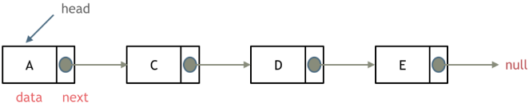
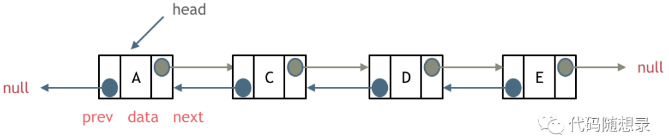
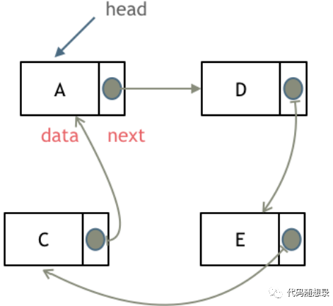
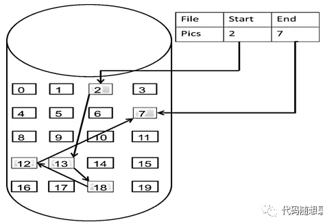
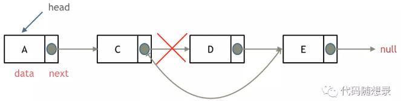
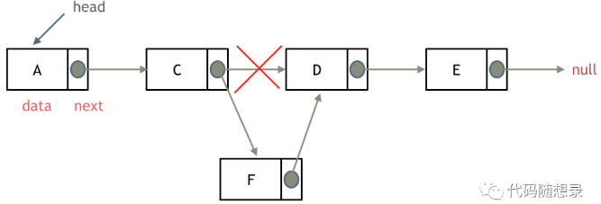

# 链表


## 基础知识

链表是一种通过**指针串联**在一起的**线性结构**，每一个节点是由两部分组成，一个是**数据域**，一个是**指针域**（存放指向下一个节点的指针），**最后**一个节点的指针域指向**null**（空指针的意思）。


---

### 链表的类型

#### 单链表

链接的入口点称为列表的头结点也就是head。




---

#### 双链表

单链表中的节点只能指向节点的下一个节点。

双链表：每一个节点有**两个指针域**，一个指向下一个节点，一个指向上一个节点。

双链表 既可以向前查询也可以向后查询。




---

#### 循环链表

循环链表，顾名思义，就是链表首尾相连。

循环链表可以用来解决约瑟夫环问题。




---

### 链表的存储方式

了解完链表的类型，再来说一说链表在内存中的存储方式。

**数组**是在**内存中**是连续分布的，但是**链表**在**内存**中可**不**是**连续**分布的。

链表是通过指针域的指针链接在内存中各个节点。

所以链表中的节点在内存中不是连续分布的 ，而是散乱分布在内存中的某地址上，分配机制取决于操作系统的内存管理。

如图所示：



这个链表起始节点为2， 终止节点为7，  各个节点分布在内存个不同地址空间上，通过指针串联在一起。

---

### 链表的定义

单链表

```c++
struct ListNode {
    int val;								//数据域
    ListNode *next;							//指针域
    ListNode(int x):  val(x), next(NULL) {} //构造函数
}
```

如果不定义构造函数使用默认构造函数的话，在初始化的时候就不能直接给变量赋值！

```c++
//未定义前
ListNode* head = new ListNode();
head->val = 5;

//定义后
ListNode* head = new ListNode(5);
```


---

### 链表的操作

#### 删除节点



只要将 C 节点的 `next`  指针，指向 `E`节点就可以了。

那有同学说了，D 节点不是依然存留在内存里么？只不过是没有在这个链表里而已。

是这样的，所以在 C++ 里最好是再手动释放这个 D 节点，释放这块内存。

其他语言例如 Java、Python，就有自己的内存回收机制，就不用自己手动释放了。


---

#### 添加节点



可以看出链表的增添和删除都是 `O(1)` 操作，也不会影响到其他节点。


**注意**，要是删除第五个节点 E ，需要从头节点查找到第四个节点通过 `next` 指针进行删除操作，查找的时间复杂度是 `O(n)` 。


### 性能分析

|      | 插入/删除 | 查询 |             适用场景             |
| :--: | :-------: | :--: | :------------------------------: |
| 数组 |   O(n)    | O(1) |  数据量固定，频繁查询，较少增删  |
| 链表 |   O(1)    | O(n) | 数据量不固定，较少查询，频繁增删 |


数组在定义的时候，长度就是固定的，如果想改动数组的长度，就需要重新定义一个新的数组。

链表的长度可以是不固定的，并且可以**动态增删**， 适合数据量不固定，频繁增删，较少查询的场景。


---

## 虚拟头节点

链表操作中，可以使用原链表来直接进行删除操作，也可以设置一个**虚拟头结点**在进行删除操作


**203. 移除链表元素**

```c++
ListNode* removeElements(ListNode* head, int val) {
    ListNode* dummyHead = new ListNode(0);
    dummyHead->next = head;
    ListNode* cur = dummyHead;

    while (cur->next != NULL) {
        if (cur->next->val == val) {
            ListNode* tmp = cur->next;
            cur->next = cur->next->next;
            delete tmp;
        } else {
            cur = cur->next;
        }
    }

    return dummyHead->next;
}
```


## 链表设计

**707. 设计链表**

```c++
class MyLinkedList {
public:
    // 定义链表节点结构体
    struct LinkedNode {
        int val;
        LinkedNode* next;
        LinkedNode(int val):val(val), next(nullptr){}
    };

    // 初始化链表
    MyLinkedList() {
        _dummyHead = new LinkedNode(0); // 这里定义的头结点 是一个虚拟头结点，而不是真正的链表头结点
        _size = 0;
    }

    // 获取到第index个节点数值，如果index是非法数值直接返回-1， 注意index是从0开始的，第0个节点就是头结点
    int get(int index) {
        if (index > (_size - 1) || index < 0) {
            return -1;
        }
        LinkedNode* cur = _dummyHead->next;
        while(index--){ // 如果--index 就会陷入死循环
            cur = cur->next;
        }
        return cur->val;
    }

    // 在链表最前面插入一个节点，插入完成后，新插入的节点为链表的新的头结点
    void addAtHead(int val) {
        LinkedNode* newNode = new LinkedNode(val);
        newNode->next = _dummyHead->next;
        _dummyHead->next = newNode;
        _size++;
    }

    // 在链表最后面添加一个节点
    void addAtTail(int val) {
        LinkedNode* newNode = new LinkedNode(val);
        LinkedNode* cur = _dummyHead;
        while(cur->next != nullptr){
            cur = cur->next;
        }
        cur->next = newNode;
        _size++;
    }

    // 在第index个节点之前插入一个新节点，例如index为0，那么新插入的节点为链表的新头节点。
    // 如果index 等于链表的长度，则说明是新插入的节点为链表的尾结点
    // 如果index大于链表的长度，则返回空
    void addAtIndex(int index, int val) {
        if (index > _size) {
            return;
        }
        LinkedNode* newNode = new LinkedNode(val);
        LinkedNode* cur = _dummyHead;
        while(index--) {
            cur = cur->next;
        }
        newNode->next = cur->next;
        cur->next = newNode;
        _size++;
    }

    // 删除第index个节点，如果index 大于等于链表的长度，直接return，注意index是从0开始的
    void deleteAtIndex(int index) {
        if (index >= _size || index < 0) {
            return;
        }
        LinkedNode* cur = _dummyHead;
        while(index--) {
            cur = cur ->next;
        }
        LinkedNode* tmp = cur->next;
        cur->next = cur->next->next;
        delete tmp;
        _size--;
    }

    // 打印链表
    void printLinkedList() {
        LinkedNode* cur = _dummyHead;
        while (cur->next != nullptr) {
            cout << cur->next->val << " ";
            cur = cur->next;
        }
        cout << endl;
    }
private:
    int _size;
    LinkedNode* _dummyHead;

};
```


## 环形链表

**142. 环形链表II**

```c++

```


- **解释为什么一定是慢指针跑完一圈之前被快指针追上：**

我们考虑，当慢指针第一次到入口的时候快指针的位置 


1.快指针在后：那快指针只要几步就能追上 

2.快慢指针重合，那就直接返回了，慢指针没有走的机会 

3.快指针在前，考虑极端情况，快指针就在慢指针的next


情况3其实跟赛跑一个道理，如果一个人速度是你的两倍，你们两个同是出发，相遇时候一定是在起点相遇，但是此时，比你跑的快的不讲武德，起跑点还比你靠前，所以肯定是在你跑完一圈之前他就追上你了

如果遇到一个人速度是你的两倍，你想在被抓到之前尽可能的跑长一些，那只能让跑的比你快的人起跑的时候在你的脸上（我们认为重合是还没跑就被抓了）


- 解释为什么是 2 倍速度/解释为什么 fast 不能跳过去呢

**fast相对于slow是一次移动一个节点，所以不可能跳过去**


---

## 总结

- 链表的种类主要为：单链表，双链表，循环链表
- 链表的存储方式：链表的节点在内存中是分散存储的，通过指针连在一起。
- 链表是如何进行增删改查的。
- 数组和链表在不同场景下的性能分析。


链表的一大问题就是操作当前节点必须要找前一个节点才能操作。这就造成了，头结点的尴尬，因为头结点没有前一个节点了。

**每次对应头结点的情况都要单独处理，所以使用虚拟头结点的技巧，就可以解决这个问题**

