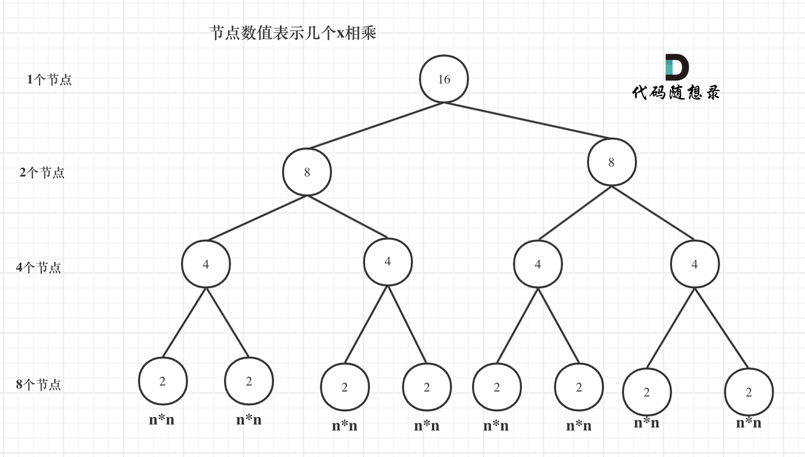

# 时间复杂度


数据 n 在 $10^5$ 不能接受 O(n2) 的算法

二分为 log(N)


$O(n)$ 的算法，1s内大概计算机可以运行 $5 * 10^8$ 次计算

$O(n^2)$ 的算法，1s内大概计算机可以运行 $2.25*10^4$ 次计算。

$O(n\log n)$的算法，1s内大概计算机可以运行 $2 * 10^7$ 次计算。


- [ ] 验证 286 周赛5253题，数据 n 为 $5 * 10^4$ 一定是让 nlogn 解决，即 n次二分


https://programmercarl.com/%E5%89%8D%E5%BA%8F/%E5%85%B3%E4%BA%8E%E6%97%B6%E9%97%B4%E5%A4%8D%E6%9D%82%E5%BA%A6%EF%BC%8C%E4%BD%A0%E4%B8%8D%E7%9F%A5%E9%81%93%E7%9A%84%E9%83%BD%E5%9C%A8%E8%BF%99%E9%87%8C%EF%BC%81.html#%E7%A9%B6%E7%AB%9F%E4%BB%80%E4%B9%88%E6%98%AF%E6%97%B6%E9%97%B4%E5%A4%8D%E6%9D%82%E5%BA%A6


https://mp.weixin.qq.com/s/I6ZXFbw09NR31F5CJR_geQ


**只跟他 i-1 和 j-1 有关的，都可以用滚动数组，直接计算完替换原来的值。**

**优化空间复杂度，其实就是找到需要几个值，就可以。不是所有值都需要保留**


---

## 6. Big O

目前分析算法主要从「**时间**」和「**空间**」两个维度来进行分析。时间维度顾名思义就是算法需要**消耗的时间**，「时间复杂度」是常用的分析单位。空间维度代表算法需要占用的**内存空间**，我们通常用「空间复杂度」来分析。

分析算法的效率主要从「**时间复杂度**」和「**空间复杂度**」来分析。这两个复杂度反映的是，随着问题量级的增大，时间和空间**增长的趋势**。很多时候我们两者不可兼得，有时候要用**时间换空间**，或者**空间换时间**。


---

### 6.1. 时间复杂度

`T(n)` 表示算法的**渐进时间复杂度**，`f(n)​` 表示代码**执行次数**，​`O()​` 表示**正比关系**。

```c++
for (int i = 1; i <= n; i++) {
    x++;
}

i <= n 	执行n+1次 最后还要再判断一次
i++		执行n次
x++;	执行n次
i = 1	执行1次
共3N+2次
```

`O(3N+2) = O(N)` 

关心的是**输入不断增长时程序的表现如何**，当N很大时，就是**最坏情况下的性能**，因此只需要**关注高阶项**，**忽略低阶项**。


```c++
for (int i = 1; i <= n; i++) {
    for (int j = 1; j <= n; j++) {
    	x++;
    }
}
```

时间复杂度为 `O(N^2)​`


```c++
for (int i = 1; i <= n; i++) {
    x++;
}
for (int i = 1; i <= n; i++) {
    for (int j = 1; j <= n; j++) {
    	x++;
    }
}
```

时间复杂度为 `O(N+N^2)=O(N^2)​`


---

### 6.2. 常用时间复杂度量级

横轴为问题的量级，纵轴为时间复杂度


- **常数**阶O(1)
- **对数**阶O(logN)


- **线性**阶O(n)
- **线性对数/超线性**阶O(nlogN)


- 平方阶O(n²)
- 立方阶O(n³)
- **K次方/多项式**阶O(n^k)
- **指数**阶(2^n)
- **阶乘**O(n!)


上面的时间复杂从上到下复杂度越来越大，也意味着执行效率越来越低。


---

#### 6.2.1. 常数阶O(1)

只要没有**循环**或**递归**等复杂逻辑，无论代码执行多少行，代码复杂度都为O(1)，如下：

```c++
int x = 0;
int y = 1;
int temp = x;
x = y;
y = temp;
```

上述代码在执行的时候，所消耗的**时间不会随着特定变量的增长而增长**，即使有几万行这样的代码，我们都可以用O(1)来表示它的时间复杂度。


#### 6.2.2. 线性阶O(n)

```c++
for (int i = 1; i <= n; i++) {
    x++;
}
```

在这段代码中，for循环会执行n遍，因此**计算消耗的时间是随着n的变化而变化**，因此这类代码都可以用O(n)来表示其时间复杂度。


#### 6.2.3. 对数阶O(logN)

```c++
int i = 1;
while(i < n) {
    i = i * 2;
}
```

在上面的循环中，每次 i 都会被乘以2，也意味着每次 i 都离 n 更进一步。那需要多少次循环 i 才能等于或大于 n 呢，也就是求解 $2 ^ k = n$，答案 $k=\log_{2}N$ 。 取最高次项，且去掉最高此项的系数，所有进一步简化为 $k=\log N$

也就是说循环 $k=\log N$ 次之后，i 会大于等于n，这段代码就结束了。所以此代码的复杂度为：$O(\log N)$。

> 一定是 log 以 2 为底n的对数么？
>
> 其实不然，也可以是以10为底n的对数，也可以是以20为底n的对数，**但我们统一说 logn，也就是忽略底数的描述**。
> $$
> O(\log_2N) = \log_210 \times O(\log_{10}N)\\
> O(\log_iN) = \log_ij \times O(\log_{j}N)
> $$
> $\log_ij $ 为常数项，因此可以省略
>
> 


#### 6.2.4. 线性对数阶O(nlogN)

线性对数阶O(nlogN)很好理解，也就是将复杂度为O(logN)的代码循环n遍：

```c++
for(int i = 0; i <= n: i++) {
    int x = 1;
    while(x < n) {
        x = x * 2;
    }
}
```

因为每次循环的复杂度为 `O(logN)`，所以 `n * logN = O(nlogN)`


#### 6.2.5. 平方阶O(n²)

```c++
for (int i = 1; i <= n; i++) {
    for (int j = 1; j <= n; j++) {
        x++;
    }
}

```

O(n²)的本质就是 `n * n`，如果我们将内层的循环次数改为m，复杂度就变为 `n * m = O(nm)`。

关于一些更高的阶级比如 `O(n³)` 或者 `O(n^k)`，我们可以参考 `O(n²)` 来理解即可，`O(n³)` 相当于三层循环，以此类推。


### 6.2.6. 指数阶O(2^n)

```c++
int f (int n) {
    if (n == 1) return 1;
    else return f(n-1) + f(n-1);
}
```

`O(2^N-1) = O(2^N)`

---


除了「大O表示法」还有其他「平均时间复杂度」、「均摊时间复杂度」、「最坏时间复杂度」、「最好时间复杂度」等等分析指数，但是最常用的依然是「大O表示法」，表示最差情况。


---

### 6.3. 空间复杂度

「空间复杂度」也不是用来计算程序具体占用的空间。随着问题量级的变大，程序需要分配的内存空间也可能会变得更多，而「空间复杂度」反映的则是**内存空间增长的趋势**。

比较常用的空间复杂度有：O(1)、O(n)、O(n²)。用 S(n) 来定义「空间复杂度」。


#### 6.3.1. O(1)空间复杂度

如果算法执行所需要的临时空间**不随着某个变量 n 的大小而变化**，此算法空间复杂度为一个**常量**，可表示为 O(1)：

```c++
int x = 0;
int y = 0;
x++;
y++;
```

其中x, y所分配的空间**不随着处理数据量变化**，因此「空间复杂度」为 O(1)


#### 6.3.2. O(n)空间复杂度

以下的代码给长度为n的数组赋值：

```c++
int[] newArray = new int[n];
for (int i = 0; i < n; i++) {
    newArray[i] = i;
}
```

在这段代码中，我们创建了一个长度为 n 的数组，然后在循环中为其中的元素赋值。因此，这段代码的「空间复杂度」**取决于 newArray 的长度**，也就是 n，所以 S(n) = O(n)。


如果newArray是个二维数组，则空间复杂度为O(n²)


---

# 算法性能分析

## 时间复杂度分析

时间复杂度是一个**函数**，它**定性**描述该算法的**运行时间**。


算法导论：**大 O 用来表示上界的**，当用它作为算法的**最坏**情况运行时间的上界，就是对任意数据输入的运行时间的上界。


实际过程中：**O 代表的就是一般情况，而不是严格的上界**


大 O 就是**数据量级突破一个点**且**数据量级非常大**的情况下所表现出的时间复杂度，这个数据量也就是**常数项系数已经不起决定性作用的数据量**。


---

### 超时

一般OJ（online judge）的超时时间就是1s


2.7 GHz 奔腾双核，1Hz = 1/s，1Hz 是 CPU 的一次脉冲（可以理解为一次改变状态，也叫时钟周期），称之为为赫兹

- 1GHz（兆赫）= 1000MHz（兆赫）
- 1MHz（兆赫）= 1百万赫兹

所以 1GHz = 10亿Hz，表示CPU可以一秒脉冲10亿次（有10亿个时钟周期）

> 一个时钟周期 $\neq$ 一次CPU运算。
>
> 例如 1 + 2 = 3，cpu要执行**四**次才能完整这个操作
>
> 步骤一：把 1 放入寄存器，
>
> 步骤二：把 2 放入寄存器，
>
> 步骤三：做加法，
>
> 步骤四：保存 3。
>
> 
>
> 计算机的 cpu 也不会只运行我们自己写的程序上，同时 cpu 也要执行计算机的各种进程任务等等，我们的程序仅仅是其中的一个进程而已。
>
> 


**实验**

在写测试程序测 1s 内处理多大数量级数据的时候，有三点需要注意：

- CPU **执行每条指令所需的时间实际上并不相同**，例如 CPU 执行加法和乘法操作的耗时实际上都是不一样的。
- 现在大多计算机系统的内存管理都有**缓存**技术，所以频繁访问**相同地址的数据**和访问**不相邻元素**所需的**时间也是不同**的。
- 计算机同时运行多个程序，每个程序里还有**不同的进程线程在抢占资源**。


2.7 GHz Dual-Core Intel Core i5

实现三个函数，时间复杂度分别是 $O(n)$ , $O(n^2)$, $O(n\log n)$，使用加法运算来统一测试。

```cpp
// O(n)
void function1(long long n) {
    long long k = 0;
    for (long long i = 0; i < n; i++) {
        k++;
    }
}
```


```cpp
// O(n^2)
void function2(long long n) {
    long long k = 0;
    for (long long i = 0; i < n; i++) {
        for (long j = 0; j < n; j++) {
            k++;
        }
    }

}
```


```cpp
// O(nlogn)
void function3(long long n) {
    long long k = 0;
    for (long long i = 0; i < n; i++) {
        for (long long j = 1; j < n; j = j*2) { // 注意这里j=1
            k++;
        }
    }
}
```


```c++
int main() {
    long long n; // 数据规模
    while (1) {
        cout << "输入n：";
        cin >> n;
        milliseconds start_time = duration_cast<milliseconds >(
            system_clock::now().time_since_epoch()
        );
        function1(n);
//        function2(n);
//        function3(n);
        milliseconds end_time = duration_cast<milliseconds >(
            system_clock::now().time_since_epoch()
        );
        cout << "耗时:" << milliseconds(end_time).count() - milliseconds(start_time).count()
            <<" ms"<< endl;
    }
}
```


$O(n)$ 的算法，1s内大概计算机可以运行 $5 * 10^8$ 次计算，可以推测一下 $O(n^2)$ 的算法应该1s可以处理的数量级的规模是 $\sqrt{5 * 10^8}$ 开根号，实验数据如下:


$O(n^2)$ 的算法，1s内大概计算机可以运行 22500 次计算。


 $O(n\log n)$ 的话，理论上应该是比 $O(n)$ 少一个数量级，因为 $\log n$ 的复杂度很快。


$O(n\log n)$的算法，1s内大概计算机可以运行 $2 * 10^7$ 次计算，符合预期。


---

## 空间复杂度分析

空间复杂度 (Space Complexity) 是对一个算法在运行过程中占用**内存空间大小**的量度，记做$S(n)=O(f(n))$。


> 关注空间复杂度有两个常见的相关问题
>
> 1. 空间复杂度是考虑程序（可执行文件）的大小么？
>
> 很多同学都会混淆程序运行时内存大小和程序本身的大小。这里强调一下**空间复杂度是考虑程序运行时占用内存的大小，而不是可执行文件的大小。**
>
> 2. 空间复杂度是准确算出程序运行时所占用的内存么？
>
> 不要以为空间复杂度就已经精准的掌握了程序的内存使用大小，很多因素会影响程序真正内存使用大小，例如编译器的内存对齐，编程语言容器的底层实现等等这些都会影响到程序内存的开销。
>
> 所以空间复杂度是预先大体评估程序内存使用的大小。


为了避免内存超出限制，这也需要我们对算法占用多大的内存有一个大体的预估。

同样在工程实践中，计算机的内存空间也不是无限的，需要工程师对软件运行时所使用的内存有一个大体评估，这都需要用到算法空间复杂度的分析。


**空间复杂度 $O(1)$**

```c++
int j = 0;
for (int i = 0; i < n; i++) {
    j++;
}
```

随着 n 的变化，所需**开辟的内存空间并不会随着 n 的变化而变化**。即此算法空间复杂度为一个常量，所以表示为 $O(1)$。


**空间复杂度 $O(n)$**

```c++
int* a = new int(n);
for (int i = 0; i < n; i++) {
    a[i] = i;
}
```

当消耗空间和输入参数 n 保持线性增长，这样的空间复杂度为$O(n)$

$O(n^2)$， $O(n^3)$ 同理


**空间复杂度是 $O(\log n)$**

递归的时候，会出现空间复杂度为logn的情况


---

## 递归算法的时间与空间复杂度分析！

**递归算法的时间复杂度 = 递归的次数 \* 每次递归的时间复杂度**

**递归算法的空间复杂度 = 递归深度 \* 每次递归的空间复杂度**


---

### X 的 N 次方

**递归算法的时间复杂度 = 递归的次数 \* 每次递归的时间复杂度**


**求 x 的 n 次方**

```c++
int xn(int x, int n) {
    int res;
    
    for (int i = 0; i < n; ++i) 
        res *= x;
    
    return res;
}
```

时间复杂度：$O(n)$


**求 x 的 n 次方 - 递归**

``` c++
int xn(int x, int n) {
    if (n == 0) return 1;
    
    return xn(x, n - 1) * x;
}
```

每次进入函数 xn 后，n 要减 1. 每次进入函数一个乘法操作。n x1

时间复杂度：$O(n)$ 


**求 x 的 n 次方 - 中级递归**

``` c++
int xn(int x, int n) {    
    if (n == 0) return 1;        
    
    if (n % 2 == 1)        
        return xn(x, n / 2) * xn(x, n / 2) * x;        
    
    return xn(x, n / 2) * xn(x, n / 2);
}
```

每次进入函数 xn 后，n 要减 1. 每次进入函数一个乘法操作。n x1

时间复杂度：$O(n)$ 


可以把递归抽象出一棵满二叉树来表示（为了方便表示，选择 n 为偶数16），如图：



递归次数 = 该满二叉树的节点数 = $2^{m+1} - 1$ ，其中 $m=\log_2n - 1 $ 表示深度，n 为次方数

带入后总节点数 $= n - 1$

时间复杂度：$O(n)$ 


**求 x 的 n 次方 - 高级递归**

```c++
int xn(int x, int n) {    
    if (n == 0) return 1;       	
    
    int t = xn(x, n / 2);        
    
    if (n % 2 == 1)        
        return t * t *x;        
    
    return t * t;
}
```

可以看到 xn 仅仅有一个递归调用，**且每次都是 n/2** ，所以这里我们一共调用了 $\log_2n$ 的对数次。**每次递归了做都是一次乘法操作，这也是一个常数项的操作**

**时间复杂度**： $O(\log n)$


---

### 斐波那契数列性能分析

#### 时间复杂度分析

**递归算法的时间复杂度 = 递归的次数 \* 每次递归的时间复杂度**

```c++
int fibonacci(int i) {
	if(i <= 0) return 0;
	if(i == 1) return 1;
    return fibonacci(i-1) + fibonacci(i-2);
}
```

每次递归都是$O(1)$的计算操作


在这棵二叉树中每一个节点都是一次递归，那么这棵树有多少个节点呢

一棵深度（按根节点深度为1）为 $k$ 的二叉树最多可以有 $2^k - 1$ 个节点。

- 时间复杂度： $O(2^n)$，随着 $n$ 的增大，耗时是指数上升的。
- 空间复杂度：$O(n)$


罪魁祸首就是这里的**两次递归**，导致了时间复杂度以指数上升。

```c++
return fibonacci(i-1) + fibonacci(i-2);
```


优化思路主要是减少递归的调用次数。

```c++
int fibonacci(int first, int second, int n) {
    if (n <= 0) 
        return 0;
    
    if (n < 3) {
        return 1;
    } else if (n == 3) {
        return first + second;
    } else {
        return fibonacci(second, first + second, n - 1);
    }
}
```

因为每次递归的时候 n 减 1，即只是递归了 n 次，所以时间复杂度是 $O(n)$。

同理递归的深度依然是 n，每次递归所需的空间也是常数，所以空间复杂度依然是$O(n)$。


- 时间复杂度：$O(n)$
- 空间复杂度：$O(n)$


---

#### **空间复杂度分析**

**递归算法的空间复杂度 = 递归深度 \* 每次递归的空间复杂度**


> 为什么要求递归的深度呢？
>
> 因为每次递归所需的**空间**都**被压到调用栈**里（这是内存管理里面的数据结构，和算法里的栈原理是一样的），一次递归结束，这个栈就是就是把本次递归的数据弹出去。所以这个栈最大的长度就是递归的深度。
>
> 此时可以分析这段递归的空间复杂度，从代码中可以看出每次递归所需要的空间大小都是一样的，所以每次递归中需要的空间是一个常量，并不会随着n的变化而变化，每次递归的空间复杂度就是$O(1)$。


递归第n个斐波那契数的话，递归调用栈的深度就是n。

那么每次递归的空间复杂度是$O(1)$， 调用栈深度为n，所以这段递归代码的空间复杂度就是$O(n)$。


---

### 二分法（递归实现）的性能分析

```cpp
int binary_search( int arr[], int l, int r, int x) {
    if (r >= l) {
        int mid = l + (r - l) / 2;
        if (arr[mid] == x)
            return mid;
        if (arr[mid] > x)
            return binary_search(arr, l, mid - 1, x);
        return binary_search(arr, mid + 1, r, x);
    }
    return -1;
}
```

时间复杂度：$O(\log n)$


**递归算法的空间复杂度 = 递归深度 \* 每次递归的空间复杂度**

**每次递归的空间复杂度**：主要是参数里传入的这个arr数组，但在C/C++中函数传递数组参数，不是整个数组拷贝一份传入函数而是**传入的数组首元素地址**。**也就是说每一层递归都是公用一块数组地址空间的**，所以每次递归的空间复杂度是常数即：$O(1)$。

**递归的深度**，二分查找的递归深度是 $\log n$ ，递归深度就是调用栈的长度，那么这段代码的空间复杂度为 $1 * \log n = O(\log n)$。


大家要注意自己所用的语言在**传递函数参数**的时，是**拷贝整个数值还是拷贝地址**，如果是**拷贝整个数值**那么该二分法的空间复杂度就是$O(n\log n)$。


---

## 代码的内存消耗

### 不同语言的内存管理

不同的编程语言各自的内存管理方式。

- C/C++ 这种**内存堆空间的申请和释放完全靠自己管理**
- Python 内存管理是由**私有堆空间**管理的，所有的 python 对象和数据结构都存储在私有堆空间中。程序员没有访问堆的权限，只有解释器才能操作。
- Java 依赖**JVM来做内存管理**，不了解 jvm 内存管理的机制，很可能会因一些错误的代码写法而导致内存泄漏或内存溢出

Python 万物皆对象，并且将内存操作封装的很好，**所以 python 的基本数据类型所用的内存会要远大于存放纯数据类型所占的内存**，例如，我们都知道存储 int 型数据需要四个字节，但是使用 Python 申请一个对象来存放数据的话，所用空间要远大于四个字节


---

### C++ 的内存管理

程序运行时所需的内存空间分为**固定部分**和**可变部分**


固定部分的内存消耗是不会随着代码运行产生变化的， 可变部分则是会产生变化的

更具体一些，一个由C/C++编译的程序占用的内存分为以下几个部分：

- 栈区(Stack) ：由编译器**自动分配释放**，存放函数的参数值，局部变量的值等，其操作方式类似于数据结构中的栈。
- 堆区(Heap) ：一般由**程序员分配释放**，若程序员不释放，程序结束时可能由OS收回
- 未初始化数据区(Uninitialized Data)： 存放未初始化的全局变量和静态变量
- 初始化数据区(Initialized Data)：存放已经初始化的全局变量和静态变量
- 程序代码区(Text)：存放函数体的二进制代码

代码区和数据区所占空间都是固定的，而且占用的空间非常小，那么看**运行时消耗的内存主要看可变部分**。

在可变部分中，栈区间的数据在代码块执行结束之后，系统会自动回收，而堆区间数据是需要程序员自己回收，所以也就是造成**内存泄漏**的**发源地**。

**而Java、Python的话则不需要程序员去考虑内存泄漏的问题，虚拟机都做了这些事情**


---

### 计算程序占用多大内存


1 个字节占 8 个比特，那么 4 个字节就是 32 个比特，可存放数据的大小为 2^32，也就是 4G 空间的大小，即：一个 32 位指针可以寻找 4G 空间大小的内存地址。


>  安装64位的操作系统的计算机内存都已经超过了4G，也就是指针大小如果还是4个字节的话，就已经不能寻址全部的内存地址，所以 64 位编译器使用8个字节的指针才能寻找所有的内存地址。
>
> 注意2^64是一个非常巨大的数，对于寻找地址来说已经足够用了
>
> 


---

## 内存对齐

再介绍一下内存管理中另一个重要的知识点：**内存对齐**。

**不要以为只有C/C++才会有内存对齐，只要可以跨平台的编程语言都需要做内存对齐，Java、Python都是一样的**。


面试官非常喜欢问到的问题：**为什么会有内存对齐？**

主要是两个原因

1. 平台原因：不是所有的硬件平台都能访问任意内存地址上的任意数据，**某些硬件平台只能在某些地址处取某些特定类型的数据，否则抛出硬件异常**。为了同一个程序可以在**多平台运行**，需要内存对齐。
2. 硬件原因：经过内存对齐后，CPU**访问内存的速度大大提升**。


可以看一下这段C++代码输出的各个数据类型大小是多少？

```cpp
struct node{
   int num;
   char cha;
}st;

int main() {
    int a[100];
    char b[100];
    cout << sizeof(int) << endl;
    cout << sizeof(char) << endl;
    cout << sizeof(a) << endl;
    cout << sizeof(b) << endl;
    cout << sizeof(st) << endl;
}
// output
4
1
400
100
8 //?为什么不是5
```


来看一下内存对齐和非内存对齐产生的效果区别。

CPU 读取内存**不是一次读取单个字**节，而是**一块一块的来读取内存**，块的大小可以是2，4，8，16个字节，具体取多少个字节**取决于硬件**。

假设CPU把内存划分为 4 字节大小的块，要读取一个 4 字节大小的 int 型数据，

**内存对齐情况**


一字节的char占用了四个字节，空了三个字节的内存地址，int数据从地址4开始。

此时，直接将地址4，5，6，7处的四个字节数据读取到即可。


**非内存对齐情况**


char型的数据和int型的数据挨在一起，该int数据从地址1开始，那么CPU想要读这个数据的话来看看需要几步操作：

1. 因为CPU是四个字节四个字节来寻址，首先CPU读取0，1，2，3处的四个字节数据
2. CPU读取4，5，6，7处的四个字节数据
3. 合并地址1，2，3，4处四个字节的数据才是本次操作需要的int数据

此时一共需要**两次寻址，一次合并**的操作。


**大家可能会发现内存对齐岂不是浪费的内存资源么？**

是这样的，但事实上，**相对来说计算机内存资源一般都是充足的，我们更希望的是提高运行速度**。

**编译器一般都会做内存对齐的优化操作，也就是说当考虑程序真正占用的内存大小的时候，也需要认识到内存对齐的影响**。


