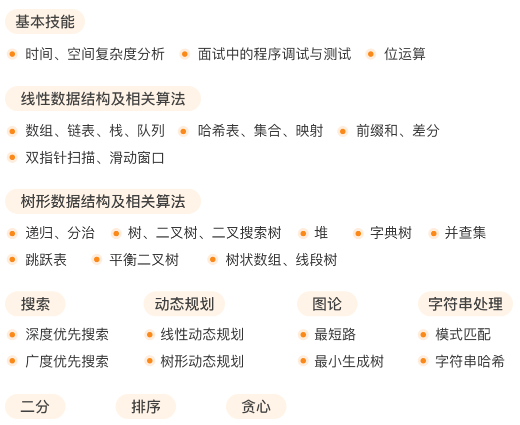
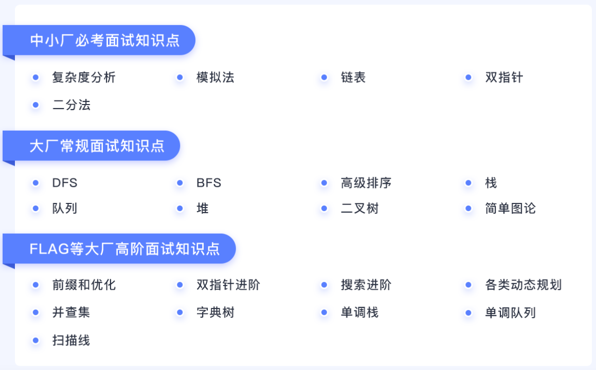
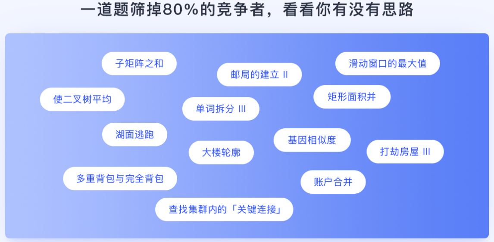
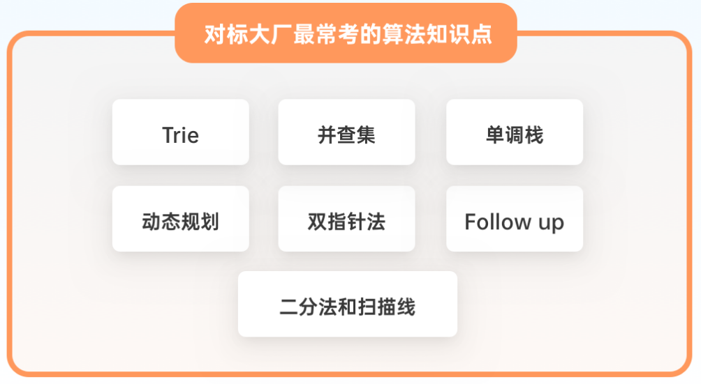
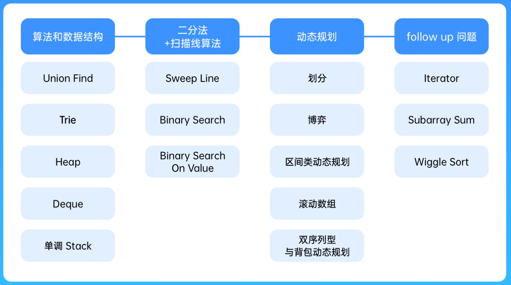
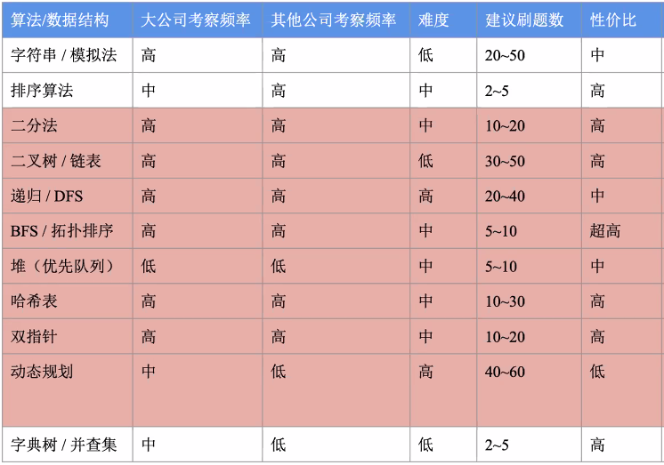
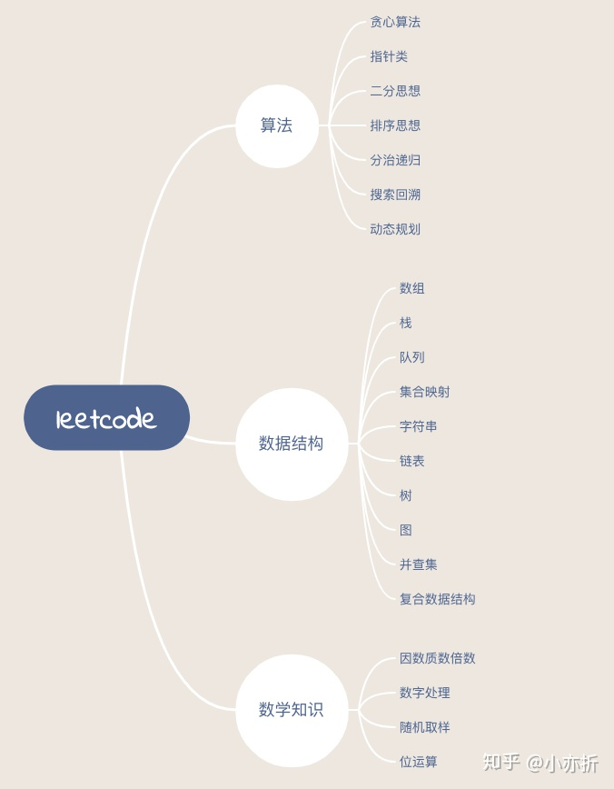
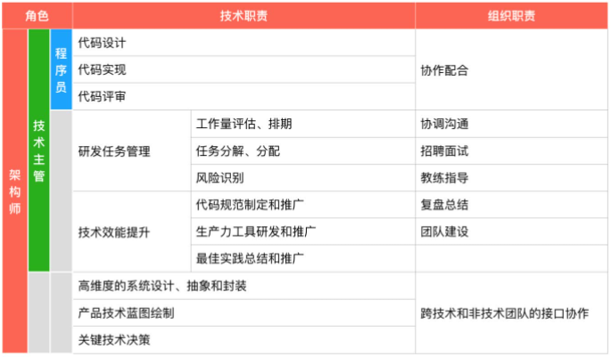

# Leetcode

如果问依赖性就 topo sort

DAG 的问题就 dfs+memo

矩阵和 Array 通常都是 DP

问**数量**的通常都是 DP

问是否可以，也很有可能 DP


| 题目                                             | 解法                                                         |
| ------------------------------------------------ | ------------------------------------------------------------ |
| 要求答案精度小于1e-n的                           | 二分 while(abs(r-l) < 1e-7)                                  |
|                                                  |                                                              |
| 最短、最小、最少                                 | BFS                                                          |
| 大范围的查找                                     | BFS                                                          |
| 静态连通性                                       | DFS/BFS                                                      |
| 动态连通性                                       | UF                                                           |
| 目的性强的查找与搜索问题，白话就是：能找出解就行 | BFS                                                          |
| 是否可达问题                                     | BFS/DP                                                       |
|                                                  |                                                              |
| 求方案数                                         | DP                                                           |
|                                                  |                                                              |
| 求**所有解**的（排列/组合/切割/子集/棋盘）       | backtracking                                                 |
|                                                  |                                                              |
| **连续问题**                                     | 滑动窗口（前缀和优化）                                       |
|                                                  |                                                              |
| 前边选择会影响后边状态                           | 大概率逆推比正推好求解                                       |
|                                                  |                                                              |
| 递推要取模                                       | 快速幂                                                       |
|                                                  |                                                              |
| 找规律 stack                                     |                                                              |
| map总可以想                                      |                                                              |
| 排序总可以想                                     |                                                              |
|                                                  |                                                              |
| 按字典序                                         | 那就是 dfs 从最开始枚举，不断往后处理，看最后是否能处理好，不能的话，再返回继续，顺序是按照字典序的 |
|                                                  |                                                              |


 [ 在数组中**选取子集**，**达到某一目标** ] 这类问题的通用解法。

- 类型1 : 目标值**明确**，可以把目标值看出背包容量，数组值看做物品，转成**背包**问题
- 类型2 : 目标值**不明确**，容量不知道，不能用背包，只能**枚举**子集的和


1）先分析数据量，找出所有变量

- 根据数据大小，分析时间复杂度和空间复杂度，考虑能用的算法
- 不要想当然的面向用例编程，要把所有情况考虑到，题目没说只有一个的，就需要考虑多个
  - 比如UVA11624，不要默认只有一个fire

2）做题**先写数学公式**，画出每一个map/set中的变化，然后再写代码。

3）遇到很复杂的背景题，要仔细看输入输出的要求。

4）一眼看不到方法的问题，三种情况：

- 第一种是**脑筋急转弯**
  - 尽量画图，找规律
- 第二种是需要把**题目抽象一下**
  - 课程表抽象成节点，用图算法
- 第三种需要把**求解的答案转换一下**（一般需要简单的数学公式推导一下），再用固定的算法模板
  - 分割等和子集，不要上去就dfs，枚举情况，把他转变成求一个集合答案为和的一半；如
  - 目标和，把找目标和，变成找固定负数个数
  - 最后一块石头的重量，不要想着一步一步粉碎石头，解空间太大，根据题目的要求，分析出两堆石头重量尽可能接近，剩下来的重量就小。
- 第四种**两种算法的结合**
  - 可能需要先用前缀和预处理一下，然后再建图/模拟
  - 或者先用01背包计算出所用满足情况的满足条件，然后再计算输出答案

5）确保算法没问题但没 AC

- 找没考虑到的特殊情况
- long long
- 输出格式问题


---

## TODO

- [ ] 440 K-th Smallest in Lexicographical Order
- [ ] 二分查找从入门到入睡 https://leetcode.cn/circle/discuss/ooxfo8/
- [ ] 十大排序从入门到入赘 https://leetcode.cn/circle/discuss/eBo9UB/
- [ ] 868
- [ ] 523
- [ ] 322
- [ ] 474 记忆化搜索  `if (memo[i].find(idx) != memo[i].end()) return cnt;` **无论返回多少都可以，没有关系？？？？？？？？？？？？？？？？？？**
- [ ] 322 为什么 dp 赋初始值 `0x3f` 可以，而 `INT_MAX`， `INT_MAX / 2` 就不行
- [ ] 面试题 17.07. Baby Names LCCI
- [ ] 双向bfs，127/752/剑指 Offer II 109/剑指 Offer II 108. 单词演变
- [ ] 蓄水池算法
- [ ] bitmap
- [ ] 字典树
- [ ] [大数的十进制与二进制互转新方法](https://zhuanlan.zhihu.com/p/29768999)
- [ ] [红黑树比 AVL 树具体更高效在哪里](https://www.zhihu.com/question/19856999/answer/258118494)


---


<details>
  <summary>学习网站汇总</summary>
**教学**
[代码随想录Github](https://github.com/youngyangyang04/leetcode-master)　　[代码随想录Wechat](https://mp.weixin.qq.com/s/weyitJcVHBgFtSc19cbPdw)

[labuladong 的算法小抄Github](https://github.com/labuladong/fucking-algorithm)　　[labuladong 的算法小抄Wechat](https://mp.weixin.qq.com/s/AWsL7G89RtaHyHjRPNJENA)　　[labuladong 的算法小抄Gitbook](https://labuladong.gitee.io/algo/)

[力扣加加 - luciferGithub](https://github.com/azl397985856/leetcode)　　[力扣加加 - 社区](https://leetcode-solution-leetcode-pp.gitbook.io/leetcode-solution/)

[进阶石Github](https://github.com/acm-clan/algorithm-stone)

[algorithm-base/Github](https://github.com/chefyuan/algorithm-base)

**题解+教学**

[李威威](https://liweiwei1419.gitee.io/leetcode-algo/)

[柳婼Github](https://github.com/liuchuo/LeetCode)

[luliyucoordinate-Github](https://github.com/luliyucoordinate/Leetcode)

**模板**

[codeforces-python](https://github.com/TheDivergent/wjw-algorithm-base) 

[codeforces-go](https://github.com/EndlessCheng/codeforces-go)

[docs/2.Algorithm/D1.ACM模板.md](https://github.com/lemoneid/wiki_note/blob/db46390691a017c6b8ea2d293e15b9ad7f1cba50/docs/2.Algorithm/D1.ACM%E6%A8%A1%E6%9D%BF.md)

[Data-Structures-and-Algorithms](https://github.com/xennygrimmato/Data-Structures-and-Algorithms)

[HackerRank, Codeforces and LeetCode problem solutions](https://github.com/andreimaximov/algorithms)

pepcy.cf/icpc-templates/002DataStructure/bit.html

https://github.com/PepcyCh/PepcyCh.github.io/blob/fdb454ecda8f4ade50c99b78abc244154e11e184/about/index.html

https://github.com/PepcyCh/icpc-templates

[负雪明烛模板](https://blog.csdn.net/fuxuemingzhu/article/details/101900729)

[AlgoWiki模板](https://ojeveryday.github.io/AlgoWiki/#/?id=algowiki)

**英语**

[specialized-vocabulary-Github](https://github.com/liuchuo/specialized-vocabulary)

**残酷**

[LeetCode打卡和竞赛微信群](https://wisdompeak.github.io/lc-score-board/rules.html)

**好看的blog**

https://www.cnblogs.com/MinPage/

**debug**

[leetcode-cpp-debug 插件](https://github.com/xavier-cai/vscode-leetcode-cpp-debug/blob/master/README_zh-CN.md)


</details>


----

## TIPS/TRICKS

### 技巧/习惯

|  技巧/习惯  |
|  :----:  |
| 矩阵, 数组有没有二叉搜索树, 二叉平衡树的属性, 如果有可以直接用到这个性质 [240. 搜索二维矩阵 II](https://leetcode-cn.com/problems/search-a-2d-matrix-ii/) |
| 样例只有一个元素不代表所有用例都是只有一个元素，要考虑到所有情况 |
| 注意矩阵输入，样例是方阵，但用例不一定 m==n |
| 注意全局变量，重复用的时候，要清空 |
| 注意爆 int 要用 long long |
| 输出具体方案，如果找不到问题，来回排序试一试 |
| `const int inf = 0x3f3f3f3f;`|
| `int a[m][n]; memset(a, 0x3f, sizeof(a));` |
| `int cnt[26]={0};` 初始化所有值为0，不接=，不是默认为0的 |
| |
| 计算输入数字用字符串划分 `atoi(str.c_str())` |
| 字符串划分 https://blog.csdn.net/m0_58086930/article/details/122759927 |
|  |
| 两个输入大小不确定时，可以巧妙地转换一下 `if(a1 > a2) return deal(a2, a1);` 变成一个固定大，一个固定小|
|  |
|复杂函数放在private会减少执行用时，减少内存消耗|
|if (root != nullptr)　而不是　if (root)|
|int size;   double asum;<br>vec.push_back(double(asum/size)); 　而不是　vec.push_back(asum/size);|
|-2^31~2^31-1 对应 INT_MIN 和 INT_MAX   (少1位是符号位)|
| (!p &#124;&#124; !q) = (p && !q) &#124;&#124; (!p && q) 　两者状态不同时为true　其中!q代表q为空 |
|用于储存答案的res直接定义在主函数中, 函数&引用传址输入, 最后直接输出. 不要定义在函数外|
||
|如果需要遍历整棵树，递归函数就不能有返回值。<br>如果需要遍历某一条固定路线，不要求遍历整棵树，递归函数就一定要有返回值！<br>两种写法注意选择 <br>if(递归函数(left)) return;　　　if(递归函数(right)) return;<br>left = 递归函数(left);　　 　　  right = 递归函数(right);|
|反中序过程就是从最右侧往最左侧运行|
|数组构造二叉树，不要定义新的数组，通过索引在原数组上操作。|
|如果让空节点进入递归，就不加if<br>如果不让空节点进递归，就加if限制，终止条件也相应调整|
||
||
||
|其实很多**数组填充**类的问题，都可以先**预先**给数组**扩容**带填充后的大小，然后在**从后向前**进行操作。|
||
||
|判断奇偶 `sum & 1` , true 为奇数，false 为偶数 |
|`1<<i` 是将 1 左移了 i 位，即第 i 位为1，其余位为 0； |
|`n & (1<<i) == 0` 判断 n 的第 i 位是否为 0|
|`(n & (n - 1) ) == 0` 判断 n 是否为 2 的幂次方|
||
|爆int<br>(1)ans = 1ll * a * a;<br/>(2)long long ans = 1e5 * 1e5;|
||
|`stIn.empty() && stOut.empty() ? true : false;` == `stIn.empty() && stOut.empty()`|
|`unordered_set` 与 `vector` 之间迭代器传递|
||
|`&&` 是有**顺序**的防止下标越界|
||
||
|树每层都处理的话，queue就在while里再for循环，整体处理只用一个while|
||
|不要盲目追求一题多解，要记住最适合这道题的算法。可以拓宽思路。|
||


### 算法注意事项


||  算法注意事项  |
|  :----:  |  :----:  |
|| 当题目说有一次机会,做一些改变,直接把这种情况加入判断即可，然后与不改变的结果进行比较即可。例题 [LCP 56. 信物传送](/DS_Graph/LCP%2056.%20信物传送.cpp)|
|| size 在 for 之前取值，防止 for 循环中 size 大小改变|
|DFS/BFS|深度优先遍历 DFS　　　stack<br> 广度优先遍历 BFS　　　queue|
|BFS|**最短最小最少**一般都是广搜。因为是一层一层往外搜，遇到终止条件就结束搜索，搜索的层数就对应了题目的**最短最小**<br>深搜的特性是从一个点一直往下走，直到不能走就回退找另外的路。那么在这道题里即使找到了终点，你也无法确保你找到的路是用时最短的路，所以你需要枚举所有通往终点的路再进行比较才能得出答案。|
||如果不用vis数组的话。要在元素加入队列的时候，就改变这个元素的状态，另起不可访问|
|DFS|目的性强的查找与搜索问题，白话就是：能找出解就行<br/>是否可达问题|
|||
|||
|回溯||
|回溯|剪枝,可以放在递归函数头部,也可以放在调用函数前(即上一层)|
|回溯|回溯隐藏，直接在给函数**传参**时**加**计算，函数执行完，不改变原值<br>而**不是加等**计算，是 `+` 而不是 `+=`|
|回溯|自底向上=后序遍历=天然的回溯过程|
|回溯|回溯要注意如果main函数给定root->val，函数里直接加 left->val或right->val<br>否则最后会少加一层|
|||
|双指针/滑动窗口|双指针滑动窗口，一定要先转移状态，再更换窗口起点位置|
|||
|记忆化搜索/回溯|超时的可能原因<br>1. 把几个**返回状态相同**的 if **用 \|\| 合并**成一个 if<br>2.先计算再用计算结果return，可以直接放到return里（如下）|
||bool b1 = dfs(\*args1)<br>bool b2 = dfs(\*args2)<br>return b1 \|\| b2;<br>换为<br>return dfs(\*args1) \|\| dfs(\*args2)|
|||
|DP|打印dp数组来看|
||先不要用滚动数组，先写naive的；超时再改|
||注意初始化|
||检查 i，j 遍历的索引是否 >=0 或 <=n|
||最外层循环，可以把后边重复读取到的值先创建一个变量保存|
||dp答案不对<br>一看初始化<br>二看每层循环的起始值<br>三看w的值取得对不对<br>四看状态转移方程i/i-1，+1/+k，max/min/+=|
||看到可以无限取的，别上来就完全背包<br>先看看一维dp数组有没有很好的解释，如377、139|
|||


### 数据结构注意事项

|  数据结构注意事项  |
|  :----:  |
|要保存键值用`map`，不保存用`set`，限制大小用`数组`|
|比如要求只有小写字母，用数组来代替map |
|注意 `map` 访问就会加 size，所以要注意访问 |
|判断元素是否在map/set中<br>`mp.count(i) != 0` 比 `mp.find(i) != mp.end()` 更快|
||
||
|字符串反转，可以试着从局部反转和全局反转下手|
||
|要把矩阵存成图，可以把索引二维压到一维,详情见图序章|
||
||


### 函数注意事项


|  函数注意事项  |
|  :----:  |
|难题要用灵活用 min_element() 和 max_element() 和 accumulate()<br>lower_bound()和upper_bound()|
|`to_string()`　`stoi()` 或者用 sstream流 |
|`s.substr(i, k);` 如果 i+k 超过 `s.size()`，就不取后半部分|
|`int zero = count(strs.begin(), strs].end(), '0');`<br>`int one = strs.size() - zero;`|
||
|`int t = lower_bound(vec.begin(), vec.end(), 3) - vec.begin();`<br>找到第一个大于等于3的数，返回它在 vec 容器内的**下标**，如果不存在会返回 `vec.end()`|
|`int t = *lower_bound(vec.begin(), vec.end(), 3);`<br/>找到第一个大于等于3的**数字值**，|
||
|`sort(vec.begin(), vec.end());`	<br/>	unique本身的功能是将排序后的数组内的所有重复元素在 O(n) 时间内堆积到数组末端,	同时它会返回一个指针/下标（区别于你传入的是容器还是数组） —— 堆积的第一个重复元素的位置<br/>`vec.erase(unique(vec.begin(), vec.end()), vec.end());`<br/>再利用 vector 的 erase 区间删除功能就能完成去重的过程|
||
|gcd : `__gcd(a, b);`<br>lcm : `(a*b)/__gcd(a, b);`<br>algorithm|
||


### 通用类和函数

```c++
// 用来代替map<char, int>，charmap比map会快5倍左右
class charmap {
public:
    int nums[26] = {0};
    int& operator[](char c) {
        return nums[c - 'a'];
    }
    int& data(int i) {
        return nums[i];
    }
};
```


```c++
// lambda cmp
auto tupleCmp = [](const auto& e1, const auto& e2) {
    auto&& [x1, y1, d1] = e1;
    auto&& [x2, y2, d2] = e2;
    return d1 > d2;
};

auto myCmp = [](const auto& e1, const auto& e2) {
    auto&& [to1, w1] = e1;
    auto&& [to2, w2] = e2;
    return w1 > w2; // 小顶堆 返回的是下沉规则，true则下沉 即值大的下沉
};

// function cmp
bool myCmp(const vector<int> &a, const vector<int> &b) {
    return a[0] > b[1];
}


// heapNode
struct HeapNode {
    int u;
    int d;

    HeapNode(int uu, int dd) : u(uu), d(dd) { }

    bool operator<(const HeapNode &node) const { //重载<运算符
        return d > node.d;  // 小顶堆
    }
};


// set 的运算符重载
struct myCmp {
	bool operator()(int a, int b) { 	// 重载()运算符，从大到小排序
        return a > b; 
    }
};

set<int, cmp> s;	
```


```c++
//自定义哈希函数，元素类型为 pair<T1, T2> a(X1, X2);
struct pair_hash
{
    template <class T1, class T2>
    size_t operator () (pair<T1, T2> const &pair) const
    {
        size_t h1 = hash<T1>()(pair.first); //用默认的 hash 处理 pair 中的第一个数据 X1
        size_t h2 = hash<T2>()(pair.second);//用默认的 hash 处理 pair 中的第二个数据 X2
        return h1 ^ h2;
    }
};
```


```c++
//https://blog.csdn.net/qq_32320399/article/details/81518476
static const auto io_sync_off = []()
{
    // turn off sync
    std::ios::sync_with_stdio(false);
    // untie in/out streams
    std::cin.tie(nullptr);
    return nullptr;
}();
```


-----

## 1. 数据结构专题

💗**绝世好题**，**做一道相当于做好多道**

💛该数据结构/算法的**代表性**题目

💙**有点难度**，**但**必须掌握

💚

💜

> https://github.com/guodongxiaren/README/blob/master/emoji.md


### 1.1. [树](DS_Tree/README.md)

|  题目  |知识点|技巧|
|  :----  |:----:|:----:|
|[94. Binary Tree Inorder Traversal](DS_Tree/94+inorderTraversal_2022.cpp) |中序 R| 注意放private|
|[144. Binary Tree Preorder Traversal](DS_Tree/144+preorderTraversal_2022.cpp) |先序 R| |
|[145. Binary Tree Postorder Traversal](DS_Tree/145+postorderTraversal_2022.cpp) |后序 R| |
|💛[105. Construct Binary Tree from Preorder and Inorder Traversal](DS_Tree/105+buildTree.cpp) | 先序 中序 R|索引确定|
|[106. Construct Binary Tree from Inorder and Postorder Traversal](DS_Tree/106+buildTree.cpp)   |中序 后序 R |索引确定|
|[114. Flatten Binary Tree to Linked List](DS_Tree/144+preorderTraversal.cpp)   | 后序 R |注意指针连接|
|[116. Populating Next Right Pointers in Each Node](DS_Tree/116+connect.cpp)*   | 先序 R|考虑到特殊情况即可|
|[222. Count Complete Tree Nodes](DS_Tree/222+countNodes_Rec.cpp)*  | 完全二叉树 | 利用其性质减少计算|
|[226. Invert Binary Tree](DS_Tree/226+invertTree_Rec.cpp)*   | 先序 R | 跟交换数字一样|
|[297. Serialize and Deserialize Binary Tree](DS_Tree/297+serialize.cpp) | 序列化<br>反序列化 |  出入队列搜索树 <br>to_string()<br>stoi() |
|[652. Find Duplicate Subtrees](DS_Tree/652+findDuplicateSubtrees.cpp) |后序 R  | 巧用map<br>注意输出格式|
|[654. Maximum Binary Tree](DS_Tree/654+constructMaximumBinaryTree.cpp)* |前序 R  |注意索引 注意返回值|
|[102. Binary Tree Level Order Traversal](DS_Tree/102+levelOrder.cpp)   | 层序 自顶向下| Q|
|[107. Binary Tree Level Order Traversal II](DS_Tree/107+levelOrderBottom.cpp)   | 层序 自底向上|reverse|
|[199. Binary Tree Right Side View](DS_Tree/199+rightSideView.cpp)   | 层序 ||
|[637. Average of Levels in Binary Tree](DS_Tree/637+averageOfLevels.cpp)   |层序  |强制类型转换|
|💛[429. N-ary Tree Level Order Traversal](DS_Tree/429+levelOrder.cpp)   |层序 N叉树 |换汤不换药,为什么可以用[i]?|
|[515. Find Largest Value in Each Tree Row](DS_Tree/515+largestValues.cpp)   |层序  | INT_MIN|
|[116. Populating Next Right Pointers in Each Node](DS_Tree/116+connect_Queue.cpp)   | 层序 |R Q |
|[117. Populating Next Right Pointers in Each Node II](DS_Tree/117+connect.cpp)   | 层序 | 与116一样|
|[589. N-ary Tree Preorder Traversal](DS_Tree/589+preorder_Rec.cpp)*   | N叉树 | R S|
|[590. N-ary Tree Postorder Traversal](DS_Tree/590+postorder_Rec.cpp)*   | N叉树 | R S|
|💛[101. Symmetric Tree](DS_Tree/101+isSymmetric_Rec.cpp)*   | 思考题 |R Q S|
|[104. Maximum Depth of Binary Tree](DS_Tree/104+maxDepth_Rec.cpp)*   |思考题 |R Q BFS|
|[559. Maximum Depth of N-ary Tree](DS_Tree/559+maxDepth_Rec.cpp)*   |  |R /Q BFS|
|[111. Minimum Depth of Binary Tree](DS_Tree/111+minDepth_Rec.cpp)*  |  |R /Q BFS|
|[110. Balanced Binary Tree](DS_Tree/110+isBalanced.cpp)*:(  | 回溯 ||
|[257. Binary Tree Paths](DS_Tree/257+binaryTreePaths_Rec+Back.cpp):)   | 回溯 | to_string()|
|[404. Sum of Left Leaves](DS_Tree/404+sumOfLeftLeaves.cpp):(   |后序  |R|
|[513. Find Bottom Left Tree Value](DS_Tree/513+findBottomLeftValue_Queue_BFS.cpp)*:(   |回溯  |R Q BFS|
|[112. Path Sum](DS_Tree/112+hasPathSum.cpp):(   | 回溯 |R|
|2+[113. Path Sum II](DS_Tree/113+pathSum.cpp)   | 回溯|R |
|[617. Merge Two Binary Trees](DS_Tree/617+mergeTrees_Rec.cpp)*   |  |递归|
|[700. Search in a Binary Search Tree](DS_Tree/700+searchBST.cpp)   |  |R|
|[98. Validate Binary Search Tree](DS_Tree/98+isValidBST.cpp):(   |  |R 利用平衡二叉树性质|
|[530. Minimum Absolute Difference in BST](DS_Tree/530+getMinimumDifference.cpp)*   |  |R|
|[501. Find Mode in Binary Search Tree](DS_Tree/501+findMode.cpp)*   | `vector<pair<int, int>>` |R Template sort  |
|💛[236. Lowest Common Ancestor of a Binary Tree](DS_Tree/236+lowestCommonAncestor.cpp)   | 回溯 |R|
|[450. Delete Node in a BST](DS_Tree/450+deleteNode.cpp)   |BST右子树最左侧的节点的值与其兄弟左子树的值最接近  |R|
|💛[669. Trim a Binary Search Tree](DS_Tree/669+trimBST.cpp):(   |  |R|
|[108. Convert Sorted Array to Binary Search Tree](DS_Tree/108+sortedArrayToBST_B_Rec.cpp)   | 二分 分治 |R|
|[538. Convert BST to Greater Tree](DS_Tree/538+convertBST_Rec.cpp)   | 反中序 ||
|[100. Same Tree](DS_Tree/100+isSameTree.cpp)   |  |递归|
|[572. Subtree of Another Tree](DS_Tree/572+Subtree%20of%20Another%20Tree.cpp) |注意continue位置 | |
| | | |
|💗[449. Serialize and Deserialize BST](/DS_Tree/449.%20Serialize%20and%20Deserialize%20BST.cpp) | 树转数组 + 序列化 + 分割字符串 + 字符数字互相转换| |
|[剑指 Offer II 051. 节点之和最大的路径](/DS_Tree/剑指%20Offer%20II%20051.%20节点之和最大的路径.cpp) | | 注意函数返回的是最大贡献值，答案是在递归的时候不断更新的|
| | | |
| | | |
| | | |


> 题号前*表示有多种解法， :(表示:(     　　:)表示:)
> 
> R代表Recursion，Q代表Queue，S代表Stack，DFS代表深度优先遍历，BFS代表广度优先遍历


---
### 1.2. [数组](DS_Array/README.md)

|  题目  |知识点|技巧|
|  :----  |:----:|:----:|
|[2210. Count Hills and Valleys in an Array](/DS_Array/2210+Count%20Hills%20and%20Valleys%20in%20an%20Array.cpp) | | 去重+与前后元素差值相乘大于0|
| | | |
| | | |
| | | |


---

### 1.3. [链表](DS_Linked_list/README.md)

|  题目  |知识点|技巧|
|  :----  |:----:|:----:|
|2+[203. Remove Linked List Elements](DS_Linked_list/203+removeElements.cpp)|链表删除节点|虚拟头结点|
|2+[707. Design Linked List](DS_Linked_list/707+MyLinkedList.cpp)   | 链表设计 |关键是确定待操作节点的先驱节点位置，注意几个输入index的判断|
|2+[206. Reverse Linked List](DS_Linked_list/206+reverseList.cpp)   |  反转|注意链表指针赋值只是变量名不一样，操作在内存上进行|
|2+[141. Linked List Cycle](DS_Linked_list/141+hasCycle.cpp)   |  |快慢指针|
|💛[142. Linked List Cycle II](DS_Linked_list/142+detectCycle.cpp):(   | 链表环 | 快慢指针，注意起点|
|3+[21. Merge Two Sorted Lists](DS_Linked_list/21+mergeTwoLists.cpp)   |  |R 注意不要加while套一层循环，注意merge之后要return |
|[234. Palindrome Linked List](DS_Linked_list/234+isPalindrome_FastSlow.cpp)   | 回文 |快慢+反转|
|[剑指 Offer 18. 删除链表的节点](/DS_Linked_list/Offer%2018.%20删除链表的节点.cpp) | |记录前驱节点 |
|[Offer 06. 从尾到头打印链表](DS_Linked_list/Offer%2006.%20从尾到头打印链表.cpp) | | |
|[876. Middle of the Linked List](DS_Linked_list/876+Middle%20of%20the%20Linked%20List.cpp) | | 快慢指针|
|[160. Intersection of Two Linked Lists](/DS_Linked_list/160+Intersection%20of%20Two%20Linked%20Lists.cpp) | | 数学公式推导|
|[19. Remove Nth Node From End of List](/DS_Linked_list/19+Remove%20Nth%20Node%20From%20End%20of%20List.cpp) | | 快慢指针|
| | | |
| | | |
| | | |
| | | |


---

### 1.4. [栈与队列](DS_StackQueue/README.md)

|  题目  |知识点|技巧|
|  :----  |:----:|:----:|
|[232. Implement Queue using Stacks](DS_StackQueue/232+MyQueue.cpp) |栈实现队列 |栈不是双向，因此需要两个<br>pop()和peek()只差一步 |
|[225. Implement Stack using Queues](DS_StackQueue/225+MyStack.cpp) |队列实现栈 | 重点在`pop()` |
|[20. Valid Parentheses](DS_StackQueue/20+isValid.cpp) | | 注意左括号和右括号的区分考虑 |
|[150. Evaluate Reverse Polish Notation](DS_StackQueue/150+evalRPN.cpp) | 逆波兰式| 栈|
|💛[239. Sliding Window Maximum](DS_StackQueue/239+maxSlidingWindow.cpp) | 滑动窗空| 建立一个对象queue |
|💛[347. Top K Frequent Elements](DS_StackQueue/347+topKFrequent.cpp) | 堆| 优先队列实现小顶堆|
|[71. Simplify Path](DS_StackQueue/71+simplifyPath.cpp) |  Unix 风格 绝对路径|栈 |
| | | |


---

### 1.5. [哈希表](DS_HashTable/README.md)

|  题目  |知识点|技巧|
|  :----  |:----:|:----:|
|[242. Valid Anagram](DS_HashTable/242+isAnagram.cpp) |字母异位词 |数组模拟哈希表 |
|[349. Intersection of Two Arrays](DS_HashTable/349+intersection.cpp) | 并集| `unordered_set` 与 `vector` 之间迭代器传递|
|[202. Happy Number](DS_HashTable/202+isHappy.cpp) | 快乐数 | set判断重复出现|
|[1. Two Sum](DS_HashTable/1+twoSum.cpp) |两数之和 | map |
|[454. 4Sum II](DS_HashTable/454+fourSumCount.cpp) | 四数之和| 两个数存一个map |
|[383. Ransom Note](DS_HashTable/383+canConstruct.cpp) | 赎金信 |  |
| | | |
| | | |
| | | |


---

### 1.6. [字符串](DS_String/README.md)

|  题目  |知识点|技巧|
|  :----  |:----:|:----:|
|[344. Reverse String](DS_String/344+reverseString.cpp) | 反转串 | |
|[541. Reverse String II](DS_String/541+reverseStr.cpp) | 反转字符串 |  在`for`循环表达式规则上修改|
|[剑指 Offer 05. 替换空格](DS_String/J05+replaceSpace.cpp) | 填充字符串 | 扩充size, 反向双指针 |
|[151. Reverse Words in a String](DS_String/151+removeExtraSpace.cpp) | 反转字符串| 双指针处理多余空格 |
|[剑指 Offer 58 - II. 左旋转字符串](DS_String/J58II+reverseLeftWords.cpp) | 左旋| |
|[28. Implement strStr()](DS_String/28+strStr.cpp) | kmp | kmp算法 |
|[459. Repeated Substring Pattern](DS_String/459+repeatedSubstringPattern.cpp) | 子序列| kmp注意审题，由子串多次构成，next数组中前边几个-1的位置都是子串|
|[415. Add Strings](/DS_String/415+Add%20Strings.cpp) | |进位|
|[13. Roman to Integer](/DS_String/13+Roman%20to%20Integer.cpp) | | 注意观察规律，对应值小的在对应值大的左侧（必须紧挨），则该值为减不为加|
| | | |
|[1903. Largest Odd Number in String](/DS_String/1903+Largest%20Odd%20Number%20in%20String.cpp) |位运算 |从后往前遍历 |
| | | |
|[2243. Calculate Digit Sum of a String](/DS_String/2243+Calculate%20Digit%20Sum%20of%20a%20String.cpp) | |注意 `s.substr()` 超出范围就不取了 |
| | | |


---

### 1.7. [图](DS_Graph/README.md)

|  题目  |知识点|技巧|
|  :----  |:----:|:----:|
|[797+All Paths From Source to Target](DS_Graph/797+All%20Paths%20From%20Source%20to%20Target.cpp) | DFS | 重点为 `pop_back()` 和 `vis[v] = false;`|
|[2192.All Ancestors of a Node in a Directed Acyclic Graph](DS_Graph/2192%2BAll%20Ancestors%20of%20a%20Node%20in%20a%20Directed%20Acyclic%20Graph.cpp) | DFS，整理为邻接表 | 排序处理，循环前的 `bool vis[1001] = {false};`|
|💛[747. Network Delay Time](/DS_Graph/743+Network%20Delay%20Time.cpp) | Dijkstra | 每次找离flag节点最近的点,更新距离,贪心 |
|[747. Network Delay Time](/DS_Graph/743+Network%20Delay%20Time_Heap.cpp) | 堆优化 | 优先队列 pair 邻接表 |
|[747. Network Delay Time](/DS_Graph/743+Network%20Delay%20Time_Floyd.cpp) | floyd| 暴力|
|[747. Network Delay Time](/DS_Graph/743+Network%20Delay%20Time_BF.cpp) | BF 松弛操作| |
|[747. Network Delay Time](/DS_Graph/743+Network%20Delay%20Time_SPFA.cpp) |SPFA |BF+队列 |
|[优先队列再优化](/DS_Graph/743+Network%20Delay%20Time_Heap_best.cpp)||HeapNode/myCmp|
|[1514. Path with Maximum Probability](/DS_Graph/1514+Path%20with%20Maximum%20Probability.cpp) | 注意是大顶堆 带起止点 | |
|💛[1631. Path With Minimum Effort](DS_Graph/1631+Path%20With%20Minimum%20Effort.cpp) | 极大值最小化| 抽象为图 |
|💗[LCP 56. 信物传送](/DS_Graph/LCP%2056.%20信物传送.cpp) | 最短路径| 方向指向的块与其相连为权为0<br>其余邻接块权为1<br>二维dist数组 |
| | | |
| | | |
| | | |

---

### 1.8. [堆(优先队列)](DS_Heap/README.md)

| 题目 | 知识点 | 技巧 |
| :--- | :----: | :--: |
|💛[253. Meeting Rooms II](/DS_Heap/253+Meeting%20Rooms%20II.cpp)   |  |  按照 开始时间 对会议进行排序,小顶堆，键值为结束时间|
|[252. Meeting Rooms](/DS_Heap/252+Meeting%20Rooms.cpp) | |同253 |
| | | |
| | | |
| | | |


---

### 1.9. [并查集](DS_UF/README.md)

| 题目 | 知识点 | 技巧 |
| :--- | :----: | :--: |
|💛[547. Number of Provinces](/DS_UF/547+Number%20of%20Provinces.cpp)      |        | 注意遍历的时候，就要使用函数合并到一个省里     |
|[1202. Smallest String With Swaps](/DS_UF/1202+Smallest%20String%20With%20Swaps.cpp)      |        | 注意找连通分量，并且排好序   |
|[990. Satisfiability of Equality Equations](/DS_UF/990+Satisfiability%20of%20Equality%20Equations.cpp)      |        |   先判断==, 再判断!=  相同的元素抽象到同一个子集中 |
|[721. Accounts Merge](/DS_UF/721+Accounts%20Merge.cpp)     |        |注意merge(x,y)是把y合并到x中去<br> 可以利用这点来排字典序    |
|      |        |      |
|      |        |      |
|      |        |      |
|      |        |      |
|      |        |      |
|      |        |      |
|      |        |      |


---

### 1.10. [字典树](DS_Trie/README.md)

| 题目 | 知识点 | 技巧 |
| :--- | :----: | :--: |
|      |        |      |
|      |        |      |
|      |        |      |
|      |        |      |
|      |        |      |
|      |        |      |
|      |        |      |
|      |        |      |
|      |        |      |
|      |        |      |
|      |        |      |


----

### 1.11. [二叉索引树/树状数组](DS_BIT/README.md)

| 题目 | 知识点 | 技巧 |
| :--- | :----: | :--: |
|      |        |      |
|      |        |      |
|      |        |      |
|      |        |      |
|      |        |      |
|      |        |      |
|      |        |      |
|      |        |      |
|      |        |      |
|      |        |      |
|      |        |      |


树状数组能有的操作，线段树一定有；

线段树有的操作，树状数组不一定有。

但是树状数组的代码要比线段树短，思维更清晰，速度也更快，在解决一些单点修改的问题时，树状数组是不二之选。


----

### 1.12. [线段树](DS_ST/README.md)

| 题目 | 知识点 | 技巧 |
| :--- | :----: | :--: |
|      |        |      |
|      |        |      |
|      |        |      |
|      |        |      |
|      |        |      |
|      |        |      |
|      |        |      |
|      |        |      |
|      |        |      |
|      |        |      |
|      |        |      |


---

## 2. 算法专题

### 2.1. [二分](Alog_BinarySearch/README.md)
|  题目  |知识点|技巧|
|  :----  |:----:|:----:|
|💛2+[704.binarySearch](/Alog_BinarySearch/704+binartSearch.cpp) | |先排序|
|[35.Search Insert Position.cpp](Alog_BinarySearch/35+Search%20Insert%20Position.cpp) | | 与二分查找仅有最后return的区别 |
|💗2+[34+Find First and Last Position of Element in Sorted Array](/Alog_BinarySearch/34+Find%20First%20and%20Last%20Position%20of%20Element%20in%20Sorted%20Array.cpp) | |分情况，先左边界，再右边界 |
|[69. Sqrt(x)](/Alog_BinarySearch/69+Sqrt(x).cpp) | | 等同于找target的右边界|
|[367. Valid Perfect Square](/Alog_BinarySearch/367+Valid%20Perfect%20Square.cpp) | | |
|[14. Longest Common Prefix](/Alog_BinarySearch/14+Longest%20Common%20Prefix.cpp) | | 从长度最小的字符串进行判断，二分最小的字符串 |
|[209. Minimum Size Subarray Sum](/Alog_TwoPointer/209+Minimum%20Size%20Subarray%20Sum_pre_binSearch.cpp) | |前缀和+二分 |
|[209. Minimum Size Subarray Sum](/Alog_TwoPointer/209+Minimum%20Size%20Subarray%20Sum_pre_binSearch_best.cpp) | 用lower_bound()代替二分| 注意要计算长度时 需要强制类型转换 static_cast<int>|
| | | |
| | | |
| | | |


---

### 2.2. [排序](Alog_Sort/README.md)
|  题目  |知识点|技巧|
|  :----  |:----:|:----:|
|[75. Sort Colors](/Alog_Sort/75+Sort%20Colors.cpp) | 快排 | shuffle |
|2+[215. Kth Largest Element in an Array](/Alog_Sort/215+Kth%20Largest%20Element%20in%20an%20Array.cpp) | 快排| 传入的hi是size-1<br> swap置换，两次循环有一个要有=号|
|3+[912. Sort an Array](/Alog_Sort/912+Sort%20an%20Array.cpp) | 快排 | 必须shuffle<br>partition中i < hi && nums[i] <= pivot  注意是j-- |
|3+[912. Sort an Array](/Alog_Sort/912+Sort%20an%20Array_MergeSort.cpp) | 归并排序 | 需要单独开tmp数组记录<br>注意merge最后nums[lo+i]而不是nums[i] |
|💗[315. Count of Smaller Numbers After Self](/Alog_Sort/315+Count%20of%20Smaller%20Numbers%20After%20Self.cpp) | |结构体+cnt数组辅助记录右侧小值<br>tmp结构体数组记录，要整体转换，不要只转换val，忽略id |
|[88. Merge Sorted Array](/Alog_Sort/88+Merge%20Sorted%20Array.cpp) | 归并| |
| | | |
| | | |
| | | |
| | | |
| | | |


---

### 2.3. [双指针](Alog_TwoPointer/README.md)

双指针/滑动窗口
|  题目  |知识点|技巧|
|  :----  |:----:|:----:|
|[27. Remove Element](Alog_TwoPointer/27+removeElement_LeftRightPointer.cpp) |  in-place删除|双指针|
|[344. Reverse String](Alog_TwoPointer/344+reverseString.cpp) | 反转| 左右双指针|
|[剑指 Offer 05. 替换空格](Alog_TwoPointer/J05+replaceSpace.cpp) | 字符填充|双指针 |
|💛[151. Reverse Words in a String](Alog_TwoPointer/151+reverseWords.cpp) | 逆转字符| 双指针|
|[206. Reverse Linked List](DS_Linked_list/206+reverseList.cpp)   |  反转|注意`cur = cur->next;`的位置所在|
|💛[15. 3Sum](Alog_TwoPointer/15+threeSum.cpp) |三数之和 | 考虑重复值|
|[142. Linked List Cycle II](DS_Linked_list/142+detectCycle.cpp)<br>[142. Linked List Cycle II](Alog_TwoPointer/142+detectCycle.cpp) | 链表环 | 需要分析其内在规律性质 |
|💗[18. 4Sum](Alog_TwoPointer/18+fourSum.cpp) | 四数之和| 思路同三数之和|
|[26. Remove Duplicates from Sorted Array](Alog_TwoPointer/26+Remove%20Duplicates%20from%20Sorted%20Array.cpp) | | 注意慢指针的移动条件 |
|[283. Move Zeroes](/Alog_TwoPointer/283+Move%20Zeroes.cpp) | |注意循环里i和fastIndex的区分 |
|[844. Backspace String Compare](/Alog_TwoPointer/844+Backspace%20String%20Compare.cpp) | | 注意最后index是指向哪里的<br>for的终止位置是index还是+-1|
|[977. Squares of a Sorted Array](/Alog_TwoPointer/977+Squares%20of%20a%20Sorted%20Array.cpp) | |注意双指针也可以从两边开始指 |
|[209. Minimum Size Subarray Sum](/Alog_TwoPointer/209+Minimum%20Size%20Subarray%20Sum.cpp) | 滑动窗口 | 重点是处理减区间的那部分<br>其实可以当它大于等于target时直接slow++，这样也计算到了这时的窗口大小|
|[904. Fruit Into Baskets](/Alog_TwoPointer/904+Fruit%20Into%20Baskets.cpp) | | 模板<br>重点是处理左指针|
|[76. Minimum Window Substring](/Alog_TwoPointer/76+Minimum%20Window%20Substring.cpp) | |注意最后结果是resL而不是left |
|[438. Find All Anagrams in a String](/Alog_TwoPointer/438+Find%20All%20Anagrams%20in%20a%20String.cpp) | |固定窗口 |
| | | |
| | | |


---

### 2.4. [递归](Alog_BinarySearch/README.md)

[树](DS_Tree/README.md)中 **Sec 4.1** 有详细概述


**master 公式(主定理)** 是利用**分治**策略来解决问题经常使用的时间复杂度的分析方法。分治策略中递归来求解问题分为三步：**分解、解决，合并**。

T(N) 的公式从大规模来看，不细分。
$$
T(N) = a * T(N/b)+O(n^d)
$$
其中 n 表示问题的规模，即总样本数，
a 表示递归的次数，即生成的子问题数，子过程调用多少次
b 表示每次递归是原来的N/b之一个规模，$N/b$ 是子过程数据量
d 表示额外操作的次数，$O(n^d)$ 除去过程之外剩下的数据量，剩余时间复杂度。

①$\text{if} \quad \log_ba > d      \quad   => 	\quad	O(N^{\log_ba})$

②$\text{if} \quad \log_ba = d 	\quad	=> \quad O(N^d *\log N)$

③$\text{if} \quad \log_ba < d	\quad	 => \quad		O(N^d)$

>  注意: 多个递归的规模必须一样，否则master公式失效。
>
> 例子：二分
> $$
> T(N) = 2 * T[N/2] + O(1)
> $$
> a = 2, b = 2, d = 0
>
> $d < \log_2 2$, 时间复杂度为 $O(n)$


---

### 2.5. [回溯](Alog_BackTracking/README.md)

|  题目  |知识点|技巧|
|  :----  |:----:|:----:|
|[494. Target Sum](/Alog_BackTracking/494+Target%20Sum.cpp) | |回溯模板题 |
| | | |
|[77. Combinations](Alog_BackTracking/77+combine.cpp) | 回溯| 注意宽度遍历要全放到回溯函数中 <br> 到终止条件进行结果记录 |
|[39. Combination Sum](/Alog_BackTracking/39+Combination%20Sum.cpp) | | 跟216的区别就是下一层的循环起始位置 |
|[216. Combination Sum III](/Alog_BackTracking/216+Combination%20Sum%20III.cpp) | | 与77的区别就是,终止条件多了一个 |
|💛[51. N-Queens](/Alog_BackTracking/51+N-Queens.cpp) | 回溯| 注意&引用attack数组 |
|💛[37. Sudoku Solver](/Alog_BackTracking/37+Sudoku%20Solver.cpp) | |判断合法后再递归 |
|[17. Letter Combinations of a Phone Number](/Alog_BackTracking/17+Letter%20Combinations%20of%20a%20Phone%20Number.cpp) | | char数组未初始化元素为'\000' <br> `s[i] - '0'` char转int|
|[40. Combination Sum II](/Alog_BackTracking/40+Combination%20Sum%20II.cpp) | | 加特判过掉重复的步骤<br> 跳过**同一树层**的先前相同值|
|[131. Palindrome Partitioning](/Alog_BackTracking/131+Palindrome%20Partitioning.cpp) | |分割问题就是组合问题 <br>start和end模拟切割线|
|[93. Restore IP Addresses](/Alog_BackTracking/93+Restore%20IP%20Addresses.cpp) | | 分割注意处理start和end|
|[78. Subsets](/Alog_BackTracking/78+Subsets.cpp) | | 注意排序|
|[491. Increasing Subsequences](/Alog_BackTracking/491+Increasing%20Subsequences.cpp) | |用函数内unordered_set来记录同层已取过的节点，**避免重复取用** |
|[90. Subsets II](/Alog_BackTracking/90+Subsets%20II.cpp) | | 注意要先排序|
|[46. Permutations](/Alog_BackTracking/46+Permutations.cpp) | |用全局unordered_set来记录已取过的节点 |
|[47. Permutations II](/Alog_BackTracking/47+Permutations%20II.cpp) | |用全局unordered_set记录已取过的节点<br>用函数内unordered_set记录同层已取过的节点|
| | | |
| | | |
|[LCP 51. 烹饪料理](Alog_BackTracking/LCP%2051.%20烹饪料理.cpp) |回溯 | 注意这种满足两种要求的，不能满足一种要求就return<br>注意visited=true 后边不能有continue或break，要确保visted=false能执行到|
| | | |
| | | |

---

### 2.6. [贪心](Alog_Greedy/README.md)

Greedy
|  题目  |知识点|技巧|
|  :----  |:----:|:----:|
|[455.Assign Cookies.cpp](Alog_Greedy/455+Assign%20Cookies.cpp) | |先排序|
|[376.Wiggle Subsequence](Alog_Greedy/376+Wiggle%20Subsequence.cpp) | 贪心思想| preDiff来保留之前状态<br> 要跟之前状态进行比较|
|[53.Maximum Subarray](Alog_Greedy/53+Maximum%20Subarray.cpp) | | 重点：理解得到负数就可以重新开始算了 |
|[121.Best Time to Buy and Sell Stock I](/Alog_Greedy/121+Best%20Time%20to%20Buy%20and%20Sell%20Stock.cpp) | |找左边的最小值和最大的差值 |
|[122.Best Time to Buy and Sell Stock II](Alog_Greedy/122+Best%20Time%20to%20Buy%20and%20Sell%20Stock%20II.cpp) | |只需要考虑正利润区间 |
|[1005. Maximize Sum Of Array After K Negations](Alog_Greedy/1005+Maximize%20Sum%20Of%20Array%20After%20K%20Negations.cpp) | |用绝对值大小排序 |
|[55. Jump Game](Alog_Greedy/55+Jump%20Game.cpp) | | |
|[45. Jump Game II](/Alog_Greedy/45+Jump%20Game%20II.cpp) | | |
| | | |
|[1775. Equal Sum Arrays With Minimum Number of Operations](/Alog_Greedy/1775+Equal%20Sum%20Arrays%20With%20Minimum%20Number%20of%20Operations.cpp) | | 可以一直贪心，不一定要使它刚好相等，使sumn1 大于sumn2 说明一定有解，只要最后一次取小一点就可以了 |
| | | |
| | | |


---

### 2.7. [动态规划](Alog_BinarySearch/README.md)

DP
|  题目  |知识点|技巧|
|  :----  |:----:|:----:|
|[509.Fibonacci Number](Alog_DP/509%2BFibonacci%20Number.cpp)| | 注意初始化|
|[70.Climbing Stairs](Alog_DP/70%2BClimbing%20Stairs.cpp) | |注意循环起点 |
|[746.Min Cost Climbing Stairs](Alog_DP/746%2BMin%20Cost%20Climbing%20Stairs.cpp) | |最小花费 需要`min` |
|[62.Unique Paths](Alog_DP/62%2BUnique%20Paths.cpp) | | 递推|
|[63.Unique Paths II](Alog_DP/63%2BUnique%20Paths%20II.cpp) | |递推 |
|[343.Integer Break](Alog_DP/343+Integer%20Break.cpp) | | 最大乘积 需要`max`|
|[96.Unique Binary Search Trees](Alog_DP/96+Unique%20Binary%20Search%20Trees.cpp) | | 左右子树为子空间|
| | | |

打家劫舍专题
|  题目  |知识点|技巧|
|  :----  |:----:|:----:|
|[198. House Robber](Alog_DP/198+House%20Robber.cpp) | |根据题意分两种情况<br>还要考虑好边界和特殊输入 |
|[213. House Robber II](Alog_DP/213%2BHouse%20Robber%20II.cpp) | | 把困难问题分情况，每种情况都很简单<br>索引搞不懂就画图 |
|💛[337. House Robber III](Alog_DP/337%2BHouse%20Robber%20III.cpp) |树形DP |两种情况，选/不选<br>两种情况结果的保存可以用 vector<int> {0，0} |


子序列专题
|  题目  |知识点|技巧|
|  :----  |:----:|:----:|
|[53. Maximum Subarray/Offer 42](Alog_DP/53%2BMaximum%20Subarray.cpp) | | 两种情况，选/不选|
|[42. Trapping Rain Water](/Alog_DP/42+Trapping%20Rain%20Water.cpp) |  |先预处理,再DP |
|[300. Longest Increasing Subsequence](/Alog_DP/300+Longest%20Increasing%20Subsequence.cpp) |LIS | 两层循环|
|[674. Longest Continuous Increasing Subsequence](/Alog_DP/674+Longest%20Continuous%20Increasing%20Subsequence.cpp) |LCIS |一层循环 |
|💛[1143. Longest Common Subsequence](/Alog_DP/1143+Longest%20Common%20Subsequence.cpp) |LCS |二维dp数组 |
|[718. Maximum Length of Repeated Subarray](/Alog_DP/718+Maximum%20Length%20of%20Repeated%20Subarray.cpp) |LCS |连续需要保存最优值 |
|[1035. Uncrossed Lines](/Alog_DP/1035+Uncrossed%20Lines.cpp) | | 本质就是LCS |


股票专题
|  题目  |知识点|技巧|
|  :----  |:----:|:----:|
|[121. Best Time to Buy and Sell Stock](/Alog_DP/121+Best%20Time%20to%20Buy%20and%20Sell%20Stock.cpp) | |二维dp数组，有两种状态|
|[122. Best Time to Buy and Sell Stock II](/Leetcode/Alog_DP/122+Best%20Time%20to%20Buy%20and%20Sell%20Stock%20II.cpp) |二维dp数组 |两种状态 基于121|
|[123. Best Time to Buy and Sell Stock III](/Leetcode/Alog_DP/123+Best%20Time%20to%20Buy%20and%20Sell%20Stock%20III.cpp) |二维dp数组 |有五种状态 基于122 |
|[188. Best Time to Buy and Sell Stock IV](Alog_DP/188+Best%20Time%20to%20Buy%20and%20Sell%20Stock%20IV.cpp) |二维dp数组| 有2k+1种状态 基于123|
|[309. Best Time to Buy and Sell Stock with Cooldown](/Leetcode/Alog_DP/309+Best%20Time%20to%20Buy%20and%20Sell%20Stock%20with%20Cooldown.cpp) | 基于122| 4种情况|
|[714. Best Time to Buy and Sell Stock with Transaction Fee](/Alog_DP/714+Best%20Time%20to%20Buy%20and%20Sell%20Stock%20with%20Transaction%20Fee.cpp) | 基于122(121>122>714)| -fee |
| | | |


全排列DP专题
|  题目  |知识点|技巧|
|  :----  |:----:|:----:|
|[377. Combination Sum IV](/Alog_DP/377+Combination%20Sum%20IV.cpp) | |不要硬去想背包二维，能压缩到一维，并且DP有一个很好的解释就用一维DP数组去推 |
|[139. Word Break](/Alog_DP/139+Word%20Break.cpp) | |跟377完全一样，但需要额外判断字符是否一样 |
| | | |
| | | |

背包专题
|  题目  |知识点|技巧|
|  :----  |:----:|:----:|
|💛2+[416. Partition Equal Subset Sum](/Alog_DP/416+Partition%20Equal%20Subset%20Sum.cpp) | 0-1背包 | 找到背包容量本质是target,物品的重量是其nums[i]<br>可以用滚动数组优化到1维DP|
|[416. Output Answer](/Alog_DP/416+Output.cpp) | | 输出结果|
|[474. Ones and Zeroes](/Alog_DP/474+Ones%20and%20Zeroes+.cpp) | |三维DP数组，滚动优化到2维，需要满足两个条件，才能取 |
|[474. Output Answer](/Alog_DP/474+Output.cpp) | | 输出结果 |
|[1049. Last Stone Weight II](/Alog_DP/1049+Last%20Stone%20Weight%20II.cpp) | dp[i][j] 表示前i个数字 可以组成的最大数字<br>dp[i][j] 表示前i个数字是否能组成j|转化为01背包问题，注意索引 |
| | | |
|[322. Coin Change](/Alog_DP/322+Coin%20Change.cpp) |完全背包 |注意状态转移方程优化 |
|[518. Coin Change 2](/Alog_DP/518+Coin%20Change%202.cpp) | | 注意累加和的时候 |
|[279. Perfect Squares](/Alog_DP/279+Perfect%20Squares.cpp) | |求最小物品数 |
| | | |
| | | |
| | | |

脑筋急转弯
|  题目  |知识点|技巧|
|  :----  |:----:|:----:|
|[396. Rotate Function](/Alog_DP/396+Rotate%20Function.cpp) | | 把计算写出来就找到规律了 |
|[152. Maximum Product Subarray](/Alog_DP/152+Maximum%20Product%20Subarray.cpp) | |注意判0 |
| | | |
| | | |


---

### 2.8. [DFS/BFS](Alog_D_BFS/README.md)
|  题目  |知识点|技巧|
|  :----  |:----:|:----:|
|[547. Number of Provinces](/Alog_D_BFS/547+Number%20of%20Provinces.cpp) | | vis[]数组配合|
|[399. Evaluate Division](/Alog_D_BFS/399+Evaluate%20Division.cpp) |带权并查集 | 重点是建图的思路 + dfs计算倍率<br> 初始化倍率数组<0，起点倍率为1，一直搜索直到目标倍率>0|
|[210. Course Schedule II](/Alog_D_BFS/210+Course%20Schedule%20II.cpp) | |DFS好理解,抽象为图<br>注意入度计算方式,否则结果要reverse()<br>注意存入度的区别|
|[207. Course Schedule](Alog_D_BFS/207+Course%20Schedule.cpp) | |与201相同 |
|[1462. Course Schedule IV](/Alog_D_BFS/1462+Course%20Schedule%20IV.cpp) | | Floyd算法 |
| | | |
|[LCP 52. 二叉搜索树染色](Alog_D_BFS/LCP%2052.%20二叉搜索树染色.cpp) |逆向推理 |注意剪枝 |
|[1306. Jump Game III](/Alog_D_BFS/1306+Jump%20Game%20III.cpp) |BFS| |
|[1345. Jump Game IV](/Alog_D_BFS/1345+Jump%20Game%20IV.cpp) | BFS| queue中要把step也存起来|
|💗[691. Stickers to Spell Word](/Alog_D_BFS/691+Stickers%20to%20Spell%20Word.cpp) | BFS+位图 | 注意入队条件 |
| | | |

记忆化搜索
|  题目  |知识点|技巧|
|  :----  |:----:|:----:|
|[416. Partition Equal Subset Sum](/Alog_D_BFS/416+Partition%20Equal%20Subset%20Sum.cpp) | |先写暴力,再找重复,一般是同层重复,记忆化优化 |
|[474. Ones and Zeroes](/Alog_D_BFS/474+Ones%20and%20Zeroes+.cpp) |01背包 |先写暴力,再找重复,一般是同层重复,记忆化优化 |
|[322. Coin Change](/Alog_DP/322+Coin%20Change.cpp) | | |
| | | |


----

### 2.9. [CS_Math](CS_Math/README.md)

|  题目  |知识点|技巧|
|  :----  |:----:|:----:|
|[48. Rotate Image](CS_Math/48+Rotate%20Image.cpp) | |旋转公式 |
|[1979. Find Greatest Common Divisor of Array](/CS_Math/1979+findGCD.cpp) | 最大公约数|辗转相除，判0 |
|[50. Pow(x, n)](/CS_Math/50+Pow.cpp) | 快速幂|  |
|[224. Basic Calculator](/CS_Math/224+Basic%20Calculator.cpp) | | 注意( |
|[227. Basic Calculator II](/CS_Math/227+Basic%20Calculator%20II.cpp) | | 注意( |
|[16.26. Calculator LCCI](/CS_Math/16.26+Calculator%20LCCI.cpp) | | 计算器 |
|💗[146. LRU Cache](/CS_Math/146+LRU%20Cache.cpp)| |双向链表+哈希表 |
|💗[460. LFU Cache](/CS_Math/460+LFU%20Cache.cpp) | | 两个哈希表|
|[504. Base 7](/CS_Math/504+Base%207.cpp) | | 注意特判0，翻转 |
|[136. Single Number](CS_Math/136+Single%20Number.cpp) | | 任何数和 0 做异或运算，结果仍然是原来的数 <br>任何数和其自身做异或运算，结果是 0<br>异或运算满足交换律和结合律|
|[6062. Design an ATM Machine](/CS_Math/6062+Design%20an%20ATM%20Machine.cpp) |系统设计 | |
| | | |
| | | |
| | | |


---

### 2.10. [前缀和](Alog_Prefix/README.md)

| 题目                                                         | 知识点 |                             技巧                             |
| :----------------------------------------------------------- | :----: | :----------------------------------------------------------: |
| [724. Find Pivot Index](/Alog_TwoPointer/724+Find%20Pivot%20Index.cpp) | 前缀和 |                                                              |
| [523. ]                                                      | 前缀和 |                                                              |
| [560. Subarray Sum Equals K](/Alog_TwoPointer/560+Subarray%20Sum%20Equals%20K.cpp) | 前缀和 |                                                              |
| [974. Subarray Sums Divisible by K](/Alog_TwoPointer/974+Subarray%20Sums%20Divisible%20by%20K.cpp) | 前缀和 |                        注意负数的余数                        |
| [1248.]                                                      | 前缀和 |                                                              |
| [644. Maximum Average Subarray II](/Alog_TwoPointer/644+Maximum%20Average%20Subarray%20II.cpp) |        |                 不固定k，维护一个最小值即可                  |
| [643. Maximum Average Subarray I](Alog_TwoPointer/643+Maximum%20Average%20Subarray%20I.cpp) |        |                            固定k                             |
| [209. Minimum Size Subarray Sum](/Alog_TwoPointer/209+Minimum%20Size%20Subarray%20Sum_pre_binSearch.cpp) |        |                         前缀和+二分                          |
| 💗[6072. Maximum Trailing Zeros in a Cornered Path](Alog_TwoPointer/6072+Maximum%20Trailing%20Zeros%20in%20a%20Cornered%20Path.cpp) | 前缀和 + 尾随零 | 注意 `preSum[i+2] - preSum[i]` 是不包含i这个点的(必须是从1开始存数据的数组) |
|                                                              |        |                                                              |
|                                                              |        |                                                              |
|                                                              |        |                                                              |
|                                                              |        |                                                              |


---

### 2.11. [位图](Alog_BitMap/README.md)

| 题目                                                         | 知识点 | 技巧 |
| :----------------------------------------------------------- | :----: | :--: |
| 💗[691. Stickers to Spell Word](/Alog_D_BFS/691+Stickers%20to%20Spell%20Word.cpp) |  BFS+位图  |   把字符串各字符是否满足用01表示   |
|   [287]                                                           |        |      |
|   [6065. Largest Combination With Bitwise AND Greater Than Zero](/Alog_BitMap/6065+Largest%20Combination%20With%20Bitwise%20AND%20Greater%20Than%20Zero.cpp)                                                           |        |      |
|                                                              |        |      |
|                                                              |        |      |
|                                                              |        |      |
|                                                              |        |      |
|                                                              |        |      |
|                                                              |        |      |
|                                                              |        |      |
|                                                              |        |      |
|                                                              |        |      |
|                                                              |        |      |


## 


---


## 3. C++标准模板库([STL](https://github.com/DuanYaQi/leetcode/blob/master/STL.md))介绍
- vector
- set
  - unordered_set
- string
- map
  - unordered_map

- queue
  - priority_queue
- stack

- pair
- algorithm


---

## 4. 分类
### 4.1. 刷题顺序
**基础篇（30 天）**

基础永远是最重要的，先把最最基础的这些搞熟，磨刀不误砍柴工。

- 数组，队列，栈
- 链表
- 树与递归
- 哈希表
- 双指针

**思想篇（30 天）**

这些思想是投资回报率极高的，强烈推荐每一个小的专题花一定的时间掌握。
- 二分
- 滑动窗口
- 搜索（BFS，DFS，回溯）
- 动态规划

**提高篇（31 天）**

这部分收益没那么明显，并且往往需要一定的技术积累。出现的频率相对而言比较低。但是有的题目需要你使用这些技巧。又或者可以使用这些技巧可以实现「降维打击」。
- 贪心
- 分治
- 位运算
- KMP & RK
- 并查集
- 前缀树
- 线段树
- 堆


-----

### 4.2. 分类1

**算法**

- 基础技巧：分治、二分、贪心
- 排序算法：快速排序、归并排序、计数排序
- 搜索算法：回溯、递归、深度优先遍历，广度优先遍历，二叉搜索树等
- 图论：最短路径、最小生成树
- 动态规划：背包问题、最长子序列

**数据结构**

- 数组与链表：单 / 双向链表
- 栈与队列
- 哈希表
- 堆：最大堆 / 最小堆
- 树与图：最近公共祖先、并查集
- 字符串：前缀树（字典树）/ 后缀树

**操作系统**

- 内存管理
- 线程处理
- 文件系统
- 网络


---
### 4.3. 分类2

•考察数据结构，比如链表、栈、队列、哈希表、图、Trie、二叉树等

•考察基础算法，比如深度优先、广度优先、二分查找、递归等

•考察基本算法思想：递归、分治、回溯搜索、贪心、动态规划等


---
### 4.4. 难度分类3
- Easy：常规字符串操作、常规数组操作、简单数据结构。
- Medium：数组操作、滑动窗口、哈希表、二分、搜索（bfs、dfs）、常规DP、单调栈、二叉树相关、排序算法、前缀树、堆、并查集等
- Hard：DP（背包相关、概率DP、简单数论算法、数位DP、记忆化搜索）、简单图算法（最短路、最小生成树）、数据结构实现、字符串算法（后缀数组、回文相关）


----
### 4.5. 模式分类4
1. **Pattern: Sliding window，滑动窗口模式**
2. **Pattern: two points, 双指针类型**
3. **Pattern: Fast & Slow pointers, 快慢指针类型**
4. Pattern: Merge Intervals，区间合并模式
5. Pattern: Cyclic Sort，循环排序
6. Pattern: In-place Reversal of a LinkedList，原地链表翻转模式
7. **Pattern: Tree Breadth First Search，树上的BFS模式**
8. **Pattern: Tree Depth First Search，树上的DFS模式**
9. Pattern: Two Heaps，双堆类型
10. Pattern: Subsets，子集类型，一般都是使用多重DFS
11. **Pattern: Modified Binary Search，改造过的二分**
12. **Pattern: Top ‘K’ Elements，前K个系列模式**
13. Pattern: K-way merge，多路归并类型模式
14. Pattern: 0/1 Knapsack (Dynamic Programming)，0/1背包类型
    1.  0/1 Knapsack, 0/1背包
    2.  Unbounded Knapsack，无限背包
    3.  Fibonacci Numbers，斐波那契数列
    4.  Palindromic Subsequence，回文子系列
    5.  Longest Common Substring，最长子字符串系列
15. **Pattern: Topological Sort (Graph)，拓扑排序模式**

[Class1-Grokking the Coding Interview: Patterns for Coding Questions](https://www.educative.io/courses/grokking-the-coding-interview)

[Class2-Grokking Dynamic Programming Patterns for Coding Interviews](https://www.educative.io/courses/grokking-dynamic-programming-patterns-for-coding-interviews)


---

### 4.6. 10大类35项




---

### 4.7. 九章


数据结构：数组，栈，队列，链表，二叉树，二叉搜索树，哈希表

常用算法：贪心法，字符串处理，复杂度分析，递归，BFS，DFS，分治，排序















带名字的都不考
Morris / Dijkstra / Floyd / Manacher / Tarjan / Dinic / KMP


---




----
## 5. 数据结构

### 5.1. 存储方式

只有两种：**数组**（顺序存储）和**链表**（链式存储）。

「**队列**」、「**栈**」这两种数据结构既可以使用链表也可以使用数组实现。用数组实现，就要处理扩容缩容的问题；用链表实现，没有这个问题，但需要更多的内存空间存储节点指针。

「**图**」的两种表示方法，邻接表就是链表，邻接矩阵就是二维数组。邻接矩阵判断连通性迅速，并可以进行矩阵运算解决一些问题，但是如果图比较稀疏的话很耗费空间。邻接表比较节省空间，但是很多操作的效率上肯定比不过邻接矩阵。

「**散列表**」就是通过散列函数把键映射到一个大数组里。而且对于解决散列冲突的方法，拉链法需要链表特性，操作简单，但需要额外的空间存储指针；线性探查法就需要数组特性，以便连续寻址，不需要指针的存储空间，但操作稍微复杂些。

「**树**」，用数组实现就是「**堆**」，因为「堆」是一个完全二叉树，用数组存储不需要节点指针，操作也比较简单；用链表实现就是很常见的那种「树」，因为不一定是完全二叉树，所以不适合用数组存储。为此，在这种链表「树」结构之上，又衍生出各种巧妙的设计，比如二叉搜索树、AVL 树、红黑树、区间树、B 树等等，以应对不同的问题。

综上，数据结构种类很多，甚至你也可以发明自己的数据结构，但是底层存储无非数组或者链表，**二者的优缺点如下**：

**数组**由于是紧凑**连续**存储,可以随机访问，通过索引快速找到对应元素，而且相对节约存储空间。但正因为连续存储，内存空间必须一次性分配够，所以说数组如果要扩容，需要重新分配一块更大的空间，再把数据全部复制过去，时间复杂度 O(N)；而且你如果想在数组中间进行插入和删除，每次必须搬移后面的所有数据以保持连续，时间复杂度 O(N)。

**链表**因为元素不连续，而是靠指针指向下一个元素的位置，所以不存在数组的扩容问题；如果知道某一元素的前驱和后驱，操作指针即可删除该元素或者插入新元素，时间复杂度 O(1)。但是正因为存储空间不连续，你无法根据一个索引算出对应元素的地址，所以不能随机访问；而且由于每个元素必须存储指向前后元素位置的指针，会消耗相对更多的**储存空间**。


刷题，就是在锻炼你的眼力，看你能不能**看穿问题表象**揪出相应的解法框架。

比如说，让你求解一个迷宫，你要把这个问题层层抽象：迷宫 -> 图的遍历 -> N 叉树的遍历 -> 二叉树的遍历。然后让框架指导你写具体的解法。

---

### 5.2. 基本操作

对于任何数据结构，其基本操作无非遍历 + 访问，再具体一点就是：增删查改。

**数据结构种类很多，但它们存在的目的都是在不同的应用场景，尽可能高效地增删查改**。这也就是数据结构的使命。

如何遍历 + 访问？我们仍然从最高层来看，各种数据结构的遍历 + 访问无非两种形式：线性的和非线性的。

线性就是 for/while 迭代为代表，非线性就是递归为代表。再具体一步，无非以下几种框架：

数组遍历框架，典型的**线性**迭代结构：

```c++
void traverse(int[] arr) {
    for (int i = 0; i < arr.length; i++) {
        // 迭代访问 arr[i]
    }
}
```

链表遍历框架，兼具**迭代**和**递归**结构：

```c++
/* 基本的单链表节点 */
class ListNode {
    int val;
    ListNode next;
}

void traverse(ListNode head) {
    for (ListNode p = head; p != null; p = p.next) {
        // 迭代访问 p.val
    }
}

void traverse(ListNode head) {
    // 递归访问 head.val
    traverse(head.next);
}
```

二叉树遍历框架，典型的**非线性递归**遍历结构：

```c++
/* 基本的二叉树节点 */
class TreeNode {
    int val;
    TreeNode left, right;
}

void traverse(TreeNode root) {
    traverse(root.left);
    traverse(root.right);
}
```

二叉树框架可以扩展为 N 叉树的遍历框架：

```c++
/* 基本的 N 叉树节点 */
class TreeNode {
    int val;
    TreeNode[] children;
}

void traverse(TreeNode root) {
    for (TreeNode child : root.children)
        traverse(child);
}
```

N 叉树的遍历又可以扩展为图的遍历，因为图就是好几 N 叉棵树的结合体。图可能出现环？这个很好办，用个布尔数组 visited 做标记就行了。

**所谓框架，就是套路。不管增删查改，这些代码都是永远无法脱离的结构，你可以把这个结构作为大纲，根据具体问题在框架上添加代码就行了，下面会具体举例**。

---

### 5.3. 刷题建议

**先刷二叉树，先刷二叉树，先刷二叉树**！**二叉树是最容易培养框架思维的，而且大部分算法技巧，本质上都是树的遍历问题**。

**只要涉及递归的问题，都是树的问题**。


数据结构的基本存储方式就是链式和顺序两种，基本操作就是增删查改，遍历方式无非迭代和递归。

刷算法题建议从「**树**」分类开始刷，结合框架思维，把这几十道题刷完，对于树结构的理解应该就到位了。这时候去看**回溯、动规、分治**等算法专题，对思路的理解可能会更加深刻一些。


---

## 6. Fun

Talk is cheap. Show me the code.

Stay hungry Stay foolish

You build it. You run it.

Go big or go home

Done is better than perfect

Eating our own dog food





---

## 7. I/O

https://blog.csdn.net/cleveland_/article/details/89373062

https://www.nowcoder.com/question/next?pid=27976983&qid=235783&tid=55263574


最后不输出空格

```C++
for (int i= 0; i < N; ++i) {
    cout << (i != N-1 ? (to_string(nums[i]) + " ") : to_string(nums[i]));
}
```


```c++
for (int i= 0; i < N; ++i) {
    if (i == 0) cout << nums[i];
    else cout << " " << nums[i];
}

for (int i= 0; i < N; ++i) {
    if(i == 0) printf("%d",a[i]);
    else printf(" %d",a[i]);
}
```


### scanf/printf 法

```c++
// [23,12,34,56,33]
#include<stdio.h>

int main(void) {
    vector<int> a(5, 0);
    scanf("[%d,%d,%d,%d,%d]", &a[0], &a[1], &a[2], &a[3], &a[4]);
    for(auto b:a) {
		cout << b << " ";
	}
    return 0;
}
// 23 12 34 56 33
```


```c++
// [23,12,34,56,33]
#include<stdio.h>

int main(void) {
    vector<int> a(5, 0);
    scanf("[%d,%d,%d,%d,%d]", &a[0], &a[1], &a[2], &a[3], &a[4]);
    printf("[%d-*,%d-*,%d-*,%d-*,%d-*]", a[0], a[1], a[2], a[3], a[4]);
    return 0;
}
// [23-*,12-*,34-*,56-*,33-*]
```


### cin/cout 法

#### 特殊字符

```C++
// 23，12，34，56，33
// 23,12,34,56,33
// 23-12-34-56-33
// 23 12 34 56 33
int main() {
	vector<int> a; //最终输出
	int tmp;
    while (cin >> tmp) {
        a.push_back(tmp);
        if (cin.get() == '\n') break;
    }
 
	for(auto b:a) {
		cout << b << " ";
	}
 
	return 0;
}
// 23 12 34 56 33
```


```c++
/*
6
0,2,200,0,1
1,4,330,2,1
2,3,400,3,1
3,3,310,1,1
4,3,320,8,1
5,3,330,0,1
*/
int main() {
	int M;
    cin >> M;
    vector<vector<int>> data(M, vector<int>(5, 0));	// M 行 5 列
        
    for (int i = 0; i < M; ++i) {
        int tmp;
        int idx = 0;
        while (cin >> tmp) {
            data[i][idx++] = tmp;
            if (cin.get() == '\n') break;
        }
    }
}
```


**无脑法**

```c++
cin>>ch>>age>>ch>>id>>ch>>a>>ch>>b>>ch>>c>>ch>>d;

// 23，12，34，56，33
// 23,12,34,56,33
// 23-12-34-56-33
// 23 12 34 56 33
int main() {
	vector<int> a(5); //最终输出
	char ch;
    
    cin >> a[0] >> ch >> a[1] >> ch >> a[2] >>ch >> a[3] >> ch >> a[4];
 
	for(auto b:a) {
		cout << b << " ";
	}
 
	return 0;
}
// 23 12 34 56 33
```


### 字符串分割转数字

```c++
void stringSplit(string str, char split, vector<int>& nums)
{
    istringstream iss(str);	// 输入流
    string token;			// 接收缓冲区
    while (getline(iss, token, split))	// 以split为分隔符
    {
        if (token == "#") 
            nums.push_back(-1);
        else
            nums.push_back(atoi(token.c_str()));
        cout << token << endl; // 输出
    }
}

vector<int> nums;
stringSplit(data, ',', nums);
```


---

## Style

Nvidia & Google Style


**当只有数据成员时使用 `struct`, 其它一概使用 `class`.**


https://zh-google-styleguide.readthedocs.io/en/latest/google-cpp-styleguide/formatting/#section-7

- 命名

```C++
// 文件命名
- 全部小写
- 分割用下划线_
- .cpp 源文件
- .h   头文件    
- 内联函数尽量放在 .h 文件中
    
    
    
// 类型命名
- 首字母均大写
- 不包含下划线
- 先public 后private    
class UrlTable { ...
class UrlTableTester { ...
struct UrlTableProperties { ...
typedef hash_map<UrlTableProperties *, string> PropertiesMap;
using PropertiesMap = hash_map<UrlTableProperties *, string>;
enum UrlTableErrors {}
    

// 变量命名
- 一律小写
- 单词之间用下划线连接
- 类的成员变量以 "m" 开头不用接下划线，struct 不用
    
// 常量命名 具有静态存储类型的变量 静态变量或全局变量
- 命名时以 "k" 开头, 大小写混合

// 函数命名
- 大小写混合
- 取值和设值函数则要求与变量名

```


- 循环和条件语句

```c++
if (b) {          // if 条件语句和循环语句关键字后均有空格.
} else {          // else 前后有空格.
}

while (test) {}   // 圆括号内部不紧邻空格.
        
for (int i = 0; i < 5; ++i) {}

switch (i) {
  case 1:         // switch case 的冒号前无空格.
    ...
  case 2: break;  // 如果冒号有代码, 加个空格.
}
```


- 操作符

```c++
// 赋值运算符前后总是有空格.
x = 0; 

// 二元操作符也前后恒有空格, 不过对于表达式的子式可以不加空格.
v = w*x + y/z;
v = w * (x + z); // 圆括号内部没有紧邻空格.

// 在参数和一元操作符之间不加空格.
x = -5;
++x;
if (x && !y) {}
```


- 指针和引用表达式

句点或箭头前后不要有空格. 指针/地址操作符 (`*, &`) 之后不能有空格.


- 返回值

```c++
// 可以用圆括号把复杂表达式圈起来, 改善可读性.
return (some_long_condition &&
        another_condition);
```


- 比较

```c++
A．假设布尔变量名字为flag，它与零值比较的标准if语句如下。
1　if (flag)
2　if (!flag)
    
B．假设整型变量的名字为value，它与零值比较的标准if语句如下。
1　if (value == 0)
2　if (value != 0)

C．假设浮点变量的名字为 x，它与 0.0的比较如下。
1　if ((x >= -EPSINON) && (X <= EPSINON))
2　if ((x < -EPSINON) || (X > EPSINON))
其中，EPSINON是允许的误差（精度）。
    
D．指针变量 p与 0的比较如下。
1　if (p == NULL)
2　if (p != NULL)
```


- I/O

```c++

```


---

## Discuss

[hacking C++](https://hackingcpp.com/index.html)

https://oi-wiki.org/graph/shortest-path/#_1


Data Structure Visualizations

https://www.cs.usfca.edu/~galles/visualization/Algorithms.html


VisuAlgo.net/zh 数据结构和算法动态可视化 (Chinese)

https://visualgo.net/zh


https://algorithm-visualizer.org/greedy/kruskals-minimum-spanning-tree


新手会归并排序，快排，翻转链表，前中后序二叉树，二分法，dfs和bfs各一道，加01背包，以及股票问题就够了。 不面头部四家，这个难度差不多够用了 


主要我觉得国内公司考图的概率太小了，面试不考，笔试总有

笔试考图特别多，不过也基本上不涉及这些算法，都是用**并查集**来做


阿里手撸红黑树

真没听说过谁面阿里手撕红黑树代码的，插入删除讲个流程就差不多了


https://www.cxyxiaowu.com/7072.html


四个月 solve 约 550 道题 (难度分布大概是 4 : 6 : 1)

下面这篇文章是我通过大约五天时间训练完绝大部分 滑动窗口 类型的经典题后，再用 2 天时间归纳总结的一套思维框架。运用它可以很快秒杀绝大部分该类型中档题。而那些同类型的困难题，到头来你会发现也只是基于同一框架多加了几个 components (其他框架) 而已 ，其核心思想依旧不变。
[滑动窗口真滴简单!] 闪电五连鞭带你秒杀12道中档题 (附详情解析)https://leetcode-cn.com/problems/longest-substring-without-repeating-characters/solution/yi-ge-mo-ban-miao-sha-10dao-zhong-deng-n-sb0x/


**一段时间内 (一般是5 ~ 7天) 只做该类型题目, 结合其他质量高的题解以及自身的见解归纳总结出一套属于自己的框架。**


一个齐全的板子

http://pepcy.cf/icpc-templates/003Graph/sssp.html


**ACM/ICPC Tricks**

一些基本算法和数据结构(队列 栈 树 图 并查集 堆 DFS BFS 最短路 最小生成树 拓扑排序 动态规划 贪心 搜索 KMP 哈希 Trie AC自动机 快速幂 逆元 费马小定理 欧拉函数 素数筛 分解质因数)

[[kuangbin带你飞\]专题一 简单搜索](https://link.zhihu.com/?target=http%3A//vjudge.net/contest/65959%23overview)[[kuangbin带你飞\]专题四 最短路练习](https://link.zhihu.com/?target=http%3A//vjudge.net/contest/66569%23overview)
[[kuangbin带你飞\]专题五 并查集](https://link.zhihu.com/?target=http%3A//vjudge.net/contest/66964%23overview)
[[kuangbin带你飞\]专题六 最小生成树 ](https://link.zhihu.com/?target=http%3A//vjudge.net/contest/66965%23overview)
[[kuangbin带你飞\]专题十二 基础DP1](https://link.zhihu.com/?target=http%3A//vjudge.net/contest/68966%23overview)
[[kuangbin带你飞\]专题十四 数论基础](https://link.zhihu.com/?target=http%3A//vjudge.net/contest/70017%23overview)
[[kuangbin带你飞\]专题十六 KMP & 扩展KMP & Manacher](https://link.zhihu.com/?target=http%3A//vjudge.net/contest/70325%23overview)
[[kuangbin带你飞\]专题十七 AC自动机](https://link.zhihu.com/?target=http%3A//vjudge.net/contest/70326%23overview)


一些进阶的算法以及复杂一些的数据结构（树状数组 线段树 平衡树 后缀数组 二分图匹配 网络流 费用流 割点 桥 强联通 双联通 最近公共祖先 四大DP(数位dp 区间dp 状压dp 概率dp) 博弈论SG函数 ）

[[kuangbin带你飞\]专题七 线段树](https://link.zhihu.com/?target=http%3A//vjudge.net/contest/66989%23overview)[[kuangbin带你飞\]专题九 连通图](https://link.zhihu.com/?target=http%3A//vjudge.net/contest/67418%23overview)
[[kuangbin带你飞\]专题十 匹配问题](https://link.zhihu.com/?target=http%3A//vjudge.net/contest/68127%23overview)
[[kuangbin带你飞\]专题十一 网络流](https://link.zhihu.com/?target=http%3A//vjudge.net/contest/68128%23overview)
[[kuangbin带你飞\]专题十五 数位DP](https://link.zhihu.com/?target=http%3A//vjudge.net/contest/70324%23overview)
[[kuangbin带你飞\]专题十八 后缀数组](https://link.zhihu.com/?target=http%3A//vjudge.net/contest/70655%23overview)
[[kuangbin带你飞\]专题二十一 概率&期望](https://link.zhihu.com/?target=http%3A//vjudge.net/contest/76505%23overview)
[[kuangbin带你飞\]专题二十二 区间DP](https://link.zhihu.com/?target=http%3A//vjudge.net/contest/77874%23overview)


值得一提的是位运算，应当了解电脑中数据的存储方式，很多时候利用位运算帮助做题非常重要，如[树状数组](https://www.zhihu.com/search?q=树状数组&search_source=Entity&hybrid_search_source=Entity&hybrid_search_extra={"sourceType"%3A"answer"%2C"sourceId"%3A127318167})的lowbit，状压DP，快速幂等，每次我看到这些的时候都深深的感受到二进制的神奇。


基础的内容：

BFS、DFS、二分、三分、筛法求素数、快速幂、并查集、矩阵运算及快速幂、最短路相关（Dijkstra， floyd，ford，SPFA）、基础DP（LIS、LCS、记忆化搜索等）、网络流（EK、Dinic、ISAP+gap）、KMP、线段树、树状数组、二分图、最小生成树（Prim、Kruskal）、计算几何基础等


第一阶段：练经典常用算法，下面的每个算法给我打上十到二十遍，同时自己精简代码，因为太常用，所以要练到写时不用想，10-15分钟内打完，甚至关掉显示器都可以把程序打

1.最短路(Floyd、Dijstra,BellmanFord)

2.最小生成树(先写个prim,kruscal要用并查集，不好写)

3.大数（高精度）加减乘除

4.[二分查找](https://www.zhihu.com/search?q=二分查找&search_source=Entity&hybrid_search_source=Entity&hybrid_search_extra={"sourceType"%3A"answer"%2C"sourceId"%3A12752031}). (代码可在五行以内)

5.[叉乘](https://www.zhihu.com/search?q=叉乘&search_source=Entity&hybrid_search_source=Entity&hybrid_search_extra={"sourceType"%3A"answer"%2C"sourceId"%3A12752031})、判线段相交、然后写个凸包.

6.BFS、DFS,同时熟练hash表(要熟，要灵活,代码要简)

7.数学上的有：辗转相除（两行内），线段交点、[多角形](https://www.zhihu.com/search?q=多角形&search_source=Entity&hybrid_search_source=Entity&hybrid_search_extra={"sourceType"%3A"answer"%2C"sourceId"%3A12752031})面积公式.

8.调用系统的qsort, 技巧很多，慢慢掌握.

9.任意进制间的转换


第二阶段：练习复杂一点，但也较常用的算法。

1.二分图匹配（匈牙利），最小路径覆盖

2.网络流，最小费用流。

3.线段树.

4.并查集。

5.熟悉动态规划的各个典型：LCS、最长递增子串、三角剖分、记忆化dp


https://blog.csdn.net/u012139398/article/details/43346667


**图论部分**：(非常独立)

（其实图论方向没有太明显的"难度区分"，你可以先学完1和2就直接去学二分图匹配……不过按顺序来总是不会错哒。）

1. 图的邻接表存储（不需要学邻接矩阵，那个没用）: [邻接表存储](https://link.zhihu.com/?target=https%3A//blog.csdn.net/qq_42241901/article/details/81489645)

2. 图的深度优先搜索和广度优先搜索，网上资料实在太多啦！

3. 拓扑排序：[拓扑排序](https://link.zhihu.com/?target=https%3A//blog.csdn.net/qq_41713256/article/details/80805338)

4. 最短路：SPFA算法和(堆优化的)Dijkstra算法，理解**最短路图**的概念，理解平面图最小割与最短路的关系：

5. 1. [SPFA](https://link.zhihu.com/?target=https%3A//blog.csdn.net/weixin_43902449/article/details/88605417)正式比赛慎用。
   2. [堆优化Dijkstra](https://link.zhihu.com/?target=https%3A//blog.csdn.net/zyq_20030305/article/details/81709212) 

6. 欧拉回路：[欧拉回路](https://link.zhihu.com/?target=https%3A//blog.csdn.net/u011466175/article/details/18861415)

7. tarjan算法求强联通分量、求边的双联通分量、求割点、求桥：[tarjan求强连通分量+缩点+割点/割桥（点双/边双）以及一些证明 - Styx-ferryman - 博客园](https://link.zhihu.com/?target=https%3A//www.cnblogs.com/stxy-ferryman/p/7779347.html)

8. 二分图的概念，匈牙利算法和时间复杂度为(n^3)的KM算法：

9. 时间复杂度为n^3的KM算法可以只知道用途并且把代码抄到板子上，代码参考[UOJ](https://link.zhihu.com/?target=http%3A//uoj.ac/)上面比较快的二分图最大权匹配的板子即可。

10. 匈牙利算法要熟悉原理及其变形：[匈牙利算法](https://link.zhihu.com/?target=https%3A//blog.csdn.net/u013384984/article/details/90718287)

11. 用Dinic算法求网络流，费用流：[[算法\]网络最大流Dinic - LinZhengmin - 博客园](https://link.zhihu.com/?target=https%3A//www.cnblogs.com/linzhengmin/p/9313216.html)


**数论/数学部分：**

1. 费马小定理、欧拉定理：[费马小定理及欧拉定理](https://link.zhihu.com/?target=https%3A//www.cnblogs.com/zylAK/p/9569668.html)，并且会：

2. 1. 利用它们在O(logn)的时间复杂度内计算一个数的逆元

3. 素数筛法，请务必掌握的是"线性筛"：[线性筛筛积性函数 - yyys - 博客园](https://link.zhihu.com/?target=https%3A//www.cnblogs.com/yyys-/p/11285342.html)

4. 1. 另外，请一定要记住"线性筛"强调的是"线性筛不仅能筛出素数，**还能筛一些积性函数**"。
   2. 上面说的这句话在"莫比乌斯反演"题目里尤为重要。

5. 容斥原理（基础）。

6. 辗转相除法，扩展欧几里得算法，会抄不互质的CRT的板子：

7. 1. [扩展欧几里得](https://link.zhihu.com/?target=https%3A//blog.csdn.net/destiny1507/article/details/81750874) 

8. Lucas定理等一系列组合数取模的计算：[组合数取模方法总结](https://link.zhihu.com/?target=https%3A//www.cnblogs.com/fzl194/p/9095177.html)

9. 解二次剩余：[二次剩余Cipolla算法学习笔记 - bztMinamoto - 博客园](https://link.zhihu.com/?target=https%3A//www.cnblogs.com/bztMinamoto/p/10664973.html)

10. BSGS算法：[BSGS算法 - 小蒟蒻yyb - 博客园](https://link.zhihu.com/?target=https%3A//www.cnblogs.com/cjyyb/p/8810050.html)

11. 线性基：[线性基](https://link.zhihu.com/?target=https%3A//blog.csdn.net/a_forever_dream/article/details/83654397)

12. 高斯消元：[高斯消元](https://link.zhihu.com/?target=https%3A//blog.csdn.net/u011815404/article/details/88890702)，另外注意在模意义下高斯消元的时候把除法改为乘以逆元。

13. 莫比乌斯反演及一系列反演问题：

14. 1. 学会简单的莫比乌斯反演并推出式子，更深的就稍微放过吧。[ACdreamer的博客](https://link.zhihu.com/?target=https%3A//blog.csdn.net/acdreamers/article/details/8542292) 

15. 多做点基于容斥的计数题，会抄FFT的板子。


**图论与数学同时比较相关**的似乎只有一个定理：

https://www.cnblogs.com/twilight-sx/p/9064208.html


**字符串（"基本上"一定复合动态规划(DP)）**：

1. KMP算法：[KMP算法](https://link.zhihu.com/?target=https%3A//blog.csdn.net/qq_37969433/article/details/82947411)

2. 扩展KMP：[扩展KMP算法小记 - Dilthey - 博客园](https://link.zhihu.com/?target=https%3A//www.cnblogs.com/dilthey/p/8620119.html)

3. 字符串HASH：[字符串HASH](https://link.zhihu.com/?target=https%3A//blog.csdn.net/sodacoco/article/details/83240305)

4. 1. PS: 关于hash类的题目有不少，比如奇怪的树hash，需要单独去学。
   2. 有概率配合哈希表(C++中的map)使用，比赛时智力记得上线。

5. Manacher：[Manacher算法的详细讲解](https://link.zhihu.com/?target=https%3A//www.jianshu.com/p/116aa58b7d81)

6. 1. 知道manacher的[回文半径](https://www.zhihu.com/search?q=回文半径&search_source=Entity&hybrid_search_source=Entity&hybrid_search_extra={"sourceType"%3A"answer"%2C"sourceId"%3A927853763})有什么用，怎么用，稍微做两道题就行了。

7. Trie树/字典树：[Trie（前缀树/字典树）及其应用 - bonelee - 博客园](https://link.zhihu.com/?target=https%3A//www.cnblogs.com/bonelee/p/8830825.html)

8. AC自动机及Trie图：[Trie图（DFA），AC自动机 - AC_Von - 博客园](https://link.zhihu.com/?target=https%3A//www.cnblogs.com/vongang/archive/2012/07/24/2606494.html)

9. 1. 学完Trie图之后对于AC自动机的用法会减少，基本都是用Trie图的。
   2. 意识到fail指针形成了一棵树，并学会在fail树/Trie图上进行DP
   3. 做几道相关的DP题

10. 后缀数组(SA)：[后缀数组](https://link.zhihu.com/?target=https%3A//blog.csdn.net/qq_37774171/article/details/81776029)

11. 1. 其实下面的SAM可以求后缀数组，不想学就算了。**(碰到出题人卡SAM就喷出题人)**

12. 后缀自动机(SAM)：[后缀自动机](https://link.zhihu.com/?target=https%3A//blog.csdn.net/qq_35649707/article/details/66473069)

13. 1. 依旧是需要学会SAM上的DP，并意识到parent树的niubi之处。多做题。
    2. 但一般SAM上面的DP就会比较难，甚至可以复合其它的数据结构，比如Link-Cut-Tree（LCT）：（据某毒瘤出题人说“我出的那道LCT+SAM的题被学军的同学A穿了，感觉OI选手还是强啊”）

14. 回文树：[回文树算法](https://link.zhihu.com/?target=https%3A//blog.csdn.net/litble/article/details/80128287)，建议去看看论文。


**动态规划(DP)：**

很不幸，这种类型的题目没有板子一说，也没有一个人敢说"碰到DP我一定能做出来"，它想出得有多难就有多难。而且可以和数据结构/字符串的题目进行复合，难度从最低到最高的题目都有。

凡是谁说了解"动态规划的本质"就会做动态规划都是在耍流氓（笑

在这里只能总结一下出现的比较经典的类型。想提升考场上做出来dp题的概率只能靠**疯狂刷题**。

从图论角度理解DP：[什么是动态规划（Dynamic Programming）？动态规划的意义是什么？](https://www.zhihu.com/question/23995189/answer/913255963)


**"哪怕不写代码也写出递推式试试看吧"，抱着这种心态去做题吧！**

1. 记忆化搜索：[主要用于不是循环结构的递推表达式状态的计算](https://link.zhihu.com/?target=https%3A//blog.csdn.net/hjf1201/article/details/78680814)

2. [背包dp](https://link.zhihu.com/?target=https%3A//blog.csdn.net/qq_43851106/article/details/88256598)：我的观点是**没必要看背包九讲**，之后自己刷题刷多了自然都会了。

3. 树形dp：[树形DP入门学习 - seaupnice - 博客园](https://link.zhihu.com/?target=https%3A//www.cnblogs.com/seaupnice/p/9471700.html)

4. 1. 树形dp比较常见，虽然知道这一点并不能帮你做题。
   2. 一般是考虑子树/相邻儿子对于当前节点的贡献，需要多刷题总结。

5. [区间dp](https://www.zhihu.com/search?q=区间dp&search_source=Entity&hybrid_search_source=Entity&hybrid_search_extra={"sourceType"%3A"answer"%2C"sourceId"%3A927853763})：[入门题](https://link.zhihu.com/?target=https%3A//blog.csdn.net/qq_40772692/article/details/80183248)

6. 状态压缩dp：[一些题目](https://link.zhihu.com/?target=https%3A//blog.csdn.net/huang_ke_hai/article/details/86669489)

7. 1. [一些另外的题目](https://link.zhihu.com/?target=https%3A//blog.csdn.net/u013377068/article/details/81054112)：为什么只有题目？……这个问题问得好啊，因为这个只能刷题QAQ

8. 插头dp：两篇文章: [插头dp](https://link.zhihu.com/?target=https%3A//blog.csdn.net/litble/article/details/79369147) && [基于连通性状态压缩的动态规划问题 - 百度文库](https://link.zhihu.com/?target=https%3A//wenku.baidu.com/view/9cfbb16e011ca300a6c390d5.html%3Fqq-pf-to%3Dpcqq.group)

9. 1. 题目自己找咯~

10. 基于数据结构优化的dp：(ps：**以后会稍微谈谈各种递推式的优化，优化套路差不多**)

11. 1. 前缀和/前缀最大值/...优化dp：[CF601C Kleofáš and the n-thlon(期望+前缀和优化dp)](https://link.zhihu.com/?target=https%3A//www.cnblogs.com/sdfzsyq/p/10051176.html)
    2. 单调队列优化dp：[不太像dp的dp](https://link.zhihu.com/?target=https%3A//blog.csdn.net/Ever_glow/article/details/81449670)
    3. 树状数组/线段树优化dp：[noip科普]关于LIS和一类可以用树状数组优化的DP - liu_runda - 博客园
    4. 斜率优化dp：[制糕神的算法工坊：动态规划的斜率优化——从入门到入土](https://zhuanlan.zhihu.com/p/94046596)

12. 一个奇怪的dp思想：[管道取珠](https://link.zhihu.com/?target=https%3A//blog.csdn.net/qq_42112677/article/details/80345796)


**数据结构（可以跟很多东西沾边）**：

1. 链表：[链表实战（带图分析）](https://link.zhihu.com/?target=https%3A//www.jianshu.com/p/9a4561d42e9a)

2. 哈希表(C++常用MAP)：[制糕神的算法工坊：OI/ACM中的哈希表，一些哈希算法以及题目](https://zhuanlan.zhihu.com/p/89381173)

3. ST表：[ST表的原理及其实现 - 真是啰嗦 - 博客园](https://link.zhihu.com/?target=https%3A//www.cnblogs.com/qq965921539/p/9608980.html)

4. 堆：C++里的priority_queue……会用就可以啦，原理不是必须要懂。

5. 并查集：[并查集](https://link.zhihu.com/?target=https%3A//blog.csdn.net/qq_39216184/article/details/83023669)

6. 1. 如果不会线段树分治，可以只学习路径压缩的并查集。
   2. 如果会线段树分治，"按大小启发式合并的并查集"非常合适。

7. 单调队列：[简单数据结构总结--单调队列 - dreagonm - 博客园](https://link.zhihu.com/?target=https%3A//www.cnblogs.com/dreagonm/p/9347966.html)

8. 树状数组：[树状数组详解 - Xenny - 博客园](https://link.zhihu.com/?target=https%3A//www.cnblogs.com/xenny/p/9739600.html)

9. 线段树：[线段树 从入门到进阶 - Dijkstra·Liu - 博客园](https://link.zhihu.com/?target=https%3A//www.cnblogs.com/jason2003/p/9676729.html)

10. 1. 线段树的动态开点形式：[线段树 动态开点 - Lonely.Devil - 博客园](https://link.zhihu.com/?target=https%3A//www.cnblogs.com/wangyifan124/p/10306840.html)

11. 平衡树：

12. 1. 旋转Treap&&非旋转Treap：[旋转/非旋转treap的简单操作 - F.W.Nietzsche - 博客园](https://link.zhihu.com/?target=https%3A//www.cnblogs.com/nietzsche-oier/p/6748292.html)
    2. Splay：[Splay详解 - JSOI爆零珂学家yzhang - 博客园](https://link.zhihu.com/?target=https%3A//www.cnblogs.com/yzhang-rp-inf/p/9957906.html) (其实Splay不算是平衡树)
    3. 其实旋转的Treap用处不是太大……

13. 启发式合并：[数据结构：启发式合并 - 静听风吟。 - 博客园](https://link.zhihu.com/?target=https%3A//www.cnblogs.com/aininot260/p/9531766.html)

14. 1. 合并的对象不仅限于并查集，线段树，平衡树。
    2. 其基本思想有点类似于贪心。

15. 树链剖分，可以用于求LCA，一般绑定线段树使用：[树链剖分详解 - Ivanovcraft - 博客园](https://link.zhihu.com/?target=https%3A//www.cnblogs.com/ivanovcraft/p/9019090.html)

16. K-Dtree: [K-D TREE算法原理及实现 - 采男孩的小蘑菇 - 博客园](https://link.zhihu.com/?target=https%3A//www.cnblogs.com/flyinggod/p/8727584.html)

17. 莫队算法：[莫队算法--从入门到黑题 - WAMonster - 博客园](https://link.zhihu.com/?target=https%3A//www.cnblogs.com/WAMonster/p/10118934.html)

18. 可持久化数据结构：[可持久化线段树总结（可持久化线段树，线段树） - Flash_Hu - 博客园](https://link.zhihu.com/?target=https%3A//www.cnblogs.com/flashhu/p/8297581.html)

19. 1. [可持久化Treap - permui - 博客园](https://link.zhihu.com/?target=https%3A//www.cnblogs.com/owenyu/p/6724602.html) 

    2. **如果可以离线，请千万不要为了秀自己的代码能力而写可持久化，因为：**

    3. 1. 写出来是在秀自己的代码能力
       2. 写不出来是在秀自己的智力

20. 线段树分治： [[学习笔记\]线段树分治 - *Miracle* - 博客园](https://link.zhihu.com/?target=https%3A//www.cnblogs.com/Miracevin/p/10355084.html) 

21. CDQ分治：[CDQ分治总结（CDQ，树状数组，归并排序） - Flash_Hu - 博客园](https://link.zhihu.com/?target=https%3A//www.cnblogs.com/flashhu/p/9381075.html)

22. 1. 常用来解决3维偏序问题，离线+排序降一维，CDQ分治降一维，线段树降一维。

23. **放弃那些奇奇怪怪的树套树吧，比赛的时候没人愿意考也没人愿意写。**


**计算几何**(非常独立)**：**

先参考这个模板里面提到的东西：[计算几何 · GitBook](https://link.zhihu.com/?target=http%3A//pepcy.cf/icpc-templates/006Geometry/)

1. 基本的点积、叉积概念，基本[向量代数](https://www.zhihu.com/search?q=向量代数&search_source=Entity&hybrid_search_source=Entity&hybrid_search_extra={"sourceType"%3A"answer"%2C"sourceId"%3A927853763})运算，会推微积分的式子。

2. 凸包的计算(用叉积，尽量规避三角函数)：[向量积&&凸包算法 - Go!Adela - 博客园](https://link.zhihu.com/?target=https%3A//www.cnblogs.com/adelalove/p/8465055.html)

3. 1. 哪怕凸包不会求，凸壳也要会求，这句话是写给要学习"动态规划"的ACMer的。

4. 旋转卡壳: [旋转卡壳](https://link.zhihu.com/?target=https%3A//blog.csdn.net/qq_34921856/article/details/80690822)

5. 1. 利用旋转卡壳O(n)求极大三角形的算法已经被hack掉了，如果之后在网上看到请不要抄O(n)做法。

6. 半平面交:（先看4.1中的内容） [半平面交](https://link.zhihu.com/?target=https%3A//blog.csdn.net/qq_40861916/article/details/83541403)

7. 1. 半平面交与凸包表现出高度一致性：[半平面交对偶转凸包问题 - 博客 - Trinkle的博客](https://link.zhihu.com/?target=http%3A//trinkle.blog.uoj.ac/blog/235)
   2. 心疼一秒做DP题的：上面的半平面交对偶转凸包的东西在斜率优化里依然需要用到。

8. k次圆覆盖问题：[k次圆覆盖](https://link.zhihu.com/?target=https%3A//blog.csdn.net/jk_chen_acmer/article/details/89670754)

9. 辛普森积分：[辛普森积分暴力大法好](https://link.zhihu.com/?target=https%3A//blog.csdn.net/VictoryCzt/article/details/80660113)

10. 模拟退火：[浅谈玄学算法--模拟退火 - M_sea 的博客 - 洛谷博客](https://link.zhihu.com/?target=https%3A//www.luogu.com.cn/blog/m-sea/qian-tan-SA)


