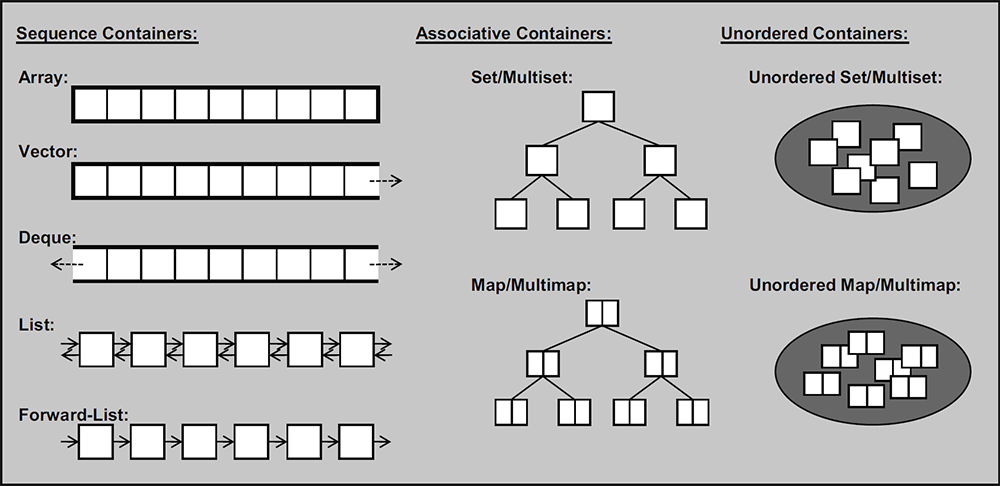
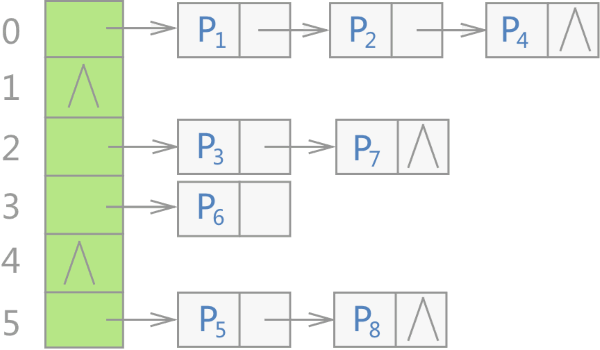
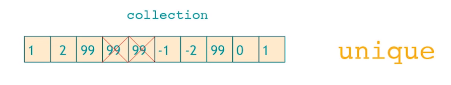
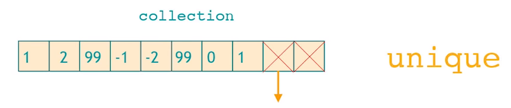
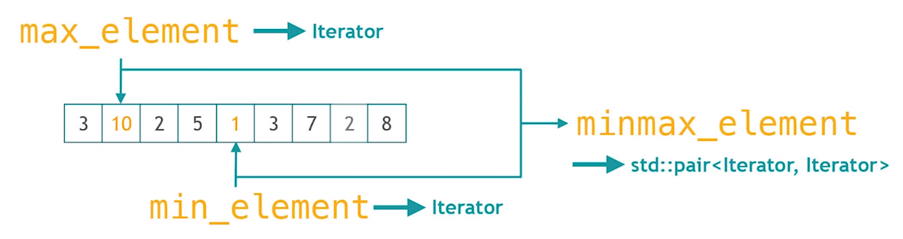

# C++标准模板库(STL)介绍

https://cui-jiacai.gitbook.io/c++-stl-tutorial/


## 常用容器的特点及适用情况

### 序列式容器

string：与vector相似的容器，专门用于存储字符。随机访问快，在尾位置插入/删除速度快

array：固定大小数组。支持快速随机访问，不能添加或者删除元素

vector：可变大小的数组。底层数据结构为数组，支持快速随机访问，在尾部之外的位置插入或者删除元素可能很慢

list：双向链表。底层数据结构为双向链表，支持双向顺序访问。在list任何位置插入/删除速度很快

forward_list：单向链表。支持单项顺序访问。在forward_list任何位置插入/删除速度很快

deque：双端队列。底层数据结构为一个中央控制器和多个缓冲区，支持快速随机访问，在头尾位置插入/删除速度很快


----

### 关联式容器

set：集合。底层为**红黑树**，元素有序，不重复

multiset：底层为**红黑树**，元素有序，可重复


map：底层为**红黑树**，键有序，不重复

multimap：底层为**红黑树**，键有序，可重复


set / multiset 以某种比较**元素大小**的谓词进行排列。

map / multimap 以某种比较**键大小**关系的谓词进行排列。


> Predicate：谓词就是返回值为真或者假的函数。STL 容器中经常会使用到谓词，用于模板参数。通俗一点就是 cmp 函数


----

### 无序关联式容器

底层为**哈希表**

unordered_set/unordered_multiset：元素无序，只关心 "元素是否存在"

unordered_map/unordered_multimap：键 (key) 无序，只关心 "键与值的对应关系"


hash_set：底层为**哈希表**，无序，不重复

hash_multiset：底层为**哈希表**，无序，可重复


hash_map：底层为**哈希表**，无序，不重复

hash_multimap：底层为**哈希表**，无序，可重复


**总结**：(这里仅代表做这几种操作时效率比较高，可能其他容器也支持这几种操作)

支持随机访问的容器：string,array,vector,deque
支持在任意位置插入/删除的容器：list,forward_list
支持在尾部插入元素：vector,string,deque





---

### 容器适配器

stack：栈。底层用deque实现，封闭头部，在尾部进行插入和删除元素

queue：队列。底层用deque实现

priority_queue：优先队列。底层用vector实现，堆heap为处理规则来管理底层容器的实现


容器适配器不是容器，不具有容器的某些特点（如：迭代器、clear() 函数）

是在容器的基础上进行接口的改变. 应用在容器上的就叫容器适配器

> 如果 A 想要实现 B 内含的功能, 那么会有两种途径: A 继承 B 或者 A 内包含 B.

适配器使用第二种实现方法的


----

### 容器共通操作

#### 容器声明

都是 `containerName<typeName,...> name` 的形式，但模板参数（`<>` 内的参数）的个数、形式会根据具体容器而变。


#### 迭代器

访问和检查 STL 容器中元素的对象，行为模式和指针类似。迭代器本身可以看作一个数据指针。

迭代器主要支持**两个运算符**：自增 (`++`) 和解引用（单目 `*` 运算符）

声明：`container::iterator`


在 STL 的定义中，迭代器根据其支持的操作依次分为以下几类：

- InputIterator（输入迭代器）：只要求支持拷贝、自增和解引访问。
- OutputIterator（输出迭代器）：只要求支持拷贝、自增和解引赋值。
- ForwardIterator（向前迭代器）：同时满足 InputIterator 和 OutputIterator 的要求。
- BidirectionalIterator（双向迭代器）：在 ForwardIterator 的基础上支持自减（即反向访问）。
- RandomAccessIterator（随机访问迭代器）：在 BidirectionalIterator 的基础上支持加减运算和比较运算（即随机访问）。


> “输入”指的是“可以从迭代器中获取输入”，而“输出”指的是“可以输出到迭代器”。
>
> “输入”和“输出”的施动者是程序的其它部分，而不是迭代器自身。


#### 共通函数

所有容器类（包括string类）的共通操作


- `==`、`!=`、`<`、`>`、`<=`、`>=`：按 **字典序** 比较两个容器的大小。（比较元素大小时 `map` 的每个元素相当于 `set<pair<key, value> >`，无序容器不支持 `<`、`>`、`<=`、`>=`）
- `=` 运算符，将某个容器复制给另一个容器，（赋值运算符/复制构造函数）
- `empty()` 会在容器无任何元素时返回true，否则false
- `size()` 返回容器内目前持有的元素个数
- `clear()` 删除所有元素
- `::iterator` 迭代器


每个容器还都提供了 `begin()` 和 `end()` 两个函数，分别返回指向容器的第一个元素和最后一个元素的下一位置的iterator

-  `begin()/cbegin()`  返回指向**首元素**的迭代器，其中 `*begin = front`。
-  `end()/cend()` 返回指向数组**尾端**占位符的迭代器，注意是没有元素的。

- `rbegin()/crbegin()`  返回指向**逆向数组的首元素**的逆向迭代器，可以理解为正向容器的末元素。
- `rend()/crend()`  返回指向**逆向数组末元素后一位置**的迭代器，对应容器首的前一个位置，没有元素。


>含有字符 `c` 的为只读迭代器，你不能通过只读迭代器去修改 `vector` 中的元素的值。如果一个 `vector` 本身就是只读的，那么它的一般迭代器和只读迭代器完全等价。只读迭代器自 C++11 开始支持。


所有容器都提供 `insert()` 用以插入元素，以及 `erase` 用以删除元素。

-  `insert()`  将单一或某个范围内的元素插入容器内
-  `erase()` 将容器内的单一元素或某个范围内的元素删除。

-  `front()` 返回容器第一个元素。
-  `back()` 返回容器最后一个元素。
-  `swap()`交换两个容器的内容。


因此后续将不再对公共函数进行解释。


---

## 1. vector

https://hackingcpp.com/cpp/std/vector.html

**内存连续的**、**可变长度** 的数组（亦称列表）数据结构。能够提供线性复杂度的插入和删除，以及常数复杂度的随机访问。

vector 还可以以邻接表的方式储存图，对**无法使用邻接矩阵**的题目（结点数太多）、又害怕**使用指针实现邻接表**的读者十分友好。

```c++
#include <vector>
using namespace std;
```


| 初始化/访问                                                  | 意义                                                     |
| ------------------------------------------------------------ | -------------------------------------------------------- |
| `vector<int> name;`                                          | 一维数组 size：1x\*                                      |
| `vector<int> name[5];`                                       | 二维数组 size：5x\*                                      |
| `vector<vector<int> > name;`                                 | 二维数组 size：\*x\*                                     |
|                                                              |                                                          |
| `vector<int>(n, 0); `                                        | 一维向量 size：1xn，初始化为0                            |
| `vector<vector<int>> dp(m, vector<int>(n, 0));`              | 二维矩阵 size：mxn，初始化为 0                           |
|                                                              |                                                          |
| `in={1,2,3,4,5,6,7};`<br/>`vector<int> tin1(in, in+7);`	<br>`vector<int> tin2(in, in+6);` | 用数组初始化<br>tin1: 1 2 3 4 5 6 7<br>tin2: 1 2 3 4 5 6 |
|                                                              |                                                          |
|                                                              |                                                          |
| vec[i]                                                       | 直接下标访问                                             |
| `vector<int>::iterator it=vi.begin();`                       | \*(it+0) = vec[0]<br>\*(it+3) = vec[3]                   |
| \*(vi.begin()+i)                                             | 等价于 vec[i]                                            |
|                                                              |                                                          |


| 函数                   | 详解                                                         |
| :--------------------- | ------------------------------------------------------------ |
| vec.push_back(i);      | vec 尾部插入元素 i，创建元素i再拷贝再销毁                    |
| vec.emplace_back(i);   | vec 尾部插入元素 i，直接尾部创建                             |
| vec.insert(it, x);     | vec it位置插入元素 x，原it位置值向后移动                     |
|                        |                                                              |
| vec.clear();           | 清空容器 vec 的所有元素                                      |
| vec.pop_back();        | 删除 vec 尾部元素                                            |
| vec.erase(it);         | 删除 vec it 位置元素，原it位置后一位的值向前移动             |
| vec.erase(first,last); | 删除 vec [fisrt, last) 位置元素，原last位置值向前移动        |
|                        |                                                              |
| vec.size();            | 表示容器中所包含（已经存储）元素的个数；                     |
| vec.capacity();        | 当前分配的存储容量，其实也就是当前情况下**能够存储的元素个数** |
|                        | 不分配空间的前提下 `vec.size()<= vec.capacity()`             |
|                        |                                                              |


### capacity()/size()


### *考点

- **Q：优点**

1）`vector` 可以动态分配内存

很多时候我们不能提前开好那么大的空间（eg：预处理 1~n 中所有数的约数）。尽管我们能知道数据总量在空间允许的级别，但是单份数据还可能非常大，这种时候我们就需要 `vector` 来把内存占用量控制在合适的范围内。`vector` 还支持**动态扩容**，在内存非常紧张的时候这个特性就能派上用场了。

2）`vector` 重写了比较运算符及赋值运算符

`vector` 重载了六个**比较运算符**，以**字典序**实现，这使得我们可以方便的判断两个容器是否相等（复杂度与容器大小成线性关系）。另外 `vector` 也重载了赋值运算符，使得数组**拷贝更加方便**。

3）`vector` 便利的初始化

由于 `vector` 重载了 `=` 运算符，所以我们可以**方便的初始化**。此外从 C++11 起 `vector` 还支持 [列表初始化](https://zh.cppreference.com/w/cpp/language/list_initialization)，例如 `vector<int> data {1, 2, 3};`。


- **Q：动态空间实现细节?**

底层是**定长数组**，它能够实现动态扩容的原因是**增加了避免数量溢出的操作**。

首先需要指明的是 vector 中元素的数量（size长度）n 与它已分配内存最多能包含元素的数量（capacity容量）N 是不一致的，vector 会**分开存储这两个量**。

当向 vector 中添加元素时，如发现 ，那么容器会分配一个尺寸为 2N 的数组，然后将旧数据从原本的位置**拷贝**到新的数组中，再将原来的内存**释放**。尽管这个操作的渐进复杂度是 $O(N)$，但是可以证明其**均摊复杂度**为 $O(1)$。而在末尾删除元素和访问元素则都仍然是 $O(1)$ 的开销。

因此，只要对 vector 的尺寸估计得当并善用 resize() 和 reserve()，就能使得 vector 的效率与定长数组不会有太大差距。


**（1）另觅更大空间；（2）将原数据复制过去；（3）释放原空间三部曲。**


- **Q：`vector<bool>` 的特化**

标准库特别提供了对 bool 的 vector 特化，每个“bool”只占 1 bit，且支持动态增长。

但是其 operator[] 的返回值的类型不是 `bool&` 而是 `vector<bool>::reference`。因此，使用 `vector<bool>` 使需谨慎，可以考虑使用 `deque<bool>` 或 `vector<char>` 替代。而如果你需要节省空间，请直接使用 bitset。


- **vector 和 list 的区别？**

vector数据结构

vector和数组类似，拥有一段连续的内存空间，并且起始地址不变。因此能高效的进行随机存取，时间复杂度为o(1);但因为内存空间是连续的，所以在进行插入和删除操作时，会造成内存块的拷贝，时间复杂度为o(n)。另外，当数组中内存空间不够时，会重新申请一块内存空间并进行内存拷贝。

list数据结构

list是由底层双向链表实现的，因此内存空间是不连续的。只能通过指针访问数据，所以list的随机存取非常没有效率，时间复杂度为o(n);但由于链表的特点，能高效地进行插入和删除。
总之，如果需要高效的随机存取，而不在乎插入和删除的效率，使用vector; 如果需要大量的插入和删除，而不关心随机存取，则应使用list。


- `vector push_back()`  的时间复杂度？

最好是O(1)，最差是O(n), 摊还复杂度是O(1)。

最好的情况，就是插入的时候，还有空余；最坏的情况，就是每次插入都满了，要重新分配内存。


```c++
// 此段代码可以看到什么情况下才会引起扩容
vector<int> v;
int last = 0;
for (int i = 1; i <= 1e5; ++i) {
    v.push_back(1);
    if (last != (int)v.capacity()) {	
        cout << v.capacity() << "    ";
        last = v.capacity();
    }
}
//1    2    4    8    16    32    64    128    256    512    1024    2048    4096    8192    16384    32768    65536    131072
```


当插入第 i 个数，i 是 2 的次幂时，进行扩容并拷贝，拷贝个数为当前容量即 i：
$$
\begin{equation}

 c_{i}=
 \left\{\begin{array}{lr}i &  i-1 \text { 为 2 的幂 } \\ 
 1 & \text { 一般情况 }\end{array}\right. 
 
\end{equation}
$$
$c_i$ 表示插入第 i 个数时的时间复杂度，2 的幂时需要拷贝全部数字即 $O(i)$ 个，其它情况不用拷贝赋值就可以 $O(1)$.

插入n个数，会进行 $\lg_{2}n$ 次扩容拷贝操作，所以插入 n 个数 
$$
\begin{equation}
 \sum_{i=1}^{n} c_{i} = (n-\lg n + \sum_{j=0}^{\lfloor\lg n\rfloor} 2^{j}) \leq n+\sum_{j=0}^{\lfloor\lg n\rfloor} 2^{j} 
\end{equation}\tag{1}
$$
n - lgn 是一般情况的复杂度，$\sum_{j=0}^{\lfloor\lg n\rfloor} 2^{j}$ 是扩容情况的复杂度，求和为总复杂度，可以把 n-lgn 近似为 n


> 根据等比求和公式。复制数据需要的操作次数大概为：
> $$
> \sum_{i=1}^{k} 2^i=\frac{2*(2^k-1)}{2-1}=\frac{2*(2^{\lg_{2}n}-1)}{2-1}=\frac{2*(n-1)}{2-1} \approx 2n \tag{2}
> $$
> 其中 $k = \lg_2 n$ 为拷贝次数。


将 eq2 带入 eq1 中得到：
$$
\begin{equation}
 \sum_{i=1}^{n} c_{i} = n+\sum_{j=0}^{\lfloor\lg n\rfloor} 2^{j} = n+2n = 3n
 
\end{equation}\tag{3}
$$
总时间复杂度 $O(3n)$，共 n 次插入操作，摊还时间复杂度为 $O(3)$ 为常数级别。


> https://blog.csdn.net/qq_46780256/article/details/122023002


- Q：循环中 erase 造成的问题，以及改正方法？

```c++
vector<int> vec;
vec.push_back(1);vec.push_back(2);vec.push_back(3);vec.push_back(3);vec.push_back(4);vec.push_back(5);

for (vector<int>::iterator iter = vec.begin(); iter != vec.end(); ++iter)
    if (*iter == 3)
        vec.erase(iter);
```

当 `vec.erase(iter)` 之后，`iter` 就变成了一个**野指针**，对一个野指针进行 `iter++` 是肯定会出错的。

> 对于 erase 的**返回值**是这样描述的：An iterator that designates the first element remaining beyond any elements removed, or a pointer to the end of the vector if no such element exists. 一个迭代器，它指定被移除元素之外**剩余的第一个元素**，或者一个指向向量末尾的指针(如果没有这样的元素)

因此修正为：

```c++
for (vector<int>::iterator iter = vec.begin(); iter != vec.end(); ++iter)
    if (*iter == 3)
        iter = vec.erase(iter);  //返回值指向删除元素的下一个元素
```

这段代码也是错误的：1）**无法删除两个连续的"3"**； 2）当3位于vector最后位置的时候，也会出错（在vec.end()上执行 ++ 操作）


**正确答案**

```c++
for (vector<int>::iterator iter = vec.begin(); iter != vec.end(); )//每次循环不增
    if (*iter == 3)
        iter = vec.erase(iter);  //返回值指向删除元素的下一个元素
	else
        iter++;
```

或者利用 `reverse_iterator` 倒着来 erase

```c++
for (vector<int>::reverse_iterator riter = vec.rbegin(); riter != vec.rend(); )//每次循环不增
    if (*riter == 3)
        riter = vec.erase((++riter).base());  //返回值指向删除元素的下一个元素
	else
        riter++;
```


---

## 2. string

- Q：优点？

在 C 语言中，提供了字符串的操作，但只能通过**字符数组**的方式来实现字符串。而 `string` 则是一个简单的类，使用简单。并且相较于其他 STL 容器，`string` 的常数可以算是非常优秀的，基本与字符数组不相上下。

1）`string` 可以动态分配空间

和许多 STL 容器相同，`string` 能动态分配空间，这使得我们可以直接使用 `std::cin` 来输入，但其速度则同样较慢。这一点也同样让我们不必为内存而烦恼。


2）`string` 重载了加法运算符和比较运算符

`string` 的加法运算符可以直接拼接两个字符串或一个字符串和一个字符。和 `std::vector` 类似，`string` 重载了比较运算符，同样是按字典序比较的，所以我们可以直接调用 `std::sort` 对若干字符串进行排序。


| 初始化/访问                        | 意义                                   |
| ---------------------------------- | -------------------------------------- |
| `string str;`                      | 空字符串                               |
| `string str="abcd";`               | 字符串 "abcd"                          |
| str.begin() + 3                    | == str[3]                              |
|                                    |                                        |
| str[i]                             | 直接下标访问                           |
| `string::iterator it=str.begin();` | \*(it+0) = vec[0]<br>\*(it+3) = vec[3] |
| \*(str.begin()+i)                  | 等价于 str[i]                          |
|                                    |                                        |
|                                    |                                        |


| 函数                                                        | 详解                                                         |
| :---------------------------------------------------------- | ------------------------------------------------------------ |
| str1 == str2<br>str1 != str2<br>str1 < str2<br>str1 <= str2 | str1 和 str2 比较大小 字典序                                 |
|                                                             |                                                              |
|                                                             |                                                              |
| str.push_back(i);                                           | str 尾部插入char元素 i，创建元素i再拷贝再销毁                |
| str.emplace_back(i);                                        | str 尾部插入char元素 i，直接尾部创建                         |
| str1 +=str2;                                                | str2 字符串接到 str1 后部，无 str1 -= str2 语法              |
| str1.append(str2)                                           | 等同于 str1 += str2                                          |
| str.insert(pos, s);                                         | str[pos] 位置插入字符串 s，原 str[pos] 位置值向后移动        |
| str.insert(it1, it2S, it2E)                                 | it1 为原字符串的欲插入位置，it2S 和 it2E 为待插字符串的首尾迭代器，用来表示串 [it2S, it2E) 将被插在 it1 的位置上。 |
|                                                             |                                                              |
| str.erase(it);                                              | 删除 str it 位置元素，原it位置后一位的值向前移动             |
| str.erase(itS, inE);                                        | 删除 str [itS, itE) 位置元素，原last位置值向前移动           |
| str.erase(pos, len);                                        | str[pos] 位置开始删除，删除len个，pos+len 元素向前移动       |
|                                                             |                                                              |
| str.substr(pos, len);                                       | 返回从 str[pos] 号位开始、长度为 len 的子串，即str[pos]-str[pos+len-1] |
|                                                             |                                                              |
| string::npos                                                | find 函数失配时的返回值                                      |
| str.find(str2)                                              | 当 str2 是 str 的子串时，返回其在 str 中第一次出现的位置；如果 str2 不是 str 的子串，返回 string::npos |
| str.find(str2,pos)                                          | 从 str 的 pos 号位开始寻找 str2，返回值同上                  |
|                                                             |                                                              |
| str.replace(pos,len,str2)                                   | 把 str 从 pos 号位开始，长度为 len 的子串替换为 str2，可能会导致 str.size() 的变化 |
| str.replace(itS,itE,str2)                                   | 把str的迭代器 [itS，itE) 范围的子串替换为str2                |
|                                                             |                                                              |
| str.resize(2)                                               | "smiada" > "sm" <br>如果尺寸变小，原来数据多余的截掉         |
| s.resize(10, 'b');                                          | "smiada" > "smiadabbbb" <br>如果尺寸变大，不够的数据用该函数第二个参数填充,影响size。 |


### c_str()

在 C 语言里，也有很多字符串的函数，但是它们的参数都是 char 指针类型的，为了方便使用，`string` 有两个成员函数能够将自己转换为 char 指针——`data()`/`c_str()`（它们几乎是一样的，但最好使用 `c_str()`，因为 `c_str()` 保证末尾有空字符，而 `data()` 则不保证），如：

```c++
printf("%s", s);          // 编译错误
printf("%s", s.data());   // 编译通过，但是是 undefined behavior
printf("%s", s.c_str());  // 一定能够正确输出
```


----

### length()/size()/strlen()

C++中string成员函数 length() 等同于 size()，功能没有区别。

C++标准库中的string中两者的源代码如下：

```C++
size_type  __CLR_OR_THIS_CALL  length()  const
{ //  return  length  of  sequence
	return  (_Mysize);
}


size_type  __CLR_OR_THIS_CALL  size()  const
{ //  return  length  of  sequence
	return  (_Mysize);
} 
```


string一开始只有length，这是C语言延续下来的习惯。而size则是在出现STL之后，为了兼容加入了和STL容器求长度的函数一个名字的size，这样就可以方便的使用于STL的算法


两者都是求字符串的长度，但strlen( )的**参数必须是** `char*` ；而 `str.length( )` 是string类对象str调用的成员函数，所以它们用在不同的地方；

```c++
char* ch="asdfsafas";
string str="adfadf";

cout<<str.length();
// cout<<strlen(str);　　出错
cout<<strlen(ch);
// cout<<ch.length();出错
```


strlen()的定义基本如下：

```c++
int strlen( const char *str ) //输入参数const
{
    assert( strt != NULL ); //断言字符串地址非0
    int len;
    while( (*str++) != '\0' )
    {
    	len++;
    }
	return len;
}
```


---

## 3. pair / bitset

- 用来代替二元结构体及其构造函数,可以节省编码时间

- 作为map的键值对来进行插入


pair,当想要将两个元素绑在一起作为一个合成元素,又不想要因此定义结构体时,使用pair可以很方便的作为一个替代品.也就是说,pair实际上可以看作一个内部有两个元素的结构体,且这两个元素的类型是可以指定的.

```c++
struct pair{
    typename1 first;
    typename2 second;
}


//一个变量携带两个值
pair<int, int> pii;

cin >> pii.first >> pii.second;

cout << pii.first << ' ' << pii.second;

//通常作为工具与其他容器结合使用
```


| 初始化/访问                             | 意义                                                         |
| --------------------------------------- | ------------------------------------------------------------ |
| `pair<string,int> p;`                   | 定义参数为 string 和 int 类型的pair                          |
| `pair<string, int> p("haha",5);`        | 定义时进行初始化,跟上一个小括号,里面填写两个想要初始化的元素 |
| `make_pair("haha",5);`                  | 临时构建一个pair                                             |
| `containers.emplace_back({"test", 1});` | emplace_back 直接 {"test", 1}                                |
|                                         |                                                              |
|                                         |                                                              |


| 函数                                                      | 详解                                                         |
| :-------------------------------------------------------- | ------------------------------------------------------------ |
| p1 == p2<br>p1 != p2<br>p1 < p2<br>p1 <= p2               | 先以 first 的大小作为标准，只有当 first 相等时才去判别 second的大小 |
|                                                           |                                                              |
| map<string,int> mp;<br/>mp.insert(make_pair("heihei",5)); |                                                              |
|                                                           |                                                              |


`pair` 已经预先定义了所有的比较运算符，包括 `<`、`>`、`<=`、`>=`、`==`、`!=`。当然，这需要组成 `pair` 的两个变量所属的数据类型定义了 `==` 和/或 `<` 运算符。

其中，`<`、`>`、`<=`、`>=` 四个运算符会**先比较**两个 `pair` 中的**第一个变量**，在**第一个变量相等的情况下再比较第二个变量**。


**bitset**

`std::bitset` 是标准库中的一个存储 `0/1` 的大小不可变容器。严格来讲，它并不属于 STL。


---

## 4. stack

LIFO(Last In, First Out) 先进后出 

- 用来模拟实现一些**递归**，防止程序对栈内存的限制而导致程序运行出错.


| 初始化/访问           | 意义                            |
| --------------------- | ------------------------------- |
| `stack<typename> st;` | typename 任意基本数据类型或容器 |
|                       |                                 |


| 函数        | 详解          |
| :---------- | ------------- |
| st.push(i); | 将元素 i 入栈 |
| st.top()    | 取栈顶元素    |
| st.pop()    | 栈顶元素出栈  |
|             |               |
|             |               |


---

## 5. 队列

### queue

FIFO(First In, First Out) 普通队列/先进先出

- 需要实现广度优先搜索时,使用queue代替


| 初始化/访问            | 意义                            |
| ---------------------- | ------------------------------- |
| `queue<typename> que;` | typename 任意基本数据类型或容器 |
|                        |                                 |


| 函数         | 详解            |
| :----------- | --------------- |
| que.push(i); | 将元素 i 入队列 |
| que.front()  | 取队首元素      |
| que.pop()    | 队首元素出队列  |
|              |                 |
|              |                 |

使用`front()`和`pop()`函数前,必须用`empty()`判断队列是否为空.


### deque

**双端队列**

线性复杂度的插入和删除，以及常数复杂度的随机访问。

| 初始化/访问            | 意义                                           |
| ---------------------- | ---------------------------------------------- |
| `deque<typename> que;` | typename 任意基本数据类型或容器                |
| `at()`                 | 返回容器中指定位置元素的引用，执行越界检查。   |
| `operator[]`           | 返回容器中指定位置元素的引用。不执行越界检查。 |


| 函数               | 详解                |
| :----------------- | ------------------- |
| que.push_back(i);  | 将元素 i 放队列尾部 |
| que.push_front(i); | 将元素 i 放队列头部 |
| que.front()        | 取队首元素          |
| que.back()         | 取队尾元素          |
| que.pop_front()    | 队首元素出队列      |
| que.pop_back()     | 队尾元素出队列      |
|                    |                     |
|                    |                     |


---

### priority_queue

- 可以解决一些贪心问题,也可以对`dijkstra`算法进行优化(因为优先队列的本质是堆)


优先队列、堆


| 初始化/访问                                          | 意义                                  |
| ---------------------------------------------------- | ------------------------------------- |
| `priority_queue<typename> que;`                      | typename 任意基本数据类型或容器       |
| `priority_queue<int, vector<int>, greater<int>> q1`; | greater是小根堆，用vector装载内部元素 |
| `priority_queue<int, vector<int>, less<int>> q2;`    | less是大根堆                          |


| 函数         | 详解                              |
| :----------- | --------------------------------- |
| que.push(i); | 将元素 i 放队列中                 |
| que.top()    | 取队首/堆顶/优先级最高 元素       |
| que.pop()    | 队首/堆顶/优先级最高   元素出队列 |
|              |                                   |
|              |                                   |


基本数据类型的优先级设置

`int`型 `double`型 `char` 型,默认数字大的/字典序大的优先级高.队首元素为优先队列内元素最大的那个


结构体的优先级设置

重载(overload)运算符"<"


---

### *考点

- Q：deque 插入和删除的复杂度？

线性复杂度的插入和删除，以及常数复杂度的随机访问。


- Q：deque 实现原理？

deque 的中控器，deque是连续空间，由**一段一段的定量连续空间**构成。一旦有必要在 deque 的前端或尾端增加新空间，便配置一段定量连续空间，串接在整个 deque 的头端或尾端。deque 的最大任务，在这些分段的定量连续空间上，维护其**整体连续的假象**。避开vector动态三部曲，代价是**复杂的迭代器架构**。

既然是分段连续线性空间，就必须有中央控制，为了维持整体连续的假象，数据结构的设计及迭代器前进后退的操作都很繁琐。因此 deque 的代码分量比 vector 和 list 多得多。

deque 采用一块所谓的map作为主控（不是stl的map容器）。这个map是一小块连续空间，其中每个元素都是指针，指向另一段（较大的）连续线性空间，称为缓冲区。缓冲区才是 deque 的储存空间主题。整体架构如下图：


- Q：deque 的迭代器怎么设计的？

首先它必须能够指出分段连续空间（缓冲区）在哪？，它必须能判断自己是否已经处于所在缓冲区的边缘，如果是，一旦前进或后退就必须跳跃至下一个或上一个缓冲区。为了能够正确跳跃，deque 必须随时掌握主控中心 map。

迭代器中需要定义：当前元素的指针，当前元素所在缓冲区的起始指针，当前元素所在缓冲区的尾指针，指向map中指向所在缓冲区地址的指针，分别为 cur, first, last, node。如下图：


> https://blog.csdn.net/baidu_28312631/article/details/48000123


- 双端队列(Double-ended Queue) 

https://blog.csdn.net/cainv89/article/details/51590363


----

## 6. set

集合最主要的作用是**自动去重**并按**升序排序**，因此碰到**需要去重但是不方便直接开数组**的情况，可以尝试用set解决。

搜索、移除和插入拥有**对数复杂度**。


| 初始化/访问                               | 意义                            |
| ----------------------------------------- | ------------------------------- |
| `set<typename> st;`                       | typename 任意基本数据类型或容器 |
| `set<typename>::iterator it; cout << *it` | 只能通过迭代器访问              |
|                                           |                                 |


| 函数                    | 详解                                                         |
| :---------------------- | ------------------------------------------------------------ |
| st.insert(i);           | 将元素 i 放入集合中                                          |
| st.find(i)              | 返回set中对应值为 i 的迭代器                                 |
|                         |                                                              |
| st.erase(it);           | 删除迭代器为it处的元素 `st.erase(st.find(100));`             |
| st.erase(i);            | 直接删除所需要删除的值                                       |
| st.erase(it, st.end()); | 删除一个区间 [fisrt,last) 内的所有元素                       |
|                         |                                                              |
| st.lower_bound(x)       | 返回指向首个**不小于**给定键的元素的迭代器。如果不存在这样的元素，返回 `end()`。 |
| st.upper_bound(x)       | 返回指向首个**大于**给定键的元素的迭代器。如果不存在这样的元素，返回 `end()`。 |

>set 自带的 lower_bound 和 upper_bound 的时间复杂度为 O(logN)。
>
>但使用 algorithm 库中的 lower_bound 和 upper_bound 函数对 set 中的元素进行查询，时间复杂度为 O(N)。
>
>如果存入元素是 pair 的话：按运算符<在字典上比较 lhs 和 rhs，即比较第一个元素，并且仅当它们相等时才比较第二个元素


---

### multiset

允许存储重复数据的 set （无去重）


---

### unordered_set

无自动排序，有去重，支持 O(1) 时间查找元素是否存在，普通 set 为 O(logn)


**应用**

在贪心算法中经常会需要出现类似 找出并删除最小的大于等于某个值的元素。这种操作能轻松地通过 set 来完成。

```c++
// 现存可用的元素
set<int> available;
// 需要大于等于的值
int x;

// 查找最小的大于等于x的元素
set<int>::iterator it = available.lower_bound(x);
if (it == available.end()) {
  // 不存在这样的元素，则进行相应操作……
} else {
  // 找到了这样的元素，将其从现存可用元素中移除
  available.erase(it);
  // 进行相应操作……
}
```


---

### *考点


---

## 7. map

map会以**键**从**小到大**的顺序自动排序


1. 需要建立字符(或字符串)与整数之间映射的题目，使用map可以减少代码量
2. 判断大整数或者其他类型数据是否存在的题目，可以把map当作bool数组用
3. 字符串和字符串的映射可以也会用到

延伸:map的键和值是唯一的，如果一个键需要对应多个值，只能用multimap。还增加了unordered_map，以散列代替map内部红黑树，速度快


| 初始化/访问                               | 意义                            |
| ----------------------------------------- | ------------------------------- |
| `map<typename1, typename2> mp;`           | typename 任意基本数据类型或容器 |
| `set<typename>::iterator it; cout << *it` | 通过迭代器访问                  |
| `mp['c']`                                 | 通过下标访问                    |
|                                           |                                 |


| 函数                    | 详解                                             |
| :---------------------- | ------------------------------------------------ |
| mp.find(i)              | 返回 map 中对应键为 i 的迭代器                   |
|                         |                                                  |
| mp.insert({k, v});      | 插入一个 key - value 键值对                      |
|                         |                                                  |
| mp.erase(it);           | 删除迭代器为it处的元素 `mp.erase(mp.find('b'));` |
| mp.erase(i);            | 直接删除所需要删除的key                          |
| mp.erase(it, mp.end()); | 删除一个区间 [fisrt,last) 内的所有元素           |
|                         |                                                  |
|                         |                                                  |


### multimap

允许存储重复数据的 map（无去重）

> 正是因为 `multimap` 允许多个元素拥有同一键的特点，`multimap` 并没有提供给出键访问其对应值的方法。


----

### unordered_map

无自动排序，有去重，支持 O(1) 时间查找元素是否存在，map 为 O(logn)


**应用**

```c++
// 存储状态与对应的答案
map<string, int> record;

// 新搜索到的状态与对应答案
string status;
int ans;
// 查找对应的状态是否出现过
map<string, int>::iterator it = record.find(status);
if (it == record.end()) {
  // 尚未搜索过该状态，将其加入状态记录中
  record[status] = ans;
  // 进行相应操作……
} else {
  // 已经搜索过该状态，进行相应操作……
}
```


### *考点

- Q：erase 后的迭代器失效，及解决方案？

```c++
map<int, int> m = {
    {1, 2},
    {2, 3},
    {3, 0},
    {4, 1},
    {5, 0},
    {6, 0}
};

for (map<int, int>::iterator iter = m.begin(); iter != m.end(); ){
    if (iter->second == 0) {
        cout << "Erasing " << iter->second << endl;
        m.erase(iter++);	//不能 iter = erase(iter) !!! 因为iter已经失效
    } else {
        iter++;
    }        
}
```

**erase(it++)**的执行过程：**分三步走，先把iter传值到erase里面，然后iter自增，然后执行erase,所以iter在失效前已经自增了。**

erase 只是把传进去的一个临时变量给弄失效了


- Q: 数据存放格式?

map是红黑树

unordered_map 是哈希表


- Q: map 和 unordered_map 的优缺点

map

优点:有序,红黑树能够保证 map 插入删除查找时间复杂度为 $O(logN)$

缺点:空间占用率高, map内部是红黑树, 提高了运行效率, 但是每一个节点都需要额外保存父节点, 孩子节点及红/黑性质


unordered_map

优点: 内部实现了哈希表, 插入删除查找速度非常快 $O(1)$

缺点: 无序, 且哈希表建立比较费时间


- Q: map 和 multi_map 的对比

二者所有元素都是pair, 都同时拥有键值(key) 和实值(value). 二者所有元素都会根据元素的键值自动排序. 底部实现都是红黑树

map 不允许键值重复

multi_map 允许键值重复


- Q: unordered_map 和 hash_map 的区别?

最初的 C++ 标准库中没有类似 hash_map 的实现, 但是都不是实现者遵循标准编写的, 所以在功能和性能保证方面都有细微的差别

从 C++11 开始, hash_map 实现被添加到标准库, 但是为了防止与已开发的代码存在冲突, 使用替代名称 unordered_map. unordered_map 实现来自于 boost 库


---

## 8. array

`std::array` 是 STL 提供的 **内存连续的**、**固定长度** 的数组数据结构。其本质是对原生数组的直接封装。


```c++
// 1. 创建空array，长度为3; 常数复杂度
std::array<int, 3> v0;
// 2. 用指定常数创建array; 常数复杂度
std::array<int, 3> v1{1, 2, 3};

v0.fill(1);  // 填充数组

// 访问数组
for (int i = 0; i != arr.size(); ++i) 
    cout << arr[i] << " ";
```


- Q： **为什么要用 `array`?**

`array` 实际上是 STL 对数组的封装。它相比 `vector` **牺牲了动态扩容**的特性，但是**换来了与原生数组几乎一致的性能**（在开满优化的前提下）。因此如果能使用 C++11 特性的情况下，能够使用原生数组的地方几乎都可以直接把定长数组都换成 `array`，而动态分配的数组可以替换为 `vector`。


- **Q：array 的越界检查？**

at	               访问指定的元素，同时进行越界检查
operator[]	访问指定的元素，不进行越界检查

`at` 若遇 `pos >= size()` 的情况会抛出 `std::out_of_range`。


---

## 9. list

 双向链表。

**线性复杂度的随机访问**

**常数复杂度的插入和删除**。


访问中间元素，则需要使用迭代器。

- `front()` 返回首元素的引用。
- `back()` 返回末尾元素的引用。


### forward_list

单向链表，相比于 list 减小了空间开销。

使用方法与 list 几乎一致，但是迭代器只有单向的


---

## 10. *通用考点

- Q：STL 的六大组件？

容器、算法、迭代器、仿函数、适配器（配接器）、空间配置器。六大组件，彼此之间可以组合套用

|                  |                                                              |
| ---------------- | ------------------------------------------------------------ |
| 容器             | 数据结构，vector、list、deque、set、map，用来存放数据<br>实现：容器是一种 class template |
| 算法             | sort、find、copy、for_each<br>实现：算法是一种 function template |
| 迭代器           | 容器与算法之间的胶合剂<br>实现：将 operator*，operator->，operator++，operator- 等指针操作重载的 class template |
| 仿函数           | 行为类似函数，作为算法的某种策略，cmp()，less()，greater()<br>实现：重载了 operator() 的 class 或者 class template |
| 适配器（配接器） | 修饰容器或者仿函数或迭代器接口的东西                         |
| 空间配置器       | 负责空间的配置与管理<br>实现：动态空间配置、空间管理、空间释放的 class template |


容器通过**空间配置器**取得**数据存储空间**

算法通过**迭代器**存储**容器**中的内容

仿函数可以协助算法完成不同的**策略**的变化

适配器(包括容器适配器, 函数适配器, 迭代器适配器) 分别修饰**容器(比如 stack, queue, priority_queu)**, **仿函数()**, **迭代器(逆向迭代器 rbegin, rend)**。


> 容器: 容器是放东西的, 东西占用内存, 这就屏蔽了用户和底层内存之间的操作
>
> 分配器: 用户不能直接操作内存, 用分配器来负责
>
> 算法: 容器里的数据, 对数据的操作是通过算法的
>
> 迭代器: 容器里的数据, 算法操作数据时, 需要用到迭代器, 是容器和算法的桥梁
>
> 仿函数: 是算法的一种策略
>
> 适配器: 可以看作是一个拓展工具, 容器适配器, 函数适配器, 迭代器适配器


- Q：STL 的优点

重要特性是将数据和操作分离。**数据由容器类别加以管理**，**操作则由可定制的算法定义**。**迭代器在两者之间充当“粘合剂”**,以使算法可以和容器交互运作

程序员可以不用思考 STL 具体的实现过程，可以把精力放在程序开发的别的方面。

STL 具有**高可重用性**，**高性能**，**高移植性**，**跨平台**的优点。

1）高可重用性：STL 中几乎所有的代码都采用了**模板类**和**模版函数**的方式实现，这相比于传统的由函数和类组成的库来说提供了更好的代码**重用**机会。

2）高性能：如 map 可以高效地从十万条记录里面查找出指定的记录，因为 map 是采用**红黑树**的变体实现的。

3）高移植性：如在项目 A 上用 STL 编写的模块，可以直接移植到项目 B 上。容器和算法之间通过迭代器进行无缝连接。


----

### 迭代器

五个基本迭代器: 输入迭代器(只读)、输出迭代器(只写)、前向迭代器(读写)、双向迭代器以及随机访问迭代器 

迭代器适配器有 4 类: 反向迭代器（reverse_iterator）, 安插型迭代器（inserter或者insert_iterator）, 流迭代器（istream_iterator / ostream_iterator）, 流缓冲区迭代器（istreambuf_iterator / ostreambuf_iterator）, 移动迭代器（move_iterator）

作用: 遍历容器中存储的数据

> vector, string, deque 随机访问迭代器, 所以它支持直接 iter+3
>
> list, set, map 双向迭代器

迭代器模式是一种设计模式: 一种能够顺序访问容器中每个元素的方法, 使用该方法不能暴露容器内部的表达方式.


---

### 仿函数

也叫谓词函数

算法类仿函数: accumulate 的 `accumulate(v.begin(), v.end(), 1, mutiplies<int>())` 不加最后是累加, 加 `mutiplies<int>()` 就是累乘

关系运算类仿函数: 堆, sort 函数里的 `greater<int>()` , `less<int>()`

自己实现仿函数, 自定义cmp函数, 优先队列里输入 pair, 默认按 first 排序, 那么我们可以自定义一个仿函数, 按 second 排序


----

### 空间分配器

Allocator, 用于封装STL容器在内存管理上的底层细节

在 C++ 中, 其内存配置和释放如下:

new 运算分为两个阶段: 1) 调用 ::operator new 配置内存; 2) 调用对象构造函数构造对象内容

delete 运算分为两个几点: 1) 调用对象析构函数; 2) 调用 ::operator delete 释放内存


而 STL Allocator 将两个阶段的操作区分开来: 

内存配置由 alloc::allocate() 负责

内存释放由 alloc::deallocate() 负责

对象构造由 ::construct() 负责

对象析构由 ::destroy() 负责


同时为了提升内存管理的效率, 减少申请小内存造成的内存碎片问题, STL 采用了两级配置器, 

分配空间超过 128 B 时, 会使用第一级空间配置器

分配空间不超过 128 B 时, 会使用第二级空间配置器


第一级空间配置器直接使用 malloc(), realloc(), free() 进行内存空间的分配和释放

第二级空间配置器采用了内存池的技术, 通过**空闲链表**管理内存

主要是为了便于内存管理, 减少内存碎片的产生


> 5 千字长文+ 30 张图解 | 陪你手撕 STL 空间配置器源码 https://zhuanlan.zhihu.com/p/331809729


---

### 容器一览

| 容器               | 底层数据结构    | 时间复杂度                                                   | 序     | 重复性   |
| ------------------ | --------------- | ------------------------------------------------------------ | ------ | -------- |
| array              | 数组            | 随机读改 O(1)                                                | 无序   | 可重复   |
| vector             | 数组            | 随机读改 O(1)<br>尾部插入、尾部删除 O(1)<br>头部插入、头部删除 O(N) | 无序   | 可重复   |
| deque              | 双端队列        | 头尾插入、头尾删除 O(1)<br>非头尾插入删除 O(N)               | 无序   | 可重复   |
| forward_list       | 单向链表        | 插入、删除 O(1)                                              | 无序   | 可重复   |
| list               | 双向链表        | 插入、删除 O(1))                                             | 无序   | 可重复   |
|                    |                 | 上述序列式容器查找均为 O(N)                                  |        |          |
|                    |                 |                                                              |        |          |
| stack              | deque / list    | 顶部插入、顶部删除 O(1)                                      | 无序   | 可重复   |
| queue              | deque / list    | 尾部插入、头部删除 O(1)                                      | 无序   | 可重复   |
| priority_queue     | vector/max-heap | 插入、删除 O(logN)                                           | 有序   | 可重复   |
|                    |                 |                                                              |        |          |
| set                | 红黑树          | 插入、删除、查找 O(logN)                                     | 有序   | 不可重复 |
| multi_set          | 红黑树          | 插入、删除、查找 O(logN)                                     | 有序   | 可重复   |
| map                | 红黑树          | 插入、删除、查找 O(logN)                                     | 键有序 | 不可重复 |
| multi_map          | 红黑树          | 插入、删除、查找 O(logN)                                     | 键有序 | 可重复   |
|                    |                 |                                                              |        |          |
| unordered_set      | 哈希表          | 插入、删除、查找 O(1) <br>最差 O(N)                          | 无序   | 不可重复 |
| unordered_multiset | 哈希表          | 插入、删除、查找 O(1) <br/>最差 O(N)                         | 无序   | 可重复   |
| unordered_map      | 哈希表          | 插入、删除、查找 O(1) <br/>最差 O(N)                         | 无序   | 不可重复 |
| unordered_multimap | 哈希表          | 插入、删除、查找 O(1) <br/>最差 O(N)                         | 无序   | 可重复   |
|                    |                 |                                                              |        |          |
| hash_set           | 哈希表          |                                                              | 无序   | 不可重复 |
| hash_multiset      | 哈希表          |                                                              | 无序   | 可重复   |
| hash_map           | 哈希表          |                                                              | 无序   | 不可重复 |
| hash_multimap      | 哈希表          |                                                              | 无序   | 可重复   |
|                    |                 |                                                              |        |          |


---

### 红黑树 RB-Tree

https://www.cs.csubak.edu/~msarr/visualizations/RedBlack.html


- **Q: 红黑树是什么?**

RB-Tree(Red Black Tree), 是一种平衡二叉搜索树,

二叉搜索树 BST 是一个有序树, 左子树的所有结点的值都小于它的根节点的值; 右子树的所有结点的值都大于它的根节点的值, 它中序遍历的结果是一个递增序列.

二叉平衡树 AVL 左右两个子树的高度差的绝对值不超过1


- Q: 作用

C++ STL中的set、map

linux进程调度、内存管理

Java集合中的TreeSet和TreeMap，


- Q: 特性?

1)每个节点红色或者黑色

2)根节点是黑色

3)每个叶子节点(NIL)是黑色.(**这里叶子节点，是指为空(NIL或NULL)的叶子节点！不是平时做题的那种叶子节点**)

4)如果一个节点是红色的, 则它的子节点必须是黑色的

5)从一个节点到该节点的子孙节点的所有路径必须包含相同数目的黑节点


- Q: 为什么需要左旋右旋?

红黑树的基本操作是插入和删除. 在对红黑树进行插入或删除之后, 红黑树发生了变换, 不满足 5 条性质, 所以要通过旋转, 使树重新称为红黑树.

旋转的目的是让树保持红黑树的特性


- Q: 什么是左旋右旋?

左旋 x 节点,  x 的右节点往上走, 向左旋转, 逆时针

右旋 x 节点,  x 的左节点往上走, 向右旋转, 顺时针

x 都是往下走的, 往左旋转,变成左节点, 往右旋转, 变成右节点


**左旋:** 将x进行左旋, 意味着 "将 X 变成一个左节点", 


```c++
LEFT-ROTATE(T, x)  
01  y ← right[x]            // 前提：这里假设x的右孩子为y。下面开始正式操作
02  right[x] ← left[y]      // 将 “y的左孩子” 设为 “x的右孩子”，即 将β设为x的右孩子
03  p[left[y]] ← x          // 将 “x” 设为 “y的左孩子的父亲”，即 将β的父亲设为x
04  p[y] ← p[x]             // 将 “x的父亲” 设为 “y的父亲”
05  if p[x] = nil[T]       
06  then root[T] ← y                 // 情况1：如果 “x的父亲” 是空节点，则将y设为根节点
07  else if x = left[p[x]]  
08            then left[p[x]] ← y    // 情况2：如果 x是它父节点的左孩子，则将y设为“x的父节点的左孩子”
09            else right[p[x]] ← y   // 情况3：(x是它父节点的右孩子) 将y设为“x的父节点的右孩子”
10  left[y] ← x             // 将 “x” 设为 “y的左孩子”
11  p[x] ← y                // 将 “x的父节点” 设为 “y”
```


```c++
RIGHT-ROTATE(T, x)  
01  x ← left[y]             // 前提：这里假设y的左孩子为x。下面开始正式操作
02  left[y] ← right[x]      // 将 “x的右孩子” 设为 “y的左孩子”，即 将β设为y的左孩子
03  p[right[x]] ← y         // 将 “y” 设为 “x的右孩子的父亲”，即 将β的父亲设为y
04  p[x] ← p[y]             // 将 “y的父亲” 设为 “x的父亲”
05  if p[y] = nil[T]       
06  then root[T] ← x                 // 情况1：如果 “y的父亲” 是空节点，则将x设为根节点
07  else if y = left[p[y]]  
08            then left[p[y]] ← x    // 情况2：如果 y是它父节点的左孩子，则将x设为“y的父节点的左孩子”
09            else right[p[y]] ← x   // 情况3：(y是它父节点的右孩子) 将x设为“y的父节点的右孩子”
10  right[x] ← y            // 将 “y” 设为 “x的右孩子”
11  p[y] ← x                // 将 “y的父节点” 设为 “x”
```


- **Q: 插入操作**

第一步: 将红黑树当作一颗二叉查找树, 将节点插入

第二步: 将插入的节点着色为 "红色" (不会违背特性1235)

第三步: 通过旋转或着色等操作, 让它重新成为一颗红黑树


修正操作的三种情况:

1)被插入的节点是根节点: 直接涂黑就好了                     涂黑后不违背特性1和4

2)被插入的节点的父节点是黑色: 不用做, 就是红黑树    不违背特性4

3)被插入的节点的父节点是红色:									  违背特性4

这种情况下, 被插入节点一定存在非空祖父节点的(因为它的父节点是红色,根节点不是红色); 那么一定就存在叔叔节点 (即使为空, 空节点也是黑色叶子节点). 然后按照叔叔节点的情况, 将这种情况进一步划分为3种情况:

​		31)叔叔是红色, 

​						(01)将父亲节点设黑

​						(02)将叔叔节点设黑

​						(03)将祖父节点变红

​						(04)将祖父节点设为当前节点, 之后继续对当前节点进行操作

​		32)叔叔是黑色, 当前节点是父节点的右孩子

​						(01)将父亲节点作为当前节点

​						(02)以新的当前节点进行左旋

​		33)叔叔是黑色, 当前节点是父节点的左孩子

​						(01)将父亲节点设黑

​						(02)将祖父节点设红

​						(03)以祖父节点为支点进行右旋

31)32)33)核心思路都是：将红色的节点移到根节点；然后，将根节点设为黑色。直到跳出3), 即直到父亲节点不是红色


> 二叉查找树插入:  (利用递归思想，判断该值如果比当前节点值大，则转移到右子树；如果比当前节点值小，则转移到左子树，直到叶子节点时结束，插入该值。) **总是叶子节点**.


> 特性1: 一个节点是红色或黑色
>
> 特性2: 根节点黑色
>
> 特性3: 叶子节点黑色
>
> 特性4: 一个节点是红色的, 则它的子节点必须是黑色的
>
> 特性5: 一个节点到该节点的子孙节点的所有路径上包含相同数目的黑节点


- **Q: 删除**

第一步: 将红黑树当作一颗二叉查找树, 将节点删除

第二步: 通过旋转或着色等操作, 让它重新成为一颗红黑树


假设 "x包含一个额外的黑色(x原本的颜色还存在)"

https://zhuanlan.zhihu.com/p/420169345


> 二叉搜索树的删除: 
>
> ① 被删除节点没有儿子，即为叶节点。那么，直接将该节点删除就OK了。
> ② 被删除节点只有一个儿子。那么，直接删除该节点，并用该节点的唯一子节点顶替它的位置。
> ③ 被删除节点有两个儿子。那么，先找出它的后继节点；然后把“它的后继节点的内容”复制给“该节点的内容”；之后，删除“它的后继节点”。
>
> 
>
> 删除“它的后继节点” 又走一遍上边的流程
>
> 后继节点表示: **左子树中值最大**的节点**或**者**右子树中值最小**的节点


- Q: 红黑树erase以后迭代器的具体分布情况?


---

### 迭代器失效

- **Q：迭代器失效？**

迭代器失效是对容器 insert 或 erase 操作不当引起的。

erase 返回擦除的当前点的下一个位置


- **Q: 迭代器失效**

|          | 插入                                                 | 删除                                 |
| -------- | ---------------------------------------------------- | ------------------------------------ |
| Vector   | 容量不改变, 只失效之后的迭代器, 否则全部失效         | 被删除节点之后的迭代器全部失效       |
| Deque    | 插入首尾, 只是迭代器失效, 否则迭代器\指针\引用都失效 | 删除首尾, 只是首尾失效, 否则全部失效 |
| List     | 所有迭代器不失效                                     | 有且仅有被删除节点迭代器失效         |
| Set, Map | 所有迭代器不失效                                     | 有且仅有被删除节点迭代器失效         |


- Q: 主要想考什么?

关联容器, 删除当前 iterator, 仅仅会使当前的 iterator 失效, 因此在erase时,递增当前的 iterator 即可. 这是因为红黑树插入或删除节点不会对其他节点造成影响

```c++
if ()	
	mp.erase(iter++) // 不能 iter = erase(iter) !!! 因为iter已经失效
else 
    iter++;
```

> 不能 iter = erase(iter)  因为 erase() 会把传进去的那个 iter 弄失效
>
> 


而序列化容器 (vector, deque 等) 删除当前的 iterator 会使后边所有元素的迭代器全部失效. 这是因为他们使用了连续分配的内存, 删除一个元素会导致后面所有元素都向前移动一个位置.

```c++
if ()
    iter = vec.erase(iter)
else
    iter++
```


对于list来说，它使用了不连续分配的内存，并且它的 erase 方法也会返回下一个有效的iterator，因此上面两种正确的方法都可以使用。


---

### 小问题

- **Q: map 和 set 的区别, 分别是怎么实现的 ?**

底层实现都是红黑树, map 和 set 开放的各种操作接口 (插入,查找,删除), 红黑树也都实现了, 所以几乎所有的 map 和 set 的操作行为, 都只是调用红黑树的操作行为.

map 和 set 的区别在于:

1)map中的**元素**是key-value对(关键字-值), 而 set 只是关键字的集合

2)set的**迭代器**是 const 的, 不允许修改元素的值, 而map允许修改value, 而不允许修改 key.

> 因为 map 和 set 都是根据关键字排序来保证其有序性的, 如果修改关键字的话, 那么首先需要删除该键, 然后调节平衡, 再插入修改后的键值, 再调节平衡, 此时红黑树的结构就已经发生了变化, 会导致 iterator 失效, 它不知道应该指向改变前的位置, 还是指向改变后的位置. 

3)map 支持**下标操作**, 而 set 不支持下标操作. map 可以用 key 做下标去执行查询

>  但是要注意的是如果关键字不存在, 它会默认插入一个具有该关键码和 mapped_type 类型默认值的元素到map中, 因此如果 find 能解决, 尽量用 find
>
> 所以 const map 是不能用下标去操作的, 因为 const 不能插入


- **Q：自定义 set 顺序规则，需要重载哪个运算符**

`set` 在默认情况下的比较函数为 `<`（如果是**非内置类型**需要 **重载 `<` 运算符**）。然而在某些特殊情况下，我们希望能自定义 `set` 内部的比较方式。

这时候可以通过传入自定义比较器来解决问题。

具体来说，我们需要定义一个类，并在这个**类中 重载 `()` 运算符**。

例如，我们想要维护一个存储整数，且较大值靠前的 `set`，可以这样实现：

```c++
struct cmp {
  bool operator()(int a, int b) { return a > b; }
};

set<int, cmp> s;
```


- **Q：无序关联式容器最坏情况什么时候发生，时间复杂度是什么？**

在最坏情况下，对无序关联式容器进行插入、删除、查找等操作的时间复杂度会 **与容器大小成线性关系**！这一情况往往在容器内出现**大量哈希冲突**时产生。

同时，由于无序关联式容器的操作时通常存在较大的常数，其效率有时并不比普通的关联式容器好太多。

因此应谨慎使用无序关联式容器，尽量避免滥用（例如懒得离散化，直接将 `unordered_map<int, int>` 当作空间无限的普通数组使用）。


- **Q：怎么制造哈希冲突？**

在哈希函数确定的情况下，可以构造出数据使得容器内产生大量哈希冲突，导致复杂度达到上界。

在标准库实现里，**每个元素的散列值是将值对一个质数取模得到的**，更具体地说，是 [这个列表](https://github.com/gcc-mirror/gcc/blob/releases/gcc-8.1.0/libstdc%2B%2B-v3/src/shared/hashtable-aux.cc) 中的质数（g++ 6 及以前版本的编译器，这个质数一般是 126271 ，g++ 7 及之后版本的编译器，这个质数一般是 107897）。

因此可以通过向容器中**插入这些模数的倍数来达到制造大量哈希冲突的目的**。


- **Q：怎么自定义哈希函数？**

用自定义哈希函数可以有效避免构造数据产生的大量哈希冲突。

要想使用自定义哈希函数，需要定义一个结构体，并在结构体中重载 `()` 运算符，像这样：

```c++
struct my_hash {
  size_t operator()(int x) const { return x; }
};
```

当然，为了确保哈希函数不会被迅速破解，可以试着在哈希函数中加入一些随机化函数（如时间）来增加破解的难度。


写完自定义的哈希函数后，就可以通过 `unordered_map<int, int, my_hash> my_map;` 或者 `unordered_map<pair<int, int>, int, my_hash> my_pair_map;` 的定义方式将自定义的哈希函数传入容器了。


- **Q：pair 可以作为键么？**

不可以，需要自己写哈希函数，并传入容器，一般为异或

```c++
//自定义哈希函数，元素类型为 pair<T1, T2> a(X1, X2);
struct pair_hash
{
    template <class T1, class T2>
    size_t operator () (pair<T1, T2> const &pair) const
    {
        size_t h1 = hash<T1>()(pair.first); //用默认的 hash 处理 pair 中的第一个数据 X1
        size_t h2 = hash<T2>()(pair.second);//用默认的 hash 处理 pair 中的第二个数据 X2
        return h1 ^ h2;
    }
};


// 专门处理 pair<int, int>
struct pair_hash
{
    size_t operator () (pair<int, int> const &pair) const
    {
        size_t h1 = hash<int>()(pair.first); //用默认的 hash 处理 pair 中的第一个数据 X1
        size_t h2 = hash<int>()(pair.second);//用默认的 hash 处理 pair 中的第二个数据 X2
        return h1 ^ h2;
    }
};


unordered_set<pair<int, int>, pair_hash> hash1;

for(auto ob : obstacles) 
    hash1.insert({ob[0], ob[1]});
```


- **Q: resize 和 reserve 的区别?**

就是 size 和 capacity 的区别

reserve()只修改capacity()大小，不修改size()大小，不可以设定初始值;

resize()既修改capacity()大小，也修改size()大小，可以设定初始值。


- **Q：C++ STL 标准库中，无序容器的底层实现是什么？**

哈希表。准确说”链地址法“，解决数据存储位置发生冲突的哈希表



> 其中，Pi 表示存储的各个键值对。


可以看到，当使用无序容器存储键值对时，会**先申请一整块连续的存储空间**，但此空间并不用来直接存储键值对，而是存储各个**链表的头指针**，各键值对**真正的存储位置**是各个链表的**节点**。

> STL 标准库通常选用 vector 容器存储各个链表的头指针


C++ STL 标准库中，将图中的各个链表称为桶（bucket），每个桶都有自己的编号（从 0 开始）。当有新键值对存储到无序容器中时，整个存储过程分为如下几步：

1. 将该键值对中键的值带入设计好的哈希函数，会得到一个哈希值（一个整数，用 H 表示）；
2. 将 H 和无序容器拥有桶的数量 n 做整除运算（即 H % n），该结果即表示应将此键值对存储到的桶的编号；
3. 建立一个新节点存储此键值对，同时将该节点链接到相应编号的桶上。


---

## 11. STL 算法

https://blog.csdn.net/FlushHip/article/details/82858933

105 个算法


- 不改变序列的操作
- 改变序列的操作
- 划分操作
- 排序操作
- 二分操作
- 合并操作
- 比较操作
- 集合操作
- 堆操作
- 最大最小值操作
- 排列操作
- 数值操作
- 未初始化内存上的操作


算法中带 `_if` 后缀的表示可自定义条件，`_if_not` 为条件取反，带 `_copy` 后缀的表示把结果放入新的序列中，带 `_n` 后缀的表示操作相同元素 `n` 次。


### 不改变序列的操作

- `all_of`
- `any_of`
- `none_of`
- `count`
- `count_if`
- `find`
- `find_if`
- `find_if_not`
- `adjacent_find`
- `search`
- `search_n`


#### **find / count / search**


count 对序列中**指定元素进行计数**；

find 在序列中顺序查找一个元素；

search 在序列中查找一段连续子序列，加了_n表示在序列中查找一段连续相同的子序列。


----


### 改变序列的操作

- copy / copy_backward
- copy_if / copy_n(C++11)
- move / move_backward(C++11)
- fill / fill_n
- transform
- generate / generate_n
- remove / remove_if / remove_copy / remove_copy_if
- replace / replace_if / replace_copy / replace_copy_if
- reverse / reverse_copy
- rotate / rotate_copy
- unique / unique_copy
- swap / iter_swap / swap_ranges
- shuffle(C++11)
- sample(C++17)


改变序列的算法最多

#### copy

复制


#### **move**

这个`move`并**不是取得一个值**的右值引用，而是取得**整个序列**的右值引用。


#### fill

类似`memset`。


#### remove

把要删除的元素移动到了序列尾，而不是直接删除。不改变原来序列


实质是下图


#### unique

删除序列中连续重复的内容**，和`remove`类似，只是把**冗余**的元素移动过了序列尾。注意是**连续重复



实质是下图



注意，上图中并没有删除最后一个99，如果想要**删除序列中重复的内容**，需要先对序列调用`std::sort`使冗余的元素聚集在一起。


#### transform

对序列中的每个元素都执行函数`f`，可以对序列本身没有影响，也可以改变序列本身。

```c++
template< class InputIt, class OutputIt, class UnaryOperation >
OutputIt transform( InputIt first1, InputIt last1, OutputIt d_first,
                    UnaryOperation unary_op );
```


#### reverse

反转序列


```c++
int a[10] = {10,11,12,13,14,15};
reverse(a, a+4);	//将a[0]~a[3]反转    13 12 11 10 14 15

string str="abcdefghi";
reverse(str.begin() + 2, str.begin() + 6);  //abfedcghi
```


#### swap

交换值

```c++
int x = 1, y = 2;
swap(x, y);
cout << x << y;  //2 1
```


#### shufle

随机打乱元素顺序


----

### 划分操作

- `partition`
- `stable_partition`
- `is_partitioned`(从此向下都是C++11的新增算法)
- `partition_copy`
- `partition_point`


上面就是划分，把奇数和偶数划分开来，可以看到，`statble_partition`划分的时候可以保持序列之前的相对顺序，而`partition`就会破坏这种相对顺序。


---

### 排序操作

- sort
- stable_sort
- partial_sort / partial_sort_copy
- nth_element
- is_sorted(C++11)
- is_sorted_until(C++11)

这是STL最精髓的部分了。也是最有味的部分，牵扯到一些思想和排序算法。


#### sort

C++sort函数原理：先使用快排，当分割的次数（递归层数）过多时，采用堆排序；若分割次数很少，则采用插入排序即可。(基本数据类型用快速排序，类或结构体用归并排序)


自定义cmp 

**sort**

```c++
vector<pair<int, int>> vec(mp.begin(), mp.end());
sort(vec.begin(), vec.end(), cmp);

bool static cmp (const pair<int, int> a, const pair<int, int> b) {
    return a.second > b.second ? true : false;
}
```

return a > b 当 a>b 时把 a 放在 b 前面，值大的在前边，从大到小排序

return a < b 当 a<b 时把 a 放在 b 后面，值小的在前边，从小到大排序

1. 当cmp函数中为小于号时，为从小到大排序，为大于号时，为从大到小排序；
2. 至于其他的排序规则，比如按照绝对值、平方等等，原理都是类似的；**当参数a和b相比时，a相对于b的排序规则（大小等等），就是整个序列的排序规则**


**priority_queue**

```c++
using P = pair<string, int>;

struct cmp{
    bool operator()(const P& p1, const P& p2) {
        if(p1.second == p2.second) return p1.first > p2.first;
        return p1.second < p2.second;
    }
};

priority_queue<P, vector<P>, cmp> q;

// 或者

auto cmp = [](const P& p1, const P& p2){
    if(p1.second == p2.second) return p1.first > p2.first;
    return p1.second < p2.second;
};

priority_queue<P, vector<P>, decltype(cmp)> q(cmp);
```

return a > b 当 a>b 时把 a 下沉，值大的下沉，小顶堆

return a < b 当 a<b 时把 a 下沉，值小的下沉，大顶堆

**当cmp的参数a和b相比时，a相对于b的排序规则的节点会下沉**


https://blog.csdn.net/qq_42138623/article/details/115319432


#### partial_sort

对序列的前部分进行排序，调用这个算法完后，可以保证前半部分一定有序，后半部分就不知道了


#### nth_element

这个算法保证第`n`个位置上的元素一定是有序的，然后以这个位置为界限，右边的每一个元素都大于左边的每一个元素。**跟快排的思想很像**，在快排中，最理想的状态就是序列分成相等的两半，右边的元素都大于左边的元素。


用`nth_element`来重写快排：

```c++
template<typename Iterator>
void QuickSortBySTLnth_element(Iterator first, Iterator last)
{
    if (first == last || std::next(first) == last)
        return ;
    std::prev(first);
    Iterator mid = first + (last - first) / 2;
    std::nth_element(first, mid, last);
    QuickSortBySTLnth_element(first, mid);
    QuickSortBySTLnth_element(mid, last);
}
```


----

### *二分操作

- `lower_bound` 第一个大于或等于num的数字
- `upper_bound` 第一个大于num的数字
- `binary_search`
- `equal_range`

区间上的二分查找，很高效的算法。


### 合并操作

- `merge`
- `inplace_merge`

有序区间合并，而两者的区别就在于`inplace_merge`可以在就地进行(一个序列，前半部分和后部分分别有序)而不用借助额外的空间，而`merge`通常用来把不同有序序列合并，因此需要一个容器来放结果。


合并有序区间在归并排序用得挺多，因此用标准库的合并函数来重写下归并排序。


```c++
template<typename Iterator>
void MergeSortBySTLmerge(Iterator first, Iterator last)
{
    if (first == last || std::next(first) == last)
        return ;
    std::prev(first);
    Iterator mid = first + (last - first) / 2;
    MergeSortBySTLmerge(first, mid);
    MergeSortBySTLmerge(mid, last);
    std::vector<typename Iterator::value_type> tmp;
    std::merge(first, mid,
                mid, last,
                std::back_inserter(tmp));

    std::copy(std::begin(tmp), std::end(tmp), first);
}
```


### 比较操作

- `equal`
- `lexicographical_compare`
- `mismatch`

至少两个东西才能比较，因此，这三个算法操作的是两个序列，分别判断是否完全相同、字典序、第一个不同的地方。


### 集合操作

STL把两个有序序列看成两个集合，然后这两个的”集合“可以进行如下的运算(交、并、补、查等等)，看看图就明白了。

- set_difference
- set_union
- set_intersection
- set_symmetric_differences
- includes
- merge


### 堆操作

- `make_heap`
- `push_heap`
- `pop_heap`
- `sort_heap`
- `is_heap`(C++11)
- `is_heap_until`(C++11)


堆操作，建堆、向堆中压入一个元素、从堆中弹出一个元素、堆排序。这是堆的基本操作，而普通的堆是完全二叉树，可以用数组来存储，因此，C++标准库的堆操作，操作的是序列。


---

### *最大最小操作

- min_element / max_element / min_max_element
- min/ max / minmax
- clamp(C++17)

这应该是最不用说的算法了，min_element 返回序列中最小值的位置。min 返回两者较小的那个值。不过值得一提的是，min 在C++11中可以求多个值中的最小值，这个得益于std::initializer_list的出现；




---

### 排列操作

- `next_permutation`
- `prev_permutation`
- `is_permutation`(C++11)


C++标准库中的全排列算法。最经典的问题就是判断两个序列是否互为全排列。

最好的做法就是把两个序列排序，然后判断是否完全一样。

这里我们用`next_permutation`和`is_permutation`来做一下。


---

### 数值操作

这类算法一般是对区间求值。C++98就只有前面的四个，到了C++11多了std::iota，C++17就多了一倍多的数值算法。

- accumulate
- partial_sum
- inner_product
- adjacent_difference
- reduce(这个以及下面都是C++17的内容)
- transform_reduce
- inclusive_scan
- exclusive_scan
- transform_inclusive_scan
- transform_exclusive_scan
- gcd
- lcm


#### accumulate

不加可调用对象，默认就是对区间求和。


#### partial_sum

求前缀和，生成前缀和序列。


#### inner_product

向量求模


#### gcd、lcm

最大公约数，最小公倍数，C++17前，标准库有一个内部函数`__gcd`可以实现`gcd`功能，所以以前求最大公约数都是这么写的`#define __gcd gcd`。


---

### 未初始化内存上的操作

- uninitialized_copy
- uninitialized_copy_n(C++11)
- uninitialized_fill / uninitialized_fill_n
- uninitialized_move / uninitialized_move_n(这个及以下都是C++17的算法)
- uninitialized_default_construct / uninitialized_default_construct_n
- uninitialized_value_construct / uninitialized_value_construct_n
- destroy / destroy_at / destroy_n