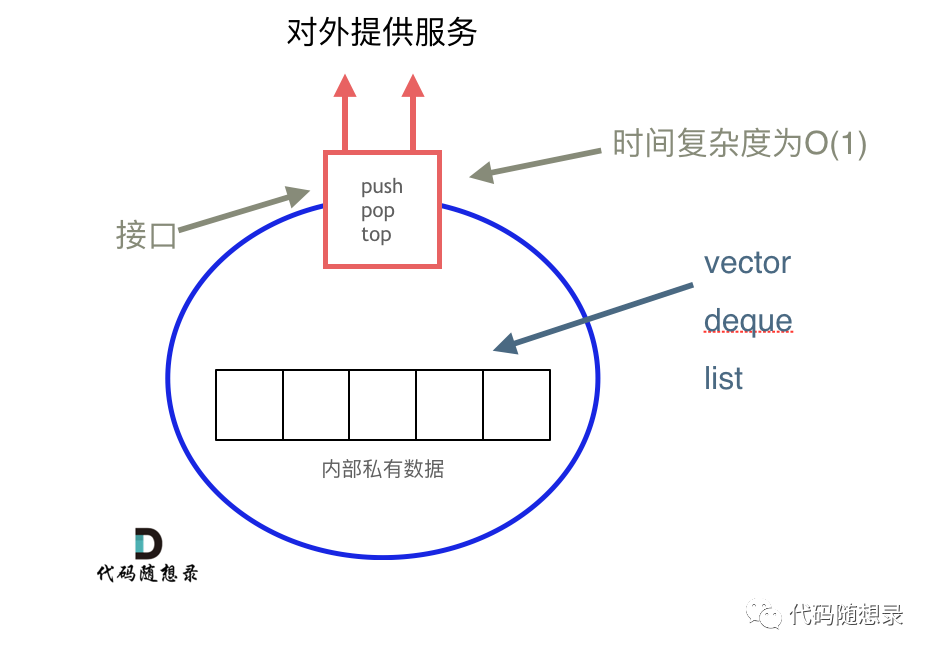

# 栈与队列

## 基础

队列是先进先出，栈是先进后出。

**C++中stack 是容器么？**

栈和队列是STL（C++标准库）里面的两个**数据结构**。C++标准库是有多个版本的，那么来介绍一下，三个最为普遍的STL版本：

- HP STL

其他版本的C++ STL，一般是以HP STL为蓝本实现出来的，HP STL是C++ STL的**第一个实现版本**，而且开放源代码。

- P.J.Plauger STL

由 P.J.Plauger 参照HP STL实现出来的，被 Visual C++ 编译器所采用，不是开源的。

- SGI STL

由 Silicon Graphics Computer Systems 公司参照 HP STL 实现，被 Linux 的 C++ 编译器GCC 所采用，SGI STL 是开源软件，源码可读性甚高。


**我们使用的stack是属于那个版本的STL？**

接下来介绍的栈和队列也是SGI STL里面的数据结构，**我们一般使用的STL也是SGI STL**，知道了使用版本，才知道对应的底层实现。


**我们使用的STL中stack是如何实现的？**/ **stack 提供迭代器来遍历stack空间么？**

栈提供push 和 pop 等等接口，所有元素必须符合先进后出规则，所以栈不提供走访功能，也不提供迭代器(iterator)。不像是set 或者map 提供迭代器iterator来遍历所有元素。

> **栈是以底层容器完成其所有的工作，对外提供统一的接口，底层容器(deque, list, vector, ...)是可插拔的（也就是说我们可以控制使用哪种容器来实现栈的功能）。**


所以 STL 中栈往往不被归类为容器，而被归类为 container adapter（容器适配器）。

从下图中可以看出，栈的内部结构，栈的底层实现可以是vector，deque，list 都是可以的， 主要就是数组和链表的底层实现。



**「我们常用的SGI STL，如果没有指定底层实现的话，默认是以deque为缺省情况下栈的低层结构。」**

deque是一个双向队列，只要封住一段，只开通另一端就可以实现栈的逻辑了。

**「SGI STL中 队列底层实现缺省情况下一样使用deque实现的。」**

我们也可以指定vector为栈的底层实现，初始化语句如下：

```c++
std::stack<int, std::vector<int> > third;  // 使用vector为底层容器的栈
```

刚刚讲过栈的特性，对应的队列的情况是一样的。


队列 先进先出的数据结构，同样不允许有遍历行为，不提供迭代器， **SGI STL中队列一样是以deque为缺省情况下的底部结构。**

也可以指定 list 为起底层实现，初始化queue的语句如下：

```c++
std::queue<int, std::list<int>> third; // 定义以list为底层容器的队列
```

所以STL中**队列也不被归类为容器**，而被归类为container adapter（ 容器适配器）。

我这里讲的都是（clck）C++ 语言中情况， 使用其他语言的同学也要思考栈与队列的底层实现问题， 不要对数据结构的使用浅尝辄止，而要深挖起内部原理，才能夯实基础！


## 232. 用栈实现队列