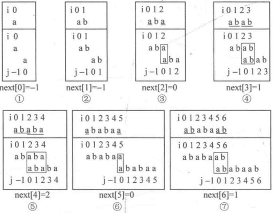
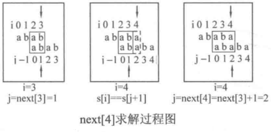
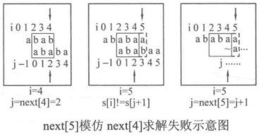
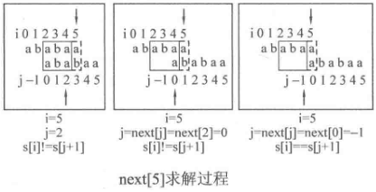
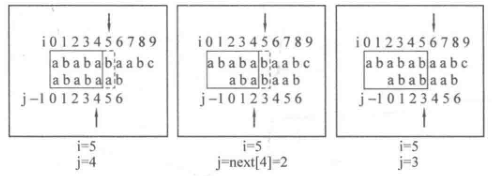
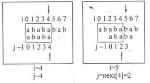
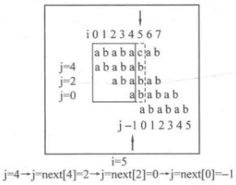

# 字符串

- [ ] KMP算法[优化](#kmp)


## 题目：344. 反转字符串

```c++
void reverseString(vector<char>& s) {
    reverse(s.begin(), s.end());
}

void reverseString(vector<char>& s) {
    for (int i = 0, j = s.size() - 1; i < j; i++, j--) {
        swap(s[i], s[j]);
    }
}
```


## 题目：541. 反转字符串II

让 `i += (2 * k)`，i 每次移动 2 * k 就可以了，然后判断是否需要有反转的区间。

因为要找的也就是每 `2 * k ` 区间的**起点**，这样写程序会高效很多。

**「所以当需要固定规律一段一段去处理字符串的时候，要想想在在for循环的表达式上做做文章。」**

```c++
string reverseStr(string s, int k) {
    for (int i = 0; i < s.size(); i += k*2) {
        //正常反转,  包括剩余字符小于2k,大于k个的前k个字符反转
        if (i + k <= s.size()) {
            reverse(s.begin() + i, s.begin() + i + k);
            continue;
        }
        //剩余字符小于k个，全部反转
        reverse(s.begin() + i, s.begin() + s.size());
    }

    return s;
}
```


## 题目：剑指Offer 05.替换空格

```c++
string replaceSpace(string s) {
    //先扩充大小
    int count = 0;
    int oldSize = s.size();
    for (int i = 0; i < s.size(); i++) {
        if (s[i] == ' ') {
            count++;
        }
    }

    s.resize(s.size() + count * 2);
    int newSize = s.size();
    // 双指针,从后往前移动,并填充空格
    for (int i = oldSize - 1, j = newSize - 1; i < j; i--, j--) {
        if (s[i] == ' ') {
            s[j] = '0';
            s[j - 1] = '2';
            s[j - 2] = '%';
            j -= 2;
        } else {
            s[j] = s[i];
        }
    }
    return s; 
}
```


## 题目：151.翻转字符串里的单词

```c++
class Solution {
public:
    void removeExtraSpace(string &s) {
        int slowIndex = 0, fastIndex = 0;
        while (s[fastIndex] == ' ' && fastIndex < s.size()) {  
            fastIndex++;
        }
        
        // 去除中间多余的空格 和 末尾多余的空格
        for (; fastIndex < s.size(); fastIndex++) {
            //如果当前是空格,前一位置也是空格,什么也不操作,继续循环
            if (s[fastIndex] == ' ' && s[fastIndex] == s[fastIndex - 1] ) { 
                continue;
            } else {
                s[slowIndex++] = s[fastIndex];
            }
        }

        // slowIndex - 1 指向string的最后的一位置
        if (s[slowIndex - 1] == ' ') {
            s.resize(slowIndex - 1);
        } else {
            s.resize(slowIndex);
        }
    }

    string reverseWords(string s) {
        removeExtraSpace(s);
        reverse(s.begin(), s.end());
        int left = 0;
        for (int i = 0; i < s.size(); i++) {
            if (s[i] == ' ') {
                reverse(s.begin() + left, s.begin() + i);
                left = i + 1;
            }
        }
        reverse(s.begin() + left, s.end());
        return s;
    }
};
```


## 题目：剑指Offer58-II.左旋转字符串

通过**局部反转+整体反转**


具体步骤为：

1. 反转区间为前n的子串
2. 反转区间为n到末尾的子串
3. 反转整个字符串

```c++
string reverseLeftWords(string s, int n) {
    reverse(s.begin(), s.begin() + n);
    reverse(s.begin() + n, s.end());
    reverse(s.begin(), s.end());
    return s;
}
```


---

## KMP算法

[字符串： KMP是时候上场了](https://mp.weixin.qq.com/s?__biz=MzUxNjY5NTYxNA==&mid=2247484428&idx=1&sn=c0e5573f5fe3b438dbe75f93f3f164fa)

算法笔记

### 理论

knuth Morris Pratt O(n+m)

字符串匹配问题

文本串 `aabaabaaf`

模式串 `aabaaf`

判断文本串中是否出现过模式串，暴力解法 O(nm)


#### 关键概念

#### 前缀表

前缀表：各字串的最长相等前后缀

前缀：包含首字母不包含尾字母的所有字串。`ababaab` 前缀有 `a, ab, aba, abab, ababa, ababaa`

后缀：只包含尾字母不包含首字母的所有字串。`ababaab` 后缀有 `b, ab, aab, baab, abaab, babaab`

`next[i] `表示字串 `s[0···i]` 的前缀 `s[0···k]` 等于 `s[i-k···i]` 的最大的 `k`（必须部分重叠，不能是 `s[0···i]` 本身）,如果找不到相等的前后缀，那么令 `next[i] = -1`。

`next[i] = -1` 就是所求**最长相等前后缀**中**前缀最后一位的下标**



最长相等前后缀：

`i = 0` 时，`a` 没有相等前后缀，记为 -1

`i = 1` 时，`ab` 没有相等前后缀，记为 -1

`i = 2` 时，`aba` 的相等前后缀为 `a`，前缀 `a`（下标 0），后缀 `a`（下标 1），记为 0（**前缀**的**末尾**位置）

`i = 3` 时，`abab` 的相等前后缀为 `ab`，前缀 `ab`（下标 0-1），后缀 `ab`（下标 2-3），记为 1（**前缀**的**末尾**位置）

`i = 4` 时，`ababa` 的相等前后缀为`aba`，前缀 `aba`（下标 0-2），后缀 `aba`（下标 2-4），记为 2（**前缀**的**末尾**位置）

`i = 5` 时，`ababaa` 的相等前后缀为 `a`，前缀 `a`（下标 0），后缀 `a`（下标 5），记为0（**前缀**的**末尾**位置）

`i = 6` 时，`ababaab` 没有相等前后缀，记为 -1

则`[-1 -1 0 1 2 0 -1]` 即为模式串 `aabaaf` 的next 数组，也称为前缀表  / perfix 数组（有时会把数组加1，`[0 0 1 2 1 1 0]` ，或者把数组右移动，`[-1 -1 -1 0 1 2 0]` ）


#### 根据前缀表递推

假设已经有了 `next[0] = -1`、 `next[1] = -1`、 `next[2] = 0`、 `next[3] = 1`，现在来递推求解 `next[4]`， `next[5]`。 

##### 下一位字符匹配

当已经得到 `next[3] = 1` 时，最长相等前后缀为 “ab”。之后计算 `next[4]`，由于 `s[4] == s[next[3] + 1]`，因此可以把最长相等前后缀 "ab" 扩展为 "aba" ，因此 `next[4] = next[ 3] + 1 = 2`，并令 j 指向 `next[4]`。



##### 下一位字符不匹配

当已经得到 `next[4] = 2` 时，最长相等前后缀为 “aba”。之后计算 `next[5]`，由于 `s[5] != s[next[4] + 1]`，因此不能扩展最长相等前后缀。



因此需要**缩小前后缀**，希望找到一个**尽可能大的** `j`，使得 `s[5] == s[j + 1]` 成立 。  **`s[0···j]`  就是  `s[0···2]` 的最长相等前后缀**。**即令 `j = next[2]`**，然后判断 `s[5] == s[j + 1]`：如果匹配按照匹配的流程走，如果不匹配按照不匹配的流程走，直到成功匹配。如果回退到 `j = -1`，则匹配失败，从 0 开始匹配 pattern。然后继续进行 




---

### 实战 bool

字符串匹配问题

```c++
void getNext(next, S) {
    初始化
    前后缀不相同
    前后缀相同
    next
}
```



当不匹配时，应回退到一个离当前的 `j` 最近的 `j'`，使得 `s[i] == s[j' + 1] ` 成立。**`next` 数组的含义就是当 `j+1` 位失配时，`j` 应该回退到的位置**。


```c++
void getNext(next, S) {
	int j = -1;		//初始化
    next[0] = -1;	//初始化 j = next[0] = -1
    for (int i = 0; i < s.size(); i++) {//求解next[1] ~ next[size-1]
        while (j != -1 && s[i] != s[j]) {//前后缀不相同，找已匹配串的最大相同前后缀
            j = next[j];		
        }
        if (s[i] == s[j]) {//前后缀相同，继续比较下一位
            j++;
        }
        next[i] = j;
    }
}
```


初始化定义 `i` 指向后缀末尾，`j` 指向前缀末尾。

`j` 还代表 `i` 之前（包括 `i`）的子串的最长相等前后缀的长度。例子串为 `aabaaf`，如果 `i`  指向 `f`，则此时 `j` 应该为子串 `aabaa`


一般思路：

① 初始化 `j = -1`，表示 pattern 当前已被匹配的最后位

② 让 `i` 遍历文本串 `text`，对每个 `i`，执行 ③④ 来试图匹配 `text[i]` 和 `pattern[j + 1]`

③ 不断令 `j = next[j]`，直到 `j` 回退位 -1，或是  `text[i] == pattern[j + 1]` 成立。

④ 如果 `text[i] == pattern[j + 1]` 成立，则令 `j++`。如果 `j` 达到 `m - 1`，说明 `pattern` 是`text` 的子串，返回 true。

```c++
bool KMP(char text[], char pattern[]) {
    int textSize = strlen(text), patternSize = strlen(pattern); //字符串长度
    getNext(pattern, patternSize);	//计算pattern的next数组
    int j = -1;
    for (int i = 0; i < textSize, i++) {
        while (j != -1 && text[i] != pattern[j + 1]) {
            j = next[j];
        }
        if (text[i] == pattern[j + 1]) {
            j++;
        }
        if (j == patternSize - 1) {	//pattern遍历完，全部匹配完成
            return true;
        } 
    }
    //pattern没有遍历完，text遍历完，匹配失败
    return false;
}
```


### 实战 int次数



当 `j == m - 1` 时表示 pattern  的一次成功完全匹配。之后从 `j` 回退到什么位置能保证不漏解且有效率？

答案：回退到 ` j = next[j]`，此时 `next[j]` 代表着整个模式串 pattern 的最长相等前后缀。


```c++
void getNext(next, S) {
	int j = -1;		//初始化
    next[0] = -1;	//初始化 j = next[0] = -1
    for (int i = 0; i < s.size(); i++) {//求解next[1] ~ next[size-1]
        while (j != -1 && s[i] != s[j]) {//前后缀不相同，找已匹配串的最大相同前后缀
            j = next[j];		
        }
        if (s[i] == s[j]) {//前后缀相同，继续比较下一位
            j++;
        }
        next[i] = j;
    }
}

int KMP(char text[], char pattern[]) {
    int textSize = strlen(text), patternSize = strlen(pattern); //字符串长度
    getNext(pattern, patternSize);	//计算pattern的next数组
    int j = -1, ans = 0;
    for (int i = 0; i < textSize, i++) {
        while (j != -1 && text[i] != pattern[j + 1]) {
            j = next[j];
        }
        if (text[i] == pattern[j + 1]) {
            j++;
        }
        if (j == patternSize - 1) {	//pattern遍历完，全部匹配完成
            ans++;
            j = next[j];  //回退到next[j]
        } 
    }
    //pattern没有遍历完，text遍历完，匹配失败
    return false;
}
```


### 优化<span id = "kmp"></span>



第一次 `text[i]` 与 `b` 匹配失败后，接下来是一连串的 `b` 匹配失败。后边两次的匹配毫无意义，因此需要直接跳过。


---

## 字符串：前缀表不右移，难道就写不出KMP了？

 


----

## 28. 实现 strStr()


---

## 459. 重复的子字符串


