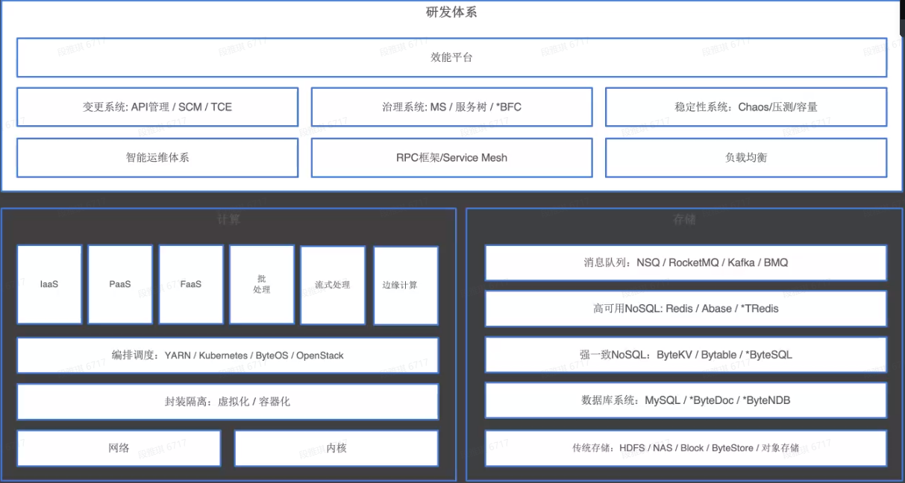
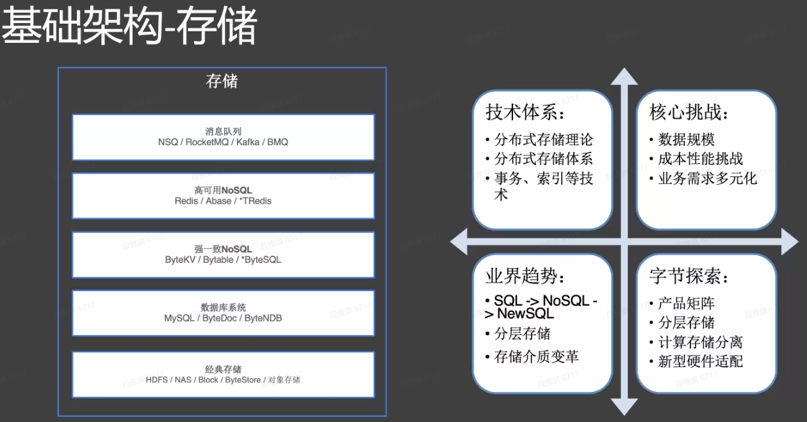
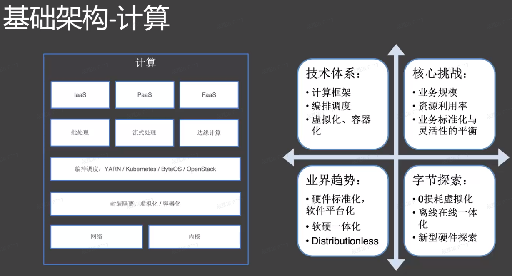
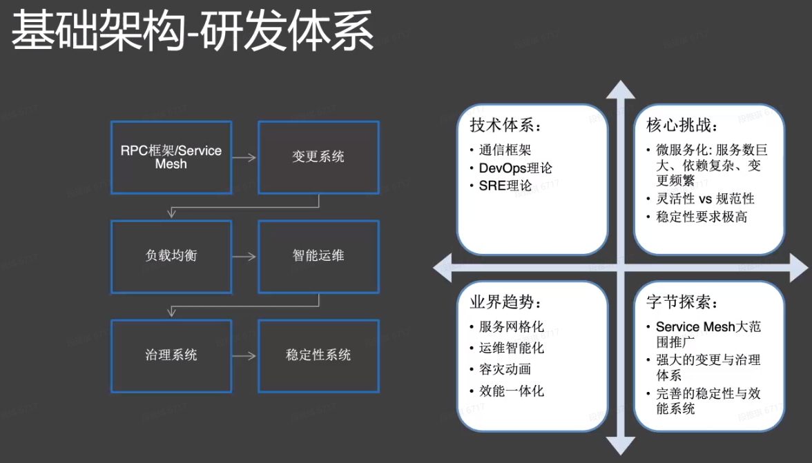

[TOC]

# 面试心得

​	2019年春招和秋招，我在中国进行了多场面试，其目的是找一个暑期实习职位和找秋招的正式工作。这是我的个人心得总结。

​	我实习和秋招都已经面了数家国内的一线大厂（包括腾讯/阿里/头条/百度/拼多多等）和数家外企（包括Optiver/Google/Microsoft/Hulu/Airbnb/Morgan Stanley等），收到过一次拒信。经过一段时间的面试准备与几次面试经历，总结出了一些个人心得，仅供参考。本文的前半段给出了一些我认为比较通用的技巧与心得，以供参考。本文的后半段介绍了自己跨专业学CS的一些经历以及自己找工作过程的流水账，并简单讲述了与找工作期间的心路历程，也可作为自学CS与择业的一个简单参考。

​	在进行了比较与思考后，我最终选择的公司是Optiver，职位是Low-Latency System Developer，工作地点在上海。文末也会阐述选择的理由。

## 声明

​	所有的面试技巧都是建立在一个基础之上：面试者已经具备了相对合格的实力。2018年下半年我在一家创业公司实习，秋招时也面试过一些候选人。在我看来，面试者如果自身基础不扎实、实力不够合格，那看所谓的面经、学习所谓的技巧也意义不大：合格的面试官可以非常轻易地通过一些follow-up问题问出面试者的真实实力。面试技巧和面经固然有意义，但学习技巧和了解面经，**只能帮助有实力的面试者更大程度地发挥出自己的实力** 。**学习没有捷径可走，nothing replaces hard work.** 希望每一位面试者都能尽早明白这个道理。

​	另一方面，我身边确实有一些这样的同学：他们相当有实力，但是却因为种种原因无法在面试中展现出自己的全部实力。事实上，不同的企业有不同的面试文化，比如Google的面试官希望面试者能成为一个他愿意一起工作的同事，字节跳动的面试官也许希望面试者是一个数学、算法、coding、工程都不错的全面人才，这样的人才更可能成为一个“能解决问题的人”。但是，作为面试候选人，我们其实没必要去针对各家公司的文化对症下药：应对面试应当有一些共通的要点。在我看来，面试最关键的一点在于面试者要意识到这不仅是一场测试，**更是一次需要充满着沟通与交流的谈话，让面试官认为他/她愿意成为你的同事**，希望每一位面试者都能尽早明白这个道理。

​	除了上面提到的我认为至关重要的两点以外，面试还有一些其他相对通用的面试技巧和要点。我这篇文章旨在总结一些这方面的东西，希望能够帮助到这样的同学。


## 编程部分心得

​	在面试过程中，面试官常常会给出几道算法问题，需要面试者提供思路或写下代码。在大多数公司的面试中，这一部分的表现都非常重要，而对一些外企来说，这部分的表现是具有决定性的（甚至是唯一重要的表现）。对于这部分的准备，首推[LeetCode](https://leetcode.com/problemset/algorithms/)等网站，这里不再赘述。再提几句话，对于一些重视算法问题的公司如Google, hulu, airbnb, 微软, 头条等，不要抱着可能撞到原题的心态去准备，很难撞到原题的，对于这些公司，你需要做的就是反复练习提升自己的能力，而且由于题目较难，需要有较多的训练量。而另一些不是很重视这类问题的公司像阿里、腾讯什么的，则刷一些常见的题目就很可能撞到原题了，而且难度一般不大。因此，根据target公司的不同，可以有不同的准备方式。下面将列举一些其他在面试中我认为比较关键的点。

### 一个非常简单的例子

​	这里先给出一个非常简单的问题，下面的关键点将结合这个问题来阐述。该问题为，*计算一棵二叉树的高度*。 简单的实现如下：

```
int getHeightOfBinaryTree(TreeNode* root) {
    if (!root) return 0;
    int left_height = getHeightOfBinaryTree(root->left);
    int right_height = getHeightOfBinaryTree(root->right);
    return max(left_height, right_height) + 1;
}
```

### 练习白板编程

​	面试的编程部分往往是白板编程：面试官要么要求在一个类似于Google Doc的地方写代码，要么就是干脆在白纸上写代码。这种情况下coding的体验与平时使用IDE的体验是完全不同的。以Google Doc为例，许多人（比如我）一开始甚至很难写出能编译的代码，更别说一遍写出bug-free的代码了。同时，没了IDE，debug的难度也会大大增加。而在白纸上写代码的难度则还要更进一步。适应白板编程的方法也很简单，只需要足量的练习即可。

### 问清题目

​	问清题目至关重要。如果你对面试官的编程问题理解得不清晰，那你应该立刻问一些能帮助你理解的问题。例如：数据范围是多少？这个数组的大小范围是多少？能不能给个样例？如果输入是这个，那输出应该是什么等等。在上面这个简单的问题中，可以问的一个问题是，二叉树的高度是什么（据我所知，高度的定义并非所有教材都一致）？

​	许多面试官在面试的时候，会故意先抛出一个模糊的问题。实际上，他们希望面试者能够经过一些询问理解问题。在这个过程中，面试者能够展现出自己对**问题的分析能力**以及**沟通的能力**。前者的重要性参见编程珠玑第一章：明确问题，战役就成功了90%。后者的重要性在于，问清题目的这个交流过程与面试者入职之后与同事讨论问题的形式非常类似。显而易见，一个能够很难沟通的面试者也很难成为一个很好沟通的同事。

​	如果没有问清题目，那会发生什么事情呢？在最坏情况下，面试者可能会花大量时间去解决一个完全错误的问题，面试结果也可想而知。或者运气好些，碰到了一个比较nice的面试官，给一些提示告诉面试者已经进入误区了，但这样不仅会浪费不少珍贵的面试时间，更会降低面试官对面试者的评价。我在面一家公司的时候，面试官给我出了一个题，这个题听上去比较困难，需要用到动态规划才能实现。我当时想，在面试开始阶段就给出一道比较困难的题，这对我来说也太不友好了！于是我询问了一句”数据的范围是什么呢？“面试官告诉我，数组的范围都是0-10的整数。这样的话，这个问题就变成了一个只需要6行代码就可以解决的贪心问题。如果我没有问清这个问题的话，面试的难度显然大大增加。

### 与面试官确认函数签名

​	确认了题目之后，我认为合理的做法是先和面试官确认函数签名，也即输入是什么参数，输出是什么参数等等。这一步的代价很低，而且相当重要。第一，这可以告诉面试官，你对函数签名的设计相当重视，而这一点在实际应用中很有价值。第二，这可以进一步帮你确认自己理解了题意。一个合理的函数签名可能就类似于LeetCode题目里的函数签名。上面代码中的签名就是一个比较合理的签名。

### 与面试官确认思路

​	在自己有了一个思路之后，一定要和面试官确认这个思路是否合理。你可以给面试官解释你的思路为什么合理，面试官可能会和你讨论其中的一些要点。这样做有几点好处。第一，在解释的过程中，你的思路也会变得更加清晰（面试官充当小黄鸭）。第二，这也展现出你对沟通的重视性。第三，可能也是最重要的一点是，如果你的思路不正确，nice的面试官会提示你甚至直接指出错误所在，这样你至少不会在一个错误的思路上耽误太多时间。**切忌有了思路之后，不与面试官交流直接写代码**。尤其需要指出的是，如果你的思路对数据有什么假设，或者需要**修改输入数据**，那一定要和面试官确认这样的做法是合理的。

​	如果你认为这个问题与某个经典的问题思路一致，或者可以用到某个经典的算法，那么就直接点出来。例如计算二叉树的高度，实际上是一个后序遍历，那么可以直接点出来。

### 确认边界处理

​	在开始写代码以前或者是写代码的过程中，一定要思考代码的边界条件。最典型的边界条件有：数据是否会溢出？指针是否可能为空？链表是不是可能存在环？数组的长度是不是零？输入的数据会不会完全不符合题意的要求？在示例中，边界条件就是当结点指针为空时，高度应该是0。当你察觉到边界条件存在时，就可以询问面试官处理方式，或者直接告诉面试官你认为什么样的处理方式是合理的。对边界条件的处理在开发软件时也异常重要。忽视了一个边界条件，就会对程序鲁棒性造成极大的影响，可能直接造成巨大经济损失甚至是人员伤亡。

### 代码中使用可读性高的变量名和函数名

​	在写代码的时候，尽量使用可读性较高的函数名和变量名。例如，要计算二叉树的深度，函数签名可以为`int getHeightOfBinaryTree(TreeNode* root)`入参就叫`root`（而非`node`）。递归时，左子树的高度的变量名可以叫`left_height` 。诸如此类。这样操作的主要目的也是让面试官看到你良好的编码习惯。

### 写代码过程中不断与面试官交流

​	实现算法的过程中，切忌闷头狂写而不与面试官交流。实际上，在写一些关键代码的时候，你完全可以告诉面试官你在实现什么功能。同样如前例计算二叉树深度，那你就可以告诉面试官，`int left_height = getHeightOfBinaryTree(root->left)` 是在计算左子树的高度（良好的函数名和变量名其实也让这行代码不言自明），而`int root_height= max(left_height, right_height) + 1` 则是根据左子树和右子树的高度计算当前根节点的高度。

​	当然了，在这个简单的示例中，交流或许显得不是那么重要，但是在一些复杂的问题中交流可能会非常重要。例如，示例的follow-up是请不用递归实现同样的功能，或者更进一步，请用常数空间实现同样的功能。在这样的问题中（代码可能长达数十行），交流就至关重要了。面试官需要和你交流来理解你的思路与状态，你同样需要交流来理清思路。这种写代码过程中的交流也是正式工作时非常重要的能力。

### 写完代码后主动测试

​	在你写完代码之后，不要急着告诉面试官你已经写完了。最好先手动跑一个/数个简单的样例。注意跑这个样例的过程要让面试官可以看见并轻易地理解，这常常是需要一些练习的。例如，我在Google Doc上跑样例的做法是，在屏幕上写出中间变量的当前取值，然后用鼠标光标告诉面试官现在程序跑到了哪一行代码，当前各个变量的取值是多少等等。主动测试的好处有很多。第一，这告诉面试官你很重视测试，而测试在实际生产中是非常非常重要的。第二，一个简单的样例常常可以找出不少类似于typo这样的小错误。第三，如果你的样例给得不错，那你甚至能够借助这个样例找到程序中的bug并纠正它，这总是要好过面试官发现并告诉你程序中存在着bug。主动测试时，你也可以确认你的程序可以很好地处理边界数据。

​	我自己在面一家外企的时候，主动测试的习惯就给我带了很大的回报。当时我写了一段不算复杂的程序（约20行左右），可是因为情绪紧张，程序中包含了一个相对隐蔽的bug。写完之后，我习惯性地跑了一个简单的样例，这花了我大约3分钟的时间，但却让我注意到了那个bug。我赶紧修复了这个bug。到了面试的提问环节，我问面试官本场面试中我表现最好的一点是什么。他告诉我：”是你通过一个样例发现了你的bug。实际上，在你写出了那段代码的时候我就注意到了这个bug，当时我在犹豫要不要提醒你。而你随即开始了测试并找到了这个bug。“这场面试的结果是，在面试结束半小时左右我就收到了通过面试的消息。

### 主动给出算法的复杂度

​	在写完代码之后，应当主动分析自己算法的时间与空间复杂度。一方面，这样可以展示自己扎实的算法基础。另一方面，这也可以告诉面试官自己有这方面的意识。当然了，如果复杂度分析的有误，那这个分析也可能会成为一个减分项。

### 讨论算法的trade-off

​	有些时候，题目的解法可能存在一些trade-off。最常见的就是时间-空间的trade-off，当然有时也会有一些其他的trade-off。如果意识到了这道题目存在trade-off，那么可以主动地与面试官聊trade-off，让他/她知道你的思考过程与选择。

## 计算机基础部分心得

### 面经的使用

​	计算机基础部分的内容包括数据结构、操作系统、编程语言、计算机网络等等。这部分的准备很大程度上是需要一些扎实的基础的，再配合一些面试公司的面经。有些同学想仅仅靠看面经就应付过去，我可以说大多数情况下是不太可能的。有经验和水平的面试官可以轻易地通过几个follow-up问题来判断出来这名候选者是不是靠面经回答出来前面的问题的。当然了，面经对于这块内容仍然是非常有价值的，但阅读面经的时候要注意，并不能仅仅看一下某道题目的答案就够了，而是要看这个题目考察的是哪一块的知识，这一块知识自己有没有遗忘的、生疏的、不扎实的，如果有的话要去做相应的准备。**面经是告诉你这家公司面试的时候喜欢问哪些知识，而不是告诉你他们喜欢问哪些特定的问题**，虽然有的时候有些高频问题确实可能在你的面试中出现。

### 抓住面试官想问的点

​	有些同学被问到一些自己会的基础知识的时候会特别激动，想抓住这个机会表现自己，就会事无巨细地回答一波。我个人认为，如果是基础知识的话，其实不用回答得特别详细，说出一些面试官想问的关键要点就可以了。有时候不一定能判断出来面试官想问的要点，这也不要紧，就说一些自己认为是关键的要点，然后等着面试管继续问follow-up就可以了。这里举一个简单的例子，如果面试官问进程与线程的区别，那么简单地说线程是调度的最小单位，同一个进程的线程共享地址空间，容易有线程安全问题；进程是多数资源分配的最小单位，所以进程的地址空间都是独立的，资源安全问题相对较少。回答到这个份上就差不多够了，然后等面试官继续问follow-up，而不需要去解释为什么线程会有安全问题等。之所以建议这么做，是因为对于有些公司，面试时间是有限制的（例如Google, hulu等），所以面试时间是很宝贵的，你应该用这珍贵的时间去展示自己的优势，而不是说一些绝大部分人都懂的trivial的知识。当然了，有经验/不nice的面试官可能会打断你，问他自己感兴趣想问的东西，但如果你运气不好恰好面试官没啥经验或者不喜欢打断人，那这样浪费宝贵的时间是很可惜的。

### 说出自己的insight

​	如果针对某个问题有自己一些独到的见解，或者是这个知识在很多教科书上可能看不到，很多同学也不一定知道，那么在回答问题的时候说出自己的这个insight，当然前提是自己的说法是有道理的。这里举一个简单的例子，比如一个面试问题是，可以用什么数据结构来实现队列。回答可以说是链表，接着可以补一句但是链表实现队列的性能不一定很好，因为链表节点的地址空间不是连续的，对cache不友好（小问题：那么如何改进这一点呢？）。这种知识其实是有一些经验的人或者基础扎实的人都知道的，不算是什么难点，但作为应届生，能直接说出这一点还是可能会让面试官觉得这个候选人基础不错。

### 结合自己的使用经验阐述

​	如果在某些基础问题上自己有一些实际经验，那么可以结合自己的经验来回答，这样会让面试官觉得这个候选人不仅基础扎实、经验丰富，而且学以致用、分析问题的能力也挺强的。

​	这里举一个简单的例子，比如面试官问hash table处理冲突有哪些常用的方式，各有什么优缺点。那么可以回答常用的有线性探测和拉链法两种。如果自己有相应的经验，那么就可以结合经验谈谈优缺点，例如线性探测在实际使用的时候常常需要空间开得比较大，hash table的装载因子需要维持一个一直比较小的状态（比如25%-50%这样），否则的话性能就会很差，因为查询和插入都会频繁地进行长距离的线性探测。而拉链法对空间的利用效率就会比较高。在提供足够的空间的时候，按经验线性探测会比拉链法快很多，比如之前做了个项目，在满足空间条件的时候线性探测会快7倍左右（这是在结合经验谈），原因是线性探测比拉链法对cache更友好（这是基础知识）。

​	类似于这样的回答方式，可以让面试官留下一个很好的印象，认为这位候选人的整体素质也非常出色。


## 项目部分心得

### 简要介绍项目背景

​	如果面试官是很熟悉这个领域、这类项目的人，那么你可以make some assumptions，即不需要做多少背景介绍。否则的话，还是建议简单谈一下自己项目的背景是什么。这是因为在不同的背景下，同一种功能的实现常常会有不同的选择。这样的背景介绍能帮助面试官更好地理解这个项目，以及大概理解一些实现的选择。背景主要包括场景、问题定义、需求、自己负责的部分扮演的角色等等。

### 介绍项目的approach

​	介绍完项目背景后，需要简单介绍一下自己这个项目的解决方案。解决方案主要是使用了什么技术、什么工具、怎么样的实现等等。需要注意的是，介绍解决方案的时候最好要结合场景一起说，否则会缺乏一些说服力。

​	这里仍然举个简单的例子。例如做深度学习的落地，深度学习框架选用的是腾讯的ncnn，那么最好说一下因为场景是嵌入式arm设备，且没有显卡，在这种场景下，ncnn做了很多指令级的优化，速度会更快。

### 指出项目中的困难点和解决方案

​	针对项目中的困难点要特别认真地谈论一下，需要介绍为什么这个点是个困难点，解决方案大致是什么样的思路，为什么要这样去设计解决方案，最终达成了一个什么样的效果。如果一个候选人能展示出准确的痛点、瓶颈分析能力，并且能提出合理的解决方案的能力，那我相信面试官对他的评价会大大提升。

​	这里同样举一个简单的例子。例如做数据库实现，项目中有一个问题是数据库太大，不可能放到内存里，但如果都放硬盘的话又太慢，这是项目中的一个困难点。解决困难点的关键是同时利用内存的速度优势与硬盘的容量优势，设计一个存储分层模型。做实验观察到90%的针对数据库的查询仅集中在10%的数据上。那么解决方案可以是设计一个冷热分离的模型，仅仅在内存中存储一些热（即查询频繁）的数据，而将冷（即查询频率很低）的数据存在硬盘上，同时设定一定的策略定期做冷热数据替换。经过这样的设计之后，数据库的查询速度提升了30倍。


## 论文部分心得

### 简要介绍自己research的背景

​	与项目不同，很多冷门的research的背景面试官往往是不了解的，所以常常需要做相对详细一些的背景介绍。

### 像做talk一样介绍一遍自己的论文

​	在面试之前，可以先自己精细地准备一下论文的介绍。假设这个面试官对这个领域不熟悉，如何才能让他在较短时间理解这个研究领域，大概明白领域的痛点，并理解你的论文的思路、解决方案与重要性呢？


## 模拟面试

​	强烈建议在面试之前找人模拟一下，并让对方给你一些反馈。这样能够大大降低紧张感，熟悉面试流程并提高面试表现。当然了，还有一个重要的方式就是多多投递，先拿一些自己不target的公司练练手，磨练自己的心态与面试技巧。


## 面试大忌

​	我也曾当过几次面试官，也参加过一些面试并了解过其他人的面试情况，这里简单说几条面试大忌，一定要避免犯的错误。

### 不懂装懂

​	对自己不懂的东西（甚至是没有十成把握的东西），一定要诚实地说出来，千万不要不懂装懂。我把这一点放在最前面，是因为我作为面试官以及平时与人讨论技术的时候，就非常讨厌别人不懂装懂。面试官的水平往往比你高很多，一下子就能判断出来你是真懂还是装懂。所以，碰到自己不懂或者没把握的问题，我建议直接告诉面试官说这个问题我没把握，不是很懂。但如果你有一些思路的话，可以接着说“虽然我不太懂，但是可以试着说一下”，这就可以变成一个展示你解决问题分析问题能力的机会了。而如果你的分析思路很合理，得出的结论也大差不差，那甚至可以很大程度地提升面试官对你的评价。

### 狂傲不羁

​	面试的时候，人要有自信，但是态度一定要平和并且尊重面试官，切不可恃才傲物、狂傲不羁。有一些公司会非常看重这一点，如果你给面试官留下了不好沟通的印象，那往往是一票否决。但面试的时候，偶尔也会碰到面试官不是很懂犯错误的情况（比如国内的一些大厂），这个时候你最好是平和地去与面试官讨论，如果他坚持不肯认错，那你也不要去较真，否则的话可能你面试就挂了。有一种情况是可以去与面试官较真的，那就是你完全不在乎这家公司的offer，这时候你可以放开了较真哈哈哈。另一方面，当你面试一家公司或者一个组，碰到面试官不懂装懂又不肯认错的时候，你也得考虑一下这个组是不是值得你去。


## 心态

​	面试总会有运气成分与偶然性，放平心态，不要因为害怕被拒就不敢投递，也不要因为患得患失而在面试的时候十分紧张。在面试中尽量让自己自然、轻松。当然，一些轻微地紧张有时是可以让自己发挥更好的，但是要适度，切不可紧张过头。面试中即使有些内容答得不好，也不要当场就心态崩盘，要沉着应付。当自己没有什么思路的时候也不要太慌，可以试着从基本的地方开始分析。例如做算法题，可以分析一些toy example，有时候能获得一些思路。回答CS基础题、system design等题目也可以从基础的地方开始分析，甚至是与面试官一起一步一步得出结果。我自己在参加一次面试的时候，一道算法题问清楚题目就花了10多分钟，然后10多分钟没有思路，同时面试官还在给我施加一定的压力。要知道面试总共就45分钟，这样的表现属于非常糟糕的了。所幸我当时稳住了心态，利用一个toy example得到了正确的思路，写出了bug-free的代码，最后还是让面试官相当满意。

## 最后

​	需要说明的是，每个人都有自己的面试风格，很多面试官也会有自己的喜好，所以没有一套universal的面试方案。本文提到的一些技巧什么的，主要是我自己总结出来适用于自己的风格与方案，读者完全可以根据自己的实际情况与面试时候的感受来调整。举个例子，本文提到的编程部分心得，主要是针对Google这样的公司的算法题部分。我自己也有过一些面试经历，面试官非常不喜欢候选人在写代码的时候与他交流，甚至会在你写代码的时候自己去做别的事情 :( 这时候你最好就乖乖闭嘴，把代码写出来即可:) 因此，也希望各位因时制宜，因地制宜，结合实际情况来进行面试。最后祝大家都能有满意的offer~


# 番外篇：找工作的流水账与心路历程

​	本文的这一部分将以流水账的形式简单讲讲学CS这几年来的一些经历，以及找工作的流水账与心路历程。

## 背景介绍与CS学习历程

### 我总结出的适合自己的学习方式

​	在学习CS初期我走了很多弯路，相信了一些不合理（或至少是不适合我）的所谓“编程入门指南”。之后经过自己的摸索，到现在总结出了一套适合自己的学习方案。这里首先给出我的学习方案以供参考。使用这个学习方案还需要不错的英语水平，以后我有时间的话也许也会写一下自己学习英语的经验与心得。

​	一个CS领域的学习过程大致可以分为以下三个阶段。当然，有的时候不同阶段是可以迭代地进行，例如开始科研之后发现自己还缺少了某些基础知识，那可以再进行基础知识的学习。同时，在学习中，很重要的一个指导思想是要获得**监督信息与正反馈**。三个阶段如下：

1. 如果想学某门课程知识，那就找国外名校（主要是MIT/Stanford/CMU/Berkeley）有课程录像的对应课程，假装自己真的在上课一般地按照课程安排上课、看阅读材料并**完成作业**。**完成作业是极其重要的**，因为在这个过程中你会获得大量的监督信息，来指导你发现自己哪些地方学得不扎实；而如果仅仅看视频与阅读材料的话，常常会产生自己已经学懂了的错觉。另一方面，许多编程的作业完成之后也可以带来**成就感与正反馈，支持着自己的学习动力**。

2. 之后，找自己感兴趣的领域。根据是做开发还是做算法，做研究还是做工程，第二阶段可以分成两种不同的方式。

   a) 做工程：找一些适合练手的项目，自己实现与重构，并对照他人的实现方案。实际上如果第一阶段认真完成了好课程的作业的话，那么已经算是完成了很多练手的项目了。

   b) 做科研：了解这个领域的经典方法与最新方法，并**复现这些方法**，做实验比较结果，同时以论文的要求写报告分析结果，这个其实基本上就是国外很多课的project。**复现好的论文是极其重要的，因为复现可以获得监督信息**。在真正入门一个领域之前，人们常常会产生自己已经读懂了论文的细节，实际上如果你没有能力复现一篇论文，你就不能说自己已经完全读懂了这篇论文。另外，论文中往往不会给出全部的细节，但这些细节并不trivial，需要你在复现论文的过程中自己发现体会。尤其是在系统相关的领域，**论文中一句带过的设计细节往往也蕴含着insight**，而这在你复现的时候会有更深的体会。另外，复现论文也能带来一些正反馈。复现完论文做实验的报告也是很重要的，这个整理的过程会逼迫你去进行一些更深层次的思考，整理的实验结果也可以供以后随时查阅。

3. 同样，第三阶段也可以分成两种不同的方式。

   a) 做工程：可以考虑在GitHub上找一些好的开源的项目，读源代码，并且帮助社区进行开发。有条件的话，可以去实习。

   b) 做科研：之后就是阅读论文、跟踪最新的成果、提出想法并撰写提交论文了。

需要指出的是，这套方案不一定适用于所有人，仅仅是我摸索出来的适合自己的方法。

### CS学习历程

​	这段非常冗长，可以直接跳过。

​	我是根不正苗不红的浙大CS小硕。高考填志愿的时候，突然有一些家国情怀，选择去西北工业大学航天学院学习航天，立志航天报国，也正是因此自己的计算机基础异常不扎实:( 本科的时候与CS相关的课程只有一门C++程序设计，自己学得也算是班上最认真的之一了。当时任课老师劝我参加学校的ACM集训，我还中二地认为coding这种事情只不过是实现航天的工具而已，就没去参加，错过了一个亿。后来到了大三开始接触一些系里一些项目以及七七八八的事情的时候，我突然意识到他们做的航天项目和自己想的不太一样，航天系统里的人也与自己想得不太一样，遂萌生退意。

​	于是开始自学CS。因为周围没有认识学CS的人，就去看知乎上大家的推荐，大家都推荐从SICP和CLRS入门，于是我就去看SICP和CLRS并努力做习题，而且当时太年轻，看的还是翻译版的。看到后面怀疑自己完全就是弱智，别人的入门书我怎么就学不懂呢...其实有几个原因，一方面是这两门书挺难的，不见得适合入门；另一方面是翻译版翻译得也不是很好。可以说自己刚开始学CS的时候走了不少弯路。看到Coursera上有开Princeton的Algorithm课，就去把那个课跟了一遍，完成了习题。这时候才终于感觉原来自己还是能学会一些东西的:) 又把Edx上MIT的6.001x跟完了，终于感觉自己算是开始学CS了。

​	那门课跟完之后，AlphaGO的事情开始刷屏。因为自己之前对围棋有些兴趣，也自学了一些，知道李世石是什么水准的人。于是就去关注AlphaGO与小李的比赛。本以为小李会轻松击败AlphaGO，没想到AlphaGO把小李吊锤了一通。当时听到了人工智能(AI)这个词，觉得哇好高大上，又想起来自己小时候看哆啦A梦的喜悦，就萌生了做AI方向的想法。

​	然后就去找了《Artificial Intelligence: a Modern Approach》看。结果又是一本垃圾翻译书，国防科大的一些老师翻译的，我怀疑我用Google Translate都能比他们翻译得好...后来终于开窍了，就买了本影音的英文版看。这本书写得挺有意思的，容易读懂又不失深度，就是太厚了有1000多页，读了我很久，读到后面晕乎乎的。当时看了最有印象的几段有：启发式搜索A*，书上我记得还将围棋归在这一类，说AI围棋距离人类职业水平仍有较大距离，短时间内很难得到人类顶尖水平:) ；用一阶逻辑从数据与规则中学习新的规则（也就是规则学习），当看到这样的程序证明了许多数学定理，有的证明甚至比原始证明更优雅的时候尤其激动与兴奋，不过后来真的开始学AI/ML之后发现这已经完全是个dead area；机器人使用强化学习来学习走迷宫和闯关游戏；用MM做NLP，HMM来做POS Tagging等等。不过要说明的是，这本书以现在的眼光来看已经有些过时了，而且里面大部分的内容与现在的研究、应用领域关系不大，不是特别建议阅读了。

​	看完那本书后，调研发现大家都在做机器学习(ML)，就开始自学一些ML的知识。大三的暑假先从Coursera上Andrew NG课程入门，这门课是一门挺不错的课，我跟完并完成了习题，学习的过程中觉得ML真有趣又有用。然后开始读一些相关的书，先看了Tom Mitchell的那本《机器学习》，这也是一本挺不错的教材（虽然我又看的翻译版，晕乎乎的），不过也有些过时了。看完之后注意到周志华老师有本新出的《机器学习》，还有本出名的书是李航的《统计学习方法》，我就去买了这两本看，其实也就是很快地扫了一遍 。周志华老师的书写得还是挺认真的，李航的书的话我觉得太干了，不适合用来学习，适合用来复习。草草过了一遍两本书之后，开始看Elements of Statistical Learning （ESL）。但是ESL对当时的我来说有点太难了，很多都看不懂。而且我发现自己线性代数的基础似乎不够扎实，就先学了MIT的18.06，再继续去看ESL。值得一提的是，MIT的18.06是一门非常好的课，很适合作为对自己线代知识的拨乱反正，消除一些国内垃圾教材带来的坏毛病。学完之后继续看ESL，胡乱看到unsupervised learning之后，开始写research proposal申请日本的大学。

​	这里要说一下，我之前一直比较向往能出国学习，但是美国的master实在太贵了，家里没钱上不起，CS PhD我又不可能申得上，我就转而准备申请日本的学校。日本的学校学费很便宜，一年也就2w人民币左右，东京的话生活费一年在8w左右，但是日本的master多数都能申请到企业的奖学金。我本来想走他们的G30计划，是一个不需要日语成绩只需要英语成绩，并提供全奖的项目，结果那个项目那年因为日本扩充军费而没有资金了......为此我还自学了一段时间的日语去考了N1，也考了托福(110)。日本的教授在申请中往往具有绝对的权力，说要你就要你，所以陶瓷在申请日本的大学中极为重要。陶瓷的方式往往是写一个研究计划书（研究企划书），发给教授，教授会判断你的能力、vision等等。总之，我在大三的暑假学了一些机器学习知识之后就开始写research proposal了，当时还不懂深度学习，写的是半监督学习，主要是对以前的半监督学习（self-training, co-training那套）的工作的简要介绍，并写了一些自己浅陋的看法。现在看来，那时候的水平自然是非常差劲，对机器学习并没有形成一个整体的认识，也没有自己的insight，research上也完全没有上路，对领域未来发展的看法自然也是错漏百出，不值一提。暑假结束之后，9月初的时候调研了很久教授的信息，看了一些他们最近的工作，并找了三个不同大学的教授发了套磁信。不过非常幸运的是三个教授都给了比较积极的回复，进行了一些交流后，其中两个教授直接表示愿意提供funding :) 我想我当时吸引到他们的可能是本科还可以的GPA，以及出色的语言成绩？

​	这时候家里出了一些变故，然后我的姐姐也告诉说自己想出国的想法给父母造成了很大的压力和负担。经过了一晚上的仔细思考，我决定放弃出国准备考研浙大，主要原因是浙大离家比较近，照顾家里的事情也会方便一些。但是我不确定自己能不能考得上研，毕竟准备时间很短只有3个月左右，我也没有什么CS基础。第二天起床之后，我借了同学的考研真题做了一下前一年（2016）的数学卷和英语卷，数学的话卷面大概120分左右吧，英语的话除掉作文翻译大概是扣了5分左右，当时就感觉3个月左右就努力突击专业课，应该有机会考上。遂写了邮件告诉日本的教授们自己因为一些原因不打算去了，并买了一些考研的书开始准备考研。

​	准备考研的过程是漫长且枯燥乏味的。除了中间有5天回老家参加姐姐的婚礼以外，我每天都能保证9-10小时左右的有效学习时间。我的时间分配策略很简单：大部分时间（也许70%-80%）都投入到专业课的学习上，花一些时间在政治上，数学则定期做一套真题，而英语则一点时间都不花。总得来说这个策略是合理的，当时的失误之处在于学习专业课的资料选择问题。我觉得需要针对考试准备，就使用了国内的教材进行学习，事实证明这个选择是非常错误的，我不仅学得很吃力，最后专业课考得也很低，而且计算机基础也不是很扎实，后面还是花了大量的时间去补。总之呢，日复一日地学习与上课。值得一提的是，我们专业大四上仍然有很多会点名的专业课:) 我在课上就一直看政治的内容，也因此有些课分数考得很低，让我本科的GPA很难看。终于，考研的日子到来了，我并不很紧张地上了考场，发现我考场左右两个考计算机的同学都弃考了，考场上觉得专业课是真的难，其他的科目都普普通通。按部就班地考完之后，就开始了漫长的等待成绩的生活。在等待成绩期间，我开始刷浙大的PAT，即考研的上机考试，主要是按照胡凡学长的《算法笔记》刷。一开始我还不是特别认真，一天大概只做两三个小时的机试题吧，剩下的时间去学一些其他的东西，例如Stanford的CS229。后来考研成绩出来了，我发现自己的初试成绩排名不靠前，这样如果机试考得很低的话就有可能考不上研了。为了让自己的机试成绩尽量高，我把每天刷题的时间提高到了8-10小时左右，这个状态维持了一个月左右，把历年PAT题目（大概100多道？）来来回回刷了两三遍，这才有了一定的信心。机试的考试来临了，我在西安交通大学的考场参加考试，考场里总共也就10来个人。题目非常简单，应该是历年最简单的一次。我顺利地秒完所有的题目之后，就交卷出场了。

​	之后就是准备考研面试与找导师了。我并没有认识在浙大计算机学院的同学，只能在网上搜并问一些前几年考研的学长学姐的推荐，按照他们的推荐联系了几名老师。当时联系的老师们基本都给了回复，约我前去实验室面试。我有一些机器学习的基础，除了是转专业的以外其他的条件也不算很差，所以也收获了一些offer。同一个阶段，考研的复试面试也来了，我并不紧张地参加完了学院的面试，并取得了大概是前三的面试成绩吧。最后经过一些考虑，参考学长学姐的意见和网上的一些帖子选择了一个实验室的老师。

​	选导师结束之后我回到了本科学校，开始做毕设，毕设课题是在一个叫NAO的机器人上做一些与机器学习相关的事情。因为选择的实验室看上去似乎与数据库相关，我就找了Stanford的CS145课程（没有课程录像）的课件看了一下。这门课程的学习经历让我意识到课程的录像是非常重要，在此之后我找课程学习的时候一定优先挑选有课程录像的课。学了点数据库之后，我补了点概率论的知识，然后开始学习Stanford的CS231n课程。这门课让我首次接触到deep learning，感受到计算机视觉CV（学习）的有趣之处以及deep learning的强大与玄学。我比较认真地看完了视频并做完了课程作业之后，决定毕设做一个机器人上简单的目标检测（object detection)。内容设定为检测到目标之后，让机器人根据目标位置抓取模板。由于当时根本没有显卡，只有一台i3的小破笔记本，我挑选了YOLO v2 tiny作为检测的骨干网络，并且使用了github上的一个基于tensorflow的YOLO项目。显然我的计算资源不支持我从头训练网络，我只能找了一个pretrain的网络finetune。当时那个YOLO项目还不支持finetune，我就自己看tensorflow的文档瞎改代码，改出了个支持finetune的网络。然后自己收集了一些图片，标注了一些数据之后开始finetune。由于机器太差，区区百来张图片的finetune就让我费劲了力气，单组参数的finetune大约需要48h才能完成训练，而且训练过程中电脑会非常卡。我大概花了两周的时间才终于训出了一个可用的网络。在此期间由于电脑不能用，我买了本《Information Theory, Inference, and Learning》开始看，也做一些里面能用笔算的习题。训完了网络之后，我在机器人做了一些实验，并录了一些demo，然后写完了毕业论文。

​	需要说明的是 ，直到这个阶段，我对学习/CS/机器学习/做研究都还没真正的入门。现在回忆起来已经有点模糊了，但我大致记得当时的学习并不“主动”，纯粹是“被动”地理解书上写的内容、公式推导和代码等等。现在我认为真正的学习应该是非常“主动”地去进行，看书、论文的时候要对框架和motivation有一个清晰的把握，知道/理解算法这样设计的目的是什么，并要相对频繁地去ask some questions，批判地进行阅读与消化。但可惜当时的自己还差得很远。

​	我一开始对能够进入浙大计算机学院是有一些激动的心情的，也破天荒地去积极认识了很多同学，还认真制定了课程计划等等。但开学之后，我发现课程的质量比我想象中差了很多，当时觉得只有一门课程是高质量的，那就是[蔡登老师](http://dengcai.zjulearning.org.cn/)的[机器学习课程](http://dengcai.zjulearning.org.cn/Courses/ml/)，我认为蔡老师的授课水平和这门课的作业都是world-class的。但我运气不好，没能选上这门课，而且蔡老师怕TA压力太大，不给增加课程容量。我一开始就只能蹭课听，学得很认真，课上蔡老师的问题也总是积极地第一个回答，最后竟然让蔡老师破例地为我签了条子，选上了这门课:) 最后因为这门课我的机器学习基础扎实了很多，这门课也取得了不错的成绩。值得一提的是，这件事情也成了后来我成为蔡老师学生的契机。我还担任了三任TA，在此期间我与另一位TA一起将之前的MATLAB作业改写成了Python的作业。后来这门课要扩充新的资料，我还与蔡老师一起设计了新的课程内容，并狗尾续貂地再出了四份对应新内容的作业。只做了这么一点微小的工作，非常惭愧。

​	后来开始接触了一些自己实验室的项目之后，感觉不是很感兴趣，就与实验室在网易那边的组的一位同学一起合作搞一些超分辨率(SR)相关的工作，经常去网易那边合作。后来我和那边的老师商量，想换到那边的组要过去，我想都是一个实验室下的，应该可以。那边的导师去找我原来的导师聊，结果失败了。我原来的导师也很不高兴我去自己实验室的频率太低，把我训斥了一顿。后来我只能放弃与网易那边的合作，在组里认真干活。但最终因为方向不合等原因，我选择了转出原来的实验室，也非常感谢原导师对我意愿的理解与尊重。后来很幸运地，蔡登老师愿意接收我作为他的学生，也许是认为我在他的课上表现还可以吧哈哈。

​	我在实习之前的学习经历就到此为止。前期因为没人指导，自己也没有很好地判断力，很愚蠢地相信了很多知乎上的答案，后来才慢慢有点上路了，总结出了一些适合自己的学习方案。简而言之就是：如果想学某门课程知识，那就找国外名校（主要是MIT/Stanford/CMU/Berkeley）有课程录像的对应课程，假装自己真的在上课一般地按照课程安排上课、看阅读材料并**完成作业**。之后，找自己感兴趣的领域，了解这个领域的经典方法与最新方法，并**复现这些方法**，做实验比较结果，同时以论文的要求写报告分析结果，这个其实基本上就是国外很多课的project。再之后，就是阅读论文并开始自己的科研了。

​	最后在这里小小地宣传一下我们组。组里的蔡登老师与何晓飞老师都是学术顶尖、人品很好的老师。何晓飞老师现在创业做无人驾驶了，我与他接触不多。但我与蔡老师交流很多，有一起讨论review过大概几十篇paper吧。蔡老师学术水平极高，发表过非常多很有影响力的论文，也经常能一眼看出组里同学许久也看不出来的问题要点；有很好的学术准则，绝对不会抢夺学生的成果，也坚决不参与学术圈一些拉帮结派的事情；人品非常好，很为学生考虑，对我的请求从来都是有求必应>_<。总之，蔡老师不仅是我的学术导师，更是我的人生榜样，能成为他的学生是我的幸运。组里的同学们也都基础扎实，且很努力，产出也不少。组里2019年大概有发了15篇左右的CCF A类的paper，学术实力有目共睹。

## 找实习

先写一些简单的总结体会吧：

1. 能找内推尽量找内推。一方面是有些公司可以免掉笔试避免自己翻车，另一方面是有内推人的话在很多公司可以帮忙查询进度什么的，比较方便。
2. 多看公司的面经了解风格。不同公司考察的重点、风格可以有很大差异，一定要提前了解公司的面试。
3. 简历上的内容一定要非常熟悉。这个没啥可说的了。
4. 面试官真的是一家公司的门面，极大地影响我对公司的印象。
5. 剩下的要点都在前面tips部分提过了，这里不再赘述。

​    实习的一个offer就是自己的dream offer，本来打算就此结束找实习了，把时间用来补CS基础上。陪妹子参加了一场拼多多的面试，与面试官聊了聊他们在做的事情以及难点与痛点的时候，竟然受到了一些启发，有了个idea（虽然这个fancy的idea最后没有work）。于是决定多投递多面试，与各家公司的面试官多聊聊。每家公司的面试官往往是公司里水平比较不错的人，尤其是最后一面技术面的面试官更是技术leader甚至是技术Boss，平时想要与他们聊天的机会可不容易获得。但是面试这样的事情能够让他们自动送上门来聊天，何乐而不为呢？

​	在这样的想法下，我投递了阿里，腾讯，头条，百度，微软，hulu，airbnb，摩根士丹利。需要特别提一下的是optiver。对optiver的投递其实是比较巧合的。三年前ZJUCS有一位硕士学姐应届去了optiver，我认识那位学姐的几个学弟，学弟们对学姐是极其推崇，各种膜拜。我想，这么厉害的学姐会选择的公司，那肯定也非常厉害，于是就这样投递了optiver。后来是各家公司乱七八糟的笔试，当时自己的coding能力也基本都能应付，就不再多说了。下面按时间顺序简单谈谈各家公司的面试。

### Google

​	流程：两轮电面，主要是问算法题。

​	过程：找实习时候的dream company就是Google了。平时有空的时候会做一下Google的kickstart比赛，并因此拿到了去Google参观的机会，参观完更想去Google了。于是投递了Google的实习。当时自己想去Google上海做开发SWE，同时Google的算法岗ML SWE也只在冬令营中产生，也没办法投递。运气不好的是当时Google的面试与IJCAI会议的ddl基本上重合，所以当时是做research赶paper与刷题准备面试同时进行。Google的面试安排相对较早，大约是在2月底吧。有趣的是，由于我在填Google的表的时候写了中英文面试均可，结果HR小姐姐就给我安排了两场英文面试Orz 而且都是晚上11点半或者早上7点这样的事件Orz 第一面似乎是位印度的Googler，结果因为一些原因鸽了我。第二次一面是一位新加坡的Googler，结果又因为被浙大的邮箱坑了进不去Google的视频会议。第三次一面试终于顺利完成，面试官是一位纽约的小哥哥，题目并不难，我很轻松地写完之后我们闲聊了一会儿。二面是一位上海的Googler，题目挺难的，而且给的压力不小，差点就崩了，好在我还是稳住了心态顺利地做了出来。面试完半小时左右就收到HR小姐姐的消息通过了面试，此时我还没从面试的地方走回宿舍......后来过了Google的Hiring Committee，进入Team Match后竟然也很快地就被捞了起来，还有点受宠若惊。捞我的人（也就是我后来的Host）希望我能去北京做ML SWE，我想应该是看上了我的ML背景吧。我问HR小姐姐我的项目内容，小姐姐给我发了俩，说不确定是哪个，其中一个内容大概是自动化地针对手机设备压缩网络，我比较感兴趣；另一个项目看上去是与TensorFlow相关的，感觉也不错。同时注意到自己的Host是Berkeley的PhD和美国一所大学的professor，还发现那个组的创建人是李飞飞。在与妹子商量后，就接了这个offer。可以说第一个offer就是自己的dream offer，非常幸运和激动。

### 拼多多：

​	流程：笔试+HR面 + 两轮onsite技术面

​	过程：投递的是算法岗。拼多多在3月中旬的时候在浙大附近租了个酒店，在那里进行了现场的面试。HR通知我们早早地过去，然后在那边等着排队，记得自己等了挺久的。先进行了HR面，主要是问我对公司的工作时间什么看法，我当然是回答996不在话下，不然我可能就要当场被赶出去了？之后一面技术面问了一道数据结构的coding题。一面的面试官有些傲慢，一开始还弄错了一个地方怼了我一会儿，后来我只能耐心纠正他的错误。之后问了些机器学习基础与项目的问题。这位面试官让我对拼多多的印象非常糟糕，后来也就直接拒了offer，秋招也没有投递。二面技术面倒是感觉不错，问了一道很难写的链表题目，我比较轻松地写出来之后同样问了机器学习基础与项目的问题。面试完过了一两周吧，晚上10点半接到offer call，直接拒掉了。

### 摩根士丹利：

​	流程：全英文，笔试+电面+两轮onsite技术面

​	过程：投递的是C++开发岗。3月底大摩突袭打电话电面，全程英文面试，问了很多数据结构、操作系统与计算机网络的基础问题，最后问了一道system design的题。之后约了4月下旬的onsite面试，我与妹子一块参加。结果因为一些原因（起晚了）到达现场迟到了，非常不好意思。到达现场之后尴尬地发现除了我和妹子之外的所有候选人都穿着正装Orz 现场先做了一点笔试题，交了之后hr小姐姐就带人去面试。面试也是全程英文面。两轮面试问的都是数据结构、操作系统、计算机网络与system design的题。两位面试官给我留下的印象都不错，谦逊和气，水准也不错。一位面试官当时问我有了哪些offer，我就诚实地回答了一下，面试官非常惊讶地问我"Then why do you come to Morgan for an interview?"我说自己想稍微了解一下金融的情况。大摩也是在面试完大约一两周后来了offer call，我拒绝之后并说明了自己的去向，HR说那我们继续保持联系。

### 头条：

​	流程：笔试（内推可免)+3轮视频面+HR面

​	过程：内推的是头条产品的推荐算法岗。4月初进行了前两轮技术面。头条很喜欢考算法题，两位面试官都问了很难的算法题，当时比较困状态不好，艰难地写出来之后又问了一些数学基础、机器学习基础和项目的问题。二面结束5分钟后接到电话约三面。过了两天进行了三面，这次的题倒不是很难，写了两道之后面试官问了一些操作系统、编程语言的问题，最后问了我一个场景设计题。面完5分钟后收到offer call。最后还是拒绝了。

### 阿里：

​	流程：笔试（内推可免)+3轮电面+1轮交叉面+HR面

​	过程：内推的是阿里搜索推荐部门的算法岗。4月初的一个晚上一面，面试官是内推我的师兄，我觉得可能怕被骂防水有点矫枉过正，问了足足70分钟的问题，主要是算法题（很简单而且不用写代码）、机器学习基础、深度学习基础与项目问题。过了两天进行了二面，也是算法题（很简单而且不用写代码）、机器学习基础、深度学习基础与项目问题，面试官有问一些开放性的问题，还蛮有意思的。过了一周左右进行了三面，基本上只问了项目问题和开放性问题，后来知道那个开放性问题竟然是他们投kdd的paper......然后过了挺久的，在安徽参加valse的时候突然接到电话，原来是阿里的交叉面（即另一个部门的人来面试我），问了机器学习基础和项目的问题，还问了深度学习框架的一些实现细节（不知道为什么问我这个，但还是回答了出来）。总得来说技术面试体验还可以。又过了一周，晚上9点半，接到阿里HR的电话，阿里HR还真是如传闻一般......后来拒了offer了。

### 腾讯：

​	流程：笔试（内推可免）+3轮电面+HR面

​	过程：投的是数据挖掘岗位。比较尴尬的是，当时接到了优图Lab的电话，说他们要求实习4个月以上，问我能不能满足要求，我没经过思考就说了那肯定不行，和导师说好了3个月。然后就面试终止了。我真傻，我本来面试的目的就不是去实习啊，直接答应下来说可以4个月就好了...

### 微软：

​	流程：笔试（内推可免）+3轮onsite面

​	过程：找学长内推了微软苏州的SDE，与妹子一起去苏州onsite。一面问了项目和一个算法题，又问了两个设计模式的题。面试官给我的印象非常差，看不懂Range For就challenge我，没用过priority_queue也challenge我。二面的面试官比较nice，先问了项目。之后问了一道比较简单的算法题，然后是难一些follow-up，都相对轻松地解决了。最后还剩下10分钟，面试官就开始和我闲聊，问了我已经拿的offer，并问我有没有肉翻的打算，我说至少要等妹子也有肉翻能力了再一起吧，暂时不考虑。三面面试官是一个leader，先问了一道system design，并讨论了一些面向对象的设计思想，然后问了我开放性的题目，比较难。总得来说，除了一面面试官给我印象非常差外，另外两个面试官都很nice，尤其三面的面试官水平感觉也很好。


To be continued

https://github.com/conanhujinming/tips_for_interview


---

4 月初开始实习，实习到 8 月份。8 月份和 9 月份每天两到三个面试。


4，5月份走实习，转正后，去参加秋招。

牛客网看公司的招聘情况。不要去他的招聘渠道去投。去大厂官网上投。

投简历 -> 通过笔试/面试 -> 发放意向书 -> 电话沟通薪酬 -> 发放带薪资的offer。


最好进大厂，不要去小厂冒风险。


招聘信息：牛客网，公司官方公众号

薪资信息：offershow小程序

公司信息：天眼查

部门信息：脉脉职言

补充分析：公司财报


编程语言，操作系统，数据结构和算法，计算机网络，数据库


现学现卖也可以介绍，大厂不在意语言。


技术栈：

腾讯：go java c++

字节：go

阿里：java

美团：java

百度：c++，java

快手：go，java


最主要的是：实习和项目

大厂的实习和offer，开源项目及star

**实习很重要**


这个问题我不太会，但是根据我现有的知识，我认为它是...的	


简历：重点清晰简洁，只写对方关心的问题

设置对方提问的点，让对方容易发问。









