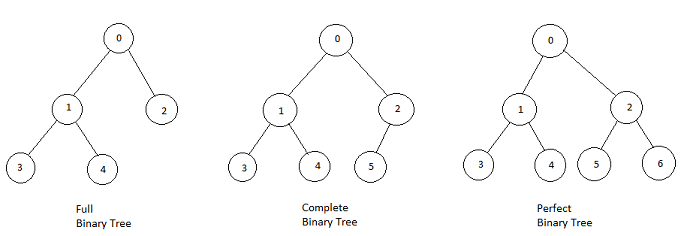

# 树/二叉树

## 1. 种类

### 1.1. 满二叉树

国内定义：除最后一层无任何子节点外，每一层上的所有结点都有两个子结点的二叉树。满二叉树外观上是一个**三角形**。

国外定义：如果一棵树只有**度**为 **0** 的 **2** 的结点，并且度为 0 的结点在同一层上，则这棵二叉树为满二叉树。


### 1.2. 完全二叉树

除了最底层节点可能没被填满外，其余每层节点数都达到最大值，并且最下面一层的节点都集中在该层最**左**边的若干位置。若最底层为第h层，则该层节点数范围为  $1$ ~ $2^h-1$ 个。


优先级队列起始是一个堆，堆就是一颗完全二叉树，同时保证父子节点的**顺序**关系。


### 1.3. 二叉搜索树

二叉搜索树是有**数值**的，且是一个**有序**树。

- 若其左子树不空，则左子树所有结点的值均小于它的根节点的值；
- 若其右子树不空，则右子树所有结点的值均大于它的根节点的值；
- 其左右子树也分别为二叉排序树。


上两棵都是二叉搜索树


### 1.4. 平衡二叉搜索树

AVL（Adelson-Velsky and Landis）树，它是一棵空树或它的左右两个子树的高度差的绝对值不超过1，并且左右两个子树都是一颗平衡二叉树。


​	最后一棵高度差超过1.


C++中**map、set、multimap，multiset**的底层实现都是**平衡二叉搜索树**。所有map、set的增删操作时间复杂度都是 `log(n)`，特别的**unordered_map、unordered_set**底层实现为**哈希表**。


### 1.5. Complete/Perfect/Full

国外定义的**满**二叉树 Full Binary Tree 是指一棵二叉树的所有节点要么**没有孩子节点**，要么有**两个孩子节点**；

**完全**二叉树对应 Complete Binary Tree；有**顺序**限制。

**国内**定义的**满**二叉树 Perfect Binary Tree是指除最后一层无任何子节点外，每一层上的所有结点都有两个子结点的二叉树。




---

## 2. 存储方式

链式存储，指针，不连续

顺序存储，数组，连续	父节点数组下标为 `i`， 左孩子为`i*2+1` ，右孩子为 `i*2 + 2`


----

## 3. 定义

```c++
struct TreeNode{
    int val;
    TreeNode *left;
    TreeNode *right;
    TreeNode(int x): val(x), left(NULL), right(NULL) {}
};
```


---

## 4. 遍历方式

深度优先遍历：先往深走，遇到叶子节点再往回走

- 前序遍历 递归、迭代   中左右
- 中序遍历 递归、迭代   左中右
- 后序遍历 递归、迭代   左右中（需要知道子树信息的一定是后序遍历）

广度优先遍历：一层一层的遍历.

- 层次遍历 迭代


---

### 4.1. 递归遍历

递归三要素

1. **确定递归函数的参数和返回值**：确定哪些参数是递归过程中需要处理的，就在函数中加此参数。并且还要明确每次递归的返回值，确定递归函数返回类型。
2. **确定终止条件**：防止栈溢出。
3. **确定单层递归的逻辑**：确定每层递归要处理的信息。


确定递归函数的参数和返回值：

[94. Binary Tree Inorder Traversal](94+inorderTraversal.cpp)

[144. Binary Tree Preorder Traversal](144+preorderTraversal.cpp)

[145. Binary Tree Postorder Traversal](145+postorderTraversal.cpp)


---

### 4.2. 迭代遍历

递归的实现：每一次递归第调用都会把函数的局部变量、参数值和返回地址等**压入调用栈**中，递归返回时，从栈顶弹出上一次递归的各项参数。

**注意空节点不入栈**

#### 前序

```c++
vector<int> preorderTraversal (TreeNode* root) {
  	stack<TreeNode*> st;
    vector<int> res;
    if (!root) return res;
    st.push(root);
    while (!st.empty()) {
        TreeNode* node = st.top();
        st.pop();
        res.push_back(node->value);
        if (node->right) st.push(node->right); //空节点不如栈 
        if (node->left)  st.push(node->left);  //栈先进后出 所有最后压左子树
    }
    return res;
}
```

#### 中序 

借助指针的遍历来帮助访问节点，栈用来处理节点上的元素。

```c++
vector<int> inorderTraversal (TreeNode* root) {
  	stack<TreeNode*> st;
    vector<int> res;
	TreeNode* cur = root;
    while ( !cur || !st.empty()) {
		if (!cur) {
        	st.push(cur);
            cur = cur->left;
        } else {
            cur = st.top();
            st.pop();
            res.push_back(cur->val);
            cur = cur->right;
        }
    }
    return res;
}
```

#### 后序

```c++
vector<int> PostorderTraversal (TreeNode* root) {
    stack<TreeNode*> st;
    vector<int> res;
    if (!root) return res;
    st.push(root);
    while (!st.empty()) {
        TreeNode* node = st.top();
        st.pop();
        res.push_back(node->value);
        if (node->left)  st.push(node->left);  //栈先进后出 所有最后压左子树
        if (node->right) st.push(node->right); //空节点不如栈 
    }
    reverse(res.begin(), res.end());//反转 左右中
    return res;
}
```

这样的风格不统一。


---

### 4.3. 统一迭代遍历

将访问的节点放入栈中，把要处理的节点也放入栈中，但是做标记。

即要处理的节点放入栈之后，**紧接着放入一个空指针作为标记**。**标记法**

#### 中序

```c++
// 左中右 压栈为 右中左
vector<int> inorderTraversal(TreeNode* root) {
    vecotr<int> res;
    stack<TreeNode*> st;
    if (root != NULL) st.push(root);
    while (!st.empty()) {
        TreeNode* node = st.top();
        if (node != NULL) {
            st.pop(); //弹出，避免重复操作，再将右中左节点添加到栈中
            if (node->right) st.push(node->right);	// 添加右节点
            st.push(node);							// 添加中节点
            st.push(NULL);							// 访问过中节点，但是还没有处理，加入空做标记
            	
            if (node->left) st.push(node->left);	// 添加左节点
        } else {			// 遇到空节点时，将下一个节点放进结果集
            st.pop();		
            node = st.top();
            st.pop();
            res.push_back(node->val);
        }
    }
    return res;
}
```


#### 前序

```c++
// 中左右 压栈为 右左中
vector<int> PreTraversal(TreeNode* root) {
    vector<int> res;
    stack<TreeNode*> st;
    if (root != NULL) st.push(root);
    while (!st.empty()) {
    	TreeNode* node = st.top();
        if (node != NULL) {
            st.pop();
            if (node->right) 	st.push(node->right);
            if (node->left) 	st.push(node->left);
            st.push(node); 	//放中节点，
            st.push(NULL);	//访问过加null
        } else {
            st.pop();
            node = st.top();
            st.pop();
            res.push_back(node->val);
        }
    }
    return res;
}
```


#### 后序

```c++
// 左右中 压栈为 中右左
vector<int> PreTraversal(TreeNode* root) {
    vector<int> res;
    stack<TreeNode*> st;
    if (root != NULL) st.push(root);
    while (!st.empty()) {
    	TreeNode* node = st.top();
        if (node != NULL) {
            st.pop();
            st.push(node); 	//放中节点，
            st.push(NULL);	//访问过加null
            if (node->right) 	st.push(node->right);
            if (node->left) 	st.push(node->left);
        } else {
            st.pop();
            node = st.top();
            st.pop();
            res.push_back(node->val);
        }
    }
    return res;
}
```


---

### 4.4. 层序遍历

#### 自顶向下

即逐层的，从左到右访问所有节点

需要借助一个辅助数据结构即**队列**来实现，队列先进先出，符合一层一层**宽度优先遍历**的逻辑（用**栈**先进后出是模拟**深度优先遍历**也就是**递归**的逻辑。）

```c++
vector<vector<int>> levelOrder(TreeNode* root) {
    queue<TreeNode*> que;
    if (root != NULL) que.push(root);
    vector<vector<int>> res;
    while (!que.empty()) {
        int size = que.size();
        vector<int> vec;

        for (int i = 0; i < size; i++) {
            TreeNode* node = que.front();
            que.pop();
            vec.push_back(node->val);
            if (node->left)   que.push(node->left);
            if (node->right)  que.push(node->right);
        }
        res.push_back(vec);
    }
    return res;
} 
```


#### 自底向上

```c++
自顶向下处理后 直接反转 
reverse();
```


#### 习题

**199. binary tree right side view** 二叉树的右视图


```c++
vector<int> rightSideView(TreeNode* root) {
    queue<TreeNode*> que;
    if (root != NULL) que.push(root);
    vector<int> res;

    while (!que.empty()) {
        int size = que.size();

        for (int i = 0; i < size; i++) {
            TreeNode* node = que.front();
            que.pop();
            if (i == size-1 ) res.push_back(node->val);
            if (node->left)   que.push(node->left);
            if (node->right)  que.push(node->right);
        }
    }
    return res;
}
```


**637. Average of Levels in Binary Tree** 二叉树的层平均值

```c++
vector<double> averageOfLevels(TreeNode* root) {
    queue<TreeNode*> que;
    if (root != NULL) que.push(root);
    vector<double> res;

    while (!que.empty()) {
        int size = que.size();
        double asum = 0;
        for (int i = 0; i < size; i++) {
            TreeNode* node = que.front();
            que.pop();
            asum += node->val;
            if (node->left)   que.push(node->left);
            if (node->right)  que.push(node->right);
        }
        res.push_back(double(asum/size));
    } 
    return res;
}  
```


**429. N-ary Tree Level Order Traversal**  N叉树的层序遍历

```c++
vector<vector<int>> levelOrder(Node* root) {
        vector<vector<int>> res;
        queue<Node*> que;
        if (root != NULL) que.push(root);
        while (!que.empty()) {
            Node* node = que.front();
            vector<int> vec;
            int size = que.size();

            for (int i = 0; i < size; ++i) {
                Node* node = que.front();
                que.pop();
                vec.push_back(node->val);
                if (!node->children.empty()) {
                    int vsize = node->children.size();
                    for (int j = 0; j < vsize; ++j) {
                        que.push(node->children[j]);
                    }
                }    
            }
            res.push_back(vec);
        }
        return res;
    }
```


**515.Find Largest Value in Each Tree Row** 在每个树行中找最大值

```c++
vector<int> largestValues(TreeNode* root) {
    vector<int> res;
    queue<TreeNode*> que;
    if (root != NULL) que.push(root);

    while (!que.empty()) {
        TreeNode* node = que.front();
        int size = que.size();
        int flag = 0x80000000;

        for (int i = 0; i < size; ++i) {
            TreeNode* node = que.front();
            que.pop();
            flag = node->val > flag ? node->val : flag;
            if (node->left)     que.push(node->left);
            if (node->right)    que.push(node->right);
        }
        res.push_back(flag);
    }
    return res;
}
```


**116. Populating Next Right Pointers in Each Node** 填充每个节点的下一个右侧节点指针

```c++
Node* connect(Node* root) {
    queue<Node*> que;
    if (root != NULL) que.push(root);
    while (!que.empty()) {
        int size = que.size();
        Node* node;
        Node* prenode;

        for (int i = 0; i < size; ++i) {
            if (i == 0) {
                prenode = que.front();
                que.pop();
                node = prenode;
            } else {
                node = que.front();
                que.pop();
                prenode->next = node;
                prenode = prenode->next;
            }
            if (node->left)     que.push(node->left);
            if (node->right)    que.push(node->right);
        }
        prenode->next = NULL; 	// prenode 或者 node 都可以
    }
    return root;
}
```


**117. Populating Next Right Pointers in Each Node II** 填充每个节点的下一个右侧节点指针 II

```c++
与116一模一样
```


---

## 5.  翻转二叉树

**226. Invert Binary Tree**

```c++
TreeNode* invertTree(TreeNode* root) {
    if (root == NULL) return root;
    TreeNode* tmp = root->right;
    root->right = root->left;
    root->left = tmp;
    invertTree(root->left);
    invertTree(root->right);
    return root;
}
```

针对二叉树的问题，解题前，想清楚究竟是**前中后层序哪种遍历**。


## 1-5. 小结

**红黑树**就是一种**二叉平衡搜索树**，C++中 `map、multimap、set、multiset` 的底层实现机制就是二叉平衡搜索树，再具体就是红黑树

树的遍历有一种很厉害的方法 **morris遍历**

递归写法。**实际项目开发中，避免递归**。因为项目代码参数、调用关系都比较复杂，不容易控制递归深度，甚至会栈溢出。

栈实现递归写法（即迭代）

**栈实现递归写法（迭代统一）**。一定要掌握前后中序一种迭代的写法，面试官看写出了递归，会进一步考察能不能写出相应的迭代。


---

## 6. 对称二叉树

比较两个子树的里侧和外侧的元素是否相等。

**后序遍历**，一个树遍历顺序是左右中，另一个是右左中。

**101. Symmetric Tree**

```c++
bool compare(TreeNode* left, TreeNode* right) {
    if (left == NULL && right != NULL) return false;
    else if (left != NULL && right == NULL) return false;
    else if (left == NULL && right == NULL) return true;
    else if (left->val != right->val) return false; 
    else return compare(left->left, right->right) && compare(left->right, right->left);
}

bool isSymmetric(TreeNode* root) {
    if (root == NULL) return true;
    return compare(root->left, root->right);
}
```


---

## 7. 二叉树的深度

**104. Maximum Depth of Binary Tree**

```c++
int maxDepth(TreeNode* root) {
    if (root==NULL) return 0;
    return 1 + max(maxDepth(root->left), maxDepth(root->right));
}
```


**111. Minimum Depth of Binary Tree**

```c++
int minDepth(TreeNode* root) {
    if (root == NULL) return 0;

    int lDepth = minDepth(root->left);
    int rDepth = minDepth(root->right);

    if (root->left == NULL && root->right != NULL) return 1 + rDepth;
    if (root->left != NULL && root->right == NULL) return 1 + lDepth;
    
    return lDepth > rDepth ? 1 + rDepth : 1 + lDepth;
}
```


---

## 8. 二叉树节点数

**222. Count Complete Tree Nodes**

完全二叉树

